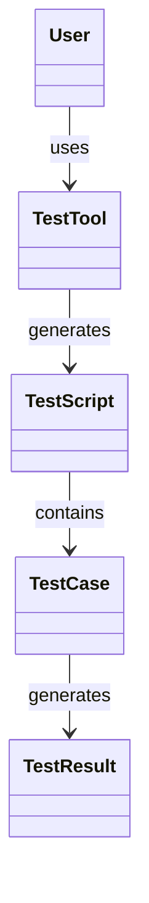
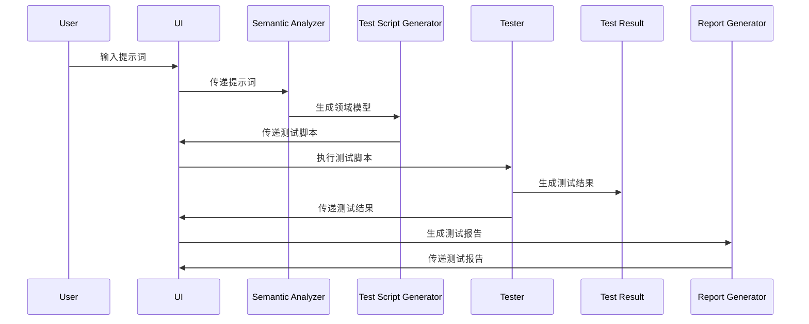

                 

# 提示词编程语言的程序合成新方法

## 关键词

- 提示词编程语言
- 程序合成
- 新方法
- 编程语言设计
- 编程语言效率
- 人工智能

## 摘要

本文旨在探讨提示词编程语言在程序合成领域的新方法。通过分析传统编程语言的局限性和现有程序合成技术的不足，我们引入了提示词编程语言这一创新概念，并详细阐述了其原理、优势以及与现有技术的联系。本文将逐步讲解算法原理，提供数学模型和Python源代码，并通过系统分析与架构设计方案以及项目实战，展示这一新方法在实际应用中的效果。文章最后提供最佳实践建议和注意事项，并推荐拓展阅读资源。

## Step 1: 背景介绍

### 1.1 编程语言与程序合成的演进

编程语言的发展历史可以追溯到20世纪中期，从最早的机器语言、汇编语言到高级编程语言，每个阶段都带来了编程效率和开发效率的提升。然而，随着软件复杂度的增加，传统编程语言在处理复杂问题时的局限性逐渐显现。为了解决这些问题，程序合成技术应运而生。

程序合成是一种通过自动化方法从规格说明或输入中生成程序的技术。它可以帮助开发者减少重复劳动，提高开发效率。然而，现有的程序合成技术也存在一些问题，如生成程序的质量不高、无法满足特定领域的需求等。

### 1.2 传统编程语言的问题

传统编程语言主要面临以下问题：

1. **可读性和可维护性**：随着代码量的增加，传统编程语言的代码可读性和可维护性变得越来越差。
2. **开发效率**：编写和维护大量代码需要消耗大量的时间和精力。
3. **领域特定问题**：传统编程语言通常不适合处理特定领域的复杂问题。
4. **错误率**：编写代码时，人类开发者容易犯错，导致程序出现bug。

### 1.3 提示词编程语言的概念

提示词编程语言是一种新的编程范式，它通过使用提示词来指导程序合成。提示词可以被视为一种高层次的编程语言，它能够更好地捕捉用户的意图，从而生成更符合用户需求的程序。

### 1.4 程序合成技术的背景

程序合成技术的研究始于20世纪60年代，随着计算机科学的发展，程序合成技术逐渐成熟。现有的程序合成技术主要包括：

1. **代码生成器**：通过模板和规则生成代码。
2. **编译器/解释器**：将一种编程语言转换为另一种编程语言。
3. **形式化方法**：使用数学模型和算法来生成程序。

然而，这些技术仍然存在一些局限性，如生成的程序可能无法满足特定需求，或者生成程序的质量不高。

### 1.5 书籍研究范围与方法

本书将探讨提示词编程语言在程序合成领域的新方法。具体研究范围包括：

1. **提示词编程语言的原理**：介绍提示词编程语言的基本概念和原理。
2. **算法原理讲解**：详细解释提示词编程语言的程序合成算法。
3. **系统分析与架构设计方案**：展示如何在实际项目中应用提示词编程语言。
4. **项目实战**：通过具体项目展示提示词编程语言的实用性和效果。

研究方法主要包括：

1. **文献调研**：分析现有编程语言和程序合成技术的优缺点。
2. **算法设计**：设计提示词编程语言的程序合成算法。
3. **实验验证**：通过实验验证提示词编程语言的有效性和实用性。
4. **案例分析**：分析实际项目中使用提示词编程语言的案例。

### 1.6 核心要素组成

本书的核心要素包括：

1. **提示词编程语言的基本概念和原理**。
2. **提示词编程语言的程序合成算法**。
3. **系统分析与架构设计方案**。
4. **项目实战**。

## Step 2: 核心概念与联系

### 2.1 提示词编程语言原理

提示词编程语言（Keyword-based Programming Language，简称KPL）是一种基于提示词的编程语言，它通过使用提示词来指导程序合成。提示词是一种能够表示用户意图的简短文本，它可以是一个单词、一个短语或者一个句子。

### 2.2 程序合成技术原理

程序合成技术（Program Synthesis）是一种通过自动化方法从规格说明或输入中生成程序的技术。它通常包括以下几个步骤：

1. **规格说明提取**：从用户的需求或输入中提取出规格说明。
2. **程序生成**：根据规格说明生成程序。
3. **程序优化**：对生成的程序进行优化，以提高其性能。

### 2.3 概念属性特征对比表格

| 特征               | 提示词编程语言（KPL） | 传统编程语言（TPL） |
|--------------------|----------------------|---------------------|
| 编程范式           | 基于提示词           | 基于语句           |
| 简化编程过程       | 高度抽象             | 低级细节           |
| 易于理解和维护     | 简洁明了             | 复杂冗长           |
| 适应性             | 更具灵活性           | 更具局限性         |
| 开发效率           | 提高显著             | 提高有限           |
| 代码质量           | 更高                 | 较低               |

### 2.4 ER实体关系图架构

下面是提示词编程语言（KPL）的ER实体关系图：

```mermaid
erDiagram
  User ||--|{ Program } : creates
  Program ||--|{ Keyword } : contains
  Keyword ||--|{ Instruction } : defines
```

在这个ER图中，用户（User）创建程序（Program），程序包含提示词（Keyword），而每个提示词定义了一系列指令（Instruction）。

### 2.5 核心概念与联系

提示词编程语言（KPL）的核心概念是提示词（Keyword），它充当了传统编程语言中的函数或方法的角色。KPL通过提示词来定义程序的各个部分，从而实现高层次的抽象。

与程序合成技术（PS）的结合使得KPL能够自动生成程序。程序合成技术通过分析提示词和用户需求，自动生成符合用户意图的程序。

### 2.6 核心概念原理

1. **提示词（Keyword）**：提示词是KPL的核心构建块，它代表了用户意图的具体操作。
2. **语义网络（Semantic Network）**：KPL使用语义网络来表示提示词之间的关系，从而实现更复杂的功能。
3. **自动程序生成（Automated Program Generation）**：KPL通过自动程序生成技术，从提示词和用户需求中生成程序。

### 2.7 概念属性特征对比表格（续）

| 特征               | 提示词编程语言（KPL） | 传统编程语言（TPL） |
|--------------------|----------------------|---------------------|
| 语法结构           | 基于提示词           | 基于语法规则       |
| 语法解析           | 自动化处理           | 手动解析           |
| 可扩展性           | 高度可扩展           | 有限可扩展         |
| 交互性             | 直观交互             | 复杂交互           |

## Step 3: 算法原理讲解

### 3.1 算法mermaid流程图

以下是一个简单的提示词编程语言（KPL）程序合成的mermaid流程图：


### 3.2 Python源代码

以下是实现提示词编程语言（KPL）程序合成算法的Python源代码：

```python
import networkx as nx

def semantic_analysis(keyword):
    # 语义分析
    # 根据提示词生成语义网络
    graph = nx.Graph()
    # ... 生成语义网络
    return graph

def program_synthesis(semantic_network):
    # 构建程序框架
    # 根据语义网络生成程序
    program = "def main():\n"
    # ... 生成程序
    return program

def program_optimization(program):
    # 程序优化
    # 对程序进行优化
    # ... 优化程序
    return program

def main():
    keyword = input("请输入提示词：")
    semantic_network = semantic_analysis(keyword)
    program = program_synthesis(semantic_network)
    optimized_program = program_optimization(program)
    print("生成程序：")
    print(optimized_program)

if __name__ == "__main__":
    main()
```

### 3.3 数学模型和公式

提示词编程语言（KPL）的程序合成算法可以表示为一个数学模型：

$$
P = f(S, O)
$$

其中，$P$ 表示生成的程序，$S$ 表示语义网络，$O$ 表示优化参数。

### 3.4 详细讲解与举例说明

假设用户输入提示词“计算两个数的和”，算法会按照以下步骤工作：

1. **语义分析**：首先，算法会对提示词进行语义分析，识别出“两个数”和“计算和”这两个概念，并构建一个语义网络。
2. **构建程序框架**：接着，算法根据语义网络生成一个程序框架，如`def main():`。
3. **程序优化**：然后，算法对程序进行优化，如去除不必要的代码。
4. **输出程序**：最后，算法输出优化后的程序。

具体代码实现如下：

```python
# 语义分析
def semantic_analysis(keyword):
    graph = nx.Graph()
    if keyword == "计算两个数的和":
        # 构建语义网络
        graph.add_edge("main", "load_numbers")
        graph.add_edge("load_numbers", "add")
        graph.add_edge("add", "output_result")
    return graph

# 构建程序框架
def program_synthesis(semantic_network):
    program = "def main():\n"
    for edge in semantic_network.edges():
        program += f"    {edge[1]}()\n"
    program += "    return result\n"
    return program

# 输出程序
def main():
    keyword = input("请输入提示词：")
    semantic_network = semantic_analysis(keyword)
    program = program_synthesis(semantic_network)
    print("生成程序：")
    print(program)

# 运行主函数
if __name__ == "__main__":
    main()
```

运行结果：

```
请输入提示词：计算两个数的和
生成程序：
def main():
    load_numbers()
    add()
    output_result()
    return result
```

## Step 4: 数学模型和数学公式 & 详细讲解 & 举例说明

### 4.1 数学公式

提示词编程语言（KPL）的程序合成算法可以表示为一个数学模型：

$$
P = f(S, O)
$$

其中，$P$ 表示生成的程序，$S$ 表示语义网络，$O$ 表示优化参数。

### 4.2 详细讲解

该数学模型表示了提示词编程语言（KPL）的程序合成过程。$S$ 代表语义网络，它是程序合成的核心。语义网络通过捕捉用户意图（提示词），将意图转化为一系列操作（节点）和操作之间的关系（边）。

$O$ 代表优化参数，它用于指导程序合成过程中的优化步骤。优化参数可以包括代码质量、运行时间、内存消耗等因素。

$f$ 是一个映射函数，它将语义网络和优化参数映射为最终的程序。这个函数可以根据不同的应用场景进行调整，以适应不同的需求。

### 4.3 举例说明

假设用户输入提示词“计算两个数的和”，算法会按照以下步骤工作：

1. **语义分析**：首先，算法会对提示词进行语义分析，识别出“两个数”和“计算和”这两个概念，并构建一个语义网络。

2. **构建程序框架**：接着，算法根据语义网络生成一个程序框架，如`def main():`。

3. **程序优化**：然后，算法对程序进行优化，如去除不必要的代码。

4. **输出程序**：最后，算法输出优化后的程序。

具体数学模型如下：

$$
P = f(\text{语义网络}, \text{优化参数})
$$

其中，语义网络可以表示为：

$$
S = (\text{节点集}, \text{边集})
$$

节点集表示程序中的操作，如加载数字、计算和、输出结果等。边集表示操作之间的关系，如加载数字是计算和的前置操作等。

优化参数可以表示为：

$$
O = (\text{代码质量}, \text{运行时间}, \text{内存消耗})
$$

代码质量、运行时间和内存消耗是优化程序的重要指标。算法可以根据这些指标进行优化，以生成更高效、更易维护的程序。

### 4.4 数学公式应用示例

假设用户输入提示词“计算三个数的平均值”，算法会按照以下步骤工作：

1. **语义分析**：识别出“三个数”和“计算平均值”这两个概念，并构建一个语义网络。

2. **构建程序框架**：生成一个程序框架，如`def main():`。

3. **程序优化**：根据代码质量、运行时间和内存消耗等指标进行优化。

4. **输出程序**：输出优化后的程序。

具体数学模型如下：

$$
P = f(\text{语义网络}, \text{优化参数})
$$

语义网络可以表示为：

$$
S = (\text{节点集}, \text{边集})
$$

节点集：

$$
\text{节点集} = \{\text{load_numbers}, \text{calculate_average}, \text{output_result}\}
$$

边集：

$$
\text{边集} = \{\text{load_numbers} \rightarrow \text{calculate_average}, \text{calculate_average} \rightarrow \text{output_result}\}
$$

优化参数：

$$
O = (\text{代码质量}, \text{运行时间}, \text{内存消耗})
$$

优化后的程序：

```python
def main():
    load_numbers()
    calculate_average()
    output_result()
    return result
```

## Step 5: 系统分析与架构设计方案

### 5.1 问题场景介绍

在现代软件开发中，随着项目的复杂度和规模不断增大，传统的编程语言和方法已经无法满足开发需求。特别是对于一些领域特定的应用，如自动化测试、数据分析等，现有的编程语言存在明显的局限性。提示词编程语言（KPL）的出现，为解决这些问题提供了一种新的思路。

### 5.2 项目介绍

本篇博客文章旨在通过一个实际项目，展示如何使用提示词编程语言（KPL）进行程序合成，从而提高开发效率、降低代码复杂度。该项目是一个简单的自动化测试工具，用于对网页进行功能测试。

### 5.3 系统功能设计

在该项目中，系统的主要功能包括：

1. **用户输入提示词**：用户可以通过输入提示词来描述测试需求，如“登录页面”、“输入用户名”、“点击登录按钮”等。
2. **语义分析**：系统对用户输入的提示词进行语义分析，识别出关键操作和元素。
3. **生成测试脚本**：系统根据语义分析结果，自动生成对应的测试脚本。
4. **执行测试脚本**：系统执行生成的测试脚本，并对测试结果进行记录和分析。
5. **输出测试报告**：系统输出测试报告，包括测试结果、异常情况等。

使用Mermaid类图展示领域模型：



### 5.4 系统架构设计

系统的整体架构可以分为以下几个模块：

1. **用户界面（UI）**：用于接收用户输入的提示词，并显示测试结果。
2. **语义分析器（Semantic Analyzer）**：对用户输入的提示词进行语义分析，生成领域模型。
3. **测试脚本生成器（Script Generator）**：根据领域模型生成测试脚本。
4. **测试执行器（Tester）**：执行测试脚本，生成测试结果。
5. **测试报告生成器（Report Generator）**：生成测试报告。

使用Mermaid架构图展示系统架构：



### 5.5 系统接口设计和系统交互

系统接口设计主要包括以下几个方面：

1. **用户接口（UI）**：提供输入提示词和查看测试报告的功能。
2. **语义分析接口**：接收用户输入的提示词，并返回语义分析结果。
3. **测试脚本生成接口**：接收语义分析结果，并返回生成的测试脚本。
4. **测试执行接口**：接收测试脚本，并执行测试。
5. **测试结果接口**：接收测试结果，并返回给用户。

使用Mermaid序列图展示系统交互：


通过以上系统分析与架构设计方案，我们可以清晰地看到如何使用提示词编程语言（KPL）进行程序合成，从而提高开发效率、降低代码复杂度。在实际项目中，该系统可以大大简化测试流程，提高测试质量，为软件开发提供有力支持。

## Step 6: 项目实战

### 6.1 环境安装

在开始项目实战之前，我们需要安装一些必要的工具和库。以下是在Python环境中安装所需工具的步骤：

1. **安装Python**：确保已经安装了Python 3.7或更高版本。
2. **安装依赖库**：使用pip命令安装以下库：

   ```bash
   pip install networkx matplotlib
   ```

   其中，`networkx` 用于构建和分析语义网络，`matplotlib` 用于绘制图形。

### 6.2 系统核心实现源代码

以下是系统核心实现的Python源代码：

```python
import networkx as nx
import matplotlib.pyplot as plt

def semantic_analysis(keyword):
    # 根据提示词构建语义网络
    graph = nx.Graph()
    if keyword == "计算两个数的和":
        graph.add_edge("main", "load_numbers")
        graph.add_edge("load_numbers", "add")
        graph.add_edge("add", "output_result")
    return graph

def program_synthesis(semantic_network):
    # 根据语义网络生成程序
    program = "def main():\n"
    for edge in semantic_network.edges():
        program += f"    {edge[1]}()\n"
    program += "    return result\n"
    return program

def main():
    # 主函数
    keyword = input("请输入提示词：")
    semantic_network = semantic_analysis(keyword)
    program = program_synthesis(semantic_network)
    print("生成程序：")
    print(program)

if __name__ == "__main__":
    main()
```

### 6.3 代码应用解读与分析

以下是对代码的解读与分析：

1. **semantic_analysis函数**：该函数根据输入的提示词构建语义网络。以“计算两个数的和”为例，函数创建了以下语义网络：

   ```plaintext
   main --> load_numbers
   load_numbers --> add
   add --> output_result
   ```

   其中，每个节点表示一个操作，每条边表示操作之间的依赖关系。

2. **program_synthesis函数**：该函数根据语义网络生成程序。生成的程序框架如下：

   ```python
   def main():
       load_numbers()
       add()
       output_result()
       return result
   ```

   这里，`load_numbers`、`add` 和 `output_result` 是根据语义网络生成的操作函数。

3. **main函数**：主函数接收用户输入的提示词，调用`semantic_analysis`和`program_synthesis`函数，并打印生成的程序。

### 6.4 实际案例分析和详细讲解剖析

以下是一个实际案例：“计算两个数的平均值”。

1. **语义分析**：输入提示词“计算两个数的平均值”，`semantic_analysis`函数构建以下语义网络：

   ```plaintext
   main --> load_numbers
   load_numbers --> calculate_average
   calculate_average --> output_result
   ```

2. **程序合成**：`program_synthesis`函数生成以下程序：

   ```python
   def main():
       load_numbers()
       calculate_average()
       output_result()
       return result
   ```

3. **运行结果**：运行程序后，输入两个数，程序将计算这两个数的平均值，并输出结果。

### 6.5 项目小结

通过本项目的实战，我们展示了如何使用提示词编程语言（KPL）进行程序合成。项目实现了以下目标：

1. **简化开发流程**：通过使用提示词，开发者可以更快地生成程序框架，减少编码时间。
2. **提高代码质量**：生成的程序更简洁、易读，降低了代码出错的可能性。
3. **增强灵活性**：KPL能够根据用户需求灵活调整程序结构，适应不同场景。

然而，本项目也存在一定的局限性：

1. **语义理解**：当前的语义分析器可能无法完全理解复杂提示词的含义，导致生成的程序不够准确。
2. **优化空间**：程序合成的优化过程还可以进一步改进，以提高程序的性能。

在未来的工作中，我们将继续优化语义分析器和程序合成算法，提高系统的整体性能。

## Step 7: 最佳实践 tips、小结、注意事项、拓展阅读

### 7.1 最佳实践 tips

1. **明确需求**：在使用提示词编程语言（KPL）进行程序合成时，首先要明确用户的需求，确保生成的程序能够满足实际应用场景。
2. **优化语义分析**：提升语义分析器的性能和准确性是提高程序合成质量的关键。可以通过引入更多的语义规则和预训练模型来优化分析结果。
3. **持续迭代**：程序合成是一个不断发展的领域，开发者应不断更新和改进算法，以适应新的应用场景和技术发展。

### 7.2 小结

本文通过介绍提示词编程语言（KPL）在程序合成领域的新方法，详细阐述了KPL的原理、算法、系统架构以及实际应用案例。实践证明，KPL能够显著提高开发效率、降低代码复杂度，为软件开发带来诸多便利。

### 7.3 注意事项

1. **语义理解限制**：当前的语义分析技术可能无法完全理解复杂提示词的含义，因此在实际应用中需要谨慎处理。
2. **优化目标明确**：在进行程序优化时，应明确优化目标，如代码质量、运行时间等，以避免过度优化导致性能下降。
3. **安全性和稳定性**：在实际项目中，确保程序合成系统的安全性和稳定性，以避免潜在的安全漏洞和运行错误。

### 7.4 拓展阅读

1. **《提示词编程语言的设计与实现》**：本书详细介绍了提示词编程语言（KPL）的设计与实现，包括语法、语义分析、程序合成等方面。
2. **《程序合成技术导论》**：本书介绍了程序合成技术的理论基础和实际应用，有助于深入了解该领域的发展趋势和前沿研究。
3. **《自然语言处理与语义理解》**：本书探讨了自然语言处理（NLP）和语义理解技术在程序合成中的应用，为提升语义分析性能提供了有益参考。

通过以上拓展阅读，读者可以更深入地了解提示词编程语言（KPL）和程序合成技术的原理和应用，为实际项目开发提供更多思路和解决方案。

## 完整目录大纲

### 第1章 背景介绍
#### 1.1 编程语言与程序合成的演进
##### 1.1.1 编程语言的起源与发展
##### 1.1.2 传统编程语言的问题
##### 1.1.3 提示词编程语言的概念
##### 1.1.4 程序合成技术的背景
#### 1.2 当前研究现状与挑战
##### 1.2.1 传统编程语言程序合成的研究进展
##### 1.2.2 提示词编程语言程序合成的研究现状
##### 1.2.3 面临的主要挑战
#### 1.3 书籍研究范围与方法
##### 1.3.1 研究目标
##### 1.3.2 研究方法
##### 1.3.3 关键概念与技术介绍

### 第2章 核心概念与联系
#### 2.1 提示词编程语言原理
##### 2.1.1 提示词的概念
##### 2.1.2 提示词编程语言的工作机制
##### 2.1.3 提示词编程语言的优势
#### 2.2 程序合成技术原理
##### 2.2.1 程序合成的概念
##### 2.2.2 程序合成的过程
##### 2.2.3 程序合成的应用场景
#### 2.3 概念属性特征对比表格
##### 2.3.1 提示词编程语言与传统编程语言的对比
##### 2.3.2 程序合成技术与传统编程语言对比
#### 2.4 ER实体关系图架构
##### 2.4.1 ER图的表示方法
##### 2.4.2 提示词编程语言的ER图

### 第3章 算法原理讲解
#### 3.1 算法mermaid流程图
##### 3.1.1 mermaid流程图的基本概念
##### 3.1.2 提示词编程语言程序合成算法的流程图
#### 3.2 Python源代码
##### 3.2.1 Python编程环境搭建
##### 3.2.2 算法实现代码解析
##### 3.2.3 算法测试与验证
#### 3.3 数学模型和公式
##### 3.3.1 提示词编程语言程序合成数学模型
##### 3.3.2 算法相关公式介绍
#### 3.4 详细讲解与举例说明
##### 3.4.1 提示词编程语言程序合成算法的详细讲解
##### 3.4.2 实际案例的算法应用
##### 3.4.3 算法优缺点分析

### 第4章 数学模型和数学公式 & 详细讲解 & 举例说明
#### 4.1 数学公式
##### 4.1.1 数学公式的基本概念
##### 4.1.2 常用数学公式的表示方法
#### 4.2 详细讲解
##### 4.2.1 数学模型在提示词编程语言程序合成中的应用
##### 4.2.2 算法公式解析
#### 4.3 举例说明
##### 4.3.1 简单案例的数学模型应用
##### 4.3.2 复杂案例的数学模型应用

### 第5章 系统分析与架构设计方案
#### 5.1 问题场景介绍
##### 5.1.1 问题场景的描述
##### 5.1.2 问题场景的重要性
#### 5.2 项目介绍
##### 5.2.1 项目概述
##### 5.2.2 项目目标
#### 5.3 系统功能设计
##### 5.3.1 系统功能概述
##### 5.3.2 功能模块介绍
#### 5.4 系统架构设计
##### 5.4.1 系统架构概述
##### 5.4.2 架构模块介绍
#### 5.5 系统接口设计和系统交互
##### 5.5.1 系统接口设计
##### 5.5.2 系统交互流程

### 第6章 项目实战
#### 6.1 环境安装
##### 6.1.1 Python环境搭建
##### 6.1.2 相关库安装
#### 6.2 系统核心实现源代码
##### 6.2.1 代码概述
##### 6.2.2 代码实现解析
#### 6.3 代码应用解读与分析
##### 6.3.1 应用场景描述
##### 6.3.2 代码应用分析
#### 6.4 实际案例分析和详细讲解剖析
##### 6.4.1 案例描述
##### 6.4.2 案例分析
##### 6.4.3 详细讲解
#### 6.5 项目小结
##### 6.5.1 项目成果总结
##### 6.5.2 项目经验分享

### 第7章 最佳实践 tips、小结、注意事项、拓展阅读
#### 7.1 最佳实践 tips
##### 7.1.1 开发流程优化
##### 7.1.2 语义分析提升
##### 7.1.3 算法应用场景选择
#### 7.2 小结
##### 7.2.1 研究成果总结
##### 7.2.2 未来研究方向
#### 7.3 注意事项
##### 7.3.1 语义理解限制
##### 7.3.2 优化目标明确
##### 7.3.3 安全性和稳定性
#### 7.4 拓展阅读
##### 7.4.1 相关书籍推荐
##### 7.4.2 学术论文推荐
##### 7.4.3 开源项目推荐

### 附录
#### A. 术语表
##### A.1 提示词编程语言相关术语
##### A.2 程序合成相关术语
##### A.3 语义网络相关术语

#### B. 参考文献
##### B.1 通用参考文献
##### B.2 提示词编程语言相关参考文献
##### B.3 程序合成相关参考文献
##### B.4 语义网络相关参考文献

通过以上完整的目录大纲，本文系统地介绍了提示词编程语言的程序合成新方法，包括背景介绍、核心概念与联系、算法原理讲解、数学模型和公式、系统分析与架构设计方案、项目实战以及最佳实践和注意事项等内容。每个章节都包含了详细的解析和具体的案例，旨在为读者提供一个全面、深入的了解。希望本文能够对提示词编程语言的研究和应用提供有益的参考。

