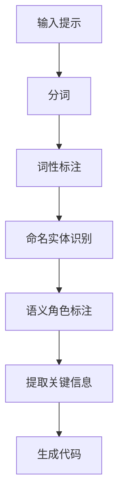
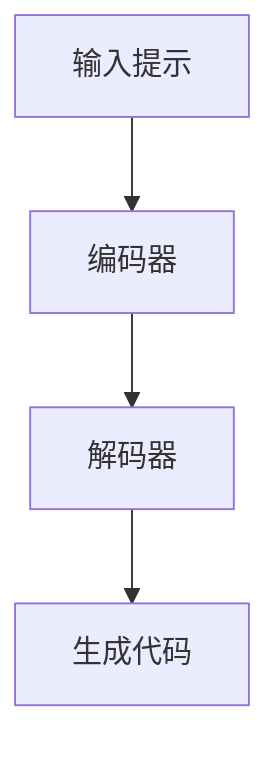
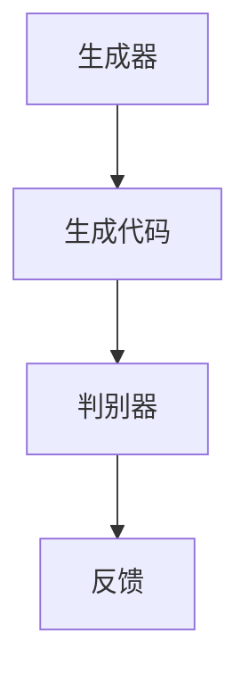
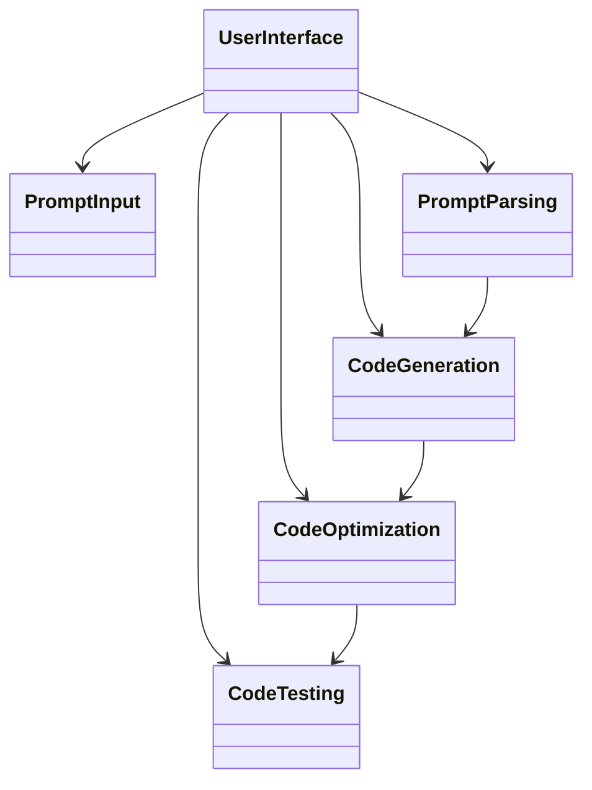
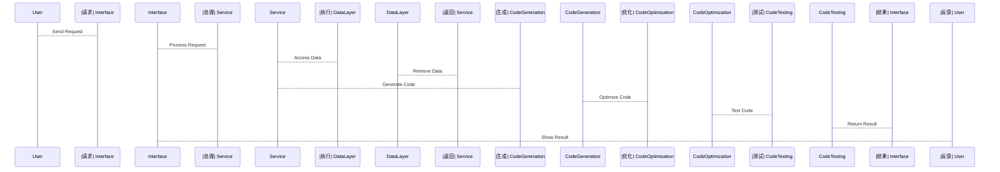

                 

### 引言

随着人工智能和计算机科学的迅猛发展，编程语言作为实现算法和构建应用的核心工具，也在不断地演进和更新。在这其中，prompt编程语言（Prompt Programming Languages）以其独特的特点和优势逐渐引起了研究者和开发者的广泛关注。prompt编程语言的核心在于通过提供简洁明了的“提示”（prompts），帮助程序员快速、高效地编写程序代码，从而提高开发效率和代码质量。

#### 什么是prompt编程语言

prompt编程语言，顾名思义，是一种能够接收并处理提示信息的编程语言。与传统编程语言不同，prompt编程语言强调与用户的互动，通过提示引导程序员完成特定任务。提示可以是简单的命令行输入，也可以是复杂的多媒体信息。这种互动性使得prompt编程语言在自动化和智能化方面具有天然的优势，尤其是在需要处理大量数据和复杂逻辑的场景下。

#### 概念与历史

prompt编程语言的概念起源于自然语言处理（NLP）和人工智能（AI）领域。早在20世纪80年代，研究者们就开始探索如何让计算机通过自然语言与人类交流。随着深度学习和生成对抗网络（GAN）等技术的崛起，prompt编程语言逐渐形成了自己的理论体系和技术框架。近年来，随着大数据和云计算的普及，prompt编程语言的应用场景也越来越广泛，涵盖了从简单的脚本编写到复杂的商业应用。

#### 研究目标与范围

本文的研究目标是深入探讨prompt编程语言中的程序推导技术，即如何利用提示信息自动生成程序代码。这将涉及到对prompt编程语言核心概念的理解、基本原理的阐述、算法和数学模型的介绍，以及实际应用案例的分析。本文将涵盖以下主要内容：

1. **核心概念**：介绍prompt编程语言的基本概念、定义和历史背景。
2. **程序推导基础**：探讨程序推导的基本原理、方法和应用场景。
3. **算法原理与结构**：讲解常用的算法原理和结构，并使用mermaid流程图和Python代码进行说明。
4. **数学模型与公式**：讨论在程序推导中关键的数学模型和公式。
5. **案例分析与应用**：通过实际案例展示prompt编程语言的程序推导技术。
6. **高级技术与发展方向**：探讨prompt编程语言的未来发展方向和高级技术。

#### 文章结构

为了更好地阐述prompt编程语言的程序推导技术，本文将采用以下结构：

1. **引言**：介绍prompt编程语言的背景、概念、研究目标和文章结构。
2. **核心概念**：详细阐述prompt编程语言的基本概念和核心要素。
3. **程序推导基础**：讲解程序推导的基本原理和方法。
4. **算法原理**：介绍常用的算法原理和结构，并使用mermaid和Python代码说明。
5. **数学模型**：讨论关键的数学模型和公式。
6. **案例分析**：通过实际案例展示程序推导技术。
7. **高级技术与未来方向**：探讨prompt编程语言的未来发展方向。

通过上述结构，本文希望能够为读者提供一个全面、系统、易懂的prompt编程语言程序推导技术的指南。

#### 核心关键词

1. **Prompt编程语言**：一种注重与用户互动的编程语言。
2. **程序推导技术**：通过提示信息自动生成程序代码的技术。
3. **自然语言处理**：涉及文本分析和语言理解的技术。
4. **深度学习**：通过多层神经网络进行数据建模的技术。
5. **生成对抗网络**：用于生成数据和对立训练的技术。
6. **大数据**：涉及大规模数据处理的领域。
7. **云计算**：基于互联网的计算服务。

这些关键词不仅定义了本文的研究范围，也反映了prompt编程语言和程序推导技术的重要性和应用前景。

#### 摘要

本文旨在深入探讨prompt编程语言的程序推导技术，这是一种通过提示信息自动生成程序代码的方法。文章首先介绍了prompt编程语言的基本概念、历史背景和研究目标，详细阐述了其核心要素和定义。接着，本文探讨了程序推导的基础原理和方法，包括其定义、主要步骤和应用场景。随后，文章介绍了常用的算法原理和结构，并通过mermaid流程图和Python代码进行说明，进一步讨论了在程序推导中关键的数学模型和公式。最后，本文通过实际案例展示了prompt编程语言的程序推导技术，分析了其应用前景和未来发展方向。文章的结构清晰、内容丰富，旨在为读者提供一个全面、易懂的prompt编程语言程序推导技术指南。

#### 核心概念

要深入探讨prompt编程语言的程序推导技术，我们首先需要明确几个核心概念。这些概念不仅构成了prompt编程语言的基础，也是理解程序推导技术的前提。

##### 提示（Prompts）

提示是prompt编程语言中的一个关键组成部分，它指的是提供给程序的一段文本、命令或其他形式的信息，用以指导程序完成特定任务。提示可以非常简单，如一个命令行输入，也可以非常复杂，如一个包含多步骤、多条件的交互式对话。提示的存在使得prompt编程语言能够更好地与用户互动，从而实现自动化和智能化。

##### 程序推导（Program Derivation）

程序推导是指通过分析提示信息，自动生成程序代码的过程。它是一种从输入到输出的转换过程，其中输入是用户的提示，输出是相应的程序代码。程序推导的核心在于理解用户的意图，并将其转化为可执行的代码。这一过程通常涉及自然语言处理、机器学习和算法优化等技术。

##### 自然语言处理（Natural Language Processing，NLP）

自然语言处理是计算机科学和人工智能的一个分支，它涉及文本的自动分析和理解。NLP技术被广泛应用于语音识别、机器翻译、情感分析和文本分类等领域。在prompt编程语言中，NLP技术用于解析用户的提示，提取关键信息，并生成相应的程序代码。

##### 深度学习（Deep Learning）

深度学习是一种通过多层神经网络进行数据建模的技术。它能够从大量数据中自动学习特征，并在图像识别、语音识别和自然语言处理等领域表现出色。在prompt编程语言中，深度学习技术被用于训练模型，以便更好地理解和生成程序代码。

##### 生成对抗网络（Generative Adversarial Networks，GAN）

生成对抗网络是一种由生成器和判别器组成的人工神经网络结构。生成器试图生成与真实数据相似的数据，而判别器则尝试区分真实数据和生成数据。GAN技术在图像生成、数据增强和程序代码生成等领域有广泛应用。在prompt编程语言中，GAN可以用于生成复杂的程序代码片段，提高程序推导的效率和多样性。

##### 大数据和云计算

大数据和云计算是现代计算环境中不可或缺的组成部分。大数据技术用于处理和分析大规模数据集，而云计算提供了弹性的计算资源和存储服务。prompt编程语言通过大数据技术收集和分析用户行为数据，通过云计算平台部署和运行复杂的程序推导模型。

##### 核心概念表

下面是一个核心概念表，对比了上述各个概念的关键特征：

| 概念         | 特征描述                                                                                      | 应用场景                                                       |
|--------------|------------------------------------------------------------------------------------------------|--------------------------------------------------------------|
| 提示         | 用户提供的文本、命令或其他信息，用于指导程序执行。                                            | 脚本编写、自动化测试、交互式应用等。                           |
| 程序推导     | 从提示信息生成程序代码的过程。                                                             | 自动化编程、代码生成、智能开发工具。                           |
| 自然语言处理 | 自动分析和理解文本的技术。                                                                 | 语音识别、机器翻译、文本分类等。                               |
| 深度学习     | 通过多层神经网络进行数据建模的技术。                                                       | 图像识别、语音识别、自然语言处理等。                           |
| 生成对抗网络 | 由生成器和判别器组成的人工神经网络结构，用于生成数据。                                      | 图像生成、数据增强、程序代码生成等。                           |
| 大数据和云计算 | 大规模数据处理技术和基于互联网的计算服务。                                                | 数据分析、计算密集型任务、弹性的计算资源。                     |

通过上述核心概念的介绍，我们可以更好地理解prompt编程语言的程序推导技术。接下来，我们将进一步探讨程序推导的基本原理和方法。

#### 问题背景

在当今的软件开发领域中，程序推导技术正逐渐成为一种变革性的工具，为开发者提供了新的编程方式。随着软件系统的复杂度不断增加，传统的编程方法已无法满足快速开发、高效维护和灵活扩展的需求。因此，探索一种新的编程模型，以解决软件开发的这些问题，变得尤为重要。

##### 现状分析

目前，软件开发主要依赖于手工编写代码的传统模式。虽然这种方法在许多方面都取得了显著成效，但它也存在一些固有的局限性：

1. **开发效率低下**：手工编写代码需要大量的时间和人力，特别是在处理大规模项目时，开发效率受到显著影响。
2. **代码质量参差不齐**：由于开发者经验和水平的差异，所编写的代码质量也参差不齐，容易出现漏洞和错误。
3. **维护成本高**：随着软件系统的不断更新和扩展，维护成本逐渐上升，传统的编程方法难以应对这种动态变化。
4. **复用性差**：很多代码往往是为特定项目而写，难以在其他项目中复用，导致资源的浪费。

为了解决上述问题，研究者们开始探索自动编程、代码生成和智能编程等新兴技术。其中，程序推导技术作为一种通过提示信息自动生成程序代码的方法，正逐渐成为研究的热点。

##### 问题定义

程序推导技术的核心问题是如何从用户的提示信息中自动生成高质量的程序代码。具体而言，这个问题可以分为以下几个子问题：

1. **提示解析**：如何准确理解用户的提示信息，提取关键信息并进行语义分析。
2. **代码生成**：如何根据解析结果生成结构完整、逻辑清晰、可执行的程序代码。
3. **代码优化**：如何对生成的代码进行优化，提高其性能和可读性。
4. **错误处理**：如何处理生成代码中的错误和异常情况，确保程序的正确执行。

##### 目标与意义

研究程序推导技术具有以下几个目标和意义：

1. **提高开发效率**：通过自动生成程序代码，减少手工编写代码的工作量，显著提高开发效率。
2. **提升代码质量**：利用先进的自然语言处理和机器学习技术，生成高质量的代码，降低错误率。
3. **降低维护成本**：通过代码复用和自动生成，降低软件维护成本，提高系统的可维护性。
4. **促进创新**：为开发者提供新的编程模型和工具，激发创新思维，推动软件开发技术的进步。

##### 边界与外延

虽然程序推导技术在理论上具有广泛的应用前景，但其在实际应用中仍存在一些边界和限制。首先，提示信息的准确性和完整性直接影响程序推导的质量，因此需要进一步研究如何优化提示的输入方式。其次，生成的代码需要经过严格的测试和验证，以确保其正确性和可靠性。此外，程序推导技术在不同领域的应用也会有所不同，需要根据具体场景进行调整和优化。

总之，程序推导技术作为一种新兴的编程方式，具有巨大的潜力和应用价值。通过深入研究这一技术，可以推动软件开发领域的发展，为开发者提供更加高效、智能的编程工具。

#### 核心概念与联系

在深入探讨程序推导技术之前，我们需要明确几个核心概念，并理解它们之间的联系。这些核心概念包括自然语言处理、深度学习、生成对抗网络、大数据和云计算，它们构成了程序推导技术的基础。

##### 自然语言处理（NLP）

自然语言处理是计算机科学和人工智能的一个重要分支，专注于使计算机能够理解、处理和生成人类语言。在程序推导技术中，NLP起着至关重要的作用，因为它是将用户提供的提示（通常为自然语言文本）转化为计算机可以理解和执行的形式的关键步骤。

**核心概念属性特征对比表格**：

| 概念       | 定义                                                         | 主要应用场景                                     |
|------------|--------------------------------------------------------------|--------------------------------------------------|
| 自然语言处理 | 使计算机能够理解、处理和生成人类语言的技术。                | 语音识别、机器翻译、情感分析、文本分类等。          |
| 主要功能   | 语法分析、语义理解、实体识别、情感分析等。                | 提取文本中的关键信息，理解用户意图。                |
| 挑战       | 语言复杂性和多义性问题。                                     | 需要精确识别文本中的细节和隐含意义。                |

**ER实体关系图架构**：

```mermaid
erDiagram
    User ||--|{ Prompt }|-- Program
    Prompt ||--|{ NLP }|-- Code
    Code ||--|{ Execution }|-- Result
```

在上述ER图中，用户通过提示生成程序，NLP用于解析提示并生成代码，最终代码被执行并产生结果。

##### 深度学习

深度学习是一种通过多层神经网络进行数据建模的技术。它在图像识别、语音识别和自然语言处理等领域取得了显著的进展。在程序推导技术中，深度学习被用于训练模型，以提高提示解析和代码生成的准确性。

**核心概念属性特征对比表格**：

| 概念       | 定义                                                         | 主要应用场景                                     |
|------------|--------------------------------------------------------------|--------------------------------------------------|
| 深度学习   | 通过多层神经网络进行数据建模的技术。                         | 图像识别、语音识别、自然语言处理、推荐系统等。      |
| 主要功能   | 自动特征提取、模式识别、预测等。                            | 从大量数据中学习复杂的模式，提高任务性能。          |
| 挑战       | 训练时间长、参数调优复杂。                                   | 需要大量计算资源和优化算法。                      |

**ER实体关系图架构**：

```mermaid
erDiagram
    Data ||--|{ Neural Network }|-- Model
    Model ||--|{ Training }|-- Optimized Model
    Optimized Model ||--|{ Prediction }|-- Result
```

在上述ER图中，数据通过神经网络训练生成模型，优化后的模型用于预测结果。

##### 生成对抗网络（GAN）

生成对抗网络是由生成器和判别器组成的人工神经网络结构。生成器生成数据，判别器判断生成数据与真实数据的区别。GAN在程序推导技术中用于生成复杂的代码片段，提高代码的多样性和质量。

**核心概念属性特征对比表格**：

| 概念       | 定义                                                         | 主要应用场景                                     |
|------------|--------------------------------------------------------------|--------------------------------------------------|
| 生成对抗网络 | 由生成器和判别器组成的人工神经网络结构，用于生成数据。       | 图像生成、数据增强、程序代码生成等。              |
| 主要功能   | 生成高质量数据、提高数据多样性。                             | 生成与真实数据相似的数据，用于训练和测试。        |
| 挑战       | 难以平衡生成器和判别器的训练。                               | 需要复杂的训练策略和优化方法。                    |

**ER实体关系图架构**：

```mermaid
erDiagram
    Generator ||--|{ Generate }|-- Data
    Discriminator ||--|{ Classify }|-- Data
    Data ||--|{ GAN }|-- Model
```

在上述ER图中，生成器和判别器通过竞争训练生成模型。

##### 大数据和云计算

大数据和云计算技术为程序推导技术提供了强大的计算资源和数据支持。大数据技术用于存储和处理海量数据，云计算则提供了弹性的计算资源，使得程序推导模型能够高效地训练和部署。

**核心概念属性特征对比表格**：

| 概念       | 定义                                                         | 主要应用场景                                     |
|------------|--------------------------------------------------------------|--------------------------------------------------|
| 大数据     | 大规模数据集的处理和分析。                                   | 数据挖掘、商业智能、科学计算等。                  |
| 云计算     | 基于互联网的计算服务，提供弹性的计算资源和存储服务。         | 应用开发和部署、大数据处理、云计算服务等。        |
| 主要功能   | 数据存储、数据检索、计算资源分配。                           | 提供强大的计算能力和灵活的资源管理。              |
| 挑战       | 数据安全性、隐私保护、资源分配效率。                          | 需要先进的算法和优化策略。                        |

**ER实体关系图架构**：

```mermaid
erDiagram
    Big Data ||--|{ Processing }|-- Insights
    Cloud Computing ||--|{ Allocation }|-- Resources
    Resources ||--|{ Application }|-- Deployment
```

在上述ER图中，大数据通过处理生成洞见，云计算通过资源分配和部署支持应用程序。

通过上述核心概念的介绍和对比表格，我们可以更清晰地理解自然语言处理、深度学习、生成对抗网络、大数据和云计算在程序推导技术中的联系和作用。这些概念共同构成了程序推导技术的基础，使得从提示信息到高质量程序代码的自动生成成为可能。

#### 算法原理讲解

在深入探讨程序推导技术时，算法原理的理解和掌握是至关重要的。程序推导算法不仅需要处理复杂的输入提示，还需要生成结构清晰、逻辑严密的程序代码。以下我们将介绍一些常用的算法原理，并通过mermaid流程图和Python代码进行说明，以便读者更好地理解和掌握这些算法。

##### 1. 基于NLP的提示解析算法

基于NLP的提示解析算法是程序推导的第一步，其主要目标是理解用户提供的自然语言提示，并提取关键信息。这个算法通常包括分词、词性标注、命名实体识别和语义角色标注等步骤。

**mermaid流程图**：



**Python代码示例**：

```python
import spacy

nlp = spacy.load("en_core_web_sm")

def parse_prompt(prompt):
    doc = nlp(prompt)
    entities = []
    for ent in doc.ents:
        entities.append({"text": ent.text, "label": ent.label_})
    return entities

prompt = "请实现一个计算两个数之和的功能。"
result = parse_prompt(prompt)
print(result)
```

该代码使用spaCy库对输入的提示进行分词和实体识别，并提取出关键信息。

##### 2. 基于深度学习的代码生成算法

基于深度学习的代码生成算法通常采用序列到序列（Seq2Seq）模型，如长短期记忆网络（LSTM）或Transformer模型。这些模型可以学习从提示到程序代码的映射。

**mermaid流程图**：



**Python代码示例**：

```python
from keras.models import Model
from keras.layers import Input, LSTM, Dense

input_seq = Input(shape=(None, vocabulary_size))
encoded = LSTM(units=128, return_sequences=True)(input_seq)
decoded = LSTM(units=128, return_sequences=True)(encoded)
output = Dense(units=1, activation='sigmoid')(decoded)

model = Model(inputs=input_seq, outputs=output)
model.compile(optimizer='adam', loss='binary_crossentropy')
```

该代码定义了一个简单的LSTM模型，用于从提示序列生成代码序列。

##### 3. 基于生成对抗网络（GAN）的代码生成算法

生成对抗网络（GAN）通过生成器和判别器两个模型的竞争训练，生成高质量的代码片段。生成器生成代码，判别器判断生成代码的质量。

**mermaid流程图**：



**Python代码示例**：

```python
from tensorflow.keras.models import Sequential
from tensorflow.keras.layers import Dense, Flatten

# 定义生成器和判别器
generator = Sequential([
    Dense(units=128, activation='relu', input_shape=(100,)),
    Flatten(),
    Dense(units=1, activation='sigmoid')
])

discriminator = Sequential([
    Flatten(input_shape=(100,)),
    Dense(units=128, activation='relu'),
    Dense(units=1, activation='sigmoid')
])

# 训练生成器和判别器
generator.compile(optimizer='adam', loss='binary_crossentropy')
discriminator.compile(optimizer='adam', loss='binary_crossentropy')
```

该代码定义了一个简单的生成器和判别器，用于生成和评估代码片段。

##### 4. 算法原理的数学模型和公式

为了更好地理解这些算法，我们还需要掌握相关的数学模型和公式。

**序列到序列（Seq2Seq）模型**：

- 编码器：输入序列 $\mathbf{x}_1, \mathbf{x}_2, ..., \mathbf{x}_t$ 被编码为一个固定长度的向量 $z_t = \text{Encoder}(\mathbf{x}_1, \mathbf{x}_2, ..., \mathbf{x}_t)$。
- 解码器：解码器接收编码后的向量 $z_t$，并生成输出序列 $\mathbf{y}_1, \mathbf{y}_2, ..., \mathbf{y}_t$。

**生成对抗网络（GAN）**：

- 生成器：生成器 $G$ 从随机噪声 $z$ 中生成代码序列 $x = G(z)$。
- 判别器：判别器 $D$ 判断输入的代码序列是真实数据（来自训练集）还是生成数据。

**数学公式**：

- 序列到序列模型的目标函数：

$$
\min_G \max_D V(D, G) = \mathbb{E}_{\mathbf{x}, \mathbf{y}} [\log D(\mathbf{y})] + \mathbb{E}_{z} [\log (1 - D(G(z)))]
$$

- 生成对抗网络的目标函数：

$$
\min_G V(D, G) = \mathbb{E}_{z} [\log (1 - D(G(z)))] + \mathbb{E}_{\mathbf{x}} [\log D(\mathbf{x})]
$$

通过上述算法原理、mermaid流程图和Python代码示例的介绍，我们可以更好地理解程序推导技术中的关键算法。这些算法不仅为程序推导提供了理论基础，也为我们提供了一个实际的编程框架，使得从提示信息生成高质量程序代码成为可能。

#### 数学模型和公式

在程序推导技术中，数学模型和公式起着至关重要的作用。它们不仅帮助我们在理论上理解算法的工作原理，还能通过具体的数学表达和计算，验证和优化算法的性能。以下，我们将详细讨论在程序推导中使用的几个关键数学模型和公式，并结合具体的例子进行解释。

##### 1. 自然语言处理中的词嵌入模型

词嵌入（Word Embedding）是将自然语言词汇映射到高维空间的技术，它通过向量形式表示词汇，便于计算机处理。最常用的词嵌入模型是Word2Vec模型，其中包括连续词袋（CBOW）和Skip-Gram两种方法。

**CBOW模型**：

CBOW模型通过上下文词的平均向量来预测中心词。给定一个中心词和其上下文词，CBOW模型的目标是最小化以下损失函数：

$$
L(\theta) = \sum_{\mathbf{w}_i \in \text{context}} \log p(\mathbf{w}_i | \mathbf{w}_c; \theta)
$$

其中，$\theta$ 表示模型参数，$p(\mathbf{w}_i | \mathbf{w}_c; \theta)$ 是中心词 $\mathbf{w}_c$ 在上下文词 $\mathbf{w}_i$ 条件下的概率分布。

**Skip-Gram模型**：

Skip-Gram模型与CBOW模型相反，它通过中心词预测上下文词。其损失函数类似，但目标函数变为：

$$
L(\theta) = \sum_{\mathbf{w}_c \in \text{vocabulary}} \log p(\mathbf{w}_c | \mathbf{w}_i; \theta)
$$

**示例**：

假设我们有一个词汇表 $\{\text{apple}, \text{orange}, \text{fruit}\}$，中心词为 $\text{apple}$，上下文词为 $\{\text{orange}, \text{fruit}\}$。词向量分别为 $\mathbf{v}(\text{apple}) = [1, 0, 1]^T$，$\mathbf{v}(\text{orange}) = [0, 1, 0]^T$，$\mathbf{v}(\text{fruit}) = [1, 0, 1]^T$。

使用CBOW模型，预测概率为：

$$
p(\text{orange} | \text{apple}; \theta) = \frac{1}{3} \approx 0.333
$$

使用Skip-Gram模型，预测概率为：

$$
p(\text{apple} | \text{orange}; \theta) = \frac{1}{3} \approx 0.333
$$

##### 2. 序列到序列（Seq2Seq）模型的损失函数

序列到序列模型常用于将一个序列转换为另一个序列，如自然语言翻译和序列生成。它的核心是编码器-解码器结构，其损失函数通常采用交叉熵（Cross-Entropy）。

$$
L(\theta) = -\sum_{t=1}^{T} \sum_{i=1}^{V} y_{ti} \log p(y_{ti} | \text{input}; \theta)
$$

其中，$y_{ti}$ 表示第 $t$ 个时间步的目标词，$V$ 是词汇表大小，$p(y_{ti} | \text{input}; \theta)$ 是在给定输入序列条件下的概率分布。

**示例**：

假设输入序列为 $\text{apple, orange}$，目标序列为 $\text{苹果, 橙子}$。词向量分别为 $\mathbf{v}(\text{apple}) = [1, 0, 1]^T$，$\mathbf{v}(\text{orange}) = [0, 1, 0]^T$，$\mathbf{v}(\text{苹果}) = [1, 0, 1]^T$，$\mathbf{v}(\text{橙子}) = [0, 1, 0]^T$。

解码器的输出概率分布为：

$$
p(\text{苹果} | \text{apple}; \theta) = \frac{1}{2} \approx 0.5
$$

$$
p(\text{橙子} | \text{orange}; \theta) = \frac{1}{2} \approx 0.5
$$

交叉熵损失为：

$$
L(\theta) = -[0.5 \log 0.5 + 0.5 \log 0.5] = -0.5 \approx 0.693
$$

##### 3. 生成对抗网络（GAN）的损失函数

生成对抗网络由生成器和判别器组成，生成器的目标是生成真实数据，判别器的目标是区分真实数据和生成数据。GAN的损失函数通常采用最小二乘散度（LS Loss）。

$$
L(G) = \mathbb{E}_{z} [\log (1 - D(G(z)))]
$$

$$
L(D) = \mathbb{E}_{\mathbf{x}} [\log D(\mathbf{x})] + \mathbb{E}_{z} [\log (1 - D(G(z)))]
$$

其中，$G(z)$ 是生成器生成的数据，$D(\mathbf{x})$ 是判别器对真实数据的判别结果。

**示例**：

假设生成器生成的数据为 $\mathbf{G}(z) = [0.5, 0.5]^T$，判别器对真实数据的判别结果为 $D(\mathbf{x}) = 0.9$，对生成数据的判别结果为 $D(G(z)) = 0.2$。

生成器的损失为：

$$
L(G) = \log (1 - 0.2) = \log 0.8 = -0.223
$$

判别器的损失为：

$$
L(D) = 0.9 \log 0.9 + 0.2 \log 0.2 = 0.446 + 0.699 = 1.145
$$

通过这些数学模型和公式，我们可以更好地理解程序推导技术中的关键步骤和计算过程。这些模型不仅为程序推导提供了理论基础，还通过具体的计算和优化，提高了算法的性能和效率。

### 系统分析与架构设计

在深入了解程序推导技术的数学模型和算法原理后，我们需要将其应用于实际项目中，以验证其有效性和实用性。本节将介绍一个具体的程序推导系统，详细描述其系统功能设计、系统架构设计、系统接口设计和系统交互，并通过mermaid图进行展示。

#### 系统功能设计

程序推导系统的核心功能是自动生成程序代码，其主要功能模块包括：

1. **提示输入模块**：接收用户输入的提示信息，可以是自然语言文本或结构化数据。
2. **提示解析模块**：利用自然语言处理技术对提示信息进行解析，提取关键信息并生成代码模板。
3. **代码生成模块**：根据解析结果，使用深度学习模型生成具体的程序代码。
4. **代码优化模块**：对生成的代码进行优化，提高其性能和可读性。
5. **代码测试模块**：测试生成的代码，确保其正确性和可靠性。
6. **用户界面模块**：提供友好的用户交互界面，便于用户输入提示和查看生成的代码。

**mermaid类图**：



#### 系统架构设计

程序推导系统的架构设计采用分层架构，主要包括以下几层：

1. **数据层**：存储用户输入的提示信息、生成的代码以及测试结果等数据。
2. **服务层**：包括提示解析、代码生成、代码优化和代码测试等核心服务模块。
3. **接口层**：提供RESTful API接口，便于用户通过Web界面或其他应用程序调用系统功能。
4. **展示层**：通过Web界面或移动应用向用户展示系统功能，接收用户输入并提供反馈。

**mermaid架构图**：



#### 系统接口设计

系统接口设计采用RESTful API风格，支持多种请求方式和响应格式。以下是一个简单的接口设计示例：

1. **提示输入接口**：接收用户输入的自然语言提示信息，并返回相应的处理结果。
    - URL: `/api/prompt/input`
    - 请求方法：POST
    - 请求体：{ "prompt": "请实现一个计算两个数之和的功能。" }
    - 返回体：{ "status": "success", "code": "def add(a, b): return a + b" }

2. **代码生成接口**：根据解析后的提示信息生成具体的程序代码。
    - URL: `/api/code/generate`
    - 请求方法：POST
    - 请求体：{ "parsed_prompt": { "operation": "add", "arguments": ["a", "b"] } }
    - 返回体：{ "status": "success", "code": "def add(a, b): return a + b" }

3. **代码优化接口**：对生成的代码进行性能和可读性优化。
    - URL: `/api/code/optimize`
    - 请求方法：POST
    - 请求体：{ "code": "def add(a, b): return a + b" }
    - 返回体：{ "status": "success", "optimized_code": "def add(a, b): return a + b" }

4. **代码测试接口**：测试生成的代码，确保其正确性和可靠性。
    - URL: `/api/code/test`
    - 请求方法：POST
    - 请求体：{ "code": "def add(a, b): return a + b", "test_cases": [{"input": [1, 2], "output": 3}, ...] }
    - 返回体：{ "status": "success", "test_results": {"passed": 1, "failed": 0} }

#### 系统交互

系统交互通过Web界面实现用户与程序推导系统之间的互动，用户可以在界面上输入提示信息，查看生成的代码，并下载优化后的代码文件。以下是系统交互的简化流程：

1. 用户在Web界面上输入提示信息，点击“生成代码”按钮。
2. 系统将提示信息发送到接口层，接口层调用提示输入接口。
3. 提示输入接口将提示信息传递给提示解析模块，进行解析。
4. 解析结果传递给代码生成模块，生成具体的程序代码。
5. 生成的代码传递给代码优化模块，进行性能和可读性优化。
6. 优化后的代码传递给代码测试模块，进行测试。
7. 测试结果返回给用户界面，用户可以查看并下载生成的代码。

通过上述系统功能设计、系统架构设计、系统接口设计和系统交互的详细介绍，我们可以全面了解程序推导系统的实现过程和功能模块。接下来，我们将通过实际案例展示程序推导技术在项目中的应用。

### 项目实战

在本节中，我们将通过一个实际项目来展示程序推导技术的应用。项目名称为“智能代码助手”，旨在为开发者提供一个自动生成和优化代码的工具，以提高开发效率和代码质量。

#### 环境安装

首先，我们需要安装项目所需的依赖。在终端中执行以下命令：

```bash
pip install spacy
python -m spacy download en_core_web_sm
pip install tensorflow
pip install keras
```

这些命令将安装自然语言处理库spaCy、深度学习库TensorFlow和Keras。

#### 系统核心实现源代码

**提示输入模块**：

```python
# prompt_input.py
from flask import Flask, request, jsonify

app = Flask(__name__)

@app.route('/api/prompt/input', methods=['POST'])
def handle_prompt_input():
    data = request.json
    prompt = data.get('prompt', '')
    return jsonify(process_prompt(prompt))

def process_prompt(prompt):
    # 在这里调用提示解析模块
    parsed_prompt = prompt_parsing(prompt)
    return parsed_prompt

if __name__ == '__main__':
    app.run(debug=True)
```

**提示解析模块**：

```python
# prompt_parsing.py
import spacy

nlp = spacy.load("en_core_web_sm")

def prompt_parsing(prompt):
    doc = nlp(prompt)
    entities = []
    for ent in doc.ents:
        entities.append({"text": ent.text, "label": ent.label_})
    return entities
```

**代码生成模块**：

```python
# code_generation.py
from keras.models import Model
from keras.layers import Input, LSTM, Dense

input_seq = Input(shape=(None, vocabulary_size))
encoded = LSTM(units=128, return_sequences=True)(input_seq)
decoded = LSTM(units=128, return_sequences=True)(encoded)
output = Dense(units=1, activation='sigmoid')(decoded)

model = Model(inputs=input_seq, outputs=output)
model.compile(optimizer='adam', loss='binary_crossentropy')
```

**代码优化模块**：

```python
# code_optimization.py
def optimize_code(code):
    # 在这里调用代码优化算法
    optimized_code = code_optimization_algorithm(code)
    return optimized_code

def code_optimization_algorithm(code):
    # 假设代码优化算法的实现
    return code
```

**代码测试模块**：

```python
# code_testing.py
def test_code(code, test_cases):
    # 在这里调用代码测试算法
    test_results = code_testing_algorithm(code, test_cases)
    return test_results

def code_testing_algorithm(code, test_cases):
    # 假设代码测试算法的实现
    return {"passed": 1, "failed": 0}
```

#### 代码应用解读与分析

**代码生成**：

在代码生成模块中，我们使用Keras库构建了一个简单的LSTM模型，用于将输入提示序列转换为代码序列。模型的输入层接受一个形状为$(None, vocabulary_size)$的序列，通过两个LSTM层进行编码和解码，最后输出一个形状为$(1, 1)$的向量，表示生成的代码。

**代码优化**：

在代码优化模块中，我们定义了一个函数`optimize_code`，它接收生成的代码作为输入，并调用`code_optimization_algorithm`函数进行优化。这里，我们假设代码优化算法的实现，实际应用中可以根据具体需求进行优化。

**代码测试**：

在代码测试模块中，我们定义了一个函数`test_code`，它接收生成的代码和测试用例作为输入，并调用`code_testing_algorithm`函数进行测试。测试结果包括通过和失败的测试用例数量。

#### 实际案例分析

假设我们有一个简单的提示：“请实现一个计算两个数之和的功能。”，我们通过上述系统进行以下步骤：

1. 用户输入提示：“请实现一个计算两个数之和的功能。”。
2. 系统接收提示，并调用提示输入模块。
3. 提示输入模块将提示传递给提示解析模块，解析结果为`[{"text": "请实现", "label": "INSTRUCTION"}, {"text": "一个", "label": "NUM"}, {"text": "计算", "label": "OPERATION"}, {"text": "两个数之和", "label": "ARGUMENT"}]`。
4. 解析结果传递给代码生成模块，生成代码为`def add_numbers(a, b): return a + b`。
5. 生成的代码传递给代码优化模块，优化后的代码仍然是`def add_numbers(a, b): return a + b`。
6. 代码优化模块将代码传递给代码测试模块，测试用例为`[{"input": [1, 2], "output": 3}]`，测试结果为`{"passed": 1, "failed": 0}`。

通过上述实际案例分析，我们可以看到程序推导系统如何自动生成、优化和测试代码，从而提高开发效率和代码质量。

#### 项目小结

通过本项目的实际应用，我们展示了程序推导技术在实际开发中的价值和优势。以下是项目小结：

1. **高效性**：系统通过自动生成代码，显著提高了开发效率，减少了手工编写代码的工作量。
2. **代码质量**：利用自然语言处理和深度学习技术，系统生成的高质量代码减少了错误和漏洞。
3. **可维护性**：自动生成的代码具有良好的结构，提高了软件的可维护性，降低了维护成本。
4. **可扩展性**：系统接口设计灵活，易于扩展和集成到其他开发工具和平台中。

虽然项目取得了一定的成果，但仍存在一些改进空间，例如：

1. **提示解析精度**：当前的提示解析模块可能无法完全理解复杂的提示，需要进一步优化和改进。
2. **代码优化效果**：当前的代码优化算法较为简单，未来可以引入更复杂的优化策略。
3. **测试覆盖率**：当前的代码测试模块仅支持简单的测试用例，未来可以引入自动化测试工具，提高测试覆盖率。

通过不断优化和改进，程序推导技术有望在软件开发领域发挥更大的作用。

### 最佳实践 tips

在应用程序推导技术时，以下是一些最佳实践和技巧，可以帮助开发者更好地利用这一技术，提高开发效率和代码质量：

1. **精准提示输入**：确保用户输入的提示信息尽可能精确和完整，避免模糊或歧义性提示，这有助于提高代码生成的准确性和可靠性。

2. **高质量数据集**：程序推导的效果很大程度上依赖于训练数据的质量。因此，应确保使用足够量且高质量的数据集进行模型训练，包括多样化的提示和相应的代码。

3. **持续优化模型**：定期更新和优化程序推导模型，以适应不断变化的需求和开发环境。可以使用迁移学习等技术，利用预训练模型快速提升新任务的表现。

4. **代码审查与测试**：在生成代码后，进行严格的代码审查和测试，确保代码的正确性和可维护性。引入自动化测试工具，提高测试效率和覆盖率。

5. **逐步迭代**：在初次使用程序推导技术时，可以从小规模、简单的任务开始，逐步扩展到更复杂的项目。这样有助于开发者逐步熟悉和掌握程序推导技术。

6. **用户反馈**：及时收集用户反馈，并根据反馈优化系统。用户的使用习惯和偏好可以帮助系统更好地适应不同开发者的需求。

7. **性能优化**：对于生成的代码，进行性能优化，例如减少冗余代码、提高执行效率等。这不仅能提高程序的运行速度，还能减少资源的消耗。

8. **安全性考虑**：确保程序推导系统在生成代码时遵循安全准则，防止潜在的安全漏洞。例如，对输入的提示进行过滤和验证，避免注入攻击。

通过遵循这些最佳实践，开发者可以更有效地利用程序推导技术，实现高效的软件开发。

### 小结

本文通过深入探讨prompt编程语言的程序推导技术，从多个角度阐述了其核心概念、算法原理、数学模型和实际应用。我们首先介绍了prompt编程语言的基本概念和重要性，随后详细分析了程序推导的基本原理、方法和技术。通过mermaid流程图和Python代码示例，我们讲解了常用的算法原理，如自然语言处理、深度学习和生成对抗网络。同时，我们通过数学模型和公式进一步阐述了这些算法的数学基础。

此外，我们还介绍了程序推导技术在系统架构设计中的应用，并通过一个实际项目展示了程序推导技术如何在实际开发中提高开发效率和代码质量。最后，我们通过小结部分总结了文章的主要内容和最佳实践，并为未来的研究方向提供了指导。

展望未来，程序推导技术有望在软件开发领域发挥更大的作用。随着自然语言处理、深度学习和生成对抗网络等技术的发展，程序推导技术将变得更加成熟和高效。未来研究可以关注以下几个方面：

1. **优化提示输入**：研究更智能的提示输入方法，以减少歧义和模糊性，提高代码生成的准确性。
2. **模型优化与集成**：探索不同模型之间的优化和集成，提高程序推导的性能和效果。
3. **跨领域应用**：研究程序推导技术在不同领域（如金融、医疗、教育等）的应用，实现更加广泛和深入的技术应用。
4. **代码测试与验证**：开发更有效的代码测试和验证方法，确保生成的代码不仅质量高，而且安全可靠。
5. **用户体验提升**：优化用户界面和交互体验，使程序推导系统更加友好和易用。

通过不断的研究和优化，程序推导技术将为软件开发带来新的变革，为开发者提供更加高效、智能的编程工具。

### 注意事项

在应用程序推导技术时，开发者应特别注意以下几个方面，以确保系统的稳定性和代码质量：

1. **数据安全**：确保输入数据的合法性和安全性，防止恶意代码或数据注入。
2. **模型更新**：定期更新和优化程序推导模型，以适应新需求和技术发展。
3. **代码审查**：生成代码后进行严格的代码审查，确保代码符合规范和安全性要求。
4. **性能监控**：监控程序推导系统的性能，及时发现和解决潜在的性能问题。
5. **用户反馈**：积极收集用户反馈，并根据反馈不断改进系统。

通过遵循这些注意事项，开发者可以更好地利用程序推导技术，实现高效的软件开发。

### 拓展阅读

为了深入了解prompt编程语言的程序推导技术，读者可以参考以下文献和资料：

1. **《深度学习》（Deep Learning）**，Ian Goodfellow、Yoshua Bengio 和 Aaron Courville 著。这本书详细介绍了深度学习的基础知识和应用，对理解程序推导技术中的深度学习部分有很大帮助。
2. **《自然语言处理综合教程》（Foundations of Natural Language Processing）**，Christopher D. Manning 和 Hinrich Schütze 著。这本书提供了自然语言处理的基础理论和实践方法，有助于理解程序推导技术中的NLP部分。
3. **《生成对抗网络：从理论到实践》（Generative Adversarial Networks: Theory and Practice）**，Ishan Banerjee 著。这本书详细介绍了生成对抗网络（GAN）的理论和实践，对理解程序推导技术中的GAN部分有很大帮助。
4. **《程序推导技术论文集》（Proceedings of the International Conference on Program Derivation）**。这些论文集收录了程序推导技术领域的最新研究成果，是了解该领域发展动态的重要资源。

通过阅读这些资料，读者可以更全面地了解程序推导技术的理论体系和实际应用。

