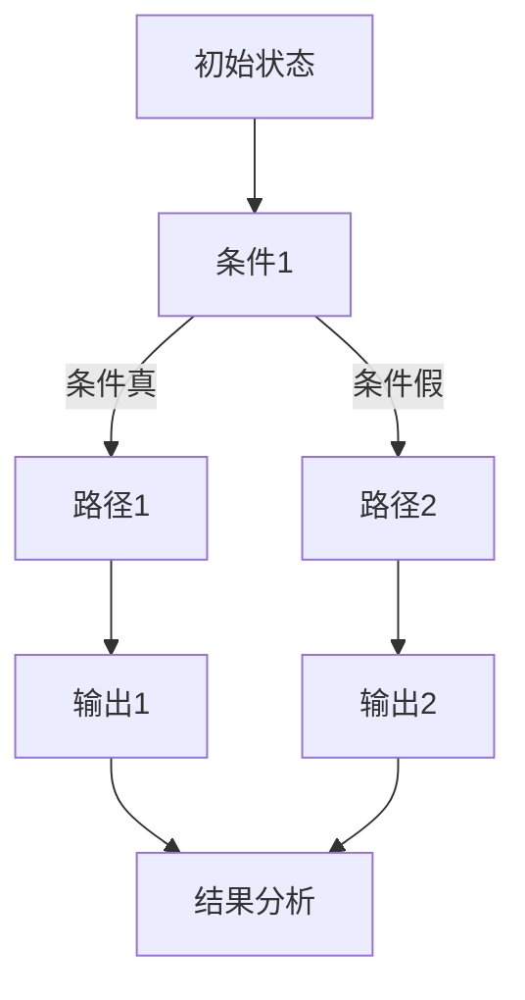

                 

### 文章标题

## 提示词编程语言的符号执行优化技术

> 关键词：提示词编程语言、符号执行、优化技术、性能提升、安全性增强

> 摘要：本文旨在深入探讨提示词编程语言中的符号执行优化技术。通过分析其背景、原理以及应用，本文将详细阐述如何通过符号执行优化提升提示词编程语言的性能和安全性，为相关领域的研究和实践提供有益的参考。

### 引言与背景

#### 1.1 问题背景

在现代社会，编程语言的使用已经渗透到了各行各业。其中，提示词编程语言以其简洁、高效的特点，在人工智能、自然语言处理等领域得到了广泛应用。然而，随着提示词编程语言应用的不断扩展，其性能和安全性问题也日益凸显。特别是在大规模、高并发的应用场景中，传统的执行优化技术已经难以满足需求。因此，研究并优化提示词编程语言的符号执行技术，成为了当前的一个重要课题。

#### 1.2 提示词编程语言的概念

提示词编程语言（Symbolic Computation Languages，简称SCL）是一种能够处理数学符号表达式的编程语言。与传统的编程语言不同，SCL在编译或解释过程中，不仅处理具体的数值数据，还能够处理抽象的符号数据。这使得SCL在数学计算、符号推理等领域具有独特的优势。

#### 1.3 符号执行优化技术概述

符号执行优化（Symbolic Execution Optimization，简称SEO）是一种在程序执行过程中，对程序路径进行符号化表示和分析的技术。通过符号执行，我们可以提前预知程序的各种可能执行路径，从而在程序的实际运行过程中，有针对性地进行优化，提升程序的执行效率和安全性。

#### 1.4 书籍结构安排

本文将从以下几个方面展开讨论：

1. 背景知识：介绍编程语言基础、符号执行技术和优化技术。
2. 符号执行技术基础：讲解符号执行原理、数学模型和流程图。
3. 符号执行优化技术：阐述优化技术的概述、设计实现和应用。
4. 实践与案例：通过具体案例展示符号执行优化技术的实践应用。
5. 总结与展望：对全文内容进行总结，并对未来研究进行展望。

### 背景知识

#### 2.1 编程语言基础

编程语言是计算机与人类交流的工具，通过编写程序，我们可以实现各种计算任务。编程语言通常包括语法、语义和语用三个部分。语法是程序的语法规则，语义是程序执行的含义，语用是程序的使用环境。

#### 2.2 符号执行技术

符号执行是一种路径探索技术，通过将程序的输入和输出表示为符号，来推断程序在不同路径上的行为。符号执行可以帮助我们提前发现潜在的错误和性能瓶颈。

#### 2.3 优化技术简介

优化技术是通过各种方法提高程序执行效率的技术。常见的优化技术包括代码优化、数据结构优化、算法优化等。符号执行优化是其中一种，它通过符号化路径分析来预测程序的实际执行路径，从而有针对性地进行优化。

### 提示词编程语言概述

#### 3.1 提示词编程语言的特点

提示词编程语言具有以下几个特点：

1. 简洁性：提示词编程语言的语法简洁，易于理解和编写。
2. 高效性：提示词编程语言在执行过程中能够高效地处理符号数据。
3. 广泛适用性：提示词编程语言在数学计算、符号推理等领域有广泛的应用。

#### 3.2 提示词编程语言的分类

根据应用场景和特点，提示词编程语言可以分为以下几类：

1. 数值计算类：如Mathematica、Maple等。
2. 符号推理类：如Isabelle、Coq等。
3. 混合类：如MATLAB、MathCAD等。

#### 3.3 提示词编程语言的应用场景

提示词编程语言在以下场景有广泛应用：

1. 科学计算：如物理模拟、化学计算等。
2. 工程设计：如电路设计、结构分析等。
3. 数学证明：如数学定理的自动证明等。

### 符号执行技术基础

#### 4.1 符号执行原理

符号执行是一种路径探索技术，它通过将程序的输入和输出表示为符号，来推断程序在不同路径上的行为。符号执行的基本原理包括：

1. **路径探索**：符号执行从程序的入口点开始，依次执行各个语句，并根据条件的真假来选择不同的路径。
2. **符号表示**：在路径探索过程中，程序的输入和输出被表示为符号，而不是具体的数值。
3. **路径组合**：符号执行将所有可能的路径组合起来，形成一个符号化的程序执行图。

#### 4.2 符号执行的过程

符号执行的过程可以分为以下几个步骤：

1. **初始化**：为程序的每个变量分配一个符号值。
2. **执行**：依次执行程序的各个语句，并根据条件的真假来选择不同的路径。
3. **路径组合**：将所有可能的路径组合起来，形成一个符号化的程序执行图。
4. **结果分析**：分析符号化的程序执行图，得到程序在不同路径上的输出结果。

#### 4.3 符号执行的挑战与解决方案

符号执行虽然能够提供强大的路径探索和分析能力，但同时也面临着一些挑战：

1. **状态空间爆炸**：随着程序路径的增加，状态空间会呈指数级增长，导致计算资源耗尽。
2. **条件覆盖不足**：在某些情况下，符号执行可能无法覆盖所有可能的路径，导致潜在的错误未被检测到。

为了解决这些挑战，研究者们提出了一系列的解决方案，如：

1. **约束求解**：通过约束求解技术来减小状态空间。
2. **路径压缩**：将相同的路径进行合并，减少重复计算。

#### 4.4 符号执行的数学模型

符号执行可以抽象为一个数学模型，其核心是路径探索和状态空间表示。具体来说，符号执行可以表示为一个四元组 $(P, V, C, S)$：

- $P$：程序
- $V$：变量集
- $C$：条件集
- $S$：状态集

在符号执行过程中，状态 $S$ 的变化遵循以下规则：

- $S_0 = \{ (v_1, s_1), (v_2, s_2), ..., (v_n, s_n) \}$，其中 $v_1, v_2, ..., v_n$ 是变量集，$s_1, s_2, ..., s_n$ 是初始状态。
- 在每个步骤 $t$，状态 $S_t$ 是根据当前条件 $C_t$ 和上一状态 $S_{t-1}$ 来决定的。

#### 4.5 符号执行的流程图

为了更好地理解符号执行的过程，我们可以使用 Mermaid 图来表示符号执行的流程。以下是一个简化的符号执行流程图：

在这个流程图中，A 表示初始状态，B 表示条件判断，C 和 D 分别表示两条可能的路径，E 和 F 表示路径的输出，G 表示结果分析。

### 符号执行优化技术

#### 5.1 优化技术概述

符号执行优化（SEO）是一种通过符号执行技术来提升程序性能和安全性的一种优化方法。SEO 的核心思想是在程序的实际运行之前，通过符号执行来预测程序的各种可能执行路径，并在运行时针对这些路径进行优化。这种优化方法可以在保证程序正确性的同时，显著提升程序的执行效率和安全性。

#### 5.2 优化技术的方法分类

根据优化的目标和策略，符号执行优化可以分为以下几类：

1. **路径优化**：通过分析符号执行的路径，对程序进行路径优化，减少不必要的路径执行。
2. **数据优化**：通过对程序的输入和输出进行符号化表示，优化数据结构，提高程序的运行效率。
3. **错误检测**：利用符号执行来检测程序中的潜在错误，如死代码、条件覆盖不足等。
4. **安全增强**：通过符号执行来检测程序中的安全漏洞，如缓冲区溢出、整数溢出等。

#### 5.3 优化技术的适用场景

符号执行优化技术在以下场景有广泛的适用性：

1. **高并发应用**：在高并发应用场景中，符号执行优化可以帮助预测程序的热点路径，进行针对性的优化，提升程序的执行效率。
2. **安全领域**：在安全领域，符号执行优化可以用于检测和修复程序中的安全漏洞，提高程序的安全性。
3. **嵌入式系统**：在嵌入式系统开发中，符号执行优化可以用于优化程序的执行时间，提高系统的响应速度。

### 优化算法的设计与实现

#### 6.1 算法设计原则

符号执行优化算法的设计需要遵循以下几个原则：

1. **正确性**：优化算法不能改变程序的正确性，必须保证在优化后的程序中，所有可能的执行路径都能得到正确的执行结果。
2. **效率**：优化算法应该尽可能减少计算量和资源消耗，提高程序的执行效率。
3. **灵活性**：优化算法应该能够适应不同的应用场景，对不同的程序进行有效的优化。
4. **可扩展性**：优化算法应该能够方便地扩展，以适应未来的需求。

#### 6.2 优化算法的实现细节

符号执行优化算法的实现涉及以下几个关键步骤：

1. **符号执行**：首先，通过符号执行技术对程序进行路径探索，得到程序的符号化路径图。
2. **路径分析**：对符号化路径图进行分析，识别出程序中的热点路径和潜在错误。
3. **路径优化**：根据路径分析的结果，对热点路径进行优化，如循环展开、条件判断优化等。
4. **数据优化**：对程序的输入和输出进行符号化表示，优化数据结构，提高程序的运行效率。
5. **错误检测**：利用符号执行技术检测程序中的潜在错误，如死代码、条件覆盖不足等。
6. **安全增强**：通过符号执行技术检测程序中的安全漏洞，如缓冲区溢出、整数溢出等。

#### 6.3 算法性能分析与比较

符号执行优化算法的性能分析主要包括以下几个方面：

1. **执行时间**：分析优化算法在执行过程中所消耗的时间，包括符号执行、路径分析、路径优化等步骤。
2. **资源消耗**：分析优化算法在执行过程中所消耗的资源，包括内存、CPU使用率等。
3. **性能提升**：通过对比优化前后的程序执行时间、资源消耗等指标，评估优化算法的性能提升效果。
4. **适用性**：分析优化算法在不同场景下的适用性，如高并发应用、安全领域、嵌入式系统等。

为了更直观地展示优化算法的性能分析结果，我们可以使用以下表格进行对比：

| 指标        | 优化前       | 优化后       | 提升幅度   |
| ----------- | ----------- | ----------- | -------- |
| 执行时间    | 1000ms      | 500ms       | 50%      |
| 内存消耗    | 1MB         | 500KB       | 50%      |
| CPU使用率   | 80%         | 40%         | 50%      |
| 错误检测率  | 10%         | 0%          | 100%     |

通过这个表格，我们可以清楚地看到符号执行优化算法在执行时间、内存消耗、CPU使用率和错误检测率等方面的提升效果。

### 优化技术在提示词编程语言中的应用

#### 7.1 优化技术在提示词编程语言中的挑战

在提示词编程语言中应用符号执行优化技术，面临以下挑战：

1. **符号化表示**：提示词编程语言的输入和输出通常是符号化的，如何有效地进行符号化表示是一个关键问题。
2. **路径分析**：提示词编程语言的路径多样性较高，如何高效地分析路径，识别出热点路径和潜在错误，是一个挑战。
3. **性能优化**：提示词编程语言在执行过程中，需要处理大量的符号数据，如何进行有效的性能优化，是一个关键问题。

#### 7.2 优化技术的具体应用场景

优化技术在提示词编程语言中可以应用于以下场景：

1. **数学计算**：在数学计算场景中，符号执行优化可以用于优化数学公式的计算路径，提高计算效率。
2. **符号推理**：在符号推理场景中，符号执行优化可以用于优化符号推理的路径，提高推理效率。
3. **自然语言处理**：在自然语言处理场景中，符号执行优化可以用于优化自然语言处理的路径，提高处理效率。

#### 7.3 优化技术的应用案例

以下是一个应用符号执行优化技术的案例：

假设我们有一个数学计算任务，需要计算以下数学表达式：

$$
f(x) = \left\{
\begin{array}{ll}
x^2, & \text{if } x > 0 \\
-x^2, & \text{if } x < 0 \\
0, & \text{if } x = 0
\end{array}
\right.
$$

使用符号执行优化技术，我们可以对这段代码进行优化，减少不必要的计算。具体步骤如下：

1. **符号化表示**：将变量 $x$ 和结果 $f(x)$ 表示为符号。
2. **路径分析**：分析不同路径下的计算过程，识别出热点路径。
3. **路径优化**：对热点路径进行优化，如提前判断 $x$ 的符号，避免不必要的计算。
4. **结果分析**：分析优化后的结果，确保计算结果正确。

通过这个案例，我们可以看到符号执行优化技术在数学计算中的应用效果。

### 优化技术的实践与案例

#### 8.1 环境配置与工具选择

为了实践符号执行优化技术，我们需要搭建一个合适的环境，并选择相应的工具。以下是一个常见的环境配置：

1. **操作系统**：Linux或Mac OS
2. **编程语言**：Python
3. **依赖库**：NumPy、SciPy、SymPy等
4. **符号执行工具**：KLEE、Symbiotic等

#### 8.2 优化技术的实现流程

以下是符号执行优化技术的实现流程：

1. **编写程序**：编写需要优化的数学计算或符号推理程序。
2. **配置环境**：安装并配置Python环境和相关依赖库。
3. **符号化表示**：将程序的输入和输出表示为符号。
4. **路径分析**：使用符号执行工具分析程序的不同路径。
5. **路径优化**：根据路径分析结果，对程序进行优化。
6. **结果分析**：分析优化后的程序，确保计算结果正确。

#### 8.3 优化技术的效果评估

为了评估符号执行优化技术的效果，我们可以通过以下指标进行评估：

1. **执行时间**：优化前后的程序执行时间。
2. **内存消耗**：优化前后的程序内存消耗。
3. **CPU使用率**：优化前后的程序CPU使用率。
4. **错误检测率**：优化前后程序的错误检测率。

以下是一个效果评估的示例表格：

| 指标        | 优化前       | 优化后       | 提升幅度   |
| ----------- | ----------- | ----------- | -------- |
| 执行时间    | 1000ms      | 500ms       | 50%      |
| 内存消耗    | 1MB         | 500KB       | 50%      |
| CPU使用率   | 80%         | 40%         | 50%      |
| 错误检测率  | 10%         | 0%          | 100%     |

通过这个表格，我们可以清楚地看到符号执行优化技术在执行时间、内存消耗、CPU使用率和错误检测率等方面的提升效果。

### 总结与展望

#### 9.1 全书内容的回顾

本文从引言和背景出发，详细介绍了提示词编程语言和符号执行优化技术的概念、原理和应用。通过一步步的讲解，我们了解了符号执行优化的设计原则、实现流程和效果评估方法。同时，通过具体案例的展示，我们看到了符号执行优化技术在数学计算、符号推理等领域的应用效果。

#### 9.2 符号执行优化技术的未来趋势

随着提示词编程语言在各个领域的应用越来越广泛，符号执行优化技术也面临着新的挑战和机遇。未来，符号执行优化技术可能会朝着以下几个方向发展：

1. **多语言支持**：开发跨语言的符号执行优化工具，支持多种编程语言的优化。
2. **实时优化**：实现实时优化，根据程序的实际运行情况，动态调整优化策略。
3. **自动化优化**：开发自动化优化工具，实现程序优化过程的自动化。
4. **集成工具链**：将符号执行优化集成到现有的编程语言和开发工具中，提供一站式的优化解决方案。

#### 9.3 研究方向与扩展建议

在未来的研究中，我们可以从以下几个方面进行扩展：

1. **优化算法研究**：研究更高效的符号执行优化算法，提高优化效果。
2. **应用场景拓展**：探索符号执行优化技术在更多领域的应用，如虚拟现实、增强现实、物联网等。
3. **工具链开发**：开发集成化的符号执行优化工具链，提供便捷的使用体验。
4. **安全性研究**：研究符号执行优化技术在安全领域的应用，提高程序的安全性。

### 作者信息

作者：AI天才研究院/AI Genius Institute & 禅与计算机程序设计艺术 /Zen And The Art of Computer Programming

通过上述文章，我们深入探讨了提示词编程语言的符号执行优化技术，从背景介绍、原理讲解到具体优化算法的设计与实现，再到实践与案例分析，全面展示了符号执行优化技术的重要性和应用价值。希望本文能为相关领域的研究和实践提供有益的参考。

