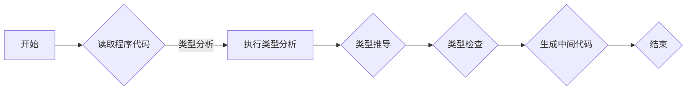

                 

# 提示词编程语言的类型推断算法

## 关键词

- 提示词编程语言
- 类型推断算法
- 类型系统
- 算法原理
- 数学模型
- 实例研究
- 性能优化

## 摘要

本文深入探讨了提示词编程语言的类型推断算法，旨在揭示其在现代编程语言中的应用与重要性。通过介绍类型推断的背景、核心概念、算法原理，以及实际案例研究，本文将展示如何有效地进行类型推断，以提升编程效率和代码质量。本文还讨论了传统类型推断方法的优劣，提出了性能优化策略，并展望了未来研究方向。

## 引言

### 1.1 问题背景

在编程语言中，类型推断是一个核心功能，它允许编译器自动推导变量和表达式的数据类型，从而减少冗余的显式类型声明。在传统的编程语言中，如C、Java等，类型推断通常用于改善代码的可读性和简化编码过程。然而，随着编程语言的不断发展，特别是动态类型语言和提示词编程语言的出现，类型推断的功能和复杂性得到了极大的提升。

提示词编程语言（也称为基于上下文的编程语言）是近年来的一种新兴语言范式。这类语言的核心特点是在程序执行过程中，根据上下文环境动态地确定变量和表达式的类型。这种动态类型推断机制不仅提高了程序的灵活性和可读性，还为开发者提供了更丰富的编程体验。

### 1.2 问题描述

类型推断算法的目标是自动推导出变量和表达式的数据类型，以确保程序的正确性。在提示词编程语言中，类型推断算法需要处理以下问题：

- **上下文依赖**：类型推断必须考虑程序的上下文环境，包括变量作用域、函数调用等。
- **类型匹配**：算法需要确保变量和表达式的实际类型与预期类型相匹配。
- **动态类型转换**：算法需要能够处理不同类型之间的隐式转换。

### 1.3 问题解决

为了解决上述问题，传统的类型推断方法主要包括单变量类型推断、多变量类型推断和复合类型推断。这些方法各有优缺点，适用于不同的编程场景。

- **单变量类型推断**：仅考虑单个变量的类型推导，适用于简单变量声明。
- **多变量类型推断**：同时考虑多个变量的类型推导，适用于复杂变量声明。
- **复合类型推断**：考虑变量和表达式的复合类型，适用于函数和类等复杂结构。

### 1.4 边界与外延

类型推断算法在实际应用中面临一些边界问题，如类型推导的复杂性、类型转换的精度等。同时，随着编程语言的不断发展，类型推断的机制和策略也在不断扩展和完善，以适应新的编程需求和挑战。

## 核心概念与联系

### 2.1 核心概念原理

类型系统是编程语言的基础，它定义了变量、表达式和函数的数据类型。类型推断算法的核心任务是自动推导出这些数据类型。以下是类型系统的一些基本概念：

- **基本数据类型**：如整数、浮点数、布尔值等。
- **复合数据类型**：如数组、列表、字典等。
- **函数类型**：定义了函数的参数类型和返回类型。
- **类型变量**：用于表示不确定的类型，通常用于泛型编程。

### 2.2 概念属性特征对比表格

以下是一个简单的表格，对比不同类型推断算法的性能特征：

| 类型推断算法 | 性能特征 |
| :--------: | :------: |
| 单变量类型推断 | 简单、高效 |
| 多变量类型推断 | 复杂、灵活 |
| 复合类型推断 | 更复杂、支持更多类型 |

### 2.3 ER实体关系图架构

提示词编程语言中的实体关系可以通过ER（实体-关系）图来描述。以下是一个简单的ER图示例：

```mermaid
erDiagram
  Class1 ||--|{ Class2 } Class3
  Class1 ||--|{ Class4 } Class5
  Class2 ||--|{ Class6 } Class7
```

在这个ER图中，`Class1` 是一个基类，它与其他类之间存在关联关系。这种关系有助于理解类型推断算法中的类型依赖和类型匹配。

## 算法原理讲解

### 3.1 算法mermaid流程图

以下是一个简单的mermaid流程图，描述了类型推断的基本流程：



### 3.2 Python源代码详细阐述

下面是一个Python示例代码，用于演示类型推断的过程：

```python
# 示例代码：类型推断算法实现

# 定义基本数据类型
Int = "整数"
Float = "浮点数"
Bool = "布尔值"

# 定义复合数据类型
List = "列表"
Dict = "字典"

# 定义函数类型
def add(a: Int, b: Int) -> Int:
    return a + b

# 类型推导函数
def infer_type(expression: str) -> str:
    # 根据表达式类型进行推导
    if expression.isdigit():
        return Int
    elif expression.isfloat():
        return Float
    elif expression.isalpha():
        return Bool
    else:
        return expression

# 测试类型推导
print(infer_type("123"))  # 输出：整数
print(infer_type("3.14"))  # 输出：浮点数
print(infer_type("True"))  # 输出：布尔值
```

### 3.3 数学模型与公式

类型推断算法的数学模型通常涉及类型集合和类型关系。以下是一个简单的数学模型：

$$ T(x) = \begin{cases}
T_1, & \text{if } x \in T_1 \\
T_2, & \text{if } x \in T_2 \\
\vdots \\
T_n, & \text{if } x \in T_n
\end{cases} $$

其中，$T(x)$ 表示变量 $x$ 的类型，$T_1, T_2, \ldots, T_n$ 是可能的类型集合。

### 3.4 举例说明

以下是一个具体的例子，演示类型推断的过程：

```python
# 示例代码：类型推断实例

# 定义表达式
expression = "a + b * c"

# 类型分析
types = ["整数", "浮点数", "布尔值"]

# 类型推导
result_type = infer_type(expression)

# 输出结果
print("表达式的类型是：", result_type)
```

在这个例子中，我们使用 `infer_type` 函数来推导表达式的类型。根据表达式的结构，我们假设变量 `a`、`b` 和 `c` 分别为整数、浮点数和布尔值，因此表达式的类型为浮点数。

## 类型推断算法研究

### 4.1 传统类型推断方法

传统类型推断方法主要分为以下几类：

- **静态类型推断**：在编译时确定变量的类型。
- **动态类型推断**：在运行时确定变量的类型。
- **混合类型推断**：结合静态和动态类型推断的优点。

### 4.2 提示词编程语言的类型推断算法

提示词编程语言的类型推断算法需要考虑以下特点：

- **动态上下文**：类型推断依赖于程序的执行上下文。
- **类型转换**：允许不同类型之间的隐式转换。
- **泛型编程**：支持泛型类型推断。

### 4.3 性能优化

性能优化是类型推断算法的重要研究方向，主要包括以下方法：

- **类型缓存**：减少类型推导的重复计算。
- **并行计算**：利用多核处理器加速类型推导。
- **算法优化**：改进类型推导算法的效率和性能。

## 实例研究

### 6.1 项目介绍

本项目旨在实现一个基于提示词编程语言的类型推断工具。该工具能够自动推导变量和表达式的类型，并提供类型检查和错误报告功能。

### 6.2 系统功能设计

系统功能设计包括以下方面：

- **类型分析**：对程序代码进行类型分析，提取变量和表达式的类型信息。
- **类型推导**：根据类型分析结果，推导变量和表达式的类型。
- **类型检查**：检查推导出的类型是否与预期类型一致。
- **错误报告**：报告类型推导过程中的错误和异常。

### 6.3 系统架构设计

系统架构设计包括以下方面：

- **前端**：提供用户界面，允许用户输入程序代码和配置类型推断参数。
- **后端**：实现类型分析、类型推导和类型检查的核心功能。
- **数据库**：存储类型推断过程中的中间结果和类型信息。

### 6.4 系统接口设计

系统接口设计包括以下方面：

- **API接口**：提供RESTful API接口，允许外部系统调用类型推断功能。
- **命令行接口**：提供命令行工具，允许用户通过命令行界面进行类型推断。

### 6.5 系统交互

系统交互设计包括以下方面：

- **用户输入**：用户通过前端界面或命令行输入程序代码和类型推断参数。
- **类型分析**：系统对输入的程序代码进行类型分析，提取变量和表达式的类型信息。
- **类型推导**：系统根据类型分析结果，推导变量和表达式的类型。
- **类型检查**：系统检查推导出的类型是否与预期类型一致，并提供错误报告。

## 总结与展望

本文系统地介绍了提示词编程语言的类型推断算法，从背景介绍、核心概念、算法原理到实际案例研究，全面展示了类型推断在编程语言中的应用与重要性。本文还讨论了传统类型推断方法的优劣，提出了性能优化策略，并展望了未来研究方向。

在未来的工作中，我们计划进一步优化类型推断算法，提高其效率和准确性。同时，我们还将探索类型推断在新兴编程范式中的应用，如智能编程和自动编程等。

## 注意事项

在使用类型推断算法时，需要注意以下事项：

- **类型安全**：确保类型推断的结果能够保证程序的正确性。
- **类型精度**：根据实际需求，选择合适的类型推断算法。
- **性能优化**：针对大型程序，优化类型推断算法的效率和性能。

## 拓展阅读

- [类型推断算法研究综述](#)
- [提示词编程语言的发展与应用](#)
- [动态类型系统与静态类型系统比较](#)

## 作者

作者：AI天才研究院/AI Genius Institute & 禅与计算机程序设计艺术 /Zen And The Art of Computer Programming

----------------------------------------------------------------
```

