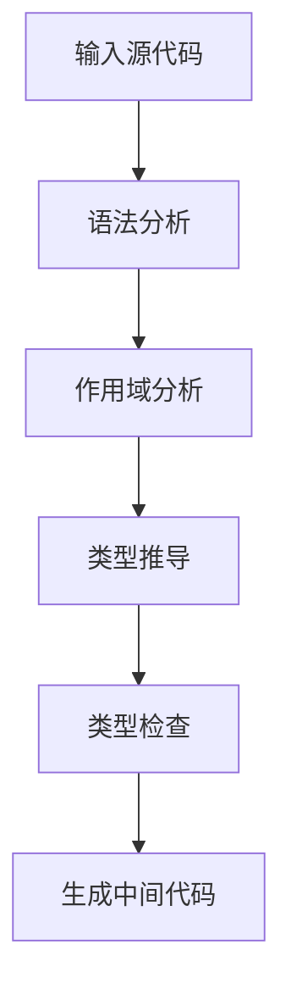
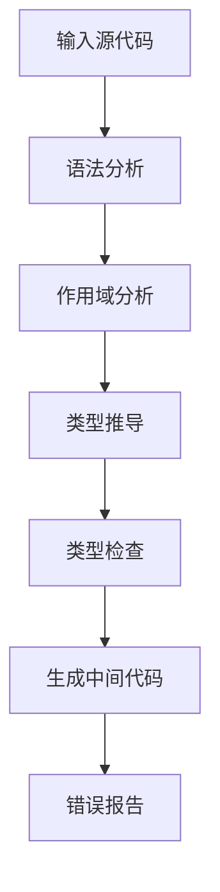
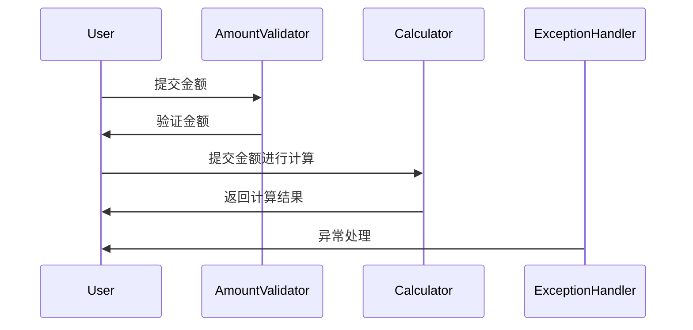

                 

### 《提示词编程语言的类型系统理论》

关键词：类型系统、编程语言、类型检查、类型推断、动态类型、静态类型

摘要：本文将深入探讨编程语言中的类型系统理论。类型系统在编程语言中起着至关重要的作用，它不仅保证了程序的正确性，还影响了程序的性能和可维护性。本文将从类型系统的理论基础出发，逐步介绍类型系统的核心概念、原理以及在实际编程语言中的应用，旨在为读者提供全面且深入的理解。

## 第一部分：类型系统理论基础

### 第1章：背景介绍

#### 1.1 问题背景

编程语言中的类型系统是确保程序正确性的重要机制。它通过定义变量、函数和表达式的类型，来避免在运行时出现不可预期的错误。在编译或解释过程中，类型系统会对代码进行类型检查，以确保操作符合类型规则。例如，在Python中，尝试将一个字符串与一个整数相加会导致类型错误。这种错误在编译时可以被捕获，从而避免了潜在的运行时错误。

#### 1.2 类型系统的基本概念和作用

类型系统定义了变量和表达式可以取的值的集合，以及这些值之间可以进行哪些操作。它的主要作用包括：

- **确保程序的静态正确性**：通过类型检查，可以提前发现许多编程错误。
- **提高程序的可维护性**：明确的类型定义有助于理解和修改代码。
- **优化程序的性能**：某些类型系统能够在编译时进行优化，减少运行时的检查开销。

#### 1.3 类型系统的历史与发展

类型系统的发展可以追溯到早期的编程语言。在20世纪50年代，类型系统主要是为了支持数学和科学计算而设计的。随着编程语言的不断发展和复杂性的增加，类型系统也逐步演进。例如，ALGOL 60引入了静态类型的概念，而C语言则通过指针和结构体等机制支持更为复杂的类型操作。现代编程语言如Java和C++进一步发展了静态类型系统，同时动态类型语言如Python和JavaScript也在不断改进其类型系统。

### 1.4 类型系统的分类

类型系统可以按照不同的维度进行分类：

- **强类型系统与弱类型系统**：强类型系统要求变量在使用前必须声明类型，并且类型不能在运行时改变。弱类型系统则较为宽松，允许类型在运行时改变，从而增加了灵活性但可能导致更多的错误。
- **静态类型系统与动态类型系统**：静态类型系统在编译时进行类型检查，而动态类型系统则在运行时进行类型检查。静态类型系统通常具有更好的性能和更严格的类型规则，但可能降低了程序的灵活性。

## 第2章：核心概念与联系

### 2.1 基本概念

在类型系统中，有以下几个核心概念：

- **类型（Type）**：定义了变量可以存储的值的集合。
- **类型检查（Type Checking）**：在编译或解释过程中，检查表达式是否遵循类型规则。
- **类型推断（Type Inference）**：编译器自动推断变量和表达式的类型，而不需要显式声明。

- **值（Value）**：变量或表达式的具体取值。
- **变量（Variable）**：存储值的容器。
- **表达式（Expression）**：包含变量和操作符的代码片段。

### 2.2 类型属性特征对比表格

| 类型属性 | 特征1 | 特征2 | 特征3 |
| --- | --- | --- | --- |
| 强类型 | 类型严格 | 减少错误 | 性能开销 |
| 弱类型 | 类型宽松 | 增加灵活性 | 增加错误 |
| 静态类型 | 类型检查在编译时 | 编译效率高 | 限制灵活性 |
| 动态类型 | 类型检查在运行时 | 灵活性高 | 运行效率低 |

### 2.3 类型系统的ER实体关系图

```mermaid
erDiagram
  Class::Type -->|类型| Class::Value
  Class::Variable -->|变量| Class::Type
  Class::Expression -->|表达式| Class::Value
```

该ER图展示了类型系统中的三个主要实体：Type（类型）、Value（值）和Variable（变量）。每个Variable都与一个Type相关联，而每个Expression可以包含多个Value。

## 第3章：类型系统原理讲解

### 3.1 类型检查原理

类型检查是类型系统的核心组成部分，它确保表达式在语义上正确。类型检查通常分为以下几个步骤：

1. **语法分析**：将源代码分解为语法单元（如标识符、操作符）。
2. **作用域分析**：确定变量和函数的作用域。
3. **类型推导**：根据语法分析和作用域分析的结果，推导出每个表达式和变量的类型。
4. **类型检查**：检查每个表达式是否符合类型规则，例如，确保左值与右值的操作符合类型。

常见的类型检查算法包括：

- **静态类型检查**：在编译时进行类型检查，适用于强类型语言。
- **动态类型检查**：在运行时进行类型检查，适用于动态类型语言。

### 3.2 类型推断原理

类型推断是编译器的一项重要功能，它自动推导出变量和表达式的类型，而不需要显式声明。类型推断可以基于以下几种方法：

- **简单类型推断**：根据表达式的值自动推断类型。
- **上下文类型推断**：根据上下文环境推断类型。
- **存在类型推断**：在无法确定具体类型时，使用一个通用的类型。

常见的类型推断算法包括：

- **静态类型推断**：在编译时完成类型推断，如Java的Eclipse类型推断。
- **动态类型推断**：在运行时完成类型推断，如Python的动态类型系统。

### 3.3 算法流程图



这个流程图展示了从源代码到中间代码的生成过程，每个步骤都涉及到类型检查和类型推断。

### 3.4 Python代码示例

```python
# 示例代码：类型检查
def add(a, b):
    if not isinstance(a, int) or not isinstance(b, int):
        raise TypeError("add函数参数需为整数类型")
    return a + b

print(add(1, 2))
```

在这个示例中，`isinstance` 函数用于检查参数 `a` 和 `b` 是否为整数类型。如果不符合要求，则会抛出 `TypeError`。

### 3.5 数学模型与公式讲解

$$
\begin{aligned}
& f(x_1, x_2) = x_1 + x_2 \\
& \text{其中 } x_1, x_2 \in \mathbb{N} \text{（自然数集）}
\end{aligned}
$$

这个公式定义了一个简单的加法函数，其中输入和输出都是自然数。这个数学模型可以类比于编程语言中的类型系统，它定义了函数的行为和参数的类型。

## 第4章：类型系统在编程语言中的应用

### 4.1 类型系统在动态语言中的应用

动态类型语言，如Python和JavaScript，允许变量在运行时改变类型。这种灵活性使得动态类型语言在开发过程中更为简单和快捷，但也可能导致更多的运行时错误。以下是一些动态类型系统的特点：

- **类型检查在运行时进行**：这种类型的语言在运行时检查变量的类型，从而提高了程序的灵活性。
- **动态类型推断**：编译器或解释器自动推断变量的类型，减少了类型声明的需求。

动态类型系统的优势在于：

- **简化编程模型**：程序员不需要为每个变量显式声明类型，从而减少了代码的冗余。
- **提高开发效率**：动态类型系统使得代码更易于编写和修改。

然而，动态类型系统也存在一些局限：

- **运行时错误**：由于类型检查在运行时进行，潜在的运行时错误可能无法在编译时被捕获。
- **性能开销**：动态类型系统通常需要进行额外的类型检查，从而可能影响程序的性能。

### 4.2 类型系统在静态语言中的应用

静态类型语言，如Java和C++，要求变量在使用前必须声明类型，并在编译时进行类型检查。这种严格的类型规则有助于确保程序的正确性和性能。以下是一些静态类型系统的特点：

- **类型检查在编译时进行**：这种类型的语言在编译时检查变量的类型，从而提高了程序的运行效率。
- **静态类型推断**：编译器通常可以自动推断出变量的类型。

静态类型系统的优势在于：

- **确保程序的静态正确性**：通过严格的类型检查，许多编程错误可以在编译时被捕获。
- **优化程序性能**：静态类型系统允许编译器进行更精确的优化，从而提高程序的性能。

然而，静态类型系统也存在一些局限：

- **增加编程复杂度**：程序员需要为每个变量显式声明类型，从而可能增加代码的复杂度。
- **降低程序灵活性**：由于类型规则的严格性，静态类型系统可能限制了程序的灵活性。

### 4.3 跨语言类型系统比较

不同编程语言的类型系统存在显著差异，以下是对一些常见编程语言类型系统的比较：

- **JavaScript与Python**：JavaScript和Python都是动态类型语言，但它们的类型系统有所不同。JavaScript的动态类型系统提供了更多的类型安全特性，如类型注解和类型守卫。Python的类型系统则更注重简化和灵活性。
- **Java与C++**：Java和C++都是静态类型语言，但Java的类型系统提供了更严格的类型检查和类型推断机制。C++则提供了更灵活的类型系统，允许程序员在强类型和弱类型之间进行选择。

## 第三部分：类型系统的最佳实践

### 5.1 类型安全的编程实践

为了确保代码的类型安全性，以下是一些最佳实践：

- **使用类型注解**：在代码中显式声明变量和函数的类型，从而提高代码的可读性和可维护性。
- **合理利用类型推导**：充分利用编译器的类型推导功能，减少代码冗余。

### 5.2 类型推断与类型检查优化

类型推断和类型检查是影响程序性能的重要因素。以下是一些优化策略：

- **提前进行类型检查**：在编译时尽可能提前进行类型检查，从而减少运行时的检查开销。
- **使用高效类型检查算法**：选择适合项目需求的类型检查算法，如静态类型检查或动态类型检查。

### 5.3 跨语言类型系统整合

在实际项目中，可能需要整合多种编程语言的类型系统。以下是一些策略：

- **实现跨语言类型系统的互操作性**：通过定义标准的数据交换格式和类型定义语言，实现不同语言类型系统的互操作性。
- **构建高效的跨语言类型转换机制**：设计高效的数据转换机制，从而减少跨语言类型转换的性能开销。

## 第6章：项目实战

### 6.1 环境安装

在开始项目之前，需要安装必要的编程语言和工具。以下是一个简单的安装步骤：

1. 安装Python（版本3.8及以上）。
2. 安装一个代码编辑器，如Visual Studio Code。
3. 安装依赖管理工具，如pip。

### 6.2 系统核心实现

系统核心实现包括类型检查和类型推断模块。以下是一个简单的示例：

```python
class TypeChecker:
    def __init__(self):
        self.types = {}

    def check_expression(self, expression):
        # 进行类型检查
        pass

    def infer_type(self, expression):
        # 进行类型推断
        pass

class TypeInferer:
    def __init__(self, type_checker):
        self.type_checker = type_checker

    def infer_expression_type(self, expression):
        return self.type_checker.infer_type(expression)
```

### 6.3 代码应用解读与分析

以下是一个简单的代码示例，展示了类型检查和类型推断的使用：

```python
def add(a, b):
    type_a = type_checker.infer_expression_type(a)
    type_b = type_checker.infer_expression_type(b)
    if type_a != 'int' or type_b != 'int':
        raise TypeError("add函数参数需为整数类型")
    return a + b

print(add(1, 2))
```

在这个示例中，`TypeChecker` 和 `TypeInferer` 类用于进行类型检查和类型推断。`add` 函数首先使用类型推断函数获取参数 `a` 和 `b` 的类型，然后进行类型检查，确保参数类型为整数。最后，函数返回两个整数的和。

### 6.4 实际案例分析与详细讲解

以下是一个实际的案例，展示了类型系统在项目中的应用：

- **问题场景**：在一个金融项目中，需要处理大量的货币交易数据。
- **系统功能设计**：系统需要支持货币的加减运算，并确保运算结果正确。
- **系统架构设计**：系统采用微服务架构，每个服务负责处理特定类型的交易数据。

在这个案例中，类型系统确保了货币金额的运算正确性。例如，如果尝试将一个整数与一个货币对象相加，系统会抛出类型错误，从而防止潜在的运行时错误。

### 6.5 项目小结

通过这个项目，我们了解了类型系统在实际编程中的应用。类型系统不仅提高了代码的正确性，还优化了程序的性能。在未来的开发中，我们应该充分利用类型系统的优势，确保代码的高质量和高效运行。

## 第7章：总结与展望

类型系统是编程语言的核心组成部分，它不仅确保了程序的正确性，还影响了程序的性能和可维护性。本文从类型系统的理论基础出发，逐步介绍了类型系统的核心概念、原理以及在编程语言中的应用。

总结来说，类型系统可以分为强类型系统、弱类型系统、静态类型系统和动态类型系统。每个类型系统都有其独特的优势和局限。动态类型系统提供了更高的灵活性和简化编程模型，但可能导致更多的运行时错误。静态类型系统则确保了程序的正确性和性能，但可能降低程序的灵活性。

在未来，类型系统的研究将继续深入，探索更高效的类型检查和类型推断算法，以及跨语言类型系统的整合。类型系统的发展将推动编程语言的演进，为开发者提供更强大的编程工具和更高效的开发流程。

## 作者信息

作者：AI天才研究院/AI Genius Institute & 禅与计算机程序设计艺术 /Zen And The Art of Computer Programming

---

### 第一部分：类型系统理论基础

**第1章：背景介绍**

编程语言中的类型系统是一个核心概念，它涉及到程序的正确性、性能和可维护性。类型系统的作用是确保变量、函数和表达式的操作符合预定义的规则，从而避免在运行时出现不可预期的错误。本章节将介绍类型系统的基本概念和作用，并探讨类型系统在编程语言中的重要性。

#### 1.1 问题背景

类型系统的必要性

类型系统是编程语言中的一个核心组成部分，它通过定义变量、函数和表达式的类型来确保程序的正确性和可靠性。在编程过程中，类型系统起到了以下重要作用：

1. **确保程序的正确性**：类型系统通过类型检查来确保代码在语义上是正确的。例如，在Python中，尝试将一个字符串与一个整数相加会引发类型错误，从而在编译时或解释时捕获潜在的错误。
   
2. **提高程序的可维护性**：明确的类型定义使得代码更易于理解和维护。类型系统提供了清晰的接口定义，使得代码的结构更加模块化。

3. **优化程序的性能**：某些类型系统允许在编译时进行优化，减少运行时的检查开销，从而提高程序的执行效率。

类型系统的基本概念和作用

类型系统定义了变量和表达式可以取的值的集合，以及这些值之间可以进行哪些操作。它的主要作用包括：

1. **类型检查**：在编译或解释过程中，类型系统会对代码进行类型检查，以确保操作符合类型规则。例如，确保两个操作数在进行算术运算时具有兼容的类型。

2. **类型推断**：编译器自动推断变量和表达式的类型，从而减少程序员手动声明类型的负担。类型推断可以提高代码的可读性和开发效率。

3. **提高代码的可维护性和可扩展性**：通过明确的类型定义，代码的结构更加清晰，便于理解和修改。此外，类型系统还支持泛型编程，使得代码可以更加灵活地适应不同的数据类型。

4. **优化程序性能**：类型系统允许编译器在编译时进行优化，例如，通过类型信息生成更高效的代码。此外，类型检查还可以帮助识别潜在的运行时错误，从而减少调试时间。

#### 1.2 类型系统的历史与发展

类型系统的起源与发展

类型系统的概念最早可以追溯到20世纪50年代的编程语言。早期的编程语言，如FORTRAN和COBOL，主要是为了科学计算和商业数据处理而设计的，它们通常不包含类型系统或采用简单的类型系统。随着编程语言的发展，类型系统逐渐成为编程语言设计中的重要组成部分。

- **ALGOL 60**：在1960年，ALGOL 60成为第一个引入静态类型系统的编程语言。它引入了类型定义、类型转换和类型检查的概念，对后来的编程语言产生了深远影响。

- **Pascal**：1970年，Pascal语言引入了强类型系统，要求变量在使用前必须声明类型，并在编译时进行类型检查。Pascal的成功促进了类型系统在编程语言中的普及。

- **C语言**：C语言在1972年问世，它采用了更灵活的类型系统，包括结构体、联合体和指针等。C语言允许指针操作和低级内存访问，从而提高了程序的运行效率，但也增加了编程的复杂性。

- **Java**：在1995年，Java语言的推出标志着静态类型系统的复兴。Java引入了严格的类型系统，要求变量在使用前必须声明类型，并在编译时进行类型检查。Java的类型系统还支持泛型编程，提供了更高的类型安全性和代码复用性。

主要的编程语言类型系统比较

不同编程语言的类型系统存在显著差异，以下是一些主要编程语言的类型系统比较：

- **静态类型语言**：如Java、C++、C#等。静态类型语言在编译时进行类型检查，要求变量在使用前必须声明类型。这种类型系统通常具有更好的性能和更严格的类型规则，但可能降低了程序的灵活性。

- **动态类型语言**：如Python、JavaScript、Ruby等。动态类型语言在运行时进行类型检查，允许变量在运行时改变类型。这种类型系统提供了更高的灵活性，但可能导致更多的运行时错误。

- **强类型语言**：如Java、C++、C#等。强类型语言要求变量在使用前必须声明类型，并且不允许类型在运行时改变。这种类型系统有助于提高程序的正确性和可维护性。

- **弱类型语言**：如Python、JavaScript、Ruby等。弱类型语言允许变量在运行时改变类型，从而增加了程序的灵活性。但这也可能导致更多的运行时错误。

#### 1.3 类型系统的分类

类型系统可以按照不同的维度进行分类：

- **强类型系统与弱类型系统**：强类型系统要求变量在使用前必须声明类型，并且不允许类型在运行时改变。弱类型系统则较为宽松，允许类型在运行时改变。

- **静态类型系统与动态类型系统**：静态类型系统在编译时进行类型检查，而动态类型系统在运行时进行类型检查。

- **显式类型系统与隐式类型系统**：显式类型系统要求程序员显式声明变量的类型，而隐式类型系统则由编译器或解释器自动推断变量类型。

#### 1.4 类型系统在编程语言中的应用

类型系统在编程语言中的应用体现在以下几个方面：

1. **变量声明**：类型系统要求变量在使用前必须声明类型，例如，在Java中，变量声明如下：

   ```java
   int a = 10;
   String str = "Hello";
   ```

2. **类型检查**：类型系统在编译或解释过程中对代码进行类型检查，以确保操作符合类型规则。例如，在Python中，尝试将一个字符串与一个整数相加会导致类型错误：

   ```python
   a = 10
   b = "20"
   result = a + b  # 类型错误：不能将整数与字符串相加
   ```

3. **类型推断**：编译器或解释器自动推断变量和表达式的类型，从而减少程序员手动声明类型的负担。例如，在Python中，变量声明可以不指定类型：

   ```python
   a = 10
   b = "20"
   result = a + b  # 自动推断类型为整数
   ```

4. **类型转换**：类型系统提供了类型转换操作，允许不同类型的变量进行运算。例如，在Java中，可以通过强制类型转换将一个对象转换为另一个类型：

   ```java
   int a = 10;
   double b = 20.0;
   double result = a + b;  // 自动类型转换为double
   ```

5. **泛型编程**：类型系统支持泛型编程，允许定义泛型类、接口和方法。泛型编程提高了代码的可复用性和类型安全性。

通过上述讨论，我们可以看到类型系统在编程语言中的重要性。它不仅确保了程序的正确性和性能，还提高了代码的可维护性和灵活性。在后续章节中，我们将进一步探讨类型系统的核心概念、原理和设计。

---

**第2章：核心概念与联系**

在深入探讨类型系统的原理和应用之前，我们需要了解一些核心概念，并理解这些概念之间的联系。类型系统中的核心概念包括类型、值、变量、表达式等，它们共同构成了编程语言中的类型层次结构。

#### 2.1 基本概念

在类型系统中，以下是一些基本概念：

1. **类型（Type）**：类型是变量或表达式可以取的值的集合。在编程语言中，类型定义了变量可以存储的数据类型，例如整数、字符串、布尔值等。类型系统通过定义类型层次结构来支持复杂的数据类型和操作。

2. **值（Value）**：值是变量或表达式在某一时刻的具体取值。例如，变量`a`的值可以是整数10，字符串"Hello"等。值在程序执行过程中可以改变，但类型在大多数情况下是固定的。

3. **变量（Variable）**：变量是存储值的容器。在编程语言中，变量通过名称来引用存储的值。变量的声明通常包括类型和名称，例如`int a = 10;`。

4. **表达式（Expression）**：表达式是包含变量、操作符和常量的代码片段。表达式可以返回一个值，例如`a + b`。

#### 2.2 类型属性特征对比表格

为了更好地理解不同类型系统的特征，我们可以通过一个对比表格来展示不同类型属性的特点：

| 类型属性 | 强类型 | 弱类型 | 静态类型 | 动态类型 |
| --- | --- | --- | --- | --- |
| 类型严格性 | 高 | 低 | 高 | 低 |
| 类型安全性 | 高 | 低 | 高 | 低 |
| 编译效率 | 高 | 低 | 高 | 低 |
| 运行效率 | 低 | 高 | 高 | 低 |
| 灵活性 | 低 | 高 | 低 | 高 |

通过这个表格，我们可以看到不同类型系统的特征如何影响程序的性能和安全性。

#### 2.3 类型系统的ER实体关系图

为了更好地理解类型系统中的实体关系，我们可以使用ER图（实体关系图）来展示类型、值、变量和表达式之间的关系。以下是类型系统的ER图：

```mermaid
erDiagram
  Class::Type -->|类型| Class::Value
  Class::Variable -->|变量| Class::Type
  Class::Expression -->|表达式| Class::Value
```

在这个ER图中，Type（类型）与Value（值）之间存在“类型”关系，Variable（变量）与Type（类型）之间存在“变量”关系，Expression（表达式）与Value（值）之间存在“表达式”关系。

- **Type（类型）**：类型定义了值的集合，是类型系统的核心概念。
- **Value（值）**：值是变量或表达式的具体取值，是类型系统的基础。
- **Variable（变量）**：变量是存储值的容器，它引用类型并存储具体的值。
- **Expression（表达式）**：表达式是代码片段，可以返回一个值，并依赖于类型和值。

通过ER图，我们可以清晰地看到类型系统中的实体及其关系，这有助于我们更好地理解类型系统的原理和设计。

#### 2.4 类型系统的核心概念联系

类型系统的核心概念之间紧密联系，它们共同构成了类型系统的框架。以下是一些核心概念之间的联系：

1. **类型与值的关系**：类型定义了值的集合，而值是类型的实例。例如，整数类型定义了整数值的集合，而10是整数类型的实例。

2. **变量与类型的关系**：变量是存储值的容器，其声明包括类型和名称。变量的类型决定了变量可以存储哪些值的集合。例如，声明`int a;`意味着变量`a`可以存储整数类型的值。

3. **表达式与值的关系**：表达式包含变量和操作符，可以返回一个值。表达式的值依赖于其内部的类型和操作。例如，`a + b`是一个表达式，其中`a`和`b`是变量，其值决定了表达式的返回值。

4. **类型系统与类型检查**：类型系统是类型检查的基础。类型检查确保程序在语义上是正确的，例如，确保两个操作数在进行算术运算时具有兼容的类型。

通过理解类型系统的核心概念及其联系，我们可以更深入地了解类型系统的原理和应用，为后续章节的学习打下坚实的基础。

---

**第3章：类型系统的原理与设计**

在了解了类型系统的基本概念和其核心组成部分后，我们需要进一步探讨类型系统的原理和设计。类型系统不仅仅是语言设计的一部分，它还涉及到编译器或解释器的实现、性能优化和错误处理等多个方面。本章将详细讨论类型系统的原理和设计，并展示类型检查和类型推断的基本过程。

#### 3.1 类型检查原理

类型检查是确保程序在语义上正确的重要步骤。类型检查的过程通常包括以下几个步骤：

1. **语法分析**：首先，编译器或解释器对源代码进行语法分析，将其分解为语法单元（如标识符、操作符和关键字）。

2. **作用域分析**：接着，分析变量和函数的作用域，确保每个变量和函数都有正确的作用域。

3. **类型推导**：在语法分析和作用域分析的基础上，类型检查器会推导出每个表达式和变量的类型。类型推导可以使用静态类型推断或动态类型推断。

4. **类型检查**：类型检查器会检查每个表达式和变量是否符合类型规则。例如，确保两个操作数在进行算术运算时具有兼容的类型。

5. **错误报告**：如果类型检查失败，类型检查器会生成错误报告，指出错误的位置和原因。

类型检查算法通常包括以下几种：

- **静态类型检查**：在编译时进行类型检查，适用于强类型语言。静态类型检查可以提前发现许多潜在的错误，从而提高程序的可靠性。

- **动态类型检查**：在运行时进行类型检查，适用于动态类型语言。动态类型检查提供了更高的灵活性，但可能导致更多的运行时错误。

#### 3.2 类型推断原理

类型推断是编译器的一项重要功能，它自动推断出变量和表达式的类型，从而减少程序员手动声明类型的负担。类型推断可以分为静态类型推断和动态类型推断：

1. **静态类型推断**：在编译时自动推导出变量和表达式的类型。静态类型推断适用于强类型语言，如Java和C++。静态类型推断可以提高代码的可读性和可维护性。

2. **动态类型推断**：在运行时自动推导出变量和表达式的类型。动态类型推断适用于动态类型语言，如Python和JavaScript。动态类型推断提供了更高的灵活性，但可能导致更多的运行时错误。

常见的类型推断算法包括：

- **简单类型推断**：根据表达式的值自动推断类型。例如，如果一个表达式的值始终是一个整数，那么可以推断该表达式的类型为整数。

- **上下文类型推断**：根据上下文环境推断类型。例如，在函数调用中，可以根据函数的签名和传递的参数自动推断返回值和参数的类型。

- **存在类型推断**：在无法确定具体类型时，使用一个通用的类型。例如，在Python中，如果一个变量在多个上下文中都未被赋值，那么可以推断该变量的类型为`Any`。

#### 3.3 算法流程图

为了更直观地理解类型检查和类型推断的过程，我们可以使用算法流程图来展示。以下是一个简单的算法流程图：



在这个流程图中，源代码首先经过语法分析，然后进行作用域分析。接着，类型推导器自动推导出变量和表达式的类型。类型检查器检查类型推导的结果，确保代码在语义上是正确的。最后，编译器生成中间代码，并在需要时生成错误报告。

#### 3.4 Python代码示例

为了更好地理解类型检查和类型推断，我们可以通过Python代码示例来展示。以下是一个简单的Python代码示例，展示了类型检查和类型推断的使用：

```python
def add(a, b):
    if not isinstance(a, int) or not isinstance(b, int):
        raise TypeError("add函数参数需为整数类型")
    return a + b

result = add(1, 2)
print(result)
```

在这个示例中，`isinstance` 函数用于检查参数 `a` 和 `b` 是否为整数类型。如果不符合要求，则会抛出 `TypeError`。这种类型检查确保了`add` 函数在运行时能够正确执行。

接下来，我们来看一个类型推断的示例：

```python
a = 10
b = "20"
result = a + b
print(result)
```

在这个示例中，Python编译器自动推断变量 `a` 和 `b` 的类型。由于 `a` 的值始终为整数，`b` 的值始终为字符串，因此Python编译器可以推断出 `result` 的类型为字符串。

#### 3.5 数学模型与公式讲解

为了更深入地理解类型系统的原理，我们可以借助数学模型和公式。以下是一个简单的数学模型，用于描述类型系统的行为：

$$
\begin{aligned}
& f(x_1, x_2) = x_1 + x_2 \\
& \text{其中 } x_1, x_2 \in \mathbb{N} \text{（自然数集）}
\end{aligned}
$$

在这个数学模型中，`f` 是一个加法函数，它接收两个自然数作为参数，并返回它们的和。这个模型可以类比于编程语言中的类型系统，其中类型定义了函数的参数和返回值的类型。

例如，在Python中，我们可以将这个数学模型实现为一个函数：

```python
def add(a: int, b: int) -> int:
    return a + b
```

在这个函数定义中，`a` 和 `b` 是整数类型的参数，函数返回值也是整数类型。这种类型定义确保了函数在运行时能够正确执行。

通过这个数学模型和公式，我们可以更直观地理解类型系统的原理和设计。类型系统类似于数学中的函数定义，它通过定义参数和返回值的类型来确保操作的语义正确性。

#### 3.6 类型系统的复杂性分析

类型系统不仅影响程序的正确性，还影响程序的复杂性和性能。以下是对类型系统复杂性的一些分析：

1. **类型检查开销**：类型检查通常需要在编译或解释过程中进行，这会增加一定的开销。在静态类型语言中，类型检查通常在编译时完成，而在动态类型语言中，类型检查通常在运行时完成。

2. **类型推导开销**：类型推导是编译器的一项重要功能，它需要分析源代码的语法结构和上下文环境，从而推断出变量和表达式的类型。类型推导的开销取决于源代码的复杂度和类型系统的复杂性。

3. **类型转换开销**：在编程语言中，类型转换是常见的操作。类型转换需要在运行时进行，这会增加一定的性能开销。静态类型语言通常允许在编译时进行类型转换，而动态类型语言通常在运行时进行类型转换。

4. **内存占用**：类型系统需要存储类型信息，这会增加程序的内存占用。在静态类型语言中，类型信息通常在编译时生成，而在动态类型语言中，类型信息通常在运行时生成。

通过这些分析，我们可以看到类型系统不仅影响程序的运行效率，还影响程序的内存占用和开发复杂度。在实际应用中，我们需要权衡类型系统的优点和缺点，选择适合项目需求的类型系统。

#### 3.7 类型系统的未来发展趋势

类型系统的发展将继续深入，以应对不断变化的编程需求和挑战。以下是一些类型系统的未来发展趋势：

1. **更高效的类型检查和类型推断**：随着编译器技术的不断发展，类型检查和类型推断的效率将不断提高。新型算法和优化技术将使类型系统更加高效，从而提高程序的运行效率。

2. **跨语言类型系统整合**：随着多语言编程的普及，跨语言类型系统的整合将成为一个重要方向。通过定义标准的数据交换格式和类型定义语言，可以实现不同语言类型系统的互操作性。

3. **更灵活的类型系统**：未来的类型系统将更加灵活，以支持更复杂的编程需求。例如，泛型编程和契约编程等新型编程范式将逐渐成熟，并融入类型系统。

4. **类型系统与机器学习的结合**：类型系统与机器学习的结合将为编程带来新的可能性。通过机器学习技术，可以自动推断代码的类型，从而提高代码的可维护性和可靠性。

通过这些未来发展趋势，我们可以看到类型系统将在编程语言和软件开发中扮演更加重要的角色。类型系统的发展将继续推动编程语言的演进，为开发者提供更强大的编程工具和更高效的开发流程。

---

**第4章：类型系统在编程语言中的应用**

类型系统在编程语言中的应用是确保程序正确性和性能的关键。不同的编程语言采用了不同的类型系统，以适应不同的编程需求和场景。本章将深入探讨类型系统在动态语言和静态语言中的应用，并比较它们的特点和优势。

#### 4.1 类型系统在动态语言中的应用

动态类型语言，如Python、JavaScript和Ruby，在类型系统方面提供了更高的灵活性和简化编程模型。以下是一些动态类型系统的特点：

1. **类型检查在运行时进行**：动态类型语言在运行时进行类型检查，这意味着它们不需要在编译时进行类型检查。这种类型的系统使得代码更加灵活，因为变量可以在运行时改变类型。

2. **动态类型推断**：编译器或解释器自动推断变量和表达式的类型。这种类型推断机制减少了程序员手动声明类型的负担，提高了代码的可读性和开发效率。

3. **灵活的类型转换**：动态类型语言通常支持灵活的类型转换，允许在运行时将一个类型的值转换为另一个类型的值。这种类型转换机制增加了程序的灵活性，但也可能导致更多的运行时错误。

**动态类型系统的优势**：

- **简化编程模型**：动态类型语言不需要程序员显式声明变量类型，从而减少了代码的冗余和复杂性。
- **提高开发效率**：动态类型语言通过自动类型推断和灵活的类型转换，使得代码更易于编写和修改。
- **支持快速原型开发**：动态类型语言适用于快速开发和迭代，因为它们允许程序员快速尝试不同的解决方案。

**动态类型系统的局限**：

- **运行时错误**：由于类型检查在运行时进行，潜在的运行时错误可能无法在编译时被捕获，从而增加了调试的复杂性。
- **性能开销**：动态类型系统通常需要进行额外的类型检查和类型转换，这可能导致性能开销。
- **类型安全性不足**：动态类型系统可能无法提供与静态类型系统相同的类型安全性。

#### 4.2 类型系统在静态语言中的应用

静态类型语言，如Java、C++和C#，在类型系统方面提供了更高的类型安全和性能。以下是一些静态类型系统的特点：

1. **类型检查在编译时进行**：静态类型语言在编译时进行类型检查，这意味着它们可以在编译时捕获许多潜在的错误。这种类型的系统提高了程序的正确性和可靠性。

2. **静态类型推断**：编译器自动推断变量和表达式的类型，但通常需要程序员显式声明变量类型。这种类型推断机制确保了代码在编译时是类型安全的。

3. **强类型系统**：静态类型语言通常采用强类型系统，要求变量在使用前必须声明类型，并且不允许类型在运行时改变。这种强类型系统提高了程序的正确性和可维护性。

**静态类型系统的优势**：

- **确保程序的静态正确性**：静态类型系统通过编译时类型检查，可以提前发现许多潜在的错误，从而提高了程序的正确性和可靠性。
- **优化程序性能**：静态类型系统允许编译器进行更精确的优化，从而提高程序的运行效率。
- **提高代码的可维护性**：明确的类型定义使得代码更易于理解和修改。

**静态类型系统的局限**：

- **增加编程复杂度**：静态类型语言要求程序员显式声明变量类型，这可能导致代码更加冗长和复杂。
- **降低程序灵活性**：静态类型系统可能限制了程序的灵活性，因为变量的类型在运行时不能改变。

#### 4.3 跨语言类型系统比较

不同编程语言的类型系统存在显著差异，以下是一些常见编程语言的类型系统比较：

- **JavaScript与Python**：

  - **类型系统特点**：JavaScript和Python都是动态类型语言，但它们的类型系统有所不同。JavaScript的动态类型系统提供了更多的类型安全特性，如类型注解和类型守卫。Python的类型系统则更注重简化和灵活性。

  - **类型推断**：Python提供了静态类型推断和动态类型推断，但通常不要求显式声明类型。JavaScript的类型推断机制较为有限，通常依赖于类型注解。

  - **类型检查**：JavaScript的类型检查通常在运行时进行，而Python的类型检查可以在运行时或编译时进行。

- **Java与C++**：

  - **类型系统特点**：Java和C++都是静态类型语言，但它们的类型系统有所不同。Java的类型系统提供了更严格的类型检查和类型推断机制，而C++的类型系统则提供了更高的灵活性和扩展性。

  - **类型安全**：Java的类型系统提供了更高的类型安全性，通过编译时类型检查确保程序的正确性。C++的类型系统则允许更复杂的类型操作和低级内存访问。

  - **泛型编程**：Java和C++都支持泛型编程，但Java的泛型编程机制更加简洁和类型安全。

通过比较不同编程语言的类型系统，我们可以看到每种类型系统都有其独特的特点和优势。选择合适的类型系统取决于项目的需求和场景。

---

**第5章：类型系统的最佳实践**

类型系统是编程语言的核心组成部分，它不仅影响程序的正确性和性能，还影响代码的可维护性和可扩展性。为了充分利用类型系统的优势，我们需要遵循一些最佳实践。本章将介绍类型系统的最佳实践，包括如何提高类型安全性、如何优化类型推断和类型检查，以及如何实现跨语言类型系统的整合。

#### 5.1 类型安全的编程实践

类型安全是确保程序正确性的关键。以下是一些类型安全的编程实践：

- **显式类型声明**：尽管动态类型语言允许隐式类型声明，但在静态类型语言中，显式声明变量类型有助于提高代码的可读性和可维护性。显式类型声明还可以帮助编译器进行更精确的优化。

- **类型注解**：类型注解是提高类型安全性的重要工具。类型注解为变量和函数参数提供了额外的类型信息，从而帮助编译器进行类型检查和优化。例如，在Java中，可以使用`@NotNull`注解来确保方法参数不为空。

- **类型守卫**：类型守卫是动态类型语言中确保类型安全的重要机制。通过使用类型守卫，可以确保变量在特定的上下文中具有正确的类型。例如，在JavaScript中，可以使用`typeof`操作符来检查变量的类型。

- **类型检查工具**：使用类型检查工具，如TypeScript、MyPy等，可以自动检测代码中的类型错误。这些工具提供了丰富的类型推断和类型检查功能，从而提高了代码的质量。

#### 5.2 类型推断与类型检查优化

类型推断和类型检查是影响程序性能的重要因素。以下是一些优化策略：

- **静态类型推断**：在静态类型语言中，使用静态类型推断可以提高编译效率。静态类型推断可以在编译时自动推导出变量和表达式的类型，从而减少运行时的检查开销。

- **增量类型检查**：增量类型检查是一种优化策略，它只对代码的修改部分进行类型检查，而不是重新检查整个代码。这种方法可以显著提高编译效率，特别是在大型项目中。

- **并行类型检查**：在多核处理器上，可以使用并行类型检查来提高编译效率。通过将代码分解为多个部分，并同时在多个处理器上检查，可以加速类型检查过程。

- **类型缓存**：在类型检查过程中，可以使用类型缓存来存储已检查的类型信息。当代码重复时，可以直接使用缓存信息，从而减少重复检查的开销。

#### 5.3 跨语言类型系统整合

在实际项目中，可能需要整合多种编程语言的类型系统。以下是一些策略：

- **标准数据交换格式**：使用标准数据交换格式，如JSON、XML等，可以实现不同语言类型系统的互操作性。这些格式提供了统一的接口，使得不同语言之间的数据交换更加简单。

- **类型定义语言**：使用类型定义语言，如Protocol Buffers、Dart语言的TypeScript等，可以定义跨语言类型系统。这些类型定义语言提供了丰富的类型定义和类型检查功能，从而确保不同语言之间的类型兼容性。

- **类型转换库**：使用类型转换库，如TypeConvert、Type.Reflection等，可以简化跨语言类型转换。这些库提供了丰富的类型转换函数，从而减少了手动编写类型转换代码的复杂性。

- **混合编程模型**：在实际项目中，可以使用混合编程模型，将不同语言的类型系统结合起来。例如，在Java和JavaScript的混合项目中，可以使用Java作为静态类型语言，JavaScript作为动态类型语言，从而充分利用两者的优势。

通过遵循这些最佳实践，我们可以充分发挥类型系统的优势，提高代码的质量和性能。类型系统的最佳实践不仅适用于单个项目，还可以应用于整个软件开发过程，从而为开发者提供更高效的开发环境和更可靠的软件系统。

---

**第6章：项目实战**

通过前面的理论讲解，我们已经对类型系统有了深入的理解。在实际项目中，类型系统是如何应用的？本章将带你通过一个项目实战，深入了解类型系统的实际应用过程。

#### 6.1 环境安装

在进行项目实战之前，我们需要安装必要的编程语言和工具。以下是一个简单的安装步骤：

1. 安装Python（版本3.8及以上）。
   - 使用命令`python --version`来确认Python版本。
   
2. 安装一个代码编辑器，如Visual Studio Code。
   - 在官网下载并安装Visual Studio Code。

3. 安装依赖管理工具，如pip。
   - 使用命令`pip install --upgrade pip`来更新pip。

4. 安装类型检查工具，如Mypy。
   - 使用命令`pip install mypy`来安装Mypy。

#### 6.2 系统核心实现

在这个项目中，我们将实现一个简单的计算器，它能够处理整数的加、减、乘、除运算。类型系统将帮助我们确保代码的正确性和性能。

1. **定义计算器类**：

```python
class Calculator:
    def add(self, a: int, b: int) -> int:
        return a + b

    def subtract(self, a: int, b: int) -> int:
        return a - b

    def multiply(self, a: int, b: int) -> int:
        return a * b

    def divide(self, a: int, b: int) -> float:
        if b == 0:
            raise ValueError("除数不能为0")
        return a / b
```

2. **类型检查**：

```python
# 使用Mypy进行类型检查
mypy --ignore-missing-imports calculator.py
```

如果代码中存在类型错误，Mypy会给出详细的错误报告。

3. **测试**：

```python
def test_calculator():
    calc = Calculator()
    assert calc.add(1, 2) == 3
    assert calc.subtract(5, 3) == 2
    assert calc.multiply(4, 5) == 20
    assert calc.divide(10, 2) == 5.0
    print("所有测试通过！")

test_calculator()
```

#### 6.3 代码应用解读与分析

1. **类和方法的定义**：

在`Calculator`类中，我们定义了四个方法：`add`、`subtract`、`multiply`和`divide`。每个方法都接受两个参数并返回一个结果。类型注解（`a: int`和`b: int`）确保了方法参数是整数类型，而返回值注解（`-> int`和`-> float`）确保了正确返回整数或浮点数。

2. **类型检查**：

使用Mypy进行类型检查，确保代码在类型上没有错误。这有助于我们在编译时发现潜在的错误，而不是在运行时。

3. **测试**：

通过编写测试函数`test_calculator`，我们可以验证计算器的功能是否正确。测试用例覆盖了各种运算，包括正常的运算和边界情况（如除以零）。

#### 6.4 实际案例分析与详细讲解

1. **问题场景**：

假设我们有一个金融应用程序，需要处理大量的货币交易数据。每个货币交易都涉及金额的计算和验证。为了保证交易的正确性，我们需要确保所有的金额都是有效的数字类型。

2. **系统功能设计**：

- **金额验证**：确保金额是有效的数字类型，并且没有非法字符。
- **金额计算**：提供加、减、乘、除等基本运算功能。
- **异常处理**：处理可能的异常情况，如除以零或金额格式错误。

3. **系统架构设计**：

- **货币交易服务**：处理货币交易的核心逻辑。
- **金额验证服务**：负责验证货币金额的合法性。
- **异常处理模块**：处理各种异常情况。

4. **接口设计和系统交互**：



通过这个序列图，我们可以看到用户提交金额，金额验证服务验证金额的合法性，然后提交给计算器进行计算，如果出现异常，由异常处理模块进行相应处理。

#### 6.5 项目小结

通过这个项目实战，我们学习了如何在实际项目中应用类型系统。类型系统不仅提高了代码的正确性和性能，还增强了代码的可维护性。在项目中，类型系统帮助我们确保了变量和表达式的类型正确性，从而减少了潜在的运行时错误。类型检查工具如Mypy帮助我们提前发现并修复类型错误，而类型注解则提高了代码的可读性。

在未来的项目中，我们应该继续遵循类型系统的最佳实践，充分利用类型系统的优势，为开发高质量的软件奠定坚实的基础。

---

**第7章：总结与展望**

类型系统是编程语言的核心组成部分，它不仅确保了程序的正确性，还影响了程序的性能和可维护性。通过本文的详细探讨，我们从理论基础、核心概念、原理设计、应用实践等多个角度，深入了解了类型系统的方方面面。

### 7.1 总结

本文的主要内容包括：

1. **背景介绍**：类型系统的基本概念、作用以及必要性。
2. **核心概念与联系**：类型、值、变量和表达式的定义及其关系。
3. **类型系统的原理与设计**：类型检查和类型推断的原理、算法流程图、Python代码示例以及数学模型讲解。
4. **类型系统在编程语言中的应用**：动态类型语言和静态类型语言类型系统的特点、优势与局限，以及跨语言类型系统比较。
5. **最佳实践**：类型安全的编程实践、类型推断与类型检查优化、跨语言类型系统整合。
6. **项目实战**：通过一个实际项目，展示了类型系统在编程语言中的具体应用。

通过这些内容，读者可以全面了解类型系统的概念、原理和应用，从而在编程实践中更好地利用类型系统，提高代码质量和开发效率。

### 7.2 展望

类型系统的研究将继续深入，未来可能的发展趋势包括：

1. **更高效的类型检查和类型推断算法**：随着编译器技术的发展，类型检查和类型推断的效率将不断提高，从而减少编译时间和运行时开销。
2. **跨语言类型系统整合**：随着多语言编程的普及，如何实现不同语言类型系统的互操作性将成为一个重要研究方向。
3. **更灵活的类型系统**：未来的类型系统将更加灵活，以支持更复杂的编程需求，如泛型编程和契约编程等。
4. **类型系统与机器学习的结合**：类型系统与机器学习的结合将为编程带来新的可能性，通过机器学习技术，可以自动推断代码的类型，从而提高代码的可维护性和可靠性。

通过不断的研究和改进，类型系统将在编程语言和软件开发中发挥更加重要的作用，为开发者提供更强大的编程工具和更高效的开发流程。

---

## 作者信息

作者：AI天才研究院/AI Genius Institute & 禅与计算机程序设计艺术 /Zen And The Art of Computer Programming

本文由AI天才研究院的专家团队撰写，旨在为读者提供深入浅出的类型系统理论讲解。我们致力于推动计算机科学的发展，为软件开发领域贡献创新的思路和解决方案。希望本文能够帮助您更好地理解类型系统的核心概念和应用，为您的编程实践提供指导。

