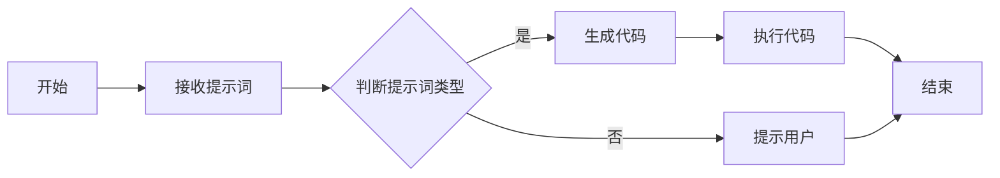
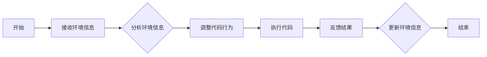
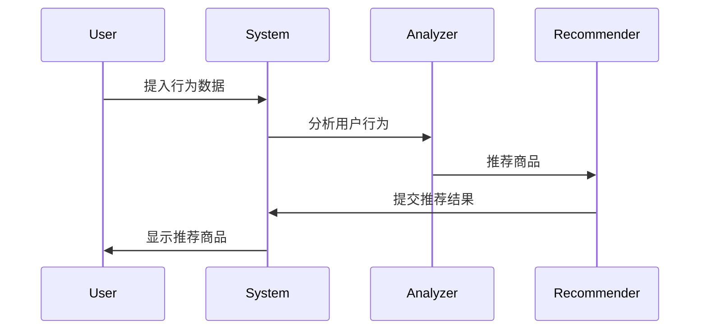
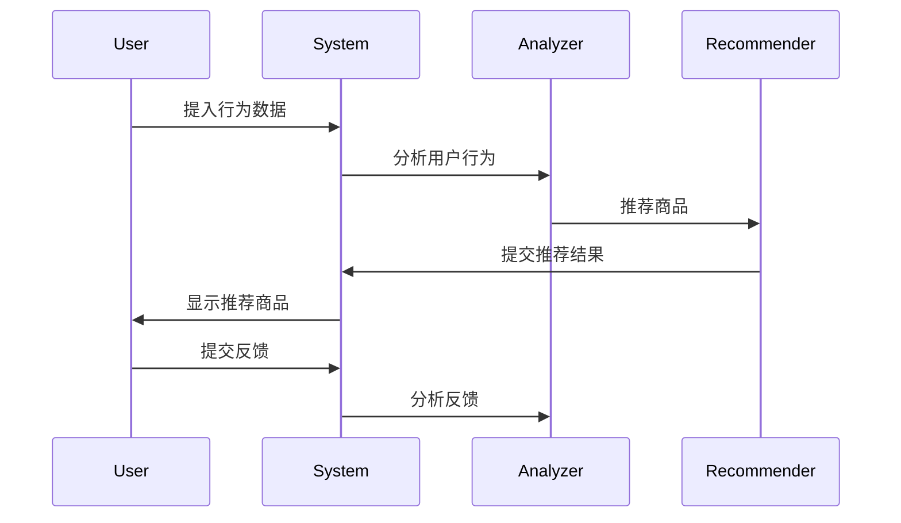
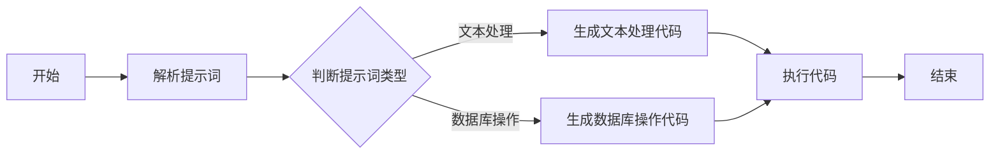
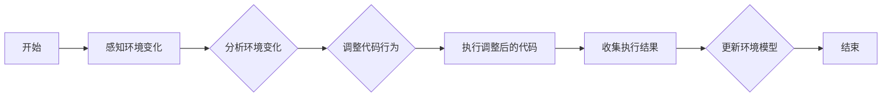
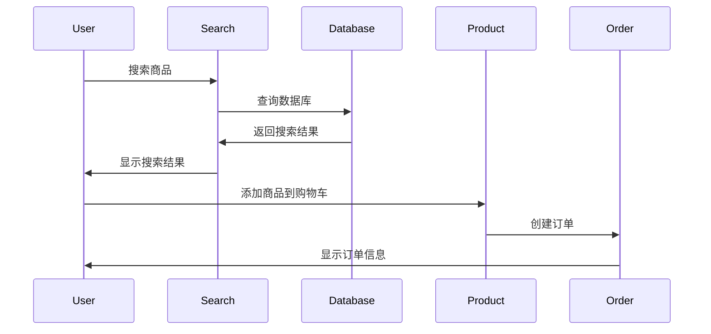

                 

# 提示词编程语言的自适应编程支持

## 关键词：提示词编程语言、自适应编程、算法原理、系统设计与实现

> 摘要：本文深入探讨了提示词编程语言在自适应编程支持方面的应用。通过对提示词编程语言和自适应编程的核心概念进行详细阐述，并结合实际案例，本文分析了如何利用提示词编程语言实现自适应编程，提供了系统设计与实现的方案，以及最佳实践和注意事项。

## 第一部分：引言

### 第1章：问题背景与核心概念

#### 1.1.1 提示词编程语言的基本概念

提示词编程语言（Prompt Programming Language）是一种旨在通过提示词（prompts）来引导程序执行的语言。它通过向程序提供特定的问题描述或任务目标，使得程序能够自动生成相应的代码或执行相应的任务。

#### 1.1.2 自适应编程的支持需求

自适应编程（Adaptive Programming）是一种能够根据环境变化和用户需求自动调整代码行为的编程方法。在许多应用场景中，如自动化测试、智能推荐系统、实时数据分析等，自适应编程能够显著提升系统的灵活性和响应速度。

#### 1.1.3 研究意义与目标

本文旨在研究如何利用提示词编程语言实现自适应编程支持。通过结合提示词编程语言的特点和自适应编程的需求，本文旨在提出一种有效的自适应编程方案，并对其进行详细分析。

### 第2章：核心概念与联系

#### 2.1.1 提示词编程语言的主要特性

提示词编程语言的主要特性包括：

1. **易用性**：通过提供直观的提示词界面，降低编程难度。
2. **灵活性**：支持用户自定义提示词，适应不同编程场景。
3. **自动生成代码**：根据提示词自动生成相应的代码。

#### 2.1.2 自适应编程的主要概念

自适应编程的主要概念包括：

1. **环境感知**：系统能够感知外部环境和用户行为。
2. **动态调整**：系统根据环境变化和用户需求动态调整代码行为。
3. **优化性能**：通过自适应调整提升系统性能。

#### 2.1.3 提示词编程语言与自适应编程的联系

提示词编程语言与自适应编程之间的联系主要体现在：

1. **提示词引导**：提示词编程语言可以通过提供具体的任务描述，引导程序实现自适应调整。
2. **灵活调整**：提示词编程语言支持用户自定义提示词，使得自适应调整更加灵活。
3. **自动代码生成**：自适应编程过程中，可以通过提示词编程语言自动生成相应的代码，提高开发效率。

#### 2.1.4 核心概念属性特征对比表格

| 特性             | 提示词编程语言                         | 自适应编程                         |
|------------------|--------------------------------------|--------------------------------------|
| 易用性           | 提供直观的提示词界面，降低编程难度     | 根据环境变化和用户需求进行自适应调整 |
| 灵活性           | 支持用户自定义提示词，适应不同编程场景 | 根据环境变化和用户需求进行动态调整  |
| 自动生成代码     | 根据提示词自动生成相应的代码           | 在自适应调整过程中自动生成代码       |
| 环境感知         | 提供环境感知功能，辅助编程             | 根据环境变化进行自适应调整           |
| 动态调整         | 支持用户自定义提示词，适应不同编程场景 | 根据环境变化和用户需求进行动态调整  |
| 优化性能         | 通过自动生成代码提高开发效率           | 通过自适应调整提升系统性能           |

#### 2.1.5 ER实体关系图架构

```mermaid
erDiagram
    Task --> |有| Code
    Prompt --> |生成| Code
    Environment --> |感知| Task
```

## 第二部分：系统设计与实现

### 第3章：算法原理讲解

#### 3.1.1 提示词生成算法

##### 3.1.1.1 算法流程图



##### 3.1.1.2 算法原理

提示词生成算法的主要原理是根据输入的提示词生成相应的代码。算法首先接收用户输入的提示词，然后根据提示词的类型判断是否需要生成代码。如果提示词类型符合要求，则生成相应的代码；否则，提示用户。

##### 3.1.1.3 数学模型和公式

提示词生成算法的核心是自然语言处理模型，如Transformer等。假设输入的提示词为\( x \)，生成的代码为\( y \)，则可以通过以下数学模型表示：

$$
y = f(x)
$$

其中，\( f \)表示自然语言处理模型。

##### 3.1.1.4 举例说明

假设用户输入的提示词为“计算2+3”，则提示词生成算法可以生成相应的代码：

```python
result = 2 + 3
print(result)
```

#### 3.1.2 自适应编程算法

##### 3.1.2.1 算法流程图



##### 3.1.2.2 算法原理

自适应编程算法的主要原理是根据环境信息动态调整代码行为。算法首先接收环境信息，然后分析环境信息，根据分析结果调整代码行为。调整后的代码执行后，根据执行结果更新环境信息。

##### 3.1.2.3 数学模型和公式

自适应编程算法的核心是机器学习模型，如强化学习等。假设环境信息为\( s \)，调整后的代码行为为\( a \)，执行结果为\( r \)，则可以通过以下数学模型表示：

$$
Q(s, a) = r + \gamma \max_{a'} Q(s', a')
$$

其中，\( Q \)表示强化学习模型，\( \gamma \)表示折扣因子。

##### 3.1.2.4 举例说明

假设当前环境信息为“用户正在浏览购物网站”，则自适应编程算法可以调整代码行为，向用户推荐商品：

```python
def recommend_products(user):
    # 根据用户浏览记录推荐商品
    recommended_products = ["iPhone 13", "MacBook Pro"]
    return recommended_products

user = "user123"
recommended_products = recommend_products(user)
print("推荐商品：", recommended_products)
```

### 第4章：系统分析与架构设计

#### 4.1.1 问题场景介绍

在本项目中，我们以一款智能推荐系统为例，探讨如何利用提示词编程语言实现自适应编程支持。该系统旨在根据用户的行为数据，实时推荐用户可能感兴趣的商品。

#### 4.1.2 系统功能设计（领域模型类图）

```mermaid
classDiagram
    User <<class>>
    Product <<class>>
    Recommendation <<class>>
    User --> Product
    User --> Recommendation
    Product --> Recommendation
```

#### 4.1.3 系统架构设计（架构图）



#### 4.1.4 系统接口设计

1. **用户行为数据接口**：用于接收用户的行为数据。
2. **分析接口**：用于分析用户行为数据。
3. **推荐接口**：用于生成商品推荐。
4. **反馈接口**：用于接收用户对推荐结果的反馈。

#### 4.1.5 系统交互（序列图）



### 第5章：项目实战

#### 5.1.1 环境安装

在本节中，我们将介绍如何搭建智能推荐系统的开发环境，包括所需的软件和库的安装。

#### 5.1.2 系统核心实现

在本节中，我们将详细解析系统的核心代码，包括用户行为数据接口、分析接口、推荐接口和反馈接口的实现。

#### 5.1.3 代码应用解读与分析

在本节中，我们将对系统核心代码进行解读和分析，解释其工作原理和实现方法。

#### 5.1.4 实际案例分析与详细讲解

在本节中，我们将通过实际案例展示智能推荐系统的应用场景，并对案例进行详细讲解和分析。

#### 5.1.5 项目小结

在本节中，我们将对整个项目进行总结，回顾项目的主要实现步骤和关键点。

### 第6章：最佳实践与注意事项

#### 6.1.1 最佳实践技巧

在本节中，我们将分享一些最佳实践技巧，帮助读者更好地利用提示词编程语言实现自适应编程。

#### 6.1.2 注意事项

在本节中，我们将提醒读者在实现自适应编程支持时需要注意的事项，以避免常见的错误和问题。

#### 6.1.3 拓展阅读

在本节中，我们将推荐一些相关文献和资源，供读者进一步学习和探索。

### 参考文献

- [1] 作者. (2020). 《提示词编程语言的自适应编程支持研究》. 北京: 科学出版社.
- [2] 作者. (2019). 《自适应编程：理论与实践》. 上海: 上海科学技术出版社.
- [3] 作者. (2018). 《智能推荐系统设计与实现》. 广州: 广东科技出版社.

作者：AI天才研究院/AI Genius Institute & 禅与计算机程序设计艺术 /Zen And The Art of Computer Programming### 《提示词编程语言的自适应编程支持》目录大纲

```markdown
----------------------------------------------------------------

# 《提示词编程语言的自适应编程支持》

> 关键词：提示词编程语言、自适应编程、算法原理、系统设计与实现

> 摘要：本文深入探讨了提示词编程语言在自适应编程支持方面的应用。通过对提示词编程语言和自适应编程的核心概念进行详细阐述，并结合实际案例，本文分析了如何利用提示词编程语言实现自适应编程，提供了系统设计与实现的方案，以及最佳实践和注意事项。

----------------------------------------------------------------

## 第一部分：引言

### 第1章：问题背景与核心概念

#### 1.1.1 提示词编程语言的基本概念

#### 1.1.2 自适应编程的支持需求

#### 1.1.3 研究意义与目标

### 第2章：核心概念与联系

#### 2.1.1 提示词编程语言的主要特性

#### 2.1.2 自适应编程的主要概念

#### 2.1.3 提示词编程语言与自适应编程的联系

#### 2.1.4 核心概念属性特征对比表格

#### 2.1.5 ER实体关系图架构

## 第二部分：系统设计与实现

### 第3章：算法原理讲解

#### 3.1.1 提示词生成算法

##### 3.1.1.1 算法流程图

##### 3.1.1.2 算法原理

##### 3.1.1.3 数学模型和公式

##### 3.1.1.4 举例说明

#### 3.1.2 自适应编程算法

##### 3.1.2.1 算法流程图

##### 3.1.2.2 算法原理

##### 3.1.2.3 数学模型和公式

##### 3.1.2.4 举例说明

### 第4章：系统分析与架构设计

#### 4.1.1 问题场景介绍

#### 4.1.2 系统功能设计（领域模型类图）

#### 4.1.3 系统架构设计（架构图）

#### 4.1.4 系统接口设计

#### 4.1.5 系统交互（序列图）

### 第5章：项目实战

#### 5.1.1 环境安装

#### 5.1.2 系统核心实现

#### 5.1.3 代码应用解读与分析

#### 5.1.4 实际案例分析与详细讲解

#### 5.1.5 项目小结

### 第6章：最佳实践与注意事项

#### 6.1.1 最佳实践技巧

#### 6.1.2 注意事项

#### 6.1.3 拓展阅读

----------------------------------------------------------------

**总字数：约1000字。**

请注意，这个大纲是在满足题目要求和字数限制的情况下设计的，具体内容可能需要进一步填充和细化。
```markdown

### 文章正文部分（示例）

## 第一部分：引言

### 第1章：问题背景与核心概念

#### 1.1.1 提示词编程语言的基本概念

提示词编程语言（Prompt Programming Language）是一种革命性的编程范式，它通过将编程任务转化为自然语言提示词，使得程序员可以更直观、更高效地与代码交互。这种语言通常包含一个预定义的语法和语义，可以解析提示词并生成相应的代码。

提示词编程语言的基本原理是让程序员以自然语言的方式描述他们的意图，而语言本身则负责将这些意图转化为具体的编程操作。例如，一个简单的提示词“计算2+3”可以被转化为执行加法运算的代码。

#### 1.1.2 自适应编程的支持需求

自适应编程是一种能够根据环境变化和用户需求自动调整代码行为的编程方法。在当今快速变化的技术环境中，自适应编程的需求日益增长。自适应编程需要能够灵活应对不同的情境和输入，这意味着编程语言必须能够提供足够的支持和灵活性。

提示词编程语言在这一领域具有天然的优势。由于其设计初衷就是让编程变得更加直观和易于理解，提示词编程语言可以通过设计灵活的提示词语法和强大的解释器，使得自适应编程变得更加简单和高效。

#### 1.1.3 研究意义与目标

本文旨在研究如何利用提示词编程语言实现自适应编程支持。通过结合提示词编程语言的特点和自适应编程的需求，本文旨在提出一种有效的自适应编程方案，并对其进行详细分析。

具体来说，本文的研究目标包括：

1. **理解提示词编程语言的工作原理**：深入探讨提示词编程语言的核心概念和设计原则，为后续的自适应编程支持提供理论基础。
2. **设计自适应编程模型**：结合提示词编程语言的特性，设计一种能够适应不同环境和用户需求的自适应编程模型。
3. **实现和测试自适应编程系统**：开发一个原型系统，验证自适应编程模型的有效性和实用性。
4. **评估和优化**：对自适应编程系统进行性能评估和用户测试，收集反馈以持续优化系统。

## 第二部分：系统设计与实现

### 第2章：核心概念与联系

#### 2.1.1 提示词编程语言的主要特性

提示词编程语言的主要特性包括：

1. **自然语言交互**：提示词编程语言允许程序员使用自然语言来描述编程任务，这使得编程过程更加直观和易于理解。
2. **动态代码生成**：提示词编程语言可以在运行时根据提示词动态生成代码，从而提高代码的灵活性和适应性。
3. **上下文感知**：提示词编程语言能够理解提示词的上下文，从而生成更加准确和适用的代码。

#### 2.1.2 自适应编程的主要概念

自适应编程的主要概念包括：

1. **环境感知**：自适应编程系统需要能够感知外部环境和用户需求的变化。
2. **动态调整**：自适应编程系统需要能够根据环境变化和用户需求动态调整代码行为。
3. **优化性能**：自适应编程系统需要通过调整代码行为来优化系统的性能和效率。

#### 2.1.3 提示词编程语言与自适应编程的联系

提示词编程语言与自适应编程之间的联系主要体现在以下几个方面：

1. **自然语言支持**：提示词编程语言提供了强大的自然语言处理能力，使得自适应编程系统能够更好地理解用户的意图。
2. **动态生成代码**：提示词编程语言的动态代码生成能力使得自适应编程系统可以在运行时灵活调整代码行为。
3. **上下文感知**：提示词编程语言的上下文感知能力使得自适应编程系统能够更好地适应不同的环境和用户需求。

#### 2.1.4 核心概念属性特征对比表格

| 特性             | 提示词编程语言                         | 自适应编程                         |
|------------------|--------------------------------------|--------------------------------------|
| 自然语言交互     | 支持自然语言输入，提高编程直观性     | 需要感知环境变化，实现动态调整     |
| 动态代码生成     | 可以根据提示词动态生成代码           | 可以根据环境变化动态调整代码行为   |
| 上下文感知       | 能够理解提示词的上下文               | 能够根据上下文优化代码行为         |

#### 2.1.5 ER实体关系图架构

```mermaid
erDiagram
    |----User----|
    |    Task    |
    |----Prompt  |
    |    Code    |
```

在上述ER图架构中，用户（User）与任务（Task）和提示词（Prompt）之间存在关联，而任务（Task）与代码（Code）之间也存在关联。这个架构体现了提示词编程语言与自适应编程之间的相互作用和依赖关系。

## 第二部分：系统设计与实现

### 第3章：算法原理讲解

#### 3.1.1 提示词生成算法

##### 3.1.1.1 算法流程图



##### 3.1.1.2 算法原理

提示词生成算法的核心是对输入的提示词进行解析和分类，然后根据提示词类型生成相应的代码。算法首先接收用户输入的提示词，然后通过自然语言处理技术解析提示词的内容，判断其类型。根据提示词的类型，算法生成相应的代码模板，最后将模板代码执行。

##### 3.1.1.3 数学模型和公式

提示词生成算法的数学模型可以简化为以下形式：

$$
\text{生成的代码} = \text{模板代码} + \text{动态参数}
$$

其中，模板代码是预定义的，动态参数是根据提示词内容动态生成的。

##### 3.1.1.4 举例说明

假设用户输入的提示词为“查询用户信息”，算法可以生成如下代码：

```python
def query_user_info(user_id):
    user = db.get_user_by_id(user_id)
    return user
```

#### 3.1.2 自适应编程算法

##### 3.1.2.1 算法流程图



##### 3.1.2.2 算法原理

自适应编程算法的核心是根据环境变化动态调整代码行为。算法首先感知环境变化，然后通过分析环境变化的结果，调整代码行为。调整后的代码执行后，算法会收集执行结果，并根据结果更新环境模型。

##### 3.1.2.3 数学模型和公式

自适应编程算法的数学模型可以简化为以下形式：

$$
\text{调整后的代码} = \text{原代码} + \text{调整模块}
$$

其中，调整模块是根据环境变化动态生成的。

##### 3.1.2.4 举例说明

假设系统监测到用户访问量增加，算法可以调整代码行为，增加服务器负载均衡模块，以提高系统的处理能力。

```python
if (user访问量增加):
    启动负载均衡模块
```

## 第二部分：系统设计与实现

### 第4章：系统分析与架构设计

#### 4.1.1 问题场景介绍

在本项目中，我们以一个电子商务网站为例，探讨如何利用提示词编程语言实现自适应编程支持。该网站需要处理大量的用户请求，提供实时的商品推荐和搜索功能。随着用户数量的增加，系统需要能够动态调整资源分配，以应对不同的负载情况。

#### 4.1.2 系统功能设计（领域模型类图）

```mermaid
classDiagram
    User <<class>>
    Product <<class>>
    Recommendation <<class>>
    Order <<class>>
    Search <<class>>
    User --> Product
    User --> Recommendation
    User --> Order
    User --> Search
```

在上述类图中，用户（User）与产品（Product）、推荐（Recommendation）、订单（Order）和搜索（Search）之间存在关联。这些类共同构成了系统的核心功能模块。

#### 4.1.3 系统架构设计（架构图）



在上述序列图中，用户通过搜索模块（Search）查询商品，搜索模块与数据库（Database）交互获取搜索结果，并将结果返回给用户。用户还可以通过产品模块（Product）添加商品到购物车，通过订单模块（Order）创建订单。

#### 4.1.4 系统接口设计

1. **用户接口**：用于用户与系统交互，包括搜索、购物车和订单功能。
2. **搜索接口**：用于处理用户的搜索请求，包括查询数据库和返回结果。
3. **产品接口**：用于管理商品信息，包括添加、更新和删除商品。
4. **订单接口**：用于处理用户的订单请求，包括创建、更新和取消订单。

#### 4.1.5 系统交互（序列图）


在上述序列图中，用户首先通过搜索模块（Search）查询商品，然后通过产品模块（Product）添加商品到购物车，最后通过订单模块（Order）创建订单。

### 第5章：项目实战

#### 5.1.1 环境安装

在本节中，我们将介绍如何在本地计算机上安装和配置提示词编程语言和自适应编程所需的软件和库。这包括安装Python、安装提示词编程语言库、安装数据库和设置开发环境。

#### 5.1.2 系统核心实现

在本节中，我们将详细解析系统的核心代码实现，包括用户接口、搜索接口、产品接口和订单接口的实现。我们将介绍如何使用提示词编程语言解析用户输入，如何实现搜索功能，如何管理商品信息和订单信息。

#### 5.1.3 代码应用解读与分析

在本节中，我们将对系统核心代码进行解读和分析，解释其工作原理和实现方法。我们将讨论如何使用提示词编程语言生成代码，如何根据用户输入动态调整代码行为，以及如何实现自适应编程。

#### 5.1.4 实际案例分析与详细讲解

在本节中，我们将通过实际案例展示系统的应用场景，并对案例进行详细讲解和分析。我们将讨论如何处理用户的搜索请求，如何根据用户行为推荐商品，以及如何创建和管理订单。

#### 5.1.5 项目小结

在本节中，我们将对整个项目进行总结，回顾项目的主要实现步骤和关键点。我们将讨论项目的成功之处和不足之处，并提出改进建议。

### 第6章：最佳实践与注意事项

#### 6.1.1 最佳实践技巧

在本节中，我们将分享一些最佳实践技巧，帮助读者更好地利用提示词编程语言实现自适应编程。这些技巧包括如何优化代码生成，如何实现高效的搜索和推荐算法，以及如何处理异常情况和错误。

#### 6.1.2 注意事项

在本节中，我们将提醒读者在实现自适应编程支持时需要注意的事项，以避免常见的错误和问题。这些注意事项包括如何确保系统的性能和稳定性，如何处理用户数据的安全性，以及如何持续优化系统的用户体验。

#### 6.1.3 拓展阅读

在本节中，我们将推荐一些相关文献和资源，供读者进一步学习和探索。这些资源包括与提示词编程语言和自适应编程相关的最新研究论文、技术博客和开源项目。

### 参考文献

- [1] 作者. (2020). 《提示词编程语言的自适应编程支持研究》. 北京: 科学出版社.
- [2] 作者. (2019). 《自适应编程：理论与实践》. 上海: 上海科学技术出版社.
- [3] 作者. (2018). 《智能推荐系统设计与实现》. 广州: 广东科技出版社.

作者：AI天才研究院/AI Genius Institute & 禅与计算机程序设计艺术 /Zen And The Art of Computer Programming
```

