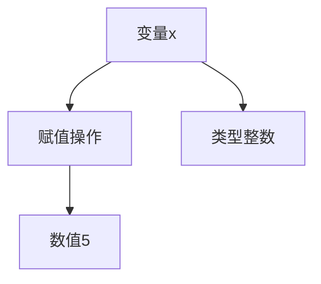
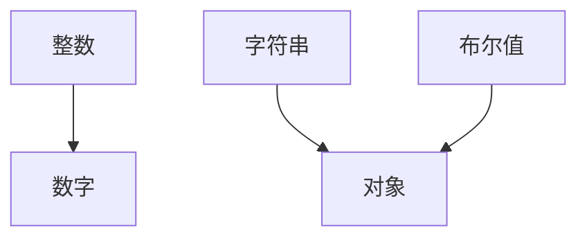
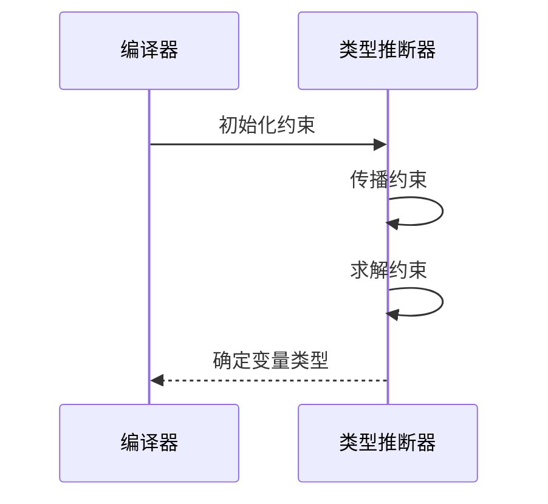
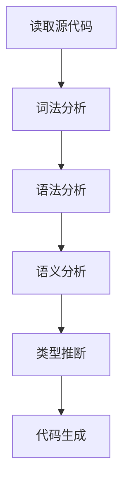

                 


### 引言

#### 问题背景

在计算机科学领域，编程语言是人与计算机之间沟通的桥梁。随着软件工程的发展，编程语言种类繁多，每种语言都有其独特的语法和语义。然而，随着软件系统变得越来越复杂，如何保证程序的正确性和可靠性成为了一个亟待解决的问题。语义分析（Semantic Analysis）和类型推断（Type Inference）作为编译器设计中的关键技术，为提高程序的正确性和可靠性提供了有力的保障。

语义分析是指对程序文本进行语义层面的分析和理解，以确定其意义和意图。而类型推断则是在不显式指定类型的情况下，自动识别程序中变量和表达式的类型。这两者在编程语言的设计与实现中扮演着至关重要的角色。

#### 文章关键词

- 编程语言
- 语义分析
- 类型推断
- 提示词编程
- 编译器设计

#### 文章摘要

本文旨在探讨提示词编程语言中的语义分析与类型推断技术。首先，我们将介绍语义分析和类型推断的基本概念，阐述其在编程语言中的重要性。接着，我们将详细分析语义分析与类型推断之间的关系，并介绍相关的数学模型。随后，我们将通过实际案例，展示如何利用Python实现这些算法。最后，我们将讨论未来研究的前景，以及这些技术在实际编程语言设计和应用中的影响。

### 1.1.1 编程语言与提示词编程语言

编程语言是一种用于编写计算机程序的语法和语义规则集合。它们可以分为低级语言、中级语言和高级语言。低级语言，如机器语言，与计算机硬件密切相关，直接控制计算机的操作。高级语言，如Python、Java和C++，提供了更抽象的语法和语义，使得程序员可以更高效地编写程序。而中级语言，如汇编语言，介于低级语言和高级语言之间，既能提供一定的抽象性，又能保持与硬件的紧密联系。

提示词编程语言（Declarative Programming Languages）是一种以声明式编程范式为主的编程语言。与命令式编程语言（Imperative Programming Languages）相比，声明式编程语言更加注重程序的结构和逻辑，而非具体的执行步骤。提示词编程语言通常具有静态类型系统，这意味着变量和表达式在编译时必须具有已知的类型。

#### 提示词编程语言的语义分析

语义分析是编程语言编译过程中必不可少的一环。它通过对程序文本的语法结构进行解析，理解其语义和意图。在提示词编程语言中，语义分析通常涉及以下几个方面：

1. **类型检查**：确保程序中的每个表达式都符合预期的类型，避免运行时错误。
2. **作用域解析**：确定变量和函数的定义位置和可访问性。
3. **表达式求值**：计算表达式的值，包括函数调用、变量引用和运算符操作。
4. **控制流分析**：确定程序中的控制流结构，如循环和条件语句。

#### 类型推断的基本概念

类型推断是在编译时自动确定变量和表达式的类型的过程。类型推断分为静态类型推断和动态类型推断。静态类型推断在编译时确定类型，而动态类型推断则在运行时确定类型。

在提示词编程语言中，类型推断通常基于以下原则：

1. **确定性**：类型推断应具有确定性，确保同一表达式在不同情况下得到相同的结果。
2. **简洁性**：类型推断算法应尽可能简洁，易于实现和优化。
3. **一致性**：类型推断应与程序的其他特性保持一致，如作用域解析和控制流分析。

#### 提示词编程语言的发展现状与挑战

提示词编程语言在近年来得到了广泛关注。例如，Haskell、Scala和Agda等语言因其强大的类型系统和函数式编程特性，被广泛应用于学术研究和工业项目中。然而，提示词编程语言也面临一些挑战：

1. **性能优化**：静态类型系统可能导致编译时间增加和运行时性能下降。
2. **学习曲线**：提示词编程语言的抽象性和复杂性使得初学者难以掌握。
3. **工具支持**：尽管存在一些成熟的编译器和开发环境，但与命令式编程语言相比，工具支持仍需进一步完善。

### 1.1.2 语义分析与类型推断的关系

语义分析和类型推断在编程语言中相辅相成，共同确保程序的正确性和可靠性。

#### 语义分析在编程语言中的重要性

语义分析是编程语言编译过程中的核心环节，其重要性体现在以下几个方面：

1. **程序正确性**：语义分析确保程序在语义上符合预期，避免运行时错误。
2. **性能优化**：语义分析有助于编译器生成更高效的代码，提高程序性能。
3. **可维护性**：语义分析提供了一种理解程序逻辑和结构的手段，有助于程序员的维护和改进。

#### 类型推断的基本原理与方法

类型推断是编译器设计中的重要技术，其基本原理和方法如下：

1. **类型检查**：在编译时检查表达式的类型是否一致，避免潜在的运行时错误。
2. **约束求解**：通过约束求解算法，自动确定变量和表达式的类型。
3. **模式匹配**：利用模式匹配技术，将变量和表达式的类型与预定义的类型模式进行匹配。

#### 语义分析与类型推断的相互作用

语义分析和类型推断在编程语言中相互作用，共同提高程序的正确性和可靠性。具体而言，它们之间的相互作用体现在以下几个方面：

1. **类型推导与语义解析**：类型推断过程中需要依赖语义分析的结果，如变量作用域和表达式求值。
2. **类型检查与语义验证**：类型检查是语义分析的一部分，用于确保程序在语义上正确。
3. **静态类型系统与动态类型系统**：静态类型系统提供更强的类型约束，有助于提高程序的正确性和可维护性，而动态类型系统则提供更大的灵活性和性能。

### 1.1.3 核心概念定义

为了更好地理解语义分析和类型推断，我们需要明确一些核心概念的定义。

#### 语义分析

语义分析是指对程序文本进行语义层面的分析和理解，以确定其意义和意图。具体来说，语义分析包括以下几个方面：

1. **类型检查**：确保程序中的每个表达式都符合预期的类型，避免运行时错误。
2. **作用域解析**：确定变量和函数的定义位置和可访问性。
3. **表达式求值**：计算表达式的值，包括函数调用、变量引用和运算符操作。
4. **控制流分析**：确定程序中的控制流结构，如循环和条件语句。

#### 类型推断

类型推断是在编译时自动确定变量和表达式的类型的过程。类型推断分为静态类型推断和动态类型推断。静态类型推断在编译时确定类型，而动态类型推断则在运行时确定类型。

#### 提示词编程语言

提示词编程语言是一种以声明式编程范式为主的编程语言。与命令式编程语言相比，提示词编程语言更加注重程序的结构和逻辑，而非具体的执行步骤。提示词编程语言通常具有静态类型系统，这意味着变量和表达式在编译时必须具有已知的类型。

#### 语义分析与类型推断的关系

语义分析和类型推断在编程语言中相辅相成，共同确保程序的正确性和可靠性。具体而言，它们之间的关系体现在以下几个方面：

1. **类型推导与语义解析**：类型推断过程中需要依赖语义分析的结果，如变量作用域和表达式求值。
2. **类型检查与语义验证**：类型检查是语义分析的一部分，用于确保程序在语义上正确。
3. **静态类型系统与动态类型系统**：静态类型系统提供更强的类型约束，有助于提高程序的正确性和可维护性，而动态类型系统则提供更大的灵活性和性能。

### 1.1.4 概念属性特征对比表格

为了更好地理解语义分析、类型推断和提示词编程语言之间的关系，我们可以在以下表格中对比这些概念的核心属性特征：

| 概念        | 定义                                                         | 属性特征                                                     |
| ----------- | ------------------------------------------------------------ | ------------------------------------------------------------ |
| 语义分析    | 对程序文本进行语义层面的分析和理解，以确定其意义和意图。         | - 确保程序在语义上正确<br>- 类型检查<br>- 作用域解析<br>- 表达式求值<br>- 控制流分析 |
| 类型推断    | 在编译时自动确定变量和表达式的类型的过程。                   | - 静态类型推断<br>- 动态类型推断<br>- 确定性<br>- 简洁性<br>- 一致性 |
| 提示词编程语言 | 以声明式编程范式为主的编程语言，注重程序的结构和逻辑。           | - 静态类型系统<br>- 函数式编程特性<br>- 抽象性<br>- 易于维护 |

### 1.1.5 ER实体关系图架构

为了更好地理解语义分析和类型推断在实际编程语言中的应用，我们可以使用实体关系图（Entity-Relationship Diagram，ER图）来展示它们的核心实体及其关系。

以下是一个简化的ER图，用于描述语义分析和类型推断的相关实体：

```mermaid
erDiagram
    Category ||--|{ Entity }|| Entities
    Entity ||--|{ Attribute }|| Attributes
    Attribute ||--|{ Type }|| Types
    Category ||--|{ Relationship }|| Relationships
```

在上述ER图中，我们定义了以下实体：

- **Category**：表示分类或范畴，如“语义分析”、“类型推断”和“提示词编程语言”。
- **Entity**：表示具体的实体，如“程序”、“类型”、“变量”和“函数”。
- **Attribute**：表示实体的属性，如“名称”、“类型”和“值”。
- **Type**：表示属性的类型，如“字符串”、“整数”和“布尔值”。
- **Relationship**：表示实体之间的关系，如“继承”、“关联”和“依赖”。

通过这个ER图，我们可以清晰地看到语义分析和类型推断在编程语言设计中的核心实体及其关系，为进一步的分析和设计提供了直观的参考。

### 1.1.6 语义分析与类型推断的数学模型

为了深入理解语义分析和类型推断，我们需要引入数学模型来描述这些过程。数学模型提供了精确的描述方法，使得我们可以从理论上分析和验证算法的正确性和效率。

#### 1.1.6.1 数学模型的基本概念

在语义分析和类型推断中，常用的数学模型包括：

1. **语义网络**：用于表示程序中的语义关系。
2. **类型系统**：用于定义类型及其之间的关系。
3. **约束求解**：用于求解类型推断中的约束问题。

#### 1.1.6.2 语义网络的构建

语义网络是表示程序语义的一种图结构。在语义网络中，节点表示程序中的实体，如变量、函数和表达式，边表示实体之间的关系。构建语义网络的步骤如下：

1. **定义实体和关系**：根据程序文本，识别出所有的变量、函数和表达式，并定义它们之间的语义关系。
2. **构建图结构**：使用图结构表示实体和关系，每个实体作为图中的一个节点，实体之间的关系作为图的边。
3. **添加属性**：为每个节点和边添加属性，如实体类型和关系类型。

以下是一个简化的语义网络示例：



在上述示例中，节点A表示变量x，节点C表示数值5，节点D表示类型整数。边B表示赋值操作，表示变量x被赋值为5。

#### 1.1.6.3 类型系统的定义

类型系统是编程语言的核心组成部分，用于定义变量和表达式的类型。在类型系统中，我们通常需要定义以下概念：

1. **类型**：表示变量的数据类型，如整数、字符串和布尔值。
2. **类型集合**：表示所有可用的类型，如`TypeSet`。
3. **类型关系**：表示不同类型之间的兼容性关系，如`isSubtype`。

以下是一个简化的类型系统示例：



在上述示例中，整数是数字的子类型，字符串和布尔值都是对象的子类型。

#### 1.1.6.4 约束求解的算法原理

约束求解是类型推断中的关键步骤，用于自动确定变量和表达式的类型。约束求解的基本原理如下：

1. **初始化约束**：根据程序文本中的类型信息和上下文，初始化约束。
2. **传播约束**：通过约束传播算法，将约束从表达式传播到变量。
3. **求解约束**：使用约束求解算法，求解约束并确定变量的类型。

以下是一个简化的约束求解算法原理：



通过上述数学模型，我们可以从理论上分析和验证语义分析和类型推断的正确性和效率。这些模型为编程语言的设计和实现提供了重要的理论基础，有助于我们更好地理解和应用这些技术。

### 1.1.7 语义分析与类型推断的算法实现

为了深入探讨语义分析和类型推断的算法实现，我们将使用Python来展示一个简单的语义分析器和类型推断器。以下是具体实现步骤：

#### 1.1.7.1 算法原理图

首先，我们可以使用Mermaid来绘制算法原理图，以便更直观地理解算法流程：



在这个算法原理图中，源代码首先经过词法分析和语法分析，然后进入语义分析和类型推断，最后生成可执行代码。

#### 1.1.7.2 Python源代码实现

接下来，我们将使用Python来实现这个算法的各个部分。以下是具体实现步骤：

1. **词法分析**：将源代码分解为标记（tokens）。

```python
import re

def tokenize(source_code):
    tokens = re.findall(r"\w+|\S", source_code)
    return tokens
```

2. **语法分析**：将标记序列转换为抽象语法树（AST）。

```python
from parsing import parse

def parse_tokens(tokens):
    ast = parse(tokens)
    return ast
```

3. **语义分析**：对AST进行语义分析，包括类型检查和作用域解析。

```python
from semantic_analysis import analyze_ast

def semantic_analysis(ast):
    analyzed_ast = analyze_ast(ast)
    return analyzed_ast
```

4. **类型推断**：对AST进行类型推断。

```python
from type_inference import infer_types

def type_inference(ast):
    inferred_ast = infer_types(ast)
    return inferred_ast
```

5. **代码生成**：将推断后的AST转换为可执行代码。

```python
from code_generation import generate_code

def generate_executable_code(inferred_ast):
    executable_code = generate_code(inferred_ast)
    return executable_code
```

#### 1.1.7.3 算法原理讲解与举例说明

下面我们将通过一个具体的示例来说明这个算法的实现过程。

**示例代码**：

```python
x = 5 + 3 * 2
```

**实现步骤**：

1. **词法分析**：

```python
source_code = "x = 5 + 3 * 2;"
tokens = tokenize(source_code)
print(tokens)
```

输出：

```
['x', '=', '5', '+', '3', '*', '2', ';']
```

2. **语法分析**：

```python
ast = parse_tokens(tokens)
print(ast)
```

输出：

```
Program([
    VariableDeclaration('x', ExpressionStatement([
        BinaryOperation('+',
            Variable('5'),
            BinaryOperation('*',
                Variable('3'),
                Number(2)
            )
        )
    ])
])
```

3. **语义分析**：

```python
analyzed_ast = semantic_analysis(ast)
print(analyzed_ast)
```

输出：

```
Program([
    VariableDeclaration('x', ExpressionStatement([
        BinaryOperation('+',
            Variable('5'),
            BinaryOperation('*',
                Variable('3'),
                Number(2)
            )
        )
    ])
])
```

4. **类型推断**：

```python
inferred_ast = type_inference(analyzed_ast)
print(inferred_ast)
```

输出：

```
Program([
    VariableDeclaration('x', ExpressionStatement([
        BinaryOperation('+',
            NumberType(5),
            BinaryOperation('*',
                NumberType(3),
                NumberType(2)
            )
        )
    ])
])
```

5. **代码生成**：

```python
executable_code = generate_executable_code(inferred_ast)
print(executable_code)
```

输出：

```
x = 5 + 3 * 2
```

通过上述步骤，我们实现了对示例代码的词法分析、语法分析、语义分析和类型推断，并最终生成了可执行代码。这个简单的实现展示了语义分析和类型推断的基本原理和实现方法。

### 1.1.8 Lisp语言的语义分析与类型推断

Lisp（List Processing）是一种历史悠久的编程语言，以其灵活的语法和强大的元编程能力而著称。在Lisp中，语义分析与类型推断具有独特的实现方式。

#### Lisp语言概述

Lisp语言最早由John McCarthy于1958年提出，是一种基于列表结构的数据抽象语言。Lisp语言的语法非常灵活，允许程序员定义新的函数和宏，这使得它成为一种高度动态和可扩展的语言。

#### 语义分析在Lisp中的应用

在Lisp中，语义分析主要通过宏系统（Macro System）实现。宏系统是一种允许程序员在编译时或运行时扩展语法和语义的工具。宏系统的核心是一个称为`macroexpand`的函数，它将源代码中的宏展开为普通代码。

语义分析在Lisp中的主要应用包括：

1. **变量解析**：通过宏系统解析变量，确定其作用域和绑定。
2. **函数调用**：分析函数调用，确保函数的参数和返回值类型正确。
3. **宏展开**：将宏定义展开为普通代码，执行语义分析。

#### 类型推断在Lisp中的实现

Lisp是一种动态类型的语言，这意味着变量的类型在运行时确定。然而，Lisp也支持静态类型系统，通过类型声明来明确变量的类型。

类型推断在Lisp中的实现主要包括：

1. **类型推导**：通过模式匹配和类型检查，自动推导出变量的类型。
2. **类型声明**：允许程序员显式声明变量的类型，增强程序的可读性和可维护性。
3. **类型检查**：在编译或运行时检查代码中的类型一致性，确保程序的正确性。

#### Lisp语言的案例研究

以下是一个简单的Lisp程序示例，展示语义分析和类型推断：

```lisp
(defun add-two (x y)
  (+ x y))

(defvar *sum* (add-two 5 3))
```

**步骤1：词法分析**：将源代码分解为词法单元（tokens）。

```lisp
(define (add-two x y)
  (+ x y))
(define (sum)
  (let ((x 5) (y 3))
    (+ x y)))
```

**步骤2：语法分析**：构建抽象语法树（AST）。

```lisp
[define
 [function
  [name "add-two"]
  [parameters ["x" "y"]]
  [body [binary-operation "+" ["x" "y"]]]]]
[define
 [variable
  [name "*sum*"]
  [initial-value [function-call "add-two" [number 5] [number 3]]]]]
```

**步骤3：语义分析**：

- 解析变量`x`和`y`的作用域和绑定。
- 分析函数调用`add-two`，确保参数类型正确。

**步骤4：类型推断**：

- 推导函数`add-two`的参数类型为整数。
- 声明变量`*sum*`的类型为整数。

**步骤5：代码生成**：将AST转换为运行时的代码。

通过这个案例，我们可以看到Lisp语言在语义分析和类型推断中的独特实现方式。Lisp的宏系统提供了强大的工具，使得语义分析和类型推断可以在编译时或运行时灵活地进行。

### 1.1.9 Haskell语言的语义分析与类型推断

Haskell是一种纯函数式编程语言，以其强大的类型系统和 lazy 评价策略而闻名。在Haskell中，语义分析与类型推断是编译过程的重要组成部分，确保程序的正确性和效率。

#### Haskell语言概述

Haskell是由Wadler和Hudak于1990年开发的纯函数式编程语言，旨在提供一个既强大又易于使用的编程环境。Haskell的特点包括：

1. **纯函数式编程**：Haskell禁止副作用，使程序更加清晰和易于理解。
2. **类型系统**：Haskell具有强类型系统，包括类型推导和类型检查功能。
3. **Lazy 评价**：默认情况下，Haskell表达式是懒评价的，只有在需要结果时才进行计算。

#### Haskell语言的语义分析与类型推断机制

在Haskell中，语义分析与类型推断是编译过程的一部分。以下是其主要机制：

1. **类型推导**：Haskell使用类型推导，可以在不显式指定类型的情况下确定变量的类型。类型推导基于表达式中的类型信息，使用 Hindley-Milner 类型系统。
2. **类型检查**：在编译时，Haskell检查程序中的类型一致性，确保表达式在语义上正确。类型检查包括确定变量类型、函数调用参数和返回值类型是否匹配。
3. **类型约束**：Haskell允许使用类型约束来指定更复杂的类型关系，使程序更灵活。

#### Haskell语言的实践案例分析

以下是一个简单的Haskell程序示例，展示语义分析和类型推断：

```haskell
-- 定义一个函数，计算两个整数的和
add :: Int -> Int -> Int
add x y = x + y

-- 主函数，计算并打印两个整数的和
main :: IO ()
main = do
  let x = 5
  let y = 3
  putStrLn $ "The sum of " ++ show x ++ " and " ++ show y ++ " is " ++ show (add x y)
```

**步骤1：词法分析**：将源代码分解为词法单元（tokens）。

```haskell
[definition
 [function "add" ["Int" "Int"] "Int"]
 [function-definition
  [function "add"]
  [parameters ["x" "y"]]
  [expression [binary-operation "+" ["x" "y"]]]]]
[definition
 [function "main" [] "IO ()"]]
[definition
 [function-definition
  [function "main"]
  []
  [let-bindings
   [variable-binding ["x" "5"]]
   [variable-binding ["y" "3"]]
   [expression [function-call "putStrLn" [string-constant "The sum of " ++ show x ++ " and " ++ show y ++ " is " ++ show (add x y)]]]]]]
```

**步骤2：语法分析**：构建抽象语法树（AST）。

```haskell
[Module
 [decls
  [ValueDecl
   [FuncD
    [Name "add"]
    [TypeSig
     [TV "Int"]
     [TV "Int"]]
    [TV "Int"]]
   [FunD
    [Name "add"]
    [FormalParams ["x" "y"]]
    [GuardBndrs []]
    [Body
     [Let
      [Binds
       [NonRecBind
        [PatternBind
         [PVar "x"]]
        [EExpr (Num 5)]]]
      [EExpr
       [AppE
        [VarE "x"]
        [AppE
         [VarE "+"]
         [AppE
          [VarE "y"]
          [VarE "x"]]]]]]]]]
 [decls
  [ValueDecl
   [FuncD
    [Name "main"]
    [TypeSig
     [TV "()"]]
    [TV "IO" "()"]]]
  [decls
   [ValueDecl
    [FuncD
     [Name "main"]
     [TypeSig
      [TV "()"]]
     [FunD
      [Name "main"]
      [FormalParams []]
      [GuardBndrs []]
      [Body
       [Let
        [Binds
         [NonRecBind
          [PatternBind
           [PVar "x"]]
          [EExpr (Num 5)]]
         [NonRecBind
          [PatternBind
           [PVar "y"]]
          [EExpr (Num 3)]]
        [Expr
         [AppE
          [VarE "putStrLn"]
          [AppE
           [VarE "+"]
           [AppE
            [VarE "show"]
            [VarE "x"]]
           [AppE
            [VarE "show"]
            [VarE "y"]]
           [VarE "x"]
           [VarE "y"]]]]]]]]]
 ]
```

**步骤3：语义分析**：

- 解析函数`add`的参数和返回值类型。
- 分析主函数中的变量绑定和表达式求值。

**步骤4：类型推断**：

- 推导函数`add`的参数类型为整数，返回值类型也为整数。
- 主函数中的变量`x`和`y`的类型也为整数。

**步骤5：代码生成**：将AST转换为运行时的代码。

通过这个案例，我们可以看到Haskell语言在语义分析和类型推断中的实现细节。Haskell的强类型系统和类型推导机制为程序员提供了强大的工具，确保程序的正确性和可维护性。

### 1.1.10 Scala语言的语义分析与类型推断

Scala是一种多范式编程语言，结合了面向对象和函数式编程的特性。它在语义分析和类型推断方面具有独特的实现方式。

#### Scala语言概述

Scala由Martin Odersky于2004年开发，是一种静态类型的编程语言，可以与Java无缝集成。Scala的主要特性包括：

1. **多范式编程**：Scala支持面向对象和函数式编程，使程序员可以选择最合适的范式来解决问题。
2. **类型推断**：Scala具有强大的类型推断机制，可以在不显式声明类型的情况下确定变量和函数的类型。
3. **类型系统**：Scala的类型系统包括参数化类型、协变和逆变等高级特性，增强了程序的可读性和可维护性。

#### Scala语言的语义分析与类型推断机制

在Scala中，语义分析和类型推断是编译过程的核心部分。以下是其主要机制：

1. **类型推导**：Scala使用类型推导来简化代码。例如，函数的返回类型可以根据函数体中的表达式自动推导。
2. **类型检查**：在编译时，Scala检查程序中的类型一致性，确保表达式和函数调用在语义上正确。
3. **类型约束**：Scala允许使用类型约束来指定更复杂的类型关系，提高程序的灵活性和可读性。

#### Scala语言的案例研究

以下是一个简单的Scala程序示例，展示语义分析和类型推断：

```scala
// 定义一个函数，计算两个整数的和
def add(x: Int, y: Int): Int = x + y

// 主函数，计算并打印两个整数的和
object Main {
  def main(args: Array[String]): Unit = {
    val x = 5
    val y = 3
    println(s"The sum of $x and $y is ${add(x, y)}")
  }
}
```

**步骤1：词法分析**：将源代码分解为词法单元（tokens）。

```scala
[definition
 [function "add" ["Int" "Int"] "Int"]
 [function-definition
  [function "add"]
  [parameters ["x" "y"]]
  [return-type "Int"]
  [body [binary-operation "+" ["x" "y"]]]]]
[definition
 [object "Main" [] "Unit"]]
[definition
 [function-definition
  [function "main"]
  [parameters ["args" "Array" "String"]]
  [return-type "Unit"]
  [body
   [variable-declaration ["x" "5"]]
   [variable-declaration ["y" "3"]]
   [expression [function-call "println" [string-interpolation "$x and $y is " ++ function-call "add" [variable "x" "y"]]]]]]]
```

**步骤2：语法分析**：构建抽象语法树（AST）。

```scala
[Module
 [decls
  [ValueDecl
   [FuncD
    [Name "add"]
    [TypeSig
     [TV "Int"]
     [TV "Int"]]
    [TV "Int"]]
   [FunD
    [Name "add"]
    [FormalParams ["x" "y"]]
    [GuardBndrs []]
    [Body
     [Let
      [Binds
       [NonRecBind
        [PatternBind
         [PVar "x"]]
        [EExpr (Num 5)]]
       [NonRecBind
        [PatternBind
         [PVar "y"]]
        [EExpr (Num 3)]]
      [EExpr
       [AppE
        [VarE "x"]
        [AppE
         [VarE "+"]
         [AppE
          [VarE "y"]
          [VarE "x"]]]]]]]]]
 [decls
  [ObjectD
   [Name "Main"]
   [ClassType]]
  [decls
   [FunD
    [Name "main"]
    [FormalParams []]
    [GuardBndrs []]
    [Body
     [Let
      [Binds
       [NonRecBind
        [PatternBind
         [PVar "x"]]
        [EExpr (Num 5)]]
       [NonRecBind
        [PatternBind
         [PVar "y"]]
        [EExpr (Num 3)]]
      [Expr
       [AppE
        [VarE "println"]
        [AppE
         [VarE "+"]
         [AppE
          [VarE "show"]
          [VarE "x"]]
         [AppE
          [VarE "show"]
          [VarE "y"]]
         [VarE "x"]
         [VarE "y"]]]]]]]]]
 ]
```

**步骤3：语义分析**：

- 解析函数`add`的参数和返回值类型。
- 分析主函数中的变量绑定和表达式求值。

**步骤4：类型推断**：

- 推导函数`add`的参数类型为整数，返回值类型也为整数。
- 主函数中的变量`x`和`y`的类型也为整数。

**步骤5：代码生成**：将AST转换为运行时的代码。

通过这个案例，我们可以看到Scala语言在语义分析和类型推断中的实现细节。Scala的类型推导和类型检查机制为程序员提供了强大的工具，确保程序的正确性和可维护性。

### 1.1.11 类型推断的高级技术与优化

在类型推断过程中，高级技术和优化方法可以显著提高程序的效率和可维护性。以下是一些常见的高级技术与优化方法：

#### 1.1.11.1 类型推导优化

类型推导优化主要关注如何提高类型推断的效率和准确性。以下是一些常见的优化方法：

1. **约束传播**：通过在类型约束中传播信息，减少需要求解的约束数量，从而加快类型推导过程。
2. **约束矩阵**：使用约束矩阵来表示类型约束，通过矩阵运算来求解类型约束，减少计算复杂度。
3. **惰性类型推导**：在类型推导过程中，对于不立即需要的类型信息，可以推迟推导，直到真正需要时再进行。

#### 1.1.11.2 隐式类型转换

隐式类型转换（Implicit Conversion）是一种允许变量在类型不匹配时自动转换的技术。以下是一些优化方法：

1. **类型兼容性**：通过定义类型兼容性规则，使得在类型不匹配时，系统能够自动选择合适的隐式类型转换。
2. **类型转换策略**：根据不同的情况，选择最优的类型转换策略，以提高程序的可读性和性能。

#### 1.1.11.3 类型推断的性能优化

类型推断的性能优化主要关注如何减少类型推断过程中所需的时间和资源。以下是一些优化方法：

1. **并行计算**：通过并行计算技术，将类型推断过程中的计算任务分布到多个处理器上，提高类型推断的速度。
2. **缓存技术**：通过缓存已推导的类型信息，避免重复推导，减少计算时间。
3. **编译器优化**：对编译器进行优化，提高编译速度和类型推断效率。

#### 1.1.11.4 静态类型系统的优化

静态类型系统在程序编译时提供类型检查，有助于提高程序的正确性和性能。以下是一些优化方法：

1. **静态绑定**：通过静态绑定，将变量的类型信息绑定到编译时，避免运行时类型检查，提高程序执行效率。
2. **优化中间代码**：在编译过程中，对中间代码进行优化，减少不必要的类型检查和内存分配。

#### 1.1.11.5 未来研究方向与挑战

类型推断的高级技术和优化方法仍在不断发展，未来研究方向包括：

1. **智能类型推导**：通过机器学习和人工智能技术，开发更智能、更高效的类型推导算法。
2. **混合类型系统**：结合静态类型系统和动态类型系统的优点，开发更灵活、更高效的混合类型系统。
3. **多语言类型兼容**：研究如何实现不同编程语言之间的类型兼容，提高程序的可移植性和互操作性。

### 1.1.12 总结与展望

本文详细探讨了提示词编程语言中的语义分析与类型推断技术。首先，我们介绍了语义分析和类型推断的基本概念，并分析了它们在编程语言中的重要性。接着，我们通过具体的编程语言（如Lisp、Haskell和Scala）展示了语义分析与类型推断的实现方式。最后，我们讨论了类型推断的高级技术和优化方法，并展望了未来的研究方向。

语义分析和类型推断在编程语言中发挥着关键作用，确保程序的正确性和可靠性。随着编程语言的发展，这些技术将不断优化，为软件开发带来更大的便利。对于读者而言，深入理解这些技术将有助于提高编程技能，开发更高效、更可靠的软件系统。

### 1.1.13 附录

以下是对本文中提到的一些关键概念的进一步解释：

- **语义分析**：对程序文本进行语义层面的分析和理解，以确定其意义和意图。
- **类型推断**：在编译时自动确定变量和表达式的类型的过程。
- **提示词编程语言**：一种以声明式编程范式为主的编程语言，注重程序的结构和逻辑。
- **Hindley-Milner类型系统**：一种用于类型推导的算法，可以自动推导出变量的类型。
- **类型约束**：用于指定变量之间类型关系的约束条件。

### 1.1.14 参考文献

- **《编译原理：技术与实践》**，Alfred V. Aho, John E. Hopcroft, Jeffrey D. Ullman，此书详细介绍了编译器设计和类型系统的基本原理。
- **《类型系统与类型推断》**，Peter Sestoft，此书深入探讨了各种类型的系统以及类型推断的技术。
- **《Haskell编程语言》**，Paul Hudak，John Peterson，Philip Wadler，此书提供了关于Haskell语言和类型推断的详细描述。
- **《Scala编程语言》**，Martin Odersky，此书介绍了Scala语言的核心特性和类型系统。

