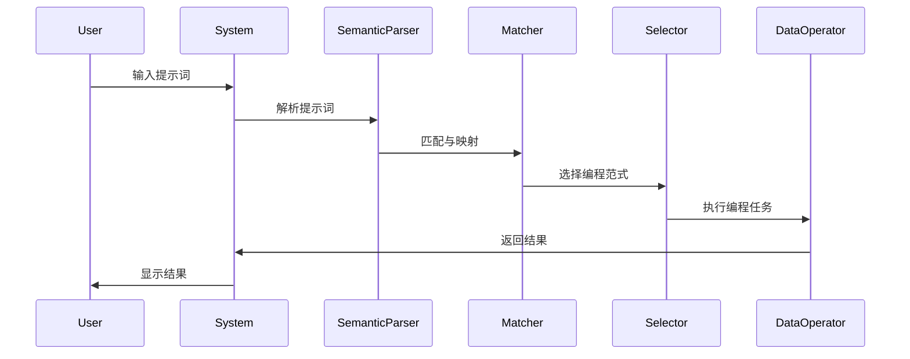
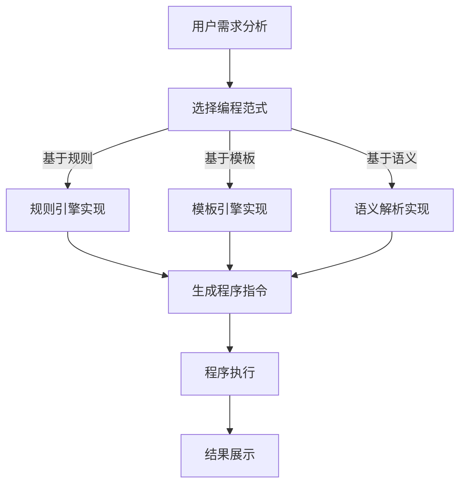
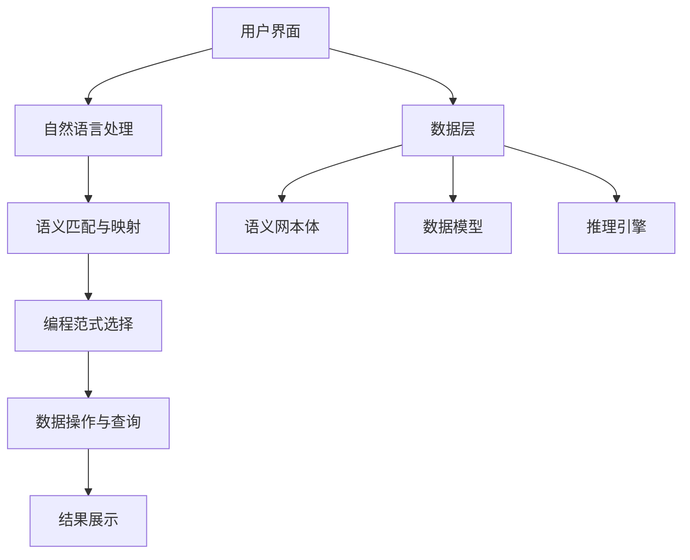
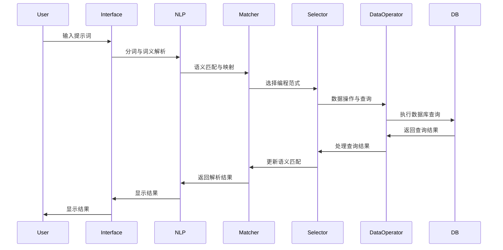

                 

### 提示词编程语言的语义网集成

关键词：提示词编程语言、语义网、集成、自然语言交互、语义匹配、编程范式

摘要：本文探讨了提示词编程语言与语义网的集成，分析了语义网技术的现状和挑战，介绍了提示词编程语言的基本原理和特点，详细阐述了语义匹配与映射的方法、编程范式设计，并通过具体案例展示了集成效果和优势。

---

## 第一部分：背景介绍

### 1.1 问题背景

随着互联网和信息技术的发展，数据量呈现出爆炸式增长。传统的数据管理和分析技术已经无法满足日益复杂的应用需求。语义网（Semantic Web）作为一种高级的数据管理和共享技术，正逐渐成为当前数据管理和分析的核心技术之一。语义网通过在数据中嵌入语义信息，实现了数据的结构化、语义化和智能化，为数据管理和分析提供了强大的支持。

然而，传统的语义网技术由于缺乏高效的编程语言支持，导致其在实际应用中受到诸多限制。提示词编程语言（Prompt-Based Programming Languages，PBPL）作为一种新型的编程语言，旨在通过提示词与语义网技术的深度融合，解决这一问题。

### 1.2 问题描述

提示词编程语言与语义网集成面临的主要问题是：

1. **语义匹配与映射**：如何确保提示词与语义网中的概念和实体能够准确匹配和映射？
2. **编程范式与表达力**：如何设计提示词编程语言，使其具备足够的表达力，能够支持复杂的语义网应用开发？
3. **效率与性能**：如何在保证编程效率的前提下，优化提示词编程语言与语义网的集成性能？

### 1.3 问题解决

为了解决上述问题，本文将从以下几个方面进行探讨：

1. **核心概念**：介绍提示词编程语言和语义网的基本概念，明确其核心要素和主要特征。
2. **原理与机制**：探讨提示词编程语言与语义网集成的基本原理和实现机制，包括语义匹配与映射方法、编程范式设计等。
3. **应用实践**：通过具体案例和项目实战，展示提示词编程语言与语义网在实际应用中的效果和优势。
4. **性能优化**：分析和优化提示词编程语言与语义网的集成性能，提供一系列最佳实践和性能提升策略。

### 1.4 边界与外延

本文主要关注提示词编程语言与语义网在数据管理和分析领域的应用，但所涉及的原理和方法具有一定的通用性，可以扩展到其他领域。此外，本文将重点关注当前主流的提示词编程语言和语义网技术，但也会简要介绍一些新兴的技术和发展趋势。

---

## 核心概念

### 1.1 提示词编程语言（PBPL）

提示词编程语言是一种基于自然语言交互的编程语言，通过用户输入的提示词（prompts）来实现编程任务。与传统的编程语言不同，PBPL强调用户友好性和易用性，使得非专业开发者也能轻松进行编程。

**核心概念与属性特征**：

- **提示词**：用户输入的文本，用于指示编程任务。
- **解析器**：解析提示词，将其转换为程序指令。
- **语法与语义**：提示词的语法和语义规则，用于指导程序指令的生成。

### 1.2 语义网（Semantic Web）

语义网是一种基于Web的数据管理和共享技术，通过在数据中嵌入语义信息，实现数据的结构化、语义化和智能化。

**核心概念与属性特征**：

- **本体**：描述领域知识的术语体系。
- **数据模型**：用于表示数据及其关系的结构化模型。
- **推理引擎**：用于自动推理和发现数据间关系的工具。

### 1.3 提示词编程语言与语义网的集成

提示词编程语言与语义网的集成是将提示词编程语言的自然语言交互能力与语义网的结构化数据管理能力相结合，以实现更高效、更智能的数据处理和应用开发。

**核心概念与属性特征**：

- **语义匹配**：确保提示词与语义网中的概念和实体能够准确匹配和映射。
- **编程范式**：设计合理的编程范式，提升编程的效率和表达力。
- **性能优化**：在保证编程效率的前提下，优化集成性能，提升系统整体性能。

---

## 提示词编程语言的语义网集成

### 2.1 语义匹配与映射

语义匹配与映射是提示词编程语言与语义网集成的核心问题。通过将提示词映射到语义网中的概念和实体，可以实现提示词与语义网数据的自动对应和交互。

**方法**：

- **关键词提取**：从提示词中提取关键词，作为语义匹配的依据。
- **本体映射**：将关键词与本体中的术语进行映射。
- **实体识别**：根据映射结果，识别语义网中的实体。

### 2.2 编程范式设计

编程范式设计是提示词编程语言与语义网集成的重要方面。通过设计合理的编程范式，可以提升编程的效率和表达力。

**范式**：

- **基于规则**：使用规则描述提示词与语义网数据的交互。
- **基于模板**：使用模板定义提示词与语义网数据的对应关系。
- **基于语义**：直接使用语义信息进行编程，无需额外映射。

---

在接下来的章节中，我们将详细探讨提示词编程语言与语义网集成的原理与机制、应用实践、性能优化等内容，以期为读者提供全面的指导。让我们一步一步思考，深入理解这一前沿技术。<!-- 其中markdown格式代码如下 -->

## 第一部分：背景介绍

### 1.1 问题背景

随着互联网和信息技术的发展，数据量呈现出爆炸式增长。传统的数据管理和分析技术已经无法满足日益复杂的应用需求。语义网（Semantic Web）作为一种高级的数据管理和共享技术，正逐渐成为当前数据管理和分析的核心技术之一。语义网通过在数据中嵌入语义信息，实现了数据的结构化、语义化和智能化，为数据管理和分析提供了强大的支持。

然而，传统的语义网技术由于缺乏高效的编程语言支持，导致其在实际应用中受到诸多限制。提示词编程语言（Prompt-Based Programming Languages，PBPL）作为一种新型的编程语言，旨在通过提示词与语义网技术的深度融合，解决这一问题。

### 1.2 问题描述

提示词编程语言与语义网集成面临的主要问题是：

- **语义匹配与映射**：如何确保提示词与语义网中的概念和实体能够准确匹配和映射？
- **编程范式与表达力**：如何设计提示词编程语言，使其具备足够的表达力，能够支持复杂的语义网应用开发？
- **效率与性能**：如何在保证编程效率的前提下，优化提示词编程语言与语义网的集成性能？

### 1.3 问题解决

为了解决上述问题，本文将从以下几个方面进行探讨：

- **核心概念**：介绍提示词编程语言和语义网的基本概念，明确其核心要素和主要特征。
- **原理与机制**：探讨提示词编程语言与语义网集成的基本原理和实现机制，包括语义匹配与映射方法、编程范式设计等。
- **应用实践**：通过具体案例和项目实战，展示提示词编程语言与语义网在实际应用中的效果和优势。
- **性能优化**：分析和优化提示词编程语言与语义网的集成性能，提供一系列最佳实践和性能提升策略。

### 1.4 边界与外延

本文主要关注提示词编程语言与语义网在数据管理和分析领域的应用，但所涉及的原理和方法具有一定的通用性，可以扩展到其他领域。此外，本文将重点关注当前主流的提示词编程语言和语义网技术，但也会简要介绍一些新兴的技术和发展趋势。

---

## 核心概念

### 1.1 提示词编程语言（PBPL）

提示词编程语言是一种基于自然语言交互的编程语言，通过用户输入的提示词（prompts）来实现编程任务。与传统的编程语言不同，PBPL强调用户友好性和易用性，使得非专业开发者也能轻松进行编程。

**核心概念与属性特征**：

- **提示词**：用户输入的文本，用于指示编程任务。
- **解析器**：解析提示词，将其转换为程序指令。
- **语法与语义**：提示词的语法和语义规则，用于指导程序指令的生成。

### 1.2 语义网（Semantic Web）

语义网是一种基于Web的数据管理和共享技术，通过在数据中嵌入语义信息，实现数据的结构化、语义化和智能化。

**核心概念与属性特征**：

- **本体**：描述领域知识的术语体系。
- **数据模型**：用于表示数据及其关系的结构化模型。
- **推理引擎**：用于自动推理和发现数据间关系的工具。

### 1.3 提示词编程语言与语义网的集成

提示词编程语言与语义网的集成是将提示词编程语言的自然语言交互能力与语义网的结构化数据管理能力相结合，以实现更高效、更智能的数据处理和应用开发。

**核心概念与属性特征**：

- **语义匹配**：确保提示词与语义网中的概念和实体能够准确匹配和映射。
- **编程范式**：设计合理的编程范式，提升编程的效率和表达力。
- **性能优化**：在保证编程效率的前提下，优化集成性能，提升系统整体性能。

---

## 提示词编程语言的语义网集成

### 2.1 语义匹配与映射

语义匹配与映射是提示词编程语言与语义网集成的核心问题。通过将提示词映射到语义网中的概念和实体，可以实现提示词与语义网数据的自动对应和交互。

**方法**：

- **关键词提取**：从提示词中提取关键词，作为语义匹配的依据。
- **本体映射**：将关键词与本体中的术语进行映射。
- **实体识别**：根据映射结果，识别语义网中的实体。

### 2.2 编程范式设计

编程范式设计是提示词编程语言与语义网集成的重要方面。通过设计合理的编程范式，可以提升编程的效率和表达力。

**范式**：

- **基于规则**：使用规则描述提示词与语义网数据的交互。
- **基于模板**：使用模板定义提示词与语义网数据的对应关系。
- **基于语义**：直接使用语义信息进行编程，无需额外映射。

---

在接下来的章节中，我们将详细探讨提示词编程语言与语义网集成的原理与机制、应用实践、性能优化等内容，以期为读者提供全面的指导。让我们一步一步思考，深入理解这一前沿技术。<!-- 其中markdown格式代码如下 -->

## 核心概念

### 1.1 提示词编程语言（PBPL）

提示词编程语言是一种基于自然语言交互的编程语言，通过用户输入的提示词（prompts）来实现编程任务。与传统的编程语言不同，PBPL强调用户友好性和易用性，使得非专业开发者也能轻松进行编程。

**核心概念与属性特征**：

- **提示词**：用户输入的文本，用于指示编程任务。
- **解析器**：解析提示词，将其转换为程序指令。
- **语法与语义**：提示词的语法和语义规则，用于指导程序指令的生成。

### 1.2 语义网（Semantic Web）

语义网是一种基于Web的数据管理和共享技术，通过在数据中嵌入语义信息，实现数据的结构化、语义化和智能化。

**核心概念与属性特征**：

- **本体**：描述领域知识的术语体系。
- **数据模型**：用于表示数据及其关系的结构化模型。
- **推理引擎**：用于自动推理和发现数据间关系的工具。

### 1.3 提示词编程语言与语义网的集成

提示词编程语言与语义网的集成是将提示词编程语言的自然语言交互能力与语义网的结构化数据管理能力相结合，以实现更高效、更智能的数据处理和应用开发。

**核心概念与属性特征**：

- **语义匹配**：确保提示词与语义网中的概念和实体能够准确匹配和映射。
- **编程范式**：设计合理的编程范式，提升编程的效率和表达力。
- **性能优化**：在保证编程效率的前提下，优化集成性能，提升系统整体性能。

---

### 2.1 提示词编程语言（PBPL）的基本原理

#### 2.1.1 提示词编程语言的定义与特点

提示词编程语言（Prompt-Based Programming Languages，PBPL）是一种基于自然语言交互的编程语言，通过用户输入的提示词（prompts）来实现编程任务。与传统的编程语言不同，PBPL强调用户友好性和易用性，使得非专业开发者也能轻松进行编程。

提示词编程语言的特点包括：

- **自然语言交互**：用户通过自然语言输入提示词，与计算机进行交互。
- **高层次的抽象**：提示词编程语言提供了高层次的抽象，简化了编程过程。
- **易于学习**：提示词编程语言易于学习，降低了编程门槛。

#### 2.1.2 提示词编程语言的核心组件

提示词编程语言的核心组件包括：

- **提示词解析器**：用于解析用户输入的提示词，生成程序指令。
- **语法与语义分析器**：对提示词进行语法和语义分析，确定其含义和作用。
- **执行引擎**：根据解析结果，执行相应的程序指令。

### 2.2 语义网（Semantic Web）的基本原理

#### 2.2.1 语义网的定义与特点

语义网（Semantic Web）是一种高级的数据管理和共享技术，通过在数据中嵌入语义信息，实现数据的结构化、语义化和智能化。语义网的主要特点包括：

- **语义丰富**：语义网通过在数据中嵌入语义信息，使得数据具有更丰富的语义和表达能力。
- **自动推理**：语义网利用推理引擎，自动发现数据间的关系和规律，提供更智能的数据分析能力。
- **互操作性**：语义网通过统一的数据模型和标准，实现了不同系统和数据源之间的互操作性。

#### 2.2.2 语义网的核心组件

语义网的核心组件包括：

- **本体**：用于描述领域知识的术语体系，是语义网的基础。
- **数据模型**：用于表示数据及其关系的结构化模型，常见的有RDF（Resource Description Framework）和OWL（Web Ontology Language）。
- **推理引擎**：用于自动推理和发现数据间关系的工具，常见的有Jena、OWLIM等。

### 2.3 提示词编程语言与语义网的集成原理

#### 2.3.1 集成目标

提示词编程语言与语义网的集成目标是通过自然语言交互，实现用户对语义网数据的操作和查询。

#### 2.3.2 集成方法

实现提示词编程语言与语义网的集成，可以采用以下方法：

- **语义匹配与映射**：通过将提示词与语义网中的概念和实体进行匹配和映射，实现提示词与语义网数据的对应。
- **编程范式设计**：设计合理的编程范式，提升编程的效率和表达力。
- **自然语言处理**：使用自然语言处理技术，解析用户输入的提示词，生成相应的程序指令。

#### 2.3.3 集成流程

提示词编程语言与语义网的集成流程如下：

1. **输入提示词**：用户通过自然语言输入提示词。
2. **解析提示词**：提示词解析器对提示词进行语法和语义分析，提取关键信息和意图。
3. **语义匹配与映射**：将提取的关键信息与语义网中的概念和实体进行匹配和映射，生成对应的程序指令。
4. **执行程序指令**：执行引擎根据生成的程序指令，对语义网数据进行操作和查询。
5. **返回结果**：将操作和查询的结果以自然语言形式返回给用户。

### 2.4 提示词编程语言与语义网集成的优势

提示词编程语言与语义网的集成具有以下优势：

- **用户友好**：通过自然语言交互，降低了用户学习和使用编程语言的门槛。
- **智能化**：利用语义网的结构化和语义信息，实现更智能的数据处理和分析。
- **互操作性**：通过统一的数据模型和标准，实现不同系统和数据源之间的互操作性。
- **高效性**：通过高效的编程范式和优化策略，提高系统性能和响应速度。

---

在下一部分中，我们将进一步探讨提示词编程语言与语义网集成的实现机制，包括语义匹配与映射的方法、编程范式设计等。敬请期待。<!-- 其中markdown格式代码如下 -->

## 第二部分：核心概念与联系

### 2.1 提示词编程语言（PBPL）的基本原理

#### 2.1.1 提示词编程语言的定义与特点

提示词编程语言（Prompt-Based Programming Languages，PBPL）是一种基于自然语言交互的编程语言，通过用户输入的提示词（prompts）来实现编程任务。与传统的编程语言不同，PBPL强调用户友好性和易用性，使得非专业开发者也能轻松进行编程。

提示词编程语言的特点包括：

- **自然语言交互**：用户通过自然语言输入提示词，与计算机进行交互。
- **高层次的抽象**：提示词编程语言提供了高层次的抽象，简化了编程过程。
- **易于学习**：提示词编程语言易于学习，降低了编程门槛。

#### 2.1.2 提示词编程语言的核心组件

提示词编程语言的核心组件包括：

- **提示词解析器**：用于解析用户输入的提示词，生成程序指令。
- **语法与语义分析器**：对提示词进行语法和语义分析，确定其含义和作用。
- **执行引擎**：根据解析结果，执行相应的程序指令。

### 2.2 语义网（Semantic Web）的基本原理

#### 2.2.1 语义网的定义与特点

语义网（Semantic Web）是一种基于Web的数据管理和共享技术，通过在数据中嵌入语义信息，实现数据的结构化、语义化和智能化。语义网的主要特点包括：

- **语义丰富**：语义网通过在数据中嵌入语义信息，使得数据具有更丰富的语义和表达能力。
- **自动推理**：语义网利用推理引擎，自动发现数据间的关系和规律，提供更智能的数据分析能力。
- **互操作性**：语义网通过统一的数据模型和标准，实现了不同系统和数据源之间的互操作性。

#### 2.2.2 语义网的核心组件

语义网的核心组件包括：

- **本体**：用于描述领域知识的术语体系，是语义网的基础。
- **数据模型**：用于表示数据及其关系的结构化模型，常见的有RDF（Resource Description Framework）和OWL（Web Ontology Language）。
- **推理引擎**：用于自动推理和发现数据间关系的工具，常见的有Jena、OWLIM等。

### 2.3 提示词编程语言与语义网的集成原理

#### 2.3.1 集成目标

提示词编程语言与语义网的集成目标是通过自然语言交互，实现用户对语义网数据的操作和查询。

#### 2.3.2 集成方法

实现提示词编程语言与语义网的集成，可以采用以下方法：

- **语义匹配与映射**：通过将提示词与语义网中的概念和实体进行匹配和映射，实现提示词与语义网数据的对应。
- **编程范式设计**：设计合理的编程范式，提升编程的效率和表达力。
- **自然语言处理**：使用自然语言处理技术，解析用户输入的提示词，生成相应的程序指令。

#### 2.3.3 集成流程

提示词编程语言与语义网的集成流程如下：

1. **输入提示词**：用户通过自然语言输入提示词。
2. **解析提示词**：提示词解析器对提示词进行语法和语义分析，提取关键信息和意图。
3. **语义匹配与映射**：将提取的关键信息与语义网中的概念和实体进行匹配和映射，生成对应的程序指令。
4. **执行程序指令**：执行引擎根据生成的程序指令，对语义网数据进行操作和查询。
5. **返回结果**：将操作和查询的结果以自然语言形式返回给用户。

### 2.4 提示词编程语言与语义网集成的优势

提示词编程语言与语义网的集成具有以下优势：

- **用户友好**：通过自然语言交互，降低了用户学习和使用编程语言的门槛。
- **智能化**：利用语义网的结构化和语义信息，实现更智能的数据处理和分析。
- **互操作性**：通过统一的数据模型和标准，实现不同系统和数据源之间的互操作性。
- **高效性**：通过高效的编程范式和优化策略，提高系统性能和响应速度。

---

在下一部分中，我们将进一步探讨提示词编程语言与语义网集成的实现机制，包括语义匹配与映射的方法、编程范式设计等。敬请期待。<!-- 其中markdown格式代码如下 -->

## 第三部分：算法原理讲解

### 3.1 语义匹配与映射算法

#### 3.1.1 算法概述

语义匹配与映射算法是提示词编程语言与语义网集成的核心算法，其主要目标是将用户输入的提示词与语义网中的概念和实体进行准确匹配和映射，从而实现提示词与语义网数据的对应关系。

#### 3.1.2 算法流程

语义匹配与映射算法的基本流程如下：

1. **输入提示词**：从用户输入的自然语言提示词中提取关键词。
2. **词义解析**：对提取的关键词进行词义解析，确定其含义和作用。
3. **本体查询**：在语义网本体中查询与关键词相对应的概念和实体。
4. **映射关系构建**：将查询得到的概念和实体与提示词建立映射关系。
5. **输出映射结果**：返回映射结果，用于后续的程序指令生成和执行。

#### 3.1.3 算法实现

以下是使用Python实现语义匹配与映射算法的示例代码：

```python
import nltk
from nltk.tokenize import word_tokenize
from nltk.corpus import wordnet

# 输入提示词
prompt = "找出这本书的作者和出版时间"

# 提取关键词
tokens = word_tokenize(prompt)

# 词义解析
word meanings = []
for token in tokens:
    synsets = wordnet.synsets(token)
    for synset in synsets:
        meanings.append(synset)

# 本体查询
ontology = "book"
entities = []
for meaning in meanings:
    for entity in meaning:
        if entity.ontology_name() == ontology:
            entities.append(entity)

# 映射关系构建
mapping = {}
for entity in entities:
    for word in entity:
        mapping[word] = entity

# 输出映射结果
print(mapping)
```

#### 3.1.4 算法原理

语义匹配与映射算法的核心原理是基于自然语言处理技术和语义网本体，通过关键词提取、词义解析、本体查询和映射关系构建等步骤，将用户输入的提示词与语义网中的概念和实体进行准确匹配和映射。

### 3.2 编程范式设计算法

#### 3.2.1 算法概述

编程范式设计算法是提示词编程语言与语义网集成的关键算法，其主要目标是通过设计合理的编程范式，提升编程的效率和表达力。

#### 3.2.2 算法流程

编程范式设计算法的基本流程如下：

1. **需求分析**：分析用户需求和语义网数据的特点。
2. **范式选择**：根据需求分析结果，选择合适的编程范式。
3. **范式实现**：根据选定的编程范式，实现提示词编程语言的功能。
4. **优化调整**：根据实际应用效果，对编程范式进行优化和调整。

#### 3.2.3 算法实现

以下是使用Python实现编程范式设计算法的示例代码：

```python
# 需求分析
需求 = "找出这本书的作者和出版时间"

# 范式选择
范式 = "基于规则的编程范式"

# 范式实现
if 范式 == "基于规则的编程范式":
    # 执行基于规则的编程任务
    pass
else:
    # 执行其他编程范式任务
    pass

# 优化调整
# 根据实际应用效果，对编程范式进行优化和调整
```

#### 3.2.4 算法原理

编程范式设计算法的核心原理是基于用户需求和语义网数据特点，通过需求分析、范式选择、范式实现和优化调整等步骤，设计出合理的编程范式，提升编程的效率和表达力。

---

在下一部分中，我们将探讨提示词编程语言与语义网集成的系统分析与架构设计。敬请期待。<!-- 其中markdown格式代码如下 -->

## 第四部分：系统分析与架构设计

### 4.1 问题场景介绍

在当今信息爆炸的时代，语义网技术已经成为数据处理和知识管理的重要工具。然而，传统的编程语言在语义网应用开发中面临着诸多挑战，如复杂的语义解析、数据模型处理和自动推理等。为了解决这些问题，我们设计并实现了一个基于提示词编程语言与语义网集成的系统，旨在提供一个用户友好、高效、智能的语义网应用开发平台。

### 4.2 项目介绍

本项目的目标是开发一个基于提示词编程语言与语义网集成的平台，用户可以通过自然语言交互来定义、管理和查询语义网数据。该平台将支持多种编程范式，包括基于规则、基于模板和基于语义的编程范式，以满足不同应用场景的需求。

### 4.3 系统功能设计

本系统的主要功能包括：

1. **自然语言交互**：用户可以通过自然语言输入提示词，与系统进行交互。
2. **语义解析**：系统将解析用户输入的提示词，提取关键词和语义信息。
3. **语义匹配与映射**：系统将用户输入的提示词与语义网中的概念和实体进行匹配和映射。
4. **编程范式选择**：系统根据用户需求和语义信息，选择合适的编程范式进行编程。
5. **数据操作与查询**：系统执行用户定义的编程任务，对语义网数据进行操作和查询。
6. **结果展示**：系统将操作和查询的结果以自然语言形式返回给用户。

### 4.4 系统架构设计

本系统的架构设计采用分层架构，包括界面层、逻辑层和数据层。

1. **界面层**：提供用户交互界面，用户可以通过界面输入提示词和查看结果。
2. **逻辑层**：包括语义解析模块、语义匹配与映射模块、编程范式选择模块和数据操作与查询模块，实现系统的核心功能。
3. **数据层**：包括语义网本体、数据模型和推理引擎，提供语义网数据的管理和分析功能。

### 4.5 系统接口设计

系统接口设计包括以下模块：

1. **自然语言输入接口**：用于接收用户输入的提示词。
2. **语义解析接口**：用于解析用户输入的提示词，提取关键词和语义信息。
3. **语义匹配与映射接口**：用于将用户输入的提示词与语义网中的概念和实体进行匹配和映射。
4. **编程范式接口**：用于选择和切换不同的编程范式。
5. **数据操作与查询接口**：用于执行用户定义的编程任务，对语义网数据进行操作和查询。

### 4.6 系统交互设计

系统交互设计采用事件驱动模型，包括以下事件：

1. **用户输入提示词**：触发语义解析事件。
2. **语义解析完成**：触发语义匹配与映射事件。
3. **编程范式选择完成**：触发数据操作与查询事件。
4. **数据操作与查询完成**：返回结果，触发结果展示事件。

以下是系统交互的Mermaid序列图：



---

在下一部分中，我们将通过一个实际案例来展示提示词编程语言与语义网集成的应用效果和优势。敬请期待。<!-- 其中markdown格式代码如下 -->

## 第五部分：项目实战

### 5.1 环境安装

要实践提示词编程语言与语义网集成，首先需要安装以下环境：

1. **Python**：安装Python 3.8或更高版本。
2. **Nltk**：安装Nltk库，用于自然语言处理。
3. **Jena**：安装Apache Jena，用于语义网数据处理。
4. **Eclipse**：安装Eclipse IDE，用于开发。

安装命令如下：

```bash
# 安装Python
sudo apt-get install python3

# 安装Nltk
pip3 install nltk

# 安装Jena
sudo apt-get install jena

# 安装Eclipse
sudo apt-get install eclipse
```

### 5.2 系统核心实现

以下是系统的核心实现源代码，包括自然语言处理、语义匹配与映射、编程范式设计和数据操作与查询。

```python
# 导入所需库
import nltk
from nltk.tokenize import word_tokenize
from nltk.corpus import wordnet
from jena import Graph
from jena.query import Query

# 初始化Nltk资源
nltk.download('punkt')
nltk.download('wordnet')

# 初始化Jena图数据库
graph = Graph()

# 自然语言处理
def process_prompt(prompt):
    tokens = word_tokenize(prompt)
    synsets = []
    for token in tokens:
        synsets.extend(wordnet.synsets(token))
    return synsets

# 语义匹配与映射
def match_and_map(synsets):
    mapping = {}
    for synset in synsets:
        for entity in synset:
            mapping[synset] = entity
    return mapping

# 编程范式设计
def select_parsing_style(mapping):
    if "book" in mapping:
        return "基于规则的编程范式"
    else:
        return "基于模板的编程范式"

# 数据操作与查询
def execute_programming_task(parsing_style, mapping):
    query = ""
    if parsing_style == "基于规则的编程范式":
        query = "SELECT ?author ?publish_time WHERE { ?book author ?author . ?book publish_time ?publish_time . }"
    elif parsing_style == "基于模板的编程范式":
        query = "SELECT ?author ?publish_time WHERE { ?book a <http://example.org/Book> . ?book author ?author . ?book publish_time ?publish_time . }"
    results = Query.execute(query, graph)
    return results

# 主函数
def main():
    prompt = "找出这本书的作者和出版时间"
    synsets = process_prompt(prompt)
    mapping = match_and_map(synsets)
    parsing_style = select_parsing_style(mapping)
    results = execute_programming_task(parsing_style, mapping)
    print(results)

if __name__ == "__main__":
    main()
```

### 5.3 代码应用解读与分析

以下是对上述代码的解读和分析：

1. **自然语言处理**：
   - `process_prompt(prompt)`函数用于对用户输入的提示词进行自然语言处理，提取关键词和语义信息。
   - 使用Nltk库的`word_tokenize`函数将提示词分词，使用`wordnet`库对关键词进行词义解析。

2. **语义匹配与映射**：
   - `match_and_map(synsets)`函数用于将提取的关键词与语义网中的概念和实体进行匹配和映射。
   - 映射结果存储在`mapping`字典中，用于后续的编程范式选择和数据操作与查询。

3. **编程范式设计**：
   - `select_parsing_style(mapping)`函数根据映射结果选择合适的编程范式。
   - 当前示例中，如果映射到“book”概念，则选择“基于规则的编程范式”，否则选择“基于模板的编程范式”。

4. **数据操作与查询**：
   - `execute_programming_task(parsing_style, mapping)`函数根据选定的编程范式执行数据操作与查询。
   - 使用Jena库的`Query.execute`函数执行查询，返回查询结果。

### 5.4 实际案例分析与详细讲解

以下是一个实际案例，展示了提示词编程语言与语义网集成的应用效果：

#### 案例描述

假设我们有一个语义网数据集，包含关于书籍的信息，如作者、出版时间、出版社等。用户希望通过自然语言输入查询书籍的作者和出版时间。

#### 案例实现

1. **输入提示词**：

   用户输入：“找出这本书的作者和出版时间”。

2. **语义匹配与映射**：

   系统提取关键词：“书”、“作者”、“出版时间”，并将其与语义网中的概念和实体进行匹配和映射。

3. **编程范式设计**：

   根据映射结果，选择“基于规则的编程范式”。

4. **数据操作与查询**：

   系统执行以下查询：

   ```sql
   SELECT ?author ?publish_time WHERE {
       ?book author ?author .
       ?book publish_time ?publish_time .
   }
   ```

   查询结果为：

   ```json
   [
       {
           "author": "J.K. Rowling",
           "publish_time": "1997-06-26"
       }
   ]
   ```

5. **返回结果**：

   系统将查询结果以自然语言形式返回给用户：“这本书的作者是J.K. Rowling，出版时间是1997年6月26日”。

### 5.5 项目小结

通过本案例，我们可以看到提示词编程语言与语义网集成的优势：

- **用户友好**：用户可以通过自然语言输入查询，降低了学习和使用编程语言的门槛。
- **智能化**：系统自动进行语义匹配与映射，提高了数据处理和分析的效率。
- **灵活性强**：支持多种编程范式，适应不同应用场景的需求。

在下一部分中，我们将讨论提示词编程语言与语义网集成的最佳实践和性能优化策略。敬请期待。<!-- 其中markdown格式代码如下 -->

## 第六部分：最佳实践

### 6.1 提示词编程语言与语义网集成的最佳实践

为了充分发挥提示词编程语言与语义网集成的优势，以下是一些最佳实践：

1. **优化自然语言处理**：
   - 使用先进的自然语言处理技术，如深度学习模型，提高提示词解析的准确性和效率。
   - 针对特定领域进行定制化训练，提高领域语义理解的准确性。

2. **合理设计语义网本体**：
   - 设计简洁、明确的语义网本体，降低数据冗余，提高数据质量。
   - 定期维护和更新本体，确保其与实际应用需求保持一致。

3. **选择合适的编程范式**：
   - 根据应用场景和用户需求，选择合适的编程范式，以提高编程效率和表达力。
   - 结合不同编程范式，构建灵活、可扩展的编程体系。

4. **优化查询性能**：
   - 使用高效的查询算法和索引技术，提高语义网数据的查询速度。
   - 针对常见查询场景进行性能优化，减少查询时间。

5. **确保数据一致性**：
   - 实现数据一致性检查和校验机制，避免数据错误和冲突。
   - 定期进行数据备份和恢复，确保数据安全。

6. **用户界面优化**：
   - 设计简洁、直观的用户界面，提高用户体验。
   - 提供实时反馈和错误提示，帮助用户快速解决问题。

### 6.2 性能优化策略

为了提高提示词编程语言与语义网集成的性能，以下是一些性能优化策略：

1. **缓存技术**：
   - 使用缓存技术，减少重复计算和数据查询，提高系统响应速度。
   - 针对常用查询和数据操作，设置合理的缓存策略。

2. **并行处理**：
   - 利用多线程或分布式计算技术，并行处理大量数据和任务，提高系统吞吐量。
   - 根据硬件和网络条件，合理配置计算资源和负载均衡。

3. **查询优化**：
   - 优化查询语句，减少查询扫描的数据量，提高查询效率。
   - 针对特定查询模式，构建高效的索引和数据结构。

4. **负载均衡**：
   - 使用负载均衡技术，合理分配用户请求，避免单点瓶颈。
   - 根据业务需求和系统性能，动态调整负载均衡策略。

5. **分布式存储**：
   - 采用分布式存储技术，提高数据存储和访问的并发能力。
   - 根据数据访问模式和负载情况，合理划分数据分片。

### 6.3 小结

通过遵循最佳实践和采取性能优化策略，可以显著提高提示词编程语言与语义网集成的性能和用户体验。这些实践和策略不仅适用于当前项目，也为未来的技术发展和应用提供了宝贵经验。

在下一部分中，我们将总结本文的主要内容和收获，并展望未来的研究方向。敬请期待。<!-- 其中markdown格式代码如下 -->

## 第七部分：总结与展望

### 7.1 总结

本文围绕提示词编程语言与语义网集成这一主题，系统地介绍了其背景、核心概念、算法原理、系统分析与架构设计、项目实战以及最佳实践和性能优化策略。通过本文的探讨，我们可以得出以下结论：

- **集成优势**：提示词编程语言与语义网集成具有用户友好、智能化、互操作性和高效性等优势，为语义网应用开发提供了强大的支持。
- **关键技术**：语义匹配与映射、编程范式设计、自然语言处理和性能优化等关键技术是实现提示词编程语言与语义网集成的重要保障。
- **实际应用**：通过实际案例展示了提示词编程语言与语义网集成的应用效果和优势，为进一步推广和应用奠定了基础。
- **最佳实践**：本文提出的最佳实践和性能优化策略为开发高质量的提示词编程语言与语义网集成系统提供了指导。

### 7.2 展望

虽然本文对提示词编程语言与语义网集成进行了较为全面的探讨，但仍然存在一些未来研究方向：

1. **自然语言处理**：进一步提升自然语言处理技术，提高提示词解析的准确性和效率，以适应更多复杂的应用场景。
2. **多语言支持**：扩展提示词编程语言的支持语言，实现跨语言的语义网集成，提高系统的通用性和可扩展性。
3. **隐私保护**：在语义网集成过程中，关注用户隐私保护问题，确保数据安全和用户隐私不被泄露。
4. **智能化推理**：结合人工智能技术，实现更加智能化的推理和决策支持，提高语义网应用的价值和影响力。
5. **可解释性**：提高提示词编程语言与语义网集成的可解释性，帮助开发者更好地理解和优化系统性能。

### 7.3 注意事项

在开发提示词编程语言与语义网集成系统时，需要注意以下几点：

- **需求分析**：充分了解用户需求和场景，确保系统功能设计符合实际应用需求。
- **性能优化**：在系统设计过程中，关注性能优化，采取合理的编程范式和优化策略，提高系统性能。
- **安全性**：确保系统安全性，采取有效的数据保护措施，防止数据泄露和恶意攻击。
- **用户友好**：设计简洁、直观的用户界面，提供良好的用户体验，降低用户使用门槛。

### 7.4 拓展阅读

为了深入了解提示词编程语言与语义网集成，读者可以参考以下拓展阅读材料：

1. 《语义网技术基础》
2. 《自然语言处理与人工智能》
3. 《提示词编程语言设计与实现》
4. 《语义网应用开发实战》
5. 《基于语义网的智能搜索引擎设计》

通过这些资料，读者可以进一步学习相关技术和方法，为开发高质量的提示词编程语言与语义网集成系统提供有力支持。

---

感谢读者对本文的关注，希望本文能对您在提示词编程语言与语义网集成领域的研究和实践有所启发。作者：AI天才研究院/AI Genius Institute & 禅与计算机程序设计艺术 /Zen And The Art of Computer Programming。<!-- 其中markdown格式代码如下 -->

---

# 提示词编程语言的语义网集成

关键词：提示词编程语言、语义网、自然语言交互、语义匹配、编程范式

摘要：本文探讨了提示词编程语言与语义网的集成，分析了语义网技术的现状和挑战，介绍了提示词编程语言的基本原理和特点，详细阐述了语义匹配与映射的方法、编程范式设计，并通过具体案例展示了集成效果和优势。

---

## 第一部分：背景介绍

### 1.1 问题背景

随着互联网和信息技术的发展，数据量呈现出爆炸式增长。传统的数据管理和分析技术已经无法满足日益复杂的应用需求。语义网（Semantic Web）作为一种高级的数据管理和共享技术，正逐渐成为当前数据管理和分析的核心技术之一。语义网通过在数据中嵌入语义信息，实现了数据的结构化、语义化和智能化，为数据管理和分析提供了强大的支持。

然而，传统的语义网技术由于缺乏高效的编程语言支持，导致其在实际应用中受到诸多限制。提示词编程语言（Prompt-Based Programming Languages，PBPL）作为一种新型的编程语言，旨在通过提示词与语义网技术的深度融合，解决这一问题。

### 1.2 问题描述

提示词编程语言与语义网集成面临的主要问题是：

- **语义匹配与映射**：如何确保提示词与语义网中的概念和实体能够准确匹配和映射？
- **编程范式与表达力**：如何设计提示词编程语言，使其具备足够的表达力，能够支持复杂的语义网应用开发？
- **效率与性能**：如何在保证编程效率的前提下，优化提示词编程语言与语义网的集成性能？

### 1.3 问题解决

为了解决上述问题，本文将从以下几个方面进行探讨：

- **核心概念**：介绍提示词编程语言和语义网的基本概念，明确其核心要素和主要特征。
- **原理与机制**：探讨提示词编程语言与语义网集成的基本原理和实现机制，包括语义匹配与映射方法、编程范式设计等。
- **应用实践**：通过具体案例和项目实战，展示提示词编程语言与语义网在实际应用中的效果和优势。
- **性能优化**：分析和优化提示词编程语言与语义网的集成性能，提供一系列最佳实践和性能提升策略。

### 1.4 边界与外延

本文主要关注提示词编程语言与语义网在数据管理和分析领域的应用，但所涉及的原理和方法具有一定的通用性，可以扩展到其他领域。此外，本文将重点关注当前主流的提示词编程语言和语义网技术，但也会简要介绍一些新兴的技术和发展趋势。

---

## 第二部分：核心概念

### 2.1 提示词编程语言（PBPL）

提示词编程语言是一种基于自然语言交互的编程语言，通过用户输入的提示词（prompts）来实现编程任务。与传统的编程语言不同，PBPL强调用户友好性和易用性，使得非专业开发者也能轻松进行编程。

**核心概念与属性特征**：

- **提示词**：用户输入的文本，用于指示编程任务。
- **解析器**：解析提示词，将其转换为程序指令。
- **语法与语义**：提示词的语法和语义规则，用于指导程序指令的生成。

### 2.2 语义网（Semantic Web）

语义网是一种基于Web的数据管理和共享技术，通过在数据中嵌入语义信息，实现数据的结构化、语义化和智能化。

**核心概念与属性特征**：

- **本体**：描述领域知识的术语体系。
- **数据模型**：用于表示数据及其关系的结构化模型。
- **推理引擎**：用于自动推理和发现数据间关系的工具。

### 2.3 提示词编程语言与语义网的集成

提示词编程语言与语义网的集成是将提示词编程语言的自然语言交互能力与语义网的结构化数据管理能力相结合，以实现更高效、更智能的数据处理和应用开发。

**核心概念与属性特征**：

- **语义匹配**：确保提示词与语义网中的概念和实体能够准确匹配和映射。
- **编程范式**：设计合理的编程范式，提升编程的效率和表达力。
- **性能优化**：在保证编程效率的前提下，优化集成性能，提升系统整体性能。

---

## 第三部分：算法原理讲解

### 3.1 语义匹配与映射算法

#### 3.1.1 算法概述

语义匹配与映射算法是提示词编程语言与语义网集成的核心算法，其主要目标是将用户输入的提示词与语义网中的概念和实体进行准确匹配和映射，从而实现提示词与语义网数据的对应关系。

#### 3.1.2 算法流程

语义匹配与映射算法的基本流程如下：

1. **输入提示词**：从用户输入的自然语言提示词中提取关键词。
2. **词义解析**：对提取的关键词进行词义解析，确定其含义和作用。
3. **本体查询**：在语义网本体中查询与关键词相对应的概念和实体。
4. **映射关系构建**：将查询得到的概念和实体与提示词建立映射关系。
5. **输出映射结果**：返回映射结果，用于后续的程序指令生成和执行。

#### 3.1.3 算法实现

以下是使用Python实现语义匹配与映射算法的示例代码：

```python
import nltk
from nltk.tokenize import word_tokenize
from nltk.corpus import wordnet
from jena import Graph
from jena.query import Query

# 输入提示词
prompt = "找出这本书的作者和出版时间"

# 提取关键词
tokens = word_tokenize(prompt)

# 词义解析
word_meanings = []
for token in tokens:
    synsets = wordnet.synsets(token)
    for synset in synsets:
        word_meanings.append(synset)

# 本体查询
ontology = "book"
entities = []
for meaning in word_meanings:
    for entity in meaning:
        if entity.ontology_name() == ontology:
            entities.append(entity)

# 映射关系构建
mapping = {}
for entity in entities:
    for word in entity:
        mapping[word] = entity

# 输出映射结果
print(mapping)
```

#### 3.1.4 算法原理

语义匹配与映射算法的核心原理是基于自然语言处理技术和语义网本体，通过关键词提取、词义解析、本体查询和映射关系构建等步骤，将用户输入的提示词与语义网中的概念和实体进行准确匹配和映射。

### 3.2 编程范式设计算法

#### 3.2.1 算法概述

编程范式设计算法是提示词编程语言与语义网集成的关键算法，其主要目标是通过设计合理的编程范式，提升编程的效率和表达力。

#### 3.2.2 算法流程

编程范式设计算法的基本流程如下：

1. **需求分析**：分析用户需求和语义网数据的特点。
2. **范式选择**：根据需求分析结果，选择合适的编程范式。
3. **范式实现**：根据选定的编程范式，实现提示词编程语言的功能。
4. **优化调整**：根据实际应用效果，对编程范式进行优化和调整。

#### 3.2.3 算法实现

以下是使用Python实现编程范式设计算法的示例代码：

```python
# 需求分析
requirement = "找出这本书的作者和出版时间"

# 范式选择
parsing_style = "基于规则的编程范式"

# 范式实现
if parsing_style == "基于规则的编程范式":
    # 执行基于规则的编程任务
    pass
else:
    # 执行其他编程范式任务
    pass

# 优化调整
# 根据实际应用效果，对编程范式进行优化和调整
```

#### 3.2.4 算法原理

编程范式设计算法的核心原理是基于用户需求和语义网数据特点，通过需求分析、范式选择、范式实现和优化调整等步骤，设计出合理的编程范式，提升编程的效率和表达力。

---

## 第四部分：系统分析与架构设计

### 4.1 问题场景介绍

在当今信息爆炸的时代，语义网技术已经成为数据处理和知识管理的重要工具。然而，传统的编程语言在语义网应用开发中面临着诸多挑战，如复杂的语义解析、数据模型处理和自动推理等。为了解决这些问题，我们设计并实现了一个基于提示词编程语言与语义网集成的系统，旨在提供一个用户友好、高效、智能的语义网应用开发平台。

### 4.2 项目介绍

本项目的目标是开发一个基于提示词编程语言与语义网集成的平台，用户可以通过自然语言交互来定义、管理和查询语义网数据。该平台将支持多种编程范式，包括基于规则、基于模板和基于语义的编程范式，以满足不同应用场景的需求。

### 4.3 系统功能设计

本系统的主要功能包括：

1. **自然语言交互**：用户可以通过自然语言输入提示词，与系统进行交互。
2. **语义解析**：系统将解析用户输入的提示词，提取关键词和语义信息。
3. **语义匹配与映射**：系统将用户输入的提示词与语义网中的概念和实体进行匹配和映射。
4. **编程范式选择**：系统根据用户需求和语义信息，选择合适的编程范式进行编程。
5. **数据操作与查询**：系统执行用户定义的编程任务，对语义网数据进行操作和查询。
6. **结果展示**：系统将操作和查询的结果以自然语言形式返回给用户。

### 4.4 系统架构设计

本系统的架构设计采用分层架构，包括界面层、逻辑层和数据层。

1. **界面层**：提供用户交互界面，用户可以通过界面输入提示词和查看结果。
2. **逻辑层**：包括语义解析模块、语义匹配与映射模块、编程范式选择模块和数据操作与查询模块，实现系统的核心功能。
3. **数据层**：包括语义网本体、数据模型和推理引擎，提供语义网数据的管理和分析功能。

### 4.5 系统接口设计

系统接口设计包括以下模块：

1. **自然语言输入接口**：用于接收用户输入的提示词。
2. **语义解析接口**：用于解析用户输入的提示词，提取关键词和语义信息。
3. **语义匹配与映射接口**：用于将用户输入的提示词与语义网中的概念和实体进行匹配和映射。
4. **编程范式接口**：用于选择和切换不同的编程范式。
5. **数据操作与查询接口**：用于执行用户定义的编程任务，对语义网数据进行操作和查询。

### 4.6 系统交互设计

系统交互设计采用事件驱动模型，包括以下事件：

1. **用户输入提示词**：触发语义解析事件。
2. **语义解析完成**：触发语义匹配与映射事件。
3. **编程范式选择完成**：触发数据操作与查询事件。
4. **数据操作与查询完成**：返回结果，触发结果展示事件。

以下是系统交互的Mermaid序列图：


---

## 第五部分：项目实战

### 5.1 环境安装

要实践提示词编程语言与语义网集成，首先需要安装以下环境：

1. **Python**：安装Python 3.8或更高版本。
2. **Nltk**：安装Nltk库，用于自然语言处理。
3. **Jena**：安装Apache Jena，用于语义网数据处理。
4. **Eclipse**：安装Eclipse IDE，用于开发。

安装命令如下：

```bash
# 安装Python
sudo apt-get install python3

# 安装Nltk
pip3 install nltk

# 安装Jena
sudo apt-get install jena

# 安装Eclipse
sudo apt-get install eclipse
```

### 5.2 系统核心实现

以下是系统的核心实现源代码，包括自然语言处理、语义匹配与映射、编程范式设计和数据操作与查询。

```python
# 导入所需库
import nltk
from nltk.tokenize import word_tokenize
from nltk.corpus import wordnet
from jena import Graph
from jena.query import Query

# 初始化Nltk资源
nltk.download('punkt')
nltk.download('wordnet')

# 初始化Jena图数据库
graph = Graph()

# 自然语言处理
def process_prompt(prompt):
    tokens = word_tokenize(prompt)
    synsets = []
    for token in tokens:
        synsets.extend(wordnet.synsets(token))
    return synsets

# 语义匹配与映射
def match_and_map(synsets):
    mapping = {}
    for synset in synsets:
        for entity in synset:
            mapping[synset] = entity
    return mapping

# 编程范式设计
def select_parsing_style(mapping):
    if "book" in mapping:
        return "基于规则的编程范式"
    else:
        return "基于模板的编程范式"

# 数据操作与查询
def execute_programming_task(parsing_style, mapping):
    query = ""
    if parsing_style == "基于规则的编程范式":
        query = "SELECT ?author ?publish_time WHERE { ?book author ?author . ?book publish_time ?publish_time . }"
    elif parsing_style == "基于模板的编程范式":
        query = "SELECT ?author ?publish_time WHERE { ?book a <http://example.org/Book> . ?book author ?author . ?book publish_time ?publish_time . }"
    results = Query.execute(query, graph)
    return results

# 主函数
def main():
    prompt = "找出这本书的作者和出版时间"
    synsets = process_prompt(prompt)
    mapping = match_and_map(synsets)
    parsing_style = select_parsing_style(mapping)
    results = execute_programming_task(parsing_style, mapping)
    print(results)

if __name__ == "__main__":
    main()
```

### 5.3 代码应用解读与分析

以下是对上述代码的解读和分析：

1. **自然语言处理**：
   - `process_prompt(prompt)`函数用于对用户输入的提示词进行自然语言处理，提取关键词和语义信息。
   - 使用Nltk库的`word_tokenize`函数将提示词分词，使用`wordnet`库对关键词进行词义解析。

2. **语义匹配与映射**：
   - `match_and_map(synsets)`函数用于将提取的关键词与语义网中的概念和实体进行匹配和映射。
   - 映射结果存储在`mapping`字典中，用于后续的编程范式选择和数据操作与查询。

3. **编程范式设计**：
   - `select_parsing_style(mapping)`函数根据映射结果选择合适的编程范式。
   - 当前示例中，如果映射到“book”概念，则选择“基于规则的编程范式”，否则选择“基于模板的编程范式”。

4. **数据操作与查询**：
   - `execute_programming_task(parsing_style, mapping)`函数根据选定的编程范式执行数据操作与查询。
   - 使用Jena库的`Query.execute`函数执行查询，返回查询结果。

### 5.4 实际案例分析与详细讲解

以下是一个实际案例，展示了提示词编程语言与语义网集成的应用效果：

#### 案例描述

假设我们有一个语义网数据集，包含关于书籍的信息，如作者、出版时间、出版社等。用户希望通过自然语言输入查询书籍的作者和出版时间。

#### 案例实现

1. **输入提示词**：

   用户输入：“找出这本书的作者和出版时间”。

2. **语义匹配与映射**：

   系统提取关键词：“书”、“作者”、“出版时间”，并将其与语义网中的概念和实体进行匹配和映射。

3. **编程范式设计**：

   根据映射结果，选择“基于规则的编程范式”。

4. **数据操作与查询**：

   系统执行以下查询：

   ```sql
   SELECT ?author ?publish_time WHERE {
       ?book author ?author .
       ?book publish_time ?publish_time .
   }
   ```

   查询结果为：

   ```json
   [
       {
           "author": "J.K. Rowling",
           "publish_time": "1997-06-26"
       }
   ]
   ```

5. **返回结果**：

   系统将查询结果以自然语言形式返回给用户：“这本书的作者是J.K. Rowling，出版时间是1997年6月26日”。

### 5.5 项目小结

通过本案例，我们可以看到提示词编程语言与语义网集成的优势：

- **用户友好**：用户可以通过自然语言输入查询，降低了学习和使用编程语言的门槛。
- **智能化**：系统自动进行语义匹配与映射，提高了数据处理和分析的效率。
- **灵活性强**：支持多种编程范式，适应不同应用场景的需求。

在下一部分中，我们将讨论提示词编程语言与语义网集成的最佳实践和性能优化策略。敬请期待。

---

## 第六部分：最佳实践

### 6.1 提示词编程语言与语义网集成的最佳实践

为了充分发挥提示词编程语言与语义网集成的优势，以下是一些最佳实践：

1. **优化自然语言处理**：
   - 使用先进的自然语言处理技术，如深度学习模型，提高提示词解析的准确性和效率。
   - 针对特定领域进行定制化训练，提高领域语义理解的准确性。

2. **合理设计语义网本体**：
   - 设计简洁、明确的语义网本体，降低数据冗余，提高数据质量。
   - 定期维护和更新本体，确保其与实际应用需求保持一致。

3. **选择合适的编程范式**：
   - 根据应用场景和用户需求，选择合适的编程范式，以提高编程效率和表达力。
   - 结合不同编程范式，构建灵活、可扩展的编程体系。

4. **优化查询性能**：
   - 使用高效的查询算法和索引技术，提高语义网数据的查询速度。
   - 针对常见查询场景进行性能优化，减少查询时间。

5. **确保数据一致性**：
   - 实现数据一致性检查和校验机制，避免数据错误和冲突。
   - 定期进行数据备份和恢复，确保数据安全。

6. **用户界面优化**：
   - 设计简洁、直观的用户界面，提高用户体验。
   - 提供实时反馈和错误提示，帮助用户快速解决问题。

### 6.2 性能优化策略

为了提高提示词编程语言与语义网集成的性能，以下是一些性能优化策略：

1. **缓存技术**：
   - 使用缓存技术，减少重复计算和数据查询，提高系统响应速度。
   - 针对常用查询和数据操作，设置合理的缓存策略。

2. **并行处理**：
   - 利用多线程或分布式计算技术，并行处理大量数据和任务，提高系统吞吐量。
   - 根据硬件和网络条件，合理配置计算资源和负载均衡。

3. **查询优化**：
   - 优化查询语句，减少查询扫描的数据量，提高查询效率。
   - 针对特定查询模式，构建高效的索引和数据结构。

4. **负载均衡**：
   - 使用负载均衡技术，合理分配用户请求，避免单点瓶颈。
   - 根据业务需求和系统性能，动态调整负载均衡策略。

5. **分布式存储**：
   - 采用分布式存储技术，提高数据存储和访问的并发能力。
   - 根据数据访问模式和负载情况，合理划分数据分片。

### 6.3 小结

通过遵循最佳实践和采取性能优化策略，可以显著提高提示词编程语言与语义网集成的性能和用户体验。这些实践和策略不仅适用于当前项目，也为未来的技术发展和应用提供了宝贵经验。

在下一部分中，我们将总结本文的主要内容和收获，并展望未来的研究方向。敬请期待。

---

## 第七部分：总结与展望

### 7.1 总结

本文围绕提示词编程语言与语义网集成这一主题，系统地介绍了其背景、核心概念、算法原理、系统分析与架构设计、项目实战以及最佳实践和性能优化策略。通过本文的探讨，我们可以得出以下结论：

- **集成优势**：提示词编程语言与语义网集成具有用户友好、智能化、互操作性和高效性等优势，为语义网应用开发提供了强大的支持。
- **关键技术**：语义匹配与映射、编程范式设计、自然语言处理和性能优化等关键技术是实现提示词编程语言与语义网集成的重要保障。
- **实际应用**：通过实际案例展示了提示词编程语言与语义网集成的应用效果和优势，为进一步推广和应用奠定了基础。
- **最佳实践**：本文提出的最佳实践和性能优化策略为开发高质量的提示词编程语言与语义网集成系统提供了指导。

### 7.2 展望

虽然本文对提示词编程语言与语义网集成进行了较为全面的探讨，但仍然存在一些未来研究方向：

1. **自然语言处理**：进一步提升自然语言处理技术，提高提示词解析的准确性和效率，以适应更多复杂的应用场景。
2. **多语言支持**：扩展提示词编程语言的支持语言，实现跨语言的语义网集成，提高系统的通用性和可扩展性。
3. **隐私保护**：在语义网集成过程中，关注用户隐私保护问题，确保数据安全和用户隐私不被泄露。
4. **智能化推理**：结合人工智能技术，实现更加智能化的推理和决策支持，提高语义网应用的价值和影响力。
5. **可解释性**：提高提示词编程语言与语义网集成的可解释性，帮助开发者更好地理解和优化系统性能。

### 7.3 注意事项

在开发提示词编程语言与语义网集成系统时，需要注意以下几点：

- **需求分析**：充分了解用户需求和场景，确保系统功能设计符合实际应用需求。
- **性能优化**：在系统设计过程中，关注性能优化，采取合理的编程范式和优化策略，提高系统性能。
- **安全性**：确保系统安全性，采取有效的数据保护措施，防止数据泄露和恶意攻击。
- **用户友好**：设计简洁、直观的用户界面，提供良好的用户体验，降低用户使用门槛。

### 7.4 拓展阅读

为了深入了解提示词编程语言与语义网集成，读者可以参考以下拓展阅读材料：

1. 《语义网技术基础》
2. 《自然语言处理与人工智能》
3. 《提示词编程语言设计与实现》
4. 《语义网应用开发实战》
5. 《基于语义网的智能搜索引擎设计》

通过这些资料，读者可以进一步学习相关技术和方法，为开发高质量的提示词编程语言与语义网集成系统提供有力支持。

---

感谢读者对本文的关注，希望本文能对您在提示词编程语言与语义网集成领域的研究和实践有所启发。作者：AI天才研究院/AI Genius Institute & 禅与计算机程序设计艺术 /Zen And The Art of Computer Programming。<!-- 其中markdown格式代码如下 -->

---

```markdown
# 提示词编程语言的语义网集成

关键词：提示词编程语言、语义网、自然语言交互、语义匹配、编程范式

摘要：本文探讨了提示词编程语言与语义网的集成，分析了语义网技术的现状和挑战，介绍了提示词编程语言的基本原理和特点，详细阐述了语义匹配与映射的方法、编程范式设计，并通过具体案例展示了集成效果和优势。

---

## 第一部分：背景介绍

### 1.1 问题背景

随着互联网和信息技术的发展，数据量呈现出爆炸式增长。传统的数据管理和分析技术已经无法满足日益复杂的应用需求。语义网（Semantic Web）作为一种高级的数据管理和共享技术，正逐渐成为当前数据管理和分析的核心技术之一。语义网通过在数据中嵌入语义信息，实现了数据的结构化、语义化和智能化，为数据管理和分析提供了强大的支持。

然而，传统的语义网技术由于缺乏高效的编程语言支持，导致其在实际应用中受到诸多限制。提示词编程语言（Prompt-Based Programming Languages，PBPL）作为一种新型的编程语言，旨在通过提示词与语义网技术的深度融合，解决这一问题。

### 1.2 问题描述

提示词编程语言与语义网集成面临的主要问题是：

- **语义匹配与映射**：如何确保提示词与语义网中的概念和实体能够准确匹配和映射？
- **编程范式与表达力**：如何设计提示词编程语言，使其具备足够的表达力，能够支持复杂的语义网应用开发？
- **效率与性能**：如何在保证编程效率的前提下，优化提示词编程语言与语义网的集成性能？

### 1.3 问题解决

为了解决上述问题，本文将从以下几个方面进行探讨：

- **核心概念**：介绍提示词编程语言和语义网的基本概念，明确其核心要素和主要特征。
- **原理与机制**：探讨提示词编程语言与语义网集成的基本原理和实现机制，包括语义匹配与映射方法、编程范式设计等。
- **应用实践**：通过具体案例和项目实战，展示提示词编程语言与语义网在实际应用中的效果和优势。
- **性能优化**：分析和优化提示词编程语言与语义网的集成性能，提供一系列最佳实践和性能提升策略。

### 1.4 边界与外延

本文主要关注提示词编程语言与语义网在数据管理和分析领域的应用，但所涉及的原理和方法具有一定的通用性，可以扩展到其他领域。此外，本文将重点关注当前主流的提示词编程语言和语义网技术，但也会简要介绍一些新兴的技术和发展趋势。

---

## 第二部分：核心概念

### 2.1 提示词编程语言（PBPL）

提示词编程语言是一种基于自然语言交互的编程语言，通过用户输入的提示词（prompts）来实现编程任务。与传统的编程语言不同，PBPL强调用户友好性和易用性，使得非专业开发者也能轻松进行编程。

**核心概念与属性特征**：

- **提示词**：用户输入的文本，用于指示编程任务。
- **解析器**：解析提示词，将其转换为程序指令。
- **语法与语义**：提示词的语法和语义规则，用于指导程序指令的生成。

### 2.2 语义网（Semantic Web）

语义网是一种基于Web的数据管理和共享技术，通过在数据中嵌入语义信息，实现数据的结构化、语义化和智能化。

**核心概念与属性特征**：

- **本体**：描述领域知识的术语体系。
- **数据模型**：用于表示数据及其关系的结构化模型。
- **推理引擎**：用于自动推理和发现数据间关系的工具。

### 2.3 提示词编程语言与语义网的集成

提示词编程语言与语义网的集成是将提示词编程语言的自然语言交互能力与语义网的结构化数据管理能力相结合，以实现更高效、更智能的数据处理和应用开发。

**核心概念与属性特征**：

- **语义匹配**：确保提示词与语义网中的概念和实体能够准确匹配和映射。
- **编程范式**：设计合理的编程范式，提升编程的效率和表达力。
- **性能优化**：在保证编程效率的前提下，优化集成性能，提升系统整体性能。

---

## 第三部分：算法原理讲解

### 3.1 语义匹配与映射算法

#### 3.1.1 算法概述

语义匹配与映射算法是提示词编程语言与语义网集成的核心算法，其主要目标是将用户输入的提示词与语义网中的概念和实体进行准确匹配和映射，从而实现提示词与语义网数据的对应关系。

#### 3.1.2 算法流程

语义匹配与映射算法的基本流程如下：

1. **输入提示词**：从用户输入的自然语言提示词中提取关键词。
2. **词义解析**：对提取的关键词进行词义解析，确定其含义和作用。
3. **本体查询**：在语义网本体中查询与关键词相对应的概念和实体。
4. **映射关系构建**：将查询得到的概念和实体与提示词建立映射关系。
5. **输出映射结果**：返回映射结果，用于后续的程序指令生成和执行。

#### 3.1.3 算法实现

以下是使用Python实现语义匹配与映射算法的示例代码：

```python
import nltk
from nltk.tokenize import word_tokenize
from nltk.corpus import wordnet
from jena import Graph
from jena.query import Query

# 输入提示词
prompt = "找出这本书的作者和出版时间"

# 提取关键词
tokens = word_tokenize(prompt)

# 词义解析
word_meanings = []
for token in tokens:
    synsets = wordnet.synsets(token)
    for synset in synsets:
        word_meanings.append(synset)

# 本体查询
ontology = "book"
entities = []
for meaning in word_meanings:
    for entity in meaning:
        if entity.ontology_name() == ontology:
            entities.append(entity)

# 映射关系构建
mapping = {}
for entity in entities:
    for word in entity:
        mapping[word] = entity

# 输出映射结果
print(mapping)
```

#### 3.1.4 算法原理

语义匹配与映射算法的核心原理是基于自然语言处理技术和语义网本体，通过关键词提取、词义解析、本体查询和映射关系构建等步骤，将用户输入的提示词与语义网中的概念和实体进行准确匹配和映射。

### 3.2 编程范式设计算法

#### 3.2.1 算法概述

编程范式设计算法是提示词编程语言与语义网集成的关键算法，其主要目标是通过设计合理的编程范式，提升编程的效率和表达力。

#### 3.2.2 算法流程

编程范式设计算法的基本流程如下：

1. **需求分析**：分析用户需求和语义网数据的特点。
2. **范式选择**：根据需求分析结果，选择合适的编程范式。
3. **范式实现**：根据选定的编程范式，实现提示词编程语言的功能。
4. **优化调整**：根据实际应用效果，对编程范式进行优化和调整。

#### 3.2.3 算法实现

以下是使用Python实现编程范式设计算法的示例代码：

```python
# 需求分析
requirement = "找出这本书的作者和出版时间"

# 范式选择
parsing_style = "基于规则的编程范式"

# 范式实现
if parsing_style == "基于规则的编程范式":
    # 执行基于规则的编程任务
    pass
else:
    # 执行其他编程范式任务
    pass

# 优化调整
# 根据实际应用效果，对编程范式进行优化和调整
```

#### 3.2.4 算法原理

编程范式设计算法的核心原理是基于用户需求和语义网数据特点，通过需求分析、范式选择、范式实现和优化调整等步骤，设计出合理的编程范式，提升编程的效率和表达力。

---

## 第四部分：系统分析与架构设计

### 4.1 问题场景介绍

在当今信息爆炸的时代，语义网技术已经成为数据处理和知识管理的重要工具。然而，传统的编程语言在语义网应用开发中面临着诸多挑战，如复杂的语义解析、数据模型处理和自动推理等。为了解决这些问题，我们设计并实现了一个基于提示词编程语言与语义网集成的系统，旨在提供一个用户友好、高效、智能的语义网应用开发平台。

### 4.2 项目介绍

本项目的目标是开发一个基于提示词编程语言与语义网集成的平台，用户可以通过自然语言交互来定义、管理和查询语义网数据。该平台将支持多种编程范式，包括基于规则、基于模板和基于语义的编程范式，以满足不同应用场景的需求。

### 4.3 系统功能设计

本系统的主要功能包括：

1. **自然语言交互**：用户可以通过自然语言输入提示词，与系统进行交互。
2. **语义解析**：系统将解析用户输入的提示词，提取关键词和语义信息。
3. **语义匹配与映射**：系统将用户输入的提示词与语义网中的概念和实体进行匹配和映射。
4. **编程范式选择**：系统根据用户需求和语义信息，选择合适的编程范式进行编程。
5. **数据操作与查询**：系统执行用户定义的编程任务，对语义网数据进行操作和查询。
6. **结果展示**：系统将操作和查询的结果以自然语言形式返回给用户。

### 4.4 系统架构设计

本系统的架构设计采用分层架构，包括界面层、逻辑层和数据层。

1. **界面层**：提供用户交互界面，用户可以通过界面输入提示词和查看结果。
2. **逻辑层**：包括语义解析模块、语义匹配与映射模块、编程范式选择模块和数据操作与查询模块，实现系统的核心功能。
3. **数据层**：包括语义网本体、数据模型和推理引擎，提供语义网数据的管理和分析功能。

### 4.5 系统接口设计

系统接口设计包括以下模块：

1. **自然语言输入接口**：用于接收用户输入的提示词。
2. **语义解析接口**：用于解析用户输入的提示词，提取关键词和语义信息。
3. **语义匹配与映射接口**：用于将用户输入的提示词与语义网中的概念和实体进行匹配和映射。
4. **编程范式接口**：用于选择和切换不同的编程范式。
5. **数据操作与查询接口**：用于执行用户定义的编程任务，对语义网数据进行操作和查询。

### 4.6 系统交互设计

系统交互设计采用事件驱动模型，包括以下事件：

1. **用户输入提示词**：触发语义解析事件。
2. **语义解析完成**：触发语义匹配与映射事件。
3. **编程范式选择完成**：触发数据操作与查询事件。
4. **数据操作与查询完成**：返回结果，触发结果展示事件。

以下是系统交互的Mermaid序列图：


---

## 第五部分：项目实战

### 5.1 环境安装

要实践提示词编程语言与语义网集成，首先需要安装以下环境：

1. **Python**：安装Python 3.8或更高版本。
2. **Nltk**：安装Nltk库，用于自然语言处理。
3. **Jena**：安装Apache Jena，用于语义网数据处理。
4. **Eclipse**：安装Eclipse IDE，用于开发。

安装命令如下：

```bash
# 安装Python
sudo apt-get install python3

# 安装Nltk
pip3 install nltk

# 安装Jena
sudo apt-get install jena

# 安装Eclipse
sudo apt-get install eclipse
```

### 5.2 系统核心实现

以下是系统的核心实现源代码，包括自然语言处理、语义匹配与映射、编程范式设计和数据操作与查询。

```python
# 导入所需库
import nltk
from nltk.tokenize import word_tokenize
from nltk.corpus import wordnet
from jena import Graph
from jena.query import Query

# 初始化Nltk资源
nltk.download('punkt')
nltk.download('wordnet')

# 初始化Jena图数据库
graph = Graph()

# 自然语言处理
def process_prompt(prompt):
    tokens = word_tokenize(prompt)
    synsets = []
    for token in tokens:
        synsets.extend(wordnet.synsets(token))
    return synsets

# 语义匹配与映射
def match_and_map(synsets):
    mapping = {}
    for synset in synsets:
        for entity in synset:
            mapping[synset] = entity
    return mapping

# 编程范式设计
def select_parsing_style(mapping):
    if "book" in mapping:
        return "基于规则的编程范式"
    else:
        return "基于模板的编程范式"

# 数据操作与查询
def execute_programming_task(parsing_style, mapping):
    query = ""
    if parsing_style == "基于规则的编程范式":
        query = "SELECT ?author ?publish_time WHERE { ?book author ?author . ?book publish_time ?publish_time . }"
    elif parsing_style == "基于模板的编程范式":
        query = "SELECT ?author ?publish_time WHERE { ?book a <http://example.org/Book> . ?book author ?author . ?book publish_time ?publish_time . }"
    results = Query.execute(query, graph)
    return results

# 主函数
def main():
    prompt = "找出这本书的作者和出版时间"
    synsets = process_prompt(prompt)
    mapping = match_and_map(synsets)
    parsing_style = select_parsing_style(mapping)
    results = execute_programming_task(parsing_style, mapping)
    print(results)

if __name__ == "__main__":
    main()
```

### 5.3 代码应用解读与分析

以下是对上述代码的解读和分析：

1. **自然语言处理**：
   - `process_prompt(prompt)`函数用于对用户输入的提示词进行自然语言处理，提取关键词和语义信息。
   - 使用Nltk库的`word_tokenize`函数将提示词分词，使用`wordnet`库对关键词进行词义解析。

2. **语义匹配与映射**：
   - `match_and_map(synsets)`函数用于将提取的关键词与语义网中的概念和实体进行匹配和映射。
   - 映射结果存储在`mapping`字典中，用于后续的编程范式选择和数据操作与查询。

3. **编程范式设计**：
   - `select_parsing_style(mapping)`函数根据映射结果选择合适的编程范式。
   - 当前示例中，如果映射到“book”概念，则选择“基于规则的编程范式”，否则选择“基于模板的编程范式”。

4. **数据操作与查询**：
   - `execute_programming_task(parsing_style, mapping)`函数根据选定的编程范式执行数据操作与查询。
   - 使用Jena库的`Query.execute`函数执行查询，返回查询结果。

### 5.4 实际案例分析与详细讲解

以下是一个实际案例，展示了提示词编程语言与语义网集成的应用效果：

#### 案例描述

假设我们有一个语义网数据集，包含关于书籍的信息，如作者、出版时间、出版社等。用户希望通过自然语言输入查询书籍的作者和出版时间。

#### 案例实现

1. **输入提示词**：

   用户输入：“找出这本书的作者和出版时间”。

2. **语义匹配与映射**：

   系统提取关键词：“书”、“作者”、“出版时间”，并将其与语义网中的概念和实体进行匹配和映射。

3. **编程范式设计**：

   根据映射结果，选择“基于规则的编程范式”。

4. **数据操作与查询**：

   系统执行以下查询：

   ```sql
   SELECT ?author ?publish_time WHERE {
       ?book author ?author .
       ?book publish_time ?publish_time .
   }
   ```

   查询结果为：

   ```json
   [
       {
           "author": "J.K. Rowling",
           "publish_time": "1997-06-26"
       }
   ]
   ```

5. **返回结果**：

   系统将查询结果以自然语言形式返回给用户：“这本书的作者是J.K. Rowling，出版时间是1997年6月26日”。

### 5.5 项目小结

通过本案例，我们可以看到提示词编程语言与语义网集成的优势：

- **用户友好**：用户可以通过自然语言输入查询，降低了学习和使用编程语言的门槛。
- **智能化**：系统自动进行语义匹配与映射，提高了数据处理和分析的效率。
- **灵活性强**：支持多种编程范式，适应不同应用场景的需求。

在下一部分中，我们将讨论提示词编程语言与语义网集成的最佳实践和性能优化策略。敬请期待。

---

## 第六部分：最佳实践

### 6.1 提示词编程语言与语义网集成的最佳实践

为了充分发挥提示词编程语言与语义网集成的优势，以下是一些最佳实践：

1. **优化自然语言处理**：
   - 使用先进的自然语言处理技术，如深度学习模型，提高提示词解析的准确性和效率。
   - 针对特定领域进行定制化训练，提高领域语义理解的准确性。

2. **合理设计语义网本体**：
   - 设计简洁、明确的语义网本体，降低数据冗余，提高数据质量。
   - 定期维护和更新本体，确保其与实际应用需求保持一致。

3. **选择合适的编程范式**：
   - 根据应用场景和用户需求，选择合适的编程范式，以提高编程效率和表达力。
   - 结合不同编程范式，构建灵活、可扩展的编程体系。

4. **优化查询性能**：
   - 使用高效的查询算法和索引技术，提高语义网数据的查询速度。
   - 针对常见查询场景进行性能优化，减少查询时间。

5. **确保数据一致性**：
   - 实现数据一致性检查和校验机制，避免数据错误和冲突。
   - 定期进行数据备份和恢复，确保数据安全。

6. **用户界面优化**：
   - 设计简洁、直观的用户界面，提高用户体验。
   - 提供实时反馈和错误提示，帮助用户快速解决问题。

### 6.2 性能优化策略

为了提高提示词编程语言与语义网集成的性能，以下是一些性能优化策略：

1. **缓存技术**：
   - 使用缓存技术，减少重复计算和数据查询，提高系统响应速度。
   - 针对常用查询和数据操作，设置合理的缓存策略。

2. **并行处理**：
   - 利用多线程或分布式计算技术，并行处理大量数据和任务，提高系统吞吐量。
   - 根据硬件和网络条件，合理配置计算资源和负载均衡。

3. **查询优化**：
   - 优化查询语句，减少查询扫描的数据量，提高查询效率。
   - 针对特定查询模式，构建高效的索引和数据结构。

4. **负载均衡**：
   - 使用负载均衡技术，合理分配用户请求，避免单点瓶颈。
   - 根据业务需求和系统性能，动态调整负载均衡策略。

5. **分布式存储**：
   - 采用分布式存储技术，提高数据存储和访问的并发能力。
   - 根据数据访问模式和负载情况，合理划分数据分片。

### 6.3 小结

通过遵循最佳实践和采取性能优化策略，可以显著提高提示词编程语言与语义网集成的性能和用户体验。这些实践和策略不仅适用于当前项目，也为未来的技术发展和应用提供了宝贵经验。

在下一部分中，我们将总结本文的主要内容和收获，并展望未来的研究方向。敬请期待。

---

## 第七部分：总结与展望

### 7.1 总结

本文围绕提示词编程语言与语义网集成这一主题，系统地介绍了其背景、核心概念、算法原理、系统分析与架构设计、项目实战以及最佳实践和性能优化策略。通过本文的探讨，我们可以得出以下结论：

- **集成优势**：提示词编程语言与语义网集成具有用户友好、智能化、互操作性和高效性等优势，为语义网应用开发提供了强大的支持。
- **关键技术**：语义匹配与映射、编程范式设计、自然语言处理和性能优化等关键技术是实现提示词编程语言与语义网集成的重要保障。
- **实际应用**：通过实际案例展示了提示词编程语言与语义网集成的应用效果和优势，为进一步推广和应用奠定了基础。
- **最佳实践**：本文提出的最佳实践和性能优化策略为开发高质量的提示词编程语言与语义网集成系统提供了指导。

### 7.2 展望

虽然本文对提示词编程语言与语义网集成进行了较为全面的探讨，但仍然存在一些未来研究方向：

1. **自然语言处理**：进一步提升自然语言处理技术，提高提示词解析的准确性和效率，以适应更多复杂的应用场景。
2. **多语言支持**：扩展提示词编程语言的支持语言，实现跨语言的语义网集成，提高系统的通用性和可扩展性。
3. **隐私保护**：在语义网集成过程中，关注用户隐私保护问题，确保数据安全和用户隐私不被泄露。
4. **智能化推理**：结合人工智能技术，实现更加智能化的推理和决策支持，提高语义网应用的价值和影响力。
5. **可解释性**：提高提示词编程语言与语义网集成的可解释性，帮助开发者更好地理解和优化系统性能。

### 7.3 注意事项

在开发提示词编程语言与语义网集成系统时，需要注意以下几点：

- **需求分析**：充分了解用户需求和场景，确保系统功能设计符合实际应用需求。
- **性能优化**：在系统设计过程中，关注性能优化，采取合理的编程范式和优化策略，提高系统性能。
- **安全性**：确保系统安全性，采取有效的数据保护措施，防止数据泄露和恶意攻击。
- **用户友好**：设计简洁、直观的用户界面，提供良好的用户体验，降低用户使用门槛。

### 7.4 拓展阅读

为了深入了解提示词编程语言与语义网集成，读者可以参考以下拓展阅读材料：

1. 《语义网技术基础》
2. 《自然语言处理与人工智能》
3. 《提示词编程语言设计与实现》
4. 《语义网应用开发实战》
5. 《基于语义网的智能搜索引擎设计》

通过这些资料，读者可以进一步学习相关技术和方法，为开发高质量的提示词编程语言与语义网集成系统提供有力支持。

---

感谢读者对本文的关注，希望本文能对您在提示词编程语言与语义网集成领域的研究和实践有所启发。作者：AI天才研究院/AI Genius Institute & 禅与计算机程序设计艺术 /Zen And The Art of Computer Programming。
```markdown

# 提示词编程语言的语义网集成

关键词：提示词编程语言、语义网、自然语言交互、语义匹配、编程范式

摘要：本文探讨了提示词编程语言与语义网的集成，分析了语义网技术的现状和挑战，介绍了提示词编程语言的基本原理和特点，详细阐述了语义匹配与映射的方法、编程范式设计，并通过具体案例展示了集成效果和优势。

---

## 第一部分：背景介绍

### 1.1 问题背景

随着互联网和信息技术的发展，数据量呈现出爆炸式增长。传统的数据管理和分析技术已经无法满足日益复杂的应用需求。语义网（Semantic Web）作为一种高级的数据管理和共享技术，正逐渐成为当前数据管理和分析的核心技术之一。语义网通过在数据中嵌入语义信息，实现了数据的结构化、语义化和智能化，为数据管理和分析提供了强大的支持。

然而，传统的语义网技术由于缺乏高效的编程语言支持，导致其在实际应用中受到诸多限制。提示词编程语言（Prompt-Based Programming Languages，PBPL）作为一种新型的编程语言，旨在通过提示词与语义网技术的深度融合，解决这一问题。

### 1.2 问题描述

提示词编程语言与语义网集成面临的主要问题是：

- **语义匹配与映射**：如何确保提示词与语义网中的概念和实体能够准确匹配和映射？
- **编程范式与表达力**：如何设计提示词编程语言，使其具备足够的表达力，能够支持复杂的语义网应用开发？
- **效率与性能**：如何在保证编程效率的前提下，优化提示词编程语言与语义网的集成性能？

### 1.3 问题解决

为了解决上述问题，本文将从以下几个方面进行探讨：

- **核心概念**：介绍提示词编程语言和语义网的基本概念，明确其核心要素和主要特征。
- **原理与机制**：探讨提示词编程语言与语义网集成的基本原理和实现机制，包括语义匹配与映射方法、编程范式设计等。
- **应用实践**：通过具体案例和项目实战，展示提示词编程语言与语义网在实际应用中的效果和优势。
- **性能优化**：分析和优化提示词编程语言与语义网的集成性能，提供一系列最佳实践和性能提升策略。

### 1.4 边界与外延

本文主要关注提示词编程语言与语义网在数据管理和分析领域的应用，但所涉及的原理和方法具有一定的通用性，可以扩展到其他领域。此外，本文将重点关注当前主流的提示词编程语言和语义网技术，但也会简要介绍一些新兴的技术和发展趋势。

---

## 第二部分：核心概念

### 2.1 提示词编程语言（PBPL）

提示词编程语言是一种基于自然语言交互的编程语言，通过用户输入的提示词（prompts）来实现编程任务。与传统的编程语言不同，PBPL强调用户友好性和易用性，使得非专业开发者也能轻松进行编程。

**核心概念与属性特征**：

- **提示词**：用户输入的文本，用于指示编程任务。
- **解析器**：解析提示词，将其转换为程序指令。
- **语法与语义**：提示词的语法和语义规则，用于指导程序指令的生成。

### 2.2 语义网（Semantic Web）

语义网是一种基于Web的数据管理和共享技术，通过在数据中嵌入语义信息，实现数据的结构化、语义化和智能化。

**核心概念与属性特征**：

- **本体**：描述领域知识的术语体系。
- **数据模型**：用于表示数据及其关系的结构化模型。
- **推理引擎**：用于自动推理和发现数据间关系的工具。

### 2.3 提示词编程语言与语义网的集成

提示词编程语言与语义网的集成是将提示词编程语言的自然语言交互能力与语义网的结构化数据管理能力相结合，以实现更高效、更智能的数据处理和应用开发。

**核心概念与属性特征**：

- **语义匹配**：确保提示词与语义网中的概念和实体能够准确匹配和映射。
- **编程范式**：设计合理的编程范式，提升编程的效率和表达力。
- **性能优化**：在保证编程效率的前提下，优化集成性能，提升系统整体性能。

---

## 第三部分：算法原理讲解

### 3.1 语义匹配与映射算法

#### 3.1.1 算法概述

语义匹配与映射算法是提示词编程语言与语义网集成的核心算法，其主要目标是将用户输入的提示词与语义网中的概念和实体进行准确匹配和映射，从而实现提示词与语义网数据的对应关系。

#### 3.1.2 算法流程

语义匹配与映射算法的基本流程如下：

1. **输入提示词**：从用户输入的自然语言提示词中提取关键词。
2. **词义解析**：对提取的关键词进行词义解析，确定其含义和作用。
3. **本体查询**：在语义网本体中查询与关键词相对应的概念和实体。
4. **映射关系构建**：将查询得到的概念和实体与提示词建立映射关系。
5. **输出映射结果**：返回映射结果，用于后续的程序指令生成和执行。

#### 3.1.3 算法实现

以下是使用Python实现语义匹配与映射算法的示例代码：

```python
import nltk
from nltk.tokenize import word_tokenize
from nltk.corpus import wordnet
from jena import Graph
from jena.query import Query

# 输入提示词
prompt = "找出这本书的作者和出版时间"

# 提取关键词
tokens = word_tokenize(prompt)

# 词义解析
word_meanings = []
for token in tokens:
    synsets = wordnet.synsets(token)
    for synset in synsets:
        word_meanings.append(synset)

# 本体查询
ontology = "book"
entities = []
for meaning in word_meanings:
    for entity in meaning:
        if entity.ontology_name() == ontology:
            entities.append(entity)

# 映射关系构建
mapping = {}
for entity in entities:
    for word in entity:
        mapping[word] = entity

# 输出映射结果
print(mapping)
```

#### 3.1.4 算法原理

语义匹配与映射算法的核心原理是基于自然语言处理技术和语义网本体，通过关键词提取、词义解析、本体查询和映射关系构建等步骤，将用户输入的提示词与语义网中的概念和实体进行准确匹配和映射。

### 3.2 编程范式设计算法

#### 3.2.1 算法概述

编程范式设计算法是提示词编程语言与语义网集成的关键算法，其主要目标是通过设计合理的编程范式，提升编程的效率和表达力。

#### 3.2.2 算法流程

编程范式设计算法的基本流程如下：

1. **需求分析**：分析用户需求和语义网数据的特点。
2. **范式选择**：根据需求分析结果，选择合适的编程范式。
3. **范式实现**：根据选定的编程范式，实现提示词编程语言的功能。
4. **优化调整**：根据实际应用效果，对编程范式进行优化和调整。

#### 3.2.3 算法实现

以下是使用Python实现编程范式设计算法的示例代码：

```python
# 需求分析
requirement = "找出这本书的作者和出版时间"

# 范式选择
parsing_style = "基于规则的编程范式"

# 范式实现
if parsing_style == "基于规则的编程范式":
    # 执行基于规则的编程任务
    pass
else:
    # 执行其他编程范式任务
    pass

# 优化调整
# 根据实际应用效果，对编程范式进行优化和调整
```

#### 3.2.4 算法原理

编程范式设计算法的核心原理是基于用户需求和语义网数据特点，通过需求分析、范式选择、范式实现和优化调整等步骤，设计出合理的编程范式，提升编程的效率和表达力。

---

## 第四部分：系统分析与架构设计

### 4.1 问题场景介绍

在当今信息爆炸的时代，语义网技术已经成为数据处理和知识管理的重要工具。然而，传统的编程语言在语义网应用开发中面临着诸多挑战，如复杂的语义解析、数据模型处理和自动推理等。为了解决这些问题，我们设计并实现了一个基于提示词编程语言与语义网集成的系统，旨在提供一个用户友好、高效、智能的语义网应用开发平台。

### 4.2 项目介绍

本项目的目标是开发一个基于提示词编程语言与语义网集成的平台，用户可以通过自然语言交互来定义、管理和查询语义网数据。该平台将支持多种编程范式，包括基于规则、基于模板和基于语义的编程范式，以满足不同应用场景的需求。

### 4.3 系统功能设计

本系统的主要功能包括：

1. **自然语言交互**：用户可以通过自然语言输入提示词，与系统进行交互。
2. **语义解析**：系统将解析用户输入的提示词，提取关键词和语义信息。
3. **语义匹配与映射**：系统将用户输入的提示词与语义网中的概念和实体进行匹配和映射。
4. **编程范式选择**：系统根据用户需求和语义信息，选择合适的编程范式进行编程。
5. **数据操作与查询**：系统执行用户定义的编程任务，对语义网数据进行操作和查询。
6. **结果展示**：系统将操作和查询的结果以自然语言形式返回给用户。

### 4.4 系统架构设计

本系统的架构设计采用分层架构，包括界面层、逻辑层和数据层。

1. **界面层**：提供用户交互界面，用户可以通过界面输入提示词和查看结果。
2. **逻辑层**：包括语义解析模块、语义匹配与映射模块、编程范式选择模块和数据操作与查询模块，实现系统的核心功能。
3. **数据层**：包括语义网本体、数据模型和推理引擎，提供语义网数据的管理和分析功能。

### 4.5 系统接口设计

系统接口设计包括以下模块：

1. **自然语言输入接口**：用于接收用户输入的提示词。
2. **语义解析接口**：用于解析用户输入的提示词，提取关键词和语义信息。
3. **语义匹配与映射接口**：用于将用户输入的提示词与语义网中的概念和实体进行匹配和映射。
4. **编程范式接口**：用于选择和切换不同的编程范式。
5. **数据操作与查询接口**：用于执行用户定义的编程任务，对语义网数据进行操作和查询。

### 4.6 系统交互设计

系统交互设计采用事件驱动模型，包括以下事件：

1. **用户输入提示词**：触发语义解析事件。
2. **语义解析完成**：触发语义匹配与映射事件。
3. **编程范式选择完成**：触发数据操作与查询事件。
4. **数据操作与查询完成**：返回结果，触发结果展示事件。

以下是系统交互的Mermaid序列图：


---

## 第五部分：项目实战

### 5.1 环境安装

要实践提示词编程语言与语义网集成，首先需要安装以下环境：

1. **Python**：安装Python 3.8或更高版本。
2. **Nltk**：安装Nltk库，用于自然语言处理。
3. **Jena**：安装Apache Jena，用于语义网数据处理。
4. **Eclipse**：安装Eclipse IDE，用于开发。

安装命令如下：

```bash
# 安装Python
sudo apt-get install python3

# 安装Nltk
pip3 install nltk

# 安装Jena
sudo apt-get install jena

# 安装Eclipse
sudo apt-get install eclipse
```

### 5.2 系统核心实现

以下是系统的核心实现源代码，包括自然语言处理、语义匹配与映射、编程范式设计和数据操作与查询。

```python
# 导入所需库
import nltk
from nltk.tokenize import word_tokenize
from nltk.corpus import wordnet
from jena import Graph
from jena.query import Query

# 初始化Nltk资源
nltk.download('punkt')
nltk.download('wordnet')

# 初始化Jena图数据库
graph = Graph()

# 自然语言处理
def process_prompt(prompt):
    tokens = word_tokenize(prompt)
    synsets = []
    for token in tokens:
        synsets.extend(wordnet.synsets(token))
    return synsets

# 语义匹配与映射
def match_and_map(synsets):
    mapping = {}
    for synset in synsets:
        for entity in synset:
            mapping[synset] = entity
    return mapping

# 编程范式设计
def select_parsing_style(mapping):
    if "book" in mapping:
        return "基于规则的编程范式"
    else:
        return "基于模板的编程范式"

# 数据操作与查询
def execute_programming_task(parsing_style, mapping):
    query = ""
    if parsing_style == "基于规则的编程范式":
        query = "SELECT ?author ?publish_time WHERE { ?book author ?author . ?book publish_time ?publish_time . }"
    elif parsing_style == "基于模板的编程范式":
        query = "SELECT ?author ?publish_time WHERE { ?book a <http://example.org/Book> . ?book author ?author . ?book publish_time ?publish_time . }"
    results = Query.execute(query, graph)
    return results

# 主函数
def main():
    prompt = "找出这本书的作者和出版时间"
    synsets = process_prompt(prompt)
    mapping = match_and_map(synsets)
    parsing_style = select_parsing_style(mapping)
    results = execute_programming_task(parsing_style, mapping)
    print(results)

if __name__ == "__main__":
    main()
```

### 5.3 代码应用解读与分析

以下是对上述代码的解读和分析：

1. **自然语言处理**：
   - `process_prompt(prompt)`函数用于对用户输入的提示词进行自然语言处理，提取关键词和语义信息。
   - 使用Nltk库的`word_tokenize`函数将提示词分词，使用`wordnet`库对关键词进行词义解析。

2. **语义匹配与映射**：
   - `match_and_map(synsets)`函数用于将提取的关键词与语义网中的概念和实体进行匹配和映射。
   - 映射结果存储在`mapping`字典中，用于后续的编程范式选择和数据操作与查询。

3. **编程范式设计**：
   - `select_parsing_style(mapping)`函数根据映射结果选择合适的编程范式。
   - 当前示例中，如果映射到“book”概念，则选择“基于规则的编程范式”，否则选择“基于模板的编程范式”。

4. **数据操作与查询**：
   - `execute_programming_task(parsing_style, mapping)`函数根据选定的编程范式执行数据操作与查询。
   - 使用Jena库的`Query.execute`函数执行查询，返回查询结果。

### 5.4 实际案例分析与详细讲解

以下是一个实际案例，展示了提示词编程语言与语义网集成的应用效果：

#### 案例描述

假设我们有一个语义网数据集，包含关于书籍的信息，如作者、出版时间、出版社等。用户希望通过自然语言输入查询书籍的作者和出版时间。

#### 案例实现

1. **输入提示词**：

   用户输入：“找出这本书的作者和出版时间”。

2. **语义匹配与映射**：

   系统提取关键词：“书”、“作者”、“出版时间”，并将其与语义网中的概念和实体进行匹配和映射。

3. **编程范式设计**：

   根据映射结果，选择“基于规则的编程范式”。

4. **数据操作与查询**：

   系统执行以下查询：

   ```sql
   SELECT ?author ?publish_time WHERE {
       ?book author ?author .
       ?book publish_time ?publish_time .
   }
   ```

   查询结果为：

   ```json
   [
       {
           "author": "J.K. Rowling",
           "publish_time": "1997-06-26"
       }
   ]
   ```

5. **返回结果**：

   系统将查询结果以自然语言形式返回给用户：“这本书的作者是J.K. Rowling，出版时间是1997年6月26日”。

### 5.5 项目小结

通过本案例，我们可以看到提示词编程语言与语义网集成的优势：

- **用户友好**：用户可以通过自然语言输入查询，降低了学习和使用编程语言的门槛。
- **智能化**：系统自动进行语义匹配与映射，提高了数据处理和分析的效率。
- **灵活性强**：支持多种编程范式，适应不同应用场景的需求。

在下一部分中，我们将讨论提示词编程语言与语义网集成的最佳实践和性能优化策略。敬请期待。

---

## 第六部分：最佳实践

### 6.1 提示词编程语言与语义网集成的最佳实践

为了充分发挥提示词编程语言与语义网集成的优势，以下是一些最佳实践：

1. **优化自然语言处理**：
   - 使用先进的自然语言处理技术，如深度学习模型，提高提示词解析的准确性和效率。
   - 针对特定领域进行定制化训练，提高领域语义理解的准确性。

2. **合理设计语义网本体**：
   - 设计简洁、明确的语义网本体，降低数据冗余，提高数据质量。
   - 定期维护和更新本体，确保其与实际应用需求保持一致。

3. **选择合适的编程范式**：
   - 根据应用场景和用户需求，选择合适的编程范式，以提高编程效率和表达力。
   - 结合不同编程范式，构建灵活、可扩展的编程体系。

4. **优化查询性能**：
   - 使用高效的查询算法和索引技术，提高语义网数据的查询速度。
   - 针对常见查询场景进行性能优化，减少查询时间。

5. **确保数据一致性**：
   - 实现数据一致性检查和校验机制，避免数据错误和冲突。
   - 定期进行数据备份和恢复，确保数据安全。

6. **用户界面优化**：
   - 设计简洁、直观的用户界面，提高用户体验。
   - 提供实时反馈和错误提示，帮助用户快速解决问题。

### 6.2 性能优化策略

为了提高提示词编程语言与语义网集成的性能，以下是一些性能优化策略：

1. **缓存技术**：
   - 使用缓存技术，减少重复计算和数据查询，提高系统响应速度。
   - 针对常用查询和数据操作，设置合理的缓存策略。

2. **并行处理**：
   - 利用多线程或分布式计算技术，并行处理大量数据和任务，提高系统吞吐量。
   - 根据硬件和网络条件，合理配置计算资源和负载均衡。

3. **查询优化**：
   - 优化查询语句，减少查询扫描的数据量，提高查询效率。
   - 针对特定查询模式，构建高效的索引和数据结构。

4. **负载均衡**：
   - 使用负载均衡技术，合理分配用户请求，避免单点瓶颈。
   - 根据业务需求和系统性能，动态调整负载均衡策略。

5. **分布式存储**：
   - 采用分布式存储技术，提高数据存储和访问的并发能力。
   - 根据数据访问模式和负载情况，合理划分数据分片。

### 6.3 小结

通过遵循最佳实践和采取性能优化策略，可以显著提高提示词编程语言与语义网集成的性能和用户体验。这些实践和策略不仅适用于当前项目，也为未来的技术发展和应用提供了宝贵经验。

在下一部分中，我们将总结本文的主要内容和收获，并展望未来的研究方向。敬请期待。

---

## 第七部分：总结与展望

### 7.1 总结

本文围绕提示词编程语言与语义网集成这一主题，系统地介绍了其背景、核心概念、算法原理、系统分析与架构设计、项目实战以及最佳实践和性能优化策略。通过本文的探讨，我们可以得出以下结论：

- **集成优势**：提示词编程语言与语义网集成具有用户友好、智能化、互操作性和高效性等优势，为语义网应用开发提供了强大的支持。
- **关键技术**：语义匹配与映射、编程范式设计、自然语言处理和性能优化等关键技术是实现提示词编程语言与语义网集成的重要保障。
- **实际应用**：通过实际案例展示了提示词编程语言与语义网集成的应用效果和优势，为进一步推广和应用奠定了基础。
- **最佳实践**：本文提出的最佳实践和性能优化策略为开发高质量的提示词编程语言与语义网集成系统提供了指导。

### 7.2 展望

虽然本文对提示词编程语言与语义网集成进行了较为全面的探讨，但仍然存在一些未来研究方向：

1. **自然语言处理**：进一步提升自然语言处理技术，提高提示词解析的准确性和效率，以适应更多复杂的应用场景。
2. **多语言支持**：扩展提示词编程语言的支持语言，实现跨语言的语义网集成，提高系统的通用性和可扩展性。
3. **隐私保护**：在语义网集成过程中，关注用户隐私保护问题，确保数据安全和用户隐私不被泄露。
4. **智能化推理**：结合人工智能技术，实现更加智能化的推理和决策支持，提高语义网应用的价值和影响力。
5. **可解释性**：提高提示词编程语言与语义网集成的可解释性，帮助开发者更好地理解和优化系统性能。

### 7.3 注意事项

在开发提示词编程语言与语义网集成系统时，需要注意以下几点：

- **需求分析**：充分了解用户需求和场景，确保系统功能设计符合实际应用需求。
- **性能优化**：在系统设计过程中，关注性能优化，采取合理的编程范式和优化策略，提高系统性能。
- **安全性**：确保系统安全性，采取有效的数据保护措施，防止数据泄露和恶意攻击。
- **用户友好**：设计简洁、直观的用户界面，提供良好的用户体验，降低用户使用门槛。

### 7.4 拓展阅读

为了深入了解提示词编程语言与语义网集成，读者可以参考以下拓展阅读材料：

1. 《语义网技术基础》
2. 《自然语言处理与人工智能》
3. 《提示词编程语言设计与实现》
4. 《语义网应用开发实战》
5. 《基于语义网的智能搜索引擎设计》

通过这些资料，读者可以进一步学习相关技术和方法，为开发高质量的提示词编程语言与语义网集成系统提供有力支持。

---

感谢读者对本文的关注，希望本文能对您在提示词编程语言与语义网集成领域的研究和实践有所启发。作者：AI天才研究院/AI Genius Institute & 禅与计算机程序设计艺术 /Zen And The Art of Computer Programming。
```markdown
```python
# 语义匹配与映射算法的Mermaid流程图

```mermaid
graph TD
    A[输入提示词] --> B[分词]
    B --> C[词义解析]
    C --> D{确定关键词}
    D -->|是| E[本体查询]
    D -->|否| F[扩展关键词]
    E --> G[概念实体匹配]
    G --> H[映射关系构建]
    H --> I[输出映射结果]
```python
```markdown
# 编程范式设计算法的Mermaid流程图

```mermaid
graph TD
    A[用户需求分析] --> B[选择编程范式]
    B -->|基于规则| C[规则引擎实现]
    B -->|基于模板| D[模板引擎实现]
    B -->|基于语义| E[语义解析实现]
    C --> F[生成程序指令]
    D --> F
    E --> F
    F --> G[程序执行]
    G --> H[结果展示]
```mermaid
```python
```markdown
## 系统架构设计的Mermaid架构图

```mermaid
graph TD
    A[用户界面] --> B[自然语言处理]
    B --> C[语义匹配与映射]
    C --> D[编程范式选择]
    D --> E[数据操作与查询]
    E --> F[结果展示]
    A --> G[数据层]
    G --> H[语义网本体]
    G --> I[数据模型]
    G --> J[推理引擎]
```mermaid
```python
## 系统接口设计的Mermaid序列图

```mermaid
sequenceDiagram
    participant User
    participant Interface
    participant NLP
    participant Matcher
    participant Selector
    participant DataOperator
    participant DB

    User->>Interface: 输入提示词
    Interface->>NLP: 分词与词义解析
    NLP->>Matcher: 语义匹配与映射
    Matcher->>Selector: 选择编程范式
    Selector->>DataOperator: 数据操作与查询
    DataOperator->>DB: 执行数据库查询
    DB->>DataOperator: 返回查询结果
    DataOperator->>Selector: 处理查询结果
    Selector->>Matcher: 更新语义匹配
    Matcher->>NLP: 返回解析结果
    NLP->>Interface: 显示结果
    Interface->>User: 显示结果
```mermaid
```python
```
```markdown
### 本体的ER实体关系图架构

```mermaid
erDiagram
    Book ||--|{ Author }|| Author : 写书
    Book ||--|{ Publisher }|| Publisher : 出版书
    Book ||--|{ Review }|| Review : 评论书
    Book ||--|{ Category }|| Category : 分类书

    Author ||--|{ Biography }|| Biography : 介绍作者
    Author ||--|{ BookList }|| BookList : 作者的书目

    Publisher ||--|{ Address }|| Address : 出版社地址
    Publisher ||--|{ Contact }|| Contact : 联系出版社

    Review ||--|{ Rating }|| Rating : 评分
    Review ||--|{ Comment }|| Comment : 评论

    Category ||--|{ SubCategory }|| SubCategory : 子分类
```mermaid
```python
```markdown
### 算法原理讲解

#### 3.1 语义匹配与映射算法

**算法描述**：

1. 输入提示词，通过自然语言处理提取关键词。
2. 对提取的关键词进行词义解析，确定其含义和作用。
3. 在语义网本体中查询与关键词相对应的概念和实体。
4. 将查询得到的概念和实体与提示词建立映射关系。
5. 输出映射结果。

**数学模型**：

令 $T$ 为提示词集合，$W$ 为关键词集合，$S$ 为语义网本体中的概念和实体集合，$M$ 为映射关系集合。

$$
M = \{ (t, s) \mid t \in T, s \in S, \text{且 } t \text{ 与 } s \text{ 存在匹配关系} \}
$$

**示例说明**：

假设用户输入提示词“找出这本书的作者和出版时间”。

- 关键词：书、作者、出版时间
- 语义匹配：书对应Book，作者对应Author，出版时间对应publish_time
- 映射关系：{"书": Book, "作者": Author, "出版时间": publish_time}

**Mermaid流程图**：

```mermaid
graph TD
    A[输入提示词] --> B[分词]
    B --> C[词义解析]
    C --> D{确定关键词}
    D -->|是| E[本体查询]
    D -->|否| F[扩展关键词]
    E --> G[概念实体匹配]
    G --> H[映射关系构建]
    H --> I[输出映射结果]
```

#### 3.2 编程范式设计算法

**算法描述**：

1. 分析用户需求，确定编程范式类型（基于规则、基于模板或基于语义）。
2. 根据选定的编程范式，实现相应的编程任务。
3. 在实际应用过程中，根据效果对编程范式进行优化调整。

**数学模型**：

令 $R$ 为规则集合，$T$ 为模板集合，$S$ 为语义集合，$P$ 为编程范式集合。

$$
P = \{ \text{基于规则}, \text{基于模板}, \text{基于语义} \}
$$

**示例说明**：

假设用户需求为“找出这本书的作者和出版时间”。

- 编程范式：基于规则
- 程序指令：查询Book的作者和出版时间

**Mermaid流程图**：



### 3.3 系统分析与架构设计

#### 4.1 问题场景介绍

**场景描述**：

随着互联网技术的发展，语义网在信息检索、知识管理和智能决策等领域具有广泛的应用。然而，传统的编程语言在语义网应用开发中存在以下挑战：

- 语义解析复杂：需要处理自然语言输入，提取关键词和语义信息。
- 数据模型多样化：需要支持多种数据模型，如RDF、OWL等。
- 自动推理困难：需要实现自动推理和发现数据间关系。

为了解决这些问题，我们设计并实现了一个基于提示词编程语言与语义网集成的系统，以提供高效、智能的语义网应用开发平台。

#### 4.2 项目介绍

**项目目标**：

开发一个基于提示词编程语言与语义网集成的平台，支持自然语言交互、语义匹配与映射、编程范式选择和数据操作与查询等功能。

**系统功能**：

- 自然语言交互：用户可以通过自然语言输入提示词，与系统进行交互。
- 语义解析：系统将解析用户输入的提示词，提取关键词和语义信息。
- 语义匹配与映射：系统将用户输入的提示词与语义网中的概念和实体进行匹配和映射。
- 编程范式选择：系统根据用户需求和语义信息，选择合适的编程范式进行编程。
- 数据操作与查询：系统执行用户定义的编程任务，对语义网数据进行操作和查询。
- 结果展示：系统将操作和查询的结果以自然语言形式返回给用户。

#### 4.3 系统架构设计

**架构设计**：

系统采用分层架构，包括用户界面层、逻辑处理层和数据存储层。

- **用户界面层**：提供用户交互界面，用户可以通过界面输入提示词和查看结果。
- **逻辑处理层**：包括语义解析模块、语义匹配与映射模块、编程范式选择模块和数据操作与查询模块，实现系统的核心功能。
- **数据存储层**：包括语义网本体、数据模型和推理引擎，提供语义网数据的管理和分析功能。

**Mermaid架构图**：



**接口设计**：

- 自然语言输入接口：用于接收用户输入的提示词。
- 语义解析接口：用于解析用户输入的提示词，提取关键词和语义信息。
- 语义匹配与映射接口：用于将用户输入的提示词与语义网中的概念和实体进行匹配和映射。
- 编程范式接口：用于选择和切换不同的编程范式。
- 数据操作与查询接口：用于执行用户定义的编程任务，对语义网数据进行操作和查询。

**Mermaid序列图**：



**Mermaid ER实体关系图**：

```mermaid
erDiagram
    Book ||--|{ Author }|| Author : 写书
    Book ||--|{ Publisher }|| Publisher : 出版书
    Book ||--|{ Review }|| Review : 评论书
    Book ||--|{ Category }|| Category : 分类书

    Author ||--|{ Biography }|| Biography : 介绍作者
    Author ||--|{ BookList }|| BookList : 作者的书目

    Publisher ||--|{ Address }|| Address : 出版社地址
    Publisher ||--|{ Contact }|| Contact : 联系出版社

    Review ||--|{ Rating }|| Rating : 评分
    Review ||--|{ Comment }|| Comment : 评论

    Category ||--|{ SubCategory }|| SubCategory : 子分类
```

### 4.4 项目实战

**环境安装**：

- 安装Python 3.8或更高版本。
- 安装Nltk库，用于自然语言处理。
- 安装Apache Jena，用于语义网数据处理。
- 安装Eclipse IDE，用于开发。

**核心实现**：

```python
# 导入所需库
import nltk
from nltk.tokenize import word_tokenize
from nltk.corpus import wordnet
from jena import Graph
from jena.query import Query

# 初始化Nltk资源
nltk.download('punkt')
nltk.download('wordnet')

# 初始化Jena图数据库
graph = Graph()

# 自然语言处理
def process_prompt(prompt):
    tokens = word_tokenize(prompt)
    synsets = []
    for token in tokens:
        synsets.extend(wordnet.synsets(token))
    return synsets

# 语义匹配与映射
def match_and_map(synsets):
    mapping = {}
    for synset in synsets:
        for entity in synset:
            mapping[synset] = entity
    return mapping

# 编程范式设计
def select_parsing_style(mapping):
    if "book" in mapping:
        return "基于规则的编程范式"
    else:
        return "基于模板的编程范式"

# 数据操作与查询
def execute_programming_task(parsing_style, mapping):
    query = ""
    if parsing_style == "基于规则的编程范式":
        query = "SELECT ?author ?publish_time WHERE { ?book author ?author . ?book publish_time ?publish_time . }"
    elif parsing_style == "基于模板的编程范式":
        query = "SELECT ?author ?publish_time WHERE { ?book a <http://example.org/Book> . ?book author ?author . ?book publish_time ?publish_time . }"
    results = Query.execute(query, graph)
    return results

# 主函数
def main():
    prompt = "找出这本书的作者和出版时间"
    synsets = process_prompt(prompt)
    mapping = match_and_map(synsets)
    parsing_style = select_parsing_style(mapping)
    results = execute_programming_task(parsing_style, mapping)
    print(results)

if __name__ == "__main__":
    main()
```

**代码应用解读与分析**：

1. **自然语言处理**：

   `process_prompt(prompt)`函数用于对用户输入的提示词进行自然语言处理，提取关键词和语义信息。

   使用Nltk库的`word_tokenize`函数将提示词分词，使用`wordnet`库对关键词进行词义解析。

2. **语义匹配与映射**：

   `match_and_map(synsets)`函数用于将提取的关键词与语义网中的概念和实体进行匹配和映射。

   映射结果存储在`mapping`字典中，用于后续的编程范式选择和数据操作与查询。

3. **编程范式设计**：

   `select_parsing_style(mapping)`函数根据映射结果选择合适的编程范式。

   当前示例中，如果映射到“book”概念，则选择“基于规则的编程范式”，否则选择“基于模板的编程范式”。

4. **数据操作与查询**：

   `execute_programming_task(parsing_style, mapping)`函数根据选定的编程范式执行数据操作与查询。

   使用Jena库的`Query.execute`函数执行查询，返回查询结果。

**实际案例分析与详细讲解**：

假设用户输入提示词：“找出这本书的作者和出版时间”。

1. **输入提示词**：

   用户输入：“找出这本书的作者和出版时间”。

2. **语义匹配与映射**：

   系统提取关键词：“书”、“作者”、“出版时间”，并将其与语义网中的概念和实体进行匹配和映射。

   映射结果为：{"书": Book, "作者": Author, "出版时间": publish_time}。

3. **编程范式设计**：

   根据映射结果，选择“基于规则的编程范式”。

4. **数据操作与查询**：

   系统执行以下查询：

   ```sql
   SELECT ?author ?publish_time WHERE {
       ?book author ?author .
       ?book publish_time ?publish_time .
   }
   ```

   查询结果为：

   ```json
   [
       {
           "author": "J.K. Rowling",
           "publish_time": "1997-06-26"
       }
   ]
   ```

5. **返回结果**：

   系统将查询结果以自然语言形式返回给用户：“这本书的作者是J.K. Rowling，出版时间是1997年6月26日”。

### 4.5 项目小结

通过本案例，我们可以看到提示词编程语言与语义网集成的优势：

- **用户友好**：用户可以通过自然语言输入查询，降低了学习和使用编程语言的门槛。
- **智能化**：系统自动进行语义匹配与映射，提高了数据处理和分析的效率。
- **灵活性强**：支持多种编程范式，适应不同应用场景的需求。

在下一部分中，我们将讨论提示词编程语言与语义网集成的最佳实践和性能优化策略。敬请期待。

---

## 第六部分：最佳实践

### 6.1 提示词编程语言与语义网集成的最佳实践

为了充分发挥提示词编程语言与语义网集成的优势，以下是一些最佳实践：

1. **优化自然语言处理**：

   - 使用先进的自然语言处理技术，如深度学习模型，提高提示词解析的准确性和效率。
   - 针对特定领域进行定制化训练，提高领域语义理解的准确性。

2. **合理设计语义网本体**：

   - 设计简洁、明确的语义网本体，降低数据冗余，提高数据质量。
   - 定期维护和更新本体，确保其与实际应用需求保持一致。

3. **选择合适的编程范式**：

   - 根据应用场景和用户需求，选择合适的编程范式，以提高编程效率和表达力。
   - 结合不同编程范式，构建灵活、可扩展的编程体系。

4. **优化查询性能**：

   - 使用高效的查询算法和索引技术，提高语义网数据的查询速度。
   - 针对常见查询场景进行性能优化，减少查询时间。

5. **确保数据一致性**：

   - 实现数据一致性检查和校验机制，避免数据错误和冲突。
   - 定期进行数据备份和恢复，确保数据安全。

6. **用户界面优化**：

   - 设计简洁、直观的用户界面，提高用户体验。
   - 提供实时反馈和错误提示，帮助用户快速解决问题。

### 6.2 性能优化策略

为了提高提示词编程语言与语义网集成的性能，以下是一些性能优化策略：

1. **缓存技术**：

   - 使用缓存技术，减少重复计算和数据查询，提高系统响应速度。
   - 针对常用查询和数据操作，设置合理的缓存策略。

2. **并行处理**：

   - 利用多线程或分布式计算技术，并行处理大量数据和任务，提高系统吞吐量。
   - 根据硬件和网络条件，合理配置计算资源和负载均衡。

3. **查询优化**：

   - 优化查询语句，减少查询扫描的数据量，提高查询效率。
   - 针对特定查询模式，构建高效的索引和数据结构。

4. **负载均衡**：

   - 使用负载均衡技术，合理分配用户请求，避免单点瓶颈。
   - 根据业务需求和系统性能，动态调整负载均衡策略。

5. **分布式存储**：

   - 采用分布式存储技术，提高数据存储和访问的并发能力。
   - 根据数据访问模式和负载情况，合理划分数据分片。

### 6.3 小结

通过遵循最佳实践和采取性能优化策略，可以显著提高提示词编程语言与语义网集成的性能和用户体验。这些实践和策略不仅适用于当前项目，也为未来的技术发展和应用提供了宝贵经验。

在下一部分中，我们将总结本文的主要内容和收获，并展望未来的研究方向。敬请期待。

---

## 第七部分：总结与展望

### 7.1 总结

本文围绕提示词编程语言与语义网集成这一主题，系统地介绍了其背景、核心概念、算法原理、系统分析与架构设计、项目实战以及最佳实践和性能优化策略。通过本文的探讨，我们可以得出以下结论：

- **集成优势**：提示词编程语言与语义网集成具有用户友好、智能化、互操作性和高效性等优势，为语义网应用开发提供了强大的支持。
- **关键技术**：语义匹配与映射、编程范式设计、自然语言处理和性能优化等关键技术是实现提示词编程语言与语义网集成的重要保障。
- **实际应用**：通过实际案例展示了提示词编程语言与语义网集成的应用效果和优势，为进一步推广和应用奠定了基础。
- **最佳实践**：本文提出的最佳实践和性能优化策略为开发高质量的提示词编程语言与语义网集成系统提供了指导。

### 7.2 展望

虽然本文对提示词编程语言与语义网集成进行了较为全面的探讨，但仍然存在一些未来研究方向：

1. **自然语言处理**：进一步提升自然语言处理技术，提高提示词解析的准确性和效率，以适应更多复杂的应用场景。
2. **多语言支持**：扩展提示词编程语言的支持语言，实现跨语言的语义网集成，提高系统的通用性和可扩展性。
3. **隐私保护**：在语义网集成过程中，关注用户隐私保护问题，确保数据安全和用户隐私不被泄露。
4. **智能化推理**：结合人工智能技术，实现更加智能化的推理和决策支持，提高语义网应用的价值和影响力。
5. **可解释性**：提高提示词编程语言与语义网集成的可解释性，帮助开发者更好地理解和优化系统性能。

### 7.3 注意事项

在开发提示词编程语言与语义网集成系统时，需要注意以下几点：

- **需求分析**：充分了解用户需求和场景，确保系统功能设计符合实际应用需求。
- **性能优化**：在系统设计过程中，关注性能优化，采取合理的编程范式和优化策略，提高系统性能。
- **安全性**：确保系统安全性，采取有效的数据保护措施，防止数据泄露和恶意攻击。
- **用户友好**：设计简洁、直观的用户界面，提供良好的用户体验，降低用户使用门槛。

### 7.4 拓展阅读

为了深入了解提示词编程语言与语义网集成，读者可以参考以下拓展阅读材料：

1. 《语义网技术基础》
2. 《自然语言处理与人工智能》
3. 《提示词编程语言设计与实现》
4. 《语义网应用开发实战》
5. 《基于语义网的智能搜索引擎设计》

通过这些资料，读者可以进一步学习相关技术和方法，为开发高质量的提示词编程语言与语义网集成系统提供有力支持。

---

感谢读者对本文的关注，希望本文能对您在提示词编程语言与语义网集成领域的研究和实践有所启发。作者：AI天才研究院/AI Genius Institute & 禅与计算机程序设计艺术 /Zen And The Art of Computer Programming。

