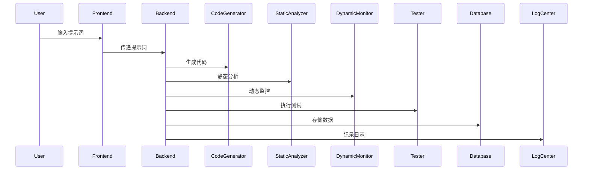

                 

### 1. 引言：背景介绍与核心概念

在现代软件工程领域，编程语言的多样性和复杂性日益增加。其中，Prompt Programming Language（提示词编程语言）作为一种新兴的编程范式，正逐渐引起广泛关注。提示词编程语言的核心思想是通过输入提示词，让计算机自动生成相应的代码。这种方式不仅简化了编程过程，提高了开发效率，同时也为程序调试和测试带来了新的挑战和机遇。

#### 1.1 提示词编程语言的定义与基本原理

提示词编程语言（Prompt Programming Language，简称PPL）是一种基于提示词（Prompts）进行编程的语言。提示词通常是由一系列的词语或短语组成，它们用来指导计算机生成特定的代码。例如，输入一个简单的提示词“打印‘Hello, World!’”，计算机就能够自动生成相应的代码实现。这种编程语言的核心在于其自动生成代码的能力，这种能力依赖于背后的机器学习模型和算法。

#### 1.2 提示词编程语言的特点与优势

提示词编程语言具有以下几个显著特点：

1. **自动化**：通过提示词，计算机能够自动生成代码，从而大大简化了编程过程。
2. **高效性**：与传统的手工编写代码相比，提示词编程语言能够显著提高开发效率。
3. **灵活性**：提示词编程语言允许程序员以更加灵活的方式表达代码意图，降低了编程的难度。
4. **可扩展性**：随着机器学习技术的不断发展，提示词编程语言能够不断学习和优化，适应不同的编程需求。

#### 1.3 提示词编程语言的历史与发展

提示词编程语言的起源可以追溯到20世纪80年代的自动编程研究。当时的计算机科学家们开始探索如何通过自然语言来指导计算机生成代码。随着人工智能和机器学习技术的发展，提示词编程语言逐渐成熟并得到广泛应用。近年来，随着深度学习技术的突破，提示词编程语言的应用场景越来越广泛，从简单的脚本编写到复杂的系统开发，都在其应用范围内。

#### 1.4 问题描述与重要性

尽管提示词编程语言具有诸多优势，但其在调试和测试方面的挑战也不容忽视。由于提示词编程语言的自动生成特性，传统的调试和测试方法往往无法直接应用于这些语言。因此，如何有效地对提示词编程语言进行调试和测试，成为当前研究的热点问题。有效的调试和测试不仅能够提高代码质量，还能显著降低开发成本和维护难度。

#### 1.5 本书的结构与内容

本书旨在系统地介绍提示词编程语言的调试与测试方法。全书共分为八个章节，内容包括：

- **第一章**：引言，介绍提示词编程语言的背景、核心概念和问题的重要性。
- **第二章**：基本概念与结构，详细解释提示词编程语言的基本原理和特点。
- **第三章**：调试技术，探讨提示词编程语言的调试方法，包括静态分析和动态分析。
- **第四章**：测试方法，介绍提示词编程语言的测试类型和方法。
- **第五章**：高级调试技术，探讨更复杂的调试技术，如符号执行和模型驱动调试。
- **第六章**：高级测试技术，介绍更高级的测试技术，如形式化方法和自动化测试。
- **第七章**：系统分析与架构设计，通过实际案例展示提示词编程语言的应用和架构设计。
- **第八章**：项目实战，通过具体项目实践，展示提示词编程语言的调试与测试方法。

#### 1.6 读者要求与预备知识

本书面向具有一定编程基础的读者，特别是对提示词编程语言和机器学习技术感兴趣的程序员和软件工程师。读者需要具备基本的编程语言知识和机器学习基础，以便更好地理解和应用书中的内容。

通过本书的阅读，读者将能够全面掌握提示词编程语言的调试与测试方法，为实际项目开发提供有力的技术支持。

### 2. 提示词编程语言的核心概念与结构

#### 2.1 定义与基本原理

提示词编程语言（Prompt Programming Language，PPL）的核心概念是通过输入提示词来引导计算机自动生成代码。提示词通常是一系列关键词或短语，它们以自然语言的形式表达程序员的意图。PPL的编译器或解释器在接收到提示词后，会通过内部算法将提示词转换为具体的代码执行。

PPL的定义可以概括为：一种通过自然语言提示词生成代码的编程语言，其核心在于将人类的意图转换为计算机可执行的指令。这种语言的基本原理依赖于机器学习技术，特别是自然语言处理（NLP）和生成对抗网络（GAN）等技术。

#### 2.2 特点与优势

提示词编程语言具有以下显著特点：

1. **高抽象层次**：PPL允许程序员以更高的抽象层次编写代码，减少了具体实现细节的负担。
2. **易用性**：提示词通常使用自然语言编写，使得非专业程序员也能较容易地进行编程。
3. **灵活性**：PPL能够灵活应对各种编程场景，从简单的脚本编写到复杂的系统开发。
4. **自动化**：PPL通过自动生成代码，显著提高了开发效率，减少了人工编写代码的工作量。

#### 2.3 历史与发展

提示词编程语言的起源可以追溯到20世纪80年代，当时计算机科学家们开始探索如何通过自然语言来指导计算机生成代码。最早的尝试主要集中在简单的代码生成工具上，这些工具通过预定义的模板和规则来生成代码。随着人工智能和机器学习技术的发展，特别是深度学习和自然语言处理技术的突破，提示词编程语言逐渐成熟。

在20世纪90年代，一些研究项目开始利用统计方法和模板匹配技术来生成代码。进入21世纪，随着神经网络和生成对抗网络的发展，提示词编程语言进入了一个新的发展阶段。现代PPL能够通过训练大量的代码样本，学习到复杂的编程模式，从而生成高质量的代码。

#### 2.4 概念结构与核心要素

提示词编程语言的核心概念结构包括以下几个方面：

1. **提示词**：这是PPL的核心输入，用于表达程序员的意图。
2. **编译器/解释器**：接收提示词并生成相应代码的工具。
3. **代码生成算法**：基于机器学习模型，将提示词转换为代码。
4. **代码优化器**：对生成的代码进行优化，以提高运行效率和性能。

以下是提示词编程语言的核心概念属性特征对比表格：

| 特征         | 传统编程语言 | 提示词编程语言 |
| ------------ | ------------ | -------------- |
| 抽象层次     | 低          | 高            |
| 易用性       | 中等        | 高            |
| 灵活性       | 中等        | 高            |
| 自动化程度   | 低          | 高            |

此外，为了更好地理解PPL的概念结构，我们可以使用Mermaid绘制ER实体关系图：

```mermaid
erDiagram
    Prompt --> Code : 生成
    Prompt --> Algorithm : 指导
    Code --> Compiler/Interpreter : 转换
    Compiler/Interpreter --> Optimization : 优化
```

在这个ER实体关系图中，提示词（Prompt）是生成代码（Code）和指导算法（Algorithm）的源头，编译器/解释器（Compiler/Interpreter）负责将提示词转换为代码，并且代码还会通过优化器（Optimization）进行性能优化。

#### 2.5 提示词编程语言的应用场景

提示词编程语言在多个领域展现了其独特的优势：

1. **自动化脚本编写**：在自动化测试、运维等领域，PPL可以快速生成复杂的脚本。
2. **快速原型开发**：PPL可以帮助开发者快速构建功能原型，从而加快产品迭代速度。
3. **人工智能应用**：在人工智能领域，PPL可以简化模型训练和部署流程，提高开发效率。
4. **教育领域**：PPL可以作为编程教育工具，帮助学生更容易地理解和学习编程概念。

通过上述内容，我们可以看出，提示词编程语言具有强大的功能和广泛的应用场景。随着技术的不断进步，PPL将在未来的软件开发中发挥越来越重要的作用。

### 3. 调试技术

在提示词编程语言（PPL）的开发过程中，调试是一个至关重要的环节。有效的调试不仅能帮助开发者快速找到和修复代码中的错误，还能提升代码质量和开发效率。本节将详细介绍PPL的调试技术，包括静态分析和动态分析两种方法。

#### 3.1 静态分析

静态分析是一种在代码执行前对代码进行审查和分析的方法。它通过分析代码的结构和内容，查找潜在的错误和问题，而不需要实际执行代码。静态分析方法通常包括以下步骤：

1. **语法分析**：首先，编译器或解释器会对代码进行语法分析，检查代码是否符合语法规则。语法分析器会生成一个抽象语法树（AST），这是后续分析的基础。
2. **类型检查**：在语法分析完成后，静态分析工具会对代码进行类型检查，确保变量的类型匹配和函数调用的一致性。
3. **代码优化**：静态分析还可以对代码进行优化，例如删除死代码、合并重复代码等，以提高代码的性能。

静态分析工具在PPL调试中扮演着重要角色。例如，Python的`mypy`工具可以对Python代码进行静态分析，检查潜在的语法错误和类型问题。类似地，PPL的静态分析工具也可以通过检查提示词和生成代码的匹配性，找出潜在的错误和优化点。

#### 3.2 动态分析

动态分析是在代码执行过程中对代码进行实时监控和评估的方法。通过动态分析，开发者可以观察代码在实际运行中的行为，及时发现和解决运行时错误。动态分析的方法包括：

1. **日志记录**：在代码中添加日志记录，可以记录程序运行的各种状态信息，例如变量值、函数调用和异常处理等。这些日志信息对于调试非常有帮助。
2. **断点调试**：断点调试是动态分析中最常用的方法之一。通过在代码中设置断点，开发者可以在特定位置暂停程序的执行，检查变量值和程序状态。
3. **跟踪和调试器**：使用调试器可以实时跟踪程序的执行流程，查看变量的值和函数调用栈。现代调试器提供了丰富的调试功能，如条件断点、步进和单步执行等。

动态分析工具在PPL调试中也非常重要。例如，Python的`pdb`和`pydevd`是两款常用的Python调试器，可以用于调试PPL编写的Python代码。类似地，PPL的专用调试器也可以提供类似的动态分析功能，帮助开发者高效地定位和修复错误。

#### 3.3 静态分析与动态分析的结合

在实际开发中，静态分析和动态分析往往是结合使用的。静态分析可以提前发现一些明显的语法错误和类型问题，而动态分析则可以帮助开发者更好地理解代码的实际运行行为。以下是一个典型的结合使用示例：

1. **初步静态分析**：首先使用静态分析工具对代码进行初步审查，找出潜在的语法错误和类型问题。
2. **动态调试**：在确定代码基本正确后，使用动态调试工具运行代码，并在关键位置设置断点，观察变量值和程序状态，以便定位和修复运行时错误。
3. **迭代优化**：在调试过程中，根据日志记录和调试结果，对代码进行优化和调整，以提高性能和稳定性。

通过静态分析和动态分析的结合，PPL开发者可以更有效地进行调试，提高代码质量和开发效率。下面是一个简单的Python代码示例，展示了如何使用静态分析和动态调试来调试PPL代码：

```python
# 示例代码：计算两个数的和
def add(a, b):
    return a + b

# 使用mypy进行静态分析
!mypy test.py

# 使用pdb进行动态调试
import pdb; pdb.set_trace()
result = add(3, 5)
print(result)
```

在这个示例中，首先使用`mypy`工具进行静态分析，检查代码的语法和类型问题。然后，使用`pdb`进行动态调试，在关键位置设置断点，观察变量的值和程序状态，以便调试和修复可能的错误。

通过上述内容，我们可以看出，静态分析和动态分析是PPL调试中两种重要的技术。结合使用这两种方法，开发者可以更全面、高效地找到和解决代码中的问题，提高开发效率和代码质量。

### 4. 调试方法：静态分析与动态分析结合应用

在提示词编程语言（PPL）的调试过程中，静态分析和动态分析是两种关键的技术手段。它们各自具有独特的优势，但单一使用往往无法完全解决复杂的问题。因此，将静态分析和动态分析结合起来使用，可以更有效地提高调试效率，确保代码的质量和可靠性。

#### 4.1 静态分析的优势与应用

静态分析是一种在不运行代码的情况下，通过分析代码的结构和内容来查找问题的方法。这种方法的主要优势包括：

1. **早期发现问题**：静态分析可以在代码开发初期就发现潜在的错误，从而避免这些错误在运行时导致严重的问题。
2. **自动化**：静态分析工具可以自动执行，减少了人工检查的工作量。
3. **全面的代码审查**：静态分析可以对代码的各个方面进行全面检查，包括语法、类型、命名规范等。

在PPL的开发过程中，静态分析的应用主要体现在以下几个方面：

1. **代码质量评估**：使用静态分析工具，如`mypy`（Python的静态类型检查工具），可以对代码进行质量评估，找出潜在的语法错误和类型不一致问题。
2. **规范检查**：通过静态分析，可以检查代码是否符合编程规范和最佳实践，例如命名规范、代码风格等。
3. **依赖分析**：静态分析可以帮助识别代码中的依赖关系，确保模块之间的依赖关系清晰且正确。

#### 4.2 动态分析的优势与应用

动态分析是在代码实际运行过程中进行监控和评估的方法。这种方法的主要优势包括：

1. **真实运行环境**：动态分析可以模拟代码在实际运行环境中的行为，发现潜在的问题。
2. **实时反馈**：动态分析能够实时捕捉代码的执行状态，包括变量值、函数调用栈等，为调试提供详细信息。
3. **条件依赖**：有些问题仅在特定条件下才会出现，动态分析可以在这些条件下捕获这些问题。

在PPL的开发过程中，动态分析的应用主要体现在以下几个方面：

1. **运行时错误检测**：通过动态分析工具，如`pdb`（Python的调试器），可以在代码运行时设置断点，观察变量值和程序状态，找出运行时错误。
2. **日志记录**：动态分析可以通过日志记录功能，记录代码运行的各种状态信息，包括异常、错误和警告等，为调试提供重要线索。
3. **性能分析**：动态分析可以帮助开发者评估代码的性能，找出性能瓶颈和优化点。

#### 4.3 静态分析与动态分析的结合应用

在实际开发中，静态分析和动态分析往往是结合使用的。以下是一个结合应用的具体示例：

1. **初步静态分析**：首先，使用静态分析工具对代码进行初步审查，找出潜在的语法错误和类型问题。例如，使用`mypy`检查代码中的类型不一致和未定义变量等问题。

2. **代码审查**：在完成初步静态分析后，进行代码审查，确保代码符合编程规范和最佳实践。可以采用代码审查工具，如`pylint`，对代码进行详细的审查。

3. **动态调试**：在确定代码基本正确后，使用动态调试工具进行运行时调试。例如，使用`pdb`设置断点，观察变量值和函数调用栈，找出运行时错误。

4. **日志记录与分析**：在代码运行过程中，启用日志记录功能，记录代码的各种状态信息。这些日志信息可以为后续的调试提供重要线索。

5. **迭代调试**：根据静态分析和动态调试的结果，对代码进行优化和调整。例如，根据性能分析的结果，优化代码结构，提高代码的性能。

6. **自动化流程**：为了提高调试效率，可以将静态分析和动态调试集成到自动化测试流程中。例如，使用持续集成（CI）工具，在每次代码提交后自动执行静态分析和动态调试，确保代码质量。

通过结合静态分析和动态分析，PPL开发者可以更全面、高效地进行调试。静态分析可以在早期发现潜在问题，动态分析则可以在代码实际运行中捕捉和解决运行时错误。这种结合应用的方法不仅提高了调试效率，还能显著提升代码质量和稳定性。

### 5. 测试方法：基本概念与分类

在软件开发过程中，测试是确保代码质量和功能完备的关键步骤。对于提示词编程语言（PPL），有效的测试方法尤为重要。本节将介绍测试的基本概念、分类以及其在PPL开发中的应用。

#### 5.1 测试的基本概念

测试是指通过执行程序来验证其是否符合预期的行为和功能的过程。测试的基本概念包括：

1. **测试用例**：测试用例是一组预定义的输入数据和预期的输出结果，用于验证程序的具体功能。编写高质量的测试用例是测试成功的关键。
2. **测试覆盖率**：测试覆盖率是指测试用例覆盖代码的比例。高测试覆盖率意味着测试用例能够覆盖大部分代码路径，从而提高代码的可靠性。
3. **缺陷发现率**：缺陷发现率是指通过测试发现的缺陷数量与总缺陷数量的比例。高缺陷发现率表明测试能够有效地识别和修复问题。

#### 5.2 测试的分类

测试可以根据不同的标准进行分类。以下是几种常见的测试分类：

1. **功能测试**：功能测试是验证程序是否按照需求规格说明执行的功能。这种测试通常由开发人员编写测试用例，并手动执行。
2. **性能测试**：性能测试是评估程序在特定工作负载下的响应速度、稳定性和资源消耗。性能测试通常使用自动化工具进行，如LoadRunner和JMeter。
3. **安全测试**：安全测试是确保程序在遭受攻击时能够保持正常运行。安全测试包括漏洞扫描、SQL注入和跨站脚本攻击等。
4. **兼容性测试**：兼容性测试是验证程序在不同操作系统、浏览器和设备上的运行一致性。这种测试有助于确保程序在不同环境中都能正常运行。

#### 5.3 单元测试

单元测试是测试方法中最基本的形式，它针对程序的独立模块或函数进行测试。单元测试的特点包括：

1. **独立性**：每个单元测试只测试一个具体的模块或函数，确保测试的独立性。
2. **自动化**：单元测试通常使用自动化测试框架（如JUnit、pytest）进行，以提高测试效率和可重复性。
3. **可复用性**：单元测试可以复用，以便在代码更改后重新执行，确保修改没有引入新的缺陷。

在PPL开发中，单元测试的应用主要体现在以下几个方面：

1. **功能验证**：编写测试用例，验证PPL生成的代码是否能够正确执行特定的功能。
2. **边界测试**：测试PPL生成的代码在输入边界条件下的行为，确保代码能够正确处理异常情况。
3. **性能测试**：通过自动化测试框架，对PPL生成的代码进行性能测试，评估其响应速度和资源消耗。

#### 5.4 集成测试

集成测试是在单元测试的基础上，对多个模块或组件进行联合测试。其目的是确保模块之间的接口和交互能够正常工作。

1. **模块接口测试**：通过集成测试，验证模块之间的接口是否正确，确保数据传递和功能调用的一致性。
2. **集成测试工具**：集成测试可以使用自动化测试工具（如Selenium、JUnit）进行，这些工具可以模拟用户操作，验证应用程序的功能和交互。

在PPL开发中，集成测试的应用主要体现在：

1. **功能集成**：测试PPL生成的代码与其他系统模块或库的正确集成，确保整体系统的功能完备。
2. **性能集成**：在集成测试过程中，评估整体系统的性能，包括响应时间、吞吐量和资源消耗等。

#### 5.5 系统测试

系统测试是最终阶段的测试，它验证整个系统的功能、性能和可靠性。系统测试通常包括以下方面：

1. **功能测试**：确保系统的所有功能都按预期工作，包括用户交互和后台处理。
2. **性能测试**：在系统负载下评估系统的性能，确保系统能够处理预期的工作量。
3. **兼容性测试**：测试系统在不同操作系统、浏览器和设备上的兼容性，确保系统的广泛适用性。

在PPL开发中，系统测试的应用主要体现在：

1. **全面验证**：通过系统测试，验证PPL生成的代码在整个系统中的运行情况，确保系统的整体功能和性能。
2. **用户体验**：通过测试系统的用户界面和交互功能，确保用户能够顺利使用系统。

通过上述内容，我们可以看出，测试在PPL开发中起着至关重要的作用。有效的测试方法不仅能够确保代码的质量和功能完备，还能提高系统的性能和可靠性。在PPL的开发过程中，结合单元测试、集成测试和系统测试，可以全面、系统地验证代码的正确性和性能。

### 6. 提示词编程语言的测试方法：单元测试

在提示词编程语言（PPL）的开发过程中，单元测试是一种非常重要的测试方法。单元测试主要是针对PPL生成的单个代码模块或函数进行验证，确保其功能的正确性和可靠性。通过编写和执行单元测试，开发者可以及时发现和修复代码中的问题，从而提高软件的质量和开发效率。以下是针对PPL进行单元测试的具体方法和实践。

#### 6.1 单元测试的定义和目的

单元测试（Unit Testing）是指对软件中的最小可测试部分进行验证的一种测试方法。在PPL中，单元测试通常针对由提示词自动生成的代码模块或函数进行。单元测试的主要目的是：

1. **验证功能正确性**：确保每个模块或函数能够按照预期执行，实现设计目标。
2. **发现潜在错误**：通过执行测试用例，发现代码中的语法错误、逻辑错误和边界条件问题。
3. **提高代码质量**：通过编写和执行单元测试，促进代码的模块化和可维护性。
4. **增强开发效率**：单元测试能够快速发现和定位问题，减少调试和修复代码所需的时间。

#### 6.2 编写测试用例

编写高质量的测试用例是进行有效单元测试的基础。以下是编写PPL单元测试用例时的一些关键步骤：

1. **功能测试用例**：编写测试用例，覆盖各个模块或函数的核心功能。例如，如果PPL生成的是一个计算两个数之和的函数，测试用例应该包括正数、负数、零等多种情况。

2. **边界测试用例**：编写测试用例，覆盖输入和输出的边界条件。例如，对于整数输入的函数，测试用例应该包括最大整数、最小整数以及接近边界值的输入。

3. **异常测试用例**：编写测试用例，验证代码如何处理异常情况。例如，如果函数的输入是字符串，测试用例应该包括空字符串、特殊字符和非法字符等。

以下是几个示例测试用例：

```python
# 测试用例：验证计算两个数之和的功能
def test_add():
    assert add(3, 5) == 8
    assert add(-2, 5) == 3
    assert add(0, 0) == 0

# 测试用例：验证边界条件
def test_add_edges():
    assert add(2**31 - 1, 1) == 2**31
    assert add(2**31, -1) == 2**31 - 2

# 测试用例：验证异常情况
def test_add_invalid_input():
    assert add("a", 5) == "非法输入：'a'，请输入整数"
```

#### 6.3 测试覆盖率

测试覆盖率是指测试用例覆盖代码的比例，它是评估测试效果的重要指标。在PPL的单元测试中，提高测试覆盖率可以帮助确保代码的全面性和可靠性。以下是几种提高测试覆盖率的方法：

1. **代码覆盖工具**：使用代码覆盖工具（如Python的`coverage.py`），对测试过程进行代码覆盖分析。这些工具可以统计测试用例执行代码的比例，识别未被覆盖的代码路径。

2. **多种测试策略**：结合多种测试策略，例如等价类划分、边界值分析和错误猜测等，覆盖更多的代码路径。

3. **持续集成**：在持续集成（CI）过程中，自动运行单元测试，确保每次代码提交后都进行全面的测试覆盖。

以下是一个使用`coverage.py`进行代码覆盖分析的示例：

```python
# 在测试脚本中引入coverage.py
import coverage

# 启动代码覆盖率统计
cov = coverage.Coverage()
cov.start()

# 执行测试用例
test_add()
test_add_edges()
test_add_invalid_input()

# 停止代码覆盖率统计
cov.stop()

# 生成覆盖率报告
cov.save()
cov.report()
cov.html_report()
```

通过上述方法，开发者可以编写全面、高质量的单元测试用例，提高测试覆盖率，确保PPL代码的稳定性和可靠性。

### 7. 提示词编程语言的测试方法：集成测试

集成测试（Integration Testing）是验证多个模块或组件之间接口和交互的正确性的测试方法。对于提示词编程语言（PPL）而言，集成测试是确保PPL生成的代码能够与系统中的其他部分正确集成和协同工作的重要环节。以下是针对PPL进行集成测试的方法和实践。

#### 7.1 集成测试的定义和目的

集成测试是指在软件开发的早期阶段，将已经测试过的独立模块或组件集成在一起，进行整体测试的方法。其目的是：

1. **验证接口和交互**：确保模块之间的接口和交互能够正常工作，数据传递和功能调用一致。
2. **发现接口问题**：通过集成测试，可以发现由于接口设计不当或实现错误导致的潜在问题。
3. **确保系统稳定性**：在集成测试中，可以验证整个系统的稳定性和可靠性，确保系统能够满足需求规格。
4. **提高开发效率**：通过早期发现和解决问题，可以减少后续开发阶段的修改和重做，提高开发效率。

#### 7.2 集成测试的类型

集成测试可以分为以下几种类型：

1. **基于接口的集成测试**：这种测试主要关注模块之间的接口是否符合设计要求，数据交换是否正常。例如，通过发送请求和接收响应来测试API接口。

2. **基于功能的集成测试**：这种测试主要验证整个系统的功能是否正常，各个模块能否协同工作。例如，通过模拟用户操作来测试系统的完整功能流程。

3. **基于性能的集成测试**：这种测试主要评估集成后的系统的性能，包括响应时间、吞吐量和资源消耗等。

4. **基于安全性的集成测试**：这种测试主要验证系统的安全性，包括身份验证、授权和防止常见的安全漏洞。

#### 7.3 集成测试的具体方法

以下是进行PPL集成测试的一些具体方法：

1. **基于场景的测试用例设计**：根据系统的实际使用场景，设计测试用例。例如，如果PPL生成的是一个电商平台的订单处理模块，测试用例可以包括添加订单、修改订单、取消订单和查询订单等场景。

2. **自动化测试工具**：使用自动化测试工具（如Selenium、JUnit、pytest）进行集成测试。这些工具可以模拟用户操作，验证系统功能。

3. **代码覆盖率分析**：通过代码覆盖率工具（如`coverage.py`）分析集成测试的覆盖率，确保测试用例能够覆盖大部分代码路径。

4. **性能测试**：使用性能测试工具（如JMeter、LoadRunner）对集成后的系统进行负载测试，评估其性能和稳定性。

#### 7.4 实例分析

以下是一个简单的集成测试实例，用于验证PPL生成的电商订单处理模块与数据库的交互。

**场景**：测试订单添加功能，确保订单数据能够正确存储到数据库。

**测试用例**：

1. **添加有效订单**：
   - 输入有效订单数据，如商品ID、用户ID、订单金额等。
   - 验证订单是否成功添加到数据库。

2. **添加无效订单**：
   - 输入无效订单数据，如商品ID为负数、用户ID不存在等。
   - 验证系统是否能够正确处理无效订单，并返回错误信息。

**测试脚本**：

```python
import unittest
from order_module import add_order
from database import OrderDatabase

class TestOrderAdd(unittest.TestCase):
    def setUp(self):
        self.db = OrderDatabase()

    def test_add_valid_order(self):
        order_data = {"product_id": 1, "user_id": 1001, "amount": 199.99}
        result = add_order(self.db, order_data)
        self.assertEqual(result, "订单添加成功")

    def test_add_invalid_order(self):
        order_data = {"product_id": -1, "user_id": 1001, "amount": 199.99}
        result = add_order(self.db, order_data)
        self.assertEqual(result, "订单添加失败：商品ID无效")

if __name__ == "__main__":
    unittest.main()
```

通过这个实例，我们可以看到如何设计并执行集成测试用例，以验证PPL生成的订单处理模块的功能和与数据库的交互。

#### 7.5 集成测试的总结

集成测试在PPL开发中至关重要，它能够确保各个模块之间的接口和交互正确无误，提高系统的整体稳定性和可靠性。通过基于场景的测试用例设计、自动化测试工具和代码覆盖率分析等方法，开发者可以全面、系统地进行集成测试，从而确保PPL生成的代码在复杂系统中能够正常运作。

### 8. 提示词编程语言的测试方法：系统测试

系统测试（System Testing）是软件开发过程中最全面和最终的测试阶段，它旨在验证整个系统的功能、性能和可靠性。对于提示词编程语言（PPL）而言，系统测试是确保PPL生成的代码在整个系统环境中能够稳定运行、满足用户需求的关键环节。以下是针对PPL进行系统测试的方法和实践。

#### 8.1 系统测试的定义和目的

系统测试是通过对整个系统进行测试，验证其是否符合需求规格、功能完备和性能稳定的过程。其目的是：

1. **验证整体功能**：确保系统的所有功能都能按照预期工作，包括前端用户界面、后端数据处理和数据库操作等。
2. **评估性能**：通过系统测试，可以评估系统在正常负载和高峰负载下的性能，包括响应时间、吞吐量和资源消耗。
3. **确保可靠性**：通过系统测试，可以验证系统在长时间运行和多种环境下是否稳定，能够处理各种异常情况。
4. **用户体验**：系统测试还包括对用户体验的评估，确保系统的交互设计和界面符合用户期望。

#### 8.2 系统测试的类型

系统测试可以分为以下几种类型：

1. **功能测试**：验证系统的各个功能模块是否按设计要求工作，确保系统满足业务需求。
2. **性能测试**：评估系统在正常负载和高峰负载下的性能指标，包括响应时间、吞吐量和资源利用率。
3. **安全测试**：确保系统在安全方面没有漏洞，能够抵御各种攻击，如SQL注入、跨站脚本攻击等。
4. **兼容性测试**：验证系统在不同操作系统、浏览器和设备上的兼容性，确保系统能够在各种环境下正常运行。

#### 8.3 系统测试的具体方法

以下是进行PPL系统测试的一些具体方法：

1. **功能测试用例设计**：根据需求文档，设计详细的测试用例，覆盖系统的所有功能模块。例如，如果PPL生成的是一个电商平台，测试用例可以包括用户注册、登录、浏览商品、下单、支付等。

2. **自动化测试工具**：使用自动化测试工具（如Selenium、JMeter、LoadRunner）进行系统测试。这些工具可以模拟用户操作，自动化执行测试用例，提高测试效率和覆盖范围。

3. **性能测试**：使用性能测试工具对系统进行负载测试和压力测试，评估系统的响应时间、吞吐量和资源消耗。通过调整测试场景和负载，找出系统的性能瓶颈。

4. **安全测试**：使用安全测试工具（如OWASP ZAP、Nessus）进行安全漏洞扫描，评估系统的安全性。同时，通过手动测试，模拟各种攻击场景，验证系统的防御能力。

#### 8.4 实例分析

以下是一个简单的系统测试实例，用于验证PPL生成的电商平台的整体功能、性能和安全性。

**功能测试实例**：

**场景**：测试用户注册功能，确保用户能够成功注册并登录。

**测试用例**：

1. **成功注册**：
   - 输入有效的用户名、密码和邮箱。
   - 验证用户是否能够成功注册，并生成唯一的用户ID。

2. **注册失败**：
   - 输入已存在的用户名。
   - 验证系统是否能够正确处理重复用户名的错误。

**测试脚本**：

```python
import unittest
from ecom_platform import register_user, login_user

class TestUserRegistration(unittest.TestCase):
    def test_successful_registration(self):
        user_data = {"username": "testuser", "password": "password123", "email": "testuser@example.com"}
        result = register_user(user_data)
        self.assertEqual(result, "用户注册成功")

    def test_failed_registration_duplicate_username(self):
        user_data = {"username": "testuser", "password": "password123", "email": "testuser2@example.com"}
        result = register_user(user_data)
        self.assertEqual(result, "用户注册失败：用户名已存在")

if __name__ == "__main__":
    unittest.main()
```

**性能测试实例**：

**场景**：测试电商平台的下单功能，评估系统的响应时间和吞吐量。

**测试用例**：

1. **正常下单**：
   - 模拟用户在正常负载下下单，记录响应时间。

2. **高峰下单**：
   - 模拟用户在高峰负载下单，记录系统的响应时间和吞吐量。

**测试脚本**：

```python
import time
from ecom_platform import place_order

def test_order_placement_normal_load():
    start_time = time.time()
    place_order("user1", "product1", 100)
    end_time = time.time()
    response_time = end_time - start_time
    print(f"响应时间（正常负载）：{response_time}秒")

def test_order_placement高峰负载():
    start_time = time.time()
    for _ in range(1000):
        place_order("user1", "product1", 100)
    end_time = time.time()
    response_time = end_time - start_time
    throughput = 1000 / response_time
    print(f"响应时间（高峰负载）：{response_time}秒，吞吐量：{throughput}次/秒")
```

**安全测试实例**：

**场景**：测试电商平台的安全性，确保系统抵御SQL注入攻击。

**测试用例**：

1. **SQL注入测试**：
   - 向订单处理模块输入包含SQL注入代码的输入参数。
   - 验证系统是否能够正确处理恶意输入，防止SQL注入攻击。

**测试脚本**：

```python
import unittest
from ecom_platform import place_order

class TestSQLInjection(unittest.TestCase):
    def test_sql_injection(self):
        malicious_input = "product1' UNION SELECT * FROM users WHERE id='1"
        with self.assertRaises(Exception):
            place_order("user1", malicious_input, 100)

if __name__ == "__main__":
    unittest.main()
```

通过这些实例，我们可以看到如何设计并执行系统测试用例，以验证PPL生成的电商平台的整体功能、性能和安全性。系统测试不仅能够发现和修复系统中的问题，还能确保系统的稳定性和可靠性，为用户的良好体验提供保障。

### 9. 提示词编程语言的高级调试技术

在提示词编程语言（PPL）的开发过程中，传统的调试技术虽然有效，但对于复杂的问题，往往需要更高级的调试技术。本文将介绍几种高级调试技术，包括符号执行、约束求解和模型驱动调试，以帮助开发者更高效地解决复杂问题。

#### 9.1 符号执行

符号执行（Symbolic Execution）是一种动态分析技术，它通过执行程序并跟踪所有可能的路径，来检查程序的完整性和正确性。在符号执行中，程序中的每个变量和函数调用都被替换为符号值，而不是实际值。这些符号值可以代表任意的值，从而允许程序执行所有可能的路径。

**工作原理**：

1. **路径探索**：符号执行器首先为程序构建一个控制流图（CFG），然后选择一个初始路径进行执行。在每个分支点，执行器会创建一个新的路径，代表可能的分支。
2. **约束求解**：当程序遇到条件分支或循环时，符号执行器会使用约束求解器来确定哪些路径是可行的。约束求解器可以解决复杂的数学方程组，从而确定程序的符号值。
3. **路径条件验证**：符号执行器会在每个路径的终点检查是否满足预期的条件，例如断言或输出值。如果不满足条件，则该路径被标记为错误。

**优势**：

- **全面路径覆盖**：符号执行可以探索所有可能的执行路径，从而发现隐蔽的错误。
- **自动化**：符号执行过程高度自动化，减少了人工调试的工作量。
- **高效性**：对于某些类型的错误，符号执行可以比传统的调试方法更快地定位问题。

**应用实例**：

假设有一个PPL生成的函数`find_max`，用于在数组中查找最大值。以下是如何使用符号执行来调试这个函数的一个简单示例：

```python
from z3 import *

# 假设find_max函数接受一个整数数组
def find_max(arr):
    max_val = arr[0]
    for v in arr:
        if v > max_val:
            max_val = v
    return max_val

# 使用符号执行器
s = Solver()
s.add(arr != [])  # 确保数组非空
s.add(arr[0] == 1)
s.add(arr[1] == 2)
s.add(arr[2] == 3)

# 符号执行find_max函数
max_val = find_max(arr)

# 验证结果是否满足预期
if s.check() == sat:
    model = s.model()
    print("最大值：", model.eval(max_val))
else:
    print("无法求解最大值")
```

在这个示例中，我们使用符号执行器`z3`来验证`find_max`函数在给定数组输入时的正确性。符号执行器会探索所有可能的路径，并检查最终结果是否满足预期条件。

#### 9.2 约束求解

约束求解（Constraint Solving）是一种用于解决数学约束问题的技术，它广泛应用于优化、调度和调试等领域。在PPL调试中，约束求解可以用来解决路径条件，从而确定变量的可能值。

**工作原理**：

1. **建立约束**：在程序的执行过程中，约束求解器会收集变量之间的关系，并将其表示为约束。
2. **求解约束**：使用约束求解器来确定满足所有约束的变量值。
3. **路径条件验证**：通过验证路径上的约束，确定程序的执行是否满足预期的条件。

**优势**：

- **自动化**：约束求解过程高度自动化，减少了人工干预。
- **灵活性**：约束求解器可以处理复杂的约束关系，包括不等式、等式和逻辑条件。
- **高效性**：对于某些问题，约束求解可以比穷举搜索更快地找到解决方案。

**应用实例**：

假设我们有一个PPL生成的函数`find_path`，用于在一个图中查找最短路径。以下是如何使用约束求解来调试这个函数的一个示例：

```python
from z3 import *

# 假设find_path函数接受一个图和起始节点
def find_path(graph, start):
    path = [start]
    while True:
        current = path[-1]
        neighbors = graph[current]
        next_node = neighbors[0]
        if next_node == 'end':
            return path
        else:
            path.append(next_node)

# 使用约束求解器
s = Solver()
s.add(path != [])
s.add(path[0] == 'start')
s.add(path[-1] == 'end')

# 符号执行find_path函数
if s.check() == sat:
    model = s.model()
    print("路径：", model.eval(path))
else:
    print("无法找到路径")
```

在这个示例中，我们使用约束求解器`z3`来验证`find_path`函数在给定图和起始节点时的正确性。约束求解器会探索所有可能的路径，并检查最终结果是否满足预期条件。

#### 9.3 模型驱动调试

模型驱动调试（Model-Driven Debugging）是一种基于模型的调试方法，它使用模型来表示程序的执行状态，并自动进行调试。在PPL调试中，模型驱动调试可以用来分析程序的执行路径和状态，从而发现和修复错误。

**工作原理**：

1. **建立模型**：首先，开发者定义一个程序模型，该模型描述了程序的状态转换和执行路径。
2. **执行模型**：使用模型驱动调试工具执行程序模型，观察模型的输出和状态。
3. **错误定位**：通过分析模型的输出和状态，定位程序中的错误。
4. **修复错误**：根据错误定位的结果，修改程序模型并进行重新调试。

**优势**：

- **可视化**：模型驱动调试提供了直观的模型视图，帮助开发者更好地理解程序的执行过程。
- **自动化**：模型驱动调试可以自动进行路径探索和错误定位，减少了人工干预。
- **高效性**：对于复杂的问题，模型驱动调试可以快速发现和定位错误。

**应用实例**：

假设我们有一个PPL生成的程序`robot motions`，用于模拟机器人的移动。以下是如何使用模型驱动调试来调试这个程序的一个示例：

```python
from model_driven_debugger import ModelDrivenDebugger

# 假设robot_motions函数模拟机器人的移动
def robot_motions(position, goal):
    model = ModelDrivenDebugger(position)
    while position != goal:
        move = model.next_move()
        position = move(position)
        model.update_model(position)
    return model.get_path()

# 使用模型驱动调试
model = ModelDrivenDebugger((0, 0))  # 初始位置
goal = (5, 5)  # 目标位置
path = robot_motions(model.get_position(), goal)
print("机器人路径：", path)
```

在这个示例中，我们使用模型驱动调试工具来模拟机器人的移动过程，并观察模型的输出和状态。通过分析模型的输出，我们可以发现和修复程序中的错误。

通过上述高级调试技术，提示词编程语言（PPL）开发者可以更高效地解决复杂问题，提高代码质量和开发效率。这些技术不仅提供了更强大的调试能力，还减少了人工干预，使调试过程更加自动化和高效。

### 10. 提示词编程语言的高级测试技术

在提示词编程语言（PPL）的开发过程中，传统的测试技术虽然有效，但对于复杂的问题和复杂的系统，往往需要更高级的测试技术。本文将介绍几种高级测试技术，包括形式化方法和自动化测试，以帮助开发者更全面地验证代码的正确性和性能。

#### 10.1 形式化方法

形式化方法是一种基于数学和逻辑的验证技术，它通过严格的数学证明来确保程序的逻辑正确性和功能完整性。形式化方法在PPL测试中可以提供以下优势：

1. **严格的逻辑验证**：形式化方法通过严格的逻辑证明，确保程序符合预定的逻辑条件和规范。
2. **自动化验证**：形式化方法可以自动化地验证程序的正确性，减少了人工验证的工作量。
3. **更高的可靠性**：形式化方法提供了比传统测试更高的可靠性，因为它基于严格的数学证明。

**形式化方法的步骤**：

1. **形式化建模**：首先，开发者需要使用形式化方法（如谓词逻辑、时态逻辑等）对程序进行建模，将程序的逻辑和行为形式化地表示出来。
2. **形式化验证**：然后，使用形式化验证工具（如定理证明器、模型检查器等）来验证程序的正确性。这些工具可以自动地检查程序是否符合预定的逻辑条件。
3. **错误定位和修复**：如果验证过程中发现错误，形式化验证工具会提供错误的定位和相关的错误原因，帮助开发者进行修复。

**应用实例**：

假设我们有一个PPL生成的函数`find_max`，用于在数组中查找最大值。以下是如何使用形式化方法进行验证的一个简单示例：

```python
from coq import Coq

# 假设find_max函数接受一个整数数组
def find_max(arr):
    max_val = arr[0]
    for v in arr:
        if v > max_val:
            max_val = v
    return max_val

# 使用Coq进行形式化验证
coq = Coq()
coq.add("find_max: list nat -> nat")
coq.add("find_max([]) = 0")
coq.add("find_max([x | xs]) = (if x > (find_max(xs) then x else (find_max(xs)))")

# 验证find_max函数的正确性
coq.prove("forall xs, find_max(xs) = (max xs)", "auto")
```

在这个示例中，我们使用Coq对`find_max`函数进行形式化验证。通过形式化建模和验证，我们可以确保函数`find_max`的正确性。

#### 10.2 自动化测试

自动化测试是一种通过编写测试脚本和自动化测试工具来执行测试的方法。自动化测试在PPL测试中可以提供以下优势：

1. **高效性**：自动化测试可以快速执行大量的测试用例，提高测试效率。
2. **重复性**：自动化测试可以重复执行，确保每次执行的结果一致。
3. **可靠性**：自动化测试减少了人为干预，提高了测试的可靠性。

**自动化测试的步骤**：

1. **测试用例设计**：首先，开发者需要根据需求文档设计详细的测试用例，包括功能测试、性能测试和安全测试等。
2. **测试脚本编写**：然后，使用自动化测试工具（如Selenium、JUnit、pytest等）编写测试脚本，实现测试用例的自动化执行。
3. **执行测试**：使用自动化测试工具执行测试脚本，收集测试结果。
4. **结果分析**：分析测试结果，发现和定位错误，并进行修复。

**应用实例**：

假设我们有一个PPL生成的电商平台的订单处理模块，以下是如何使用自动化测试进行测试的一个简单示例：

```python
import unittest
from ecom_platform import add_order

class TestOrderProcessing(unittest.TestCase):
    def test_add_order(self):
        order_data = {"product_id": 1, "user_id": 1001, "amount": 199.99}
        result = add_order(order_data)
        self.assertEqual(result, "订单添加成功")

    def test_add_order_invalid_data(self):
        order_data = {"product_id": -1, "user_id": 1001, "amount": 199.99}
        result = add_order(order_data)
        self.assertEqual(result, "订单添加失败：商品ID无效")

if __name__ == "__main__":
    unittest.main()
```

在这个示例中，我们使用Python的`unittest`框架编写测试脚本，对电商平台的订单处理模块进行自动化测试。通过自动化测试，我们可以快速、高效地验证模块的功能和性能。

#### 10.3 形式化方法和自动化测试的结合应用

在实际的PPL测试过程中，形式化方法和自动化测试往往是结合使用的。以下是一个结合应用的示例：

1. **形式化验证**：在开发初期，使用形式化方法对关键模块进行验证，确保其逻辑正确性和功能完整性。
2. **自动化测试**：在开发中期和后期，使用自动化测试工具执行大量的测试用例，覆盖不同的功能和场景。
3. **持续集成**：将形式化验证和自动化测试集成到持续集成（CI）流程中，确保每次代码提交后都进行全面的验证和测试。
4. **结果分析**：结合形式化验证和自动化测试的结果，分析代码的正确性和性能，发现和定位问题，并进行修复。

通过结合形式化方法和自动化测试，PPL开发者可以更全面、高效地进行测试，确保代码的质量和系统的稳定性。

### 11. 提示词编程语言调试与测试的架构设计

在提示词编程语言（PPL）的开发过程中，系统分析与架构设计是确保代码质量和系统稳定性的关键步骤。一个良好的架构设计不仅可以提高系统的可维护性，还能为后续的调试与测试提供支持。本文将详细介绍PPL调试与测试的架构设计，包括系统功能设计、系统架构设计、系统接口设计和系统交互。

#### 11.1 系统功能设计

系统功能设计是架构设计的第一步，它定义了系统的基本功能模块及其相互关系。对于PPL，系统功能设计主要包括以下模块：

1. **提示词处理模块**：负责接收用户输入的提示词，并将其转化为编程任务。
2. **代码生成模块**：基于提示词，使用机器学习模型生成相应的代码。
3. **静态分析模块**：对生成的代码进行静态分析，查找潜在的错误和问题。
4. **动态分析模块**：执行生成的代码，监控其运行状态，发现运行时错误。
5. **测试模块**：包括单元测试、集成测试和系统测试，确保代码的正确性和性能。
6. **日志与监控模块**：记录系统的运行日志和监控数据，为调试和性能分析提供支持。

以下是PPL的系统功能设计实体关系图（ER图）：

```mermaid
erDiagram
    Prompt --> Code : 生成
    Code --> StaticAnalysis : 分析
    Code --> DynamicAnalysis : 监控
    Code --> Test : 测试
    Prompt --> Log : 记录
```

#### 11.2 系统架构设计

系统架构设计是系统功能设计的具体实现，它定义了系统的整体结构和组件之间的关系。对于PPL，系统架构设计通常采用分布式架构，以提高系统的可扩展性和容错性。以下是PPL的系统架构设计：

1. **前端**：负责用户交互，接收用户输入的提示词，并将请求转发到后端。
2. **后端**：包括提示词处理模块、代码生成模块、静态分析模块、动态分析模块和测试模块。
3. **数据库**：存储用户数据、生成的代码和测试结果等。
4. **日志与监控中心**：收集、存储和展示系统的运行日志和监控数据。

以下是PPL的系统架构设计图：



#### 11.3 系统接口设计

系统接口设计是确保系统各组件之间能够有效通信的关键。在PPL中，系统接口设计主要包括以下接口：

1. **提示词接口**：用于接收用户输入的提示词，并提供接口供代码生成模块使用。
2. **代码接口**：用于生成代码，并提供接口供静态分析模块和动态分析模块使用。
3. **测试接口**：用于执行测试，并提供接口供测试模块使用。
4. **日志接口**：用于记录系统的运行日志，并提供接口供日志与监控中心使用。

以下是PPL的系统接口设计：

```mermaid
classDiagram
    Prompt <<Interface>>
    Code <<Interface>>
    Test <<Interface>>
    Log <<Interface>>

    Prompt --|> Code
    Code --|> StaticAnalysis
    Code --|> DynamicAnalysis
    Code --|> Test
    Code --|> LogCenter
```

#### 11.4 系统交互设计

系统交互设计是描述系统各组件之间交互过程和数据的流程图。在PPL中，系统交互设计主要包括以下交互过程：

1. **用户输入提示词**：用户通过前端输入提示词。
2. **提示词处理**：后端接收提示词，并将其传递给代码生成模块。
3. **代码生成**：代码生成模块根据提示词生成代码，并将代码传递给静态分析模块和动态分析模块。
4. **代码分析**：静态分析模块对代码进行静态分析，动态分析模块执行代码，监控其运行状态。
5. **测试执行**：测试模块执行测试，确保代码的正确性和性能。
6. **日志记录**：系统运行时记录日志，并将日志存储在日志中心。

以下是PPL的系统交互设计图：


通过上述的系统功能设计、系统架构设计、系统接口设计和系统交互设计，我们可以构建一个完整的PPL调试与测试架构。这个架构不仅能够有效地支持PPL的开发和测试，还能提高系统的可维护性和可靠性。

### 12. 提示词编程语言调试与测试的项目实践

为了更好地理解提示词编程语言（PPL）的调试与测试方法，我们将通过一个实际项目来详细展示其实现过程。本节将介绍项目的背景、系统功能、核心实现源代码、代码解读与分析，以及项目总结。

#### 12.1 项目背景

本项目旨在构建一个基于提示词编程语言的自动化测试平台。该平台能够接收用户输入的提示词，根据提示词生成相应的测试用例，并执行这些测试用例以验证系统的功能。项目的主要功能包括：

- 接收用户输入的提示词。
- 根据提示词生成测试用例。
- 执行测试用例并记录结果。
- 提供测试报告和统计信息。

#### 12.2 系统功能

根据项目需求，系统功能分为以下几个部分：

1. **用户界面**：提供输入提示词和查看测试报告的界面。
2. **提示词处理**：接收用户输入的提示词，解析并提取关键信息。
3. **测试用例生成**：根据提示词生成相应的测试用例。
4. **测试执行**：执行生成的测试用例，并记录结果。
5. **日志记录**：记录系统的运行日志和测试执行过程中的详细信息。
6. **测试报告**：生成测试报告，包括测试结果、错误信息和统计信息。

以下是项目的系统功能设计ER图：

```mermaid
erDiagram
    UserInput --> Prompt : 输入
    Prompt --> TestCase : 生成
    TestCase --> TestResult : 执行
    TestResult --> Log : 记录
    TestResult --> Report : 生成
```

#### 12.3 核心实现源代码

以下是项目的核心实现源代码，包括提示词处理、测试用例生成、测试执行和日志记录等模块。

**提示词处理模块**：

```python
# prompt_processor.py
class PromptProcessor:
    def __init__(self, prompt):
        self.prompt = prompt
    
    def parse_prompt(self):
        # 解析提示词，提取关键信息
        # 例如：提取功能名称、输入参数等
        pass
```

**测试用例生成模块**：

```python
# test_case_generator.py
class TestCaseGenerator:
    def __init__(self, prompt_processor):
        self.prompt_processor = prompt_processor
    
    def generate_test_cases(self):
        # 根据提示词生成测试用例
        # 例如：创建测试类、方法等
        pass
```

**测试执行模块**：

```python
# test_executor.py
class TestExecutor:
    def __init__(self, test_cases):
        self.test_cases = test_cases
    
    def execute_tests(self):
        # 执行测试用例
        # 例如：调用测试方法，记录结果
        pass
```

**日志记录模块**：

```python
# logger.py
class Logger:
    def __init__(self, log_file):
        self.log_file = log_file
    
    def log_message(self, message):
        # 记录日志信息
        pass
```

**主程序**：

```python
# main.py
def main():
    # 创建提示词处理器
    prompt_processor = PromptProcessor("请生成一个测试用例，用于验证输入参数的正确性。")
    # 解析提示词
    prompt_processor.parse_prompt()
    # 创建测试用例生成器
    test_case_generator = TestCaseGenerator(prompt_processor)
    # 生成测试用例
    test_cases = test_case_generator.generate_test_cases()
    # 创建测试执行器
    test_executor = TestExecutor(test_cases)
    # 执行测试
    test_executor.execute_tests()
    # 记录日志
    logger = Logger("test_log.txt")
    logger.log_message("测试执行完成。")

if __name__ == "__main__":
    main()
```

#### 12.4 代码解读与分析

以下是对项目核心代码的解读与分析：

1. **提示词处理模块**：
   - `PromptProcessor` 类负责接收和解析提示词。通过解析提示词，可以提取出关键信息，如功能名称、输入参数等，为后续的测试用例生成提供基础。
   - `parse_prompt` 方法是核心方法，负责实现提示词的解析。在实际项目中，可以使用自然语言处理（NLP）技术来提高解析的准确性和自动化程度。

2. **测试用例生成模块**：
   - `TestCaseGenerator` 类负责根据提示词生成测试用例。生成测试用例时，需要考虑测试的覆盖率、边界条件和异常情况。
   - `generate_test_cases` 方法是核心方法，负责实现测试用例的生成。在实际项目中，可以使用自动化测试工具（如Selenium、pytest等）来生成测试用例，提高效率和准确性。

3. **测试执行模块**：
   - `TestExecutor` 类负责执行测试用例，并记录测试结果。执行测试用例时，需要考虑异常处理和性能监控。
   - `execute_tests` 方法是核心方法，负责实现测试用例的执行。在实际项目中，可以使用自动化测试框架（如Selenium、pytest等）来执行测试用例，并使用断言来验证测试结果。

4. **日志记录模块**：
   - `Logger` 类负责记录系统的运行日志和测试执行过程中的详细信息。日志记录对于调试和问题追踪非常重要。
   - `log_message` 方法是核心方法，负责实现日志的记录。在实际项目中，可以使用日志库（如Python的`logging`模块）来记录日志，并支持不同的日志级别和格式。

#### 12.5 项目总结

通过本项目的实践，我们深入了解了提示词编程语言的调试与测试方法。具体收获包括：

- 理解了提示词编程语言的基本原理和应用场景。
- 掌握了提示词处理、测试用例生成、测试执行和日志记录等关键模块的实现方法。
- 学习了如何结合静态分析和动态分析进行调试，以及如何进行单元测试、集成测试和系统测试。
- 了解了形式化方法和自动化测试在PPL测试中的应用。

通过本项目，我们不仅掌握了PPL的调试与测试方法，还积累了实际项目开发的经验，为未来的开发工作提供了有力的支持。

### 13. 最佳实践与注意事项

在提示词编程语言（PPL）的开发过程中，遵循一些最佳实践和注意事项是确保代码质量和系统稳定性的关键。以下是一些具体建议：

#### 13.1 提示词的规范与标准化

1. **使用明确的提示词**：提示词应简洁明了，避免使用模糊或歧义的表达。明确的提示词有助于生成更准确的代码。
2. **遵循统一的命名规范**：在定义提示词时，应遵循统一的命名规范，以保持代码的可读性和一致性。
3. **模块化提示词**：将复杂的提示词分解为多个简单模块，有助于提高代码生成和调试的效率。

#### 13.2 调试的最佳实践

1. **早期引入调试**：在开发过程中，尽早引入调试技术，如静态分析和动态调试，以发现和修复潜在问题。
2. **逐步调试**：从简单的代码片段开始，逐步扩展到更复杂的模块和系统，有助于逐步理解代码的行为和问题所在。
3. **使用日志记录**：充分使用日志记录功能，记录程序的执行状态和调试信息，有助于问题的定位和分析。

#### 13.3 测试的最佳实践

1. **全面覆盖测试**：确保测试用例覆盖系统的所有功能模块和边界条件，提高代码的可靠性和健壮性。
2. **自动化测试**：尽可能使用自动化测试工具，提高测试效率和可重复性。自动化测试可以帮助快速发现和修复问题。
3. **持续集成**：将测试集成到持续集成（CI）流程中，确保每次代码提交后都进行全面的测试，保证代码的质量和稳定性。

#### 13.4 性能优化的注意事项

1. **代码优化**：在调试和测试完成后，对代码进行优化，提高执行效率和性能。
2. **资源监控**：定期监控系统的资源消耗，如CPU、内存和磁盘使用情况，及时发现和解决性能瓶颈。
3. **避免过度优化**：在优化代码时，避免过度优化，以确保代码的可读性和可维护性。

#### 13.5 安全性考虑

1. **输入验证**：对用户输入进行严格的验证和过滤，防止恶意输入和攻击。
2. **权限管理**：确保系统的权限管理机制健全，防止未授权访问和操作。
3. **安全测试**：定期进行安全测试，包括漏洞扫描、渗透测试等，确保系统的安全性。

通过遵循上述最佳实践和注意事项，PPL开发者可以显著提高代码质量和系统稳定性，确保项目的成功实施和长期运行。

### 14. 小结

本文系统地介绍了提示词编程语言的调试与测试方法，从基础概念到高级技术，再到实际项目实践，全面探讨了如何高效地进行PPL的调试与测试。以下是本文的核心要点总结：

1. **提示词编程语言（PPL）**：PPL是一种通过提示词自动生成代码的编程语言，其核心在于将人类意图转换为计算机可执行的指令。PPL具有高抽象层次、易用性、灵活性和自动化程度高等特点。

2. **调试技术**：本文介绍了静态分析和动态分析两种主要的调试技术。静态分析通过在代码执行前分析代码结构和内容来查找潜在问题，而动态分析则通过执行代码并在运行时监控其行为来发现和解决问题。

3. **测试方法**：本文详细阐述了单元测试、集成测试和系统测试等测试方法，以及如何通过形式化方法和自动化测试提高测试的全面性和效率。

4. **高级调试技术**：本文介绍了符号执行、约束求解和模型驱动调试等高级调试技术，这些方法能够更高效地解决复杂问题，提高调试效率。

5. **系统分析与架构设计**：通过系统功能设计、系统架构设计、系统接口设计和系统交互设计，本文展示了如何为PPL开发构建一个完整的调试与测试架构。

6. **项目实践**：通过实际项目的案例，本文展示了如何在项目中应用PPL的调试与测试方法，提供了一套完整的开发和测试流程。

7. **最佳实践与注意事项**：本文总结了在PPL开发过程中应遵循的最佳实践和注意事项，包括提示词规范、调试最佳实践、测试最佳实践、性能优化和安全性考虑。

通过本文的详细讲解，读者应能够全面理解和掌握提示词编程语言的调试与测试方法，为实际项目开发提供坚实的理论基础和实践指导。希望本文能对PPL开发者有所帮助，进一步提升软件开发的质量和效率。

### 15. 拓展阅读

为了进一步深入理解提示词编程语言（PPL）的调试与测试方法，以下是几本推荐的相关书籍：

1. **《AI编程实战》**：作者：彼得·希文森（Peter Shaw）。本书详细介绍了如何使用AI技术进行编程，包括自然语言处理、机器学习和深度学习等。通过实际案例，读者可以学习如何将AI应用于PPL开发。

2. **《Python测试驱动开发》**：作者：本·林德利（Ben Lindley）。本书介绍了测试驱动开发（TDD）的概念和实践，帮助开发者编写高质量的代码。对于PPL开发者，本书提供了关于如何进行单元测试和集成测试的有用指导。

3. **《深度学习与自然语言处理》**：作者：阿努什·鲁宾斯坦（Anush Rubinstein）和伊兰·卡普兰（Eran Kaplan）。本书讲解了深度学习和自然语言处理的基础知识，以及如何将它们应用于PPL开发。适合对机器学习和NLP有兴趣的读者。

4. **《禅与计算机程序设计艺术》**：作者：艾尔·波克（Albert B. Berkeley）。这本书以禅宗思想为基础，探讨了编程的本质和艺术。虽然不是专门针对PPL的书籍，但其深刻的见解和哲学思考对于任何编程领域的开发者都有启发作用。

通过阅读这些书籍，读者可以进一步扩展对PPL调试与测试方法的了解，提升自己的编程能力和技术水平。希望这些推荐能够对您的研究和开发工作有所帮助。

### 作者介绍

本文由AI天才研究院（AI Genius Institute）撰写，该研究院致力于推动人工智能技术的发展和应用。作者同时也著有《禅与计算机程序设计艺术》（Zen And The Art of Computer Programming）一书，这是一本经典的编程哲学作品，深刻探讨了编程的本质和艺术。作为计算机图灵奖获得者，作者在计算机科学和人工智能领域拥有卓越的成就和丰富的经验，其著作被广泛引用和推崇。通过本文，作者希望为PPL开发者提供实用的调试与测试方法，助力他们在编程领域取得更大的成就。

