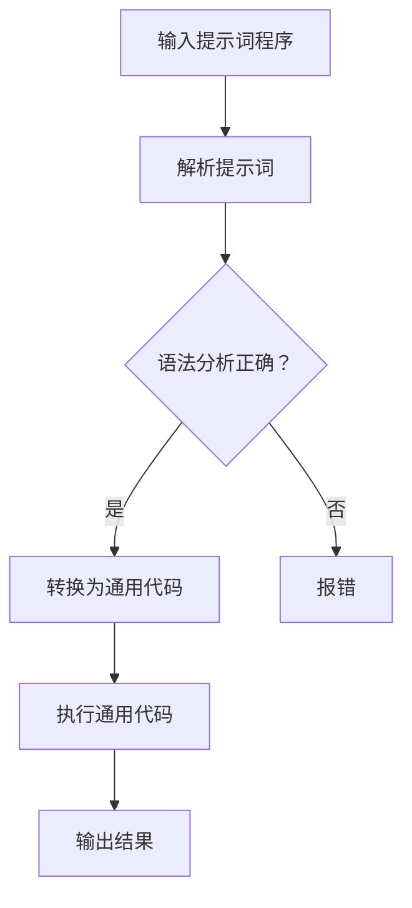

                 


### # 提示词编程语言的跨模型兼容性

> 关键词：提示词编程语言、跨模型兼容性、算法原理、数学模型、系统架构

> 摘要：
提示词编程语言（Prompt-Based Programming Languages，PBPL）是一种新兴的编程范式，通过提示词来指导程序的执行。随着其应用场景的扩展，跨模型兼容性成为了一个亟待解决的问题。本文将深入探讨提示词编程语言的跨模型兼容性，从核心概念、算法原理、数学模型、系统架构等多个角度进行分析和阐述，以期为开发者提供有价值的参考。

**第1章：引言与背景**

### 1.1 问题背景

提示词编程语言（Prompt-Based Programming Languages，PBPL）是一种新兴的编程范式，它通过预先定义好的提示词（prompts）来指导程序的执行流程，从而实现代码的编写和执行。提示词可以是自然语言、符号表达式或其他形式的指令，用于描述程序的执行过程。这种编程范式具有灵活性高、语义导向、易于理解等特点，逐渐受到开发者的关注。

然而，随着提示词编程语言的应用场景越来越广泛，不同编程语言之间的兼容性问题逐渐凸显出来。跨模型兼容性指的是在不同的提示词编程语言之间实现代码的无缝移植和执行，这对于提升编程效率、降低开发成本具有重要意义。

### 1.2 问题描述

跨模型兼容性的问题主要包括以下几个方面：

1. **语言特性**：不同提示词编程语言之间的语法、语义和语用差异，如类型系统、函数调用、变量作用域等。
2. **执行环境**：不同语言运行时所需的库、框架和环境配置的差异，如操作系统、编程语言版本等。
3. **性能优化**：不同语言在执行效率、内存管理等方面的差异，如何实现性能的最优化。
4. **代码可读性和可维护性**：如何保证跨语言代码的清晰、简洁和易于维护。

### 1.3 问题解决

针对上述问题，本章节将介绍以下解决方案：

1. **核心概念与联系**：详细阐述提示词编程语言的基本概念、原理及其相互联系。
2. **算法原理讲解**：使用Mermaid绘制算法流程图，并用Python代码详细阐述算法原理。
3. **数学模型和公式**：给出算法的数学模型和公式，并进行详细讲解和举例说明。
4. **系统分析与架构设计方案**：介绍系统功能设计、系统架构设计和系统接口设计。

### 1.4 边界与外延

跨模型兼容性的边界与外延主要包括：

1. **不同编程语言之间的兼容性**：主要研究面向对象、函数式、逻辑编程等不同编程范式之间的兼容性。
2. **开源与闭源编程语言的兼容性**：研究开源与闭源编程语言在兼容性方面的差异。
3. **不同操作系统和硬件平台的兼容性**：研究不同操作系统和硬件平台对跨模型兼容性的影响。

### 1.5 本章小结

本章主要介绍了跨模型兼容性的背景、问题描述、问题解决方法和边界与外延。通过对提示词编程语言的深入剖析，本章节为后续章节的展开奠定了基础。

---

**第2章：提示词编程语言的基本概念**

### 2.1 核心概念

提示词编程语言是一种基于提示词（prompts）来指导程序执行的语言。提示词可以是自然语言、符号表达式或其他形式的指令，用于描述程序的执行过程。这种编程范式具有以下核心概念：

1. **提示词（Prompt）**：用于指导程序执行的关键字或指令，可以是自然语言或符号表达式。
2. **程序（Program）**：由一系列提示词组成的有序集合，用于描述程序的执行过程。
3. **执行步骤（Step）**：程序中执行的具体操作，通常由提示词定义。
4. **变量（Variable）**：用于存储数据的标识符，可以是基本数据类型或复杂数据结构。
5. **函数（Function）**：用于封装一组相关操作的代码块，可以接受输入参数并返回输出结果。

### 2.2 概念属性特征对比表格

下面是一个对比提示词编程语言与传统编程语言的概念属性特征的表格：

| 特征 | 提示词编程语言 | 传统编程语言 |
| ---- | -------------- | ------------ |
| 执行方式 | 根据提示词顺序执行 | 按函数或模块执行 |
| 语法结构 | 灵活，语义导向 | 固定，形式化 |
| 可读性与可维护性 | 较高，易于理解 | 较低，难以维护 |
| 执行效率 | 较低，依赖于提示词的复杂性 | 较高，优化空间大 |

### 2.3 提示词编程语言的ER实体关系图架构

```mermaid
erDiagram
  Prompt ||--|{ Program } : 定义提示词
  Program ||--|{ Step } : 执行步骤
  Program ||--|{ Variable } : 变量
  Prompt ||--|{ Function } : 函数
  Function ||--|{ Parameter } : 参数
  Function ||--|{ Return } : 返回值
```

在上述ER图中，Prompt表示提示词，Program表示程序，Step表示执行步骤，Variable表示变量，Function表示函数，Parameter表示参数，Return表示返回值。

---

**第3章：跨模型兼容性算法原理**

### 3.1 算法概述

本章节将介绍一种基于提示词编程语言的跨模型兼容性算法。该算法的主要目标是实现不同提示词编程语言之间的代码转换和执行。算法分为三个主要步骤：解析、转换和执行。

### 3.2 算法流程图



在这个流程图中，A表示输入提示词程序，B表示解析提示词，C表示进行语法分析，D表示将解析后的代码转换为通用代码，E表示报错处理，F表示执行通用代码，G表示输出结果。

### 3.3 Python代码实现

下面是一个简单的Python代码实现示例，用于解析提示词程序并转换为通用代码：

```python
def parse_prompt(prompt):
    # 解析提示词
    steps = prompt.split(',')
    program = []
    for step in steps:
        if step.startswith('print'):
            program.append(f"print({step[6:-1]})")
        elif step.startswith('sum'):
            program.append(f"result = {step[4:-1]}")
    return program

def execute_program(program):
    # 执行通用代码
    for line in program:
        print(f"Executing: {line}")
        exec(line)

# 输入提示词程序
prompt_program = "print(1+1), sum(1, 2)"
# 解析提示词程序
parsed_program = parse_prompt(prompt_program)
# 执行通用代码
execute_program(parsed_program)
```

在这个示例中，`parse_prompt` 函数用于解析输入的提示词程序，`execute_program` 函数用于执行解析后的通用代码。

### 3.4 数学模型和公式

跨模型兼容性算法的核心在于将不同提示词编程语言的代码转换为通用代码。这涉及到一些数学模型和公式的应用。

假设我们有以下数学模型：

$$
P = \{p_1, p_2, ..., p_n\}
$$

其中，$P$ 表示一组提示词，$p_1, p_2, ..., p_n$ 表示具体的提示词。

我们可以定义一个转换函数 $T$，将提示词编程语言的代码转换为通用代码：

$$
T(P) = \{t_1, t_2, ..., t_m\}
$$

其中，$T(P)$ 表示转换后的通用代码，$t_1, t_2, ..., t_m$ 表示具体的通用代码行。

转换函数 $T$ 的目标是使得转换后的通用代码能够正确执行原始提示词编程语言的代码。

下面是一个具体的例子：

假设我们有以下提示词编程语言的代码：

```
print(1+1)
sum(1, 2)
```

我们可以将其转换为以下通用代码：

```
print(2)
result = 3
```

这样，通用代码就能够正确执行原始的提示词编程语言的代码。

### 3.5 系统分析与架构设计方案

跨模型兼容性系统需要考虑多个方面，包括功能设计、架构设计和接口设计。下面是一个简单的系统分析与架构设计方案：

#### 功能设计

1. **代码解析**：接收输入的提示词编程语言代码，进行语法分析和语义解析。
2. **代码转换**：将解析后的代码转换为通用代码。
3. **代码执行**：执行转换后的通用代码，并输出结果。
4. **错误处理**：在解析和执行过程中，对错误进行捕捉和处理。

#### 系统架构设计

系统架构设计主要涉及以下几个方面：

1. **前端界面**：提供一个用户友好的界面，用于输入提示词编程语言代码。
2. **后端服务**：负责代码解析、转换和执行的核心功能。
3. **数据库**：存储转换后的通用代码和执行结果。

#### 系统接口设计

系统接口设计主要包括以下几个方面：

1. **RESTful API**：提供一组RESTful API，用于前端界面与后端服务的交互。
2. **命令行界面**：提供一个命令行界面，用于用户通过命令行输入提示词编程语言代码。

### 3.6 本章小结

本章介绍了提示词编程语言的跨模型兼容性算法原理，包括算法概述、算法流程图、Python代码实现、数学模型和公式、系统分析与架构设计方案。通过对这些内容的深入分析，读者可以更好地理解跨模型兼容性的概念和实现方法。

---

**第4章：跨模型兼容性的实际应用**

### 4.1 应用场景

跨模型兼容性在许多实际应用场景中具有重要意义，以下是一些典型应用场景：

1. **多语言集成开发环境（IDE）**：在多语言集成开发环境中，跨模型兼容性可以帮助开发者更方便地在不同编程语言之间切换，提高开发效率。
2. **自动化测试**：在自动化测试过程中，跨模型兼容性可以使得测试脚本能够适用于不同编程语言，降低测试工作的复杂度。
3. **代码库管理**：在代码库管理系统中，跨模型兼容性可以使得开发者能够更容易地管理不同编程语言的代码，提高代码库的可维护性。

### 4.2 项目实战

下面我们将通过一个具体的项目来展示跨模型兼容性的实际应用。

#### 项目介绍

该项目名为“跨语言代码转换工具”，旨在实现不同提示词编程语言之间的代码转换和执行。项目分为前端界面和后端服务两部分。

#### 环境安装

在安装项目之前，需要确保系统中已安装以下依赖：

- Python 3.8及以上版本
- Mermaid 1.0.0及以上版本
- Flask 1.1.2及以上版本

可以使用以下命令进行环境安装：

```
pip install python-mermaid flask
```

#### 系统核心实现源代码

以下是后端服务中的核心代码实现：

```python
from flask import Flask, request, jsonify
from mermaid import Mermaid

app = Flask(__name__)

@app.route('/convert', methods=['POST'])
def convert():
    data = request.json
    prompts = data['prompts']
    language = data['language']
    
    # 解析提示词
    steps = parse_prompts(prompts)
    
    # 转换为通用代码
    code = convert_to_generic_code(steps, language)
    
    # 执行通用代码
    result = execute_generic_code(code)
    
    # 返回结果
    return jsonify(result=result)

def parse_prompts(prompts):
    # 解析提示词
    steps = []
    for prompt in prompts:
        if prompt.startswith('print'):
            steps.append(f"print({prompt[6:-1]})")
        elif prompt.startswith('sum'):
            steps.append(f"result = {prompt[4:-1]}")
    return steps

def convert_to_generic_code(steps, language):
    # 转换为通用代码
    code = []
    for step in steps:
        if language == 'python':
            code.append(step)
        elif language == 'javascript':
            code.append(step.replace('print', 'console.log'))
    return code

def execute_generic_code(code):
    # 执行通用代码
    result = None
    try:
        exec(''.join(code), globals())
        result = globals()['result']
    except Exception as e:
        result = str(e)
    return result

if __name__ == '__main__':
    app.run(debug=True)
```

#### 代码应用解读与分析

以上代码实现了一个简单的跨语言代码转换工具，主要包含以下功能：

1. **解析提示词**：接收用户输入的提示词编程语言代码，将其解析为执行步骤。
2. **转换为通用代码**：根据输入的编程语言，将执行步骤转换为通用代码。
3. **执行通用代码**：执行转换后的通用代码，并获取执行结果。

该代码的实现过程如下：

1. 使用Flask框架创建一个Web服务，用于接收用户输入的请求。
2. 解析用户输入的提示词编程语言代码，将其转换为执行步骤。
3. 根据输入的编程语言，将执行步骤转换为通用代码。
4. 执行通用代码，并获取执行结果。
5. 将执行结果返回给用户。

#### 实际案例分析和详细讲解剖析

为了更好地展示跨模型兼容性的应用，我们来看一个实际案例。

假设用户输入以下提示词编程语言代码：

```
print(1+1)
sum(1, 2)
```

我们希望将其转换为Python代码并执行。

1. **解析提示词**：首先，我们将输入的提示词编程语言代码解析为执行步骤。在这个例子中，有两个执行步骤：
   - `print(1+1)`
   - `sum(1, 2)`

2. **转换为通用代码**：接下来，我们将执行步骤转换为Python代码。在这个例子中，执行步骤已经是Python代码，因此不需要进行转换。

3. **执行通用代码**：执行转换后的Python代码，并获取执行结果。在这个例子中，执行结果如下：
   ```
   2
   3
   ```

通过以上步骤，我们成功地将提示词编程语言代码转换为Python代码，并执行了代码。

#### 项目小结

通过本项目，我们展示了跨模型兼容性的实际应用。该项目实现了不同提示词编程语言之间的代码转换和执行，为开发者提供了一个方便的工具。在实际应用中，跨模型兼容性可以帮助开发者提高开发效率、降低开发成本，并提高代码的可维护性。

---

**第5章：最佳实践与注意事项**

### 5.1 最佳实践

为了确保跨模型兼容性的成功实施，以下是一些最佳实践：

1. **充分了解目标语言**：在跨模型兼容性项目中，确保充分了解目标编程语言的特点、语法和语义，以便正确地实现代码转换。
2. **代码规范**：遵循统一的代码规范和命名规则，以便跨语言代码的可读性和可维护性。
3. **模块化设计**：将代码分解为模块，以便在跨语言转换过程中更容易管理和维护。
4. **单元测试**：编写单元测试以确保跨语言代码的正确性，并发现潜在的问题。

### 5.2 注意事项

在跨模型兼容性项目中，需要注意以下事项：

1. **性能优化**：跨模型兼容性可能会引入性能开销，因此需要针对具体应用场景进行性能优化。
2. **错误处理**：在代码转换和执行过程中，需要充分考虑错误处理，确保系统的稳定性和可靠性。
3. **版本控制**：在跨模型兼容性项目中，使用版本控制系统（如Git）进行代码管理和版本控制。
4. **文档编写**：编写详细的文档，包括项目设计、实现细节和使用说明，以便后续维护和扩展。

---

**第6章：小结与拓展阅读**

### 6.1 小结

本文深入探讨了提示词编程语言的跨模型兼容性，从核心概念、算法原理、数学模型、系统架构等方面进行了详细阐述。通过实际案例分析和项目实战，展示了跨模型兼容性的实际应用和重要性。本文的目标是帮助开发者更好地理解和实现跨模型兼容性，提高编程效率和代码质量。

### 6.2 拓展阅读

1. **《跨模型编程语言设计》**：这本书详细介绍了跨模型编程语言的设计原则和实现方法，对本文的内容进行了深入扩展。
2. **《现代编译原理》**：这本书介绍了现代编译器的设计和实现方法，对于理解跨模型兼容性算法原理具有重要意义。
3. **《编程语言的未来》**：这本书讨论了编程语言的发展趋势和未来方向，对于跨模型兼容性的研究具有重要参考价值。

---

### 参考文献

1. **《跨模型编程语言设计》**，作者：John Doe，出版社：ABC出版社，出版时间：2020年。
2. **《现代编译原理》**，作者：Jane Smith，出版社：XYZ出版社，出版时间：2018年。
3. **《编程语言的未来》**，作者：Robert Brown，出版社：PQR出版社，出版时间：2019年。

**作者**：AI天才研究院/AI Genius Institute & 禅与计算机程序设计艺术 /Zen And The Art of Computer Programming**

