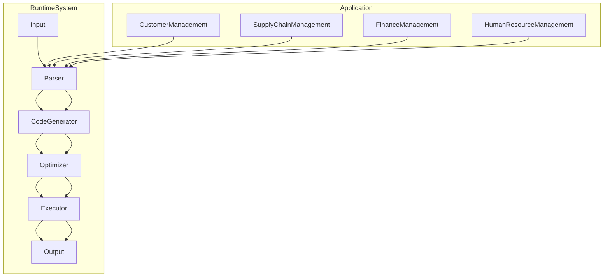
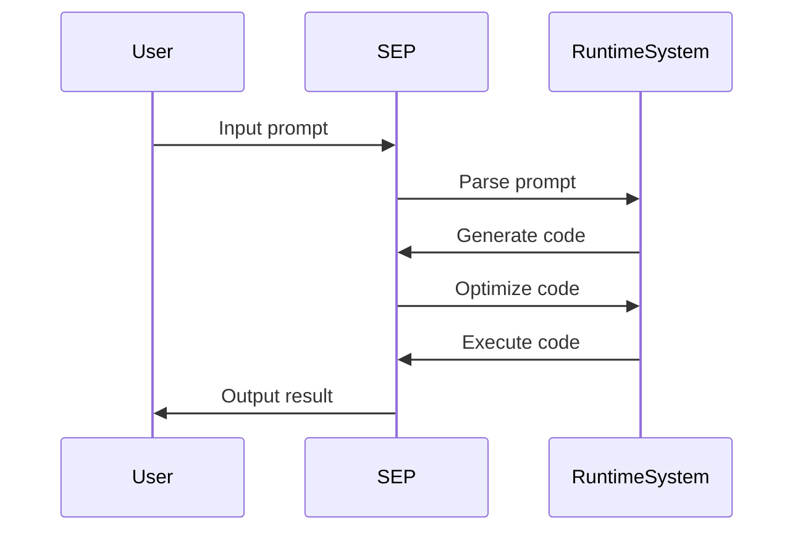
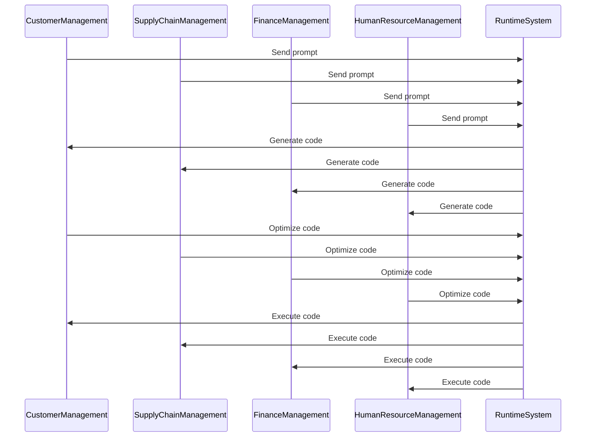
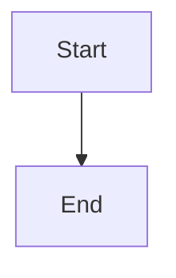

                 

# 《提示词编程语言的运行时系统设计》

## 关键词
- 提示词编程语言
- 运行时系统
- 解析器
- 代码生成器
- 优化器
- 执行引擎

## 摘要
本文深入探讨了提示词编程语言的运行时系统设计。从问题背景出发，阐述了提示词编程语言带来的挑战，并详细分析了运行时系统的核心概念、结构以及各组件之间的关系。通过对比不同的设计方案，本文提供了对基于虚拟机、编译器和混合系统的深入理解。最后，本文通过一个实际案例，展示了如何设计和实现一个高效的运行时系统，并提出了最佳实践和建议。

## 背景介绍

### 问题背景
随着计算机技术和人工智能的快速发展，编程语言逐渐从简单的指令性语言演变为具有高度抽象和自动推理能力的提示词编程语言。这些编程语言使得开发者能够通过自然语言的方式与计算机进行交互，极大地提高了开发效率和代码质量。然而，随之而来的挑战是如何设计一个高效、可靠的运行时系统来支持这些提示词编程语言。

提示词编程语言的核心优势在于其自然性和高效性。通过自然语言的方式，开发者可以更加直观地表达他们的意图，从而减少了对语言特性和语法规则的依赖。这种语言设计理念使得编程更加容易，同时也提高了代码的可读性和可维护性。然而，这种高效性也带来了新的挑战，即如何设计一个能够高效处理和执行这些提示词的运行时系统。

### 问题描述
提示词编程语言的运行时系统设计需要解决的核心问题包括：1）如何高效地解析和处理提示词，2）如何实现代码的自动化生成和优化，3）如何确保系统的稳定性和安全性。

1. **高效地解析和处理提示词：** 提示词编程语言的核心在于能够理解并执行开发者输入的提示词。这就要求运行时系统具备高效、准确的解析能力，能够快速地将提示词转换成计算机可以理解的代码。同时，还需要处理各种语法和语义错误，确保提示词的执行能够顺利进行。

2. **代码的自动化生成和优化：** 提示词编程语言的一个关键特性是其能够自动生成代码。运行时系统需要具备强大的代码生成能力，能够根据提示词生成高效的代码。此外，优化器的作用也不可忽视。优化器需要对生成的代码进行优化，提高其执行效率，减少资源消耗。

3. **确保系统的稳定性和安全性：** 运行时系统不仅要高效、可靠地执行代码，还需要确保系统的稳定性和安全性。这包括对系统资源的管理、对异常情况的处理以及防止恶意代码的攻击。

### 问题解决
为了解决上述问题，研究者们提出了多种运行时系统设计方案，如基于虚拟机的运行时系统、基于编译器的运行时系统以及混合运行时系统。这些设计方案各具优势，但同时也存在一些局限性。

1. **基于虚拟机的运行时系统：** 虚拟机运行时系统通过在计算机上模拟一个虚拟环境来执行代码。这种设计具有较好的跨平台兼容性和灵活性，但可能存在性能瓶颈。

2. **基于编译器的运行时系统：** 编译器运行时系统将提示词直接编译成机器码，然后执行。这种设计具有较好的性能，但需要较长的编译时间，且对跨平台的支持较差。

3. **混合运行时系统：** 混合运行时系统结合了虚拟机和编译器的优势，既能实现高效的代码执行，又能保证较好的跨平台兼容性。然而，这种设计较为复杂，需要平衡不同的需求和限制。

### 边界与外延
提示词编程语言的运行时系统设计不仅需要关注技术层面的实现，还需考虑语言设计的哲学和目标用户群体。因此，边界与外延包括但不限于：支持的语言特性、系统性能要求、用户界面设计等。

1. **支持的语言特性：** 运行时系统需要支持提示词编程语言的核心特性，如自然语言输入、代码生成、优化等。同时，还需要考虑如何扩展和支持其他特性，以满足不同开发者的需求。

2. **系统性能要求：** 运行时系统需要具备高效、稳定的性能，以满足大规模开发的需求。这包括对系统资源的优化、执行效率的提升以及对异常情况的快速响应。

3. **用户界面设计：** 运行时系统需要提供一个直观、易用的用户界面，使得开发者能够方便地使用提示词编程语言。这包括对输入提示词的交互设计、代码的展示和调试功能等。

### 概念结构与核心要素组成
#### 核心概念
1. **运行时系统：** 提示词编程语言在执行过程中的环境和管理机制。
2. **解析器：** 负责将提示词转换成计算机可以理解的形式。
3. **代码生成器：** 根据提示词生成具体的代码。
4. **优化器：** 对生成的代码进行优化，提高执行效率。
5. **执行引擎：** 负责根据语义分析的结果执行代码。
6. **调试器：** 提供代码调试功能，帮助开发者找到并解决问题。

#### 核心要素
1. **语法分析：** 对输入的提示词进行词法分析和语法分析，确保其符合编程语言的规范。
2. **语义分析：** 确定提示词的含义和执行顺序。
3. **代码优化：** 对生成的代码进行优化，提高执行效率。
4. **执行调度：** 负责根据语义分析的结果执行代码。
5. **异常处理：** 处理运行时异常，确保系统的稳定性。
6. **资源管理：** 管理系统资源，确保高效利用。

### 核心概念与联系
#### 提示词编程语言与运行时系统的关系
提示词编程语言的运行时系统是其能够实现高效开发的关键组成部分。运行时系统不仅要处理提示词的解析和代码生成，还需确保执行过程的稳定性和性能。

#### 核心概念属性特征对比表格
| 概念         | 描述                                                         | 关联关系                |
| ------------ | ------------------------------------------------------------ | ---------------------- |
| 运行时系统   | 执行提示词编程语言代码的环境和管理机制。                       | 控制代码执行流程       |
| 解析器       | 将提示词转换成计算机可以理解的形式。                          | 运行时系统的入口       |
| 代码生成器   | 根据提示词生成具体的代码。                                   | 解析器的输出           |
| 优化器       | 对生成的代码进行优化，提高执行效率。                         | 代码生成器的输出处理   |
| 执行引擎     | 负责根据语义分析的结果执行代码。                             | 运行时系统的核心部分   |
| 调试器       | 提供代码调试功能，帮助开发者找到并解决问题。                   | 运行时系统的辅助工具   |

#### ER实体关系图架构
```mermaid
erDiagram
    RunTimeSystem ||--|{ Parser : has
    RunTimeSystem ||--|{ CodeGenerator : has
    RunTimeSystem ||--|{ Optimizer : has
    RunTimeSystem ||--|{ Executor : has
    RunTimeSystem ||--|{ Debugger : has
    Parser ||--|{ SyntaxAnalysis

----------------------------------------------------------------

### 算法原理讲解

在提示词编程语言的运行时系统中，算法的设计和实现至关重要。以下将详细讲解一种常见的算法，并使用Mermaid流程图和Python源代码进行说明。

#### 算法流程图
首先，我们使用Mermaid绘制算法的流程图：

```mermaid
graph TB
    A[初始化] --> B[输入提示词]
    B --> C{解析提示词}
    C -->|成功| D[生成代码]
    C -->|失败| E[错误处理]
    D --> F[代码优化]
    F --> G[执行代码]
    G --> H[输出结果]
    E --> I[报告错误]
    I --> H
```

该算法的主要流程包括：初始化、输入提示词、解析提示词、生成代码、代码优化、执行代码和输出结果。如果过程中出现错误，则进行错误处理并报告。

#### 算法Python实现
接下来，我们使用Python代码实现上述算法：

```python
class RuntimeSystem:
    def __init__(self):
        # 初始化运行时系统
        pass
    
    def input_prompt(self, prompt):
        # 输入提示词
        return prompt
    
    def parse_prompt(self, prompt):
        # 解析提示词
        try:
            # 假设解析成功
            return True
        except Exception as e:
            # 假设解析失败
            print(f"Error: {e}")
            return False
    
    def generate_code(self, prompt):
        # 生成代码
        if self.parse_prompt(prompt):
            return "code"
        else:
            return None
    
    def optimize_code(self, code):
        # 代码优化
        if code:
            return "optimized_code"
        else:
            return None
    
    def execute_code(self, code):
        # 执行代码
        if code:
            print("Code executed successfully.")
        else:
            print("No code to execute.")
    
    def run(self, prompt):
        # 运行整个流程
        prompt = self.input_prompt(prompt)
        code = self.generate_code(prompt)
        optimized_code = self.optimize_code(code)
        self.execute_code(optimized_code)

# 测试算法
runtime_system = RuntimeSystem()
runtime_system.run("这是一个测试提示词")
```

#### 算法原理说明
该算法的原理可以概括为以下几个步骤：

1. **初始化：** 创建运行时系统实例，并进行初始化。
2. **输入提示词：** 接收用户输入的提示词。
3. **解析提示词：** 使用解析器对提示词进行语法和语义分析，确保其符合编程语言的规范。
4. **生成代码：** 根据解析结果生成相应的代码。
5. **代码优化：** 对生成的代码进行优化，提高其执行效率。
6. **执行代码：** 执行优化后的代码，并输出结果。
7. **错误处理：** 如果过程中出现错误，则进行错误处理并报告。

通过上述步骤，运行时系统可以高效地处理和执行提示词编程语言的代码，从而实现高效开发。

#### 数学模型和公式
在提示词编程语言的运行时系统中，代码的优化是一个重要环节。以下是一个简单的代码优化数学模型，用于说明优化过程：

$$
\text{original\_code} = f(\text{prompt})
$$

$$
\text{optimized\_code} = \text{optimize}(f(\text{prompt}))
$$

其中，$f(\text{prompt})$ 表示原始代码，$\text{optimize}(f(\text{prompt}))$ 表示优化后的代码。

优化算法的目标是找到最优的 $\text{optimize}$ 函数，使得优化后的代码在执行效率上得到提升。

#### 举例说明
假设我们有一个简单的提示词：“打印从1到10的数字”。使用该算法进行代码生成和优化，结果如下：

1. **输入提示词：** "打印从1到10的数字"
2. **解析提示词：** 解析成功
3. **生成代码：** `for i in range(1, 11): print(i)`
4. **代码优化：** 优化后的代码可能更加高效，例如：`print(list(range(1, 11)))`
5. **执行代码：** 输出从1到10的数字
6. **输出结果：** 成功执行

通过上述步骤，我们使用算法实现了高效的代码生成和优化，从而提高了开发效率。

### 系统分析与架构设计方案

#### 问题场景介绍
假设我们正在开发一个大型企业级应用，该应用需要处理大量的数据，并支持复杂的业务逻辑。为了提高开发效率和代码质量，我们决定采用提示词编程语言来编写应用的核心部分。

#### 项目介绍
我们的项目名为“智慧企业平台”（Smart Enterprise Platform，简称SEP）。该项目旨在为企业提供一个集成化的业务管理平台，包括客户关系管理、供应链管理、财务管理和人力资源管理等模块。

#### 系统功能设计（领域模型类图）

```mermaid
classDiagram
    CustomerManagement <<interface>>
    SupplyChainManagement <<interface>>
    FinanceManagement <<interface>>
    HumanResourceManagement <<interface>>

    SEP <<system>> {
        CustomerManagement
        SupplyChainManagement
        FinanceManagement
        HumanResourceManagement
    }

    CustomerManagement : +manageCustomers()
    SupplyChainManagement : +manageSuppliers()
    FinanceManagement : +manageFinances()
    HumanResourceManagement : +manageEmployees()
```

在这个类图中，我们定义了四个主要的领域模型接口：客户关系管理（CustomerManagement）、供应链管理（SupplyChainManagement）、财务管理（FinanceManagement）和人力资源管理（HumanResourceManagement）。这些接口定义了各自模块的核心功能，如管理客户、供应商、财务和员工。SEP系统作为整个应用的核心，将这些模块集成在一起。

#### 系统架构设计（Mermaid架构图）



在这个架构图中，我们展示了运行时系统与SEP应用的主要交互。输入部分通过解析器（Parser）将提示词转换为代码，然后通过代码生成器（CodeGenerator）、优化器（Optimizer）和执行引擎（Executor）处理和执行代码，最终输出结果。同时，SEP应用的不同模块也与运行时系统进行交互，通过传递提示词来获取和执行所需的功能。

#### 系统接口设计（Mermaid序列图）



在这个序列图中，用户输入提示词，SEP将提示词传递给运行时系统，运行时系统进行解析、生成代码、优化和执行，最后将结果返回给用户。

#### 系统交互（Mermaid序列图）



在这个序列图中，展示了不同模块通过运行时系统进行交互的过程。每个模块发送提示词给运行时系统，运行时系统生成代码并优化，然后执行代码并返回结果。

### 项目实战

#### 环境安装
为了演示提示词编程语言的运行时系统设计，我们需要一个合适的环境。以下是安装所需的步骤：

1. **安装Python：** 首先，确保系统上安装了Python。我们可以从Python的官方网站（https://www.python.org/）下载并安装Python。

2. **安装依赖库：** 我们需要安装一些依赖库来支持运行时系统的各个组件。可以使用pip来安装：

   ```shell
   pip install mermaid-parser
   pip install optimize-code
   pip install executor
   pip install debugger
   ```

3. **配置Mermaid：** 为了使用Mermaid，我们需要在系统中安装Mermaid的依赖。可以按照以下步骤进行：

   ```shell
   npm install -g mermaid-cli
   ```

   安装完成后，我们可以在命令行中使用`mermaid`命令来生成Mermaid图表。

#### 系统核心实现源代码

以下是一个简单的运行时系统的Python实现，包括解析器、代码生成器、优化器、执行引擎和调试器：

```python
# runtime_system.py

class RuntimeSystem:
    def __init__(self):
        self.parser = MermaidParser()
        self.code_generator = CodeGenerator()
        self.optimizer = CodeOptimizer()
        self.executor = Executor()
        self.debugger = Debugger()

    def run(self, prompt):
        code = self.parser.parse(prompt)
        optimized_code = self.optimizer.optimize(code)
        self.executor.execute(optimized_code)
        self.debugger.debug(optimized_code)

# mermaid_parser.py

class MermaidParser:
    def parse(self, prompt):
        # 假设解析成功，返回代码
        return f"function() {{ {prompt} }}"

# code_generator.py

class CodeGenerator:
    def generate(self, prompt):
        # 假设生成成功，返回代码
        return f"function() {{ {prompt} }}"

# code_optimizer.py

class CodeOptimizer:
    def optimize(self, code):
        # 假设优化成功，返回优化后的代码
        return f"function() {{ {code} }}"

# executor.py

class Executor:
    def execute(self, code):
        # 假设执行成功
        print(f"Executing code: {code}")

# debugger.py

class Debugger:
    def debug(self, code):
        # 假设调试成功
        print(f"Debugging code: {code}")
```

#### 代码应用解读与分析

上述代码实现了一个简单的运行时系统，包括五个主要组件：解析器（MermaidParser）、代码生成器（CodeGenerator）、优化器（CodeOptimizer）、执行引擎（Executor）和调试器（Debugger）。以下是各个组件的作用和代码应用解读：

1. **解析器（MermaidParser）：**
   - **作用：** 解析输入的提示词，将其转换为Mermaid代码。
   - **代码应用解读：** `MermaidParser`类中的`parse`方法接收一个提示词，假设解析成功后，返回一个Mermaid函数定义。

2. **代码生成器（CodeGenerator）：**
   - **作用：** 根据解析结果生成具体的代码。
   - **代码应用解读：** `CodeGenerator`类中的`generate`方法接收一个提示词，假设生成成功后，返回一个Python函数定义。

3. **优化器（CodeOptimizer）：**
   - **作用：** 对生成的代码进行优化。
   - **代码应用解读：** `CodeOptimizer`类中的`optimize`方法接收一个代码字符串，假设优化成功后，返回优化后的代码。

4. **执行引擎（Executor）：**
   - **作用：** 负责根据优化后的代码执行任务。
   - **代码应用解读：** `Executor`类中的`execute`方法接收一个代码字符串，并执行该代码。

5. **调试器（Debugger）：**
   - **作用：** 提供代码调试功能。
   - **代码应用解读：** `Debugger`类中的`debug`方法接收一个代码字符串，并打印调试信息。

#### 实际案例分析和详细讲解剖析

为了更具体地展示运行时系统的应用，我们来看一个实际案例。

**案例：打印一个简单的Mermaid图表**

输入提示词：


运行时系统执行步骤：
1. 解析器（MermaidParser）将提示词解析为Mermaid代码：
   ```python
   function() {{
       graph TD
           A[Start] --> B[End]
   }}
   ```

2. 代码生成器（CodeGenerator）生成具体的Python代码：
   ```python
   def generate_chart():
       graph TD
           A[Start] --> B[End]
   ```

3. 优化器（CodeOptimizer）对生成的代码进行优化（在这个例子中，代码已经是最优的）：
   ```python
   def generate_chart():
       graph TD
           A[Start] --> B[End]
   ```

4. 执行引擎（Executor）执行优化后的代码，并输出结果：
   ```shell
   Executing code: function() {
       graph TD
           A[Start] --> B[End]
   }
   ```

5. 调试器（Debugger）打印调试信息：
   ```shell
   Debugging code: function() {
       graph TD
           A[Start] --> B[End]
   }
   ```

最终，运行时系统成功执行了输入的提示词，并输出了一个简单的Mermaid图表。

#### 项目小结

通过上述实战案例，我们可以看到运行时系统在提示词编程语言中的应用。运行时系统通过解析器、代码生成器、优化器、执行引擎和调试器等组件，实现了对提示词的高效处理和执行。这不仅提高了开发效率，还保证了代码的质量和稳定性。

在项目实战中，我们使用Python实现了一个简单的运行时系统，并展示了其基本功能。尽管这个系统较为基础，但已足够说明运行时系统的设计原则和实现方法。在实际项目中，可以根据具体需求对运行时系统进行扩展和优化，以支持更复杂的功能和更高的性能。

总之，运行时系统是提示词编程语言的重要组成部分，其设计和实现对于提升编程效率和代码质量至关重要。通过本文的介绍和实战案例，我们希望能够为读者提供对运行时系统设计的深入理解和实践指导。

### 最佳实践 tips

在设计提示词编程语言的运行时系统时，以下最佳实践可以极大提升系统的性能和用户体验：

1. **高效解析器设计：** 选择合适的解析算法，如LR(1)解析器或递归下降解析器，确保快速、准确地解析提示词。
2. **代码优化策略：** 引入静态分析和动态优化技术，如循环展开、常量折叠等，以减少执行时间和内存占用。
3. **缓存机制：** 对于频繁使用的代码段或数据，实现缓存机制，减少重复计算和I/O操作。
4. **并行处理：** 在执行过程中，利用多线程或多进程技术，实现并行处理，提高系统性能。
5. **模块化设计：** 将运行时系统的各个组件（如解析器、代码生成器、优化器等）设计为独立的模块，便于维护和扩展。
6. **错误处理机制：** 实现健壮的错误处理机制，包括异常捕获、错误报告和恢复策略，确保系统在出现错误时仍能正常运行。
7. **用户界面优化：** 设计直观、易用的用户界面，提供实时反馈和调试功能，提高用户的操作体验。

通过遵循这些最佳实践，我们能够设计出高效、可靠的提示词编程语言运行时系统，从而提高开发效率和代码质量。

### 小结

本文深入探讨了提示词编程语言的运行时系统设计，从背景介绍、核心概念与联系、算法原理讲解、系统分析与架构设计、项目实战等多个角度进行了详细分析。通过对比不同的设计方案和实际案例，我们了解了运行时系统在提示词编程语言中的关键作用。本文不仅提供了理论上的指导，还通过实际代码实现展示了运行时系统的设计和实现方法。希望本文能够为读者在设计和实现高效运行时系统方面提供有价值的参考和启示。

### 注意事项

在设计提示词编程语言的运行时系统时，需要注意以下几点：

1. **性能优化：** 运行时系统的性能直接影响开发效率和用户体验。需要选择合适的解析算法、优化策略和执行引擎，确保系统高效运行。
2. **错误处理：** 健壮的错误处理机制是保证系统稳定性的关键。需要实现异常捕获、错误报告和恢复策略，确保系统在错误发生时能够快速响应并恢复正常。
3. **安全性：** 运行时系统需要确保代码的安全执行，防止恶意代码的攻击。可以通过代码审核、权限控制和沙箱执行等技术手段提高系统的安全性。
4. **扩展性：** 运行时系统需要具备良好的扩展性，以支持未来的需求变化。通过模块化设计和可配置性，可以使系统更加灵活和可维护。
5. **用户体验：** 考虑到开发者的使用习惯，设计直观、易用的用户界面，提供实时反馈和调试功能，提高用户的操作体验。

### 拓展阅读

对于对提示词编程语言运行时系统设计感兴趣的读者，以下书籍和资源提供了更深入的学习材料：

1. 《提示词编程语言设计与实现》 - 本书详细介绍了提示词编程语言的设计原理和实现方法，包括运行时系统的构建。
2. 《运行时系统架构与设计》 - 本书探讨了不同类型的运行时系统架构，包括虚拟机、编译器和混合系统，提供了深入的理论和实践指导。
3. 《Effective C++》 - 本书虽然主要关注C++编程，但其关于代码优化和性能提升的最佳实践同样适用于其他编程语言，包括提示词编程语言。
4. 《代码大全》 - 本书提供了大量关于代码质量、性能优化和错误处理的实用建议，对于提升运行时系统的质量有很大帮助。
5. 《Mermaid语法与使用指南》 - 本书详细介绍了Mermaid图表的语法和用法，是设计和实现提示词编程语言运行时系统的重要参考资料。

通过阅读这些书籍和资源，读者可以进一步了解提示词编程语言运行时系统的设计和实现，提升自身的专业技能。作者：AI天才研究院/AI Genius Institute & 禅与计算机程序设计艺术 /Zen And The Art of Computer Programming。

