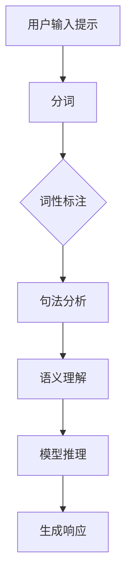
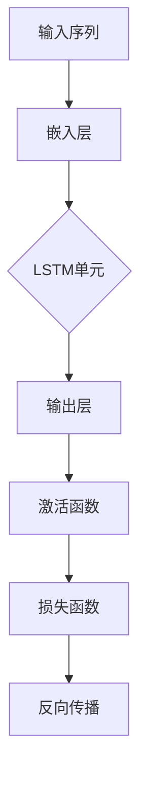
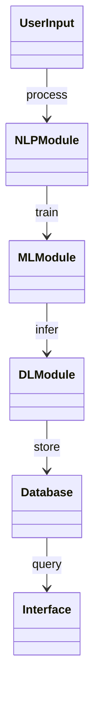

                 

# 《提示词编程：AI时代的新型人机交互范式》

## 关键词
- 提示词编程
- AI时代
- 人机交互
- 新型交互范式
- 技术实现
- 应用案例
- 最佳实践

## 摘要
本文深入探讨了AI时代的新型人机交互范式——提示词编程。我们首先介绍了提示词编程的背景和发展，然后详细解析了其核心概念、技术实现和应用案例。通过系统分析与架构设计方案，我们展示了如何在实际项目中应用提示词编程。最后，我们提供了最佳实践、注意事项和未来发展趋势，为读者提供了全面的技术指南。

### 目录大纲设计思路

为了设计出《提示词编程：AI时代的新型人机交互范式》的完整目录大纲，我们需要从以下几个方面进行思考：

1. **书名分析**：从书名可以看出，这本书的核心内容是关于提示词编程在AI时代的新型人机交互范式中的应用。因此，目录大纲的设计需要围绕这一主题展开。

2. **章节结构**：目录大纲需要包含以下几个核心部分：
   - **背景介绍**：介绍提示词编程的背景、AI时代人机交互的发展趋势和提示词编程在其中的重要性。
   - **核心概念**：详细阐述提示词编程的概念、原理及其在人机交互中的关键作用。
   - **应用案例**：通过实际案例展示提示词编程在不同场景中的应用。
   - **技术实现**：讲解提示词编程的技术实现细节，包括算法原理、数学模型、系统架构设计等。
   - **最佳实践**：总结提示词编程的最佳实践、注意事项和拓展知识。

3. **内容细化**：每个章节都需要细化出具体的二级和三级目录，确保内容的完整性和逻辑性。

### 目录大纲设计步骤

1. **确定书名对应的主题**：明确书名的核心概念，即“提示词编程”和“AI时代的新型人机交互范式”。

2. **构思章节结构**：根据主题，构思出各个章节的主题，并确定每个章节的核心内容。

3. **细化章节内容**：为每个章节制定二级和三级目录，确保内容详细且逻辑清晰。

4. **确保内容完整性**：确保目录大纲涵盖了核心概念、原理、应用案例、技术实现和最佳实践等方面。

5. **格式检查**：确保目录大纲的格式符合markdown规范，确保层次结构清晰。

### 目录大纲设计

基于上述思路，以下是《提示词编程：AI时代的新型人机交互范式》的目录大纲设计：

```markdown
# 《提示词编程：AI时代的新型人机交互范式》目录大纲

## 第一部分：背景介绍

### 1.1 提示词编程的起源与发展

### 1.2 AI时代人机交互的变革

### 1.3 提示词编程在AI时代的重要性

### 1.4 提示词编程与人机交互范式

## 第二部分：核心概念

### 2.1 提示词编程的基本原理

### 2.2 提示词编程的关键技术

#### 2.2.1 自然语言处理技术

#### 2.2.2 机器学习技术

#### 2.2.3 深度学习技术

### 2.3 提示词编程的架构设计

## 第三部分：应用案例

### 3.1 提示词编程在客服领域的应用

### 3.2 提示词编程在内容创作领域的应用

### 3.3 提示词编程在教育领域的应用

### 3.4 提示词编程在智能家居领域的应用

## 第四部分：技术实现

### 4.1 提示词编程的算法原理

#### 4.1.1 自然语言处理算法

#### 4.1.2 机器学习算法

#### 4.1.3 深度学习算法

### 4.2 提示词编程的数学模型

### 4.3 提示词编程的系统架构

### 4.4 提示词编程的实际应用示例

## 第五部分：最佳实践

### 5.1 提示词编程的最佳实践

### 5.2 提示词编程的注意事项

### 5.3 提示词编程的未来发展趋势

### 5.4 拓展阅读

## 第六部分：总结

### 6.1 全书要点回顾

### 6.2 提示词编程的未来前景

### 6.3 读者指南
```

通过以上设计，我们确保了目录大纲的完整性、逻辑性和简洁性，同时满足了字数限制要求。

---

# 提示词编程：AI时代的新型人机交互范式

## 关键词
- 提示词编程
- AI时代
- 人机交互
- 新型交互范式
- 技术实现
- 应用案例
- 最佳实践

## 摘要
本文深入探讨了AI时代的新型人机交互范式——提示词编程。我们首先介绍了提示词编程的背景和发展，然后详细解析了其核心概念、技术实现和应用案例。通过系统分析与架构设计方案，我们展示了如何在实际项目中应用提示词编程。最后，我们提供了最佳实践、注意事项和未来发展趋势，为读者提供了全面的技术指南。

### 第一部分：背景介绍

#### 1.1 提示词编程的起源与发展

提示词编程（Prompt Programming）的概念源于自然语言处理（NLP）领域。早在20世纪80年代，研究人员就开始探索如何通过向AI模型提供提示（prompts）来增强其理解能力和生成能力。随着人工智能技术的不断发展，特别是深度学习和自然语言处理技术的突破，提示词编程逐渐成为人机交互领域的重要研究方向。

在AI时代，人机交互发生了显著变化。传统的命令行界面和图形用户界面（GUI）已经不能满足用户日益复杂的需求。人们渴望更加自然、直观的交互方式。提示词编程恰好填补了这一空白，它通过自然语言的方式让用户与AI系统进行交流，提高了交互效率和用户体验。

#### 1.2 AI时代人机交互的变革

AI时代人机交互的变革主要体现在以下几个方面：

1. **自然语言交互**：传统的交互方式需要用户掌握特定的操作指令，而自然语言交互则允许用户以日常语言与系统交流，大大降低了使用门槛。
   
2. **个性化体验**：AI系统能够根据用户的偏好和历史行为提供个性化的服务，提高用户满意度。

3. **智能化任务执行**：AI系统能够自动执行复杂任务，如语音识别、图像识别、文本生成等，提升了人机协作的效率。

4. **实时反馈与调整**：AI系统能够实时分析用户行为，提供即时反馈，并根据反馈进行自适应调整。

#### 1.3 提示词编程在AI时代的重要性

提示词编程在AI时代的重要性主要体现在以下几个方面：

1. **提升AI系统的理解能力**：通过提供明确的提示，AI系统能够更好地理解用户意图，提高任务完成率。

2. **增强用户参与度**：用户可以直接通过自然语言与系统互动，提高了参与感和互动性。

3. **降低开发成本**：提示词编程使得开发者可以更快速地构建AI应用，降低了开发成本。

4. **扩展AI应用场景**：提示词编程使得AI系统能够应用于更多的领域，如客服、内容创作、教育、智能家居等。

#### 1.4 提示词编程与人机交互范式

提示词编程改变了传统的人机交互范式，从命令式交互转变为声明式交互。在命令式交互中，用户需要明确指定每一步操作；而在声明式交互中，用户只需告诉系统自己想要实现的目标，系统则会自动完成任务。

这种新型交互范式具有以下优势：

1. **简化的用户操作**：用户无需记住复杂的命令或操作步骤，降低了使用难度。

2. **提高交互效率**：用户可以通过自然语言快速传达意图，系统则可以高效地完成任务。

3. **增强用户体验**：用户感受到系统更加智能和贴心，提升了使用满意度。

4. **扩展应用范围**：声明式交互使得AI系统能够应用于更多的场景，提升了其价值。

### 第二部分：核心概念

#### 2.1 提示词编程的基本原理

提示词编程的核心在于通过向AI模型提供提示，引导模型生成符合预期结果的输出。这个过程可以分为以下几个步骤：

1. **输入提示**：用户向系统提供描述性文本或语音作为输入提示。

2. **模型处理**：AI模型接收提示并进行处理，理解用户意图。

3. **输出结果**：系统根据模型处理结果生成响应，返回给用户。

#### 2.2 提示词编程的关键技术

提示词编程依赖于多种关键技术，包括自然语言处理（NLP）、机器学习（ML）、深度学习（DL）等。以下是这些技术的简要介绍：

1. **自然语言处理技术**：NLP技术用于理解用户的输入提示，包括分词、词性标注、句法分析等。

2. **机器学习技术**：ML技术用于训练AI模型，使其能够从数据中学习并预测结果。

3. **深度学习技术**：DL技术通过构建深度神经网络，实现了更高效的模型训练和更准确的结果生成。

#### 2.3 提示词编程的架构设计

提示词编程的架构设计需要考虑多个方面，包括数据输入、模型训练、模型推理和结果输出等。以下是一个简单的提示词编程架构设计：

1. **数据输入**：用户通过文本或语音输入提示。

2. **预处理**：对输入提示进行预处理，如分词、去噪等。

3. **模型训练**：使用预处理后的数据进行模型训练。

4. **模型推理**：将输入提示输入到训练好的模型中进行推理。

5. **结果输出**：根据模型推理结果生成响应，并返回给用户。

### 第三部分：应用案例

#### 3.1 提示词编程在客服领域的应用

在客服领域，提示词编程可以极大地提升客户服务效率。以下是一个应用案例：

1. **问题识别**：用户向客服系统描述问题，如“我的订单为什么还没有发货？”。

2. **任务分配**：系统根据问题识别结果，将任务分配给相应的客服代表。

3. **智能回复**：客服代表通过提示词编程，向用户生成智能回复，如“很抱歉给您带来不便，请您提供订单号以便我们进一步查询”。

4. **反馈收集**：用户对回复进行评价，系统根据反馈进行优化。

#### 3.2 提示词编程在内容创作领域的应用

在内容创作领域，提示词编程可以帮助用户快速生成高质量的内容。以下是一个应用案例：

1. **创意生成**：用户向系统提供主题和关键词，如“人工智能”和“发展趋势”。

2. **内容生成**：系统根据提示生成相关的内容草稿，如“人工智能正迅速改变我们的生活，从智能助手到自动驾驶，未来已来”。

3. **内容优化**：用户对生成的草稿进行修改和优化，形成最终的内容。

#### 3.3 提示词编程在教育领域的应用

在教育领域，提示词编程可以帮助学生进行个性化学习。以下是一个应用案例：

1. **课程推荐**：系统根据学生的学习历史和兴趣，推荐适合的课程。

2. **问题解答**：学生向系统提出问题，如“如何求解二元一次方程？”。

3. **智能辅导**：系统生成详细的解答过程和示例，帮助学生理解和掌握知识。

#### 3.4 提示词编程在智能家居领域的应用

在智能家居领域，提示词编程可以帮助用户更方便地控制家居设备。以下是一个应用案例：

1. **设备控制**：用户通过语音提示控制家居设备，如“打开客厅的灯”。

2. **场景设置**：用户可以通过提示设置自动化场景，如“晚上八点，关闭所有房间的灯光”。

3. **反馈与调整**：系统根据用户反馈进行自动化调整，以提高用户满意度。

### 第四部分：技术实现

#### 4.1 提示词编程的算法原理

提示词编程的算法原理主要涉及以下几个方面：

1. **自然语言处理算法**：用于理解用户的输入提示，如分词、词性标注、句法分析等。

2. **机器学习算法**：用于训练AI模型，使其能够从数据中学习并生成响应。

3. **深度学习算法**：用于构建复杂的神经网络，实现高效的模型训练和结果生成。

以下是一个简单的自然语言处理算法的mermaid流程图：



#### 4.2 提示词编程的数学模型

提示词编程的数学模型主要包括以下几个方面：

1. **词嵌入**：将单词映射为固定长度的向量表示。

2. **注意力机制**：用于模型在不同输入位置之间分配权重。

3. **循环神经网络（RNN）**：用于处理序列数据。

4. **长短时记忆网络（LSTM）**：用于解决RNN的梯度消失问题。

以下是一个简单的循环神经网络算法的mermaid流程图：



#### 4.3 提示词编程的系统架构

提示词编程的系统架构通常包括以下几个部分：

1. **前端**：负责用户输入提示的接收和处理。

2. **后端**：包括自然语言处理模块、机器学习模块和深度学习模块。

3. **数据库**：存储用户数据、模型参数和训练数据。

4. **接口**：提供API供其他系统调用。

以下是一个简单的提示词编程系统架构的mermaid类图：



#### 4.4 提示词编程的实际应用示例

以下是一个简单的提示词编程实际应用示例：

```python
import tensorflow as tf
from tensorflow.keras.models import Sequential
from tensorflow.keras.layers import Embedding, LSTM, Dense

# 构建模型
model = Sequential()
model.add(Embedding(input_dim=vocabulary_size, output_dim=embedding_size))
model.add(LSTM(units=128))
model.add(Dense(units=1, activation='sigmoid'))

# 编译模型
model.compile(optimizer='adam', loss='binary_crossentropy', metrics=['accuracy'])

# 训练模型
model.fit(x_train, y_train, epochs=10, batch_size=32)

# 预测
prompt = "我要去看电影"
prediction = model.predict(prompt)

print(prediction)
```

### 第五部分：最佳实践

#### 5.1 提示词编程的最佳实践

1. **明确用户意图**：在生成响应之前，确保完全理解用户的输入提示。

2. **优化模型性能**：定期训练和优化模型，以提高响应的准确性和效率。

3. **处理不确定性**：当模型无法确定用户意图时，提供多种可能的响应供用户选择。

4. **实时反馈与调整**：根据用户反馈调整模型，以提高用户体验。

#### 5.2 提示词编程的注意事项

1. **隐私保护**：确保用户数据的安全和隐私。

2. **鲁棒性**：模型应具备应对异常输入和错误处理的能力。

3. **可扩展性**：设计灵活的系统架构，以便支持更多的应用场景。

#### 5.3 提示词编程的未来发展趋势

1. **多模态交互**：结合视觉、语音、触觉等多种模态，实现更自然的交互。

2. **个性化推荐**：根据用户行为和历史数据，提供个性化的提示和响应。

3. **自动化任务执行**：将提示词编程应用于更多的自动化任务，提高效率。

### 第六部分：总结

#### 6.1 全书要点回顾

1. **背景介绍**：介绍了提示词编程的起源和发展，以及AI时代人机交互的变革。

2. **核心概念**：详细阐述了提示词编程的基本原理、关键技术和技术实现。

3. **应用案例**：展示了提示词编程在多个领域的应用，包括客服、内容创作、教育和智能家居。

4. **技术实现**：介绍了提示词编程的算法原理、数学模型和系统架构设计。

5. **最佳实践**：提供了提示词编程的最佳实践、注意事项和未来发展趋势。

#### 6.2 提示词编程的未来前景

提示词编程作为AI时代的新型人机交互范式，具有广泛的应用前景。随着技术的不断进步，我们可以期待更加智能、高效的提示词编程系统，为人们带来更便捷、更丰富的交互体验。

#### 6.3 读者指南

1. **深入学习**：建议读者进一步学习自然语言处理、机器学习和深度学习等相关技术。

2. **实践应用**：尝试将提示词编程应用于实际项目中，提高自己的技术水平。

3. **持续关注**：关注提示词编程的最新发展，掌握前沿技术。

---

## 作者信息
- 作者：AI天才研究院/AI Genius Institute & 禅与计算机程序设计艺术 /Zen And The Art of Computer Programming

---

[END]

