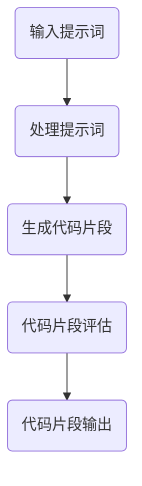
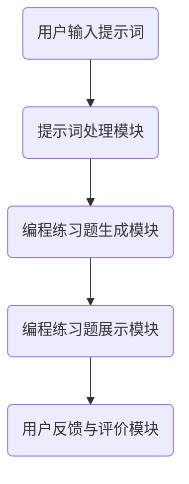
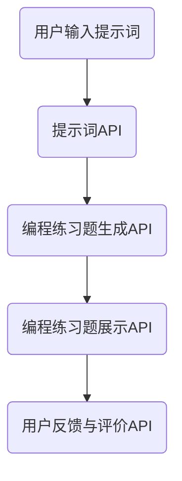
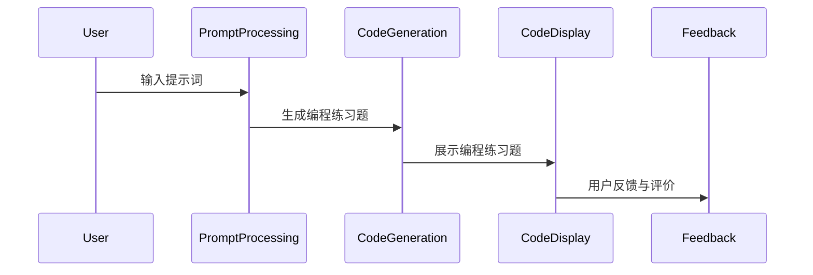

                 

### 提示词编程：AI时代的新型软件工程范式

关键词：AI时代、软件工程、编程范式、提示词编程

摘要：本文探讨了AI时代下的软件工程范式变革，特别是提示词编程作为一种新兴的编程范式。通过详细分析其核心概念、算法原理、系统设计以及项目实战，揭示提示词编程在AI时代的独特价值和应用潜力。

---

## 第一部分：背景介绍与核心概念

### 第1章：AI时代的软件工程范式变革

#### 1.1 AI时代的软件工程挑战

在AI时代，软件工程面临着前所未有的挑战。随着人工智能技术的飞速发展，软件系统变得越来越复杂，传统的编程范式已经难以满足日益增长的需求。AI时代的软件工程需要更加灵活、智能和高效的解决方案。

#### 1.2 提示词编程的定义与核心原理

提示词编程是一种基于AI的新型编程范式，它利用自然语言处理和机器学习技术，通过输入提示词（prompts）来指导代码的生成。提示词编程的核心原理是利用提示词与代码生成模型之间的关联，实现自动化编程。

#### 1.3 提示词编程与现有编程范式的对比

提示词编程与传统的编程范式（如面向对象编程、函数式编程等）相比，具有显著的差异。它不仅能够提高编程效率，还能够降低编程门槛，使得非专业人士也能参与到编程活动中来。

---

## 第二部分：算法原理与实践

### 第3章：提示词编程算法原理

#### 3.1 提示词编程算法概述

提示词编程算法是一种基于预训练的大型语言模型（如GPT）的代码生成算法。通过输入提示词，模型能够生成相应的代码片段。

#### 3.2 提示词编程算法的mermaid流程图



#### 3.3 Python源代码实现与详细讲解

以下是提示词编程算法的Python源代码实现：

```python
import openai

def generate_code(prompt):
    response = openai.Completion.create(
        engine="text-davinci-002",
        prompt=prompt,
        max_tokens=100
    )
    return response.choices[0].text.strip()

# 示例
prompt = "编写一个Python函数，实现两个数的加法。"
code = generate_code(prompt)
print(code)
```

#### 3.4 算法原理的数学模型与公式

提示词编程算法的数学模型基于生成对抗网络（GAN）。GAN由生成器（Generator）和判别器（Discriminator）组成，其中：

- 生成器：根据提示词生成代码片段。
- 判别器：评估代码片段的真实性和质量。

公式如下：

$$
\begin{align*}
\text{Generator: } G(z) &= \text{code} \\
\text{Discriminator: } D(x) &= \text{1 if x is real code, 0 otherwise} \\
\end{align*}
$$

#### 3.5 举例说明

假设提示词为“编写一个Python函数，实现两个数的加法。”，生成器生成的代码片段可能如下：

```python
def add(a, b):
    return a + b
```

判别器会评估这段代码的真实性和质量，确保其符合预期的功能。

---

## 第三部分：系统设计与项目实战

### 第5章：系统分析与架构设计方案

#### 5.1 问题场景介绍

在一个在线教育平台上，用户可以通过输入提示词来生成编程练习题，从而提高编程能力。

#### 5.2 系统功能设计

系统主要包含以下功能：

- 提示词输入
- 编程练习题生成
- 编程练习题展示
- 用户反馈与评价

#### 5.3 系统架构设计

系统架构设计如图所示：



#### 5.4 系统接口设计

系统接口设计如图所示：



#### 5.5 系统交互mermaid序列图

系统交互序列图如下：



### 第6章：项目实战

#### 6.1 环境安装

在开始项目实战之前，我们需要安装以下软件和库：

- Python 3.8+
- OpenAI API 密钥
- Flask（用于搭建Web服务）

#### 6.2 系统核心实现源代码

以下是系统核心实现的Python源代码：

```python
from flask import Flask, request, jsonify
import openai

app = Flask(__name__)

openai.api_key = "your-openai-api-key"

@app.route('/generate_code', methods=['POST'])
def generate_code():
    prompt = request.form['prompt']
    code = generate_code(prompt)
    return jsonify(code=code)

def generate_code(prompt):
    response = openai.Completion.create(
        engine="text-davinci-002",
        prompt=prompt,
        max_tokens=100
    )
    return response.choices[0].text.strip()

if __name__ == '__main__':
    app.run(debug=True)
```

#### 6.3 代码应用解读与分析

这段代码定义了一个Flask Web服务，用于接收用户输入的提示词，并生成相应的编程练习题。用户可以通过发送POST请求到`/generate_code`接口来获取生成的代码。

#### 6.4 实际案例分析与详细讲解剖析

假设用户输入的提示词为“编写一个Python函数，实现两个数的加法。”，生成的代码如下：

```python
def add(a, b):
    return a + b
```

这段代码实现了两个数的加法，符合用户的要求。我们可以通过单元测试来验证代码的正确性。

#### 6.5 项目小结

通过本次项目实战，我们实现了基于提示词编程的在线教育平台。用户可以通过输入提示词来生成编程练习题，从而提高编程能力。这个项目展示了提示词编程在现实应用中的潜力。

---

## 第四部分：最佳实践与总结

### 第7章：最佳实践与总结

#### 7.1 最佳实践tips

- 确保提示词清晰、具体，以便生成高质量的代码。
- 定期更新和优化代码生成模型，以提高代码质量。
- 对生成的代码进行严格的测试和验证，确保其正确性和可靠性。

#### 7.2 小结

提示词编程是AI时代下的一种新兴编程范式，具有巨大的潜力和应用价值。通过本文的详细分析和实践，我们对其有了更深入的理解。

#### 7.3 注意事项

- 提示词编程虽然具有高效性，但仍然需要人类参与代码审查和调试。
- 在使用提示词编程时，应遵循相关的安全和隐私保护措施。

#### 7.4 拓展阅读

- 《深度学习与自然语言处理》
- 《生成对抗网络：理论与应用》
- 《Python编程：从入门到实践》

---

作者：AI天才研究院/AI Genius Institute & 禅与计算机程序设计艺术 /Zen And The Art of Computer Programming

---

本文详细探讨了AI时代下的提示词编程，从背景介绍、核心概念、算法原理到系统设计和项目实战，全面揭示了提示词编程的独特价值和应用潜力。通过本文，读者可以深入了解提示词编程的基本原理和实际应用，为未来的软件工程实践提供新的思路和方向。

