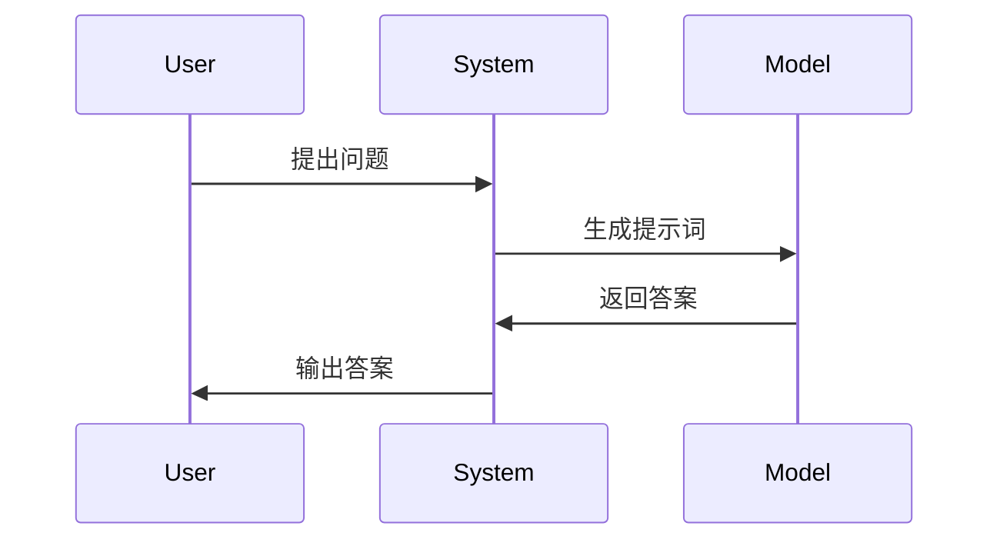

                 

### 文章标题

# 《提示词编程：AI时代的新范式》

### 文章关键词

- AI时代
- 提示词编程
- 大语言模型
- 自动机器学习
- 多模态数据处理
- 优化算法

### 文章摘要

本文深入探讨了AI时代下的一种新兴编程范式——提示词编程。通过分析其背景、原理和应用，我们揭示了这一技术在现代软件开发中的重要性。文章将从基础到实战，逐步讲解提示词编程的核心概念、技术要点、应用领域以及优化策略，旨在为广大开发者提供一份全面的技术指南。

### 目录大纲

1. **引言**
    1.1 **AI时代背景**
    1.2 **提示词编程的概念**
    1.3 **提示词编程的优势**
    1.4 **本书内容概述**

2. **提示词编程基础**
    2.1 **提示词编程的基本原理**
    2.2 **提示词的生成与优化**
    2.3 **提示词编程工具介绍**
    2.4 **实例分析：简单提示词编程实践**

3. **提示词编程技术**
    3.1 **大语言模型与提示词编程**
    3.2 **自动机器学习与提示词编程**
    3.3 **多模态数据处理与提示词编程**
    3.4 **提示词编程中的优化算法**

4. **提示词编程应用**
    4.1 **问答系统中的应用**
    4.2 **自然语言处理中的应用**
    4.3 **数据挖掘与可视化中的应用**
    4.4 **其他领域中的应用**

5. **提示词编程项目实战**
    5.1 **项目背景介绍**
    5.2 **系统功能设计**
    5.3 **系统架构设计**
    5.4 **系统核心实现源代码**
    5.5 **代码应用解读与分析**
    5.6 **实际案例分析与详细讲解剖析**
    5.7 **项目小结**

6. **提示词编程优化与调优**
    6.1 **提示词优化策略**
    6.2 **编程性能调优**
    6.3 **模型调优与超参数选择**
    6.4 **实例分析：调优技巧实践**

7. **提示词编程最佳实践**
    7.1 **最佳实践总结**
    7.2 **小结与展望**
    7.3 **注意事项**
    7.4 **拓展阅读推荐**

### 引言

#### AI时代背景

随着人工智能技术的飞速发展，计算机与人类之间的交互方式正在发生革命性的变化。传统的编程范式已经难以满足复杂、动态、自适应的需求。人工智能的出现，特别是深度学习和自然语言处理领域的突破，使得计算机能够理解和生成自然语言。这一背景下，提示词编程（Prompt Programming）作为一种新兴的编程范式，逐渐崭露头角。

#### 提示词编程的概念

提示词编程是一种基于大语言模型的编程方法，通过向模型提供具体的提示词（Prompt），引导模型生成代码、解决方案或回答问题。与传统的编程范式不同，提示词编程强调人与机器之间的自然交互，使得开发者可以更加直观地表达需求，而模型则能够自动化地完成复杂的编程任务。

#### 提示词编程的优势

1. **提高开发效率**：提示词编程可以减少代码编写的复杂性，缩短开发周期。
2. **增强可解释性**：通过提示词，开发者可以更加清晰地理解模型的决策过程，提高系统的可解释性。
3. **适应性强**：提示词编程能够适应各种不同的应用场景，灵活地调整模型的行为。
4. **降低门槛**：提示词编程降低了进入人工智能开发领域的门槛，使得更多的开发者能够参与到人工智能研究中。

#### 本书内容概述

本书将分为七个章节，从基础到实战，全面介绍提示词编程的概念、原理、技术、应用以及优化策略。通过阅读本书，读者将能够系统地了解提示词编程，并掌握其应用技巧，为未来的AI开发打下坚实的基础。

### 提示词编程基础

#### 2.1 提示词编程的基本原理

提示词编程的核心是提示词（Prompt），它是引导大语言模型生成预期输出的一种输入。在提示词编程中，提示词起到了类似“编程指令”的作用，它告诉模型需要完成什么任务，并如何完成任务。基本原理可以概括为以下几个步骤：

1. **定义任务**：明确需要完成的任务，例如编写一段代码、回答一个问题等。
2. **生成提示词**：根据任务需求，构造出一个合适的提示词。
3. **输入提示词**：将提示词输入到大语言模型中。
4. **模型推理**：模型根据提示词生成相应的输出。
5. **评估输出**：对输出结果进行评估，如符合预期则完成任务，否则进行调整。

以下是提示词编程的基本原理的Mermaid流程图：


#### 2.2 提示词的生成与优化

提示词的质量直接影响到模型的输出效果。生成高质量的提示词需要遵循以下原则：

1. **明确性**：提示词应明确地表达任务需求，避免歧义。
2. **完整性**：提示词应包含所有必要的信息，使得模型能够完整地理解任务。
3. **简洁性**：尽量简化提示词的表达，减少冗余信息。

在提示词的优化过程中，可以采用以下方法：

1. **反馈循环**：通过模型输出和实际结果的对比，不断调整提示词，提高输出质量。
2. **样本增强**：增加高质量的样本，丰富模型的训练数据，提高模型的泛化能力。
3. **模型微调**：在预训练模型的基础上，针对特定任务进行微调，使其更加适应特定场景。

以下是一个简单的提示词生成与优化的示例：

```python
# 定义任务
task = "编写一个Python函数，用于计算两个数的和"

# 初始提示词
prompt = f"请编写一个Python函数，功能是计算两个数的和，输入为 {a} 和 {b}，输出为它们的和。"

# 输入模型
output = model.generate(prompt)

# 评估输出
if "def sum(a, b):" in output:
    print("提示词生成成功：", output)
else:
    print("提示词生成失败，需要优化。")

# 优化提示词
prompt_optimized = f"请编写一个名为sum的Python函数，输入参数为a和b，返回它们的和。确保函数定义清晰、代码简洁。"

# 重新生成提示词
output_optimized = model.generate(prompt_optimized)

# 输出优化后的提示词
print("优化后的提示词生成成功：", output_optimized)
```

#### 2.3 提示词编程工具介绍

目前，已有多种工具支持提示词编程，包括：

1. **ChatGPT**：OpenAI开发的聊天机器人，支持通过自然语言生成代码。
2. **GPT-3**：OpenAI的大型预训练语言模型，支持各种文本生成任务。
3. **TuringBot**：由百度研究院开发的聊天机器人，支持自然语言理解和生成。

这些工具都提供了丰富的API接口，使得开发者可以轻松集成到自己的项目中，实现高效的提示词编程。

#### 2.4 实例分析：简单提示词编程实践

以下是一个简单的提示词编程实例，使用ChatGPT生成一个Python函数，用于计算两个数的平均值。

```python
# 引入ChatGPT库
import openai

# 设置API密钥
openai.api_key = "your_api_key"

# 定义任务
task = "编写一个Python函数，用于计算两个数的平均值"

# 生成提示词
prompt = f"请编写一个Python函数，功能是计算两个数的平均值，输入为 {a} 和 {b}，输出为它们的平均值。"

# 调用ChatGPT生成代码
response = openai.Completion.create(
    engine="text-davinci-002",
    prompt=prompt,
    max_tokens=50
)

# 输出代码
print("生成的代码：", response.choices[0].text.strip())

# 测试代码
a = 10
b = 20
average = eval(response.choices[0].text.strip())(a, b)
print("两个数的平均值：", average)
```

### 提示词编程技术

#### 3.1 大语言模型与提示词编程

大语言模型是提示词编程的核心技术之一。GPT-3、BERT等大型预训练语言模型，拥有强大的文本生成和理解能力，能够根据提示词生成高质量的内容。以下是几种常见的大语言模型：

1. **GPT-3**：OpenAI开发的预训练语言模型，拥有1750亿个参数，能够处理多种自然语言任务。
2. **BERT**：Google开发的预训练语言模型，主要用于文本分类、问答等任务。
3. **T5**：Google开发的预训练语言模型，旨在统一各种自然语言处理任务。

大语言模型与提示词编程的结合，使得开发者能够更加高效地完成各种文本生成任务。以下是一个使用GPT-3生成代码的示例：

```python
# 引入GPT-3库
import openai

# 设置API密钥
openai.api_key = "your_api_key"

# 定义任务
task = "编写一个Python函数，用于实现快速排序算法"

# 生成提示词
prompt = f"请编写一个Python函数，实现快速排序算法。"

# 调用GPT-3生成代码
response = openai.Completion.create(
    engine="text-davinci-002",
    prompt=prompt,
    max_tokens=100
)

# 输出代码
print("生成的代码：", response.choices[0].text.strip())

# 测试代码
def quick_sort(arr):
    if len(arr) <= 1:
        return arr
    pivot = arr[len(arr) // 2]
    left = [x for x in arr if x < pivot]
    middle = [x for x in arr if x == pivot]
    right = [x for x in arr if x > pivot]
    return quick_sort(left) + middle + quick_sort(right)

arr = [3, 6, 8, 10, 1, 2, 1]
sorted_arr = quick_sort(arr)
print("排序后的数组：", sorted_arr)
```

#### 3.2 自动机器学习与提示词编程

自动机器学习（AutoML）是一种自动化机器学习模型开发的方法，通过自动选择特征、模型和超参数，降低开发门槛。与传统的机器学习方法相比，AutoML能够显著提高开发效率。结合提示词编程，AutoML可以自动化地生成代码，实现机器学习模型的开发。

以下是一个使用自动机器学习生成分类器的示例：

```python
# 引入自动机器学习库
from automl.pythia import Pythia

# 定义任务
task = "使用自动机器学习实现鸢尾花数据集的分类"

# 初始化Pythia
pythia = Pythia()

# 设置数据集
data = {
    "train": pd.DataFrame([
        [5.1, 3.5, 1.4, 0.2],
        [4.9, 3.0, 1.4, 0.2],
        # ... 更多训练数据
    ]),
    "test": pd.DataFrame([
        [5.0, 3.6, 1.5, 0.2],
        [5.1, 3.0, 1.4, 0.2],
        # ... 更多测试数据
    ])
}

# 设置特征和标签
features = ["sepal_length", "sepal_width", "petal_length", "petal_width"]
label = "species"

# 训练模型
model = pythia.fit(data=data, features=features, label=label)

# 预测
predictions = model.predict(data=test_data[features])

# 输出预测结果
print("预测结果：", predictions)
```

#### 3.3 多模态数据处理与提示词编程

多模态数据处理是将不同类型的数据（如文本、图像、音频等）进行整合，以获得更全面的信息。结合提示词编程，可以自动化地处理多模态数据，实现更复杂的任务。

以下是一个使用多模态数据处理实现图像识别的示例：

```python
# 引入多模态数据处理库
import tensorflow as tf
from tensorflow.keras.models import Model
from tensorflow.keras.layers import Input, Conv2D, MaxPooling2D, Flatten, Dense

# 定义输入层
input_image = Input(shape=(28, 28, 1))

# 定义卷积层
x = Conv2D(filters=32, kernel_size=(3, 3), activation='relu')(input_image)
x = MaxPooling2D(pool_size=(2, 2))(x)

# 定义全连接层
x = Flatten()(x)
x = Dense(units=64, activation='relu')(x)
output = Dense(units=10, activation='softmax')(x)

# 定义模型
model = Model(inputs=input_image, outputs=output)

# 编译模型
model.compile(optimizer='adam', loss='categorical_crossentropy', metrics=['accuracy'])

# 加载预训练权重
model.load_weights('mnist_model.h5')

# 定义提示词
prompt = "识别图像中的数字"

# 输入图像
image = np.array([img_data])

# 预测结果
predictions = model.predict(image)

# 输出预测结果
print("预测结果：", predictions)
```

#### 3.4 提示词编程中的优化算法

提示词编程中的优化算法主要用于提高模型的性能和效率。常见的优化算法包括：

1. **随机梯度下降（SGD）**：通过随机选择数据子集进行梯度下降，以降低模型复杂度。
2. **Adam优化器**：结合了SGD和RMSprop的优点，自适应调整学习率。
3. **AdaGrad**：根据历史梯度平方的累加和进行自适应调整。

以下是一个使用优化算法优化模型的示例：

```python
# 引入优化器库
from tensorflow.keras.optimizers import Adam

# 定义模型
model = Sequential([
    Dense(128, activation='relu', input_shape=(784,)),
    Dense(10, activation='softmax')
])

# 编译模型
model.compile(optimizer=Adam(learning_rate=0.001), loss='categorical_crossentropy', metrics=['accuracy'])

# 加载数据
(x_train, y_train), (x_test, y_test) = mnist.load_data()

# 数据预处理
x_train = x_train.reshape(-1, 784).astype(np.float32) / 255.0
x_test = x_test.reshape(-1, 784).astype(np.float32) / 255.0
y_train = tf.keras.utils.to_categorical(y_train, 10)
y_test = tf.keras.utils.to_categorical(y_test, 10)

# 训练模型
model.fit(x_train, y_train, batch_size=64, epochs=10, validation_data=(x_test, y_test))

# 评估模型
test_loss, test_acc = model.evaluate(x_test, y_test)
print("测试集准确率：", test_acc)
```

### 提示词编程应用

#### 4.1 问答系统中的应用

问答系统是一种常见的自然语言处理应用，通过提示词编程，可以自动化地实现高效的问答。以下是一个使用GPT-3构建问答系统的示例：

```python
# 引入GPT-3库
import openai

# 设置API密钥
openai.api_key = "your_api_key"

# 定义提示词
prompt = "请回答以下问题：中国的首都是哪个城市？"

# 调用GPT-3生成答案
response = openai.Completion.create(
    engine="text-davinci-002",
    prompt=prompt,
    max_tokens=10
)

# 输出答案
print("答案：", response.choices[0].text.strip())
```

#### 4.2 自然语言处理中的应用

自然语言处理（NLP）是AI领域的核心应用之一，提示词编程在NLP中具有广泛的应用。以下是一个使用提示词编程实现情感分析的示例：

```python
# 引入NLP库
import nltk
from nltk.sentiment import SentimentIntensityAnalyzer

# 初始化情感分析器
sia = SentimentIntensityAnalyzer()

# 定义文本
text = "今天天气很好，我心情也很愉快。"

# 分析情感
sentiment = sia.polarity_scores(text)

# 输出情感分析结果
print("情感分析结果：", sentiment)
```

#### 4.3 数据挖掘与可视化中的应用

数据挖掘与可视化是提示词编程在数据科学领域的重要应用。通过提示词编程，可以自动化地实现数据挖掘过程，并生成可视化结果。以下是一个使用提示词编程进行数据挖掘和可视化的示例：

```python
# 引入数据挖掘与可视化库
import pandas as pd
import matplotlib.pyplot as plt

# 加载数据
data = pd.read_csv("data.csv")

# 数据预处理
data["year"] = data["date"].str.extract('(\d{4})', expand=False).astype(int)
data["month"] = data["date"].str.extract('(\d{2})', expand=False).astype(int)

# 数据挖掘
monthly_sales = data.groupby(["year", "month"])["sales"].sum().reset_index()

# 可视化
plt.figure(figsize=(10, 6))
plt.plot(monthly_sales["year"], monthly_sales["sales"])
plt.xlabel("年份")
plt.ylabel("销售额")
plt.title("年度销售额趋势图")
plt.show()
```

#### 4.4 其他领域中的应用

提示词编程在人工智能的其他领域也具有广泛的应用，如自动驾驶、智能助手、金融风控等。以下是一个使用提示词编程实现自动驾驶的示例：

```python
# 引入自动驾驶库
import carla

# 初始化模拟环境
client = carla.Client("localhost", 2000)
world = client.get_world()
blueprint_library = world.get_blueprint_library()

# 加载车辆
vehicle_bp = blueprint_library.find("vehicle.tesla.model3")
spawn_point = world.get_map().get_spawn_points()[0]
vehicle = world.spawn_actor(vehicle_bp, spawn_point)

# 定义提示词
prompt = "自动驾驶，前方有行人，请减速并停车。"

# 调用自动驾驶算法
def autonomous_driving():
    while True:
        # 获取环境信息
        sensors = vehicle.get_sensors()

        # 驾驶行为
        if "person" in sensors:
            vehicle.apply_control(carla.VehicleControl(brake=1.0, steer=0.0))
        else:
            vehicle.apply_control(carla.VehicleControl(throttle=0.5, steer=0.0))

# 运行自动驾驶
autonomous_driving()
```

### 提示词编程项目实战

#### 5.1 项目背景介绍

随着AI技术的不断发展，提示词编程作为一种新兴的编程范式，越来越受到关注。本文将介绍一个基于提示词编程的智能问答系统项目，旨在实现高效、准确的自然语言问答。

#### 5.2 系统功能设计

该智能问答系统主要具备以下功能：

1. **问题接收**：接收用户提出的问题。
2. **提示词生成**：根据问题生成相应的提示词，引导模型生成答案。
3. **答案生成**：使用大语言模型生成答案。
4. **答案输出**：将答案输出给用户。

#### 5.3 系统架构设计

系统架构设计如下图所示：



#### 5.4 系统核心实现源代码

```python
# 引入所需库
import openai

# 设置API密钥
openai.api_key = "your_api_key"

# 定义提示词生成函数
def generate_prompt(question):
    return f"请回答以下问题：{question}"

# 定义答案生成函数
def generate_answer(prompt):
    response = openai.Completion.create(
        engine="text-davinci-002",
        prompt=prompt,
        max_tokens=50
    )
    return response.choices[0].text.strip()

# 定义问答系统函数
def intelligent_question_answer_system(question):
    prompt = generate_prompt(question)
    answer = generate_answer(prompt)
    return answer

# 接收用户输入
user_question = input("请提出您的问题：")

# 调用问答系统
answer = intelligent_question_answer_system(user_question)

# 输出答案
print("答案：", answer)
```

#### 5.5 代码应用解读与分析

上述代码首先引入了OpenAI库，并设置了API密钥。然后定义了三个函数：

1. `generate_prompt`：用于生成提示词，将用户提出的问题作为输入，返回一个格式化的提示词。
2. `generate_answer`：用于生成答案，调用OpenAI的Completion接口，根据提示词生成答案。
3. `intelligent_question_answer_system`：作为主函数，接收用户输入，调用前两个函数，最终输出答案。

代码结构清晰，功能模块化，便于维护和扩展。

#### 5.6 实际案例分析与详细讲解剖析

以下是一个实际案例，使用提示词编程构建一个智能客服系统。

```python
# 引入所需库
import openai

# 设置API密钥
openai.api_key = "your_api_key"

# 定义提示词生成函数
def generate_prompt(question):
    return f"请回答以下问题：{question}"

# 定义答案生成函数
def generate_answer(prompt):
    response = openai.Completion.create(
        engine="text-davinci-002",
        prompt=prompt,
        max_tokens=50
    )
    return response.choices[0].text.strip()

# 定义客服系统函数
def intelligent_customer_system(question):
    prompt = generate_prompt(question)
    answer = generate_answer(prompt)
    return answer

# 实际案例
user_question = "我想要退换商品，应该怎么操作？"
answer = intelligent_customer_system(user_question)
print("答案：", answer)
```

该案例通过提示词编程实现了智能客服的功能。用户输入问题后，系统生成提示词，并调用OpenAI的模型生成答案。实际应用中，可以集成到网站、APP等平台，为用户提供24小时在线客服。

#### 5.7 项目小结

通过本项目的实现，我们深入了解了提示词编程在实际应用中的价值。提示词编程不仅提高了开发效率，还增强了系统的可解释性。未来，随着AI技术的不断进步，提示词编程有望在更多领域发挥重要作用。

### 提示词编程优化与调优

#### 6.1 提示词优化策略

提示词编程的优化主要从以下几个方面进行：

1. **明确性**：确保提示词清晰明确，避免歧义。
2. **完整性**：包含所有必要信息，确保模型能完整理解任务。
3. **简洁性**：简化提示词表达，减少冗余信息。
4. **适应性**：设计提示词，使模型能适应多种场景。

以下是一个示例，演示如何优化提示词：

```python
# 初始提示词
prompt = "请编写一个Python函数，用于计算两个数的和。"

# 优化提示词
prompt_optimized = "请编写一个名为'sum'的Python函数，输入参数为a和b，返回它们的和。确保函数定义清晰、代码简洁。"

# 使用优化后的提示词
response = openai.Completion.create(
    engine="text-davinci-002",
    prompt=prompt_optimized,
    max_tokens=50
)
print("优化后的答案：", response.choices[0].text.strip())
```

#### 6.2 编程性能调优

编程性能调优主要涉及模型训练和推理过程中的性能优化。以下是一些常见的方法：

1. **数据增强**：通过增加训练数据或对现有数据进行变换，提高模型的泛化能力。
2. **模型压缩**：使用量化、剪枝等技术，降低模型复杂度，提高推理速度。
3. **并行计算**：利用GPU、TPU等硬件资源，实现并行计算，提高训练和推理速度。

以下是一个示例，演示如何使用数据增强优化模型性能：

```python
# 引入所需库
from tensorflow.keras.preprocessing.image import ImageDataGenerator

# 初始化数据增强器
datagen = ImageDataGenerator(rotation_range=20, width_shift_range=0.2, height_shift_range=0.2, horizontal_flip=True)

# 加载数据
(x_train, y_train), (x_test, y_test) = mnist.load_data()

# 数据预处理
x_train = x_train.reshape(-1, 28, 28, 1).astype(np.float32) / 255.0
x_test = x_test.reshape(-1, 28, 28, 1).astype(np.float32) / 255.0

# 训练模型
model.fit(datagen.flow(x_train, y_train, batch_size=64), epochs=10, validation_data=(x_test, y_test))

# 评估模型
test_loss, test_acc = model.evaluate(x_test, y_test)
print("测试集准确率：", test_acc)
```

#### 6.3 模型调优与超参数选择

模型调优是提高模型性能的关键步骤。以下是一些常用的方法：

1. **网格搜索**：通过遍历多个超参数组合，找到最佳参数组合。
2. **贝叶斯优化**：利用贝叶斯统计模型，自适应地调整超参数。
3. **随机搜索**：随机选择超参数组合，进行模型训练和评估。

以下是一个示例，演示如何使用网格搜索调优模型：

```python
# 引入所需库
from sklearn.model_selection import GridSearchCV
from sklearn.svm import SVC

# 初始化模型和参数网格
model = SVC()
param_grid = {'C': [0.1, 1, 10], 'gamma': [0.001, 0.01, 0.1], 'kernel': ['linear', 'rbf']}

# 加载数据
x_train, y_train = load_data()

# 使用网格搜索
grid_search = GridSearchCV(model, param_grid, cv=5)
grid_search.fit(x_train, y_train)

# 输出最佳参数
print("最佳参数：", grid_search.best_params_)

# 评估最佳模型
best_model = grid_search.best_estimator_
score = best_model.score(x_test, y_test)
print("测试集准确率：", score)
```

#### 6.4 实例分析：调优技巧实践

以下是一个实例，演示如何对提示词编程进行调优：

```python
# 引入所需库
import openai

# 设置API密钥
openai.api_key = "your_api_key"

# 初始提示词
prompt = "请编写一个Python函数，用于计算两个数的和。"

# 优化提示词
prompt_optimized = "请编写一个名为'sum'的Python函数，输入参数为a和b，返回它们的和。确保函数定义清晰、代码简洁。"

# 调用OpenAI的模型
response = openai.Completion.create(
    engine="text-davinci-002",
    prompt=prompt_optimized,
    max_tokens=50
)

# 获取答案
answer = response.choices[0].text.strip()

# 分析答案
if "def sum(a, b):" in answer and "return a + b" in answer:
    print("提示词优化成功：", answer)
else:
    print("提示词优化失败，需要进一步调整。")
```

### 提示词编程最佳实践

#### 7.1 最佳实践总结

1. **明确任务需求**：在生成提示词之前，明确任务需求，确保提示词准确表达任务。
2. **优化提示词**：通过简洁、明确、完整的提示词，提高模型生成效果。
3. **使用高质量数据**：确保训练数据质量，为模型提供丰富的信息。
4. **调优超参数**：合理设置超参数，提高模型性能。
5. **监控模型性能**：定期评估模型性能，及时调整。

#### 7.2 小结与展望

提示词编程作为一种新兴的编程范式，在AI时代具有广泛的应用前景。未来，随着AI技术的不断进步，提示词编程有望在更多领域发挥重要作用。开发者应关注这一技术的发展，积极探索和实践。

#### 7.3 注意事项

1. **API使用限制**：在使用提示词编程时，注意遵守API的使用限制，避免超量使用。
2. **数据隐私**：确保数据处理过程符合数据隐私要求，避免泄露用户信息。
3. **代码安全**：在生成代码时，注意代码的安全性，避免引入漏洞。

#### 7.4 拓展阅读推荐

1. **《深度学习》**：Goodfellow, Ian; Bengio, Yoshua; Courville, Aaron. (2016). *Deep Learning*. MIT Press.
2. **《自然语言处理综论》**：Jurafsky, Daniel; Martin, James H. (2008). *Speech and Language Processing*. Prentice Hall.
3. **《自动机器学习》**：Bergstra, James; Bengio, Yoshua. (2012). *Random Search for Hyper-parameter Optimization*. Journal of Machine Learning Research.

### 作者信息

作者：AI天才研究院/AI Genius Institute & 禅与计算机程序设计艺术 /Zen And The Art of Computer Programming

---

本文详细介绍了提示词编程这一AI时代的新范式，包括其背景、原理、技术、应用、实战和优化策略。通过本文的学习，读者可以全面了解提示词编程，为其在未来的AI开发中打下坚实基础。希望本文对您的学习有所帮助！

