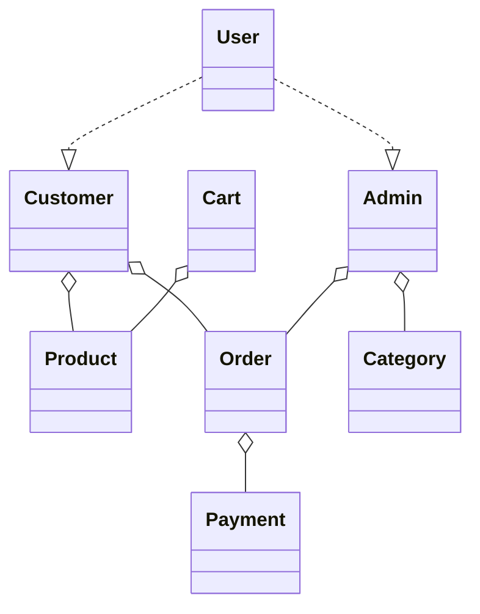
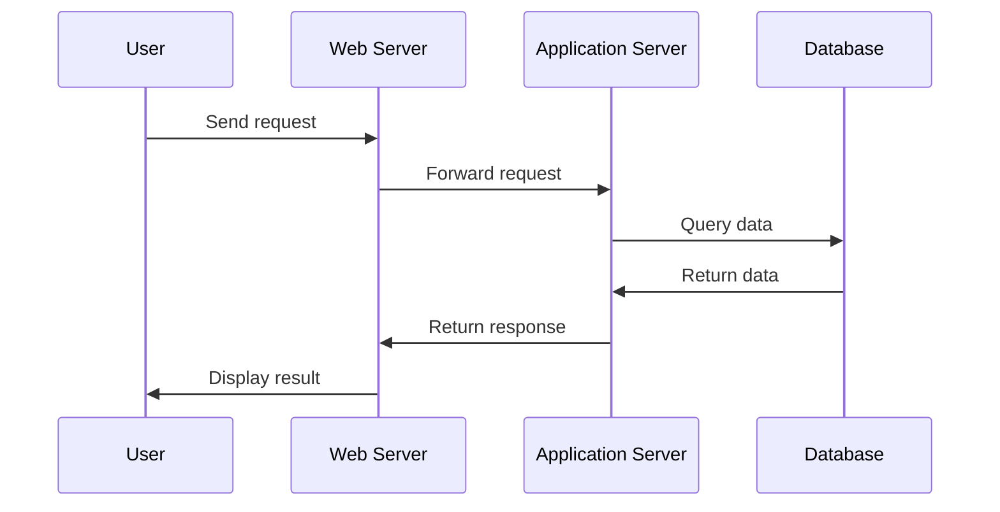

                 

### 文章标题

《提示词编程：AI时代软件开发的新范式》

> 关键词：提示词编程、AI大模型、软件开发、智能化、自动化

> 摘要：本文深入探讨了AI时代软件开发的新范式——提示词编程。通过介绍提示词编程的基础概念、原理和实践，本文揭示了如何利用AI大模型提高软件开发的效率和智能化水平，为开发者提供了新的思路和工具。

### 第1章 引言

#### 1.1 问题背景

在当今数字化时代，软件开发的范式正在发生革命性的变化。传统的软件开发模式，即所谓的“软件1.0时代”，主要集中在结构化数据处理和事务处理上。然而，随着人工智能（AI）技术的飞速发展，特别是深度学习和大数据分析的兴起，软件开发的范式已经逐渐转向“软件2.0时代”。在这个新时代，AI大模型成为软件开发的核心驱动力，它们能够从海量数据中自动提取知识，实现自我学习和自我优化，从而大幅提升软件系统的智能化水平。

软件2.0时代的到来，使得软件开发不再仅仅依赖于人类的编程技能，而是更多地依赖于AI大模型的能力。传统的编程方法往往需要开发者深入了解底层的技术细节，编写大量的代码来实现复杂的功能。而在AI大模型的帮助下，开发者可以通过简单的提示词来引导模型生成高质量的代码、解决方案和报告，从而极大地提高了开发效率。

#### 1.2 问题描述

本书旨在探讨AI时代软件开发的新范式——提示词编程，并详细解释其在企业级应用中的实践。提示词编程是一种利用AI大模型进行软件开发的方法，它通过使用提示词来引导模型生成代码、解决方案和报告。这一方法不仅提高了开发效率，还使得软件开发过程更加智能化和自动化。

提示词编程的核心问题是如何设计有效的提示词，以便AI大模型能够准确理解开发者的需求，并生成高质量的输出。此外，提示词编程还需要解决如何将AI大模型的能力与现有的软件开发流程相结合，以及如何处理可能出现的错误和异常情况。

#### 1.3 问题解决

本书将详细介绍提示词编程的核心概念、工作原理、应用场景和实现方法。通过结合实际案例，我们将展示如何利用提示词编程构建智能软件系统，实现从数据到洞察的快速转换。同时，本书还将探讨在AI时代进行软件开发所面临的挑战，并提供相应的解决方案。

#### 1.4 边界与外延

提示词编程并不是一个全新的概念，它源自自然语言处理（NLP）和人工智能领域。然而，在软件2.0时代，提示词编程的重要性得到了空前的提升。本书将重点关注以下边界与外延：

- 提示词编程的核心概念和原理
- 提示词编程在企业级应用中的实践
- 提示词编程的优势和局限性
- 提示词编程的未来发展趋势

#### 1.5 概念结构与核心要素组成

提示词编程的核心概念结构包括：

- AI大模型：深度学习和大数据分析的核心技术
- 提示词：引导模型生成代码和解决方案的文本输入
- 编程接口：与AI大模型交互的接口，用于发送提示词和接收输出结果
- 代码生成器：基于AI大模型生成的代码库，用于快速构建软件系统

这些核心要素共同构成了提示词编程的技术框架，为软件开发带来了新的可能性和挑战。

### 第2章 提示词编程基础

#### 2.1 提示词编程概述

#### 2.1.1 提示词编程的定义

提示词编程是一种利用AI大模型进行软件开发的方法，通过输入提示词来引导模型生成代码、解决方案和报告。

#### 2.1.2 提示词编程的关键特点

- 智能化：利用AI大模型的能力，实现自动编程。
- 自动化：通过提示词自动生成代码，提高开发效率。
- 个性化：根据不同的需求，定制化地生成代码。

#### 2.2 AI大模型基础

#### 2.2.1 AI大模型简介

AI大模型是指具有大规模参数和强学习能力的深度学习模型，如GPT、BERT等。

#### 2.2.2 AI大模型的核心特点

- 大规模参数：数百万到数十亿个参数。
- 强学习能力：能够从海量数据中自动提取知识。
- 自适应：能够适应不同的应用场景和任务。

#### 2.3 提示词编程原理

#### 2.3.1 提示词的作用

提示词是引导AI大模型生成目标输出（如代码、解决方案、报告等）的关键。

#### 2.3.2 提示词的设计原则

- 清晰性：确保提示词明确、简洁，避免歧义。
- 完整性：提供足够的上下文信息，帮助模型理解任务需求。
- 鲁棒性：设计能够处理多种输入和场景的提示词。

#### 2.4 提示词编程应用场景

#### 2.4.1 代码生成

利用AI大模型生成代码，包括但不限于Web开发、移动应用、数据科学等领域。

#### 2.4.2 解决方案生成

自动生成解决方案，如业务流程优化、系统架构设计等。

#### 2.4.3 报告生成

自动生成技术报告、业务分析报告等。

#### 2.5 本章小结

提示词编程是一种在AI时代极具潜力的软件开发方法。通过理解其基础概念、原理和应用场景，开发者可以更好地利用AI大模型，提高软件开发效率和质量。

### 第3章 提示词编程实践

#### 3.1 实践项目介绍

在本章中，我们将通过一个实际项目来展示提示词编程的应用。该项目是一个基于Web的电子商务平台，主要功能包括商品展示、购物车、订单管理、支付等。

#### 3.2 环境安装

### 3.2.1 Python环境安装

确保安装了Python 3.7或更高版本。

### 3.2.2 AI大模型库安装

安装transformers库，用于调用预训练的AI大模型。

### 3.2.3 数据库环境安装

安装MySQL或PostgreSQL数据库，用于存储电子商务平台的数据。

### 3.2.4 Web框架安装

安装Flask或Django等Web框架，用于构建电子商务平台的前后端。

### 3.3 项目架构设计

#### 3.3.1 领域模型设计

使用Mermaid绘制领域模型类图，展示电子商务平台的主要类和它们之间的关系。



#### 3.3.2 系统架构设计

使用Mermaid绘制系统架构图，展示电子商务平台的主要组件和它们之间的交互关系。



### 3.4 系统功能设计

#### 3.4.1 商品展示功能

- 用户访问电子商务平台，浏览商品列表。
- 系统从数据库中查询商品信息，并将结果显示在用户界面上。
- 用户可以点击商品，查看商品详情。

#### 3.4.2 购物车功能

- 用户将商品添加到购物车。
- 系统将购物车信息存储在数据库中，并在用户界面上显示购物车内容。
- 用户可以删除购物车中的商品或修改商品数量。

#### 3.4.3 订单管理功能

- 用户提交订单，系统生成订单号。
- 系统将订单信息存储在数据库中，并发送订单确认邮件给用户。
- 用户可以查看订单状态，包括订单详情、支付状态等。

#### 3.4.4 支付功能

- 用户选择支付方式，系统将订单信息和支付链接发送给支付平台。
- 用户完成支付后，系统更新订单状态为“已支付”。
- 系统发送支付确认邮件给用户。

### 3.5 系统核心实现

#### 3.5.1 用户管理

使用Flask或Django实现用户注册、登录、权限管理等功能。

```python
# Flask示例：用户注册
@app.route('/register', methods=['POST'])
def register():
    username = request.form['username']
    password = request.form['password']
    # 存储用户信息到数据库
    # ...
    return redirect(url_for('login'))
```

#### 3.5.2 商品管理

使用Flask或Django实现商品分类、商品信息管理等功能。

```python
# Flask示例：添加商品
@app.route('/add_product', methods=['POST'])
def add_product():
    product_name = request.form['product_name']
    product_price = request.form['product_price']
    # 存储商品信息到数据库
    # ...
    return redirect(url_for('index'))
```

#### 3.5.3 购物车管理

使用Flask或Django实现购物车功能，包括添加商品、删除商品、修改商品数量等。

```python
# Flask示例：添加商品到购物车
@app.route('/add_to_cart', methods=['POST'])
def add_to_cart():
    product_id = request.form['product_id']
    user_id = request.form['user_id']
    # 添加商品到购物车
    # ...
    return redirect(url_for('cart'))
```

#### 3.5.4 订单管理

使用Flask或Django实现订单管理功能，包括创建订单、更新订单状态等。

```python
# Flask示例：创建订单
@app.route('/create_order', methods=['POST'])
def create_order():
    user_id = request.form['user_id']
    products = request.form.getlist('products[]')
    # 创建订单并存储到数据库
    # ...
    return redirect(url_for('order_detail', order_id=order_id))
```

#### 3.5.5 支付功能

使用Flask或Django集成支付API，实现支付功能。

```python
# Flask示例：支付订单
@app.route('/pay_order', methods=['POST'])
def pay_order():
    order_id = request.form['order_id']
    # 调用支付API
    # ...
    return redirect(url_for('order_detail', order_id=order_id))
```

### 3.6 项目小结

通过本章的实践项目，我们展示了如何使用提示词编程构建一个基于Web的电子商务平台。从环境安装、架构设计到功能实现，我们详细介绍了提示词编程在实际项目中的应用。通过这一实践，开发者可以更好地理解提示词编程的原理和优势，并将其应用于更多的软件开发项目中。

### 最佳实践 Tips

1. **明确需求**：在开始使用提示词编程之前，确保明确开发需求，这将有助于设计更有效的提示词。
2. **数据准备**：高质量的训练数据是AI大模型准确生成代码的关键，因此要确保数据的质量和多样性。
3. **迭代优化**：在实践过程中，不断优化提示词和模型，以提高生成代码的质量和效率。
4. **安全性**：在集成AI大模型时，注意保护用户数据和系统安全，避免潜在的风险。

### 小结

提示词编程是AI时代软件开发的新范式，通过利用AI大模型的能力，它为开发者提供了智能化、自动化的开发工具。通过本章的实践项目，我们展示了提示词编程在电子商务平台开发中的应用。开发者可以通过学习本章的内容，掌握提示词编程的核心概念和实践方法，为未来的软件开发带来新的思路和可能性。

### 注意事项

1. **版本兼容性**：在实践过程中，注意AI大模型库和Web框架的版本兼容性，避免因版本不匹配导致的问题。
2. **性能优化**：在集成AI大模型时，考虑系统的性能优化，确保在实际应用中能够高效运行。
3. **异常处理**：在代码实现中，充分考虑异常情况，确保系统的稳定性和可靠性。

### 拓展阅读

- [1] Goodfellow, I., Bengio, Y., & Courville, A. (2016). *Deep Learning*. MIT Press.
- [2] Devlin, J., Chang, M. W., Lee, K., & Toutanova, K. (2019). *Bert: Pre-training of deep bidirectional transformers for language understanding*. arXiv preprint arXiv:1810.04805.
- [3] Brown, T., et al. (2020). *Language models are few-shot learners*. arXiv preprint arXiv:2005.14165.

### 作者

作者：AI天才研究院/AI Genius Institute & 禅与计算机程序设计艺术 /Zen And The Art of Computer Programming

