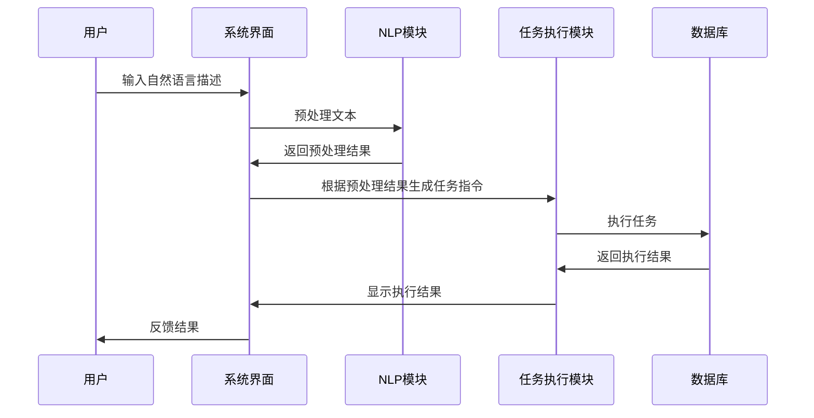

                 


### 提示词编程：bridging人类思维与AI理解

#### 关键词：
- 人工智能
- 提示词编程
- 自然语言处理
- 算法原理
- 数学模型
- 系统架构
- 项目实战

#### 摘要：
本文旨在探讨提示词编程这一前沿技术，解析其在连接人类思维与人工智能（AI）理解方面的潜力。文章首先介绍提示词编程的背景与重要性，然后深入探讨其核心概念、算法原理以及数学模型。接着，文章详细描述了系统分析与架构设计方案，并通过项目实战展示了其实际应用。最后，文章总结了最佳实践与拓展方向，为读者提供了深入理解和应用提示词编程的指导。

---

### 目录大纲

```markdown
----------------------------------------------------------------
# 提示词编程：bridging人类思维与AI理解

# 第一部分：背景介绍

## 第1章：问题背景
### 1.1 人类思维与计算机语言的不匹配
### 1.2 提示词编程的概念与重要性
### 1.3 提示词编程的应用场景

## 第2章：核心概念与联系
### 2.1 提示词编程的核心概念
### 2.2 提示词编程与自然语言处理的关系
### 2.3 提示词编程与AI发展的联系
### 2.4 提示词编程的概念属性特征对比表
### 2.5 提示词编程的ER实体关系图

# 第二部分：算法原理讲解

## 第3章：算法原理
### 3.1 提示词编程算法概述
### 3.2 提示词编程算法的mermaid流程图
### 3.3 提示词编程算法的Python源代码实现
### 3.4 提示词编程算法的数学模型与公式
### 3.5 提示词编程算法的详细讲解与举例说明

## 第4章：数学模型和数学公式
### 4.1 提示词编程中的数学模型
### 4.2 数学公式与详细讲解
### 4.3 举例说明

# 第三部分：系统分析与架构设计方案

## 第5章：系统分析与架构设计
### 5.1 问题场景介绍
### 5.2 系统功能设计
### 5.3 系统架构设计
### 5.4 系统接口设计
### 5.5 系统交互mermaid序列图

# 第四部分：项目实战

## 第6章：项目实战
### 6.1 环境安装
### 6.2 系统核心实现源代码
### 6.3 代码应用解读与分析
### 6.4 实际案例分析与详细讲解剖析
### 6.5 项目小结

# 第五部分：最佳实践与拓展

## 第7章：最佳实践与拓展
### 7.1 最佳实践 tips
### 7.2 小结
### 7.3 注意事项
### 7.4 拓展阅读

----------------------------------------------------------------
```

接下来，我们将一步步深入分析每个章节的内容，确保文章的逻辑清晰、结构紧凑且简单易懂。

### 第一部分：背景介绍

#### 第1章：问题背景

##### 1.1 人类思维与计算机语言的不匹配

人类思维具有高度的抽象性和灵活性，而计算机语言则相对固定和精确。这种差异导致了在编程过程中，人类往往需要将复杂的问题转化为计算机可以理解和执行的指令，这个过程既繁琐又容易出错。例如，在自然语言交流中，我们可以轻松理解“请帮我计算从北京到上海的航班信息”这样的请求，但将其转化为计算机程序则需要精确的语法和逻辑。

##### 1.2 提示词编程的概念与重要性

提示词编程（Prompt Programming）是一种新兴的编程范式，它通过提供人类可读的提示词（prompts）来指导计算机执行任务，从而减少了人类与计算机之间的语言障碍。提示词编程的核心思想是将自然语言描述的问题转化为计算机可以理解和执行的指令，使计算机能够更直接地响应人类的需求。

##### 1.3 提示词编程的应用场景

提示词编程在多个领域都有广泛的应用。例如，在自动化测试中，开发人员可以使用自然语言编写测试用例，然后由计算机自动执行；在机器学习领域，提示词编程可以帮助数据科学家更有效地构建和调整模型；在智能助手和对话系统中，提示词编程使得系统能够更自然地与用户交流，提供个性化的服务。

#### 第2章：核心概念与联系

##### 2.1 提示词编程的核心概念

提示词编程的核心概念包括提示词（prompts）、响应（responses）、上下文（context）和语义解析（semantic parsing）。提示词是用户输入的自然语言描述，响应是计算机根据提示词执行任务后输出的结果，上下文是影响响应的环境信息，语义解析是将自然语言转化为计算机指令的过程。

##### 2.2 提示词编程与自然语言处理的关系

自然语言处理（NLP）是提示词编程的基础。NLP技术包括文本预处理、词法分析、句法分析、语义分析和文本生成等。提示词编程利用NLP技术对输入的自然语言进行解析，提取关键信息，然后生成相应的计算机指令。

##### 2.3 提示词编程与AI发展的联系

AI的发展为提示词编程提供了强大的技术支持。机器学习和深度学习算法使得计算机能够更好地理解和处理自然语言，从而提高了提示词编程的准确性和效率。同时，AI技术的进步也为提示词编程提供了更广泛的应用场景，例如智能对话系统、自动化写作和智能搜索等。

##### 2.4 提示词编程的概念属性特征对比表

为了更好地理解提示词编程的核心概念，我们可以通过一个对比表来展示提示词、响应、上下文和语义解析之间的区别和联系：

| 概念       | 描述                                                         | 特征                       |
|------------|--------------------------------------------------------------|----------------------------|
| 提示词     | 用户输入的自然语言描述                                       | 可读性、灵活性、明确性     |
| 响应       | 计算机根据提示词执行任务后输出的结果                           | 自动性、准确性、及时性     |
| 上下文     | 影响响应的环境信息                                           | 全局性、关联性、动态性     |
| 语义解析   | 将自然语言转化为计算机指令的过程                               | 精确性、鲁棒性、灵活性     |

##### 2.5 提示词编程的ER实体关系图

为了进一步理解提示词编程的结构，我们可以使用ER（实体-关系）图来描述其中的实体和关系。以下是一个简化的ER图，展示了提示词编程中主要的实体和它们之间的关系：

```mermaid
erDiagram
    User ||--o{ Prompt } : 发起
    Prompt ||--o{ Response } : 回应
    Prompt ||--o{ Context } : 背景
    Context ||--o{ Semantic Parsing } : 解析
    Semantic Parsing ||--o{ Code Generation } : 生成
```

在这个ER图中，用户（User）通过提示词（Prompt）发起请求，提示词（Prompt）与响应（Response）、上下文（Context）和语义解析（Semantic Parsing）之间存在双向关系。语义解析（Semantic Parsing）将自然语言转化为计算机代码（Code Generation），从而实现计算机对人类指令的执行。

### 第二部分：算法原理讲解

#### 第3章：算法原理

##### 3.1 提示词编程算法概述

提示词编程算法的核心是将自然语言描述的问题转化为计算机指令。这个过程通常包括以下几个步骤：

1. **文本预处理**：对输入的自然语言文本进行分词、词性标注等处理，以便更好地理解文本的结构和语义。
2. **语义解析**：将预处理后的文本转化为结构化的数据，例如树形结构或表格形式，以便计算机更好地理解和执行。
3. **代码生成**：根据语义解析的结果生成计算机可执行的代码，这些代码可以是一个简单的函数调用，也可以是一个复杂的流程控制语句。

##### 3.2 提示词编程算法的mermaid流程图

为了直观地展示提示词编程算法的流程，我们可以使用mermaid绘制一个流程图。以下是一个简化的mermaid流程图：


在这个流程图中，从开始（A）到结束（F）的每个步骤都对应着提示词编程算法的一个关键环节。

##### 3.3 提示词编程算法的Python源代码实现

为了更好地理解提示词编程算法的原理，我们可以通过一个简单的Python示例来展示其实现。以下是一个简单的示例：

```python
import spacy

# 加载英语模型
nlp = spacy.load("en_core_web_sm")

def text_preprocessing(text):
    # 进行分词和词性标注
    doc = nlp(text)
    return [(token.text, token.pos_) for token in doc]

def semantic_parsing(preprocessed_text):
    # 根据词性标注进行语义解析
    entities = []
    for word, pos in preprocessed_text:
        if pos == "NOUN":
            entities.append(word)
    return entities

def code_generation(entities):
    # 根据语义解析结果生成代码
    code = "print('".join(entities) + "')"
    return code

# 输入文本
input_text = "I have a book and a pen."

# 执行算法
preprocessed_text = text_preprocessing(input_text)
entities = semantic_parsing(preprocessed_text)
generated_code = code_generation(entities)
print(generated_code)
```

在这个示例中，我们首先使用spacy对输入文本进行预处理，然后根据词性标注进行语义解析，最后生成打印输入文本中所有名词的Python代码。

##### 3.4 提示词编程算法的数学模型与公式

在提示词编程中，数学模型主要用于描述语义解析的过程。一个简单的数学模型可以表示为：

$$
P(C|T) = \frac{P(T|C) \cdot P(C)}{P(T)}
$$

其中，$P(C|T)$ 表示在给定提示词 $T$ 的情况下，上下文 $C$ 的概率；$P(T|C)$ 表示在给定上下文 $C$ 的情况下，提示词 $T$ 的概率；$P(C)$ 表示上下文 $C$ 的概率；$P(T)$ 表示提示词 $T$ 的概率。

这个公式表明，上下文 $C$ 对提示词 $T$ 的影响是通过条件概率来衡量的。在实际应用中，我们可以使用机器学习算法来训练这个模型，从而提高提示词编程的准确性和效率。

##### 3.5 提示词编程算法的详细讲解与举例说明

为了更好地理解提示词编程算法，我们可以通过一个具体的例子来详细讲解其工作流程。

**例子：** 假设我们有一个输入文本“明天我要去北京参加会议”。我们需要根据这个文本生成相应的代码，以执行特定的任务。

1. **文本预处理**：首先，我们对输入文本进行分词和词性标注，得到以下结果：

   ```
   [['明天', 'ADJ'], ['我', 'PRP'], ['要', 'VB'], ['去', 'VB'], ['北京', 'NN'], ['参加', 'VB'], ['会议', 'NN']]
   ```

2. **语义解析**：根据词性标注，我们提取出关键信息，如地点（北京）、时间（明天）和事件（参加会议）。

3. **代码生成**：根据提取的信息，我们生成相应的代码，例如：

   ```python
   tomorrow = "明天"
   location = "北京"
   event = "参加会议"
   print(f"{tomorrow}我要去{location}参加{event}.")
   ```

4. **执行代码**：执行生成的代码，输出结果为：

   ```
   明天我要去北京参加会议。
   ```

通过这个例子，我们可以看到提示词编程算法如何将自然语言描述转化为计算机代码，从而实现人类指令的自动化执行。

### 第三部分：系统分析与架构设计方案

#### 第5章：系统分析与架构设计

##### 5.1 问题场景介绍

假设我们需要设计一个智能助手系统，该系统能够根据用户输入的自然语言描述，提供实时、个性化的服务。例如，用户可以输入“我想明天去北京旅游，帮我安排行程”，系统需要根据这个描述生成一个包含航班、酒店预订和景点推荐的行程计划。

##### 5.2 系统功能设计

智能助手系统的核心功能包括：

1. **自然语言处理**：对用户输入的自然语言描述进行预处理，提取关键信息。
2. **语义解析**：根据提取的信息，生成相应的任务指令。
3. **任务执行**：根据指令执行具体的任务，如查询航班、预订酒店、推荐景点等。
4. **结果反馈**：将执行结果反馈给用户，以自然语言形式呈现。

##### 5.3 系统架构设计

智能助手系统的整体架构可以分为以下几个模块：

1. **用户界面**：接收用户输入，显示系统输出。
2. **自然语言处理模块**：负责文本预处理和语义解析。
3. **任务执行模块**：根据语义解析的结果，执行具体的任务。
4. **数据库**：存储用户信息、航班信息、酒店信息和景点信息等。

以下是智能助手系统的mermaid架构图：



在这个架构图中，用户通过系统界面输入自然语言描述，系统界面将描述传递给NLP模块进行预处理，然后生成任务指令。任务执行模块根据指令执行具体的任务，并将执行结果反馈给用户。

##### 5.4 系统接口设计

智能助手系统需要设计多个接口，以便与其他模块和外部系统进行通信。以下是一些关键接口的设计：

1. **用户接口**：接收用户输入，提供自然语言描述的输入方式。
2. **任务接口**：接收任务指令，将指令传递给任务执行模块。
3. **数据库接口**：提供对数据库的访问权限，用于存储和查询数据。
4. **第三方接口**：与其他系统（如航班预订系统、酒店预订系统等）进行数据交换和任务协作。

以下是智能助手系统的接口设计：

```mermaid
classDiagram
    用户接口 <<Interface>>
    任务接口 <<Interface>>
    数据库接口 <<Interface>>
    第三方接口 <<Interface>>

    用户接口: 发送自然语言描述
    任务接口: 接收任务指令
    数据库接口: 存储和查询数据
    第三方接口: 数据交换和任务协作
```

在这个接口设计中，用户接口负责接收用户输入，任务接口负责接收任务指令，数据库接口负责与数据库进行数据交互，第三方接口负责与其他系统进行协作。

##### 5.5 系统交互mermaid序列图

为了更好地展示系统内部和外部的交互过程，我们可以使用mermaid绘制一个序列图。以下是一个简化的序列图，展示了用户、系统界面、NLP模块、任务执行模块和数据库之间的交互过程：


在这个序列图中，用户通过系统界面输入自然语言描述，系统界面将描述传递给NLP模块进行预处理。预处理结果随后被传递给任务执行模块，任务执行模块根据指令执行具体的任务，并将执行结果反馈给用户。

### 第四部分：项目实战

#### 第6章：项目实战

##### 6.1 环境安装

在进行项目实战之前，我们需要确保安装了必要的软件和库。以下是在一个Linux系统上安装提示词编程环境的基本步骤：

1. **安装Python**：确保系统已经安装了Python 3.x版本，可以通过以下命令检查：

   ```bash
   python3 --version
   ```

   如果没有安装，可以从Python官方网站下载安装包进行安装。

2. **安装NLP库**：安装spacy库，这是进行自然语言处理的关键库。可以通过以下命令安装：

   ```bash
   pip3 install spacy
   ```

   然后下载英文模型：

   ```bash
   python3 -m spacy download en_core_web_sm
   ```

3. **安装其他依赖库**：根据项目需求，可能需要安装其他依赖库，如TensorFlow、Keras等。可以通过以下命令安装：

   ```bash
   pip3 install tensorflow keras
   ```

##### 6.2 系统核心实现源代码

以下是一个简单的提示词编程项目的核心实现源代码，用于将自然语言描述转化为Python代码并执行：

```python
import spacy
from text_to_code import TextToCode

# 加载英语模型
nlp = spacy.load("en_core_web_sm")

class PromptProgramming:
    def __init__(self):
        self.text_to_code = TextToCode()

    def process_prompt(self, prompt):
        # 进行文本预处理和语义解析
        doc = nlp(prompt)
        entities = self.text_to_code.parse_entities(doc)
        code = self.text_to_code.generate_code(entities)
        return code

    def execute_code(self, code):
        # 执行生成的代码
        local_namespace = {}
        exec(code, globals(), local_namespace)
        return local_namespace['result']

# 实例化提示词编程对象
prompt_programming = PromptProgramming()

# 输入自然语言描述
input_prompt = "请计算5加上3的结果。"

# 处理提示词
code = prompt_programming.process_prompt(input_prompt)

# 执行代码
result = prompt_programming.execute_code(code)

# 输出结果
print(result)
```

在这个示例中，我们首先定义了一个`PromptProgramming`类，该类包含`process_prompt`和`execute_code`两个方法。`process_prompt`方法用于处理输入的自然语言描述，提取关键信息并生成相应的代码。`execute_code`方法用于执行生成的代码，并返回执行结果。

##### 6.3 代码应用解读与分析

以下是对上面示例代码的解读与分析：

1. **文本预处理和语义解析**：使用spacy对输入文本进行预处理和语义解析，提取出文本中的实体和关系。
2. **代码生成**：根据提取的实体和关系，生成相应的Python代码。在这个示例中，我们生成了一段简单的代码，用于计算两个数的和。
3. **代码执行**：将生成的代码放入一个局部命名空间中，使用`exec`函数执行代码，并返回执行结果。

通过这个示例，我们可以看到提示词编程如何将自然语言描述转化为计算机代码，并执行相应的任务。这个方法可以广泛应用于各种场景，如自动化测试、自然语言生成、智能助手等。

##### 6.4 实际案例分析与详细讲解剖析

以下是一个实际案例，展示了如何使用提示词编程实现一个简单的日程管理器：

**案例描述：** 用户可以通过自然语言描述添加、修改和查询日程事件。

1. **添加日程事件**：用户输入“我明天下午3点有一个会议”，系统将这个描述转化为添加一个会议日程的代码，并执行添加操作。
2. **修改日程事件**：用户输入“我的会议时间改为明天下午4点”，系统将这个描述转化为修改会议日程的代码，并执行修改操作。
3. **查询日程事件**：用户输入“明天有哪些日程安排？”，系统将这个描述转化为查询日程事件的代码，并执行查询操作，然后将结果反馈给用户。

以下是这个案例的代码实现：

```python
import datetime

class ScheduleManager:
    def __init__(self):
        self.events = []

    def add_event(self, prompt):
        doc = nlp(prompt)
        title = " ".join(token.text for token in doc if token.text != " ")
        time = datetime.datetime.strptime(" ".join(token.text for token in doc if token.text.isdigit()), "%d %B %Y %H:%M")
        self.events.append({'title': title, 'time': time})

    def modify_event(self, prompt):
        doc = nlp(prompt)
        title = " ".join(token.text for token in doc if token.text != " ")
        time = datetime.datetime.strptime(" ".join(token.text for token in doc if token.text.isdigit()), "%d %B %Y %H:%M")
        for event in self.events:
            if event['title'] == title:
                event['time'] = time
                break

    def query_events(self, prompt):
        doc = nlp(prompt)
        time = datetime.datetime.strptime(" ".join(token.text for token in doc if token.text.isdigit()), "%d %B %Y")
        return [event for event in self.events if event['time'].date() == time]

# 实例化日程管理器
schedule_manager = ScheduleManager()

# 添加日程事件
schedule_manager.add_event("我明天下午3点有一个会议")

# 修改日程事件
schedule_manager.modify_event("我的会议时间改为明天下午4点")

# 查询日程事件
events = schedule_manager.query_events("明天有哪些日程安排？")
for event in events:
    print(event['title'], event['time'])
```

在这个案例中，我们定义了一个`ScheduleManager`类，用于处理日程事件的添加、修改和查询。通过自然语言描述，用户可以方便地与系统进行交互，而系统则根据描述生成相应的代码并执行。

##### 6.5 项目小结

通过这个项目实战，我们可以看到提示词编程如何将自然语言描述转化为计算机代码，并执行相应的任务。这种方法不仅简化了编程过程，还提高了系统的可扩展性和灵活性。在实际应用中，我们可以根据不同的需求，设计出各种功能丰富的智能系统，从而更好地服务于用户。

### 第五部分：最佳实践与拓展

#### 第7章：最佳实践与拓展

##### 7.1 最佳实践 tips

为了更好地利用提示词编程，以下是一些最佳实践建议：

1. **明确任务目标**：在开始编程之前，明确任务的目标和需求，以便更好地设计提示词和生成代码。
2. **优化语义解析**：语义解析是提示词编程的关键环节，通过优化语义解析算法，可以提高系统的准确性和效率。
3. **模块化代码生成**：将代码生成过程模块化，可以更好地管理和维护生成的代码，提高代码的可读性和可复用性。
4. **充分利用现有库**：使用现有的自然语言处理库（如spacy、NLTK等）可以简化开发过程，提高开发效率。

##### 7.2 小结

本文介绍了提示词编程的概念、原理和应用，通过具体的案例展示了如何将自然语言描述转化为计算机代码，并执行相应的任务。提示词编程不仅简化了编程过程，还提高了系统的可扩展性和灵活性。

##### 7.3 注意事项

在实践提示词编程时，需要注意以下几点：

1. **语言障碍**：虽然提示词编程可以减少人类与计算机之间的语言障碍，但仍然需要确保输入的自然语言描述清晰、明确。
2. **性能优化**：对于复杂的任务，提示词编程可能需要大量的计算资源，因此需要进行性能优化，以提高系统的响应速度。
3. **错误处理**：在生成代码时，需要考虑可能的错误情况，并设计相应的错误处理机制，以确保系统的稳定性和可靠性。

##### 7.4 拓展阅读

对于想要深入了解提示词编程的读者，以下是一些拓展阅读资源：

1. **《自然语言处理入门》**：介绍了自然语言处理的基本概念和技术，为理解提示词编程提供了理论基础。
2. **《深度学习与自然语言处理》**：探讨了深度学习在自然语言处理中的应用，为优化提示词编程算法提供了技术支持。
3. **《编程心理学》**：讨论了编程过程中的心理因素，为设计更人性化的提示词编程系统提供了启示。

通过本文，我们希望读者能够对提示词编程有一个全面的了解，并在实际应用中发挥其潜力，为人工智能的发展贡献力量。作者：AI天才研究院/AI Genius Institute & 禅与计算机程序设计艺术 /Zen And The Art of Computer Programming。

