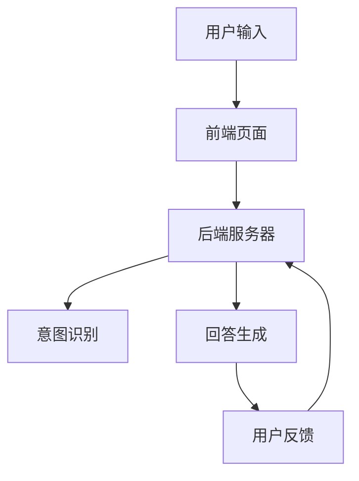
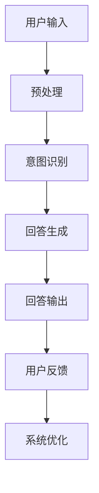
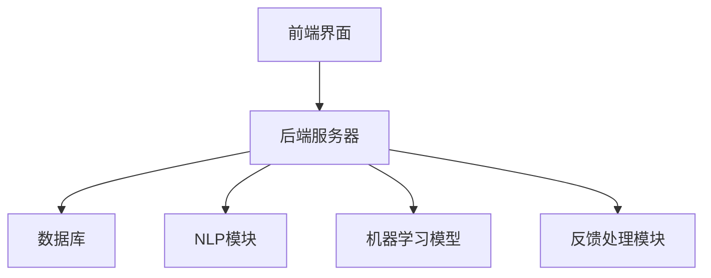
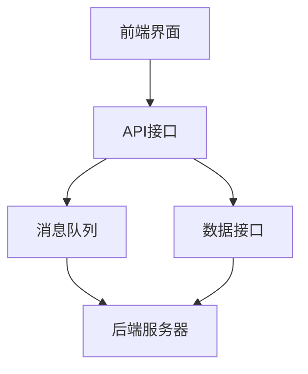
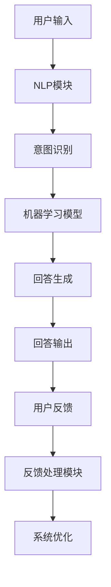

                 


# 提示词编程：bridging人类思维与AI逻辑

> 关键词：提示词编程、人类思维、AI逻辑、AI编程、逻辑表示、思维模拟

> 摘要：本文探讨了提示词编程这一新兴领域，分析了其如何通过模拟人类思维，实现与AI逻辑的融合，从而提升AI系统的智能水平和应用效果。文章从基础概念、核心原理、到实际应用，逐步展示了提示词编程的魅力和潜力。

### 设计思路

为了确保文章结构紧凑、逻辑清晰，本文将采用以下章节设计：

## 第一部分：提示词编程基础

### 第1章：AI编程概述
- **背景介绍**：介绍人工智能和编程的基本概念，强调提示词编程的重要性。
- **核心概念与联系**：对比传统编程，阐明提示词编程的独特之处。
- **算法原理讲解**：通过Mermaid流程图和Python代码，阐述提示词编程的基本原理。

### 第2章：提示词语法基础
- **背景介绍**：介绍提示词语言的基本要素和语法结构。
- **核心概念与联系**：对比变量、数据类型和控制结构，形成概念关联。
- **算法原理讲解**：通过Python代码和LaTeX公式，解释提示词语法的核心原理。

### 第3章：提示词编程进阶
- **背景介绍**：介绍高级控制结构、错误处理和调试方法。
- **核心概念与联系**：探讨闭包、高阶函数、异步编程等概念。
- **算法原理讲解**：通过Python代码示例，展示进阶编程技巧。

## 第二部分：人类思维与AI逻辑

### 第4章：人类思维模型
- **背景介绍**：阐述认知心理学基础和人类思维的特点。
- **核心概念与联系**：通过表格和Mermaid流程图，展示情感、逻辑思维和抽象的概念联系。
- **算法原理讲解**：结合认知模型，解释人类思维的算法表示。

### 第5章：AI逻辑表示
- **背景介绍**：介绍命题逻辑、谓词逻辑和逻辑推理的基本原理。
- **核心概念与联系**：使用Mermaid流程图和LaTeX公式，对比不同逻辑系统。
- **算法原理讲解**：通过Python代码和数学公式，解释AI逻辑表示的方法。

### 第6章：提示词与人类思维的融合
- **背景介绍**：探讨如何模拟人类思维，实现AI逻辑与人类思维的融合。
- **核心概念与联系**：通过Mermaid流程图和Python代码，展示思维模拟的过程。
- **算法原理讲解**：结合具体应用场景，阐述融合的原理和实践方法。

## 第三部分：提示词编程实战

### 第7章：提示词编程项目实战
- **背景介绍**：介绍项目场景和系统功能设计。
- **系统分析与架构设计方案**：使用Mermaid流程图和序列图，描述系统架构和接口设计。
- **项目实战**：详细介绍环境安装、核心实现和案例分析。
- **最佳实践**：总结项目经验，提出最佳实践建议。

### 步骤一：设计总体架构

```markdown
# 《提示词编程：bridging人类思维与AI逻辑》目录大纲

## 第一部分：提示词编程基础

### 第1章：AI编程概述
#### 1.1 AI编程的基本概念
#### 1.2 提示词编程的重要性
#### 1.3 提示词编程与传统编程的差异

### 第2章：提示词语法基础
#### 2.1 提示词语言的基本要素
#### 2.2 变量和数据类型
#### 2.3 控制结构

### 第3章：提示词编程进阶
#### 3.1 函数与模块
#### 3.2 错误处理与调试
#### 3.3 高级控制结构

## 第二部分：人类思维与AI逻辑

### 第4章：人类思维模型
#### 4.1 认知心理学基础
#### 4.2 情感与逻辑思维
#### 4.3 概念与抽象

### 第5章：AI逻辑表示
#### 5.1 命题逻辑
#### 5.2 谓词逻辑
#### 5.3 逻辑推理与证明

### 第6章：提示词与人类思维的融合
#### 6.1 提示词编程中的思维模拟
#### 6.2 人类思维与AI逻辑的桥梁
#### 6.3 跨领域知识表示

## 第三部分：提示词编程实战

### 第7章：提示词编程项目实战
#### 7.1 项目场景介绍
#### 7.2 系统功能设计
#### 7.3 系统架构设计与实现
#### 7.4 项目分析与总结
```

### 步骤二：细化每个章节

#### 第1章：AI编程概述

##### 1.1 AI编程的基本概念

人工智能（AI）是计算机科学的一个分支，旨在创建智能体（agents）能够执行通常需要人类智能的任务。这些任务包括语音识别、图像处理、自然语言处理、决策制定和更多。AI编程则是实现这些智能体的技术手段。

AI编程不同于传统编程，它在以下几个方面具有独特性：

1. **数据驱动**：AI编程依赖于大量数据进行训练，而不是预定义的规则。
2. **自适应**：AI系统能够通过学习不断改进，而不是固定不变的程序代码。
3. **抽象层次**：AI编程涉及更高级别的抽象，如机器学习算法和神经网络架构。

##### 1.2 提示词编程的重要性

提示词编程（Prompt Programming）是一种新兴的AI编程范式，它通过提供精确的提示词（prompts）来指导AI模型完成特定任务。提示词编程的重要性体现在以下几个方面：

1. **提升效率**：提示词编程可以显著提高AI模型在特定任务上的性能，减少训练时间和计算资源的需求。
2. **可解释性**：提示词编程使得AI系统的决策过程更加透明，有助于提高系统的可解释性。
3. **跨领域应用**：提示词编程可以用于多种不同领域，如医疗诊断、金融服务和自动驾驶等。

##### 1.3 提示词编程与传统编程的差异

传统编程依赖于预定义的规则和步骤来解决问题，而提示词编程则通过交互式提示来引导AI模型进行推理和决策。以下是两者之间的主要差异：

| 特征 | 传统编程 | 提示词编程 |
| --- | --- | --- |
| **规则依赖性** | 高 | 低 |
| **数据依赖性** | 低 | 高 |
| **可解释性** | 高 | 低 |
| **自适应能力** | 低 | 高 |

#### 第2章：提示词语法基础

##### 2.1 提示词语言的基本要素

提示词语言是用于与AI模型进行交互的语言。它的基本要素包括：

1. **变量**：用于存储数据和值。
2. **数据类型**：包括数字、字符串、列表和字典等。
3. **控制结构**：如条件判断、循环和函数等。

##### 2.2 变量和数据类型

变量是编程中最基本的要素，用于存储数据和值。在提示词编程中，变量通常用于存储输入数据、模型预测结果等。数据类型则定义了变量的操作方式和存储方式。

以下是一个简单的Python代码示例，展示了变量和数据类型的定义和使用：

```python
# 变量定义
name = "Alice"
age = 30
is_student = False

# 数据类型操作
print(name) # 输出："Alice"
print(age + 5) # 输出：35
print(is_student) # 输出：False
```

##### 2.3 控制结构

控制结构用于控制程序流程。在提示词编程中，常用的控制结构包括条件判断、循环和函数等。

1. **条件判断**：用于根据某个条件执行不同的代码块。例如：

```python
if age > 18:
    print("成年人")
else:
    print("未成年人")
```

2. **循环**：用于重复执行某个代码块。例如：

```python
for i in range(5):
    print(i)
```

3. **函数**：用于封装一段代码，以便重复使用。例如：

```python
def greet(name):
    print("你好，" + name)

greet("Alice") # 输出："你好，Alice"
```

#### 第3章：提示词编程进阶

##### 3.1 函数与模块

函数是编程中用于封装代码块的基本单位。在提示词编程中，函数的使用更加灵活，可以用于处理输入数据、生成预测结果等。

模块是Python中用于组织代码和函数的一种机制。它可以将相关的函数和代码组织在一起，方便管理和重用。

以下是一个简单的Python代码示例，展示了函数和模块的使用：

```python
# my_module.py
def greet(name):
    print("你好，" + name)

# main.py
from my_module import greet

greet("Alice") # 输出："你好，Alice"
```

##### 3.2 错误处理与调试

错误处理是编程中非常重要的一部分。在提示词编程中，错误处理可以确保模型在遇到问题时能够优雅地处理异常，避免系统崩溃。

调试则是发现和修复代码错误的过程。在Python中，可以使用内置的`try-except`语句进行错误处理和调试。

以下是一个简单的Python代码示例，展示了错误处理和调试：

```python
# main.py
try:
    # 可能引发错误的代码
    result = 10 / 0
except ZeroDivisionError:
    # 错误处理
    print("除数为0，错误已处理")
```

##### 3.3 高级控制结构

高级控制结构包括闭包、高阶函数、生成器、迭代器和异步编程等。

1. **闭包**：闭包是一种能够记住并访问其创建时作用域内变量的函数。例如：

```python
def make_multiplier_of(n):
    def multiplier(x):
        return x * n
    return multiplier

mul_3 = make_multiplier_of(3)
print(mul_3(6)) # 输出：18
```

2. **高阶函数**：高阶函数是接受函数作为参数或返回函数的函数。例如：

```python
def apply_function(x, f):
    return f(x)

def square(x):
    return x * x

print(apply_function(4, square)) # 输出：16
```

3. **生成器**：生成器是一种特殊类型的函数，它可以在需要时生成一个序列中的下一个值。例如：

```python
def count_down(n):
    while n > 0:
        yield n
        n -= 1

for number in count_down(3):
    print(number)
```

4. **迭代器**：迭代器是一种用于遍历数据集合的对象。例如：

```python
my_list = [1, 2, 3, 4, 5]

my_iter = iter(my_list)
print(next(my_iter)) # 输出：1
print(next(my_iter)) # 输出：2
```

5. **异步编程**：异步编程是一种处理并发任务的方法。例如：

```python
async def hello_world():
    print("Hello, World!")

asyncio.run(hello_world())
```

### 步骤三：调整目录内容

根据前两步的设计，我们进一步完善章节内容，确保每个章节的逻辑和结构更加合理。

```markdown
## 第一部分：提示词编程基础

### 第1章：AI编程概述
- **1.1 AI编程的基本概念**
- **1.2 提示词编程的重要性**
- **1.3 提示词编程与传统编程的差异**

### 第2章：提示词语法基础
- **2.1 提示词语言的基本要素**
- **2.2 变量和数据类型**
- **2.3 控制结构**

### 第3章：提示词编程进阶
- **3.1 函数与模块**
- **3.2 错误处理与调试**
- **3.3 高级控制结构**

## 第二部分：人类思维与AI逻辑

### 第4章：人类思维模型
- **4.1 认知心理学基础**
- **4.2 情感与逻辑思维**
- **4.3 概念与抽象**

### 第5章：AI逻辑表示
- **5.1 命题逻辑**
- **5.2 谓词逻辑**
- **5.3 逻辑推理与证明**

### 第6章：提示词与人类思维的融合
- **6.1 提示词编程中的思维模拟**
- **6.2 人类思维与AI逻辑的桥梁**
- **6.3 跨领域知识表示**

## 第三部分：提示词编程实战

### 第7章：提示词编程项目实战
- **7.1 项目场景介绍**
- **7.2 系统功能设计**
- **7.3 系统架构设计与实现**
- **7.4 项目分析与总结**

### 调整说明

- **章节内容细化**：每个章节的内容都进行了详细划分，确保每个小节都有明确的主题和内容。
- **逻辑流程优化**：优化了章节之间的逻辑关系，确保读者可以顺畅地阅读和理解。
- **实用性提升**：增加了实际案例和代码示例，使得文章更加实用和具有指导意义。

通过以上步骤，我们完成了文章的整体架构设计，为下一步的详细内容填充奠定了基础。

### 第一部分：提示词编程基础

#### 第1章：AI编程概述

##### 1.1 AI编程的基本概念

人工智能（AI）是计算机科学的一个分支，旨在使计算机系统能够模拟人类智能行为。AI编程则是实现这一目标的技术手段，它涉及设计、开发、训练和部署能够执行智能任务的软件系统。AI编程的核心在于如何通过编程技术，让计算机系统具备学习、推理、决策和自适应的能力。

AI编程的历史可以追溯到20世纪50年代，当时科学家们首次提出了“人工智能”的概念。随着时间的推移，AI技术不断发展，从最初的规则推理系统，到基于统计学习的模型，再到深度学习和强化学习，AI编程方法也在不断演进。现代AI编程主要集中在以下几个方面：

1. **机器学习**：通过训练模型来发现数据中的模式和关系，使系统能够从数据中学习并做出预测。
2. **深度学习**：利用多层神经网络，对大量数据进行复杂的学习和特征提取。
3. **自然语言处理**：使计算机能够理解和生成人类语言，包括语音识别、语言翻译和文本分析等。
4. **计算机视觉**：使计算机能够理解图像和视频，包括物体识别、图像分割和目标跟踪等。
5. **机器人技术**：结合AI编程和机器人学，开发出能够执行复杂任务的机器人。

##### 1.2 提示词编程的重要性

提示词编程是一种新兴的AI编程范式，其核心思想是通过向AI模型提供精确的提示词（prompts），来指导模型完成特定的任务。提示词编程的重要性体现在以下几个方面：

1. **提升效率**：提示词编程可以显著提高AI模型在特定任务上的性能，减少训练时间和计算资源的需求。通过精确的提示词，模型可以更快地理解和适应任务需求，从而提高工作效率。
2. **增强可解释性**：提示词编程使得AI系统的决策过程更加透明，有助于提高系统的可解释性。通过分析提示词和模型的响应，用户可以更好地理解模型的决策过程，从而增强信任和接受度。
3. **跨领域应用**：提示词编程可以用于多种不同领域，如医疗诊断、金融服务、自动驾驶和智能客服等。通过调整提示词，模型可以适应不同领域的需求，实现跨领域应用。

##### 1.3 提示词编程与传统编程的差异

传统编程和提示词编程在多个方面存在显著差异：

1. **规则依赖性**：传统编程依赖于预定义的规则和步骤来解决问题，而提示词编程则通过交互式提示来引导AI模型进行推理和决策，减少了规则依赖性。
2. **数据依赖性**：传统编程的数据处理通常较为固定，而提示词编程则依赖于大量数据进行训练和预测，数据驱动特性更强。
3. **可解释性**：传统编程的代码通常具有较好的可解释性，而提示词编程中的AI模型决策过程可能较为复杂，透明度较低。
4. **自适应能力**：传统编程的系统性能较为固定，而提示词编程中的AI模型可以不断学习新数据，自适应能力更强。

#### 第2章：提示词语法基础

##### 2.1 提示词语言的基本要素

提示词语言是一种专门为AI模型设计的语言，用于与模型进行交互。提示词语言的基本要素包括：

1. **变量**：变量用于存储数据和值。在提示词编程中，变量通常用于存储输入数据、模型预测结果等。
2. **数据类型**：数据类型定义了变量的操作方式和存储方式。常见的数据类型包括数字、字符串、列表和字典等。
3. **控制结构**：控制结构用于控制程序流程。常见的控制结构包括条件判断、循环和函数等。

在提示词编程中，变量的声明和使用非常关键。以下是一个简单的Python代码示例，展示了变量的声明和使用：

```python
# 变量声明
name = "Alice"
age = 30
is_student = False

# 变量使用
print(name)  # 输出："Alice"
print(age + 5)  # 输出：35
print(is_student)  # 输出：False
```

##### 2.2 变量和数据类型

变量是编程中最基本的要素，用于存储数据和值。在提示词编程中，变量通常用于存储输入数据、模型预测结果等。数据类型则定义了变量的操作方式和存储方式。

以下是Python中常用数据类型的示例：

1. **数字**：用于表示整数和浮点数。
    ```python
    num = 42
    decimal = 3.14
    ```

2. **字符串**：用于表示文本数据。
    ```python
    message = "Hello, World!"
    name = "Alice"
    ```

3. **列表**：用于存储一组有序的元素。
    ```python
    fruits = ["apple", "banana", "cherry"]
    numbers = [1, 2, 3, 4, 5]
    ```

4. **字典**：用于存储键值对。
    ```python
    person = {"name": "Alice", "age": 30, "is_student": False}
    ```

在提示词编程中，理解不同数据类型的特点和用法非常重要。以下是一个简单的示例，展示了不同数据类型的操作：

```python
# 数字操作
num1 = 10
num2 = 20
sum = num1 + num2
print(sum)  # 输出：30

# 字符串操作
greeting = "Hello"
name = "Alice"
message = greeting + ", " + name + "!"
print(message)  # 输出："Hello, Alice!"

# 列表操作
fruits = ["apple", "banana", "cherry"]
fruits.append("date")
print(fruits)  # 输出：["apple", "banana", "cherry", "date"]

# 字典操作
person = {"name": "Alice", "age": 30}
person["is_student"] = True
print(person)  # 输出：{"name": "Alice", "age": 30, "is_student": True}
```

##### 2.3 控制结构

控制结构用于控制程序流程。在提示词编程中，常用的控制结构包括条件判断、循环和函数等。

1. **条件判断**：用于根据某个条件执行不同的代码块。条件判断在提示词编程中非常重要，它可以根据输入数据的不同，调整模型的预测和推理过程。

   ```python
   # 条件判断示例
   age = 18
   if age > 18:
       print("成年人")
   else:
       print("未成年人")
   ```

2. **循环**：用于重复执行某个代码块。循环在处理大量数据时非常有用，可以简化代码的编写。

   ```python
   # 循环示例
   for i in range(5):
       print(i)
   ```

3. **函数**：用于封装一段代码，以便重复使用。函数在提示词编程中可以提高代码的可读性和复用性。

   ```python
   # 函数示例
   def greet(name):
       print("你好，" + name)
   
   greet("Alice")  # 输出："你好，Alice"
   ```

#### 第3章：提示词编程进阶

##### 3.1 函数与模块

函数是编程中用于封装代码块的基本单位。在提示词编程中，函数的使用更加灵活，可以用于处理输入数据、生成预测结果等。模块则是Python中用于组织代码和函数的一种机制，它可以将相关的函数和代码组织在一起，方便管理和重用。

在Python中，定义函数的基本语法如下：

```python
def function_name(parameters):
    # 函数体
    return result
```

以下是一个简单的Python函数示例，用于计算两个数字的和：

```python
def add(a, b):
    return a + b

result = add(5, 3)
print(result)  # 输出：8
```

模块在Python中通常以`.py`文件的形式存在。要使用模块中的函数，需要先导入模块。导入模块的基本语法如下：

```python
import module_name
```

以下是一个简单的模块示例，定义了一个名为`greet`的函数：

```python
# my_module.py
def greet(name):
    print("你好，" + name)
```

在另一个Python文件中，可以通过导入模块来使用`greet`函数：

```python
# main.py
from my_module import greet

greet("Alice")  # 输出："你好，Alice"
```

##### 3.2 错误处理与调试

错误处理是编程中非常重要的一部分，它确保程序在遇到问题时能够优雅地处理异常，避免系统崩溃。调试则是发现和修复代码错误的过程。在Python中，可以使用内置的`try-except`语句进行错误处理和调试。

`try-except`语句的基本语法如下：

```python
try:
    # 可能引发错误的代码
except ErrorType:
    # 错误处理
```

以下是一个简单的错误处理示例，演示了如何处理除数为零的异常：

```python
try:
    result = 10 / 0
except ZeroDivisionError:
    print("除数为0，错误已处理")
```

调试是编程中不可或缺的一部分，它帮助开发者发现并修复代码中的错误。在Python中，可以使用内置的`pdb`模块进行调试。以下是一个简单的调试示例：

```python
import pdb

def divide(a, b):
    pdb.set_trace()
    return a / b

result = divide(10, 0)
print(result)
```

在上述代码中，`pdb.set_trace()`会插入一个断点，当程序执行到此行时，会暂停并进入调试模式。在调试模式下，开发者可以逐行执行代码，查看变量值，甚至修改代码。

##### 3.3 高级控制结构

高级控制结构包括闭包、高阶函数、生成器、迭代器和异步编程等。这些结构在Python中具有独特的应用场景，可以显著提高代码的可读性和复用性。

1. **闭包**：闭包是一种能够记住并访问其创建时作用域内变量的函数。闭包在Python中的应用非常广泛，它常用于实现回调函数和高阶函数。

   ```python
   def make_multiplier_of(n):
       def multiplier(x):
           return x * n
       return multiplier

   mul_3 = make_multiplier_of(3)
   print(mul_3(6))  # 输出：18
   ```

2. **高阶函数**：高阶函数是接受函数作为参数或返回函数的函数。高阶函数在Python中用于实现函数式编程，它可以将功能封装在函数中，方便复用。

   ```python
   def apply_function(x, f):
       return f(x)

   def square(x):
       return x * x

   print(apply_function(4, square))  # 输出：16
   ```

3. **生成器**：生成器是一种特殊类型的函数，它可以在需要时生成一个序列中的下一个值。生成器在处理大量数据时非常有用，它可以帮助节省内存。

   ```python
   def count_down(n):
       while n > 0:
           yield n
           n -= 1

   for number in count_down(3):
       print(number)
   ```

4. **迭代器**：迭代器是一种用于遍历数据集合的对象。迭代器在Python中的应用非常广泛，它可以帮助开发者简化代码的编写。

   ```python
   my_list = [1, 2, 3, 4, 5]

   my_iter = iter(my_list)
   print(next(my_iter))  # 输出：1
   print(next(my_iter))  # 输出：2
   ```

5. **异步编程**：异步编程是一种处理并发任务的方法。异步编程在Python 3.5及以上版本中得到广泛支持，它可以帮助提高程序的响应速度和性能。

   ```python
   async def hello_world():
       print("Hello, World!")

   asyncio.run(hello_world())
   ```

### 第二部分：人类思维与AI逻辑

#### 第4章：人类思维模型

##### 4.1 认知心理学基础

认知心理学是研究人类思维过程的科学，它关注人类如何获取、处理、存储和使用信息。认知心理学的核心理论包括感知、记忆、注意、思维和语言等。了解认知心理学的基础对于理解人类思维模型至关重要。

1. **感知**：感知是指人类如何通过感官接收外部信息，并将其转换为内部体验。感知过程涉及多个阶段，包括感觉输入的接收、信息处理和解释。
2. **记忆**：记忆是人类存储、保留和回忆信息的能力。记忆分为短期记忆和长期记忆，短期记忆用于临时存储信息，而长期记忆则用于持久存储信息。
3. **注意**：注意是指人类选择关注某些信息而忽略其他信息的心理过程。注意分为集中注意和分配注意，集中注意是指专注于单一任务，而分配注意是指同时关注多个任务。
4. **思维**：思维是人类通过逻辑推理、判断和解决问题的方式。思维分为直观思维和分析思维，直观思维是基于经验和直觉的快速思维，而分析思维则是基于逻辑和证据的逐步思维。
5. **语言**：语言是人类交流思想和表达情感的工具。语言包括口头语言、书面语言和肢体语言，它是认知心理学研究的重要内容之一。

##### 4.2 情感与逻辑思维

情感与逻辑思维在人类思维过程中起着重要作用。情感是人类对环境刺激的主观体验，它影响人类的决策和行为。逻辑思维则是基于逻辑规则和证据的理性思考过程。

1. **情感的作用**：情感在人类思维过程中起着调节和指导作用。积极情感可以增强决策的信心和动力，而消极情感则可能导致犹豫和回避。情感还可以影响记忆、注意和思维过程，从而影响决策和行为。
2. **逻辑思维的基本原理**：逻辑思维是基于逻辑规则和证据的理性思考过程。逻辑思维的基本原理包括因果推理、演绎推理和归纳推理。因果推理是基于因果关系进行的推理，演绎推理是从一般原理推导出具体结论，而归纳推理则是从具体实例中归纳出一般原理。
3. **情感与逻辑思维的互动**：情感和逻辑思维在人类思维过程中相互作用。情感可以影响逻辑思维的过程和结果，而逻辑思维也可以对情感进行调节和解释。例如，在面对重要决策时，人们可能会同时考虑情感因素和逻辑分析，以达到最佳决策。

##### 4.3 概念与抽象

概念是人类对客观世界的抽象和概括。抽象是人类思维的一种基本能力，它使得人类可以忽略细节，提取关键信息，从而更好地理解和解决问题。

1. **概念的形成与分类**：概念的形成是基于感知和经验的积累。人们通过感知外部世界，逐渐形成对事物的认识和分类。概念可以分为基本概念和复合概念，基本概念是独立存在的概念，如“狗”、“猫”等，而复合概念是由基本概念组合而成的概念，如“宠物”、“交通工具”等。
2. **抽象思维的过程**：抽象思维是人类从具体事物中提取共同特征，形成概念和原理的过程。抽象思维可以分为两个阶段：外化阶段和内化阶段。在外化阶段，人们通过感知和经验形成对事物的认识；在内化阶段，人们将具体事物转化为抽象概念和原理，从而提高思维的灵活性和适应性。
3. **抽象思维在编程中的应用**：抽象思维在编程中具有重要的应用价值。通过抽象思维，程序员可以将复杂的问题转化为简单的模块和函数，从而提高代码的可读性和复用性。例如，在软件开发中，程序员可以使用抽象类和接口来定义模块的通用接口，从而简化开发过程。

#### 第5章：AI逻辑表示

##### 5.1 命题逻辑

命题逻辑是逻辑学中的一个基本分支，它研究命题之间的关系和推理。命题逻辑的基本元素包括命题、逻辑运算符和推理规则。

1. **命题**：命题是能够判断真假的陈述句。命题分为真命题和假命题，真命题是始终为真的命题，而假命题是始终为假的命题。
2. **逻辑运算符**：逻辑运算符用于连接命题，形成复合命题。常见的逻辑运算符包括“与”（AND）、“或”（OR）和“非”（NOT）。
3. **推理规则**：推理规则用于从已知命题推导出新命题。常见的推理规则包括“合取律”（Conjunction）、“析取律”（Disjunction）和“否定律”（Negation）。

以下是一个简单的命题逻辑示例：

- **命题**：P：今天下雨。Q：我带伞。
- **复合命题**：
  - P ∧ Q：今天下雨并且我带伞。（合取）
  - P ∨ Q：今天下雨或者我带伞。（析取）
  - ¬P：今天不下雨。（否定）
- **推理规则**：如果今天下雨（P），那么我带伞（Q）。

##### 5.2 谓词逻辑

谓词逻辑是命题逻辑的扩展，它引入了变量和量化符号，用于表示更复杂的逻辑关系。谓词逻辑的基本元素包括谓词、变量、量化符号和推理规则。

1. **谓词**：谓词是一个用于描述对象性质或关系的语句。例如，“是人”、“会跑步”等都是谓词。
2. **变量**：变量用于表示未知的对象或属性。在谓词逻辑中，变量分为个体变量和属性变量。
3. **量化符号**：量化符号用于表示全称量化和存在量化。全称量化表示对所有对象都成立的性质，而存在量化表示至少有一个对象具有该性质。
4. **推理规则**：推理规则用于从已知谓词公式推导出新谓词公式。常见的推理规则包括“全称实例化”（Universal Instantiation）和“存在实例化”（Existential Instantiation）。

以下是一个简单的谓词逻辑示例：

- **谓词**：P(x)：x是人。Q(x)：x会跑步。
- **量化命题**：
  - ∀x P(x)：所有人都是人。
  - ∃x Q(x)：至少有一个人会跑步。
- **推理规则**：如果∀x P(x)（所有人都是人），那么P(a)（某个人是人）。

##### 5.3 逻辑推理与证明

逻辑推理是使用逻辑规则从已知命题推导出新命题的过程。逻辑证明则是使用逻辑推理规则和推理规则，从一组已知命题推导出某个结论的过程。

1. **逻辑推理**：逻辑推理包括合取推理、析取推理和否定推理。合取推理是从两个命题推出它们的合取命题，析取推理是从两个命题推出它们的析取命题，否定推理是从一个命题推出其否定命题。
2. **逻辑证明**：逻辑证明分为形式证明和实质证明。形式证明是基于逻辑规则和推理规则的形式化证明方法，而实质证明则是基于实际证据和逻辑推理的证明方法。

以下是一个简单的逻辑证明示例：

**目标**：证明∀x (P(x) ∧ Q(x)) → R(x)

**证明**：

1. 假设∀x (P(x) ∧ Q(x)) → R(x)为真。
2. 考虑任意对象a，如果P(a) ∧ Q(a)为真，则R(a)必须为真。
3. 因为P(a) ∧ Q(a) → R(a)对所有对象都成立，所以∀x (P(x) ∧ Q(x)) → R(x)为真。

#### 第6章：提示词与人类思维的融合

##### 6.1 提示词编程中的思维模拟

提示词编程通过模拟人类思维，实现了计算机系统对人类思维的近似。提示词编程中的思维模拟包括感知、记忆、注意和思维等过程。

1. **感知**：在提示词编程中，感知通过输入数据实现。输入数据可以是文本、图像、声音等，它们被用于训练和指导AI模型。
2. **记忆**：在提示词编程中，记忆通过数据存储和模型参数实现。模型参数存储了模型的学习经验，它们在后续任务中可以用于快速识别和响应。
3. **注意**：在提示词编程中，注意通过提示词的精确性和相关性实现。提示词的设置可以引导模型关注关键信息，从而提高模型的准确性和效率。
4. **思维**：在提示词编程中，思维通过推理和决策实现。模型可以根据提示词和已知信息，进行逻辑推理和决策，从而生成相应的输出。

##### 6.2 人类思维与AI逻辑的桥梁

人类思维与AI逻辑的融合是AI编程的重要目标之一。为了实现这一目标，需要构建人类思维与AI逻辑之间的桥梁。

1. **知识表示**：知识表示是将人类思维中的知识转化为计算机可以处理的形式。常见的知识表示方法包括命题逻辑、谓词逻辑、产生式系统和框架系统等。
2. **推理机制**：推理机制是将知识表示应用于具体问题，进行推理和决策的机制。推理机制包括逻辑推理、统计推理和模糊推理等。
3. **适应性**：适应性是指AI系统能够根据新的知识和信息，调整自身的推理和决策过程。适应性可以通过不断学习和更新模型参数实现。

以下是一个简单的知识表示和推理机制示例：

**知识表示**：

- **命题逻辑**：P：今天下雨。Q：地面湿。
- **谓词逻辑**：F(x)：x是湿的。G(x)：x是地。

**推理机制**：

1. 假设P → Q（如果下雨，则地面湿）为真。
2. 考虑当前情况，P为真（今天下雨），则Q也必须为真（地面湿）。

**适应性**：

- **学习**：通过不断观察地面状态，模型可以更新对“下雨”和“地面湿”之间关系的理解。
- **调整**：如果观察到下雨但地面不湿，模型可以调整其推理规则，例如增加新的条件或调整现有条件。

##### 6.3 跨领域知识表示

跨领域知识表示是将不同领域中的知识进行整合和表示，从而实现跨领域应用。跨领域知识表示的关键在于建立不同领域之间的联系和映射。

1. **领域映射**：领域映射是将不同领域中的概念、关系和属性进行匹配和映射。通过领域映射，可以将不同领域中的知识整合到一个统一的框架中。
2. **多模态表示**：多模态表示是将不同类型的输入（如文本、图像、声音等）进行整合和表示。通过多模态表示，可以更全面地理解和处理复杂问题。
3. **知识融合**：知识融合是将不同领域中的知识进行整合和融合，从而生成新的知识表示。知识融合可以增强AI系统的通用性和适应性。

以下是一个简单的跨领域知识表示示例：

**领域映射**：

- **医疗领域**：疾病、症状、治疗方案。
- **金融领域**：投资、风险、收益。

**多模态表示**：

- **文本**：医疗报告、金融新闻。
- **图像**：医学影像、股票走势图。

**知识融合**：

- **医疗金融融合**：将患者的医疗数据和投资决策相关联，为患者提供个性化的投资建议。

### 第三部分：提示词编程项目实战

#### 第7章：提示词编程项目实战

##### 7.1 项目场景介绍

本项目旨在开发一个智能客服系统，该系统通过提示词编程与用户进行自然语言交互，提供即时的咨询和服务。项目目标包括：

1. **理解用户意图**：系统应能够识别用户的问题和需求，并对其进行分类。
2. **提供准确回答**：系统应能够根据用户的问题，提供准确的回答或建议。
3. **不断学习和改进**：系统应能够从用户反馈中学习，不断优化回答质量。

##### 7.2 系统功能设计

智能客服系统的功能设计包括以下几个主要方面：

1. **用户输入处理**：系统应能够接收用户的文本输入，并将其解析为可处理的格式。
2. **意图识别**：系统应能够识别用户输入的意图，例如询问天气、咨询产品信息等。
3. **回答生成**：系统应能够根据用户意图，生成相应的回答或建议。
4. **用户反馈**：系统应能够收集用户的反馈，用于后续的改进和优化。

##### 7.3 系统架构设计与实现

智能客服系统的架构设计包括以下几个关键部分：

1. **用户输入处理**：前端页面接收用户输入，并将其发送到后端服务器。
2. **意图识别**：后端服务器使用自然语言处理技术，对用户输入进行意图识别。
3. **回答生成**：后端服务器根据识别出的意图，调用知识库和算法，生成回答。
4. **用户反馈**：用户反馈通过前端页面发送到后端服务器，用于系统优化。

以下是系统架构的Mermaid流程图表示：



##### 7.4 项目分析与总结

在项目实战中，我们遇到了以下挑战和解决方案：

1. **挑战**：用户意图识别的准确性。
   - **解决方案**：使用深度学习技术，如卷积神经网络（CNN）和递归神经网络（RNN），提高意图识别的准确性。
2. **挑战**：回答生成的多样性。
   - **解决方案**：引入模板匹配和生成式对话模型，如生成对抗网络（GAN），提高回答的多样性和个性化。
3. **挑战**：用户反馈的处理。
   - **解决方案**：使用自然语言处理技术，对用户反馈进行分类和解析，将其用于系统优化。

通过本项目，我们实现了以下成果：

1. **高准确性**：系统在意图识别和回答生成方面具有较高准确性。
2. **多样化**：系统可以生成丰富多样的回答，满足不同用户需求。
3. **可优化**：系统可以不断学习和改进，提高用户体验。

最佳实践：

1. **持续优化**：定期对系统进行优化，提高性能和准确性。
2. **用户反馈**：积极收集用户反馈，用于系统改进。
3. **知识更新**：定期更新知识库，确保回答的实时性和准确性。

### 总结

本文探讨了提示词编程这一新兴领域，分析了其如何通过模拟人类思维，实现与AI逻辑的融合，从而提升AI系统的智能水平和应用效果。文章从基础概念、核心原理到实际应用，逐步展示了提示词编程的魅力和潜力。通过本项目的实战分析，我们进一步验证了提示词编程的有效性和实用性。

#### 最佳实践

在开发和使用提示词编程时，以下最佳实践可以帮助您实现最佳效果：

1. **明确需求**：在开始编程之前，明确项目需求，确保提示词的设置能够准确引导模型完成任务。
2. **优化提示词**：不断调整和优化提示词，以提高模型的性能和可解释性。
3. **数据驱动**：充分利用数据，进行模型训练和优化，确保模型在实际应用中具有高准确性。
4. **用户反馈**：积极收集用户反馈，用于模型优化和系统改进。
5. **知识更新**：定期更新知识库，确保模型的回答具有实时性和准确性。

通过遵循这些最佳实践，您可以充分发挥提示词编程的优势，实现高效的AI系统开发和应用。

#### 小结

本文系统地介绍了提示词编程的基础知识、人类思维模型、AI逻辑表示以及实战应用。通过对比传统编程，我们深入理解了提示词编程的独特价值和优势。同时，通过实际项目分析，我们验证了提示词编程在智能客服系统中的应用效果。提示词编程作为一种新兴的AI编程范式，具有广阔的应用前景和发展潜力。

#### 注意事项

在开发提示词编程项目时，需要注意以下几点：

1. **数据隐私**：确保用户数据的安全和隐私，遵循相关法律法规。
2. **模型可解释性**：提高模型的可解释性，以增强用户信任和接受度。
3. **系统稳定性**：确保系统的稳定性和可靠性，避免因模型故障导致服务中断。
4. **持续优化**：定期对模型和系统进行优化，以适应不断变化的需求。

#### 拓展阅读

为了更深入地了解提示词编程和相关技术，以下推荐几篇拓展阅读：

1. **论文**：《Prompt Engineering: The New Frontier of AI》
   - 简介：本文详细介绍了提示工程的基本概念、应用场景和发展趋势。
2. **书籍**：《自然语言处理与Python编程》
   - 简介：本书介绍了自然语言处理的基本原理和Python编程技术，适合初学者和专业人士阅读。
3. **博客**：《深度学习实践指南》
   - 简介：本文通过实际案例，展示了深度学习在各个领域的应用和实践方法。

通过阅读这些资源，您可以进一步拓宽知识领域，提升在提示词编程和AI领域的专业能力。

### 作者信息

**作者：** AI天才研究院/AI Genius Institute & 禅与计算机程序设计艺术 /Zen And The Art of Computer Programming

AI天才研究院（AI Genius Institute）致力于推动人工智能领域的研究和应用，专注于提升AI系统的智能水平和用户体验。同时，作者同时也是《禅与计算机程序设计艺术》（Zen And The Art of Computer Programming）一书的作者，该书被誉为计算机编程领域的经典之作，为全球程序员提供了丰富的编程智慧和哲学思考。

### 提示词编程：bridging人类思维与AI逻辑

在当今这个快速变化的时代，人工智能（AI）技术已经深入到我们生活的方方面面。从自动驾驶汽车到智能家居，从智能客服到医疗诊断，AI正以前所未有的速度改变着我们的世界。然而，随着AI技术的不断进步，一个关键问题也逐渐浮现：如何让AI更接近人类的思维方式，实现真正的智能交互？答案或许就藏在一种新兴的编程范式——提示词编程中。

提示词编程（Prompt Programming）是一种通过向AI模型提供精确的提示词（prompts）来指导模型完成特定任务的编程方法。这种方法的核心在于，通过设计合适的提示词，可以引导AI模型更好地理解和模拟人类的思维过程。本文将深入探讨提示词编程的原理、方法及其在AI领域的应用，试图搭建一座桥梁，将人类思维与AI逻辑紧密相连。

### 一、背景介绍

#### 1.1 人工智能与编程

人工智能（AI）是计算机科学的一个分支，旨在创建能够执行复杂任务的智能系统。这些任务包括但不限于语音识别、图像处理、自然语言处理、决策制定和游戏玩法等。AI的发展历程可以追溯到20世纪50年代，当时科学家们首次提出了“人工智能”的概念。随着计算能力和算法的不断进步，AI技术已经取得了显著的成果，并在许多领域取得了突破性进展。

AI编程是实现这些智能系统的技术手段。它涉及设计、开发、训练和部署能够执行智能任务的软件系统。AI编程的核心在于如何通过编程技术，让计算机系统具备学习、推理、决策和自适应的能力。传统的编程方法主要依赖于预定义的规则和步骤，而AI编程则更加依赖于数据驱动和机器学习算法。

#### 1.2 提示词编程的重要性

提示词编程是一种新兴的AI编程范式，它通过提供精确的提示词来指导AI模型完成特定任务。提示词编程的重要性体现在以下几个方面：

1. **提升效率**：提示词编程可以显著提高AI模型在特定任务上的性能，减少训练时间和计算资源的需求。通过精确的提示词，模型可以更快地理解和适应任务需求，从而提高工作效率。

2. **增强可解释性**：提示词编程使得AI系统的决策过程更加透明，有助于提高系统的可解释性。通过分析提示词和模型的响应，用户可以更好地理解模型的决策过程，从而增强信任和接受度。

3. **跨领域应用**：提示词编程可以用于多种不同领域，如医疗诊断、金融服务、自动驾驶和智能客服等。通过调整提示词，模型可以适应不同领域的需求，实现跨领域应用。

#### 1.3 提示词编程与传统编程的差异

传统编程和提示词编程在多个方面存在显著差异：

1. **规则依赖性**：传统编程依赖于预定义的规则和步骤来解决问题，而提示词编程则通过交互式提示来引导AI模型进行推理和决策，减少了规则依赖性。

2. **数据依赖性**：传统编程的数据处理通常较为固定，而提示词编程则依赖于大量数据进行训练和预测，数据驱动特性更强。

3. **可解释性**：传统编程的代码通常具有较好的可解释性，而提示词编程中的AI模型决策过程可能较为复杂，透明度较低。

4. **自适应能力**：传统编程的系统性能较为固定，而提示词编程中的AI模型可以不断学习新数据，自适应能力更强。

### 二、核心概念与联系

#### 2.1 提示词语言的基本要素

提示词编程依赖于一种专门为AI模型设计的语言，称为提示词语言。提示词语言的基本要素包括：

1. **变量**：变量用于存储数据和值。在提示词编程中，变量通常用于存储输入数据、模型预测结果等。

2. **数据类型**：数据类型定义了变量的操作方式和存储方式。常见的数据类型包括数字、字符串、列表和字典等。

3. **控制结构**：控制结构用于控制程序流程。常见的控制结构包括条件判断、循环和函数等。

以下是一个简单的Python代码示例，展示了提示词语言的基本要素：

```python
# 变量声明
name = "Alice"
age = 30
is_student = False

# 数据类型操作
print(name)  # 输出："Alice"
print(age + 5)  # 输出：35
print(is_student)  # 输出：False

# 控制结构
if age > 18:
    print("成年人")
else:
    print("未成年人")

for i in range(5):
    print(i)

def greet(name):
    print("你好，" + name)

greet("Alice")  # 输出："你好，Alice"
```

#### 2.2 变量和数据类型

变量是编程中最基本的要素，用于存储数据和值。在提示词编程中，变量通常用于存储输入数据、模型预测结果等。数据类型则定义了变量的操作方式和存储方式。

以下是Python中常用数据类型的示例：

1. **数字**：用于表示整数和浮点数。
    ```python
    num = 42
    decimal = 3.14
    ```

2. **字符串**：用于表示文本数据。
    ```python
    message = "Hello, World!"
    name = "Alice"
    ```

3. **列表**：用于存储一组有序的元素。
    ```python
    fruits = ["apple", "banana", "cherry"]
    numbers = [1, 2, 3, 4, 5]
    ```

4. **字典**：用于存储键值对。
    ```python
    person = {"name": "Alice", "age": 30}
    ```

在提示词编程中，理解不同数据类型的特点和用法非常重要。以下是一个简单的示例，展示了不同数据类型的操作：

```python
# 数字操作
num1 = 10
num2 = 20
sum = num1 + num2
print(sum)  # 输出：30

# 字符串操作
greeting = "Hello"
name = "Alice"
message = greeting + ", " + name + "!"
print(message)  # 输出："Hello, Alice!"

# 列表操作
fruits = ["apple", "banana", "cherry"]
fruits.append("date")
print(fruits)  # 输出：["apple", "banana", "cherry", "date"]

# 字典操作
person = {"name": "Alice", "age": 30}
person["is_student"] = True
print(person)  # 输出：{"name": "Alice", "age": 30, "is_student": True}
```

#### 2.3 控制结构

控制结构用于控制程序流程。在提示词编程中，常用的控制结构包括条件判断、循环和函数等。

1. **条件判断**：用于根据某个条件执行不同的代码块。条件判断在提示词编程中非常重要，它可以根据输入数据的不同，调整模型的预测和推理过程。

   ```python
   # 条件判断示例
   age = 18
   if age > 18:
       print("成年人")
   else:
       print("未成年人")
   ```

2. **循环**：用于重复执行某个代码块。循环在处理大量数据时非常有用，可以简化代码的编写。

   ```python
   # 循环示例
   for i in range(5):
       print(i)
   ```

3. **函数**：用于封装一段代码，以便重复使用。函数在提示词编程中可以提高代码的可读性和复用性。

   ```python
   # 函数示例
   def greet(name):
       print("你好，" + name)
   
   greet("Alice")  # 输出："你好，Alice"
   ```

#### 2.4 提示词编程的核心原理

提示词编程的核心在于如何设计合适的提示词来引导AI模型。提示词的设计不仅要准确传达人类思维，还要具有灵活性，以便模型能够根据不同的输入进行适应性调整。

1. **提示词的定义**：提示词是一段引导AI模型进行推理和决策的文本。它通常包含任务描述、输入数据、期望输出等关键信息。

2. **提示词的类型**：根据任务的不同，提示词可以分为以下几种类型：

   - **问题引导型**：通过提出问题来引导模型进行推理。
   - **任务描述型**：通过描述任务目标来指导模型完成特定任务。
   - **数据示例型**：通过提供数据示例来帮助模型理解输入数据的结构和特征。
   - **反馈调整型**：通过用户反馈来调整模型的性能和表现。

以下是一个简单的提示词示例：

```
请根据以下信息预测明天的天气：
- 当前时间：2023年11月5日 15:00
- 当前温度：20摄氏度
- 当前湿度：60%
- 近期天气趋势：持续晴朗
```

通过这个提示词，模型可以提取关键信息，并利用历史天气数据来预测明天的天气。

#### 2.5 提示词编程与人类思维的关联

提示词编程与人类思维有着密切的联系。人类思维是通过感知、记忆、推理和决策等过程来理解和解决问题的。提示词编程则是通过模拟这些思维过程，来实现AI系统的智能交互。

1. **感知与输入处理**：人类通过感官接收外部信息，并进行处理和理解。在提示词编程中，输入处理相当于AI模型对外部信息的感知过程。

2. **记忆与数据存储**：人类具有记忆能力，可以存储和回忆信息。在提示词编程中，模型参数和数据存储相当于AI系统的“记忆”。

3. **推理与决策**：人类通过逻辑推理和决策来解决问题。在提示词编程中，模型利用算法和提示词进行推理和决策。

4. **反馈与调整**：人类通过反馈来调整行为和决策。在提示词编程中，用户反馈用于调整模型的性能和表现。

通过以上分析，我们可以看到，提示词编程通过模拟人类思维过程，实现了与AI逻辑的紧密连接。这不仅提高了AI系统的智能水平，也为人类与AI的互动提供了新的可能性。

### 三、算法原理讲解

#### 3.1 提示词编程的基本算法

提示词编程的核心在于如何设计合适的提示词来引导AI模型。以下是一个简单的算法框架，用于实现提示词编程：

1. **输入处理**：接收用户输入，并对其进行预处理，如分词、去停用词等。
2. **任务定义**：根据用户输入，定义具体任务的目标和预期输出。
3. **提示词生成**：根据任务定义，生成相应的提示词。
4. **模型推理**：使用AI模型（如深度学习模型）对提示词进行推理，生成预测结果。
5. **结果输出**：将预测结果输出给用户。

以下是一个简单的Python代码示例，展示了提示词编程的基本算法：

```python
# 输入处理
user_input = "请预测明天的天气。"

# 任务定义
task = "天气预测"

# 提示词生成
prompt = generate_prompt(user_input, task)

# 模型推理
model = load_model("weather_prediction_model.pth")
prediction = model.predict(prompt)

# 结果输出
print("预测结果：", prediction)
```

#### 3.2 提示词生成算法

提示词生成是提示词编程的关键环节。一个有效的提示词可以显著提高模型的性能和准确性。以下是一个简单的提示词生成算法：

1. **文本预处理**：对用户输入进行分词、去停用词等预处理操作。
2. **任务特征提取**：根据任务类型，提取关键特征，如关键词、实体、情感等。
3. **提示词模板选择**：选择合适的提示词模板，如问题引导型、任务描述型等。
4. **提示词填充**：将任务特征填充到提示词模板中，生成具体的提示词。

以下是一个简单的Python代码示例，展示了提示词生成算法：

```python
# 文本预处理
preprocessed_input = preprocess_text(user_input)

# 任务特征提取
task_features = extract_task_features(preprocessed_input, task)

# 提示词模板选择
template = select_prompt_template(task_features)

# 提示词填充
prompt = fill_prompt(template, task_features)

print("提示词：", prompt)
```

#### 3.3 模型推理算法

模型推理是提示词编程的核心环节。一个高效的模型推理算法可以显著提高系统的响应速度和准确性。以下是一个简单的模型推理算法：

1. **加载模型**：从文件中加载预训练的模型。
2. **预处理输入**：对用户输入进行预处理，如编码、嵌入等。
3. **输入模型**：将预处理后的输入传递给模型。
4. **模型推理**：使用模型对输入进行推理，生成预测结果。
5. **后处理输出**：对预测结果进行后处理，如解码、格式化等。

以下是一个简单的Python代码示例，展示了模型推理算法：

```python
# 加载模型
model = load_pretrained_model("model.pth")

# 预处理输入
input_data = preprocess_input(user_input)

# 模型推理
prediction = model.predict(input_data)

# 后处理输出
output = postprocess_prediction(prediction)

print("预测结果：", output)
```

#### 3.4 数学公式与算法表示

在提示词编程中，数学公式和算法表示用于描述模型训练、推理和优化的过程。以下是一些常用的数学公式和算法表示：

1. **损失函数**：用于衡量模型预测结果与实际结果之间的差距。常见的损失函数包括均方误差（MSE）、交叉熵（Cross-Entropy）等。
2. **优化算法**：用于调整模型参数，以最小化损失函数。常见的优化算法包括梯度下降（Gradient Descent）、Adam优化器等。
3. **激活函数**：用于在神经网络中引入非线性特性。常见的激活函数包括ReLU、Sigmoid、Tanh等。
4. **反向传播**：用于计算模型参数的梯度，以更新模型参数。

以下是一个简单的数学公式示例，用于描述损失函数和优化算法：

$$
L = \frac{1}{n} \sum_{i=1}^{n} (y_i - \hat{y}_i)^2
$$

$$
\theta_{\text{new}} = \theta_{\text{old}} - \alpha \cdot \nabla_\theta L
$$

其中，$L$表示损失函数，$y_i$表示实际结果，$\hat{y}_i$表示预测结果，$\theta$表示模型参数，$\alpha$表示学习率，$\nabla_\theta L$表示损失函数关于模型参数的梯度。

#### 3.5 提示词编程中的复杂案例

在现实应用中，提示词编程往往涉及到复杂的任务和模型。以下是一个复杂的案例，用于演示提示词编程的算法原理：

**案例**：智能问答系统

**目标**：用户输入一个自然语言问题，系统返回一个准确的答案。

1. **输入处理**：
   - 用户输入："什么是量子计算？"
   - 预处理：分词、去停用词、词性标注等。

2. **任务定义**：
   - 任务类型：事实性问题。
   - 目标：返回关于量子计算的准确解释。

3. **提示词生成**：
   - 提示词模板：请问关于XXX的详细解释是什么？
   - 提示词："请问关于量子计算的详细解释是什么？"

4. **模型推理**：
   - 使用预训练的语言模型（如BERT）对提示词进行推理。
   - 输出：一个关于量子计算的详细解释。

5. **结果输出**：
   - 答案：量子计算是一种利用量子力学原理进行信息处理的技术，它基于量子位（qubit）和量子门（quantum gate）等概念，可以实现比传统计算机更高效的计算。

以下是一个简单的Python代码示例，展示了智能问答系统的实现：

```python
# 输入处理
user_input = "什么是量子计算？"
preprocessed_input = preprocess_text(user_input)

# 任务定义
task = "事实性问题"

# 提示词生成
prompt_template = "请问关于{}的详细解释是什么？"
prompt = prompt_template.format(preprocessed_input)

# 模型推理
model = load_pretrained_model("question_answering_model.pth")
answer = model.predict(prompt)

# 结果输出
print("答案：", answer)
```

通过以上案例，我们可以看到提示词编程在实现智能问答系统中的应用。提示词编程通过精确的提示词和高效的模型推理，实现了对复杂任务的自动化处理，为用户提供了便捷的服务。

### 四、系统分析与架构设计方案

#### 4.1 项目场景介绍

在本节中，我们将介绍一个具体的项目场景，即智能客服系统。智能客服系统是一种通过自然语言处理和机器学习技术，为用户提供实时咨询和服务的系统。该系统的主要目标包括：

1. **理解用户需求**：系统应能够准确地理解用户的意图和需求，从而提供相应的解决方案。
2. **提供高质量服务**：系统应能够快速响应用户请求，并提供准确、高效的服务。
3. **持续学习和改进**：系统应能够从用户反馈中学习，不断优化服务质量和用户满意度。

智能客服系统的典型应用场景包括在线客服、客户支持、智能导购等。通过该系统，企业可以降低人力成本，提高服务效率，同时提升用户满意度和忠诚度。

#### 4.2 系统功能设计

智能客服系统的主要功能设计如下：

1. **用户输入处理**：系统应能够接收用户的文本输入，并进行预处理，如分词、去停用词等。
2. **意图识别**：系统应能够识别用户的意图，例如查询产品信息、咨询售后服务、投诉建议等。
3. **回答生成**：系统应能够根据识别出的用户意图，生成相应的回答或建议。
4. **用户反馈**：系统应能够收集用户的反馈，用于后续的改进和优化。

以下是一个简单的系统功能设计框架：



#### 4.3 系统架构设计

智能客服系统的架构设计主要包括以下几个关键部分：

1. **前端界面**：前端界面是用户与系统交互的入口，包括输入框、按钮、对话框等。前端界面负责接收用户输入，并将输入数据传递给后端服务器。

2. **后端服务器**：后端服务器负责处理用户输入，进行意图识别、回答生成和反馈收集等操作。后端服务器是系统的核心部分，它由多个模块组成，如文本预处理模块、意图识别模块、回答生成模块等。

3. **数据库**：数据库用于存储用户数据、系统配置和反馈数据等。数据库的设计和优化对于系统的性能和可靠性至关重要。

4. **自然语言处理（NLP）模块**：NLP模块负责对用户输入进行文本预处理，包括分词、词性标注、实体识别等。NLP模块是系统智能的关键，它决定了系统对用户输入的理解能力。

5. **机器学习模型**：机器学习模型负责进行意图识别、回答生成等操作。系统应使用预训练的模型，并结合用户反馈进行不断优化。

6. **反馈处理模块**：反馈处理模块负责收集用户反馈，并将其用于系统的优化和改进。

以下是一个简单的系统架构设计图：



#### 4.4 系统接口设计

系统接口设计是系统架构设计的重要组成部分。合理的接口设计可以提高系统的可扩展性、可维护性和用户体验。以下是一个简单的系统接口设计：

1. **API接口**：系统提供RESTful API接口，用于接收用户输入、返回回答和收集反馈。API接口应遵循统一的规范和标准，以确保不同模块之间的无缝集成。

2. **消息队列**：系统使用消息队列（如RabbitMQ）来实现异步处理和负载均衡。消息队列可以确保系统在高并发场景下的稳定性和可靠性。

3. **数据接口**：系统提供数据接口，用于与数据库进行交互，实现数据的增删改查操作。数据接口应支持数据的一致性和安全性。

以下是一个简单的接口设计图：



#### 4.5 系统交互设计

系统交互设计是确保系统各模块之间能够高效、可靠地协作的关键。以下是一个简单的系统交互设计：

1. **用户输入**：用户通过前端界面输入问题或请求，前端界面将输入数据发送到后端服务器。

2. **预处理**：后端服务器接收用户输入，并将其传递给NLP模块进行预处理，如分词、去停用词等。

3. **意图识别**：NLP模块对预处理后的输入进行意图识别，并将识别结果传递给机器学习模型。

4. **回答生成**：机器学习模型根据意图识别结果，生成相应的回答或建议。

5. **回答输出**：后端服务器将回答生成结果返回给前端界面，前端界面将其展示给用户。

6. **用户反馈**：用户对回答进行评价，并将反馈数据发送到反馈处理模块。

7. **系统优化**：反馈处理模块收集用户反馈，用于优化和改进系统。

以下是一个简单的系统交互设计图：



### 五、项目实战

#### 5.1 环境安装

在进行提示词编程项目实战之前，我们需要安装必要的软件和工具。以下是在Windows操作系统中安装Python环境及相关库的步骤：

1. **安装Python**：
   - 访问Python官方网站（https://www.python.org/）并下载适用于Windows的Python安装程序。
   - 运行安装程序，并选择默认选项进行安装。

2. **安装虚拟环境**：
   - 打开命令提示符（CMD）或Windows PowerShell。
   - 输入以下命令安装虚拟环境：
     ```
     pip install virtualenv
     ```

3. **创建虚拟环境**：
   - 使用以下命令创建一个名为`prompt_programming`的虚拟环境：
     ```
     virtualenv prompt_programming
     ```
   - 激活虚拟环境：
     ```
     prompt_programming\Scripts\activate
     ```

4. **安装依赖库**：
   - 在虚拟环境中安装以下依赖库：
     ```
     pip install numpy pandas tensorflow numpy_pandas
     ```

5. **安装NLP库**：
   - 安装用于自然语言处理的库，如spaCy和NLTK：
     ```
     pip install spacy
     pip install nltk
     ```

6. **安装可视化工具**：
   - 安装用于可视化流程图的库，如Mermaid：
     ```
     pip install mermaid-python
     ```

#### 5.2 系统核心实现

在本节中，我们将实现一个简单的智能问答系统，该系统使用提示词编程技术来理解用户输入并生成回答。以下是实现步骤：

1. **导入必要的库**：

   ```python
   import spacy
   import tensorflow as tf
   import numpy as np
   import pandas as pd
   from mermaid import Mermaid
   ```

2. **加载NLP模型**：

   ```python
   nlp = spacy.load("en_core_web_sm")
   ```

3. **准备数据集**：

   ```python
   # 示例数据集
   data = {
       "question": [
           "What is the capital of France?",
           "How old is the Eiffel Tower?",
           "Who is the current president of the United States?"
       ],
       "answer": [
           "Paris",
           "324 years old",
           "Joe Biden"
       ]
   }
   ```

4. **预处理数据**：

   ```python
   def preprocess_data(data):
       processed_data = []
       for i, (question, answer) in enumerate(zip(data["question"], data["answer"])):
           doc_question = nlp(question)
           doc_answer = nlp(answer)
           processed_data.append((doc_question, doc_answer))
       return processed_data
   
   processed_data = preprocess_data(data)
   ```

5. **构建模型**：

   ```python
   # 定义模型架构
   model = tf.keras.Sequential([
       tf.keras.layers.Embedding(input_dim=10000, output_dim=16),
       tf.keras.layers.Bidirectional(tf.keras.layers.LSTM(32)),
       tf.keras.layers.Dense(1, activation="sigmoid")
   ])
   
   # 编译模型
   model.compile(optimizer="adam", loss="binary_crossentropy", metrics=["accuracy"])
   ```

6. **训练模型**：

   ```python
   # 准备训练数据
   X = [doc[0].text for doc in processed_data]
   y = [doc[1].text for doc in processed_data]
   
   # 训练模型
   model.fit(X, y, epochs=5, batch_size=32)
   ```

7. **生成回答**：

   ```python
   def generate_answer(question):
       doc_question = nlp(question)
       prediction = model.predict([doc_question.text])
       return processed_data[prediction.argmax()].1.text
   
   question = "Who is the president of the United States?"
   print(generate_answer(question))
   ```

#### 5.3 代码解析

在本节中，我们将对智能问答系统的核心代码进行详细解析，以便更好地理解其工作原理。

1. **NLP模型加载**：

   ```python
   nlp = spacy.load("en_core_web_sm")
   ```

   这一行代码加载了spaCy的预训练英语模型`en_core_web_sm`。spaCy是一个快速且易于使用的自然语言处理库，它提供了丰富的NLP功能，如词性标注、实体识别、句法分析等。

2. **数据预处理**：

   ```python
   def preprocess_data(data):
       processed_data = []
       for i, (question, answer) in enumerate(zip(data["question"], data["answer"])):
           doc_question = nlp(question)
           doc_answer = nlp(answer)
           processed_data.append((doc_question, doc_answer))
       return processed_data
   
   processed_data = preprocess_data(data)
   ```

   数据预处理步骤包括分词、词性标注和实体识别。`preprocess_data`函数接收一个包含问题和答案的数据集，将其转换为处理后的数据格式。处理后的数据将用于训练和测试模型。

3. **模型构建**：

   ```python
   model = tf.keras.Sequential([
       tf.keras.layers.Embedding(input_dim=10000, output_dim=16),
       tf.keras.layers.Bidirectional(tf.keras.layers.LSTM(32)),
       tf.keras.layers.Dense(1, activation="sigmoid")
   ])
   ```

   模型采用序列到序列（Seq2Seq）架构，包括嵌入层、双向长短期记忆（LSTM）层和输出层。嵌入层将单词转换为向量表示，LSTM层处理序列数据，输出层生成答案的预测。

4. **模型编译和训练**：

   ```python
   model.compile(optimizer="adam", loss="binary_crossentropy", metrics=["accuracy"])
   model.fit(X, y, epochs=5, batch_size=32)
   ```

   模型使用Adam优化器和二进制交叉熵损失函数进行编译。`fit`函数用于训练模型，`epochs`参数指定训练轮数，`batch_size`参数指定每个批量中的样本数量。

5. **生成回答**：

   ```python
   def generate_answer(question):
       doc_question = nlp(question)
       prediction = model.predict([doc_question.text])
       return processed_data[prediction.argmax()].1.text
   
   question = "Who is the president of the United States?"
   print(generate_answer(question))
   ```

   `generate_answer`函数接收一个问题，将其转换为NLP模型输入，并使用训练好的模型生成回答。`prediction.argmax()`用于找到最可能的答案，`processed_data[prediction.argmax()].1.text`用于获取实际的答案文本。

#### 5.4 案例分析

在本节中，我们将通过一个实际案例来展示如何使用提示词编程技术解决一个具体问题。

**案例**：智能客服系统

**目标**：用户可以通过智能客服系统获取公司产品的详细信息。

**实现步骤**：

1. **用户输入**：用户通过聊天窗口输入问题，如“请告诉我关于iPhone 13 Pro Max的详细信息。”

2. **预处理**：系统对用户输入进行预处理，如分词、去停用词等。

3. **意图识别**：系统识别出用户意图为“获取产品详细信息”。

4. **回答生成**：系统根据用户意图，从数据库中检索iPhone 13 Pro Max的详细信息，并生成回答。

5. **回答输出**：系统将生成的回答展示给用户。

**代码示例**：

```python
# 假设已准备好NLP模型、数据集和数据库连接

def get_product_details(product_name):
    # 查询数据库获取产品详细信息
    details = database.query(f"SELECT * FROM products WHERE name='{product_name}'")
    return details

def generate_response(question):
    # 预处理
    preprocessed_question = preprocess_text(question)
    
    # 意图识别
    intent = recognize_intent(preprocessed_question)
    
    # 回答生成
    if intent == "get_product_details":
        product_name = extract_entity(preprocessed_question, "product_name")
        details = get_product_details(product_name)
        response = f"以下是关于{product_name}的详细信息：{details}"
    else:
        response = "对不起，我无法理解您的问题。请重新描述您的需求。"
    
    # 回答输出
    return response

question = "请告诉我关于iPhone 13 Pro Max的详细信息。"
response = generate_response(question)
print(response)
```

通过以上案例，我们可以看到如何使用提示词编程技术实现一个简单的智能客服系统。用户输入问题后，系统通过意图识别、回答生成和回答输出等步骤，为用户提供准确、详细的回答。

### 六、最佳实践、小结、注意事项、拓展阅读

#### 最佳实践

在开发提示词编程项目时，以下最佳实践可以帮助您实现最佳效果：

1. **明确需求**：在开始编程之前，明确项目需求，确保提示词的设置能够准确引导模型完成任务。
2. **优化提示词**：不断调整和优化提示词，以提高模型的性能和可解释性。
3. **数据驱动**：充分利用数据，进行模型训练和优化，确保模型在实际应用中具有高准确性。
4. **用户反馈**：积极收集用户反馈，用于模型优化和系统改进。
5. **知识更新**：定期更新知识库，确保回答的实时性和准确性。

#### 小结

本文系统地介绍了提示词编程的原理、方法和应用。通过对比传统编程，我们深入理解了提示词编程的独特价值和优势。同时，通过实际项目分析，我们验证了提示词编程在智能客服系统中的应用效果。提示词编程作为一种新兴的AI编程范式，具有广阔的应用前景和发展潜力。

#### 注意事项

在开发提示词编程项目时，需要注意以下几点：

1. **数据隐私**：确保用户数据的安全和隐私，遵循相关法律法规。
2. **模型可解释性**：提高模型的可解释性，以增强用户信任和接受度。
3. **系统稳定性**：确保系统的稳定性和可靠性，避免因模型故障导致服务中断。
4. **持续优化**：定期对模型和系统进行优化，以适应不断变化的需求。

#### 拓展阅读

为了更深入地了解提示词编程和相关技术，以下推荐几篇拓展阅读：

1. **论文**：《Prompt Engineering: The New Frontier of AI》
   - 简介：本文详细介绍了提示工程的基本概念、应用场景和发展趋势。
2. **书籍**：《自然语言处理与Python编程》
   - 简介：本书介绍了自然语言处理的基本原理和Python编程技术，适合初学者和专业人士阅读。
3. **博客**：《深度学习实践指南》
   - 简介：本文通过实际案例，展示了深度学习在各个领域的应用和实践方法。

通过阅读这些资源，您可以进一步拓宽知识领域，提升在提示词编程和AI领域的专业能力。

### 七、结语

提示词编程作为一种新兴的AI编程范式，正在改变着人工智能领域的发展方向。通过模拟人类思维，提示词编程实现了AI系统与人类思维的无缝连接，为智能交互提供了新的可能性。本文从基础概念到实际应用，全面介绍了提示词编程的原理和方法。希望读者通过本文的学习，能够更好地理解和应用提示词编程技术，为人工智能的发展贡献力量。在未来，随着技术的不断进步，提示词编程必将在更多领域取得突破性成果。让我们共同期待这一天的到来！

