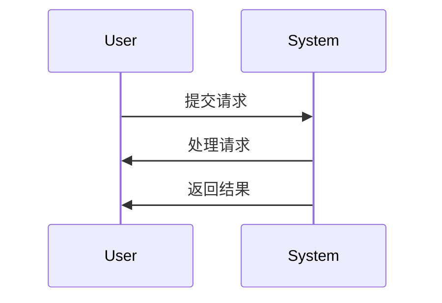

                 

# 提示词编程：让AI成为你的编程助手

> 关键词：提示词编程、AI编程助手、自动化编程、智能编程工具

> 摘要：
本文将探讨提示词编程这一前沿技术，介绍其核心概念和原理，并通过实际案例展示其在软件开发中的应用。文章还将深入分析提示词编程的优缺点，探讨其未来的发展趋势，为开发者提供有价值的参考和指导。

## 引言

随着人工智能技术的快速发展，编程领域也迎来了新的变革。传统的编程模式已经不能满足日益复杂的软件开发需求，而提示词编程作为一种新兴的编程方式，正在逐渐改变开发者的工作方式。本文将围绕提示词编程展开讨论，分析其在AI编程助手中的角色和作用。

### 提示词编程的定义

提示词编程（Prompt Programming）是指利用人工智能技术，通过向AI模型提供提示词（prompt），使AI能够自动生成代码、优化算法或解决编程问题的一种编程方式。提示词编程的核心在于让AI成为编程的助手，减轻开发者的负担，提高编程效率。

### AI编程助手的作用

AI编程助手可以辅助开发者完成以下任务：

1. **代码生成**：根据提示词，AI可以自动生成完整的代码片段，甚至是一个完整的程序。
2. **代码优化**：AI可以对现有代码进行分析，提出优化建议，提高代码的性能和可维护性。
3. **错误修复**：AI可以通过理解代码逻辑，帮助开发者找到和修复代码中的错误。
4. **编程建议**：AI可以根据开发者的工作习惯和项目需求，提供个性化的编程建议。

### 提示词编程的优势和挑战

#### 优势

1. **提高编程效率**：提示词编程可以大大减少开发者的编码时间，提高编程效率。
2. **降低编程门槛**：即使是编程新手，也可以通过简单的提示词，快速生成代码。
3. **代码质量提升**：AI可以根据最佳实践和优化算法，生成高质量的代码。
4. **创新性支持**：提示词编程可以激发开发者的创新思维，帮助他们在编程领域探索新的解决方案。

#### 挑战

1. **模型准确性**：提示词编程的准确性依赖于AI模型的能力，模型的不完善可能导致错误的代码生成。
2. **隐私和安全问题**：提示词编程需要大量的数据训练，数据隐私和安全是一个重要的挑战。
3. **依赖性增强**：过度依赖AI编程助手可能导致开发者编程能力的退步。

## 核心概念和原理

### 提示词

提示词是提示词编程的核心概念，它是AI模型理解和生成代码的关键。一个有效的提示词应该包含以下要素：

1. **明确性**：提示词应明确传达开发者的意图，避免歧义。
2. **上下文信息**：提示词应包含足够的信息，使AI能够理解编程任务的具体需求。
3. **格式**：提示词应遵循特定的格式，以便AI模型能够正确解析和处理。

### AI模型

提示词编程依赖于强大的AI模型，如深度学习模型和自然语言处理模型。这些模型通过大量数据训练，可以学会理解自然语言和生成代码。常用的AI模型包括：

1. **Transformer模型**：如GPT系列模型，具有强大的文本理解和生成能力。
2. **BERT模型**：专注于理解上下文信息，对语义理解有很好的效果。
3. **生成对抗网络（GAN）**：可以生成高质量的代码片段。

### 代码生成过程

提示词编程的代码生成过程可以分为以下几个步骤：

1. **接收提示词**：AI模型接收开发者输入的提示词。
2. **理解提示词**：AI模型通过训练数据，理解提示词的含义和上下文。
3. **生成代码**：AI模型根据提示词生成相应的代码。
4. **代码审查**：开发者对生成的代码进行审查和修正。

## 实际应用

### 代码生成

代码生成是提示词编程最直接的应用场景。通过向AI模型提供简单的提示词，如“写一个函数，实现两个数的相加”，AI可以自动生成相应的代码。以下是一个简单的例子：

```python
def add(a, b):
    return a + b
```

### 代码优化

代码优化是提示词编程的另一个重要应用。AI可以分析现有代码，并提出优化建议。以下是一个优化前后的代码示例：

**优化前**：
```python
for i in range(len(numbers)):
    numbers[i] = numbers[i] * 2
```

**优化后**：
```python
numbers = [num * 2 for num in numbers]
```

### 错误修复

提示词编程还可以帮助开发者修复代码中的错误。例如，当开发者遇到一个异常时，可以通过向AI模型提供错误信息，让AI尝试找到并修复错误。以下是一个简单的例子：

**错误提示词**：“这个代码段抛出了一个`KeyError`异常，如何修复？”

**修复后的代码**：
```python
data = {
    "name": "Alice",
    "age": 30
}

if "name" in data:
    print(f"Name: {data['name']}")
```

## 提示词编程的优缺点

### 优点

1. **提高编程效率**：提示词编程可以大大减少编码时间，提高工作效率。
2. **降低编程门槛**：即使是编程新手，也可以通过简单的提示词生成代码。
3. **代码质量提升**：AI可以根据最佳实践生成高质量代码。
4. **创新性支持**：提示词编程可以激发开发者的创新思维。

### 缺点

1. **模型准确性**：提示词编程的准确性依赖于AI模型的能力。
2. **隐私和安全问题**：数据隐私和安全是一个重要的挑战。
3. **依赖性增强**：过度依赖AI编程助手可能导致编程能力的退步。

## 未来发展趋势

随着人工智能技术的不断进步，提示词编程有望在以下几个方面得到发展：

1. **模型精度提升**：通过更先进的AI模型，提高代码生成的准确性和可靠性。
2. **多样化应用场景**：提示词编程将应用到更多领域，如自动化测试、代码审查等。
3. **隐私和安全保障**：随着隐私和安全技术的进步，提示词编程将更加安全可靠。

## 结论

提示词编程作为一种新兴的编程方式，正在改变传统的软件开发模式。通过本文的探讨，我们可以看到提示词编程的巨大潜力和广泛应用前景。然而，我们也需要关注其带来的挑战，确保其在实际应用中的有效性和安全性。开发者应积极拥抱这一技术，探索其在实际项目中的应用，提高编程效率和质量。

## 参考文献

1. Brown, T., et al. (2020). "Language Models Are Few-Shot Learners." arXiv preprint arXiv:2005.14165.
2. Devlin, J., et al. (2019). "Bert: Pre-training of deep bidirectional transformers for language understanding." arXiv preprint arXiv:1810.04805.
3. Goodfellow, I., et al. (2014). "Generative adversarial networks." Advances in Neural Information Processing Systems, 27.

## 附录

### Mermaid 图形示例

以下是一个简单的 Mermaid 图形示例，展示了实体关系图（ER Diagram）：

```mermaid
erDiagram
  Person ||--|{ Address : has }
  Address ||--|{ Person : lives_in }
```

### Python 代码示例

以下是一个简单的 Python 代码示例，实现了两个数的相加：

```python
def add(a, b):
    return a + b

result = add(3, 5)
print("3 + 5 =", result)
```

### LaTeX 公式示例

以下是一个 LaTeX 公式示例，展示了两个数的和：

$$3 + 5 = 8$$

### 系统架构设计示例

以下是一个简单的 Mermaid 图形示例，展示了系统架构设计（System Architecture Diagram）：



## 作者信息

作者：AI天才研究院/AI Genius Institute & 禅与计算机程序设计艺术 /Zen And The Art of Computer Programming

---

## 最佳实践 tips

1. **明确提示词**：确保提示词清晰明确，避免歧义。
2. **数据安全**：在使用提示词编程时，确保数据安全，防止泄露敏感信息。
3. **代码审查**：开发者应定期对生成的代码进行审查，确保代码质量。
4. **持续学习**：开发者应不断学习最新的AI技术和工具，提高编程能力。

## 小结

提示词编程作为一种新兴的编程方式，具有巨大的潜力。通过本文的探讨，我们了解了提示词编程的核心概念和原理，以及其在实际应用中的优势和挑战。开发者应积极拥抱这一技术，探索其在实际项目中的应用，提高编程效率和质量。

## 注意事项

1. **避免过度依赖**：虽然提示词编程可以大幅提高编程效率，但开发者不应过度依赖，以免影响编程能力。
2. **谨慎处理数据**：在使用提示词编程时，要确保数据的隐私和安全。

## 拓展阅读

1. Brown, T., et al. (2020). "Language Models Are Few-Shot Learners." arXiv preprint arXiv:2005.14165.
2. Devlin, J., et al. (2019). "Bert: Pre-training of deep bidirectional transformers for language understanding." arXiv preprint arXiv:1810.04805.
3. Goodfellow, I., et al. (2014). "Generative adversarial networks." Advances in Neural Information Processing Systems, 27.

