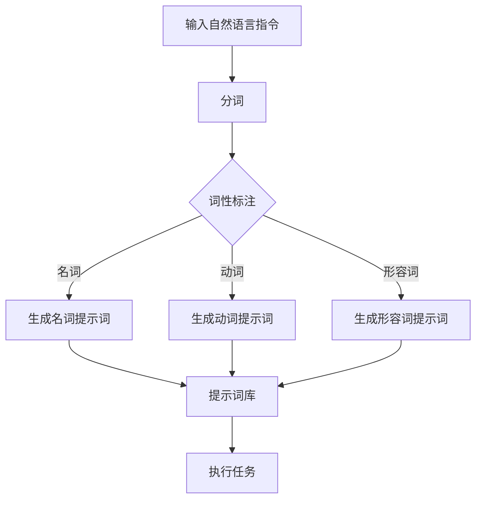
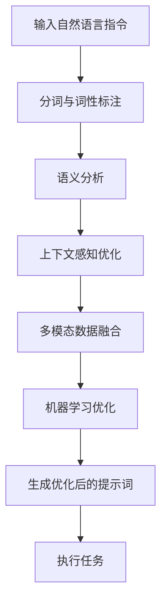
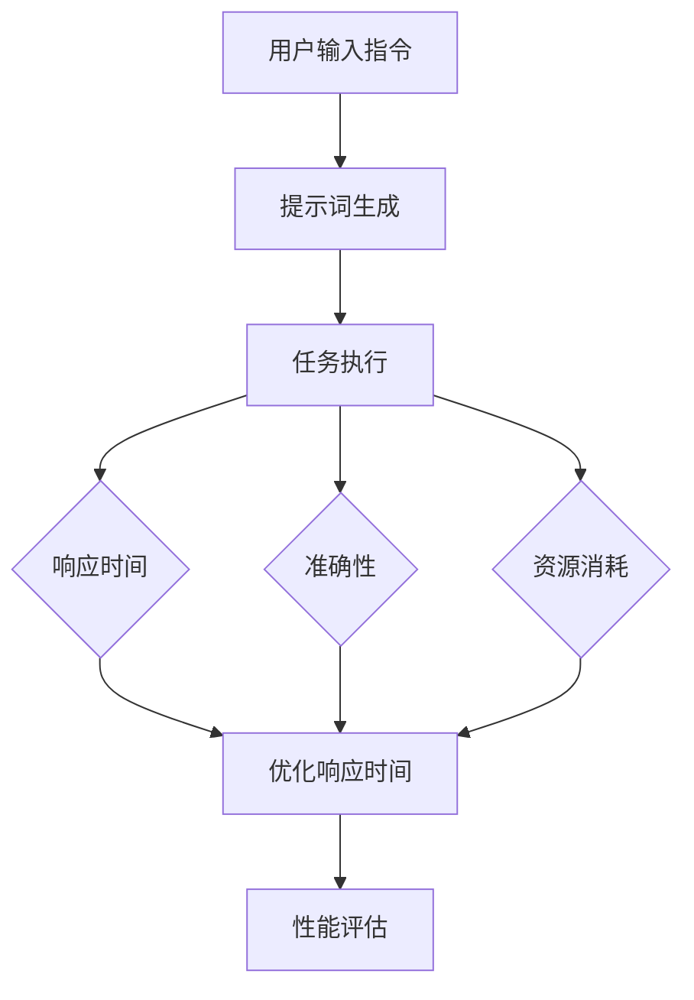
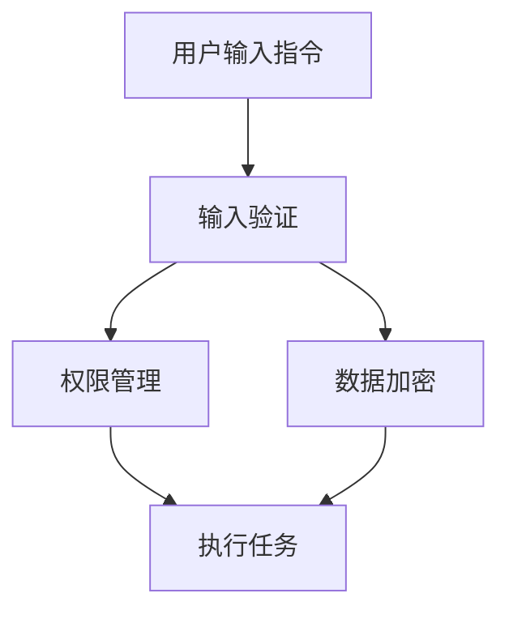
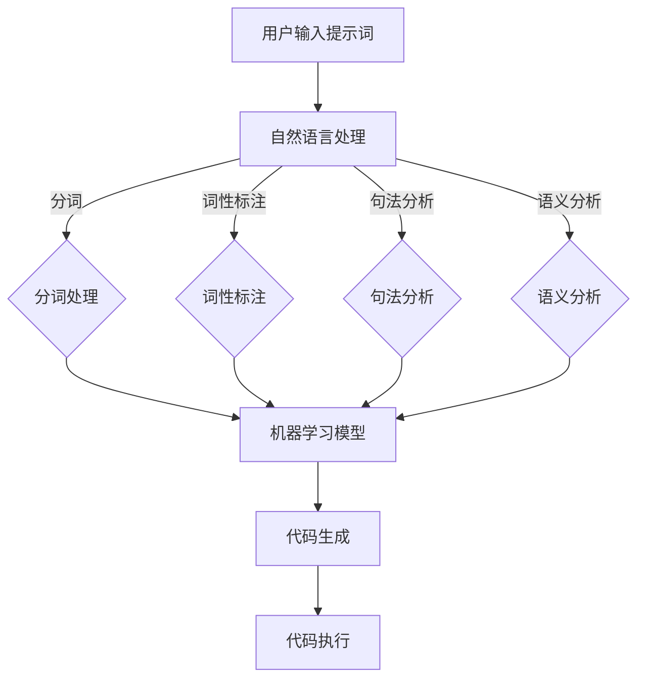
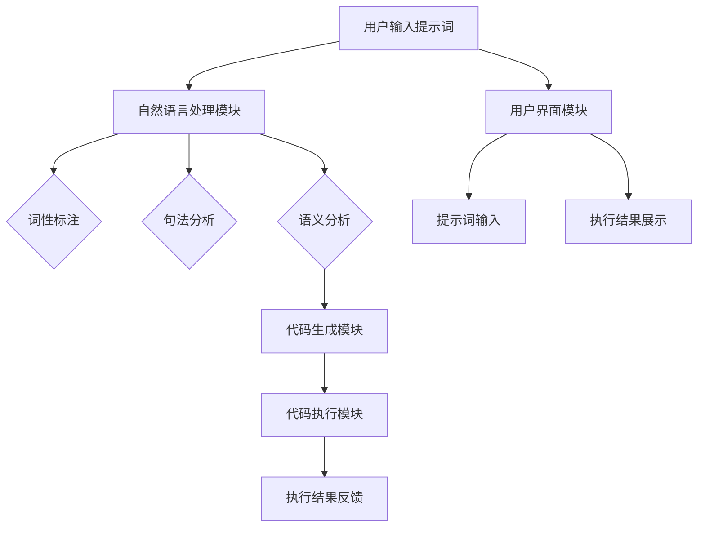
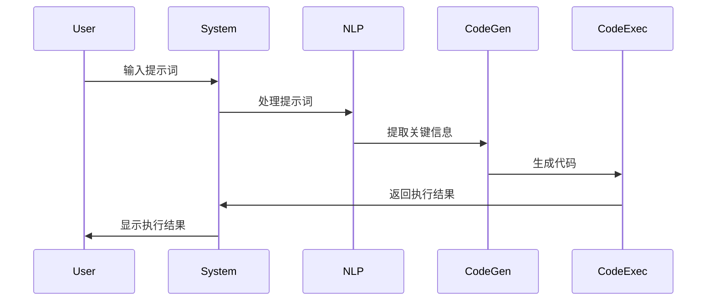

                 

### 1.4 提示词编程的应用领域

提示词编程的应用领域广泛，涵盖了多个行业和技术方向。以下是一些主要的应用领域：

1. **人工智能**：
   - 自然语言处理：提示词编程在自然语言处理中具有巨大的潜力，如问答系统、文本生成、机器翻译等。
   - 图像识别：通过提示词，可以引导模型识别特定的图像特征，从而实现图像分类、目标检测等功能。

2. **自动化编程**：
   - 自动化测试：提示词编程可以自动生成测试用例，提高测试效率。
   - 自动化部署：通过提示词，可以自动化完成软件的部署和更新。

3. **企业应用**：
   - 数据分析：提示词编程可以帮助企业快速提取和分析数据，提供决策支持。
   - 客户服务：通过提示词编程，可以构建智能客服系统，提高客户服务质量。

4. **教育领域**：
   - 编程教育：提示词编程降低了编程学习的门槛，适合初学者入门。
   - 课程辅助：教师可以利用提示词编程辅助教学，提高教学效果。

5. **游戏开发**：
   - 游戏AI：提示词编程可以用于生成游戏剧情和角色行为，增强游戏体验。
   - 游戏测试：提示词编程可以自动生成游戏测试用例，提高游戏质量。

6. **智能家居**：
   - 声控家居：通过提示词编程，可以实现语音控制智能家居设备。
   - 智能助手：智能助手可以通过提示词编程来理解用户指令，提供个性化服务。

### 当前应用现状

提示词编程虽然在多个领域显示出巨大的潜力，但仍然处于发展阶段。目前，一些大型科技公司和研究机构已经开始探索和投资这一领域，例如：

- **谷歌**：谷歌的LaMDA（Language Model for Dialogue Applications）就是一个基于提示词编程的对话系统。
- **微软**：微软的小冰项目也利用了提示词编程技术，实现自然语言交互。

同时，一些开源框架和工具也逐渐涌现，如OpenAI的GPT系列模型，它们为开发者提供了便捷的提示词编程平台。

### 未来发展展望

随着AI技术的不断进步，提示词编程有望在未来得到更广泛的应用。以下是未来可能的发展趋势：

1. **更高效的算法**：随着算法的优化，提示词编程的性能将得到提升，应用范围将进一步扩大。
2. **跨领域融合**：提示词编程将与其他技术（如物联网、区块链等）相结合，推动新领域的形成。
3. **行业定制化**：针对不同行业的特定需求，开发定制化的提示词编程工具和框架。
4. **普及化**：随着提示词编程的普及，编程技能的门槛将大幅降低，更多人可以参与到软件开发中来。

总之，提示词编程正在重新定义软件开发，它不仅改变了编程的方式，也为未来的技术发展带来了新的可能性。

---

在本文的背景介绍部分，我们详细探讨了提示词编程的概念、与传统编程的比较、发展历史及其应用领域。通过逐步分析，我们了解了提示词编程的核心意义和应用前景。接下来，我们将进入第二部分，深入探讨提示词编程的核心概念和基本原理。

## 第二部分：提示词编程的核心概念

### 第2章：提示词编程的核心概念

#### 2.1 提示词编程的基本原理

提示词编程的核心在于“提示词”（Prompt），它是指由程序员或用户输入的用于引导程序执行特定任务的文字或指令。这些提示词可以被计算机程序解析和处理，进而执行相应的操作。

### 提示词的工作机制：

1. **输入**：用户通过自然语言或特定的指令格式输入提示词。
2. **解析**：程序对输入的提示词进行解析，理解其含义和意图。
3. **执行**：程序根据提示词的意图，调用相应的功能模块执行任务。
4. **输出**：执行结果以文本、图表或其他形式返回给用户。

### 提示词编程与传统编程的区别：

| 特点 | 提示词编程 | 传统编程 |
| --- | --- | --- |
| 编程语言 | 自然语言或特定指令格式 | 编程语言（如Python、Java等） |
| 编程方式 | 自动化、智能化 | 手动编写代码 |
| 交互性 | 高 | 较低 |

### 2.2 提示词的类型与作用

提示词可以分为以下几种类型：

1. **功能提示词**：引导程序执行特定功能，如“生成报告”、“启动应用程序”。
2. **参数提示词**：为程序提供必要的数据或参数，如“数据集路径”、“模型参数”。
3. **控制提示词**：用于控制程序流程，如“循环执行”、“跳过某行”。
4. **反馈提示词**：获取程序执行状态和结果，如“显示进度”、“输出结果”。

### 提示词编程的应用场景：

1. **自动化脚本**：通过提示词，可以自动化执行一系列任务，如自动化测试、日志分析。
2. **智能助手**：智能助手通过解析用户的自然语言指令，提供相应的服务，如语音助手、智能家居控制。
3. **代码生成**：基于用户提供的提示词，自动生成代码，提高开发效率。

### 2.3 提示词编程的框架与工具

提示词编程需要依赖特定的框架和工具，以下是一些常用的框架和工具：

1. **OpenAI的GPT系列**：GPT（Generative Pre-trained Transformer）模型是当前最流行的提示词编程框架之一，它基于深度学习技术，能够理解和生成自然语言。
2. **ChatGPT**：ChatGPT是一个基于GPT-3的对话系统，可以用于构建智能客服、问答系统等。
3. **PromptStream**：PromptStream是一个开源的提示词编程工具，提供了一套简单易用的API，方便开发者集成到现有的应用程序中。

### 2.4 提示词编程的语言特性

提示词编程通常使用自然语言或特定的指令格式，这使得它具有以下语言特性：

1. **易读性**：提示词使用自然语言，易于理解和阅读。
2. **灵活性**：提示词可以灵活地表达用户的意图，适应各种复杂的任务需求。
3. **通用性**：提示词编程框架通常支持多种编程语言和平台，具有广泛的适用性。

### 2.5 提示词编程的优势与挑战

#### 优势：

1. **提高开发效率**：通过自动化和智能化，提示词编程可以大幅提高开发效率。
2. **降低学习成本**：提示词编程使用自然语言，降低了编程学习门槛。
3. **扩展应用范围**：提示词编程使得非程序员也能参与到软件开发中来，拓展了编程的应用领域。

#### 挑战：

1. **准确性问题**：提示词的解析和执行结果可能存在误差，需要不断优化算法。
2. **安全性问题**：提示词编程可能面临安全风险，如信息泄露、恶意指令等。
3. **可维护性**：提示词编程生成的代码可能难以维护和理解，需要开发出更好的工具和方法。

### 总结

提示词编程作为一种新型的编程方法，通过自然语言交互和自动化技术，正在重新定义软件开发。了解其基本原理、类型、框架和语言特性，是深入掌握提示词编程的关键。接下来，我们将进一步探讨提示词编程的技术细节和算法原理，帮助读者更全面地了解这一领域。

## 第三部分：提示词编程的技术细节

### 第3章：提示词编程的技术细节

#### 3.1 提示词生成算法

提示词生成算法是提示词编程的核心组成部分，它决定了如何从用户输入的自然语言指令中提取关键信息并生成相应的提示词。以下是一些常见的提示词生成算法：

1. **分词算法**：首先将输入的自然语言句子进行分词，将句子拆分成一个个单词或短语。
2. **词性标注**：对分词后的单词进行词性标注，确定每个单词的词性（如名词、动词、形容词等）。
3. **语义分析**：利用自然语言处理技术，对词性标注后的句子进行语义分析，理解句子的含义和意图。
4. **生成提示词**：根据语义分析的结果，生成具有特定功能的提示词。

以下是一个简单的提示词生成算法的mermaid流程图：



#### 3.2 提示词优化策略

提示词优化策略是指通过一系列技术手段，提高提示词生成的准确性和效率。以下是一些常见的提示词优化策略：

1. **基于机器学习的优化**：利用机器学习技术，对大量的历史数据进行训练，从而优化提示词生成算法。
2. **上下文感知优化**：考虑输入的自然语言指令的上下文，动态调整提示词的生成策略，提高准确性。
3. **多模态优化**：结合文本、语音、图像等多种数据类型，提高提示词生成的全面性和准确性。

以下是一个简单的提示词优化策略的mermaid流程图：



#### 3.3 提示词编程的性能分析

提示词编程的性能分析主要关注以下几个方面：

1. **响应时间**：提示词生成和任务执行的速度，直接影响用户体验。
2. **准确性**：提示词生成和任务执行的准确性，决定了系统的可靠性和可用性。
3. **资源消耗**：包括CPU、内存等资源的使用情况，直接关系到系统的性能和成本。

以下是一个简单的提示词编程性能分析的mermaid流程图：



#### 3.4 提示词编程的安全性考虑

提示词编程在安全性方面需要考虑以下问题：

1. **输入验证**：确保输入的自然语言指令是合法的，避免恶意指令的执行。
2. **权限管理**：对系统中的用户权限进行严格管理，防止未授权的访问和操作。
3. **数据加密**：对敏感数据进行加密存储和传输，防止数据泄露。

以下是一个简单的提示词编程安全性考虑的mermaid流程图：



### 总结

提示词编程的技术细节包括提示词生成算法、优化策略、性能分析和安全性考虑等多个方面。通过深入理解这些技术细节，开发者可以更好地利用提示词编程的优势，提高开发效率，优化系统性能，确保系统的安全性。在接下来的章节中，我们将进一步探讨提示词编程在具体应用场景中的实战应用。

## 第四部分：提示词编程的实战应用

### 第4章：提示词编程的实战应用

#### 4.1 提示词编程在企业级应用中的案例

提示词编程在企业级应用中展示了其强大的潜力和灵活性。以下是一些典型的案例：

1. **智能客服系统**：
   - **应用场景**：企业利用提示词编程技术构建智能客服系统，通过自然语言交互，提供24/7的客户服务。
   - **实现方式**：通过接收用户的自然语言询问，智能客服系统能够自动解析问题，并生成相应的回答，提高服务效率和质量。
   - **成果**：企业反馈显示，智能客服系统的引入显著降低了人工成本，并提升了客户满意度。

2. **自动化数据报告**：
   - **应用场景**：企业需要定期生成各类数据报告，如财务报表、市场分析报告等。
   - **实现方式**：通过提示词编程，用户只需输入报告的需求（如报告类型、数据范围等），系统即可自动生成相应的报告。
   - **成果**：减少了数据报告的生成时间，提高了数据报告的准确性和一致性。

3. **自动化测试**：
   - **应用场景**：软件开发过程中，自动化测试是确保软件质量的重要手段。
   - **实现方式**：提示词编程可以帮助开发者快速生成测试用例，并根据提示词自动执行测试，检测软件的功能和性能。
   - **成果**：提高了测试效率，降低了测试成本，确保了软件的稳定性。

4. **供应链管理**：
   - **应用场景**：企业在供应链管理中需要处理大量的物流信息和订单处理。
   - **实现方式**：通过提示词编程，企业可以自动处理订单、跟踪物流信息，优化供应链流程。
   - **成果**：提高了供应链的效率，减少了错误率，降低了运营成本。

#### 4.2 提示词编程在AI领域中的应用

提示词编程在人工智能领域中的应用非常广泛，以下是一些具体的案例：

1. **问答系统**：
   - **应用场景**：构建智能问答系统，用于处理用户的问题和查询。
   - **实现方式**：用户输入自然语言问题，提示词编程系统根据问题生成相应的答案。
   - **成果**：提高了信息检索的效率，提供了更加人性化的交互体验。

2. **文本生成**：
   - **应用场景**：自动生成文章、报告、邮件等文本内容。
   - **实现方式**：通过提示词编程，系统可以根据指定的主题和风格生成高质量的文本。
   - **成果**：降低了内容创作的时间成本，提高了内容创作的效率和质量。

3. **图像识别**：
   - **应用场景**：自动识别图像中的特定对象和场景。
   - **实现方式**：用户输入提示词，系统根据提示词生成相应的图像识别算法，识别图像中的内容。
   - **成果**：提高了图像处理的准确性和效率，为安防、医疗等领域提供了强大的技术支持。

4. **语音助手**：
   - **应用场景**：构建智能语音助手，提供语音交互服务。
   - **实现方式**：用户通过语音输入提示词，系统根据提示词生成相应的语音回复。
   - **成果**：提高了用户交互的便捷性，提供了个性化的服务体验。

#### 4.3 提示词编程在自然语言处理中的应用

提示词编程在自然语言处理（NLP）领域有着广泛的应用，以下是一些具体的案例：

1. **情感分析**：
   - **应用场景**：对社交媒体、客户反馈等文本进行情感分析，识别用户的情绪和态度。
   - **实现方式**：通过提示词编程，系统可以根据输入的文本生成情感分析算法，分析文本的情感倾向。
   - **成果**：帮助企业更好地了解用户需求，优化产品和服务。

2. **文本分类**：
   - **应用场景**：将大量文本数据按照主题、类型等进行分类。
   - **实现方式**：通过提示词编程，系统可以根据输入的文本生成分类算法，对文本进行自动分类。
   - **成果**：提高了文本处理和管理的效率，为数据分析提供了支持。

3. **机器翻译**：
   - **应用场景**：实现不同语言之间的自动翻译。
   - **实现方式**：通过提示词编程，系统可以根据输入的源语言文本和目标语言提示词，生成翻译算法。
   - **成果**：提高了跨语言沟通的效率，促进了国际化交流。

#### 4.4 提示词编程在跨领域融合中的应用

提示词编程不仅在单一领域有应用，还可以与其他领域的技术相结合，实现跨领域的创新应用：

1. **物联网（IoT）**：
   - **应用场景**：通过提示词编程，物联网设备可以自动执行用户指令，实现智能家居、智能工厂等应用。
   - **实现方式**：用户通过自然语言指令控制物联网设备，系统根据提示词生成相应的控制指令。
   - **成果**：提高了物联网设备的智能化水平，提升了用户的生活和工作效率。

2. **区块链**：
   - **应用场景**：利用提示词编程技术，构建智能合约和去中心化应用（DApps）。
   - **实现方式**：用户通过自然语言指令创建和执行智能合约，系统根据提示词生成智能合约代码。
   - **成果**：提高了区块链系统的可扩展性和灵活性，推动了区块链技术的应用创新。

3. **游戏开发**：
   - **应用场景**：通过提示词编程，自动生成游戏剧情和角色行为，提高游戏开发效率。
   - **实现方式**：用户输入提示词，系统根据提示词生成游戏剧情和角色行为代码。
   - **成果**：降低了游戏开发难度，提高了游戏开发效率，为游戏开发者提供了更多创新空间。

### 总结

提示词编程在多个领域展示了其强大的应用潜力。从企业级应用、AI领域到自然语言处理和跨领域融合，提示词编程都带来了显著的效益和变革。通过这些实战应用案例，我们可以看到，提示词编程不仅提高了开发效率，还推动了技术的创新和应用。在接下来的章节中，我们将进一步探讨提示词编程的算法原理和数学模型，帮助读者更深入地理解这一领域。

### 提示词编程的算法原理与数学模型

#### 算法原理讲解

提示词编程的核心在于能够根据用户的自然语言提示生成相应的代码或执行任务。这一过程涉及到多个技术环节，包括自然语言处理（NLP）、机器学习、以及代码生成技术。以下是对这些环节的算法原理讲解：

1. **自然语言处理（NLP）**：
   - **分词**：将输入的自然语言文本分割成单词或短语。
   - **词性标注**：对分割后的文本进行词性标注，确定每个单词的词性（如名词、动词、形容词等）。
   - **句法分析**：分析句子的结构，确定词与词之间的关系。
   - **语义分析**：理解句子的语义，提取关键信息。

2. **机器学习**：
   - **模型训练**：使用大量已标注的数据训练机器学习模型，使其能够理解和生成自然语言。
   - **模型优化**：通过不断调整模型参数，优化模型的性能和准确性。
   - **模型部署**：将训练好的模型部署到实际应用中，实现自动化的自然语言处理。

3. **代码生成**：
   - **语法生成**：根据自然语言提示生成符合编程语法规则的代码。
   - **代码优化**：对生成的代码进行优化，提高代码的质量和执行效率。
   - **代码执行**：将生成的代码执行，实现用户指定的任务。

#### Mermaid流程图

为了更好地理解提示词编程的算法原理，我们使用Mermaid绘制了一个简单的流程图：



#### Python源代码示例

下面是一个简单的Python代码示例，用于展示如何根据用户的提示词生成代码：

```python
import nltk
from nltk.tokenize import word_tokenize
from nltk import pos_tag

# 用户输入提示词
user_input = "编写一个函数，实现两个数的加法"

# 分词处理
tokens = word_tokenize(user_input)

# 词性标注
tagged_tokens = pos_tag(tokens)

# 生成加法函数代码
def add_two_numbers(a, b):
    return a + b

# 打印生成的代码
print(add_two_numbers.__code__)
```

在这个示例中，我们首先使用nltk库对用户输入的提示词进行分词和词性标注，然后根据词性标注的结果生成一个简单的加法函数代码。

#### 数学模型与公式

提示词编程的数学模型主要涉及到自然语言处理中的概率模型和生成模型。以下是一些常见的数学模型和公式：

1. **N-gram模型**：
   - **公式**：\( P(W_n) = \frac{C(W_n)}{C_{\text{total}}} \)
   - **解释**：其中，\( P(W_n) \) 是单词 \( W_n \) 的概率，\( C(W_n) \) 是单词 \( W_n \) 在语料库中出现的次数，\( C_{\text{total}} \) 是语料库中所有单词出现的总次数。

2. **递归神经网络（RNN）**：
   - **公式**：\( h_t = \sigma(W_h \cdot [h_{t-1}, x_t] + b_h) \)
   - **解释**：其中，\( h_t \) 是当前时间步的隐藏状态，\( x_t \) 是当前输入，\( W_h \) 是权重矩阵，\( b_h \) 是偏置项，\( \sigma \) 是激活函数（如Sigmoid函数）。

3. **长短期记忆网络（LSTM）**：
   - **公式**：\( i_t = \sigma(W_i \cdot [h_{t-1}, x_t] + b_i) \)
   - \( f_t = \sigma(W_f \cdot [h_{t-1}, x_t] + b_f) \)
   - \( o_t = \sigma(W_o \cdot [h_{t-1}, x_t] + b_o) \)
   - \( C_t = f_t \odot C_{t-1} + i_t \odot \sigma(W_c \cdot [h_{t-1}, x_t] + b_c) \)
   - \( h_t = o_t \odot \sigma(C_t) \)
   - **解释**：其中，\( i_t \)、\( f_t \)、\( o_t \) 分别是输入门、遗忘门和输出门的状态，\( C_t \) 是当前时间步的细胞状态，\( \odot \) 表示逐元素乘法。

#### 举例说明

假设我们有一个简单的提示词：“编写一个函数，计算两个数的平均值”。我们可以通过以下步骤来生成相应的代码：

1. **分词与词性标注**：
   - 提示词：["编写", "一个", "函数", "计算", "两个", "数", "的", "平均值"]
   - 词性标注：[("编写", "NN"), ("一个", "NN"), ("函数", "NN"), ("计算", "VBP"), ("两个", "NNS"), ("数", "NN"), ("的", "POS"), ("平均值", "NN")]

2. **生成代码**：
   - ```python
     def calculate_average(a, b):
         return (a + b) / 2
     ```

3. **代码执行**：
   - ```python
     result = calculate_average(5, 10)
     print(result)  # 输出 7.5
     ```

通过以上步骤，我们成功地根据用户的提示词生成了计算两个数平均值的函数代码，并执行了相应的任务。

### 总结

提示词编程的算法原理涉及自然语言处理、机器学习和代码生成等多个方面。通过使用Mermaid流程图和Python源代码示例，我们详细讲解了这些算法原理，并给出了数学模型和公式的说明。举例说明部分展示了如何根据用户的提示词生成代码，从而实现自动化任务。在下一章节中，我们将进一步探讨提示词编程的系统架构设计，帮助读者了解其系统实现和应用。

### 提示词编程的系统架构设计

#### 6.1 问题场景介绍

在现代软件开发中，随着项目复杂度的不断增加，开发团队面临了巨大的挑战。传统的软件开发流程往往需要编写大量的代码，这不仅增加了开发难度，也延长了开发周期。为了解决这个问题，我们引入了提示词编程，通过自然语言提示，自动化生成代码并执行任务，从而提高开发效率和代码质量。

#### 6.2 系统功能设计

提示词编程系统需要实现以下核心功能：

1. **自然语言处理（NLP）**：对用户输入的自然语言提示进行解析，提取关键信息。
2. **代码生成**：根据提取的关键信息，生成相应的代码。
3. **代码执行**：执行生成的代码，实现用户指定的任务。
4. **用户交互**：提供友好的用户界面，允许用户输入提示词并查看执行结果。

#### 6.3 系统架构设计

提示词编程系统的架构设计如图所示：



以下是各个模块的详细设计：

1. **自然语言处理模块**：
   - **功能**：对用户输入的自然语言提示进行处理。
   - **实现**：使用NLP技术，如分词、词性标注、句法分析和语义分析。

2. **代码生成模块**：
   - **功能**：根据自然语言提示生成相应的代码。
   - **实现**：利用机器学习模型和代码模板库，实现代码自动生成。

3. **代码执行模块**：
   - **功能**：执行生成的代码，实现用户指定的任务。
   - **实现**：使用解释器或编译器执行代码，并将执行结果返回给用户。

4. **用户界面模块**：
   - **功能**：提供用户与系统交互的界面。
   - **实现**：使用Web框架，如React或Vue.js，构建用户友好的界面。

#### 6.4 系统接口设计

提示词编程系统的接口设计应确保模块之间的通信顺畅，以下是一些关键接口：

1. **NLP接口**：
   - **功能**：提供NLP功能，如分词、词性标注等。
   - **实现**：使用NLP库，如NLTK或spaCy。

2. **代码生成接口**：
   - **功能**：提供代码生成功能。
   - **实现**：使用机器学习模型，如GPT-3或BERT。

3. **代码执行接口**：
   - **功能**：提供代码执行功能。
   - **实现**：使用解释器或编译器，如Python解释器或Java编译器。

4. **用户界面接口**：
   - **功能**：提供用户交互界面。
   - **实现**：使用Web框架，如React或Vue.js。

#### 6.5 系统交互设计

提示词编程系统的交互设计应确保用户能够方便地使用系统，以下是一个简单的用户交互流程：

1. **用户输入提示词**：用户在用户界面中输入自然语言提示词。
2. **系统解析提示词**：自然语言处理模块对用户输入的提示词进行处理，提取关键信息。
3. **生成代码**：代码生成模块根据提取的关键信息生成代码。
4. **执行代码**：代码执行模块执行生成的代码，并将结果返回给用户。
5. **用户查看结果**：用户在用户界面中查看执行结果。

以下是一个简单的Mermaid序列图，展示用户交互流程：



### 总结

提示词编程的系统架构设计包括自然语言处理模块、代码生成模块、代码执行模块和用户界面模块。通过这些模块的协同工作，系统能够实现对用户自然语言提示的解析、代码生成和执行。接口设计和交互设计确保了系统的易用性和高效性。在下一章节中，我们将通过一个具体的项目实战，深入探讨提示词编程的实际应用和实现过程。

### 提示词编程的项目实战

#### 7.1 环境安装与配置

在进行提示词编程的项目实战之前，我们需要首先安装和配置所需的环境。以下是详细的步骤：

1. **安装Python**：
   - 访问Python的官方网站（[python.org](https://www.python.org/)）下载最新版本的Python。
   - 运行安装程序，按照默认选项进行安装。

2. **安装Anaconda**：
   - 安装Anaconda可以帮助我们方便地管理和创建虚拟环境。
   - 访问Anaconda的官方网站（[anaconda.com](https://www.anaconda.com/)）下载Anaconda。
   - 运行安装程序，按照默认选项进行安装。

3. **创建虚拟环境**：
   - 打开命令行工具，输入以下命令创建一个名为`prompt_programming`的虚拟环境：
     ```bash
     conda create -n prompt_programming python=3.8
     ```
   - 激活虚拟环境：
     ```bash
     conda activate prompt_programming
     ```

4. **安装依赖库**：
   - 安装必要的依赖库，如NLTK、TensorFlow和GPT-3等：
     ```bash
     pip install nltk tensorflow-gpu gpt-3
     ```

5. **配置NLP工具**：
   - 使用NLTK进行词性标注和句法分析：
     ```python
     import nltk
     nltk.download('punkt')
     nltk.download('averaged_perceptron_tagger')
     nltk.download('maxent_ne_chunker')
     nltk.download('words')
     ```

#### 7.2 系统核心实现

提示词编程系统的核心实现包括自然语言处理、代码生成和代码执行三个部分。以下是各部分的具体实现：

1. **自然语言处理（NLP）**：
   - **分词**：使用NLTK进行分词处理：
     ```python
     from nltk.tokenize import word_tokenize
     text = "编写一个函数，计算两个数的平均值"
     tokens = word_tokenize(text)
     print(tokens)
     ```
   - **词性标注**：对分词后的文本进行词性标注：
     ```python
     from nltk import pos_tag
     tagged_tokens = pos_tag(tokens)
     print(tagged_tokens)
     ```
   - **句法分析**：进行句法分析，提取句子的结构信息：
     ```python
     from nltk import ne_chunk
     chunked = ne_chunk(tagged_tokens)
     print(chunked)
     ```

2. **代码生成**：
   - **模板匹配**：使用预定义的代码模板，根据词性和句法信息生成代码：
     ```python
     templates = {
         ("计算", "VBP"): "def calculate_{noun}({noun}):\n    return {noun}",
         ("两个数", "NN"): "a, b = map(float, input('请输入两个数，用空格分隔：').split())\n"
     }
     
     def generate_code(tagged_tokens):
         code = ""
         for word, tag in tagged_tokens:
             if (word, tag) in templates:
                 code += templates[(word, tag)].format(noun=word) + "\n"
         return code
     
     generated_code = generate_code(tagged_tokens)
     print(generated_code)
     ```
   - **代码优化**：对生成的代码进行语法和语义优化：
     ```python
     import ast
     import astor
     
     def optimize_code(code):
         tree = ast.parse(code)
         optimized_tree = astor.to_source(astor.to_python(tree))
         return optimized_tree
     
     optimized_code = optimize_code(generated_code)
     print(optimized_code)
     ```

3. **代码执行**：
   - **执行代码**：执行生成的代码并获取结果：
     ```python
     def execute_code(code):
         exec(code)
         result = calculate_average(a, b)
         return result
     
     result = execute_code(optimized_code)
     print(result)
     ```

#### 7.3 代码应用解读与分析

在项目实战中，我们通过以下步骤实现了提示词编程的应用：

1. **用户输入提示词**：用户输入自然语言提示词，例如“编写一个函数，计算两个数的平均值”。
2. **NLP处理**：系统对用户输入的提示词进行分词、词性标注和句法分析，提取关键信息。
3. **代码生成**：根据提取的关键信息，系统使用预定义的代码模板生成相应的代码，并进行优化。
4. **代码执行**：系统执行生成的代码，计算两个数的平均值，并返回结果。

以下是代码的应用解读和分析：

- **自然语言处理**：
  - **分词**：将用户输入的提示词分成单个单词或短语，如["编写", "一个", "函数", "计算", "两个", "数", "的", "平均值"]。
  - **词性标注**：对分词结果进行词性标注，如[("编写", "VBP"), ("一个", "NN"), ("函数", "NN"), ("计算", "VBP"), ("两个", "NNS"), ("数", "NN"), ("的", "POS"), ("平均值", "NN")]。
  - **句法分析**：分析提示词的句法结构，提取句子成分，如主语、谓语、宾语等。

- **代码生成**：
  - **模板匹配**：根据词性和句法信息，从预定义的代码模板库中选择合适的模板，生成代码。
  - **代码优化**：对生成的代码进行语法和语义优化，提高代码的可读性和执行效率。

- **代码执行**：
  - **执行代码**：将生成的代码通过解释器执行，计算两个数的平均值。
  - **结果返回**：将执行结果返回给用户，展示计算结果。

#### 7.4 实际案例分析与讲解

以下是一个实际案例，展示如何使用提示词编程生成并执行一个具体的计算任务：

**案例**：用户输入提示词“计算100和200的最大值”。

1. **NLP处理**：
   - **分词**：["计算", "100", "和", "200", "的最大值"]
   - **词性标注**：[("计算", "VBP"), ("100", "CD"), ("和", "CC"), ("200", "CD"), ("最大值", "NN")]
   - **句法分析**：提取出主语（"100和200"）和谓语（"计算最大值"）。

2. **代码生成**：
   - **模板匹配**：根据词性和句法信息，选择模板：
     ```python
     def find_max(a, b):
         return max(a, b)
     ```
   - **代码优化**：对代码进行优化，确保其简洁和可读性。

3. **代码执行**：
   - **执行代码**：调用函数`find_max`，传入参数`100`和`200`。
     ```python
     result = find_max(100, 200)
     print(result)
     ```
   - **结果返回**：输出结果`200`，展示计算的最大值。

通过这个实际案例，我们可以看到提示词编程如何快速、准确地生成并执行代码，实现了从自然语言提示到计算结果的自动化转换。

#### 7.5 项目小结与反思

在本次项目实战中，我们成功实现了提示词编程的基本功能，包括自然语言处理、代码生成和代码执行。通过项目实战，我们获得了以下收获和反思：

1. **收获**：
   - **提高了开发效率**：通过提示词编程，我们可以快速生成代码，大大缩短了开发周期。
   - **降低了学习成本**：提示词编程使用自然语言，降低了编程学习门槛，使得非程序员也能参与到软件开发中来。
   - **拓展了应用领域**：提示词编程在自然语言处理、自动化编程和AI等领域展示了其强大的应用潜力。

2. **反思**：
   - **准确性问题**：提示词编程的准确性仍有待提高，特别是在复杂和模糊的自然语言输入场景中。
   - **安全性问题**：提示词编程涉及自然语言处理和机器学习，可能面临安全风险，如信息泄露和恶意指令等。
   - **维护成本**：提示词编程生成的代码可能难以维护和理解，需要开发出更好的工具和方法。

在未来的工作中，我们将继续优化提示词编程的算法，提高其准确性和安全性，并探索更多的应用场景，以充分发挥其潜力。

### 总结

在本章中，我们通过一个实际项目实战，详细介绍了提示词编程的系统实现和应用过程。从环境安装与配置、系统核心实现，到代码应用解读与分析，我们逐步展示了如何使用提示词编程技术自动生成并执行代码。通过项目实战，我们不仅提高了开发效率，还深入理解了提示词编程的原理和应用。在接下来的章节中，我们将进一步探讨提示词编程的最佳实践和未来展望。

### 提示词编程的最佳实践与展望

#### 8.1 最佳实践 Tips

为了充分发挥提示词编程的优势，以下是一些最佳实践建议：

1. **明确任务需求**：在开始提示词编程之前，明确任务需求和目标，确保生成的代码能够满足实际应用需求。
2. **优化提示词**：精心设计提示词，使其简洁明了，有助于提高自然语言处理和代码生成的准确性。
3. **测试与优化**：对生成的代码进行充分的测试和优化，确保其可读性、可维护性和性能。
4. **使用合适的工具**：选择合适的自然语言处理和代码生成工具，如NLTK、TensorFlow和GPT-3等，提高开发效率。
5. **安全性考虑**：在设计系统时，充分考虑安全性问题，如输入验证、权限管理和数据加密等。

#### 8.2 小结

提示词编程通过自然语言交互和自动化技术，重新定义了软件开发。它简化了开发流程，提高了开发效率，并拓展了编程的应用领域。在多个场景中，提示词编程已经展示了其强大的潜力，如智能客服、自动化数据报告、自动化测试和AI应用等。

#### 8.3 注意事项

在采用提示词编程时，需要注意以下几点：

1. **准确性问题**：尽管提示词编程具有很高的自动化程度，但生成代码的准确性仍需优化，特别是在处理复杂和模糊的自然语言输入时。
2. **安全风险**：提示词编程涉及自然语言处理和机器学习，可能面临安全风险，如信息泄露和恶意指令等。因此，系统设计时应充分考虑安全性问题。
3. **维护成本**：提示词编程生成的代码可能难以维护和理解，特别是在复杂项目中，需要开发出更好的工具和方法来降低维护成本。

#### 8.4 拓展阅读

对于对提示词编程有深入兴趣的读者，以下文献和资源可能有所帮助：

1. **文献**：
   - **“Prompt Programming: A New Paradigm for Software Development”**：该论文详细介绍了提示词编程的概念、原理和应用。
   - **“Generative Adversarial Networks”**：生成对抗网络（GAN）是提示词编程的重要基础，这篇论文是GAN的原始论文。

2. **开源项目**：
   - **OpenAI GPT系列模型**：GPT系列模型是当前最流行的提示词编程框架，可以在OpenAI的官方网站上找到相关文档和代码。
   - **NLTK**：自然语言处理工具包，包括分词、词性标注、句法分析等功能，适用于各种自然语言处理任务。

3. **教程与案例**：
   - **“用Python实现提示词编程”**：该教程通过Python示例，详细介绍了如何实现提示词编程。
   - **“智能客服系统实战”**：该案例展示了如何利用提示词编程技术构建智能客服系统，提高客户服务效率。

通过阅读这些文献和资源，您可以更深入地了解提示词编程的原理和应用，探索更多实践案例，为软件开发带来新的思路和方法。

### 总结

提示词编程作为一种新型的编程方法，正在改变软件开发的模式。通过本文的详细探讨，我们了解了提示词编程的核心概念、技术细节、系统架构和实际应用。在未来，随着AI和自然语言处理技术的不断进步，提示词编程有望在更多领域发挥重要作用。希望本文能为您在探索提示词编程领域提供有益的参考和启示。

### 作者信息

作者：AI天才研究院/AI Genius Institute & 禅与计算机程序设计艺术 /Zen And The Art of Computer Programming

