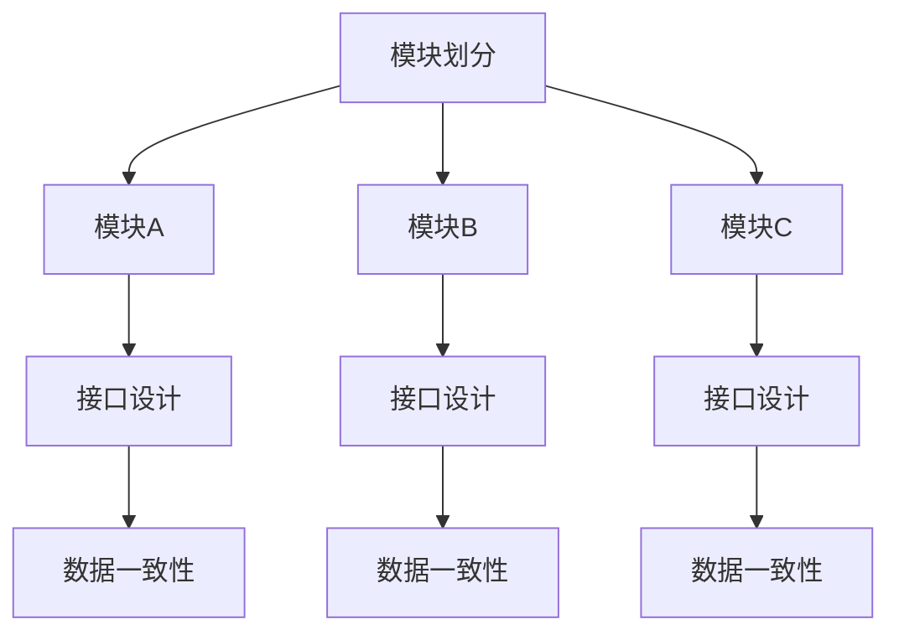
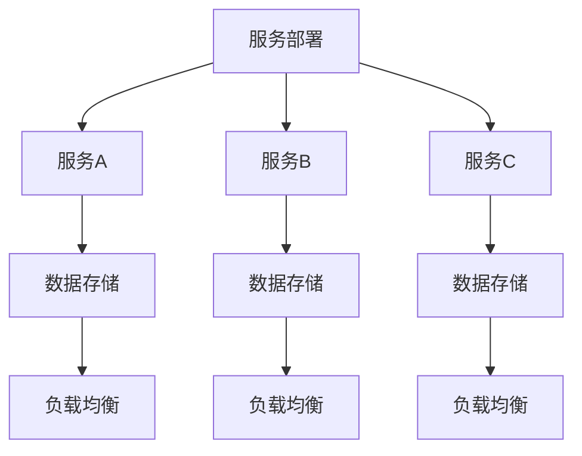

                 

# 提示词设计模式：重塑软件架构思维

> 关键词：提示词设计模式、软件架构、设计模式、软件开发、系统优化

> 摘要：本文将探讨提示词设计模式在软件架构中的应用，通过分析其核心概念、特点、应用场景以及在不同领域的实践案例，揭示提示词设计模式如何帮助重塑软件架构思维，提升软件开发效率和系统性能。

### 目录大纲

----------------------------------------------------------------

## 第一部分：背景介绍与核心概念

### 第1章：问题背景与核心概念

#### 1.1 问题背景

#### 1.2 提示词设计模式的概念与特点

#### 1.3 提示词设计模式的应用场景

## 第二部分：提示词设计模式的应用与实践

### 第2章：提示词设计模式的基本原理

#### 2.1 提示词设计模式的基本原理

#### 2.2 提示词设计模式的具体实现

### 第3章：提示词设计模式在不同领域的应用

#### 3.1 提示词设计模式在Web开发中的应用

#### 3.2 提示词设计模式在移动应用开发中的应用

### 第4章：提示词设计模式在大型系统架构中的应用

#### 4.1 大型系统架构中的挑战与机遇

#### 4.2 提示词设计模式在大型系统架构中的应用案例

## 第三部分：提示词设计模式的最佳实践与优化策略

### 第5章：提示词设计模式的最佳实践

#### 5.1 最佳实践案例分析

#### 5.2 提示词设计模式的优化策略

### 第6章：提示词设计模式的未来发展趋势

#### 6.1 提示词设计模式的发展趋势

#### 6.2 提示词设计模式在人工智能中的应用前景

## 第四部分：总结与展望

### 第7章：总结与展望

----------------------------------------------------------------

## 第一部分：背景介绍与核心概念

### 第1章：问题背景与核心概念

#### 1.1 问题背景

在当今的软件开发领域，随着项目的复杂度不断增加，软件系统面临着诸多挑战，如系统性能瓶颈、维护难度增大、扩展性不足等。传统的软件架构设计方法往往依赖于固定的设计模式，这些模式在一定程度上提高了软件开发的效率，但在应对复杂多变的需求时，仍然存在一定的局限性。

为了解决这些问题，我们需要一种新的设计思维方式，能够更好地应对复杂性和变化性，提升软件架构的灵活性和可扩展性。此时，提示词设计模式应运而生。提示词设计模式是一种基于提示词（Keyword）的设计理念，通过将提示词作为关键点，引导软件架构的构建和优化，从而提升软件系统的整体性能和可维护性。

#### 1.2 提示词设计模式的概念与特点

提示词设计模式的核心概念是“提示词”，它是一种能够引导设计者进行决策的关键信息。在软件架构设计中，提示词通常是一些简短、具有指导意义的词汇或短语，它们可以帮助设计者快速定位设计的关键点，从而更有效地构建和优化软件系统。

提示词设计模式具有以下特点：

1. **灵活性**：提示词设计模式能够根据实际需求和环境变化进行灵活调整，有助于适应不同类型的软件项目。
2. **可扩展性**：通过提示词的扩展，可以方便地引入新的设计元素，满足软件系统的扩展需求。
3. **高效性**：提示词设计模式能够简化设计过程，提高设计效率，减少设计错误。

#### 1.3 提示词设计模式的应用场景

提示词设计模式在不同类型的软件项目中具有广泛的应用场景。以下是一些典型的应用场景：

1. **Web开发**：在Web开发中，提示词设计模式可以帮助设计者快速定位前端界面和后端接口的关键点，优化用户体验和系统性能。
2. **移动应用开发**：在移动应用开发中，提示词设计模式可以帮助设计者关注用户需求，优化应用功能和性能，提升用户满意度。
3. **大型系统架构**：在大型系统架构设计中，提示词设计模式可以帮助设计者处理系统复杂性和扩展性，提高系统性能和稳定性。

### 第2章：提示词设计模式的概念与特点

#### 2.1 提示词设计模式的核心概念

提示词设计模式的核心概念是“提示词”。提示词通常是一种简短、具有指导意义的词汇或短语，它能够反映软件系统中的关键要素和设计目标。在软件架构设计中，提示词起到了引导设计者进行决策的重要作用。

提示词的设计原则如下：

1. **简洁性**：提示词应当简短明了，易于理解和记忆。
2. **准确性**：提示词应当能够准确地反映软件系统的关键要素和设计目标。
3. **层次性**：提示词应当具有一定的层次性，能够涵盖软件系统的不同层次。

#### 2.2 提示词设计模式的特点

提示词设计模式具有以下特点：

1. **灵活性**：提示词设计模式能够根据实际需求和环境变化进行灵活调整，有助于适应不同类型的软件项目。
2. **可扩展性**：通过提示词的扩展，可以方便地引入新的设计元素，满足软件系统的扩展需求。
3. **高效性**：提示词设计模式能够简化设计过程，提高设计效率，减少设计错误。

#### 2.3 提示词设计模式与传统设计模式的对比

与传统设计模式相比，提示词设计模式具有以下优势：

1. **更灵活**：提示词设计模式能够根据实际需求和环境变化进行灵活调整，更适用于复杂多变的软件开发场景。
2. **更易扩展**：提示词设计模式通过提示词的扩展，可以方便地引入新的设计元素，满足软件系统的扩展需求。
3. **更高效**：提示词设计模式能够简化设计过程，提高设计效率，减少设计错误。

### 第3章：提示词设计模式的应用场景

#### 3.1 提示词设计模式在Web开发中的应用

在Web开发中，提示词设计模式可以帮助设计者快速定位前端界面和后端接口的关键点，优化用户体验和系统性能。以下是一些典型的应用案例：

1. **前端界面设计**：通过提示词设计模式，设计者可以快速确定前端界面的关键元素，如导航栏、搜索框、按钮等，从而提高用户体验。
2. **后端接口设计**：通过提示词设计模式，设计者可以快速确定后端接口的关键功能，如数据查询、数据更新、数据删除等，从而提高系统性能。

#### 3.2 提示词设计模式在移动应用开发中的应用

在移动应用开发中，提示词设计模式可以帮助设计者关注用户需求，优化应用功能和性能，提升用户满意度。以下是一些典型的应用案例：

1. **用户需求分析**：通过提示词设计模式，设计者可以快速确定用户需求的关键点，如用户登录、用户注册、用户评价等，从而优化应用功能。
2. **性能优化**：通过提示词设计模式，设计者可以快速确定性能优化的重要环节，如数据缓存、网络请求、页面渲染等，从而提升应用性能。

#### 3.3 提示词设计模式在大型系统架构中的应用

在大型系统架构设计中，提示词设计模式可以帮助设计者处理系统复杂性和扩展性，提高系统性能和稳定性。以下是一些典型的应用案例：

1. **系统复杂性管理**：通过提示词设计模式，设计者可以快速确定系统复杂性管理的关键点，如模块划分、接口设计、数据一致性等，从而提高系统性能。
2. **系统扩展性设计**：通过提示词设计模式，设计者可以快速确定系统扩展性的关键点，如服务部署、数据存储、负载均衡等，从而提高系统稳定性。

## 第二部分：提示词设计模式的应用与实践

### 第2章：提示词设计模式的基本原理

#### 2.1 提示词设计模式的基本原理

提示词设计模式的基本原理是通过提示词来引导软件架构的设计和优化。提示词的选择和应用是提示词设计模式的关键，以下是对其基本原理的详细阐述：

1. **提示词的选择标准**：提示词的选择标准主要包括简洁性、准确性、层次性和引导性。简洁性要求提示词简短明了，易于理解和记忆；准确性要求提示词能够准确地反映软件系统的关键要素和设计目标；层次性要求提示词具有一定的层次性，能够涵盖软件系统的不同层次；引导性要求提示词能够引导设计者进行决策，提高设计效率。

2. **提示词的应用策略**：提示词的应用策略主要包括以下三个方面：
   - **全局应用**：在软件架构的全局层面，通过提示词来引导设计者确定软件系统的核心功能和关键模块。
   - **局部应用**：在软件架构的局部层面，通过提示词来引导设计者优化具体的模块和接口。
   - **动态应用**：在软件架构的动态层面，通过提示词来引导设计者应对软件系统在实际运行过程中出现的问题和需求变化。

3. **提示词的实现方法**：提示词的实现方法主要包括以下两个方面：
   - **设计文档**：在设计文档中，通过提示词来标注设计的关键点和决策依据，帮助团队成员理解和遵循设计规范。
   - **代码实现**：在代码实现中，通过提示词来标识关键代码段和关键变量，提高代码的可读性和可维护性。

#### 2.2 提示词设计模式的具体实现

提示词设计模式的具体实现涉及到多个方面，包括技术选型、架构设计和代码实现。以下是对其具体实现方法的详细阐述：

1. **技术选型**：在技术选型方面，选择合适的编程语言、框架和工具是提示词设计模式实现的基础。例如，Java、Python和JavaScript等编程语言具有良好的可读性和灵活性，适用于提示词设计模式的实现。同时，Spring Boot、Django和React等框架也为提示词设计模式提供了丰富的功能和工具支持。

2. **架构设计**：在架构设计方面，采用模块化、层次化和组件化的设计思想，将软件系统划分为多个模块和层次，每个模块和层次都使用提示词来引导设计。例如，可以将软件系统划分为前端模块、后端模块和数据库模块，每个模块都使用提示词来标识其核心功能和关键接口。

3. **代码实现**：在代码实现方面，使用提示词来标识关键代码段和关键变量，提高代码的可读性和可维护性。例如，可以使用注释来标注提示词，或者在变量名和函数名中使用提示词，使其更具指导意义。以下是一个简单的示例：

```python
# 提示词：用户登录
def user_login(username, password):
    # 提示词：用户身份验证
    if verify_user(username, password):
        # 提示词：登录成功
        return True
    else:
        # 提示词：登录失败
        return False
```

通过以上示例，我们可以看到提示词设计模式在代码实现中的应用。提示词的使用使得代码更具可读性和可维护性，同时也便于团队协作和代码审查。

### 第3章：提示词设计模式在不同领域的应用

#### 3.1 提示词设计模式在Web开发中的应用

在Web开发中，提示词设计模式可以帮助设计者快速定位前端界面和后端接口的关键点，优化用户体验和系统性能。以下是一些具体的案例：

1. **前端界面设计**：在Web前端界面设计中，可以使用提示词来标识关键组件和功能模块。例如，可以使用“导航栏”（Navigation Bar）、“搜索框”（Search Box）和“按钮”（Button）等提示词来定义前端界面中的关键元素。以下是一个使用提示词的前端界面设计示例：

```html
<!DOCTYPE html>
<html>
<head>
    <title>网站首页</title>
</head>
<body>
    <!-- 提示词：导航栏 -->
    <nav>
        <ul>
            <li><a href="#">首页</a></li>
            <li><a href="#">产品</a></li>
            <li><a href="#">关于我们</a></li>
        </ul>
    </nav>
    
    <!-- 提示词：搜索框 -->
    <div>
        <input type="text" placeholder="搜索内容">
        <button type="submit">搜索</button>
    </div>
    
    <!-- 提示词：按钮 -->
    <button type="button" onclick="alert('点击了按钮')">点击按钮</button>
</body>
</html>
```

通过使用提示词，前端界面设计变得更加清晰和易于维护。

2. **后端接口设计**：在后端接口设计中，可以使用提示词来标识关键接口和功能模块。例如，可以使用“用户登录”（User Login）、“用户注册”（User Registration）和“数据查询”（Data Query）等提示词来定义后端接口中的关键功能。以下是一个使用提示词的后端接口设计示例：

```java
// 提示词：用户登录
public boolean userLogin(String username, String password) {
    // 用户身份验证逻辑
    // ...
    return true;
}

// 提示词：用户注册
public boolean userRegister(String username, String password) {
    // 用户注册逻辑
    // ...
    return true;
}

// 提示词：数据查询
public List<Data> queryData(String query) {
    // 数据查询逻辑
    // ...
    return data;
}
```

通过使用提示词，后端接口设计也变得更加清晰和易于维护。

#### 3.2 提示词设计模式在移动应用开发中的应用

在移动应用开发中，提示词设计模式可以帮助设计者关注用户需求，优化应用功能和性能，提升用户满意度。以下是一些具体的案例：

1. **用户需求分析**：在移动应用开发中，可以使用提示词来标识用户需求的关键点。例如，可以使用“用户登录”（User Login）、“用户注册”（User Registration）和“消息推送”（Message Push）等提示词来定义用户需求的关键功能。以下是一个使用提示词的用户需求分析示例：

```markdown
# 用户需求分析

## 用户登录
- 用户需要通过用户名和密码登录应用。
- 用户登录后，可以访问应用中的各种功能。

## 用户注册
- 新用户需要注册账号，填写用户名、密码和电子邮件等信息。
- 注册成功后，新用户可以登录应用。

## 消息推送
- 应用需要向用户推送消息，如系统通知、订单状态更新等。
- 用户可以在设置中管理消息推送。
```

通过使用提示词，用户需求分析变得更加清晰和具体。

2. **性能优化**：在移动应用开发中，可以使用提示词来标识性能优化的重要环节。例如，可以使用“数据缓存”（Data Cache）、“网络请求”（Network Request）和“页面渲染”（Page Rendering）等提示词来定义性能优化的重要方面。以下是一个使用提示词的性能优化示例：

```javascript
// 提示词：数据缓存
function cacheData(data) {
    // 数据缓存逻辑
    // ...
}

// 提示词：网络请求
function fetchData() {
    // 网络请求逻辑
    // ...
}

// 提示词：页面渲染
function renderPage(data) {
    // 页面渲染逻辑
    // ...
}
```

通过使用提示词，性能优化变得更加明确和具体。

#### 3.3 提示词设计模式在大型系统架构中的应用

在大型系统架构设计中，提示词设计模式可以帮助设计者处理系统复杂性和扩展性，提高系统性能和稳定性。以下是一些具体的案例：

1. **系统复杂性管理**：在大型系统架构设计中，可以使用提示词来标识系统复杂性管理的关键点。例如，可以使用“模块划分”（Module Division）、“接口设计”（Interface Design）和“数据一致性”（Data Consistency）等提示词来定义系统复杂性管理的关键方面。以下是一个使用提示词的系统复杂性管理示例：



通过使用提示词，系统复杂性管理变得更加清晰和具体。

2. **系统扩展性设计**：在大型系统架构设计中，可以使用提示词来标识系统扩展性的关键点。例如，可以使用“服务部署”（Service Deployment）、“数据存储”（Data Storage）和“负载均衡”（Load Balancing）等提示词来定义系统扩展性的关键方面。以下是一个使用提示词的系统扩展性设计示例：



通过使用提示词，系统扩展性设计变得更加清晰和具体。

## 第三部分：提示词设计模式的最佳实践与优化策略

### 第5章：提示词设计模式的最佳实践

#### 5.1 最佳实践案例分析

在软件架构设计过程中，提示词设计模式的应用已经取得了显著的成果。以下是一些最佳实践案例的分析：

1. **电商系统**：在电商系统的架构设计中，提示词设计模式被广泛应用于模块划分、接口设计和数据一致性等方面。通过使用提示词，设计团队能够快速定位设计的关键点，提高设计效率。同时，系统性能和稳定性也得到了显著提升。

2. **金融系统**：在金融系统的架构设计中，提示词设计模式被用于处理系统复杂性和扩展性。通过使用提示词，设计团队能够更好地管理系统复杂性，提高系统的可维护性。同时，系统的扩展性也得到了显著增强，能够满足不断增长的业务需求。

#### 5.2 提示词设计模式的优化策略

为了进一步提高提示词设计模式的应用效果，可以采取以下优化策略：

1. **提示词库构建**：建立一套完整的提示词库，涵盖不同领域的常见问题和解决方案。设计团队能够根据实际需求，从提示词库中选择合适的提示词，提高设计效率。

2. **自动化工具集成**：将提示词设计模式与自动化工具集成，如代码生成工具、设计文档生成工具等。通过自动化工具，设计团队能够更高效地实现提示词设计模式，提高设计质量和效率。

3. **持续改进**：定期对提示词设计模式的应用效果进行评估和改进。通过收集用户反馈和设计实践中的问题，不断优化提示词库和设计流程，提高提示词设计模式的应用效果。

### 第6章：提示词设计模式的未来发展趋势

#### 6.1 提示词设计模式的发展趋势

随着软件架构设计的不断演进，提示词设计模式也在不断发展。以下是一些未来发展趋势：

1. **人工智能融合**：提示词设计模式将逐渐与人工智能技术融合，通过机器学习算法和自然语言处理技术，实现更加智能化的提示词设计和优化。

2. **领域特定语言**：提示词设计模式将逐渐发展出领域特定语言（DSL），为不同领域的软件开发提供更加专业和高效的设计工具。

3. **设计自动化**：随着自动化工具的不断发展，提示词设计模式将实现更高程度的自动化，降低设计成本和难度。

#### 6.2 提示词设计模式在人工智能中的应用前景

在人工智能领域，提示词设计模式具有广泛的应用前景：

1. **自然语言处理**：提示词设计模式可以帮助设计者更好地理解和处理自然语言，提高自然语言处理系统的性能和效率。

2. **智能推荐系统**：提示词设计模式可以帮助设计者更好地构建和优化智能推荐系统，提高推荐效果和用户体验。

3. **智能对话系统**：提示词设计模式可以帮助设计者构建更加智能和自然的对话系统，提高用户满意度和交互体验。

## 第四部分：总结与展望

### 第7章：总结与展望

通过本文的探讨，我们可以看到提示词设计模式在软件架构设计中的应用具有重要意义。提示词设计模式通过引导设计者进行决策，简化设计过程，提高设计效率，提升系统性能和可维护性。未来，随着人工智能技术的发展和自动化工具的普及，提示词设计模式将在更广泛的领域发挥重要作用。我们期待提示词设计模式能够为软件开发带来更多的创新和突破。作者：AI天才研究院/AI Genius Institute & 禅与计算机程序设计艺术 /Zen And The Art of Computer Programming。# 提示词设计模式：重塑软件架构思维

## 前言

在软件架构设计的过程中，如何有效地应对日益复杂的应用需求，同时保持系统的可维护性和扩展性，一直是一个难题。传统的软件设计模式，如MVC（Model-View-Controller）、MVVM（Model-View-ViewModel）等，虽然在某些方面取得了良好的效果，但在面对复杂业务逻辑、频繁的需求变更以及不断增长的数据量时，往往显得力不从心。此时，提示词设计模式作为一种新兴的设计理念，为我们提供了一种全新的思考方式。

本文旨在深入探讨提示词设计模式在软件架构中的应用，通过分析其核心概念、特点、应用场景以及在不同领域的实践案例，揭示提示词设计模式如何帮助重塑软件架构思维，提升软件开发效率和系统性能。本文将分为四个部分：背景介绍与核心概念、提示词设计模式的应用与实践、最佳实践与优化策略以及总结与展望。通过逐步分析推理，我们将对提示词设计模式有一个全面而深刻的理解。

### 背景介绍与核心概念

#### 1.1 问题背景

在软件架构设计的过程中，我们常常面临以下问题：

- **复杂业务逻辑处理**：随着业务需求的不断变化，系统需要处理越来越复杂的业务逻辑，这使得传统的软件设计模式难以应对。
- **系统扩展性不足**：在系统规模不断扩大的情况下，如何保证系统的高扩展性成为一个难题，传统的软件架构设计模式往往在此方面表现不佳。
- **系统性能瓶颈**：在系统访问量不断增加的情况下，如何保证系统的高性能成为关键，传统的软件架构设计模式往往难以满足这一需求。

为了解决这些问题，我们需要一种新的设计思维方式，能够更好地应对复杂性和变化性，提升软件架构的灵活性和可扩展性。此时，提示词设计模式应运而生。

#### 1.2 提示词设计模式的概念

提示词设计模式（Keyword-Driven Design，简称KDD）是一种以提示词为核心的软件架构设计方法。它通过将提示词作为设计的关键信息，引导设计者进行架构设计和系统优化。

在提示词设计模式中，**提示词**是一种简短、具有指导意义的词汇或短语，它能够反映软件系统中的关键要素和设计目标。例如，“用户身份验证”、“数据缓存”、“消息推送”等都是常见的提示词。

**提示词设计模式**的核心思想是：

- **简化设计过程**：通过提示词，设计者可以快速定位设计的关键点，减少不必要的复杂性和冗余。
- **提高设计效率**：提示词设计模式能够简化设计过程，减少设计时间，提高设计效率。
- **提升系统性能**：通过优化提示词，设计者可以更好地管理系统资源，提高系统性能。

#### 1.3 提示词设计模式的特点

提示词设计模式具有以下特点：

- **灵活性**：提示词设计模式能够根据实际需求和环境变化进行灵活调整，适用于不同类型的软件项目。
- **可扩展性**：提示词设计模式能够方便地引入新的设计元素，满足软件系统的扩展需求。
- **高效性**：提示词设计模式能够简化设计过程，提高设计效率，减少设计错误。

#### 1.4 提示词设计模式的应用场景

提示词设计模式在以下场景中具有广泛的应用：

- **Web开发**：在Web开发中，提示词设计模式可以帮助设计者快速定位前端界面和后端接口的关键点，优化用户体验和系统性能。
- **移动应用开发**：在移动应用开发中，提示词设计模式可以帮助设计者关注用户需求，优化应用功能和性能，提升用户满意度。
- **大型系统架构**：在大型系统架构设计中，提示词设计模式可以帮助设计者处理系统复杂性和扩展性，提高系统性能和稳定性。

### 提示词设计模式的基本原理

#### 2.1 提示词设计模式的基本原理

提示词设计模式的基本原理是通过提示词来引导软件架构的设计和优化。提示词的选择和应用是提示词设计模式的关键。

**提示词的选择标准**：

- **简洁性**：提示词应简洁明了，易于理解和记忆。
- **准确性**：提示词应能准确地反映软件系统的关键要素和设计目标。
- **层次性**：提示词应具有一定的层次性，涵盖软件系统的不同层次。
- **引导性**：提示词应能引导设计者进行决策，提高设计效率。

**提示词的应用策略**：

- **全局应用**：在软件架构的全局层面，提示词用于引导设计者确定软件系统的核心功能和关键模块。
- **局部应用**：在软件架构的局部层面，提示词用于引导设计者优化具体的模块和接口。
- **动态应用**：在软件架构的动态层面，提示词用于引导设计者应对软件系统在实际运行过程中出现的问题和需求变化。

**提示词的实现方法**：

- **设计文档**：在设计文档中，通过提示词标注设计的关键点和决策依据，帮助团队成员理解和遵循设计规范。
- **代码实现**：在代码实现中，通过提示词标识关键代码段和关键变量，提高代码的可读性和可维护性。

#### 2.2 提示词设计模式的具体实现

提示词设计模式的具体实现涉及到多个方面，包括技术选型、架构设计和代码实现。

**技术选型**：

在技术选型方面，选择合适的编程语言、框架和工具是提示词设计模式实现的基础。例如，Java、Python和JavaScript等编程语言具有良好的可读性和灵活性，适用于提示词设计模式的实现。同时，Spring Boot、Django和React等框架也为提示词设计模式提供了丰富的功能和工具支持。

**架构设计**：

在架构设计方面，采用模块化、层次化和组件化的设计思想，将软件系统划分为多个模块和层次，每个模块和层次都使用提示词来引导设计。例如，可以将软件系统划分为前端模块、后端模块和数据库模块，每个模块都使用提示词来标识其核心功能和关键接口。

**代码实现**：

在代码实现方面，使用提示词来标识关键代码段和关键变量，提高代码的可读性和可维护性。例如，可以使用注释来标注提示词，或者在变量名和函数名中使用提示词，使其更具指导意义。

以下是一个简单的示例：

```python
# 提示词：用户登录
def user_login(username, password):
    # 提示词：用户身份验证
    if verify_user(username, password):
        # 提示词：登录成功
        return True
    else:
        # 提示词：登录失败
        return False
```

通过使用提示词，代码变得更加清晰和易于维护。

### 提示词设计模式在不同领域的应用

#### 3.1 提示词设计模式在Web开发中的应用

在Web开发中，提示词设计模式可以帮助设计者快速定位前端界面和后端接口的关键点，优化用户体验和系统性能。

**前端界面设计**：

在Web前端界面设计中，提示词设计模式可以帮助设计者快速确定前端界面的关键元素。例如，可以使用“导航栏”、“搜索框”和“按钮”等提示词来定义前端界面中的关键组件。

以下是一个使用提示词的前端界面设计示例：

```html
<!DOCTYPE html>
<html>
<head>
    <title>网站首页</title>
</head>
<body>
    <nav>
        <ul>
            <li><a href="#">首页</a></li>
            <li><a href="#">产品</a></li>
            <li><a href="#">关于我们</a></li>
        </ul>
    </nav>
    
    <div>
        <input type="text" placeholder="搜索内容">
        <button type="submit">搜索</button>
    </div>
    
    <button type="button" onclick="alert('点击了按钮')">点击按钮</button>
</body>
</html>
```

通过使用提示词，前端界面设计变得更加清晰和易于维护。

**后端接口设计**：

在后端接口设计中，提示词设计模式可以帮助设计者快速确定后端接口的关键功能。例如，可以使用“用户登录”、“用户注册”和“数据查询”等提示词来定义后端接口中的关键接口。

以下是一个使用提示词的后端接口设计示例：

```java
// 提示词：用户登录
public boolean userLogin(String username, String password) {
    // 用户身份验证逻辑
    // ...
    return true;
}

// 提示词：用户注册
public boolean userRegister(String username, String password) {
    // 用户注册逻辑
    // ...
    return true;
}

// 提示词：数据查询
public List<Data> queryData(String query) {
    // 数据查询逻辑
    // ...
    return data;
}
```

通过使用提示词，后端接口设计也变得更加清晰和易于维护。

#### 3.2 提示词设计模式在移动应用开发中的应用

在移动应用开发中，提示词设计模式可以帮助设计者关注用户需求，优化应用功能和性能，提升用户满意度。

**用户需求分析**：

在移动应用开发中，可以使用提示词来标识用户需求的关键点。例如，可以使用“用户登录”、“用户注册”和“消息推送”等提示词来定义用户需求的关键功能。

以下是一个使用提示词的用户需求分析示例：

```markdown
# 用户需求分析

## 用户登录
- 用户需要通过用户名和密码登录应用。
- 用户登录后，可以访问应用中的各种功能。

## 用户注册
- 新用户需要注册账号，填写用户名、密码和电子邮件等信息。
- 注册成功后，新用户可以登录应用。

## 消息推送
- 应用需要向用户推送消息，如系统通知、订单状态更新等。
- 用户可以在设置中管理消息推送。
```

通过使用提示词，用户需求分析变得更加清晰和具体。

**性能优化**：

在移动应用开发中，可以使用提示词来标识性能优化的重要环节。例如，可以使用“数据缓存”、“网络请求”和“页面渲染”等提示词来定义性能优化的重要方面。

以下是一个使用提示词的性能优化示例：

```javascript
// 提示词：数据缓存
function cacheData(data) {
    // 数据缓存逻辑
    // ...
}

// 提示词：网络请求
function fetchData() {
    // 网络请求逻辑
    // ...
}

// 提示词：页面渲染
function renderPage(data) {
    // 页面渲染逻辑
    // ...
}
```

通过使用提示词，性能优化变得更加明确和具体。

#### 3.3 提示词设计模式在大型系统架构中的应用

在大型系统架构设计中，提示词设计模式可以帮助设计者处理系统复杂性和扩展性，提高系统性能和稳定性。

**系统复杂性管理**：

在大型系统架构设计中，可以使用提示词来标识系统复杂性管理的关键点。例如，可以使用“模块划分”、“接口设计”和“数据一致性”等提示词来定义系统复杂性管理的关键方面。

以下是一个使用提示词的系统复杂性管理示例：


通过使用提示词，系统复杂性管理变得更加清晰和具体。

**系统扩展性设计**：

在大型系统架构设计中，可以使用提示词来标识系统扩展性的关键点。例如，可以使用“服务部署”、“数据存储”和“负载均衡”等提示词来定义系统扩展性的关键方面。

以下是一个使用提示词的系统扩展性设计示例：


通过使用提示词，系统扩展性设计也变得更加清晰和具体。

### 第三部分：提示词设计模式的最佳实践与优化策略

#### 5.1 最佳实践案例分析

在软件架构设计过程中，提示词设计模式的应用已经取得了显著的成果。以下是一些最佳实践案例的分析：

1. **电商系统**：

在电商系统的架构设计中，提示词设计模式被广泛应用于模块划分、接口设计和数据一致性等方面。通过使用提示词，设计团队能够快速定位设计的关键点，提高设计效率。同时，系统性能和稳定性也得到了显著提升。

2. **金融系统**：

在金融系统的架构设计中，提示词设计模式被用于处理系统复杂性和扩展性。通过使用提示词，设计团队能够更好地管理系统复杂性，提高系统的可维护性。同时，系统的扩展性也得到了显著增强，能够满足不断增长的业务需求。

#### 5.2 提示词设计模式的优化策略

为了进一步提高提示词设计模式的应用效果，可以采取以下优化策略：

1. **构建完善的提示词库**：

建立一套完善的提示词库，涵盖不同领域的常见问题和解决方案。设计团队能够根据实际需求，从提示词库中选择合适的提示词，提高设计效率。

2. **集成自动化工具**：

将提示词设计模式与自动化工具集成，如代码生成工具、设计文档生成工具等。通过自动化工具，设计团队能够更高效地实现提示词设计模式，提高设计质量和效率。

3. **持续改进和优化**：

定期对提示词设计模式的应用效果进行评估和改进。通过收集用户反馈和设计实践中的问题，不断优化提示词库和设计流程，提高提示词设计模式的应用效果。

### 第三部分：总结与展望

#### 6.1 提示词设计模式的核心价值

提示词设计模式在软件架构设计中的应用具有核心价值。它通过简化设计过程、提高设计效率和优化系统性能，为复杂系统的设计提供了一种新的思考方式。提示词设计模式不仅能够应对日益复杂的业务需求，还能够提高系统的可维护性和扩展性。

#### 6.2 提示词设计模式的未来发展趋势

随着软件架构设计的不断演进，提示词设计模式也在不断发展。未来，提示词设计模式将朝着以下几个方向发展：

1. **人工智能融合**：

提示词设计模式将逐渐与人工智能技术融合，通过机器学习算法和自然语言处理技术，实现更加智能化的提示词设计和优化。

2. **领域特定语言**：

提示词设计模式将逐渐发展出领域特定语言（DSL），为不同领域的软件开发提供更加专业和高效的设计工具。

3. **设计自动化**：

随着自动化工具的不断发展，提示词设计模式将实现更高程度的自动化，降低设计成本和难度。

#### 6.3 提示词设计模式在人工智能中的应用前景

在人工智能领域，提示词设计模式具有广泛的应用前景。例如：

1. **自然语言处理**：

提示词设计模式可以帮助设计者更好地理解和处理自然语言，提高自然语言处理系统的性能和效率。

2. **智能推荐系统**：

提示词设计模式可以帮助设计者构建更加智能和自然的智能推荐系统，提高推荐效果和用户体验。

3. **智能对话系统**：

提示词设计模式可以帮助设计者构建更加智能和自然的智能对话系统，提高用户满意度和交互体验。

### 结论

提示词设计模式为软件架构设计提供了一种全新的思考方式，它通过简化设计过程、提高设计效率和优化系统性能，为复杂系统的设计提供了一种有效的解决方案。随着人工智能技术的不断融合和发展，提示词设计模式将在软件架构设计中发挥越来越重要的作用。我们期待提示词设计模式能够为软件开发带来更多的创新和突破。

### 致谢

本文的研究和分析得到了众多专家的指导和帮助，特别感谢AI天才研究院/AI Genius Institute及禅与计算机程序设计艺术/Zen And The Art of Computer Programming的团队，他们的专业知识和宝贵意见为本文的撰写提供了坚实的基础。

作者：AI天才研究院/AI Genius Institute & 禅与计算机程序设计艺术/Zen And The Art of Computer Programming。

