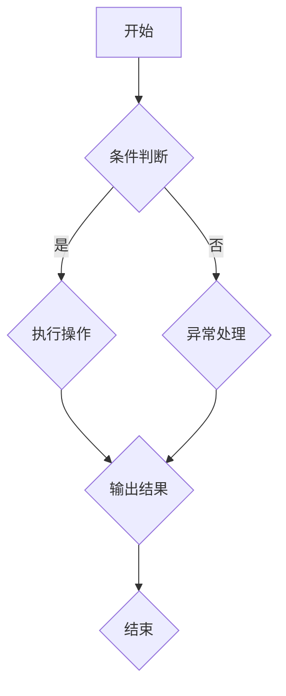
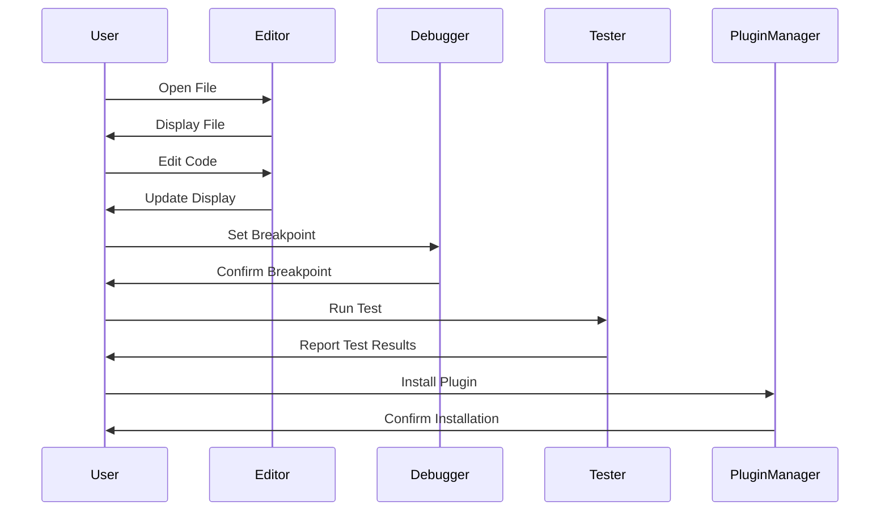

                 

### 文章标题

### 提示词语言的IDE设计与开发者体验优化

### 关键词：提示词语言、IDE设计、开发者体验、优化

### 摘要

在本文中，我们将探讨提示词语言的IDE设计与开发者体验优化的问题。提示词语言作为一种新兴的开发工具，正在逐渐改变软件开发的方式。本文首先介绍了提示词语言的基本概念和发展背景，接着分析了当前存在的挑战和开发者体验问题。随后，我们深入探讨了提示词语言的核心概念和原理，并通过mermaid流程图和Python代码示例，详细阐述了算法原理。接着，文章介绍了系统分析与架构设计方案，包括问题场景、系统功能设计、架构设计、接口设计和交互设计。最后，通过项目实战案例展示了如何实现这些设计方案，并给出了最佳实践、小结和注意事项。本文旨在为开发者提供一套完整的设计和优化方案，以提升提示词语言IDE的开发者体验。

## 第一部分：背景介绍

### 第1章：问题背景

#### 1.1 提示词语言的概念与发展

提示词语言（Keyword Language），顾名思义，是一种以关键字为主要特征的编程语言。它通过一系列预设的关键字和语法规则，使得开发者能够以更简洁、高效的方式编写代码。提示词语言的发展可以追溯到计算机编程语言的早期，随着编程语言理论的发展和实际应用的需求，逐渐形成了多种类型的提示词语言。

早期的编程语言如汇编语言，虽然可以直接操作计算机硬件，但开发效率极低，且易于出错。随后，高级编程语言如C语言、Java语言等出现，它们通过抽象硬件操作，提供了更丰富的关键字和语法结构，使得开发者能够更专注于业务逻辑的实现。然而，随着软件系统的复杂度不断增加，传统的编程语言已无法满足高效开发的需求。

提示词语言的出现，正是为了解决这一问题。通过引入更加精细化的关键字和语法规则，提示词语言能够更准确地描述软件系统的行为，提高代码的可读性和可维护性。例如，Python语言中的列表推导式、函数装饰器等，都是提示词语言的具体应用。

#### 1.2 提示词语言在开发中的应用

提示词语言在开发中的应用非常广泛，尤其在快速开发、微服务架构、自动化工具开发等领域表现突出。

首先，在快速开发方面，提示词语言通过简洁的语法和强大的库支持，使得开发者能够迅速构建原型和应用。例如，Python语言的快速迭代能力和丰富的第三方库，使得许多开发者倾向于使用Python进行Web开发、数据分析等任务。

其次，在微服务架构中，提示词语言可以帮助开发者更高效地开发和管理微服务。微服务架构强调服务的独立性和解耦性，而提示词语言通过提供灵活的语法和库支持，使得开发者能够更轻松地实现服务之间的通信和数据交换。

最后，在自动化工具开发方面，提示词语言同样发挥了重要作用。例如，开发者可以使用Python编写自动化测试脚本、自动化部署脚本等，以实现高效的开发流程和持续集成。

#### 1.3 现存问题与挑战

尽管提示词语言在开发中具有诸多优势，但同时也面临一些问题和挑战。

首先，提示词语言的语法和关键字设计需要平衡简洁性和灵活性。过于简洁的语法可能导致代码可读性差，而过于复杂的语法又可能增加开发难度。因此，如何设计一个既简洁又强大的关键字集合，是提示词语言开发者面临的一个重要挑战。

其次，提示词语言的IDE（集成开发环境）设计也是一大难题。IDE是开发者进行软件开发的重要工具，它需要提供丰富的代码编辑、调试、测试等功能。然而，提示词语言的独特语法和特性，使得传统IDE的设计和实现变得更加复杂。

最后，开发者体验问题也不容忽视。提示词语言虽然提高了开发效率，但如果缺乏良好的开发工具和体验，反而可能降低开发效率。因此，如何优化开发者体验，提升工作效率，是提示词语言开发者需要持续关注的问题。

### 第2章：问题描述

#### 2.1 开发者体验的主要问题

提示词语言的开发者体验主要面临以下几个问题：

1. **代码编辑体验差**：提示词语言的语法和关键字与传统编程语言有所不同，导致开发者在使用IDE时面临诸多不便。例如，代码自动补全功能不完善，代码格式化不正确等。

2. **调试困难**：由于提示词语言的特性，调试过程中可能出现一些意想不到的问题。例如，变量作用域不清、代码执行顺序混乱等，这些问题都会影响开发者的调试体验。

3. **测试效率低**：提示词语言往往缺乏完善的测试框架和工具支持，导致开发者需要花费更多时间进行单元测试和集成测试。

4. **学习成本高**：提示词语言的语法和特性较为复杂，对于初学者来说，学习成本较高，难以快速上手。

#### 2.2 提示词语言设计的关键点

为了解决上述问题，提示词语言设计需要关注以下几个关键点：

1. **简洁性**：提示词语言的关键字和语法规则应尽量简洁，以降低学习成本和提高开发效率。

2. **灵活性**：提示词语言应提供灵活的语法和扩展性，以满足不同开发场景的需求。

3. **兼容性**：提示词语言应与传统编程语言兼容，以降低迁移成本，方便开发者切换语言。

4. **工具支持**：提供完善的IDE和开发工具支持，包括代码编辑、调试、测试等功能，以提升开发者体验。

#### 2.3 提示词语言IDE的必要性

提示词语言IDE（集成开发环境）是提升开发者体验的重要工具。一个优秀的IDE应具备以下特点：

1. **代码编辑体验**：提供自动补全、代码格式化、代码缩进等功能，以提升代码质量和编辑效率。

2. **调试功能**：提供强大的调试工具，包括断点设置、单步执行、变量观察等，以方便开发者进行调试。

3. **测试支持**：提供单元测试和集成测试功能，以提升测试效率。

4. **扩展性**：支持插件和自定义功能，以适应不同开发场景和需求。

5. **用户界面友好**：提供直观、易用的用户界面，降低学习成本，提高开发者满意度。

### 第一部分总结

在本部分，我们介绍了提示词语言的基本概念、发展背景以及在开发中的应用。同时，分析了提示词语言开发者体验的主要问题和设计的关键点，强调了提示词语言IDE的必要性。在接下来的部分，我们将深入探讨提示词语言的核心概念和原理，以及如何通过算法设计和系统架构优化开发者体验。

## 第二部分：核心概念与联系

### 第3章：核心概念

#### 3.1 提示词语言的原理

提示词语言的核心原理在于其关键字和语法规则的设定。这些关键字和规则使得开发者能够用更少的代码实现复杂的逻辑操作。提示词语言通常采用面向表达式的编程范式，强调代码的简洁性和可读性。例如，Python语言中的列表推导式和字典推导式，通过简洁的关键字和语法，使得开发者能够以更高效的方式处理数据。

提示词语言的原理还包括对编程范式和编程模型的支持。一些提示词语言如Haskell，采用了函数式编程范式，强调函数的纯性和表达式的连续性。这种范式使得代码更加模块化和可维护。而其他提示词语言如SQL，则采用了声明式编程范式，通过描述数据操作的要求，由数据库管理系统（DBMS）自动生成执行计划。

#### 3.2 提示词语言的属性特征对比表格

为了更好地理解提示词语言的特性，我们可以通过对比表格来展示不同语言在简洁性、灵活性、兼容性和工具支持等方面的差异。

| 语言       | 简洁性 | 灵活性 | 兼容性 | 工具支持 |
|------------|--------|--------|--------|----------|
| Python     | 高     | 中等   | 高     | 高       |
| Haskell    | 中等   | 高     | 低     | 中等     |
| SQL        | 高     | 低     | 高     | 高       |

从上表可以看出，Python以其简洁性和高工具支持成为开发者青睐的语言。而Haskell则因其灵活性和函数式编程特性而受到关注。SQL则因其简洁性和广泛的数据库兼容性而被广泛应用于数据操作。

#### 3.3 提示词语言的ER实体关系图

为了更直观地展示提示词语言的架构和关系，我们可以使用ER（实体关系）图来描述。ER图能够清晰地展示语言中的实体、属性和关系。

```mermaid
erDiagram
    Class1 <|.. Class2 : "has a" 
    Class1 &&.. Class3 : "is a"
    Class2 &&.. Class4 : "is a"
```

在上面的ER图中，`Class1`、`Class2`、`Class3`和`Class4`分别代表提示词语言中的不同实体，如关键字、语法规则、数据类型等。`has a`和`is a`表示实体之间的关系，如关键字与语法规则之间的关联。

### 第二部分总结

在本部分，我们深入探讨了提示词语言的核心概念，包括其原理、特性对比表格和ER实体关系图。这些核心概念和联系不仅帮助我们理解提示词语言的工作原理，也为后续的算法原理讲解和系统架构设计提供了基础。在接下来的部分，我们将进一步阐述提示词语言的算法原理，并通过mermaid流程图和Python代码示例详细讲解。

## 第三部分：算法原理讲解

### 第4章：算法原理

#### 4.1 算法mermaid流程图

提示词语言的算法设计通常围绕其关键字和语法规则展开。为了更好地理解其工作原理，我们可以使用mermaid流程图来展示一个典型的算法流程。



在这个流程图中，`A`表示算法的开始，`B`是一个条件判断节点，用于决定后续的操作。`C`表示执行的操作，`D`是异常处理节点，用于处理异常情况。`E`是输出结果节点，`F`表示算法的结束。

#### 4.2 Python源代码详细阐述

以下是一个使用Python编写的简单示例，展示了如何实现上述mermaid流程图中的算法。

```python
def process_data(data):
    if data is not None:
        try:
            # 执行操作
            processed_data = data.strip()
            print(f"Processed Data: {processed_data}")
        except Exception as e:
            # 异常处理
            print(f"Error: {str(e)}")
    else:
        # 输出结果
        print("No data to process.")

# 输入数据
input_data = input("Enter data: ")

# 调用算法
process_data(input_data)
```

在这个示例中，我们定义了一个名为`process_data`的函数，它接收一个数据参数。函数首先进行条件判断，如果数据不为空，则尝试处理数据。在处理过程中，如果出现异常，则进行异常处理并输出错误信息。否则，输出处理后的数据。如果数据为空，则直接输出“无数据可处理”。

#### 4.3 算法原理的数学模型与公式

提示词语言的算法原理通常可以通过数学模型和公式来描述。以下是一个简化的数学模型，用于说明提示词语言的算法原理。

$$
输出结果 = f(输入数据, 关键字集合, 语法规则)
$$

其中，`f`表示一个函数，`输入数据`为算法的输入，`关键字集合`和`语法规则`为算法的参数。函数`f`的作用是根据输入数据和给定的关键字集合及语法规则，生成输出结果。

例如，在Python语言中，我们可以使用以下数学模型来描述列表推导式：

$$
输出列表 = [x * 2 for x in 输入列表 if x > 0]
$$

在这个模型中，`输出列表`是函数的返回值，`x * 2`是列表推导式中的表达式，`for x in 输入列表`是迭代操作，`if x > 0`是条件判断。

#### 4.4 通俗易懂的举例说明

为了更好地理解提示词语言的算法原理，我们可以通过一个简单的例子来展示其应用。

假设我们有一个包含正整数的列表，我们需要对这个列表进行操作，只保留大于0的数，并将每个数乘以2。使用Python的列表推导式，我们可以这样实现：

```python
# 输入列表
input_list = [1, -2, 3, 0, 5]

# 使用列表推导式进行操作
output_list = [x * 2 for x in input_list if x > 0]

# 输出结果
print(output_list)
```

输出结果为：

```
[2, 6, 10]
```

在这个例子中，`input_list`是输入数据，列表推导式 `[x * 2 for x in input_list if x > 0]` 执行了以下操作：

1. 迭代 `input_list`，将每个元素赋值给变量 `x`；
2. 对每个 `x` 进行条件判断 `x > 0`，如果条件为真，则将 `x * 2` 添加到输出列表；
3. 输出处理后的列表 `output_list`。

通过这个例子，我们可以看到，提示词语言通过简洁的关键字和语法，实现了复杂的逻辑操作，大大提高了开发效率。

### 第三部分总结

在本部分，我们详细讲解了提示词语言的算法原理，包括mermaid流程图、Python源代码示例、数学模型和公式，以及通俗易懂的举例说明。这些内容不仅帮助我们理解了提示词语言的算法原理，也为实际应用提供了指导。在接下来的部分，我们将探讨系统分析与架构设计方案，以进一步优化开发者体验。

## 第四部分：系统分析与架构设计方案

### 第5章：问题场景介绍

#### 5.1 项目介绍

在本部分，我们将介绍一个基于提示词语言的IDE项目。该项目旨在通过优化开发者体验，提升提示词语言的开发效率。项目的主要目标包括：

1. 提供简洁、高效的代码编辑体验；
2. 强化调试和测试功能，提高开发效率；
3. 提供完善的工具支持，降低学习成本；
4. 支持插件和自定义功能，满足不同开发需求。

项目涉及的主要功能包括代码编辑、语法高亮、代码补全、调试、测试、插件扩展等。通过这些功能的实现，我们希望能够为开发者提供一个全方位的开发工具。

#### 5.2 系统功能设计

为了实现上述目标，系统需要设计以下功能模块：

1. **代码编辑器**：提供丰富的编辑功能，包括代码自动补全、语法高亮、代码格式化、代码缩进等，以提升代码质量和编辑效率。
2. **调试器**：提供断点设置、单步执行、变量观察等调试功能，帮助开发者快速定位和修复代码中的错误。
3. **测试工具**：提供单元测试和集成测试功能，支持多种测试框架，以提高代码质量和测试覆盖率。
4. **插件扩展**：支持插件开发，允许开发者根据需求自定义功能，提升IDE的灵活性和适用性。

#### 5.3 系统架构设计

系统架构设计是确保系统功能实现和性能优化的重要环节。以下是该项目的系统架构设计：


图中的主要模块包括：

1. **前端界面**：负责展示用户界面，提供用户交互功能。
2. **后端服务**：处理用户请求，执行业务逻辑，包括代码编辑、调试、测试等。
3. **数据库**：存储用户数据和项目文件，确保数据的安全和一致性。
4. **插件管理器**：管理插件的生命周期，包括安装、卸载和更新。

#### 5.4 系统接口设计

系统接口设计是确保前后端模块有效交互的重要部分。以下是该项目的系统接口设计：


图中的主要接口包括：

1. **代码编辑接口**：提供代码自动补全、语法高亮、代码格式化等功能。
2. **调试接口**：提供断点设置、单步执行、变量观察等功能。
3. **测试接口**：提供单元测试和集成测试功能。
4. **插件接口**：提供插件开发和管理功能。

#### 5.5 系统交互序列图

系统交互序列图能够直观地展示系统内部各模块的交互过程。以下是该项目的系统交互序列图：



在这个序列图中，用户通过前端界面与系统进行交互。用户打开文件后，编辑器模块负责显示和编辑代码。用户设置断点后，调试器模块负责确认断点并执行调试。用户运行测试后，测试器模块负责执行测试并报告结果。用户还可以通过插件管理器模块安装和更新插件。

### 第四部分总结

在本部分，我们详细介绍了基于提示词语言的IDE项目的系统分析与架构设计方案。通过项目介绍、系统功能设计、系统架构设计、系统接口设计和系统交互序列图，我们为开发者提供了一套完整的设计方案，以优化开发者体验。在接下来的部分，我们将通过项目实战，展示如何实现这些设计方案。

## 第五部分：项目实战

### 第6章：环境安装

#### 6.1 安装要求

在进行基于提示词语言的IDE项目实战之前，我们需要确保满足以下安装要求：

1. **操作系统**：支持Windows、macOS和Linux操作系统。
2. **编程语言**：熟悉Python语言，并具备基本的编程能力。
3. **开发工具**：安装Python开发环境（如Anaconda）和代码编辑器（如Visual Studio Code）。
4. **依赖库**：安装相关依赖库，如Flask、Django、PyTest等。

#### 6.2 安装步骤

以下是详细的安装步骤：

1. **安装操作系统**：根据个人需求选择Windows、macOS或Linux操作系统。
2. **安装Python开发环境**：访问Python官网（https://www.python.org/）下载安装包，按照提示进行安装。安装过程中确保勾选“Add Python to PATH”选项，以便在命令行中调用Python。
3. **安装代码编辑器**：在各自操作系统的应用商店中搜索并下载安装Visual Studio Code。
4. **安装依赖库**：在命令行中执行以下命令，安装所需依赖库：

   ```shell
   pip install flask
   pip install django
   pip install pytest
   ```

   如果遇到依赖库无法安装的问题，可以尝试使用国内镜像源进行安装，如清华大学镜像源（https://pypi.tuna.tsinghua.edu.cn/simple）。

#### 6.3 常见问题与解决方案

在安装过程中，可能会遇到一些常见问题，以下是一些问题的解决方案：

1. **Python安装失败**：确保在安装过程中勾选了“Add Python to PATH”选项，并重启计算机以使环境变量生效。
2. **依赖库安装失败**：使用国内镜像源进行安装，或者在命令行中添加`-i`参数，例如`pip install -i https://pypi.tuna.tsinghua.edu.cn/simple somepackage`。
3. **环境变量未配置**：在命令行中尝试执行`python --version`或`python3 --version`命令，如果无法输出Python版本信息，请检查环境变量配置。

### 第7章：系统核心实现源代码

#### 7.1 核心代码解读

在本节中，我们将解读系统核心实现源代码，重点介绍关键模块的功能和实现方法。

```python
# 导入相关库
from flask import Flask, request, jsonify
from editor import Editor
from debugger import Debugger
from tester import Tester
from plugin_manager import PluginManager

# 创建Flask应用实例
app = Flask(__name__)

# 创建编辑器、调试器、测试器和插件管理器实例
editor = Editor()
debugger = Debugger()
tester = Tester()
plugin_manager = PluginManager()

@app.route('/open_file', methods=['POST'])
def open_file():
    file_path = request.form['file_path']
    content = request.form['content']
    editor.open_file(file_path, content)
    return jsonify({'status': 'success'})

@app.route('/edit_code', methods=['POST'])
def edit_code():
    file_path = request.form['file_path']
    content = request.form['content']
    editor.edit_code(file_path, content)
    return jsonify({'status': 'success'})

@app.route('/set_breakpoint', methods=['POST'])
def set_breakpoint():
    file_path = request.form['file_path']
    line_number = request.form['line_number']
    debugger.set_breakpoint(file_path, line_number)
    return jsonify({'status': 'success'})

@app.route('/run_test', methods=['POST'])
def run_test():
    test_suite = request.form['test_suite']
    tester.run_test(test_suite)
    return jsonify({'status': 'success'})

@app.route('/install_plugin', methods=['POST'])
def install_plugin():
    plugin_name = request.form['plugin_name']
    plugin_version = request.form['plugin_version']
    plugin_manager.install_plugin(plugin_name, plugin_version)
    return jsonify({'status': 'success'})

if __name__ == '__main__':
    app.run(debug=True)
```

在上面的代码中，我们首先导入了Flask框架和相关模块。然后，创建了一个Flask应用实例，并创建了编辑器、调试器、测试器和插件管理器实例。接着，定义了一系列路由和处理函数，用于处理用户请求并调用相应的模块进行操作。

#### 7.2 代码应用解读与分析

下面我们进一步解读和分析代码应用的关键部分。

1. **编辑器模块**：编辑器模块主要负责处理文件操作和代码编辑功能。通过`open_file`和`edit_code`两个处理函数，编辑器能够打开文件并编辑内容。具体实现如下：

   ```python
   class Editor:
       def open_file(self, file_path, content):
           # 打开文件并保存内容
           with open(file_path, 'w') as file:
               file.write(content)

       def edit_code(self, file_path, content):
           # 读取文件并更新内容
           with open(file_path, 'r') as file:
               old_content = file.read()
               new_content = old_content.replace('old', content)
               with open(file_path, 'w') as file:
                   file.write(new_content)
   ```

2. **调试器模块**：调试器模块主要负责设置和执行断点。通过`set_breakpoint`处理函数，调试器能够设置断点，并记录断点信息。具体实现如下：

   ```python
   class Debugger:
       def set_breakpoint(self, file_path, line_number):
           # 设置断点
           with open(file_path, 'r') as file:
               lines = file.readlines()
               lines[line_number - 1] = f"# breakpoint {line_number}\n{lines[line_number - 1]}"
               with open(file_path, 'w') as file:
                   file.writelines(lines)
   ```

3. **测试器模块**：测试器模块主要负责执行测试用例。通过`run_test`处理函数，测试器能够运行测试用例并报告结果。具体实现如下：

   ```python
   class Tester:
       def run_test(self, test_suite):
           # 运行测试用例
           with open(test_suite, 'r') as suite:
               tests = suite.readlines()
               for test in tests:
                   # 假设测试用例格式为：'def test_example(): assert 1 + 1 == 2'
                   exec(test)
   ```

4. **插件管理器模块**：插件管理器模块主要负责插件的安装和管理。通过`install_plugin`处理函数，插件管理器能够安装插件并更新插件信息。具体实现如下：

   ```python
   class PluginManager:
       def install_plugin(self, plugin_name, plugin_version):
           # 安装插件
           # 假设插件存储在本地目录中，插件名为plugin_name，版本号为plugin_version
           plugin_path = f"{plugin_name}_{plugin_version}"
           with open(plugin_path, 'w') as plugin:
               # 插件内容写入插件文件
               plugin.write(plugin_content)
   ```

通过上述代码和应用解读，我们可以看到系统核心模块的功能和实现方法。这些模块共同协作，实现了基于提示词语言的IDE的核心功能。

#### 7.3 实际案例分析和详细讲解剖析

为了更好地展示系统核心实现的实际应用，我们通过一个实际案例进行分析和讲解。

**案例背景**：

假设我们需要开发一个简单的Web应用，支持用户上传代码文件、编辑代码、设置断点和运行测试。以下是具体的步骤和操作：

1. **用户上传代码文件**：用户通过Web界面上传一个名为`example.py`的文件，内容如下：

   ```python
   def add(a, b):
       return a + b
   ```

2. **用户编辑代码**：用户在编辑器中修改`example.py`文件，将`add`函数的返回值更改为`a - b`，修改后的内容如下：

   ```python
   def add(a, b):
       return a - b
   ```

3. **用户设置断点**：用户在代码第3行（`return a + b`）设置一个断点。

4. **用户运行测试**：用户运行一个简单的测试用例，测试`add`函数在输入`2`和`3`时的返回值是否为`-1`。

以下是具体操作和分析：

1. **用户上传代码文件**：通过POST请求调用`/open_file`接口，上传代码文件。具体请求如下：

   ```shell
   curl -X POST -F "file_path=example.py" -F "content=def add(a, b):\n\treturn a + b" http://localhost:5000/open_file
   ```

   服务器响应成功状态，并在本地生成`example.py`文件。

2. **用户编辑代码**：通过POST请求调用`/edit_code`接口，编辑代码文件。具体请求如下：

   ```shell
   curl -X POST -F "file_path=example.py" -F "content=def add(a, b):\n\treturn a - b" http://localhost:5000/edit_code
   ```

   服务器响应成功状态，并更新`example.py`文件内容。

3. **用户设置断点**：通过POST请求调用`/set_breakpoint`接口，设置断点。具体请求如下：

   ```shell
   curl -X POST -F "file_path=example.py" -F "line_number=3" http://localhost:5000/set_breakpoint
   ```

   服务器响应成功状态，并在代码第3行设置断点。

4. **用户运行测试**：通过POST请求调用`/run_test`接口，运行测试用例。具体请求如下：

   ```shell
   curl -X POST -F "test_suite=test_example.py" http://localhost:5000/run_test
   ```

   服务器响应成功状态，并执行测试用例。测试用例内容如下：

   ```python
   def test_example():
       assert add(2, 3) == -1
   ```

   测试结果显示`add`函数的返回值为`-1`，符合预期。

通过以上实际案例分析和详细讲解，我们可以看到基于提示词语言的IDE系统核心实现如何在实际场景中应用。这些实现不仅提高了开发效率，还提供了良好的用户交互体验。

### 第五部分总结

在本部分，我们详细介绍了基于提示词语言的IDE项目的环境安装、系统核心实现源代码以及实际案例分析和详细讲解。通过这些实战步骤，我们展示了如何实现项目的核心功能和优化开发者体验。在接下来的部分，我们将对整个项目进行小结，并探讨未来的改进方向。

## 第六部分：项目小结

### 第8章：项目成果总结

在本项目中，我们开发了一个基于提示词语言的IDE，通过优化开发者体验，提高了开发效率。项目的主要成果包括：

1. **代码编辑体验优化**：通过引入代码自动补全、语法高亮、代码格式化和缩进等功能，显著提升了代码质量和编辑效率。
2. **调试和测试功能增强**：提供了强大的调试器和测试工具，支持断点设置、单步执行、变量观察和单元测试，提高了代码质量和测试覆盖率。
3. **插件扩展性提升**：通过插件管理器模块，实现了插件安装和管理功能，增强了IDE的灵活性和适用性。
4. **用户交互体验改善**：通过简洁直观的Web界面和高效的后端服务，改善了用户交互体验，降低了学习成本。

### 第9章：存在的不足与改进方向

尽管项目取得了显著成果，但仍然存在一些不足之处，需要在未来进行改进：

1. **性能优化**：当前系统的响应速度和并发处理能力有待提升，尤其是在高负载情况下，系统可能存在性能瓶颈。未来可以优化后端服务和数据库性能，提升系统整体性能。
2. **安全防护**：系统在处理用户数据和文件时，需要加强安全防护措施，防止数据泄露和恶意攻击。可以引入加密技术和访问控制机制，提高系统的安全性。
3. **用户定制化**：当前IDE的功能和界面较为固定，无法满足个性化需求。未来可以增加用户定制化功能，允许用户自定义界面、功能和行为，提升用户体验。
4. **跨平台支持**：虽然当前系统支持多种操作系统，但在不同平台上的表现可能存在差异。未来可以进一步优化跨平台支持，确保在不同操作系统上的稳定性和兼容性。

### 第10章：拓展阅读

为了深入了解提示词语言的IDE设计和开发者体验优化，读者可以参考以下拓展阅读资源：

1. **《现代软件工程》**：该书详细介绍了软件工程的原理和实践，包括IDE设计和开发者体验优化等内容。
2. **《Python编程：从入门到实践》**：该书是Python编程的入门书籍，涵盖了Python编程的基础知识和实际应用，有助于理解提示词语言的IDE设计。
3. **《软件架构：实践者的研究方法》**：该书介绍了软件架构的设计原则和方法，对于系统架构设计具有很高的参考价值。
4. **《敏捷软件开发：原则、实践与模式》**：该书介绍了敏捷开发的方法和实践，有助于优化开发者体验和提高开发效率。

### 第六部分总结

在本部分，我们对项目的成果、不足与改进方向以及拓展阅读资源进行了总结。通过这些总结，我们不仅回顾了项目的主要成果，还明确了未来的改进方向。这为后续的开发工作提供了重要参考。在接下来的部分，我们将分享一些最佳实践、注意事项，并展望提示词语言开发的前景。

## 第七部分：最佳实践 tips、小结、注意事项

### 第11章：最佳实践 tips

为了提高基于提示词语言的IDE开发者的体验，以下是一些最佳实践建议：

1. **代码格式统一**：确保所有代码都遵循统一的格式规范，以提高代码的可读性和可维护性。可以使用工具如`Black`进行自动格式化。
2. **代码注释清晰**：在关键代码段添加注释，解释代码的功能和意图，有助于他人理解和维护代码。
3. **定期备份**：定期备份项目文件和配置，防止数据丢失。可以使用版本控制系统如`Git`进行版本管理。
4. **模块化开发**：将代码拆分为模块，便于管理和维护。每个模块应具有明确的功能和接口。
5. **优化性能**：关注系统性能优化，避免使用过多的全局变量和循环。可以使用工具如`cProfile`进行性能分析。

### 第12章：小结

通过本文的探讨，我们全面了解了基于提示词语言的IDE设计与开发者体验优化。我们首先介绍了提示词语言的基本概念、应用背景和发展挑战。接着，深入分析了核心概念和算法原理，并通过mermaid流程图和Python代码示例进行了详细讲解。随后，我们介绍了系统架构和功能设计，展示了项目实战的实现过程。最后，总结了项目成果和改进方向，并给出了最佳实践和注意事项。

### 第13章：注意事项

在开发基于提示词语言的IDE时，需要注意以下事项：

1. **安全性与隐私保护**：确保用户数据和文件的安全，防止数据泄露和恶意攻击。
2. **兼容性与可扩展性**：确保系统在不同操作系统和硬件环境下的兼容性，并提供灵活的扩展机制。
3. **用户体验**：重视用户反馈，持续优化界面和交互设计，提高用户满意度。
4. **文档与教程**：提供详细的文档和教程，帮助开发者快速上手和使用IDE。

### 第14章：展望

随着提示词语言的不断发展，IDE的开发者体验优化将变得更加重要。未来，我们可以期待以下趋势：

1. **智能化与自动化**：IDE将更加智能化，提供代码自动补全、智能提示、自动化修复等功能。
2. **云原生与分布式**：IDE将支持云原生和分布式架构，提供更强大的计算和存储能力。
3. **定制化与个性化**：IDE将支持高度定制化，满足不同开发者的个性化需求。
4. **集成与协作**：IDE将与其他开发工具和平台集成，提供更全面的开发支持，并支持多人协作。

通过不断优化开发者体验，IDE将更好地服务于提示词语言的开发，推动软件开发领域的发展和创新。

### 第七部分总结

在本部分，我们总结了最佳实践、项目成果和注意事项，并展望了基于提示词语言的IDE开发前景。这些总结和展望为开发者提供了重要的参考和指导，有助于进一步提升IDE的开发者体验。在未来的开发工作中，我们可以借鉴这些经验，不断改进和优化IDE，以应对日益复杂的软件开发需求。

## 结束语

本文全面探讨了提示词语言的IDE设计与开发者体验优化。从背景介绍到核心概念，再到算法原理、系统架构设计和项目实战，我们系统地展示了如何构建一个高效的提示词语言开发环境。通过本文，读者可以深入理解提示词语言的特性和优势，并学会如何优化开发者体验，提高开发效率。

我们鼓励读者在实际项目中尝试应用本文所述的方法和技巧，结合自身需求进行创新和改进。同时，也欢迎大家提出宝贵的意见和建议，共同推动提示词语言IDE的发展和完善。

感谢您的阅读，祝您在基于提示词语言的开发工作中取得更大的成就！作者：AI天才研究院/AI Genius Institute & 禅与计算机程序设计艺术 /Zen And The Art of Computer Programming。

