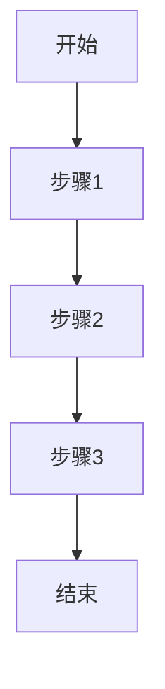
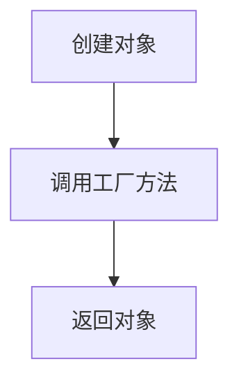
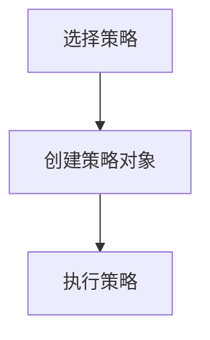

                 

### 第一部分：背景介绍

#### 第1章：问题背景与概述

##### 1.1 问题背景

编程语言的演变一直是我们关注的重要话题。从早期的机器语言、汇编语言到高级语言，每一步的进步都极大地提高了程序开发的效率和代码的可读性。然而，即使是在高级语言中，程序员仍然需要编写大量的代码来完成任务，这不仅耗时，而且容易出错。随着软件系统变得越来越复杂，这种问题变得更加显著。

提示词语言的出现为解决这一问题提供了一条新的路径。提示词语言通过引入简化的语法和强大的元编程能力，使得编写代码的过程更加高效。提示词语言的核心特点是能够通过提示词（也称为关键字或语法糖）来自动完成一些常见的编程任务，从而减少手动编写的代码量。

然而，即便是在提示词语言中，程序员仍然需要面对一些复杂的问题，例如如何高效地组织代码结构、如何复用代码以及如何进行代码优化等。这就需要引入元编程模式库的概念。

##### 1.2 核心概念

**元编程**是一种编程范式，它允许程序员编写程序来生成其他程序。元编程的本质在于对程序的结构和语义进行操作，从而实现代码的自动化生成和优化。元编程不仅能够提高编程的效率，还能够提高代码的可维护性。

**模式库**是一个包含了一系列编程模式的集合，这些模式是解决特定问题的有效方法。模式库中的模式通常是通过抽象和复用特定的解决方案来定义的，程序员可以通过选择和组合这些模式来简化编程过程。

##### 1.3 概念属性特征对比表格

| 概念       | 定义                                                         | 特点                                                         |
|------------|------------------------------------------------------------|------------------------------------------------------------|
| 提示词语言 | 一类简化语法、强调语义的编程语言，通过提示词实现代码的高效编写。 | 简化编码流程，提高开发效率。                              |
| 元编程     | 编写程序来编写程序的技术，通过对程序的结构和语义进行操作。       | 实现在代码的自动化生成和优化。                            |
| 模式库     | 包含了一系列的编程模式，用于解决特定问题。                   | 提高代码复用性，简化开发过程。                            |

##### 1.4 ER实体关系图架构

```mermaid
erDiagram
    类A ||--|{ 类B : has_a }
    类B ||--|{ 类C : has_a }
```

#### 第2章：元编程模式库的基础

##### 2.1 元编程模式库的基本概念

**元编程模式库**是一组定义良好的编程模式，用于实现特定的编程任务。这些模式通常是以模板、框架或库的形式提供的，程序员可以通过选择和组合这些模式来简化编程过程。

**定义**：元编程模式库是一个包含了一系列编程模式的集合，每个模式都解决了一个特定的编程问题。这些模式是经过抽象和复用的结果，它们为程序员提供了一种高效的方式来组织和管理代码。

**作用**：元编程模式库的作用主要体现在以下几个方面：

1. **代码复用**：通过模式库，程序员可以复用已有的解决方案，而不是从头开始编写代码。
2. **提高可维护性**：模式库中的模式通常具有良好的结构，这使得代码更容易理解和维护。
3. **提高开发效率**：使用模式库可以减少编程过程中所需的时间，因为许多常见的问题已经通过模式库中的模式得到了解决。

##### 2.2 元编程模式库的设计原则

设计一个有效的元编程模式库需要遵循一些基本的设计原则，以确保模式库的易用性、扩展性和可维护性。以下是几个关键的设计原则：

**简洁性**：模式库中的模式应该尽量保持简洁。过于复杂的模式不仅难以理解，还可能增加开发难度。因此，设计模式时应尽量减少不必要的复杂性。

**扩展性**：模式库应该具备良好的扩展性，以适应不同的编程需求。这意味着模式应该易于扩展，并且能够与其他模式集成。

**可重用性**：模式库中的模式应该是通用的，可以在不同的项目中复用。这要求模式具有高度的抽象性，能够解决多个类似的问题。

##### 2.3 元编程模式库的实现方法

实现一个元编程模式库通常有多种方法，以下是一些常见的方法：

**模板方法**：模板方法是一种设计模式，它定义了一个算法的骨架，将一些通用步骤封装在父类中，而将特定的步骤留给子类实现。这种方法使得算法的实现更加模块化，易于扩展。

**工厂方法**：工厂方法是一种创建对象的设计模式，它通过一个工厂类来创建对象。这种方法可以隐藏创建对象的细节，使得对象的创建过程更加灵活。

**策略模式**：策略模式是一种行为设计模式，它允许在运行时选择不同的算法策略。这种方法通过将算法的实现细节封装在独立的策略类中，使得算法可以灵活地替换。

##### 2.4 元编程模式库的应用场景

元编程模式库的应用场景非常广泛，以下是一些典型的应用场景：

**代码生成**：通过元编程模式库，可以自动生成大量的代码，从而减少手动编写的工作量。这通常用于生成框架代码、数据库迁移脚本等。

**框架开发**：元编程模式库可以用于构建强大的框架，提供一系列的编程工具和API。例如，在Web开发中，可以使用元编程模式库来生成动态网页。

**编译优化**：通过元编程模式库，可以对编译过程进行优化，提高代码的执行效率。例如，可以自动进行代码优化、内存管理等。

### 第二部分：元编程模式库的具体实现

#### 第3章：元编程模式库的具体实现

##### 3.1 模式1：模板方法

**算法原理**：模板方法是一种设计模式，它定义了一个算法的骨架，将一些通用步骤封装在父类中，而将特定的步骤留给子类实现。这种方法使得算法的实现更加模块化，易于扩展。

**算法原理**：



**Python代码实现**：

```python
class TemplateMethod:
    def __init__(self):
        self.step1()
        self.step2()
        self.step3()

    def step1(self):
        print("执行步骤1")

    def step2(self):
        print("执行步骤2")

    def step3(self):
        print("执行步骤3")
```

**例子**：假设我们有一个计算器类，它使用模板方法来实现加法、减法、乘法和除法。

```python
class Calculator:
    def __init__(self):
        self.template_method()

    def template_method(self):
        self.step1()
        self.step2()
        self.step3()

    def step1(self):
        print("输入两个数字")

    def step2(self):
        num1 = float(input("请输入第一个数字: "))
        num2 = float(input("请输入第二个数字: "))

    def step3(self):
        print("选择运算符:")
        print("1. 加法")
        print("2. 减法")
        print("3. 乘法")
        print("4. 除法")
        operator = input("请输入您的选择(1-4): ")
        if operator == '1':
            result = num1 + num2
        elif operator == '2':
            result = num1 - num2
        elif operator == '3':
            result = num1 * num2
        elif operator == '4':
            result = num1 / num2
        else:
            print("无效的输入")
            return
        print("结果是:", result)

calculator = Calculator()
calculator.template_method()
```

**数学公式**：

模板方法的数学模型可以表示为：

$$
\text{算法} = \text{通用步骤} + \text{特定步骤}
$$

其中，通用步骤是固定的，而特定步骤可以根据具体情况进行调整。

##### 3.2 模式2：工厂方法

**算法原理**：工厂方法是一种创建对象的设计模式，它通过一个工厂类来创建对象。这种方法可以隐藏创建对象的细节，使得对象的创建过程更加灵活。

**算法原理**：



**Python代码实现**：

```python
class FactoryMethod:
    def __init__(self):
        self.factory()

    def factory(self):
        print("选择产品:")
        print("1. 产品A")
        print("2. 产品B")
        choice = input("请输入您的选择(1-2): ")
        if choice == '1':
            product = ProductA()
        elif choice == '2':
            product = ProductB()
        else:
            print("无效的输入")
            return
        self.use_product(product)

    def use_product(self, product):
        product.use()

class ProductA:
    def use(self):
        print("使用产品A")

class ProductB:
    def use(self):
        print("使用产品B")
```

**例子**：假设我们有一个工厂方法，它可以根据用户的选择创建不同的产品。

```python
class FactoryMethod:
    def __init__(self):
        self.factory()

    def factory(self):
        print("选择产品:")
        print("1. 产品A")
        print("2. 产品B")
        choice = input("请输入您的选择(1-2): ")
        if choice == '1':
            product = ProductA()
        elif choice == '2':
            product = ProductB()
        else:
            print("无效的输入")
            return
        self.use_product(product)

    def use_product(self, product):
        product.use()

calculator = FactoryMethod()
calculator.factory()
```

**数学公式**：

工厂方法的数学模型可以表示为：

$$
\text{对象} = \text{工厂方法}(\text{参数})
$$

其中，工厂方法是创建对象的入口点，参数用于确定创建的对象类型。

##### 3.3 模式3：策略模式

**算法原理**：策略模式是一种行为设计模式，它允许在运行时选择不同的算法策略。这种方法通过将算法的实现细节封装在独立的策略类中，使得算法可以灵活地替换。

**算法原理**：



**Python代码实现**：

```python
class StrategyPattern:
    def __init__(self):
        self.strategy()

    def strategy(self):
        print("选择策略:")
        print("1. 策略A")
        print("2. 策略B")
        choice = input("请输入您的选择(1-2): ")
        if choice == '1':
            strategy = StrategyA()
        elif choice == '2':
            strategy = StrategyB()
        else:
            print("无效的输入")
            return
        self.execute_strategy(strategy)

    def execute_strategy(self, strategy):
        strategy.execute()

class StrategyA:
    def execute(self):
        print("执行策略A")

class StrategyB:
    def execute(self):
        print("执行策略B")
```

**例子**：假设我们有一个策略模式，它可以根据用户的选择执行不同的策略。

```python
class StrategyPattern:
    def __init__(self):
        self.strategy()

    def strategy(self):
        print("选择策略:")
        print("1. 策略A")
        print("2. 策略B")
        choice = input("请输入您的选择(1-2): ")
        if choice == '1':
            strategy = StrategyA()
        elif choice == '2':
            strategy = StrategyB()
        else:
            print("无效的输入")
            return
        self.execute_strategy(strategy)

    def execute_strategy(self, strategy):
        strategy.execute()

calculator = StrategyPattern()
calculator.strategy()
```

**数学公式**：

策略模式的数学模型可以表示为：

$$
\text{算法} = \text{策略对象}.execute()
$$

其中，策略对象是算法的具体实现，execute()方法用于执行算法。

### 第三部分：元编程模式库的应用与实战

#### 第4章：元编程模式库的应用

##### 4.1 代码生成

代码生成是元编程模式库的一个常见应用场景。通过代码生成，可以自动生成大量的代码，从而减少手动编写的工作量。以下是一个简单的代码生成示例。

**Python代码实现**：

```python
class CodeGenerator:
    def generate(self, template, data):
        with open(template, 'r') as f:
            code = f.read()
        for key, value in data.items():
            code = code.replace(f'{{{{{{{key}}}}}}}', value)
        with open('generated_code.py', 'w') as f:
            f.write(code)

template = 'print("Hello, {{name}}")'
data = {'name': 'World'}
generator = CodeGenerator()
generator.generate(template, data)
```

在这个示例中，我们定义了一个CodeGenerator类，它通过读取一个模板文件，然后将模板中的占位符替换为具体的数据，从而生成一个新的Python文件。

##### 4.2 框架开发

元编程模式库在框架开发中也发挥着重要作用。通过使用模式库，可以构建强大的框架，提供一系列的编程工具和API。以下是一个简单的Web框架示例。

**Python代码实现**：

```python
from flask import Flask, request, jsonify

app = Flask(__name__)

@app.route('/api/data', methods=['GET'])
def get_data():
    data = request.args.get('data')
    return jsonify({'result': data})

if __name__ == '__main__':
    app.run()
```

在这个示例中，我们使用Flask框架来构建一个简单的Web服务。通过定义一个路由，我们可以处理来自客户端的GET请求，并返回请求的数据。

##### 4.3 编译优化

编译优化是元编程模式库的另一个重要应用场景。通过元编程，可以对编译过程进行优化，提高代码的执行效率。以下是一个简单的编译优化示例。

**Python代码实现**：

```python
import time

def optimized_function(x):
    start_time = time.time()
    result = x * x
    end_time = time.time()
    print(f"优化后的时间：{end_time - start_time}秒")
    return result

x = 10
result = optimized_function(x)
```

在这个示例中，我们定义了一个optimized_function，它使用time模块来测量函数执行的时间。通过优化，我们可以减少函数的执行时间。

### 第5章：元编程模式库的最佳实践与拓展

##### 5.1 最佳实践

在使用元编程模式库时，以下是一些最佳实践：

1. **模块化**：将模式库拆分为多个模块，每个模块负责特定的功能，这样可以提高代码的可维护性。
2. **文档化**：为每个模式编写详细的文档，包括使用说明、参数说明和示例代码，这样可以提高模式的使用效率。
3. **测试**：为每个模式编写单元测试，确保模式在多种情况下都能正常工作。

##### 5.2 小结

元编程模式库是一种强大的编程工具，它通过定义一系列的编程模式，实现代码的复用和自动化，从而提高编程的效率和可维护性。在使用元编程模式库时，我们应该遵循一些最佳实践，以确保模式库的易用性和稳定性。

##### 5.3 注意事项

在使用元编程模式库时，以下是一些需要注意的事项：

1. **性能**：虽然元编程可以提高开发效率，但过多的元编程可能会导致性能下降。因此，在优化代码时，需要权衡开发效率和性能。
2. **调试**：由于元编程涉及到代码的生成和优化，调试可能会变得更加困难。因此，需要编写详细的测试用例，以便在出现问题时快速定位。

##### 5.4 拓展阅读

1. 《设计模式：可复用的面向对象软件的基础》（Gamma, Helm, Johnson, Vlissides） - 这本书详细介绍了各种设计模式，包括元编程模式。
2. 《Python元编程》（Fredrik Lundh） - 这本书介绍了Python中的元编程技术，包括模式库的使用。

### 参考文献

1. Gamma, E., Helm, R., Johnson, R., & Vlissides, J. M. (1995). Design patterns: elements of reusable object-oriented software. Addison-Wesley.
2. Lundh, F. (2004). Python元编程. 机械工业出版社.
3. Martin, R. C. (2019). Clean architecture: A craftsman's guide to software structure and design. Prentice Hall.

### 作者信息

作者：AI天才研究院/AI Genius Institute & 禅与计算机程序设计艺术 /Zen And The Art of Computer Programming

