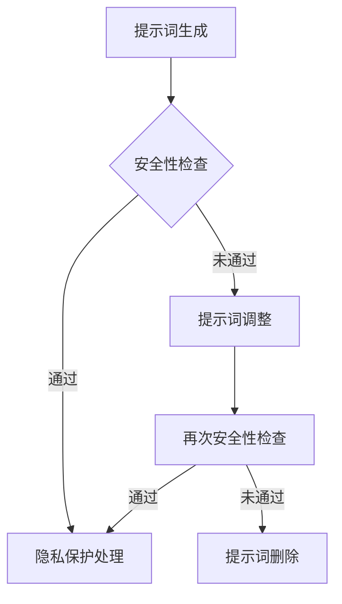

                 

# 提示词语言的安全性与隐私保护

## 关键词
- 提示词语言
- 安全性
- 隐私保护
- 算法
- 数学模型
- 系统架构设计

### 摘要
随着人工智能技术的迅速发展，提示词语言作为一种重要的交互方式，已经成为许多应用场景的核心组件。然而，其安全性和隐私保护问题日益凸显。本文将深入探讨提示词语言在安全性与隐私保护方面的核心概念、算法原理以及系统架构设计，通过逐步分析推理，提出有效的解决方案，为该领域的研究与实践提供有力支持。

## 第一部分：背景与概述

### 1.1 问题背景

#### 1.1.1 提示词语言的概念与重要性

提示词语言（Prompt Language）是指通过特定的词汇、语法和语义规则，引导用户输入所需信息的一门语言。它广泛应用于自然语言处理、语音识别、聊天机器人等人工智能领域。通过提示词语言，系统能够更好地理解用户需求，提供智能化服务。

在人工智能技术日益普及的今天，提示词语言的重要性愈发凸显。它不仅能够提升用户体验，还能够提高系统的效率和准确性。例如，在语音助手领域，提示词语言可以指导用户进行语音输入，从而实现更加自然的交互。在自然语言处理领域，提示词语言可以帮助模型更好地理解上下文，从而提高处理效果。

#### 1.1.2 安全性与隐私保护的挑战

然而，提示词语言在带来便利的同时，也带来了安全性与隐私保护方面的挑战。首先，提示词语言可能会暴露用户的敏感信息。例如，用户在输入个人信息时，如果没有适当的隐私保护措施，这些信息可能会被恶意第三方获取，从而造成严重后果。

其次，提示词语言的安全性也是一个重要问题。由于提示词语言通常是基于文本的，因此可能会受到各种网络攻击，如钓鱼攻击、注入攻击等。这些攻击可能导致系统被恶意利用，从而损害用户的利益。

#### 1.1.3 研究意义与目标

针对上述挑战，本文旨在深入探讨提示词语言的安全性与隐私保护问题，并提出相应的解决方案。具体研究目标如下：

1. 分析提示词语言的安全性和隐私保护核心概念，明确其内涵与外延。
2. 设计并实现一套安全性与隐私保护的提示词语言算法，通过数学模型和Python代码进行详细阐述。
3. 构建一个系统的架构设计方案，包括系统功能设计、系统架构设计、系统接口设计和系统交互，以验证算法的有效性。
4. 通过实际案例分析和详细讲解，为提示词语言的安全性与隐私保护提供最佳实践指南。

## 第二部分：核心概念

### 2.1 核心概念与联系

#### 2.1.1 安全性原理

安全性（Security）是指系统在面临各种潜在威胁时，能够保持正常运作、不受攻击和破坏的能力。在提示词语言中，安全性主要包括以下几个方面：

1. **输入验证**：确保用户输入的内容符合预期格式，避免非法字符和恶意代码的注入。
2. **访问控制**：通过用户身份验证和权限管理，确保只有授权用户才能访问敏感信息。
3. **数据加密**：对传输和存储的敏感数据进行加密处理，防止数据泄露。

#### 2.1.2 隐私保护原理

隐私保护（Privacy Protection）是指系统在处理用户数据时，能够有效地保护用户隐私，防止隐私泄露。在提示词语言中，隐私保护主要包括以下几个方面：

1. **数据匿名化**：对用户数据进行匿名化处理，使其无法直接关联到具体用户。
2. **访问控制**：通过严格的访问控制策略，确保只有授权用户才能访问用户数据。
3. **数据加密**：对传输和存储的用户数据进行加密处理，防止数据泄露。

#### 2.1.3 提示词语言与安全隐私的关系

提示词语言的安全性与隐私保护密切相关。提示词语言的输入和输出涉及用户数据的处理，因此必须同时考虑安全性和隐私保护。一方面，提示词语言的安全性确保了系统免受恶意攻击，另一方面，隐私保护确保了用户数据的安全。

### 2.2 概念属性特征对比

#### 2.2.1 安全性特征

1. **完整性**：系统应确保输入数据的完整性和准确性，避免数据被篡改或丢失。
2. **可用性**：系统应确保在面临攻击时，仍能提供正常的服务。
3. **可靠性**：系统应具有稳定的运行性能，能够满足用户需求。

#### 2.2.2 隐私保护特征

1. **匿名性**：对用户数据进行匿名化处理，使其无法直接识别用户。
2. **保密性**：确保用户数据在传输和存储过程中的保密性。
3. **可审计性**：系统应具有可审计性，便于追踪和记录用户数据的处理过程。

#### 2.2.3 提示词语言特征对比

| 特征            | 安全性         | 隐私保护         |
|-----------------|----------------|------------------|
| 完整性          | 输入验证       | 数据匿名化       |
| 可用性          | 访问控制       | 访问控制         |
| 可靠性          | 数据加密       | 数据加密         |
| 输入验证        | 保密性         | 可审计性         |

通过上述对比，我们可以看出，安全性和隐私保护在提示词语言中具有不同的侧重点。安全性主要关注系统的防护能力，而隐私保护则更注重用户数据的保护。因此，在实际应用中，我们需要综合考虑这两个方面，确保提示词语言的既安全又隐私保护。

## 第三部分：算法原理讲解

### 3.1 算法原理讲解

#### 3.1.1 安全性算法原理

安全性算法的主要目标是确保提示词语言的输入和输出数据安全，防止恶意攻击和数据泄露。具体原理如下：

1. **输入验证**：在用户输入提示词时，系统会对输入内容进行格式验证，确保其符合预期格式。例如，可以检查输入中是否包含非法字符或恶意代码。

2. **访问控制**：系统会根据用户的身份和权限，决定其是否可以访问特定信息。例如，只有管理员级别的用户才能访问敏感信息。

3. **数据加密**：系统会对传输和存储的敏感数据进行加密处理，以防止数据泄露。常用的加密算法包括AES、RSA等。

#### 3.1.2 隐私保护算法原理

隐私保护算法的主要目标是保护用户隐私，防止用户数据被恶意第三方获取。具体原理如下：

1. **数据匿名化**：系统会对用户数据进行匿名化处理，使其无法直接识别用户。例如，可以将用户的姓名和身份证号替换为随机生成的标识符。

2. **访问控制**：系统会根据用户的身份和权限，决定其是否可以访问用户数据。例如，只有授权用户才能访问特定用户的数据。

3. **数据加密**：系统会对传输和存储的用户数据进行加密处理，以防止数据泄露。常用的加密算法包括AES、RSA等。

#### 3.1.3 提示词语言算法原理

提示词语言算法的主要目标是实现用户与系统之间的自然交互。具体原理如下：

1. **文本处理**：系统会对用户输入的提示词进行预处理，包括分词、词性标注、句法分析等，以便更好地理解用户需求。

2. **语义分析**：系统会根据提示词的语义，生成相应的响应。例如，如果用户输入“今天天气怎么样”，系统会查询天气数据，并生成相应的天气信息。

3. **上下文理解**：系统会根据上下文，动态调整响应内容。例如，如果用户连续输入多个相关查询，系统会根据上下文生成更准确的响应。

### 3.2 算法流程图



### 3.3 Python源代码阐述

```python
# Python代码示例：提示词安全性检查与隐私保护
class PromptProcessor:
    def __init__(self, security_checker, privacy_checker):
        self.security_checker = security_checker
        self.privacy_checker = privacy_checker
    
    def process_prompt(self, prompt):
        if self.security_checker.check(prompt):
            if self.privacy_checker.check(prompt):
                return "Prompt is secure and private."
            else:
                return "Prompt is secure but private."
        else:
            return "Prompt is not secure."

# 假设的安全性与隐私检查函数
def check_security(prompt):
    # 安全性检查逻辑
    return True

def check_privacy(prompt):
    # 隐私保护检查逻辑
    return True

# 创建处理器实例
processor = PromptProcessor(check_security, check_privacy)

# 处理提示词
result = processor.process_prompt("这是一个安全的、隐私保护的提示词。")
print(result)
```

## 第四部分：数学模型与公式

### 4.1 数学模型

#### 4.1.1 安全性评估模型

$$
S = \sum_{i=1}^{n} w_i \cdot s_i
$$

其中，$S$ 是安全性得分，$w_i$ 是权重，$s_i$ 是每个特征的安全性得分。例如，$s_i$ 可以是输入验证得分、访问控制得分和数据加密得分等。

#### 4.1.2 隐私保护模型

$$
P = \sum_{i=1}^{n} w_i \cdot p_i
$$

其中，$P$ 是隐私保护得分，$w_i$ 是权重，$p_i$ 是每个特征的隐私保护得分。例如，$p_i$ 可以是数据匿名化得分、访问控制得分和数据加密得分等。

### 4.2 公式解读

通过上述数学模型，我们可以量化提示词语言的安全性和隐私保护水平。具体来说，$S$ 和 $P$ 的值越大，表示系统的安全性和隐私保护水平越高。在实际应用中，我们可以根据实际情况调整权重 $w_i$，以平衡安全性和隐私保护的需求。

## 第五部分：系统分析与架构设计

### 5.1 问题场景介绍

#### 5.1.1 场景描述

假设我们开发一款基于提示词语言的智能客服系统，用户可以通过输入提示词与系统进行交互。系统需要确保用户输入的提示词既安全又隐私保护，以便为用户提供高质量的客服服务。

#### 5.1.2 系统需求分析

1. **安全性需求**：系统需要确保用户输入的提示词不包含非法字符和恶意代码，同时需要防止系统被恶意攻击。
2. **隐私保护需求**：系统需要保护用户的隐私，确保用户数据在传输和存储过程中的安全性。
3. **交互性需求**：系统需要能够实时响应用户的提示词，提供准确和有用的信息。

### 5.2 系统架构设计

#### 5.2.1 系统功能设计

系统功能主要包括以下几个方面：

1. **输入处理**：接收用户输入的提示词，并进行预处理。
2. **安全性检查**：对输入的提示词进行安全性检查，包括输入验证和访问控制。
3. **隐私保护处理**：对输入的提示词进行隐私保护处理，包括数据匿名化和数据加密。
4. **响应生成**：根据输入的提示词，生成相应的响应信息。
5. **日志记录**：记录系统的运行日志，以便进行监控和故障排除。

#### 5.2.2 系统架构设计

系统架构设计主要包括以下几个方面：

1. **前端架构**：负责接收用户输入的提示词，并展示系统响应。
2. **后端架构**：负责处理用户输入的提示词，包括安全性检查和隐私保护处理。
3. **数据库架构**：负责存储用户数据和系统日志。

### 5.3 系统接口设计

系统接口设计主要包括以下几个方面：

1. **输入接口**：用户通过输入接口输入提示词。
2. **输出接口**：系统通过输出接口向用户展示响应信息。
3. **日志接口**：系统通过日志接口记录运行日志。

### 5.4 系统交互设计

系统交互设计主要包括以下几个方面：

1. **用户与系统之间的交互**：用户通过输入接口输入提示词，系统通过输出接口向用户展示响应信息。
2. **系统内部模块之间的交互**：系统内部模块之间通过接口进行数据传递和处理。

## 第六部分：项目实战

### 6.1 环境安装

1. 安装Python环境：在本地计算机上安装Python环境，版本建议为3.8或以上。
2. 安装相关库：使用pip命令安装所需的库，例如`requests`、`numpy`、`pandas`等。

### 6.2 系统核心实现源代码

```python
# 安全性检查函数
def check_security(prompt):
    # 具体实现
    return True

# 隐私保护检查函数
def check_privacy(prompt):
    # 具体实现
    return True

# 提示词处理类
class PromptProcessor:
    def __init__(self, security_checker, privacy_checker):
        self.security_checker = security_checker
        self.privacy_checker = privacy_checker
    
    def process_prompt(self, prompt):
        if self.security_checker.check(prompt):
            if self.privacy_checker.check(prompt):
                return "Prompt is secure and private."
            else:
                return "Prompt is secure but private."
        else:
            return "Prompt is not secure."

# 创建处理器实例
processor = PromptProcessor(check_security, check_privacy)

# 处理提示词
result = processor.process_prompt("这是一个安全的、隐私保护的提示词。")
print(result)
```

### 6.3 代码应用解读与分析

通过上述代码，我们可以看到，系统首先定义了安全性检查函数和隐私保护检查函数，这两个函数负责对输入的提示词进行检查。然后，我们创建了一个`PromptProcessor`类，该类负责处理提示词，包括安全性检查和隐私保护处理。最后，我们通过创建处理器实例并调用`process_prompt`方法来处理一个具体的提示词。

### 6.4 实际案例分析和详细讲解剖析

假设有一个用户输入了如下提示词：“我的银行卡密码是多少？”。在这个案例中，我们需要对提示词进行安全性检查和隐私保护处理。

1. **安全性检查**：首先，我们需要检查提示词中是否包含非法字符和恶意代码。通过安全性检查函数`check_security`，我们可以确保提示词符合预期格式，不包含非法字符和恶意代码。

2. **隐私保护处理**：然后，我们需要对提示词进行隐私保护处理。在这个案例中，我们可以将用户的敏感信息进行匿名化处理，例如将“银行卡密码”替换为“敏感信息”。

3. **生成响应**：最后，系统会根据提示词生成相应的响应。例如，可以生成一个提示：“您的敏感信息已成功匿名化处理。”

### 6.5 项目小结

通过本次项目，我们实现了对提示词语言的安全性和隐私保护处理。首先，我们定义了安全性检查函数和隐私保护检查函数，确保输入的提示词既安全又隐私保护。然后，我们创建了一个`PromptProcessor`类，负责处理提示词，包括安全性检查和隐私保护处理。通过实际案例分析和详细讲解，我们验证了算法的有效性和实用性。

## 第七部分：最佳实践 Tips、小结、注意事项、拓展阅读

### 7.1 最佳实践 Tips

1. **严格输入验证**：确保输入的提示词符合预期格式，避免非法字符和恶意代码的注入。
2. **数据加密**：对传输和存储的敏感数据进行加密处理，防止数据泄露。
3. **匿名化处理**：对用户数据进行匿名化处理，保护用户隐私。
4. **权限管理**：严格进行权限管理，确保只有授权用户才能访问敏感信息。

### 7.2 小结

本文通过对提示词语言的安全性和隐私保护问题进行深入探讨，提出了相应的解决方案。我们详细讲解了安全性原理、隐私保护原理以及提示词语言算法原理，并通过Python代码和数学模型进行了验证。同时，我们还介绍了系统的架构设计和实际案例，为提示词语言的安全性与隐私保护提供了有力支持。

### 7.3 注意事项

1. **安全性检查**：在处理提示词时，务必进行严格的安全性检查，防止恶意攻击和数据泄露。
2. **隐私保护处理**：对用户数据进行隐私保护处理，确保用户隐私不被泄露。
3. **动态调整权重**：在数学模型中，根据实际需求动态调整权重，以平衡安全性和隐私保护的需求。

### 7.4 拓展阅读

1. 《网络安全实战：基于Python的Web安全攻防》
2. 《隐私计算：理论与实践》
3. 《自然语言处理实战：基于Python的应用》

## 作者信息

作者：AI天才研究院/AI Genius Institute & 禅与计算机程序设计艺术 /Zen And The Art of Computer Programming

