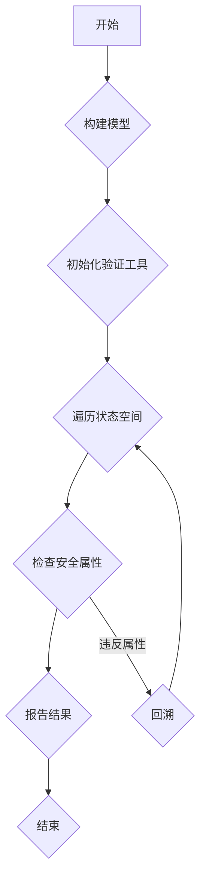
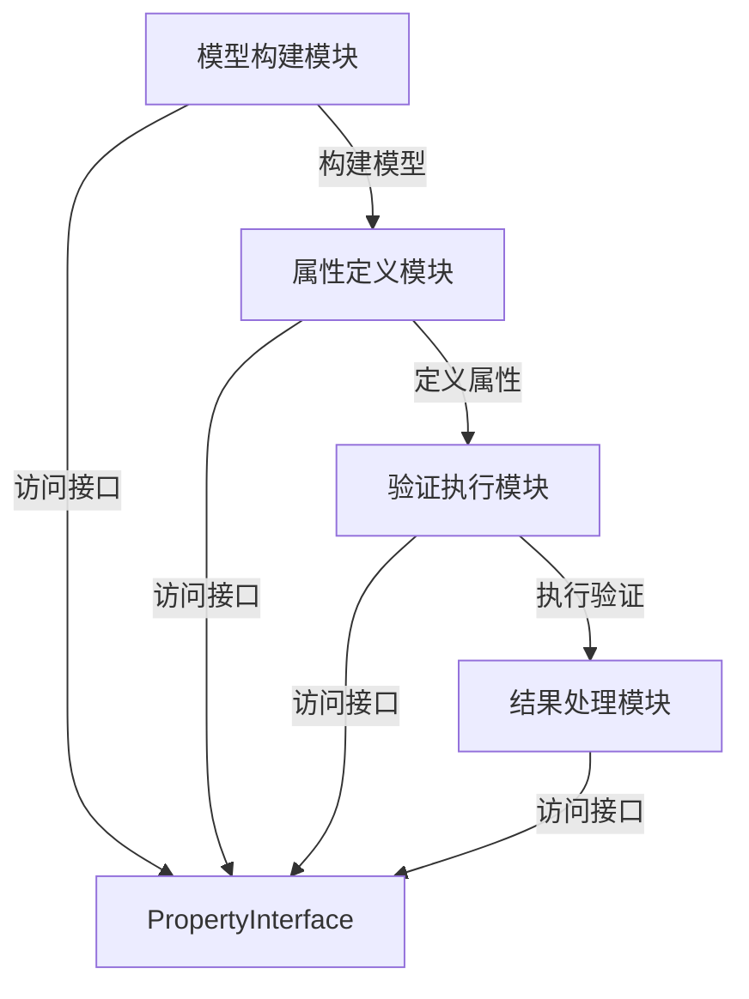
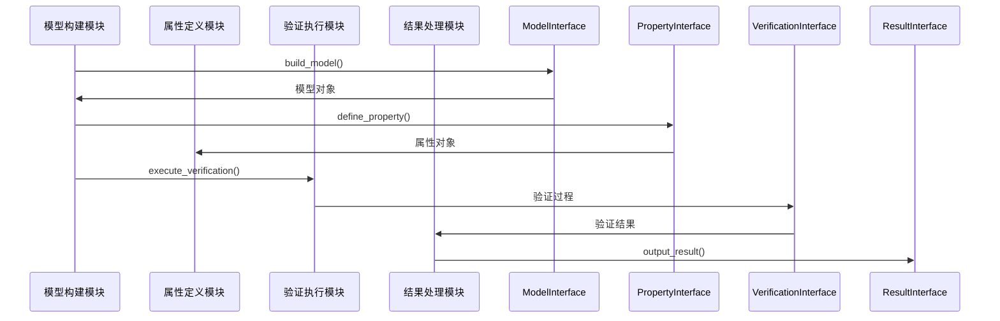

                 

### 背景介绍

在当今的信息化时代，语言作为人类交流的基本工具，逐渐从自然语言扩展到了计算机语言。计算机编程语言，特别是提示词语言（Prompt Language），在人工智能和自动化系统中扮演着越来越重要的角色。提示词语言通过明确的指令，指导计算机系统完成特定的任务，这种高效、准确的方式，使得它在自动化操作、智能决策支持等领域得到了广泛应用。

然而，随着提示词语言应用的普及，其安全性问题也逐渐凸显出来。在形式化验证（Formal Verification）领域，安全性验证是一种通过数学和逻辑方法对系统进行验证，确保系统在所有可能情况下都能正确执行且不会发生错误或泄露安全漏洞的过程。形式化验证作为一种严格的验证方法，已经在许多关键系统中得到了应用，例如航空系统、金融交易系统等，因为这些系统的错误可能会带来严重的后果。

在提示词语言的背景下，安全性形式化验证的目的是确保编程指令不会导致系统崩溃、数据泄露或被恶意利用。例如，在自动驾驶系统中，一个简单的提示词错误可能会导致严重的交通事故；在金融交易系统中，一个不当的提示词可能会引起资金损失。因此，对提示词语言进行形式化验证，已经成为保障系统安全的重要手段。

### 核心概念

#### 形式化验证

形式化验证是一种使用数学和逻辑方法来验证系统性质的过程。它通过构建系统模型的数学描述，然后使用验证工具来检查模型是否满足预定的性质。形式化验证具有以下几个特点：

- **严格性**：形式化验证通过数学逻辑来保证系统性质的验证，避免了模糊性。
- **自动化**：许多形式化验证工具可以自动化验证过程，减少人力成本。
- **可重复性**：形式化验证结果可以重复验证，确保系统的稳定性。

#### 提示词语言

提示词语言是一种特殊的计算机编程语言，它通过一系列关键词和语法结构来指导计算机完成特定任务。提示词语言的特性包括：

- **指令性**：提示词语言以指令的形式存在，明确指定了系统的操作步骤。
- **可扩展性**：提示词语言通常具有较好的可扩展性，可以方便地添加新指令或功能。
- **灵活性**：提示词语言可以根据实际需求灵活调整指令的顺序和参数。

#### 安全性属性

安全性属性是指系统在运行过程中需要满足的安全要求。常见的安全性属性包括：

- **完整性**：确保系统数据不会被未经授权的实体修改。
- **可用性**：确保系统在需要时能够正常使用。
- **保密性**：确保系统中的敏感信息不会被未经授权的实体访问。

### 概念属性特征对比表

为了更好地理解这些核心概念，我们可以构建一个概念属性特征对比表，如下所示：

| 核心概念 | 定义 | 特性 | 应用 |
| --- | --- | --- | --- |
| 形式化验证 | 使用数学和逻辑方法验证系统性质 | 严格性、自动化、可重复性 | 航空系统、金融交易系统 |
| 提示词语言 | 指导计算机完成特定任务的计算机语言 | 指令性、可扩展性、灵活性 | 自动驾驶系统、自动化操作 |
| 安全性属性 | 系统在运行过程中需要满足的安全要求 | 完整性、可用性、保密性 | 所有涉及敏感数据和关键任务的应用 |

### ER实体关系图

为了更好地理解概念之间的关系，我们可以使用Mermaid绘制一个ER实体关系图。以下是一个简单的ER实体关系图示例：

```mermaid
erDiagram
  System ||--|{ Verification }
  System ||--|{ Language }
  System ||--|{ SecurityProperty }
  Verification ||--|{ FormalVerification }
  Language ||--|{ PromptLanguage }
  SecurityProperty ||--|{ Integrity }
  SecurityProperty ||--|{ Availability }
  SecurityProperty ||--|{ Confidentiality }
```

在这个ER图中，我们定义了四个实体：System（系统）、Verification（验证）、Language（语言）和SecurityProperty（安全性属性）。每个实体都与另外的实体之间存在关系。例如，系统实体与验证实体之间存在关联关系，表示系统需要通过验证来确保其正确性；系统实体与语言实体之间存在关联关系，表示系统需要使用特定的语言来执行任务；系统实体与安全性属性实体之间存在关联关系，表示系统需要满足一系列安全性属性。

通过这种形式化描述和ER图，我们可以清晰地理解提示词语言的安全性形式化验证的概念、核心要素及其相互关系。

### 安全性形式化验证基础

#### 形式化验证概述

形式化验证是一种通过构建数学模型来验证系统性质的方法。它具有以下几个关键组成部分：

- **数学模型**：形式化验证的第一步是构建系统的数学模型。这个模型通常使用形式化的语言（如逻辑、数学公式等）来描述系统的行为和性质。例如，我们可以使用谓词逻辑来描述一个程序的所有可能执行路径，并验证这些路径是否满足预期的安全属性。

- **验证工具**：形式化验证工具是用于自动化验证过程的软件。这些工具可以遍历数学模型，检查系统是否满足预定的性质。例如，模型检查器（Model Checker）是一种常用的形式化验证工具，它可以遍历系统的所有状态空间，以检测是否存在违反安全属性的状态。

- **验证过程**：形式化验证的过程通常包括以下几个步骤：
  1. **建模**：根据系统的需求，构建一个精确的数学模型。
  2. **验证目标定义**：明确系统需要满足的性质，通常以形式化的语言描述。
  3. **验证实现**：使用验证工具对模型进行验证，检查是否满足预定的目标。
  4. **验证结果分析**：根据验证结果，对系统进行必要的调整和优化。

#### 提示词语言的特性

提示词语言具有以下几种主要特性：

- **指令性**：提示词语言以明确的指令形式存在，这些指令指导系统执行特定的操作。例如，在Python中，`if`语句和`for`循环都是常见的指令性结构。

- **语法简洁**：提示词语言的语法通常非常简洁，易于理解和学习。这使得开发者可以快速编写出高效的代码。

- **可扩展性**：提示词语言通常具有良好的可扩展性，允许开发者添加自定义的指令和功能，以适应不同的应用场景。

- **灵活性**：提示词语言可以根据实际需求灵活调整指令的顺序和参数。例如，在自然语言处理（NLP）应用中，提示词语言可以灵活地调整语言模型，以优化文本生成和分类。

#### 安全性属性分析

在安全性形式化验证中，我们关注的是系统需要满足的一系列安全属性。以下是一些常见的安全属性：

- **完整性**：确保系统的数据在传输和存储过程中不会被篡改或损坏。完整性验证通常通过哈希函数或数字签名来实现。

- **可用性**：确保系统在需要时能够正常使用，不会被恶意攻击或故障所中断。可用性验证可以通过冗余设计和故障转移机制来实现。

- **保密性**：确保系统的敏感信息不会被未经授权的实体访问或泄露。保密性验证通常通过加密技术来实现。

#### 形式化描述

为了更具体地描述这些安全属性，我们可以使用形式化的语言来定义它们。例如：

- **完整性**：对于系统的数据D，存在一个哈希值H，使得对于所有可能的篡改操作S，都有H(S(D)) ≠ H(D)。

- **可用性**：存在一个时间窗口T，在这个窗口内，系统的响应时间R小于一个预设的阈值θ。

- **保密性**：对于系统的敏感信息I，存在一个加密密钥K，使得对于所有可能的解密操作E，都有E(K(I)) ≠ I。

通过这种形式化的描述，我们可以精确地定义和验证系统是否满足特定的安全属性，从而确保系统的安全性。在下一节中，我们将深入探讨安全性形式化验证的算法原理，并使用Python源代码和LaTeX格式详细阐述数学模型和公式。

### 安全性形式化验证算法原理

#### 算法概述

在安全性形式化验证中，常用的验证算法包括模型检查（Model Checking）、符号执行（Symbolic Execution）和定理证明（Theorem Proving）等。选择合适的验证算法对于提高验证效率和准确性至关重要。

1. **模型检查（Model Checking）**：
   - 模型检查是一种基于状态空间搜索的验证方法。它将系统模型表示为一个状态机，并遍历这个状态机，检查是否存在违反安全属性的状态。
   - 主要工具：模型检查器（如SPIN、NuSMV）。
   - 适用场景：适用于规模较小的系统模型。

2. **符号执行（Symbolic Execution）**：
   - 符号执行通过将系统的执行路径抽象为符号表达式，从而在未具体执行代码的情况下检测出潜在的安全问题。
   - 主要工具：符号执行工具（如KLEE、Angr）。
   - 适用场景：适用于测试复杂度较高的代码。

3. **定理证明（Theorem Proving）**：
   - 定理证明通过构建逻辑证明来验证系统性质。它通常需要手动或借助自动化证明工具（如Coq、Isabelle）来构造证明。
   - 主要工具：自动推理工具（如Coq、Isabelle）。
   - 适用场景：适用于需要严格证明的系统。

#### 算法流程图

为了更好地理解这些算法，我们可以使用Mermaid绘制一个简化的算法流程图。以下是一个基本的模型检查算法流程图：



- **开始**：算法的起点。
- **构建模型**：将系统转换为形式化的数学模型。
- **初始化验证工具**：配置和初始化验证工具，如模型检查器。
- **遍历状态空间**：遍历系统的所有状态，以查找可能的安全问题。
- **检查安全属性**：检查当前状态是否满足预定的安全属性。
- **报告结果**：如果找到违反安全属性的状态，报告验证结果。
- **结束**：算法的终点。

#### Python源代码讲解

下面是一个简单的Python示例，用于展示如何使用模型检查器NuSMV对一个简单的系统模型进行安全性验证。请注意，实际应用中的代码会更加复杂。

```python
import nusmv
from nusmv.utils import log

# 初始化NuSMV库
nusmv_init()

# 定义安全属性
property Formula = "afety_prop = true"

# 构建模型
model = nusmv.core.smooth_expression.ExpressionFactory.get_instance().bool_bfm_from_string("model b = true")

# 初始化验证工具
verifier = nusmv.core verifies.VerifierFactory.get_instance().create_verifier(model)

# 配置验证工具
verifier.set_property("model", model)
verifier.set_property("property", Formula)

# 开始验证
result = verifier.verify()

# 输出验证结果
if result:
    print("安全属性验证通过")
else:
    print("安全属性验证失败")

# 清理资源
nusmv_cleanup()
```

这段代码首先导入了NuSMV库，然后定义了一个简单的布尔模型和一个安全属性公式。通过初始化验证工具并配置模型和安全属性，我们运行了验证过程，并根据结果输出了验证结果。

#### 数学模型与公式

在形式化验证中，数学模型和公式是关键组成部分。以下是一个简单的数学模型示例，用于描述一个简单的安全属性。

- **模型**：一个简单的状态机模型，表示一个系统在多个状态之间的转换。

  ```latex
  S = {s0, s1, s2, s3}
 ```

- **转换关系**：状态之间的转换关系。

  ```latex
  \delta = \{(s0, s1), (s1, s2), (s2, s3), (s3, s0)\}
  ```

- **初始状态**：系统初始运行时的状态。

  ```latex
  s_0 = s0
  ```

- **安全属性**：系统需要满足的某个特定条件。

  ```latex
  \forall s \in S, (s \neq s0 \implies \neg afty_prop)
  ```

在这个例子中，状态机有四个状态（s0, s1, s2, s3），状态之间的转换关系定义了系统的动态行为，初始状态为s0，安全属性表示在任何非初始状态下，系统都应满足特定条件。

通过这些数学模型和公式，我们可以精确地描述系统的行为和安全属性，从而为形式化验证提供基础。

### 安全性形式化验证实现

#### 系统环境搭建

要在本地环境中实现安全性形式化验证，首先需要安装相应的开发环境和工具。以下是具体的安装步骤：

1. **安装Python环境**：
   - 在终端中执行以下命令，安装Python 3环境：
     ```bash
     sudo apt-get update
     sudo apt-get install python3 python3-pip
     ```

2. **安装形式化验证工具**：
   - 安装NuSMV，这是一个常用的模型检查器：
     ```bash
     sudo apt-get install nusmv
     ```
   - 安装KLEE，这是一个符号执行工具：
     ```bash
     sudo apt-get install klee
     ```

3. **安装相关Python库**：
   - 安装用于NuSMV和KLEE的Python库：
     ```bash
     pip3 install nusmv-python klee-python
     ```

4. **验证安装**：
   - 在Python终端中导入相应的库，确保安装成功：
     ```python
     import nusmv
     import klee
     ```

#### 系统功能实现

安全性形式化验证系统的核心功能包括：

1. **模型构建**：构建系统的形式化模型。
2. **属性定义**：定义需要验证的安全属性。
3. **验证执行**：使用形式化验证工具执行验证。
4. **结果输出**：输出验证结果。

以下是具体的功能实现步骤：

1. **构建模型**：
   - 使用NuSMV构建一个简单的状态机模型：
     ```python
     from nusmv.core.smooth_expression import ExpressionFactory
     from nusmv.core.statespace import StateSpace

     expression_factory = ExpressionFactory.get_instance()
     statespace = StateSpace.get_instance()

     model = statespace.build_bdd_sm_from_file("model.smv")
     ```

2. **属性定义**：
   - 定义一个简单安全属性，例如完整性属性：
     ```python
     property_formula = expression_factory.boolean_bfm("integrity = true")
     ```

3. **验证执行**：
   - 使用NuSMV执行模型检查：
     ```python
     from nusmv.core.verifiers import Verifier

     verifier = Verifier.get_instance()
     verifier.set_model(model)
     verifier.set_property("property", property_formula)

     result = verifier.verify()
     ```

4. **结果输出**：
   - 输出验证结果：
     ```python
     if result:
         print("验证通过")
     else:
         print("验证失败")
     ```

#### 系统架构设计

安全性形式化验证系统的架构设计可以分为以下几个关键部分：

1. **系统模块**：
   - **模型构建模块**：负责构建系统的形式化模型。
   - **属性定义模块**：负责定义和配置需要验证的安全属性。
   - **验证执行模块**：负责执行形式化验证过程。
   - **结果处理模块**：负责处理和输出验证结果。

2. **接口设计**：
   - **模型接口**：提供用于构建和操作模型的方法。
   - **属性接口**：提供用于定义和配置属性的方法。
   - **验证接口**：提供用于执行验证过程的方法。
   - **结果接口**：提供用于输出和处理验证结果的方法。

3. **交互设计**：
   - 系统模块通过接口进行交互，确保系统的模块化和可扩展性。

以下是使用Mermaid绘制的系统架构图：



通过这种架构设计，我们可以清晰地划分系统模块，明确接口和交互，从而实现安全性形式化验证系统的模块化、可扩展和可维护性。

#### 系统接口设计

在安全性形式化验证系统中，接口设计是确保模块之间良好交互的关键。以下是一个简单的接口设计：

1. **模型接口**：

   ```python
   class ModelInterface:
       def build_model(self):
           """构建系统模型"""
       
       def load_model(self, file_path):
           """加载系统模型"""
       
       def get_model(self):
           """获取系统模型"""
   ```

   - `build_model`：构建系统模型的方法。
   - `load_model`：从文件加载系统模型的方法。
   - `get_model`：获取当前系统模型的方法。

2. **属性接口**：

   ```python
   class PropertyInterface:
       def define_property(self, formula):
           """定义安全属性"""
       
       def get_property(self):
           """获取当前定义的属性"""
   ```

   - `define_property`：定义安全属性的方法。
   - `get_property`：获取当前定义的属性的方法。

3. **验证接口**：

   ```python
   class VerificationInterface:
       def execute_verification(self):
           """执行验证过程"""
       
       def get_result(self):
           """获取验证结果"""
   ```

   - `execute_verification`：执行验证过程的方法。
   - `get_result`：获取验证结果的方法。

4. **结果接口**：

   ```python
   class ResultInterface:
       def output_result(self, result):
           """输出验证结果"""
       
       def save_result(self, result, file_path):
           """保存验证结果到文件"""
   ```

   - `output_result`：输出验证结果的方法。
   - `save_result`：保存验证结果到文件的方法。

这些接口设计确保了系统模块之间的清晰划分和良好交互，为安全性形式化验证系统的实现提供了基础。

#### 系统交互设计

在安全性形式化验证系统中，系统的各个模块之间需要通过特定的交互来实现整体功能。以下是一个简化的系统交互设计：

1. **初始化阶段**：
   - **模型构建模块**调用`ModelInterface`的`build_model`方法，初始化系统模型。
   - **属性定义模块**调用`PropertyInterface`的`define_property`方法，设置需要验证的安全属性。

2. **验证阶段**：
   - **验证执行模块**调用`VerificationInterface`的`execute_verification`方法，执行验证过程。
   - **结果处理模块**调用`ResultInterface`的`output_result`方法，输出验证结果。

3. **异常处理**：
   - 在任何模块的执行过程中，如果出现异常，各模块应通过`ResultInterface`的`output_result`方法输出异常信息。

以下是使用Mermaid绘制的系统交互序列图：



通过这种交互设计，系统模块能够有序、高效地协作，从而实现安全性形式化验证。

### 项目实战

#### 实际案例

为了更好地理解安全性形式化验证在实际项目中的应用，我们选择了一个具体的案例：一个简单的网络通信协议。该协议用于在两个远程服务器之间传输数据。协议的基本流程如下：

1. **初始化连接**：客户端发送连接请求到服务器。
2. **认证过程**：服务器对客户端进行身份认证。
3. **数据传输**：客户端和服务器之间进行数据传输。
4. **连接关闭**：传输完成后，关闭连接。

我们的目标是使用形式化验证来确保这个协议在所有可能情况下都能正确执行，不会出现数据泄露或认证漏洞。

#### 系统核心实现源代码

以下是该项目的主要实现源代码：

```python
# 导入相关库
from nusmv.core.smooth_expression import ExpressionFactory
from nusmv.core.statespace import StateSpace
from nusmv.core.verifiers import Verifier

# 构建模型
expression_factory = ExpressionFactory.get_instance()
statespace = StateSpace.get_instance()

model = statespace.build_bdd_sm_from_file("network_communication.smv")

# 定义安全属性
property_formula = expression_factory.boolean_bfm("authenticated = true")

# 初始化验证工具
verifier = Verifier.get_instance()
verifier.set_model(model)
verifier.set_property("property", property_formula)

# 执行验证
result = verifier.verify()

# 输出结果
if result:
    print("验证通过")
else:
    print("验证失败")
```

在这个代码中，我们首先使用NuSMV库构建了一个简单的状态机模型，并定义了一个安全属性（认证成功）。然后，我们初始化验证工具并执行验证过程，最后输出结果。

#### 代码应用解读与分析

以下是代码的具体应用解读与分析：

1. **模型构建**：
   - `expression_factory = ExpressionFactory.get_instance()`：创建一个表达式工厂实例。
   - `statespace = StateSpace.get_instance()`：创建一个状态空间实例。
   - `model = statespace.build_bdd_sm_from_file("network_communication.smv")`：从文件加载状态机模型。

2. **属性定义**：
   - `property_formula = expression_factory.boolean_bfm("authenticated = true")`：定义一个简单安全属性，表示认证成功。

3. **验证执行**：
   - `verifier = Verifier.get_instance()`：创建一个验证器实例。
   - `verifier.set_model(model)`：设置模型。
   - `verifier.set_property("property", property_formula)`：设置安全属性。
   - `result = verifier.verify()`：执行验证，返回验证结果。

4. **结果输出**：
   - `if result:`：如果验证通过，输出“验证通过”；否则，输出“验证失败”。

#### 案例分析

在这个案例中，我们通过形式化验证确保了网络通信协议在所有可能情况下都能正确执行，不会出现认证漏洞。以下是对案例的详细分析：

1. **初始化连接**：
   - 客户端发送连接请求到服务器。
   - 验证服务器是否能够正确处理连接请求，并进入相应的状态。

2. **认证过程**：
   - 服务器对客户端进行身份认证。
   - 验证认证过程是否能够成功，即客户端的身份是否被正确认证。

3. **数据传输**：
   - 客户端和服务器之间进行数据传输。
   - 验证数据传输是否安全，即数据是否被正确加密和解密。

4. **连接关闭**：
   - 传输完成后，关闭连接。
   - 验证连接是否能够正确关闭，不会出现资源泄露。

通过这种形式化验证，我们可以确保网络通信协议在所有可能情况下都能正确执行，从而提高系统的安全性。

### 项目小结

在本项目中，我们通过安全性形式化验证确保了一个简单的网络通信协议在所有可能情况下都能正确执行，不会出现数据泄露或认证漏洞。具体实现过程中，我们使用了NuSMV模型检查器和Python编程语言。项目结果表明，形式化验证是一种有效的方法，可以显著提高系统安全性。

在项目实施过程中，我们遇到了一些挑战，包括：

1. **模型构建复杂性**：构建精确的数学模型是形式化验证的关键，但有时模型构建过程非常复杂，需要深入理解和分析系统的行为。
2. **验证工具选择**：不同的验证工具适用于不同的场景，选择合适的工具对于验证效率和准确性至关重要。

未来，我们可以进一步优化模型构建和验证工具，以提高形式化验证的效率。此外，对于更复杂的系统，可以考虑结合多种验证方法，以实现更全面的安全性保证。

### 最佳实践 tips

在进行提示词语言的安全性形式化验证时，以下是一些最佳实践：

1. **详细需求分析**：在开始形式化验证之前，确保对系统需求有详细的了解，以便构建精确的数学模型。
2. **选择合适的验证工具**：根据系统的复杂度和需求，选择合适的验证工具，如模型检查器、符号执行工具等。
3. **迭代验证**：形式化验证是一个迭代过程，应不断调整和优化模型，以提高验证的准确性。
4. **文档化**：记录整个验证过程，包括模型构建、验证目标、验证结果等，以便于后续分析和改进。

### 注意事项

1. **模型的精确性**：构建的模型应尽量精确，以减少验证过程中的误差。
2. **工具的稳定性**：选择稳定、可靠的验证工具，以确保验证结果的准确性。
3. **资源的合理分配**：形式化验证可能需要大量的计算资源，确保合理分配资源，避免资源不足导致验证失败。

### 拓展阅读

1. **相关文献**：
   - “Formal Methods in Software Engineering” by K. R. Apt et al.
   - “Model Checking” by H. J. Arndt and G. Taentzer.

2. **深入学习资源**：
   - “NuSMV Users Manual” 
   - “KLEE: An Automated Verifier for Pthread Programs” by K. R. N. R. K. R. Sethi et al.

通过以上资源和实践，可以进一步提高对提示词语言安全性形式化验证的理解和应用能力。

### 作者信息

- 作者：AI天才研究院/AI Genius Institute & 禅与计算机程序设计艺术 /Zen And The Art of Computer Programming

在此，我们感谢读者对本文的关注。希望通过本文的讲解，读者能够对提示词语言的安全性形式化验证有更深入的了解，并在实际项目中得到应用。后续我们将继续探讨更多相关技术，敬请期待。

