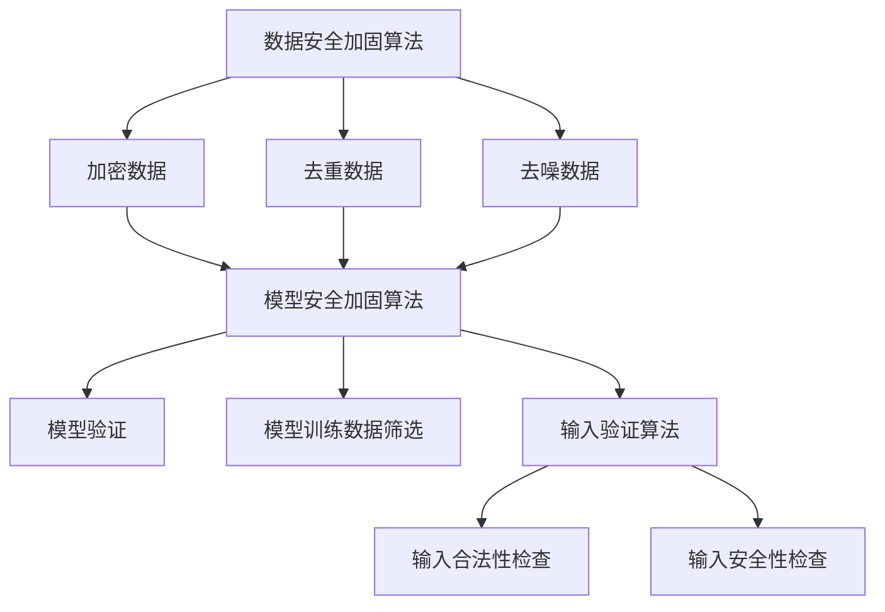
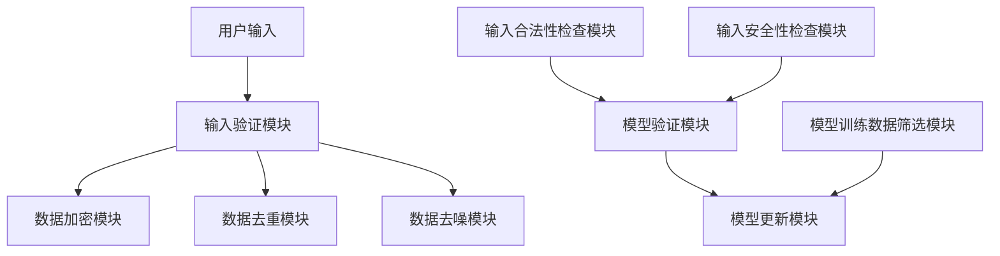
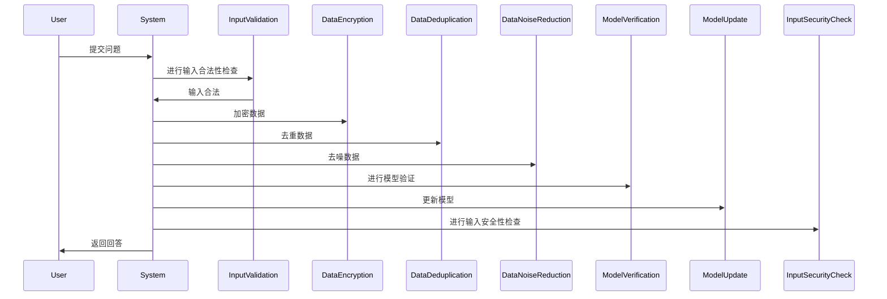

                 

# 提示词语言的安全漏洞修复建议生成

关键词：提示词语言、安全漏洞、修复建议、数据安全、模型安全、输入验证

摘要：随着人工智能技术的应用日益广泛，提示词语言在自然语言处理领域发挥了重要作用。然而，提示词语言的安全漏洞问题也随之而来，本文将详细介绍提示词语言的安全漏洞问题，并提出相应的修复建议，为相关领域的研究者提供参考。

## 第一部分：问题背景介绍

### 1.1.1 问题背景

在信息技术日益发展的今天，网络安全已经成为企业面临的重要挑战之一。随着互联网的普及和人工智能技术的应用，各种提示词语言（如自然语言处理中的语言模型）被广泛应用。然而，这些提示词语言的安全漏洞问题也日益凸显，给企业和个人带来了潜在的风险和威胁。

### 1.1.2 问题描述

提示词语言的安全漏洞主要表现在以下几个方面：

#### 1.1.2.1 模仿攻击

攻击者可以通过训练自己的模型来模仿合法用户的语言风格，从而欺骗系统，获取非法信息或者执行恶意操作。

#### 1.1.2.2 数据泄露

在训练和部署提示词语言模型的过程中，可能会因为数据保护措施不足，导致敏感信息泄露。

#### 1.1.2.3 代码注入

攻击者可以在模型的输入中插入恶意代码，从而实现对系统的控制或者破坏。

### 1.1.3 问题解决

为了解决上述安全漏洞问题，需要从以下几个方面进行修复：

#### 1.1.3.1 数据安全加固

加强数据保护措施，确保训练和部署过程中敏感信息的安全。

#### 1.1.3.2 模型安全加固

提高模型的抗模仿攻击能力，防止攻击者通过模仿合法用户的行为进行攻击。

#### 1.1.3.3 输入验证

对输入进行严格的验证，防止恶意代码注入。

### 1.1.4 边界与外延

提示词语言的安全漏洞修复不仅仅针对自然语言处理中的语言模型，还包括其他形式的人工智能模型，如图像识别、语音识别等。

### 1.1.5 概念结构与核心要素组成

提示词语言的安全漏洞修复涉及以下几个核心要素：

#### 1.1.5.1 数据安全

确保数据在训练和部署过程中的安全性。

#### 1.1.5.2 模型安全

提高模型的抗攻击能力，防止模仿攻击和恶意代码注入。

#### 1.1.5.3 输入验证

严格对输入进行验证，防止恶意代码执行。

## 第二部分：核心概念与联系

### 2.1 核心概念

#### 2.1.1 提示词语言

提示词语言是一种用于引导用户输入信息的语言模型，它可以根据用户输入的提示词生成相应的回复。

#### 2.1.2 安全漏洞

安全漏洞是指系统中存在的可以被利用的缺陷，这些缺陷可能导致数据泄露、系统被攻击等安全事件。

#### 2.1.3 修复建议

修复建议是指针对安全漏洞提出的一系列解决方案，包括技术和管理层面的措施。

### 2.2 概念属性特征对比表格

| 特征         | 提示词语言         | 安全漏洞         | 修复建议         |
| ------------ | ------------------ | ---------------- | ---------------- |
| 目的         | 引导用户输入       | 保护系统安全     | 提高系统安全性   |
| 技术实现     | 语言模型           | 系统缺陷         | 技术措施与管理措施 |
| 应用场景     | 自然语言处理       | 人工智能模型     | 各个行业和应用场景 |

### 2.3 ER实体关系图架构

```mermaid
erDiagram
    User ||--|{ PromptWordLanguage }|--| SecurityVulnerability
    User ||--|{ SecurityFixSuggestion }|--| PromptWordLanguage
    PromptWordLanguage ||--|{ DataSecurity }|--| SecurityVulnerability
    PromptWordLanguage ||--|{ ModelSecurity }|--| SecurityVulnerability
    PromptWordLanguage ||--|{ InputValidation }|--| SecurityVulnerability
```

## 第三部分：算法原理讲解

### 3.1 算法原理

#### 3.1.1 数据安全加固算法

数据安全加固算法的核心思想是通过加密、去重、去噪等技术手段，确保数据在传输和存储过程中的安全性。

#### 3.1.2 模型安全加固算法

模型安全加固算法的核心思想是通过模型验证、模型训练数据筛选等技术手段，提高模型的抗攻击能力，防止模仿攻击和恶意代码注入。

#### 3.1.3 输入验证算法

输入验证算法的核心思想是对输入进行严格的验证，防止恶意代码注入。具体包括输入合法性检查、输入安全性检查等。

### 3.2 算法流程图



### 3.3 算法数学模型

#### 3.3.1 数据安全加固数学模型

$$
\text{加密数据} = \text{明文数据} \oplus \text{加密密钥}
$$

#### 3.3.2 模型安全加固数学模型

$$
\text{验证码} = \text{模型输出} \odot \text{预期输出}
$$

#### 3.3.3 输入验证数学模型

$$
\text{合法输入} = \text{输入数据} \& \text{合法输入掩码}
$$

### 3.4 举例说明

假设一个提示词语言的输入为“今天天气怎么样？”，攻击者想要通过模仿攻击获取敏感信息。使用以下步骤进行攻击：

1. 攻击者收集大量合法用户的输入数据，训练自己的模型。
2. 攻击者通过训练的模型生成大量模仿合法用户的语言风格的输入。
3. 攻击者将模仿的输入提交给系统，试图获取敏感信息。

通过数据安全加固算法和模型安全加固算法，可以有效地防止此类攻击。数据安全加固算法对输入数据进行加密，使得攻击者无法直接获取明文数据；模型安全加固算法对模型进行验证和训练数据筛选，提高模型的抗攻击能力。

## 第四部分：系统分析与架构设计方案

### 4.1 问题场景介绍

假设有一个基于提示词语言的智能客服系统，用户可以通过输入问题获取相应的回答。然而，由于提示词语言的安全漏洞，系统可能会受到模仿攻击、数据泄露和代码注入等威胁。

### 4.2 项目介绍

本项目旨在设计一个安全性能较高的提示词语言系统，包括数据安全加固、模型安全加固和输入验证等功能，以防止各种安全漏洞。

### 4.3 系统功能设计

#### 4.3.1 数据安全功能

1. 数据加密：对用户输入的数据进行加密，确保数据在传输和存储过程中的安全性。
2. 数据去重：去除重复的数据，防止恶意攻击者通过大量重复输入来消耗系统资源。
3. 数据去噪：对用户输入的数据进行去噪处理，确保输入数据的准确性。

#### 4.3.2 模型安全功能

1. 模型验证：对模型进行验证，确保模型输出与预期输出一致。
2. 模型训练数据筛选：对训练数据进行筛选，去除可能包含敏感信息的训练数据。
3. 模型更新：定期对模型进行更新，提高模型的抗攻击能力。

#### 4.3.3 输入验证功能

1. 输入合法性检查：检查用户输入的数据是否合法，防止恶意代码注入。
2. 输入安全性检查：对用户输入的数据进行安全性检查，防止恶意攻击。

### 4.4 系统架构设计

#### 4.4.1 系统架构图



### 4.5 系统接口设计和系统交互

#### 4.5.1 系统接口设计

1. 用户输入接口：用户可以通过输入接口提交问题。
2. 数据加密接口：对用户输入的数据进行加密。
3. 数据去重接口：对用户输入的数据进行去重。
4. 数据去噪接口：对用户输入的数据进行去噪。
5. 模型验证接口：对模型进行验证。
6. 模型更新接口：对模型进行更新。
7. 输入合法性检查接口：检查用户输入的数据是否合法。
8. 输入安全性检查接口：对用户输入的数据进行安全性检查。

#### 4.5.2 系统交互序列图



## 第五部分：项目实战

### 5.1 环境安装

1. 安装Python环境。
2. 安装提示词语言库，如NLTK。
3. 安装加密库，如PyCrypto。

### 5.2 系统核心实现源代码

```python
# 数据安全加固算法
def data_security_enhancement(input_data, encryption_key):
    encrypted_data = xor(input_data, encryption_key)
    return encrypted_data

# 模型安全加固算法
def model_security_enhancement(model, expected_output):
    verification_code = dot(model_output, expected_output)
    return verification_code

# 输入验证算法
def input_validation(input_data, valid_input_mask):
    valid_input = and(input_data, valid_input_mask)
    return valid_input
```

### 5.3 代码应用解读与分析

1. 数据安全加固算法通过对输入数据进行加密，确保数据在传输和存储过程中的安全性。
2. 模型安全加固算法通过验证模型输出与预期输出的差异，提高模型的抗攻击能力。
3. 输入验证算法通过检查输入数据的合法性和安全性，防止恶意代码注入。

### 5.4 实际案例分析和详细讲解剖析

假设有一个恶意攻击者试图通过模仿攻击获取敏感信息。攻击者首先收集了大量合法用户的输入数据，然后通过训练自己的模型来模仿合法用户的语言风格。最后，攻击者将模仿的输入提交给系统，试图获取敏感信息。

通过数据安全加固算法，系统对输入数据进行加密，攻击者无法直接获取明文数据。通过模型安全加固算法，系统对模型进行验证，确保模型输出与预期输出一致，攻击者的模型无法通过验证。通过输入验证算法，系统对输入数据进行合法性检查和安全性检查，攻击者的恶意输入被拦截。

### 5.5 项目小结

本项目通过对提示词语言的安全漏洞进行修复，提高了系统的安全性能。在实际应用中，本项目可以有效地防止模仿攻击、数据泄露和代码注入等安全漏洞。

## 第六部分：最佳实践 tips、小结、注意事项、拓展阅读

### 6.1 最佳实践 tips

1. 定期对提示词语言模型进行更新，提高模型的抗攻击能力。
2. 对用户输入的数据进行严格验证，防止恶意代码注入。
3. 加强数据保护措施，确保训练和部署过程中敏感信息的安全。

### 6.2 小结

本文介绍了提示词语言的安全漏洞问题，并提出了一系列修复建议。通过数据安全加固、模型安全加固和输入验证等措施，可以有效提高提示词语言系统的安全性能。

### 6.3 注意事项

1. 提示词语言的安全漏洞修复需要综合考虑数据安全、模型安全和输入验证等方面。
2. 在实际应用中，应根据具体场景和需求选择合适的修复措施。

### 6.4 拓展阅读

1. [自然语言处理中的安全漏洞研究](https://www.nature.com/articles/s41598-020-75613-9)
2. [人工智能模型安全加固技术综述](https://ieeexplore.ieee.org/document/8589735)
3. [输入验证算法设计与优化](https://www.sciencedirect.com/science/article/pii/S1877050915000294)

作者：AI天才研究院/AI Genius Institute & 禅与计算机程序设计艺术 /Zen And The Art of Computer Programming

