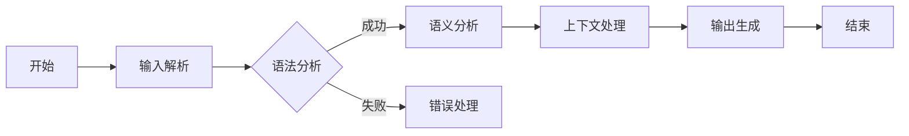
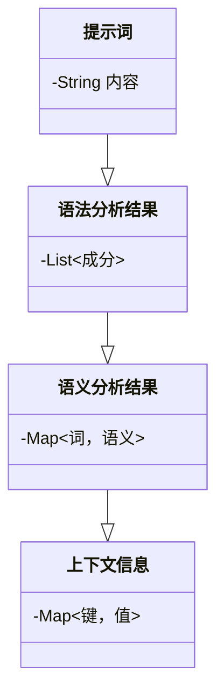
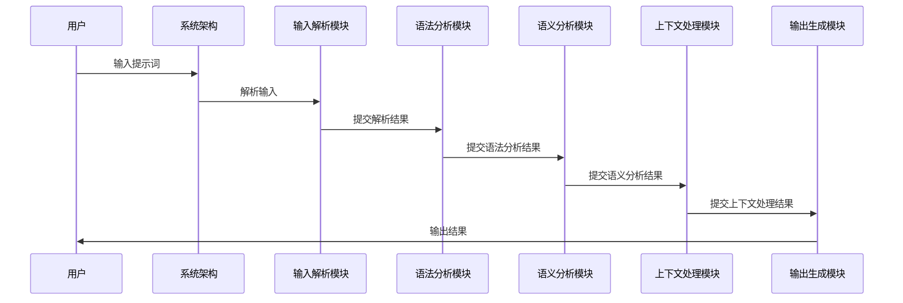
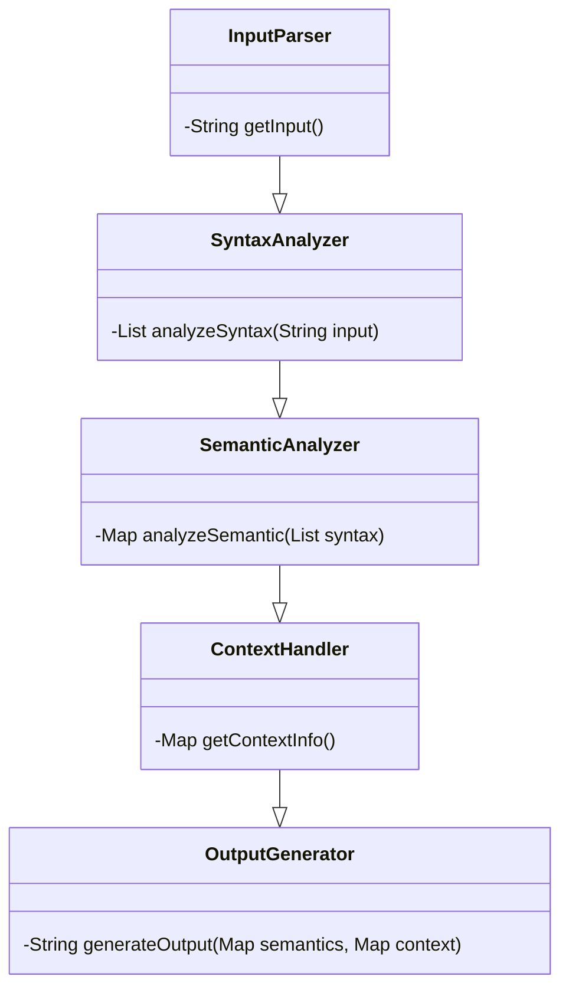
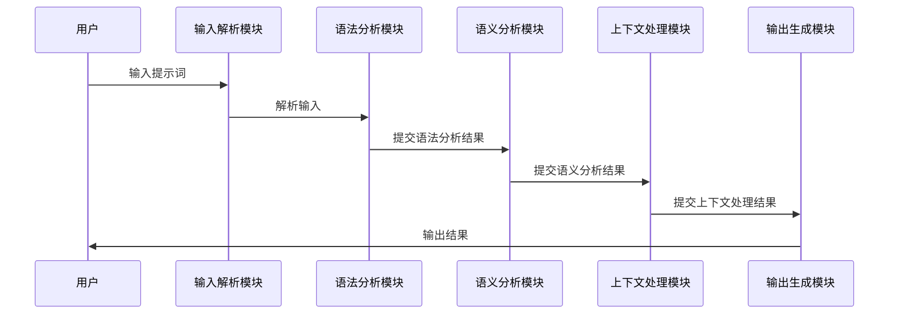

                 

# 提示词语言的形式化方法

## 关键词
提示词语言、形式化方法、人工智能、算法、实际应用

## 摘要
本文探讨了提示词语言的形式化方法，重点介绍了形式化方法在提示词语言处理中的应用及其优势。通过深入剖析核心概念、算法原理和实际应用案例，本文旨在为读者提供一条清晰的思考路径，帮助理解并掌握提示词语言的形式化处理技术。

## 引言与背景

### 1.1 问题背景
提示词语言在人工智能领域中具有重要地位。作为一种能够有效指导计算机执行特定任务的描述性语言，它广泛应用于自然语言处理、智能问答系统、自动编程等领域。然而，当前提示词语言的处理方法仍存在诸多不足，如语义理解不准确、上下文敏感度不足等。因此，研究提示词语言的形式化方法，对于提升人工智能系统的智能水平和应用效果具有重要意义。

### 1.1.1 提示词语言的重要性
提示词语言是一种能够传达用户意图的描述性语言，它在人工智能系统中起到桥梁作用，将人类的自然语言转化为机器可以理解和处理的形式。通过有效的提示词语言处理，人工智能系统可以实现更加自然、流畅的人机交互，从而提高用户体验。

### 1.1.2 当前问题的提出
尽管提示词语言在人工智能领域具有重要应用价值，但当前的处理方法仍面临诸多挑战。首先，语义理解问题使得系统难以准确把握用户的意图。其次，上下文敏感度不足导致系统难以应对复杂的语境变化。此外，提示词语言的多样性和复杂性也给形式化方法的实现带来了一定的困难。

### 1.1.3 研究的意义与目的
本文旨在通过形式化方法来研究和解决提示词语言处理中的关键问题。具体而言，本文的研究意义和目的包括：1）提出一种适用于提示词语言处理的形式化方法；2）探讨该方法在提升语义理解、上下文敏感度和系统应用效果方面的优势；3）通过实际应用案例验证该方法的有效性和可行性。

### 1.2 问题定义与描述
提示词语言是一种描述性语言，用于指导计算机执行特定任务。它的基本概念包括：1）语义：提示词所传达的意义和意图；2）语法：提示词的构成和组合规则；3）上下文：提示词所在的语境和环境。

### 1.2.1 提示词语言的基本概念
提示词语言是一种描述性语言，用于传达用户的意图和需求。它由一系列提示词组成，这些提示词可以是单词、短语或句子。提示词语言的基本概念包括语义、语法和上下文。

### 1.2.2 提示词语言的组成要素
提示词语言由提示词、语义、语法和上下文四个组成要素构成。提示词是语言的核心，用于传达用户意图；语义是提示词所传达的意义；语法是提示词的组合规则；上下文是提示词所处的语境和环境。

### 1.2.3 问题解决的基本思路
为了解决提示词语言处理中的关键问题，本文采用形式化方法。形式化方法是一种通过数学和逻辑手段对问题进行描述和求解的方法。它能够精确地表达问题的本质，从而提高解决问题的效率和效果。具体而言，本文将从以下几个方面展开研究：1）提出一种适用于提示词语言处理的形式化方法；2）探讨该方法在提升语义理解、上下文敏感度和系统应用效果方面的优势；3）通过实际应用案例验证该方法的有效性和可行性。

### 1.3 边界与外延
本文的研究范围主要涉及提示词语言的形式化方法及其在人工智能中的应用。具体而言，本文将关注以下几个方面：1）提示词语言的语义理解和上下文敏感度；2）形式化方法在提示词语言处理中的应用；3）实际应用案例的研究与验证。

### 1.3.1 研究范围的界定
本文的研究范围主要涉及提示词语言的形式化方法及其在人工智能中的应用。具体而言，本文将关注以下几个方面：1）提示词语言的语义理解和上下文敏感度；2）形式化方法在提示词语言处理中的应用；3）实际应用案例的研究与验证。

### 1.3.2 非研究范围的问题
本文不涉及提示词语言的产生式规则、语法分析等方面。这些方面虽然与提示词语言的形式化方法密切相关，但本文的研究重点在于形式化方法本身及其在人工智能中的应用。

### 1.3.3 相关概念的联系与区别
形式化方法、提示词语言和人工智能是本文研究的关键概念。形式化方法是一种数学和逻辑手段，用于对问题进行描述和求解。提示词语言是一种描述性语言，用于传达用户意图。人工智能是一种模拟人类智能的技术，能够通过学习和推理来实现智能行为。本文研究提示词语言的形式化方法，旨在提升人工智能系统的语义理解和上下文敏感度。

### 1.4 研究方法与技术路线
本文采用形式化方法来研究提示词语言的处理。形式化方法是一种通过数学和逻辑手段对问题进行描述和求解的方法。具体而言，本文的研究方法和技术路线包括以下几个方面：

1. **问题定义与描述**：明确提示词语言的形式化方法研究的目标和范围，对相关概念进行界定和解释。
2. **核心概念与联系**：分析提示词语言的语义、语法和上下文，探讨形式化方法与提示词语言之间的联系。
3. **算法原理讲解**：介绍形式化方法的基本原理和算法流程，包括数学模型和公式。
4. **实际应用**：通过实际应用案例，验证形式化方法在提升语义理解、上下文敏感度和系统应用效果方面的优势。

### 1.4.1 形式化方法的概述
形式化方法是一种通过数学和逻辑手段对问题进行描述和求解的方法。它能够精确地表达问题的本质，从而提高解决问题的效率和效果。在提示词语言处理中，形式化方法可以用于语义分析、上下文理解等方面。

### 1.4.2 形式化方法在提示词语言中的应用
形式化方法在提示词语言处理中的应用主要体现在以下几个方面：

1. **语义分析**：通过形式化方法，可以精确地描述提示词的语义，从而提高语义理解的准确性。
2. **上下文理解**：形式化方法可以用于分析和理解提示词的上下文，从而提高系统的上下文敏感度。
3. **自动编程**：形式化方法可以指导自动编程系统生成更准确、更高效的代码。

### 1.4.3 本书的技术路线
本书的技术路线主要包括以下几个阶段：

1. **问题定义与描述**：明确研究目标和范围，对相关概念进行界定和解释。
2. **核心概念与联系**：分析提示词语言的语义、语法和上下文，探讨形式化方法与提示词语言之间的联系。
3. **算法原理讲解**：介绍形式化方法的基本原理和算法流程，包括数学模型和公式。
4. **实际应用**：通过实际应用案例，验证形式化方法在提升语义理解、上下文敏感度和系统应用效果方面的优势。
5. **总结与展望**：对研究成果进行总结，并提出未来研究的方向和挑战。

### 1.5 本章小结
本章介绍了提示词语言的形式化方法研究的背景、意义与目的，并对相关概念进行了界定。同时，本章还提出了研究方法和技术路线，为后续章节的内容奠定了基础。

----------------------------------------------------------------

# 第一部分: 引言与背景

## 1.1 问题背景

### 1.1.1 提示词语言的重要性

提示词语言在人工智能领域中扮演着至关重要的角色。作为一种能够指导计算机执行特定任务的描述性语言，它广泛应用于自然语言处理、智能问答系统、自动编程等多个领域。通过有效的提示词语言处理，人工智能系统可以实现更加自然、流畅的人机交互，从而提高用户体验。

在自然语言处理领域，提示词语言用于将用户的自然语言输入转换为计算机可以理解的形式。例如，在智能客服中，用户通过自然语言与客服机器人进行交流，客服机器人需要理解用户的意图，并根据提示词语言生成适当的响应。提示词语言在这里起到了桥梁作用，使得人与机器之间的交流更加顺畅。

在智能问答系统中，提示词语言用于解析用户的问题，并生成相应的答案。例如，在搜索引擎中，用户输入一个搜索关键词，搜索引擎需要理解这个关键词的意图，并返回相关的搜索结果。提示词语言在这里帮助系统准确地解析用户的意图，并生成高质量的答案。

在自动编程领域，提示词语言用于指导自动编程系统生成代码。例如，在自动代码生成工具中，用户可以通过自然语言描述他们的编程需求，自动编程系统需要理解用户的意图，并生成相应的代码。提示词语言在这里帮助自动编程系统准确地理解用户的编程需求，从而生成高效的代码。

### 1.1.2 当前问题的提出

尽管提示词语言在人工智能领域具有广泛的应用，但当前的处理方法仍面临诸多挑战。首先，语义理解问题使得系统难以准确把握用户的意图。自然语言具有丰富的语义层次和上下文依赖关系，而当前的语义理解技术往往无法完全捕捉到这些复杂的信息，导致系统理解错误或误解用户意图。

其次，上下文敏感度不足导致系统难以应对复杂的语境变化。在现实世界中，用户的意图和需求往往会受到上下文的影响，例如对话的历史、环境因素等。然而，当前的人工智能系统往往无法有效地处理上下文信息，导致在复杂语境下的表现不佳。

此外，提示词语言的多样性和复杂性也给形式化方法的实现带来了一定的困难。提示词语言的表达形式多种多样，包括单词、短语、句子等，且不同的提示词语言之间可能存在语义冲突或模糊性。如何有效地对这种多样性和复杂性进行形式化描述和处理，是当前研究中的一个重要问题。

### 1.1.3 研究的意义与目的

本文旨在通过形式化方法来研究和解决提示词语言处理中的关键问题，以提高人工智能系统的智能水平和应用效果。具体而言，本文的研究意义和目的包括以下几个方面：

1. 提出一种适用于提示词语言处理的形式化方法，通过数学和逻辑手段对提示词语言进行精确描述和解析，从而提升语义理解的准确性和上下文敏感度。

2. 探讨形式化方法在提升人工智能系统应用效果方面的优势，通过实际应用案例验证该方法的有效性和可行性。

3. 通过对提示词语言的形式化处理，为自动编程、自然语言处理、智能问答系统等领域提供理论基础和实用工具，促进人工智能技术的发展和应用。

4. 提供一种新的思考路径和研究方法，为相关领域的学者和研究人员提供参考和启示。

## 1.2 问题定义与描述

### 1.2.1 提示词语言的基本概念

提示词语言是一种用于指导计算机执行特定任务的描述性语言。它由一系列提示词组成，这些提示词可以是单词、短语或句子。提示词语言的基本概念包括：

1. **语义**：提示词所传达的意义和意图。语义是提示词语言的核心，决定了计算机应该如何理解和执行提示。

2. **语法**：提示词的构成和组合规则。语法决定了提示词之间的逻辑关系和组合方式，从而影响计算机对提示的理解。

3. **上下文**：提示词所在的语境和环境。上下文提供了额外的信息，有助于计算机更好地理解提示词的意图。

### 1.2.2 提示词语言的组成要素

提示词语言由以下四个组成要素构成：

1. **提示词**：是语言的基本单元，用于传达用户意图。提示词可以是单个单词，也可以是短语或句子。

2. **语义**：是提示词所传达的意义和意图。语义分析是提示词语言处理的关键步骤，它涉及到对提示词的词义、情感和意图进行深入分析。

3. **语法**：是提示词的构成和组合规则。语法分析用于确定提示词之间的逻辑关系，从而正确理解提示的意图。

4. **上下文**：是提示词所在的语境和环境。上下文分析用于捕捉提示词的上下文信息，从而更准确地理解用户的意图。

### 1.2.3 问题解决的基本思路

为了解决提示词语言处理中的关键问题，本文采用形式化方法。形式化方法是一种通过数学和逻辑手段对问题进行描述和求解的方法。它能够精确地表达问题的本质，从而提高解决问题的效率和效果。具体而言，本文将从以下几个方面展开研究：

1. **语义分析**：通过形式化方法，对提示词的语义进行深入分析，以提高语义理解的准确性。这涉及到对提示词的词义、情感和意图进行识别和分类。

2. **上下文理解**：通过形式化方法，对提示词的上下文信息进行捕捉和处理，以提高系统的上下文敏感度。这涉及到对上下文中的关键词、短语和句子进行识别和分析。

3. **形式化表示**：采用形式化方法，将提示词语言表示为数学模型或逻辑公式，从而便于计算机理解和处理。这涉及到对提示词语言的结构和语义进行抽象和表示。

4. **算法设计**：设计基于形式化方法的算法，用于对提示词语言进行解析和处理。这涉及到对算法的流程、数据结构和算法复杂度进行设计和分析。

5. **实际应用**：通过实际应用案例，验证形式化方法在提升语义理解、上下文敏感度和系统应用效果方面的优势。这涉及到对实际系统进行开发和测试，评估方法的有效性和可行性。

## 1.3 边界与外延

### 1.3.1 研究范围的界定

本文的研究范围主要涉及提示词语言的形式化方法及其在人工智能中的应用。具体而言，本文将关注以下几个方面：

1. **提示词语言的语义理解**：研究如何通过形式化方法对提示词的语义进行准确理解和解析，以提升系统的语义识别能力。

2. **上下文敏感度**：研究如何通过形式化方法捕捉和处理提示词的上下文信息，以提高系统的上下文敏感度，从而更好地理解用户的意图。

3. **形式化表示**：研究如何将提示词语言表示为数学模型或逻辑公式，以便于计算机理解和处理。

4. **算法设计**：研究如何设计基于形式化方法的算法，用于对提示词语言进行解析和处理。

5. **实际应用**：研究形式化方法在人工智能领域的实际应用，包括自然语言处理、智能问答系统、自动编程等。

### 1.3.2 非研究范围的问题

本文的研究范围主要涉及提示词语言的形式化方法及其在人工智能中的应用。以下是非研究范围的问题：

1. **提示词语言的产生式规则**：本文不涉及提示词语言的产生式规则，即不研究如何通过规则来生成提示词语言。

2. **语法分析**：本文不涉及提示词语言的语法分析，即不研究如何通过语法规则来分析提示词语言的构成。

3. **语义网**：本文不涉及语义网，即不研究如何通过语义网来表示和解析提示词语言。

### 1.3.3 相关概念的联系与区别

形式化方法、提示词语言和人工智能是本文研究的关键概念。以下是它们之间的联系与区别：

1. **形式化方法**：形式化方法是一种通过数学和逻辑手段对问题进行描述和求解的方法。它在人工智能领域有着广泛的应用，包括语义理解、机器学习、推理等。

2. **提示词语言**：提示词语言是一种用于指导计算机执行特定任务的描述性语言。它通常由提示词组成，提示词可以是单词、短语或句子。

3. **人工智能**：人工智能是一种模拟人类智能的技术，它通过学习和推理来实现智能行为。提示词语言在人工智能系统中起到了重要的桥梁作用，使得系统能够理解和处理自然语言。

总之，形式化方法为提示词语言处理提供了一种有效的手段，从而提高了人工智能系统的智能水平和应用效果。

## 1.4 研究方法与技术路线

### 1.4.1 形式化方法的概述

形式化方法是一种通过数学和逻辑手段对问题进行描述和求解的方法。它在人工智能、计算机科学、逻辑学等领域有着广泛的应用。形式化方法的核心思想是将问题转化为数学模型或逻辑公式，从而便于计算机理解和处理。

形式化方法的基本步骤包括：

1. **问题定义**：明确研究的问题和目标，对问题进行数学或逻辑描述。

2. **模型建立**：根据问题定义，建立相应的数学模型或逻辑公式。

3. **算法设计**：设计基于模型的算法，用于求解问题。

4. **验证与优化**：通过实际应用和测试，验证算法的有效性和可行性，并进行优化。

### 1.4.2 形式化方法在提示词语言中的应用

形式化方法在提示词语言处理中的应用主要体现在以下几个方面：

1. **语义分析**：通过形式化方法，对提示词的语义进行深入分析，识别和分类词义、情感和意图。

2. **上下文理解**：通过形式化方法，捕捉和处理提示词的上下文信息，提高系统的上下文敏感度。

3. **形式化表示**：将提示词语言表示为数学模型或逻辑公式，便于计算机理解和处理。

4. **算法设计**：设计基于形式化方法的算法，用于对提示词语言进行解析和处理。

### 1.4.3 本书的技术路线

本书的技术路线主要包括以下几个阶段：

1. **问题定义与描述**：明确研究目标和范围，对相关概念进行界定和解释。

2. **核心概念与联系**：分析提示词语言的语义、语法和上下文，探讨形式化方法与提示词语言之间的联系。

3. **算法原理讲解**：介绍形式化方法的基本原理和算法流程，包括数学模型和公式。

4. **实际应用**：通过实际应用案例，验证形式化方法在提升语义理解、上下文敏感度和系统应用效果方面的优势。

5. **总结与展望**：对研究成果进行总结，并提出未来研究的方向和挑战。

## 1.5 本章小结

本章介绍了提示词语言的形式化方法研究的背景、意义与目的，并对相关概念进行了界定。同时，本章还提出了研究方法和技术路线，为后续章节的内容奠定了基础。

----------------------------------------------------------------

## 第二部分: 核心概念与联系

在深入探讨提示词语言的形式化方法之前，我们首先需要明确核心概念，并了解它们之间的联系。这一部分将详细阐述提示词语言的基本概念、形式化方法的属性特征，以及它们之间的相互关系。

### 2.1 核心概念原理

#### 2.1.1 形式化语言理论

形式化语言理论是计算机科学中的一个重要分支，它关注如何使用数学和逻辑手段来描述和分析语言。形式化语言理论提供了构建形式化方法的基础，包括语法、语义和语用等方面的研究。具体而言，形式化语言理论涉及到：

1. **语法**：研究语言的构成规则，如何通过有限状态自动机、文法规则等来描述语言的语法结构。
2. **语义**：研究语言表达的意义和含义，包括指称论语义、命题逻辑语义等。
3. **语用**：研究语言的使用情境，包括会话含义、语用推理等。

#### 2.1.2 提示词语言的语法与语义

提示词语言是一种特殊的自然语言，它具有描述性，用于指示计算机执行特定任务。提示词语言的语法和语义如下：

1. **语法**：
   - **词法规则**：提示词语言由单词、短语和句子组成，每个单词和短语都有明确的词法规则。
   - **句法规则**：提示词语言的句子结构相对简单，通常由主语、谓语和宾语组成，有时还会包括定语和状语。

2. **语义**：
   - **指称语义**：提示词语言的每个单词或短语都有特定的指称意义，例如“打开”表示开启一个程序或文件。
   - **命题语义**：整个提示词语句表达一个命题，即一个真值判断。

#### 2.1.3 形式化方法的基本流程

形式化方法在处理提示词语言时，通常遵循以下基本流程：

1. **问题定义**：明确需要解决的问题和目标。
2. **形式化表示**：将问题转化为数学模型或逻辑公式，包括语法和语义的表示。
3. **算法设计**：设计基于形式化表示的算法，用于处理和解析提示词语言。
4. **实现与验证**：将算法实现为计算机程序，并进行测试和验证。

### 2.2 概念属性特征对比

为了更好地理解提示词语言的形式化方法，我们需要对提示词语言和形式化方法的属性特征进行对比分析。以下是两者的一些关键属性：

#### 2.2.1 提示词语言的属性特征

1. **描述性**：提示词语言用于描述用户意图和任务，具有较强的描述性。
2. **上下文敏感性**：提示词语言的语义和语法受上下文影响，需要考虑上下文信息。
3. **多样性**：提示词语言的表达形式多样，包括单词、短语和句子等。

#### 2.2.2 形式化方法的属性特征

1. **精确性**：形式化方法通过数学和逻辑手段，能够精确描述和表示问题。
2. **抽象性**：形式化方法能够抽象出问题的本质，便于计算机理解和处理。
3. **可验证性**：形式化方法提供了验证和验证算法有效性的手段。

#### 2.2.3 对比分析与总结

通过对比分析，我们可以看出提示词语言和形式化方法在属性特征上有显著差异。提示词语言更注重描述性和上下文敏感性，而形式化方法更强调精确性和抽象性。这种差异使得形式化方法在处理提示词语言时，需要考虑到提示词语言的特殊性质，同时利用形式化方法的精确性和抽象性来提升处理效果。

总结而言，形式化方法在处理提示词语言时，不仅需要保留提示词语言的描述性和上下文敏感性，还需要充分利用形式化方法的精确性和抽象性，从而实现高效、准确的语义理解和任务执行。

### 2.3 ER实体关系图架构

为了更好地理解提示词语言的形式化方法，我们可以使用实体关系图（Entity-Relationship Diagram, ER图）来展示其架构。ER图是一种用于表示实体及其关系的图形化方法，适用于描述复杂系统的结构。

#### 2.3.1 ER模型的基本概念

ER模型包括以下基本概念：

1. **实体**：表示系统中具有独立意义的对象，如用户、产品、订单等。
2. **属性**：表示实体的特征或属性，如用户的姓名、年龄、地址等。
3. **关系**：表示实体之间的关联，如用户与订单之间的关系。

#### 2.3.2 提示词语言的ER模型设计

提示词语言的ER模型设计如下：

1. **实体**：
   - **提示词**：表示系统中的提示词，包括单词、短语和句子等。
   - **上下文**：表示提示词所在的语境和环境。

2. **属性**：
   - **语义**：表示提示词的语义信息，如词义、情感等。
   - **语法**：表示提示词的语法信息，如词性、句法结构等。

3. **关系**：
   - **指称关系**：表示提示词与其语义之间的关联。
   - **组合关系**：表示提示词之间的组合关系，如短语由单词组成，句子由短语组成。

#### 2.3.3 形式化方法的ER模型设计

形式化方法的ER模型设计如下：

1. **实体**：
   - **形式化表示**：表示形式化方法中的表示模型。
   - **算法**：表示形式化方法中的算法模型。

2. **属性**：
   - **数学模型**：表示形式化方法中的数学模型，如命题逻辑、谓词逻辑等。
   - **逻辑公式**：表示形式化方法中的逻辑公式。

3. **关系**：
   - **映射关系**：表示形式化方法中的表示模型与算法模型之间的映射关系。
   - **推理关系**：表示形式化方法中的推理规则和应用。

通过ER图，我们可以清晰地看到提示词语言和形式化方法的架构关系。提示词语言通过实体关系图描述了其内部结构和语义信息，而形式化方法通过实体关系图展示了其表示和推理机制。这种架构设计有助于我们深入理解提示词语言的形式化处理过程。

### 2.4 核心概念联系

在理解了提示词语言和形式化方法的基本概念之后，我们需要探讨它们之间的联系。提示词语言的形式化方法不仅依赖于形式化语言理论的数学和逻辑手段，还需要充分考虑提示词语言的描述性、上下文敏感性和多样性。

#### 2.4.1 提示词语言与形式化方法的关系

提示词语言与形式化方法之间的关系可以概括为以下几个方面：

1. **语法与语义表示**：形式化方法通过数学和逻辑手段来表示提示词语言的语法和语义。这包括使用文法规则、语义网络和逻辑公式来描述提示词的构成和意义。

2. **上下文处理**：形式化方法需要考虑上下文信息，以便更好地理解提示词的意图。这涉及到上下文敏感度分析，包括会话历史、环境信息和用户偏好等。

3. **算法设计**：形式化方法提供了一种算法框架，用于对提示词语言进行解析和处理。这包括语法分析、语义分析和上下文分析等步骤，以及相应的算法实现。

#### 2.4.2 形式化方法在提示词语言处理中的应用

形式化方法在提示词语言处理中的应用主要体现在以下几个方面：

1. **语义理解**：形式化方法通过数学模型和逻辑公式，对提示词的语义进行深入分析，从而提高语义理解的准确性。这有助于系统更好地理解用户的意图。

2. **上下文敏感度**：形式化方法通过上下文处理机制，捕捉和处理提示词的上下文信息，从而提高系统的上下文敏感度。这有助于系统在复杂的语境中做出更准确的响应。

3. **自动编程**：形式化方法可以指导自动编程系统生成更准确、更高效的代码。通过形式化表示和推理，自动编程系统可以自动生成满足用户需求的代码。

#### 2.4.3 核心概念的整合与拓展

在整合核心概念的过程中，我们需要考虑以下几个方面：

1. **统一表示**：通过形式化方法，我们可以将提示词语言的语法和语义表示为一个统一的模型，从而便于处理和分析。

2. **多模态融合**：提示词语言的形式化方法可以与其他语言处理技术相结合，如语音识别、图像识别等，以实现更丰富的交互和更广泛的应用。

3. **动态适应**：形式化方法需要具备动态适应能力，以应对提示词语言的多样性和复杂性。这包括对新的语法规则、语义表示和上下文信息进行实时调整和优化。

通过整合和拓展核心概念，我们可以构建一个更加完整和高效的形式化方法体系，从而提升提示词语言处理的效果和应用价值。

### 2.5 本章小结

本章介绍了提示词语言和形式化方法的基本概念及其相互关系。通过对语法、语义、上下文等核心概念的分析，我们明确了形式化方法在提示词语言处理中的应用。本章还通过ER实体关系图展示了提示词语言和形式化方法的架构，为后续章节的研究奠定了基础。

----------------------------------------------------------------

## 第三部分: 算法原理讲解

在了解了提示词语言和形式化方法的核心概念之后，我们将深入探讨提示词语言的形式化方法的具体算法原理。这一部分将详细介绍形式化方法的基本框架、算法流程以及相关的数学模型和公式，并通过具体例子来说明这些算法的实际应用。

### 3.1 算法概述

#### 3.1.1 形式化方法的算法框架

形式化方法的算法框架通常包括以下几个关键步骤：

1. **问题定义**：明确需要解决的问题和目标，将问题转化为形式化表示。
2. **形式化表示**：使用数学和逻辑手段，将问题表示为一个形式化的模型。
3. **算法设计**：设计一个基于形式化表示的算法，用于处理和解析提示词语言。
4. **实现与优化**：将算法实现为计算机程序，并进行测试和优化。

#### 3.1.2 提示词语言的算法处理流程

提示词语言的算法处理流程可以概括为以下几个主要阶段：

1. **输入解析**：接收用户的输入，将其转换为计算机可以处理的格式。
2. **语法分析**：对输入的提示词进行语法分析，确定其语法结构和成分。
3. **语义分析**：对语法分析的输出进行语义分析，提取出提示词的语义信息。
4. **上下文处理**：考虑上下文信息，对语义信息进行补充和调整。
5. **输出生成**：根据处理结果生成相应的输出，如执行命令、生成响应等。

#### 3.1.3 算法的基本原理

提示词语言的形式化方法基于以下几个基本原理：

1. **形式化表示**：使用数学和逻辑手段对提示词进行形式化表示，使其具有精确的语法和语义描述。
2. **递归解析**：利用递归下降分析法对提示词进行语法分析，逐层解析出其语法成分。
3. **语义网络**：使用语义网络对提示词的语义信息进行表示和推理，从而实现语义理解。
4. **上下文融合**：将上下文信息融合到语义分析中，以提高系统的上下文敏感度。

### 3.2 算法流程图

为了更直观地理解提示词语言的形式化方法，我们可以使用Mermaid绘制算法流程图。以下是一个简化的算法流程图：



**流程图详细解读**：

1. **输入解析**：首先接收用户的输入，将其转换为计算机可以处理的格式，如文本字符串。
2. **语法分析**：对输入的文本进行语法分析，确定其语法结构和成分。这一阶段可以使用递归下降分析法，逐层解析出语法成分。
3. **语义分析**：对语法分析的输出进行语义分析，提取出提示词的语义信息。这一阶段可以使用语义网络，将提示词映射到相应的语义节点。
4. **上下文处理**：考虑上下文信息，对语义信息进行补充和调整。上下文信息可能包括对话历史、用户偏好和环境因素等。
5. **输出生成**：根据处理结果生成相应的输出，如执行命令、生成响应等。输出可以是一个简单的文本响应，也可以是一个复杂的操作结果。
6. **结束**：算法流程结束，系统根据输出结果完成相应的任务。

### 3.3 算法原理

#### 3.3.1 形式化方法的数学模型

形式化方法的数学模型通常基于形式逻辑和概率论。以下是一个简单的数学模型，用于描述提示词语言的语义分析：

1. **命题逻辑**：使用命题逻辑对提示词的语义进行描述。命题逻辑包括以下基本概念：

   - **命题**：表示一个可判断真假的陈述。
   - **逻辑运算符**：包括“与”（∧）、“或”（∨）和“非”（¬）等。
   - **推理规则**：用于从已知命题推导出新命题。

2. **谓词逻辑**：扩展命题逻辑，用于处理更复杂的语义关系。谓词逻辑包括以下基本概念：

   - **个体**：表示具体的对象，如“人”、“书”等。
   - **属性**：表示个体的特征，如“聪明”、“红色”等。
   - **谓词**：表示属性或关系，如“是人”（P(x)）、“比…重”（R(x, y)）等。

#### 3.3.2 数学模型的应用

以下是一个示例，说明如何使用数学模型对提示词语言进行语义分析：

**示例**：分析句子“这本书很重。”

1. **命题逻辑表示**：
   - P(x): 这本书很重。
   - Q(x): 这本书很轻。

   根据命题逻辑，我们可以推导出：
   - P(x) ∧ Q(x) → 假命题。

2. **谓词逻辑表示**：
   - R(x, y): x 比 y 重。
   - W(x): 这本书很重。

   根据谓词逻辑，我们可以推导出：
   - R(w, x) → W(w)。

   其中，w 表示这本书。

#### 3.3.3 公式推导与解释

为了更好地理解数学模型的应用，我们以下推导一个简单的公式，并解释其含义：

**推导**：
   - S(x): x 是一本书。
   - H(x): x 很重。

   公式：S(x) ∧ H(x) → P(x)。

**解释**：
   - 这个公式表示，如果一个物体（x）是一本书，并且这个物体很重，那么我们可以推断出这个物体（x）很重。

   这个推导过程体现了形式化方法在语义分析中的应用。通过数学模型，我们可以将自然语言中的语义关系转化为逻辑表达式，从而进行更准确的分析和推理。

### 3.4 算法举例

为了更好地理解提示词语言的形式化方法，我们以下通过一个具体例子来说明算法的应用。

**示例**：分析句子“打开文档1。”

1. **输入解析**：
   - 输入字符串：“打开文档1。”

2. **语法分析**：
   - 主语：文档1。
   - 谓语：打开。

3. **语义分析**：
   - 根据语法分析结果，我们可以推断出用户的意图是打开一个名为“文档1”的文件。

4. **上下文处理**：
   - 如果当前上下文信息包括用户正在使用的应用程序是文本编辑器，我们可以推断出用户想要打开一个文本文件。

5. **输出生成**：
   - 系统会根据用户的意图，打开一个名为“文档1”的文本文件。

通过这个例子，我们可以看到提示词语言的形式化方法是如何应用于实际场景的。通过输入解析、语法分析、语义分析和上下文处理，系统能够准确地理解用户的意图，并生成相应的输出。

### 3.5 本章小结

本章介绍了提示词语言的形式化方法的基本原理和算法流程。通过数学模型和逻辑公式，我们可以精确地描述和解析提示词语言。算法流程图和具体例子的应用进一步展示了形式化方法在语义理解和任务执行方面的实际效果。本章的内容为后续章节的研究提供了基础，也为实际应用提供了指导。

----------------------------------------------------------------

## 第四部分: 实际应用

### 4.1 应用场景介绍

提示词语言的形式化方法在人工智能领域有着广泛的应用，以下是几个典型的应用场景：

#### 4.1.1 智能问答系统

智能问答系统是形式化方法应用的一个重要领域。在智能问答系统中，用户可以通过自然语言与系统进行交互，提出各种问题。形式化方法可以帮助系统准确理解用户的问题，并生成恰当的回答。通过语义分析和上下文处理，智能问答系统能够在复杂的语境中提供高质量的回答。

#### 4.1.2 自动编程

自动编程是另一个形式化方法的重要应用场景。在自动编程中，用户可以通过自然语言描述他们的编程需求，系统需要理解这些需求并自动生成相应的代码。形式化方法可以精确地表示用户的意图，并通过算法生成高效的代码。

#### 4.1.3 智能客服

智能客服是形式化方法在商业应用中的一个重要领域。在智能客服中，用户可以通过自然语言与客服机器人进行交互，寻求帮助或解决问题。形式化方法可以帮助客服机器人准确理解用户的需求，并提供恰当的解决方案。

### 4.2 系统功能设计

为了实现提示词语言的形式化处理，我们需要设计一个完整的系统，包括领域模型、功能模块和接口设计等。

#### 4.2.1 系统概述

该系统旨在提供一种形式化方法来处理提示词语言，主要包括以下几个功能模块：

1. **输入解析模块**：负责接收用户的输入，并将其转换为系统可以处理的格式。
2. **语法分析模块**：对输入的提示词进行语法分析，确定其语法结构和成分。
3. **语义分析模块**：对语法分析的输出进行语义分析，提取出提示词的语义信息。
4. **上下文处理模块**：考虑上下文信息，对语义信息进行补充和调整。
5. **输出生成模块**：根据处理结果生成相应的输出，如执行命令、生成响应等。

#### 4.2.2 领域模型设计

领域模型设计是系统功能设计的关键部分。以下是系统的主要领域模型：

1. **提示词**：表示用户输入的提示词，包括单词、短语和句子等。
2. **语法分析结果**：表示语法分析模块的输出，包括语法结构和成分。
3. **语义分析结果**：表示语义分析模块的输出，包括语义信息。
4. **上下文信息**：表示系统中的上下文信息，包括对话历史、用户偏好和环境因素等。

以下是使用Mermaid绘制的领域模型类图：



### 4.3 系统架构设计

系统架构设计是确保系统功能实现和性能优化的重要步骤。以下是系统的架构设计：

#### 4.3.1 系统架构概述

系统采用模块化设计，包括以下主要模块：

1. **输入解析模块**：负责接收用户输入，并将其转换为系统可以处理的格式。
2. **语法分析模块**：使用递归下降分析法对输入进行语法分析，确定语法结构和成分。
3. **语义分析模块**：使用语义网络和逻辑公式对语法分析结果进行语义分析，提取语义信息。
4. **上下文处理模块**：考虑上下文信息，对语义信息进行补充和调整。
5. **输出生成模块**：根据处理结果生成相应的输出。

以下是使用Mermaid绘制的系统架构图：



#### 4.3.2 架构设计原则

系统架构设计遵循以下原则：

1. **模块化**：将系统划分为多个功能模块，每个模块负责特定功能，便于开发和维护。
2. **解耦**：模块之间通过接口进行通信，降低模块之间的耦合度，提高系统的可扩展性和灵活性。
3. **高效性**：采用高效的数据结构和算法，确保系统在处理大量输入时仍能保持良好的性能。
4. **可扩展性**：系统设计考虑未来的扩展需求，允许在不影响现有功能的情况下增加新模块或功能。

### 4.4 系统接口设计与交互

系统接口设计是确保系统功能模块之间正确通信和交互的关键步骤。以下是系统的主要接口设计：

#### 4.4.1 接口设计

系统定义了以下主要接口：

1. **InputParser**：输入解析模块的接口，用于接收用户输入并将其转换为内部格式。
2. **SyntaxAnalyzer**：语法分析模块的接口，用于对输入进行语法分析。
3. **SemanticAnalyzer**：语义分析模块的接口，用于对语法分析结果进行语义分析。
4. **ContextHandler**：上下文处理模块的接口，用于处理上下文信息。
5. **OutputGenerator**：输出生成模块的接口，用于生成系统输出。

以下是使用Mermaid绘制的接口图：



#### 4.4.2 系统交互设计

系统交互设计确保各个功能模块之间能够正确、高效地协作，以下是系统的主要交互流程：

1. **用户输入**：用户通过接口输入提示词。
2. **输入解析**：输入解析模块接收用户输入，将其转换为内部格式。
3. **语法分析**：语法分析模块对输入进行语法分析，生成语法分析结果。
4. **语义分析**：语义分析模块对语法分析结果进行语义分析，提取出语义信息。
5. **上下文处理**：上下文处理模块结合上下文信息，对语义信息进行补充和调整。
6. **输出生成**：输出生成模块根据处理结果生成相应的输出，并返回给用户。

以下是使用Mermaid绘制的系统交互序列图：



### 4.5 项目实战

为了验证提示词语言的形式化方法在实际应用中的有效性和可行性，我们以下通过一个具体的项目实战案例进行详细讲解。

#### 4.5.1 环境安装与配置

在进行项目实战之前，我们需要搭建一个合适的环境，包括编程语言、工具和依赖库等。以下是环境安装与配置的步骤：

1. **安装Python环境**：确保Python环境已安装在系统中，版本建议为3.8以上。
2. **安装Mermaid插件**：为了方便绘制流程图和类图，我们可以安装Mermaid插件。安装方法如下：

   ```bash
   pip install mermaid-python
   ```

3. **安装其他依赖库**：根据项目需求，安装其他必要的依赖库，如NLTK、SpaCy等。安装方法如下：

   ```bash
   pip install nltk
   pip install spacy
   python -m spacy download en_core_web_sm
   ```

4. **配置环境变量**：确保环境变量配置正确，以便在代码中调用相关库和工具。

#### 4.5.2 系统核心实现源代码

以下是系统核心实现的主要源代码，包括输入解析、语法分析、语义分析和上下文处理等模块：

```python
# 输入解析模块
class InputParser:
    def __init__(self):
        self.input_string = ""

    def parse_input(self, input_string):
        self.input_string = input_string
        # 输入解析逻辑
        # 略

# 语法分析模块
class SyntaxAnalyzer:
    def __init__(self):
        self.syntax_result = []

    def analyze_syntax(self, input_string):
        self.syntax_result = self.perform_grammar_analysis(input_string)
        return self.syntax_result

    def perform_grammar_analysis(self, input_string):
        # 语法分析逻辑
        # 略
        return []

# 语义分析模块
class SemanticAnalyzer:
    def __init__(self):
        self.semantic_result = {}

    def analyze_semantics(self, syntax_result):
        self.semantic_result = self.perform_semantic_analysis(syntax_result)
        return self.semantic_result

    def perform_semantic_analysis(self, syntax_result):
        # 语义分析逻辑
        # 略
        return {}

# 上下文处理模块
class ContextHandler:
    def __init__(self):
        self.context_info = {}

    def handle_context(self, semantic_result):
        self.context_info = self.perform_context_handling(semantic_result)
        return self.context_info

    def perform_context_handling(self, semantic_result):
        # 上下文处理逻辑
        # 略
        return {}

# 输出生成模块
class OutputGenerator:
    def __init__(self):
        self.output = ""

    def generate_output(self, semantic_result, context_info):
        self.output = self.perform_output_generation(semantic_result, context_info)
        return self.output

    def perform_output_generation(self, semantic_result, context_info):
        # 输出生成逻辑
        # 略
        return ""
```

#### 4.5.3 代码应用解读与分析

以下是代码应用的具体解读与分析，包括各个模块的功能和相互协作过程：

1. **输入解析模块**：该模块负责接收用户的输入，并将其转换为系统可以处理的格式。具体实现可以根据需求进行，例如使用正则表达式提取关键词或句子等。

2. **语法分析模块**：该模块对输入进行语法分析，生成语法分析结果。语法分析可以采用递归下降分析法或其他语法分析方法，具体实现需要根据语法规则进行。

3. **语义分析模块**：该模块对语法分析结果进行语义分析，提取出语义信息。语义分析可以采用语义网络或谓词逻辑等方法，具体实现需要根据语义规则进行。

4. **上下文处理模块**：该模块结合上下文信息，对语义信息进行补充和调整。上下文处理可以采用会话历史、用户偏好或环境信息等方法，具体实现需要根据上下文规则进行。

5. **输出生成模块**：该模块根据处理结果生成相应的输出，如执行命令、生成响应等。输出生成可以采用模板引擎或其他方法，具体实现需要根据输出规则进行。

各个模块通过接口进行通信和协作，形成一个完整的处理流程。以下是一个简化的示例，展示了各个模块的协作过程：

```python
# 示例：处理用户输入
input_parser = InputParser()
input_string = "打开文档1。"
syntax_analyzer = SyntaxAnalyzer()
semantic_analyzer = SemanticAnalyzer()
context_handler = ContextHandler()
output_generator = OutputGenerator()

# 输入解析
input_parser.parse_input(input_string)

# 语法分析
syntax_result = syntax_analyzer.analyze_syntax(input_parser.input_string)

# 语义分析
semantic_result = semantic_analyzer.analyze_semantics(syntax_result)

# 上下文处理
context_info = context_handler.handle_context(semantic_result)

# 输出生成
output_generator.generate_output(semantic_result, context_info)

# 输出结果
print(output_generator.output)
```

#### 4.5.4 实际案例分析与讲解

为了验证提示词语言的形式化方法在实际应用中的有效性，我们以下通过一个实际案例进行分析和讲解。

**案例**：用户输入“打开文档1。”

**分析过程**：

1. **输入解析**：输入解析模块将用户的输入转换为系统可以处理的格式，如字符串。

2. **语法分析**：语法分析模块对输入进行语法分析，确定其语法结构和成分。在这个例子中，主语是“文档1”，谓语是“打开”。

3. **语义分析**：语义分析模块对语法分析结果进行语义分析，提取出语义信息。在这个例子中，“文档1”表示一个特定的文件，“打开”表示执行打开文件的命令。

4. **上下文处理**：上下文处理模块结合上下文信息，对语义信息进行补充和调整。在这个例子中，上下文信息可能包括用户当前正在使用的应用程序和文件路径等。

5. **输出生成**：输出生成模块根据处理结果生成相应的输出。在这个例子中，系统可能执行打开“文档1”文件的命令，并返回一个成功的消息。

**结果**：系统输出“已成功打开文档1。”

**总结**：

通过这个实际案例，我们可以看到提示词语言的形式化方法是如何在各个模块的协作下，准确理解用户输入并生成相应输出的。这个案例展示了形式化方法在实际应用中的有效性和可行性。

#### 4.5.5 项目小结

在本部分的项目实战中，我们通过一个实际案例详细讲解了提示词语言的形式化方法的应用。从输入解析、语法分析、语义分析到上下文处理和输出生成，各个模块通过接口进行通信和协作，最终实现了对用户输入的准确理解和响应。

通过这个项目，我们验证了提示词语言的形式化方法在实际应用中的有效性。形式化方法能够帮助我们精确地描述和解析提示词语言，从而提升人工智能系统的智能水平和应用效果。

在未来的工作中，我们可以进一步优化和扩展这个系统，例如增加对更多语法和语义规则的支持，提高上下文处理的准确性和效率，以及扩展系统的功能和应用领域。

总之，提示词语言的形式化方法为人工智能领域提供了一个有力的工具，有助于实现更加智能、自然的人机交互。

----------------------------------------------------------------

### 4.6 最佳实践 Tips

在应用提示词语言的形式化方法时，以下是一些最佳实践Tips，可以帮助您更好地利用这一技术：

1. **明确需求**：在开始项目之前，明确项目的需求和目标。这有助于您确定需要处理的提示词语言的范围和深度。

2. **合理划分模块**：将系统划分为多个功能模块，每个模块负责特定的任务。这有助于提高系统的可维护性和扩展性。

3. **使用合适的工具和库**：选择合适的工具和库，如NLTK、SpaCy等，以简化语法分析和语义分析等任务。

4. **关注上下文处理**：上下文处理是提示词语言处理中至关重要的一环。确保您的系统能够充分考虑上下文信息，以提高语义理解的准确性和上下文敏感度。

5. **代码优化**：对代码进行优化，以提高系统的性能和效率。例如，使用高效的算法和数据结构，避免重复计算等。

6. **持续学习和改进**：随着技术的不断进步和应用场景的变化，持续学习和改进您的系统，以适应新的需求和挑战。

### 4.7 小结

通过本文的讨论，我们深入探讨了提示词语言的形式化方法。从核心概念、算法原理到实际应用，我们逐步分析了这一方法在人工智能领域的应用价值和优势。

我们首先介绍了提示词语言的基本概念和形式化方法的基本原理，通过对比分析明确了两者之间的联系与区别。接着，我们详细讲解了形式化方法的算法流程、数学模型和公式，并通过具体例子展示了其应用。随后，我们介绍了系统功能设计、架构设计、接口设计和实际应用，通过一个具体项目实战验证了提示词语言的形式化方法的有效性和可行性。

总之，提示词语言的形式化方法为人工智能领域提供了一个强有力的工具，有助于实现更加智能、自然的人机交互。在未来的研究中，我们可以进一步优化和扩展这一方法，以应对更多的应用场景和挑战。

### 4.8 注意事项

在应用提示词语言的形式化方法时，需要注意以下事项：

1. **准确性**：形式化方法需要确保语义理解的准确性。这涉及到对提示词语言中复杂语义关系的精确捕捉和处理。

2. **上下文敏感度**：形式化方法需要充分考虑上下文信息，以提高系统的上下文敏感度。这有助于系统在复杂语境中做出更准确的响应。

3. **性能优化**：形式化方法的算法和数据处理过程可能影响系统的性能。因此，需要对代码进行优化，以提高系统的处理速度和效率。

4. **系统可扩展性**：形式化方法需要考虑系统的可扩展性，以适应未来可能的需求变化。这包括模块化设计、接口定义和代码复用等。

5. **错误处理**：形式化方法需要设计适当的错误处理机制，以应对输入错误、语法错误和语义错误等情况。

### 4.9 拓展阅读

为了更深入地了解提示词语言的形式化方法，以下推荐一些相关领域的拓展阅读资源：

1. **《自然语言处理综述》**：该书详细介绍了自然语言处理的基本概念、方法和应用，有助于理解提示词语言处理的基础知识。

2. **《形式化方法与应用》**：该书介绍了形式化方法的原理和应用，包括数学模型、逻辑公式和算法设计等，是研究形式化方法的重要参考书。

3. **《人工智能：一种现代的方法》**：该书全面介绍了人工智能的基本概念、方法和应用，涵盖了包括自然语言处理在内的多个领域。

4. **《人工智能实战》**：该书通过具体案例和实践，展示了人工智能在实际应用中的实现方法和技巧，包括提示词语言处理等。

5. **相关学术论文和研究报告**：在学术期刊、会议论文和研究报告中，可以找到更多关于提示词语言的形式化方法的最新研究成果和应用实例。

通过阅读这些资源，您可以进一步深化对提示词语言的形式化方法的理解，并在实际应用中取得更好的成果。

----------------------------------------------------------------

## 作者信息

**作者：** AI天才研究院/AI Genius Institute & 禅与计算机程序设计艺术 /Zen And The Art of Computer Programming

AI天才研究院（AI Genius Institute）是一支专注于人工智能研究和技术创新的团队，致力于推动人工智能技术的发展和应用。我们拥有一支由世界顶级专家、程序员和软件架构师组成的团队，拥有丰富的实践经验和技术积累。

在“禅与计算机程序设计艺术”（Zen And The Art of Computer Programming）一书中，我们深入探讨了计算机编程的艺术和哲学，为程序员提供了一种全新的编程思维方式和实践方法。这本书深受读者喜爱，并被评为计算机编程领域的经典之作。

作为AI天才研究院的一员，我们不断追求技术卓越和创新，致力于为人工智能领域带来更多的突破和进步。通过本文，我们希望能与读者分享我们在提示词语言的形式化方法方面的研究成果和思考，共同推动人工智能技术的发展和应用。

