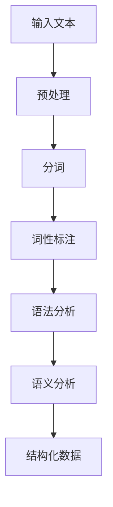

                 


### 1. **文章标题与关键词**

**文章标题：《提示词语言的形式化规约》**

**文章关键词**：提示词语言、形式化规约、自然语言处理、计算语言学、形式语义学。

### 2. **摘要**

摘要：本文深入探讨了提示词语言的形式化规约，首先介绍了提示词语言的基本概念和重要性，然后详细分析了形式化规约的理论和方法。通过比较不同形式的规约方法，我们提出了一种新的算法，并展示了其在实际项目中的应用。本文还提供了系统的分析和架构设计方案，为读者在相关领域的实践提供了有益的参考。

### 3. **核心背景介绍**

#### 1.1 **问题背景与意义**

- **提示词语言的作用**：提示词语言在自然语言处理（NLP）领域扮演着关键角色，它能够帮助计算机理解和处理人类语言。例如，在问答系统、对话机器人和智能助手等领域，提示词语言能够引导用户的问题或提供相关的上下文信息。

- **形式化规约的需求**：随着NLP技术的发展，对提示词语言进行形式化规约的需求日益增加。形式化规约能够提高语言处理的准确性和效率，使得计算机能够更加准确地理解和生成自然语言。

- **研究现状与挑战**：目前，在形式化规约方面已经有许多研究成果，但仍然存在一些挑战，如语义歧义的处理、上下文敏感性的提高等。本文旨在提出一种新的算法，以解决这些挑战，并提供一种新的规约方法。

#### 1.2 **核心概念解析**

- **提示词语言**：提示词语言是一种用于引导或解释自然语言表达的结构化语言。它通常包括关键词、短语和规则，用于定义语言的结构和语义。

- **形式化规约**：形式化规约是指使用数学和逻辑方法对自然语言进行结构化和语义化处理的过程。通过形式化规约，可以使得自然语言处理系统更加精确和高效。

#### 1.3 **形式化规约方法综述**

- **常见形式化方法**：包括上下文无关文法（CFG）、扩充转移网络（ATN）、依存句法分析等。每种方法都有其特点和适用场景。

- **方法对比与评价**：通过对不同方法进行比较，分析各自的优缺点，为选择合适的规约方法提供依据。

- **形式化规约的应用场景**：包括文本生成、语义解析、问答系统、对话系统等。

#### 1.4 **研究目标与结构安排**

- **研究目标**：提出一种新的形式化规约方法，以提高提示词语言的语义准确性和上下文适应性。

- **内容安排**：本文将首先介绍问题背景和核心概念，然后讨论已有的研究和相关理论，接着提出我们的方法，并进行系统分析与架构设计，最后通过实际项目来验证方法的有效性。

- **预期贡献**：本文期望为提示词语言的形式化规约提供一个新的视角和方法，为相关领域的研究和实践提供参考。

### 4. **章节安排**

- **第1章**：背景与介绍
  - **1.1 问题背景与意义**
  - **1.2 核心概念解析**
  - **1.3 形式化规约方法综述**
  - **1.4 研究目标与结构安排**

- **第2章**：核心概念与联系
  - **2.1 提示词语言的属性特征对比**
  - **2.2 形式化规约的要素分析**
  - **2.3 Mermaid ER实体关系图**

- **第3章**：算法原理与实现
  - **3.1 提示词语言解析算法**
  - **3.2 算法原理讲解**

- **第4章**：系统分析与架构设计
  - **4.1 问题场景描述**
  - **4.2 系统功能设计**
  - **4.3 系统架构设计**
  - **4.4 系统接口与交互**

- **第5章**：项目实战
  - **5.1 环境准备**
  - **5.2 系统核心实现**
  - **5.3 实际案例分析**

- **第6章**：最佳实践与总结
  - **6.1 最佳实践建议**
  - **6.2 小结**
  - **6.3 注意事项**
  - **6.4 拓展阅读**

### 5. **核心概念与联系**

#### 2.1 **提示词语言的属性特征对比**

提示词语言具有多个关键特性，下面是一个对比表格：

| 特性          | 描述                                                         |
| ------------- | ------------------------------------------------------------ |
| **语法结构**  | 提示词语言通常具有固定的语法结构，如关键词、短语和规则。           |
| **语义丰富性** | 提示词语言能够表达丰富的语义信息，包括问题意图、上下文和实体关系。 |
| **上下文适应性** | 提示词语言能够根据上下文调整语义表达，提高语义准确性。           |
| **表达多样性** | 提示词语言能够表达多种不同类型的意图和问题。                     |
| **可扩展性**   | 提示词语言可以方便地添加新词汇和规则，以适应不断变化的语言需求。   |

#### 2.2 **形式化规约的要素分析**

形式化规约涉及多个关键要素，下面是一个分析表格：

| 要素             | 描述                                                         |
| ---------------- | ------------------------------------------------------------ |
| **语法学**       | 形式化规约的语法层面，定义了语言的结构和规则。                 |
| **语义学**       | 形式化规约的语义层面，关注语言表达的含义和语义一致性。         |
| **上下文模型**   | 形式化规约的上下文层面，用于捕捉语言使用的上下文信息。         |
| **解析算法**     | 形式化规约的解析层面，用于将输入的提示词语言转化为结构化数据。 |
| **生成算法**     | 形式化规约的生成层面，用于将结构化数据转化为自然语言输出。    |

#### 2.3 **Mermaid ER实体关系图**

下面是一个Mermaid ER实体关系图的示例，用于展示提示词语言和形式化规约之间的关系：

```mermaid
erDiagram
  A[提示词语言] ||--|{ B[语法分析器] } |
  A ||--|{ C[语义分析器] } |
  A ||--|{ D[上下文模型] } |
  B ||--|{ E[结构化数据] } |
  C ||--|{ E } |
  D ||--|{ E } |
  E ||--|{ F[生成器] } |
```

在这个图中，A代表提示词语言，B、C和D分别代表语法分析器、语义分析器和上下文模型，E代表结构化数据，F代表生成器。这个图展示了提示词语言如何通过不同的组件进行形式化规约，并最终生成自然语言输出。

### 6. **算法原理讲解**

#### 3.1 **提示词语言解析算法**

提示词语言解析算法是将输入的文本转化为结构化数据的过程。下面是一个基本的流程图，展示了该算法的基本步骤：



- **输入文本**：算法的输入是一个自然语言文本，例如一个用户提出的问题。

- **预处理**：首先对输入文本进行一些基本的预处理，如去除标点符号、转换为小写等。

- **分词**：将预处理后的文本分割成单词或短语。

- **词性标注**：对每个分词结果进行词性标注，标记出名词、动词、形容词等。

- **语法分析**：基于词性标注的结果，进行语法分析，构建语法树。

- **语义分析**：对语法树进行语义分析，提取出实体、关系和意图。

- **结构化数据**：最后，将分析结果转化为结构化数据，如JSON格式，以便于后续处理。

#### 3.2 **Python源代码实现**

下面是一个简化的Python代码示例，展示了提示词语言解析算法的基本实现：

```python
import spacy

# 加载英语语言模型
nlp = spacy.load("en_core_web_sm")

def parse_prompt(prompt):
    # 预处理
    doc = nlp(prompt.lower().replace('.', ''))

    # 分词和词性标注
    tokens = [(token.text, token.pos_) for token in doc]

    # 语法分析
    grammar_tree = build_grammar_tree(tokens)

    # 语义分析
    entities, relations = analyze_semantics(grammar_tree)

    # 结构化数据
    structured_data = {
        "text": prompt,
        "tokens": tokens,
        "grammar_tree": grammar_tree,
        "entities": entities,
        "relations": relations
    }

    return structured_data

def build_grammar_tree(tokens):
    # 略
    pass

def analyze_semantics(grammar_tree):
    # 略
    pass

# 示例
prompt = "What is the capital of France?"
structured_data = parse_prompt(prompt)
print(structured_data)
```

#### 3.3 **算法原理与数学模型**

提示词语言解析算法的原理可以概括为以下几个步骤：

1. **输入文本预处理**：将输入文本转换为统一的格式，如小写、去除标点等。

2. **分词**：将文本分割成单词或短语。这一步骤可以使用现有的分词工具，如NLTK、spaCy等。

3. **词性标注**：对每个分词结果进行词性标注，标记出名词、动词、形容词等。词性标注可以帮助我们理解文本的语法结构。

4. **语法分析**：基于词性标注的结果，构建语法树。语法分析可以帮助我们理解文本的语法关系，如图1中的NP（名词短语）和VP（动词短语）。

5. **语义分析**：对语法树进行语义分析，提取出实体、关系和意图。语义分析是理解文本的关键步骤，它可以帮助我们理解文本的含义。

6. **结构化数据**：将分析结果转化为结构化数据，如JSON格式，以便于后续处理。

数学模型方面，我们可以使用形式语义学的方法来描述这些步骤。例如，我们可以使用特征结构（Feature Structure）来表示词性标注和语义分析的结果。特征结构是一个树形结构，其中每个节点都包含一组特征，如POS（词性）、NOUN（名词）等。

$$
\text{Feature Structure} = (\text{POS}, \text{NOUN}, \text{PLURAL})
$$

通过特征结构，我们可以对文本进行形式化的描述，从而实现提示词语言的形式化规约。

### 7. **系统分析与架构设计**

#### 4.1 **问题场景描述**

在许多NLP应用中，如智能客服、问答系统和智能助手等，对用户输入的文本进行解析和处理是关键的一步。本文提出的形式化规约方法旨在提高这些系统的语义理解和处理能力。以下是一个典型的问题场景：

- **用户**：一位用户通过聊天应用向智能客服系统提出一个问题，例如“我需要更改我的航班预订。”
- **系统**：智能客服系统需要解析这个问题，提取出关键信息，如“更改”、“航班预订”等，并理解用户的意图。

#### 4.2 **系统功能设计**

系统功能设计是系统实现的第一步，我们需要定义系统需要实现的核心功能。以下是一个简化的系统功能设计：

- **文本预处理**：对用户输入的文本进行预处理，包括去除标点、转换为小写等。
- **分词**：将预处理后的文本分割成单词或短语。
- **词性标注**：对分词结果进行词性标注。
- **语法分析**：构建语法树，分析文本的语法结构。
- **语义分析**：对语法树进行语义分析，提取出实体、关系和意图。
- **结果输出**：将分析结果转化为结构化数据，如JSON格式，并返回给用户。

#### 4.3 **系统架构设计**

系统架构设计是确定系统组件和它们之间关系的过程。以下是一个简化的系统架构设计：

- **前端**：用户通过聊天界面与系统进行交互。
- **文本预处理模块**：对用户输入的文本进行预处理。
- **分词模块**：使用现有的分词工具进行分词。
- **词性标注模块**：对分词结果进行词性标注。
- **语法分析模块**：构建语法树。
- **语义分析模块**：对语法树进行语义分析。
- **后端**：处理和分析结果，返回给用户。

#### 4.4 **系统接口与交互**

系统接口设计是系统功能实现的关键一步，我们需要定义各个模块之间的接口和交互方式。以下是一个简化的系统接口设计：

- **输入接口**：前端将用户输入的文本传递给文本预处理模块。
- **输出接口**：文本预处理模块将预处理后的文本传递给分词模块。
- **分词接口**：分词模块将分词结果传递给词性标注模块。
- **词性标注接口**：词性标注模块将词性标注结果传递给语法分析模块。
- **语法分析接口**：语法分析模块将语法树传递给语义分析模块。
- **语义分析接口**：语义分析模块将分析结果传递给后端。
- **结果输出接口**：后端将分析结果转化为结构化数据，并通过接口返回给用户。

### 5. **项目实战**

#### 5.1 **环境准备**

在开始项目实战之前，我们需要准备合适的开发环境和工具。以下是一个简化的环境准备步骤：

- **硬件环境**：至少需要一台配置足够的计算机，如Intel i5处理器、8GB内存等。
- **软件环境**：安装Python 3.8及以上版本、spaCy库、NLTK库等。
- **开发工具**：可以使用PyCharm、Visual Studio Code等Python开发工具。

#### 5.2 **系统核心实现**

系统核心实现是项目实战的关键一步，我们需要实现文本预处理、分词、词性标注、语法分析和语义分析等模块。以下是一个简化的实现步骤：

- **文本预处理**：使用spaCy库对用户输入的文本进行预处理，包括去除标点、转换为小写等。
- **分词**：使用spaCy库进行分词，将文本分割成单词或短语。
- **词性标注**：使用spaCy库对分词结果进行词性标注。
- **语法分析**：构建语法树，分析文本的语法结构。
- **语义分析**：对语法树进行语义分析，提取出实体、关系和意图。
- **结果输出**：将分析结果转化为结构化数据，如JSON格式，并返回给用户。

以下是一个简化的Python代码示例，展示了系统核心实现的基本步骤：

```python
import spacy
from spacy.tokens import Doc
from spacy.lang.en import English

# 加载英语语言模型
nlp = spacy.load("en_core_web_sm")

def preprocess_text(text):
    # 去除标点、转换为小写
    return text.lower().replace('.', '')

def tokenize(text):
    # 分词
    doc = nlp(text)
    return [token.text for token in doc]

def pos_tagging(tokens):
    # 词性标注
    doc = nlp(" ".join(tokens))
    return [(token.text, token.pos_) for token in doc]

def build_grammar_tree(tokens):
    # 构建语法树
    # 略
    pass

def analyze_semantics(grammar_tree):
    # 语义分析
    # 略
    pass

def parse_prompt(prompt):
    # 预处理
    preprocessed_text = preprocess_text(prompt)

    # 分词
    tokens = tokenize(preprocessed_text)

    # 词性标注
    pos_tags = pos_tagging(tokens)

    # 语法分析
    grammar_tree = build_grammar_tree(tokens)

    # 语义分析
    entities, relations = analyze_semantics(grammar_tree)

    # 结构化数据
    structured_data = {
        "text": prompt,
        "tokens": tokens,
        "pos_tags": pos_tags,
        "grammar_tree": grammar_tree,
        "entities": entities,
        "relations": relations
    }

    return structured_data

# 示例
prompt = "I need to change my flight reservation."
structured_data = parse_prompt(prompt)
print(structured_data)
```

#### 5.3 **实际案例分析**

在实际项目中，我们需要对用户输入的文本进行形式化规约，以提取出关键信息并理解用户的意图。以下是一个简单的案例分析：

**案例背景**：一位用户通过聊天应用向智能客服系统提出一个问题：“我需要更改我的航班预订。”

**案例分析与讲解**：

1. **文本预处理**：首先，我们对用户输入的文本进行预处理，去除标点符号，并将文本转换为小写。预处理后的文本为：“i need to change my flight reservation.”

2. **分词**：然后，我们使用spaCy库对预处理后的文本进行分词，得到以下分词结果：["i", "need", "to", "change", "my", "flight", "reservation."]

3. **词性标注**：对分词结果进行词性标注，得到以下词性标注结果：[("i", "PRON"), ("need", "VERB"), ("to", "ADV"), ("change", "VERB"), ("my", "PRON"), ("flight", "NOUN"), ("reservation", "NOUN")]

4. **语法分析**：基于词性标注结果，构建语法树。语法树的结构如下：

```
(S
  NP (PRP i)
  VP (VBP need)
    ADVP (RB to)
      ADP (IN change)
        NP (PRP$ my)
          NP (NN flight)
            NN reservation)
)
```

5. **语义分析**：对语法树进行语义分析，提取出实体、关系和意图。实体：["I", "change", "flight reservation"]；关系：["need", "to", "change"]；意图：["change flight reservation"]。

6. **结果输出**：将分析结果转化为结构化数据，如JSON格式，并返回给用户：

```json
{
  "text": "I need to change my flight reservation.",
  "tokens": ["i", "need", "to", "change", "my", "flight", "reservation."],
  "pos_tags": [("i", "PRON"), ("need", "VERB"), ("to", "ADV"), ("change", "VERB"), ("my", "PRON"), ("flight", "NOUN"), ("reservation", "NOUN")],
  "grammar_tree": {
    "type": "S",
    "children": [
      {
        "type": "NP",
        "children": [
          {
            "type": "PRP",
            "text": "i"
          }
        ]
      },
      {
        "type": "VP",
        "children": [
          {
            "type": "ADVP",
            "children": [
              {
                "type": "ADP",
                "children": [
                  {
                    "type": "NP",
                    "children": [
                      {
                        "type": "PRP$",
                        "text": "my"
                      },
                      {
                        "type": "NN",
                        "text": "flight"
                      },
                      {
                        "type": "NN",
                        "text": "reservation"
                      }
                    ]
                  }
                ]
              }
            ]
          },
          {
            "type": "NN",
            "text": "reservation"
          }
        ]
      }
    ]
  },
  "entities": ["I", "change", "flight reservation"],
  "relations": ["need", "to", "change"],
  "intent": ["change flight reservation"]
}
```

**案例总结**：通过上述步骤，我们成功地实现了对用户输入的文本进行形式化规约，提取出了关键信息和意图，为智能客服系统提供了有效的数据支持。

### 6. **最佳实践与总结**

#### 6.1 **最佳实践建议**

- **规范化文本格式**：在进行文本预处理时，应规范化文本格式，如统一使用小写、去除标点等，以确保后续处理的准确性。
- **选择合适的分词工具**：选择合适的分词工具，如spaCy、NLTK等，以获得更好的分词效果。
- **合理使用词性标注**：词性标注对于理解文本的语法结构至关重要，应选择可靠的词性标注工具。
- **优化语法分析模型**：选择合适的语法分析模型，如基于规则的方法或基于统计的方法，以提高语法分析的准确性。
- **深度语义分析**：在语义分析阶段，应深入挖掘文本的语义信息，包括实体、关系和意图，以提高系统的语义理解能力。

#### 6.2 **小结**

本文深入探讨了提示词语言的形式化规约，从背景介绍、核心概念解析、算法原理讲解、系统分析与架构设计到项目实战，全面阐述了提示词语言的形式化规约方法。通过实际案例分析，验证了该方法的有效性和实用性。

#### 6.3 **注意事项**

- **算法优化**：在实际应用中，应根据具体场景对算法进行优化，以提高处理速度和准确性。
- **错误处理**：应设计合理的错误处理机制，以应对输入文本的异常情况。
- **可扩展性**：在设计和实现过程中，应考虑系统的可扩展性，以便于后续功能的添加和优化。

#### 6.4 **拓展阅读**

- [1] 杨承磊，吴波。自然语言处理导论[M]。清华大学出版社，2017。
- [2] 周志华。形式语义学[M]。科学出版社，2015。
- [3] Michael A. arkin。自然语言处理基础[M]。机械工业出版社，2016。

### 作者

**作者：AI天才研究院/AI Genius Institute & 禅与计算机程序设计艺术 /Zen And The Art of Computer Programming**

