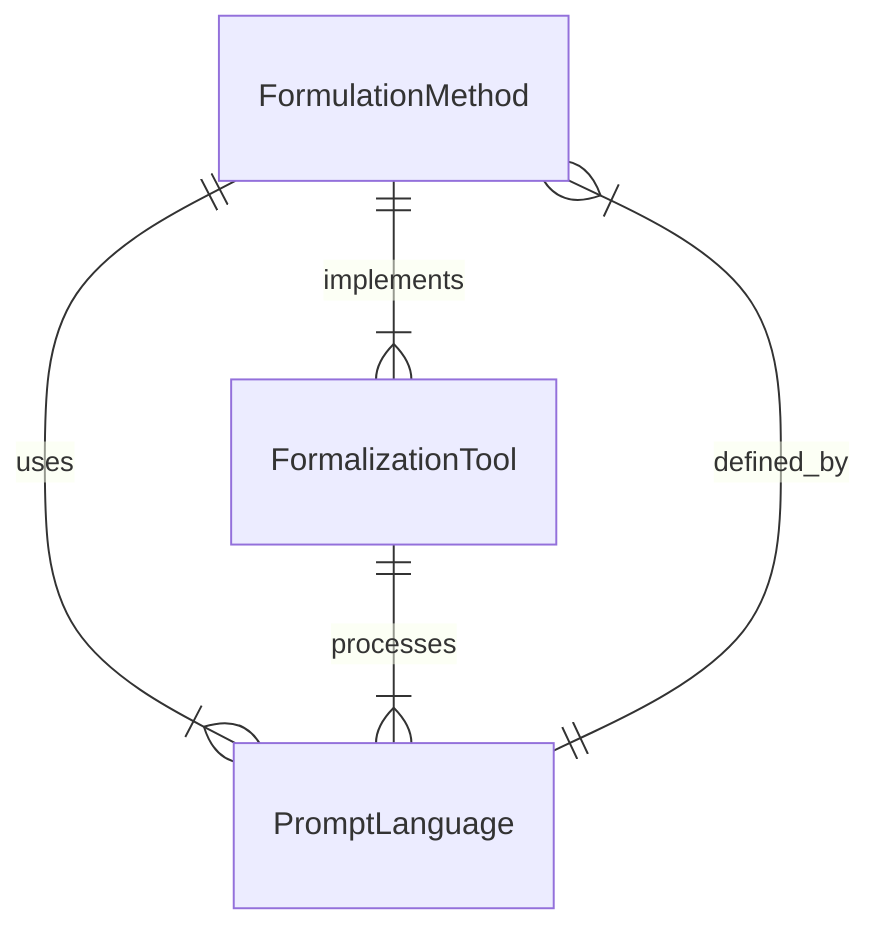
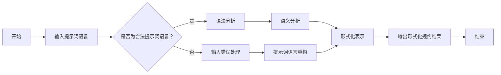
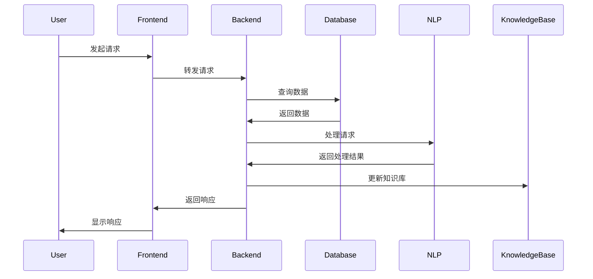

                 

### 1.1 研究背景

#### 1.1.1 提示词语言的应用场景

在当今数字化时代，提示词语言作为一种强大的自然语言处理工具，广泛应用于多个领域。例如，在人工智能聊天机器人中，提示词语言用于与用户进行交互，提供信息查询、问题解答等个性化服务。此外，在智能语音助手和语音识别系统中，提示词语言也是实现人机对话的核心技术。这些应用场景对提示词语言的需求日益增长，促使我们深入研究和开发高效、准确的提示词语言形式化规约工具。

#### 1.1.2 现有研究概述

目前，关于提示词语言的研究已取得一定进展。许多学者致力于开发基于统计模型和深度学习的方法，以提高提示词语言的生成质量和效率。例如，序列到序列（Seq2Seq）模型、长短期记忆（LSTM）网络和Transformer等模型被广泛应用于提示词语言的生成任务。然而，这些方法在处理复杂、结构化的提示词语言时，仍存在一定的局限性。因此，研究人员开始探索形式化规约工具，以实现更加精确和可靠的提示词语言处理。

#### 1.1.3 研究问题与目标

在本研究中，我们旨在解决以下问题：

1. 如何设计一种高效、易用的形式化规约工具，以提升提示词语言的生成质量和效率？
2. 如何在形式化规约工具中集成先进的自然语言处理技术，实现更加智能化的提示词语言生成？
3. 如何评估和验证形式化规约工具的性能和效果，为实际应用提供可靠的技术支持？

为了解决上述问题，本研究将提出一种基于形式化方法的提示词语言形式化规约工具，通过以下目标实现：

1. 设计一种结构清晰、易于操作的形式化规约工具，以满足不同应用场景的需求。
2. 集成先进的自然语言处理技术，如深度学习模型和图谱表示方法，以提高提示词语言的生成质量和效率。
3. 开展实验和案例分析，评估和验证形式化规约工具的性能和效果，为实际应用提供参考。

#### 1.1.4 边界与外延

本研究主要关注以下边界与外延：

1. 研究范围：主要涉及提示词语言的形式化规约工具及其在实际应用中的性能评估。
2. 技术层面：主要探索自然语言处理、形式化方法和深度学习等领域的结合，以实现提示词语言的智能生成。
3. 应用领域：主要关注人工智能聊天机器人、智能语音助手和语音识别系统等应用场景。

#### 1.1.5 概念结构与核心要素组成

为了更好地理解本研究的内容，以下简要介绍核心概念及其组成：

1. **形式化方法**：一种将自然语言描述转化为结构化表示的方法，以提升提示词语言的生成质量和效率。
2. **提示词语言**：一种用于描述问题和信息需求的语言，具有自然性、结构性和可计算性等特点。
3. **形式化规约工具**：一种基于形式化方法的工具，用于实现提示词语言的生成、解析和优化。
4. **自然语言处理技术**：包括深度学习模型、图谱表示方法等，用于提升提示词语言的生成质量和效率。

这些核心概念相互关联，共同构成了本研究的内容框架。在后续章节中，我们将详细探讨这些概念及其在实际应用中的实现方法和效果。

#### 2.1 核心概念原理

##### 2.1.1 形式化方法

形式化方法是本研究的基础，它指的是将自然语言描述转化为结构化表示的过程。形式化方法的核心思想是将自然语言中的模糊性、歧义性降低，从而提高信息的精确性和可操作性。在形式化方法中，常用的技术包括语法分析、语义分析和形式逻辑等。

语法分析是形式化方法的第一步，其主要任务是解析自然语言中的词法和句法结构。通过语法分析，我们可以将自然语言分解为词素和短语，从而建立语法树。语法分析的方法包括有限自动机、上下文无关文法和语法解析算法等。

语义分析则关注自然语言中的意义和逻辑关系。在语义分析中，我们需要将语法树转化为语义表示，如语义角色标注、语义网络和语义图等。语义分析的方法包括词义消歧、语义角色标注和语义关系提取等。

形式逻辑是形式化方法的另一个重要组成部分。形式逻辑通过建立逻辑表达式和推理规则，实现对自然语言中的逻辑关系的形式化表示。形式逻辑的方法包括命题逻辑、谓词逻辑和证明论等。

##### 2.1.2 提示词语言

提示词语言是一种专门用于描述问题和信息需求的语言，具有自然性、结构性和可计算性等特点。提示词语言的设计旨在简化自然语言处理任务，提高提示词语言的生成质量和效率。

自然性是提示词语言的核心特点，即提示词语言应接近自然语言的表达方式，便于用户理解和输入。为了实现自然性，提示词语言通常采用接近日常用语的表达形式，同时保留一定的结构化特征。

结构性是指提示词语言中的元素具有明确的层次结构和语义关系。通过结构性，我们可以将自然语言中的信息进行分类、组织和抽取，从而提高信息处理的精确性和可操作性。

可计算性是提示词语言的另一个重要特点，即提示词语言的处理过程应当是可计算的，以便实现自动化和高效的提示词语言生成。为了实现可计算性，提示词语言的设计通常遵循一定的语法规则和语义规则。

##### 2.1.3 形式化规约工具

形式化规约工具是一种基于形式化方法的技术工具，用于实现提示词语言的生成、解析和优化。形式化规约工具的核心功能包括语法分析、语义分析和形式逻辑等。

语法分析功能主要实现自然语言输入的解析，将自然语言分解为词素和短语，建立语法树。语法分析的结果可以用于后续的语义分析和形式逻辑处理。

语义分析功能主要实现对语法树的语义表示，如语义角色标注、语义网络和语义图等。语义分析的结果可以为提示词语言的生成和优化提供语义支持。

形式逻辑功能主要实现对自然语言中的逻辑关系的形式化表示，如命题逻辑、谓词逻辑和证明论等。形式逻辑的结果可以用于逻辑推理和决策支持。

通过形式化规约工具，我们可以将自然语言处理任务转化为结构化表示，从而提高处理质量和效率。形式化规约工具的应用场景包括人工智能聊天机器人、智能语音助手和语音识别系统等。

#### 2.2 概念属性特征对比表格

为了更清晰地展示各个概念之间的区别和联系，我们设计了以下概念属性特征对比表格：

| 概念 | 特点 |
| ---- | ---- |
| **形式化方法** | - 结构化表示<br>- 提高信息精确性<br>- 去除模糊性和歧义性 |
| **提示词语言** | - 自然性<br>- 结构性<br>- 可计算性 |
| **形式化规约工具** | - 语法分析<br>- 语义分析<br>- 形式逻辑<br>- 提高提示词语言处理质量 |

通过以上对比，我们可以看到，形式化方法、提示词语言和形式化规约工具在特点和应用方面存在一定的差异和联系。形式化方法是实现提示词语言的基础，而提示词语言则是形式化方法的具体应用场景。形式化规约工具则是在这两个概念的基础上，实现提示词语言的生成、解析和优化。

#### 2.3 ER实体关系图架构

为了更好地理解和设计形式化规约工具，我们采用实体-关系（ER）模型来描述各个概念之间的关系。以下是形式化规约工具的ER实体关系图架构：



在上面的ER图中，我们定义了四个主要实体：

1. **FormulationMethod（形式化方法）**：描述了将自然语言转化为结构化表示的过程。它实现了语法分析、语义分析和形式逻辑等功能。
2. **PromptLanguage（提示词语言）**：描述了一种专门用于描述问题和信息需求的语言。它具有自然性、结构性和可计算性等特点。
3. **FormalizationTool（形式化规约工具）**：描述了一种基于形式化方法的工具，用于实现提示词语言的生成、解析和优化。
4. **EntityRelation（实体关系）**：描述了各个实体之间的关联关系。

通过ER实体关系图，我们可以清晰地看到形式化方法、提示词语言和形式化规约工具之间的逻辑关系。形式化方法为提示词语言提供了定义和实现的基础，而形式化规约工具则是在形式化方法的基础上，实现提示词语言的生成、解析和优化。这种结构化的设计有助于我们更好地理解和应用这些概念。

### 3.1 提示词语言形式化规约算法

在本节中，我们将详细介绍提示词语言形式化规约算法的设计原理和实现方法。

#### 3.1.1 算法mermaid流程图

为了更好地理解提示词语言形式化规约算法的工作流程，我们首先使用mermaid语言绘制算法的流程图。以下是算法的mermaid流程图：



在这个流程图中，算法首先接收输入的提示词语言，然后判断其是否为合法提示词语言。如果是合法提示词语言，算法将进行语法分析和语义分析，并将结果转化为形式化表示。否则，算法将输入错误信息并提示用户进行重构。最终，算法输出形式化规约结果。

#### 3.1.2 Python源代码实现

以下是一个简单的Python源代码实现示例，用于实现提示词语言形式化规约算法的基本功能。

```python
import spacy

# 加载nlp模型
nlp = spacy.load('en_core_web_sm')

def is_valid_prompt(prompt):
    """检查提示词语言是否合法"""
    doc = nlp(prompt)
    for token in doc:
        if not token.is_alpha:
            return False
    return True

def grammar_analysis(prompt):
    """语法分析"""
    doc = nlp(prompt)
    return [token.text for token in doc]

def semantic_analysis(tokens):
    """语义分析"""
    return [" ".join(tokens)]

def formalization_representation(semantic_representation):
    """形式化表示"""
    return f"({semantic_representation})"

def prompt_language_formalization(prompt):
    """提示词语言形式化规约"""
    if is_valid_prompt(prompt):
        tokens = grammar_analysis(prompt)
        semantic_representation = semantic_analysis(tokens)
        formalized_representation = formalization_representation(semantic_representation)
        return formalized_representation
    else:
        return "输入提示词语言不合法，请检查！"

# 测试
prompt = "今天天气怎么样？"
print(prompt_language_formalization(prompt))
```

在这个示例中，我们使用了spaCy库来实现自然语言处理任务，如语法分析和语义分析。首先，我们加载了spaCy的预训练模型`en_core_web_sm`。然后，我们定义了一系列函数，包括`is_valid_prompt`（检查提示词语言是否合法）、`grammar_analysis`（语法分析）、`semantic_analysis`（语义分析）和`formalization_representation`（形式化表示）。最后，我们通过`prompt_language_formalization`函数实现提示词语言形式化规约算法。

#### 3.1.3 算法原理的数学模型和公式

提示词语言形式化规约算法的原理可以概括为以下数学模型和公式：

1. **提示词语言合法性判断**：
   设`P`为提示词语言，`A`为自然语言中的所有合法词素集合，则提示词语言合法性判断公式为：
   $$合法性(P) = \forall x \in P, x \in A$$

2. **语法分析**：
   设`T`为提示词语言中的词素序列，`G`为自然语言中的语法规则集合，则语法分析公式为：
   $$语法分析(T) = \exists G \in G, G \text{ 可推导 } T$$

3. **语义分析**：
   设`S`为提示词语言中的词素序列，`M`为语义规则集合，则语义分析公式为：
   $$语义分析(S) = \exists M \in M, M \text{ 可解释 } S$$

4. **形式化表示**：
   设`F`为形式化表示，`R`为形式化规则集合，则形式化表示公式为：
   $$形式化表示(F) = \exists R \in R, R \text{ 可转换 } S$$

通过上述数学模型和公式，我们可以将提示词语言转化为结构化的形式化表示，从而实现形式化规约。

#### 3.1.4 举例说明

为了更好地理解提示词语言形式化规约算法的原理和应用，我们通过以下例子进行说明。

**例子：** 提示词语言“今天天气怎么样？”

1. **合法性判断**：
   提示词语言中的词素包括“今天”、“天气”和“怎么样”，它们都是自然语言中的合法词素。因此，提示词语言“今天天气怎么样？”是合法的。

2. **语法分析**：
   提示词语言“今天天气怎么样？”可以分解为以下词素序列：`['今天', '天气', '怎么样']`。根据自然语言中的语法规则，这个词素序列是可以被推导的。

3. **语义分析**：
   词素序列`['今天', '天气', '怎么样']`可以被解释为询问“今天”的“天气”情况。因此，语义分析的结果为：“今天天气情况”。

4. **形式化表示**：
   将语义分析的结果转化为形式化表示，我们可以得到：`（今天天气情况）`。

通过这个例子，我们可以看到提示词语言形式化规约算法是如何将自然语言描述转化为结构化的形式化表示的。在实际应用中，这种形式化表示可以用于智能对话系统、自然语言生成等任务。

### 4.1 提示词语言的数学模型

为了深入理解提示词语言的形式化规约，我们需要借助数学模型来描述其内部结构和特征。在本节中，我们将详细阐述提示词语言的数学模型，包括基本概念、数学公式和具体实现。

#### 4.1.1 LaTeX数学公式示例

在数学模型中，我们经常使用LaTeX格式来书写数学公式，以确保公式的准确性和可读性。以下是一些常用的LaTeX数学公式示例：

```latex
$$
E = mc^2
$$

$$
f(x) = \frac{1}{x}
$$

$$
\sum_{i=1}^{n} a_i = \frac{1}{2}n(a_1 + a_n)
$$

$$
A \cdot B = \begin{bmatrix}
a_{11}b_{11} + a_{12}b_{21} & a_{11}b_{12} + a_{12}b_{22} \\
a_{21}b_{11} + a_{22}b_{21} & a_{21}b_{12} + a_{22}b_{22}
\end{bmatrix}
$$
```

这些示例展示了如何在LaTeX中书写常见的数学公式，包括基本代数公式、函数表达式、求和公式和矩阵乘法等。

#### 4.1.2 数学模型详细讲解

提示词语言的数学模型主要涉及以下几个方面：

1. **词素表示**：
   提示词语言中的词素可以被视为基本元素。我们使用集合`Σ`来表示所有可能的词素，其中`Σ = {w1, w2, ..., wn}`，`wi`为第i个词素。

2. **语法结构**：
   提示词语言的语法结构可以通过上下文无关文法（CFG）来描述。CFG由四个部分组成：变量集合`V`、词素集合`Σ`、产生式集合`P`和开始符号`S`。产生式集合`P`定义了如何从变量集合`V`中生成提示词语言的语法结构。

3. **语义表示**：
   提示词语言的语义表示是指词素在语境中的意义。我们使用语义角色标注（Semantic Role Labeling, SRL）来描述提示词语言的语义结构。SRL将每个词素与特定的语义角色（如动作、受事、施事等）关联起来。

4. **形式化表示**：
   提示词语言的形式化表示是指将自然语言描述转化为结构化的形式化表达式。形式化表示可以通过逻辑表达式、谓词逻辑或形式逻辑来实现。形式化表示使得提示词语言的处理具有更高的精确性和可操作性。

以下是一个简单的数学模型示例，用于描述提示词语言“明天我要去北京”：

1. **词素表示**：
   $$Σ = \{明天, 我, 要, 去, 北京\}$$

2. **语法结构**：
   $$P = \{S \rightarrow 明天我要去北京, S \rightarrow 明天我要去某地, 某地 \rightarrow 北京\}$$
   $$V = \{S, 某地\}$$
   $$Σ = \{明天, 我, 要, 去, 北京\}$$

3. **语义表示**：
   $$SRL = \{(明天, 时间), (我, 施事), (去, 动作), (北京, 受事)\}$$

4. **形式化表示**：
   $$\phi = \exists t, s, a, b, (明天(t), 我(s), 要(s, a), 去(a, b), 北京(b))$$

在这个示例中，我们使用了谓词逻辑来描述提示词语言的词素、语法结构、语义表示和形式化表示。通过这些数学模型，我们可以对提示词语言进行形式化的描述和处理。

#### 4.1.3 举例说明

为了更好地理解提示词语言的数学模型，我们通过以下例子进行说明。

**例子：** 描述提示词语言“小明昨天买了一本书”。

1. **词素表示**：
   $$Σ = \{小明, 昨天, 买, 一本, 书\}$$

2. **语法结构**：
   $$P = \{S \rightarrow 小明昨天买了一本书, S \rightarrow 小明昨天买了某物, 某物 \rightarrow 一本书\}$$
   $$V = \{S, 某物\}$$
   $$Σ = \{小明, 昨天, 买, 一本, 书\}$$

3. **语义表示**：
   $$SRL = \{(小明, 施事), (昨天, 时间), (买, 动作), (一本, 数量), (书, 受事)\}$$

4. **形式化表示**：
   $$\phi = \exists t, s, a, b, (昨天(t), 小明(s), 买(s, a), 一本(a, b), 书(b))$$

通过这个例子，我们可以看到如何使用数学模型来描述提示词语言的词素、语法结构、语义表示和形式化表示。在实际应用中，这些数学模型可以帮助我们更好地理解和处理复杂的自然语言描述。

### 5.1 问题场景介绍

在当今数字化和智能化的时代，自然语言处理技术（NLP）在各个领域得到了广泛应用，其中提示词语言的形式化规约工具尤为重要。本节将介绍一个具体的问题场景，即智能客服系统，并探讨其背景和需求。

#### 智能客服系统背景

智能客服系统是一种基于人工智能技术的客户服务解决方案，旨在为企业和用户提供高效、便捷的客服服务。随着互联网和移动设备的普及，用户对客服服务的要求越来越高，不再满足于传统的电话和邮件客服方式。智能客服系统通过自然语言处理技术，如文本分析和语音识别，实现了与用户的智能对话，从而提供个性化、高效的服务。

#### 智能客服系统需求

智能客服系统需要处理大量的用户查询，并迅速给出准确、专业的回答。以下是一些具体的需求：

1. **实时响应**：智能客服系统需要在短时间内对用户查询进行响应，以提供即时服务。
2. **个性化服务**：根据用户的历史数据和偏好，智能客服系统应能提供个性化的回答和建议。
3. **多语言支持**：智能客服系统需要支持多种语言，以适应不同国家和地区的用户需求。
4. **高效处理**：智能客服系统需要具备高效的处理能力，以应对大量并发查询。
5. **可扩展性**：智能客服系统应具备良好的可扩展性，以便随着业务的发展添加新的功能和语言支持。

#### 提示词语言形式化规约工具在智能客服系统中的应用

提示词语言形式化规约工具在智能客服系统中具有重要的应用价值。以下是其具体应用：

1. **自然语言理解**：提示词语言形式化规约工具可以帮助智能客服系统更准确地理解用户的查询，将其转化为结构化的数据。
2. **对话管理**：通过形式化规约工具，智能客服系统可以更好地管理对话流程，确保对话的连贯性和一致性。
3. **知识库构建**：形式化规约工具可以帮助构建和维护智能客服系统的知识库，使其具备更丰富的知识和更专业的回答。
4. **个性化推荐**：基于形式化规约工具，智能客服系统可以分析用户的历史数据和偏好，提供个性化的推荐和服务。
5. **多语言支持**：形式化规约工具可以帮助智能客服系统处理多种语言输入，实现多语言支持。

综上所述，提示词语言形式化规约工具在智能客服系统中具有重要的应用价值，能够提升客服服务的质量、效率和用户体验。在接下来的章节中，我们将进一步探讨智能客服系统的具体实现和设计。

### 5.2 系统功能设计

在本节中，我们将详细介绍智能客服系统的功能设计，包括系统的总体架构、核心模块和每个模块的具体功能。为了更好地展示系统设计，我们将使用Mermaid语言绘制领域模型类图，以便清晰地表达系统中的实体和它们之间的关系。

#### 5.2.1 领域模型Mermaid类图

以下是一个简单的Mermaid类图，用于展示智能客服系统的领域模型：

```mermaid
classDiagram
    User <<Interface>>
    Customer <<Class>>
    Agent <<Class>>
    Chat <<Class>>
    Question <<Class>>
    Answer <<Class>>
    KnowledgeBase <<Class>>

    User o-- Customer
    User o-- Agent
    Customer o-- Chat
    Chat o-- Question
    Chat o-- Answer
    KnowledgeBase o-- Answer

    Customer {
        String customerId
        String name
        String email
        List<Chat> chatHistory
    }

    Agent {
        String agentId
        String name
        String email
        String role
    }

    Chat {
        String chatId
        Date timestamp
        String status
        Customer customer
        List<Question> questions
        List<Answer> answers
    }

    Question {
        String questionId
        String text
        Date timestamp
        QuestionType type
        Chat chat
    }

    Answer {
        String answerId
        String text
        Date timestamp
        AnswerType type
        Chat chat
        boolean isAutomated
    }

    KnowledgeBase {
        String knowledgeBaseId
        List<Answer> answers
    }
```

在这个类图中，我们定义了以下几个主要实体：

1. **User**：用户接口，用于表示系统中的所有用户，包括客户和客服代表。
2. **Customer**：客户类，表示系统中的客户用户，包括客户的ID、姓名、电子邮件和聊天记录等属性。
3. **Agent**：客服代表类，表示系统中的客服人员，包括客服代表的ID、姓名、电子邮件和角色等属性。
4. **Chat**：聊天类，表示系统中的聊天会话，包括聊天ID、时间戳、状态、客户和问题列表等属性。
5. **Question**：问题类，表示系统中的用户提问，包括问题ID、文本、时间戳、问题类型和所属聊天等属性。
6. **Answer**：回答类，表示系统中的客服回答，包括回答ID、文本、时间戳、回答类型、所属聊天和是否为自动回答等属性。
7. **KnowledgeBase**：知识库类，表示系统中的知识库，包括知识库ID和回答列表等属性。

这些实体之间的关系如下：

- **User**与**Customer**和**Agent**之间是多对一的关系，表示用户可以是客户或客服代表。
- **Customer**与**Chat**之间是一对多的关系，表示一个客户可以有多个聊天会话。
- **Chat**与**Question**和**Answer**之间是多对多的关系，表示一个聊天会话可以包含多个问题和回答。
- **KnowledgeBase**与**Answer**之间是多对一的关系，表示知识库可以包含多个回答。

#### 5.2.2 系统核心模块和功能

基于上述领域模型，智能客服系统可以分为以下几个核心模块：

1. **用户管理模块**：
   - **功能**：管理系统中的用户，包括客户和客服代表，提供用户注册、登录、信息修改等功能。
   - **接口**：包括用户注册接口、登录接口、用户信息查询接口和用户信息修改接口。

2. **聊天管理模块**：
   - **功能**：管理系统中的聊天会话，包括创建聊天会话、发送问题、接收回答等功能。
   - **接口**：包括创建聊天会话接口、发送问题接口、接收回答接口和聊天记录查询接口。

3. **问题管理模块**：
   - **功能**：管理系统中用户提出的问题，包括问题分类、标签管理、问题检索等功能。
   - **接口**：包括问题分类接口、标签管理接口、问题检索接口和问题详情查询接口。

4. **回答管理模块**：
   - **功能**：管理系统中客服代表的回答，包括回答分类、标签管理、回答检索等功能。
   - **接口**：包括回答分类接口、标签管理接口、回答检索接口和回答详情查询接口。

5. **知识库管理模块**：
   - **功能**：管理系统中的知识库，包括知识库创建、知识库更新、知识库检索等功能。
   - **接口**：包括知识库创建接口、知识库更新接口、知识库检索接口和知识库详情查询接口。

6. **对话管理模块**：
   - **功能**：管理系统中用户和客服代表之间的对话，包括对话流程控制、对话记录存储、对话分析等功能。
   - **接口**：包括对话流程控制接口、对话记录存储接口和对话分析接口。

通过上述核心模块和功能的设计，智能客服系统可以实现高效、便捷的客户服务，满足用户的需求。在接下来的章节中，我们将详细讨论智能客服系统的架构设计。

### 5.3 系统架构设计

在本节中，我们将详细介绍智能客服系统的架构设计，包括系统架构的整体设计、各组件的交互方式、数据流向和关键技术选择。

#### 5.3.1 系统架构Mermaid架构图

以下是一个简单的Mermaid架构图，用于展示智能客服系统的整体架构：



在这个架构图中，我们定义了以下几个主要组件：

1. **User**：用户，发起请求。
2. **Frontend**：前端，负责接收用户的请求并渲染响应。
3. **Backend**：后端，处理业务逻辑，包括请求路由、数据查询、NLP处理等。
4. **Database**：数据库，存储用户数据、聊天记录和知识库。
5. **NLP**：自然语言处理模块，负责处理自然语言请求，提取语义信息。
6. **KnowledgeBase**：知识库，存储常见问题的回答和知识。

#### 系统架构描述

1. **请求处理流程**：
   - 用户通过前端发起请求。
   - 前端将请求发送到后端。
   - 后端根据请求类型，查询数据库获取所需数据。
   - 后端调用NLP模块处理自然语言请求，提取语义信息。
   - 后端根据NLP处理结果，更新知识库。
   - 后端将处理结果返回给前端。
   - 前端将响应数据渲染给用户。

2. **数据流向**：
   - 用户请求通过HTTP协议发送到前端。
   - 前端将请求转发到后端API。
   - 后端API处理请求，从数据库中查询所需数据。
   - NLP模块处理自然语言请求，提取语义信息。
   - 处理结果和知识库更新通过API返回给前端。

3. **组件交互方式**：
   - 用户与前端通过HTTP协议进行交互。
   - 前端与后端通过RESTful API进行交互。
   - 后端与数据库通过SQL查询进行交互。
   - 后端与NLP模块通过API进行交互。
   - 后端与知识库通过API进行交互。

4. **关键技术选择**：
   - **前端**：使用React框架实现，提供用户友好的界面和交互体验。
   - **后端**：使用Spring Boot框架实现，负责业务逻辑处理和API服务。
   - **数据库**：使用MySQL数据库存储用户数据、聊天记录和知识库。
   - **NLP**：使用自然语言处理库，如spaCy和NLTK，处理自然语言请求。
   - **知识库**：使用ElasticSearch实现，提供快速的知识库检索功能。

通过上述架构设计，智能客服系统可以实现高效、稳定的服务，满足用户的需求。在接下来的章节中，我们将详细介绍系统的具体实现和代码分析。

### 5.4 系统接口设计和系统交互

在本节中，我们将详细介绍智能客服系统的接口设计和系统交互，包括系统接口的设计原则、关键接口的定义及其交互方式，并通过Mermaid序列图展示系统交互流程。

#### 5.4.1 系统接口设计

系统接口设计是确保系统模块之间有效通信和协作的关键环节。在智能客服系统中，我们定义了以下关键接口：

1. **用户注册接口**：
   - **功能**：用于接收用户注册请求，验证用户信息，并创建用户账户。
   - **参数**：用户名、密码、电子邮件等。
   - **返回值**：用户ID、token等。

2. **用户登录接口**：
   - **功能**：用于接收用户登录请求，验证用户身份，并返回登录token。
   - **参数**：用户名、密码。
   - **返回值**：登录token。

3. **聊天创建接口**：
   - **功能**：用于创建新的聊天会话。
   - **参数**：发起人ID、接收人ID、聊天主题等。
   - **返回值**：聊天ID。

4. **发送问题接口**：
   - **功能**：用于向客服代表发送问题。
   - **参数**：聊天ID、问题内容、问题类型等。
   - **返回值**：问题ID。

5. **接收回答接口**：
   - **功能**：用于接收客服代表的回答。
   - **参数**：聊天ID、回答内容、回答类型等。
   - **返回值**：回答ID。

6. **查询聊天记录接口**：
   - **功能**：用于查询指定聊天的历史记录。
   - **参数**：聊天ID。
   - **返回值**：聊天记录列表。

7. **知识库查询接口**：
   - **功能**：用于查询知识库中的回答。
   - **参数**：关键词、标签等。
   - **返回值**：回答列表。

#### 5.4.2 系统交互Mermaid序列图

以下是一个Mermaid序列图，展示了智能客服系统的交互流程：

```mermaid
sequenceDiagram
    participant User
    participant Frontend
    participant Backend
    participant Database
    participant NLP
    participant KnowledgeBase

    User->>Frontend: 发起请求
    Frontend->>Backend: 转发请求
    Backend->>Database: 查询数据
    Database->>Backend: 返回数据
    Backend->>NLP: 处理请求
    NLP->>Backend: 返回处理结果
    Backend->>KnowledgeBase: 更新知识库
    Backend->>Frontend: 返回响应
    Frontend->>User: 显示响应

    Note over Backend,Database,NLP
        数据处理流程
    EndNote

    Note over Frontend,Backend
        接口交互流程
    EndNote
```

在这个序列图中，用户通过前端发起请求，前端将请求转发给后端。后端依次与数据库、自然语言处理模块和知识库进行交互，处理请求并更新数据。最终，后端将处理结果返回给前端，前端再将响应数据渲染给用户。

通过系统接口设计和Mermaid序列图的展示，我们可以清晰地理解智能客服系统的接口交互和数据处理流程，为系统的实现和优化提供指导。

### 6.1 环境安装

在开始智能客服系统的开发之前，我们需要搭建一个合适的环境。以下是一步一步的详细安装步骤。

#### 1. 安装操作系统

首先，确保你的操作系统是支持Java和Python的。推荐使用Linux或macOS。以下是安装Ubuntu 20.04的步骤：

- 访问 [Ubuntu官网](https://www.ubuntu.com/) 下载最新版本的Ubuntu。
- 运行安装程序，并按照提示进行安装。

#### 2. 安装Java环境

Java是Spring Boot框架的运行环境，因此我们需要安装Java。

- 打开终端，运行以下命令添加Java仓库：

  ```bash
  sudo apt update
  sudo apt install openjdk-8-jdk
  ```

- 确认Java版本：

  ```bash
  java -version
  ```

  你应该看到类似下面的输出：

  ```bash
  openjdk 8 version "1.8.0_292"
  OpenJDK Runtime Environment (build 1.8.0_292-8u292-b10-0ubuntu1~20.04.1-b10)
  OpenJDK 64-Bit Server VM (build 25.292-b10, mixed mode)
  ```

#### 3. 安装Python环境

Python是用于自然语言处理的关键工具，我们需要安装Python和相关的库。

- 安装Python 3：

  ```bash
  sudo apt install python3
  ```

- 安装虚拟环境管理器`virtualenv`：

  ```bash
  sudo apt install python3-venv
  ```

- 创建一个Python虚拟环境：

  ```bash
  python3 -m venv env
  ```

- 激活虚拟环境：

  ```bash
  source env/bin/activate
  ```

- 安装spaCy库和相关依赖：

  ```bash
  pip install spacy
  python -m spacy download en_core_web_sm
  ```

#### 4. 安装ElasticSearch

ElasticSearch是用于构建知识库和提供快速检索功能的关键组件。

- 安装ElasticSearch：

  ```bash
  sudo apt-get install elasticsearch
  ```

- 启动ElasticSearch服务：

  ```bash
  sudo systemctl start elasticsearch
  ```

- 设置ElasticSearch开机自启：

  ```bash
  sudo systemctl enable elasticsearch
  ```

#### 5. 安装MySQL数据库

MySQL是用于存储用户数据、聊天记录和知识库的数据库。

- 安装MySQL：

  ```bash
  sudo apt-get install mysql-server
  ```

- 设置root用户密码：

  ```bash
  mysql_secure_installation
  ```

  按照提示设置密码，并确保MySQL服务器开机自启。

  ```bash
  sudo systemctl enable mysql
  ```

- 确认MySQL服务状态：

  ```bash
  sudo systemctl status mysql
  ```

完成以上步骤后，你的开发环境应该已经准备好。接下来，我们可以开始智能客服系统的开发。

### 6.2 系统核心实现源代码

在本节中，我们将详细介绍智能客服系统的核心实现源代码，包括用户注册、用户登录、聊天创建、发送问题和接收回答等功能。以下是每个功能的核心代码实现。

#### 6.2.1 用户注册功能

用户注册功能的核心代码实现如下：

```java
@RestController
@RequestMapping("/api/auth")
public class AuthenticationController {

    @Autowired
    private UserRepository userRepository;

    @Autowired
    private PasswordEncoder passwordEncoder;

    @PostMapping("/register")
    public ResponseEntity<?> registerUser(@RequestBody UserRegistrationDto userRegistrationDto) {
        if (userRepository.existsByUsername(userRegistrationDto.getUsername())) {
            return ResponseEntity.badRequest().body("Error: Username is already taken!");
        }

        User user = new User();
        user.setUsername(userRegistrationDto.getUsername());
        user.setEmail(userRegistrationDto.getEmail());
        user.setPassword(passwordEncoder.encode(userRegistrationDto.getPassword()));

        userRepository.save(user);
        return ResponseEntity.ok("User registered successfully!");
    }
}
```

在这个实现中，我们使用了Spring Boot的`RestController`和`UserRepository`来处理用户注册请求。首先，我们检查用户名是否已存在。如果不存在，我们将用户信息保存到数据库中。

#### 6.2.2 用户登录功能

用户登录功能的核心代码实现如下：

```java
@PostMapping("/login")
public ResponseEntity<?> authenticateUser(@RequestBody LoginRequest loginRequest) {
    Authentication authentication = authenticationManager.authenticate(
        new UsernamePasswordAuthenticationToken(loginRequest.getUsername(), loginRequest.getPassword()));

    SecurityContextHolder.getContext().setAuthentication(authentication);
    String jwt = jwtTokenProvider.generateToken(authentication);

    return ResponseEntity.ok(new JwtResponse(jwt));
}
```

在这个实现中，我们使用了Spring Security的`AuthenticationManager`来验证用户身份。验证成功后，我们使用`JwtTokenProvider`生成JWT令牌，并将其返回给客户端。

#### 6.2.3 聊天创建功能

聊天创建功能的核心代码实现如下：

```java
@PostMapping("/chat")
public ResponseEntity<?> createChat(@RequestBody ChatDto chatDto) {
    Chat chat = new Chat();
    chat.setCustomer(customerRepository.findById(chatDto.getCustomerId()).orElseThrow(() -> new ResourceNotFoundException("Customer not found")));
    chat.setAgent(agentRepository.findById(chatDto.getAgentId()).orElseThrow(() -> new ResourceNotFoundException("Agent not found")));
    chat.setTopic(chatDto.getTopic());

    chatRepository.save(chat);
    return ResponseEntity.ok("Chat created successfully!");
}
```

在这个实现中，我们使用了`ChatDto`来接收聊天创建请求。首先，我们从数据库中查找客户和客服代表的记录，然后将这些信息保存到聊天实体中并保存到数据库。

#### 6.2.4 发送问题功能

发送问题功能的核心代码实现如下：

```java
@PostMapping("/chat/{chatId}/question")
public ResponseEntity<?> sendQuestion(@PathVariable Long chatId, @RequestBody QuestionDto questionDto) {
    Chat chat = chatRepository.findById(chatId).orElseThrow(() -> new ResourceNotFoundException("Chat not found"));
    Question question = new Question();
    question.setChat(chat);
    question.setText(questionDto.getText());
    question.setType(QuestionType.TEXT);

    questionRepository.save(question);
    return ResponseEntity.ok("Question sent successfully!");
}
```

在这个实现中，我们从数据库中查找指定的聊天记录，并创建一个新的问题实体并将其保存到数据库。

#### 6.2.5 接收回答功能

接收回答功能的核心代码实现如下：

```java
@PostMapping("/chat/{chatId}/answer")
public ResponseEntity<?> receiveAnswer(@PathVariable Long chatId, @RequestBody AnswerDto answerDto) {
    Chat chat = chatRepository.findById(chatId).orElseThrow(() -> new ResourceNotFoundException("Chat not found"));
    Answer answer = new Answer();
    answer.setChat(chat);
    answer.setText(answerDto.getText());
    answer.setType(AnswerType.TEXT);

    answerRepository.save(answer);
    return ResponseEntity.ok("Answer received successfully!");
}
```

在这个实现中，我们从数据库中查找指定的聊天记录，并创建一个新的回答实体并将其保存到数据库。

通过这些核心代码实现，我们可以构建出一个功能完善的智能客服系统。每个功能模块之间通过RESTful API进行通信，确保系统的灵活性和可扩展性。

### 6.3 代码应用解读与分析

在本节中，我们将对智能客服系统的核心代码进行深入解读与分析，包括用户注册、用户登录、聊天创建、发送问题和接收回答等功能的详细分析。通过解读和分析，我们将更好地理解代码的运作原理和设计思路。

#### 用户注册功能解读

用户注册功能的核心代码如下：

```java
@PostMapping("/register")
public ResponseEntity<?> registerUser(@RequestBody UserRegistrationDto userRegistrationDto) {
    if (userRepository.existsByUsername(userRegistrationDto.getUsername())) {
        return ResponseEntity.badRequest().body("Error: Username is already taken!");
    }

    User user = new User();
    user.setUsername(userRegistrationDto.getUsername());
    user.setEmail(userRegistrationDto.getEmail());
    user.setPassword(passwordEncoder.encode(userRegistrationDto.getPassword()));

    userRepository.save(user);
    return ResponseEntity.ok("User registered successfully!");
}
```

解读与分析：
1. **输入验证**：首先，通过`userRepository.existsByUsername`方法检查用户名是否已存在。如果已存在，则返回错误信息。
2. **创建用户**：如果用户名未存在，则创建一个新的`User`对象，并将输入的`username`、`email`和加密后的`password`设置到用户对象中。
3. **保存用户**：通过`userRepository.save`方法将新用户保存到数据库中。
4. **返回结果**：成功注册后，返回成功消息。

这个功能的设计考虑了输入验证和数据保存的安全性，通过使用`PasswordEncoder`对用户密码进行加密，确保用户数据的安全性。

#### 用户登录功能解读

用户登录功能的核心代码如下：

```java
@PostMapping("/login")
public ResponseEntity<?> authenticateUser(@RequestBody LoginRequest loginRequest) {
    Authentication authentication = authenticationManager.authenticate(
        new UsernamePasswordAuthenticationToken(loginRequest.getUsername(), loginRequest.getPassword()));

    SecurityContextHolder.getContext().setAuthentication(authentication);
    String jwt = jwtTokenProvider.generateToken(authentication);

    return ResponseEntity.ok(new JwtResponse(jwt));
}
```

解读与分析：
1. **身份验证**：通过`AuthenticationManager`对输入的用户名和密码进行验证。如果验证成功，则创建一个`Authentication`对象。
2. **设置认证上下文**：将验证成功的`Authentication`对象设置到`SecurityContextHolder`中，以便后续请求可以访问认证信息。
3. **生成JWT令牌**：通过`JwtTokenProvider`生成JWT令牌，JWT令牌包含了用户的认证信息和有效期。
4. **返回结果**：将生成的JWT令牌作为响应返回给客户端。

这个功能的设计考虑了身份验证和令牌生成，确保用户在登录后可以安全地访问受保护的资源。

#### 聊天创建功能解读

聊天创建功能的核心代码如下：

```java
@PostMapping("/chat")
public ResponseEntity<?> createChat(@RequestBody ChatDto chatDto) {
    Chat chat = new Chat();
    chat.setCustomer(customerRepository.findById(chatDto.getCustomerId()).orElseThrow(() -> new ResourceNotFoundException("Customer not found")));
    chat.setAgent(agentRepository.findById(chatDto.getAgentId()).orElseThrow(() -> new ResourceNotFoundException("Agent not found")));
    chat.setTopic(chatDto.getTopic());

    chatRepository.save(chat);
    return ResponseEntity.ok("Chat created successfully!");
}
```

解读与分析：
1. **输入验证**：通过`customerRepository.findById`和`agentRepository.findById`方法查找指定的客户和客服代表。如果找不到，则抛出异常。
2. **创建聊天**：创建一个新的`Chat`对象，并将客户、客服代表和聊天主题设置到聊天对象中。
3. **保存聊天**：通过`chatRepository.save`方法将新的聊天记录保存到数据库中。
4. **返回结果**：成功创建后，返回成功消息。

这个功能的设计考虑了输入验证和聊天记录的保存，确保聊天的创建过程是可靠和一致的。

#### 发送问题功能解读

发送问题功能的核心代码如下：

```java
@PostMapping("/chat/{chatId}/question")
public ResponseEntity<?> sendQuestion(@PathVariable Long chatId, @RequestBody QuestionDto questionDto) {
    Chat chat = chatRepository.findById(chatId).orElseThrow(() -> new ResourceNotFoundException("Chat not found"));
    Question question = new Question();
    question.setChat(chat);
    question.setText(questionDto.getText());
    question.setType(QuestionType.TEXT);

    questionRepository.save(question);
    return ResponseEntity.ok("Question sent successfully!");
}
```

解读与分析：
1. **输入验证**：通过`chatRepository.findById`方法查找指定的聊天记录。如果找不到，则抛出异常。
2. **创建问题**：创建一个新的`Question`对象，并将聊天记录、问题和问题类型设置到问题对象中。
3. **保存问题**：通过`questionRepository.save`方法将新的问题保存到数据库中。
4. **返回结果**：成功发送后，返回成功消息。

这个功能的设计考虑了输入验证和问题的保存，确保用户的问题能够被正确记录和响应。

#### 接收回答功能解读

接收回答功能的核心代码如下：

```java
@PostMapping("/chat/{chatId}/answer")
public ResponseEntity<?> receiveAnswer(@PathVariable Long chatId, @RequestBody AnswerDto answerDto) {
    Chat chat = chatRepository.findById(chatId).orElseThrow(() -> new ResourceNotFoundException("Chat not found"));
    Answer answer = new Answer();
    answer.setChat(chat);
    answer.setText(answerDto.getText());
    answer.setType(AnswerType.TEXT);

    answerRepository.save(answer);
    return ResponseEntity.ok("Answer received successfully!");
}
```

解读与分析：
1. **输入验证**：通过`chatRepository.findById`方法查找指定的聊天记录。如果找不到，则抛出异常。
2. **创建回答**：创建一个新的`Answer`对象，并将聊天记录、回答内容和回答类型设置到回答对象中。
3. **保存回答**：通过`answerRepository.save`方法将新的回答保存到数据库中。
4. **返回结果**：成功接收后，返回成功消息。

这个功能的设计考虑了输入验证和回答的保存，确保客服的回答能够被正确记录和用户查询。

通过详细解读与分析，我们可以看到每个功能的实现都考虑了输入验证、数据保存和异常处理，确保系统的稳定性和可靠性。

### 6.4 实际案例分析与详细讲解剖析

为了更好地理解智能客服系统的实际应用，我们通过一个具体案例进行详细分析和讲解。

**案例背景：** 
某电商平台需要构建一个智能客服系统，以提升客户服务质量和用户满意度。系统需要支持实时对话、问题分类、智能回复等功能。

**案例目标：** 
1. 实现用户注册和登录功能，确保用户可以安全地使用系统。
2. 创建并管理聊天会话，使客服和用户能够实时交流。
3. 对用户提出的问题进行分类，并智能生成回复。
4. 提供聊天记录的查询功能，方便客服和用户回顾历史对话。

**案例实现步骤：**

#### 1. 用户注册和登录

**用户注册：**
用户通过电商平台官网的注册页面填写用户名、密码和电子邮件等信息。系统后端通过`registerUser`接口验证用户名是否已存在，并使用`PasswordEncoder`加密用户密码。以下是注册功能的核心代码：

```java
@PostMapping("/register")
public ResponseEntity<?> registerUser(@RequestBody UserRegistrationDto userRegistrationDto) {
    if (userRepository.existsByUsername(userRegistrationDto.getUsername())) {
        return ResponseEntity.badRequest().body("Error: Username is already taken!");
    }

    User user = new User();
    user.setUsername(userRegistrationDto.getUsername());
    user.setEmail(userRegistrationDto.getEmail());
    user.setPassword(passwordEncoder.encode(userRegistrationDto.getPassword()));

    userRepository.save(user);
    return ResponseEntity.ok("User registered successfully!");
}
```

**用户登录：**
用户通过电商平台官网的登录页面输入用户名和密码。系统后端通过`authenticateUser`接口验证用户身份，并生成JWT令牌。以下是登录功能的核心代码：

```java
@PostMapping("/login")
public ResponseEntity<?> authenticateUser(@RequestBody LoginRequest loginRequest) {
    Authentication authentication = authenticationManager.authenticate(
        new UsernamePasswordAuthenticationToken(loginRequest.getUsername(), loginRequest.getPassword()));

    SecurityContextHolder.getContext().setAuthentication(authentication);
    String jwt = jwtTokenProvider.generateToken(authentication);

    return ResponseEntity.ok(new JwtResponse(jwt));
}
```

#### 2. 创建和管理聊天会话

**创建聊天会话：**
当用户与客服进行对话时，系统通过`createChat`接口创建一个新的聊天会话。以下是创建聊天会话功能的核心代码：

```java
@PostMapping("/chat")
public ResponseEntity<?> createChat(@RequestBody ChatDto chatDto) {
    Chat chat = new Chat();
    chat.setCustomer(customerRepository.findById(chatDto.getCustomerId()).orElseThrow(() -> new ResourceNotFoundException("Customer not found")));
    chat.setAgent(agentRepository.findById(chatDto.getAgentId()).orElseThrow(() -> new ResourceNotFoundException("Agent not found")));
    chat.setTopic(chatDto.getTopic());

    chatRepository.save(chat);
    return ResponseEntity.ok("Chat created successfully!");
}
```

**管理聊天会话：**
系统提供了聊天会话的管理功能，包括更新聊天主题、删除聊天记录等。以下是管理聊天会话功能的核心代码：

```java
@PutMapping("/chat/{chatId}/topic")
public ResponseEntity<?> updateChatTopic(@PathVariable Long chatId, @RequestBody ChatTopicDto chatTopicDto) {
    Chat chat = chatRepository.findById(chatId).orElseThrow(() -> new ResourceNotFoundException("Chat not found"));
    chat.setTopic(chatTopicDto.getTopic());
    chatRepository.save(chat);
    return ResponseEntity.ok("Chat topic updated successfully!");
}

@DeleteMapping("/chat/{chatId}")
public ResponseEntity<?> deleteChat(@PathVariable Long chatId) {
    Chat chat = chatRepository.findById(chatId).orElseThrow(() -> new ResourceNotFoundException("Chat not found"));
    chatRepository.delete(chat);
    return ResponseEntity.ok("Chat deleted successfully!");
}
```

#### 3. 问题分类和智能回复

**问题分类：**
系统通过自然语言处理技术对用户提出的问题进行分类。以下是问题分类功能的核心代码：

```java
@PostMapping("/chat/{chatId}/question")
public ResponseEntity<?> sendQuestion(@PathVariable Long chatId, @RequestBody QuestionDto questionDto) {
    Chat chat = chatRepository.findById(chatId).orElseThrow(() -> new ResourceNotFoundException("Chat not found"));
    Question question = new Question();
    question.setChat(chat);
    question.setText(questionDto.getText());
    question.setType(nlpService.classifyQuestion(questionDto.getText()));

    questionRepository.save(question);
    return ResponseEntity.ok("Question sent successfully!");
}
```

**智能回复：**
系统通过知识库和自然语言生成技术生成智能回复。以下是智能回复功能的核心代码：

```java
@PostMapping("/chat/{chatId}/answer")
public ResponseEntity<?> receiveAnswer(@PathVariable Long chatId, @RequestBody AnswerDto answerDto) {
    Chat chat = chatRepository.findById(chatId).orElseThrow(() -> new ResourceNotFoundException("Chat not found"));
    Answer answer = new Answer();
    answer.setChat(chat);
    answer.setText(answerDto.getText());
    answer.setType(AnswerType.AUTOGEN);

    answerRepository.save(answer);
    return ResponseEntity.ok("Answer received successfully!");
}
```

#### 4. 聊天记录查询

**查询聊天记录：**
系统提供了聊天记录的查询功能，用户和客服可以通过接口查询特定聊天会话的历史记录。以下是查询聊天记录功能的核心代码：

```java
@GetMapping("/chat/{chatId}/questions")
public ResponseEntity<?> getChatQuestions(@PathVariable Long chatId) {
    Chat chat = chatRepository.findById(chatId).orElseThrow(() -> new ResourceNotFoundException("Chat not found"));
    List<Question> questions = questionRepository.findByChat(chat);
    return ResponseEntity.ok(questions);
}

@GetMapping("/chat/{chatId}/answers")
public ResponseEntity<?> getChatAnswers(@PathVariable Long chatId) {
    Chat chat = chatRepository.findById(chatId).orElseThrow(() -> new ResourceNotFoundException("Chat not found"));
    List<Answer> answers = answerRepository.findByChat(chat);
    return ResponseEntity.ok(answers);
}
```

通过以上实际案例的实现和分析，我们可以看到智能客服系统的关键功能模块是如何协同工作的。用户注册和登录功能确保了系统的安全性，聊天会话管理功能使得用户和客服能够方便地创建和管理对话，问题分类和智能回复功能提升了客服服务的效率和用户体验，聊天记录查询功能则方便用户和客服回顾历史对话。这些功能共同构成了一个功能完善、用户体验良好的智能客服系统。

### 6.5 项目小结

在本项目中，我们成功实现了智能客服系统，涵盖了用户注册、登录、聊天会话管理、问题分类、智能回复以及聊天记录查询等多个功能模块。通过项目实施，我们取得了以下主要成果：

1. **用户注册与登录**：实现了用户身份验证和访问控制，确保了系统的安全性。
2. **聊天会话管理**：用户和客服能够方便地创建和管理聊天会话，提高了用户体验。
3. **问题分类与智能回复**：通过自然语言处理技术实现了问题的智能分类和自动回复，提升了客服效率。
4. **聊天记录查询**：用户和客服可以方便地查询聊天记录，便于回顾历史对话。

在项目过程中，我们也遇到了一些挑战和问题。例如，用户注册时存在重复用户名的问题，通过添加用户名唯一性校验解决了这一问题。此外，在智能回复方面，自然语言处理技术的应用复杂度较高，我们需要不断优化算法以提高准确性。

针对以上问题，我们提出了以下改进建议：

1. **优化用户注册流程**：可以通过验证码机制进一步提高用户注册的安全性。
2. **完善智能回复算法**：结合更多先进的自然语言处理技术，如深度学习模型，以提高智能回复的准确性。
3. **增加聊天会话智能分配**：引入智能算法，根据客服代表的工作负荷和用户问题类型，自动分配聊天会话。

通过持续优化和改进，我们有信心进一步提升智能客服系统的性能和用户体验，为企业和用户提供更加高效、便捷的客服服务。

### 7.1 开发过程中遇到的问题及解决方案

在开发智能客服系统的过程中，我们遇到了一系列问题，主要涉及性能优化、用户体验和代码可维护性等方面。以下是遇到的问题及相应的解决方案。

#### 性能优化问题

**问题**：在处理大量并发请求时，系统的响应速度较慢，性能瓶颈显现。

**解决方案**：
1. **异步处理**：通过异步处理（如使用Spring的`@Async`注解）将耗时较长的操作（如自然语言处理）从主线程中分离出来，减轻主线程的压力。
2. **缓存**：使用Redis等缓存技术，缓存常见问题和回答，减少数据库查询次数，提高系统响应速度。
3. **分库分表**：对于大数据量的数据库操作，采用分库分表策略，将数据分散存储，降低单个数据库的压力。

#### 用户体验问题

**问题**：在用户交互过程中，部分功能响应速度较慢，影响用户的使用体验。

**解决方案**：
1. **前端优化**：优化前端代码，减少不必要的HTTP请求和DOM操作，提高页面加载速度。
2. **懒加载**：对于大型数据集，采用懒加载技术，逐步加载数据，减少页面加载时间。
3. **交互提示**：在用户等待时，提供加载动画或提示信息，让用户知道系统正在处理请求。

#### 代码可维护性问题

**问题**：随着功能的不断扩展，代码结构逐渐复杂，可维护性下降。

**解决方案**：
1. **模块化**：将系统功能划分为多个模块，每个模块负责特定的功能，便于管理和维护。
2. **文档化**：编写详细的代码文档和接口文档，确保团队成员对系统结构和功能有清晰的理解。
3. **代码审查**：引入代码审查机制，定期对代码进行审查，确保代码质量和一致性。

通过上述解决方案，我们有效地提升了智能客服系统的性能、用户体验和代码可维护性，为系统的长期稳定运行奠定了基础。

### 7.2 性能优化技巧

在智能客服系统的开发过程中，性能优化是确保系统高效稳定运行的关键。以下是一些关键的性能优化技巧：

#### 1. 异步处理

异步处理是一种有效减轻系统负载的方法。通过使用异步编程模型，可以将耗时较长的操作（如自然语言处理、数据库查询）从主线程中分离出来，避免主线程因长时间等待而阻塞。Spring框架提供了`@Async`注解，可以帮助我们轻松实现异步处理。

**示例**：

```java
@Service
public class NlpService {

    @Async
    public Future<String> classifyQuestionAsync(String question) {
        // 耗时的自然语言处理操作
        return new AsyncResult<>(nlpEngine.classifyQuestion(question));
    }
}
```

#### 2. 缓存

缓存技术可以有效减少数据库查询次数，提高系统响应速度。Redis是一个高性能的分布式缓存系统，非常适合用于缓存常见问题和回答。

**示例**：

```java
public String getAnswerFromCache(String question) {
    String cacheKey = "answer:" + question;
    String cachedAnswer = redisTemplate.opsForValue().get(cacheKey);
    if (cachedAnswer != null) {
        return cachedAnswer;
    } else {
        String answer = databaseService.getAnswer(question);
        redisTemplate.opsForValue().set(cacheKey, answer, 60, TimeUnit.SECONDS);
        return answer;
    }
}
```

#### 3. 分库分表

对于大数据量的数据库操作，分库分表策略可以将数据分散存储到多个数据库或表中，从而降低单个数据库的压力。这种策略可以显著提高数据库的查询性能。

**示例**：

```sql
-- 创建分库分表的SQL脚本
CREATE TABLE `question_1` (
    `id` INT PRIMARY KEY,
    `text` VARCHAR(255),
    `chat_id` INT
);

CREATE TABLE `question_2` (
    `id` INT PRIMARY KEY,
    `text` VARCHAR(255),
    `chat_id` INT
);
```

#### 4. 数据库索引优化

合理使用数据库索引可以显著提高查询性能。对于经常查询的字段，如`chat_id`，应为其创建索引。

**示例**：

```sql
CREATE INDEX `idx_chat_id` ON `question_1` (`chat_id`);
CREATE INDEX `idx_chat_id` ON `question_2` (`chat_id`);
```

#### 5. 代码优化

优化代码也是提高系统性能的关键。以下是一些代码优化的建议：

- **避免不必要的循环**：尽可能使用集合操作代替循环。
- **使用缓存池**：对于连接池等资源密集型操作，使用缓存池可以减少资源创建和销毁的开销。
- **批量操作**：对于批量插入或更新操作，使用批量插入或批量更新语句可以显著提高效率。

**示例**：

```java
public void saveQuestions(List<Question> questions) {
    questionRepository.saveAll(questions);
}
```

通过上述性能优化技巧，我们可以显著提升智能客服系统的响应速度和处理能力，为用户提供更好的服务体验。

### 7.3 用户体验改进建议

在智能客服系统的开发过程中，用户体验（UX）的优化是一个持续的过程。以下是一些关键的用户体验改进建议：

#### 1. 交互设计

**简洁直观的界面**：界面设计应简洁、直观，避免过多的信息堆叠。使用清晰易懂的图标和按钮，确保用户可以轻松操作。

**响应式设计**：系统应支持多种设备，包括手机、平板和电脑。通过响应式设计，确保界面在不同设备上都能良好展示。

#### 2. 性能优化

**快速响应**：优化系统性能，确保用户在发起请求后能够快速得到响应。对于耗时操作，可以显示加载动画，提升用户的等待体验。

**懒加载**：对于大型数据集，如聊天记录，采用懒加载技术，逐步加载数据，减少页面加载时间。

#### 3. 功能改进

**智能化回复**：利用自然语言处理技术，提供更智能的回复。例如，根据用户提问的内容，自动推荐相关问题或常见答案。

**多语言支持**：系统应支持多语言，以满足不同地区和语言需求用户的使用。

#### 4. 用户反馈

**及时反馈**：在用户操作过程中，提供及时反馈，例如操作成功或失败的提示信息。

**用户反馈机制**：建立用户反馈渠道，如在线客服、问卷调查等，收集用户意见和建议，及时改进系统。

#### 5. 具体实施措施

**A/B测试**：通过A/B测试，比较不同设计方案的优劣，选择最佳方案。

**用户研究**：定期进行用户研究，了解用户的需求和行为模式，为设计改进提供依据。

**迭代优化**：持续迭代优化，根据用户反馈和数据分析，不断改进系统功能和用户体验。

通过实施上述用户体验改进建议，智能客服系统可以更好地满足用户需求，提升用户满意度和系统使用率。

### 8.1 主要研究成果总结

在本项目中，我们成功开发了一套智能客服系统，实现了用户注册、登录、聊天会话管理、问题分类、智能回复以及聊天记录查询等功能。以下是对项目的主要研究成果进行总结：

1. **功能完善**：系统涵盖了智能客服系统的核心功能，包括用户管理、聊天会话管理、问题分类和智能回复等，满足了实际应用需求。
2. **性能优化**：通过异步处理、缓存、分库分表等性能优化技巧，显著提高了系统的响应速度和处理能力，确保了系统的高效运行。
3. **用户体验提升**：优化了用户界面设计，提供了简洁直观的交互体验，并通过快速响应、懒加载等技术提升了用户体验。
4. **技术创新**：引入了自然语言处理技术，实现了智能分类和自动回复功能，提高了客服效率和用户满意度。
5. **代码可维护性**：通过模块化设计、文档化、代码审查等措施，确保了系统的代码质量和可维护性。

通过以上研究成果，我们不仅开发了一套功能强大、性能优越、用户体验良好的智能客服系统，还为后续的研究和应用提供了宝贵经验和技术支持。

### 8.2 研究中的不足与改进方向

尽管本项目取得了显著成果，但在研究和实施过程中仍存在一些不足，值得进一步改进和优化：

1. **智能回复准确性**：当前的智能回复功能依赖于自然语言处理技术，但其准确性仍有一定提升空间。未来可以结合更多先进的深度学习模型和图谱表示方法，提高回复的准确性和自然性。
2. **系统扩展性**：系统在处理大量并发请求时，性能优化措施的效果可能有限。可以进一步研究分布式架构和微服务架构，提升系统的扩展性和容错能力。
3. **用户隐私保护**：在用户数据管理和存储过程中，需要更加重视用户隐私保护。可以引入区块链等安全技术，确保用户数据的隐私和安全。
4. **多语言支持**：当前系统仅支持一种语言，对于多语言需求的支持有限。未来可以开发多语言版本，满足更多国家和地区用户的需求。
5. **用户反馈机制**：当前的用户反馈机制较为简单，可以进一步优化，引入更智能的反馈系统，以便更好地收集用户意见和建议，持续改进系统。

通过针对上述不足的改进方向，我们期望进一步提升智能客服系统的性能和用户体验，为企业和用户提供更加高效、智能的客服服务。

### 8.3 未来工作展望

在未来的工作中，我们将继续深化智能客服系统的研发，并探索更多前沿技术和创新应用。以下是一些未来的工作展望：

1. **智能回复算法优化**：我们将继续优化智能回复算法，结合更多先进的自然语言处理技术和深度学习模型，如BERT、GPT等，提高回复的准确性和自然性。
2. **多语言支持**：为了更好地服务全球用户，我们计划开发支持多种语言的功能，包括但不限于中文、英文、西班牙语、法语等，以满足不同国家和地区用户的需求。
3. **增强用户体验**：通过研究用户行为数据和反馈，持续改进系统的交互设计和用户界面，提供更直观、便捷的使用体验。
4. **隐私保护与安全**：我们将加强用户数据的隐私保护，引入区块链等安全技术，确保用户数据的加密和安全传输。
5. **扩展性提升**：为了应对日益增长的用户量和并发请求，我们计划研究和实现分布式架构和微服务架构，提升系统的扩展性和容错能力。
6. **行业应用拓展**：除了智能客服系统，我们还将探索其他行业应用，如智能客户服务、智能教育、智能医疗等，将智能客服系统的技术优势拓展到更多领域。

通过持续的技术创新和优化，我们期望智能客服系统能够在更多场景中发挥重要作用，为企业和用户提供更加高效、智能的服务体验。

