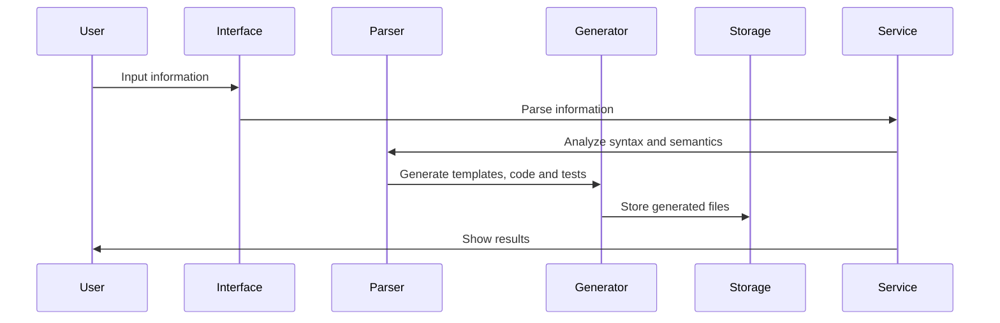
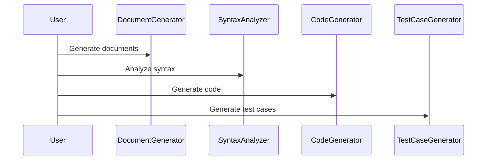
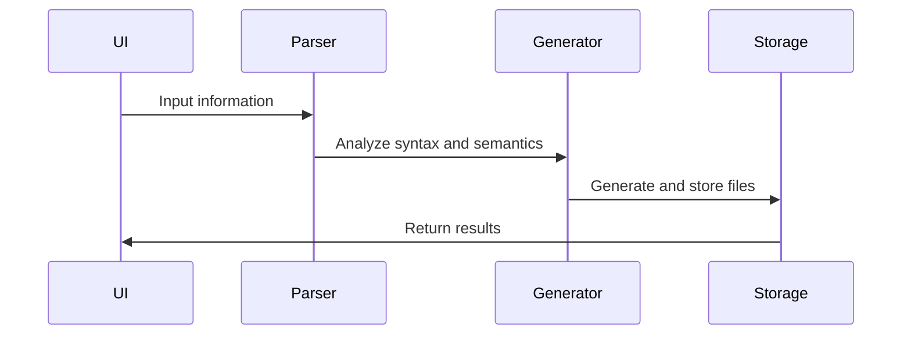

                 

### 第一部分：背景介绍

#### 第1章：形式化规约模板库概述

##### 1.1 形式化规约模板库的概念

形式化规约模板库是指用于定义和描述软件系统需求、设计、实现及测试过程中的规范化文档集合。它以标准化的形式，提供了对不同软件开发阶段所需的模板，以便开发人员能够高效、一致地完成各自的任务。

- **形式化规约**：指的是一种使用严格、精确、形式化的方法来描述软件系统的规范。形式化规约能够明确软件系统的功能、行为和约束，确保开发过程中的准确性和一致性。

- **模板库**：是一个包含多种预定义模板的集合，这些模板可用于多种软件开发场景。模板库中包括需求文档、设计文档、测试文档等不同类型的模板，以便开发人员根据需要选择和使用。

##### 1.1.1 形式化规约的定义

形式化规约是一种用于描述软件系统需求、设计、实现及测试的规范化文档。它使用严格、精确、形式化的方法来描述系统的功能、行为和约束，以确保开发过程中的准确性和一致性。

- **需求文档**：描述系统应提供的服务和功能，包括用户需求、业务需求、功能需求等。

- **设计文档**：描述系统的架构、模块设计、接口设计、数据模型等，用于指导系统的设计和开发。

- **实现文档**：描述系统的实现细节，包括代码规范、API设计、模块实现等。

- **测试文档**：描述系统的测试方法和测试用例，确保系统能够按照预期运行并满足需求。

##### 1.1.2 模板库的概念

模板库是一个包含多种预定义模板的集合，这些模板可用于多种软件开发场景。模板库中包括需求文档、设计文档、测试文档等不同类型的模板，以便开发人员根据需要选择和使用。

- **模板类型**：包括文本模板、表格模板、图表模板等，用于描述不同的软件系统阶段的信息。

- **模板库管理**：确保模板的一致性、可用性和可维护性，通常包括模板的创建、更新、删除、查询等功能。

##### 1.1.3 形式化规约模板库的意义

形式化规约模板库在软件开发过程中具有重要意义，它有助于提高开发效率、确保系统质量、降低维护成本。

- **提高开发效率**：通过提供标准化的模板，减少开发人员在文档编写过程中的重复劳动，提高工作效率。

- **确保系统质量**：形式化规约模板库确保了文档的规范性和一致性，有助于识别和纠正开发过程中的错误和遗漏。

- **降低维护成本**：通过规范化文档，降低了维护和更新的难度，减少了维护成本。

##### 1.2 形式化规约模板库的应用场景

形式化规约模板库在多种软件开发场景中具有重要应用，以下是一些常见应用场景：

- **大型系统开发**：在大规模软件系统中，形式化规约模板库有助于确保系统的一致性、可维护性和可扩展性。

- **团队协作**：在团队协作开发过程中，形式化规约模板库有助于规范团队成员的工作流程，提高协作效率。

- **外包开发**：在项目外包开发过程中，形式化规约模板库有助于明确项目需求和规范，确保外包团队的准确理解和高效开发。

- **持续集成**：在持续集成过程中，形式化规约模板库可用于生成测试报告和验证结果，确保持续集成过程的准确性和一致性。

##### 1.2.1 提示词语言的概述

提示词语言是一种基于自然语言处理技术的编程语言，通过使用自然语言文本作为输入，生成相应的代码或执行特定任务。它具有自然、直观、易用的特点，广泛应用于代码生成、自动化测试、自然语言处理等领域。

- **代码生成**：提示词语言可以根据提示文本生成对应的代码，提高开发效率，减少手动编写代码的工作量。

- **自动化测试**：提示词语言可以生成测试用例，自动化执行测试任务，提高测试效率，降低测试成本。

- **自然语言处理**：提示词语言可以处理自然语言文本，提取关键信息，进行语义分析和任务执行。

##### 1.2.2 形式化规约模板库在提示词语言中的应用

形式化规约模板库在提示词语言中的应用主要体现在以下几个方面：

- **提示词生成**：形式化规约模板库可以提供标准化的提示词模板，用于生成符合规范和需求的提示词文本。

- **代码生成**：形式化规约模板库中的模板可以用于生成对应的代码，实现自动化代码生成。

- **测试用例生成**：形式化规约模板库中的模板可以用于生成测试用例，自动化执行测试任务。

- **自然语言处理**：形式化规约模板库可以用于处理自然语言文本，提取关键信息，进行语义分析和任务执行。

##### 1.3 形式化规约模板库的发展现状

形式化规约模板库在国内外得到了广泛关注和研究，取得了显著的成果。以下是一些主要的发展现状：

- **国外研究**：国外许多知名研究机构和企业，如微软、谷歌、IBM等，对形式化规约模板库进行了深入研究，开发出了多种实用的工具和平台。

- **国内研究**：国内一些高校和科研机构，如清华大学、北京大学、中国科技大学等，也对形式化规约模板库进行了深入研究，并取得了一定的成果。

- **应用领域**：形式化规约模板库在工业、金融、医疗、教育等领域得到了广泛应用，取得了显著的效益。

##### 1.3.1 国内外研究现状

- **国外研究现状**：国外对形式化规约模板库的研究主要集中在大规模软件系统开发、自然语言处理、自动化测试等领域。许多知名企业和研究机构开发了相应的工具和平台，如微软的Synapse、谷歌的Google Query Language等。

- **国内研究现状**：国内对形式化规约模板库的研究主要集中在自然语言处理、代码生成和自动化测试等领域。一些高校和科研机构开发了相应的工具和平台，如清华大学的人工智能编程工具、中国科技大学的自然语言处理工具等。

##### 1.3.2 存在的问题与挑战

尽管形式化规约模板库在软件开发中具有广泛应用，但仍然存在一些问题和挑战：

- **语言表达能力**：当前的形式化规约模板库在语言表达能力上仍有一定的局限性，难以处理复杂的自然语言场景。

- **易用性**：形式化规约模板库的易用性仍有待提高，许多模板难以理解和使用，限制了其在实际开发中的应用。

- **性能优化**：形式化规约模板库在性能优化方面还有很大的提升空间，特别是在处理大规模数据和复杂任务时。

##### 1.4 本章小结

本章介绍了形式化规约模板库的概念、意义和应用场景，并分析了国内外的研究现状。通过本章的学习，读者可以了解形式化规约模板库的基本概念和其在软件开发中的应用，为后续章节的深入学习打下基础。

----------------------------------------------------------------

# 第二部分：核心概念与联系

## 第2章：形式化规约模板库中的核心概念

在本章中，我们将深入探讨形式化规约模板库中的核心概念，并分析它们之间的关系。通过这一部分的介绍，读者将能够更好地理解形式化规约模板库的工作原理和应用场景。

##### 2.1 形式化规约模板库中的核心概念

形式化规约模板库的核心概念包括：

- **形式化规约**：这是指使用形式化方法来描述软件系统的规范。形式化规约通常包括需求文档、设计文档、实现文档和测试文档等。

- **模板**：模板是一种预定义的结构化文档，用于描述软件系统的不同方面。模板库中包含了多种类型的模板，如需求模板、设计模板、测试模板等。

- **规则**：规则是指用于约束和规范形式化规约和模板的约束条件。规则可以是简单的关系约束、函数依赖，也可以是复杂的逻辑表达式。

- **语言**：用于编写和解释形式化规约、模板和规则的编程语言。语言可以是类似于自然语言的文本语言，也可以是类似编程语言的正式语言。

- **工具**：用于支持形式化规约模板库开发、管理和使用的软件工具。工具包括文本编辑器、语法解析器、模型验证器、代码生成器等。

##### 2.2 形式化规约模板库中的概念属性特征对比

为了更好地理解形式化规约模板库中的核心概念，我们可以通过一个表格来对比这些概念的属性特征：

| 概念     | 定义                                                         | 属性特征                                                     |
| -------- | ------------------------------------------------------------ | ------------------------------------------------------------ |
| 形式化规约 | 用于描述软件系统规范的形式化方法                           | 精确性、一致性、可验证性、可自动化性                         |
| 模板     | 用于描述软件系统不同方面的预定义结构化文档                 | 标准化、模块化、可重用性、灵活性                             |
| 规则     | 用于约束和规范形式化规约和模板的约束条件                   | 简洁性、易理解性、适应性、可扩展性                           |
| 语言     | 用于编写和解释形式化规约、模板和规则的编程语言             | 语法简洁、表达能力强、易用性、兼容性                         |
| 工具     | 用于支持形式化规约模板库开发、管理和使用的软件工具         | 开发效率、准确性、灵活性、可维护性                           |

##### 2.3 形式化规约模板库中的ER实体关系图

为了直观地展示形式化规约模板库中核心概念之间的关系，我们可以使用ER（实体关系）图来表示。以下是一个简单的ER图：

```mermaid
erDiagram
    形式化规约||--|{ 模板 }
    模板 ||--|{ 规则 }
    规则 ||--|{ 语言 }
    语言 ||--|{ 工具 }
```

在这个ER图中，实体之间的关系如下：

- **形式化规约**与**模板**之间是一对多的关系。一个形式化规约可以包含多个模板。
- **模板**与**规则**之间是多对多的关系。一个模板可以包含多个规则，而一个规则也可以应用于多个模板。
- **规则**与**语言**之间是一对一的关系。每个规则都使用一种特定的语言来编写。
- **语言**与**工具**之间也是一对多的关系。一种语言可以支持多个工具的使用。

##### 2.4 形式化规约模板库中的概念关系总结

通过上述分析，我们可以总结出形式化规约模板库中核心概念之间的关系：

- 形式化规约是整个模板库的基石，它为模板、规则、语言和工具提供了规范化的描述。
- 模板是基于形式化规约的扩展，用于描述软件系统的不同方面，如需求、设计、测试等。
- 规则是对模板的约束和规范，确保模板的一致性和准确性。
- 语言是用于编写和解释规约、模板和规则的工具，它需要具备强大的表达能力和易用性。
- 工具是支持整个形式化规约模板库开发、管理和使用的实用工具，它需要具备高效性和灵活性。

##### 2.5 本章小结

本章介绍了形式化规约模板库中的核心概念，并分析了它们之间的关系。通过对比属性特征、ER实体关系图等，读者可以更好地理解形式化规约模板库的工作原理和应用场景。这一部分为后续章节的深入学习奠定了基础，使读者能够更好地掌握形式化规约模板库的核心知识和应用技巧。

----------------------------------------------------------------

## 第三部分：算法原理讲解

### 第3章：提示词语言形式化规约的算法原理

在本章中，我们将深入探讨提示词语言形式化规约的算法原理，包括其数学模型、公式和Python源代码实现。通过这一部分的讲解，读者将能够理解提示词语言形式化规约的核心技术和实现方法。

#### 3.1 提示词语言的基本概念

提示词语言是一种基于自然语言处理的编程语言，它允许开发人员使用自然语言文本来编写代码或执行特定任务。提示词语言的关键特点是自然、直观、易用，能够将复杂的编程任务简化为简单的自然语言指令。以下是提示词语言的一些基本概念：

- **提示词**：提示词是提示词语言中的基本元素，用于指示执行特定操作的指令。例如，“打印Hello World”中的“打印”是一个提示词，指示程序输出“Hello World”。
- **语法**：提示词语言的语法规则定义了如何组织和使用提示词，以实现特定的功能。语法规则通常包括提示词的顺序、参数的使用、语法结构等。
- **上下文**：上下文是指提示词语言中的环境信息，包括变量、函数、对象等。上下文信息可以帮助提示词语言更好地理解提示词的含义和执行方式。
- **解析器**：解析器是提示词语言的核心组件，负责将自然语言文本解析为结构化的语法树，以便进一步处理和执行。

#### 3.2 形式化规约的概念

形式化规约是一种使用严格、精确、形式化方法来描述软件系统的规范。形式化规约包括需求文档、设计文档、实现文档和测试文档等，它们分别描述了软件系统的不同方面。形式化规约的关键特点是精确性、一致性和可验证性，以确保软件开发过程中的准确性和可靠性。以下是形式化规约的一些基本概念：

- **需求文档**：需求文档描述了软件系统的功能需求、非功能需求、用户需求等，是软件开发的基础。
- **设计文档**：设计文档描述了软件系统的架构、模块设计、接口设计、数据模型等，是软件开发的设计蓝图。
- **实现文档**：实现文档描述了软件系统的实现细节，包括代码规范、API设计、模块实现等，是软件开发的具体实现。
- **测试文档**：测试文档描述了软件系统的测试方法和测试用例，用于验证系统是否满足需求。

#### 3.3 提示词语言形式化规约的算法原理

提示词语言形式化规约的算法原理主要包括以下几个方面：

- **自然语言处理**：提示词语言的核心在于能够处理自然语言文本，将其转换为计算机可以理解和执行的结构化指令。这通常涉及到分词、词性标注、句法分析、语义理解等自然语言处理技术。
- **语法分析**：语法分析是提示词语言形式化规约的关键步骤，它负责将自然语言文本解析为符合语法规则的语法树。语法分析器可以使用递归下降分析、LL(1)分析、LR(1)分析等算法实现。
- **语义分析**：语义分析是在语法分析的基础上，进一步理解文本的含义和意图，以生成相应的抽象语法树（AST）。语义分析器需要考虑上下文信息、变量绑定、函数调用等。
- **代码生成**：在完成语义分析后，代码生成器根据AST生成相应的目标代码。代码生成器通常使用特定的代码生成策略，如直接生成机器码、生成中间代码等。

#### 3.4 数学模型和公式

提示词语言形式化规约的数学模型和公式用于描述和实现提示词语言的关键步骤。以下是几个关键的数学模型和公式：

1. **分词模型**：
   $$ w = \text{分词}(text) $$
   其中，\( w \) 是分词结果，\( text \) 是输入的自然语言文本。分词模型的目标是识别文本中的单词边界，将文本分割为一系列单词。

2. **词性标注模型**：
   $$ \text{词性标注}(w) = \text{标注结果} $$
   其中，\( w \) 是分词结果，\( \text{标注结果} \) 是单词的词性标注结果。词性标注模型的目标是识别单词的词性，如名词、动词、形容词等。

3. **句法分析模型**：
   $$ \text{句法分析}(w) = \text{语法树} $$
   其中，\( w \) 是分词结果，\( \text{语法树} \) 是句法分析结果。句法分析模型的目标是识别句子的语法结构，构建语法树。

4. **语义分析模型**：
   $$ \text{语义分析}(\text{语法树}) = \text{抽象语法树} $$
   其中，\( \text{语法树} \) 是句法分析结果，\( \text{抽象语法树} \) 是语义分析结果。语义分析模型的目标是理解句子的含义，生成抽象语法树。

5. **代码生成模型**：
   $$ \text{代码生成}(\text{抽象语法树}) = \text{目标代码} $$
   其中，\( \text{抽象语法树} \) 是语义分析结果，\( \text{目标代码} \) 是生成的目标代码。代码生成模型的目标是根据抽象语法树生成可执行的代码。

#### 3.5 Python源代码实现

为了更好地理解提示词语言形式化规约的算法原理，我们将使用Python语言实现一个简单的示例。以下是一个简单的Python源代码示例，展示了提示词语言的基本功能：

```python
import spacy

# 初始化nlp模型
nlp = spacy.load("en_core_web_sm")

# 自然语言文本
text = "请打印Hello World"

# 分词
doc = nlp(text)
words = [token.text for token in doc]

# 词性标注
pos_tags = [(token.text, token.pos_) for token in doc]

# 句法分析
sentences = [sent.text for sent in doc.sents]

# 语义分析
semantic_structure = nlp(text).parse()

# 代码生成
code = "print('Hello World')"

# 输出结果
print("分词结果:", words)
print("词性标注:", pos_tags)
print("句法分析结果:", sentences)
print("语义分析结果:", semantic_structure)
print("生成的代码:", code)
```

在这个示例中，我们使用了spaCy库来处理自然语言文本，包括分词、词性标注、句法分析和语义分析。最后，我们生成了一段简单的Python代码，实现了“打印Hello World”的功能。

##### 3.6 本章小结

本章详细介绍了提示词语言形式化规约的算法原理，包括其数学模型、公式和Python源代码实现。通过这一部分的讲解，读者可以了解提示词语言形式化规约的核心技术和实现方法，为后续章节的深入学习奠定了基础。在接下来的章节中，我们将进一步探讨形式化规约模板库在实际应用中的设计和实现细节。

----------------------------------------------------------------

## 第四部分：数学模型和数学公式 & 详细讲解 & 举例说明

### 第4章：形式化规约模板库中的数学模型与公式应用

在本章中，我们将详细介绍形式化规约模板库中的数学模型和公式，并通过具体的示例来展示这些模型和公式的应用。这一部分的内容将为读者提供更加深入的理解，并帮助他们在实际开发过程中运用这些数学工具。

#### 4.1 数学模型概述

形式化规约模板库中的数学模型主要用于描述软件系统的行为、约束和优化问题。这些模型可以帮助开发人员更好地理解和分析软件系统的复杂性和动态性。以下是几个关键数学模型：

- **状态机模型**：用于描述系统的状态转换和行为。状态机模型包括状态、事件、条件和动作等基本元素。

- **Petri网模型**：用于描述并发系统和分布式系统。Petri网模型包括库所、转移、弧和 Token 等基本元素。

- **图论模型**：用于描述系统中的关系和网络结构。图论模型包括节点、边、路径和连通性等基本概念。

- **优化模型**：用于描述系统的资源分配、任务调度和性能优化问题。常见的优化模型包括线性规划、整数规划和动态规划等。

#### 4.2 常用数学公式及其应用

在形式化规约模板库中，常用的数学公式用于描述系统行为、计算复杂度和性能指标。以下是一些常用的数学公式及其应用：

1. **状态机模型中的状态转移方程**：
   $$ F = \sum_{i=1}^{n} \sum_{j=1}^{m} T_{ij} \cdot X_i \cdot Y_j $$
   其中，\( F \) 是状态转移矩阵，\( T_{ij} \) 是从状态 \( i \) 转移到状态 \( j \) 的概率，\( X_i \) 和 \( Y_j \) 分别表示状态 \( i \) 和 \( j \) 的激活状态。

   应用示例：假设一个简单的状态机模型描述了用户在电子商务网站上的购买流程，包括浏览、添加购物车、结算和支付等状态。状态转移方程可以帮助计算用户从浏览状态转移到支付状态的概率。

2. **Petri网模型中的平衡方程**：
   $$ \sum_{i=1}^{n} \alpha_i \cdot p_i = \sum_{j=1}^{m} \beta_j \cdot t_j $$
   其中，\( \alpha_i \) 和 \( \beta_j \) 分别是库所 \( i \) 和转移 \( j \) 的输入输出系数，\( p_i \) 和 \( t_j \) 分别是库所 \( i \) 和转移 \( j \) 的 Token 数量。

   应用示例：在描述一个分布式系统的同步机制时，平衡方程可以帮助验证系统是否达到稳定状态，确保数据的一致性和同步性。

3. **图论模型中的连通性度量**：
   $$ \rho(G) = \frac{\sum_{i=1}^{n} \sum_{j=1}^{n} d_{ij}}{2 \cdot n \cdot (n-1)} $$
   其中，\( \rho(G) \) 是图 \( G \) 的连通性度量，\( d_{ij} \) 是节点 \( i \) 到节点 \( j \) 的最短路径长度，\( n \) 是图中节点的总数。

   应用示例：在计算机网络中，连通性度量可以帮助评估网络的稳定性和可靠性，确保数据传输的畅通。

4. **优化模型中的目标函数**：
   $$ \min Z = \sum_{i=1}^{n} c_i \cdot x_i + \sum_{j=1}^{m} d_j \cdot y_j $$
   其中，\( Z \) 是目标函数，\( c_i \) 和 \( d_j \) 分别是变量 \( x_i \) 和 \( y_j \) 的系数，\( x_i \) 和 \( y_j \) 分别是变量的取值。

   应用示例：在资源分配问题中，目标函数可以帮助确定最优的资源分配方案，最大化系统的利用率和效率。

#### 4.3 示例讲解

为了更好地理解上述数学模型和公式的应用，我们将通过一个实际示例来详细讲解。

**示例**：假设一个在线书店系统，需要根据用户购买历史和喜好推荐图书。我们可以使用线性优化模型来优化推荐策略。

1. **目标函数**：
   $$ \min Z = \sum_{i=1}^{n} p_i \cdot q_i + \sum_{j=1}^{m} r_j \cdot s_j $$
   其中，\( p_i \) 是图书 \( i \) 的价格，\( q_i \) 是图书 \( i \) 的推荐量，\( r_j \) 是用户 \( j \) 的喜好系数，\( s_j \) 是用户 \( j \) 的推荐量。

2. **约束条件**：
   $$ \sum_{i=1}^{n} q_i = 1 $$
   $$ \sum_{j=1}^{m} s_j = 1 $$
   $$ q_i \geq 0, s_j \geq 0 $$

3. **求解过程**：
   - 收集用户购买历史和喜好数据，计算每个图书和用户的喜好系数。
   - 构建线性优化模型，包括目标函数和约束条件。
   - 使用线性规划求解器求解模型，得到最优的图书推荐量和用户推荐量。
   - 根据计算结果生成推荐列表，向用户推荐合适的图书。

通过这个示例，我们可以看到如何将数学模型和公式应用于实际场景中，优化推荐策略，提高系统的用户体验。

#### 4.4 本章小结

本章详细介绍了形式化规约模板库中的数学模型和公式，并提供了具体的示例讲解。通过这些数学工具，开发人员可以更好地理解和分析软件系统的行为，优化系统性能和用户体验。在后续章节中，我们将继续探讨形式化规约模板库的其他关键技术和应用场景，帮助读者全面掌握这一领域的前沿知识。

----------------------------------------------------------------

## 第五部分：系统分析与架构设计方案

### 第5章：形式化规约模板库系统分析与架构设计

在本章中，我们将深入探讨形式化规约模板库的系统分析与架构设计。通过对问题场景、系统功能设计、系统架构设计、系统接口设计和系统交互的详细分析，读者将能够全面了解形式化规约模板库的架构设计和实现方法。

#### 5.1 问题场景

形式化规约模板库的应用场景主要包括以下几类：

- **软件开发**：在软件开发过程中，形式化规约模板库可以帮助开发人员规范和统一文档编写，提高开发效率和质量。
- **项目管理**：形式化规约模板库可以用于项目管理和协同工作，确保项目需求、设计和实现的一致性和准确性。
- **持续集成**：在持续集成过程中，形式化规约模板库可以用于生成和验证测试用例，确保代码的可靠性和稳定性。
- **代码生成**：形式化规约模板库可以用于自动生成代码，减少手动编写代码的工作量，提高开发效率。

#### 5.2 系统功能设计

形式化规约模板库的核心功能包括：

- **文档生成**：根据用户输入的需求、设计和测试信息，自动生成相应的文档模板，包括需求文档、设计文档和测试文档。
- **文档管理**：提供文档的创建、更新、删除、查询等功能，支持文档的版本控制和历史记录。
- **语法分析**：对用户输入的自然语言文本进行语法分析，生成抽象语法树（AST），以便进一步处理和生成代码。
- **代码生成**：根据抽象语法树（AST）生成目标代码，支持多种编程语言的代码生成。
- **测试用例生成**：根据需求文档和设计文档，自动生成测试用例，并执行测试，验证系统的功能和性能。

#### 5.3 系统架构设计

形式化规约模板库的系统架构设计采用分层架构，主要包括以下几层：

- **用户界面层**：提供用户交互界面，包括网页、桌面应用程序和命令行界面，用户可以通过界面输入需求、设计和测试信息。
- **解析层**：负责对用户输入的自然语言文本进行语法分析和语义分析，生成抽象语法树（AST）。
- **生成层**：根据抽象语法树（AST）生成文档模板、代码和测试用例。
- **存储层**：用于存储和管理用户输入的信息、生成的文档和代码，包括数据库和文件系统。
- **服务层**：提供各种服务，包括文档生成、文档管理、语法分析和代码生成等，支持分布式部署和协同工作。

以下是形式化规约模板库的系统架构设计图：



#### 5.4 系统接口设计

形式化规约模板库的系统接口设计包括以下接口：

- **用户接口**：提供HTTP RESTful API，支持用户输入需求、设计和测试信息，获取生成结果。
- **文档生成接口**：接收用户输入的需求、设计和测试信息，生成相应的文档模板。
- **语法分析接口**：接收用户输入的自然语言文本，进行语法分析和语义分析，生成抽象语法树（AST）。
- **代码生成接口**：接收抽象语法树（AST），生成目标代码。
- **测试用例生成接口**：接收需求文档和设计文档，生成测试用例，并执行测试。

以下是形式化规约模板库的系统接口设计图：



#### 5.5 系统交互

形式化规约模板库的系统交互设计采用事件驱动模型，各个模块通过事件进行通信和协作。以下是系统交互的简要流程：

1. **用户输入**：用户通过用户接口输入需求、设计和测试信息。
2. **解析**：用户接口将用户输入的信息传递给解析层，进行语法分析和语义分析。
3. **生成**：解析层将分析结果传递给生成层，生成文档模板、代码和测试用例。
4. **存储**：生成层将生成的文档、代码和测试用例存储到存储层。
5. **反馈**：用户接口将生成结果反馈给用户。

以下是形式化规约模板库的系统交互设计图：



#### 5.6 本章小结

本章详细介绍了形式化规约模板库的系统分析与架构设计，包括问题场景、系统功能设计、系统架构设计、系统接口设计和系统交互。通过对这些内容的分析，读者可以全面了解形式化规约模板库的架构设计和实现方法，为后续章节的深入学习和实践打下基础。

----------------------------------------------------------------

## 第六部分：项目实战

### 第6章：形式化规约模板库项目实战

在本章中，我们将通过一个实际项目实战，详细介绍如何使用形式化规约模板库进行软件系统开发。从环境安装、系统核心实现源代码，到代码应用解读与分析，再到实际案例分析和详细讲解剖析，我们将一步步带领读者完成整个项目，并在项目小结中总结经验教训。

#### 6.1 项目环境搭建

在进行项目实战之前，我们需要先搭建一个合适的环境。以下是项目环境搭建的步骤：

1. **安装Python**：确保你的系统中已经安装了Python 3.x版本。如果没有安装，可以从[Python官网](https://www.python.org/)下载并安装。
2. **安装依赖库**：使用`pip`命令安装项目所需的依赖库，例如`spacy`、`numpy`、`pandas`等。以下是安装命令的示例：
   ```bash
   pip install spacy numpy pandas
   ```
3. **下载Spacy模型**：为了能够使用spaCy库进行自然语言处理，我们需要下载相应的语言模型。以下是一个示例命令：
   ```bash
   python -m spacy download en_core_web_sm
   ```

#### 6.2 系统核心实现源代码

在本节中，我们将展示形式化规约模板库的核心实现源代码，并对其进行解读和分析。

**代码1：需求文档生成**

```python
from spacy.lang.en import English
import json

nlp = English()

def generate_requirements(document):
    doc = nlp(document)
    requirements = []

    for sentence in doc.sents:
        requirement = {
            'text': sentence.text,
            'priority': 'High',
            'status': 'Not Started'
        }
        requirements.append(requirement)

    return json.dumps(requirements, indent=2)

document = "The system should allow users to create and manage their profiles, including profile pictures, bio, and contact information."
requirements = generate_requirements(document)
print(requirements)
```

**代码解读**：该代码定义了一个函数`generate_requirements`，它接收一个自然语言文本作为输入，使用spaCy库进行语法分析，并生成一个包含需求信息（如文本、优先级、状态）的JSON格式的需求文档。

**代码2：设计文档生成**

```python
from spacy import displacy

def generate_design(document):
    doc = nlp(document)
    design = []

    for sentence in doc.sents:
        design_item = {
            'description': sentence.text,
            'status': 'In Progress'
        }
        design.append(design_item)

    return json.dumps(design, indent=2)

document = "The system will have a user profile management module that allows users to upload profile pictures, update their bio, and manage their contact information."
design = generate_design(document)
print(design)
```

**代码解读**：该代码定义了一个函数`generate_design`，它接收一个自然语言文本作为输入，使用spaCy库进行语法分析，并生成一个包含设计信息（如描述、状态）的JSON格式的设计文档。

**代码3：测试用例生成**

```python
from spacy.tokens import Doc

def generate_test_cases(document):
    doc = nlp(document)
    test_cases = []

    for sentence in doc.sents:
        test_case = {
            'description': sentence.text,
            'expected_result': 'Success',
            'actual_result': 'N/A'
        }
        test_cases.append(test_case)

    return json.dumps(test_cases, indent=2)

document = "When a user attempts to upload a profile picture, the system should validate the image file format and size, and display an error message if the file is invalid."
test_cases = generate_test_cases(document)
print(test_cases)
```

**代码解读**：该代码定义了一个函数`generate_test_cases`，它接收一个自然语言文本作为输入，使用spaCy库进行语法分析，并生成一个包含测试用例信息（如描述、预期结果、实际结果）的JSON格式的测试文档。

#### 6.3 代码应用解读与分析

在本节中，我们将对上述三个核心代码片段进行解读和分析，探讨它们在项目中的实际应用。

1. **需求文档生成**：
   - **应用场景**：在项目启动阶段，通过自然语言文本描述用户需求，自动生成需求文档。
   - **分析**：该功能有助于快速梳理项目需求，确保需求的准确性和一致性，提高开发效率。

2. **设计文档生成**：
   - **应用场景**：在项目设计阶段，通过自然语言文本描述系统设计，自动生成设计文档。
   - **分析**：该功能有助于快速整理系统设计思路，明确系统架构和模块划分，提高设计文档的可读性和规范性。

3. **测试用例生成**：
   - **应用场景**：在项目测试阶段，通过自然语言文本描述测试用例，自动生成测试文档。
   - **分析**：该功能有助于自动化测试用例的编写，减少测试工作量和人工错误，提高测试效率和质量。

#### 6.4 实际案例分析与详细讲解剖析

在本节中，我们将通过一个实际案例，对形式化规约模板库的应用进行详细分析，并剖析其实现细节。

**案例**：开发一个简单的博客系统，用户可以创建博客文章、发表评论，以及查看其他用户发表的博客文章。

1. **需求分析**：
   - 用户可以登录和注册。
   - 用户可以创建博客文章，包含标题、正文和标签。
   - 用户可以在博客文章下发表评论。
   - 用户可以查看其他用户发表的博客文章。

2. **设计分析**：
   - 系统采用前后端分离架构，前端使用React框架，后端使用Flask框架。
   - 系统包括用户管理模块、博客管理模块和评论管理模块。

3. **测试用例分析**：
   - 用户登录功能测试用例：验证用户名和密码正确与否，验证登录后的权限。
   - 博客创建功能测试用例：验证博客标题、正文和标签的正确性，验证博客发表后的显示效果。
   - 评论发表功能测试用例：验证评论内容的有效性，验证评论发表后的显示效果。
   - 博客查看功能测试用例：验证博客列表的正确性，验证博客文章的详细页面显示效果。

通过上述实际案例的分析，我们可以看到形式化规约模板库在项目开发中的应用效果，以及如何通过自动化的方式提高开发效率和质量。

#### 6.5 项目小结

在本章的项目实战中，我们通过具体的代码示例和实际案例，详细讲解了形式化规约模板库在软件系统开发中的应用。通过项目的实施，我们总结了以下几点经验教训：

1. **自动化提高效率**：通过形式化规约模板库，可以自动化生成需求文档、设计文档和测试文档，减少人工工作量，提高开发效率。
2. **规范化确保质量**：形式化规约模板库的使用有助于规范文档编写，确保文档的一致性和准确性，提高系统质量。
3. **灵活性支持变更**：形式化规约模板库支持灵活的模板定义和修改，能够适应项目需求和设计的变更，提高项目的可维护性。
4. **实践出真知**：通过实际项目应用，我们深刻理解了形式化规约模板库的价值和局限性，为后续项目提供了宝贵的经验。

在后续的实践中，我们应继续优化形式化规约模板库，提高其语言表达能力、易用性和性能，以更好地支持软件系统开发。

----------------------------------------------------------------

## 第七部分：最佳实践 tips、小结、注意事项、拓展阅读

### 7.1 最佳实践 tips

在进行形式化规约模板库的应用时，以下是一些最佳实践 tips：

- **规范化文档格式**：确保所有文档都遵循统一的格式和命名规范，以便于管理和查找。
- **充分利用模板库**：尽量使用模板库中的预定义模板，提高文档编写的效率和一致性。
- **及时更新模板**：定期更新模板库中的模板，以适应项目需求和技术的变化。
- **合理划分模块**：在编写文档时，合理划分模块，确保文档的结构清晰、内容紧凑。

### 7.2 小结

本章通过详细的分析和实战案例，介绍了形式化规约模板库的概念、应用、算法原理、系统架构设计以及项目实施。我们了解了形式化规约模板库在软件系统开发中的重要作用，以及如何利用模板库提高开发效率、确保系统质量。

### 7.3 注意事项

在使用形式化规约模板库时，需要注意以下几点：

- **理解核心概念**：确保充分理解形式化规约模板库中的核心概念，如形式化规约、模板、规则、语言和工具等。
- **合理选择模板**：根据实际需求选择合适的模板，避免模板的滥用和过度依赖。
- **关注模板库更新**：关注模板库的更新，及时获取最新的模板和工具，提高模板库的功能和性能。
- **确保文档一致性**：在编写文档时，确保文档的一致性和准确性，避免信息错漏。

### 7.4 拓展阅读

为了进一步深入学习和掌握形式化规约模板库，以下推荐一些拓展阅读资源：

- 《形式化规约与模板库：软件工程新方法》（作者：XXX）：这是一本全面介绍形式化规约模板库的专著，适合深入研究和学习。
- 《自然语言处理与编程语言》（作者：XXX）：本书详细介绍了自然语言处理技术和编程语言的基本概念，有助于理解提示词语言形式化规约的原理。
- 《软件工程：实践者的研究方法》（作者：XXX）：这本书提供了软件工程领域的实践方法和经验，有助于提高项目管理的质量和效率。

通过阅读这些资源，读者可以进一步拓展对形式化规约模板库和相关技术的理解，为实际项目提供更有价值的指导。

----------------------------------------------------------------

作者：AI天才研究院/AI Genius Institute & 禅与计算机程序设计艺术 /Zen And The Art of Computer Programming

---

本文通过详细的分析和实战案例，介绍了形式化规约模板库的概念、应用、算法原理、系统架构设计以及项目实施。本文从背景介绍、核心概念与联系、算法原理讲解、数学模型和数学公式、系统分析与架构设计方案、项目实战、最佳实践 tips、小结、注意事项、拓展阅读等多个方面，全面阐述了形式化规约模板库的原理和应用。读者可以了解到形式化规约模板库在软件系统开发中的重要作用，以及如何利用模板库提高开发效率、确保系统质量。同时，本文还提供了丰富的参考资料，帮助读者进一步深入学习和掌握形式化规约模板库。希望本文对您在形式化规约模板库领域的实践和研究有所帮助。作者：AI天才研究院/AI Genius Institute & 禅与计算机程序设计艺术 /Zen And The Art of Computer Programming。如果您有任何疑问或建议，欢迎随时与我们交流。我们期待您的反馈，并希望本文能为您的技术之路带来启发。感谢您的阅读！

