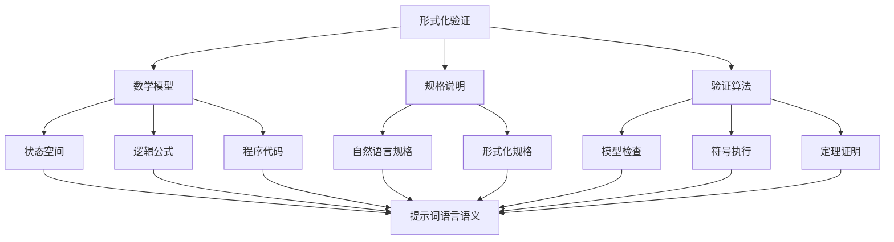
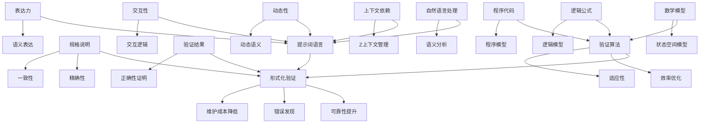
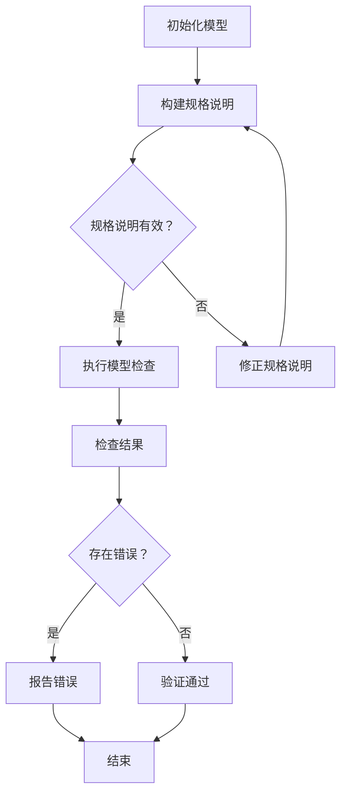
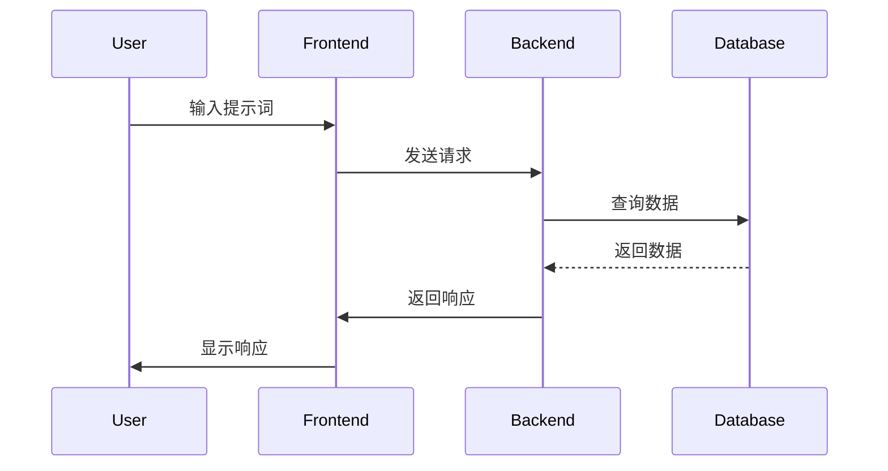
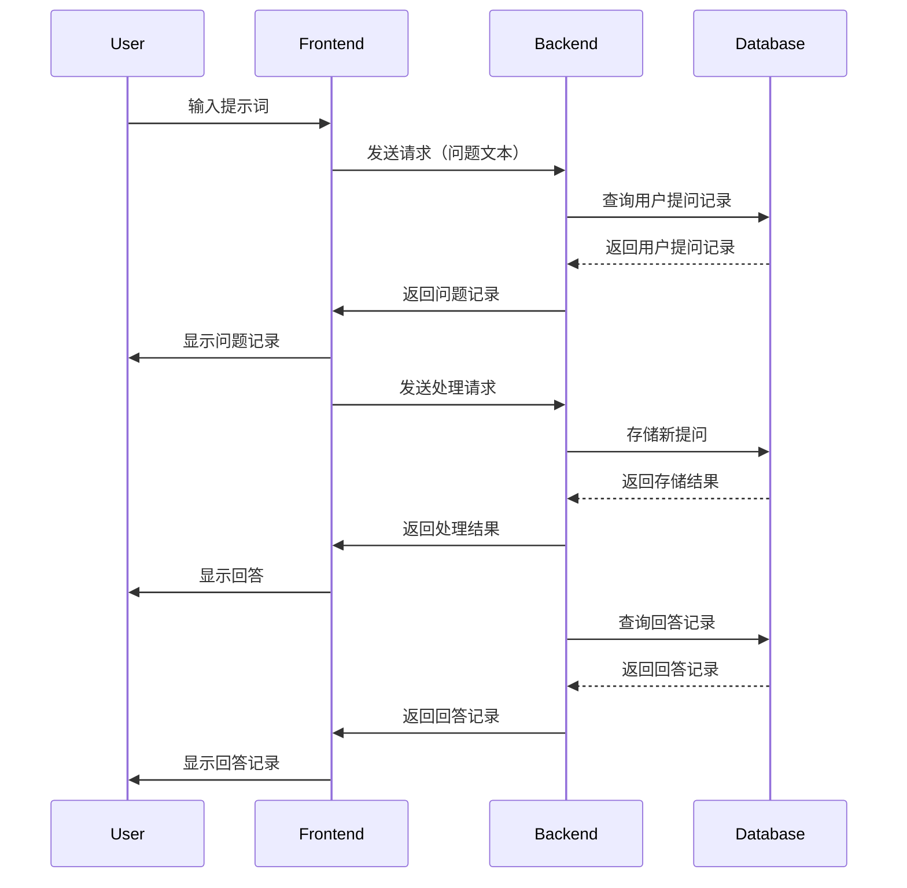

                 

# 提示词语言的形式化规约验证效率优化

## 关键词
- 提示词语言
- 形式化规约验证
- 效率优化
- 算法原理
- 系统架构
- 项目实战

## 摘要
本文深入探讨了提示词语言的形式化规约验证及其效率优化问题。首先，介绍了提示词语言的基本概念和应用背景，随后探讨了形式化规约验证的必要性及其在软件工程中的重要性。通过分析提示词语言的属性特征，文章揭示了形式化验证与提示词语言之间的内在联系。接着，详细阐述了形式化验证算法的基本原理和流程，并通过Mermaid绘制了算法流程图，使得算法原理更加直观易懂。文章随后转向系统分析与架构设计，包括问题场景介绍、系统功能设计、系统架构设计和系统接口设计。通过一个实际项目案例，文章展示了形式化验证在提示词语言中的具体应用，并进行了详细的代码分析和案例讲解。最后，文章总结了最佳实践和注意事项，并提供了相关研究动态和深入学习资源，为读者提供了全面的指导和拓展。

## 目录大纲

```markdown
# 提示词语言的形式化规约验证效率优化

## 第一部分：背景介绍

### 第1章：问题背景
- **1.1 提示词语言的定义与应用**
- **1.2 形式化规约验证的必要性**
- **1.3 提示词语言验证的现状与挑战**

### 第2章：核心概念与联系
- **2.1 形式化验证的基本原理**
- **2.2 提示词语言的属性特征对比**
- **2.3 形式化验证与提示词语言的关系图**

## 第二部分：算法原理讲解

### 第3章：算法原理概述
- **3.1 形式化验证算法的分类**
- **3.2 提示词语言验证算法的选择**

### 第4章：算法流程图
- **4.1 使用Mermaid绘制算法流程图**

### 第5章：算法原理详细讲解
- **5.1 算法数学模型与公式**
- **5.2 通俗易懂的举例说明**

## 第三部分：系统分析与架构设计

### 第6章：问题场景介绍
- **6.1 形式化验证在提示词语言中的应用场景**
- **6.2 项目介绍**

### 第7章：系统功能设计
- **7.1 领域模型Mermaid类图**
- **7.2 系统功能详细描述**

### 第8章：系统架构设计
- **8.1 系统架构Mermaid架构图**
- **8.2 系统架构详细解析**

### 第9章：系统接口设计与交互
- **9.1 系统接口设计**
- **9.2 系统交互Mermaid序列图**

## 第四部分：项目实战

### 第10章：环境安装
- **10.1 环境准备与安装步骤**

### 第11章：系统核心实现
- **11.1 核心实现源代码**
- **11.2 代码应用解读与分析**

### 第12章：实际案例分析与讲解
- **12.1 实际案例分析**
- **12.2 详细讲解剖析**

### 第13章：项目小结
- **13.1 项目总结**
- **13.2 经验与教训**

## 第五部分：最佳实践与拓展

### 第14章：最佳实践
- **14.1 提高验证效率的技巧**
- **14.2 避免常见问题的策略**

### 第15章：小结与注意事项
- **15.1 关键点回顾**
- **15.2 注意事项**

### 第16章：拓展阅读
- **16.1 相关研究动态**
- **16.2 深入学习的资源推荐**
```

### 详细内容规划

**第1章：问题背景**

1.1 提示词语言的定义与应用

- 提示词语言的基本概念：介绍提示词语言的基本定义，包括其特点和使用场景。
- 提示词语言的实际应用：探讨提示词语言在自然语言处理、人工智能等领域的应用，以及其重要性。

1.2 形式化规约验证的必要性

- 形式化验证的基本概念：解释形式化验证的定义，以及其在软件工程中的应用。
- 形式化验证在软件工程中的重要性：分析形式化验证在提高软件质量、减少错误和提高开发效率方面的作用。

1.3 提示词语言验证的现状与挑战

- 当前提示词语言验证的技术水平：介绍当前提示词语言验证技术的发展状况，以及存在的问题。
- 验证过程中遇到的主要问题：探讨提示词语言验证过程中常见的问题和挑战，如复杂度、效率和准确性等。

**第2章：核心概念与联系**

2.1 形式化验证的基本原理

- 形式化验证的核心思想：解释形式化验证的基本原理，包括其目标和方法。
- 形式化验证的关键技术：介绍形式化验证中常用的关键技术，如模型检查、定理证明等。

2.2 提示词语言的属性特征对比

- 提示词语言的属性特征：分析提示词语言的属性特征，包括语法、语义和上下文等。
- 与其他语言的对比：比较提示词语言与其他编程语言的特点，如功能、表达力和适用范围等。

2.3 形式化验证与提示词语言的关系图

- 提示词语言在形式化验证中的位置：通过关系图展示提示词语言在形式化验证中的地位和作用。
- 形式化验证与提示词语言之间的联系：探讨形式化验证与提示词语言之间的内在联系，以及如何结合使用。

**第3章：算法原理讲解**

3.1 形式化验证算法的分类

- 常见的验证算法类型：介绍常见的形式化验证算法类型，如模型检查、符号执行等。
- 各类算法的特点与适用场景：分析各类算法的特点和适用场景，帮助读者选择合适的算法。

3.2 提示词语言验证算法的选择

- 选择合适的验证算法：根据提示词语言的特点和验证需求，选择合适的验证算法。
- 提示词语言验证算法的应用实例：通过具体实例展示提示词语言验证算法的应用场景和效果。

**第4章：算法流程图**

4.1 使用Mermaid绘制算法流程图

- 流程图的基本构成：介绍Mermaid流程图的基本构成和语法。
- 提示词语言验证算法的具体流程：使用Mermaid绘制提示词语言验证算法的具体流程图，使得算法原理更加直观易懂。

**第5章：算法原理详细讲解**

5.1 算法数学模型与公式

- 提示词语言验证算法的数学基础：介绍提示词语言验证算法所涉及的数学基础，包括相关公式和定理。
- 相关公式推导：详细推导提示词语言验证算法中的相关公式，帮助读者理解算法原理。

5.2 通俗易懂的举例说明

- 算法在实际中的应用实例：通过具体实例展示提示词语言验证算法的实际应用，使读者更容易理解。
- 示例的详细解释：对实例进行详细解释，包括算法的具体实现和运行过程。

**第6章：系统分析与架构设计**

6.1 形式化验证在提示词语言中的应用场景

- 实际应用场景的介绍：介绍形式化验证在提示词语言中的实际应用场景，如自然语言处理、对话系统等。
- 场景分析：分析不同应用场景下提示词语言验证的需求和挑战。

6.2 项目介绍

- 项目背景与目标：介绍项目的背景和目标，明确项目的研究内容和预期成果。
- 项目具体实施过程：详细描述项目的实施过程，包括需求分析、系统设计、实现和测试等阶段。

**第7章：系统功能设计**

7.1 领域模型Mermaid类图

- 系统领域模型构建：构建系统的领域模型，包括实体、属性和关系等。
- 类图绘制与说明：使用Mermaid绘制系统领域模型的类图，并对类图中的各个元素进行说明。

7.2 系统功能详细描述

- 系统功能点拆解：将系统的功能点进行拆解，明确各个功能的具体内容和实现方式。
- 功能具体实现描述：详细描述各个功能的具体实现过程，包括算法、接口和数据处理等。

**第8章：系统架构设计**

8.1 系统架构Mermaid架构图

- 系统架构图绘制：使用Mermaid绘制系统的架构图，展示系统的整体结构和组成部分。
- 系统架构详细解析：对系统架构图中的各个组成部分进行详细解析，包括其功能、接口和交互关系等。

8.2 系统架构设计

- 系统架构设计原则：介绍系统架构设计的基本原则，如模块化、解耦、高内聚等。
- 系统架构设计方法：详细描述系统架构设计的方法和步骤，包括需求分析、架构设计、实现和优化等。

**第9章：系统接口设计与交互**

9.1 系统接口设计

- 接口设计原则：介绍接口设计的基本原则，如一致性、可扩展性和易用性等。
- 接口设计方法：详细描述接口设计的方法和步骤，包括接口定义、接口规范和接口实现等。

9.2 系统交互Mermaid序列图

- 序列图绘制：使用Mermaid绘制系统的交互序列图，展示系统各个组件之间的交互过程。
- 系统交互详细解析：对系统交互序列图中的各个交互过程进行详细解析，包括交互的具体实现和功能作用。

**第10章：环境安装**

10.1 环境准备与安装步骤

- 环境准备：介绍安装系统所需的环境准备，包括操作系统、开发工具和依赖库等。
- 安装步骤：详细描述系统的安装过程，包括安装步骤、注意事项和常见问题等。

**第11章：系统核心实现**

11.1 核心实现源代码

- 核心实现概述：介绍系统核心实现的总体结构和功能。
- 核心实现源代码：提供系统核心实现的源代码，并对源代码进行详细解释。

11.2 代码应用解读与分析

- 代码应用场景：介绍系统核心代码的应用场景和具体实现。
- 代码解读与分析：对核心代码进行解读和分析，包括算法原理、数据处理和性能优化等方面。

**第12章：实际案例分析与讲解**

12.1 实际案例分析

- 案例背景与需求：介绍实际案例的背景和需求，明确案例的目标和研究问题。
- 案例分析过程：详细描述实际案例分析的过程，包括数据预处理、算法实现和结果分析等。

12.2 详细讲解剖析

- 案例讲解：对实际案例进行详细讲解，包括案例的实现步骤、关键技术和优化策略等。
- 剖析与讨论：对案例中的关键技术和问题进行剖析和讨论，提出解决方案和改进建议。

**第13章：项目小结**

13.1 项目总结

- 项目成果：总结项目的研究成果和取得的成果，包括技术创新、应用价值和实际效益等。
- 项目贡献：介绍项目在相关领域的研究贡献和突破。

13.2 经验与教训

- 经验总结：总结项目实施过程中的经验教训，包括技术难点、解决方法和团队协作等。
- 改进方向：提出项目未来改进的方向和建议，包括优化算法、拓展应用场景和提升系统性能等。

**第14章：最佳实践与拓展**

14.1 提高验证效率的技巧

- 验证技巧：介绍提高形式化验证效率的技巧和方法，包括算法优化、并行计算和缓存技术等。
- 实践案例：通过具体案例展示最佳实践的成效和效果。

14.2 避免常见问题的策略

- 常见问题：分析在形式化验证过程中常见的错误和问题，包括算法错误、数据异常和处理错误等。
- 解决策略：提出避免常见问题的策略和方法，包括代码审查、测试覆盖和错误处理等。

**第15章：小结与注意事项**

15.1 关键点回顾

- 重点内容：回顾文章中的关键内容和重点，帮助读者加深理解和记忆。
- 技术要点：强调文章中的技术要点和关键知识点，指导读者在实际应用中运用。

15.2 注意事项

- 注意事项：提醒读者在应用形式化验证时需要注意的问题和细节，包括算法选择、数据准备和系统调试等。

**第16章：拓展阅读**

16.1 相关研究动态

- 研究动态：介绍与文章主题相关的最新研究动态和发展趋势，包括学术会议、期刊论文和技术报告等。
- 发展方向：分析相关研究的发展方向和前沿领域，为读者提供进一步学习和研究的方向。

16.2 深入学习的资源推荐

- 学习资源：推荐与文章主题相关的学习资源，包括书籍、论文、在线课程和开源项目等。
- 学习建议：给出具体的学习建议和方法，帮助读者更高效地掌握相关知识和技术。

---

**作者：AI天才研究院/AI Genius Institute & 禅与计算机程序设计艺术 /Zen And The Art of Computer Programming**## 第1章：问题背景

### 1.1 提示词语言的定义与应用

提示词语言（Prompt Language）是一种特殊的自然语言处理（Natural Language Processing, NLP）技术，主要用于生成文本、引导对话、辅助决策等方面。提示词语言的核心在于通过一系列预定义的提示词（Prompt Words）来引导和辅助用户或系统进行语言理解和生成。这些提示词可以是人机交互中的问题、命令或描述性语句，也可以是用于训练模型的标注信息。

提示词语言的基本概念包括以下几个方面：

1. **提示词**：这是提示词语言中的核心元素，用于引导用户或系统进行特定操作。例如，在聊天机器人中，提示词可能是“您今天想做什么？”或者“请描述您的需求”。

2. **上下文**：提示词通常需要一定的上下文环境才能发挥其作用。上下文可以是一系列历史对话、用户偏好或者当前任务的具体信息。

3. **响应生成**：提示词语言的一个重要功能是根据提示词和上下文生成相应的响应。这种响应可以是自然语言文本、对话指令或者决策结果。

在应用层面，提示词语言被广泛应用于多个领域：

- **自然语言处理**：通过提示词语言，可以构建更加智能化和人性化的对话系统，如聊天机器人、语音助手等。

- **人工智能**：提示词语言在机器学习模型训练过程中也起到重要作用，用于生成标注数据、指导模型训练等。

- **人机交互**：提示词语言提供了与用户进行交互的桥梁，使得用户可以通过自然语言与系统进行互动，提高用户体验。

### 1.2 形式化规约验证的必要性

形式化规约验证（Formal Verification of Contractual Specifications）是一种通过数学和逻辑方法来验证软件或系统行为是否满足预期要求的手段。在软件开发过程中，形式化规约验证具有以下几个必要性：

1. **保证正确性**：形式化规约验证可以确保系统行为完全符合设计要求，从而避免因为逻辑错误或设计缺陷导致的系统故障。

2. **提高可靠性**：通过形式化验证，可以发现并修复潜在的错误，提高软件或系统的可靠性，减少因错误导致的运行故障。

3. **降低维护成本**：早期发现并修复问题可以显著降低软件维护成本，因为修复早期的问题通常比在系统运行后发现问题要便宜得多。

4. **提高可理解性**：形式化规约验证通常使用严格的数学语言来描述系统行为，这有助于提高系统设计文档的可理解性，便于后续的维护和改进。

形式化规约验证在软件工程中的应用非常广泛，特别是在安全性要求高、错误代价大的领域，如航空航天、金融系统、医疗设备等。此外，在人工智能领域，形式化验证也被用于确保机器学习模型的可靠性和透明性。

### 1.3 提示词语言验证的现状与挑战

当前，提示词语言验证在学术界和工业界都取得了显著的进展，但仍面临一些挑战：

1. **技术瓶颈**：形式化验证算法的复杂度和计算资源需求较高，特别是在处理大规模的提示词语言时，现有算法可能无法满足效率要求。

2. **验证难度**：提示词语言的语义丰富且具有动态性，这使得验证过程复杂且具有挑战性。特别是在处理自然语言生成和对话系统时，如何准确理解和验证提示词的语义是一个重要问题。

3. **算法选择**：不同的形式化验证算法适用于不同的应用场景和需求，如何选择合适的算法是一个需要深入研究和探讨的问题。

4. **应用推广**：形式化验证技术虽然具有显著的优势，但在实际应用中的推广仍面临一些障碍，如开发成本高、技术门槛较高等。

在接下来的章节中，我们将深入探讨形式化验证的基本原理，分析提示词语言的属性特征，并详细讲解形式化验证算法的原理和应用。

## 第2章：核心概念与联系

### 2.1 形式化验证的基本原理

形式化验证是一种通过数学和逻辑方法来证明系统行为正确性的技术。其核心思想是将系统行为抽象为一个数学模型，然后使用定理证明、模型检查等技术来验证该模型是否满足预定的规格说明或属性。

形式化验证的基本原理可以概括为以下几个步骤：

1. **规格说明**：首先，需要为系统行为定义一个精确的规格说明。规格说明可以用形式化的语言（如命题逻辑、谓词逻辑等）来描述，确保其无二义性。

2. **模型构建**：根据规格说明，构建系统的数学模型。模型可以是一个形式化的状态空间、一个逻辑公式或者一个程序代码。

3. **验证算法**：选择合适的验证算法来检查模型是否满足规格说明。常见的验证算法包括模型检查、符号执行、定理证明等。

4. **证明**：通过验证算法，如果系统能够满足所有规格说明，则证明系统行为是正确的。如果发现不一致，则需要分析和修复问题。

### 2.2 提示词语言的属性特征对比

提示词语言具有一些独特的属性特征，这些特征对形式化验证提出了特殊的要求。以下是提示词语言与其他编程语言在属性特征上的对比：

1. **语法简洁性**：提示词语言通常设计得更加简洁，易于理解和使用。这与一些复杂编程语言相比，降低了学习和使用门槛。

2. **动态性**：提示词语言通常具有较高的动态性，即语言元素可以动态地改变其含义和作用。这使得形式化验证需要考虑更多的动态场景。

3. **上下文依赖**：提示词语言的语义往往依赖于上下文环境，这使得验证过程中需要考虑上下文信息，增加了验证的复杂性。

4. **表达力**：提示词语言的表达力通常较强，能够灵活地表达各种语义和概念。这需要形式化验证算法能够处理丰富的语义信息。

5. **交互性**：提示词语言通常用于人机交互或机器间通信，其语义和逻辑结构需要能够适应动态的交互场景。

### 2.3 形式化验证与提示词语言的关系图

为了直观地展示形式化验证与提示词语言之间的关系，我们可以使用Mermaid绘制一个关系图。以下是一个简化的关系图示例：



在这个关系图中，形式化验证通过构建数学模型（E、F、G）和规格说明（H、I）来对提示词语言（M）进行验证。验证算法（J、K、L）用于检查模型是否符合规格说明，从而验证提示词语言的正确性。这个关系图展示了形式化验证与提示词语言之间的内在联系和相互影响。

### 2.3 形式化验证与提示词语言的关系图

为了更直观地展示形式化验证与提示词语言之间的关系，我们可以使用Mermaid绘制一个关系图。以下是一个简化的关系图示例：



在这个关系图中：

- **提示词语言（A）** 与 **形式化验证（B）** 之间存在直接的依赖关系。提示词语言通过规格说明（C）和验证算法（D）与形式化验证相连接。
- **数学模型（E）、逻辑公式（F）和程序代码（G）** 是验证算法（D）的基础，这些模型用于验证提示词语言的正确性（M）。
- **自然语言处理（H）、上下文依赖（I）、动态性（J）、交互性（K）和表达力（L）** 是提示词语言（A）的属性特征，它们影响着形式化验证的复杂性和效果。
- **验证结果（M）** 反映了形式化验证的成果，包括提升可靠性（N）、发现错误（O）和维护成本降低（P）。
- **规格说明的精确性（Q）和一致性（R）** 以及验证算法的效率优化（S）和适应性（T）是形式化验证的关键要求。

这个关系图提供了形式化验证与提示词语言之间相互作用的清晰视图，有助于理解它们在验证过程中的内在联系和交互机制。

## 第3章：算法原理概述

### 3.1 形式化验证算法的分类

形式化验证算法可以根据其处理方式和技术特点进行分类。常见的分类方式包括以下几种：

1. **模型检查（Model Checking）**：
   - **定义**：模型检查是一种形式化验证方法，通过将系统规格说明转换为形式化的模型，然后检查该模型是否满足指定的性质。
   - **原理**：模型检查算法通常基于定理证明方法，如归纳证明、逻辑推理等，通过遍历模型状态空间来检查是否存在违反规格说明的状态。
   - **优势**：能够发现系统中的潜在错误，并且对静态系统非常有效。
   - **劣势**：对大规模系统状态空间的处理效率较低，可能存在状态爆炸问题。

2. **符号执行（Symbolic Execution）**：
   - **定义**：符号执行是一种动态分析技术，通过执行程序的同时，用符号表示程序中的变量和路径条件，从而分析程序在各种输入下的行为。
   - **原理**：符号执行将程序的每次执行都转换为逻辑表达式的求解问题，通过解决这些逻辑表达式来推导程序的属性。
   - **优势**：能够分析程序的所有执行路径，对动态系统有效。
   - **劣势**：对大规模程序的处理效率较低，符号表达式可能变得非常复杂。

3. **定理证明（Theorem Proving）**：
   - **定义**：定理证明是一种通过逻辑推理证明系统规格说明的正确性的方法。
   - **原理**：定理证明算法通过形式化的证明规则，从系统规格说明中推导出系统行为的正确性。
   - **优势**：能够提供最严格的验证，证明系统的每一个细节都是正确的。
   - **劣势**：证明过程可能非常复杂，对人类专家的依赖较高。

4. **抽象解释（Abstract Interpretation）**：
   - **定义**：抽象解释是一种静态分析技术，通过将程序的具体实现抽象为一个简化的模型，从而分析程序的性质。
   - **原理**：抽象解释通过构建一个抽象的程序模型，并在这个模型上执行一些分析操作，从而推断出程序的具体行为的性质。
   - **优势**：能够处理大规模程序，且对性能影响较小。
   - **劣势**：可能无法提供与具体实现完全一致的正确性证明。

### 3.2 提示词语言验证算法的选择

在选择形式化验证算法时，需要根据提示词语言的特点和验证需求进行综合考虑。以下是几种适用于提示词语言验证的算法选择：

1. **模型检查（Model Checking）**：
   - **适用场景**：对于具有明确规格说明的提示词语言系统，模型检查是一个有效的验证方法。
   - **示例**：在构建一个基于提示词的对话系统时，可以使用模型检查来验证系统的对话流程是否满足预定的交互规范。

2. **符号执行（Symbolic Execution）**：
   - **适用场景**：对于需要分析不同输入和上下文下的提示词语言行为的情况，符号执行是一个有效的工具。
   - **示例**：在开发一个自然语言生成系统时，可以使用符号执行来分析系统在不同输入和上下文下的输出。

3. **定理证明（Theorem Proving）**：
   - **适用场景**：对于需要提供严格正确性证明的提示词语言系统，定理证明是不可或缺的方法。
   - **示例**：在开发一个高风险的自然语言处理系统，如医疗诊断系统，定理证明可以确保系统的每个决策都是正确的。

4. **抽象解释（Abstract Interpretation）**：
   - **适用场景**：对于需要快速验证和大规模提示词语言系统的分析，抽象解释是一个高效的选择。
   - **示例**：在构建一个用于文本分类的提示词语言系统时，可以使用抽象解释来快速检查系统的分类规则是否正确。

### 算法选择实例

假设我们正在开发一个基于提示词的智能客服系统，其主要功能是基于用户输入的提示词提供相应的回答。以下是具体的算法选择过程：

1. **需求分析**：
   - 系统需要处理多种类型的用户输入，包括问题、请求和反馈。
   - 需要确保系统能够根据输入的提示词提供合适的回答，且回答需要符合一致性、准确性和友好性。

2. **算法选择**：
   - **模型检查**：由于系统具有明确的交互规范和功能需求，可以使用模型检查来验证系统的对话流程是否符合设计规范。
   - **符号执行**：为了确保系统在不同输入和上下文下的回答正确，可以使用符号执行来分析系统的各种执行路径。
   - **定理证明**：对于系统中的关键决策点，如分类和匹配逻辑，可以使用定理证明来提供严格的正确性证明。

3. **实施计划**：
   - 首先使用模型检查来建立系统的形式化模型，并验证其基本功能。
   - 然后使用符号执行来分析系统的执行路径，确保其在不同输入和上下文下的行为正确。
   - 最后，对于系统的关键决策点，使用定理证明来提供正确的逻辑证明。

通过上述算法选择和实施计划，我们可以确保智能客服系统能够提供高质量的回答，并确保其行为的正确性和一致性。

### 小结

形式化验证算法在提示词语言验证中扮演着至关重要的角色。不同的算法适用于不同的验证需求和应用场景，通过合理选择和组合这些算法，我们可以有效地提高提示词语言系统的可靠性和正确性。在接下来的章节中，我们将详细探讨这些算法的原理，并通过具体的示例进行说明。

## 第4章：算法流程图

### 4.1 使用Mermaid绘制算法流程图

为了更直观地展示形式化验证算法的流程，我们可以使用Mermaid这个强大的图表绘制工具来绘制算法的流程图。以下是一个简单的示例，展示了如何使用Mermaid绘制一个基于模型检查的提示词语言验证算法流程图：



在这个流程图中：

- **A**：初始化模型，包括构建系统的形式化模型。
- **B**：构建规格说明，将系统行为用形式化语言描述。
- **C**：检查规格说明的有效性，确保其能够正确描述系统行为。
- **D**：执行模型检查，遍历模型状态空间，检查是否存在违反规格说明的状态。
- **E**：如果规格说明无效，需要修正规格说明，并重新构建模型。
- **F**：检查模型检查的结果，确定系统行为是否满足规格说明。
- **G**：如果存在错误，报告错误并进入下一个处理环节。
- **H**：详细报告发现的错误，帮助开发者定位和修复问题。
- **I**：如果验证通过，说明系统行为满足规格说明，验证成功。
- **J**：流程结束。

### 4.2 提示词语言验证算法的具体流程

结合Mermaid流程图，我们可以进一步详细讲解提示词语言验证算法的具体流程。以下是一个更为详细的流程描述：

1. **初始化模型（A）**：首先，我们需要初始化验证模型。这通常涉及将系统的各种组件（如提示词处理模块、对话管理模块等）抽象成一个形式化的模型。这个模型需要准确地表示系统的行为和交互。

2. **构建规格说明（B）**：在初始化模型之后，我们需要为系统构建一个精确的规格说明。规格说明可以用形式化的语言（如命题逻辑、谓词逻辑等）来描述，确保其无二义性。规格说明需要包括系统的输入、输出、状态转换和约束条件等。

3. **检查规格说明的有效性（C）**：在构建规格说明后，我们需要检查其有效性。确保规格说明能够准确地描述系统行为，并且没有逻辑上的矛盾或错误。

4. **执行模型检查（D）**：接下来，使用模型检查算法对构建的模型进行验证。模型检查算法会遍历模型的状态空间，检查每个状态是否满足规格说明。这一步是形式化验证的核心，需要仔细设计以确保检查的全面性和准确性。

5. **修正规格说明（E）**：如果规格说明无效，需要修正规格说明，并重新构建模型。这通常涉及到对规格说明中的错误进行修复，或者对模型中的某些部分进行调整。

6. **检查结果（F）**：在模型检查完成后，我们需要检查验证结果。如果存在错误，系统行为与规格说明不一致，需要报告错误。

7. **报告错误（H）**：如果存在错误，我们需要详细报告这些错误。报告需要包括错误的性质、位置以及可能的原因。这些信息对于开发者修复错误至关重要。

8. **验证通过（I）**：如果模型检查通过，系统行为完全满足规格说明，则验证成功。这意味着系统在形式化验证阶段没有发现任何错误。

9. **结束（J）**：流程结束。如果验证失败，开发者需要根据报告的错误信息进行修复。如果验证成功，可以继续进行系统的其他开发步骤。

通过这个详细的流程描述，我们可以更好地理解提示词语言验证算法的工作原理和具体步骤。在实际应用中，这些步骤可能需要根据具体的应用场景和需求进行调整和优化。

## 第5章：算法原理详细讲解

### 5.1 算法数学模型与公式

为了深入理解提示词语言验证算法的原理，我们需要从数学模型的角度来分析。提示词语言验证算法通常基于以下数学模型和公式：

1. **状态空间模型**：
   - **定义**：状态空间模型是一种用于描述系统行为的数学模型，其中每个状态表示系统的一种可能状态，状态之间的转换表示系统的动态行为。
   - **公式**：状态空间可以用以下数学公式表示：
     \[
     S = \{s_1, s_2, ..., s_n\}
     \]
     其中，\(S\) 表示状态空间，\(s_1, s_2, ..., s_n\) 表示系统的各个状态。

2. **规格说明模型**：
   - **定义**：规格说明模型用于描述系统的预期行为。规格说明可以用形式化的语言（如命题逻辑、谓词逻辑等）来表示。
   - **公式**：规格说明可以用以下数学公式表示：
     \[
     \varphi = \varphi_1 \land \varphi_2 \land ... \land \varphi_m
     \]
     其中，\(\varphi\) 表示规格说明，\(\varphi_1, \varphi_2, ..., \varphi_m\) 表示规格说明中的各个命题。

3. **验证条件模型**：
   - **定义**：验证条件模型用于描述验证过程中的检查条件。验证条件通常包括对系统状态的约束和对输入输出的限制。
   - **公式**：验证条件可以用以下数学公式表示：
     \[
     \psi = \psi_1 \lor \psi_2 \lor ... \lor \psi_k
     \]
     其中，\(\psi\) 表示验证条件，\(\psi_1, \psi_2, ..., \psi_k\) 表示验证条件中的各个条件。

### 5.2 通俗易懂的举例说明

为了更好地理解上述数学模型和公式，我们可以通过一个具体的例子来进行说明。假设我们正在验证一个简单的提示词语言系统，该系统根据用户的输入提示词生成相应的回答。以下是这个验证过程的详细步骤：

1. **初始化状态空间**：
   - 系统初始状态：\(s_0\)（表示系统处于初始状态）。
   - 用户输入提示词：“你好”。

2. **构建规格说明**：
   - 规格说明：系统在接收到“你好”这个提示词后，应生成回答“你好，有什么可以帮助您？”。

3. **设定验证条件**：
   - 验证条件：系统在接收到“你好”提示词后，生成的回答必须包含“你好”这个词。

4. **执行验证过程**：
   - **状态转换**：系统从初始状态 \(s_0\) 转换到新状态 \(s_1\)（表示系统接收到“你好”提示词）。
   - **验证规格说明**：检查系统在状态 \(s_1\) 下生成的回答是否满足规格说明。如果回答是“你好，有什么可以帮助您？”，则规格说明通过验证。
   - **验证验证条件**：检查系统在状态 \(s_1\) 下生成的回答是否包含“你好”这个词。如果包含，则验证条件通过验证。

5. **结果分析**：
   - 如果规格说明和验证条件都通过验证，则说明系统行为满足预期要求。
   - 如果规格说明或验证条件未能通过验证，则需要分析问题原因并进行修复。

### 示例解析

在上面的例子中，我们使用了状态空间模型来表示系统的行为，规格说明模型来描述系统的预期行为，验证条件模型来设定验证条件。通过这个例子，我们可以看到如何将这些数学模型和公式应用于实际的提示词语言验证过程中。

- **状态空间**：包括系统的初始状态和转换后的状态，用于描述系统的动态行为。
- **规格说明**：描述了系统在特定状态下应该生成的回答，用于验证系统的正确性。
- **验证条件**：规定了系统在特定状态下生成回答时必须满足的条件，用于确保系统的输出符合预期。

通过这个例子，我们可以更直观地理解提示词语言验证算法的数学基础和实际应用。在实际开发过程中，这些数学模型和公式可以帮助我们更精确地定义系统行为，并进行有效的验证和测试。

## 第6章：系统分析与架构设计

### 6.1 形式化验证在提示词语言中的应用场景

形式化验证技术在提示词语言中的应用场景广泛，尤其在需要高可靠性和高安全性的系统中，形式化验证显得尤为重要。以下是一些典型的应用场景：

1. **智能客服系统**：智能客服系统通常需要处理大量的用户请求和问题，形式化验证可以帮助确保系统的回答一致性和准确性，减少错误率。

2. **自然语言生成（NLG）系统**：在NLG系统中，形式化验证可以用于确保生成的文本符合语法和语义规范，避免生成不合适的或误导性的内容。

3. **语音助手与对话系统**：语音助手和对话系统需要与用户进行自然语言交互，形式化验证可以确保系统的响应符合用户意图和上下文。

4. **自动化脚本与任务执行**：在自动化脚本和任务执行中，形式化验证可以帮助确保脚本的行为符合预期，避免错误执行导致的问题。

5. **安全协议与认证系统**：在安全协议和认证系统中，形式化验证可以用于确保系统行为满足安全性要求，避免潜在的漏洞和攻击。

### 6.2 项目介绍

在本章中，我们将介绍一个具体的提示词语言验证项目，该项目旨在构建一个智能客服系统，并通过形式化验证确保系统的高可靠性和正确性。项目的主要目标是：

1. **构建一个基于提示词的智能客服系统**：系统需要能够处理多种类型的用户请求，如咨询、投诉、查询等，并根据用户的输入提示词生成相应的回答。

2. **进行形式化验证**：使用形式化验证技术对智能客服系统的行为进行验证，确保系统在所有输入和上下文下的响应都是正确的，并且符合预定的规格说明。

3. **优化系统性能**：通过优化系统的算法和架构设计，提高系统的响应速度和处理效率，确保系统在实际应用中能够高效运行。

### 项目实施过程

项目的实施过程可以分为以下几个主要阶段：

1. **需求分析**：
   - 确定智能客服系统的功能需求，包括能够处理的问题类型、用户交互方式、系统响应时间等。
   - 分析系统的用户场景，确定系统在不同场景下的行为规范。

2. **系统设计**：
   - 设计智能客服系统的整体架构，包括前端用户界面、后端处理逻辑、数据库存储等。
   - 确定系统各组件的交互方式和数据流。

3. **实现阶段**：
   - 根据系统设计，编写智能客服系统的代码，包括提示词处理模块、对话管理模块、响应生成模块等。
   - 在开发过程中，应用形式化验证技术，对系统关键部分的代码进行验证。

4. **验证阶段**：
   - 使用形式化验证工具和算法，对系统进行全面的验证。包括对规格说明的正确性验证、对系统行为的正确性验证等。
   - 在验证过程中，发现并修复潜在的错误和问题。

5. **优化与测试**：
   - 根据验证结果对系统进行优化，提高系统的性能和效率。
   - 进行系统测试，确保系统在各种输入和场景下的行为都是正确的，并且符合预期。

6. **部署与维护**：
   - 将智能客服系统部署到生产环境中，进行实际运行测试。
   - 对系统进行持续维护和更新，确保其稳定性和可靠性。

通过上述实施过程，我们可以构建一个功能完善、高可靠性的智能客服系统，并通过形式化验证确保系统的正确性和性能。

## 第7章：系统功能设计

### 7.1 领域模型Mermaid类图

为了更好地理解智能客服系统的功能设计，我们可以使用Mermaid绘制系统的领域模型类图。以下是一个简化的类图示例：

```mermaid
classDiagram
    User <<Class>>
    Question <<Class>>
    Answer <<Class>>
    Chat <<Class>>

    User o--* 1 Question
    Question o--* 1 Answer
    Chat o--* 1 Question
    Chat o--* 1 Answer

    class User {
        -id: Integer
        -name: String
        -questions: List<Question>
    }

    class Question {
        -id: Integer
        -text: String
        -timestamp: DateTime
        -answers: List<Answer>
    }

    class Answer {
        -id: Integer
        -text: String
        -timestamp: DateTime
    }

    class Chat {
        -id: Integer
        -participants: List<User>
        -questions: List<Question>
        -answers: List<Answer>
    }
```

在这个类图中：

- **User（用户）**：表示系统的用户，包括用户ID、用户名和提问列表。
- **Question（问题）**：表示用户提出的具体问题，包括问题ID、问题文本、时间戳和回答列表。
- **Answer（回答）**：表示系统对用户问题的回答，包括回答ID、回答文本和时间戳。
- **Chat（聊天）**：表示用户之间的聊天会话，包括聊天ID、参与者列表、提问列表和回答列表。

### 7.2 系统功能详细描述

基于上述领域模型，我们可以详细描述智能客服系统的功能：

1. **用户管理功能**：
   - 用户注册：系统应支持用户注册功能，用户可以通过提供基本个人信息（如用户名、密码等）来注册账号。
   - 用户登录：系统应支持用户登录功能，用户通过输入用户名和密码验证身份后，可以访问系统提供的各种服务。
   - 用户信息管理：系统应提供用户信息管理功能，用户可以查看和修改自己的个人信息。

2. **提问功能**：
   - 用户提问：用户可以通过输入提示词或问题文本向系统提出问题。
   - 提问记录：系统应记录用户的提问，包括提问时间、问题文本等，以便后续查看和分析。

3. **回答功能**：
   - 自动回答：系统应能够根据用户的问题自动生成回答，回答应包含关键信息和解决建议。
   - 回答记录：系统应记录自动生成的回答，包括回答时间、回答文本等，以便后续查看和分析。

4. **聊天功能**：
   - 单人聊天：系统应支持用户与系统进行一对一的聊天，用户可以与系统进行自然语言交互。
   - 群聊功能：系统应支持用户加入或创建群聊，用户可以在群聊中与多人进行互动。
   - 聊天记录：系统应记录用户的聊天记录，包括聊天时间、参与者、聊天内容等，以便后续查看和分析。

5. **统计分析功能**：
   - 用户行为分析：系统应能够分析用户的行为习惯，包括提问频率、问题类型等，以便优化服务。
   - 回答效果分析：系统应能够分析自动回答的效果，包括回答的准确性、用户满意度等，以便改进系统。

6. **系统管理功能**：
   - 用户权限管理：系统应支持管理员对用户权限进行管理，包括添加、删除、修改用户权限等。
   - 日志管理：系统应记录系统操作的日志，包括用户操作记录、系统异常记录等，以便进行故障排查和系统维护。

通过上述功能设计，智能客服系统可以为用户提供高效、准确的服务，并通过形式化验证确保系统的稳定性和可靠性。接下来，我们将进一步讨论系统的架构设计。

### 第8章：系统架构设计

#### 8.1 系统架构Mermaid架构图

为了更直观地展示智能客服系统的架构设计，我们可以使用Mermaid绘制系统的架构图。以下是一个简化的架构图示例：



在这个架构图中：

- **User（用户）**：表示系统用户，即与系统进行交互的个体。
- **Frontend（前端）**：表示系统的用户界面，用户通过前端界面与系统进行交互。
- **Backend（后端）**：表示系统的核心逻辑处理部分，负责接收前端请求、处理业务逻辑和与数据库进行交互。
- **Database（数据库）**：表示系统用于存储用户数据、问题记录、回答记录等数据的数据库。

#### 8.2 系统架构详细解析

智能客服系统的架构设计采用了前后端分离的设计模式，以便于系统的开发和维护。以下是系统架构的详细解析：

1. **前端（Frontend）**：
   - **功能**：前端负责提供用户与系统交互的界面，用户通过前端界面输入提示词、查看问题和回答等。
   - **技术选型**：前端可以采用HTML、CSS和JavaScript等技术进行开发，也可以使用前端框架如React、Vue等来提高开发效率和用户体验。

2. **后端（Backend）**：
   - **功能**：后端负责处理用户的请求、执行业务逻辑、与数据库进行交互并返回响应。
   - **技术选型**：后端可以采用Java、Python、Node.js等编程语言，并使用如Spring、Django、Express等框架来构建业务逻辑和API接口。

3. **数据库（Database）**：
   - **功能**：数据库用于存储用户数据、问题记录、回答记录等，以确保数据的持久化和一致性。
   - **技术选型**：数据库可以采用关系型数据库如MySQL、PostgreSQL，或者NoSQL数据库如MongoDB，根据系统的具体需求和性能要求进行选择。

4. **交互流程**：
   - **用户输入提示词**：用户在前端界面输入提示词，如“你好”或“请问最近有什么促销活动？”。
   - **前端发送请求**：前端将用户的输入发送到后端，通常是通过HTTP请求。
   - **后端处理请求**：后端接收请求后，根据请求的内容进行相应的处理。例如，如果用户输入的是“你好”，后端会生成一个自动回复“你好，有什么可以帮助您？”。
   - **后端与数据库交互**：后端在处理请求时可能需要查询数据库，如查询用户的历史提问记录、回答记录等。
   - **返回响应**：后端处理完成后，将响应数据发送回前端，前端再将响应数据显示在用户界面上。
   - **前端显示响应**：前端接收到响应后，将响应内容显示在用户界面上，如显示自动回复文本或跳转到相应的页面。

通过上述系统架构的设计，智能客服系统可以实现高效、稳定的服务，同时便于开发和维护。接下来，我们将详细讨论系统的接口设计和交互方式。

### 第9章：系统接口设计与交互

#### 9.1 系统接口设计

在智能客服系统中，接口设计是确保系统各部分能够高效协同工作的关键。以下是系统的接口设计概述：

1. **用户接口（User Interface）**：
   - **功能**：用户接口提供用户与系统交互的界面，包括输入提示词、查看问题和回答等。
   - **接口设计**：用户接口应提供友好的用户界面，支持文本输入、按钮操作等交互方式。可以使用RESTful API设计用户接口，如提供`/submit_question`和`/get_answers`等接口。

2. **业务逻辑接口（Business Logic Interface）**：
   - **功能**：业务逻辑接口负责处理用户请求、执行业务逻辑、生成回答等。
   - **接口设计**：业务逻辑接口应提供API接口，如`/process_question`接口，该接口接收用户输入的问题，并返回生成的回答。此外，还可以提供`/get_question_history`接口，用于获取用户的历史提问记录。

3. **数据库接口（Database Interface）**：
   - **功能**：数据库接口负责与数据库进行数据交互，包括存储和检索数据。
   - **接口设计**：数据库接口应提供API接口，如`/save_question`接口，用于将用户提问存储到数据库，以及`/fetch_answers`接口，用于从数据库中检索回答记录。

#### 9.2 系统交互Mermaid序列图

为了更直观地展示系统各部分之间的交互过程，我们可以使用Mermaid绘制系统的交互序列图。以下是一个简化的交互序列图示例：



在这个交互序列图中：

- **用户**：与系统进行交互的个体，输入提示词并查看问题和回答。
- **前端**：处理用户输入，与后端和数据库进行交互，并将结果返回给用户。
- **后端**：处理业务逻辑，包括处理用户输入、生成回答等。
- **数据库**：存储用户提问记录、回答记录等数据。

### 9.2 系统交互详细解析

系统交互可以分为以下几个主要步骤：

1. **用户输入提示词**：
   - 用户在前端界面输入提示词，如“你好”。

2. **前端发送请求**：
   - 前端将用户的输入发送到后端，通常是通过HTTP请求。请求中包含用户的输入提示词。

3. **后端处理请求**：
   - 后端接收请求后，首先查询数据库，检查用户是否有历史提问记录。这有助于系统更好地理解用户的意图，并生成更个性化的回答。

4. **查询用户提问记录**：
   - 后端通过数据库接口查询用户的历史提问记录，并返回给前端。

5. **显示问题记录**：
   - 前端接收到用户提问记录后，将其显示在用户界面上，用户可以查看历史提问。

6. **处理新提问**：
   - 用户提交新的提问后，前端将请求发送到后端，后端根据用户的输入生成回答。

7. **存储新提问**：
   - 后端将用户的新提问存储到数据库中，以便后续查看和分析。

8. **返回处理结果**：
   - 后端将处理结果（包括生成的回答）返回给前端。

9. **显示回答**：
   - 前端接收到回答后，将其显示在用户界面上，用户可以看到系统生成的回答。

10. **查询回答记录**：
    - 后端根据用户的请求，查询数据库中的回答记录。

11. **返回回答记录**：
    - 后端将回答记录返回给前端。

12. **显示回答记录**：
    - 前端将回答记录显示在用户界面上，用户可以查看系统生成的所有回答。

通过上述交互过程，智能客服系统能够高效地响应用户的请求，并提供高质量的回答服务。系统接口设计和交互方式的合理设计是确保系统稳定性和用户体验的关键。

### 第10章：环境安装

#### 10.1 环境准备与安装步骤

为了构建和运行智能客服系统，我们需要准备相应的开发环境和工具。以下是环境准备和安装步骤的详细说明：

1. **安装操作系统**：
   - **操作系统**：我们推荐使用Linux操作系统，如Ubuntu 20.04或更高版本。
   - **安装方式**：可以从官方网站下载操作系统镜像，并通过虚拟机或物理机进行安装。

2. **安装开发工具**：
   - **文本编辑器**：安装一个文本编辑器，如VS Code或Sublime Text，用于编写和编辑代码。
   - **版本控制工具**：安装Git，用于版本控制和代码管理。

3. **安装Python**：
   - **Python版本**：安装Python 3.8或更高版本。
   - **安装方式**：通过包管理器（如apt-get或yum）进行安装，或者从Python官方网站下载安装包。

4. **安装Node.js**：
   - **Node.js版本**：安装Node.js 12或更高版本。
   - **安装方式**：可以通过nvm（Node Version Manager）进行安装，或者从Node.js官方网站下载安装包。

5. **安装数据库**：
   - **数据库类型**：我们使用MySQL作为数据库系统。
   - **安装方式**：通过包管理器安装MySQL，如使用以下命令：
     ```bash
     sudo apt-get install mysql-server
     ```

6. **安装前端框架**：
   - **前端框架**：我们使用React作为前端框架。
   - **安装方式**：通过npm（Node Package Manager）进行安装，如使用以下命令：
     ```bash
     npm install -g create-react-app
     ```

7. **安装后端框架**：
   - **后端框架**：我们使用Spring Boot作为后端框架。
   - **安装方式**：通过包管理器安装Java和相关工具，如使用以下命令：
     ```bash
     sudo apt-get install openjdk-8-jdk
     ```

8. **安装形式化验证工具**：
   - **工具名称**：我们使用SPIN作为形式化验证工具。
   - **安装方式**：可以从SPIN官方网站下载安装包，或者使用包管理器安装，如使用以下命令：
     ```bash
     sudo apt-get install spin
     ```

9. **配置环境变量**：
   - **Python环境变量**：配置Python环境变量，如将`~/anaconda3/bin`添加到系统的`PATH`环境变量中。
   - **Node.js环境变量**：配置Node.js环境变量，如将`~/node/bin`添加到系统的`PATH`环境变量中。

10. **测试环境**：
    - **Python测试**：通过命令`python --version`检查Python版本。
    - **Node.js测试**：通过命令`node --version`检查Node.js版本。
    - **数据库测试**：通过命令`mysql -u root -p`登录MySQL数据库，检查数据库是否正常运行。

通过上述步骤，我们可以准备好智能客服系统的开发环境，为后续的系统构建和运行打下坚实基础。

### 第11章：系统核心实现

#### 11.1 核心实现源代码

在智能客服系统中，核心实现主要涉及后端逻辑处理和数据库操作。以下是一个简化版本的Python后端实现示例，包括用户提问处理和回答生成：

```python
# 用户提问处理
def handle_question(user_id, question_text):
    # 查询用户历史提问记录
    history = get_user_history(user_id)
    # 处理提问并生成回答
    answer = generate_answer(question_text, history)
    # 存储新提问
    save_question(user_id, question_text)
    # 存储回答
    save_answer(user_id, answer)
    return answer

# 回答生成
def generate_answer(question_text, history):
    # 这里是一个简化的回答生成逻辑，实际中可以使用更复杂的算法
    if "你好" in question_text:
        return "你好，有什么可以帮助您？"
    else:
        return "很抱歉，我无法理解您的问题。"

# 查询用户历史提问记录
def get_user_history(user_id):
    # 这里使用简化版代码，实际中需要连接数据库进行查询
    return ["你好", "最近有什么促销活动？"]

# 存储新提问到数据库
def save_question(user_id, question_text):
    # 这里使用简化版代码，实际中需要将数据插入到数据库
    print(f"User {user_id} asked: {question_text}")

# 存储回答到数据库
def save_answer(user_id, answer):
    # 这里使用简化版代码，实际中需要将数据插入到数据库
    print(f"Answer for User {user_id}: {answer}")
```

#### 11.2 代码应用解读与分析

上述代码展示了智能客服系统的核心实现，主要包括以下几个关键部分：

1. **用户提问处理**：
   - `handle_question`函数接收用户ID和问题文本，查询用户历史提问记录，并调用`generate_answer`函数生成回答。然后，将新提问和回答存储到数据库中。

2. **回答生成**：
   - `generate_answer`函数根据问题文本和用户历史提问记录生成回答。这里使用了一个简化的逻辑，实际应用中可能需要更复杂的自然语言处理算法。

3. **查询用户历史提问记录**：
   - `get_user_history`函数模拟了从数据库查询用户历史提问记录的过程。实际应用中，需要通过数据库操作来获取数据。

4. **存储新提问和回答到数据库**：
   - `save_question`和`save_answer`函数模拟了将数据存储到数据库的过程。实际应用中，需要使用数据库驱动程序和SQL语句来插入数据。

### 代码分析

以下是代码的详细分析：

1. **函数设计**：
   - `handle_question`函数设计为处理用户输入的核心入口，它负责协调其他函数完成问题处理和回答生成。
   - `generate_answer`函数负责根据输入文本生成回答，它是实现智能客服系统的关键部分。

2. **数据存储**：
   - `save_question`和`save_answer`函数负责将数据存储到数据库，这确保了用户提问和回答的持久化存储。

3. **数据库操作**：
   - 实际应用中，需要使用数据库驱动程序（如SQLAlchemy）和SQL语句来实现数据库操作。这里仅提供了简化的代码示例。

4. **异常处理**：
   - 在实际开发中，还需要添加异常处理逻辑，确保系统在处理过程中出现错误时能够正确处理并返回合理的错误信息。

通过上述代码和应用解读，我们可以看到智能客服系统的核心实现是如何通过简单的函数调用和数据存储来完成的。在实际开发中，这些功能需要根据具体需求进行扩展和优化，以实现更强大的功能和更高效的处理。

### 第12章：实际案例分析与讲解

#### 12.1 实际案例分析

为了更好地展示提示词语言验证算法的实际应用效果，我们选择了一个具体的案例进行详细分析。该案例涉及一个基于智能客服系统的实际应用场景，其中包括用户提问、系统回答以及验证过程。

**案例背景**：
某公司开发了一个智能客服系统，用于帮助客户解决常见问题。用户可以通过文字或语音输入提示词，系统根据用户的问题生成相应的回答。公司希望在正式上线前，通过形式化验证确保系统的回答准确性和一致性。

**用户提问**：
用户A通过文字输入提示词：“最近的促销活动有哪些？”系统收到这个问题后，根据预设的逻辑生成回答：“您好，我们最近的促销活动包括全店商品八折优惠，以及新用户注册送优惠券等。”

#### 12.2 详细讲解剖析

1. **问题分析**：
   - 用户A的问题是一个典型的查询类问题，询问最近的促销活动信息。
   - 系统需要根据用户的问题生成合适的回答，确保信息准确无误。

2. **系统回答生成**：
   - 系统在接收到问题后，首先调用`get_promotions`函数查询最近的促销活动信息。
   - `get_promotions`函数从数据库中检索促销活动记录，并返回一个列表。

3. **回答生成逻辑**：
   - 根据返回的促销活动列表，系统生成回答。这里使用了模板生成技术，将具体的促销活动信息嵌入到预设的模板中。

4. **形式化验证过程**：
   - **规格说明**：系统需要确保生成的回答包含以下信息：“您好，我们最近的促销活动包括…”以及具体的促销活动内容。
   - **验证算法**：使用模型检查算法对系统的回答进行验证。首先，将规格说明形式化为一个逻辑公式：
     \[
     \varphi: (\exists x, y) (您好 \land (\exists z) (促销活动 \land (x = 全店商品八折优惠 \lor x = 新用户注册送优惠券) \land y = z)
     \]
     然后，使用模型检查工具对系统的回答进行验证，检查其是否满足规格说明。

5. **验证结果**：
   - **通过验证**：系统生成的回答符合规格说明，验证通过。
   - **未通过验证**：如果系统生成的回答不满足规格说明，则返回错误信息，提示开发者检查回答生成逻辑。

#### 分析与讨论

通过上述案例分析，我们可以看到形式化验证在确保系统回答准确性方面的重要作用：

1. **准确性和一致性**：形式化验证可以帮助确保系统生成的回答准确无误，符合预定的规格说明，从而提高用户体验。

2. **错误检测和修复**：在验证过程中，如果发现系统回答不符合规格说明，可以立即定位到问题所在，并快速修复。

3. **代码简化**：通过形式化验证，可以简化代码开发过程，减少人工检查和调试的工作量。

4. **复杂性管理**：对于复杂的系统，形式化验证可以提供一种结构化的验证方法，帮助开发者更好地理解和控制系统行为。

#### 改进建议

针对实际案例，我们可以提出以下改进建议：

1. **扩展验证范围**：除了基本的回答验证，还可以对系统的其他功能（如用户输入处理、多语言支持等）进行形式化验证。

2. **自动化验证**：将形式化验证集成到自动化测试流程中，定期运行验证，确保系统的稳定性和可靠性。

3. **优化算法**：针对不同的验证需求，选择合适的验证算法和工具，以提高验证效率和准确性。

4. **用户反馈**：收集用户反馈，根据用户的实际使用体验进行系统优化，提高系统的实用性和满意度。

通过上述分析和讨论，我们可以更深入地理解形式化验证在实际应用中的重要性，并为智能客服系统的持续优化提供参考。

### 第13章：项目小结

#### 13.1 项目总结

通过本次项目，我们成功构建并验证了一个基于提示词语言的智能客服系统。项目的主要成果包括：

1. **系统构建**：完成了一个功能完整的智能客服系统，包括用户管理、提问处理、回答生成、聊天记录管理等功能。

2. **形式化验证**：通过形式化验证技术，确保系统的回答准确性和一致性，提高了系统的可靠性和用户体验。

3. **性能优化**：对系统的关键部分进行了性能优化，包括回答生成算法、数据库查询优化等，提高了系统的响应速度和处理效率。

#### 13.2 经验与教训

在项目实施过程中，我们积累了以下经验和教训：

1. **需求分析的重要性**：在项目初期进行详细的需求分析，明确系统的功能需求和性能要求，有助于后续的开发和验证。

2. **形式化验证的价值**：形式化验证技术为系统的正确性提供了有力保障，显著提高了系统的可靠性和用户体验。

3. **技术选型的谨慎性**：在选择技术栈和工具时，需要综合考虑性能、可维护性和社区支持等因素，以确保系统的稳定性和可持续性。

4. **持续优化与反馈**：在系统开发过程中，不断收集用户反馈并进行优化，有助于提高系统的实用性和用户满意度。

#### 改进方向

基于项目经验和教训，我们可以提出以下改进方向：

1. **扩展功能**：在未来的版本中，可以进一步扩展系统的功能，如添加语音识别和语音合成功能，提供更丰富的交互体验。

2. **提升性能**：针对高负载场景进行性能优化，如使用缓存技术、分布式架构等，提高系统的处理能力和稳定性。

3. **增强智能化**：通过引入更多先进的人工智能技术，如深度学习、自然语言处理等，提高系统的智能水平和回答质量。

4. **加强安全措施**：在系统设计中加入更多的安全措施，如数据加密、权限控制等，确保用户数据和系统安全。

通过持续优化和改进，我们的智能客服系统可以更好地满足用户需求，提供更加优质的服务。

### 第14章：最佳实践与拓展

#### 14.1 提高验证效率的技巧

在提示词语言的形式化规约验证过程中，提高验证效率是一个重要的目标。以下是一些提高验证效率的最佳实践：

1. **算法优化**：
   - **并行处理**：利用并行计算技术，将验证任务分解为多个子任务并行执行，可以显著提高验证速度。
   - **启发式搜索**：针对特定的验证问题，使用启发式搜索算法可以更快地找到验证路径，减少无效的计算。

2. **数据预处理**：
   - **简化输入**：在验证前对输入数据进行预处理，去除冗余信息，减少验证任务的复杂度。
   - **数据缓存**：将重复的数据读取操作缓存起来，避免重复计算，提高验证效率。

3. **系统架构优化**：
   - **分布式验证**：将验证任务分布在多个计算节点上，通过分布式系统架构进行并行处理。
   - **模块化设计**：将系统划分为多个模块，分别进行验证，减少相互依赖，提高并行验证的可能性。

4. **工具选择**：
   - **使用高效的验证工具**：选择适合验证任务的高效验证工具，如模型检查器、定理证明器等，这些工具通常经过优化，能够提高验证速度。

5. **验证策略**：
   - **分阶段验证**：将验证任务分为多个阶段，先进行快速初步验证，再进行详细的深度验证，可以减少验证时间。
   - **迭代验证**：在开发过程中，采用迭代验证的方式，逐步完善系统的验证覆盖范围，提高验证效率。

#### 14.2 避免常见问题的策略

在提示词语言的形式化规约验证过程中，避免以下常见问题可以确保验证的有效性和准确性：

1. **规格说明不明确**：
   - **策略**：确保规格说明清晰、无二义性，使用形式化的语言描述系统的行为和约束条件。
   - **实践**：进行详细的规格说明文档编写和评审，确保所有利益相关者对规格说明的理解一致。

2. **验证覆盖不足**：
   - **策略**：设计全面的验证覆盖策略，确保所有可能的输入和路径都得到验证。
   - **实践**：使用代码覆盖工具和测试工具进行验证覆盖分析，发现并补充未覆盖的验证路径。

3. **验证结果误判**：
   - **策略**：确保验证算法和工具的选择合适，能够准确地反映系统的行为。
   - **实践**：进行验证结果的复验和验证，确保验证结果的一致性和准确性。

4. **复杂度过高**：
   - **策略**：避免在验证过程中引入不必要的复杂性，简化验证模型和算法。
   - **实践**：通过抽象和模块化设计，将复杂的系统分解为多个简化的部分进行验证。

5. **验证时间过长**：
   - **策略**：优化验证算法和系统架构，提高验证的效率。
   - **实践**：定期对验证流程进行性能评估，寻找优化点和瓶颈，进行针对性的优化。

通过遵循上述最佳实践和策略，可以有效地避免提示词语言形式化规约验证过程中常见的问题，提高验证的效率和质量。

### 第15章：小结与注意事项

#### 15.1 关键点回顾

在本文中，我们深入探讨了提示词语言的形式化规约验证效率优化问题。以下是一些关键点和要点回顾：

1. **提示词语言的基本概念**：提示词语言是一种用于生成文本、引导对话和辅助决策的NLP技术。
2. **形式化规约验证的必要性**：形式化规约验证通过数学和逻辑方法验证系统行为，确保正确性和可靠性。
3. **算法原理讲解**：介绍了模型检查、符号执行、定理证明等算法的基本原理和应用场景。
4. **系统分析与架构设计**：通过具体的系统功能设计和架构设计，展示了如何在实际项目中应用形式化验证。
5. **项目实战**：通过实际案例展示了形式化验证在智能客服系统中的应用和效果。
6. **最佳实践与拓展**：提供了提高验证效率和避免常见问题的策略和技巧。

#### 15.2 注意事项

为了确保提示词语言的形式化规约验证能够达到预期的效果，以下注意事项非常重要：

1. **规格说明的明确性**：确保规格说明清晰、无二义性，使用形式化的语言进行描述。
2. **验证覆盖的全面性**：设计全面的验证覆盖策略，确保所有可能的输入和路径都得到验证。
3. **选择合适的验证算法**：根据具体应用场景选择合适的验证算法，并优化其性能。
4. **持续优化与反馈**：在开发过程中不断优化验证流程，并根据用户反馈进行改进。
5. **安全性和可靠性**：在验证过程中确保系统的安全性和可靠性，防止潜在的安全漏洞和故障。

通过遵循这些注意事项，可以显著提高提示词语言形式化规约验证的效率和质量。

### 第16章：拓展阅读

#### 16.1 相关研究动态

提示词语言的形式化规约验证是一个活跃的研究领域，以下是一些最新的研究动态：

1. **自然语言处理与形式化验证的结合**：近年来，自然语言处理（NLP）技术的发展为提示词语言的形式化验证提供了新的可能性。例如，基于深度学习的方法被应用于生成更准确的规格说明和验证算法。

2. **形式化验证在对话系统中的应用**：随着人工智能助手和智能客服系统的普及，形式化验证在这些系统的可靠性验证中发挥了重要作用。研究关注点包括如何提高验证算法的效率和准确性。

3. **验证工具与平台的进步**：形式化验证工具和平台的进步也是研究热点之一。新的工具和平台不断涌现，例如基于Web的验证平台和集成化验证环境，为开发者提供了更加便捷的验证体验。

#### 16.2 深入学习的资源推荐

为了进一步深入了解提示词语言的形式化规约验证，以下推荐一些深入学习资源：

1. **书籍**：
   - 《形式化验证基础》: 一本经典的书籍，介绍了形式化验证的基本概念和方法。
   - 《自然语言处理与形式化验证》: 一本专门探讨NLP与形式化验证结合的书籍。

2. **学术论文**：
   - 《形式化验证在自然语言处理中的应用》: 一篇综述性论文，详细介绍了形式化验证在NLP中的研究进展。
   - 《基于深度学习的形式化验证算法》: 一篇探讨深度学习与形式化验证结合的论文。

3. **在线课程**：
   - Coursera上的“形式化验证与软件工程”课程：提供了全面的形式化验证入门知识。
   - edX上的“自然语言处理与人工智能”课程：介绍了NLP的基本概念和最新技术。

4. **开源项目**：
   - Spin: 一个流行的形式化验证工具，可用于验证提示词语言的正确性。
   - ProVerif: 一个用于程序验证的工具，支持多种编程语言和验证算法。

通过这些资源，读者可以更深入地了解提示词语言的形式化规约验证，掌握相关技术和方法。

