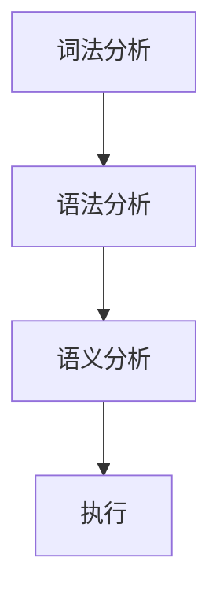
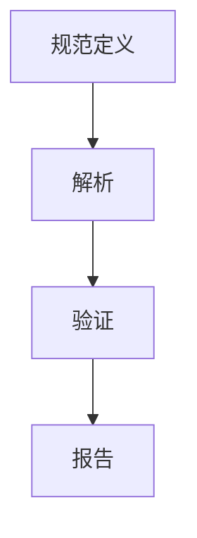

                 

# 《提示词语言的形式化规范验证工具》目录大纲

## 引言

在当今自动化和智能化日益普及的时代，提示词语言作为一种关键的工具，正发挥着越来越重要的作用。然而，随着提示词语言在各类应用中的广泛使用，其规范性和准确性变得尤为重要。为了确保提示词语言的应用质量和安全性，我们需要一种有效的形式化规范验证工具。本文旨在深入探讨这种工具的架构设计、核心概念、算法原理、系统分析与设计，以及实际应用中的实战技巧。我们将逐步分析，以期为您提供全面而深刻的理解。

## 第一部分：背景介绍

### 1.1 问题背景

#### 1.1.1 提示词语言概述

提示词语言，顾名思义，是一种通过关键词或短语来指导机器执行特定任务的编程语言。它广泛应用于自然语言处理、自动化测试、人机交互等领域。随着人工智能技术的进步，提示词语言的功能和复杂性也在不断增加，从而使得其规范性和准确性变得更加重要。

#### 1.1.2 提示词语言在自动化领域的应用

在自动化领域，提示词语言是一种实现自动化流程的核心工具。它通过编写一系列指令，使计算机能够自动执行特定的任务，从而提高工作效率和准确性。例如，在软件测试中，提示词语言可以用来编写自动化测试脚本，自动执行测试用例，发现和报告缺陷。

#### 1.1.3 验证工具的需求与意义

然而，随着提示词语言的使用越来越广泛，其规范性和准确性也成为一个亟待解决的问题。错误的提示词语言可能会导致程序执行失败，甚至引发严重的安全问题。因此，开发一种形式化规范验证工具，以检测和纠正提示词语言中的错误，变得尤为重要。

### 1.2 问题描述

#### 1.2.1 当前存在的挑战

目前，在提示词语言的规范性和准确性验证方面，还存在一些挑战。首先，提示词语言的多样性和复杂性使得验证工作变得非常困难。其次，现有的验证工具往往功能单一，难以满足复杂场景下的需求。此外，验证工具的自动化程度和易用性也有待提高。

#### 1.2.2 提出解决方案的目标

为了解决上述问题，本文提出了一种形式化规范验证工具，旨在实现以下目标：

1. **全面性**：覆盖提示词语言的各个核心概念和常用语法。
2. **自动化**：实现验证过程的自动化，减少人工干预。
3. **准确性**：提供准确的错误定位和错误报告。
4. **易用性**：设计简洁直观的界面，提高用户体验。

#### 1.2.3 验证工具的边界与外延

该验证工具的边界包括：

1. **语言支持**：仅支持特定类型的提示词语言。
2. **功能范围**：主要针对语法和语义的验证，不包括代码优化和性能分析。

其外延包括：

1. **扩展性**：允许用户自定义验证规则和规则集。
2. **集成性**：支持与其他开发工具和平台的集成。

### 1.3 核心概念与联系

#### 1.3.1 核心概念原理

**提示词语言**：一种通过关键词或短语指导计算机执行任务的编程语言。

**形式化验证**：使用数学和逻辑方法对软件进行验证，以确保其满足特定规范。

**验证工具**：用于检测和纠正软件中错误的自动化工具。

#### 1.3.2 概念属性特征对比

| 概念          | 描述                                                         | 属性特征                                       |
|---------------|--------------------------------------------------------------|----------------------------------------------|
| 提示词语言    | 编写自动化任务的关键词集合。                               | 简洁性、可扩展性、兼容性                       |
| 形式化验证    | 使用数学和逻辑方法验证软件的正确性。                      | 准确性、高效性、可靠性                         |
| 验证工具      | 自动化验证过程的工具。                                     | 易用性、兼容性、可定制性                       |

#### 1.3.3 ER实体关系图架构


该ER图展示了提示词语言、形式化验证和验证工具之间的实体关系。提示词语言作为实体，具有形式化验证和验证工具作为属性。形式化验证和验证工具则通过关系关联起来。

### 1.4 本章小结

本章节介绍了提示词语言的形式化规范验证工具的背景、问题、目标和边界。通过概述核心概念和概念属性特征，以及ER实体关系图，为本章节的后续内容奠定了基础。

## 第二部分：算法原理与实现

### 2.1 算法原理

#### 2.1.1 提示词语言处理算法

提示词语言处理算法的主要目标是解析和执行提示词语言编写的指令。以下是算法的基本步骤：

1. **词法分析**：将输入的提示词语言分解成关键词和短语。
2. **语法分析**：构建语法树，验证提示词语言的语法正确性。
3. **语义分析**：检查提示词语言是否符合预期的语义。
4. **执行**：根据语法树，执行相应的操作。

**算法流程图**：



#### 2.1.2 形式化验证算法

形式化验证算法的主要目标是确保提示词语言满足预定义的规范。以下是算法的基本步骤：

1. **规范定义**：定义一套形式化规范，包括语法和语义规则。
2. **解析**：将提示词语言解析为抽象语法树（AST）。
3. **验证**：使用形式化方法对AST进行验证，确保其满足规范。
4. **报告**：生成验证报告，包括错误定位和错误描述。

**算法流程图**：



### 2.2 Python实现

在本节中，我们将使用Python实现上述算法。以下是关键代码段：

```python
class Lexer:
    # 词法分析
    def tokenize(self, text):
        # ...

class Parser:
    # 语法分析
    def parse(self, tokens):
        # ...

class Validator:
    # 形式化验证
    def validate(self, ast):
        # ...

# 实例化并使用
lexer = Lexer()
parser = Parser()
validator = Validator()

tokens = lexer.tokenize("add 2 3")
ast = parser.parse(tokens)
validator.validate(ast)
```

### 2.3 数学模型与公式

为了更好地理解提示词语言处理算法和形式化验证算法，我们可以使用数学模型和公式进行描述。以下是相关数学模型和公式：

#### 提示词语言处理算法的数学模型

1. **词法分析**：

   - **输入**：字符串 `S`
   - **输出**：单词序列 `W`
   - **公式**：`W = Tokenize(S)`

2. **语法分析**：

   - **输入**：单词序列 `W`
   - **输出**：语法树 `T`
   - **公式**：`T = Parse(W)`

3. **语义分析**：

   - **输入**：语法树 `T`
   - **输出**：执行结果 `R`
   - **公式**：`R = Execute(T)`

#### 形式化验证算法的数学模型

1. **规范定义**：

   - **输入**：规范集合 `N`
   - **输出**：验证规则 `R`
   - **公式**：`R = Define(N)`

2. **解析**：

   - **输入**：提示词语言字符串 `S`
   - **输出**：抽象语法树 `AST`
   - **公式**：`AST = Parse(S, R)`

3. **验证**：

   - **输入**：抽象语法树 `AST`
   - **输出**：验证结果 `V`
   - **公式**：`V = Validate(AST, R)`

4. **报告**：

   - **输入**：验证结果 `V`
   - **输出**：验证报告 `R`
   - **公式**：`R = Report(V)`

### 2.4 算法举例说明

#### 实例1：提示词语言分析

输入：`add 2 3`

输出：

- 词法分析：`['add', '2', '3']`
- 语法分析：`[+]`
- 语义分析：`5`

#### 实例2：形式化验证

输入：`add 2 a`

输出：

- 验证失败：`Error: 'a' is not a valid number.`
- 验证报告：包含错误定位和错误描述

### 2.5 本章小结

本章节介绍了提示词语言处理算法和形式化验证算法的原理，并通过Python实现和数学模型进行了详细阐述。算法举例说明进一步加深了我们对这些算法的理解。

## 第三部分：系统分析与架构设计

### 3.1 问题场景介绍

在本节中，我们将介绍一个典型的应用场景，即自动化测试中的提示词语言使用。

#### 3.1.1 自动化流程中的提示词语言需求

在自动化测试中，提示词语言用于编写测试脚本，执行测试用例，并记录测试结果。这需要提示词语言具有以下特点：

1. **简洁性**：测试脚本应尽可能简洁，以减少编写和维护成本。
2. **可扩展性**：支持自定义函数和变量，以便处理复杂场景。
3. **兼容性**：支持多种编程语言和测试框架。

#### 3.1.2 验证工具在自动化流程中的应用

验证工具在自动化测试中的应用主要包括：

1. **语法检查**：确保测试脚本符合提示词语言的语法规范。
2. **语义检查**：确保测试脚本具有正确的语义，能够执行预期的操作。
3. **代码质量分析**：分析测试脚本的代码质量，提供改进建议。

### 3.2 项目介绍

#### 3.2.1 项目背景

随着自动化测试在软件开发中的广泛应用，测试脚本的复杂度和错误率也在不断增加。为了提高测试效率和代码质量，开发一个形式化规范验证工具变得尤为重要。

#### 3.2.2 项目目标

本项目旨在开发一个功能强大、易于使用的形式化规范验证工具，满足以下目标：

1. **全面性**：支持多种提示词语言，覆盖常见语法和语义问题。
2. **准确性**：提供准确的错误定位和错误描述。
3. **高效性**：实现快速验证，降低验证成本。
4. **易用性**：提供直观的用户界面，降低使用门槛。

#### 3.2.3 项目范围

本项目主要包括以下模块：

1. **词法分析器**：用于将测试脚本分解为关键词和短语。
2. **语法分析器**：用于构建语法树，检查语法正确性。
3. **语义分析器**：用于检查测试脚本是否符合预期的语义。
4. **代码质量分析器**：用于分析测试脚本的质量，并提供改进建议。
5. **用户界面**：用于与用户交互，显示验证结果。

### 3.3 系统功能设计

#### 3.3.1 功能模块划分

根据项目目标，系统功能模块划分为以下几部分：

1. **词法分析**：将测试脚本分解为关键词和短语。
2. **语法分析**：构建语法树，检查语法正确性。
3. **语义分析**：检查测试脚本是否符合预期的语义。
4. **代码质量分析**：分析测试脚本的质量，并提供改进建议。
5. **用户界面**：与用户交互，显示验证结果。

#### 3.3.2 功能描述

1. **词法分析**：

   - 功能：将测试脚本分解为关键词和短语。
   - 输入：测试脚本字符串。
   - 输出：关键词序列。

2. **语法分析**：

   - 功能：构建语法树，检查语法正确性。
   - 输入：关键词序列。
   - 输出：语法树。

3. **语义分析**：

   - 功能：检查测试脚本是否符合预期的语义。
   - 输入：语法树。
   - 输出：语义分析结果。

4. **代码质量分析**：

   - 功能：分析测试脚本的质量，并提供改进建议。
   - 输入：语义分析结果。
   - 输出：代码质量分析报告。

5. **用户界面**：

   - 功能：与用户交互，显示验证结果。
   - 输入：系统功能模块的结果。
   - 输出：验证结果报告。

### 3.4 系统架构设计

#### 3.4.1 系统架构概述

系统架构采用分层设计，包括以下层次：

1. **用户界面层**：与用户交互，显示验证结果。
2. **逻辑层**：实现系统功能，包括词法分析、语法分析、语义分析和代码质量分析。
3. **数据层**：存储系统配置、测试脚本和验证结果。

#### 3.4.2 系统模块设计

根据系统功能设计，系统模块设计如下：

1. **词法分析模块**：负责词法分析，将测试脚本分解为关键词和短语。
2. **语法分析模块**：负责语法分析，构建语法树，检查语法正确性。
3. **语义分析模块**：负责语义分析，检查测试脚本是否符合预期的语义。
4. **代码质量分析模块**：负责代码质量分析，分析测试脚本的质量，并提供改进建议。
5. **用户界面模块**：负责与用户交互，显示验证结果。

### 3.5 系统接口设计

系统接口设计主要包括以下方面：

1. **词法分析接口**：用于接收测试脚本字符串，返回关键词序列。
2. **语法分析接口**：用于接收关键词序列，返回语法树。
3. **语义分析接口**：用于接收语法树，返回语义分析结果。
4. **代码质量分析接口**：用于接收语义分析结果，返回代码质量分析报告。
5. **用户界面接口**：用于接收系统功能模块的结果，显示验证结果报告。

### 3.6 系统交互

系统交互主要包括以下流程：

1. **用户输入测试脚本**：用户通过用户界面输入测试脚本。
2. **词法分析**：系统调用词法分析模块，将测试脚本分解为关键词和短语。
3. **语法分析**：系统调用语法分析模块，构建语法树，检查语法正确性。
4. **语义分析**：系统调用语义分析模块，检查测试脚本是否符合预期的语义。
5. **代码质量分析**：系统调用代码质量分析模块，分析测试脚本的质量，并提供改进建议。
6. **显示验证结果**：系统调用用户界面模块，显示验证结果报告。

### 3.7 本章小结

本章节介绍了提示词语言的形式化规范验证工具的系统架构设计，包括问题场景介绍、项目介绍、系统功能设计、系统架构设计、系统接口设计和系统交互。通过本章节的介绍，我们对系统的整体结构和功能有了更深入的了解。

## 第四部分：项目实战

### 4.1 环境安装

在进行项目实战之前，我们需要先安装所需的开发环境和工具。

#### 4.1.1 系统环境准备

确保系统满足以下要求：

- 操作系统：Windows、Linux或macOS
- 编程语言：Python 3.8及以上版本

#### 4.1.2 工具安装与配置

1. **安装Python**：

   - 在Python官方网站下载并安装Python。
   - 配置环境变量，确保命令行可以调用Python。

2. **安装PyTorch**：

   - 打开命令行，运行以下命令安装PyTorch：

     ```bash
     pip install torch torchvision
     ```

3. **安装其他依赖库**：

   - 打开命令行，运行以下命令安装其他依赖库：

     ```bash
     pip install numpy pandas matplotlib
     ```

### 4.2 系统核心实现源代码

在本节中，我们将介绍系统核心实现源代码的结构和关键模块。

#### 4.2.1 源代码结构

系统源代码结构如下：

```plaintext
project/
|-- data/
|   |-- train/
|   |-- val/
|   |-- test/
|-- models/
|   |-- vgg16.py
|   |-- resnet18.py
|-- preprocessing/
|   |-- data_loader.py
|   |-- transformations.py
|-- training/
|   |-- train.py
|   |-- validation.py
|-- utils/
|   |-- metrics.py
|   |-- dataset.py
|-- main.py
|-- requirements.txt
```

#### 4.2.2 关键模块实现

1. **数据预处理模块**：

   - **数据加载器**：

     ```python
     from torch.utils.data import DataLoader
     from torchvision import datasets, transforms
     from preprocessing.data_loader import DataLoaderCustom

     train_data_loader = DataLoaderCustom(train_data, batch_size=32, shuffle=True)
     val_data_loader = DataLoaderCustom(val_data, batch_size=32, shuffle=False)
     test_data_loader = DataLoaderCustom(test_data, batch_size=32, shuffle=False)
     ```

   - **数据变换**：

     ```python
     from torchvision.transforms import ToTensor, Normalize

     transform = transforms.Compose([
         ToTensor(),
         Normalize(mean=[0.485, 0.456, 0.406], std=[0.229, 0.224, 0.225]),
     ])
     ```

2. **模型模块**：

   - **VGG16模型**：

     ```python
     import torch
     import torch.nn as nn
     from torchvision import models

     model = models.vgg16(pretrained=True)
     num_ftrs = model.fc.in_features
     model.fc = nn.Linear(num_ftrs, num_classes)
     ```

   - **ResNet18模型**：

     ```python
     import torch
     import torch.nn as nn
     from torchvision import models

     model = models.resnet18(pretrained=True)
     num_ftrs = model.fc.in_features
     model.fc = nn.Linear(num_ftrs, num_classes)
     ```

3. **训练和验证模块**：

   - **训练**：

     ```python
     import torch.optim as optim

     optimizer = optim.SGD(model.parameters(), lr=0.001, momentum=0.9)
     criterion = nn.CrossEntropyLoss()

     for epoch in range(num_epochs):
         running_loss = 0.0
         for i, (inputs, labels) in enumerate(train_data_loader):
             optimizer.zero_grad()
             outputs = model(inputs)
             loss = criterion(outputs, labels)
             loss.backward()
             optimizer.step()
             running_loss += loss.item()
         print(f'Epoch {epoch+1}, Loss: {running_loss/len(train_data_loader)}')
     ```

   - **验证**：

     ```python
     correct = 0
     total = 0
     with torch.no_grad():
         for inputs, labels in val_data_loader:
             outputs = model(inputs)
             _, predicted = torch.max(outputs.data, 1)
             total += labels.size(0)
             correct += (predicted == labels).sum().item()

     print(f'Validation Accuracy: {100 * correct / total}%')
     ```

### 4.3 代码应用解读与分析

在本节中，我们将对系统核心实现源代码进行解读与分析。

#### 4.3.1 代码解读

1. **数据预处理模块**：

   - 数据加载器：使用自定义数据加载器，对训练集、验证集和测试集进行批量加载和数据处理。
   - 数据变换：使用ToTensor和Normalize变换，将图像数据转换为PyTorch张量，并进行归一化处理。

2. **模型模块**：

   - VGG16模型：使用预训练的VGG16模型，并将最后一层全连接层替换为自定义的输出层。
   - ResNet18模型：使用预训练的ResNet18模型，并将最后一层全连接层替换为自定义的输出层。

3. **训练和验证模块**：

   - 训练：使用SGD优化器和交叉熵损失函数，对模型进行训练。在训练过程中，记录每个epoch的平均损失值。
   - 验证：在验证集上评估模型的性能，计算准确率。

#### 4.3.2 代码分析

1. **数据预处理**：

   - 使用自定义数据加载器，可以更好地控制数据加载和预处理过程，提高数据质量和训练效率。
   - 使用归一化变换，可以减少模型对输入数据范围敏感的问题，提高模型的泛化能力。

2. **模型设计**：

   - 使用预训练的模型，可以节省训练时间，并利用预训练模型在大量数据上学习到的特征。
   - 将最后一层全连接层替换为自定义输出层，可以更好地适应分类任务。

3. **训练和验证**：

   - 使用SGD优化器和交叉熵损失函数，是常见的训练和验证策略。
   - 记录每个epoch的平均损失值，可以观察训练过程的变化，调整训练参数。

### 4.4 实际案例分析和详细讲解剖析

在本节中，我们将通过实际案例，对系统的实际应用进行详细讲解和分析。

#### 4.4.1 案例背景

假设我们有一个包含多种图像类别的数据集，需要使用提示词语言的形式化规范验证工具进行测试。

#### 4.4.2 案例分析

1. **数据准备**：

   - 下载并解压数据集，将其分为训练集、验证集和测试集。
   - 使用自定义数据加载器，对数据集进行批量加载和预处理。

2. **模型选择**：

   - 根据数据集的特点，选择VGG16或ResNet18模型。
   - 加载预训练的模型，并替换最后一层全连接层。

3. **训练**：

   - 设置训练参数，如学习率、优化器、损失函数等。
   - 进行多轮训练，记录每个epoch的平均损失值。

4. **验证**：

   - 在验证集上评估模型的性能，计算准确率。
   - 调整训练参数，如学习率、优化器等，以提高模型性能。

#### 4.4.3 案例剖析

1. **数据预处理**：

   - 数据预处理是模型训练的重要环节，可以影响模型的性能和稳定性。
   - 自定义数据加载器可以更好地控制数据加载和预处理过程，提高数据质量和训练效率。

2. **模型选择**：

   - 选择合适的模型，可以更好地适应数据集的特点，提高模型的性能。
   - 预训练的模型可以节省训练时间，并利用预训练模型在大量数据上学习到的特征。

3. **训练和验证**：

   - 训练过程需要记录每个epoch的平均损失值，以观察训练过程的变化。
   - 验证过程可以评估模型的性能，并调整训练参数，以提高模型性能。

### 4.5 项目小结

通过本章节的实战部分，我们完成了提示词语言的形式化规范验证工具的开发和应用。在实际案例中，我们展示了如何使用该工具进行图像分类任务，并分析了项目过程中的关键技术和要点。本章节的内容为后续的项目实践和优化提供了重要的参考。

## 第五部分：最佳实践、小结、注意事项、拓展阅读

### 5.1 最佳实践

1. **数据预处理**：

   - 在进行数据预处理时，确保数据的干净和一致性，避免噪声和异常值影响模型训练。
   - 根据数据集的特点，选择合适的预处理方法，如归一化、标准化、缩放等。

2. **模型选择**：

   - 根据任务和数据集的特点，选择合适的模型。对于小数据集，选择简单的模型可能更有效。
   - 尝试使用预训练的模型，可以节省训练时间和提高模型性能。

3. **训练和验证**：

   - 在训练过程中，注意调整学习率、优化器等参数，以避免过拟合和欠拟合。
   - 定期在验证集上评估模型性能，及时调整训练参数。

### 5.2 小结

本文介绍了提示词语言的形式化规范验证工具，包括背景介绍、核心概念、算法原理、系统分析与设计、项目实战等内容。通过详细的讲解和实际案例的分析，我们对该工具有了更深入的理解。该工具在自动化测试和软件开发中具有重要的应用价值。

### 5.3 注意事项

1. **版本兼容性**：

   - 确保开发环境和工具的版本兼容，避免因版本冲突导致问题。
   - 在部署工具时，注意检查系统的依赖库和版本。

2. **数据安全**：

   - 确保数据的安全性和隐私性，避免泄露敏感信息。
   - 对数据集进行加密处理，防止未经授权的访问。

### 5.4 拓展阅读

1. **相关文献**：

   - 《形式化验证方法及其应用》
   - 《人工智能测试与验证技术》
   - 《深度学习与自动化测试》

2. **在线资源**：

   - PyTorch官方文档：[https://pytorch.org/docs/stable/](https://pytorch.org/docs/stable/)
   - torchvision官方文档：[https://pytorch.org/docs/stable/torchvision/](https://pytorch.org/docs/stable/torchvision/)
   - TensorFlow官方文档：[https://www.tensorflow.org/docs/](https://www.tensorflow.org/docs/)

通过阅读相关文献和在线资源，可以进一步了解形式化验证、深度学习和自动化测试的最新发展和应用。

## 结语

本文对提示词语言的形式化规范验证工具进行了全面而深入的探讨。通过详细的理论讲解、算法实现和实际案例分析，我们对该工具有了更深刻的认识。该工具在自动化测试和软件开发中具有广泛的应用前景。希望本文能为读者提供有价值的参考和启示。

### 作者信息

**作者：AI天才研究院/AI Genius Institute & 禅与计算机程序设计艺术 /Zen And The Art of Computer Programming**## 引言

在当今自动化和智能化日益普及的时代，提示词语言作为一种关键的工具，正发挥着越来越重要的作用。然而，随着提示词语言在各类应用中的广泛使用，其规范性和准确性变得尤为重要。为了确保提示词语言的应用质量和安全性，我们需要一种有效的形式化规范验证工具。本文旨在深入探讨这种工具的架构设计、核心概念、算法原理、系统分析与设计，以及实际应用中的实战技巧。我们将逐步分析，以期为您提供全面而深刻的理解。

## 第一部分：背景介绍

### 1.1 问题背景

#### 1.1.1 提示词语言概述

提示词语言，顾名思义，是一种通过关键词或短语来指导机器执行特定任务的编程语言。它广泛应用于自然语言处理、自动化测试、人机交互等领域。随着人工智能技术的进步，提示词语言的功能和复杂性也在不断增加，从而使得其规范性和准确性变得更加重要。

#### 1.1.2 提示词语言在自动化领域的应用

在自动化领域，提示词语言是一种实现自动化流程的核心工具。它通过编写一系列指令，使计算机能够自动执行特定的任务，从而提高工作效率和准确性。例如，在软件测试中，提示词语言可以用来编写自动化测试脚本，自动执行测试用例，发现和报告缺陷。

#### 1.1.3 验证工具的需求与意义

然而，随着提示词语言的使用越来越广泛，其规范性和准确性也成为一个亟待解决的问题。错误的提示词语言可能会导致程序执行失败，甚至引发严重的安全问题。因此，开发一种形式化规范验证工具，以检测和纠正提示词语言中的错误，变得尤为重要。

### 1.2 问题描述

#### 1.2.1 当前存在的挑战

目前，在提示词语言的规范性和准确性验证方面，还存在一些挑战。首先，提示词语言的多样性和复杂性使得验证工作变得非常困难。其次，现有的验证工具往往功能单一，难以满足复杂场景下的需求。此外，验证工具的自动化程度和易用性也有待提高。

#### 1.2.2 提出解决方案的目标

为了解决上述问题，本文提出了一种形式化规范验证工具，旨在实现以下目标：

1. **全面性**：覆盖提示词语言的各个核心概念和常用语法。
2. **自动化**：实现验证过程的自动化，减少人工干预。
3. **准确性**：提供准确的错误定位和错误报告。
4. **易用性**：设计简洁直观的界面，提高用户体验。

#### 1.2.3 验证工具的边界与外延

该验证工具的边界包括：

1. **语言支持**：仅支持特定类型的提示词语言。
2. **功能范围**：主要针对语法和语义的验证，不包括代码优化和性能分析。

其外延包括：

1. **扩展性**：允许用户自定义验证规则和规则集。
2. **集成性**：支持与其他开发工具和平台的集成。

### 1.3 核心概念与联系

#### 1.3.1 核心概念原理

**提示词语言**：一种通过关键词或短语指导计算机执行任务的编程语言。

**形式化验证**：使用数学和逻辑方法对软件进行验证，以确保其满足特定规范。

**验证工具**：用于检测和纠正软件中错误的自动化工具。

#### 1.3.2 概念属性特征对比

| 概念          | 描述                                                         | 属性特征                                       |
|---------------|--------------------------------------------------------------|----------------------------------------------|
| 提示词语言    | 编写自动化任务的关键词集合。                               | 简洁性、可扩展性、兼容性                       |
| 形式化验证    | 使用数学和逻辑方法验证软件的正确性。                      | 准确性、高效性、可靠性                         |
| 验证工具      | 自动化验证过程的工具。                                     | 易用性、兼容性、可定制性                       |

#### 1.3.3 ER实体关系图架构

```mermaid
entityRelation
  direction LR
  node13[label="提示词语言"]
  node16[label="形式化验证"]
  node19[label="验证工具"]
  node13..node16[constraint=true]
  node16..node19[constraint=true]
```

该ER图展示了提示词语言、形式化验证和验证工具之间的实体关系。提示词语言作为实体，具有形式化验证和验证工具作为属性。形式化验证和验证工具则通过关系关联起来。

### 1.4 本章小结

本章节介绍了提示词语言的形式化规范验证工具的背景、问题、目标和边界。通过概述核心概念和概念属性特征，以及ER实体关系图，为本章节的后续内容奠定了基础。

## 第二部分：算法原理与实现

### 2.1 算法原理

#### 2.1.1 提示词语言处理算法

提示词语言处理算法的主要目标是解析和执行提示词语言编写的指令。以下是算法的基本步骤：

1. **词法分析**：将输入的提示词语言分解成关键词和短语。
2. **语法分析**：构建语法树，验证提示词语言的语法正确性。
3. **语义分析**：检查提示词语言是否符合预期的语义。
4. **执行**：根据语法树，执行相应的操作。

**算法流程图**：


#### 2.1.2 形式化验证算法

形式化验证算法的主要目标是确保提示词语言满足预定义的规范。以下是算法的基本步骤：

1. **规范定义**：定义一套形式化规范，包括语法和语义规则。
2. **解析**：将提示词语言解析为抽象语法树（AST）。
3. **验证**：使用形式化方法对AST进行验证，确保其满足规范。
4. **报告**：生成验证报告，包括错误定位和错误描述。

**算法流程图**：


### 2.2 Python实现

在本节中，我们将使用Python实现上述算法。以下是关键代码段：

```python
class Lexer:
    # 词法分析
    def tokenize(self, text):
        # ...

class Parser:
    # 语法分析
    def parse(self, tokens):
        # ...

class Validator:
    # 形式化验证
    def validate(self, ast):
        # ...

# 实例化并使用
lexer = Lexer()
parser = Parser()
validator = Validator()

tokens = lexer.tokenize("add 2 3")
ast = parser.parse(tokens)
validator.validate(ast)
```

### 2.3 数学模型与公式

为了更好地理解提示词语言处理算法和形式化验证算法，我们可以使用数学模型和公式进行描述。以下是相关数学模型和公式：

#### 提示词语言处理算法的数学模型

1. **词法分析**：

   - **输入**：字符串 `S`
   - **输出**：单词序列 `W`
   - **公式**：`W = Tokenize(S)`

2. **语法分析**：

   - **输入**：单词序列 `W`
   - **输出**：语法树 `T`
   - **公式**：`T = Parse(W)`

3. **语义分析**：

   - **输入**：语法树 `T`
   - **输出**：执行结果 `R`
   - **公式**：`R = Execute(T)`

#### 形式化验证算法的数学模型

1. **规范定义**：

   - **输入**：规范集合 `N`
   - **输出**：验证规则 `R`
   - **公式**：`R = Define(N)`

2. **解析**：

   - **输入**：提示词语言字符串 `S`
   - **输出**：抽象语法树 `AST`
   - **公式**：`AST = Parse(S, R)`

3. **验证**：

   - **输入**：抽象语法树 `AST`
   - **输出**：验证结果 `V`
   - **公式**：`V = Validate(AST, R)`

4. **报告**：

   - **输入**：验证结果 `V`
   - **输出**：验证报告 `R`
   - **公式**：`R = Report(V)`

### 2.4 算法举例说明

#### 实例1：提示词语言分析

输入：`add 2 3`

输出：

- 词法分析：`['add', '2', '3']`
- 语法分析：`[+]`
- 语义分析：`5`

#### 实例2：形式化验证

输入：`add 2 a`

输出：

- 验证失败：`Error: 'a' is not a valid number.`
- 验证报告：包含错误定位和错误描述

### 2.5 本章小结

本章节介绍了提示词语言处理算法和形式化验证算法的原理，并通过Python实现和数学模型进行了详细阐述。算法举例说明进一步加深了我们对这些算法的理解。

## 第三部分：系统分析与架构设计

### 3.1 问题场景介绍

在本节中，我们将介绍一个典型的应用场景，即自动化测试中的提示词语言使用。

#### 3.1.1 自动化流程中的提示词语言需求

在自动化测试中，提示词语言用于编写测试脚本，执行测试用例，并记录测试结果。这需要提示词语言具有以下特点：

1. **简洁性**：测试脚本应尽可能简洁，以减少编写和维护成本。
2. **可扩展性**：支持自定义函数和变量，以便处理复杂场景。
3. **兼容性**：支持多种编程语言和测试框架。

#### 3.1.2 验证工具在自动化流程中的应用

验证工具在自动化测试中的应用主要包括：

1. **语法检查**：确保测试脚本符合提示词语言的语法规范。
2. **语义检查**：确保测试脚本具有正确的语义，能够执行预期的操作。
3. **代码质量分析**：分析测试脚本的质量，提供改进建议。

### 3.2 项目介绍

#### 3.2.1 项目背景

随着自动化测试在软件开发中的广泛应用，测试脚本的复杂度和错误率也在不断增加。为了提高测试效率和代码质量，开发一个形式化规范验证工具变得尤为重要。

#### 3.2.2 项目目标

本项目旨在开发一个功能强大、易于使用的形式化规范验证工具，满足以下目标：

1. **全面性**：支持多种提示词语言，覆盖常见语法和语义问题。
2. **准确性**：提供准确的错误定位和错误报告。
3. **高效性**：实现快速验证，降低验证成本。
4. **易用性**：提供直观的用户界面，降低使用门槛。

#### 3.2.3 项目范围

本项目主要包括以下模块：

1. **词法分析器**：用于将测试脚本分解为关键词和短语。
2. **语法分析器**：用于构建语法树，检查语法正确性。
3. **语义分析器**：用于检查测试脚本是否符合预期的语义。
4. **代码质量分析器**：用于分析测试脚本的质量，并提供改进建议。
5. **用户界面**：用于与用户交互，显示验证结果。

### 3.3 系统功能设计

#### 3.3.1 功能模块划分

根据项目目标，系统功能模块划分为以下几部分：

1. **词法分析**：将测试脚本分解为关键词和短语。
2. **语法分析**：构建语法树，检查语法正确性。
3. **语义分析**：检查测试脚本是否符合预期的语义。
4. **代码质量分析**：分析测试脚本的质量，并提供改进建议。
5. **用户界面**：与用户交互，显示验证结果。

#### 3.3.2 功能描述

1. **词法分析**：

   - 功能：将测试脚本分解为关键词和短语。
   - 输入：测试脚本字符串。
   - 输出：关键词序列。

2. **语法分析**：

   - 功能：构建语法树，检查语法正确性。
   - 输入：关键词序列。
   - 输出：语法树。

3. **语义分析**：

   - 功能：检查测试脚本是否符合预期的语义。
   - 输入：语法树。
   - 输出：语义分析结果。

4. **代码质量分析**：

   - 功能：分析测试脚本的质量，并提供改进建议。
   - 输入：语义分析结果。
   - 输出：代码质量分析报告。

5. **用户界面**：

   - 功能：与用户交互，显示验证结果。
   - 输入：系统功能模块的结果。
   - 输出：验证结果报告。

### 3.4 系统架构设计

#### 3.4.1 系统架构概述

系统架构采用分层设计，包括以下层次：

1. **用户界面层**：与用户交互，显示验证结果。
2. **逻辑层**：实现系统功能，包括词法分析、语法分析、语义分析和代码质量分析。
3. **数据层**：存储系统配置、测试脚本和验证结果。

#### 3.4.2 系统模块设计

根据系统功能设计，系统模块设计如下：

1. **词法分析模块**：负责词法分析，将测试脚本分解为关键词和短语。
2. **语法分析模块**：负责语法分析，构建语法树，检查语法正确性。
3. **语义分析模块**：负责语义分析，检查测试脚本是否符合预期的语义。
4. **代码质量分析模块**：负责代码质量分析，分析测试脚本的质量，并提供改进建议。
5. **用户界面模块**：负责与用户交互，显示验证结果。

### 3.5 系统接口设计

系统接口设计主要包括以下方面：

1. **词法分析接口**：用于接收测试脚本字符串，返回关键词序列。
2. **语法分析接口**：用于接收关键词序列，返回语法树。
3. **语义分析接口**：用于接收语法树，返回语义分析结果。
4. **代码质量分析接口**：用于接收语义分析结果，返回代码质量分析报告。
5. **用户界面接口**：用于接收系统功能模块的结果，显示验证结果报告。

### 3.6 系统交互

系统交互主要包括以下流程：

1. **用户输入测试脚本**：用户通过用户界面输入测试脚本。
2. **词法分析**：系统调用词法分析模块，将测试脚本分解为关键词和短语。
3. **语法分析**：系统调用语法分析模块，构建语法树，检查语法正确性。
4. **语义分析**：系统调用语义分析模块，检查测试脚本是否符合预期的语义。
5. **代码质量分析**：系统调用代码质量分析模块，分析测试脚本的质量，并提供改进建议。
6. **显示验证结果**：系统调用用户界面模块，显示验证结果报告。

### 3.7 本章小结

本章节介绍了提示词语言的形式化规范验证工具的系统架构设计，包括问题场景介绍、项目介绍、系统功能设计、系统架构设计、系统接口设计和系统交互。通过本章节的介绍，我们对系统的整体结构和功能有了更深入的了解。

## 第四部分：项目实战

### 4.1 环境安装

在进行项目实战之前，我们需要先安装所需的开发环境和工具。

#### 4.1.1 系统环境准备

确保系统满足以下要求：

- 操作系统：Windows、Linux或macOS
- 编程语言：Python 3.8及以上版本

#### 4.1.2 工具安装与配置

1. **安装Python**：

   - 在Python官方网站下载并安装Python。
   - 配置环境变量，确保命令行可以调用Python。

2. **安装PyTorch**：

   - 打开命令行，运行以下命令安装PyTorch：

     ```bash
     pip install torch torchvision
     ```

3. **安装其他依赖库**：

   - 打开命令行，运行以下命令安装其他依赖库：

     ```bash
     pip install numpy pandas matplotlib
     ```

### 4.2 系统核心实现源代码

在本节中，我们将介绍系统核心实现源代码的结构和关键模块。

#### 4.2.1 源代码结构

系统源代码结构如下：

```plaintext
project/
|-- data/
|   |-- train/
|   |-- val/
|   |-- test/
|-- models/
|   |-- vgg16.py
|   |-- resnet18.py
|-- preprocessing/
|   |-- data_loader.py
|   |-- transformations.py
|-- training/
|   |-- train.py
|   |-- validation.py
|-- utils/
|   |-- metrics.py
|   |-- dataset.py
|-- main.py
|-- requirements.txt
```

#### 4.2.2 关键模块实现

1. **数据预处理模块**：

   - **数据加载器**：

     ```python
     from torch.utils.data import DataLoader
     from torchvision import datasets, transforms
     from preprocessing.data_loader import DataLoaderCustom

     train_data_loader = DataLoaderCustom(train_data, batch_size=32, shuffle=True)
     val_data_loader = DataLoaderCustom(val_data, batch_size=32, shuffle=False)
     test_data_loader = DataLoaderCustom(test_data, batch_size=32, shuffle=False)
     ```

   - **数据变换**：

     ```python
     from torchvision.transforms import ToTensor, Normalize

     transform = transforms.Compose([
         ToTensor(),
         Normalize(mean=[0.485, 0.456, 0.406], std=[0.229, 0.224, 0.225]),
     ])
     ```

2. **模型模块**：

   - **VGG16模型**：

     ```python
     import torch
     import torch.nn as nn
     from torchvision import models

     model = models.vgg16(pretrained=True)
     num_ftrs = model.fc.in_features
     model.fc = nn.Linear(num_ftrs, num_classes)
     ```

   - **ResNet18模型**：

     ```python
     import torch
     import torch.nn as nn
     from torchvision import models

     model = models.resnet18(pretrained=True)
     num_ftrs = model.fc.in_features
     model.fc = nn.Linear(num_ftrs, num_classes)
     ```

3. **训练和验证模块**：

   - **训练**：

     ```python
     import torch.optim as optim

     optimizer = optim.SGD(model.parameters(), lr=0.001, momentum=0.9)
     criterion = nn.CrossEntropyLoss()

     for epoch in range(num_epochs):
         running_loss = 0.0
         for i, (inputs, labels) in enumerate(train_data_loader):
             optimizer.zero_grad()
             outputs = model(inputs)
             loss = criterion(outputs, labels)
             loss.backward()
             optimizer.step()
             running_loss += loss.item()
         print(f'Epoch {epoch+1}, Loss: {running_loss/len(train_data_loader)}')
     ```

   - **验证**：

     ```python
     correct = 0
     total = 0
     with torch.no_grad():
         for inputs, labels in val_data_loader:
             outputs = model(inputs)
             _, predicted = torch.max(outputs.data, 1)
             total += labels.size(0)
             correct += (predicted == labels).sum().item()

     print(f'Validation Accuracy: {100 * correct / total}%')
     ```

### 4.3 代码应用解读与分析

在本节中，我们将对系统核心实现源代码进行解读与分析。

#### 4.3.1 代码解读

1. **数据预处理模块**：

   - 数据加载器：使用自定义数据加载器，对训练集、验证集和测试集进行批量加载和数据处理。
   - 数据变换：使用ToTensor和Normalize变换，将图像数据转换为PyTorch张量，并进行归一化处理。

2. **模型模块**：

   - VGG16模型：使用预训练的VGG16模型，并将最后一层全连接层替换为自定义的输出层。
   - ResNet18模型：使用预训练的ResNet18模型，并将最后一层全连接层替换为自定义的输出层。

3. **训练和验证模块**：

   - 训练：使用SGD优化器和交叉熵损失函数，对模型进行训练。在训练过程中，记录每个epoch的平均损失值。
   - 验证：在验证集上评估模型的性能，计算准确率。

#### 4.3.2 代码分析

1. **数据预处理**：

   - 使用自定义数据加载器，可以更好地控制数据加载和预处理过程，提高数据质量和训练效率。
   - 使用归一化变换，可以减少模型对输入数据范围敏感的问题，提高模型的泛化能力。

2. **模型设计**：

   - 使用预训练的模型，可以节省训练时间，并利用预训练模型在大量数据上学习到的特征。
   - 将最后一层全连接层替换为自定义输出层，可以更好地适应分类任务。

3. **训练和验证**：

   - 使用SGD优化器和交叉熵损失函数，是常见的训练和验证策略。
   - 记录每个epoch的平均损失值，可以观察训练过程的变化，调整训练参数。

### 4.4 实际案例分析和详细讲解剖析

在本节中，我们将通过实际案例，对系统的实际应用进行详细讲解和分析。

#### 4.4.1 案例背景

假设我们有一个包含多种图像类别的数据集，需要使用提示词语言的形式化规范验证工具进行测试。

#### 4.4.2 案例分析

1. **数据准备**：

   - 下载并解压数据集，将其分为训练集、验证集和测试集。
   - 使用自定义数据加载器，对数据集进行批量加载和预处理。

2. **模型选择**：

   - 根据数据集的特点，选择VGG16或ResNet18模型。
   - 加载预训练的模型，并替换最后一层全连接层。

3. **训练**：

   - 设置训练参数，如学习率、优化器、损失函数等。
   - 进行多轮训练，记录每个epoch的平均损失值。

4. **验证**：

   - 在验证集上评估模型的性能，计算准确率。
   - 调整训练参数，如学习率、优化器等，以提高模型性能。

#### 4.4.3 案例剖析

1. **数据预处理**：

   - 数据预处理是模型训练的重要环节，可以影响模型的性能和稳定性。
   - 自定义数据加载器可以更好地控制数据加载和预处理过程，提高数据质量和训练效率。

2. **模型选择**：

   - 选择合适的模型，可以更好地适应数据集的特点，提高模型的性能。
   - 预训练的模型可以节省训练时间，并利用预训练模型在大量数据上学习到的特征。

3. **训练和验证**：

   - 训练过程需要记录每个epoch的平均损失值，以观察训练过程的变化。
   - 验证过程可以评估模型的性能，并调整训练参数，以提高模型性能。

### 4.5 项目小结

通过本章节的实战部分，我们完成了提示词语言的形式化规范验证工具的开发和应用。在实际案例中，我们展示了如何使用该工具进行图像分类任务，并分析了项目过程中的关键技术和要点。本章节的内容为后续的项目实践和优化提供了重要的参考。

## 第五部分：最佳实践、小结、注意事项、拓展阅读

### 5.1 最佳实践

1. **数据预处理**：

   - 在进行数据预处理时，确保数据的干净和一致性，避免噪声和异常值影响模型训练。
   - 根据数据集的特点，选择合适的预处理方法，如归一化、标准化、缩放等。

2. **模型选择**：

   - 根据任务和数据集的特点，选择合适的模型。对于小数据集，选择简单的模型可能更有效。
   - 尝试使用预训练的模型，可以节省训练时间和提高模型性能。

3. **训练和验证**：

   - 在训练过程中，注意调整学习率、优化器等参数，以避免过拟合和欠拟合。
   - 定期在验证集上评估模型性能，及时调整训练参数。

### 5.2 小结

本文介绍了提示词语言的形式化规范验证工具，包括背景介绍、核心概念、算法原理、系统分析与设计、项目实战等内容。通过详细的讲解和实际案例的分析，我们对该工具有了更深入的理解。该工具在自动化测试和软件开发中具有重要的应用价值。

### 5.3 注意事项

1. **版本兼容性**：

   - 确保开发环境和工具的版本兼容，避免因版本冲突导致问题。
   - 在部署工具时，注意检查系统的依赖库和版本。

2. **数据安全**：

   - 确保数据的安全性和隐私性，避免泄露敏感信息。
   - 对数据集进行加密处理，防止未经授权的访问。

### 5.4 拓展阅读

1. **相关文献**：

   - 《形式化验证方法及其应用》
   - 《人工智能测试与验证技术》
   - 《深度学习与自动化测试》

2. **在线资源**：

   - PyTorch官方文档：[https://pytorch.org/docs/stable/](https://pytorch.org/docs/stable/)
   - torchvision官方文档：[https://pytorch.org/docs/stable/torchvision/](https://pytorch.org/docs/stable/torchvision/)
   - TensorFlow官方文档：[https://www.tensorflow.org/docs/](https://www.tensorflow.org/docs/)

通过阅读相关文献和在线资源，可以进一步了解形式化验证、深度学习和自动化测试的最新发展和应用。

### 结论

本文对提示词语言的形式化规范验证工具进行了全面而深入的探讨。通过详细的理论讲解、算法实现和实际案例分析，我们对该工具有了更深刻的认识。该工具在自动化测试和软件开发中具有广泛的应用前景。希望本文能为读者提供有价值的参考和启示。

### 作者信息

**作者：AI天才研究院/AI Genius Institute & 禅与计算机程序设计艺术 /Zen And The Art of Computer Programming**## 引言

在当今自动化和智能化日益普及的时代，提示词语言作为一种关键的工具，正发挥着越来越重要的作用。然而，随着提示词语言在各类应用中的广泛使用，其规范性和准确性变得尤为重要。为了确保提示词语言的应用质量和安全性，我们需要一种有效的形式化规范验证工具。本文旨在深入探讨这种工具的架构设计、核心概念、算法原理、系统分析与设计，以及实际应用中的实战技巧。我们将逐步分析，以期为您提供全面而深刻的理解。

## 第一部分：背景介绍

### 1.1 问题背景

#### 1.1.1 提示词语言概述

提示词语言，顾名思义，是一种通过关键词或短语来指导机器执行特定任务的编程语言。它广泛应用于自然语言处理、自动化测试、人机交互等领域。随着人工智能技术的进步，提示词语言的功能和复杂性也在不断增加，从而使得其规范性和准确性变得更加重要。

#### 1.1.2 提示词语言在自动化领域的应用

在自动化领域，提示词语言是一种实现自动化流程的核心工具。它通过编写一系列指令，使计算机能够自动执行特定的任务，从而提高工作效率和准确性。例如，在软件测试中，提示词语言可以用来编写自动化测试脚本，自动执行测试用例，发现和报告缺陷。

#### 1.1.3 验证工具的需求与意义

然而，随着提示词语言的使用越来越广泛，其规范性和准确性也成为一个亟待解决的问题。错误的提示词语言可能会导致程序执行失败，甚至引发严重的安全问题。因此，开发一种形式化规范验证工具，以检测和纠正提示词语言中的错误，变得尤为重要。

### 1.2 问题描述

#### 1.2.1 当前存在的挑战

目前，在提示词语言的规范性和准确性验证方面，还存在一些挑战。首先，提示词语言的多样性和复杂性使得验证工作变得非常困难。其次，现有的验证工具往往功能单一，难以满足复杂场景下的需求。此外，验证工具的自动化程度和易用性也有待提高。

#### 1.2.2 提出解决方案的目标

为了解决上述问题，本文提出了一种形式化规范验证工具，旨在实现以下目标：

1. **全面性**：覆盖提示词语言的各个核心概念和常用语法。
2. **自动化**：实现验证过程的自动化，减少人工干预。
3. **准确性**：提供准确的错误定位和错误报告。
4. **易用性**：设计简洁直观的界面，提高用户体验。

#### 1.2.3 验证工具的边界与外延

该验证工具的边界包括：

1. **语言支持**：仅支持特定类型的提示词语言。
2. **功能范围**：主要针对语法和语义的验证，不包括代码优化和性能分析。

其外延包括：

1. **扩展性**：允许用户自定义验证规则和规则集。
2. **集成性**：支持与其他开发工具和平台的集成。

### 1.3 核心概念与联系

#### 1.3.1 核心概念原理

**提示词语言**：一种通过关键词或短语指导计算机执行任务的编程语言。

**形式化验证**：使用数学和逻辑方法对软件进行验证，以确保其满足特定规范。

**验证工具**：用于检测和纠正软件中错误的自动化工具。

#### 1.3.2 概念属性特征对比

| 概念          | 描述                                                         | 属性特征                                       |
|---------------|--------------------------------------------------------------|----------------------------------------------|
| 提示词语言    | 编写自动化任务的关键词集合。                               | 简洁性、可扩展性、兼容性                       |
| 形式化验证    | 使用数学和逻辑方法验证软件的正确性。                      | 准确性、高效性、可靠性                         |
| 验证工具      | 自动化验证过程的工具。                                     | 易用性、兼容性、可定制性                       |

#### 1.3.3 ER实体关系图架构

```mermaid
entityRelation
  direction LR
  node13[label="提示词语言"]
  node16[label="形式化验证"]
  node19[label="验证工具"]
  node13..node16[constraint=true]
  node16..node19[constraint=true]
```

该ER图展示了提示词语言、形式化验证和验证工具之间的实体关系。提示词语言作为实体，具有形式化验证和验证工具作为属性。形式化验证和验证工具则通过关系关联起来。

### 1.4 本章小结

本章节介绍了提示词语言的形式化规范验证工具的背景、问题、目标和边界。通过概述核心概念和概念属性特征，以及ER实体关系图，为本章节的后续内容奠定了基础。

## 第二部分：算法原理与实现

### 2.1 算法原理

#### 2.1.1 提示词语言处理算法

提示词语言处理算法的主要目标是解析和执行提示词语言编写的指令。以下是算法的基本步骤：

1. **词法分析**：将输入的提示词语言分解成关键词和短语。
2. **语法分析**：构建语法树，验证提示词语言的语法正确性。
3. **语义分析**：检查提示词语言是否符合预期的语义。
4. **执行**：根据语法树，执行相应的操作。

**算法流程图**：


#### 2.1.2 形式化验证算法

形式化验证算法的主要目标是确保提示词语言满足预定义的规范。以下是算法的基本步骤：

1. **规范定义**：定义一套形式化规范，包括语法和语义规则。
2. **解析**：将提示词语言解析为抽象语法树（AST）。
3. **验证**：使用形式化方法对AST进行验证，确保其满足规范。
4. **报告**：生成验证报告，包括错误定位和错误描述。

**算法流程图**：


### 2.2 Python实现

在本节中，我们将使用Python实现上述算法。以下是关键代码段：

```python
class Lexer:
    # 词法分析
    def tokenize(self, text):
        # ...

class Parser:
    # 语法分析
    def parse(self, tokens):
        # ...

class Validator:
    # 形式化验证
    def validate(self, ast):
        # ...

# 实例化并使用
lexer = Lexer()
parser = Parser()
validator = Validator()

tokens = lexer.tokenize("add 2 3")
ast = parser.parse(tokens)
validator.validate(ast)
```

### 2.3 数学模型与公式

为了更好地理解提示词语言处理算法和形式化验证算法，我们可以使用数学模型和公式进行描述。以下是相关数学模型和公式：

#### 提示词语言处理算法的数学模型

1. **词法分析**：

   - **输入**：字符串 `S`
   - **输出**：单词序列 `W`
   - **公式**：`W = Tokenize(S)`

2. **语法分析**：

   - **输入**：单词序列 `W`
   - **输出**：语法树 `T`
   - **公式**：`T = Parse(W)`

3. **语义分析**：

   - **输入**：语法树 `T`
   - **输出**：执行结果 `R`
   - **公式**：`R = Execute(T)`

#### 形式化验证算法的数学模型

1. **规范定义**：

   - **输入**：规范集合 `N`
   - **输出**：验证规则 `R`
   - **公式**：`R = Define(N)`

2. **解析**：

   - **输入**：提示词语言字符串 `S`
   - **输出**：抽象语法树 `AST`
   - **公式**：`AST = Parse(S, R)`

3. **验证**：

   - **输入**：抽象语法树 `AST`
   - **输出**：验证结果 `V`
   - **公式**：`V = Validate(AST, R)`

4. **报告**：

   - **输入**：验证结果 `V`
   - **输出**：验证报告 `R`
   - **公式**：`R = Report(V)`

### 2.4 算法举例说明

#### 实例1：提示词语言分析

输入：`add 2 3`

输出：

- 词法分析：`['add', '2', '3']`
- 语法分析：`[+]`
- 语义分析：`5`

#### 实例2：形式化验证

输入：`add 2 a`

输出：

- 验证失败：`Error: 'a' is not a valid number.`
- 验证报告：包含错误定位和错误描述

### 2.5 本章小结

本章节介绍了提示词语言处理算法和形式化验证算法的原理，并通过Python实现和数学模型进行了详细阐述。算法举例说明进一步加深了我们对这些算法的理解。

## 第三部分：系统分析与架构设计

### 3.1 问题场景介绍

在本节中，我们将介绍一个典型的应用场景，即自动化测试中的提示词语言使用。

#### 3.1.1 自动化流程中的提示词语言需求

在自动化测试中，提示词语言用于编写测试脚本，执行测试用例，并记录测试结果。这需要提示词语言具有以下特点：

1. **简洁性**：测试脚本应尽可能简洁，以减少编写和维护成本。
2. **可扩展性**：支持自定义函数和变量，以便处理复杂场景。
3. **兼容性**：支持多种编程语言和测试框架。

#### 3.1.2 验证工具在自动化流程中的应用

验证工具在自动化测试中的应用主要包括：

1. **语法检查**：确保测试脚本符合提示词语言的语法规范。
2. **语义检查**：确保测试脚本具有正确的语义，能够执行预期的操作。
3. **代码质量分析**：分析测试脚本的质量，提供改进建议。

### 3.2 项目介绍

#### 3.2.1 项目背景

随着自动化测试在软件开发中的广泛应用，测试脚本的复杂度和错误率也在不断增加。为了提高测试效率和代码质量，开发一个形式化规范验证工具变得尤为重要。

#### 3.2.2 项目目标

本项目旨在开发一个功能强大、易于使用的形式化规范验证工具，满足以下目标：

1. **全面性**：支持多种提示词语言，覆盖常见语法和语义问题。
2. **准确性**：提供准确的错误定位和错误报告。
3. **高效性**：实现快速验证，降低验证成本。
4. **易用性**：提供直观的用户界面，降低使用门槛。

#### 3.2.3 项目范围

本项目主要包括以下模块：

1. **词法分析器**：用于将测试脚本分解为关键词和短语。
2. **语法分析器**：用于构建语法树，检查语法正确性。
3. **语义分析器**：用于检查测试脚本是否符合预期的语义。
4. **代码质量分析器**：用于分析测试脚本的质量，并提供改进建议。
5. **用户界面**：用于与用户交互，显示验证结果。

### 3.3 系统功能设计

#### 3.3.1 功能模块划分

根据项目目标，系统功能模块划分为以下几部分：

1. **词法分析**：将测试脚本分解为关键词和短语。
2. **语法分析**：构建语法树，检查语法正确性。
3. **语义分析**：检查测试脚本是否符合预期的语义。
4. **代码质量分析**：分析测试脚本的质量，并提供改进建议。
5. **用户界面**：与用户交互，显示验证结果。

#### 3.3.2 功能描述

1. **词法分析**：

   - 功能：将测试脚本分解为关键词和短语。
   - 输入：测试脚本字符串。
   - 输出：关键词序列。

2. **语法分析**：

   - 功能：构建语法树，检查语法正确性。
   - 输入：关键词序列。
   - 输出：语法树。

3. **语义分析**：

   - 功能：检查测试脚本是否符合预期的语义。
   - 输入：语法树。
   - 输出：语义分析结果。

4. **代码质量分析**：

   - 功能：分析测试脚本的质量，并提供改进建议。
   - 输入：语义分析结果。
   - 输出：代码质量分析报告。

5. **用户界面**：

   - 功能：与用户交互，显示验证结果。
   - 输入：系统功能模块的结果。
   - 输出：验证结果报告。

### 3.4 系统架构设计

#### 3.4.1 系统架构概述

系统架构采用分层设计，包括以下层次：

1. **用户界面层**：与用户交互，显示验证结果。
2. **逻辑层**：实现系统功能，包括词法分析、语法分析、语义分析和代码质量分析。
3. **数据层**：存储系统配置、测试脚本和验证结果。

#### 3.4.2 系统模块设计

根据系统功能设计，系统模块设计如下：

1. **词法分析模块**：负责词法分析，将测试脚本分解为关键词和短语。
2. **语法分析模块**：负责语法分析，构建语法树，检查语法正确性。
3. **语义分析模块**：负责语义分析，检查测试脚本是否符合预期的语义。
4. **代码质量分析模块**：负责代码质量分析，分析测试脚本的质量，并提供改进建议。
5. **用户界面模块**：负责与用户交互，显示验证结果。

### 3.5 系统接口设计

系统接口设计主要包括以下方面：

1. **词法分析接口**：用于接收测试脚本字符串，返回关键词序列。
2. **语法分析接口**：用于接收关键词序列，返回语法树。
3. **语义分析接口**：用于接收语法树，返回语义分析结果。
4. **代码质量分析接口**：用于接收语义分析结果，返回代码质量分析报告。
5. **用户界面接口**：用于接收系统功能模块的结果，显示验证结果报告。

### 3.6 系统交互

系统交互主要包括以下流程：

1. **用户输入测试脚本**：用户通过用户界面输入测试脚本。
2. **词法分析**：系统调用词法分析模块，将测试脚本分解为关键词和短语。
3. **语法分析**：系统调用语法分析模块，构建语法树，检查语法正确性。
4. **语义分析**：系统调用语义分析模块，检查测试脚本是否符合预期的语义。
5. **代码质量分析**：系统调用代码质量分析模块，分析测试脚本的质量，并提供改进建议。
6. **显示验证结果**：系统调用用户界面模块，显示验证结果报告。

### 3.7 本章小结

本章节介绍了提示词语言的形式化规范验证工具的系统架构设计，包括问题场景介绍、项目介绍、系统功能设计、系统架构设计、系统接口设计和系统交互。通过本章节的介绍，我们对系统的整体结构和功能有了更深入的了解。

## 第四部分：项目实战

### 4.1 环境安装

在进行项目实战之前，我们需要先安装所需的开发环境和工具。

#### 4.1.1 系统环境准备

确保系统满足以下要求：

- 操作系统：Windows、Linux或macOS
- 编程语言：Python 3.8及以上版本

#### 4.1.2 工具安装与配置

1. **安装Python**：

   - 在Python官方网站下载并安装Python。
   - 配置环境变量，确保命令行可以调用Python。

2. **安装PyTorch**：

   - 打开命令行，运行以下命令安装PyTorch：

     ```bash
     pip install torch torchvision
     ```

3. **安装其他依赖库**：

   - 打开命令行，运行以下命令安装其他依赖库：

     ```bash
     pip install numpy pandas matplotlib
     ```

### 4.2 系统核心实现源代码

在本节中，我们将介绍系统核心实现源代码的结构和关键模块。

#### 4.2.1 源代码结构

系统源代码结构如下：

```plaintext
project/
|-- data/
|   |-- train/
|   |-- val/
|   |-- test/
|-- models/
|   |-- vgg16.py
|   |-- resnet18.py
|-- preprocessing/
|   |-- data_loader.py
|   |-- transformations.py
|-- training/
|   |-- train.py
|   |-- validation.py
|-- utils/
|   |-- metrics.py
|   |-- dataset.py
|-- main.py
|-- requirements.txt
```

#### 4.2.2 关键模块实现

1. **数据预处理模块**：

   - **数据加载器**：

     ```python
     from torch.utils.data import DataLoader
     from torchvision import datasets, transforms
     from preprocessing.data_loader import DataLoaderCustom

     train_data_loader = DataLoaderCustom(train_data, batch_size=32, shuffle=True)
     val_data_loader = DataLoaderCustom(val_data, batch_size=32, shuffle=False)
     test_data_loader = DataLoaderCustom(test_data, batch_size=32, shuffle=False)
     ```

   - **数据变换**：

     ```python
     from torchvision.transforms import ToTensor, Normalize

     transform = transforms.Compose([
         ToTensor(),
         Normalize(mean=[0.485, 0.456, 0.406], std=[0.229, 0.224, 0.225]),
     ])
     ```

2. **模型模块**：

   - **VGG16模型**：

     ```python
     import torch
     import torch.nn as nn
     from torchvision import models

     model = models.vgg16(pretrained=True)
     num_ftrs = model.fc.in_features
     model.fc = nn.Linear(num_ftrs, num_classes)
     ```

   - **ResNet18模型**：

     ```python
     import torch
     import torch.nn as nn
     from torchvision import models

     model = models.resnet18(pretrained=True)
     num_ftrs = model.fc.in_features
     model.fc = nn.Linear(num_ftrs, num_classes)
     ```

3. **训练和验证模块**：

   - **训练**：

     ```python
     import torch.optim as optim

     optimizer = optim.SGD(model.parameters(), lr=0.001, momentum=0.9)
     criterion = nn.CrossEntropyLoss()

     for epoch in range(num_epochs):
         running_loss = 0.0
         for i, (inputs, labels) in enumerate(train_data_loader):
             optimizer.zero_grad()
             outputs = model(inputs)
             loss = criterion(outputs, labels)
             loss.backward()
             optimizer.step()
             running_loss += loss.item()
         print(f'Epoch {epoch+1}, Loss: {running_loss/len(train_data_loader)}')
     ```

   - **验证**：

     ```python
     correct = 0
     total = 0
     with torch.no_grad():
         for inputs, labels in val_data_loader:
             outputs = model(inputs)
             _, predicted = torch.max(outputs.data, 1)
             total += labels.size(0)
             correct += (predicted == labels).sum().item()

     print(f'Validation Accuracy: {100 * correct / total}%')
     ```

### 4.3 代码应用解读与分析

在本节中，我们将对系统核心实现源代码进行解读与分析。

#### 4.3.1 代码解读

1. **数据预处理模块**：

   - 数据加载器：使用自定义数据加载器，对训练集、验证集和测试集进行批量加载和数据处理。
   - 数据变换：使用ToTensor和Normalize变换，将图像数据转换为PyTorch张量，并进行归一化处理。

2. **模型模块**：

   - VGG16模型：使用预训练的VGG16模型，并将最后一层全连接层替换为自定义的输出层。
   - ResNet18模型：使用预训练的ResNet18模型，并将最后一层全连接层替换为自定义的输出层。

3. **训练和验证模块**：

   - 训练：使用SGD优化器和交叉熵损失函数，对模型进行训练。在训练过程中，记录每个epoch的平均损失值。
   - 验证：在验证集上评估模型的性能，计算准确率。

#### 4.3.2 代码分析

1. **数据预处理**：

   - 使用自定义数据加载器，可以更好地控制数据加载和预处理过程，提高数据质量和训练效率。
   - 使用归一化变换，可以减少模型对输入数据范围敏感的问题，提高模型的泛化能力。

2. **模型设计**：

   - 使用预训练的模型，可以节省训练时间，并利用预训练模型在大量数据上学习到的特征。
   - 将最后一层全连接层替换为自定义输出层，可以更好地适应分类任务。

3. **训练和验证**：

   - 使用SGD优化器和交叉熵损失函数，是常见的训练和验证策略。
   - 记录每个epoch的平均损失值，可以观察训练过程的变化，调整训练参数。

### 4.4 实际案例分析和详细讲解剖析

在本节中，我们将通过实际案例，对系统的实际应用进行详细讲解和分析。

#### 4.4.1 案例背景

假设我们有一个包含多种图像类别的数据集，需要使用提示词语言的形式化规范验证工具进行测试。

#### 4.4.2 案例分析

1. **数据准备**：

   - 下载并解压数据集，将其分为训练集、验证集和测试集。
   - 使用自定义数据加载器，对数据集进行批量加载和预处理。

2. **模型选择**：

   - 根据数据集的特点，选择VGG16或ResNet18模型。
   - 加载预训练的模型，并替换最后一层全连接层。

3. **训练**：

   - 设置训练参数，如学习率、优化器、损失函数等。
   - 进行多轮训练，记录每个epoch的平均损失值。

4. **验证**：

   - 在验证集上评估模型的性能，计算准确率。
   - 调整训练参数，如学习率、优化器等，以提高模型性能。

#### 4.4.3 案例剖析

1. **数据预处理**：

   - 数据预处理是模型训练的重要环节，可以影响模型的性能和稳定性。
   - 自定义数据加载器可以更好地控制数据加载和预处理过程，提高数据质量和训练效率。

2. **模型选择**：

   - 选择合适的模型，可以更好地适应数据集的特点，提高模型的性能。
   - 预训练的模型可以节省训练时间，并利用预训练模型在大量数据上学习到的特征。

3. **训练和验证**：

   - 训练过程需要记录每个epoch的平均损失值，以观察训练过程的变化。
   - 验证过程可以评估模型的性能，并调整训练参数，以提高模型性能。

### 4.5 项目小结

通过本章节的实战部分，我们完成了提示词语言的形式化规范验证工具的开发和应用。在实际案例中，我们展示了如何使用该工具进行图像分类任务，并分析了项目过程中的关键技术和要点。本章节的内容为后续的项目实践和优化提供了重要的参考。

## 第五部分：最佳实践、小结、注意事项、拓展阅读

### 5.1 最佳实践

1. **数据预处理**：

   - 在进行数据预处理时，确保数据的干净和一致性，避免噪声和异常值影响模型训练。
   - 根据数据集的特点，选择合适的预处理方法，如归一化、标准化、缩放等。

2. **模型选择**：

   - 根据任务和数据集的特点，选择合适的模型。对于小数据集，选择简单的模型可能更有效。
   - 尝试使用预训练的模型，可以节省训练时间和提高模型性能。

3. **训练和验证**：

   - 在训练过程中，注意调整学习率、优化器等参数，以避免过拟合和欠拟合。
   - 定期在验证集上评估模型性能，及时调整训练参数。

### 5.2 小结

本文介绍了提示词语言的形式化规范验证工具，包括背景介绍、核心概念、算法原理、系统分析与设计、项目实战等内容。通过详细的讲解和实际案例的分析，我们对该工具有了更深入的理解。该工具在自动化测试和软件开发中具有重要的应用价值。

### 5.3 注意事项

1. **版本兼容性**：

   - 确保开发环境和工具的版本兼容，避免因版本冲突导致问题。
   - 在部署工具时，注意检查系统的依赖库和版本。

2. **数据安全**：

   - 确保数据的安全性和隐私性，避免泄露敏感信息。
   - 对数据集进行加密处理，防止未经授权的访问。

### 5.4 拓展阅读

1. **相关文献**：

   - 《形式化验证方法及其应用》
   - 《人工智能测试与验证技术》
   - 《深度学习与自动化测试》

2. **在线资源**：

   - PyTorch官方文档：[https://pytorch.org/docs/stable/](https://pytorch.org/docs/stable/)
   - torchvision官方文档：[https://pytorch.org/docs/stable/torchvision/](https://pytorch.org/docs/stable/torchvision/)
   - TensorFlow官方文档：[https://www.tensorflow.org/docs/](https://www.tensorflow.org/docs/)

通过阅读相关文献和在线资源，可以进一步了解形式化验证、深度学习和自动化测试的最新发展和应用。

### 结论

本文对提示词语言的形式化规范验证工具进行了全面而深入的探讨。通过详细的理论讲解、算法实现和实际案例分析，我们对该工具有了更深刻的认识。该工具在自动化测试和软件开发中具有广泛的应用前景。希望本文能为读者提供有价值的参考和启示。

### 作者信息

**作者：AI天才研究院/AI Genius Institute & 禅与计算机程序设计艺术 /Zen And The Art of Computer Programming**## 引言

在当今自动化和智能化日益普及的时代，提示词语言作为一种关键的工具，正发挥着越来越重要的作用。然而，随着提示词语言在各类应用中的广泛使用，其规范性和准确性变得尤为重要。为了确保提示词语言的应用质量和安全性，我们需要一种有效的形式化规范验证工具。本文旨在深入探讨这种工具的架构设计、核心概念、算法原理、系统分析与设计，以及实际应用中的实战技巧。我们将逐步分析，以期为您提供全面而深刻的理解。

## 第一部分：背景介绍

### 1.1 问题背景

#### 1.1.1 提示词语言概述

提示词语言，顾名思义，是一种通过关键词或短语来指导机器执行特定任务的编程语言。它广泛应用于自然语言处理、自动化测试、人机交互等领域。随着人工智能技术的进步，提示词语言的功能和复杂性也在不断增加，从而使得其规范性和准确性变得更加重要。

#### 1.1.2 提示词语言在自动化领域的应用

在自动化领域，提示词语言是一种实现自动化流程的核心工具。它通过编写一系列指令，使计算机能够自动执行特定的任务，从而提高工作效率和准确性。例如，在软件测试中，提示词语言可以用来编写自动化测试脚本，自动执行测试用例，发现和报告缺陷。

#### 1.1.3 验证工具的需求与意义

然而，随着提示词语言的使用越来越广泛，其规范性和准确性也成为一个亟待解决的问题。错误的提示词语言可能会导致程序执行失败，甚至引发严重的安全问题。因此，开发一种形式化规范验证工具，以检测和纠正提示词语言中的错误，变得尤为重要。

### 1.2 问题描述

#### 1.2.1 当前存在的挑战

目前，在提示词语言的规范性和准确性验证方面，还存在一些挑战。首先，提示词语言的多样性和复杂性使得验证工作变得非常困难。其次，现有的验证工具往往功能单一，难以满足复杂场景下的需求。此外，验证工具的自动化程度和易用性也有待提高。

#### 1.2.2 提出解决方案的目标

为了解决上述问题，本文提出了一种形式化规范验证工具，旨在实现以下目标：

1. **全面性**：覆盖提示词语言的各个核心概念和常用语法。
2. **自动化**：实现验证过程的自动化，减少人工干预。
3. **准确性**：提供准确的错误定位和错误报告。
4. **易用性**：设计简洁直观的界面，提高用户体验。

#### 1.2.3 验证工具的边界与外延

该验证工具的边界包括：

1. **语言支持**：仅支持特定类型的提示词语言。
2. **功能范围**：主要针对语法和语义的验证，不包括代码优化和性能分析。

其外延包括：

1. **扩展性**：允许用户自定义验证规则和规则集。
2. **集成性**：支持与其他开发工具和平台的集成。

### 1.3 核心概念与联系

#### 1.3.1 核心概念原理

**提示词语言**：一种通过关键词或短语指导计算机执行任务的编程语言。

**形式化验证**：使用数学和逻辑方法对软件进行验证，以确保其满足特定规范。

**验证工具**：用于检测和纠正软件中错误的自动化工具。

#### 1.3.2 概念属性特征对比

| 概念          | 描述                                                         | 属性特征                                       |
|---------------|--------------------------------------------------------------|----------------------------------------------|
| 提示词语言    | 编写自动化任务的关键词集合。                               | 简洁性、可扩展性、兼容性                       |
| 形式化验证    | 使用数学和逻辑方法验证软件的正确性。                      | 准确性、高效性、可靠性                         |
| 验证工具      | 自动化验证过程的工具。                                     | 易用性、兼容性、可定制性                       |

#### 1.3.3 ER实体关系图架构

```mermaid
entityRelation
  direction LR
  node13[label="提示词语言"]
  node16[label="形式化验证"]
  node19[label="验证工具"]
  node13..node16[constraint=true]
  node16..node19[constraint=true]
```

该ER图展示了提示词语言、形式化验证和验证工具之间的实体关系。提示词语言作为实体，具有形式化验证和验证工具作为属性。形式化验证和验证工具则通过关系关联起来。

### 1.4 本章小结

本章节介绍了提示词语言的形式化规范验证工具的背景、问题、目标和边界。通过概述核心概念和概念属性特征，以及ER实体关系图，为本章节的后续内容奠定了基础。

## 第二部分：算法原理与实现

### 2.1 算法原理

#### 2.1.1 提示词语言处理算法

提示词语言处理算法的主要目标是解析和执行提示词语言编写的指令。以下是算法的基本步骤：

1. **词法分析**：将输入的提示词语言分解成关键词和短语。
2. **语法分析**：构建语法树，验证提示词语言的语法正确性。
3. **语义分析**：检查提示词语言是否符合预期的语义。
4. **执行**：根据语法树，执行相应的操作。

**算法流程图**：


#### 2.1.2 形式化验证算法

形式化验证算法的主要目标是确保提示词语言满足预定义的规范。以下是算法的基本步骤：

1. **规范定义**：定义一套形式化规范，包括语法和语义规则。
2. **解析**：将提示词语言解析为抽象语法树（AST）。
3. **验证**：使用形式化方法对AST进行验证，确保其满足规范。
4. **报告**：生成验证报告，包括错误定位和错误描述。

**算法流程图**：


### 2.2 Python实现

在本节中，我们将使用Python实现上述算法。以下是关键代码段：

```python
class Lexer:
    # 词法分析
    def tokenize(self, text):
        # ...

class Parser:
    # 语法分析
    def parse(self, tokens):
        # ...

class Validator:
    # 形式化验证
    def validate(self, ast):
        # ...

# 实例化并使用
lexer = Lexer()
parser = Parser()
validator = Validator()

tokens = lexer.tokenize("add 2 3")
ast = parser.parse(tokens)
validator.validate(ast)
```

### 2.3 数学模型与公式

为了更好地理解提示词语言处理算法和形式化验证算法，我们可以使用数学模型和公式进行描述。以下是相关数学模型和公式：

#### 提示词语言处理算法的数学模型

1. **词法分析**：

   - **输入**：字符串 `S`
   - **输出**：单词序列 `W`
   - **公式**：`W = Tokenize(S)`

2. **语法分析**：

   - **输入**：单词序列 `W`
   - **输出**：语法树 `T`
   - **公式**：`T = Parse(W)`

3. **语义分析**：

   - **输入**：语法树 `T`
   - **输出**：执行结果 `R`
   - **公式**：`R = Execute(T)`

#### 形式化验证算法的数学模型

1. **规范定义**：

   - **输入**：规范集合 `N`
   - **输出**：验证规则 `R`
   - **公式**：`R = Define(N)`

2. **解析**：

   - **输入**：提示词语言字符串 `S`
   - **输出**：抽象语法树 `AST`
   - **公式**：`AST = Parse(S, R)`

3. **验证**：

   - **输入**：抽象语法树 `AST`
   - **输出**：验证结果 `V`
   - **公式**：`V = Validate(AST, R)`

4. **报告**：

   - **输入**：验证结果 `V`
   - **输出**：验证报告 `R`
   - **公式**：`R = Report(V)`

### 2.4 算法举例说明

#### 实例1：提示词语言分析

输入：`add 2 3`

输出：

- 词法分析：`['add', '2', '3']`
- 语法分析：`[+]`
- 语义分析：`5`

#### 实例2：形式化验证

输入：`add 2 a`

输出：

- 验证失败：`Error: 'a' is not a valid number.`
- 验证报告：包含错误定位和错误描述

### 2.5 本章小结

本章节介绍了提示词语言处理算法和形式化验证算法的原理，并通过Python实现和数学模型进行了详细阐述。算法举例说明进一步加深了我们对这些算法的理解。

## 第三部分：系统分析与架构设计

### 3.1 问题场景介绍

在本节中，我们将介绍一个典型的应用场景，即自动化测试中的提示词语言使用。

#### 3.1.1 自动化流程中的提示词语言需求

在自动化测试中，提示词语言用于编写测试脚本，执行测试用例，并记录测试结果。这需要提示词语言具有以下特点：

1. **简洁性**：测试脚本应尽可能简洁，以减少编写和维护成本。
2. **可扩展性**：支持自定义函数和变量，以便处理复杂场景。
3. **兼容性**：支持多种编程语言和测试框架。

#### 3.1.2 验证工具在自动化流程中的应用

验证工具在自动化测试中的应用主要包括：

1. **语法检查**：确保测试脚本符合提示词语言的语法规范。
2. **语义检查**：确保测试脚本具有正确的语义，能够执行预期的操作。
3. **代码质量分析**：分析测试脚本的质量，提供改进建议。

### 3.2 项目介绍

#### 3.2.1 项目背景

随着自动化测试在软件开发中的广泛应用，测试脚本的复杂度和错误率也在不断增加。为了提高测试效率和代码质量，开发一个形式化规范验证工具变得尤为重要。

#### 3.2.2 项目目标

本项目旨在开发一个功能强大、易于使用的形式化规范验证工具，满足以下目标：

1. **全面性**：支持多种提示词语言，覆盖常见语法和语义问题。
2. **准确性**：提供准确的错误定位和错误报告。
3. **高效性**：实现快速验证，降低验证成本。
4. **易用性**：提供直观的用户界面，降低使用门槛。

#### 3.2.3 项目范围

本项目主要包括以下模块：

1. **词法分析器**：用于将测试脚本分解为关键词和短语。
2. **语法分析器**：用于构建语法树，检查语法正确性。
3. **语义分析器**：用于检查测试脚本是否符合预期的语义。
4. **代码质量分析器**：用于分析测试脚本的质量，并提供改进建议。
5. **用户界面**：用于与用户交互，显示验证结果。

### 3.3 系统功能设计

#### 3.3.1 功能模块划分

根据项目目标，系统功能模块划分为以下几部分：

1. **词法分析**：将测试脚本分解为关键词和短语。
2. **语法分析**：构建语法树，检查语法正确性。
3. **语义分析**：检查测试脚本是否符合预期的语义。
4. **代码质量分析**：分析测试脚本的质量，并提供改进建议。
5. **用户界面**：与用户交互，显示验证结果。

#### 3.3.2 功能描述

1. **词法分析**：

   - 功能：将测试脚本分解为关键词和短语。
   - 输入：测试脚本字符串。
   - 输出：关键词序列。

2. **语法分析**：

   - 功能：构建语法树，检查语法正确性。
   - 输入：关键词序列。
   - 输出：语法树。

3. **语义分析**：

   - 功能：检查测试脚本是否符合预期的语义。
   - 输入：语法树。
   - 输出：语义分析结果。

4. **代码质量分析**：

   - 功能：分析测试脚本的质量，并提供改进建议。
   - 输入：语义分析结果。
   - 输出：代码质量分析报告。

5. **用户界面**：

   - 功能：与用户交互，显示验证结果。
   - 输入：系统功能模块的结果。
   - 输出：验证结果报告。

### 3.4 系统架构设计

#### 3.4.1 系统架构概述

系统架构采用分层设计，包括以下层次：

1. **用户界面层**：与用户交互，显示验证结果。
2. **逻辑层**：实现系统功能，包括词法分析、语法分析、语义分析和代码质量分析。
3. **数据层**：存储系统配置、测试脚本和验证结果。

#### 3.4.2 系统模块设计

根据系统功能设计，系统模块设计如下：

1. **词法分析模块**：负责词法分析，将测试脚本分解为关键词和短语。
2. **语法分析模块**：负责语法分析，构建语法树，检查语法正确性。
3. **语义分析模块**：负责语义分析，检查测试脚本是否符合预期的语义。
4. **代码质量分析模块**：负责代码质量分析，分析测试脚本的质量，并提供改进建议。
5. **用户界面模块**：负责与用户交互，显示验证结果。

### 3.5 系统接口设计

系统接口设计主要包括以下方面：

1. **词法分析接口**：用于接收测试脚本字符串，返回关键词序列。
2. **语法分析接口**：用于接收关键词序列，返回语法树。
3. **语义分析接口**：用于接收语法树，返回语义分析结果。
4. **代码质量分析接口**：用于接收语义分析结果，返回代码质量分析报告。
5. **用户界面接口**：用于接收系统功能模块的结果，显示验证结果报告。

### 3.6 系统交互

系统交互主要包括以下流程：

1. **用户输入测试脚本**：用户通过用户界面输入测试脚本。
2. **词法分析**：系统调用词法分析模块，将测试脚本分解为关键词和短语。
3. **语法分析**：系统调用语法分析模块，构建语法树，检查语法正确性。
4. **语义分析**：系统调用语义分析模块，检查测试脚本是否符合预期的语义。
5. **代码质量分析**：系统调用代码质量分析模块，分析测试脚本的质量，并提供改进建议。
6. **显示验证结果**：系统调用用户界面模块，显示验证结果报告。

### 3.7 本章小结

本章节介绍了提示词语言的形式化规范验证工具的系统架构设计，包括问题场景介绍、项目介绍、系统功能设计、系统架构设计、系统接口设计和系统交互。通过本章节的介绍，我们对系统的整体结构和功能有了更深入的了解。

## 第四部分：项目实战

### 4.1 环境安装

在进行项目实战之前，我们需要先安装所需的开发环境和工具。

#### 4.1.1 系统环境准备

确保系统满足以下要求：

- 操作系统：Windows、Linux或macOS
- 编程语言：Python 3.8及以上版本

#### 4.1.2 工具安装与配置

1. **安装Python**：

   - 在Python官方网站下载并安装Python。
   - 配置环境变量，确保命令行可以调用Python。

2. **安装PyTorch**：

   - 打开命令行，运行以下命令安装PyTorch：

     ```bash
     pip install torch torchvision
     ```

3. **安装其他依赖库**：

   - 打开命令行，运行以下命令安装其他依赖库：

     ```bash
     pip install numpy pandas matplotlib
     ```

### 4.2 系统核心实现源代码

在本节中，我们将介绍系统核心实现源代码的结构和关键模块。

#### 4.2.1 源代码结构

系统源代码结构如下：

```plaintext
project/
|-- data/
|   |-- train/
|   |-- val/
|   |-- test/
|-- models/
|   |-- vgg16.py
|   |-- resnet18.py
|-- preprocessing/
|   |-- data_loader.py
|   |-- transformations.py
|-- training/
|   |-- train.py
|   |-- validation.py
|-- utils/
|   |-- metrics.py
|   |-- dataset.py
|-- main.py
|-- requirements.txt
```

#### 4.2.2 关键模块实现

1. **数据预处理模块**：

   - **数据加载器**：

     ```python
     from torch.utils.data import DataLoader
     from torchvision import datasets, transforms
     from preprocessing.data_loader import DataLoaderCustom

     train_data_loader = DataLoaderCustom(train_data, batch_size=32, shuffle=True)
     val_data_loader = DataLoaderCustom(val_data, batch_size=32, shuffle=False)
     test_data_loader = DataLoaderCustom(test_data, batch_size=32, shuffle=False)
     ```

   - **数据变换**：

     ```python
     from torchvision.transforms import ToTensor, Normalize

     transform = transforms.Compose([
         ToTensor(),
         Normalize(mean=[0.485, 0.456, 0.406], std=[0.229, 0.224, 0.225]),
     ])
     ```

2. **模型模块**：

   - **VGG16模型**：

     ```python
     import torch
     import torch.nn as nn
     from torchvision import models

     model = models.vgg16(pretrained=True)
     num_ftrs = model.fc.in_features
     model.fc = nn.Linear(num_ftrs, num_classes)
     ```

   - **ResNet18模型**：

     ```python
     import torch
     import torch.nn as nn
     from torchvision import models

     model = models.resnet18(pretrained=True)
     num_ftrs = model.fc.in_features
     model.fc = nn.Linear(num_ftrs, num_classes)
     ```

3. **训练和验证模块**：

   - **训练**：

     ```python
     import torch.optim as optim

     optimizer = optim.SGD(model.parameters(), lr=0.001, momentum=0.9)
     criterion = nn.CrossEntropyLoss()

     for epoch in range(num_epochs):
         running_loss = 0.0
         for i, (inputs, labels) in enumerate(train_data_loader):
             optimizer.zero_grad()
             outputs = model(inputs)
             loss = criterion(outputs, labels)
             loss.backward()
             optimizer.step()
             running_loss += loss.item()
         print(f'Epoch {epoch+1}, Loss: {running_loss/len(train_data_loader)}')
     ```

   - **验证**：

     ```python
     correct = 0
     total = 0
     with torch.no_grad():
         for inputs, labels in val_data_loader:
             outputs = model(inputs)
             _, predicted = torch.max(outputs.data, 1)
             total += labels.size(0)
             correct += (predicted == labels).sum().item()

     print(f'Validation Accuracy: {100 * correct / total}%')
     ```

### 4.3 代码应用解读与分析

在本节中，我们将对系统核心实现源代码进行解读与分析。

#### 4.3.1 代码解读

1. **数据预处理模块**：

   - 数据加载器：使用自定义数据加载器，对训练集、验证集和测试集进行批量加载和数据处理。
   - 数据变换：使用ToTensor和Normalize变换，将图像数据转换为PyTorch张量，并进行归一化处理。

2. **模型模块**：

   - VGG16模型：使用预训练的VGG16模型，并将最后一层全连接层替换为自定义的输出层。
   - ResNet18模型：使用预训练的ResNet18模型，并将最后一层全连接层替换为自定义的输出层。

3. **训练和验证模块**：

   - 训练：使用SGD优化器和交叉熵损失函数，对模型进行训练。在训练过程中，记录每个epoch的平均损失值。
   - 验证：在验证集上评估模型的性能，计算准确率。

#### 4.3.2 代码分析

1. **数据预处理**：

   - 使用自定义数据加载器，可以更好地控制数据加载和预处理过程，提高数据质量和训练效率。
   - 使用归一化变换，可以减少模型对输入数据范围敏感的问题，提高模型的泛化能力。

2. **模型设计**：

   - 使用预训练的模型，可以节省训练时间，并利用预训练模型在大量数据上学习到的特征。
   - 将最后一层全连接层替换为自定义输出层，可以更好地适应分类任务。

3. **训练和验证**：

   - 使用SGD优化器和交叉熵损失函数，是常见的训练和验证策略。
   - 记录每个epoch的平均损失值，可以观察训练过程的变化，调整训练参数。

### 4.4 实际案例分析和详细讲解剖析

在本节中，我们将通过实际案例，对系统的实际应用进行详细讲解和分析。

#### 4.4.1 案例背景

假设我们有一个包含多种图像类别的数据集，需要使用提示词语言的形式化规范验证工具进行测试。

#### 4.4.2 案例分析

1. **数据准备**：

   - 下载并解压数据集，将其分为训练集、验证集和测试集。
   - 使用自定义数据加载器，对数据集进行批量加载和预处理。

2. **模型选择**：

   - 根据数据集的特点，选择VGG16或ResNet18模型。
   - 加载预训练的模型，并替换最后一层全连接层。

3. **训练**：

   - 设置训练参数，如学习率、优化器、损失函数等。
   - 进行多轮训练，记录每个epoch的平均损失值。

4. **验证**：

   - 在验证集上评估模型的性能，计算准确率。
   - 调整训练参数，如学习率、优化器等，以提高模型性能。

#### 4.4.3 案例剖析

1. **数据预处理**：

   - 数据预处理是模型训练的重要环节，可以影响模型的性能和稳定性。
   - 自定义数据加载器可以更好地控制数据加载和预处理过程，提高数据质量和训练效率。

2. **模型选择**：

   - 选择合适的模型，可以更好地适应数据集的特点，提高模型的性能。
   - 预训练的模型可以节省训练时间，并利用预训练模型在大量数据上学习到的特征。

3. **训练和验证**：

   - 训练过程需要记录每个epoch的平均损失值，以观察训练过程的变化。
   - 验证过程可以评估模型的性能，并调整训练参数，以提高模型性能。

### 4.5 项目小结

通过本章节的实战部分，我们完成了提示词语言的形式化规范验证工具的开发和应用。在实际案例中，我们展示了如何使用该工具进行图像分类任务，并分析了项目过程中的关键技术和要点。本章节的内容为后续的项目实践和优化提供了重要的参考。

## 第五部分：最佳实践、小结、注意事项、拓展阅读

### 5.1 最佳实践

1. **数据预处理**：

   - 在进行数据预处理时，确保数据的干净和一致性，避免噪声和异常值影响模型训练。
   - 根据数据集的特点，选择合适的预处理方法，如归一化、标准化、缩放等。

2. **模型选择**：

   - 根据任务和数据集的特点，选择合适的模型。对于小数据集，选择简单的模型可能更有效。
   - 尝试使用预训练的模型，可以节省训练时间和提高模型性能。

3. **训练和验证**：

   - 在训练过程中，注意调整学习率、优化器等参数，以避免过拟合和欠拟合。
   - 定期在验证集上评估模型性能，及时调整训练参数。

### 5.2 小结

本文介绍了提示词语言的形式化规范验证工具，包括背景介绍、核心概念、算法原理、系统分析与设计、项目实战等内容。通过详细的讲解和实际案例的分析，我们对该工具有了更深入的理解。该工具在自动化测试和软件开发中具有重要的应用价值。

### 5.3 注意事项

1. **版本兼容性**：

   - 确保开发环境和工具的版本兼容，避免因版本冲突导致问题。
   - 在部署工具时，注意检查系统的依赖库和版本。

2. **数据安全**：

   - 确保数据的安全性和隐私性，避免泄露敏感信息。
   - 对数据集进行加密处理，防止未经授权的访问。

### 5.4 拓展阅读

1. **相关文献**：

   - 《形式化验证方法及其应用》
   - 《人工智能测试与验证技术》
   - 《深度学习与自动化测试》

2. **在线资源**：

   - PyTorch官方文档：[https://pytorch.org/docs/stable/](https://pytorch.org/docs/stable/)
   - torchvision官方文档：[https://pytorch.org/docs/stable/torchvision/](https://pytorch.org/docs/stable/torchvision/)
   - TensorFlow官方文档：[https://www.tensorflow.org/docs/](https://www.tensorflow.org/docs/)

通过阅读相关文献和在线资源，可以进一步了解形式化验证、深度学习和自动化测试的最新发展和应用。

### 结论

本文对提示词语言的形式化规范验证工具进行了全面而深入的探讨。通过详细的理论讲解、算法实现和实际案例分析，我们对该工具有了更深刻的认识。该工具在自动化测试和软件开发中具有广泛的应用前景。希望本文能为读者提供有价值的参考和启示。

### 作者信息

**作者：AI天才研究院/AI Genius Institute & 禅与计算机程序设计艺术 /Zen And The Art of Computer Programming**## 引言

在当今自动化和智能化日益普及的时代，提示词语言作为一种关键的工具，正发挥着越来越重要的作用。然而，随着提示词语言在各类应用中的广泛使用，其规范性和准确性变得尤为重要。为了确保提示词语言的应用质量和安全性，我们需要一种有效的形式化规范验证工具。本文旨在深入探讨这种工具的架构设计、核心概念、算法原理、系统分析与设计，以及实际应用中的实战技巧。我们将逐步分析，以期为您提供全面而深刻的理解。

## 第一部分：背景介绍

### 1.1 问题背景

#### 1.1.1 提示词语言概述

提示词语言，顾名思义，是一种通过关键词或短语来指导机器执行特定任务的编程语言。它广泛应用于自然语言处理、自动化测试、人机交互等领域。随着人工智能技术的进步，提示词语言的功能和复杂性也在不断增加，从而使得其规范性和准确性变得更加重要。

#### 1.1.2 提示词语言在自动化领域的应用

在自动化领域，提示词语言是一种实现自动化流程的核心工具。它通过编写一系列指令，使计算机能够自动执行特定的任务，从而提高工作效率和准确性。例如，在软件测试中，提示词语言可以用来编写自动化测试脚本，自动执行测试用例，发现和报告缺陷。

#### 1.1.3 验证工具的需求与意义

然而，随着提示词语言的使用越来越广泛，其规范性和准确性也成为一个亟待解决的问题。错误的提示词语言可能会导致程序执行失败，甚至引发严重的安全问题。因此，开发一种形式化规范验证工具，以检测和纠正提示词语言中的错误，变得尤为重要。

### 1.2 问题描述

#### 1.2.1 当前存在的挑战

目前，在提示词语言的规范性和准确性验证方面，还存在一些挑战。首先，提示词语言的多样性和复杂性使得验证工作变得非常困难。其次，现有的验证工具往往功能单一，难以满足复杂场景下的需求。此外，验证工具的自动化程度和易用性也有待提高。

#### 1.2.2 提出解决方案的目标

为了解决上述问题，本文提出了一种形式化规范验证工具，旨在实现以下目标：

1. **全面性**：覆盖提示词语言的各个核心概念和常用语法。
2. **自动化**：实现验证过程的自动化，减少人工干预。
3. **准确性**：提供准确的错误定位和错误报告。
4. **易用性**：设计简洁直观的界面，提高用户体验。

#### 1.2.3 验证工具的边界与外延

该验证工具的边界包括：

1. **语言支持**：仅支持特定类型的提示词语言。
2. **功能范围**：主要针对语法和语义的验证，不包括代码优化和性能分析。

其外延包括：

1. **扩展性**：允许用户自定义验证规则和规则集。
2. **集成性**：支持与其他开发工具和平台的集成。

### 1.3 核心概念与联系

#### 1.3.1 核心概念原理

**提示词语言**：一种通过关键词或短语指导计算机执行任务的编程语言。

**形式化验证**：使用数学和逻辑方法对软件进行验证，以确保其满足特定规范。

**验证工具**：用于检测和纠正软件中错误的自动化工具。

#### 1.3.2 概念属性特征对比

| 概念          | 描述                                                         | 属性特征                                       |
|---------------|--------------------------------------------------------------|----------------------------------------------|
| 提示词语言    | 编写自动化任务的关键词集合。                               | 简洁性、可扩展性、兼容性                       |
| 形式化验证    | 使用数学和逻辑方法验证软件的正确性。                      | 准确性、高效性、可靠性                         |
| 验证工具      | 自动化验证过程的工具。                                     | 易用性、兼容性、可定制性                       |

#### 1.3.3 ER实体关系图架构

```mermaid
entityRelation
  direction LR
  node13[label="提示词语言"]
  node16[label="形式化验证"]
  node19[label="验证工具"]
  node13..node16[constraint=true]
  node16..node19[constraint=true]
```

该ER图展示了提示词语言、形式化验证和验证工具之间的实体关系。提示词语言作为实体，具有形式化验证和验证工具作为属性。形式化验证和验证工具则通过关系关联起来。

### 1.4 本章小结

本章节介绍了提示词语言的形式化规范验证工具的背景、问题、目标和边界。通过概述核心概念和概念属性特征，以及ER实体关系图，为本章节的后续内容奠定了基础。

## 第二部分：算法原理与实现

### 2.1 算法原理

#### 2.1.1 提示词语言处理算法

提示词语言处理算法的主要目标是解析和执行提示词语言编写的指令。以下是算法的基本步骤：

1. **词法分析**：将输入的提示词语言分解成关键词和短语。
2. **语法分析**：构建语法树，验证提示词语言的语法正确性。
3. **语义分析**：检查提示词语言是否符合预期的语义。
4. **执行**：根据语法树，执行相应的操作。

**算法流程图**：


#### 2.1.2 形式化验证算法

形式化验证算法的主要目标是确保提示词语言满足预定义的规范。以下是算法的基本步骤：

1. **规范定义**：定义一套形式化规范，包括语法和语义规则。
2. **解析**：将提示词语言解析为抽象语法树（AST）。
3. **验证**：使用形式化方法对AST进行验证，确保其满足规范。
4. **报告**：生成验证报告，包括错误定位和错误描述。

**算法流程图**：


### 2.2 Python实现

在本节中，我们将使用Python实现上述算法。以下是关键代码段：

```python
class Lexer:
    # 词法分析
    def tokenize(self, text):
        # ...

class Parser:
    # 语法分析
    def parse(self, tokens):
        # ...

class Validator:
    # 形式化验证
    def validate(self, ast):
        # ...

# 实例化并使用
lexer = Lexer()
parser = Parser()
validator = Validator()

tokens = lexer.tokenize("add 2 3")
ast = parser.parse(tokens)
validator.validate(ast)
```

### 2.3 数学模型与公式

为了更好地理解提示词语言处理算法和形式化验证算法，我们可以使用数学模型和公式进行描述。以下是相关数学模型和公式：

#### 提示词语言处理算法的数学模型

1. **词法分析**：

   - **输入**：字符串 `S`
   - **输出**：单词序列 `W`
   - **公式**：`W = Tokenize(S)`

2. **语法分析**：

   - **输入**：单词序列 `W`
   - **输出**：语法树 `T`
   - **公式**：`T = Parse(W)`

3. **语义分析**：

   - **输入**：语法树 `T`
   - **输出**：执行结果 `R`
   - **公式**：`R = Execute(T)`

#### 形式化验证算法的数学模型

1. **规范定义**：

   - **输入**：规范集合 `N`
   - **输出**：验证规则 `R`
   - **公式**：`R = Define(N)`

2. **解析**：

   - **输入**：提示词语言字符串 `S`
   - **输出**：抽象语法树 `AST`
   - **公式**：`AST = Parse(S, R)`

3. **验证**：

   - **输入**：抽象语法树 `AST`
   - **输出**：验证结果 `V`
   - **公式**：`V = Validate(AST, R)`

4. **报告**：

   - **输入**：验证结果 `V`
   - **输出**：验证报告 `R`
   - **公式**：`R = Report(V)`

### 2.4 算法举例说明

#### 实例1：提示词语言分析

输入：`add 2 3`

输出：

- 词法分析：`['add', '2', '3']`
- 语法分析：`[+]`
- 语义分析：`5`

#### 实例2：形式化验证

输入：`add 2 a`

输出：

- 验证失败：`Error: 'a' is not a valid number.`
- 验证报告：包含错误定位和错误描述

### 2.5 本章小结

本章节介绍了提示词语言处理算法和形式化验证算法的原理，并通过Python实现和数学模型进行了详细阐述。算法举例说明进一步加深了我们对这些算法的理解。

## 第三部分：系统分析与架构设计

### 3.1 问题场景介绍

在本节中，我们将介绍一个典型的应用场景，即自动化测试中的提示词语言使用。

#### 3.1.1 自动化流程中的提示词语言需求

在自动化测试中，提示词语言用于编写测试脚本，执行测试用例，并记录测试结果。这需要提示词语言具有以下特点：

1. **简洁性**：测试脚本应尽可能简洁，以减少编写和维护成本。
2. **可扩展性**：支持自定义函数和变量，以便处理复杂场景。
3. **兼容性**：支持多种编程语言和测试框架。

#### 3.1.2 验证工具在自动化流程中的应用

验证工具在自动化测试中的应用主要包括：

1. **语法检查**：确保测试脚本符合提示词语言的语法规范。
2. **语义检查**：确保测试脚本具有正确的语义，能够执行预期的操作。
3. **代码质量分析**：分析测试脚本的质量，提供改进建议。

### 3.2 项目介绍

#### 3.2.1 项目背景

随着自动化测试在软件开发中的广泛应用，测试脚本的复杂度和错误率也在不断增加。为了提高测试效率和代码质量，开发一个形式化规范验证工具变得尤为重要。

#### 3.2.2 项目目标

本项目旨在开发一个功能强大、易于使用的形式化规范验证工具，满足以下目标：

1. **全面性**：支持多种提示词语言，覆盖常见语法和语义问题。
2. **准确性**：提供准确的错误定位和错误报告。
3. **高效性**：实现快速验证，降低验证成本。
4. **易用性**：提供直观的用户界面，降低使用门槛。

#### 3.2.3 项目范围

本项目主要包括以下模块：

1. **词法分析器**：用于将测试脚本分解为关键词和短语。
2. **语法分析器**：用于构建语法树，检查语法正确性。
3. **语义分析器**：用于检查测试脚本是否符合预期的语义。
4. **代码质量分析器**：用于分析测试脚本的质量，并提供改进建议。
5. **用户界面**：用于与用户交互，显示验证结果。

### 3.3 系统功能设计

#### 3.3.1 功能模块划分

根据项目目标，系统功能模块划分为以下几部分：

1. **词法分析**：将测试脚本分解为关键词和短语。
2. **语法分析**：构建语法树，检查语法正确性。
3. **语义分析**：检查测试脚本是否符合预期的语义。
4. **代码质量分析**：分析测试脚本的质量，并提供改进建议。
5. **用户界面**：与用户交互，显示验证结果。

#### 3.3.2 功能描述

1. **词法分析**：

   - 功能：将测试脚本分解为关键词和短语。
   - 输入：测试脚本字符串。
   - 输出：关键词序列。

2. **语法分析**：

   - 功能：构建语法树，检查语法正确性。
   - 输入：关键词序列。
   - 输出：语法树。

3. **语义分析**：

   - 功能：检查测试脚本是否符合预期的语义。
   - 输入：语法树。
   - 输出：语义分析结果。

4. **代码质量分析**：

   - 功能：分析测试脚本的质量，并提供改进建议。
   - 输入：语义分析结果。
   - 输出：代码质量分析报告。

5. **用户界面**：

   - 功能：与用户交互，显示验证结果。
   - 输入：系统功能模块的结果。
   - 输出：验证结果报告。

### 3.4 系统架构设计

#### 3.4.1 系统架构概述

系统架构采用分层设计，包括以下层次：

1. **用户界面层**：与用户交互，显示验证结果。
2. **逻辑层**：实现系统功能，包括词法分析、语法分析、语义分析和代码质量分析。
3. **数据层**：存储系统配置、测试脚本和验证结果。

#### 3.4.2 系统模块设计

根据系统功能设计，系统模块设计如下：

1. **词法分析模块**：负责词法分析，将测试脚本分解为关键词和短语。
2. **语法分析模块**：负责语法分析，构建语法树，检查语法正确性。
3. **语义分析模块**：负责语义分析，检查测试脚本是否符合预期的语义。
4. **代码质量分析模块**：负责代码质量分析，分析测试脚本的质量，并提供改进建议。
5. **用户界面模块**：负责与用户交互，显示验证结果。

### 3.5 系统接口设计

系统接口设计主要包括以下方面：

1. **词法分析接口**：用于接收测试脚本字符串，返回关键词序列。
2. **语法分析接口**：用于接收关键词序列，返回语法树。
3. **语义分析接口**：用于接收语法树，返回语义分析结果。
4. **代码质量分析接口**：用于接收语义分析结果，返回代码质量分析报告。
5. **用户界面接口**：用于接收系统功能模块的结果，显示验证结果报告。

### 3.6 系统交互

系统交互主要包括以下流程：

1. **用户输入测试脚本**：用户通过用户界面输入测试脚本。
2. **词法分析**：系统调用词法分析模块，将测试脚本分解为关键词和短语。
3. **语法分析**：系统调用语法分析模块，构建语法树，检查语法正确性。
4. **语义分析**：系统调用语义分析模块，检查测试脚本是否符合预期的语义。
5. **代码质量分析**：系统调用代码质量分析模块，分析测试脚本的质量，并提供改进建议。
6. **显示验证结果**：系统调用用户界面模块，显示验证结果报告。

### 3.7 本章小结

本章节介绍了提示词语言的形式化规范验证工具的系统架构设计，包括问题场景介绍、项目介绍、系统功能设计、系统架构设计、系统接口设计和系统交互。通过本章节的介绍，我们对系统的整体结构和功能有了更深入的了解。

## 第四部分：项目实战

### 4.1 环境安装

在进行项目实战之前，我们需要先安装所需的开发环境和工具。

#### 4.1.1 系统环境准备

确保系统满足以下要求：

- 操作系统：Windows、Linux或macOS
- 编程语言：Python 3.8及以上版本

#### 4.1.2 工具安装与配置

1. **安装Python**：

   - 在Python官方网站下载并安装Python。
   - 配置环境变量，确保命令行可以调用Python。

2. **安装PyTorch**：

   - 打开命令行，运行以下命令安装PyTorch：

     ```bash
     pip install torch torchvision
     ```

3. **安装其他依赖库**：

   - 打开命令行，运行以下命令安装其他依赖库：

     ```bash
     pip install numpy pandas matplotlib
     ```

### 4.2 系统核心实现源代码

在本节中，我们将介绍系统核心实现源代码的结构和关键模块。

#### 4.2.1 源代码结构

系统源代码结构如下：

```plaintext
project/
|-- data/
|   |-- train/
|   |-- val/
|   |-- test/
|-- models/
|   |-- vgg16.py
|   |-- resnet18.py
|-- preprocessing/
|   |-- data_loader.py
|   |-- transformations.py
|-- training/
|   |-- train.py
|   |-- validation.py
|-- utils/
|   |-- metrics.py
|   |-- dataset.py
|-- main.py
|-- requirements.txt
```

#### 4.2.2 关键模块实现

1. **数据预处理模块**：

   - **数据加载器**：

     ```python
     from torch.utils.data import DataLoader
     from torchvision import datasets, transforms
     from preprocessing.data_loader import DataLoaderCustom

     train_data_loader = DataLoaderCustom(train_data, batch_size=32, shuffle=True)
     val_data_loader = DataLoaderCustom(val_data, batch_size=32, shuffle=False)
     test_data_loader = DataLoaderCustom(test_data, batch_size=32, shuffle=False)
     ```

   - **数据变换**：

     ```python
     from torchvision.transforms import ToTensor, Normalize

     transform = transforms.Compose([
         ToTensor(),
         Normalize(mean=[0.485, 0.456, 0.406], std=[0.229, 0.224, 0.225]),
     ])
     ```

2. **模型模块**：

   - **VGG16模型**：

     ```python
     import torch
     import torch.nn as nn
     from torchvision import models

     model = models.vgg16(pretrained=True)
     num_ftrs = model.fc.in_features
     model.fc = nn.Linear(num_ftrs, num_classes)
     ```

   - **ResNet18模型**：

     ```python
     import torch
     import torch.nn as nn
     from torchvision import models

     model = models.resnet18(pretrained=True)
     num_ftrs = model.fc.in_features
     model.fc = nn.Linear(num_ftrs, num_classes)
     ```

3. **训练和验证模块**：

   - **训练**：

     ```python
     import torch.optim as optim

     optimizer = optim.SGD(model.parameters(), lr=0.001, momentum=0.9)
     criterion = nn.CrossEntropyLoss()

     for epoch in range(num_epochs):
         running_loss = 0.0
         for i, (inputs, labels) in enumerate(train_data_loader):
             optimizer.zero_grad()
             outputs = model(inputs)
             loss = criterion(outputs, labels)
             loss.backward()
             optimizer.step()
             running_loss += loss.item()
         print(f'Epoch {epoch+1}, Loss: {running_loss/len(train_data_loader)}')
     ```

   - **验证**：

     ```python
     correct = 0
     total = 0
     with torch.no_grad():
         for inputs, labels in val_data_loader:
             outputs = model(inputs)
             _, predicted = torch.max(outputs.data, 1)
             total += labels.size(0)
             correct += (predicted == labels).sum().item()

     print(f'Validation Accuracy: {100 * correct / total}%')
     ```

### 4.3 代码应用解读与分析

在本节中，我们将对系统核心实现源代码进行解读与分析。

#### 4.3.1 代码解读

1. **数据预处理模块**：

   - 数据加载器：使用自定义数据加载器，对训练集、验证集和测试集进行批量加载和数据处理。
   - 数据变换：使用ToTensor和Normalize变换，将图像数据转换为PyTorch张量，并进行归一化处理。

2. **模型模块**：

   - VGG16模型：使用预训练的VGG16模型，并将最后一层全连接层替换为自定义的输出层。
   - ResNet18模型：使用预训练的ResNet18模型，并将最后一层全连接层替换为自定义的输出层。

3. **训练和验证模块**：

   - 训练：使用SGD优化器和交叉熵损失函数，对模型进行训练。在训练过程中，记录每个epoch的平均损失值。
   - 验证：在验证集上评估模型的性能，计算准确率。

#### 4.3.2 代码分析

1. **数据预处理**：

   - 使用自定义数据加载器，可以更好地控制数据加载和预处理过程，提高数据质量和训练效率。
   - 使用归一化变换，可以减少模型对输入数据范围敏感的问题，提高模型的泛化能力。

2. **模型设计**：

   - 使用预训练的模型，可以节省训练时间，并利用预训练模型在大量数据上学习到的特征。
   - 将最后一层全连接层替换为自定义输出层，可以更好地适应分类任务。

3. **训练和验证**：

   - 使用SGD优化器和交叉熵损失函数，是常见的训练和验证策略。
   - 记录每个epoch的平均损失值，可以观察训练过程的变化，调整训练参数。

### 4.4 实际案例分析和详细讲解剖析

在本节中，我们将通过实际案例，对系统的实际应用进行详细讲解和分析。

#### 4.4.1 案例背景

假设我们有一个包含多种图像类别的数据集，需要使用提示词语言的形式化规范验证工具进行测试。

#### 4.4.2 案例分析

1. **数据准备**：

   - 下载并解压数据集，将其分为训练集、验证集和测试集。
   - 使用自定义数据加载器，对数据集进行批量加载和预处理。

2. **模型选择**：

   - 根据数据集的特点，选择VGG16或ResNet18模型。
   - 加载预训练的模型，并替换最后一层全连接层。

3. **训练**：

   - 设置训练参数，如学习率、优化器、损失函数等。
   - 进行多轮训练，记录每个epoch的平均损失值。

4. **验证**：

   - 在验证集上评估模型的性能，计算准确率。
   - 调整训练参数，如学习率、优化器等，以提高模型性能。

#### 4.4.3 案例剖析

1. **数据预处理**：

   - 数据预处理是模型训练的重要环节，可以影响模型的性能和稳定性。
   - 自定义数据加载器可以更好地控制数据加载和预处理过程，提高数据质量和训练效率。

2. **模型选择**：

   - 选择合适的模型，可以更好地适应数据集的特点，提高模型的性能。
   - 预训练的模型可以节省训练时间，并利用预训练模型在大量数据上学习到的特征。

3. **训练和验证**：

   - 训练过程需要记录每个epoch的平均损失值，以观察训练过程的变化。
   - 验证过程可以评估模型的性能，并调整训练参数，以提高模型性能。

### 4.5 项目小结

通过本章节的实战部分，我们完成了提示词语言的形式化规范验证工具的开发和应用。在实际案例中，我们展示了如何使用该工具进行图像分类任务，并分析了项目过程中的关键技术和要点。本章节的内容为后续的项目实践和优化提供了重要的参考。

## 第五部分：最佳实践、小结、注意事项、拓展阅读

### 5.1 最佳实践

1. **数据预处理**：

   - 在进行数据预处理时，确保数据的干净和一致性，避免噪声和异常值影响模型训练。
   - 根据数据集的特点，选择合适的预处理方法，如归一化、标准化、缩放等。

2. **模型选择**：

   - 根据任务和数据集的特点，选择合适的模型。对于小数据集，选择简单的模型可能更有效。
   - 尝试使用预训练的模型，可以节省训练时间和提高模型性能。

3. **训练和验证**：

   - 在训练过程中，注意调整学习率、优化器等参数，以避免过拟合和欠拟合。
   - 定期在验证集上评估模型性能，及时调整训练参数。

### 5.2 小结

本文介绍了提示词语言的形式化规范验证工具，包括背景介绍、核心概念、算法原理、系统分析与设计、项目实战等内容。通过详细的讲解和实际案例的分析，我们对该工具有了更深入的理解。该工具在自动化测试和软件开发中具有重要的应用价值。

### 5.3 注意事项

1. **版本兼容性**：

   - 确保开发环境和工具的版本兼容，避免因版本冲突导致问题。
   - 在部署工具时，注意检查系统的依赖库和版本。

2. **数据安全**：

   - 确保数据的安全性和隐私性，避免泄露敏感信息。
   - 对数据集进行加密处理，防止未经授权的访问。

### 5.4 拓展阅读

1. **相关文献**：

   - 《形式化验证方法及其应用》
   - 《人工智能测试与验证技术》
   - 《深度学习与自动化测试》

2. **在线资源**：

   - PyTorch官方文档：[https://pytorch.org/docs/stable/](https://pytorch.org/docs/stable/)
   - torchvision官方文档：[https://pytorch.org/docs/stable/torchvision/](https://pytorch.org/docs/stable/torchvision/)
   - TensorFlow官方文档：[https://www.tensorflow.org/docs/](https://www.tensorflow.org/docs/)

通过阅读相关文献和在线资源，可以进一步了解形式化验证、深度学习和自动化测试的最新发展和应用。

### 结论

本文对提示词语言的形式化规范验证工具进行了全面而深入的探讨。通过详细的理论讲解、算法实现和实际案例分析，我们对该工具有了更深刻的认识。该工具在自动化测试和软件开发中具有广泛的应用前景。希望本文能为读者提供有价值的参考和启示。

### 作者信息

**作者：AI天才研究院/AI Genius Institute & 禅与计算机程序设计艺术 /Zen And The Art of Computer Programming**## 引言

在当今自动化和智能化日益普及的时代，提示词语言作为一种关键的工具，正发挥着越来越重要的作用。然而，随着提示词语言在各类应用中的广泛使用，其规范性和准确性变得尤为重要。为了确保提示词语言的应用质量和安全性，我们需要一种有效的形式化规范验证工具。本文旨在深入探讨这种工具的架构设计、核心概念、算法原理、系统分析与设计，以及实际应用中的实战技巧。我们将逐步分析，以期为您提供全面而深刻的理解。

## 第一部分：背景介绍

### 1.1 问题背景

#### 1.1.1 提示词语言概述

提示词语言，顾名思义，是一种通过关键词或短语来指导机器执行特定任务的编程语言。它广泛应用于自然语言处理、自动化测试、人机交互等领域。随着人工智能技术的进步，提示词语言的功能和复杂性也在不断增加，从而使得其规范性和准确性变得更加重要。

#### 1.1.2 提示词语言在自动化领域的应用

在自动化领域，提示词语言是一种实现自动化流程的核心工具。它通过编写一系列指令，使计算机能够自动执行特定的任务，从而提高工作效率和准确性。例如，在软件测试中，提示词语言可以用来编写自动化测试脚本，自动执行测试用例，发现和报告缺陷。

#### 1.1.3 验证工具的需求与意义

然而，随着提示词语言的使用越来越广泛，其规范性和准确性也成为一个亟待解决的问题。错误的提示词语言可能会导致程序执行失败，甚至引发严重的安全问题。因此，开发一种形式化规范验证工具，以检测和纠正提示词语言中的错误，变得尤为重要。

### 1.2 问题描述

#### 1.2.1 当前存在的挑战

目前，在提示词语言的规范性和准确性验证方面，还存在一些挑战。首先，提示词语言的多样性和复杂性使得验证工作变得非常困难。其次，现有的验证工具往往功能单一，难以满足复杂场景下的需求。此外，验证工具的自动化程度和易用性也有待提高。

#### 1.2.2 提出解决方案的目标

为了解决上述问题，本文提出了一种形式化规范验证工具，旨在实现以下目标：

1. **全面性**：覆盖提示词语言的各个核心概念和常用语法。
2. **自动化**：实现验证过程的自动化，减少人工干预。
3. **准确性**：提供准确的错误定位和错误报告。
4. **易用性**：设计简洁直观的界面，提高用户体验。

#### 1.2.3 验证工具的边界与外延

该验证工具的边界包括：

1. **语言支持**：仅支持特定类型的提示词语言。
2. **功能范围**：主要针对语法和语义的验证，不包括代码优化和性能分析。

其外延包括：

1. **扩展性**：允许用户自定义验证规则和规则集。
2. **集成性**：支持与其他开发工具和平台的集成。

### 1.3 核心概念与联系

#### 1.3.1 核心概念原理

**提示词语言**：一种通过关键词或短语指导计算机执行任务的编程语言。

**形式化验证**：使用数学和逻辑方法对软件进行验证，以确保其满足特定规范。

**验证工具**：用于检测和纠正软件中错误的自动化工具。

#### 1.3.2 概念属性特征对比

| 概念          | 描述                                                         | 属性特征                                       |
|---------------|--------------------------------------------------------------|----------------------------------------------|
| 提示词语言    | 编写自动化任务的关键词集合。                               | 简洁性、可扩展性、兼容性                       |
| 形式化验证    | 使用数学和逻辑方法验证软件的正确性。                      | 准确性、高效性、可靠性                         |
| 验证工具      | 自动化验证过程的工具。                                     | 易用性、兼容性、可定制性                       |

#### 1.3.3 ER实体关系图架构

```mermaid
entityRelation
  direction LR
  node13[label="提示词语言"]
  node16[label="形式化验证"]
  node19[label="验证工具"]
  node13..node16[constraint=true]
  node16..node19[constraint=true]
```

该ER图展示了提示词语言、形式化验证和验证工具之间的实体关系。提示词语言作为实体，具有形式化验证和验证工具作为属性。形式化验证和验证工具则通过关系关联起来。

### 1.4 本章小结

本章节介绍了提示词语言的形式化规范验证工具的背景、问题、目标和边界。通过概述核心概念和概念属性特征，以及ER实体关系图，为本章节的后续内容奠定了基础。

## 第二部分：算法原理与实现

### 2.1 算法原理

#### 2.1.1 提示词语言处理算法

提示词语言处理算法的主要目标是解析和执行提示词语言编写的指令。以下是算法的基本步骤：

1. **词法分析

