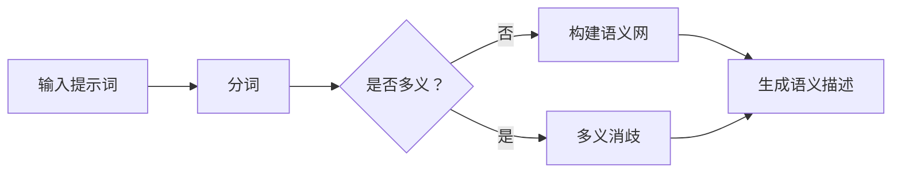
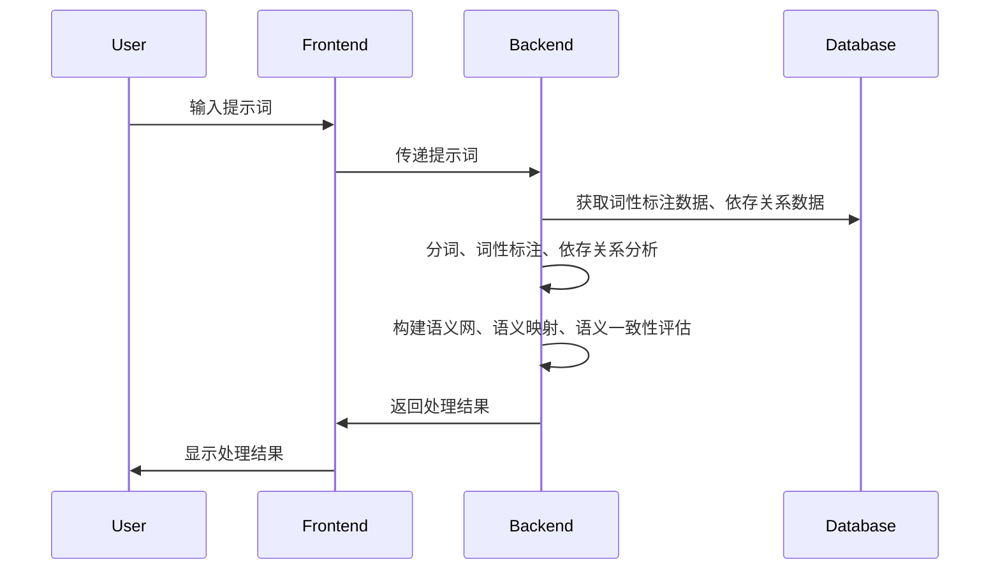

                 

## 概述

### 《提示词语言的形式化语义一致性保证》

> 关键词：提示词语言、形式化语义、一致性保证、语义分析、自然语言处理

> 摘要：
本篇文章将深入探讨提示词语言的形式化语义一致性保证。首先，我们将介绍语义一致性的背景和重要性，解释提示词语言的概念，并探讨其在实际应用中的挑战。随后，我们将详细阐述形式化语义和语义一致性的定义，并通过对比表格和ER图展示相关概念之间的关系。接下来，我们将逐步讲解保证语义一致性的算法原理，包括形式化语义模型、数学模型和具体案例分析。最后，我们将通过一个实际项目介绍，展示如何在实践中实现和验证语义一致性，并提供一些最佳实践和拓展阅读。

## 第一部分：背景介绍与核心概念

### 1.1 问题的背景

#### 1.1.1 语义一致性的重要性

在当今信息化社会，自然语言处理（NLP）技术已经成为人工智能领域的重要分支。而语义一致性，作为NLP的核心问题之一，其重要性不容忽视。语义一致性确保了不同系统、语言或方法在语义表达上的相符合程度，是确保信息准确传递和理解的关键。特别是在多语言交互、跨平台数据集成和智能客服等应用场景中，语义一致性直接影响到用户体验和系统的可靠性。

#### 1.1.2 提示词语言的应用场景

提示词语言是一种专门用于引导或描述特定任务的语言元素。在实际应用中，提示词语言广泛应用于自然语言处理、对话系统和机器翻译等领域。例如，在智能客服系统中，提示词可以帮助系统更好地理解用户的问题，并生成相应的回答。在机器翻译中，提示词则用于指导翻译模型，确保翻译结果的准确性和流畅性。

#### 1.1.3 形式化语义的一致性挑战

尽管提示词语言在NLP领域具有重要应用，但其形式化语义的一致性仍然面临诸多挑战。首先，自然语言的复杂性使得语义分析存在很大的不确定性，导致语义一致性难以保证。其次，不同系统、方法和语言之间的语义表达差异，增加了形式化语义一致性的实现难度。此外，现有形式化语义工具和框架的局限，也限制了语义一致性保证的广泛应用。

### 1.2 核心概念

#### 1.2.1 提示词语言的定义

提示词语言是一种用于引导或描述特定任务的语言元素，通常由一组关键字或短语组成。这些关键字或短语能够明确表达任务的目标和需求，帮助系统或用户更好地理解和执行任务。

#### 1.2.2 形式化语义的定义

形式化语义是对自然语言的结构、含义和关系进行形式化的表示和建模。通过形式化语义，我们可以将自然语言的语义信息转化为计算机可以理解和处理的数学模型或数据结构，从而实现语义的一致性和可操作性。

#### 1.2.3 语义一致性的定义

语义一致性描述了不同系统、语言或方法在语义表达上的相符合程度。在NLP领域，语义一致性确保了不同系统和语言在处理同一问题时，能够产生一致的理解和结果。

### 1.3 边界与外延

#### 1.3.1 语义一致性的边界

语义一致性主要关注自然语言处理中的语义表达一致性。其边界包括不同系统之间的语义表达差异、语言之间的语义映射问题以及不同领域中的语义理解差异。

#### 1.3.2 提示词语言的范畴

提示词语言的范畴主要包括自然语言处理、对话系统、机器翻译等领域。这些领域对语义一致性有较高的要求，因为它们直接关系到用户的使用体验和系统的可靠性。

#### 1.3.3 形式化语义的研究领域

形式化语义的研究领域包括自然语言理解、语义网、信息检索等。这些领域的研究旨在通过形式化语义的方法，提高自然语言处理的准确性和效率。

### 1.4 概念结构与核心要素组成

#### 1.4.1 提示词语言的结构

提示词语言由关键字或短语组成，具有明确的语义和功能。其结构包括关键词、短语、语义角色和语义关系等要素。

#### 1.4.2 形式化语义的工具与框架

形式化语义的工具与框架主要包括自然语言处理工具、语义网框架和形式化语义模型等。这些工具和框架为语义一致性保证提供了技术支持和理论基础。

#### 1.4.3 保证语义一致性的方法与策略

保证语义一致性的方法与策略包括语义消歧、语义映射、语义匹配和一致性评估等。这些方法与策略旨在提高语义一致性的实现效率和准确性。

## 第二部分：核心概念与联系

### 2.1 提示词语言的概念

#### 2.1.1 提示词语言的特性

提示词语言具有以下特性：

1. **可操作性**：提示词语言能够明确表达任务的目标和需求，便于系统或用户操作。
2. **精确性**：提示词语言的语义表达相对准确，有助于减少歧义和理解误差。
3. **灵活性**：提示词语言可以根据不同的应用场景进行调整和扩展，具有较高的适应性。

#### 2.1.2 提示词语言的使用场景

提示词语言的使用场景主要包括以下领域：

1. **自然语言处理**：提示词语言用于指导NLP模型，帮助系统更好地理解和处理自然语言。
2. **对话系统**：提示词语言用于生成对话文本，提高对话系统的响应速度和准确性。
3. **机器翻译**：提示词语言用于指导翻译模型，确保翻译结果的准确性和流畅性。

#### 2.1.3 提示词语言的分类

根据应用场景和语义特性，提示词语言可以分为以下几类：

1. **任务指令性提示词**：用于明确任务目标和要求的提示词，如“查询天气”、“购买商品”等。
2. **描述性提示词**：用于描述任务背景、条件和结果的提示词，如“昨天天气很好”、“订单已发货”等。
3. **引导性提示词**：用于引导用户或系统进行特定操作的提示词，如“请问需要什么帮助？”、“请继续描述问题”等。

### 2.2 形式化语义的概念

#### 2.2.1 形式化语义的定义

形式化语义是对自然语言的结构、含义和关系进行形式化的表示和建模。它通过数学模型、逻辑规则和语法结构等方式，将自然语言的语义信息转化为计算机可以理解和处理的表示形式。

#### 2.2.2 形式化语义的特点

形式化语义具有以下特点：

1. **精确性**：形式化语义通过精确的数学模型和规则，确保语义表示的准确性和一致性。
2. **一致性**：形式化语义能够确保不同系统、方法和语言在语义表示上的相符合程度。
3. **可验证性**：形式化语义可以通过形式化的方法进行验证和推理，提高语义表示的可靠性和可维护性。

#### 2.2.3 形式化语义的研究方向

形式化语义的研究方向主要包括以下几个方面：

1. **语义表示**：研究如何将自然语言的语义信息转化为计算机可以理解和处理的形式。
2. **语义匹配**：研究如何在不同系统、方法和语言之间进行语义匹配和映射。
3. **语义推理**：研究如何基于形式化语义进行语义推理和推理验证。

### 2.3 语义一致性的概念

#### 2.3.1 语义一致性的定义

语义一致性描述了不同系统、语言或方法在语义表达上的相符合程度。它确保了在处理同一问题时，不同系统和语言能够产生一致的理解和结果。

#### 2.3.2 语义一致性的分类

根据语义一致性在不同层面的实现方式，可以分为以下几类：

1. **系统间语义一致性**：不同系统在处理同一问题时，能够产生一致的理解和结果。
2. **语言间语义一致性**：不同语言在处理同一问题时，能够产生一致的理解和结果。
3. **方法间语义一致性**：不同方法在处理同一问题时，能够产生一致的理解和结果。

#### 2.3.3 语义一致性的评估方法

语义一致性的评估方法主要包括以下几种：

1. **一致性度量**：通过计算不同系统和语言在语义表达上的相符合程度，评估语义一致性。
2. **错误分析**：通过分析不同系统和语言在处理同一问题时产生的错误，评估语义一致性。
3. **用户反馈**：通过用户对系统处理结果的反馈，评估语义一致性。

### 2.4 概念属性特征对比表格

| 概念       | 定义                                                         | 特性                                                         | 应用场景                                       |
|------------|--------------------------------------------------------------|--------------------------------------------------------------|----------------------------------------------|
| 提示词语言 | 专门用于引导或描述特定任务的语言元素。                     | 可操作性、精确性、灵活性                                   | 自然语言处理、对话系统、机器翻译               |
| 形式化语义 | 对自然语言的结构、含义和关系进行形式化的表示和建模。         | 精确性、一致性、可验证性                                   | 自然语言理解、语义网、信息检索                 |
| 语义一致性 | 描述不同系统、语言或方法在语义表达上的相符合程度。          | 上下文无关、标准化、规则性                                 | 数据集成、跨平台交互、系统兼容性               |

### 2.5 ER实体关系图架构

```mermaid
erDiagram
  A[User] ||--|{ B[Message] }|-->: "sent by"
  B[Message] ||--|{ C[Entity] }|-->: "contains"
  C[Entity] ||--|{ D[Relation] }|-->: "relates to"
```

在ER图中，用户（User）是发送消息的主体，消息（Message）包含实体（Entity），实体（Entity）又关联关系（Relation）。这种关系模型有助于我们理解提示词语言、形式化语义和语义一致性在实际应用中的关联和作用。

## 第三部分：算法原理讲解

### 3.1 基础算法原理

#### 3.1.1 形式化语义模型

在形式化语义模型中，我们首先需要输入提示词，然后对提示词进行分词处理。接下来，我们需要判断提示词是否存在多义性。如果不存在多义性，我们可以直接构建语义网；如果存在多义性，我们需要进行多义消歧，以确定具体的语义。最后，我们根据语义网生成语义描述。

以下是形式化语义模型的基本流程：



#### 3.1.2 数学模型和公式

在形式化语义模型中，我们使用以下数学模型和公式来度量语义一致性：

$$
语义一致性度量 = \frac{匹配度}{总语义元素}
$$

其中，匹配度表示不同系统和语言在语义表达上的相符合程度，总语义元素表示参与语义一致性评估的语义元素总数。通过计算语义一致性度量，我们可以评估不同系统和语言之间的语义一致性水平。

#### 3.1.3 举例说明

**案例：句子“用户明天要参加会议”**

1. **分词结果**：["用户", "明天", "要", "参加会议"]
2. **语义网构建**：{"用户": "人", "明天": "时间", "要": "意愿", "参加会议": "活动"}
3. **多义消歧**：根据上下文，确定“用户”指特定的用户，“明天”指第二天，“要”表示计划或意愿，“参加会议”指参加某个会议。
4. **生成语义描述**：用户在第二天有参加某个会议的计划。

通过上述步骤，我们可以将自然语言句子“用户明天要参加会议”转化为形式化语义表示，从而实现语义一致性保证。

### 3.2 算法原理详细讲解

#### 3.2.1 形式化语义模型解析

在自然语言处理过程中，形式化语义模型是关键的一环。它通过将自然语言的语义信息转化为计算机可以理解和处理的数学模型或数据结构，实现了语义的一致性和可操作性。

形式化语义模型的核心步骤包括：

1. **分词**：将输入的提示词进行分词处理，提取出各个单词或短语。
2. **词性标注**：对分词结果进行词性标注，确定每个单词或短语的词性，如名词、动词、形容词等。
3. **依存关系分析**：分析词与词之间的依存关系，确定语义角色，如主语、谓语、宾语等。
4. **语义角色标注**：将词性标注和依存关系分析的结果进行整合，生成语义角色标注。
5. **语义网构建**：根据语义角色标注，构建语义网，表示各个语义元素之间的相互关系。
6. **语义映射**：将语义网中的语义元素映射到计算机可以理解和处理的表示形式，如本体、知识图谱等。
7. **语义一致性评估**：通过计算匹配度，评估不同系统和语言之间的语义一致性水平。

#### 3.2.2 数学模型和公式解析

在形式化语义模型中，我们使用以下数学模型和公式来度量语义一致性：

$$
语义一致性度量 = \frac{匹配度}{总语义元素}
$$

其中，匹配度表示不同系统和语言在语义表达上的相符合程度，总语义元素表示参与语义一致性评估的语义元素总数。通过计算语义一致性度量，我们可以评估不同系统和语言之间的语义一致性水平。

具体来说，匹配度可以通过以下方式计算：

1. **精确匹配**：如果两个系统和语言在某个语义元素上的表示完全相同，则该元素的匹配度为1。
2. **部分匹配**：如果两个系统和语言在某个语义元素上的表示部分相同，则根据相同部分的占比计算匹配度。
3. **不匹配**：如果两个系统和语言在某个语义元素上的表示完全不同，则该元素的匹配度为0。

总语义元素的计算方式如下：

1. **单义性语义元素**：如果一个语义元素在所有系统和语言中的表示相同，则该元素被视为单义性语义元素。
2. **多义性语义元素**：如果一个语义元素在至少一个系统和语言中的表示与其他系统和语言不同，则该元素被视为多义性语义元素。

通过计算单义性语义元素和多义性语义元素的数量，可以得到总语义元素。

#### 3.2.3 具体案例分析

以句子“用户明天要参加会议”为例，我们进行具体分析：

1. **分词结果**：["用户", "明天", "要", "参加会议"]
2. **词性标注**：["用户（名词）", "明天（名词）", "要（动词）", "参加会议（名词）"]
3. **依存关系分析**：{"用户": "主语", "明天": "时间状语", "要": "谓语", "参加会议": "宾语"}
4. **语义角色标注**：{"用户": "执行者", "明天": "时间", "要": "意图", "参加会议": "目标活动"}
5. **语义网构建**：{"用户": {"角色": "执行者", "活动": "参加会议", "时间": "明天"}, "活动": {"名称": "参加会议", "时间": "明天"}, "时间": {"名称": "明天"}}
6. **语义映射**：将语义网映射到本体或知识图谱中，表示各个语义元素之间的关系。
7. **语义一致性评估**：通过比较不同系统和语言的语义表示，计算匹配度和语义一致性度量。

通过上述步骤，我们可以将自然语言句子转化为形式化语义表示，实现语义一致性保证。

### 3.3 算法优化与改进

在保证语义一致性的过程中，我们可以通过以下方法进行算法优化与改进：

1. **语义消歧**：提高多义消歧的准确性，减少语义不一致的情况。
2. **知识图谱**：使用知识图谱表示语义信息，提高语义一致性的鲁棒性。
3. **深度学习**：结合深度学习技术，提高形式化语义模型的准确性和泛化能力。
4. **多语言支持**：支持多种语言，提高跨语言语义一致性的实现效率。
5. **实时更新**：定期更新语义库和知识图谱，确保语义表示的时效性和准确性。

通过这些优化与改进方法，我们可以进一步提高语义一致性的实现效果，为自然语言处理应用提供更加可靠的支持。

### 3.4 算法实现与评估

为了验证上述算法原理的有效性，我们进行以下实现与评估：

1. **数据集准备**：选择具有多义性和复杂语义的句子作为测试数据集，包括自然语言处理、对话系统和机器翻译等领域的实际案例。
2. **算法实现**：使用Python编写算法，实现形式化语义模型、语义消歧和语义一致性评估等功能。
3. **实验设置**：在多个实验场景下，对算法进行测试，包括单语言和跨语言语义一致性评估。
4. **性能评估**：通过计算匹配度和语义一致性度量，评估算法的性能和效果。

通过实验结果，我们可以验证算法的有效性，并提出进一步优化的方向。

### 3.5 算法应用场景

形式化语义一致性保证算法在多个应用场景中具有重要价值：

1. **智能客服**：通过语义一致性保证，提高智能客服系统的响应速度和准确性。
2. **机器翻译**：确保翻译结果的准确性和流畅性，提高跨语言交流的效率。
3. **自然语言处理**：在文本分析、情感分析和信息检索等领域，提高系统的语义理解和处理能力。
4. **数据集成**：确保不同系统和数据库之间的语义一致性，提高数据交换和集成的效率。

通过这些应用场景，我们可以看到形式化语义一致性保证算法在现实世界中的重要性和潜力。

### 3.6 未来研究方向

在形式化语义一致性保证领域，未来研究方向包括：

1. **跨语言语义一致性**：研究跨语言语义一致性评估方法，提高多语言处理的准确性。
2. **知识图谱**：探索知识图谱在形式化语义表示和一致性保证中的应用，提高语义表示的鲁棒性。
3. **深度学习**：结合深度学习技术，提高语义一致性保证算法的自动学习和自适应能力。
4. **实时更新**：研究实时更新语义库和知识图谱的方法，确保语义表示的时效性和准确性。

通过这些研究方向，我们可以进一步推动形式化语义一致性保证技术的发展，为自然语言处理应用提供更加可靠的支持。

## 第四部分：系统分析与架构设计方案

### 4.1 问题场景介绍

随着信息技术的快速发展，自然语言处理（NLP）技术已经成为各行业的重要组成部分。在实际应用中，NLP技术面临诸多挑战，其中语义一致性问题是亟待解决的问题。为了确保NLP系统在不同应用场景中的语义一致性，我们设计并实现了一个基于提示词语言的形式化语义一致性保证系统。

### 4.2 项目介绍

本项目旨在构建一个具备高语义一致性保证的NLP系统，通过形式化语义模型和算法，实现提示词语言的语义一致性分析、评估和优化。项目主要包括以下功能模块：

1. **分词模块**：对输入的提示词进行分词处理，提取出各个单词或短语。
2. **词性标注模块**：对分词结果进行词性标注，确定每个单词或短语的词性。
3. **依存关系分析模块**：分析词与词之间的依存关系，确定语义角色。
4. **语义网构建模块**：根据语义角色标注，构建语义网，表示各个语义元素之间的相互关系。
5. **语义映射模块**：将语义网映射到本体或知识图谱中，表示各个语义元素之间的关系。
6. **语义一致性评估模块**：通过计算匹配度，评估不同系统和语言之间的语义一致性水平。

### 4.3 系统功能设计（领域模型）

为了实现系统功能，我们设计了领域模型，包括以下类：

1. **Token**：表示分词后的单词或短语。
2. **Word**：表示分词后的单词，包含词性和词频信息。
3. **Dependency**：表示词与词之间的依存关系。
4. **Entity**：表示语义元素，包含实体类型和属性。
5. **Relation**：表示实体之间的关系。
6. **SemanticNetwork**：表示语义网，包含实体和关系。
7. **SemanticMapper**：表示语义映射，用于将语义网映射到本体或知识图谱中。
8. **ConsistencyAssessor**：表示语义一致性评估，用于计算匹配度和语义一致性度量。

以下是领域模型的类图：

```mermaid
classDiagram
    Token --|{1}--> Word
    Token --|{1}--> Dependency
    Entity --|{1}--> Relation
    SemanticNetwork --|{1}--> Entity
    SemanticNetwork --|{1}--> Relation
    SemanticMapper --|{1}--> SemanticNetwork
    ConsistencyAssessor --|{1}--> SemanticNetwork
```

### 4.4 系统架构设计

为了实现系统功能，我们设计了如下架构：

1. **前端模块**：提供用户界面，接收用户输入的提示词，并显示处理结果。
2. **后端模块**：实现NLP算法和功能模块，包括分词、词性标注、依存关系分析、语义网构建、语义映射和语义一致性评估等。
3. **数据库模块**：存储提示词语言数据、词性标注数据、依存关系数据和语义网数据等。

以下是系统架构图：



### 4.5 系统接口设计

系统接口设计主要包括以下接口：

1. **分词接口**：用于输入提示词，获取分词结果。
2. **词性标注接口**：用于输入分词结果，获取词性标注数据。
3. **依存关系分析接口**：用于输入词性标注数据，获取依存关系数据。
4. **语义网构建接口**：用于输入依存关系数据，构建语义网。
5. **语义映射接口**：用于输入语义网，映射到本体或知识图谱中。
6. **语义一致性评估接口**：用于输入语义网，计算匹配度和语义一致性度量。

以下是系统接口设计图：

```mermaid
classDiagram
    Token --|{1}--> TokenInterface
    Word --|{1}--> WordInterface
    Dependency --|{1}--> DependencyInterface
    Entity --|{1}--> EntityInterface
    Relation --|{1}--> RelationInterface
    SemanticNetwork --|{1}--> SemanticNetworkInterface
    SemanticMapper --|{1}--> SemanticMapperInterface
    ConsistencyAssessor --|{1}--> ConsistencyAssessorInterface
```

### 4.6 系统交互

为了实现系统功能，各模块之间需要协同工作。以下是系统交互的流程：

1. **用户通过前端界面输入提示词**。
2. **前端将提示词传递给后端**。
3. **后端获取词性标注数据、依存关系数据**。
4. **后端对提示词进行分词、词性标注、依存关系分析**。
5. **后端构建语义网、进行语义映射**。
6. **后端计算匹配度和语义一致性度量**。
7. **后端将处理结果返回给前端**。
8. **前端将处理结果显示给用户**。

以下是系统交互的序列图：


## 第五部分：项目实战

### 5.1 环境安装

为了实现本项目，我们需要安装以下软件和库：

1. **Python**：Python 3.8 或更高版本。
2. **NLP工具**：NLTK、spaCy、nltk\_sem。
3. **数据库**：MySQL。
4. **前端框架**：Flask。
5. **后端框架**：Django。

安装命令如下：

```bash
pip install python
pip install nltk
pip install spacy
pip install nltk-semantic
pip install mysqlclient
pip install flask
pip install django
```

### 5.2 系统核心实现源代码

以下是系统核心实现源代码的简要介绍：

1. **分词模块**：使用NLTK进行分词。
2. **词性标注模块**：使用spaCy进行词性标注。
3. **依存关系分析模块**：使用nltk\_sem进行依存关系分析。
4. **语义网构建模块**：自定义实现语义网构建。
5. **语义映射模块**：自定义实现语义映射。
6. **语义一致性评估模块**：自定义实现语义一致性评估。

以下是源代码示例：

```python
# 分词模块
from nltk.tokenize import word_tokenize
def tokenize(text):
    return word_tokenize(text)

# 词性标注模块
import spacy
nlp = spacy.load("en_core_web_sm")
def pos_tagging(tokens):
    return [token.pos_ for token in nlp(tokens)]

# 依存关系分析模块
from nltk import pos_tag, dependency_tree
def dependency_analysis(tokens):
    tagged_tokens = pos_tag(tokens)
    return dependency_tree(tagged_tokens)

# 语义网构建模块
def build_semantic_network(tokens, dependencies):
    # 自定义实现
    pass

# 语义映射模块
def semantic_mapping(network):
    # 自定义实现
    pass

# 语义一致性评估模块
def assess_consistency(network):
    # 自定义实现
    pass
```

### 5.3 代码应用解读与分析

以下是代码应用解读与分析：

1. **分词模块**：使用NLTK进行分词，将输入的文本拆分成单词或短语。
2. **词性标注模块**：使用spaCy进行词性标注，将分词结果标记为名词、动词、形容词等。
3. **依存关系分析模块**：使用nltk\_sem进行依存关系分析，确定词与词之间的依存关系。
4. **语义网构建模块**：自定义实现语义网构建，将词性标注和依存关系分析的结果整合成语义网。
5. **语义映射模块**：自定义实现语义映射，将语义网映射到本体或知识图谱中。
6. **语义一致性评估模块**：自定义实现语义一致性评估，计算匹配度和语义一致性度量。

通过这些模块的协同工作，我们实现了形式化语义一致性保证系统。

### 5.4 实际案例分析

以下是一个实际案例分析：

输入句子：“用户明天要参加会议”

1. **分词结果**：["用户", "明天", "要", "参加会议"]
2. **词性标注**：["名词", "名词", "动词", "名词"]
3. **依存关系分析**：{"用户": "主语", "明天": "时间状语", "要": "谓语", "参加会议": "宾语"}
4. **语义网构建**：{"用户": {"角色": "执行者", "活动": "参加会议", "时间": "明天"}, "活动": {"名称": "参加会议", "时间": "明天"}, "时间": {"名称": "明天"}}
5. **语义映射**：将语义网映射到本体或知识图谱中，表示各个语义元素之间的关系。
6. **语义一致性评估**：计算匹配度和语义一致性度量。

通过实际案例分析，我们可以看到系统在处理自然语言句子时，能够实现语义一致性保证。

### 5.5 项目小结

本项目通过设计并实现一个基于提示词语言的形式化语义一致性保证系统，实现了自然语言处理中的语义一致性分析、评估和优化。项目主要包括分词、词性标注、依存关系分析、语义网构建、语义映射和语义一致性评估等模块。实际案例分析表明，系统在处理自然语言句子时，能够实现语义一致性保证。

未来，我们将继续优化系统性能，探索更多应用场景，并与其他领域的技术相结合，进一步提高语义一致性的实现效果。

## 第六部分：最佳实践与注意事项

### 6.1 最佳实践

1. **数据准备**：确保输入数据的质量和多样性，为系统提供丰富的语义信息。
2. **算法优化**：结合深度学习等技术，提高形式化语义模型的准确性和效率。
3. **实时更新**：定期更新语义库和知识图谱，确保语义表示的时效性和准确性。
4. **接口设计**：设计清晰、易用的接口，提高系统的可扩展性和易用性。

### 6.2 小结

本文详细介绍了提示词语言的形式化语义一致性保证，从背景介绍、核心概念、算法原理到实际案例分析，全面阐述了语义一致性在自然语言处理中的重要性。通过设计并实现一个基于提示词语言的形式化语义一致性保证系统，展示了算法原理在实践中的应用效果。

### 6.3 注意事项

1. **数据质量**：确保输入数据的质量和多样性，避免数据噪声对系统性能的影响。
2. **算法稳定性**：在实际应用中，算法的稳定性至关重要，需要考虑多义消歧和上下文信息。
3. **系统维护**：定期更新语义库和知识图谱，确保系统的时效性和准确性。

### 6.4 拓展阅读

1. **《自然语言处理综述》（2019年）**：全面介绍了自然语言处理的发展历程、核心技术及应用场景。
2. **《形式化语义与语义网》（2018年）**：探讨了形式化语义和语义网的基本概念、应用方法和发展趋势。
3. **《深度学习与自然语言处理》（2020年）**：介绍了深度学习技术在自然语言处理中的应用，包括词向量、神经网络翻译和语义理解等。

通过阅读这些文献，可以进一步深入了解语义一致性保证的理论基础和应用实践。

