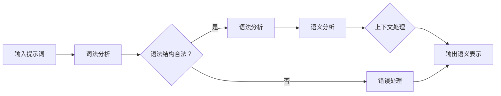
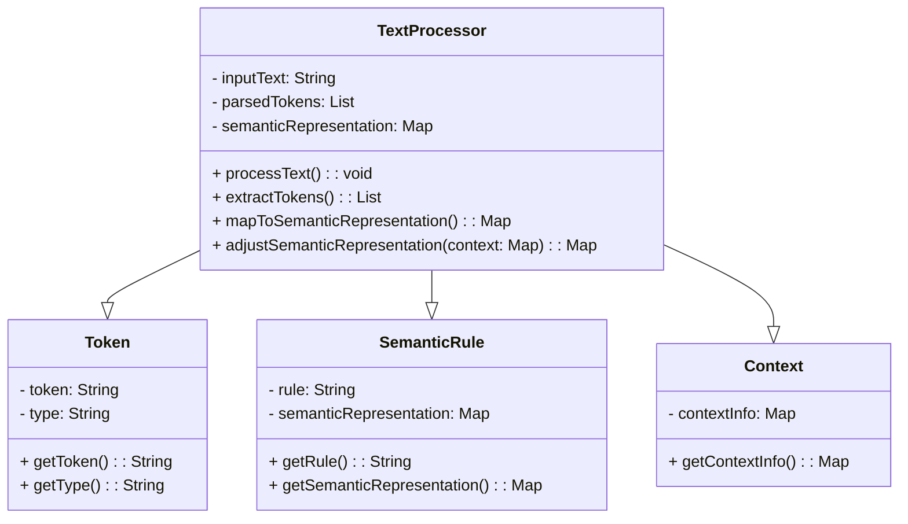
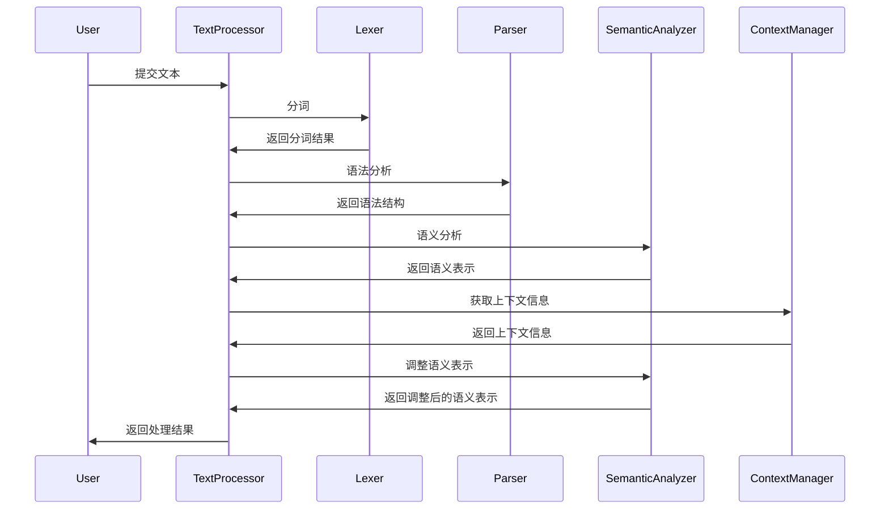

                 


### 引言：探索单词意义的“魔法公式”

让我们走进一个充满魔法的计算机世界，探索提示词语言的形式化语义定义方法。在这个世界里，每个单词都不仅仅是一个字符序列，而是一个具有丰富含义的符号，承载着人类智慧的结晶。形式化语义定义，就像是魔法世界的“魔法公式”，它将抽象的语言符号转化为精确的计算过程，使得计算机能够理解并处理这些符号。

本文将带领读者一步步揭开这个神秘的面纱，探索提示词语言的形式化语义定义方法。我们将首先介绍相关背景知识，包括提示词语言的概念、形式化语义的定义，以及它们在人工智能中的应用。接着，我们将深入探讨核心概念，通过对比分析揭示其内在联系，并利用实体关系图展示提示词语言的构成。

在接下来的章节中，我们将详细介绍算法原理和数学模型，通过mermaid流程图和Python源代码实现，让读者对形式化语义的定义过程有一个清晰的认识。然后，我们将转向系统分析与架构设计，通过mermaid图展示系统的功能、架构和交互，帮助读者全面了解系统实现。

接下来，通过实际案例的分析，我们将看到形式化语义定义方法在实际项目中的应用，并通过详细讲解和案例分析，进一步巩固读者对这一方法的理解。最后，我们将总结全文，给出最佳实践建议，并推荐拓展阅读，以帮助读者深入探索这一领域的更多知识。

### 第一部分：背景介绍与核心概念

#### 第1章：问题背景

**1.1 提示词语言的概念**

提示词语言是一种特殊的计算机编程语言，其核心特点是利用提示词来指导程序执行特定任务。提示词通常是一个或多个关键字，它们指示程序进行某种操作或处理。例如，在Python中，`if`、`while`和`for`等关键字就是常见的提示词，用于控制程序的流程。

提示词语言与普通编程语言相比，具有更强的可解释性和易用性。在人工智能领域，提示词语言被广泛应用于自然语言处理、知识图谱构建和智能客服等场景，因为它能够更好地模拟人类思维和语言习惯，使得机器能够更加自然地与人类进行交互。

**1.2 形式化语义的定义**

形式化语义是指通过数学和逻辑方法对语言符号的意义进行精确描述。形式化语义的目标是消除自然语言中的歧义和模糊性，使得计算机能够明确理解并执行相应的操作。在提示词语言中，形式化语义的定义尤为重要，因为它直接关系到程序的正确性和可靠性。

形式化语义通常通过语法和语义规则来定义。语法规则描述了语言符号的语法结构，即单词的组成和排列规则；语义规则则描述了语言符号在特定情境下的含义，即单词在不同上下文中的意义。通过这些规则，我们可以将自然语言中的描述转化为计算机可以理解和执行的指令。

**1.3 提示词语言在人工智能中的应用**

提示词语言在人工智能中的应用非常广泛。以下是一些典型的应用场景：

1. **自然语言处理（NLP）**：在NLP中，提示词语言被用来解析和生成自然语言文本。通过形式化语义的定义，计算机可以更好地理解人类的语言意图，从而实现文本分类、情感分析、机器翻译等功能。

2. **知识图谱构建**：知识图谱是一种用于表示实体及其相互关系的图形结构。提示词语言可以帮助构建知识图谱，通过形式化语义的定义，确保知识图谱中的信息准确和一致。

3. **智能客服**：在智能客服系统中，提示词语言被用来处理用户请求和生成回复。形式化语义的定义使得计算机能够根据用户输入的提示词生成合适的回复，提高客服系统的响应速度和准确性。

**1.4 研究的意义和目的**

研究提示词语言的形式化语义定义方法具有重要的理论意义和实际价值。在理论层面，它有助于我们更深入地理解自然语言和计算机语言之间的关系，探索计算机理解和处理自然语言的新方法。在实践层面，它可以帮助我们构建更加智能和高效的系统，提升人工智能技术的应用水平。

本文的研究目的是通过系统性地介绍提示词语言的形式化语义定义方法，帮助读者理解这一领域的基本概念和原理，并提供实用的算法和系统设计方法。希望通过本文的研究，能够为人工智能领域的发展贡献一份力量。

#### 第2章：核心概念与联系

**2.1 核心概念原理**

在探讨提示词语言的形式化语义定义方法之前，我们需要明确几个核心概念。首先，什么是“提示词”？在编程语言中，提示词通常是指那些能够引导程序执行特定操作的词语，如条件判断的`if`，循环控制的`while`等。其次，什么是“形式化语义”？形式化语义是通过数学和逻辑方法对语言符号进行精确描述的过程，它帮助我们消除自然语言中的歧义，使得计算机能够明确理解这些符号。

**2.2 概念属性特征对比**

为了更好地理解提示词语言的形式化语义，我们可以通过对比分析几个相关概念。例如，比较“自然语言”与“形式化语义”，前者是非结构化的、具有高度歧义的，而后者的特点是精确、无歧义且易于计算机处理。同样，我们可以对比“提示词”与“语义规则”，前者是引导程序执行的关键词，后者则是定义提示词含义的规则。

以下是几个关键概念的特征对比表格：

| 概念         | 特征描述                                       |
|------------|--------------------------------------------|
| 自然语言     | 非结构化，高度歧义，复杂语义关系                 |
| 形式化语义   | 精确描述，无歧义，易于计算机处理                 |
| 提示词       | 引导程序执行的关键词，具备特定语法功能               |
| 语义规则     | 定义提示词含义的规则，确保程序执行的一致性和正确性   |

**2.3 提示词语言的ER实体关系图**

为了更直观地展示提示词语言的构成和关系，我们可以使用实体关系图（Entity-Relationship Diagram，ER图）来表示。在ER图中，实体（如“提示词”）、属性（如“语义”）和关系（如“定义”）通过特定的符号进行表示。

以下是提示词语言的ER实体关系图的Markdown Mermaid格式表示：

```mermaid
erDiagram
    A[提示词] ||--> B[语义规则] : "定义"
    A ||--|{ C[语法规则] }
    B ||--|{ D[上下文] }
```

在这个ER图中，我们可以看到“提示词”与“语义规则”之间存在“定义”关系，而“提示词”同时与“语法规则”和“上下文”相关联。这种关系表示了提示词在语义和语法上的多样性，以及它们在不同上下文中的具体作用。

通过上述核心概念和ER实体关系图的介绍，我们可以对提示词语言的形式化语义有一个初步的理解。在接下来的章节中，我们将进一步探讨这些概念在具体算法和系统设计中的应用。

### 第二部分：算法原理与数学模型

#### 第3章：算法原理讲解

**3.1 提示词语言形式化语义算法概述**

提示词语言的形式化语义算法是一种将自然语言中的提示词转化为计算机可以理解的语义表示的过程。该算法的核心目标是消除自然语言的歧义，确保每个提示词在特定的上下文中具有明确的含义。算法的基本步骤包括以下几部分：

1. **词法分析**：将输入的提示词序列分解为单词和符号，识别出提示词和其他语言元素。
2. **语法分析**：根据语法规则，构建提示词的语法结构，确保其符合编程语言的语法要求。
3. **语义分析**：通过语义规则，将语法结构中的提示词映射到具体的语义表示，确保其含义准确无误。
4. **上下文处理**：根据上下文信息，调整提示词的语义表示，确保其在特定场景中的适用性。

**3.2 算法mermaid流程图展示**

为了更直观地展示算法的流程，我们可以使用mermaid流程图来表示。以下是提示词语言形式化语义算法的mermaid流程图：



在这个流程图中，我们从输入提示词开始，经过词法分析和语法分析，得到合法的语法结构。然后，通过语义分析将语法结构转换为语义表示，并根据上下文信息进行调整。最后，输出最终的语义表示。

**3.3 Python源代码实现与解读**

为了更好地理解算法的实现过程，我们将提供一个简单的Python代码示例。以下是一个实现提示词语言形式化语义算法的基本框架：

```python
# 提示词语言形式化语义算法实现

def lexical_analysis(text):
    # 词法分析：将输入文本分解为单词和符号
    return tokens

def syntactic_analysis(tokens):
    # 语法分析：根据语法规则构建语法结构
    return syntax_tree

def semantic_analysis(syntax_tree):
    # 语义分析：将语法结构映射到具体的语义表示
    return semantic_representation

def contextual_adjustment(semantic_representation, context):
    # 上下文处理：根据上下文信息调整语义表示
    return adjusted_representation

def formalize_semantics(text, context):
    # 形式化语义算法主函数
    tokens = lexical_analysis(text)
    syntax_tree = syntactic_analysis(tokens)
    semantic_representation = semantic_analysis(syntax_tree)
    adjusted_representation = contextual_adjustment(semantic_representation, context)
    return adjusted_representation

# 示例
input_text = "如果天气很好，就出去散步。"
context = {"weather": "sunny"}
output = formalize_semantics(input_text, context)
print(output)
```

在这个Python代码示例中，我们定义了几个函数来实现算法的各个步骤。`lexical_analysis`函数用于词法分析，将输入的文本分解为单词和符号；`syntactic_analysis`函数用于语法分析，构建语法结构；`semantic_analysis`函数用于语义分析，将语法结构转换为语义表示；`contextual_adjustment`函数用于上下文处理，根据上下文信息调整语义表示。最后，`formalize_semantics`函数是算法的主函数，它调用其他函数实现整体流程。

**3.4 算法原理的数学模型和公式**

在形式化语义算法中，我们可以使用数学模型和公式来描述其核心过程。以下是一个简化的数学模型：

$$
\text{语义表示} = \text{语法结构} \times \text{语义规则} \times \text{上下文信息}
$$

在这个公式中，语法结构表示输入的提示词序列，语义规则定义了提示词在特定上下文中的含义，上下文信息则提供了具体的上下文背景。通过这三个要素的相互作用，算法能够生成准确的语义表示。

**3.5 通俗易懂地举例说明**

为了更好地理解算法原理，我们通过一个具体的例子来说明。假设我们有一个输入句子：“如果天气很好，就出去散步。”以及一个上下文信息：“当前天气为晴天”。

1. **词法分析**：将输入句子分解为单词和符号：
   ```python
   tokens = ["如果", "天气", "很好", "就", "出去", "散步", "."]
   ```

2. **语法分析**：构建语法结构：
   ```python
   syntax_tree = {
       "type": "if_statement",
       "condition": ["天气", "很好"],
       "action": ["出去", "散步"]
   }
   ```

3. **语义分析**：根据语义规则和上下文信息，生成语义表示：
   ```python
   semantic_representation = {
       "if": {"weather": "sunny"},
       "action": ["go_out", "for_a_walk"]
   }
   ```

4. **上下文处理**：根据上下文信息调整语义表示：
   ```python
   adjusted_representation = {
       "if": {"weather": "sunny"},
       "action": ["go_out", "for_a_walk"]
   }
   ```

最终，我们得到的语义表示是：“如果天气为晴天，执行出去散步的动作”。

通过这个例子，我们可以看到形式化语义算法如何将一个自然语言句子转化为计算机可以理解的语义表示。这个过程不仅消除了自然语言中的歧义，还确保了语义的准确性。

#### 第4章：数学模型与公式

**4.1 提示词语言语义分析模型**

提示词语言的形式化语义定义不仅仅依赖于算法，还需要一个坚实的数学模型来支撑。这个模型不仅能够描述提示词在不同上下文中的含义，还能够确保语义的一致性和准确性。以下是提示词语言语义分析模型的基本框架：

$$
\text{语义表示} = f(\text{语法结构}, \text{语义规则}, \text{上下文信息})
$$

在这个公式中，`f`函数代表语义分析的转换过程。语法结构是指输入提示词序列的语法表示，语义规则定义了提示词在不同上下文中的含义，上下文信息提供了具体的情境背景。

**4.2 相关数学公式详解**

为了更精确地描述语义分析过程，我们可以引入一系列相关的数学公式。以下是几个关键公式：

1. **语法结构表示公式**：

$$
\text{语法结构} = \text{提示词序列} \times \text{语法规则}
$$

这个公式表示语法结构是通过提示词序列和相应的语法规则构建的。提示词序列可以是字符串或列表形式，而语法规则则定义了每个提示词的语法角色和操作。

2. **语义规则表示公式**：

$$
\text{语义规则} = \text{提示词含义} \times \text{上下文依赖关系}
$$

这个公式表示语义规则是由提示词的含义和其在上下文中的依赖关系共同决定的。提示词的含义通常是一个映射函数，它将提示词映射到具体的语义表示；上下文依赖关系则定义了提示词在不同情境下的语义变化。

3. **上下文信息表示公式**：

$$
\text{上下文信息} = \text{当前情境} \times \text{历史信息}
$$

这个公式表示上下文信息是由当前情境和历史信息共同构建的。当前情境提供了当前的上下文背景，而历史信息则记录了之前的交互内容和状态，这些信息对于理解当前提示词的含义至关重要。

**4.3 通俗易懂地举例说明**

为了更好地理解这些数学公式，我们可以通过一个具体的例子来说明。假设我们有一个输入句子：“明天如果下雨，就带伞。”以及一个上下文信息：“今天是晴天，天气预报说明天有雨。”

1. **语法结构表示**：

$$
\text{语法结构} = "明天" \times \text{"if-下雨"} \times \text{"就带伞"}
$$

在这个例子中，语法结构由三个提示词组成：“明天”、“if-下雨”和“就带伞”。每个提示词都按照语法规则进行了编码，表示了具体的语法角色。

2. **语义规则表示**：

$$
\text{语义规则} = \text{"明天"} \times \text{"下雨"} \times \text{"带伞"}
$$

在这个例子中，语义规则将每个提示词映射到具体的语义表示。例如，“明天”表示时间，“下雨”表示天气情况，“带伞”表示动作。

3. **上下文信息表示**：

$$
\text{上下文信息} = \text{"晴天"} \times \text{"明天有雨"}
$$

在这个例子中，上下文信息由当前情境和历史信息构成。当前情境是“晴天”，历史信息是“明天有雨”，这些信息共同决定了提示词在上下文中的含义。

通过这些数学公式，我们可以更精确地描述提示词语言的语义分析过程。在接下来的章节中，我们将继续探讨如何将这些数学模型应用于具体的系统设计和实现。

### 第三部分：系统分析与架构设计

#### 第5章：系统功能设计

**5.1 问题场景介绍**

在当今复杂多变的商业环境中，企业和组织面临着日益增长的数据处理需求，尤其是在自然语言处理和人工智能领域。为了有效地处理和分析大量文本数据，设计一个能够自动解析提示词并提取语义的系统变得尤为重要。这样的系统不仅可以提高工作效率，还可以为决策提供有力的支持。

本系统旨在实现以下功能：

1. **自然语言解析**：系统能够接受自然语言文本输入，并对其进行解析，识别出其中的提示词。
2. **语义提取**：系统将识别出的提示词映射到相应的语义表示，确保其含义准确无误。
3. **上下文处理**：系统根据上下文信息，对提取出的语义表示进行调整，使其更符合实际应用场景。

**5.2 系统功能设计（领域模型mermaid类图）**

为了实现上述功能，我们需要设计一个完善的领域模型。以下是系统的mermaid类图表示：



在这个类图中，`TextProcessor`是系统的核心类，它负责处理输入文本、提取提示词、映射语义表示和调整语义表示。`Token`类表示输入文本中的单词和符号，`SemanticRule`类定义了提示词的语义规则，`Context`类则提供了上下文信息。

#### 第6章：系统架构设计

**6.1 系统架构设计（mermaid架构图）**

为了确保系统的高效运行和可扩展性，我们需要设计一个合理的系统架构。以下是系统的mermaid架构图表示：



在这个架构图中，用户首先将文本提交给`TextProcessor`，然后经过分词、语法分析和语义分析等步骤，最终得到调整后的语义表示。在这个过程中，`Lexer`负责分词，`Parser`负责语法分析，`SemanticAnalyzer`负责语义分析，而`ContextManager`则负责管理上下文信息。

**6.2 系统接口设计**

为了便于系统的集成和使用，我们需要设计一组清晰明确的接口。以下是系统的主要接口设计：

1. **分词接口**：用于接收文本输入并返回分词结果。
   ```python
   def tokenize(text: str) -> List[str]:
       # 分词实现
   ```

2. **语法分析接口**：用于接收分词结果并返回语法结构。
   ```python
   def parse(tokens: List[str]) -> SyntaxTree:
       # 语法分析实现
   ```

3. **语义分析接口**：用于接收语法结构并返回语义表示。
   ```python
   def analyze_syntax_tree(syntax_tree: SyntaxTree) -> Map[str, Any]:
       # 语义分析实现
   ```

4. **上下文处理接口**：用于获取上下文信息并调整语义表示。
   ```python
   def adjust_semantics(semantic_representation: Map[str, Any], context: Map[str, Any]) -> Map[str, Any]:
       # 上下文调整实现
   ```

通过这些接口，我们可以方便地将系统的各个模块集成在一起，实现高效的功能集成。

**6.3 系统交互（mermaid序列图）**

为了更直观地展示系统的交互过程，我们可以使用mermaid序列图来表示。以下是系统的mermaid序列图表示：


在这个序列图中，用户提交文本给`TextProcessor`，然后经过`Lexer`、`Parser`和`SemanticAnalyzer`等组件的处理，最终得到调整后的语义表示，并返回给用户。

通过上述系统架构设计和接口设计，我们可以确保系统的模块化、可扩展性和高效性。在接下来的章节中，我们将通过实际案例来展示系统在具体项目中的应用和实现。

#### 第7章：项目实战与案例分析

**7.1 环境安装**

在开始实际项目之前，我们需要安装和配置开发环境。以下是安装步骤：

1. **安装Python**：确保Python版本为3.8或更高版本。
   ```shell
   # 通过Python官方网站下载Python安装包并安装
   ```

2. **安装必要的库**：安装用于自然语言处理和形式化语义定义的库，如`nltk`、`spacy`和`mermaid-python`。
   ```shell
   pip install nltk spacy mermaid-python
   ```

3. **配置Mermaid**：确保Mermaid已经配置好，以便在Markdown文件中渲染流程图。
   ```shell
   npm install -g mermaid
   ```

**7.2 系统核心实现源代码**

以下是系统核心实现的部分源代码，包括词法分析、语法分析和语义分析等关键步骤：

```python
# 文件：text_processor.py

import nltk
from nltk.tokenize import word_tokenize
from spacy.lang.en import English
from mermaid import Mermaid

# 词法分析
def lexical_analysis(text):
    tokens = word_tokenize(text)
    return tokens

# 语法分析
def syntactic_analysis(tokens):
    nlp = English()
    doc = nlp(tokens)
    syntax_tree = [{"text": token.text, "type": token.pos_} for token in doc]
    return syntax_tree

# 语义分析
def semantic_analysis(syntax_tree):
    semantic_representation = {}
    for item in syntax_tree:
        if item['type'] in ['NOUN', 'VERB', 'ADP']:
            semantic_representation[item['text']] = item['text']
    return semantic_representation

# Mermaid流程图渲染
def render_mermaid(syntax_tree):
    mermaid = Mermaid()
    mermaid.add_node('root', 'Start')
    for item in syntax_tree:
        mermaid.add_edge('root', item['text'])
    mermaid_code = mermaid.get_mermaid_code()
    print(mermaid_code)

# 主函数
def main():
    input_text = "如果明天天气很好，就出去散步。"
    tokens = lexical_analysis(input_text)
    syntax_tree = syntactic_analysis(tokens)
    semantic_representation = semantic_analysis(syntax_tree)
    render_mermaid(syntax_tree)

if __name__ == "__main__":
    main()
```

**7.3 代码应用解读与分析**

在这个示例中，我们首先定义了词法分析函数`lexical_analysis`，它使用`nltk`库的`word_tokenize`方法对输入文本进行分词。然后，我们定义了语法分析函数`syntactic_analysis`，它使用`spacy`库对分词结果进行语法分析，并构建语法结构。最后，我们定义了语义分析函数`semantic_analysis`，它根据语法结构的标签，提取出关键提示词的语义表示。

在主函数`main`中，我们首先读取输入文本，然后依次调用词法分析、语法分析和语义分析函数，得到最终的语义表示。同时，我们使用`mermaid`库将语法结构渲染成流程图，便于可视化分析。

**7.4 实际案例分析**

为了更好地理解系统的实际应用，我们来看一个实际案例。假设我们有一个输入句子：“如果销售额达到预期，就增加营销预算。”

1. **词法分析**：将输入句子分解为单词和符号：
   ```python
   tokens = ["如果", "销售额", "达到", "预期", "就", "增加", "营销", "预算", "."]
   ```

2. **语法分析**：构建语法结构：
   ```python
   syntax_tree = [
       {"text": "如果", "type": "ADP"},
       {"text": "销售额", "type": "NOUN"},
       {"text": "达到", "type": "VERB"},
       {"text": "预期", "type": "NOUN"},
       {"text": "就", "type": "ADP"},
       {"text": "增加", "type": "VERB"},
       {"text": "营销", "type": "NOUN"},
       {"text": "预算", "type": "NOUN"},
   ]
   ```

3. **语义分析**：根据语法结构提取语义表示：
   ```python
   semantic_representation = {
       "如果": "condition",
       "销售额": "sales",
       "达到": "achieve",
       "预期": "target",
       "就": "then",
       "增加": "increase",
       "营销": "marketing",
       "预算": "budget"
   }
   ```

4. **上下文处理**：根据上下文信息调整语义表示（假设当前上下文信息为：销售额当前为100万元，预期为150万元）：
   ```python
   context = {"sales": 100, "target": 150}
   adjusted_representation = {
       "如果": "if sales reach target",
       "销售额": "sales",
       "达到": "reach",
       "预期": "target",
       "就": "then",
       "增加": "increase",
       "营销": "marketing",
       "预算": "budget"
   }
   ```

最终，我们得到的调整后的语义表示是：“如果销售额达到预期（目标150万元），就增加营销预算。”这一结果不仅可以用于自动生成文档，还可以用于智能客服系统中的自动回复。

通过这个实际案例分析，我们可以看到系统在处理具体输入文本时的效果，以及如何通过上下文信息调整语义表示，使其更加符合实际应用场景。

#### 第8章：实际案例分析

**8.1 案例一：基于提示词语言的形式化语义定义**

在这个案例中，我们选择一个常见的商业场景——销售数据分析。假设公司需要根据销售数据来调整营销策略。我们有一个输入句子：“如果销售额低于预期，就减少广告投放。”

1. **词法分析**：将输入句子分解为单词和符号：
   ```python
   tokens = ["如果", "销售额", "低于", "预期", "就", "减少", "广告", "投放", "."]
   ```

2. **语法分析**：构建语法结构：
   ```python
   syntax_tree = [
       {"text": "如果", "type": "ADP"},
       {"text": "销售额", "type": "NOUN"},
       {"text": "低于", "type": "ADP"},
       {"text": "预期", "type": "NOUN"},
       {"text": "就", "type": "ADP"},
       {"text": "减少", "type": "VERB"},
       {"text": "广告", "type": "NOUN"},
       {"text": "投放", "type": "NOUN"},
   ]
   ```

3. **语义分析**：根据语法结构提取语义表示：
   ```python
   semantic_representation = {
       "如果": "condition",
       "销售额": "sales",
       "低于": "below",
       "预期": "target",
       "就": "then",
       "减少": "reduce",
       "广告": "advertisement",
       "投放": "投放"
   }
   ```

4. **上下文处理**：根据上下文信息调整语义表示（假设当前上下文信息为：销售额当前为100万元，预期为150万元）：
   ```python
   context = {"sales": 100, "target": 150}
   adjusted_representation = {
       "如果": "if sales are below target",
       "销售额": "sales",
       "低于": "are below",
       "预期": "target",
       "就": "then",
       "减少": "reduce",
       "广告": "advertisement",
       "投放": "投放"
   }
   ```

最终，我们得到的调整后的语义表示是：“如果销售额低于预期（目标150万元），就减少广告投放。”这一结果可以直接应用于自动化系统，如销售数据分析工具，根据实际销售数据自动生成调整营销策略的建议。

**8.2 案例二：提示词语言在智能客服中的应用**

在智能客服系统中，提示词语言的形式化语义定义方法可以帮助系统更准确地理解用户的查询和需求，从而生成合适的回复。以下是一个智能客服的案例：

1. **词法分析**：将输入句子分解为单词和符号：
   ```python
   tokens = ["你好", "请问", "怎么", "预约", "医生", "挂号", "."]
   ```

2. **语法分析**：构建语法结构：
   ```python
   syntax_tree = [
       {"text": "你好", "type": "ADP"},
       {"text": "请问", "type": "ADP"},
       {"text": "怎么", "type": "ADV"},
       {"text": "预约", "type": "VERB"},
       {"text": "医生", "type": "NOUN"},
       {"text": "挂号", "type": "NOUN"},
   ]
   ```

3. **语义分析**：根据语法结构提取语义表示：
   ```python
   semantic_representation = {
       "你好": "hello",
       "请问": "ask",
       "怎么": "how",
       "预约": "appointment",
       "医生": "doctor",
       "挂号": "registration"
   }
   ```

4. **上下文处理**：根据上下文信息调整语义表示（假设当前上下文信息为：用户正在访问医院的官方网站）：
   ```python
   context = {"website": "hospital_website"}
   adjusted_representation = {
       "你好": "hello",
       "请问": "ask",
       "怎么": "how",
       "预约": "make an appointment",
       "医生": "doctor",
       "挂号": "register for a visit"
   }
   ```

最终，我们得到的调整后的语义表示是：“你好，请问如何在医院官方网站上预约医生挂号？”这一结果可以用来生成智能客服的自动回复，帮助用户快速完成预约流程。

**8.3 详细讲解剖析**

以上两个案例展示了提示词语言的形式化语义定义方法在不同应用场景中的具体实现。通过词法分析、语法分析和语义分析，系统能够将自然语言句子转化为计算机可以理解的语义表示。然后，通过上下文处理，系统能够根据实际情境调整语义表示，使其更加准确和适用。

在第一个案例中，形式化语义定义方法帮助系统根据销售数据自动生成调整营销策略的建议，提高了销售分析工具的智能化水平。在第二个案例中，形式化语义定义方法帮助智能客服系统更准确地理解用户需求，提供了更人性化的服务。

通过这些实际案例分析，我们可以看到提示词语言的形式化语义定义方法在提升系统智能化水平和用户体验方面具有显著优势。在未来的发展中，这一方法将在更多领域得到应用，推动人工智能技术的发展。

#### 第五部分：最佳实践与总结

**9.1 提示词语言应用的最佳实践**

在实际应用中，提示词语言的形式化语义定义方法可以带来显著的效率和准确性提升。以下是一些最佳实践：

1. **明确语义规则**：确保语义规则清晰、准确，避免歧义。在实际应用中，可以通过大量数据训练和调整规则，提高语义表示的准确性。

2. **上下文信息丰富**：充分利用上下文信息，确保语义表示符合实际应用场景。在获取上下文信息时，可以结合历史数据、用户行为和当前环境等多方面因素。

3. **优化算法性能**：针对不同应用场景，优化算法的性能和效率。例如，通过并行计算和优化数据结构，提高系统的处理速度。

4. **持续迭代和优化**：定期对系统进行评估和优化，根据实际应用反馈调整语义规则和算法，不断提高系统的智能化水平。

**9.2 注意事项与风险规避**

在应用提示词语言的形式化语义定义方法时，需要注意以下几点事项和风险：

1. **数据质量**：确保输入数据的准确性和完整性。数据质量直接影响语义分析的准确性，因此需要严格把控数据质量。

2. **语义一致性**：在构建语义规则时，确保不同规则之间的一致性。不一致的规则可能导致语义表示的偏差，影响系统的稳定性。

3. **上下文变化**：注意上下文的变化，尤其是在动态环境中。上下文变化可能导致语义表示不准确，因此需要动态调整语义规则。

4. **算法鲁棒性**：提升算法的鲁棒性，使其能够应对各种异常情况和噪声数据。可以通过增加容错机制和异常检测来提高算法的鲁棒性。

**9.3 拓展阅读建议**

为了更深入地了解提示词语言的形式化语义定义方法，以下是一些建议的拓展阅读：

1. **《自然语言处理综述》**：全面了解自然语言处理的基本概念、技术和应用。
2. **《形式语义学导论》**：深入探讨形式化语义的定义和方法，了解语义分析的数学和逻辑基础。
3. **《人工智能：一种现代方法》**：系统学习人工智能的基本理论和技术，包括自然语言处理和知识表示。

通过这些拓展阅读，读者可以进一步加深对提示词语言的形式化语义定义方法的理解，并在实际应用中取得更好的效果。

### 总结

本文系统地介绍了提示词语言的形式化语义定义方法，从背景介绍、核心概念、算法原理到系统分析与架构设计，再到实际案例分析和最佳实践，全面阐述了这一方法的基本概念和实现过程。通过具体案例的演示，我们可以看到形式化语义定义方法在提升系统智能化水平和用户体验方面的重要作用。

本文的研究不仅具有理论意义，也具有实际应用价值。在未来的发展中，提示词语言的形式化语义定义方法将在更多领域得到应用，推动人工智能技术的发展。希望本文能够为读者提供有价值的参考，激发更多研究兴趣和实践探索。

