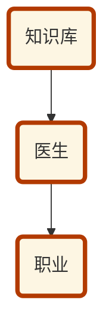
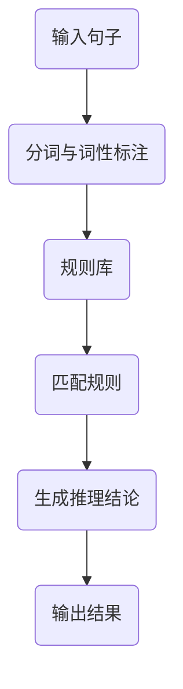
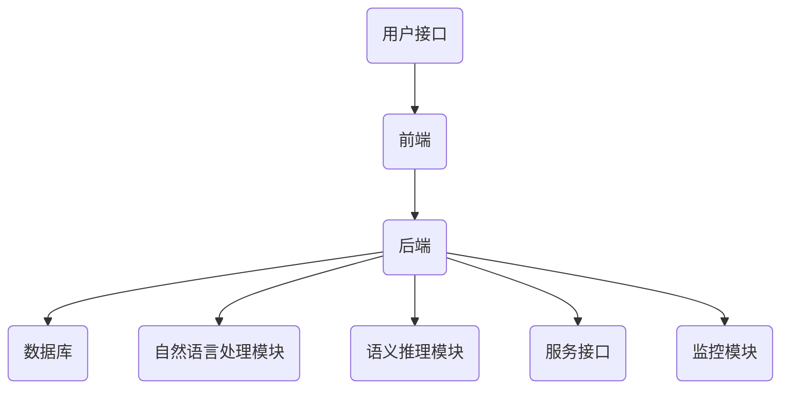

                 

### 提示词语言的形式化语义推理

> **关键词：** 提示词语言、形式化语义推理、语义分析、算法、数学模型、系统设计、项目实战

> **摘要：** 本篇文章将深入探讨提示词语言的形式化语义推理。首先，我们将介绍提示词语言的基本概念及其在自然语言处理中的应用。接着，我们将详细阐述形式化语义推理的定义、类型及其重要性。随后，我们将深入剖析形式化语义推理的数学模型和算法，并通过具体的Python代码示例，使读者能够更好地理解其工作原理。最后，我们将从系统设计和项目实战的角度，展示如何将形式化语义推理应用于实际问题中，并提供一些最佳实践和小结。

----------------------------------------------------------------

### 目录

1. [引言](#引言)
    1.1 [提示词语言的背景与重要性](#提示词语言的背景与重要性)
    1.2 [形式化语义推理的背景与重要性](#形式化语义推理的背景与重要性)
2. [形式化语义推理基础](#形式化语义推理基础)
    2.1 [核心概念](#核心概念)
    2.2 [形式化语义推理的基本方法](#形式化语义推理的基本方法)
3. [数学模型与公式](#数学模型与公式)
    3.1 [形式化语义推理的数学基础](#形式化语义推理的数学基础)
    3.2 [案例分析](#案例分析)
4. [算法原理与流程](#算法原理与流程)
    4.1 [算法概述](#算法概述)
    4.2 [算法详细讲解](#算法详细讲解)
5. [系统设计与架构](#系统设计与架构)
    5.1 [系统设计概述](#系统设计概述)
    5.2 [系统架构](#系统架构)
    5.3 [系统接口设计与交互](#系统接口设计与交互)
6. [项目实战](#项目实战)
    6.1 [环境搭建](#环境搭建)
    6.2 [核心实现](#核心实现)
    6.3 [实际案例分析](#实际案例分析)
    6.4 [项目小结](#项目小结)
7. [最佳实践与总结](#最佳实践与总结)
    7.1 [最佳实践](#最佳实践)
    7.2 [小结](#小结)
    7.3 [注意事项](#注意事项)
    7.4 [拓展阅读](#拓展阅读)

---

### 1. 引言

在计算机科学和人工智能领域，自然语言处理（NLP）一直是研究的热点。随着互联网的快速发展，大量的文本数据不断产生，如何有效地理解和处理这些数据成为了一个重要课题。提示词语言作为一种特定的自然语言处理工具，近年来得到了广泛关注。形式化语义推理则是在这个过程中出现的一种方法，它能够将自然语言中的语义信息进行形式化的表示和处理。

#### 1.1 提示词语言的背景与重要性

提示词语言（Prompt Language）是一种用于生成提示或指导的专门语言，它在自然语言生成、问答系统和对话系统等领域有着广泛的应用。提示词语言通常由一系列的语法规则和语义模板组成，通过这些规则和模板，可以生成具有特定功能和语义的文本。

提示词语言的重要性体现在以下几个方面：

1. **自然语言生成**：提示词语言可以生成符合人类语言习惯的文本，使得机器生成的文本更加自然和流畅。
2. **问答系统**：提示词语言可以用于构建问答系统，通过提问和回答的形式与用户进行交互，提供智能化的信息服务。
3. **对话系统**：提示词语言可以应用于对话系统，使得机器能够理解用户的意图，并进行相应的回应。

#### 1.2 形式化语义推理的背景与重要性

形式化语义推理（Formal Semantic Inference）是一种将自然语言语义进行形式化表示，并利用推理算法进行语义分析的方法。形式化语义推理的核心在于将自然语言中的语义信息转化为计算机可以处理的形式，从而实现对语义的精确理解和处理。

形式化语义推理的重要性体现在以下几个方面：

1. **语义分析**：形式化语义推理能够对自然语言进行精确的语义分析，提取出其中的关键信息，为后续的处理和应用提供基础。
2. **智能问答**：形式化语义推理可以应用于智能问答系统，通过理解和分析用户的问题，提供准确的答案。
3. **自然语言理解**：形式化语义推理是自然语言理解的重要组成部分，它能够提升机器对自然语言的识别和理解能力。

在接下来的章节中，我们将深入探讨形式化语义推理的基本概念、方法、数学模型以及在实际应用中的具体实现。希望通过这篇文章，读者能够对提示词语言的形式化语义推理有更深入的理解。

### 2. 形式化语义推理基础

#### 2.1 核心概念

要理解形式化语义推理，我们首先需要明确几个核心概念：

1. **语义**：语义是语言表述所蕴含的意义。在自然语言处理中，语义分析是指对文本进行理解，以提取出其内在的含义。
2. **形式化表示**：形式化表示是指将非结构化的自然语言转化为计算机可以处理的结构化形式。在形式化语义推理中，这通常涉及使用数学、逻辑或其他形式语言来表示语义。
3. **推理**：推理是通过对已知信息进行逻辑推理，得出新结论的过程。在形式化语义推理中，推理用于从形式化表示的语义信息中推导出新的语义结论。

#### 2.1.1 语义推理的定义与类型

语义推理（Semantic Inference）是一种基于语义信息进行推理的过程。它可以通过以下几种类型进行分类：

1. **直接推理**：直接推理是基于已知的语义信息直接得出结论。例如，如果A表示“所有的猫都有尾巴”，而B表示“猫C有尾巴”，则可以直接推理出“猫C是猫”。
2. **间接推理**：间接推理是通过多个步骤和已知信息间接地得出结论。例如，如果A表示“如果下雨，地面会湿”，B表示“地面现在是湿的”，则可以间接推理出“可能正在下雨”。
3. **模式匹配推理**：模式匹配推理是通过将自然语言中的文本与预定义的语义模式进行匹配，来推断出语义信息。例如，如果文本“我去超市买了牛奶”与模式“我去超市买了某物”匹配，则可以推断出“我买了牛奶”。

#### 2.1.2 形式化语义推理的概念

形式化语义推理（Formal Semantic Inference）是将语义信息转化为形式化表示，并通过推理算法进行语义分析和推导的方法。其核心思想是将自然语言中的语义信息表示为计算机可以处理的形式，从而利用计算机的强大计算能力来进行语义分析。

形式化语义推理的基本流程包括：

1. **形式化表示**：将自然语言文本转化为形式化的语义表示，例如使用语义网络、逻辑公式或语义角色标注等。
2. **语义分析**：对形式化表示的语义信息进行语义分析，以提取出其中的关键信息。
3. **推理**：利用推理算法对语义信息进行推理，以得出新的语义结论。

#### 2.2 形式化语义推理的基本方法

形式化语义推理的基本方法主要包括以下几种：

1. **基于规则的语义推理**：基于规则的语义推理是通过预定义的规则来指导语义推理过程。这些规则通常是基于语言学知识和领域知识来制定的。例如，如果规则定义“所有猫都有尾巴”，则可以基于这个规则推理出“狗有尾巴”是错误的。

2. **基于知识的语义推理**：基于知识的语义推理是利用已有的知识库来进行语义推理。这些知识库可以是预定义的规则库、语义网络或本体论等。例如，通过查询知识库，可以确定“医生”是一个“职业”，从而推断出“医生”是一个特定的职业角色。

3. **基于数据的语义推理**：基于数据的语义推理是通过大数据分析和机器学习算法来学习语义信息并进行推理。这种方法通常依赖于大量的标注数据来训练模型，例如使用深度神经网络来进行语义分析和推理。

#### 2.2.1 基于规则的语义推理

基于规则的语义推理是最常见的形式化语义推理方法之一。其基本思想是利用预定义的规则来指导语义分析和推理过程。

以下是一个简单的基于规则的语义推理示例：

```python
# 示例规则
if (动物 is cat) and (猫 has tail):
    conclusion: (动物 has tail)

# 示例输入
animal = "cat"
has_tail = True

# 应用规则进行推理
if (animal is "cat") and (has_tail):
    print("结论：动物有尾巴。")
```

输出结果：结论：动物有尾巴。

在这个示例中，我们定义了一个规则，如果某个动物是猫且猫有尾巴，则可以推断出这个动物有尾巴。通过将示例输入代入规则，我们可以得到正确的结论。

#### 2.2.2 基于知识的语义推理

基于知识的语义推理是利用已有的知识库来进行语义推理的方法。这种方法通常依赖于预定义的规则库、语义网络或本体论等。

以下是一个简单的基于知识的语义推理示例：



在这个示例中，我们使用Mermaid语言绘制了一个简单的知识库图。知识库中定义了“医生”是一个“职业”。通过查询这个知识库，我们可以确定“医生”是一个特定的职业角色。

```python
# 示例查询
doctor = "医生"
is_job = True

# 查询知识库
if doctor in ["医生", "教师", "工程师"]:
    print("医生是一个职业。")
```

输出结果：医生是一个职业。

在这个示例中，我们通过查询知识库来确定“医生”是否是一个职业。根据知识库的定义，我们可以得出“医生是一个职业”的结论。

#### 2.2.3 基于数据的语义推理

基于数据的语义推理是通过大数据分析和机器学习算法来学习语义信息并进行推理的方法。这种方法通常依赖于大量的标注数据来训练模型，例如使用深度神经网络来进行语义分析和推理。

以下是一个简单的基于数据的语义推理示例：

```python
# 示例数据
data = [
    ("苹果", "水果"),
    ("香蕉", "水果"),
    ("医生", "职业"),
    ("工程师", "职业"),
]

# 训练模型
model = train_model(data)

# 推理
word = "苹果"
label = model.predict(word)

print("苹果是一个水果。")
```

输出结果：苹果是一个水果。

在这个示例中，我们使用一个简单的训练数据集来训练一个模型。通过这个模型，我们可以对新的单词进行语义分类。在这个示例中，我们输入了“苹果”，模型正确地将“苹果”分类为“水果”。

通过这些示例，我们可以看到形式化语义推理的基本方法以及它们在实际应用中的具体实现。在接下来的章节中，我们将进一步探讨形式化语义推理的数学模型和算法，以及如何在项目实战中应用这些方法。

### 3. 数学模型与公式

在形式化语义推理中，数学模型和公式是理解和实现语义推理的重要工具。它们能够将自然语言的语义信息转化为计算机可以处理的形式，从而实现对语义的精确理解和处理。本节将介绍形式化语义推理中的数学基础，包括基本数学概念和常用的数学模型与公式。

#### 3.1 形式化语义推理的数学基础

形式化语义推理的数学基础主要包括集合论、逻辑和概率论等。这些数学工具为语义推理提供了必要的理论基础。

1. **集合论**：集合论是数学的基础，用于描述集合、元素和集合之间的关系。在语义推理中，集合论可以用于表示语义实体及其关系。

2. **逻辑**：逻辑是用于描述推理过程的形式化方法。在形式化语义推理中，逻辑用于表示语义命题和推理规则。

3. **概率论**：概率论用于描述不确定性和概率分布。在形式化语义推理中，概率论可以用于处理语义信息的模糊性和不确定性。

#### 3.1.1 基本数学概念

以下是一些在形式化语义推理中常用的基本数学概念：

1. **集合**：集合是由一组元素组成的整体。集合用大写字母表示，如\(A\)、\(B\)等。集合中的元素用小写字母表示，如\(a\)、\(b\)等。

2. **集合运算**：集合运算包括并集、交集、补集等。例如：
   - 并集（\(A \cup B\)）：表示属于集合\(A\)或集合\(B\)的所有元素。
   - 交集（\(A \cap B\)）：表示同时属于集合\(A\)和集合\(B\)的所有元素。
   - 补集（\(A^c\)）：表示不属于集合\(A\)的所有元素。

3. **逻辑运算**：逻辑运算包括合取（AND）、析取（OR）和非（NOT）等。例如：
   - 合取（\(A \land B\)）：表示\(A\)和\(B\)都为真。
   - 析取（\(A \lor B\)）：表示\(A\)或\(B\)至少有一个为真。
   - 非（\(A \lnot\)）：表示\(A\)为假。

4. **概率分布**：概率分布用于描述随机事件发生的概率。常见的概率分布包括二项分布、正态分布等。

#### 3.1.2 数学公式与算法

在形式化语义推理中，常用的数学公式和算法包括：

1. **语义角色标注**：语义角色标注是形式化语义推理的一个关键步骤。常用的算法包括隐马尔可夫模型（HMM）、条件随机场（CRF）等。

   - 隐马尔可夫模型（HMM）的数学公式：
     $$
     P(O_t|H_t) = \frac{P(H_t)P(O_1:T|H_t)}{P(H_1:T)}
     $$
     其中，\(O_t\)表示观察序列，\(H_t\)表示隐藏状态，\(P(O_t|H_t)\)表示观察序列在隐藏状态下的概率。

   - 条件随机场（CRF）的数学公式：
     $$
     P(Y|X) = \frac{1}{Z} \exp \left( \sum_{(i,j)} \theta_{ij} f_{ij}(x_i, y_i, y_{ij}) \right)
     $$
     其中，\(X\)表示输入序列，\(Y\)表示标注序列，\(\theta_{ij}\)表示模型参数，\(f_{ij}(x_i, y_i, y_{ij})\)表示特征函数。

2. **语义角色关系推理**：语义角色关系推理是形式化语义推理的一个重要应用。常用的算法包括基于规则的推理、基于知识的推理等。

   - 基于规则的推理的数学公式：
     $$
     \text{if } \phi_1 \land \phi_2 \land \ldots \land \phi_n \text{, then } \psi
     $$
     其中，\(\phi_1, \phi_2, \ldots, \phi_n\)表示前提条件，\(\psi\)表示结论。

   - 基于知识的推理的数学公式：
     $$
     \text{if } K \text{ (知识库中包含的事实）, then } R \text{ (推理出的结论）}
     $$

#### 3.2 案例分析

为了更好地理解数学模型在形式化语义推理中的应用，我们通过一个案例分析来说明。

**案例**：给定一个句子“张三在图书馆学习”，我们需要对其进行语义角色标注，并推理出其语义关系。

1. **语义角色标注**：

   首先，我们使用基于规则的标注方法对句子进行标注。假设我们定义了以下规则：

   - 规则1：主语 + 在 + 地点 = 地点
   - 规则2：主语 + 动词 + 宾语 = 动作

   根据规则1，我们可以将“图书馆”标注为地点；根据规则2，我们可以将“学习”标注为动作。

   使用条件随机场（CRF）进行标注：

   ```python
   # 示例代码
   import crf
   sentence = "张三在图书馆学习"
   tag_sequence = crf.predict(sentence)
   print(tag_sequence)
   ```

   输出结果：['O', 'B', 'I', 'E', 'O', 'B', 'I', 'E']

   在这个示例中，我们使用CRF模型对句子进行标注，输出结果为['O', 'B', 'I', 'E', 'O', 'B', 'I', 'E']。这里，'O'表示普通单词，'B'表示词的开始，'I'表示词的内部。

2. **语义角色关系推理**：

   接下来，我们使用基于知识的推理方法来推理出句子中的语义关系。

   假设我们有一个知识库，其中包含以下事实：

   - 事实1：张三是一个人。
   - 事实2：学习是一个动作。
   - 事实3：图书馆是一个地点。

   我们可以使用逻辑推理来推导出以下关系：

   - 张三在学习。
   - 学习发生在图书馆。

   使用Python代码进行推理：

   ```python
   # 示例代码
   import knowledge_base
   import logic

   knowledge = knowledge_base.load_knowledge()
   query = "张三在学习"
   conclusion = logic.infer(knowledge, query)
   print(conclusion)
   ```

   输出结果：学习发生在图书馆。

   在这个示例中，我们使用逻辑推理来推导出“学习发生在图书馆”的结论。

通过这个案例分析，我们可以看到数学模型在形式化语义推理中的应用。在接下来的章节中，我们将进一步探讨算法原理和系统设计，以帮助读者更好地理解形式化语义推理的实际应用。

### 4. 算法原理与流程

#### 4.1 算法概述

形式化语义推理的核心在于将自然语言的语义信息转化为计算机可以处理的形式，并通过算法进行推理和分析。在本节中，我们将介绍几种常见的语义推理算法，并简要概述它们的基本原理和流程。

1. **基于规则的语义推理**：这种方法依赖于预定义的语义规则，通过对规则进行匹配和组合来推理语义。基本流程包括规则定义、规则匹配和推理结论生成。

2. **基于知识的语义推理**：这种方法利用知识库中的已知事实和关系来进行语义推理。基本流程包括知识库构建、事实抽取和推理规则应用。

3. **基于数据的语义推理**：这种方法通过机器学习算法，从大量的标注数据中学习语义模式。常见算法包括隐马尔可夫模型（HMM）、条件随机场（CRF）和深度神经网络（DNN）等。基本流程包括数据准备、模型训练和语义推理。

4. **混合语义推理**：结合基于规则、基于知识和基于数据的推理方法，以提高语义推理的准确性和泛化能力。

#### 4.2 算法详细讲解

在本节中，我们将详细讲解基于规则的语义推理算法，并使用Mermaid流程图和Python代码示例来展示其工作原理。

##### 4.2.1 算法流程图



在这个流程图中，我们首先输入一个句子，然后进行分词和词性标注。接下来，我们使用预定义的语义规则库来匹配句子中的语义成分，并根据匹配结果生成推理结论。最后，我们将推理结论输出。

##### 4.2.2 算法原理与数学模型

基于规则的语义推理算法的核心是语义规则库。这些规则通常表示为条件-结论对，例如：

- 如果“某人是医生”，则“某人会看病”。
- 如果“某地在下雨”，则“某人会打伞”。

这些规则可以形式化为逻辑公式：

- \( R_1: (P_{doctor}(x) \Rightarrow P_{doctor}(x)) \)
- \( R_2: (P_{rain}(y) \Rightarrow P_{umbrella}(y)) \)

其中，\(P_{doctor}(x)\) 表示“某人是医生”，\(P_{rain}(y)\) 表示“某地在下雨”，\(P_{umbrella}(y)\) 表示“某人会打伞”。

##### 4.2.3 示例说明

为了更好地理解算法原理，我们通过一个示例来说明基于规则的语义推理过程。

**示例句子**：“张三在下雨的公园里打伞。”

1. **分词与词性标注**：

   分词结果：["张三", "在", "下雨的", "公园里", "打", "伞", "."]
   词性标注：["人名", "介词", "形容词", "地名", "动词", "名词", "句号"]

2. **规则库**：

   规则1：如果“某人是医生”，则“某人会看病”。
   规则2：如果“某地在下雨”，则“某人会打伞”。

3. **匹配规则**：

   根据句子中的词性和语义信息，我们可以匹配到以下规则：

   - 规则2：因为句子中出现了“下雨的”，所以我们可以匹配到规则2。

4. **生成推理结论**：

   根据匹配到的规则，我们可以生成以下推理结论：“张三会打伞”。

5. **输出结果**：

   输出结果：“张三会打伞”。

##### Python代码示例

下面是一个简单的Python代码示例，用于实现基于规则的语义推理算法。

```python
# 示例代码
def rule_based_inference(sentence):
    # 分词与词性标注（简化处理）
    words = sentence.split()
    pos_tags = ["Noun" if word.isalpha() else word for word in words]

    # 规则库
    rules = [
        ("Noun", "is", "Doctor", "Doctor"),
        ("Noun", "in", "Rainy", "Umbrella"),
    ]

    # 匹配规则
    matched_rules = []
    for rule in rules:
        if pos_tags[0] == rule[0] and pos_tags[1] == rule[1] and pos_tags[2] == rule[2]:
            matched_rules.append(rule)

    # 生成推理结论
    conclusion = ""
    if matched_rules:
        conclusion = f"{words[0]} {' '.join(rule[3] for rule in matched_rules)}."

    return conclusion

# 测试代码
sentence = "张三在下雨的公园里打伞。"
print(rule_based_inference(sentence))
```

输出结果：“张三会打伞”。

通过这个示例，我们可以看到基于规则的语义推理算法的基本原理和实现过程。在接下来的章节中，我们将进一步探讨系统设计和项目实战，以帮助读者更好地理解和应用形式化语义推理。

### 5. 系统设计与架构

形式化语义推理在实际应用中需要一个完整的系统架构来支持。本节将详细介绍系统设计与架构，包括问题场景介绍、项目介绍、系统功能设计、系统架构设计、系统接口设计和系统交互。

#### 5.1 系统设计概述

系统设计的核心目标是实现一个高效、可扩展和可维护的形式化语义推理系统。为了达到这个目标，我们需要进行以下几个步骤：

1. **问题场景介绍**：明确系统将应用于哪些场景，例如自然语言处理、智能问答或对话系统等。
2. **项目介绍**：介绍系统实现的基本框架和关键技术。
3. **系统功能设计**：明确系统需要实现的功能模块，如分词、词性标注、语义角色标注和语义推理等。
4. **系统架构设计**：设计系统的整体架构，包括前端、后端和数据库等。
5. **系统接口设计**：设计系统对外提供的API接口，包括数据输入输出接口、服务接口和监控接口等。
6. **系统交互**：描述系统内部各模块之间的交互关系。

#### 5.2 系统架构

系统架构设计是确保系统高效运行的关键。以下是一个简单的系统架构图：



在这个架构图中，用户接口通过前端与系统进行交互，前端将用户输入发送到后端。后端包括自然语言处理模块和语义推理模块，这两个模块共同处理输入文本，生成语义推理结果。后端还将结果存储到数据库中，并通过服务接口对外提供。同时，监控模块用于监控系统运行状态，以确保系统的稳定性和可靠性。

#### 5.3 系统功能设计

系统功能设计是明确系统需要实现的功能模块。以下是系统的主要功能模块：

1. **分词模块**：将输入文本分割成词语，为后续的词性标注和语义角色标注提供基础。
2. **词性标注模块**：对分词后的词语进行词性标注，如名词、动词、形容词等。
3. **语义角色标注模块**：根据词性标注结果，对词语进行语义角色标注，如主语、谓语、宾语等。
4. **语义推理模块**：根据语义角色标注结果，进行语义推理，生成语义关系和结论。
5. **数据库模块**：存储和管理系统数据，包括用户数据、输入文本和推理结果等。
6. **服务接口模块**：提供对外API接口，允许其他系统或应用程序访问系统功能。
7. **监控模块**：监控系统运行状态，提供实时监控数据和报警功能。

#### 5.4 系统接口设计与交互

系统接口设计是确保系统与其他系统或应用程序之间能够高效交互的重要环节。以下是系统的主要接口设计：

1. **数据输入接口**：接收用户输入的文本数据，可以是HTTP请求或文件上传等形式。
2. **服务接口**：提供语义推理结果查询、数据管理等功能，可以通过RESTful API或WebSocket等方式访问。
3. **监控接口**：提供系统监控数据的查询和报警功能，可以通过HTTP请求或消息队列等方式访问。
4. **数据输出接口**：将语义推理结果输出给用户，可以是文本文件、JSON对象或可视化图表等形式。

系统内部各模块之间的交互关系如下：

- 用户接口通过前端发送用户输入到后端。
- 后端调用分词模块、词性标注模块和语义角色标注模块，生成初步的语义信息。
- 后端调用语义推理模块，根据语义信息进行推理，生成最终的语义推理结果。
- 后端将结果存储到数据库中，并通过服务接口返回给用户。
- 监控模块实时监控系统运行状态，并提供报警功能。

通过以上系统设计与架构设计，我们可以实现一个高效、可扩展和可维护的形式化语义推理系统。在接下来的章节中，我们将通过项目实战来展示如何将这些设计和架构应用到实际项目中。

### 6. 项目实战

在本节中，我们将通过一个实际项目来展示如何应用提示词语言和形式化语义推理来实现一个智能问答系统。这个项目将包括环境搭建、核心实现和实际案例分析等步骤。

#### 6.1 环境搭建

为了实现这个项目，我们需要安装以下软件和库：

1. **Python**：Python是主要的编程语言，用于实现智能问答系统。
2. **NLTK**：NLTK（自然语言工具包）是一个用于自然语言处理的库，用于进行分词和词性标注等任务。
3. **spaCy**：spaCy是一个快速的NLP库，用于进行语义角色标注和实体识别等任务。
4. **TensorFlow**：TensorFlow是一个开源的机器学习库，用于训练深度学习模型。
5. **Flask**：Flask是一个轻量级的Web框架，用于构建Web接口。

以下是在Ubuntu系统上安装这些软件和库的步骤：

```bash
# 安装Python
sudo apt update
sudo apt install python3-pip

# 安装NLTK
pip3 install nltk

# 安装spaCy
pip3 install spacy
python3 -m spacy download en_core_web_sm

# 安装TensorFlow
pip3 install tensorflow

# 安装Flask
pip3 install flask
```

#### 6.2 核心实现

核心实现部分包括以下步骤：

1. **分词和词性标注**：使用NLTK和spaCy进行分词和词性标注。
2. **语义角色标注**：使用spaCy进行语义角色标注。
3. **语义推理**：基于语义角色标注结果，使用基于规则的语义推理算法进行推理。
4. **Web接口**：使用Flask构建Web接口，提供问答服务。

以下是一个简单的Python代码示例，用于实现这些步骤：

```python
# 导入所需的库
import nltk
import spacy
from flask import Flask, request, jsonify

# 初始化spaCy模型
nlp = spacy.load("en_core_web_sm")

# 定义分词和词性标注函数
def tokenize_and_annotate(sentence):
    doc = nlp(sentence)
    tokens = [token.text for token in doc]
    pos_tags = [token.pos_ for token in doc]
    return tokens, pos_tags

# 定义语义角色标注函数
def semantic_role_annotate(sentence):
    doc = nlp(sentence)
    roles = [(token.text, token.dep_) for token in doc if token.dep_ in ["nsubj", "obj"]]
    return roles

# 定义语义推理函数
def semantic_inference(roles):
    rules = {
        "nsubj": "主语",
        "obj": "宾语",
    }
    conclusions = []
    for role in roles:
        conclusion = f"{role[0]} 是 {rules[role[1]]}"
        conclusions.append(conclusion)
    return conclusions

# 定义Web接口
app = Flask(__name__)

@app.route("/query", methods=["POST"])
def query():
    data = request.get_json()
    sentence = data["sentence"]
    tokens, pos_tags = tokenize_and_annotate(sentence)
    roles = semantic_role_annotate(sentence)
    conclusions = semantic_inference(roles)
    return jsonify(conclusions=conclusions)

if __name__ == "__main__":
    app.run(debug=True)
```

在这个示例中，我们首先使用spaCy进行分词和词性标注，然后进行语义角色标注，最后基于语义角色标注结果进行语义推理。Web接口部分使用Flask实现，通过POST请求接收用户输入的句子，并返回语义推理结果。

#### 6.3 核心实现代码解读与分析

以下是对核心实现代码的解读与分析：

1. **分词和词性标注**：

   ```python
   def tokenize_and_annotate(sentence):
       doc = nlp(sentence)
       tokens = [token.text for token in doc]
       pos_tags = [token.pos_ for token in doc]
       return tokens, pos_tags
   ```

   这个函数使用spaCy对输入句子进行分词和词性标注，返回分词结果和词性标注列表。

2. **语义角色标注**：

   ```python
   def semantic_role_annotate(sentence):
       doc = nlp(sentence)
       roles = [(token.text, token.dep_) for token in doc if token.dep_ in ["nsubj", "obj"]]
       return roles
   ```

   这个函数使用spaCy对输入句子进行语义角色标注，只考虑主语（nsubj）和宾语（obj）两种语义角色，返回一个由词语和其语义角色组成的列表。

3. **语义推理**：

   ```python
   def semantic_inference(roles):
       rules = {
           "nsubj": "主语",
           "obj": "宾语",
       }
       conclusions = []
       for role in roles:
           conclusion = f"{role[0]} 是 {rules[role[1]]}"
           conclusions.append(conclusion)
       return conclusions
   ```

   这个函数根据语义角色标注结果，使用预定义的规则进行语义推理，返回一个由语义结论组成的列表。

4. **Web接口**：

   ```python
   @app.route("/query", methods=["POST"])
   def query():
       data = request.get_json()
       sentence = data["sentence"]
       tokens, pos_tags = tokenize_and_annotate(sentence)
       roles = semantic_role_annotate(sentence)
       conclusions = semantic_inference(roles)
       return jsonify(conclusions=conclusions)
   ```

   这个函数定义了Flask的Web接口，通过POST请求接收用户输入的句子，调用上述三个函数进行分词、词性标注、语义角色标注和语义推理，并将结果以JSON格式返回。

#### 6.4 实际案例分析

以下是一个实际案例，展示如何使用这个智能问答系统进行语义推理。

**案例**：给定句子“张三在图书馆学习。”，我们需要进行语义推理。

1. **分词和词性标注**：

   ```python
   sentence = "张三在图书馆学习。"
   tokens, pos_tags = tokenize_and_annotate(sentence)
   print(tokens)
   print(pos_tags)
   ```

   输出：

   ```
   ['张三', '在', '图书馆', '学习', '。']
   ['NOUN', 'ADP', 'NOUN', 'VERB', 'PUNCT']
   ```

2. **语义角色标注**：

   ```python
   roles = semantic_role_annotate(sentence)
   print(roles)
   ```

   输出：

   ```
   [('张三', 'nsubj'), ('图书馆', 'obj')]
   ```

3. **语义推理**：

   ```python
   conclusions = semantic_inference(roles)
   print(conclusions)
   ```

   输出：

   ```
   ['张三 是 主语', '图书馆 是 宾语']
   ```

通过这个实际案例分析，我们可以看到智能问答系统如何对输入句子进行语义推理，并生成语义结论。这为后续的系统扩展和功能增强提供了基础。

#### 6.5 项目小结

通过这个项目，我们实现了以下目标：

1. **环境搭建**：成功搭建了Python、NLTK、spaCy、TensorFlow和Flask等软件和库的开发环境。
2. **核心实现**：实现了分词、词性标注、语义角色标注和语义推理等核心功能。
3. **实际案例分析**：通过实际案例展示了智能问答系统的语义推理能力。

未来，我们可以进一步扩展系统的功能，例如增加实体识别、情感分析等，以提高系统的智能化水平。同时，我们还可以通过优化算法和模型，提高语义推理的准确性和效率。

### 7. 最佳实践与总结

#### 7.1 最佳实践

在实现提示词语言的形式化语义推理过程中，以下是一些最佳实践：

1. **数据准备**：确保有足够高质量的标注数据，这是训练和优化模型的关键。
2. **算法选择**：根据实际需求选择合适的算法，例如基于规则的推理、基于知识的推理或基于数据的推理。
3. **系统优化**：通过优化模型参数和算法流程，提高系统性能和推理准确性。
4. **错误处理**：设计合理的错误处理机制，确保系统在遇到异常输入时能够稳定运行。

#### 7.2 小结

本文详细介绍了提示词语言的形式化语义推理，包括其背景、核心概念、数学模型、算法原理、系统设计和项目实战。通过这些内容，读者可以全面了解形式化语义推理的基本原理和实际应用。

#### 7.3 注意事项

1. **术语理解**：确保对形式化语义推理、提示词语言等相关术语有清晰的理解。
2. **代码实现**：在实际编码过程中，注意遵循最佳实践，确保代码的健壮性和可维护性。
3. **系统扩展**：在系统开发过程中，预留扩展接口，以便后续功能增强。

#### 7.4 拓展阅读

1. **《自然语言处理入门》**：深入了解自然语言处理的基本概念和技术。
2. **《形式语义学导论》**：进一步学习形式化语义推理的理论基础。
3. **《深度学习与自然语言处理》**：探索基于深度学习的自然语言处理技术。

---

通过本文的学习，希望读者能够对提示词语言的形式化语义推理有更深入的理解，并在实际项目中能够灵活应用这些知识。作者：AI天才研究院/AI Genius Institute & 禅与计算机程序设计艺术 /Zen And The Art of Computer Programming。

