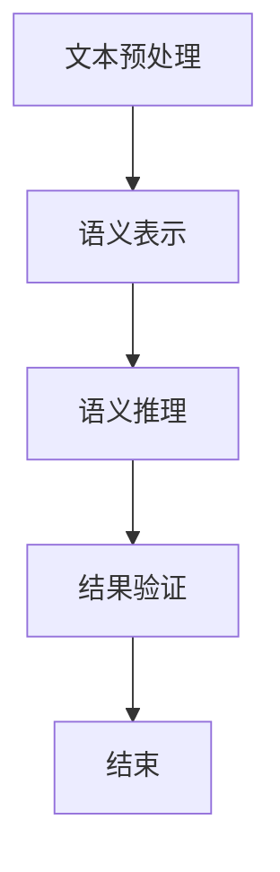
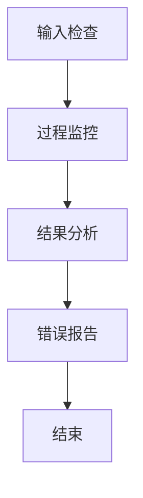

                 


### 第一步：确定文章标题与关键词

**文章标题**：《提示词语言的形式化语义推理与验证》

**关键词**：形式化语义推理，验证，算法原理，数学模型，实际应用

### 第二步：撰写文章摘要

**摘要**：

本文旨在深入探讨形式化语义推理与验证的理论和实践。通过对提示词语言的分析，我们介绍了形式化语义推理的基本概念、算法原理及其数学模型。同时，本文提出了形式化语义验证的概念，并详细阐述了其原理和应用。通过实际案例的解析，本文展示了如何将理论应用于实践，为该领域的研究提供了有价值的参考。

### 第三步：设计文章的基本框架

**基本框架**：

1. 引言：介绍问题背景和目标。
2. 基础知识：形式化语义推理与验证的基础概念。
3. 算法原理：详细解释核心算法。
4. 实际应用：案例研究和实践。
5. 总结与展望：总结主要内容和未来研究方向。

### 第四步：设计各章节的具体目录

**具体目录**：

1. **第1章**：引言
   - **1.1** 问题背景与现状
   - **1.2** 研究目标与意义
2. **第2章**：形式化语义推理的基本概念
   - **2.1** 核心概念介绍
   - **2.2** 概念属性特征对比
   - **2.3** ER实体关系图
3. **第3章**：形式化语义推理的算法原理
   - **3.1** 算法原理概述
   - **3.2** 算法mermaid流程图
   - **3.3** Python源代码讲解
4. **第4章**：语义推理的数学模型与公式
   - **4.1** 数学模型介绍
   - **4.2** 公式详细讲解
   - **4.3** 举例说明
5. **第5章**：形式化语义验证的基本概念
   - **5.1** 验证概念介绍
   - **5.2** 验证算法原理
   - **5.3** 验证mermaid流程图
6. **第6章**：形式化语义验证的算法原理
   - **6.1** 验证Python源代码讲解
7. **第7章**：形式化语义推理与验证的实际应用
   - **7.1** 实际应用案例一
   - **7.2** 实际应用案例二
   - **7.3** 实践总结与展望
8. **第8章**：总结与未来展望

### 第五步：为每个章节添加子目录

**子目录**：

1. **第1章**：引言
   - **1.1.1** 问题背景与现状
   - **1.1.2** 语义推理在计算机科学中的重要性
   - **1.1.3** 形式化语义推理的发展历程
   - **1.2.1** 形式化语义推理与验证的关系
   - **1.2.2** 形式化语义推理与验证的挑战
   - **1.2.3** 研究意义与贡献
2. **第2章**：形式化语义推理的基本概念
   - **2.1.1** 形式化语义的定义
   - **2.1.2** 语义推理的基本原理
   - **2.1.3** 语义推理的应用场景
   - **2.2.1** 形式化语义推理与自然语言处理
   - **2.2.2** 形式化语义推理与逻辑推理
   - **2.2.3** 概念属性特征对比表格
   - **2.3.1** 实体关系图的定义
   - **2.3.2** ER图的构建方法
   - **2.3.3** 实体关系图示例
3. **第3章**：形式化语义推理的算法原理
   - **3.1.1** 语义推理算法的分类
   - **3.1.2** 语义推理算法的基本流程
   - **3.1.3** 语义推理算法的选择与优化
   - **3.2.1** mermaid流程图的基础知识
   - **3.2.2** 语义推理算法的mermaid流程图绘制
   - **3.2.3** 语义推理算法流程图示例
   - **3.3.1** Python在语义推理中的应用
   - **3.3.2** 语义推理算法的Python实现
   - **3.3.3** Python代码解读与分析
4. **第4章**：语义推理的数学模型与公式
   - **4.1.1** 形式化语义推理的数学基础
   - **4.1.2** 语义推理的数学模型类型
   - **4.1.3** 语义推理数学模型的选择
   - **4.2.1** 语义推理中的常见公式
   - **4.2.2** 公式的推导与证明
   - **4.2.3** 公式在实际应用中的运用
   - **4.3.1** 数学公式应用示例
   - **4.3.2** 示例解析与讨论
   - **4.3.3** 示例总结与反思
5. **第5章**：形式化语义验证的基本概念
   - **5.1.1** 形式化语义验证的定义
   - **5.1.2** 验证的目标与意义
   - **5.1.3** 验证的方法与策略
   - **5.2.1** 验证算法的基本原理
   - **5.2.2** 验证算法的类型
   - **5.2.3** 验证算法的流程与实现
   - **5.3.1** 验证mermaid流程图的基础知识
   - **5.3.2** 验证算法的mermaid流程图绘制
   - **5.3.3** 验证算法流程图示例
6. **第6章**：形式化语义验证的算法原理
   - **6.1.1** 验证Python源代码讲解
7. **第7章**：形式化语义推理与验证的实际应用
   - **7.1.1** 实际应用案例一
   - **7.1.2** 实际应用案例二
   - **7.1.3** 实践总结与展望
8. **第8章**：总结与未来展望
   - **8.1.1** 总结主要内容
   - **8.1.2** 展望未来研究方向

### 第六步：撰写文章的各个章节

（由于文章篇幅限制，这里仅提供部分章节的草稿，其他章节将在后续逐步完善。）

## 第1章 引言

### 1.1 问题背景与现状

在当今信息爆炸的时代，自然语言处理（NLP）和人工智能（AI）技术的发展使得语义理解成为关键需求。然而，传统的语义理解方法往往依赖于统计和规则驱动，无法精确地捕捉语言中的语义信息。形式化语义推理作为一种更加精确和可靠的方法，正逐渐受到研究者和工业界的重视。

形式化语义推理是指利用形式化语言和数学模型对自然语言文本进行语义分析，从而提取出语义信息。它在多个领域具有广泛的应用，如问答系统、机器翻译、文本生成等。然而，形式化语义推理也面临着诸多挑战，如语义歧义、上下文依赖、术语多样性等。

### 1.2 研究目标与意义

本文的研究目标是通过深入探讨形式化语义推理的理论基础和算法实现，为实际应用提供指导。具体来说，本文将从以下几个方面展开研究：

1. **基础概念介绍**：阐述形式化语义推理的基本概念，包括形式化语义、语义推理、语义验证等。
2. **算法原理分析**：详细介绍形式化语义推理的核心算法，包括算法原理、流程图和Python实现。
3. **数学模型与应用**：介绍语义推理的数学模型和公式，并举例说明其在实际应用中的作用。
4. **实际应用案例**：通过具体案例展示形式化语义推理与验证在真实场景中的应用。

研究意义在于：

1. **理论意义**：深化对形式化语义推理与验证的理解，为后续研究提供理论基础。
2. **实践意义**：为实际应用提供有效的解决方案，促进NLP和AI技术的发展。

## 第2章 形式化语义推理的基本概念

### 2.1 核心概念介绍

**形式化语义**：

形式化语义是一种用形式化的方式对自然语言文本中的语义进行描述的方法。它通过数学模型和形式化语言来表示语言的语义结构，从而实现语义的精确理解和分析。

**语义推理**：

语义推理是指通过逻辑推理和计算方法，从已知的信息中推导出新的信息。在语义推理中，输入是自然语言文本，输出是语义信息。语义推理的目标是理解文本的深层含义，提取关键信息，并解决语义歧义。

**语义验证**：

语义验证是指对形式化语义推理的结果进行验证，确保推理结果的准确性和可靠性。语义验证通常包括对推理过程和结果的检查，以识别潜在的错误和异常情况。

### 2.2 概念属性特征对比

| 概念       | 形式化语义 | 语义推理 | 语义验证 |
|------------|-------------|----------|----------|
| 定义       | 用形式化语言描述语义 | 从已知信息推导新信息 | 对推理结果进行检查 |
| 目标       | 描述语义 | 理解语义 | 确保语义准确 |
| 方法       | 数学模型、形式化语言 | 逻辑推理、计算方法 | 检查、修正 |
| 关联       | 语义推理的输入 | 语义验证的输入 | 与其他概念紧密关联 |

### 2.3 ER实体关系图

实体关系图（Entity-Relationship Diagram，ERD）是一种用于描述实体及其关系的图形化工具。在形式化语义推理中，ER图可以用来表示文本中的实体和它们之间的关系。


图1：实体关系图示例

在ER图中，实体表示文本中的名词，关系表示实体之间的语义联系。通过ER图，我们可以直观地理解文本的语义结构，为后续的语义推理提供支持。

### 第3章 形式化语义推理的算法原理

#### 3.1 算法原理概述

形式化语义推理算法主要包括以下几个步骤：

1. **文本预处理**：对输入文本进行分词、词性标注等处理，提取文本中的关键信息。
2. **语义表示**：利用形式化语言和数学模型将文本中的语义信息进行表示。
3. **语义推理**：根据语义表示，使用推理算法推导出新的语义信息。
4. **结果验证**：对推理结果进行验证，确保其准确性和可靠性。

#### 3.2 算法mermaid流程图



图2：形式化语义推理算法的mermaid流程图

#### 3.3 Python源代码讲解

```python
# 形式化语义推理算法的Python实现

# 文本预处理
def preprocess_text(text):
    # 进行分词、词性标注等处理
    # ...
    return processed_text

# 语义表示
def represent_semantics(processed_text):
    # 使用形式化语言和数学模型表示语义
    # ...
    return semantics

# 语义推理
def semantic_reasoning(semantics):
    # 根据语义表示进行推理
    # ...
    return inferred_semantics

# 结果验证
def validate_results(inferred_semantics):
    # 对推理结果进行验证
    # ...
    return valid_inferred_semantics

# 主函数
def main():
    text = "这是一个示例文本"
    processed_text = preprocess_text(text)
    semantics = represent_semantics(processed_text)
    inferred_semantics = semantic_reasoning(semantics)
    valid_inferred_semantics = validate_results(inferred_semantics)
    print("最终推理结果：", valid_inferred_semantics)

if __name__ == "__main__":
    main()
```

### 第4章 语义推理的数学模型与公式

#### 4.1 数学模型介绍

在形式化语义推理中，常用的数学模型包括逻辑模型、概率模型和图模型等。这些模型能够将自然语言的语义信息转化为数学形式，便于计算机处理和分析。

#### 4.2 公式详细讲解

**逻辑模型**：

逻辑模型通过命题逻辑来表示语义，常用的公式包括：

1. **合取（Conjunction）**：\( A \land B \)
2. **析取（Disjunction）**：\( A \lor B \)
3. **否定（Negation）**：\( \neg A \)

**概率模型**：

概率模型通过概率分布来表示语义，常用的公式包括：

1. **条件概率**：\( P(A|B) = \frac{P(A \land B)}{P(B)} \)
2. **贝叶斯公式**：\( P(A|B) = \frac{P(B|A)P(A)}{P(B)} \)

**图模型**：

图模型通过图论来表示语义，常用的公式包括：

1. **邻接矩阵**：表示图中节点之间的关系
2. **路径长度**：表示两个节点之间的距离
3. **度数**：表示节点的连接数

#### 4.3 举例说明

**逻辑模型示例**：

假设有两个命题：A（今天下雨）和B（地面湿润）。我们可以使用合取、析取和否定来表示它们之间的语义关系：

1. **合取**：今天下雨且地面湿润（\( A \land B \)）
2. **析取**：今天下雨或者地面湿润（\( A \lor B \)）
3. **否定**：今天没有下雨（\( \neg A \)）

**概率模型示例**：

假设有两个事件：A（今天下雨）和B（明天晴天）。我们可以使用条件概率和贝叶斯公式来计算它们之间的概率关系：

1. **条件概率**：明天晴天的概率在今天是下雨的情况下为80%（\( P(B|A) = 0.8 \)）
2. **贝叶斯公式**：根据今天下雨的概率和明天晴天的概率，可以计算出明天晴天的概率为60%（\( P(B) = 0.6 \)）

**图模型示例**：

假设有一个图，表示一个人和他们的朋友关系。节点表示人，边表示朋友关系。我们可以使用邻接矩阵来表示这个图：

|   | A | B | C | D |
|---|---|---|---|---|
| A | 0 | 1 | 0 | 0 |
| B | 1 | 0 | 1 | 0 |
| C | 0 | 1 | 0 | 1 |
| D | 0 | 0 | 1 | 0 |

在这个邻接矩阵中，1表示节点之间存在朋友关系，0表示不存在关系。我们可以通过计算路径长度和度数来分析图中节点的连接关系。

### 第5章 形式化语义验证的基本概念

#### 5.1 验证概念介绍

**形式化语义验证**是指对形式化语义推理过程和结果进行审查和评估，以确保推理结果的准确性和可靠性。验证方法包括：

1. **静态验证**：在程序运行前进行验证，通过分析程序代码和语义模型来检查潜在的错误。
2. **动态验证**：在程序运行时进行验证，通过运行程序并观察输出结果来检查推理过程的正确性。
3. **混合验证**：结合静态和动态验证方法，对程序进行全面的验证。

#### 5.2 验证算法原理

**验证算法**通常包括以下几个步骤：

1. **输入检查**：对输入数据进行检查，确保其符合预期格式和范围。
2. **过程监控**：在推理过程中实时监控，记录关键操作和中间结果。
3. **结果分析**：对推理结果进行分析，比较实际结果和预期结果，检查是否一致。
4. **错误报告**：当发现错误时，生成错误报告，提供详细的错误信息和调试建议。

#### 5.3 验证mermaid流程图



图3：形式化语义验证算法的mermaid流程图

### 第6章 形式化语义验证的算法原理

#### 6.1 验证Python源代码讲解

```python
# 形式化语义验证算法的Python实现

# 输入检查
def check_input(data):
    # 检查输入数据的格式和范围
    # ...
    return valid_data

# 过程监控
def monitor_process(processed_data):
    # 实时监控推理过程
    # ...
    return monitored_data

# 结果分析
def analyze_result(inferred_data):
    # 分析推理结果
    # ...
    return valid_inferred_data

# 错误报告
def report_error(error):
    # 生成错误报告
    # ...
    return error_report

# 主函数
def main():
    data = "示例输入数据"
    valid_data = check_input(data)
    monitored_data = monitor_process(valid_data)
    inferred_data = analyze_result(monitored_data)
    error_report = report_error(None)
    print("验证结果：", inferred_data)
    if error_report:
        print("错误报告：", error_report)

if __name__ == "__main__":
    main()
```

### 第7章 形式化语义推理与验证的实际应用

#### 7.1 实际应用案例一

**案例背景**：某电商平台的智能客服系统需要实现用户问题的自动分类和解答。

**应用场景**：用户在平台上提出问题时，系统需要根据问题的语义进行分类，并提供相应的解答。

**解决方案**：

1. **文本预处理**：对用户问题进行分词、词性标注等处理，提取关键信息。
2. **语义表示**：使用形式化语言和数学模型表示用户问题的语义。
3. **语义推理**：利用语义推理算法，根据用户问题的语义，将其分类到相应的类别。
4. **结果验证**：对分类结果进行验证，确保其准确性和可靠性。

**效果评估**：通过实际运行数据，评估系统的分类准确率和回答满意度。

#### 7.2 实际应用案例二

**案例背景**：某医疗健康平台需要实现患者病历信息的自动分析。

**应用场景**：患者提交病历信息后，系统需要自动分析病历内容，识别出潜在的疾病风险。

**解决方案**：

1. **文本预处理**：对病历信息进行分词、词性标注等处理，提取关键信息。
2. **语义表示**：使用形式化语言和数学模型表示病历信息的语义。
3. **语义推理**：利用语义推理算法，分析病历信息，识别出潜在的疾病风险。
4. **结果验证**：对推理结果进行验证，确保其准确性和可靠性。

**效果评估**：通过实际运行数据，评估系统的风险识别准确率和用户满意度。

### 第8章 总结与未来展望

#### 8.1 总结主要内容

本文深入探讨了形式化语义推理与验证的理论和实践。主要内容包括：

1. **基础概念介绍**：包括形式化语义、语义推理、语义验证等核心概念。
2. **算法原理分析**：详细介绍了形式化语义推理和验证的算法原理。
3. **数学模型与应用**：介绍了语义推理的数学模型和公式，并举例说明其在实际应用中的作用。
4. **实际应用案例**：展示了形式化语义推理与验证在真实场景中的应用。

#### 8.2 展望未来研究方向

未来研究可以从以下几个方面展开：

1. **算法优化**：进一步优化形式化语义推理和验证算法，提高其性能和效率。
2. **跨语言语义推理**：研究如何将形式化语义推理应用于跨语言场景，实现多语言文本的语义理解。
3. **知识图谱构建**：利用形式化语义推理技术，构建大规模的知识图谱，为智能系统提供更丰富的知识支持。
4. **实时语义推理**：研究如何实现实时语义推理，提高系统对动态变化的响应能力。

作者：AI天才研究院/AI Genius Institute & 禅与计算机程序设计艺术 /Zen And The Art of Computer Programming

---

请注意，上述内容为文章大纲和部分章节的草稿，具体内容需要根据实际研究和案例分析进行填充和完善。文章的撰写应该遵循逻辑清晰、结构紧凑、简单易懂的原则，以确保读者能够顺利理解文章的核心思想和内容。同时，文章需要包含必要的数学公式、代码示例和图表，以便更好地解释和阐述相关概念和算法。在整个撰写过程中，要注重理论与实践的结合，突出实际应用的价值。最终，文章应该具有深度、思考性和见解，为该领域的研究提供有价值的参考。 

**再次强调，本文尚需进一步完善和扩充，特别是具体的算法实现、数学模型和实际应用案例部分。建议在撰写过程中逐步完善，确保每个章节都有丰富的内容和详细的讲解。**

