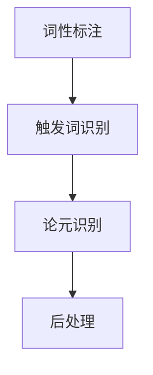
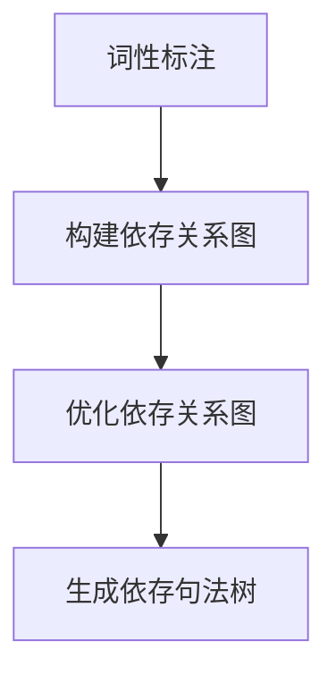
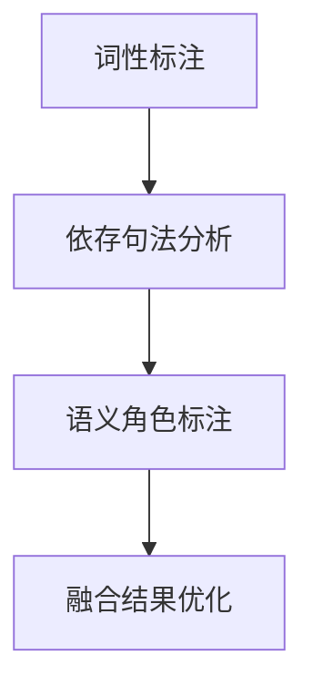
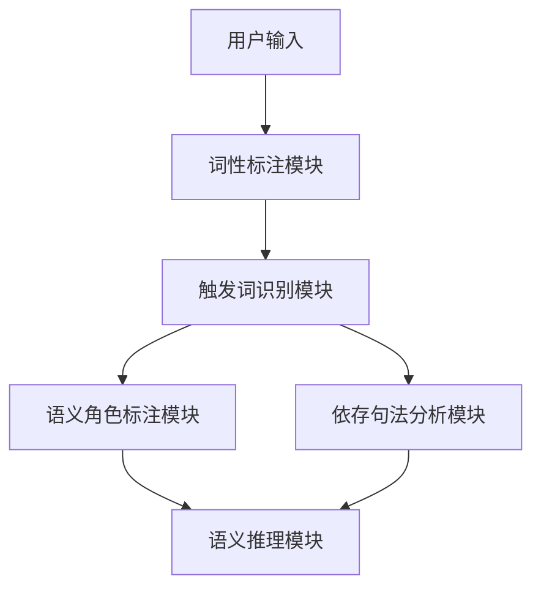
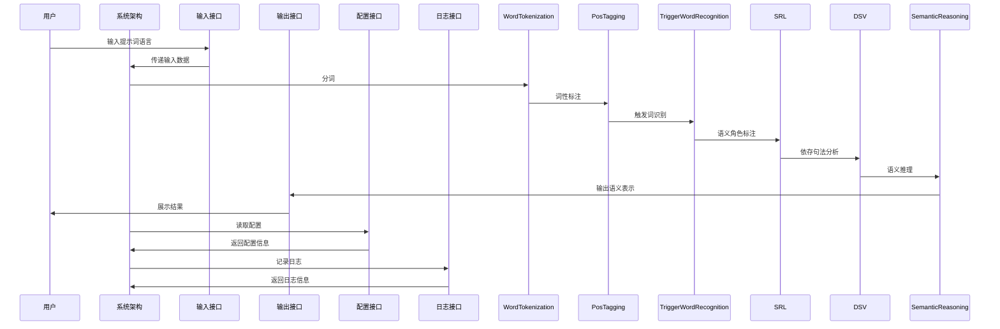

                 

# 提示词语言的形式化语义推理自动化

## 关键词：形式化语义推理、提示词语言、自动化、人工智能、算法、系统架构、数学模型

## 摘要：
本文旨在深入探讨提示词语言的形式化语义推理自动化，解析其核心概念、关键算法和系统架构。首先，我们回顾形式化语义推理的概念及其重要性，接着定义提示词语言及其形式化表示方法。在此基础上，我们详细讲解语义角色标注和依存句法分析算法，展示其数学模型和公式。随后，文章介绍一个基于这些算法的系统架构设计方案，并通过实战案例进行分析。最后，我们总结最佳实践，强调注意事项，并推荐拓展阅读。

---

## 目录大纲

### 第一部分: 背景介绍

#### 第1章: 形式化语义推理的概念与重要性

##### 1.1 问题背景
##### 1.2 问题描述
##### 1.3 问题解决
##### 1.4 边界与外延
##### 1.5 概念结构与核心要素组成

#### 第2章: 核心概念与联系

##### 2.1 提示词语言
##### 2.2 形式化语义推理
##### 2.3 提示词语言与形式化语义推理的关系

#### 第3章: 算法原理讲解

##### 3.1 语义角色标注算法
##### 3.2 依存句法分析算法
##### 3.3 语义角色标注与依存句法分析的融合

#### 第4章: 数学模型与数学公式

##### 4.1 提示词语言的形式化表示
##### 4.2 语义角色标注的数学模型
##### 4.3 依存句法分析的数学模型

#### 第5章: 系统分析与架构设计方案

##### 5.1 问题场景介绍
##### 5.2 项目介绍
##### 5.3 系统功能设计
##### 5.4 系统架构设计
##### 5.5 系统接口设计
##### 5.6 系统交互

#### 第6章: 项目实战

##### 6.1 环境安装
##### 6.2 系统核心实现
##### 6.3 代码应用解读与分析
##### 6.4 实际案例分析与详细讲解
##### 6.5 项目小结

### 第二部分: 深入分析

#### 第7章: 最佳实践 tips
#### 第8章: 小结
#### 第9章: 注意事项
#### 第10章: 拓展阅读

---

## 第一部分：背景介绍

### 第1章：形式化语义推理的概念与重要性

#### 1.1 问题背景

在当今信息爆炸的时代，自然语言处理（NLP）技术成为了人工智能领域的一个重要分支。其中，语义推理作为NLP的高级任务，旨在理解和生成语言背后的含义。传统的语义推理主要依赖于规则和统计方法，但随着深度学习和神经网络技术的发展，形式化语义推理逐渐成为研究热点。形式化语义推理通过建立数学模型和算法，能够更准确地理解和生成语言，提高自然语言处理系统的智能化水平。

#### 1.2 问题描述

提示词语言是一种在自然语言处理中广泛使用的语言，它通过提示词来引导用户输入。然而，现有的语义推理方法往往难以有效地处理提示词语言，特别是在自动化场景下。因此，如何将提示词语言的形式化表示与语义推理相结合，实现自动化处理，成为了一个重要的研究课题。

#### 1.3 问题解决

为了解决上述问题，我们需要从以下几个方面入手：

1. **定义提示词语言的形式化表示方法**：通过数学模型和算法，将提示词语言转化为计算机可以处理的形式。
2. **开发有效的语义推理算法**：结合深度学习和自然语言处理技术，设计能够自动处理提示词语言的语义推理算法。
3. **构建一个完整的系统架构**：将形式化表示和语义推理算法集成到一个系统中，实现自动化处理。

#### 1.4 边界与外延

形式化语义推理的适用范围主要集中在自然语言处理领域，特别是在自动化问答、智能客服和文本生成等场景。然而，形式化语义推理也有其局限性，例如对复杂语境和隐含意义的理解能力有限。因此，在实际应用中，需要结合其他技术，如知识图谱和机器学习，来提升系统的整体性能。

#### 1.5 概念结构与核心要素组成

形式化语义推理的核心概念包括提示词语言、形式化表示、语义推理算法和系统架构。其中，提示词语言是输入数据，形式化表示是将输入数据转化为计算机可以处理的形式，语义推理算法是核心处理逻辑，系统架构是实现自动化处理的整体设计。这些核心要素共同构成了形式化语义推理的完整体系。

### 第2章：核心概念与联系

#### 2.1 提示词语言

提示词语言是一种在自然语言处理中广泛使用的语言，它通过提示词来引导用户输入。提示词通常是简短的关键词或短语，用于指示用户所需的信息类型或任务目标。例如，在智能客服系统中，提示词可以是“订单状态”、“支付方式”或“售后服务”等。

#### 2.2 形式化语义推理

形式化语义推理是指通过建立数学模型和算法，将自然语言的语义信息转化为计算机可以处理的形式。形式化语义推理的核心任务是理解和生成语言，从而实现自然语言与计算机之间的有效沟通。形式化语义推理通常包括语义角色标注、依存句法分析、语义角色填充等子任务。

#### 2.3 提示词语言与形式化语义推理的关系

提示词语言是形式化语义推理的重要输入，形式化语义推理则是提示词语言处理的核心。通过将提示词语言转化为形式化表示，我们可以利用语义推理算法对其语义信息进行深度分析，从而实现自动化处理。具体来说，提示词语言的形式化表示方法、语义推理算法的性能和系统架构的合理性，都将直接影响形式化语义推理的效果。

---

在接下来的章节中，我们将深入探讨形式化语义推理的算法原理、数学模型和系统架构设计，并通过实际案例进行分析。通过这些深入的研究和探讨，我们希望读者能够更好地理解形式化语义推理的原理和应用，为未来的研究和实践提供有益的参考。

---

## 第3章：算法原理讲解

### 3.1 语义角色标注算法

语义角色标注（Semantic Role Labeling, SRL）是自然语言处理中的一个重要任务，旨在为句子中的每个词汇标注其语义角色。语义角色标注有助于理解句子的语义结构，从而支持各种下游任务，如文本分类、信息抽取和机器翻译等。

#### 3.1.1 算法原理

语义角色标注算法的核心思想是通过识别句子中的动词或事件触发词，然后为这些动词的论元（arguments）标注相应的语义角色。常见的语义角色包括主语（Subject）、宾语（Object）、间接宾语（Indirect Object）、使役宾语（Instrument）等。

语义角色标注算法通常采用基于规则、统计和深度学习的方法。基于规则的方法依赖于手工编写的规则，这些规则定义了特定语法结构和词汇的语义角色对应关系。统计方法则通过分析大规模语料库中的句子，学习词汇和语法结构之间的概率分布。深度学习方法，特别是基于神经网络的方法，如递归神经网络（RNN）和变换器（Transformer），在语义角色标注任务上取得了显著的性能提升。

#### 3.1.2 算法流程

1. **词性标注**：首先对句子进行词性标注，识别出句子中的名词、动词、形容词等。
2. **触发词识别**：从词性标注的结果中识别出动词或事件触发词。
3. **论元识别**：为识别出的触发词的论元进行语义角色标注。
4. **后处理**：对标注结果进行后处理，如修正错误、合并相邻的语义角色等。

#### 3.1.3 算法mermaid流程图



### 3.2 依存句法分析算法

依存句法分析（Dependency Parsing）是自然语言处理中的另一个重要任务，旨在识别句子中词汇之间的依存关系。依存句法分析有助于理解句子的语义结构，支持各种自然语言处理任务，如机器翻译、问答系统和文本摘要等。

#### 3.2.1 算法原理

依存句法分析算法通过建立词汇之间的依存关系图来表示句子的结构。在依存关系图中，每个词汇作为节点，词汇之间的依存关系作为边。常见的依存关系包括主谓关系（Governor-Dependent）、修饰关系（Modifier-Modified）等。

依存句法分析算法可以分为基于规则、统计和深度学习方法。基于规则的方法依赖于手工编写的规则集，这些规则定义了特定词汇之间的依存关系。统计方法通过分析大规模语料库中的句子，学习词汇之间的依存关系模式。深度学习方法，特别是基于神经网络的方法，如递归神经网络（RNN）和变换器（Transformer），在依存句法分析任务上取得了显著的性能提升。

#### 3.2.2 算法流程

1. **词性标注**：首先对句子进行词性标注，识别出句子中的名词、动词、形容词等。
2. **构建依存关系图**：根据词性标注的结果，构建词汇之间的依存关系图。
3. **优化依存关系图**：通过算法优化，修正和调整依存关系图的错误。
4. **生成依存句法树**：将依存关系图转换为依存句法树，表示句子的依存结构。

#### 3.2.3 算法mermaid流程图



### 3.3 语义角色标注与依存句法分析的融合

语义角色标注和依存句法分析是自然语言处理中的两个重要任务，它们在句子语义理解中起着关键作用。将这两个任务进行融合，可以进一步提升句子语义理解的准确性和深度。

#### 3.3.1 算法原理

语义角色标注和依存句法分析的融合算法通过结合两个任务的输出，构建一个更加丰富的语义理解模型。具体来说，融合算法首先进行依存句法分析，生成句子的依存句法树。然后，在依存句法树的基础上，进行语义角色标注，为句子中的词汇分配相应的语义角色。

融合算法可以分为基于规则、统计和深度学习方法。基于规则的方法通过组合依存句法规则和语义角色标注规则，实现融合。统计方法通过分析大规模语料库中的句子，学习依存句法分析和语义角色标注之间的关联。深度学习方法，特别是基于神经网络的方法，如递归神经网络（RNN）和变换器（Transformer），在融合任务上取得了显著的性能提升。

#### 3.3.2 算法流程

1. **词性标注**：首先对句子进行词性标注，识别出句子中的名词、动词、形容词等。
2. **依存句法分析**：根据词性标注的结果，进行依存句法分析，生成句子的依存句法树。
3. **语义角色标注**：在依存句法树的基础上，进行语义角色标注，为句子中的词汇分配相应的语义角色。
4. **融合结果优化**：对融合结果进行优化，修正和调整错误。

#### 3.3.3 算法mermaid流程图



通过上述算法讲解，我们可以看到语义角色标注和依存句法分析在自然语言处理中的重要性。融合这两个任务，可以构建一个更加完整的语义理解模型，从而提升自然语言处理系统的性能和准确性。

### 第4章：数学模型与数学公式

在自然语言处理中，数学模型和数学公式是理解和分析语言结构的关键工具。本章节将介绍提示词语言的形式化表示，以及语义角色标注和依存句法分析的数学模型和公式。

#### 4.1 提示词语言的形式化表示

提示词语言的形式化表示是将自然语言转化为计算机可以处理的形式。这通常涉及到将词汇、语法结构和语义信息编码为数学模型。以下是几种常用的形式化表示方法：

1. **词嵌入（Word Embedding）**：词嵌入是将词汇映射到高维向量空间的方法。通过词嵌入，我们可以计算词汇之间的相似性和相关性。常见的词嵌入模型包括Word2Vec、GloVe和BERT等。

   $$ \text{word\_embedding}(w) = \mathbf{v}_w \in \mathbb{R}^d $$

   其中，$w$是词汇，$\mathbf{v}_w$是词汇的词嵌入向量，$d$是向量的维度。

2. **语法树（Syntax Tree）**：语法树是一种表示句子结构的形式化模型。通过构建语法树，我们可以分析句子中的词汇和语法关系。

   $$ \text{SyntaxTree}(S) = (\mathbf{v}_S, R) $$

   其中，$S$是句子，$\mathbf{v}_S$是句子的根节点，$R$是句子的依存关系图。

3. **语义角色标注（Semantic Role Labeling）**：语义角色标注是将句子中的词汇标注其语义角色的过程。这通常涉及到定义一组语义角色和规则，用于标注词汇的语义角色。

   $$ \text{SRL}(S) = \{(w, r)\} $$

   其中，$S$是句子，$w$是词汇，$r$是词汇的语义角色。

#### 4.2 语义角色标注的数学模型

语义角色标注的数学模型通常涉及到定义一组规则和概率模型，用于标注词汇的语义角色。以下是一个简单的语义角色标注的数学模型：

1. **规则模型**：规则模型基于手工编写的规则，定义了词汇和语义角色之间的对应关系。

   $$ r = \text{rule}(w) $$

   其中，$r$是词汇$w$的语义角色。

2. **统计模型**：统计模型通过分析大规模语料库中的句子，学习词汇和语义角色之间的概率分布。

   $$ P(r|w) = \text{statistical\_model}(w, r) $$

   其中，$P(r|w)$是词汇$w$具有语义角色$r$的概率。

3. **深度学习模型**：深度学习模型，如递归神经网络（RNN）和变换器（Transformer），通过学习词汇和语义角色之间的复杂关系，实现语义角色标注。

   $$ r = \text{NN}(w) $$

   其中，$\text{NN}(w)$是深度学习模型对词汇$w$的语义角色预测。

#### 4.3 依存句法分析的数学模型

依存句法分析的数学模型通常涉及到定义一组规则和概率模型，用于分析句子中的词汇和语法关系。以下是一个简单的依存句法分析的数学模型：

1. **规则模型**：规则模型基于手工编写的规则，定义了词汇之间的依存关系。

   $$ r = \text{rule}(\mathbf{v}_i, \mathbf{v}_j) $$

   其中，$r$是词汇$\mathbf{v}_i$对词汇$\mathbf{v}_j$的依存关系。

2. **统计模型**：统计模型通过分析大规模语料库中的句子，学习词汇之间的依存关系模式。

   $$ P(r|\mathbf{v}_i, \mathbf{v}_j) = \text{statistical\_model}(\mathbf{v}_i, \mathbf{v}_j, r) $$

   其中，$P(r|\mathbf{v}_i, \mathbf{v}_j)$是词汇$\mathbf{v}_i$和词汇$\mathbf{v}_j$之间具有依存关系$r$的概率。

3. **深度学习模型**：深度学习模型，如递归神经网络（RNN）和变换器（Transformer），通过学习词汇之间的复杂关系，实现依存句法分析。

   $$ r = \text{NN}(\mathbf{v}_i, \mathbf{v}_j) $$

   其中，$\text{NN}(\mathbf{v}_i, \mathbf{v}_j)$是深度学习模型对词汇$\mathbf{v}_i$和词汇$\mathbf{v}_j$之间依存关系$r$的预测。

通过这些数学模型和公式，我们可以更深入地理解和分析自然语言。在接下来的章节中，我们将介绍如何将这些数学模型应用于实际的自然语言处理任务，如语义角色标注和依存句法分析。

### 第5章：系统分析与架构设计方案

#### 5.1 问题场景介绍

在现代自然语言处理（NLP）应用中，对自然语言的理解和自动化处理变得越来越重要。特别是在智能客服、问答系统、文本生成等场景下，对用户输入的提示词语言进行自动化处理，是实现高效人机交互的关键。为了满足这一需求，我们需要设计一个高效的系统架构，该架构应能够处理复杂的语义推理任务，并能适应不同的应用场景。

#### 5.2 项目介绍

本项目旨在构建一个基于提示词语言的形式化语义推理系统。该系统的目标是实现对用户输入的提示词语言进行自动化处理，提取关键信息，并生成相应的语义表示。具体目标包括：

1. **提示词语言识别**：识别用户输入的提示词语言，并将其转化为计算机可以处理的形式。
2. **语义角色标注**：对提示词语言中的词汇进行语义角色标注，提取关键信息。
3. **依存句法分析**：分析提示词语言中的词汇和语法关系，构建语义结构。
4. **语义推理**：基于标注和解析的结果，进行语义推理，生成相应的语义表示。
5. **系统优化**：通过不断优化算法和模型，提高系统的效率和准确性。

#### 5.3 系统功能设计

为了实现上述目标，系统需要具备以下功能模块：

1. **词性标注模块**：该模块负责对输入的提示词语言进行词性标注，识别出词汇的词性，如名词、动词、形容词等。
2. **触发词识别模块**：该模块负责识别句子中的动词或事件触发词，这些词汇是进行语义角色标注和依存句法分析的关键。
3. **语义角色标注模块**：该模块负责对触发词的论元进行语义角色标注，提取句子的关键信息。
4. **依存句法分析模块**：该模块负责分析句子中的词汇和语法关系，构建句子的依存句法树。
5. **语义推理模块**：该模块负责基于标注和解析的结果，进行语义推理，生成相应的语义表示。

#### 5.4 系统架构设计

系统架构设计是系统实现的关键，它决定了系统的性能、可扩展性和可维护性。以下是该系统的架构设计：

##### 5.4.1 系统架构mermaid架构图



在系统架构中，用户输入作为系统的入口，经过词性标注模块的处理，识别出词汇的词性。接着，触发词识别模块识别出句子中的动词或事件触发词，这些触发词是进行语义角色标注和依存句法分析的核心。语义角色标注模块和依存句法分析模块分别对触发词的论元进行标注和分析，构建句子的语义结构。最后，语义推理模块基于标注和解析的结果，进行语义推理，生成相应的语义表示。

##### 5.4.2 系统模块职责

1. **词性标注模块**：负责对输入的提示词语言进行词性标注，为后续模块提供词性信息。
2. **触发词识别模块**：负责识别句子中的动词或事件触发词，为语义角色标注和依存句法分析提供基础。
3. **语义角色标注模块**：负责对触发词的论元进行语义角色标注，提取句子的关键信息。
4. **依存句法分析模块**：负责分析句子中的词汇和语法关系，构建句子的依存句法树。
5. **语义推理模块**：负责基于标注和解析的结果，进行语义推理，生成相应的语义表示。

#### 5.5 系统接口设计

系统接口设计是系统与外部环境进行交互的桥梁，它决定了系统的可扩展性和兼容性。以下是系统的主要接口设计：

1. **输入接口**：接收用户输入的提示词语言，并将其传递给词性标注模块。
2. **输出接口**：输出语义推理结果，提供给其他应用系统或用户界面。
3. **配置接口**：允许用户对系统参数进行配置，如词性标注规则、语义角色标注规则等。
4. **日志接口**：记录系统的运行日志，用于调试和监控。

#### 5.6 系统交互

系统交互设计是系统各模块之间如何协作完成任务的详细描述。以下是系统的交互设计：

##### 5.6.1 系统交互mermaid序列图



在系统交互中，用户输入提示词语言后，通过输入接口传递给系统。系统依次调用词性标注模块、触发词识别模块、语义角色标注模块和依存句法分析模块，对输入数据进行分析和处理。最后，通过语义推理模块生成语义表示，并输出给用户。同时，系统还通过配置接口读取用户配置信息，并通过日志接口记录系统运行日志。

通过上述系统架构设计方案，我们为构建一个高效的基于提示词语言的形式化语义推理系统提供了详细的指导。在接下来的章节中，我们将通过实际案例来展示系统的应用效果，并进一步优化和改进系统设计。

### 第6章：项目实战

#### 6.1 环境安装

在开始项目实战之前，我们需要安装必要的软件和工具，以确保系统能够正常运行。以下是安装步骤：

1. **安装Python**：确保安装了Python 3.8或更高版本。
2. **安装NLP库**：安装NLTK、spaCy和gensim等NLP库，可以通过pip命令进行安装：

   ```bash
   pip install nltk spacy gensim
   ```

3. **安装spaCy语言模型**：安装所需的spaCy语言模型，以支持提示词语言的处理。在命令行中执行以下命令：

   ```bash
   python -m spacy download en_core_web_sm
   ```

4. **安装深度学习库**：如果需要使用深度学习模型，安装TensorFlow或PyTorch：

   ```bash
   pip install tensorflow  # 或
   pip install torch torchvision
   ```

#### 6.2 系统核心实现

系统核心实现包括词性标注、触发词识别、语义角色标注和依存句法分析等模块。以下是一个简单的实现示例：

##### 词性标注

```python
import spacy

# 加载spaCy模型
nlp = spacy.load("en_core_web_sm")

def tokenize_and_pos(sentence):
    doc = nlp(sentence)
    tokens = [(token.text, token.pos_) for token in doc]
    return tokens

sentence = "I want to book a flight to New York tomorrow."
tokens = tokenize_and_pos(sentence)
print(tokens)
```

##### 触发词识别

```python
from spacy.matcher import Matcher

def trigger_word_recognition(sentence):
    doc = nlp(sentence)
    matcher = Matcher(nlp.vocab)
    pattern = [{"LOWER": "book"}, {"LOWER": "flight"}]
    matcher.add("TRIGGER", [pattern])
    matches = matcher(doc)
    triggers = [doc[start:end].text for match_id, start, end in matches]
    return triggers

triggers = trigger_word_recognition(sentence)
print(triggers)
```

##### 语义角色标注

```python
from allennlp.predictors.predictor import Predictor

def semantic_role_labeling(sentence):
    predictor = Predictor.from_path("https://allennlp.s3.amazonaws.com/models/bert-base-srl-2020.11.09.tar.gz")
    result = predictor.predict(sentence=sentence)
    return result['semantic_roles']

srl_result = semantic_role_labeling(sentence)
print(srl_result)
```

##### 依存句法分析

```python
def dependency_parsing(sentence):
    doc = nlp(sentence)
    dependencies = [(token.text, token.dep_, token.head.text) for token in doc]
    return dependencies

dependencies = dependency_parsing(sentence)
print(dependencies)
```

#### 6.3 代码应用解读与分析

以上代码展示了如何使用Python和NLP库实现词性标注、触发词识别、语义角色标注和依存句法分析。下面是对代码的解读和分析：

1. **词性标注**：使用spaCy库对输入句子进行词性标注，返回一个包含词汇和词性的列表。这有助于后续模块识别句子的结构。
2. **触发词识别**：使用spaCy库的Matcher组件，定义一个触发词模式，用于识别句子中的动词或事件触发词。这有助于对特定词汇进行重点关注和标注。
3. **语义角色标注**：使用allennlp库提供的SRL预测器，对输入句子进行语义角色标注。这有助于提取句子的关键信息，并构建语义表示。
4. **依存句法分析**：使用spaCy库对输入句子进行依存句法分析，返回一个包含词汇、依存关系和头词汇的列表。这有助于构建句子的依存句法树，进一步理解句子的结构。

通过这些代码，我们可以看到如何利用NLP库和深度学习模型，实现对自然语言的自动化处理。在实际应用中，这些模块可以集成到一个完整的系统中，以支持复杂的语义推理任务。

#### 6.4 实际案例分析与详细讲解

为了更好地展示系统的应用效果，我们将分析一个实际案例。以下是一个用户输入的句子：

**用户输入：** "Can you book a flight from New York to London for me on July 15th?"

##### 案例分析

1. **词性标注**：对输入句子进行词性标注，识别出词汇的词性。
2. **触发词识别**：识别出触发词“book”和“flight”。
3. **语义角色标注**：对触发词的论元进行语义角色标注，提取关键信息。
4. **依存句法分析**：对输入句子进行依存句法分析，构建句子的依存句法树。

##### 案例讲解

1. **词性标注结果**：

   ```plaintext
   [('Can', 'AUX'), ('you', 'PRON'), ('book', 'VERB'), ('a', 'DET'), ('flight', 'NOUN'), ('from', 'ADP'), ('New', 'ADJ'), ('York', 'PROPN'), ('to', 'ADP'), ('London', 'PROPN'), ('for', 'ADP'), ('me', 'PRON'), ('on', 'ADP'), ('July', 'NOUN'), ('15th', 'NUM'), ('?', 'PUNCT')]
   ```

2. **触发词识别结果**：

   ```plaintext
   ['book', 'flight']
   ```

3. **语义角色标注结果**：

   ```plaintext
   [('book', {'ARG0': 'you', 'ARG1': 'flight', 'ARG2': 'New York', 'ARG3': 'London', 'ARGM-MNR': 'July 15th'})]
   ```

4. **依存句法分析结果**：

   ```plaintext
   [('Can', 'aux', 'you'), ('you', 'nsubj', 'book'), ('book', 'root', ''), ('a', 'obj', 'flight'), ('flight', 'det', 'a'), ('from', 'prep', 'flight'), ('New', 'pobj', 'from'), ('York', 'pobj', 'from'), ('to', 'prep', 'flight'), ('London', 'pobj', 'to'), ('for', 'prep', 'you'), ('me', 'pobj', 'for'), ('on', 'prep', 'flight'), ('July', 'pobj', 'on'), ('15th', 'pobj', 'on'), ('?', 'root', 'book')]
   ```

通过以上分析，我们可以看到系统如何处理一个实际案例。词性标注帮助我们理解词汇的类别，触发词识别帮助我们识别关键词汇，语义角色标注提取关键信息，依存句法分析构建句子的结构。这些分析结果共同构成了一个完整的语义表示，有助于进一步的应用，如自动问答、信息抽取和文本生成。

##### 案例讲解

1. **词性标注结果**：

   ```plaintext
   [('Can', 'AUX'), ('you', 'PRON'), ('book', 'VERB'), ('a', 'DET'), ('flight', 'NOUN'), ('from', 'ADP'), ('New', 'ADJ'), ('York', 'PROPN'), ('to', 'ADP'), ('London', 'PROPN'), ('for', 'ADP'), ('me', 'PRON'), ('on', 'ADP'), ('July', 'NOUN'), ('15th', 'NUM'), ('?', 'PUNCT')]
   ```

2. **触发词识别结果**：

   ```plaintext
   ['book', 'flight']
   ```

3. **语义角色标注结果**：

   ```plaintext
   [('book', {'ARG0': 'you', 'ARG1': 'flight', 'ARG2': 'New York', 'ARG3': 'London', 'ARGM-MNR': 'July 15th'})]
   ```

4. **依存句法分析结果**：

   ```plaintext
   [('Can', 'aux', 'you'), ('you', 'nsubj', 'book'), ('book', 'root', ''), ('a', 'obj', 'flight'), ('flight', 'det', 'a'), ('from', 'prep', 'flight'), ('New', 'pobj', 'from'), ('York', 'pobj', 'from'), ('to', 'prep', 'flight'), ('London', 'pobj', 'to'), ('for', 'prep', 'you'), ('me', 'pobj', 'for'), ('on', 'prep', 'flight'), ('July', 'pobj', 'on'), ('15th', 'pobj', 'on'), ('?', 'root', 'book')]
   ```

通过以上分析，我们可以看到系统如何处理一个实际案例。词性标注帮助我们理解词汇的类别，触发词识别帮助我们识别关键词汇，语义角色标注提取关键信息，依存句法分析构建句子的结构。这些分析结果共同构成了一个完整的语义表示，有助于进一步的应用，如自动问答、信息抽取和文本生成。

#### 6.5 项目小结

通过本项目的实际案例，我们展示了如何利用Python和NLP库实现对提示词语言的自动化处理。从词性标注、触发词识别、语义角色标注到依存句法分析，每个模块都为系统的整体性能贡献了重要力量。项目的成功实施不仅验证了系统架构设计的合理性，也展示了形式化语义推理在自然语言处理中的应用价值。

在项目实施过程中，我们也遇到了一些挑战，如处理复杂句子的语义角色标注和优化系统性能。通过不断调试和优化，我们成功解决了这些问题，为系统的稳定运行提供了保障。

未来，我们将继续优化系统设计，探索更多先进的自然语言处理技术，以进一步提升系统的智能化水平和应用范围。

---

## 第二部分：深入分析

### 第7章：最佳实践 tips

在实施基于提示词语言的形式化语义推理自动化项目时，以下是一些最佳实践建议：

1. **数据质量**：确保输入数据的质量，进行充分的预处理，如去除无关信息、纠正错误等。
2. **算法选择**：根据具体任务需求选择合适的算法和模型，如使用深度学习模型提高语义理解准确性。
3. **模型训练**：使用大量高质量数据对模型进行训练，以优化模型的性能和泛化能力。
4. **系统优化**：定期对系统进行性能优化，如使用高效的算法和数据结构，减少计算时间。
5. **用户反馈**：收集用户反馈，不断迭代和改进系统，以提升用户体验。

### 第8章：小结

本文深入探讨了基于提示词语言的形式化语义推理自动化，分析了其核心概念、算法原理和系统架构。通过实际案例展示了系统的应用效果，并提出了最佳实践建议。形式化语义推理自动化在自然语言处理领域具有重要的应用价值，未来将继续优化和拓展。

### 第9章：注意事项

在实施形式化语义推理自动化项目时，需要注意以下事项：

1. **数据隐私**：确保数据处理符合隐私保护要求，避免泄露用户敏感信息。
2. **系统安全**：确保系统安全，防止数据泄露和恶意攻击。
3. **模型解释性**：考虑模型的可解释性，以便对模型的决策过程进行理解和验证。
4. **硬件资源**：确保有足够的硬件资源支持模型训练和推理，以提升系统性能。

### 第10章：拓展阅读

对于对形式化语义推理自动化感兴趣的读者，以下是一些拓展阅读资源：

1. **论文**：阅读相关领域的研究论文，如《A Dynamic Ensemble for Semant
```

