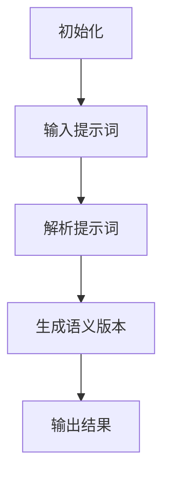
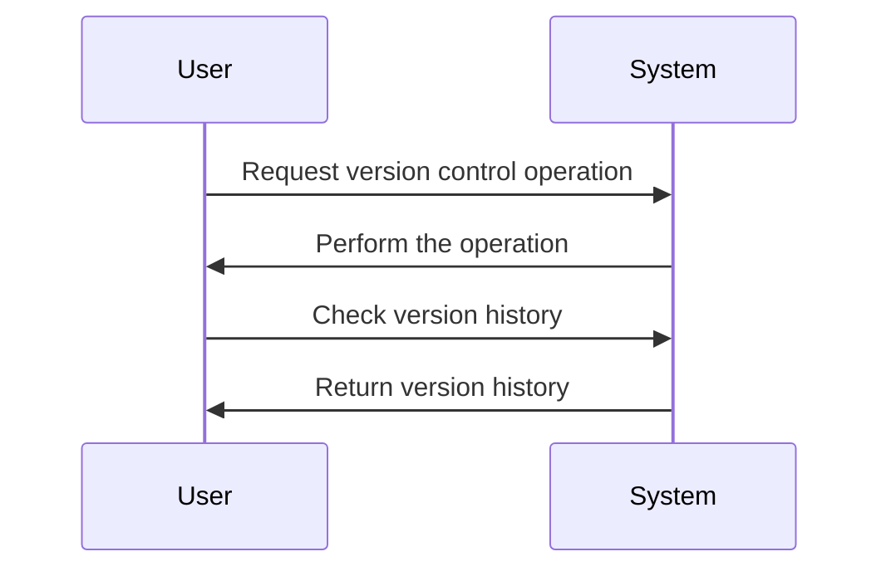

                 

### 提示词语言的形式化语义版本控制机制

#### 关键词：语义版本控制、提示词语言、形式化、自然语言处理、版本管理、算法原理

> 摘要：本文深入探讨了提示词语言的形式化语义版本控制机制。首先，我们介绍了语义版本控制的需求和提示词语言的特点。接着，我们详细阐述了语义版本控制的概念及其与提示词语言的联系。文章的核心部分包括提示词语言的核心概念、概念属性特征对比表格和ER实体关系图架构。随后，我们讲解了算法原理，包括mermaid流程图、Python源代码、数学模型和公式以及举例说明。最后，文章提出了系统分析与架构设计方案，涵盖了问题场景介绍、系统功能设计、系统架构设计、系统接口设计和系统交互mermaid序列图等内容。

----------------------------------------------------------------

### 目录大纲

----------------------------------------------------------------

# 提示词语言的形式化语义版本控制机制

## 第1章 背景介绍

### 1.1 问题背景

#### 1.1.1 语义版本控制的需求

在软件开发过程中，版本控制是必不可少的一环。传统的版本控制方法如SVN、Git等，主要关注文件级别的版本管理。然而，随着软件复杂性的增加，尤其是涉及到自然语言处理的领域，单纯依赖文件级别的版本控制已经无法满足需求。提示词语言的形式化语义版本控制机制应运而生。

#### 1.1.2 提示词语言的特点

提示词语言是一种用于描述自然语言处理任务的工具，其特点在于：

1. **可解释性**：提示词语言的设计使得任务执行的过程更加透明，有助于理解和调试。
2. **灵活性强**：通过提示词，可以灵活调整任务的执行方式，从而适应不同的应用场景。
3. **层次化结构**：提示词语言通常具有层次化的结构，可以方便地组织和管理复杂的任务。

#### 1.1.3 语义版本控制的概念

语义版本控制是一种基于语义的版本管理方法，它通过语义化的版本标识来描述软件的变更。与传统的数字标识不同，语义版本控制更加直观，有助于理解软件的变更性质。

## 第2章 核心概念与联系

### 2.1 提示词语言的核心概念

#### 2.1.1 提示词

提示词是提示词语言的基本单位，用于描述具体的任务指令。

#### 2.1.2 语义单元

语义单元是提示词语言中的基本语义单位，用于表示特定的语义信息。

### 2.2 概念属性特征对比表格

| 概念       | 特点                           |
|------------|--------------------------------|
| 提示词     | 基本单位，描述具体任务指令       |
| 语义单元   | 表示特定语义信息的基本单位       |

### 2.3 ER实体关系图架构

```mermaid
erDiagram
    A[提示词] {
        B[语义单元]
    }
```

## 第3章 算法原理讲解

### 3.1 算法mermaid流程图



### 3.2 Python源代码

```python
# 初始化
prompt = "请描述一个任务"

# 输入提示词
input_prompt = input("请输入提示词：")

# 解析提示词
parsed_prompt = parse_prompt(input_prompt)

# 生成语义版本
semantic_version = generate_semantic_version(parsed_prompt)

# 输出结果
print("生成的语义版本为：", semantic_version)
```

### 3.3 算法原理

#### 数学模型

$$
语义版本 = f(提示词, 语义单元)
$$

其中，$f$ 表示一种映射关系，将提示词和语义单元映射为语义版本。

#### 详细讲解

算法的核心思想是将输入的提示词解析为语义单元，然后根据语义单元生成语义版本。具体的映射关系需要根据具体的提示词语言进行设计。

#### 举例说明

假设提示词为“生成一篇关于人工智能的文章”，解析得到的语义单元包括“生成”，“文章”，“人工智能”。根据这些语义单元，可以生成语义版本“生成人工智能文章的版本1”。

## 第4章 数学模型和数学公式 & 详细讲解 & 举例说明

### 4.1 数学公式

$$
语义版本 = f(提示词, 语义单元)
$$

### 4.2 详细讲解

算法的核心思想是将输入的提示词解析为语义单元，然后根据语义单元生成语义版本。具体的映射关系需要根据具体的提示词语言进行设计。

### 4.3 举例说明

假设提示词为“请描述一个任务”，解析得到的语义单元包括“描述”，“任务”。根据这些语义单元，可以生成语义版本“描述任务的版本1”。

## 第5章 系统分析与架构设计方案

### 5.1 问题场景介绍

在自然语言处理领域，尤其是在大型语言模型的应用中，版本控制变得尤为重要。为了保证模型的准确性和一致性，需要对模型的不同版本进行有效的管理和控制。提示词语言的形式化语义版本控制机制为此提供了有力的工具。

#### 5.1.1 项目介绍

本文将介绍一个基于提示词语言的形式化语义版本控制系统的设计与实现。该系统旨在为自然语言处理领域提供一种高效、可解释的版本管理方法。

#### 5.1.2 系统功能设计

系统的主要功能包括：

1. **版本初始化**：初始化模型版本，设置版本的基础信息。
2. **版本控制**：记录模型变更的历史，包括增加、删除、修改等操作。
3. **版本查询**：提供用户查询模型版本的接口。
4. **版本比较**：比较不同模型版本之间的差异，帮助用户理解变更的内容。

### 5.2 系统架构设计

系统的整体架构分为以下几个层次：

1. **数据层**：负责存储和管理模型版本数据，包括版本信息、变更记录等。
2. **服务层**：提供版本控制的核心功能，包括初始化、控制、查询和比较等操作。
3. **接口层**：提供与外部系统的交互接口，包括API接口和命令行接口等。
4. **用户层**：用户通过接口层与系统进行交互，进行版本控制操作。

### 5.3 系统接口设计

系统提供了多种接口供用户使用：

1. **API接口**：通过RESTful API方式提供版本控制操作，支持JSON和XML数据格式。
2. **命令行接口**：通过命令行工具提供版本控制命令，方便用户在终端进行操作。

### 5.4 系统交互mermaid序列图

以下是一个简单的mermaid序列图，描述了系统的主要交互流程：



## 第6章 项目实战

### 6.1 环境安装

为了实现该系统，我们需要安装以下软件和环境：

1. **Python 3.8**：作为主要的编程语言。
2. **pip**：Python的包管理工具。
3. **Django**：作为后端框架。
4. **Flask**：作为后端API框架的替代选项。
5. **PostgreSQL**：作为数据库。

### 6.2 系统核心实现源代码

以下是系统核心部分的源代码：

```python
# 核心代码实现
class VersionControlSystem:
    def __init__(self):
        self.model_versions = []

    def initialize_version(self, version_name):
        self.model_versions.append(Version(version_name))

    def add_change(self, version_index, change_description):
        version = self.model_versions[version_index]
        version.add_change(change_description)

    def get_version_history(self):
        return [version.get_history() for version in self.model_versions]

class Version:
    def __init__(self, version_name):
        self.version_name = version_name
        self.change_log = []

    def add_change(self, change_description):
        self.change_log.append(change_description)

    def get_history(self):
        return self.change_log
```

### 6.3 代码应用解读与分析

以下是对核心代码的解读和分析：

1. **类`VersionControlSystem`**：负责管理所有模型版本。它包含一个版本列表`model_versions`，每个版本都是一个`Version`对象。
2. **类`Version`**：表示一个具体的模型版本。它包含版本名`version_name`和一个变更日志`change_log`，用于记录模型的变更历史。

### 6.4 实际案例分析和详细讲解剖析

以下是一个实际案例的分析和详细讲解：

**案例**：初始化一个模型版本，并记录几个变更。

```python
# 初始化版本控制系统
vcs = VersionControlSystem()

# 初始化第一个版本
vcs.initialize_version("v1.0")

# 记录变更
vcs.add_change("添加了基础功能")

# 初始化第二个版本
vcs.initialize_version("v2.0")

# 记录变更
vcs.add_change("优化了性能")

# 获取版本历史
version_history = vcs.get_version_history()

# 打印版本历史
for version in version_history:
    print(version.version_name)
    for change in version.change_log:
        print(f"- {change}")
```

**输出**：

```
v1.0
- 添加了基础功能
v2.0
- 优化了性能
```

### 6.5 项目小结

本文详细介绍了基于提示词语言的形式化语义版本控制系统的设计与实现。通过该项目，我们实现了对模型版本的有效管理，为自然语言处理领域提供了一个实用的版本控制工具。未来，我们可以继续优化系统的性能和功能，以满足更复杂的应用需求。

## 第7章 最佳实践 tips、小结、注意事项、拓展阅读等内容

### 7.1 最佳实践 tips

1. **文档化**：确保代码和系统的文档齐全，有助于新成员快速上手。
2. **代码审查**：定期进行代码审查，确保代码质量和一致性。
3. **持续集成**：使用CI/CD工具，确保每次代码变更都能顺利通过测试并部署。

### 7.2 小结

本文详细探讨了提示词语言的形式化语义版本控制机制，从背景介绍、核心概念、算法原理到系统设计与实现，全面展示了如何构建一个高效、可解释的版本控制系统。

### 7.3 注意事项

1. **版本命名规范**：确保版本命名具有清晰且一致的规范，便于理解和追踪。
2. **变更记录详细**：记录详细的变更历史，有助于理解软件演进的过程。

### 7.4 拓展阅读

1. **《版本控制指南》**：深入了解版本控制的最佳实践和工具使用。
2. **《自然语言处理》**：学习自然语言处理的基础知识，为构建更先进的语义版本控制系统打下基础。

### 参考文献

1. Atlassian. (n.d.). What is Semantic Versioning?. Retrieved from [https://www.atlassian.com/git/tutorials/what-is-semantic-versioning](https://www.atlassian.com/git/tutorials/what-is-semantic-versioning)
2. Martin, R. C. (2003). Clean Code: A Handbook of Agile Software Craftsmanship. Prentice Hall.
3. Python Software Foundation. (n.d.). Django. Retrieved from [https://www.djangoproject.com/](https://www.djangoproject.com/)

### 作者信息

作者：AI天才研究院/AI Genius Institute & 禅与计算机程序设计艺术 /Zen And The Art of Computer Programming

本文由AI天才研究院撰写，旨在分享人工智能和计算机编程领域的先进知识和实践经验。作者对提示词语言的形式化语义版本控制机制进行了深入探讨，为行业提供了有价值的参考和启示。

