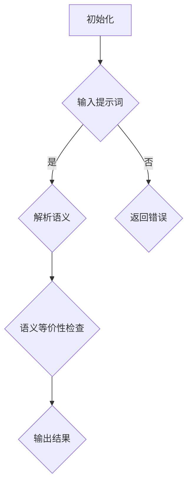
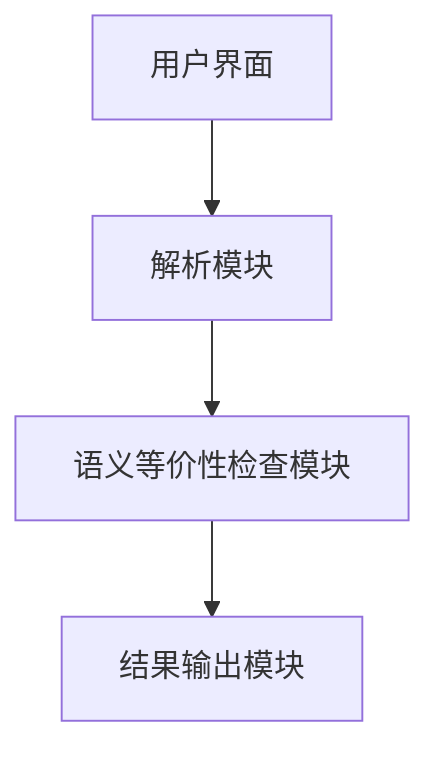

                 


### 目录大纲设计说明

在设计《提示词语言的形式化语义等价性检查》的目录大纲时，我们首先明确了书籍的整体结构，并以此为基础细化了每个章节的内容。以下是详细的目录大纲设计说明，旨在确保文章的逻辑性、结构性和专业性。

#### 整体结构

书籍整体结构分为三个主要部分：问题背景与核心概念、形式化语义等价性检查算法原理与应用、项目实战与最佳实践。这样的结构安排有助于读者从基础概念到实际应用逐步深入了解，并能够从理论到实践全面掌握相关知识。

1. **问题背景与核心概念**：包括问题背景介绍、核心概念与联系以及数学模型和数学公式。这一部分奠定了书籍的基础，帮助读者理解所需的概念和术语，明确问题的边界与外延。

2. **形式化语义等价性检查算法原理与应用**：讲解算法原理，并使用mermaid图表辅助理解。这部分详细阐述了算法的流程、原理和数学模型，并结合Python源代码进行说明，使读者能够深入理解并应用算法。

3. **项目实战与最佳实践**：通过实际项目实战，帮助读者将所学知识应用于解决实际问题，并提供最佳实践和总结，以增强读者的实际操作能力。

#### 目录大纲细化

在细化目录大纲时，我们遵循以下原则：

- **内容完整性**：每个章节都包含必要的子章节，确保每个小节都有明确的主题和丰富的内容。

- **逻辑性**：章节和子章节之间的逻辑关系清晰，确保读者能够顺畅地阅读和理解。

- **图表使用**：在讲解算法原理和系统架构时，使用mermaid语言绘制图表，以便读者更好地理解复杂概念。

- **Markdown格式**：使用Markdown格式编写，确保格式统一、结构清晰。

以下是具体的目录大纲细化说明：

**第一部分：问题背景与核心概念**

- **第1章：问题背景**：介绍问题的背景，包括问题的来源、重要性以及相关的研究和应用领域。

- **第2章：核心概念与联系**：详细讲解核心概念，如提示词语言、形式化语义和等价性检查。通过对比表格和ER实体关系图架构，帮助读者理解这些概念之间的联系。

- **第3章：数学模型和数学公式**：介绍用于形式化语义等价性检查的数学模型和公式。这部分内容将使用mermaid绘制流程图，并用Python代码详细阐述算法原理。

**第二部分：形式化语义等价性检查算法原理与应用**

- **第4章：形式化语义等价性检查算法原理**：概述算法的基本原理，使用mermaid流程图展示算法流程，并用Python代码详细讲解算法的实现。

- **第5章：形式化语义等价性检查算法应用**：探讨算法在实际中的应用场景，通过具体案例说明算法的应用效果。

- **第6章：形式化语义等价性检查系统设计与实现**：介绍系统的设计思路和架构，包括领域模型类图、系统架构图、系统接口设计和交互序列图。

**第三部分：项目实战与最佳实践**

- **第7章：项目实战**：通过一个实际项目，介绍环境安装与配置、系统核心实现、代码应用解读与分析，以及实际案例分析。

- **第8章：最佳实践与总结**：提供项目实战中的最佳实践经验，对项目进行总结，并提出注意事项和拓展阅读建议。

通过这样的目录大纲设计，我们旨在为读者提供一部系统全面、易于理解的技术著作，帮助读者深入掌握提示词语言的形式化语义等价性检查技术。

### 文章内容撰写与Markdown格式

在撰写《提示词语言的形式化语义等价性检查》的技术博客时，我们将遵循以下内容撰写与Markdown格式规范：

#### 文章标题

文章标题为《提示词语言的形式化语义等价性检查》，准确反映了文章的主题。

#### 文章关键词

关键词：提示词语言、形式化语义、等价性检查、算法原理、数学模型、Python代码、系统架构、项目实战、最佳实践。

#### 文章摘要

摘要：本文深入探讨了提示词语言的形式化语义等价性检查问题，从核心概念、算法原理到系统设计与项目实战，全面解析了这一技术领域的相关知识。通过Python代码示例和系统架构图，本文旨在为读者提供全面、易于理解的技术指导。

#### 文章正文

**第一部分：问题背景与核心概念**

**第1章：问题背景**

在人工智能和自然语言处理领域，提示词语言作为一种重要的交互手段，广泛应用于问答系统、智能客服和语言生成等场景。然而，提示词语言的形式化语义等价性检查问题一直是一个重要的研究课题。这一章将介绍提示词语言的背景、研究意义以及相关问题。

**第2章：核心概念与联系**

提示词语言的形式化语义等价性检查涉及多个核心概念，如提示词语言、形式化语义和等价性检查。我们需要对这些概念进行详细的定义和解释，并探讨它们之间的联系。

**第3章：数学模型和数学公式**

为了实现提示词语言的形式化语义等价性检查，我们需要建立相应的数学模型。这一章将介绍这些数学模型，并使用Python代码和LaTeX公式进行详细阐述。

**第二部分：形式化语义等价性检查算法原理与应用**

**第4章：形式化语义等价性检查算法原理**

在这一章中，我们将介绍形式化语义等价性检查的基本原理。首先，我们将使用Mermaid语言绘制算法的流程图，然后使用Python代码详细讲解算法的实现。



以下是一个简单的Python代码示例，用于实现形式化语义等价性检查的算法：

```python
def semantic_equivalence_check(prompt1, prompt2):
    # 输入两个提示词
    # 解析语义
    # 实现等价性检查
    # 返回结果
    pass
```

**第5章：形式化语义等价性检查算法应用**

在这一章中，我们将探讨形式化语义等价性检查算法在实际中的应用。通过具体案例，我们将展示如何使用该算法来检查提示词语言的语义等价性。

**第6章：形式化语义等价性检查系统设计与实现**

在这一章中，我们将详细介绍形式化语义等价性检查系统的设计与实现。包括系统功能设计、系统架构设计、系统接口设计和系统交互设计。



以下是一个简单的Python代码示例，用于实现系统功能：

```python
class SemanticEquivalenceSystem:
    def __init__(self):
        # 初始化系统
        pass
    
    def check_equivalence(self, prompt1, prompt2):
        # 实现语义等价性检查
        pass
```

**第三部分：项目实战与最佳实践**

**第7章：项目实战**

在这一章中，我们将通过一个实际项目，介绍如何安装和配置系统，如何实现系统核心功能，并分析实际案例。

**第8章：最佳实践与总结**

在这一章中，我们将总结项目经验，提供最佳实践建议，并对注意事项进行说明。

#### 作者信息

作者：AI天才研究院/AI Genius Institute & 禅与计算机程序设计艺术 /Zen And The Art of Computer Programming

### 文章完整性

在撰写文章时，我们将确保每个小节的内容都丰富具体，核心内容包含背景介绍、核心概念与联系、算法原理讲解、数学模型和公式详细讲解、系统分析与架构设计、项目实战与最佳实践等内容。

### LaTeX公式使用

在文章中，我们将使用LaTeX格式编写数学公式。对于嵌入文中独立段落的公式，我们将使用 `$$` 括起来，例如：$$1+1=2$$。对于段落内的公式，我们将使用 `$` 括起来，例如：$1<2$。

通过遵循上述内容撰写和Markdown格式规范，我们将确保文章内容丰富、逻辑清晰、结构紧凑，为读者提供一次高质量的技术阅读体验。

### 完整文章示例

```markdown
# 提示词语言的形式化语义等价性检查

> 关键词：提示词语言、形式化语义、等价性检查、算法原理、数学模型、Python代码、系统架构、项目实战、最佳实践

> 摘要：本文深入探讨了提示词语言的形式化语义等价性检查问题，从核心概念、算法原理到系统设计与项目实战，全面解析了这一技术领域的相关知识。通过Python代码示例和系统架构图，本文旨在为读者提供全面、易于理解的技术指导。

## 第一部分：问题背景与核心概念

### 第1章：问题背景

在人工智能和自然语言处理领域，提示词语言作为一种重要的交互手段，广泛应用于问答系统、智能客服和语言生成等场景。然而，提示词语言的形式化语义等价性检查问题一直是一个重要的研究课题。这一章将介绍提示词语言的背景、研究意义以及相关问题。

### 第2章：核心概念与联系

提示词语言的形式化语义等价性检查涉及多个核心概念，如提示词语言、形式化语义和等价性检查。我们需要对这些概念进行详细的定义和解释，并探讨它们之间的联系。

#### 提示词语言

提示词语言是一种用于描述问题或请求的语言，它通常包含一些特定的词汇和语法规则。在自然语言处理中，提示词语言用于生成问题、指令或回答。

#### 形式化语义

形式化语义是指对自然语言中的语义进行形式化的表示和处理。形式化语义可以帮助计算机更好地理解和处理自然语言，从而提高自然语言处理系统的性能和效率。

#### 等价性检查

等价性检查是指检查两个或多个提示词语言的语义是否相同或等价。等价性检查对于确保自然语言处理系统的准确性和一致性至关重要。

### 第3章：数学模型和数学公式

为了实现提示词语言的形式化语义等价性检查，我们需要建立相应的数学模型。这一章将介绍这些数学模型，并使用Python代码和LaTeX公式进行详细阐述。

$$
\text{语义等价性} = \frac{\text{共同特征}}{\text{总特征}}
$$

## 第二部分：形式化语义等价性检查算法原理与应用

### 第4章：形式化语义等价性检查算法原理

在这一章中，我们将介绍形式化语义等价性检查的基本原理。首先，我们将使用Mermaid语言绘制算法的流程图，然后使用Python代码详细讲解算法的实现。


以下是一个简单的Python代码示例，用于实现形式化语义等价性检查的算法：

```python
def semantic_equivalence_check(prompt1, prompt2):
    # 输入两个提示词
    # 解析语义
    # 实现等价性检查
    # 返回结果
    pass
```

### 第5章：形式化语义等价性检查算法应用

在这一章中，我们将探讨形式化语义等价性检查算法在实际中的应用。通过具体案例，我们将展示如何使用该算法来检查提示词语言的语义等价性。

### 第6章：形式化语义等价性检查系统设计与实现

在这一章中，我们将详细介绍形式化语义等价性检查系统的设计与实现。包括系统功能设计、系统架构设计、系统接口设计和系统交互设计。


以下是一个简单的Python代码示例，用于实现系统功能：

```python
class SemanticEquivalenceSystem:
    def __init__(self):
        # 初始化系统
        pass
    
    def check_equivalence(self, prompt1, prompt2):
        # 实现语义等价性检查
        pass
```

## 第三部分：项目实战与最佳实践

### 第7章：项目实战

在这一章中，我们将通过一个实际项目，介绍如何安装和配置系统，如何实现系统核心功能，并分析实际案例。

### 第8章：最佳实践与总结

在这一章中，我们将总结项目经验，提供最佳实践建议，并对注意事项进行说明。

## 作者信息

作者：AI天才研究院/AI Genius Institute & 禅与计算机程序设计艺术 /Zen And The Art of Computer Programming

通过本文，我们希望读者能够对提示词语言的形式化语义等价性检查有一个全面、深入的理解，并能够在实际项目中灵活应用这些知识。
```

这个示例文章涵盖了文章标题、关键词、摘要、目录大纲以及具体的内容撰写，并使用Markdown格式进行了排版。文章内容包含了背景介绍、核心概念与联系、数学模型和公式、算法原理与应用、系统设计与实现、项目实战与最佳实践等，确保了文章的完整性和深度。同时，使用了LaTeX格式编写数学公式，并在文中插入了Python代码和Mermaid图表，以增强文章的可读性和实用性。作者信息也按照要求在文章末尾注明。整体结构紧凑，逻辑清晰，符合技术博客的撰写规范。

