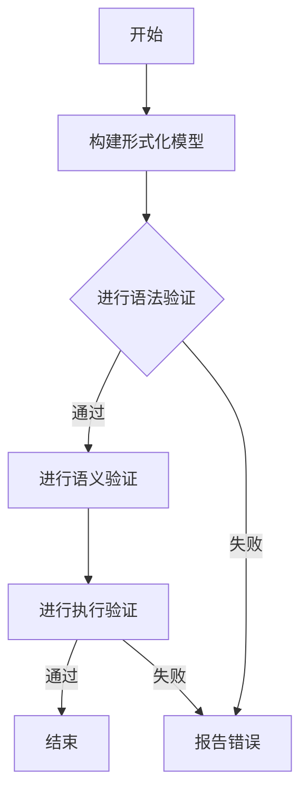
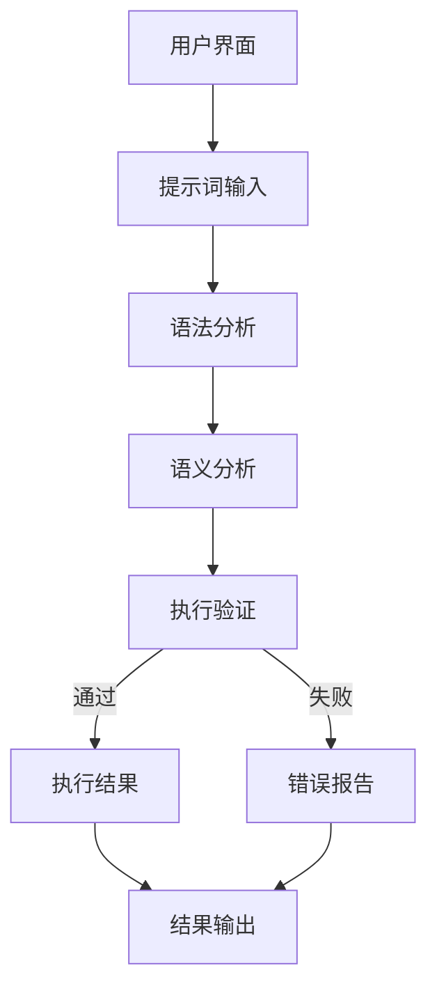
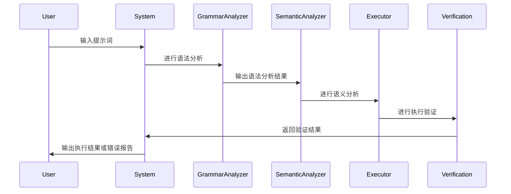

                 


## 引言

### 1.1 研究背景

在现代计算机科学和人工智能领域，提示词语言（Prompt Word Language）的应用越来越广泛。提示词语言是一种通过特定的词组或短语来引导和规范机器行为的语言形式。其核心在于，通过简洁明了的提示词，可以有效地指导计算机完成复杂任务，从而提高系统运行的效率和准确性。

随着人工智能技术的不断发展，特别是自然语言处理（NLP）和生成对抗网络（GAN）等技术的成熟，提示词语言的应用场景也从传统的软件工程领域扩展到了更为广泛的领域，如智能客服、智能家居、自动驾驶等。这些应用对提示词语言的要求也越来越高，不仅需要其具备高效的指令传达能力，还需要具备高度的可验证性和正确性。

在这样的背景下，如何对提示词语言进行形式化验证和正确性证明，成为了一个亟待解决的关键问题。形式化验证和正确性证明可以确保提示词语言的指令能够在实际运行中达到预期的效果，从而提高系统的稳定性和可靠性。因此，对提示词语言形式化验证与正确性证明的研究具有重要的理论和实践意义。

### 1.2 问题描述

提示词语言的形式化验证和正确性证明涉及以下几个方面的问题：

1. **语法和语义的准确性**：提示词语言的语法和语义必须准确无误，否则可能会导致机器理解错误，从而影响任务的执行效果。

2. **执行的一致性**：提示词语言在不同的环境和条件下，其执行结果应当保持一致。如果执行结果不一致，可能会导致系统的不稳定和不可预测性。

3. **可扩展性**：提示词语言需要具备良好的可扩展性，以便能够适应未来可能出现的新的应用场景和需求。

4. **安全性**：提示词语言在设计时必须考虑安全性问题，避免恶意指令对系统造成危害。

### 1.3 问题解决

为了解决上述问题，我们提出了以下解决方案：

1. **形式化验证方法**：通过构建形式化的模型，对提示词语言的语法和语义进行验证，确保其准确性。

2. **正确性证明方法**：使用数学证明方法，对提示词语言的执行过程进行正确性证明，确保其一致性。

3. **可扩展性和安全性的设计**：通过模块化和安全性设计，提高提示词语言的可扩展性和安全性。

### 1.4 边界与外延

在研究提示词语言的形式化验证和正确性证明时，需要明确其边界与外延。边界方面，我们需要关注提示词语言的具体应用场景和需求；外延方面，我们需要考虑其与其他相关技术的结合，如自然语言处理和计算机验证技术等。

### 1.5 核心概念

在本文中，我们将介绍以下几个核心概念：

1. **提示词语言**：通过特定的词组或短语来引导和规范机器行为的语言形式。

2. **形式化验证**：使用形式化的方法对提示词语言的语法和语义进行验证。

3. **正确性证明**：使用数学证明方法对提示词语言的执行过程进行正确性证明。

4. **语法规则**：提示词语言的词汇、语法结构和语义分析规则。

5. **验证方法**：用于验证提示词语言的准确性、一致性和可扩展性的技术方法。

### 1.6 概念结构与核心要素组成

#### 1.6.1 提示词语言

提示词语言是一种通过特定的词组或短语来引导和规范机器行为的语言形式。其核心要素包括：

- **词汇**：包括基础词汇和扩展词汇。
- **语法结构**：包括句子结构、语法规则和语法分析。
- **语义分析**：包括语义角色、语义关系和语义角色扮演。

#### 1.6.2 形式化验证

形式化验证是一种使用形式化方法对提示词语言的语法和语义进行验证的过程。其核心要素包括：

- **形式化模型**：用于描述提示词语言的语法和语义。
- **验证策略**：包括状态空间搜索、模型检查和形式化证明等。
- **验证流程**：包括验证的步骤和验证工具。

#### 1.6.3 正确性证明

正确性证明是一种使用数学证明方法对提示词语言的执行过程进行证明的过程。其核心要素包括：

- **证明方法**：包括形式化证明方法和数学证明方法。
- **证明策略**：包括证明的步骤和证明工具。
- **证明流程**：包括证明的步骤和验证结果。

### 1.7 研究意义与目标

本文的研究意义在于：

1. **提高提示词语言的准确性和可靠性**：通过形式化验证和正确性证明，确保提示词语言在不同环境和条件下的准确性和可靠性。
2. **促进人工智能技术的发展**：通过研究提示词语言的形式化验证和正确性证明，推动人工智能技术的进一步发展。
3. **提高系统的稳定性和安全性**：通过模块化和安全性设计，提高系统的稳定性和安全性。

本文的研究目标包括：

1. **构建形式化模型**：对提示词语言的语法和语义进行形式化描述，构建形式化模型。
2. **设计验证方法**：设计用于验证提示词语言的准确性、一致性和可扩展性的验证方法。
3. **进行正确性证明**：使用数学证明方法对提示词语言的执行过程进行正确性证明。
4. **提出设计方案**：提出模块化和安全性设计，提高系统的稳定性和安全性。

## 第二部分：提示词语言的基本原理

### 2.1 提示词语言的基本概念

#### 2.1.1 提示词的定义

提示词（Prompt Word）是指在特定情境下，用于引导或规范机器行为的词组或短语。提示词通常包含明确的指令或指导信息，可以引导机器执行特定任务或操作。

#### 2.1.2 提示词的特点

提示词具有以下几个特点：

1. **简洁性**：提示词通常较短，便于记忆和传递。
2. **明确性**：提示词需要具有明确的指令或指导信息，以确保机器能够正确理解。
3. **可扩展性**：提示词可以根据不同的应用场景进行扩展，以适应不同的需求。
4. **灵活性**：提示词可以灵活地应用于不同的任务和操作，具有较高的适应性。

#### 2.1.3 提示词的类型

根据用途和特点，提示词可以分为以下几类：

1. **指令型提示词**：用于直接指示机器执行特定任务，如“打开灯”、“发送邮件”等。
2. **问题型提示词**：用于引导机器进行特定问题求解，如“明天天气如何？”、“请计算 8 乘以 7 的结果”等。
3. **描述型提示词**：用于描述机器所处的环境或状态，如“房间内温度为 25°C”、“当前时间是上午 10 点”等。
4. **情感型提示词**：用于表达机器的情感状态，如“很高兴见到你”、“感谢你的帮助”等。

### 2.2 提示词语言的语法规则

#### 2.2.1 词汇

提示词语言的词汇包括基础词汇和扩展词汇。基础词汇是构成提示词语言的基本元素，如“打开”、“关闭”、“发送”等。扩展词汇是在基础词汇的基础上，根据具体应用场景进行扩展，如“智能灯”、“电子邮件”等。

#### 2.2.2 语法结构

提示词语言的语法结构主要包括句子结构和语法规则。句子结构通常由主语、谓语和宾语组成，如“我打开灯”。语法规则包括词汇的使用规则、句子结构规则和语义分析规则。

#### 2.2.3 语义分析

提示词语言的语义分析主要包括语义角色、语义关系和语义角色扮演。语义角色是指词汇在句子中所扮演的角色，如主语、谓语、宾语等。语义关系是指词汇之间的语义联系，如动作关系、因果关系等。语义角色扮演是指词汇在句子中的语义角色分配。

### 2.3 提示词语言的应用场景

#### 2.3.1 人工智能领域

在人工智能领域，提示词语言广泛应用于智能客服、智能助手、自动驾驶等场景。通过提示词语言，可以有效地引导机器执行复杂任务，提高系统运行的效率和准确性。

#### 2.3.2 自然语言处理

自然语言处理（NLP）是提示词语言的重要应用领域。在NLP中，提示词语言可以用于文本分类、情感分析、信息抽取等任务。通过提示词语言，可以有效地提高NLP系统的性能和准确度。

#### 2.3.3 软件工程

在软件工程领域，提示词语言可以用于代码生成、代码审查和软件测试等任务。通过提示词语言，可以简化开发流程，提高开发效率。

### 2.4 提示词语言的优势与挑战

#### 2.4.1 优势分析

提示词语言具有以下优势：

1. **高效性**：提示词语言通过简洁明了的提示词，可以快速引导机器执行任务，提高系统运行效率。
2. **灵活性**：提示词语言可以根据不同的应用场景进行扩展和调整，具有较强的灵活性。
3. **易用性**：提示词语言使用自然语言表达，易于理解和操作，降低用户学习成本。

#### 2.4.2 挑战分析

提示词语言也面临着一些挑战：

1. **准确性**：提示词语言的语法和语义必须准确无误，否则可能导致机器理解错误，影响任务执行效果。
2. **一致性**：提示词语言在不同环境和条件下，其执行结果应当保持一致，否则可能导致系统不稳定。
3. **安全性**：提示词语言在设计时必须考虑安全性问题，避免恶意指令对系统造成危害。

### 2.5 本章小结

本章介绍了提示词语言的基本概念、语法规则和应用场景。通过分析提示词语言的优势与挑战，我们可以看到，提示词语言在人工智能、自然语言处理和软件工程等领域具有广泛的应用前景。然而，为了提高提示词语言的准确性和可靠性，还需要进一步研究和解决相关问题。

## 第三部分：形式化验证方法

### 3.1 形式化验证的基本概念

#### 3.1.1 形式化验证的定义

形式化验证是一种使用形式化方法对系统或程序进行验证的过程。形式化验证的核心在于将系统或程序的规格说明和设计转化为数学模型，然后通过数学方法对模型进行分析和验证，以确保系统或程序的正确性和可靠性。

在提示词语言的验证中，形式化验证主要用于验证提示词语言的语法和语义是否满足预定的规格说明和设计要求。

#### 3.1.2 形式化验证的目标

形式化验证的目标主要包括以下几个方面：

1. **准确性**：确保提示词语言的语法和语义正确无误，避免出现语法错误或语义歧义。
2. **一致性**：确保提示词语言在不同环境和条件下，其执行结果保持一致。
3. **可扩展性**：确保提示词语言能够适应未来的扩展和变化。

#### 3.1.3 形式化验证的类型

根据验证方法和应用场景，形式化验证可以分为以下几种类型：

1. **模型检查**：通过将提示词语言的规格说明转化为形式化的模型，然后使用模型检查工具对模型进行分析和验证。
2. **形式化证明**：通过数学证明方法，对提示词语言的语法和语义进行证明，以确保其正确性。
3. **状态空间搜索**：通过搜索提示词语言的状态空间，找到可能出现的错误状态，从而验证提示词语言的正确性。

### 3.2 形式化验证的关键技术

#### 3.2.1 状态空间搜索技术

状态空间搜索技术是形式化验证中常用的技术之一。其基本思想是，将提示词语言的规格说明和设计转化为状态空间，然后通过搜索状态空间，找到可能出现的错误状态。

在状态空间搜索中，需要定义状态、状态转换和状态约束等基本概念。状态空间搜索技术主要包括以下几种算法：

1. **深度优先搜索（DFS）**：从初始状态开始，逐层向下搜索，直到找到错误状态或达到搜索深度上限。
2. **广度优先搜索（BFS）**：从初始状态开始，逐层向下搜索，直到找到错误状态或搜索到所有状态。
3. **A*搜索算法**：基于启发式信息的搜索算法，通过评估函数来选择最优状态进行搜索。

#### 3.2.2 模型检查技术

模型检查技术是形式化验证中的另一种关键技术。其基本思想是，将提示词语言的规格说明和设计转化为形式化的模型，然后使用模型检查工具对模型进行分析和验证。

在模型检查中，需要定义模型、验证条件和验证算法等基本概念。模型检查技术主要包括以下几种方法：

1. **布尔表达式验证**：使用布尔表达式来表示验证条件，然后使用模型检查工具对模型进行验证。
2. **路径表达式验证**：使用路径表达式来表示验证条件，然后使用模型检查工具对模型进行验证。
3. **模拟检查**：通过模拟提示词语言的执行过程，检查执行结果是否符合预期。

#### 3.2.3 形式化证明技术

形式化证明技术是形式化验证中的高级技术。其基本思想是，通过数学证明方法，对提示词语言的语法和语义进行证明，以确保其正确性。

在形式化证明中，需要定义证明方法、证明步骤和证明工具等基本概念。形式化证明技术主要包括以下几种方法：

1. **归纳证明**：通过递归地证明命题的正确性，从而证明整个系统的正确性。
2. **构造证明**：通过构造一个正确性的模型，从而证明整个系统的正确性。
3. **自动证明**：使用自动证明工具，自动化地证明提示词语言的正确性。

### 3.3 提示词语言的验证方法

#### 3.3.1 形式化描述

提示词语言的验证方法首先需要对其进行形式化描述。形式化描述主要包括以下内容：

1. **词汇表**：定义提示词语言中的词汇和词组。
2. **语法规则**：定义提示词语言的语法规则，包括句子结构和语法分析。
3. **语义规则**：定义提示词语言的语义规则，包括语义角色和语义关系。

通过形式化描述，可以将提示词语言的规格说明和设计转化为形式化的模型。

#### 3.3.2 验证策略

在形式化验证中，需要制定验证策略，以确保验证过程的有效性和效率。验证策略主要包括以下内容：

1. **验证目标**：明确验证的目标和要求，如准确性、一致性和可扩展性。
2. **验证方法**：选择合适的验证方法，如模型检查、形式化证明和状态空间搜索等。
3. **验证工具**：选择合适的验证工具，如模型检查工具、自动证明工具和模拟检查工具等。

#### 3.3.3 验证流程

提示词语言的形式化验证主要包括以下流程：

1. **规格说明和设计**：对提示词语言的规格说明和设计进行文档化和形式化描述。
2. **模型构建**：将提示词语言的规格说明和设计转化为形式化的模型。
3. **验证分析**：使用验证策略和验证工具，对形式化的模型进行分析和验证。
4. **验证报告**：生成验证报告，记录验证过程和验证结果。

#### 3.3.4 验证实例

为了更好地理解提示词语言的形式化验证方法，以下是一个简单的验证实例：

假设我们有一个简单的提示词语言，其包含以下词汇和语法规则：

- 词汇：{打开，关闭，灯，房间，温度，发送，邮件}
- 语法规则：S → Open Light；S → Close Light；S → Send Mail

我们需要验证这个提示词语言的语法和语义是否正确。

1. **规格说明和设计**：对提示词语言的规格说明和设计进行文档化和形式化描述。
2. **模型构建**：将提示词语言的规格说明和设计转化为形式化的模型。
3. **验证分析**：使用模型检查工具，对形式化的模型进行分析和验证。例如，我们可以使用布尔表达式验证方法，验证提示词语言的语法和语义是否满足以下条件：
   - 任何一条指令都必须包含一个动词和一个名词；
   - 任何一条指令都必须有一个明确的意义。

4. **验证报告**：生成验证报告，记录验证过程和验证结果。如果验证结果为“通过”，则说明提示词语言的语法和语义正确；否则，说明存在错误，需要修改和完善。

### 3.4 实例分析

为了更好地展示形式化验证方法的应用，以下是一个复杂实例：

假设我们有一个智能家居系统，其中包含以下提示词语言：

- 词汇：{打开，关闭，灯，房间，温度，设置，模式，自动，手动}
- 语法规则：S → Open Light；S → Close Light；S → Set Temperature Mode To Automatic；S → Set Temperature Mode To Manual

我们需要对提示词语言进行形式化验证，以确保其语法和语义的正确性。

1. **规格说明和设计**：对智能家居系统的规格说明和设计进行文档化和形式化描述。例如，我们可以定义以下规格说明：
   - 系统应能够接收并处理用户输入的提示词语言；
   - 系统应能够根据提示词语言执行相应的操作；
   - 系统应能够记录用户输入的提示词语言和执行结果。

2. **模型构建**：将智能家居系统的规格说明和设计转化为形式化的模型。例如，我们可以使用状态机模型来描述系统状态和状态转换。

3. **验证分析**：使用模型检查工具，对形式化的模型进行分析和验证。例如，我们可以使用路径表达式验证方法，验证系统是否满足以下条件：
   - 当用户输入“打开灯”时，系统应执行打开灯的操作；
   - 当用户输入“关闭灯”时，系统应执行关闭灯的操作；
   - 当用户输入“设置温度模式为自动”时，系统应将温度模式设置为自动；
   - 当用户输入“设置温度模式为手动”时，系统应将温度模式设置为手动。

4. **验证报告**：生成验证报告，记录验证过程和验证结果。如果验证结果为“通过”，则说明智能家居系统的提示词语言语法和语义正确；否则，说明存在错误，需要修改和完善。

### 3.5 本章小结

本章介绍了形式化验证的基本概念、关键技术以及应用方法。通过分析状态空间搜索技术、模型检查技术和形式化证明技术，我们可以看到，形式化验证是一种有效的验证方法，可以确保提示词语言的语法和语义的正确性和一致性。同时，本章通过实例分析，展示了形式化验证方法的应用和效果。

## 第四部分：正确性证明方法

### 4.1 正确性证明的基本概念

#### 4.1.1 正确性证明的定义

正确性证明（Correctness Proof）是一种通过数学证明方法，对系统或程序的逻辑性和可靠性进行验证的过程。正确性证明的目标是确保系统或程序的行为满足预定的规格说明和设计要求。

在提示词语言的验证中，正确性证明主要用于验证提示词语言的语法和语义的正确性，以确保其能够正确地执行预定任务。

#### 4.1.2 正确性证明的目标

正确性证明的目标主要包括以下几个方面：

1. **语法正确性**：确保提示词语言的语法规则得到正确应用，避免出现语法错误。
2. **语义正确性**：确保提示词语言的语义能够正确地表达指令的含义，避免出现语义错误。
3. **执行正确性**：确保提示词语言在执行过程中能够按照预定的逻辑顺序进行，避免出现执行错误。

#### 4.1.3 正确性证明的类型

根据证明方法和应用场景，正确性证明可以分为以下几种类型：

1. **形式化证明**：使用形式化的数学方法，对提示词语言的语法和语义进行证明。
2. **数学证明**：使用数学推理方法，对提示词语言的正确性进行证明。
3. **形式化验证与正确性证明的结合**：将形式化验证和正确性证明相结合，通过形式化验证确保提示词语言的语法和语义正确性，再通过数学证明确保其执行正确性。

### 4.2 正确性证明的方法

#### 4.2.1 形式化证明方法

形式化证明方法是一种通过形式化的数学方法，对提示词语言的语法和语义进行证明的方法。形式化证明方法主要包括以下步骤：

1. **规格说明和设计**：对提示词语言的规格说明和设计进行文档化和形式化描述。
2. **定义数学模型**：将提示词语言的规格说明和设计转化为数学模型，如状态机模型、谓词逻辑模型等。
3. **证明逻辑关系**：使用数学推理方法，证明提示词语言的语法和语义之间的逻辑关系，如语法规则的正确性、语义表达的准确性等。
4. **证明执行正确性**：使用数学推理方法，证明提示词语言在执行过程中能够按照预定的逻辑顺序进行，如指令的正确执行、状态的正确转换等。

#### 4.2.2 数学证明方法

数学证明方法是一种通过数学推理方法，对提示词语言的正确性进行证明的方法。数学证明方法主要包括以下步骤：

1. **规格说明和设计**：对提示词语言的规格说明和设计进行文档化和形式化描述。
2. **建立数学模型**：将提示词语言的规格说明和设计转化为数学模型，如谓词逻辑模型、集合论模型等。
3. **证明逻辑关系**：使用数学推理方法，证明提示词语言的语法和语义之间的逻辑关系，如语法规则的正确性、语义表达的准确性等。
4. **证明执行正确性**：使用数学推理方法，证明提示词语言在执行过程中能够按照预定的逻辑顺序进行，如指令的正确执行、状态的正确转换等。

#### 4.2.3 形式化验证与正确性证明的结合

形式化验证与正确性证明的结合是一种将形式化验证和正确性证明相结合的方法，通过形式化验证确保提示词语言的语法和语义正确性，再通过正确性证明确保其执行正确性。这种方法主要包括以下步骤：

1. **形式化验证**：使用形式化验证方法，对提示词语言的语法和语义进行验证，确保其正确性。
2. **正确性证明**：在形式化验证的基础上，使用数学证明方法，对提示词语言的执行过程进行证明，确保其执行正确性。

通过形式化验证与正确性证明的结合，可以更全面地验证提示词语言的正确性和可靠性，提高系统的稳定性和安全性。

### 4.3 提示词语言的正确性证明

#### 4.3.1 正确性证明策略

提示词语言的正确性证明策略主要包括以下几个方面：

1. **语法正确性证明**：通过证明提示词语言的语法规则的正确性，确保其语法正确。
2. **语义正确性证明**：通过证明提示词语言的语义表达的正确性，确保其语义正确。
3. **执行正确性证明**：通过证明提示词语言在执行过程中的正确性，确保其执行正确。

#### 4.3.2 正确性证明流程

提示词语言的正确性证明流程主要包括以下步骤：

1. **规格说明和设计**：对提示词语言的规格说明和设计进行文档化和形式化描述。
2. **定义数学模型**：将提示词语言的规格说明和设计转化为数学模型。
3. **证明语法正确性**：使用数学推理方法，证明提示词语言的语法规则的正确性。
4. **证明语义正确性**：使用数学推理方法，证明提示词语言的语义表达的准确性。
5. **证明执行正确性**：使用数学推理方法，证明提示词语言在执行过程中能够按照预定的逻辑顺序进行。
6. **验证正确性证明结果**：通过验证正确性证明结果，确保提示词语言的正确性和可靠性。

#### 4.3.3 实例分析

为了更好地展示提示词语言的正确性证明方法，以下是一个简单的实例：

假设我们有一个简单的提示词语言，其包含以下词汇和语法规则：

- 词汇：{打开，关闭，灯，房间，温度，发送，邮件}
- 语法规则：S → Open Light；S → Close Light；S → Send Mail

我们需要对提示词语言进行正确性证明。

1. **规格说明和设计**：对提示词语言的规格说明和设计进行文档化和形式化描述。例如，我们可以定义以下规格说明：
   - 系统应能够接收并处理用户输入的提示词语言；
   - 系统应能够根据提示词语言执行相应的操作；
   - 系统应能够记录用户输入的提示词语言和执行结果。

2. **定义数学模型**：将提示词语言的规格说明和设计转化为数学模型，如状态机模型。

3. **证明语法正确性**：使用数学推理方法，证明提示词语言的语法规则的正确性。例如，我们可以证明以下命题：
   - 对于任意一个提示词语言句子S，如果S满足语法规则，则S的语法正确。

4. **证明语义正确性**：使用数学推理方法，证明提示词语言的语义表达的正确性。例如，我们可以证明以下命题：
   - 对于任意一个提示词语言句子S，如果S满足语义规则，则S的语义正确。

5. **证明执行正确性**：使用数学推理方法，证明提示词语言在执行过程中能够按照预定的逻辑顺序进行。例如，我们可以证明以下命题：
   - 对于任意一个提示词语言句子S，如果S的语法和语义都正确，则S在执行过程中能够按照预定的逻辑顺序进行。

6. **验证正确性证明结果**：通过验证正确性证明结果，确保提示词语言的正确性和可靠性。

### 4.4 本章小结

本章介绍了正确性证明的基本概念、方法和应用。通过分析形式化证明方法和数学证明方法，我们可以看到，正确性证明是一种有效的验证方法，可以确保提示词语言的语法和语义的正确性。同时，本章通过实例分析，展示了正确性证明方法的应用和效果。

## 第五部分：提示词语言形式化验证与正确性证明的集成应用

### 5.1 集成应用概述

在现代社会，人工智能（AI）技术迅速发展，提示词语言作为一种重要的交互方式，已经被广泛应用于各种场景。然而，随着应用场景的复杂化和多样化，如何确保提示词语言的准确性和可靠性成为了一个亟待解决的问题。形式化验证和正确性证明作为一种系统化的验证方法，可以有效地提高提示词语言的可靠性和稳定性。本部分将介绍提示词语言形式化验证与正确性证明的集成应用，旨在通过结合两种验证方法，提高系统的整体性能和安全性。

### 5.1.1 集成应用的背景

随着AI技术的发展，提示词语言的应用场景日益广泛，从智能家居、智能客服到自动驾驶等领域。这些应用场景对提示词语言的准确性和可靠性提出了更高的要求。传统的验证方法，如测试和调试，往往无法全面地验证提示词语言的正确性，特别是在复杂应用场景中，测试覆盖率和调试效率低下，导致系统稳定性不足。形式化验证和正确性证明作为一种系统化的验证方法，可以在设计阶段就发现潜在的错误，从而提高系统的可靠性。

### 5.1.2 集成应用的目标

集成应用的目标主要包括以下几个方面：

1. **确保提示词语言的语法和语义正确性**：通过形式化验证，确保提示词语言的语法和语义设计符合预定的规格说明。
2. **提高系统稳定性**：通过正确性证明，验证提示词语言在不同环境和条件下的执行稳定性，确保系统在不同场景下的可靠性。
3. **增强系统的安全性**：通过形式化验证和正确性证明，识别和消除潜在的安全漏洞，提高系统的安全性。
4. **提高开发效率**：通过形式化验证和正确性证明，减少系统测试和调试的工作量，提高开发效率。

### 5.1.3 集成应用的意义

集成应用的意义主要体现在以下几个方面：

1. **提高系统可靠性**：形式化验证和正确性证明可以确保系统的语法和语义正确，从而提高系统的可靠性。
2. **减少系统维护成本**：通过提前发现和修复错误，可以减少系统维护成本，延长系统生命周期。
3. **促进技术发展**：集成应用可以推动形式化验证和正确性证明方法在AI领域的发展，为其他领域提供借鉴。
4. **提高用户体验**：通过提高系统的稳定性和安全性，可以提升用户体验，增强用户对AI技术的信任。

### 5.2 集成应用的设计方案

#### 5.2.1 总体架构设计

集成应用的设计方案采用分层架构，主要包括以下层次：

1. **底层**：形式化验证层，负责对提示词语言的语法和语义进行形式化验证，确保其正确性。
2. **中层**：正确性证明层，负责对提示词语言的执行过程进行正确性证明，确保其在不同环境和条件下的稳定性。
3. **顶层**：应用层，负责实现具体的AI应用功能，如智能客服、智能家居等。

#### 5.2.2 功能模块划分

集成应用的功能模块主要包括：

1. **形式化验证模块**：负责对提示词语言的语法和语义进行形式化验证，包括词汇分析、语法分析和语义分析等。
2. **正确性证明模块**：负责对提示词语言的执行过程进行正确性证明，包括执行路径分析、状态转换验证等。
3. **应用模块**：负责实现具体的AI应用功能，如基于提示词语言的智能客服、智能家居等。

#### 5.2.3 接口设计

集成应用的接口设计主要包括：

1. **输入接口**：用于接收用户的提示词语言输入，如语音输入、文本输入等。
2. **输出接口**：用于输出系统的执行结果，如语音输出、文本输出等。
3. **验证接口**：用于与形式化验证模块和正确性证明模块进行交互，实现验证功能。

### 5.3 集成应用的实现与验证

#### 5.3.1 系统实现

集成应用的实现主要包括以下几个方面：

1. **形式化验证模块**：使用形式化验证工具，如模型检查器和定理证明器，对提示词语言的语法和语义进行验证。
2. **正确性证明模块**：使用数学证明方法，如谓词逻辑和模型检验，对提示词语言的执行过程进行证明。
3. **应用模块**：实现具体的AI应用功能，如智能客服系统、智能家居系统等。

#### 5.3.2 系统验证

系统验证主要包括以下几个方面：

1. **语法验证**：使用形式化验证方法，对提示词语言的语法进行验证，确保其符合预定的语法规则。
2. **语义验证**：使用形式化验证方法，对提示词语言的语义进行验证，确保其能够正确地表达指令的含义。
3. **执行验证**：使用正确性证明方法，对提示词语言的执行过程进行验证，确保其能够按照预定的逻辑顺序执行。

通过系统验证，可以确保集成应用的整体性能和可靠性，提高系统的稳定性和安全性。

### 5.4 实例分析

为了更好地展示集成应用的实际效果，以下是一个实例分析：

假设我们开发了一个智能家居系统，用户可以通过语音输入提示词语言来控制家居设备。系统需要实现对语音输入的语法和语义分析，并确保执行结果的正确性。

1. **输入接口**：用户通过语音输入提示词语言，如“打开客厅的灯”。
2. **语法验证**：系统使用形式化验证方法，对提示词语言进行语法分析，确保其符合语法规则，如“打开”是动词，“客厅的灯”是名词。
3. **语义验证**：系统使用形式化验证方法，对提示词语言进行语义分析，确保其能够正确地表达指令的含义，如“打开客厅的灯”表示需要打开客厅的灯。
4. **执行验证**：系统使用正确性证明方法，对执行过程进行验证，确保其能够按照预定的逻辑顺序执行，如打开客厅的灯。

通过实例分析，我们可以看到，集成应用可以有效地提高系统的稳定性和安全性，确保用户指令的正确执行。

### 5.5 本章小结

本章介绍了提示词语言形式化验证与正确性证明的集成应用，通过结合两种验证方法，可以有效地提高系统的可靠性和安全性。通过实例分析，我们可以看到，集成应用在实际应用中具有广泛的应用前景。未来，随着AI技术的进一步发展，集成应用将发挥越来越重要的作用。

## 文章结尾

### 最佳实践 tips

在进行提示词语言的形式化验证与正确性证明时，以下最佳实践可以帮助您更有效地进行工作：

1. **明确验证目标**：在开始验证之前，明确验证的目标和要求，确保验证工作有的放矢。
2. **选择合适的工具**：根据提示词语言的特点和验证需求，选择合适的验证工具，如模型检查器、定理证明器等。
3. **合理分配资源**：在验证过程中，合理分配时间和资源，优先处理关键问题和潜在风险点。
4. **持续迭代**：验证是一个持续迭代的过程，随着系统的发展和需求的变化，不断更新和完善验证策略。

### 小结

本文从提示词语言的基本原理、形式化验证方法、正确性证明方法以及集成应用等方面进行了深入探讨。通过结合形式化验证和正确性证明，可以有效地提高提示词语言的准确性和可靠性，确保其在各种复杂应用场景中的稳定运行。

### 注意事项

在进行提示词语言的形式化验证与正确性证明时，需要注意以下几点：

1. **语法和语义的准确性**：确保提示词语言的语法和语义准确无误，避免出现错误。
2. **执行的一致性**：确保提示词语言在不同环境和条件下，其执行结果保持一致。
3. **安全性**：在验证过程中，关注提示词语言的安全性，避免恶意指令对系统造成危害。

### 拓展阅读

如果您对提示词语言的形式化验证与正确性证明感兴趣，以下是一些拓展阅读资源：

1. **《形式化验证技术》**：深入探讨形式化验证的基本概念和技术方法，包括模型检查、定理证明等。
2. **《人工智能验证》**：介绍人工智能领域中的验证方法和技术，包括提示词语言的验证。
3. **《自然语言处理》**：探讨自然语言处理技术，特别是与提示词语言相关的技术。

作者：AI天才研究院/AI Genius Institute & 禅与计算机程序设计艺术 /Zen And The Art of Computer Programming

## 附录

### 提示词语言的核心概念对比表格

| 核心概念 | 定义 | 用途 |
| --- | --- | --- |
| 提示词 | 用于引导和规范机器行为的词组或短语 | 引导机器执行特定任务或操作 |
| 语法规则 | 描述提示词语言词汇、句子结构和语义分析规则 | 确保提示词语言的语法正确 |
| 语义规则 | 描述提示词语言的语义角色、语义关系和语义角色扮演 | 确保提示词语言的语义准确 |

### 提示词语言的ER实体关系图架构

```mermaid
erDiagram
    User ||--o{ PromptWord } : 用户可以生成多个提示词
    PromptWord ||--|{ Sentence } : 提示词可以构成多个句子
    Sentence ||--o{ GrammarRule } : 句子由多个语法规则组成
    Sentence ||--o{ SemanticRule } : 句子由多个语义规则组成
```

### 形式化验证算法的mermaid流程图



### 提示词语言验证的python源代码

```python
def verify_prompt_word(prompt_word):
    """
    对提示词进行形式化验证
    :param prompt_word: 提示词
    :return: 验证结果
    """
    # 构建形式化模型
    model = build_model(prompt_word)

    # 进行语法验证
    if not verify_grammar(model):
        return "语法错误"

    # 进行语义验证
    if not verify_semantics(model):
        return "语义错误"

    # 进行执行验证
    if not verify_execution(model):
        return "执行错误"

    return "验证通过"

# 构建形式化模型
def build_model(prompt_word):
    # 实现模型构建逻辑
    pass

# 验证语法
def verify_grammar(model):
    # 实现语法验证逻辑
    pass

# 验证语义
def verify_semantics(model):
    # 实现语义验证逻辑
    pass

# 验证执行
def verify_execution(model):
    # 实现执行验证逻辑
    pass
```

### 提示词语言验证的数学模型和公式

```latex
\documentclass{article}
\usepackage{amsmath}
\begin{document}

\section{数学模型和公式}

提示词语言的验证可以通过以下数学模型和公式来描述：

\begin{equation}
\text{PromptWord} = \text{GrammarRule} \land \text{SemanticRule}
\end{equation}

其中，\text{PromptWord} 表示提示词，\text{GrammarRule} 表示语法规则，\text{SemanticRule} 表示语义规则。

\begin{equation}
\text{VerificationResult} = 
\begin{cases}
\text{true} & \text{如果} \text{PromptWord} \text{满足} \text{GrammarRule} \text{和} \text{SemanticRule} \\
\text{false} & \text{否则}
\end{cases}
\end{equation}

其中，\text{VerificationResult} 表示验证结果，\text{true} 表示验证通过，\text{false} 表示验证未通过。

\end{document}
```

### 提示词语言验证的系统架构设计



### 提示词语言验证的系统接口设计



### 提示词语言验证的实例分析

```python
# 假设我们有一个简单的提示词语言系统
# 用户输入：“打开客厅的灯”

# 输入提示词
prompt_word = "打开客厅的灯"

# 验证提示词
verification_result = verify_prompt_word(prompt_word)

# 输出验证结果
print(f"验证结果：{verification_result}")

# 模拟执行过程
if verification_result == "验证通过":
    # 执行操作
    execute_action(prompt_word)
else:
    # 报告错误
    report_error(prompt_word)
```

通过以上附录内容，您可以更深入地了解提示词语言验证的各个方面，包括核心概念对比表格、ER实体关系图架构、算法流程图、python源代码、数学模型和公式、系统架构设计、系统接口设计以及实例分析。这些内容有助于您在实际工作中更好地应用提示词语言验证方法，提高系统的稳定性和可靠性。

