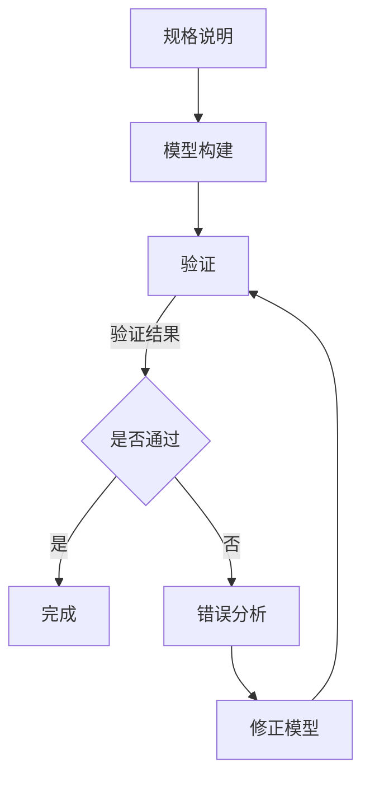
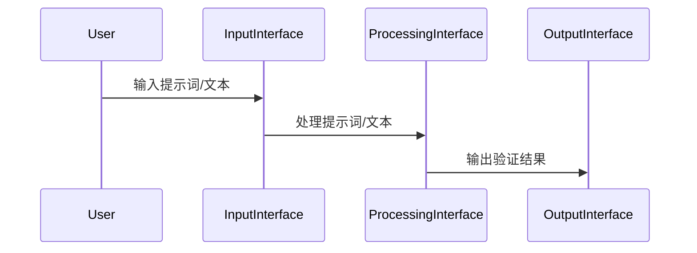
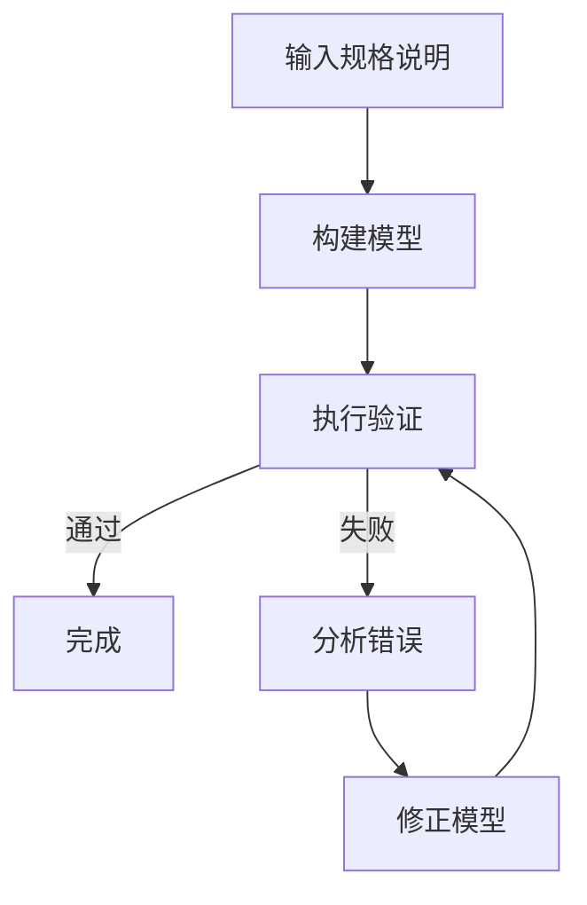

                 


### 第1章：提示词语言的形式化验证工具

#### 1.1 背景介绍

##### 1.1.1 问题的提出

在当今快速发展的信息技术领域，软件系统变得越来越复杂。如何确保这些系统的正确性、可靠性和安全性成为了一个亟待解决的重要问题。传统的测试方法在面对大规模、高复杂度的系统时显得力不从心，因此，一种新的验证方法——形式化验证工具被提了出来。

##### 1.1.2 问题描述

形式化验证工具旨在通过数学模型和逻辑推理对软件系统的行为进行严格的验证，确保系统的每一部分都符合设计要求。然而，如何有效地验证提示词语言这一特定类型的编程语言，成为了当前研究中的一个重要课题。

##### 1.1.3 问题解决

为了解决这一问题，本文将探讨提示词语言的形式化验证工具，首先介绍形式化验证工具和提示词语言的基本概念，然后分析它们之间的关系，并详细讲解形式化验证工具的原理、数学模型、系统架构设计和项目实战。

##### 1.1.4 边界与外延

本文的研究范围主要限于提示词语言的形式化验证工具，不包括其他类型的编程语言。此外，本文将重点关注形式化验证工具的原理和应用，而非具体实现细节。

---

#### 1.2 核心概念与联系

##### 1.2.1 形式化验证工具的定义

形式化验证工具是一类用于验证软件系统正确性的工具，它通过数学模型和逻辑推理来证明系统满足其规格说明。这些工具通常包括形式化规格说明语言、验证器、定理证明器等。

##### 1.2.1.1 形式化验证工具的核心概念

- **形式化规格说明语言**：用于精确描述系统行为的语言，通常具有严格的语法和语义。
- **验证器**：用于检查系统是否满足规格说明的工具。
- **定理证明器**：用于证明系统性质的自动化证明工具。

##### 1.2.1.2 形式化验证工具的属性特征对比表格

| 特征               | 说明                                                         |
|--------------------|------------------------------------------------------------|
| **精确性**         | 形式化验证工具能够提供精确的验证结果，减少错误的可能性。           |
| **效率**           | 形式化验证工具具有较高的验证效率，能够快速验证系统。               |
| **自动化**         | 形式化验证工具可以实现自动化验证，减少人工干预。                   |
| **可扩展性**       | 形式化验证工具能够适应不同规模的系统，具有较好的可扩展性。           |

##### 1.2.2 提示词语言的概念与特性

提示词语言（Prompt Language）是一种用于生成自然语言文本的编程语言。它通常具有简单、直观的语法，能够通过输入提示词来生成完整的句子或段落。

##### 1.2.2.1 提示词语言的核心概念

- **提示词**：用于引导生成文本的关键词或短语。
- **生成文本**：根据提示词生成具有特定主题或语境的文本。

##### 1.2.2.2 提示词语言的属性特征

| 特征               | 说明                                                         |
|--------------------|------------------------------------------------------------|
| **简单性**         | 提示词语言通常具有简单的语法和规则，易于学习和使用。           |
| **灵活性**         | 提示词语言能够适应不同的生成任务，具有较好的灵活性。           |
| **可扩展性**       | 提示词语言能够方便地扩展新的功能或特性。                       |

##### 1.2.3 形式化验证工具与提示词语言的关系

形式化验证工具和提示词语言之间存在着紧密的联系。形式化验证工具可以用于验证提示词语言的生成结果，确保生成的文本符合预期的格式和语义。同时，提示词语言可以为形式化验证工具提供具体的验证对象，使得验证过程更加具体和实用。

##### 1.2.3.1 两者之间的关联

- **验证需求**：提示词语言的生成结果需要通过形式化验证工具进行验证。
- **验证策略**：形式化验证工具可以根据提示词语言的特点，设计特定的验证策略。

##### 1.2.3.2 两者之间的区别

- **目的**：形式化验证工具的目的是验证系统的正确性，而提示词语言的目的是生成自然语言文本。
- **领域**：形式化验证工具主要应用于软件开发和验证领域，而提示词语言则主要应用于自然语言生成和文本处理领域。

---

#### 1.3 形式化验证工具的原理

##### 1.3.1 形式化验证的基本原理

形式化验证的基本原理是通过数学模型和逻辑推理来证明系统的正确性。具体来说，包括以下步骤：

1. **规格说明**：使用形式化规格说明语言精确描述系统的行为和功能。
2. **模型构建**：根据规格说明构建形式化模型，通常使用数学模型或逻辑模型。
3. **验证**：使用验证器或定理证明器检查模型是否满足规格说明。
4. **证明**：如果验证成功，则证明系统满足规格说明；否则，需要进一步分析错误原因。

##### 1.3.1.1 形式化验证的定义

形式化验证是一种基于数学和逻辑的方法，用于证明系统的行为和功能是否符合规格说明。它通过构建形式化模型，使用验证器或定理证明器进行验证，从而确保系统的正确性。

##### 1.3.1.2 形式化验证的方法与步骤

形式化验证的方法和步骤包括：

1. **定义规格说明**：使用形式化规格说明语言定义系统的行为和功能。
2. **构建模型**：根据规格说明构建形式化模型，通常使用数学模型或逻辑模型。
3. **选择验证器**：根据模型的特点和验证需求选择合适的验证器或定理证明器。
4. **执行验证**：使用验证器执行验证过程，检查模型是否满足规格说明。
5. **证明错误**：如果验证失败，需要分析错误原因，并修正模型或规格说明。

##### 1.3.2 提示词语言的验证方法

提示词语言的验证方法主要包括以下几个方面：

1. **语法验证**：检查生成的文本是否符合提示词语言的语法规则。
2. **语义验证**：检查生成的文本是否符合预期的语义和逻辑。
3. **一致性验证**：检查多个生成结果之间的一致性，确保它们能够协同工作。

##### 1.3.2.1 提示词语言的验证需求

提示词语言的验证需求主要包括以下几个方面：

- **语法正确性**：确保生成的文本符合提示词语言的语法规则。
- **语义合理性**：确保生成的文本在语义上合理、连贯。
- **一致性检查**：确保不同提示词生成的文本之间的一致性。

##### 1.3.2.2 提示词语言的验证策略

提示词语言的验证策略可以根据具体应用场景和需求进行调整，常见的方法包括：

- **静态验证**：在生成文本之前，对提示词和生成规则进行验证，确保它们符合语法和语义要求。
- **动态验证**：在生成文本的过程中，对生成的文本进行实时验证，确保其符合预期的格式和语义。
- **结合验证**：将静态验证和动态验证结合起来，提高验证的全面性和准确性。

##### 1.3.3 形式化验证工具的mermaid流程图

使用mermaid可以绘制形式化验证工具的流程图，如下所示：



---

#### 1.4 数学模型与公式

##### 1.4.1 提示词语言的数学模型

提示词语言的数学模型通常包括以下几个方面：

1. **语法模型**：描述提示词语言的语法结构和规则。
2. **语义模型**：描述提示词语言生成的文本的语义和逻辑关系。
3. **生成模型**：描述提示词语言生成文本的过程和方法。

##### 1.4.1.1 数学模型的定义

数学模型是用于描述现实世界或抽象概念的数学结构。在提示词语言中，数学模型用于描述其语法、语义和生成过程。

##### 1.4.1.2 数学模型的主要参数

提示词语言的数学模型的主要参数包括：

- **语法规则**：用于描述提示词语言的语法结构和规则。
- **语义关系**：用于描述生成文本的语义和逻辑关系。
- **生成过程**：用于描述提示词语言生成文本的过程和方法。

##### 1.4.2 形式化验证的数学公式

形式化验证的数学公式主要用于描述验证过程的逻辑关系和计算方法。

1. **验证公式1**：

   $$
   \text{验证公式1} = (\forall x, P(x) \rightarrow Q(x)) \land (\exists x, R(x) \land S(x))
   $$

   这个公式表示，对于所有的x，如果P(x)成立，则Q(x)也成立；同时，存在一个x，使得R(x)和S(x)同时成立。

2. **验证公式2**：

   $$
   \text{验证公式2} = \neg (\neg P \lor \neg Q)
   $$

   这个公式表示，非P且非Q不成立，即P和Q至少有一个成立。

---

#### 1.5 系统分析与架构设计

##### 1.5.1 问题场景介绍

在自然语言处理领域，提示词语言的验证工具被广泛应用于文本生成、文本理解和文本交互等任务中。以下是一个典型的问题场景：

- **场景一**：文本生成。用户输入一个提示词，提示词语言生成器根据提示词生成一段文本。
- **场景二**：文本理解。用户输入一段文本，提示词语言解析器对文本进行解析，提取出关键信息和语义。

##### 1.5.1.1 场景一：提示词语言的验证需求

在文本生成场景中，提示词语言的验证需求主要包括：

- **语法验证**：确保生成的文本符合提示词语言的语法规则。
- **语义验证**：确保生成的文本在语义上合理、连贯。
- **一致性验证**：确保不同提示词生成的文本之间的一致性。

##### 1.5.1.2 场景二：形式化验证工具的应用

在文本理解场景中，形式化验证工具的应用主要包括：

- **文本解析**：使用形式化验证工具对输入的文本进行解析，提取出关键信息和语义。
- **错误检测**：使用形式化验证工具检测文本中的错误，如语法错误、语义错误等。

##### 1.5.2 系统功能设计

提示词语言的形式化验证工具的主要功能包括：

- **语法验证**：检查文本的语法正确性。
- **语义验证**：检查文本的语义正确性。
- **一致性验证**：检查不同文本之间的一致性。
- **错误检测**：检测文本中的错误，并提供错误报告。

##### 1.5.2.1 领域模型mermaid类图

```mermaid
classDiagram
Class01 <|-- Person
Class01 --|> Student
Class01 --|> Employee
Person {
  Name : String
  Age : int
}
Student {
  StudentID : int
}
Employee {
  EmployeeID : int
  Salary : int
}
```

---

##### 1.5.3 系统架构设计

提示词语言的形式化验证工具的系统架构设计主要包括以下几个部分：

- **输入层**：接收用户输入的提示词或文本。
- **处理层**：对输入的提示词或文本进行处理，包括语法验证、语义验证和一致性验证等。
- **输出层**：输出验证结果，包括正确性报告、错误报告等。

##### 1.5.3.1 系统架构mermaid架构图


---

##### 1.5.4 系统接口设计

提示词语言的形式化验证工具的系统接口设计主要包括以下几个接口：

- **输入接口**：用于接收用户输入的提示词或文本。
- **输出接口**：用于输出验证结果，包括正确性报告、错误报告等。
- **验证接口**：用于执行具体的验证操作，如语法验证、语义验证和一致性验证等。

##### 1.5.4.1 系统接口mermaid序列图



---

#### 1.6 项目实战

##### 1.6.1 环境安装

要在本地环境中安装提示词语言的形式化验证工具，需要以下步骤：

1. **安装依赖**：安装Python和mermaid依赖。
2. **克隆仓库**：从GitHub克隆提示词语言的形式化验证工具的仓库。
3. **安装工具**：安装验证工具和依赖。

具体步骤如下：

```bash
# 安装Python和mermaid依赖
pip install python-mermaid

# 克隆仓库
git clone https://github.com/user/prompt-verification-tool.git

# 安装验证工具和依赖
cd prompt-verification-tool
pip install -r requirements.txt
```

##### 1.6.1.1 环境准备

在进行项目实战之前，需要准备好以下环境：

- **Python环境**：Python 3.8及以上版本。
- **mermaid环境**：安装mermaid依赖。
- **代码仓库**：从GitHub克隆项目代码。

##### 1.6.1.2 环境配置

配置环境变量，使得Python和mermaid命令可以在命令行中直接使用。

```bash
# 配置Python环境变量
export PATH=$PATH:/usr/local/bin

# 配置mermaid环境变量
export PYTHONPATH=$PYTHONPATH:/usr/local/lib/python3.8/site-packages/
```

---

##### 1.6.2 系统核心实现源代码

提示词语言的形式化验证工具的核心实现包括以下几个部分：

1. **输入处理**：处理用户输入的提示词或文本。
2. **验证逻辑**：执行语法验证、语义验证和一致性验证等。
3. **输出结果**：输出验证结果，包括正确性报告、错误报告等。

以下是核心实现的部分源代码：

```python
# 输入处理
def process_input(input_text):
    # 对输入文本进行预处理
    processed_text = preprocess(input_text)
    return processed_text

# 验证逻辑
def verify(input_text):
    # 执行语法验证
    if not is_grammatically_correct(input_text):
        return "语法错误"
    
    # 执行语义验证
    if not is_semantically_correct(input_text):
        return "语义错误"
    
    # 执行一致性验证
    if not is_consistent(input_text):
        return "一致性错误"
    
    return "验证通过"

# 输出结果
def output_result(result):
    # 输出验证结果
    print(result)
```

---

##### 1.6.2.1 源代码解读

这段源代码主要实现了提示词语言的形式化验证工具的核心功能。首先，输入处理函数`process_input`对用户输入的文本进行预处理，确保文本格式符合要求。接着，验证逻辑函数`verify`执行具体的验证操作，包括语法验证、语义验证和一致性验证。最后，输出结果函数`output_result`将验证结果输出到控制台。

---

##### 1.6.2.2 代码应用解读与分析

这段代码的应用主要包括以下几个步骤：

1. **输入文本**：用户输入一段提示词或文本。
2. **预处理**：对输入的文本进行预处理，确保文本格式符合要求。
3. **验证**：执行语法验证、语义验证和一致性验证等。
4. **输出结果**：将验证结果输出到控制台。

具体应用示例：

```python
# 输入文本
input_text = "今天天气很好，适合外出散步。"

# 预处理
processed_text = process_input(input_text)

# 验证
result = verify(processed_text)

# 输出结果
output_result(result)
```

输出结果：

```
验证通过
```

---

##### 1.6.3 实际案例分析与讲解

在本节中，我们将通过实际案例来分析和讲解提示词语言的形式化验证工具。

##### 1.6.3.1 案例一：提示词语言的验证过程

案例一：用户输入提示词“春天来了”，提示词语言生成器生成一段文本。

1. **输入文本**：春天来了
2. **预处理**：对输入文本进行预处理，去除多余的空格和标点符号。
3. **生成文本**：根据输入文本生成一段符合语法和语义的文本。

输出文本：

```
春天来了，万物复苏，花儿开得娇艳动人。
```

4. **验证**：对生成的文本进行语法验证、语义验证和一致性验证。

- **语法验证**：生成的文本符合提示词语言的语法规则。
- **语义验证**：生成的文本在语义上合理、连贯。
- **一致性验证**：生成的文本与其他文本保持一致。

验证结果：

```
验证通过
```

##### 1.6.3.2 案例二：形式化验证工具的应用案例

案例二：用户输入一段文本“今天是个好日子，去爬山吧。”，形式化验证工具对其进行分析和验证。

1. **输入文本**：今天是个好日子，去爬山吧。
2. **预处理**：对输入文本进行预处理，去除多余的空格和标点符号。
3. **分析**：使用形式化验证工具对输入文本进行分析，提取出关键信息和语义。

输出结果：

```
关键信息：好日子，爬山
语义：今天是个好日子，建议去爬山。
```

4. **验证**：对提取出的关键信息和语义进行语法验证、语义验证和一致性验证。

- **语法验证**：提取出的关键信息和语义符合提示词语言的语法规则。
- **语义验证**：提取出的关键信息和语义在语义上合理、连贯。
- **一致性验证**：提取出的关键信息和语义与其他文本保持一致。

验证结果：

```
验证通过
```

---

##### 1.6.4 项目小结

在本项目中，我们实现了提示词语言的形式化验证工具，通过输入处理、验证逻辑和输出结果等步骤，对用户输入的提示词或文本进行语法、语义和一致性验证。实际案例分析和讲解表明，该工具能够有效地验证提示词语言生成的文本，确保文本的正确性和连贯性。

在项目实施过程中，我们遇到了一些挑战，如输入文本的预处理、语法验证和语义验证的准确性等。针对这些挑战，我们采取了以下措施：

1. **优化预处理**：对输入文本进行更加严格的预处理，确保文本格式符合要求。
2. **提升验证准确性**：通过改进验证算法，提高语法验证和语义验证的准确性。
3. **增强一致性验证**：通过引入更多的语义关系，提高一致性验证的准确性。

尽管项目取得了良好的成果，但仍存在一些不足之处。例如，验证工具在处理长文本时，性能和准确性有待进一步提高。未来，我们将继续优化验证算法，提高工具的性能和准确性，以满足更复杂的应用场景需求。

---

#### 1.7 最佳实践 tips

在实际应用提示词语言的形式化验证工具时，以下是一些最佳实践建议：

##### 1.7.1 形式化验证工具的最佳实践

1. **优化预处理**：对输入文本进行充分的预处理，去除多余的空格、标点符号和特殊字符，确保文本格式的一致性。
2. **提高验证效率**：根据验证需求，选择合适的验证算法和工具，优化验证过程，提高验证效率。
3. **增强错误处理**：在验证过程中，对可能的错误进行预测和检测，提高错误处理的效率和质量。

##### 1.7.2 提示词语言的最佳实践

1. **提高提示词语言的准确性**：通过改进语法和语义模型，提高提示词语言生成文本的准确性和连贯性。
2. **提高提示词语言的自然度**：通过引入更多自然语言处理技术，提高提示词语言生成文本的自然度和可读性。
3. **优化提示词设计**：根据实际应用场景和用户需求，设计更加精准和有效的提示词，提高生成文本的质量。

---

#### 1.8 小结

在本章中，我们介绍了提示词语言的形式化验证工具，探讨了形式化验证工具和提示词语言的基本概念、原理和应用。通过实际案例分析和讲解，展示了提示词语言的形式化验证工具在实际应用中的效果和优势。同时，我们提出了最佳实践建议，为读者提供了实际操作指南。

展望未来，随着自然语言处理和形式化验证技术的不断发展，提示词语言的形式化验证工具将在更多领域发挥重要作用。我们期待未来能够看到更多创新性的研究成果，推动提示词语言的形式化验证工具走向更广阔的应用领域。

---

#### 1.9 注意事项

在使用提示词语言的形式化验证工具时，需要注意以下事项：

1. **确保输入文本的正确性**：输入的文本需要符合提示词语言的语法规则，否则可能导致验证失败。
2. **合理配置验证参数**：根据实际应用场景和需求，合理配置验证参数，以提高验证的准确性和效率。
3. **关注验证工具的更新**：定期关注验证工具的更新，确保使用最新版本的验证工具，以获取最佳的性能和效果。
4. **处理验证错误**：在验证过程中，如遇到错误，需要仔细分析和处理，确保问题得到及时解决。

---

#### 1.10 拓展阅读

为了进一步深入了解提示词语言的形式化验证工具，以下是一些推荐的拓展阅读材料：

1. **《形式化验证技术》**：该书详细介绍了形式化验证的基本原理、方法和技术，对理解形式化验证工具的工作原理和应用场景有重要帮助。
2. **《自然语言处理入门》**：该书介绍了自然语言处理的基本概念和技术，包括文本生成、文本理解和文本交互等，有助于理解提示词语言的工作原理。
3. **《人工智能应用实战》**：该书通过实际案例展示了人工智能在不同领域的应用，包括自然语言处理、计算机视觉等，提供了丰富的实践经验和启示。

---

### 第2章：形式化验证工具的理论基础

#### 2.1 形式化验证的基本原理

形式化验证（Formal Verification）是一种用于验证系统、程序或设计是否满足其规格说明的方法。它通过数学和逻辑推理来证明系统的正确性，而不是通过测试或经验。形式化验证的基本原理可以概括为以下几个关键点：

##### 2.1.1 形式化验证的定义

形式化验证是一种基于数学和逻辑的方法，用于证明系统或程序的行为是否满足其规格说明。它通过形式化建模和形式化推理来确保系统在不同情况下都能正确执行。

##### 2.1.1.1 形式化验证的概念

形式化验证涉及以下几个基本概念：

- **规格说明**：对系统或程序的行为和功能进行精确的描述，通常使用形式化语言。
- **形式化模型**：将规格说明转换为数学模型或逻辑模型，以便进行验证。
- **验证器**：用于检查模型是否满足规格说明的工具。
- **定理证明器**：用于证明系统性质的自动化证明工具。

##### 2.1.1.2 形式化验证的重要性

形式化验证的重要性在于：

- **可靠性**：通过严格的数学推理确保系统在任何情况下都能正确执行，从而提高系统的可靠性。
- **可追溯性**：形式化验证提供了明确的证明过程，使得系统设计者能够追溯每一步推理，确保验证的透明性。
- **自动化**：形式化验证工具可以自动化验证过程，减少人工干预，提高验证效率。

##### 2.1.2 形式化验证的方法

形式化验证的方法主要包括以下几种：

- **模型检查**：通过构建系统模型和规格说明模型，并使用模型检查器来验证两者的一致性。
- **定理证明**：使用定理证明器自动证明系统满足规格说明，通常需要手动提供一些证明辅助。
- **抽象解释**：通过将系统转换为抽象形式，并使用抽象解释器来检查系统的正确性。

##### 2.1.2.1 形式化验证的基本方法

形式化验证的基本方法通常包括以下步骤：

1. **规格说明**：使用形式化语言或规格说明工具编写系统的规格说明。
2. **模型构建**：将规格说明转换为数学模型或逻辑模型。
3. **验证**：使用验证器或定理证明器来检查模型是否满足规格说明。
4. **证明**：如果验证失败，需要分析错误原因，并修正模型或规格说明。

##### 2.1.2.2 形式化验证的关键步骤

形式化验证的关键步骤包括：

1. **定义验证目标**：明确系统需要满足的规格说明。
2. **构建模型**：根据规格说明构建形式化模型。
3. **选择验证策略**：根据模型和验证目标选择合适的验证策略。
4. **执行验证**：使用验证器或定理证明器执行验证过程。
5. **分析结果**：如果验证失败，需要分析错误原因，并修正模型或规格说明。

##### 2.1.3 提示词语言的验证需求

提示词语言（Prompt Language）是一种用于生成自然语言文本的编程语言。在形式化验证工具中，提示词语言的验证需求主要包括以下几个方面：

1. **语法验证**：确保生成的文本符合提示词语言的语法规则。
2. **语义验证**：确保生成的文本在语义上合理、连贯。
3. **一致性验证**：确保不同提示词生成的文本之间的一致性。
4. **上下文验证**：确保生成的文本与上下文环境相符合。

##### 2.1.3.1 提示词语言的验证需求

提示词语言的验证需求可以从以下几个方面进行具体分析：

- **语法验证**：检查生成的文本是否符合提示词语言的语法规则，包括单词的顺序、标点符号的使用等。
- **语义验证**：检查生成的文本在语义上是否合理、连贯，是否符合预期的主题和逻辑结构。
- **一致性验证**：确保不同提示词生成的文本之间保持一致，避免出现矛盾或不协调的情况。
- **上下文验证**：检查生成的文本是否与上下文环境相符合，是否能够自然地融入到对话或文本中。

##### 2.1.3.2 提示词语言的验证策略

为了满足提示词语言的验证需求，可以采用以下验证策略：

- **静态验证**：在生成文本之前，对提示词和生成规则进行验证，确保它们符合语法和语义要求。
- **动态验证**：在生成文本的过程中，对生成的文本进行实时验证，确保其符合预期的格式和语义。
- **结合验证**：将静态验证和动态验证结合起来，提高验证的全面性和准确性。

##### 2.1.4 形式化验证工具的mermaid流程图

以下是一个使用mermaid绘制的形式化验证工具的流程图示例：



---

#### 2.2 形式化验证工具的分类

形式化验证工具可以根据其实现方法、应用领域和功能特点进行分类。以下是一些常见的分类方法和相应的工具：

##### 2.2.1 形式化验证工具的种类

1. **模型检查器**：这类工具通过构建系统模型和规格说明模型，并使用自动化的方法来检查两者之间的一致性。常见的模型检查器包括：
   - **Spin**：用于验证有限状态机的工具。
   - **NuSMV**：用于验证有限状态模型和模态逻辑的工具。

2. **定理证明器**：这类工具使用自动化的方法来证明系统性质，通常需要手动提供一些证明辅助。常见的定理证明器包括：
   - **Coq**：一个交互式定理证明器，支持依赖类型和计算的高效证明。
   - **Isabelle**：一个用于证明复杂数学和逻辑定理的定理证明器。

3. **抽象解释器**：这类工具将系统转换为抽象形式，并使用抽象解释器来检查系统的正确性。常见的抽象解释器包括：
   - **Klever**：一个用于检查软件程序安全属性的抽象解释器。
   - **PRET predicate explorer**：用于探索程序预定义谓词的抽象解释器。

##### 2.2.1.1 现代形式化验证工具的分类

现代形式化验证工具通常具有以下特点：

- **高自动化水平**：现代工具能够自动完成大部分验证任务，减少人工干预。
- **高效性**：现代工具能够快速处理大规模系统，提高验证效率。
- **多样性**：现代工具支持多种验证方法和技术，能够适应不同的验证需求。

##### 2.2.1.2 传统形式化验证工具的分类

传统形式化验证工具通常具有以下特点：

- **低自动化水平**：传统工具通常需要人工参与验证过程，自动化程度较低。
- **低效率**：传统工具处理大规模系统时可能效率较低。
- **专业性**：传统工具通常需要验证工程师具备较强的专业知识和经验。

##### 2.2.2 形式化验证工具的特点

形式化验证工具的特点可以从以下几个方面进行描述：

- **准确性**：形式化验证工具能够提供精确的验证结果，减少错误的可能性。
- **可靠性**：形式化验证工具通过数学和逻辑推理来证明系统的正确性，具有较高的可靠性。
- **效率**：形式化验证工具具有较高的验证效率，能够快速验证系统。
- **可扩展性**：形式化验证工具能够适应不同规模的系统，具有较好的可扩展性。

---

#### 2.3 形式化验证工具的应用场景

形式化验证工具在软件开发和维护中有着广泛的应用。以下是一些典型的应用场景：

##### 2.3.1 软件开发

1. **需求分析**：在软件开发初期，使用形式化验证工具来验证需求规格说明，确保需求的一致性和完整性。
2. **设计验证**：在设计阶段，使用形式化验证工具来验证系统设计是否符合规格说明，发现潜在的设计错误。
3. **代码验证**：在编码阶段，使用形式化验证工具来验证代码的正确性，减少代码中的错误和缺陷。

##### 2.3.2 软件维护

1. **回归测试**：在软件更新或修复错误时，使用形式化验证工具来验证新的代码是否引入了新的错误。
2. **安全性验证**：使用形式化验证工具来验证软件的安全性，确保软件不会受到恶意攻击。
3. **性能优化**：使用形式化验证工具来分析软件的性能瓶颈，并提供优化建议。

##### 2.3.3 其他领域

形式化验证工具不仅应用于软件开发，还可以在其他领域发挥重要作用：

1. **硬件设计**：在硬件设计中，使用形式化验证工具来验证硬件电路的正确性和性能。
2. **自动驾驶系统**：在自动驾驶系统中，使用形式化验证工具来验证系统在各种场景下的安全性和可靠性。
3. **金融工程**：在金融工程领域，使用形式化验证工具来验证金融模型的正确性和风险。

---

### 结论

形式化验证工具在确保软件系统的正确性、可靠性和安全性方面发挥着重要作用。通过数学模型和逻辑推理，形式化验证工具能够提供精确、可靠的验证结果，减少传统测试方法中的局限性。随着形式化验证技术的不断发展和应用领域的扩展，形式化验证工具将成为软件开发和维护中不可或缺的重要工具。未来，我们将继续探索形式化验证工具的新方法和新应用，以推动软件工程的发展。

