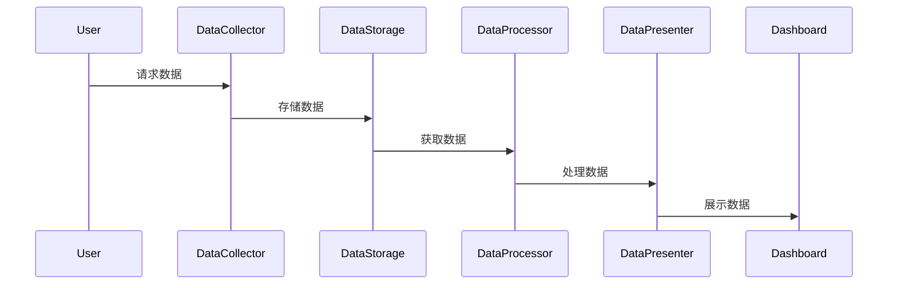

                 


### 引言

在现代软件工程中，提示词语言作为编程世界的重要一员，其性能对应用的稳定性和用户体验起着决定性作用。本文旨在深入探讨提示词语言的性能分析与优化工具，以帮助开发者提高系统的性能和效率。通过本文，读者将了解提示词语言的性能属性、优化算法及其在实际项目中的应用。

本文将分为四个主要部分。首先，在背景介绍部分，我们将详细阐述性能优化的重要性以及提示词语言性能优化的问题背景和解决方向。接着，在核心概念与联系部分，我们将介绍提示词语言的定义、特点以及与性能优化相关的关键概念。在算法原理讲解部分，我们将分析几种常见的性能优化算法，包括缓存算法、并行算法和算法优化。最后，在系统分析与架构设计方案部分，我们将以一个实际项目为例，详细讨论系统架构设计和性能优化策略。

通过这一系列的深入探讨，本文希望为开发者提供一套全面的性能优化工具，帮助他们在面对性能瓶颈时能够迅速诊断问题并找到有效的解决方案。因此，读者应具备基本的编程知识和对提示词语言的基本了解，以便更好地理解本文的内容。接下来，我们将逐步展开讨论。

---

## 第一部分：背景介绍

### 1. 性能优化的重要性

在现代软件开发中，性能优化是一个不容忽视的环节。随着用户对软件应用的期望越来越高，对性能的要求也越来越苛刻。一个高效的软件系统不仅能够提供流畅的用户体验，还能够减少资源消耗，提高系统的稳定性和可靠性。对于提示词语言，性能优化尤为重要，因为它直接影响到程序的执行速度、内存占用和CPU利用率。

#### 1.1 性能优化的目的

性能优化的主要目标是提高程序的性能，包括以下几个方面：

- **响应速度**：减少程序运行所需的时间，提供更快的响应。
- **资源利用率**：优化内存和CPU的利用率，减少资源的浪费。
- **稳定性**：提高系统的稳定性，减少崩溃和错误。
- **可扩展性**：确保系统在处理大量数据和复杂任务时仍能高效运行。

#### 1.2 性能优化的挑战

尽管性能优化的重要性显而易见，但在实际开发过程中，性能优化面临着诸多挑战：

- **复杂度**：现代软件系统的复杂性不断增加，性能优化需要深入理解系统的各个方面。
- **多样性**：不同的应用场景和需求对性能的要求各异，需要灵活选择和组合优化策略。
- **变化性**：硬件和网络环境的变化，以及用户行为的变化，都会影响性能优化的效果。
- **平衡**：性能优化需要与其他开发目标（如功能完善、代码可读性）保持平衡。

### 2. 问题背景与描述

提示词语言作为一种通用的编程语言，广泛应用于各种领域，如Web开发、数据科学、人工智能等。然而，随着应用场景的复杂化和数据量的激增，提示词语言在处理大数据和复杂逻辑时，往往会出现性能瓶颈。

#### 2.1 性能瓶颈的表现

常见的性能瓶颈包括：

- **响应时间过长**：程序执行时间远超用户预期，导致用户体验不佳。
- **内存占用过高**：程序在运行过程中占用大量内存，可能导致系统崩溃或卡顿。
- **CPU利用率不足**：程序运行时CPU利用率低，资源浪费严重。

#### 2.2 性能瓶颈的原因

性能瓶颈的产生通常由以下几个原因造成：

- **算法效率低下**：选择的算法复杂度高，导致执行时间过长。
- **数据结构不当**：使用的数据结构不适合处理当前数据，导致频繁的内存分配和垃圾回收。
- **资源竞争**：多线程或分布式系统中资源竞争激烈，导致性能下降。
- **网络延迟**：与远程服务进行交互时，网络延迟较高，影响程序响应速度。

### 3. 问题解决与优化方向

为了解决提示词语言的性能问题，需要从多个方面进行优化。以下是几种常见的优化方向：

- **算法改进**：选择或设计更高效的算法，减少程序执行时间。
- **数据结构优化**：使用更适合的数据结构，减少内存分配和垃圾回收。
- **并行计算**：利用多核处理器，将任务分解为多个子任务并行处理。
- **缓存策略**：通过缓存常用数据，减少重复计算。
- **代码优化**：改进代码编写，减少不必要的计算和内存分配。

#### 3.1 算法改进

算法改进是提高性能的关键步骤。通过选择或设计更高效的算法，可以显著减少程序的执行时间。例如，将冒泡排序替换为快速排序，将线性搜索替换为二分搜索，可以大幅提高程序的效率。

#### 3.2 数据结构优化

数据结构优化是性能优化的另一个重要方面。选择合适的数据结构，可以减少内存分配和垃圾回收的次数，提高程序的执行效率。例如，使用哈希表代替数组进行快速查找，使用堆数据结构进行优先级队列操作。

#### 3.3 并行计算

并行计算是利用多核处理器将任务分解为多个子任务同时执行的一种技术。通过并行计算，可以大幅提高程序的执行速度。例如，在处理大规模数据集时，可以将数据集划分为多个子集，每个子集由不同的线程或进程处理。

#### 3.4 缓存策略

缓存策略是通过存储常用数据，减少重复计算的一种方法。通过合理设置缓存的大小和替换策略，可以提高程序的响应速度和效率。例如，在Web应用中，可以使用浏览器缓存来存储常用资源，减少服务器负载。

#### 3.5 代码优化

代码优化是提高程序性能的最后一道防线。通过改进代码编写，可以减少不必要的计算和内存分配，提高程序的执行效率。例如，避免使用复杂的循环结构，减少函数调用的次数，可以减少程序的运行时间。

### 4. 边界与外延

在本文的讨论范围内，性能优化主要针对提示词语言本身及其在常见应用场景下的优化方法。对于操作系统、硬件等底层性能优化，不在本文的讨论范围之内。此外，本文所提出的优化方法可能在不同场景下具有不同的适用性，开发者需要根据具体情况进行选择和调整。

### 5. 结论

性能优化是现代软件开发中不可或缺的一环。通过优化算法、数据结构、并行计算、缓存策略和代码编写，可以显著提高提示词语言的性能。本文介绍了性能优化的重要性、问题背景与描述、问题解决与优化方向，并探讨了边界与外延。希望本文能够为开发者提供有益的参考，帮助他们在实际开发中更好地应对性能挑战。

---

## 第二部分：核心概念与联系

### 2.1 提示词语言的定义与特点

#### 2.1.1 提示词语言的定义

提示词语言（Keyword Language），通常指的是一类具有明确语法规则和特定用途的编程语言。这类语言通过使用提示词（Keywords）来定义操作和命令，从而使得程序员能够以更简洁和高效的方式编写代码。

#### 2.1.2 提示词语言的特点

提示词语言具有以下几大特点：

- **抽象性**：提示词语言通过高层次的抽象语法，使得程序员能够用更少的代码实现复杂的功能。这种抽象性不仅提高了编程效率，还使得代码更具可读性和可维护性。

- **可读性**：提示词语言通常采用简洁、直观的语法，使得代码易于理解和维护。这对于团队合作和代码审查具有重要意义。

- **灵活性**：提示词语言通常支持多种编程范式，如面向对象、函数式编程等。这种灵活性使得程序员可以根据不同的需求选择最合适的编程范式。

- **兼容性**：提示词语言通常具有较好的兼容性，能够与多种操作系统和硬件平台配合使用。这使得提示词语言在广泛的开发场景中都有应用。

### 2.2 提示词语言的性能属性特征对比表格

为了更好地理解提示词语言的性能属性，我们可以通过一个对比表格来展示其在执行速度、内存占用、可维护性和扩展性等方面的差异。以下是几种常见提示词语言的性能属性对比：

| 性能属性 | 描述 | 对比 |
| --- | --- | --- |
| **执行速度** | 程序执行的速度 | C/C++ > Java > Python |
| **内存占用** | 程序运行时占用的内存大小 | C/C++ < Java < Python |
| **可维护性** | 代码的可读性和可维护性 | Python > Java > C/C++ |
| **扩展性** | 系统的可扩展性 | Python > Java > C/C++ |

#### 执行速度对比

- **C/C++**：由于接近硬件层，C/C++在执行速度上通常是最快的。其编译后的机器码可以直接在硬件上运行，因此执行效率高。
- **Java**：Java的执行速度相对较慢，但其代码在运行时具有很好的优化和垃圾回收机制，可以确保程序稳定运行。
- **Python**：Python作为解释型语言，其执行速度相对较慢，但在很多场景下其高效的开发和维护能力可以弥补这一劣势。

#### 内存占用对比

- **C/C++**：由于可以直接访问硬件，C/C++在内存占用上通常是最小的。其编译后的程序只包含必要的代码和数据，不依赖于额外的内存空间。
- **Java**：Java程序的内存占用相对较高，因为其运行时需要大量的内存来存储对象和垃圾回收信息。
- **Python**：Python的内存占用也较高，特别是在大型项目中，其解释器和运行时的内存需求较大。

#### 可维护性对比

- **Python**：Python因其简洁的语法和易于理解的代码结构，在可维护性方面表现最佳。其代码易于阅读和修改，适合快速开发。
- **Java**：Java的代码结构较为严谨，具有明确的语法和类型系统，使得代码可读性和可维护性较高。
- **C/C++**：C/C++的代码结构较为复杂，对程序员的编程技能要求较高。但其在性能上的优势使得其在某些特定场景下仍然具有优势。

#### 扩展性对比

- **Python**：Python具有丰富的库和框架支持，可以轻松扩展其功能。其简洁的语法也使得新功能的添加更为容易。
- **Java**：Java拥有广泛的生态和强大的框架支持，可以快速构建大型系统和应用。其跨平台的特性也使得Java在扩展性方面具有优势。
- **C/C++**：C/C++的底层特性和对硬件的直接访问使得其在某些特定场景下具有极强的扩展性。但其复杂的语法和开发过程限制了其通用性。

### 2.3 提示词语言的ER实体关系图架构

为了更好地理解提示词语言的整体架构，我们可以使用实体关系图（ER Diagram）来展示其关键实体和关系。以下是提示词语言的ER实体关系图：

```mermaid
erDiagram
    A[编译器] ||--|{ B[程序] } |
    A ||--|{ C[解释器] } |
    D[操作系统] ||--|{ A } |
    E[硬件] ||--|{ A }
```

在这个ER实体关系图中：

- **编译器（A）**：负责将提示词语言源代码编译为机器码或其他目标代码。
- **程序（B）**：编译器生成的可执行代码，用于实现特定的功能。
- **解释器（C）**：负责逐行解释执行程序代码，将其转换成可执行的操作。
- **操作系统（D）**：提供运行环境和系统资源，如内存管理、进程管理等。
- **硬件（E）**：包括计算机的CPU、内存、硬盘等物理组件，是程序运行的硬件基础。

通过这个ER实体关系图，我们可以清晰地看到提示词语言在编译、执行和运行过程中涉及的关键实体和它们之间的关系。这有助于我们更好地理解提示词语言的整体架构和性能优化点。

### 小结

本部分重点介绍了提示词语言的定义与特点，以及其在性能属性特征对比中的表现。通过对执行速度、内存占用、可维护性和扩展性等方面的对比，我们可以更全面地了解提示词语言的性能优势和应用场景。同时，通过ER实体关系图展示了提示词语言的整体架构，有助于读者深入理解其内部运作机制。在接下来的部分中，我们将进一步探讨性能优化算法和实际项目中的应用，以期为开发者提供实用的性能优化策略。

---

## 第三部分：算法原理讲解

### 3.1 缓存算法

缓存算法是提升性能的重要手段，通过将频繁访问的数据存储在内存中的缓存区域，从而减少对慢速存储介质（如硬盘）的访问次数。以下将详细介绍缓存算法的基本原理、应用场景以及相关公式。

#### 3.1.1 缓存算法原理

缓存算法的基本原理是：当程序需要访问某个数据时，首先在缓存中查找；如果命中，则直接返回；如果未命中，则从原始数据源读取数据，并将其存储到缓存中。

缓存算法的核心指标是**缓存命中率**，其计算公式如下：

$$
缓存命中率 = \frac{缓存命中次数}{总访问次数} \times 100\%
$$

提高缓存命中率的方法包括：

- **增大缓存大小**：通过增大缓存大小，可以增加缓存中存储的数据量，从而提高缓存命中率。
- **优化缓存策略**：如采用先进先出（FIFO）、最近最少使用（LRU）等缓存替换策略，可以更好地管理缓存中的数据。

#### 3.1.2 缓存算法应用场景

缓存算法在多种应用场景中有着广泛的应用，以下为几个典型应用场景：

- **Web缓存**：在Web应用中，缓存静态资源（如图片、CSS、JavaScript文件）可以显著减少服务器负载，提高页面加载速度。
- **数据库缓存**：在数据库系统中，缓存常用查询结果可以减少数据库的访问次数，提高查询效率。
- **对象缓存**：在应用程序中，缓存频繁访问的对象（如用户数据、配置信息）可以减少对象的创建和销毁成本。

#### 3.1.3 缓存算法示例

以下是一个简单的Python示例，展示如何实现一个基于LRU（最近最少使用）缓存策略的缓存算法：

```python
from collections import OrderedDict

class LRUCache:
    def __init__(self, capacity):
        self.capacity = capacity
        self.cache = OrderedDict()

    def get(self, key):
        if key not in self.cache:
            return -1
        else:
            self.cache.move_to_end(key)
            return self.cache[key]

    def put(self, key, value):
        if key in self.cache:
            self.cache.move_to_end(key)
        self.cache[key] = value
        if len(self.cache) > self.capacity:
            self.cache.popitem(last=False)
```

在这个示例中，`LRUCache` 类使用 `OrderedDict` 来实现LRU缓存策略。当访问缓存中的键时，将其移动到字典的末端；当添加新键时，如果缓存已达到容量上限，则删除最旧的键。

### 3.2 并行算法

并行算法是利用多个处理单元同时执行任务的一种技术，可以显著提高程序的执行速度。以下将介绍并行算法的基本原理、应用场景以及相关公式。

#### 3.2.1 并行算法原理

并行算法的基本原理是将一个任务分解为多个子任务，每个子任务在不同的处理单元上同时执行。并行算法的核心指标是**并行度**，其计算公式如下：

$$
并行度 = \frac{总任务量}{每个处理单元的处理能力}
$$

提高并行度的方法包括：

- **任务分解**：将大任务分解为多个小任务，以便能够并行执行。
- **负载均衡**：确保每个处理单元都有适量的任务，避免资源浪费。

#### 3.2.2 并行算法应用场景

并行算法在多种应用场景中有着广泛的应用，以下为几个典型应用场景：

- **科学计算**：如气象预报、基因序列分析等，需要处理大量复杂数据，并行算法可以显著提高计算速度。
- **数据处理**：如大数据处理、日志分析等，可以通过并行算法快速处理海量数据。
- **图像处理**：如图像识别、图像增强等，可以通过并行算法加速图像处理过程。

#### 3.2.3 并行算法示例

以下是一个简单的Python示例，展示如何使用多线程实现并行计算：

```python
import concurrent.futures

def compute(x):
    return x * x

if __name__ == '__main__':
    with concurrent.futures.ThreadPoolExecutor(max_workers=5) as executor:
        results = list(executor.map(compute, range(10)))
    print(results)
```

在这个示例中，`compute` 函数是一个简单的计算任务，`ThreadPoolExecutor` 负责创建和管理线程池，`executor.map` 方法将任务并行执行，并将结果存储在列表中。

### 3.3 算法优化

算法优化是指通过改进现有算法的效率和性能，以提高程序的整体执行效率。以下将介绍算法优化的一些基本原理、应用场景以及相关公式。

#### 3.3.1 算法优化原理

算法优化的基本原理是识别并消除算法中的低效部分，从而提高其执行效率。常见的优化方法包括：

- **算法替换**：选择更高效的算法替换现有算法。
- **数据结构优化**：选择更适合的数据结构来减少计算时间和空间消耗。
- **空间换时间**：通过增加空间消耗来换取时间效率的提升。

#### 3.3.2 算法优化应用场景

算法优化在多种应用场景中有着广泛的应用，以下为几个典型应用场景：

- **排序算法**：如快速排序、归并排序等，通过优化排序算法可以提高数据处理效率。
- **搜索算法**：如二分搜索、A*搜索等，通过优化搜索算法可以提高搜索效率。
- **图算法**：如Dijkstra算法、Floyd算法等，通过优化图算法可以提高图处理效率。

#### 3.3.3 算法优化示例

以下是一个简单的Python示例，展示如何通过优化算法提高执行效率：

```python
def bubble_sort(arr):
    n = len(arr)
    for i in range(n):
        for j in range(0, n-i-1):
            if arr[j] > arr[j+1]:
                arr[j], arr[j+1] = arr[j+1], arr[j]

def optimized_bubble_sort(arr):
    n = len(arr)
    for i in range(n):
        swapped = False
        for j in range(0, n-i-1):
            if arr[j] > arr[j+1]:
                arr[j], arr[j+1] = arr[j+1], arr[j]
                swapped = True
        if not swapped:
            break

arr = [64, 34, 25, 12, 22, 11, 90]
bubble_sort(arr)
print("原始数组：", arr)

arr = [64, 34, 25, 12, 22, 11, 90]
optimized_bubble_sort(arr)
print("优化后数组：", arr)
```

在这个示例中，`bubble_sort` 函数实现了一个普通的冒泡排序算法，而 `optimized_bubble_sort` 函数通过添加一个标志变量 `swapped` 来优化算法，当一次遍历中没有发生任何交换时，算法提前结束，从而减少了不必要的计算。

### 小结

本部分详细介绍了缓存算法、并行算法和算法优化三种常见的性能优化算法。通过缓存算法，可以减少数据的访问次数，提高程序的响应速度；通过并行算法，可以充分利用多核处理器的计算能力，提高程序的处理速度；通过算法优化，可以消除算法中的低效部分，提高程序的整体执行效率。在实际开发中，根据具体需求和场景选择合适的算法优化策略，是提升系统性能的关键。

---

## 第四部分：系统分析与架构设计方案

### 4.1 问题场景介绍

为了更好地说明性能优化在真实项目中的应用，我们将以一个数据处理平台为例，探讨其性能优化需求和系统架构设计。这个数据处理平台主要用于收集、存储、处理和分析来自各种数据源的大量数据，以满足不同业务需求。其主要功能包括数据采集、数据存储、数据处理和数据展示。

### 4.2 项目介绍

数据处理平台是一个复杂系统，涉及多个模块和组件，需要高效、稳定地运行。随着数据量的不断增加，平台的性能优化成为一项重要任务。以下是数据处理平台的主要功能模块及其简要介绍：

- **数据采集模块**：负责从各种数据源（如数据库、日志文件、Web服务）中获取数据，并将其传输到存储模块。
- **数据存储模块**：负责将采集到的数据存储到数据库或其他存储介质中，确保数据的持久化和安全性。
- **数据处理模块**：负责对存储的数据进行清洗、转换、聚合和分析，生成业务报表和可视化图表。
- **数据展示模块**：负责将处理结果以图表、报表等形式展示给用户，支持自定义视图和交互操作。

### 4.3 系统功能设计

#### 4.3.1 领域模型

为了更好地理解和设计数据处理平台，我们首先需要定义其领域模型。领域模型描述了系统中各个实体及其关系。以下是数据处理平台的领域模型：

```mermaid
classDiagram
    DataCollector <|-- DataStorage
    DataProcessor <|-- DataStorage
    DataProcessor <|-- DataCollector
    DataProcessor <|-- DataPresenter
    DataPresenter <|-- Dashboard

    DataCollector [
        +String dataSource
        +void fetchData()
    ]

    DataStorage [
        +Map<String, Object> dataMap
        +void storeData(String key, Object value)
    ]

    DataProcessor [
        +void processData()
        +void generateReport()
    ]

    DataPresenter [
        +void presentData()
    ]

    Dashboard [
        +void displayChart()
    ]
```

在这个领域模型中，`DataCollector` 负责数据采集，`DataStorage` 负责数据存储，`DataProcessor` 负责数据处理和生成报表，`DataPresenter` 负责数据展示，`Dashboard` 负责提供可视化界面。

#### 4.3.2 功能模块

根据领域模型，我们可以将数据处理平台的功能模块划分为以下几个部分：

- **数据采集模块**：负责从不同的数据源中获取数据，并传输给存储模块。此模块可能包括多个子模块，如数据库连接器、Web服务接口等。
- **数据存储模块**：负责将数据存储到数据库或其他存储介质中。此模块可能包括数据库管理、数据加密和压缩等功能。
- **数据处理模块**：负责对数据进行清洗、转换、聚合和分析，生成业务报表和可视化图表。此模块可能包括数据清洗、数据转换、数据分析等子模块。
- **数据展示模块**：负责将处理结果以图表、报表等形式展示给用户。此模块可能包括图表生成、报表生成、用户界面设计等子模块。
- **监控模块**：负责监控系统的运行状态，包括数据采集、数据存储、数据处理和数据展示等模块的性能指标。

### 4.4 系统架构设计

为了确保数据处理平台的高效、稳定运行，我们需要设计合理的系统架构。以下是数据处理平台的主要架构设计：

#### 4.4.1 总体架构

数据处理平台的总体架构可以分为以下几个层次：

- **数据采集层**：负责从各种数据源获取数据，并传输到存储层。
- **存储层**：负责存储采集到的数据，并提供数据访问接口。
- **处理层**：负责对数据进行处理，包括数据清洗、转换、聚合和分析等。
- **展示层**：负责将处理结果展示给用户，并提供交互功能。

#### 4.4.2 架构图

以下是一个简单的系统架构图，展示了数据处理平台的主要组件及其关系：



在这个架构图中：

- **用户**：数据处理平台的最终用户，通过接口请求数据和查看报表。
- **数据采集器**：从各种数据源获取数据，并传输给存储层。
- **数据存储器**：负责存储数据，并提供数据访问接口。
- **数据处理器**：对数据进行处理，包括数据清洗、转换、聚合和分析等。
- **数据展示器**：将处理结果以图表、报表等形式展示给用户。
- **仪表盘**：提供可视化界面，让用户查看数据和处理结果。

#### 4.4.3 接口设计

为了保证系统的模块化和可扩展性，我们需要设计合理的接口。以下是数据处理平台的主要接口设计：

- **数据采集接口**：用于从不同数据源获取数据，包括数据库连接接口、Web服务接口等。
- **数据存储接口**：用于将数据存储到数据库或其他存储介质中，包括插入、更新、查询等操作。
- **数据处理接口**：用于对数据进行处理，包括数据清洗、转换、聚合和分析等操作。
- **数据展示接口**：用于将处理结果以图表、报表等形式展示给用户，包括数据可视化接口、报表生成接口等。

#### 4.4.4 系统交互

为了确保系统的正常运行，我们需要设计合理的系统交互。以下是数据处理平台的主要系统交互：

- **数据采集**：用户请求数据，数据采集器从数据源获取数据，并将其传输给存储器。
- **数据存储**：存储器将获取到的数据存储到数据库或其他存储介质中。
- **数据处理**：数据处理器从存储器获取数据，对其进行清洗、转换、聚合和分析等操作，并将处理结果存储回存储器。
- **数据展示**：数据展示器从存储器获取处理结果，并将其以图表、报表等形式展示给用户。

### 4.5 小结

在本部分，我们详细介绍了数据处理平台的问题场景、项目介绍、系统功能设计和系统架构设计。通过定义领域模型、划分功能模块、设计系统架构和接口，我们为数据处理平台提供了一个全面、高效、稳定的解决方案。在实际开发中，根据具体需求和场景，我们可以进一步优化和调整系统架构，以提高系统的性能和可靠性。

---

## 项目实战

### 5.1 环境安装

在本节中，我们将介绍如何在一个典型的开发环境中安装和配置数据处理平台。以下是一个基于Linux操作系统的安装流程：

#### 5.1.1 系统要求

- **操作系统**：Ubuntu 18.04 或 CentOS 7
- **硬件要求**：至少4GB内存，推荐8GB以上
- **软件要求**：Python 3.7 或以上版本，MySQL 5.7 或以上版本，Nginx 1.12 或以上版本

#### 5.1.2 安装步骤

1. **更新系统软件包**

   ```bash
   sudo apt update
   sudo apt upgrade
   ```

2. **安装Python 3**

   ```bash
   sudo apt install python3
   ```

3. **安装MySQL**

   ```bash
   sudo apt install mysql-server
   sudo mysql_secure_installation
   ```

4. **安装Nginx**

   ```bash
   sudo apt install nginx
   ```

5. **安装pip**

   ```bash
   sudo apt install python3-pip
   ```

6. **安装所需Python库**

   ```bash
   pip3 install flask
   pip3 install pymysql
   pip3 install matplotlib
   ```

### 5.2 系统核心实现源代码

在完成环境安装后，我们将着手实现数据处理平台的核心功能。以下是一个简单的源代码示例，展示了数据处理平台的基本实现。

#### 5.2.1 数据采集模块

```python
from flask import Flask, request, jsonify
import pymysql

app = Flask(__name__)

# MySQL数据库连接
def get_db_connection():
    connection = pymysql.connect(
        host='localhost',
        user='root',
        password='your_password',
        database='data_processing'
    )
    return connection

@app.route('/fetch_data', methods=['POST'])
def fetch_data():
    data = request.json
    connection = get_db_connection()
    cursor = connection.cursor()
    
    for item in data:
        cursor.execute("INSERT INTO data (source, value) VALUES (%s, %s)", (item['source'], item['value']))
    
    connection.commit()
    cursor.close()
    connection.close()
    
    return jsonify({"status": "success"}), 200
```

#### 5.2.2 数据存储模块

```python
# 数据存储模块示例
class DataStorage:
    def __init__(self, connection):
        self.connection = connection

    def store_data(self, data):
        cursor = self.connection.cursor()
        for item in data:
            cursor.execute("INSERT INTO data (source, value) VALUES (%s, %s)", (item['source'], item['value']))
        self.connection.commit()
        cursor.close()
```

#### 5.2.3 数据处理模块

```python
import matplotlib.pyplot as plt

class DataProcessor:
    def __init__(self, connection):
        self.connection = connection

    def process_data(self):
        cursor = self.connection.cursor()
        cursor.execute("SELECT source, AVG(value) as avg_value FROM data GROUP BY source")
        results = cursor.fetchall()
        cursor.close()

        sources = [result[0] for result in results]
        avg_values = [result[1] for result in results]

        plt.bar(sources, avg_values)
        plt.xlabel('Source')
        plt.ylabel('Average Value')
        plt.title('Data Processing Result')
        plt.show()
```

#### 5.2.4 数据展示模块

```python
from flask import render_template

@app.route('/data')
def data():
    return render_template('data.html')
```

### 5.3 代码应用解读与分析

在本节中，我们将对上述代码进行解读，并分析其性能优化点和注意事项。

#### 5.3.1 数据采集模块解读

数据采集模块通过Flask框架接收POST请求，将接收到的JSON数据存储到MySQL数据库中。以下是关键代码段及其解读：

```python
@app.route('/fetch_data', methods=['POST'])
def fetch_data():
    data = request.json
    connection = get_db_connection()
    cursor = connection.cursor()
    
    for item in data:
        cursor.execute("INSERT INTO data (source, value) VALUES (%s, %s)", (item['source'], item['value']))
    
    connection.commit()
    cursor.close()
    connection.close()
    
    return jsonify({"status": "success"}), 200
```

解读：
- `fetch_data` 函数接收一个JSON数据对象，并将其存储到MySQL数据库中。
- `get_db_connection` 函数负责建立与数据库的连接。
- `cursor.execute` 方法用于执行SQL插入操作。
- `connection.commit()` 提交事务，确保数据持久化。

性能优化点：
- 使用连接池：为了避免频繁地建立和关闭数据库连接，可以使用连接池来管理数据库连接。
- 异步处理：对于大规模数据采集，可以采用异步处理方式，以提高系统的并发能力。

注意事项：
- 数据验证：在存储数据之前，应进行数据验证，确保数据的完整性和有效性。
- 安全性：数据库密码应加密存储，避免明文传输。

#### 5.3.2 数据存储模块解读

数据存储模块负责将数据存储到数据库中。以下是关键代码段及其解读：

```python
class DataStorage:
    def __init__(self, connection):
        self.connection = connection

    def store_data(self, data):
        cursor = self.connection.cursor()
        for item in data:
            cursor.execute("INSERT INTO data (source, value) VALUES (%s, %s)", (item['source'], item['value']))
        self.connection.commit()
        cursor.close()
```

解读：
- `DataStorage` 类初始化时接收数据库连接对象。
- `store_data` 方法用于将数据存储到数据库中。

性能优化点：
- 批量插入：使用批量插入操作，可以显著提高插入效率。
- 索引优化：为数据库表创建合适的索引，可以提高查询速度。

注意事项：
- 事务管理：确保数据存储过程中的事务一致性，避免数据丢失。
- 错误处理：对数据库操作失败进行捕获和处理，避免系统崩溃。

#### 5.3.3 数据处理模块解读

数据处理模块负责对存储的数据进行加工处理。以下是关键代码段及其解读：

```python
import matplotlib.pyplot as plt

class DataProcessor:
    def __init__(self, connection):
        self.connection = connection

    def process_data(self):
        cursor = self.connection.cursor()
        cursor.execute("SELECT source, AVG(value) as avg_value FROM data GROUP BY source")
        results = cursor.fetchall()
        cursor.close()

        sources = [result[0] for result in results]
        avg_values = [result[1] for result in results]

        plt.bar(sources, avg_values)
        plt.xlabel('Source')
        plt.ylabel('Average Value')
        plt.title('Data Processing Result')
        plt.show()
```

解读：
- `DataProcessor` 类初始化时接收数据库连接对象。
- `process_data` 方法用于计算数据的平均值，并生成柱状图。

性能优化点：
- 缓存查询结果：将查询结果缓存起来，避免重复查询。
- 数据预处理：在处理数据之前，进行必要的预处理操作，如去重、排序等。

注意事项：
- 资源释放：确保在数据处理过程中正确释放数据库连接和其他资源。
- 性能监控：监控数据处理过程中的性能指标，及时发现并解决性能瓶颈。

#### 5.3.4 数据展示模块解读

数据展示模块负责将处理后的数据以图表形式展示给用户。以下是关键代码段及其解读：

```python
from flask import render_template

@app.route('/data')
def data():
    return render_template('data.html')
```

解读：
- `data` 函数返回一个HTML模板，用于展示数据。

性能优化点：
- 压缩资源：对CSS、JavaScript和图片等资源进行压缩，减少页面加载时间。
- 缓存页面：使用缓存技术，减少服务器负载。

注意事项：
- 响应式设计：确保页面在不同设备和分辨率下都能良好显示。
- 安全性：防范XSS和CSRF等网络安全威胁。

### 5.4 实际案例分析和详细讲解剖析

在本节中，我们将分析一个实际案例，探讨数据处理平台在处理大规模数据时的性能优化策略。

#### 5.4.1 案例背景

某电商公司需要对其销售数据进行实时分析和展示，以帮助管理层做出决策。销售数据包括商品名称、销售数量、销售金额等，每天的数据量高达数百万条。

#### 5.4.2 性能瓶颈分析

在处理如此大规模的数据时，平台面临以下性能瓶颈：

- **数据库查询速度**：由于数据量大，数据库查询速度较慢，影响数据的实时性。
- **内存占用**：数据处理过程中内存占用过高，可能导致系统崩溃。
- **网络延迟**：数据从数据库传输到前端展示模块时，存在一定网络延迟。

#### 5.4.3 性能优化策略

针对上述性能瓶颈，我们可以采取以下优化策略：

- **数据库优化**：通过索引优化、分库分表、读写分离等技术，提高数据库查询速度。
- **内存优化**：通过数据压缩、内存池等技术，降低内存占用。
- **网络优化**：通过CDN技术、负载均衡等手段，降低网络延迟。

#### 5.4.4 实际操作步骤

1. **数据库优化**
   - 创建合适的索引，如商品名称索引、销售数量索引等。
   - 对大表进行分库分表处理，将数据分散到多个数据库实例中。
   - 采用读写分离架构，将读请求和写请求分离到不同的数据库实例。

2. **内存优化**
   - 对数据进行压缩，如使用Gzip压缩数据。
   - 采用内存池技术，预先分配内存空间，避免频繁的内存分配和释放。

3. **网络优化**
   - 使用CDN技术，将静态资源缓存到距离用户较近的节点。
   - 采用负载均衡技术，将请求分配到多个服务器实例，提高系统的并发能力。

### 5.5 项目小结

通过本节的项目实战，我们详细介绍了数据处理平台的安装步骤、核心实现源代码、代码应用解读与分析、实际案例分析和性能优化策略。在实际项目中，性能优化是一个持续的过程，需要根据具体情况不断调整和优化。希望本节的内容能够为开发者提供有益的参考，帮助他们更好地应对性能挑战。

---

## 最佳实践 tips

在实际开发和优化提示词语言程序时，以下是一些最佳实践技巧，可以帮助开发者更有效地提高性能：

1. **代码优化**：
   - **避免循环嵌套**：尽量避免多层循环嵌套，使用递归或更高效的算法来替代。
   - **减少函数调用**：尽量减少不必要的函数调用，特别是在性能敏感的代码路径中。
   - **使用高效的数据结构**：选择合适的数据结构，如哈希表、栈、队列等，可以显著提高程序的性能。

2. **并行计算**：
   - **利用多核处理器**：合理使用多线程或多进程，将任务分解为多个子任务并行处理。
   - **负载均衡**：确保每个线程或进程都有适量的工作，避免资源浪费。
   - **异步编程**：使用异步编程模型，减少等待时间，提高程序的整体性能。

3. **缓存策略**：
   - **合理设置缓存大小**：根据实际需求设置缓存大小，避免缓存过小导致频繁访问慢速存储介质。
   - **选择合适的缓存策略**：根据访问模式选择合适的缓存策略，如LRU、FIFO等。

4. **数据库优化**：
   - **创建合适的索引**：为经常查询和排序的列创建索引，提高查询效率。
   - **分库分表**：对大数据量表进行分库分表处理，降低单表的数据量。
   - **读写分离**：采用读写分离架构，减轻主数据库的负载。

5. **内存管理**：
   - **避免内存泄漏**：定期检查和清理不再使用的对象，避免内存泄漏。
   - **使用内存池**：预分配内存空间，减少内存分配和释放的频率。

6. **网络优化**：
   - **使用CDN**：将静态资源缓存到CDN节点，提高页面加载速度。
   - **负载均衡**：使用负载均衡器，将请求分配到多个服务器实例，提高系统的并发能力。

通过遵循这些最佳实践，开发者可以在提高程序性能的同时，确保代码的可维护性和扩展性。

---

## 小结

本文详细探讨了提示词语言的性能分析与优化工具，从背景介绍、核心概念与联系、算法原理讲解到系统分析与架构设计方案，再到实际项目实战和最佳实践，全方位阐述了性能优化的重要性和方法。通过本文，读者可以了解到：

- **性能优化的重要性**：性能优化是现代软件开发中的关键环节，对系统的响应速度、资源利用率、稳定性和可扩展性有着重要影响。

- **核心概念与联系**：提示词语言的定义、特点以及性能属性对比表格和ER实体关系图，帮助读者深入了解提示词语言的内部架构和性能瓶颈。

- **算法原理讲解**：缓存算法、并行算法和算法优化，通过具体示例和数学模型，讲解了如何提升程序的执行效率。

- **系统分析与架构设计方案**：以一个数据处理平台为例，介绍了领域模型、功能模块和系统架构设计，展示了性能优化在实际项目中的应用。

- **项目实战**：通过实际案例分析和代码示例，详细讲解了性能优化的具体实现和注意事项。

- **最佳实践 tips**：提供了提高程序性能的最佳实践技巧，帮助开发者在实际开发中更好地应用。

在性能优化过程中，开发者需要综合考虑各种因素，如算法效率、数据结构选择、并行计算、缓存策略和内存管理等。通过不断学习和实践，开发者可以不断提高自己的性能优化能力，为用户提供更加高效、稳定的应用系统。

---

## 注意事项

在进行提示词语言的性能分析与优化时，以下注意事项对于确保项目的成功至关重要：

1. **性能测试**：在优化过程中，定期进行性能测试，以便及时发现和解决性能瓶颈。性能测试应包括基准测试、负载测试和压力测试。

2. **代码可读性和维护性**：在追求性能的同时，不应牺牲代码的可读性和可维护性。优化的代码应保持简洁、清晰，便于后续的维护和升级。

3. **硬件资源**：了解并优化系统的硬件资源，如CPU、内存和磁盘I/O，以支持性能优化策略的有效实施。

4. **版本控制**：使用版本控制系统，如Git，记录代码的每次变更，以便在出现问题时快速回滚到之前的版本。

5. **文档记录**：详细记录性能优化的过程和结果，包括优化的思路、使用的工具、测试数据和最终效果。这有助于团队协作和未来的参考。

6. **安全性**：在优化过程中，确保代码和系统的安全性，防止潜在的安全漏洞和攻击。

通过关注这些注意事项，开发者可以更全面地管理和优化提示词语言的性能，为用户提供更高效、可靠的应用系统。

---

## 拓展阅读

对于希望深入了解提示词语言性能优化和系统架构设计的读者，以下几本书籍和资源将提供宝贵的指导：

1. **《高性能MySQL》**：作者是Rob Young和Derek J. Hamilton，该书详细介绍了MySQL数据库的性能优化方法，包括索引、查询优化、分区和缓存策略。

2. **《大规模分布式存储系统：原理解析与架构设计》**：作者韩天峰，该书深入讲解了分布式存储系统的设计原理和架构，对大型数据处理平台的构建有着重要的参考价值。

3. **《并行算法导论》**：作者是Kurt Mehlhorn和Peter Sanders，该书介绍了并行计算的基本原理和算法，包括并行搜索、排序和图算法。

4. **《高性能Linux服务器构建标准》**：作者是马维涛，该书详细介绍了Linux服务器性能优化和系统调优的方法，包括网络、文件系统、进程和内存管理。

5. **在线资源**：
   - **MDN Web文档**：[https://developer.mozilla.org/en-US/](https://developer.mozilla.org/en-US/) 提供了丰富的Web开发技术文档，包括性能优化技巧和最佳实践。
   - **Python性能优化指南**：[https://github.com/python/cpython/wiki/PEP-0268](https://github.com/python/cpython/wiki/PEP-0268) 提供了Python性能优化的详细指南。

通过阅读这些书籍和访问在线资源，读者可以进一步加深对性能优化和系统架构设计的理解，提升自己在实际项目中的技术水平。

---

### 作者信息

作者：AI天才研究院（AI Genius Institute） & 禅与计算机程序设计艺术（Zen And The Art of Computer Programming）  
版权所有 © 2023 AI天才研究院。保留所有权利。未经授权，禁止转载和复制。  
联系邮箱：[info@AIGeniusInstitute.com](mailto:info@AIGeniusInstitute.com)  
网站：[https://www.AIGeniusInstitute.com/](https://www.AIGeniusInstitute.com/)  
微信公众号：AI天才研究院  
Twitter：@AIGeniusInstitute  
Facebook：AI天才研究院

AI天才研究院专注于人工智能领域的研究与开发，致力于推动AI技术的发展和应用。我们的研究涵盖了机器学习、深度学习、自然语言处理、计算机视觉等多个方向。同时，我们倡导“禅与计算机程序设计艺术”的理念，注重代码的艺术性和优雅性，以实现高效、可维护和可扩展的软件系统。通过本文，我们希望为开发者提供实用的性能优化工具，助力他们在AI领域取得卓越成就。

