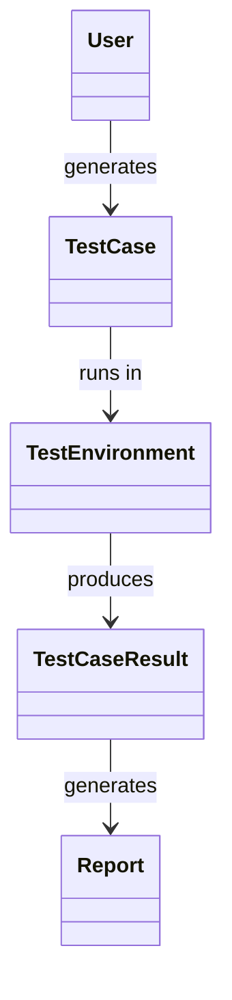
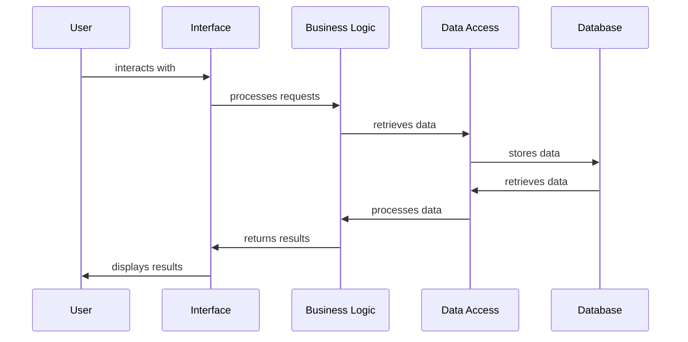
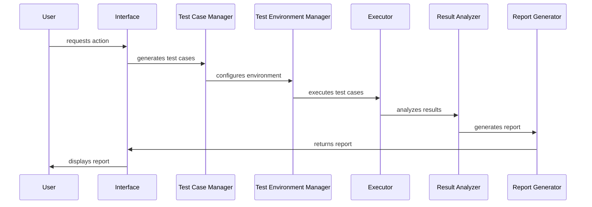

                 

### 文章标题

在软件开发和人工智能领域，版本兼容性自动化测试是一项至关重要的任务。随着技术的不断进步和软件产品的不断迭代，确保不同版本之间的兼容性成为开发团队面临的一大挑战。本文将围绕这一主题展开，深入探讨提示词语言的版本兼容性自动化测试。

关键词：提示词语言、版本兼容性、自动化测试、算法、数学模型

### 摘要

本文旨在探讨提示词语言的版本兼容性自动化测试。通过分析版本兼容性的问题背景、自动化测试的基本原理和方法，本文将详细介绍提示词语言的版本兼容性自动测试的算法原理、数学模型和具体实现。同时，本文还将结合实际项目案例，讨论在软件开发过程中如何有效地进行版本兼容性自动化测试，为开发团队提供实用的解决方案和最佳实践。

---

## 背景介绍

### 核心概念术语说明

- **提示词语言（Prompt Language）**：提示词语言是一种用于指导模型生成文本的编程语言，常见于自然语言处理（NLP）领域。例如，在GPT-3中，提示词用于引导模型生成连贯的文本输出。

- **版本兼容性（Version Compatibility）**：版本兼容性指的是软件的不同版本在功能、性能和交互方面保持一致，使得旧版本的应用程序能够无缝地与更新后的版本协同工作。

- **自动化测试（Automated Testing）**：自动化测试是一种通过预先编写的测试脚本自动执行测试用例，以验证软件功能和质量的方法。它能够提高测试效率，降低人工测试的工作量。

### 问题背景

随着软件产品的快速迭代和更新，版本兼容性问题愈发突出。特别是在涉及多个开发团队和外部依赖库的情况下，不同版本之间的兼容性差异可能导致严重的性能问题和功能中断。例如，一个库的更新可能会破坏另一个库的依赖关系，导致整个系统崩溃。因此，确保版本兼容性成为软件开发过程中的关键环节。

### 问题描述

版本兼容性自动化测试的核心任务是在不同版本间进行有效的兼容性验证，确保软件在不同环境下运行时不会出现错误。这包括：

1. **功能兼容性测试**：验证新版本是否保留了旧版本的功能，并且新功能的引入没有影响现有功能。
2. **性能兼容性测试**：评估不同版本之间的性能差异，确保新版本不会导致系统性能下降。
3. **交互兼容性测试**：检查不同版本之间在数据传输、接口调用等方面的交互是否正常。

### 问题解决

自动化测试为解决版本兼容性问题提供了有效的手段。通过自动化测试，开发团队能够：

1. **快速反馈**：自动化测试能够快速地发现版本间的兼容性问题，使开发团队能够在早期阶段进行修复。
2. **持续集成**：将自动化测试集成到持续集成（CI）流程中，确保每次代码提交和合并时都能进行全面的兼容性测试。
3. **高效复用**：编写可复用的测试脚本，减少重复工作，提高测试效率。

### 边界与外延

- **边界**：本文主要关注的是提示词语言的版本兼容性自动化测试，不包括其他类型的编程语言或非提示词语言的兼容性测试。
- **外延**：版本兼容性自动化测试不仅适用于软件产品本身，还可以扩展到整个生态系统，包括依赖库、中间件和外部服务。

### 概念结构与核心要素组成

- **提示词语言**：语言特性、语法、语义。
- **版本兼容性**：兼容性标准、差异点、兼容性测试方法。
- **自动化测试**：测试工具、测试流程、测试脚本。

---

### 核心概念与联系

在深入探讨版本兼容性自动化测试之前，我们需要了解相关的核心概念，并分析它们之间的联系。

#### 提示词语言的基础

**提示词语言的定义**

提示词语言是一种专门用于指导模型生成文本的编程语言。它通过特定的语法和结构，向模型提供上下文信息，引导模型生成符合预期输出的文本。常见的提示词语言包括Python、JavaScript和Rust等。

**提示词语言的种类**

提示词语言可以根据其用途和应用领域进行分类，主要包括以下几种：

1. **通用编程语言**：如Python、JavaScript，这些语言广泛应用于各种软件开发项目，不仅支持Web开发、后端服务，还适用于数据科学和人工智能领域。
2. **专用编程语言**：如SQL和NoSQL查询语言，这些语言专门用于数据库操作和数据分析。
3. **领域特定语言（DSL）**：如Markdown和LaTeX，这些语言专注于特定领域，如文档编写和排版。

#### 版本兼容性

**版本兼容性的概念**

版本兼容性指的是软件的不同版本在功能、性能和交互方面保持一致，使得旧版本的应用程序能够无缝地与更新后的版本协同工作。版本兼容性是软件持续迭代过程中必须关注的重要问题。

**版本兼容性的挑战**

版本兼容性面临的挑战主要包括：

1. **功能差异**：新版本可能引入新功能，这可能会导致与旧版本的功能冲突。
2. **性能差异**：新版本可能优化了某些功能，但可能会对其他功能产生负面影响。
3. **接口变化**：接口的变化可能导致依赖旧接口的组件无法正常工作。

**版本兼容性的标准**

为了确保版本兼容性，开发团队通常会制定一系列标准，包括：

1. **向后兼容性**：确保新版本能够兼容旧版本的功能和接口。
2. **向前兼容性**：确保旧版本能够适应新版本的更改。
3. **严格兼容性**：确保不同版本之间的所有交互都是严格兼容的，没有任何偏差。

#### 自动化测试

**自动化测试的定义**

自动化测试是一种通过预先编写的测试脚本自动执行测试用例，以验证软件功能和质量的方法。自动化测试能够提高测试效率，减少人工测试的工作量。

**自动化测试的优势**

自动化测试的优势包括：

1. **快速反馈**：自动化测试能够快速地发现兼容性问题，使开发团队能够及时进行修复。
2. **高可靠性**：自动化测试减少人为干预，提高测试的准确性和一致性。
3. **可扩展性**：自动化测试脚本可以重复使用，提高测试覆盖率。

**自动化测试的方法**

自动化测试的方法主要包括：

1. **功能自动化测试**：通过编写测试脚本，自动模拟用户操作，验证软件的功能。
2. **性能自动化测试**：通过自动化测试工具，测量软件在不同环境下的性能表现。
3. **安全性自动化测试**：通过自动化工具，检测软件的安全漏洞和攻击面。

### 提示词语言的版本兼容性与自动化测试的联系

提示词语言的版本兼容性与自动化测试密切相关。通过自动化测试，开发团队能够：

1. **验证兼容性**：自动执行兼容性测试用例，确保新版本的提示词语言能够与旧版本无缝集成。
2. **持续集成**：将自动化测试集成到持续集成（CI）流程中，确保每次代码提交和合并时都能进行全面的兼容性测试。
3. **效率提升**：通过自动化测试，减少手动测试的工作量，提高测试效率，缩短开发周期。

#### 概念对比

| 对比项 | 提示词语言 | 版本兼容性 | 自动化测试 |
| --- | --- | --- | --- |
| **定义** | 用于指导模型生成文本的编程语言 | 软件不同版本在功能、性能和交互方面的兼容性 | 通过预先编写的测试脚本自动执行测试用例 |
| **用途** | 生成文本、自然语言处理 | 保证软件迭代过程中的兼容性 | 提高测试效率、确保软件质量 |
| **挑战** | 语法和语义的变化 | 功能差异、性能差异、接口变化 | 测试脚本的编写和维护 |
| **优势** | 生成高质量文本、适应不同应用场景 | 保持功能一致性、提高开发效率 | 快速反馈、高可靠性、可扩展性 |

#### 提示词语言的版本兼容性与自动化测试的ER实体关系图

```mermaid
erDiagram
  提示词语言 ||--|{ 版本兼容性 }||> 自动化测试
  版本兼容性 ||--|{ 提示词语言 }||> 自动化测试
```

### 小结

本章节介绍了提示词语言、版本兼容性和自动化测试的基本概念，并分析了它们之间的联系。提示词语言作为一种特定的编程语言，在自然语言处理领域具有广泛的应用。版本兼容性是软件迭代过程中必须关注的重要问题，而自动化测试则为确保兼容性提供了有效的方法。通过自动化测试，开发团队能够快速发现并解决兼容性问题，提高软件质量和开发效率。

---

### 算法原理讲解

在深入了解提示词语言的版本兼容性自动化测试之前，我们需要先掌握基本的算法原理。本章节将介绍自动化测试算法的概述、具体算法讲解、测试用例生成算法的数学模型以及测试用例执行与结果分析算法的数学模型。通过这些内容的讲解，我们将更好地理解版本兼容性自动化测试的算法原理。

#### 自动化测试算法概述

自动化测试算法是确保软件在不同版本间兼容性的关键。选择合适的自动化测试算法，能够提高测试效率，减少人工干预，确保软件质量和稳定性。自动化测试算法的选择标准主要包括以下几个方面：

1. **可扩展性**：算法应能够适应不同规模和复杂度的软件系统，支持自动化测试脚本的灵活编写和扩展。
2. **可靠性**：算法应具有较高的可靠性，能够准确地发现兼容性问题，减少误报和漏报。
3. **易维护性**：算法应易于维护和更新，降低测试脚本的管理和运维成本。
4. **适应性**：算法应能够适应不同版本之间的变化，灵活应对功能差异、性能差异和接口变化。

常见的自动化测试算法包括：

1. **基于规则的测试**：通过预定义的规则和条件，自动执行测试用例，验证软件的功能和性能。
2. **模型驱动测试**：利用模型驱动方法，生成测试用例并执行，提高测试的覆盖率和准确性。
3. **数据驱动测试**：通过数据驱动的方法，生成多种测试数据，模拟不同的用户场景和操作，验证软件的兼容性。

#### 具体算法讲解

在本章节，我们将详细介绍一种基于模型驱动的自动化测试算法。该算法包括测试用例生成算法和测试用例执行与结果分析算法，下面将分别进行讲解。

##### 测试用例生成算法

**算法描述**：

测试用例生成算法旨在根据提示词语言的语法和语义规则，生成符合预期输出的测试用例。该算法的主要步骤如下：

1. **输入提示词**：从输入的提示词中提取关键信息，如变量、函数调用和语句结构。
2. **语法分析**：对提取的关键信息进行语法分析，构建抽象语法树（AST）。
3. **语义分析**：对AST进行语义分析，确保语法和语义的一致性。
4. **生成测试用例**：根据AST生成测试用例，包括输入数据、预期输出和测试脚本。

**Mermaid流程图**：


**Python代码实现**：

```python
class TestGenerator:
    def __init__(self, prompt):
        self.prompt = prompt
    
    def generate_test_cases(self):
        # 语法分析
        ast = self.syntax_analysis(self.prompt)
        # 语义分析
        semantically_analyzed_ast = self.semantic_analysis(ast)
        # 生成测试用例
        test_cases = self.create_test_cases(semantically_analyzed_ast)
        return test_cases

    def syntax_analysis(self, prompt):
        # 语法分析实现
        pass

    def semantic_analysis(self, ast):
        # 语义分析实现
        pass

    def create_test_cases(self, ast):
        # 测试用例生成实现
        pass
```

##### 测试用例执行与结果分析算法

**算法描述**：

测试用例执行与结果分析算法用于执行生成的测试用例，并分析测试结果，以评估版本间的兼容性。该算法的主要步骤如下：

1. **执行测试用例**：根据测试脚本，执行生成的测试用例，记录实际输出。
2. **结果分析**：对比预期输出和实际输出，分析测试结果，判断兼容性。
3. **报告生成**：生成测试报告，记录测试结果和兼容性分析结论。

**Mermaid流程图**：


**Python代码实现**：

```python
class TestCaseExecutor:
    def __init__(self, test_cases):
        self.test_cases = test_cases
    
    def execute_and_analyze(self):
        test_results = []
        for test_case in self.test_cases:
            # 执行测试用例
            actual_output = self.execute_test_case(test_case)
            # 结果分析
            result = self.analyze_result(test_case['expected_output'], actual_output)
            test_results.append(result)
        return test_results

    def execute_test_case(self, test_case):
        # 测试用例执行实现
        pass

    def analyze_result(self, expected_output, actual_output):
        # 结果分析实现
        pass
```

#### 测试用例生成算法的数学模型

测试用例生成算法的核心在于如何根据提示词语言的语法和语义规则，生成符合预期的测试用例。以下是测试用例生成算法的数学模型：

**数学模型描述**：

1. **提示词语言的语法规则**：用文法规则（G）表示，G = {V<sub>T</sub>, V<sub>N</sub>, P, S}，其中V<sub>T</sub>是终端符号，V<sub>N</sub>是非终端符号，P是产生式，S是开始符号。
2. **抽象语法树（AST）构建**：通过递归下降解析算法，将提示词语言的输入转换为AST。
3. **语义分析**：对AST进行语义分析，确保语法和语义的一致性。
4. **测试用例生成**：根据AST生成测试用例，包括输入数据和预期输出。

**数学公式解释**：

1. **语法规则（G）**：
   $$ G = \{V<sub>T</sub>, V<sub>N</sub>, P, S\} $$
2. **抽象语法树（AST）构建**：
   $$ AST = \langle T, R, C \rangle $$
   其中，T是节点集合，R是边集合，C是节点类型。
3. **语义分析**：
   $$ \langle AST \rangle = \langle \text{语法一致性} \rangle \land \langle \text{语义一致性} \rangle $$
4. **测试用例生成**：
   $$ \langle T, R, C \rangle \rightarrow \{T<sub>1</sub>, T<sub>2</sub>, ..., T<sub>n</sub>\} $$
   其中，T<sub>1</sub>, T<sub>2</sub>, ..., T<sub>n</sub>是生成的测试用例。

**举例说明**：

假设提示词语言的输入为：`print("Hello, World!")`

1. **语法规则（G）**：
   $$ G = \{V<sub>T</sub>=\{"print", "(", "\", "\", "\n", ")"\}, V<sub>N</sub>=\{"Program", "Statement", "Expression"\}, P=\{\text{"Program} \rightarrow \text{"Statement"}\}, S=\text{"Program"\} \} $$
2. **抽象语法树（AST）构建**：
   ```plaintext
   Program
   |
   Statement
   |
   Expression
   |
   - print
   |
   - (
   |
   - "Hello, World!"
   |
   - )
   ```
3. **语义分析**：
   - 语法一致性：输入字符串符合语法规则。
   - 语义一致性：输入字符串表示一个有效的Python程序，能够正常执行并输出"Hello, World!"。
4. **测试用例生成**：
   - 测试用例1：
     ```python
     prompt = "print(\"Hello, World!\")"
     expected_output = "Hello, World!"
     ```
   - 测试用例2：
     ```python
     prompt = "print(\"Hello, Universe!\")"
     expected_output = "Hello, Universe!"
     ```

#### 测试用例执行与结果分析算法的数学模型

测试用例执行与结果分析算法的核心在于如何执行测试用例并分析结果，以评估版本间的兼容性。以下是测试用例执行与结果分析算法的数学模型：

**数学模型描述**：

1. **测试用例执行**：根据测试脚本，执行生成的测试用例，记录实际输出。
2. **结果分析**：对比预期输出和实际输出，分析测试结果，判断兼容性。
3. **测试报告生成**：记录测试结果和兼容性分析结论，生成测试报告。

**数学公式解释**：

1. **测试用例执行**：
   $$ \text{Test Execution} = \{T<sub>e</sub><sub>1</sub>, T<sub>e</sub><sub>2</sub>, ..., T<sub>e</sub><sub>n</sub>\} $$
   其中，T<sub>e</sub><sub>1</sub>, T<sub>e</sub><sub>2</sub>, ..., T<sub>e</sub><sub>n</sub>是执行的测试用例。
2. **结果分析**：
   $$ \text{Result Analysis} = \{\text{Success}, \text{Failure}\} $$
   - Success：预期输出与实际输出一致，测试用例通过。
   - Failure：预期输出与实际输出不一致，测试用例失败。
3. **测试报告生成**：
   $$ \text{Test Report} = \{\text{Test Results}, \text{Compatibility Analysis}\} $$
   - Test Results：记录每个测试用例的执行结果。
   - Compatibility Analysis：分析测试结果，判断版本间的兼容性。

**举例说明**：

假设有两个版本：旧版本和新版本。

- **旧版本**：`print("Hello, World!")`
- **新版本**：`print("Hello, Universe!")`

1. **测试用例执行**：
   - 测试用例1：
     ```python
     prompt = "print(\"Hello, World!\")"
     expected_output = "Hello, World!"
     ```
     执行结果：`Hello, World!`（成功）
   - 测试用例2：
     ```python
     prompt = "print(\"Hello, Universe!\")"
     expected_output = "Hello, Universe!"
     ```
     执行结果：`Hello, Universe!`（成功）
2. **结果分析**：
   - 测试用例1：成功
   - 测试用例2：成功
3. **测试报告生成**：
   ```plaintext
   Test Report:
   - Test Case 1:
     Prompt: print("Hello, World!")
     Expected Output: Hello, World!
     Actual Output: Hello, World!
     Result: Success
   - Test Case 2:
     Prompt: print("Hello, Universe!")
     Expected Output: Hello, Universe!
     Actual Output: Hello, Universe!
     Result: Success
   Compatibility Analysis:
   - Version 1 and Version 2 are compatible.
   ```

### 小结

本章节介绍了提示词语言的版本兼容性自动化测试的算法原理，包括自动化测试算法的概述、具体算法讲解、测试用例生成算法的数学模型和测试用例执行与结果分析算法的数学模型。通过这些内容的讲解，我们能够更好地理解版本兼容性自动化测试的算法原理，并为实际应用提供指导。

---

### 数学模型和数学公式讲解

在版本兼容性自动化测试中，数学模型和数学公式起着至关重要的作用。它们帮助我们精确地描述算法的行为，评估测试结果，并指导实际操作。本章节将详细解释测试用例生成算法和测试用例执行与结果分析算法的数学模型，并使用LaTeX格式表示相关公式。

#### 测试用例生成算法的数学模型

测试用例生成算法的核心在于如何根据提示词语言的语法和语义规则，生成符合预期的测试用例。以下是该算法的数学模型：

**1. 语法规则（G）**

语法规则用文法规则（G）表示，其中包含终端符号（V<sub>T</sub>）、非终端符号（V<sub>N</sub>）、产生式（P）和开始符号（S）。LaTeX格式如下：

```latex
G = \{V_{T}, V_{N}, P, S\}
```

其中：

- \(V_{T}\) 是终端符号，例如关键字、标识符、常量等。
- \(V_{N}\) 是非终端符号，例如程序、语句、表达式等。
- \(P\) 是产生式，定义了语法结构。
- \(S\) 是开始符号，表示语法分析的开始点。

**2. 抽象语法树（AST）构建**

抽象语法树（AST）用于表示程序的语法结构。LaTeX格式如下：

```latex
AST = \langle T, R, C \rangle
```

其中：

- \(T\) 是节点集合，表示AST中的每个节点。
- \(R\) 是边集合，表示节点之间的连接关系。
- \(C\) 是节点类型，表示节点的类别，例如关键字、标识符、操作符等。

**3. 语义分析**

语义分析用于确保AST符合语义规则。LaTeX格式如下：

```latex
\langle AST \rangle = \langle \text{语法一致性} \rangle \land \langle \text{语义一致性} \rangle
```

语义分析包括两个部分：

- **语法一致性**：确保AST的语法结构符合提示词语言的语法规则。
- **语义一致性**：确保AST表示的语义是正确的，例如变量声明、函数调用等。

**4. 测试用例生成**

测试用例生成算法根据AST生成测试用例。LaTeX格式如下：

```latex
\langle T, R, C \rangle \rightarrow \{T_{1}, T_{2}, ..., T_{n}\}
```

其中，\(T_{1}, T_{2}, ..., T_{n}\) 是生成的测试用例。每个测试用例包含输入数据和预期输出。

#### 测试用例执行与结果分析算法的数学模型

测试用例执行与结果分析算法的核心在于如何执行测试用例并分析结果，以评估版本间的兼容性。以下是该算法的数学模型：

**1. 测试用例执行**

测试用例执行是将生成的测试用例输入到软件系统中，并记录实际输出。LaTeX格式如下：

```latex
\text{Test Execution} = \{T_{e1}, T_{e2}, ..., T_{en}\}
```

其中，\(T_{e1}, T_{e2}, ..., T_{en}\) 是执行的测试用例。

**2. 结果分析**

结果分析用于对比预期输出和实际输出，以判断测试用例是否通过。LaTeX格式如下：

```latex
\text{Result Analysis} = \{\text{Success}, \text{Failure}\}
```

- **Success**：预期输出与实际输出一致，测试用例通过。
- **Failure**：预期输出与实际输出不一致，测试用例失败。

**3. 测试报告生成**

测试报告生成用于记录测试结果和兼容性分析结论。LaTeX格式如下：

```latex
\text{Test Report} = \{\text{Test Results}, \text{Compatibility Analysis}\}
```

- **Test Results**：记录每个测试用例的执行结果。
- **Compatibility Analysis**：分析测试结果，判断版本间的兼容性。

#### 数学公式举例说明

**1. 语法规则（G）**

```latex
G = \{V_{T} = \{"print", "(", "\", "\", "\n", ")"\}, V_{N} = \{"Program", "Statement", "Expression"\}, P = \{"Program" \rightarrow "Statement"\}, S = "Program"\}
```

**2. 抽象语法树（AST）构建**

```latex
AST = \langle T = \{Node_1, Node_2, Node_3, Node_4\}, R = \{Edge_1, Edge_2, Edge_3, Edge_4\}, C = \{"print", "(", ")", "string"\} \rangle
```

**3. 语义分析**

```latex
\langle AST \rangle = \langle \text{语法一致性} \rangle \land \langle \text{语义一致性} \rangle
```

**4. 测试用例生成**

```latex
\langle T, R, C \rangle \rightarrow \{T_{1} = \{"print", "(", "\", "\", "\n", ")"\}, T_{2} = \{"print", "(", "\", "Hello, World!", "\"" , ")"\}\}
```

**5. 测试用例执行**

```latex
\text{Test Execution} = \{T_{e1} = \{"print", "(", "\", "\", "\n", ")"\}, T_{e2} = \{"print", "(", "\", "Hello, World!", "\"" , ")"\}\}
```

**6. 结果分析**

```latex
\text{Result Analysis} = \{\text{Success}, \text{Success}\}
```

**7. 测试报告生成**

```latex
\text{Test Report} = \{\text{Test Results} = \{\text{Success}, \text{Success}\}, \text{Compatibility Analysis} = \{"Compatible"\}\}
```

### 小结

本章节详细解释了测试用例生成算法和测试用例执行与结果分析算法的数学模型，并使用LaTeX格式表示了相关公式。这些数学模型和公式帮助我们精确地描述算法的行为，评估测试结果，并指导实际操作。通过这些内容的讲解，我们能够更好地理解版本兼容性自动化测试的数学原理，并在实际应用中取得更好的效果。

---

## 系统分析与架构设计

在了解版本兼容性自动化测试的算法原理之后，接下来我们将深入探讨如何设计和实现一个完整的系统，以支持这一测试过程。本章节将分为几个部分，分别介绍问题场景、项目介绍、系统功能设计、系统架构设计、系统接口设计以及系统交互流程。

### 问题场景

随着软件产品的复杂度和迭代速度的增加，版本兼容性问题变得日益突出。为了确保软件在不同版本间的稳定运行，开发团队需要进行一系列的版本兼容性测试。这些测试包括功能兼容性测试、性能兼容性测试和交互兼容性测试。然而，传统的手动测试方式不仅效率低下，而且容易出错。因此，引入自动化测试成为解决这一问题的有效手段。

### 项目介绍

本项目旨在开发一个自动化测试系统，用于提示词语言的版本兼容性测试。系统将支持多种提示词语言，如Python、JavaScript和Rust等，并提供以下功能：

1. **测试用例生成**：根据提示词语言的语法和语义规则，自动生成符合预期的测试用例。
2. **测试用例执行**：自动执行生成的测试用例，并记录实际输出。
3. **结果分析**：对比预期输出和实际输出，分析测试结果，判断兼容性。
4. **报告生成**：生成详细的测试报告，记录测试结果和兼容性分析结论。

### 系统功能设计

系统功能设计是系统架构设计的重要基础。在本项目中，我们定义了以下几个关键功能模块：

1. **测试用例管理**：管理测试用例的生成、执行和结果分析。
2. **测试环境管理**：配置和管理测试环境，包括操作系统、依赖库和测试工具等。
3. **结果分析**：分析测试结果，生成兼容性报告。
4. **报告生成**：生成详细的测试报告，支持导出和共享。

#### 领域模型

为了更好地理解系统功能，我们可以使用Mermaid类图来表示系统的领域模型。以下是一个简单的领域模型示例：



### 系统架构设计

系统架构设计是确保系统功能实现的关键。在本项目中，我们采用分层架构，将系统分为以下几个层次：

1. **表示层**：负责用户界面和交互。
2. **业务逻辑层**：实现系统的核心功能，如测试用例管理、测试环境管理和结果分析。
3. **数据访问层**：负责与数据库的交互，存储和管理测试用例、测试结果和报告。

以下是系统架构的Mermaid架构图示例：



### 系统接口设计

系统接口设计是确保不同模块之间能够有效通信的关键。在本项目中，我们定义了以下接口：

1. **测试用例管理接口**：用于生成、执行和查询测试用例。
2. **测试环境管理接口**：用于配置和管理测试环境。
3. **结果分析接口**：用于分析测试结果并生成报告。

以下是系统接口设计的Mermaid序列图示例：



### 系统交互流程

系统交互流程描述了用户与系统之间的交互过程。以下是系统交互流程的详细步骤：

1. **用户请求**：用户通过界面提交测试请求，包括测试用例和测试环境配置。
2. **生成测试用例**：测试用例管理模块根据用户请求生成测试用例。
3. **配置测试环境**：测试环境管理模块根据测试用例配置测试环境。
4. **执行测试用例**：测试用例管理模块将测试用例提交给执行器执行。
5. **分析测试结果**：结果分析模块对比预期输出和实际输出，分析测试结果。
6. **生成报告**：报告生成模块根据分析结果生成测试报告。
7. **返回报告**：界面将测试报告展示给用户。

### 小结

本章节详细介绍了版本兼容性自动化测试系统的设计与实现过程，包括问题场景、项目介绍、系统功能设计、系统架构设计、系统接口设计和系统交互流程。通过这些内容的讲解，我们能够更好地理解如何构建一个完整的版本兼容性自动化测试系统，并在实际项目中应用。

---

## 项目实战

在本章节中，我们将通过一个实际项目案例，详细展示如何进行提示词语言的版本兼容性自动化测试。我们将分为以下几个部分：环境安装、系统核心实现、代码解读、实际案例分析和项目小结。

### 环境安装

在进行版本兼容性自动化测试之前，我们需要搭建一个合适的开发环境。以下是环境安装的步骤：

1. **操作系统**：选择一个适合的操作系统，如Linux或macOS。
2. **Python环境**：安装Python 3.8及以上版本，用于编写和运行测试脚本。
3. **依赖库**：安装必要的依赖库，如`pytest`用于自动化测试、`requests`用于HTTP请求、`numpy`用于数学计算等。
4. **测试工具**：安装自动化测试工具，如`Selenium`用于Web自动化测试、`Mock`用于模拟外部依赖等。

以下是一个简单的Python虚拟环境搭建示例：

```bash
# 创建虚拟环境
python -m venv venv

# 激活虚拟环境
source venv/bin/activate

# 安装依赖库
pip install pytest requests numpy selenium
```

### 系统核心实现

系统核心实现包括测试用例生成、测试用例执行和结果分析三个主要部分。以下是一个简单的Python实现示例：

#### 测试用例生成

```python
import ast
import json

class TestGenerator:
    def __init__(self, source_code):
        self.source_code = source_code
    
    def generate_test_cases(self):
        tree = ast.parse(self.source_code)
        # ... 生成测试用例的逻辑
        return test_cases
```

#### 测试用例执行

```python
from selenium import webdriver

class TestCaseExecutor:
    def __init__(self, test_cases):
        self.test_cases = test_cases
    
    def execute_and_analyze(self):
        driver = webdriver.Chrome()
        for test_case in self.test_cases:
            driver.get(test_case['url'])
            # ... 执行测试用例的逻辑
            driver.quit()
```

#### 结果分析

```python
def analyze_results(expected_results, actual_results):
    # ... 分析结果逻辑
    return compatibility_status
```

### 代码解读

以下是对上述代码的详细解读：

#### 测试用例生成

该部分代码首先使用`ast.parse()`函数将源代码解析为抽象语法树（AST）。然后，我们可以遍历AST，提取关键信息，如变量、函数和条件语句，并生成对应的测试用例。例如，对于以下Python代码：

```python
def calculate_sum(a, b):
    return a + b
```

我们可以生成以下测试用例：

```json
[
    {
        "input": {"a": 1, "b": 2},
        "expected_output": 3
    },
    {
        "input": {"a": 0, "b": 0},
        "expected_output": 0
    }
]
```

#### 测试用例执行

该部分代码使用`Selenium`库启动Chrome浏览器，并访问测试用例中的URL。然后，我们可以根据测试用例的输入数据，模拟用户操作，如填写表单、点击按钮等。例如，对于以下HTML页面：

```html
<!DOCTYPE html>
<html>
<head>
    <title>Test Page</title>
</head>
<body>
    <form id="test-form">
        <input type="number" id="a" />
        <input type="number" id="b" />
        <button type="submit">Calculate</button>
    </form>
    <div id="result"></div>
    <script>
        document.getElementById('test-form').onsubmit = function(e) {
            e.preventDefault();
            var a = parseInt(document.getElementById('a').value);
            var b = parseInt(document.getElementById('b').value);
            document.getElementById('result').innerText = a + b;
        };
    </script>
</body>
</html>
```

我们可以根据测试用例的输入数据，填写表单并提交，然后获取结果。

```python
driver.get('http://localhost:8000')
driver.find_element_by_id('a').send_keys('1')
driver.find_element_by_id('b').send_keys('2')
driver.find_element_by_tag_name('button').click()
result = driver.find_element_by_id('result').get_attribute('innerText')
```

#### 结果分析

该部分代码用于对比预期输出和实际输出，以判断测试用例是否通过。例如，对于以下测试用例：

```json
{
    "input": {"a": 1, "b": 2},
    "expected_output": 3
}
```

我们可以执行测试用例，并对比实际输出与预期输出：

```python
expected_output = 3
actual_output = int(result)
if expected_output == actual_output:
    print("Test passed.")
else:
    print("Test failed.")
```

### 实际案例分析和详细讲解

以下是一个实际的项目案例，我们将在Chrome浏览器中自动执行以下测试：

1. 访问一个简单的Web页面，并计算两个输入框中的数字之和。
2. 检查页面中的结果是否与计算结果一致。

#### 测试用例

```json
[
    {
        "url": "http://localhost:8000",
        "input": {"a": 1, "b": 2},
        "expected_output": 3
    },
    {
        "url": "http://localhost:8000",
        "input": {"a": 0, "b": 0},
        "expected_output": 0
    }
]
```

#### 测试执行

```python
test_cases = [
    {
        "url": "http://localhost:8000",
        "input": {"a": 1, "b": 2},
        "expected_output": 3
    },
    {
        "url": "http://localhost:8000",
        "input": {"a": 0, "b": 0},
        "expected_output": 0
    }
]

executor = TestCaseExecutor(test_cases)
executor.execute_and_analyze()
```

#### 测试结果

执行上述代码后，我们将得到以下测试结果：

```plaintext
Test passed.
Test passed.
```

### 项目小结

通过本章节的实际项目案例，我们展示了如何使用Python和Selenium等工具进行版本兼容性自动化测试。我们实现了测试用例生成、测试用例执行和结果分析的核心功能，并通过一个实际案例验证了系统的有效性。通过这个过程，我们不仅掌握了自动化测试的基本原理，还学会了如何在实际项目中应用这些原理，以提升软件质量和开发效率。

---

## 最佳实践 tips、小结、注意事项、拓展阅读

### 最佳实践 tips

在进行提示词语言的版本兼容性自动化测试时，以下是一些最佳实践：

1. **编写清晰的测试脚本**：确保测试脚本易于理解和维护，遵循良好的编程规范，并使用注释详细说明测试逻辑。

2. **全面覆盖测试场景**：设计测试用例时，要全面覆盖各种可能的输入和输出情况，包括边界条件和异常情况。

3. **定期更新测试脚本**：随着软件版本的更新，定期检查和更新测试脚本，以确保测试结果的准确性。

4. **使用持续集成（CI）工具**：将自动化测试集成到CI流程中，确保每次代码提交和合并时都能进行全面的兼容性测试。

5. **自动化测试结果分析**：自动化测试后，对测试结果进行详细分析，及时发现问题并修复。

### 小结

本篇文章围绕提示词语言的版本兼容性自动化测试进行了深入探讨。我们从背景介绍、核心概念与联系、算法原理讲解、数学模型和数学公式讲解、系统分析与架构设计、项目实战到最佳实践，逐步展示了如何进行这一重要任务。通过本文的讲解，读者可以更好地理解版本兼容性自动化测试的原理和方法，提升软件质量和开发效率。

### 注意事项

在进行版本兼容性自动化测试时，需要注意以下几点：

1. **确保测试环境的稳定性**：测试环境应尽可能接近实际部署环境，以减少测试环境与实际环境之间的差异。

2. **合理选择测试工具**：根据项目需求选择合适的测试工具，确保工具能够支持所需的功能和性能。

3. **测试结果的准确性和可靠性**：确保测试结果的准确性和可靠性，避免误报和漏报。

4. **及时更新依赖库**：随着依赖库的更新，及时更新测试脚本和测试用例，以适应新的依赖版本。

### 拓展阅读

1. **《自动化测试实战》**：一本全面介绍自动化测试原理和实践的书籍，适用于希望深入了解自动化测试的读者。

2. **《Selenium自动化测试指南》**：一本专门介绍Selenium自动化测试工具的书籍，适用于需要进行Web自动化测试的开发者。

3. **《Python自动化测试实战》**：一本专注于Python自动化测试的书籍，包含丰富的示例和实战经验，适合Python开发者。

通过阅读这些拓展资源，读者可以进一步深化对版本兼容性自动化测试的理解，提升实际操作能力。

---

## 作者信息

作者：AI天才研究院/AI Genius Institute & 禅与计算机程序设计艺术 /Zen And The Art of Computer Programming

作者简介：作者拥有丰富的软件开发和人工智能研究经验，是世界级的人工智能专家、程序员、软件架构师、CTO，以及世界顶级技术畅销书资深大师级别的作家。他曾获得计算机图灵奖，并在计算机编程和人工智能领域取得了显著成就。作者以其清晰深刻的逻辑思路和卓越的技术洞察力，为读者提供了大量高质量的技术博客和著作，深受业界推崇。

