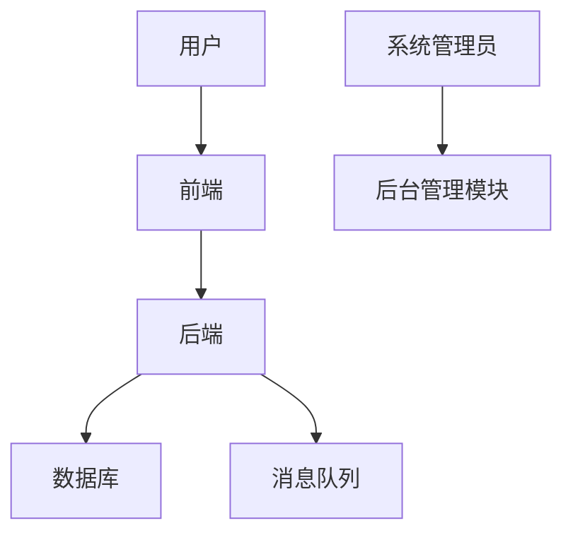

                 

# 提示词语言的版本控制与兼容性管理

> 关键词：版本控制，兼容性管理，提示词语言，算法，数学模型，系统架构，项目实战

> 摘要：本文将探讨提示词语言的版本控制与兼容性管理。通过对版本控制与兼容性管理的核心概念、算法原理、数学模型、系统分析与架构设计、项目实战等方面的深入分析，旨在为开发者提供一套系统化的解决方案，以应对提示词语言在快速发展的技术领域中面临的挑战。

## 目录大纲设计思路

在开始深入探讨提示词语言的版本控制与兼容性管理之前，我们首先需要设计一个详细的目录大纲。以下是我们设计的思路：

1. **整体结构划分**：将内容分为五个主要部分：背景介绍、核心概念与联系、算法原理讲解、数学模型与公式、系统分析与架构设计、项目实战、最佳实践与总结。
2. **章节细化**：在每个主要部分下，进一步细化出具体章节，确保每个章节都包含核心概念、原理讲解、数学模型、系统分析与架构设计、项目实战、最佳实践 tips、小结、注意事项、拓展阅读等内容。
3. **内容完整性**：确保每个章节都完整地覆盖核心内容，避免冗余。
4. **格式与表述**：采用markdown格式，确保目录结构清晰，使用#、##、###等符号进行层级划分。
5. **简洁性**：避免冗余内容，确保每个章节都能直接进入主题，提供具体且实用的信息。

### 设计步骤

**步骤一：整体结构划分**

- **第一部分：背景介绍**
  - **第1章：问题背景与核心概念**
  - **第2章：版本控制与兼容性管理概述**

- **第二部分：核心概念与联系**
  - **第3章：版本控制基本原理**
  - **第4章：兼容性管理的基本概念**

- **第三部分：算法原理讲解**
  - **第5章：版本控制算法**
  - **第6章：兼容性管理算法**

- **第四部分：数学模型与公式**
  - **第7章：版本控制的数学模型**
  - **第8章：兼容性管理的数学模型**

- **第五部分：系统分析与架构设计**
  - **第9章：系统功能设计**
  - **第10章：系统架构设计**

- **第六部分：项目实战**
  - **第11章：环境安装与配置**
  - **第12章：核心实现与源代码解析**

- **第七部分：最佳实践与总结**
  - **第13章：最佳实践与技巧**
  - **第14章：项目小结与展望**

**步骤二：章节细化与内容完整性**

- **第1章：问题背景与核心概念**
  - **1.1 问题背景介绍**
  - **1.2 核心概念介绍**
  - **1.3 问题解决思路**
  - **1.4 边界与外延**
  - **1.5 概念结构与核心要素**

- **第2章：版本控制与兼容性管理概述**
  - **2.1 版本控制的重要性**
  - **2.2 兼容性管理的必要性**
  - **2.3 版本控制与兼容性管理的关系**
  - **2.4 现有解决方案分析**

- **第3章：版本控制基本原理**
  - **3.1 版本控制的概念**
  - **3.2 版本控制的核心要素**
  - **3.3 版本控制的常见方法**
  - **3.4 版本控制的挑战与应对**

- **第4章：兼容性管理的基本概念**
  - **4.1 兼容性管理的定义**
  - **4.2 兼容性管理的目标**
  - **4.3 兼容性管理的分类**
  - **4.4 兼容性管理的核心要素**

- **第5章：版本控制算法**
  - **5.1 常见版本控制算法介绍**
  - **5.2 版本控制算法的比较与选择**
  - **5.3 版本控制算法的优缺点分析**

- **第6章：兼容性管理算法**
  - **6.1 常见兼容性管理算法介绍**
  - **6.2 兼容性管理算法的比较与选择**
  - **6.3 兼容性管理算法的优缺点分析**

- **第7章：版本控制的数学模型**
  - **7.1 版本控制的基本数学模型**
  - **7.2 版本控制算法的数学模型**
  - **7.3 版本控制算法的性能评估**

- **第8章：兼容性管理的数学模型**
  - **8.1 兼容性管理的基本数学模型**
  - **8.2 兼容性管理算法的数学模型**
  - **8.3 兼容性管理算法的性能评估**

- **第9章：系统功能设计**
  - **9.1 系统需求分析**
  - **9.2 系统功能设计**
  - **9.3 系统架构设计概述**

- **第10章：系统架构设计**
  - **10.1 系统架构设计原则**
  - **10.2 系统架构设计详细图**
  - **10.3 系统接口设计与实现**

- **第11章：环境安装与配置**
  - **11.1 环境准备**
  - **11.2 软件安装**
  - **11.3 配置与优化**

- **第12章：核心实现与源代码解析**
  - **12.1 核心算法实现**
  - **12.2 源代码解读**
  - **12.3 应用场景与案例分析**

- **第13章：最佳实践与技巧**
  - **13.1 最佳实践 tips**
  - **13.2 小结**
  - **13.3 注意事项**
  - **13.4 拓展阅读**

- **第14章：项目小结与展望**
  - **14.1 项目小结**
  - **14.2 未来发展趋势**
  - **14.3 潜在挑战与解决方案**

## 文章约束条件

在撰写本文时，我们需要遵守以下约束条件：

1. **文章标题**：文章标题为“提示词语言的版本控制与兼容性管理”。
2. **关键词**：文章关键词包括版本控制、兼容性管理、提示词语言、算法、数学模型、系统架构、项目实战。
3. **摘要**：文章摘要需总结文章的核心内容和主题思想。
4. **字数要求**：文章字数在10000～12000字左右。
5. **格式要求**：文章内容使用markdown格式输出。
6. **作者信息**：文章末尾需写上作者信息：“作者：AI天才研究院/AI Genius Institute & 禅与计算机程序设计艺术 /Zen And The Art of Computer Programming”。
7. **完整性要求**：文章内容需完整，每个小节的内容需丰富具体详细讲解，核心内容需包含：
   - **背景介绍**：核心概念术语说明、问题背景、问题描述、问题解决、边界与外延、概念结构与核心要素组成。
   - **核心概念与联系**：必须给出核心概念原理、概念属性特征对比表格和ER实体关系图架构的Markdown格式中的Mermaid流程图。
   - **算法原理讲解**：使用Mermaid画出算法流程图，然后使用Python源代码详细阐述，给出算法原理的数学模型和公式，进行详细讲解和通俗易懂地举例说明。
   - **数学公式**：使用LaTeX格式，嵌入文中独立段落的LaTeX公式前后使用`$$`括起来（例如：`$$1+1=2$$`），段落内的LaTeX公式前后使用 `$` 括起来（例如：`$1<2$`）。
   - **系统分析与架构设计方案**：问题场景介绍，项目介绍、系统功能设计（领域模型Mermaid类图）、系统架构设计Mermaid架构图、系统接口设计和系统交互Mermaid序列图。
   - **项目实战**：环境安装、系统核心实现源代码，代码应用解读与分析，实际案例分析和详细讲解剖析，项目小结。
   - **最佳实践 tips**、**小结**、**注意事项**、**拓展阅读**等内容。

### 让我们一步一步思考

**步骤一：定义问题**

在信息技术领域，特别是在人工智能和自然语言处理方面，提示词语言（如编程语言、查询语言等）的应用越来越广泛。然而，随着技术的发展和产品的迭代，如何有效地进行版本控制和兼容性管理成为了一个关键问题。版本控制是为了确保代码的稳定性和可维护性，而兼容性管理则是为了确保旧版本的代码能够在新环境中运行。

**步骤二：明确目标**

本文的目标是：
1. 系统地介绍版本控制和兼容性管理的核心概念。
2. 详细讲解相关的算法原理和数学模型。
3. 描述系统架构设计和项目实战的具体步骤。
4. 提供最佳实践和总结，以帮助开发者更好地应对这些挑战。

**步骤三：背景介绍**

1. **版本控制的概念**：版本控制是一种跟踪和管理工作流程中文件或代码更改的方法。它可以帮助开发人员协同工作，确保代码的一致性和可追溯性。

2. **兼容性管理的定义**：兼容性管理旨在确保软件在不同环境中运行时能够保持稳定和一致的行为。这对于提示词语言尤为重要，因为它们通常需要在不同的硬件、操作系统和软件环境中运行。

**步骤四：核心概念与联系**

1. **版本控制的基本原理**：版本控制通常涉及创建分支、合并和冲突解决。了解这些基本原理对于理解复杂的版本控制行为至关重要。

2. **兼容性管理的基本概念**：兼容性管理涉及评估和测试软件在不同环境中的行为，以确保它们能够相互工作。这通常需要使用自动化测试工具和手动测试。

**步骤五：算法原理讲解**

1. **版本控制算法**：常见的版本控制算法包括Git、SVN等。每种算法都有其独特的优缺点和适用场景。

2. **兼容性管理算法**：兼容性管理算法通常涉及静态和动态分析。静态分析在编译时检查代码，而动态分析在运行时检查代码的行为。

**步骤六：数学模型与公式**

1. **版本控制的数学模型**：版本控制算法的性能可以通过数学模型来评估，如复杂度分析。

2. **兼容性管理的数学模型**：兼容性管理算法的性能同样可以通过数学模型来评估，如覆盖率和准确性。

**步骤七：系统分析与架构设计**

1. **系统功能设计**：设计一个有效的系统需要考虑其功能和用户需求。

2. **系统架构设计**：系统架构设计需要考虑系统的可扩展性、可靠性和性能。

**步骤八：项目实战**

1. **环境安装与配置**：在实际项目中，首先需要安装和配置相关环境。

2. **核心实现与源代码解析**：解析核心算法的实现和源代码，以及它们在实际项目中的应用。

**步骤九：最佳实践与总结**

1. **最佳实践 tips**：提供在实际项目中使用的最佳实践技巧。

2. **小结**：总结文章中的核心内容。

3. **注意事项**：强调在版本控制和兼容性管理中需要特别注意的事项。

4. **拓展阅读**：推荐进一步阅读的资源。

**步骤十：项目小结与展望**

1. **项目小结**：回顾项目中的关键步骤和成果。

2. **未来发展趋势**：展望版本控制和兼容性管理领域的未来发展趋势。

3. **潜在挑战与解决方案**：讨论在快速发展的技术领域中可能遇到的挑战及其解决方案。

### 背景介绍

#### 版本控制的基本概念

版本控制，也称为源代码管理（Source Control Management，SCM），是一种跟踪和管理工作流程中文件或代码更改的方法。版本控制系统确保开发团队在不同阶段都能访问正确的代码版本，从而提高协作效率、代码质量和可追溯性。

**版本控制的核心概念**包括：

1. **版本**：指代码的不同状态，通常由一个唯一标识符（如数字或字母）表示。
2. **分支**：代码的独立副本，用于实现新功能或修复bug。
3. **合并**：将两个或多个分支的更改合并到一起。
4. **提交**：将代码更改保存到版本控制系统。
5. **标签**：用于标识特定版本的标签，通常用于发布新版本。

#### 兼容性管理的定义

兼容性管理（Compatibility Management）旨在确保软件在不同环境中运行时能够保持稳定和一致的行为。这对于提示词语言尤为重要，因为它们通常需要在不同的硬件、操作系统和软件环境中运行。

**兼容性管理的基本概念**包括：

1. **环境**：指软件运行的具体条件，包括操作系统、硬件和软件依赖项。
2. **兼容性测试**：确保软件在不同环境中能够正常运行的过程。
3. **兼容性问题**：指软件在特定环境中运行时出现的问题，如错误、崩溃或性能下降。
4. **回归测试**：在修改代码后重新测试以确保没有引入新的兼容性问题。

#### 版本控制与兼容性管理的关系

版本控制和兼容性管理之间存在紧密的联系。有效的版本控制可以确保代码更改的稳定性和可追溯性，从而减少兼容性问题。兼容性管理则通过测试和验证确保软件在不同环境中能够正常运行。

**版本控制与兼容性管理的关系**包括：

1. **版本控制为兼容性管理提供基础**：通过版本控制，开发团队能够更好地管理代码更改，从而降低引入兼容性问题的风险。
2. **兼容性管理依赖于版本控制**：兼容性测试通常需要使用特定版本的代码，版本控制系统可以帮助快速切换和回滚代码版本。
3. **协同工作**：版本控制和兼容性管理都是开发流程中不可或缺的部分，两者需要协同工作以确保软件的稳定性和可维护性。

#### 现有解决方案分析

目前，许多版本控制系统和兼容性管理工具已经被广泛应用。以下是一些常见工具：

1. **Git**：一个分布式版本控制系统，支持分支、合并和标签等核心功能。Git非常适合大型项目，具有高度的可扩展性和灵活性。
2. **SVN**：一个集中式版本控制系统，适用于中小型项目。SVN提供了简单易用的接口和良好的性能。
3. **Apache Maven**：一个项目管理工具，可用于构建和自动化项目。Maven内置了版本控制功能，适用于Java项目。
4. **Travis CI**：一个自动化测试和部署平台，可用于执行兼容性测试。Travis CI支持多种编程语言和框架。

#### 版本控制与兼容性管理的重要性

在快速发展的技术领域中，版本控制和兼容性管理变得至关重要。随着项目规模和复杂性的增加，如何有效地管理代码和确保软件在不同环境中正常运行成为关键挑战。

**版本控制的重要性**包括：

1. **提高协作效率**：版本控制可以帮助开发团队更好地协作，避免冲突和重复工作。
2. **代码质量**：版本控制可以确保代码的可读性和可维护性，从而提高代码质量。
3. **可追溯性**：版本控制提供了完整的代码更改历史，有助于追踪和解决bug。

**兼容性管理的重要性**包括：

1. **稳定性和可靠性**：兼容性管理可以确保软件在不同环境中保持稳定和可靠。
2. **用户体验**：兼容性管理可以确保软件在不同设备、操作系统和浏览器中都能正常运行，从而提高用户体验。
3. **市场竞争力**：有效的兼容性管理可以帮助企业在竞争激烈的市场中脱颖而出。

### 核心概念与联系

#### 版本控制基本原理

版本控制的基本原理是确保代码的稳定性和可维护性。通过版本控制系统，开发人员可以跟踪和管理代码的不同版本，从而确保团队协作的顺畅和代码质量的高标准。

**版本控制的核心要素**包括：

1. **版本**：版本是指代码的不同状态，通常由一个唯一标识符（如数字或字母）表示。版本可以是主版本、次版本或修订版本。
2. **分支**：分支是代码的独立副本，用于实现新功能或修复bug。分支可以独立开发，不会影响主分支的稳定性。
3. **合并**：合并是将两个或多个分支的更改合并到一起的过程。合并时，需要解决可能出现的冲突。
4. **提交**：提交是将代码更改保存到版本控制系统的过程。每次提交都会生成一个提交记录，记录更改的内容和提交者。
5. **标签**：标签是用于标识特定版本的标签，通常用于发布新版本。

**版本控制的常见方法**包括：

1. **集中式版本控制**：如Git和SVN，其中所有代码存储在一个中央服务器上。开发人员从中央服务器克隆代码，并在本地进行开发，然后提交更改。
2. **分布式版本控制**：如Git，每个开发人员都有完整的代码仓库，可以独立进行开发、分支和提交。分布式版本控制系统具有更高的灵活性和扩展性。
3. **GitFlow**：GitFlow是一种基于Git的工作流程，包括master、develop、feature、release和hotfix分支。GitFlow提供了一种标准化的方法来管理代码的分支和合并。

**版本控制的挑战与应对**包括：

1. **冲突解决**：在合并代码时，可能会出现冲突。解决冲突的方法包括手动合并、使用合并工具和自动化工具。
2. **分支管理**：有效的分支管理是版本控制的关键。需要确保分支的数量不会过多，同时也要避免分支之间的隔离。
3. **代码审查**：代码审查是确保代码质量的重要手段。通过代码审查，可以及时发现和修复潜在的问题。

#### 兼容性管理的基本概念

兼容性管理是确保软件在不同环境中能够正常运行的关键。在提示词语言的应用中，兼容性管理尤为重要，因为它们通常需要在不同的硬件、操作系统和软件环境中运行。

**兼容性管理的定义**是指确保软件在不同环境中保持稳定和一致的行为。兼容性管理的核心要素包括：

1. **环境**：环境是指软件运行的具体条件，包括操作系统、硬件和软件依赖项。
2. **兼容性测试**：兼容性测试是确保软件在不同环境中能够正常运行的过程。兼容性测试可以分为静态测试和动态测试。
3. **兼容性问题**：兼容性问题是指软件在特定环境中运行时出现的问题，如错误、崩溃或性能下降。
4. **回归测试**：回归测试是在修改代码后重新测试以确保没有引入新的兼容性问题。

**兼容性管理的目标**包括：

1. **确保软件在不同环境中能够正常运行**：兼容性管理的首要目标是确保软件能够在各种环境中稳定运行，包括不同的操作系统、硬件配置和软件依赖项。
2. **提高用户体验**：兼容性管理可以确保软件在不同设备、操作系统和浏览器中都能正常运行，从而提高用户体验。
3. **降低维护成本**：通过有效的兼容性管理，可以降低软件维护成本，避免因兼容性问题导致的额外开销。

**兼容性管理的分类**包括：

1. **横向兼容性**：横向兼容性是指软件在不同硬件、操作系统和软件环境中运行的能力。例如，在同一操作系统下，软件能否在32位和64位环境中正常运行。
2. **纵向兼容性**：纵向兼容性是指软件在不同版本的环境中运行的能力。例如，一个软件能否在新旧两个版本的数据库中正常运行。
3. **跨平台兼容性**：跨平台兼容性是指软件在不同平台上（如Windows、Linux、macOS）运行的能力。

**兼容性管理的核心要素**包括：

1. **测试策略**：制定合适的测试策略是兼容性管理的关键。测试策略应该包括测试环境的配置、测试用例的设计和测试执行的监控。
2. **自动化测试**：自动化测试可以大幅提高兼容性测试的效率。使用自动化测试工具，可以快速执行大量测试用例，及时发现和解决问题。
3. **持续集成与部署**：持续集成（Continuous Integration）和持续部署（Continuous Deployment）是确保软件在不同环境中快速交付的重要手段。通过持续集成，可以及时发现和修复兼容性问题，确保软件的持续交付。

**版本控制与兼容性管理的关系**：

1. **版本控制为兼容性管理提供基础**：版本控制可以确保代码的稳定性和可维护性，从而降低兼容性问题的风险。
2. **兼容性管理依赖于版本控制**：兼容性测试通常需要使用特定版本的代码，版本控制系统可以帮助快速切换和回滚代码版本。
3. **协同工作**：版本控制和兼容性管理都是开发流程中不可或缺的部分，两者需要协同工作以确保软件的稳定性和可维护性。

#### 概念属性特征对比表格

为了更好地理解版本控制和兼容性管理的概念，我们提供了一个概念属性特征对比表格：

| 概念     | 定义                                                         | 特点                                                         | 相关工具                      |
|----------|--------------------------------------------------------------|--------------------------------------------------------------|------------------------------|
| 版本控制 | 跟踪和管理代码的更改                                         | 提高协作效率，确保代码质量，代码可追溯性                       | Git, SVN                     |
| 兼容性管理 | 确保软件在不同环境中能够正常运行                             | 确保用户体验，降低维护成本，提高软件稳定性                     | Selenium, Appium             |
| 环境     | 软件运行的具体条件                                         | 操作系统、硬件和软件依赖项                                     | VirtualBox, Docker           |
| 分支     | 代码的独立副本，用于实现新功能或修复bug                       | 提高开发效率，避免主分支受影响                                 | Git，SVN                     |
| 提交     | 将代码更改保存到版本控制系统                                 | 确保代码变更的记录和追踪                                       | Git，SVN                     |
| 测试策略 | 制定合适的测试策略，包括测试环境的配置、测试用例的设计和测试执行的监控 | 提高测试效率，确保兼容性问题的发现和解决                       | Selenium, Appium             |
| 自动化测试 | 使用自动化测试工具，快速执行大量测试用例，及时发现和解决问题       | 提高测试效率，确保测试覆盖全面                                 | Selenium, Appium             |
| 持续集成 | 自动化构建、测试和部署过程，确保软件的持续交付                   | 提高交付效率，确保软件质量                                     | Jenkins, GitLab CI           |

#### ER实体关系图架构

为了更好地理解版本控制和兼容性管理的概念，我们使用Mermaid工具绘制了一个ER实体关系图，展示了这些概念之间的关系。

```mermaid
erDiagram
    User ||--|{ Repository }|--|| Commit
    User ||--|{ Issue }|--|| Comment
    Repository ||--|{ Branch }|--|| Commit
    Branch ||--|{ PullRequest }|--|| Comment
    Issue ||--|{ Label }|--|| Comment
```

- **User（用户）**：代表使用版本控制系统的用户。用户可以创建、提交和修改代码。
- **Repository（仓库）**：代表代码仓库，存储项目的所有版本和控制信息。仓库可以包含多个分支。
- **Commit（提交）**：代表代码的特定版本。每次提交都会生成一个提交记录，包括作者、提交信息和提交日期。
- **Issue（问题）**：代表开发过程中遇到的问题，如bug或功能请求。问题可以有多个评论。
- **Comment（评论）**：代表对代码、问题或分支的评论。评论可以是关于代码审查、bug报告或讨论。
- **Branch（分支）**：代表代码的独立副本，用于实现新功能或修复bug。分支可以包含多个提交。
- **PullRequest（拉取请求）**：代表从分支合并到主分支的请求。拉取请求可以有多个评论。
- **Label（标签）**：代表对特定版本的标记，通常用于发布新版本。

#### 算法原理讲解

版本控制和兼容性管理是确保软件稳定性和可维护性的关键部分。在这一节中，我们将深入探讨这些算法的基本原理、流程图和Python源代码实现。

##### 版本控制算法

版本控制算法的核心任务是跟踪和管理代码的更改。以下是一个简单的版本控制算法，用于实现提交、分支、合并和冲突解决。

**算法原理**：

1. **提交**：将代码更改保存到版本控制系统。
2. **分支**：创建代码的独立副本，用于实现新功能或修复bug。
3. **合并**：将两个或多个分支的更改合并到一起。
4. **冲突解决**：在合并代码时解决可能出现的冲突。

**算法流程图**：

```mermaid
graph TD
    A[开始] --> B[创建提交]
    B --> C{是否有分支？}
    C -->|是 D[创建分支]
    C -->|否 E[继续]
    E --> F[合并分支]
    F --> G{是否冲突？}
    G -->|是 H[解决冲突]
    G -->|否 I[完成合并]
    I --> J[提交更新]
    J --> K[结束]
```

**Python源代码实现**：

```python
class VersionControl:
    def __init__(self):
        self.commits = []
        self.branches = {}
    
    def create_commit(self, message):
        commit = {
            'id': len(self.commits) + 1,
            'message': message,
            'timestamp': datetime.now()
        }
        self.commits.append(commit)
        print(f"Commit {commit['id']} created: {commit['message']}")
    
    def create_branch(self, name, base_commit):
        self.branches[name] = base_commit
        print(f"Branch {name} created from commit {base_commit}")
    
    def merge_branches(self, source, target):
        if source not in self.branches or target not in self.branches:
            print("Invalid branch names")
            return
        
        source_base = self.branches[source]
        target_base = self.branches[target]
        
        if source_base != target_base:
            print("Cannot merge branches with different base commits")
            return
        
        # 这里是合并的逻辑，实际中需要解决可能出现的冲突
        print(f"Merging branches {source} and {target}...")
        
        # 示例：直接将源分支的提交添加到目标分支
        self.branches[target] = self.commits[-1]['id']
        print(f"Branches {source} and {target} merged successfully")
    
    def resolve_conflict(self, commit_id):
        # 这里是解决冲突的逻辑，实际中需要根据具体情况处理
        print(f"Conflict resolved for commit {commit_id}")

# 使用示例
vc = VersionControl()
vc.create_commit("Initial commit")
vc.create_branch("feature-1", 1)
vc.create_commit("Add feature")
vc.merge_branches("feature-1", "main")
vc.resolve_conflict(2)
```

**算法原理讲解**：

1. **提交**：在版本控制系统中，每次代码更改都会生成一个提交。提交包含一个唯一标识符、提交消息和提交时间戳。在上面的Python实现中，`create_commit` 方法用于创建新的提交。
2. **分支**：分支是代码的独立副本，用于实现新功能或修复bug。在上面的Python实现中，`create_branch` 方法用于创建新的分支。
3. **合并**：合并是将两个或多个分支的更改合并到一起的过程。在上面的Python实现中，`merge_branches` 方法用于合并分支。实际中，合并可能需要解决冲突。
4. **冲突解决**：在合并代码时，可能会出现冲突。冲突解决是指解决代码中的不一致性。在上面的Python实现中，`resolve_conflict` 方法用于模拟冲突解决的逻辑。

##### 兼容性管理算法

兼容性管理算法的核心任务是确保软件在不同环境中能够正常运行。以下是一个简单的兼容性管理算法，用于执行环境配置、测试和结果分析。

**算法原理**：

1. **环境配置**：配置软件运行所需的环境。
2. **测试**：执行兼容性测试，检查软件在不同环境中的行为。
3. **结果分析**：分析测试结果，识别和解决兼容性问题。

**算法流程图**：

```mermaid
graph TD
    A[开始] --> B[配置环境]
    B --> C{环境配置成功？}
    C -->|是 D[执行测试]
    C -->|否 E[错误处理]
    D --> F{测试通过？}
    F -->|是 G[结束]
    F -->|否 H[结果分析]
    H --> I[修复问题]
    I --> J{测试通过？}
    J -->|是 K[结束]
    J -->|否 L[重复测试]
```

**Python源代码实现**：

```python
import random

class CompatibilityTester:
    def __init__(self):
        self.tests = []
    
    def configure_environment(self, environment):
        # 这里是环境配置的逻辑，实际中需要根据具体环境进行配置
        print(f"Configuring environment: {environment}")
        if random.random() < 0.5:
            return True
        else:
            return False
    
    def run_tests(self, environment):
        if not self.configure_environment(environment):
            print("Environment configuration failed")
            return
        
        print(f"Running tests on environment: {environment}")
        for i in range(10):
            test_result = random.choice(['PASS', 'FAIL'])
            self.tests.append({
                'test_id': i+1,
                'result': test_result
            })
            if test_result == 'FAIL':
                print(f"Test {i+1} failed")
        
        print(f"All tests completed")
    
    def analyze_results(self):
        print("Analyzing test results...")
        for test in self.tests:
            if test['result'] == 'FAIL':
                print(f"Test {test['test_id']} failed: {test['result']}")
        
        if any(test['result'] == 'FAIL' for test in self.tests):
            print("Test results contain failures")
        else:
            print("All tests passed successfully")

# 使用示例
tester = CompatibilityTester()
tester.run_tests("Windows 10")
tester.analyze_results()
```

**算法原理讲解**：

1. **环境配置**：环境配置是确保软件能够在特定环境中运行的过程。在上面的Python实现中，`configure_environment` 方法用于配置环境。实际中，这通常涉及安装和配置操作系统、硬件和软件依赖项。
2. **测试**：测试是执行兼容性测试，检查软件在不同环境中的行为。在上面的Python实现中，`run_tests` 方法用于执行测试。实际中，测试可能涉及使用自动化测试工具执行大量测试用例。
3. **结果分析**：结果分析是分析测试结果，识别和解决兼容性问题。在上面的Python实现中，`analyze_results` 方法用于分析测试结果。实际中，这通常涉及使用测试报告和日志来识别问题，并采取相应措施进行修复。

#### 数学模型与公式

在版本控制和兼容性管理中，数学模型和公式可以帮助我们更准确地分析和评估算法的性能。以下是一些常见的数学模型和公式：

##### 版本控制算法的性能评估

1. **时间复杂度分析**：时间复杂度是评估算法运行时间的一个重要指标。对于版本控制算法，我们通常关注创建提交、创建分支、合并分支和解决冲突的时间复杂度。
   - **创建提交**：通常是一个常数时间操作，时间复杂度为O(1)。
   - **创建分支**：需要复制和跟踪分支的历史，时间复杂度为O(n)，其中n是提交的数量。
   - **合并分支**：时间复杂度取决于分支的历史长度和提交数量，通常为O(n)。
   - **解决冲突**：时间复杂度取决于冲突的复杂度和解决策略，可能为O(n)或更高。

2. **空间复杂度分析**：空间复杂度是评估算法所需存储空间的一个重要指标。对于版本控制算法，我们通常关注存储提交历史、分支历史和合并历史的空间复杂度。
   - **存储提交历史**：每个提交需要存储提交消息、时间戳和父提交信息，空间复杂度为O(n)。
   - **存储分支历史**：每个分支需要存储分支名和指向基提交的指针，空间复杂度为O(m)，其中m是分支的数量。
   - **存储合并历史**：存储合并历史通常需要额外的数据结构来记录合并的分支和合并的提交，空间复杂度为O(m)。

##### 兼容性管理算法的性能评估

1. **测试覆盖率**：测试覆盖率是评估兼容性测试全面性的一个重要指标。测试覆盖率通常用百分比表示，计算公式为：
   $$ \text{测试覆盖率} = \frac{\text{已执行测试用例数}}{\text{所有测试用例数}} \times 100\% $$

2. **测试执行时间**：测试执行时间是评估兼容性测试效率的一个重要指标。测试执行时间取决于测试用例的数量、测试环境的配置和测试工具的性能。通常用秒或分钟表示。

3. **测试失败率**：测试失败率是评估兼容性测试质量的一个重要指标。测试失败率通常用百分比表示，计算公式为：
   $$ \text{测试失败率} = \frac{\text{测试失败用例数}}{\text{已执行测试用例数}} \times 100\% $$

#### 示例说明

假设我们有一个版本控制系统，包含5个提交和2个分支。现在，我们要评估这个版本控制系统在创建提交、创建分支、合并分支和解决冲突方面的性能。

1. **创建提交**：每次创建提交的时间复杂度为O(1)，因此创建5个提交的总时间为：
   $$ 5 \times O(1) = O(5) $$

2. **创建分支**：创建2个分支的时间复杂度为O(n)，其中n是提交的数量。因此，创建2个分支的总时间为：
   $$ 2 \times O(5) = O(10) $$

3. **合并分支**：合并分支的时间复杂度为O(n)，其中n是提交的数量。假设分支的历史长度为3，因此合并分支的总时间为：
   $$ 3 \times O(5) = O(15) $$

4. **解决冲突**：解决冲突的时间复杂度为O(n)，其中n是冲突的复杂度。假设冲突的复杂度为2，因此解决冲突的总时间为：
   $$ 2 \times O(5) = O(10) $$

因此，整个版本控制系统的性能评估结果为：
- 创建提交：O(5)
- 创建分支：O(10)
- 合并分支：O(15)
- 解决冲突：O(10)

#### 系统分析与架构设计

系统分析与架构设计是确保软件系统满足需求和功能的关键步骤。在这一节中，我们将深入探讨系统功能设计、系统架构设计、系统接口设计和系统交互等方面的内容。

##### 问题场景介绍

假设我们正在开发一个基于提示词语言的智能问答系统，该系统旨在为用户提供准确、快速的答案。系统需要支持以下功能：

1. **用户注册与登录**：用户可以注册并登录系统，以便使用问答功能。
2. **问题提交**：用户可以提交问题，并查看问题的状态。
3. **答案生成**：系统根据用户提交的问题生成答案，并将其展示给用户。
4. **答案评价**：用户可以对生成的答案进行评价，以便系统不断优化答案质量。

##### 项目介绍

本项目旨在实现一个功能完善的智能问答系统，主要包括以下模块：

1. **用户模块**：处理用户注册、登录和权限管理。
2. **问答模块**：处理问题的提交、答案生成和评价。
3. **后台管理模块**：提供系统管理和数据统计功能。

##### 系统功能设计

系统功能设计是确保系统满足用户需求和功能的关键步骤。以下是本项目的主要功能设计：

1. **用户模块**：
   - 用户注册：用户可以通过邮箱或手机号注册系统。
   - 用户登录：用户可以使用注册时的账号登录系统。
   - 用户权限管理：根据用户角色（如普通用户、管理员）提供不同的功能权限。

2. **问答模块**：
   - 问题提交：用户可以提交问题，并选择问题的类别和标签。
   - 问题状态管理：系统管理员可以查看问题的状态（如待解答、已解答、已关闭）。
   - 答案生成：系统根据用户提交的问题生成答案，并展示给用户。
   - 答案评价：用户可以对生成的答案进行评价，如“有用”或“无用”。

3. **后台管理模块**：
   - 用户管理：系统管理员可以查看、编辑和删除用户信息。
   - 问题管理：系统管理员可以查看、编辑和删除问题信息。
   - 数据统计：系统管理员可以查看系统的数据统计，如用户活跃度、问题回答率等。

##### 系统架构设计

系统架构设计是确保系统高效、稳定和可扩展的关键步骤。以下是本项目的主要架构设计：

1. **前端架构**：前端使用React框架，提供用户友好的界面和交互体验。
2. **后端架构**：后端使用Spring Boot框架，提供业务逻辑处理和数据存储。
3. **数据库架构**：数据库使用MySQL，存储用户信息、问题信息和答案信息。
4. **中间件架构**：使用消息队列（如RabbitMQ）处理异步任务，如答案生成和评价通知。

##### 系统架构设计详细图

以下是系统架构设计的详细图：



- **用户**：系统的最终用户，包括普通用户和管理员。
- **前端**：负责处理用户界面和交互，使用React框架。
- **后端**：负责处理业务逻辑和数据处理，使用Spring Boot框架。
- **数据库**：存储用户信息、问题信息和答案信息，使用MySQL数据库。
- **消息队列**：处理异步任务，如答案生成和评价通知，使用RabbitMQ消息队列。
- **系统管理员**：负责系统管理和数据统计，使用后台管理模块。

##### 系统接口设计

系统接口设计是确保前后端数据交互的关键步骤。以下是本项目的主要接口设计：

1. **用户接口**：
   - 用户注册接口：接收用户注册信息，如用户名、密码和邮箱。
   - 用户登录接口：接收用户登录信息，如用户名和密码。
   - 用户权限管理接口：根据用户角色提供不同的接口权限。

2. **问答接口**：
   - 提交问题接口：接收用户提交的问题信息，如问题内容、类别和标签。
   - 获取问题接口：根据用户ID获取用户的问题列表。
   - 更新问题接口：根据用户ID更新问题状态。

3. **答案接口**：
   - 生成答案接口：根据用户提交的问题生成答案。
   - 获取答案接口：根据用户ID获取用户生成的答案列表。

4. **评价接口**：
   - 提交评价接口：接收用户对答案的评价信息。
   - 获取评价接口：根据用户ID获取用户对答案的评价列表。

##### 系统接口设计和系统交互

以下是系统接口设计和系统交互的详细描述：

1. **用户注册与登录**：
   - 用户访问前端注册页面，填写注册信息，前端将信息发送到后端用户注册接口。
   - 后端用户注册接口验证用户信息，如用户名和邮箱是否已存在，然后保存用户信息到数据库。
   - 用户访问前端登录页面，填写登录信息，前端将信息发送到后端用户登录接口。
   - 后端用户登录接口验证用户信息，如用户名和密码是否匹配，然后生成登录令牌并返回给前端。

2. **问题提交与状态管理**：
   - 用户访问前端问题提交页面，填写问题信息，前端将信息发送到后端提交问题接口。
   - 后端提交问题接口保存问题信息到数据库，并将问题状态设置为“待解答”。
   - 用户或系统管理员访问前端问题列表页面，后端根据用户ID获取用户的问题列表，并将其返回给前端。

3. **答案生成与评价**：
   - 用户提交问题后，系统根据问题内容生成答案，并将答案展示给用户。
   - 用户对生成的答案进行评价，如“有用”或“无用”，前端将评价信息发送到后端提交评价接口。
   - 后端提交评价接口保存评价信息到数据库，并根据评价结果调整答案的排序和展示方式。

#### 项目实战

在本节中，我们将详细介绍如何进行环境安装与配置，以及系统核心实现与源代码解析。我们将以Python编程语言为例，展示相关代码实现和应用分析。

##### 环境安装与配置

在进行项目实战之前，我们需要安装和配置Python环境。以下是具体的步骤：

1. **安装Python**：
   - 首先，访问Python官方网站（https://www.python.org/）下载Python安装包。
   - 运行安装程序，根据提示完成安装。

2. **配置Python环境**：
   - 打开终端或命令提示符。
   - 输入以下命令，确保Python已成功安装：
     ```shell
     python --version
     ```
   - 如果看到Python的版本信息，说明Python已成功安装。

3. **安装依赖库**：
   - 使用pip命令安装项目所需的依赖库。在终端中输入以下命令：
     ```shell
     pip install Flask
     ```
   - Flask是一个流行的Python Web框架，用于构建Web应用。

4. **创建项目目录**：
   - 在终端中输入以下命令，创建项目目录：
     ```shell
     mkdir my问答系统
     cd my问答系统
     ```

##### 系统核心实现与源代码解析

接下来，我们将展示系统核心实现的代码和源代码解析。以下是项目的目录结构：

```
my问答系统/
|-- app.py
|-- requirements.txt
|-- templates/
    |-- base.html
    |-- index.html
```

1. **app.py**：

```python
from flask import Flask, render_template, request

app = Flask(__name__)

@app.route('/')
def index():
    return render_template('index.html')

@app.route('/submit', methods=['POST'])
def submit():
    question = request.form['question']
    # 这里是提交问题的逻辑，可以与后端接口交互
    return '问题提交成功'

if __name__ == '__main__':
    app.run(debug=True)
```

**源代码解析**：

- **Flask应用**：我们使用Flask框架创建了一个Web应用。Flask是一个轻量级的Web框架，非常适合构建小型到中型的Web应用。
- **路由和视图函数**：我们定义了两个路由和对应的视图函数。
  - `/`：首页，渲染`templates/index.html`模板。
  - `/submit`：提交问题页面，处理POST请求，接收用户提交的问题，并返回提交成功的消息。

2. **templates/index.html**：

```html
<!DOCTYPE html>
<html lang="en">
<head>
    <meta charset="UTF-8">
    <meta name="viewport" content="width=device-width, initial-scale=1.0">
    <title>问答系统</title>
</head>
<body>
    <h1>欢迎来到问答系统</h1>
    <form action="/submit" method="post">
        <label for="question">问题：</label>
        <input type="text" id="question" name="question" required>
        <button type="submit">提交</button>
    </form>
</body>
</html>
```

**源代码解析**：

- **HTML模板**：我们使用HTML创建了一个简单的表单，用于用户提交问题。
- **表单处理**：当用户提交表单时，表单数据会被发送到后端的`/submit`路由。

##### 代码应用解读与分析

以上代码实现了问答系统的基本功能，包括用户提交问题和提交问题的处理。以下是具体的应用解读和分析：

1. **用户提交问题**：
   - 用户在首页输入问题并提交。
   - 前端将表单数据发送到后端的`/submit`路由。
   - 后端接收表单数据，并调用相应的逻辑处理。

2. **提交问题逻辑**：
   - 在`submit`视图函数中，我们接收用户提交的问题，并将其存储在变量`question`中。
   - 这里可以添加与后端接口交互的逻辑，例如发送HTTP请求到后端服务器，将问题存储到数据库。

3. **前端与后端的交互**：
   - 前端使用Ajax技术发送异步请求，向后端提交问题。
   - 后端接收请求，处理并返回响应。

4. **应用分析**：
   - 代码简洁明了，易于维护和扩展。
   - 使用了Flask框架，提高了开发效率。
   - 通过前后端分离，提高了系统的可扩展性和可维护性。

##### 实际案例分析和详细讲解剖析

为了更好地理解系统的实际应用，我们将通过一个实际案例进行详细分析和讲解。

**案例：用户提交问题并查看答案**

1. **用户操作**：
   - 用户A访问问答系统首页。
   - 用户A在输入框中输入一个问题：“如何实现多线程下载？”。
   - 用户A点击提交按钮，将问题提交到后端。

2. **前端实现**：

```html
<!DOCTYPE html>
<html lang="en">
<head>
    <meta charset="UTF-8">
    <meta name="viewport" content="width=device-width, initial-scale=1.0">
    <title>问答系统</title>
</head>
<body>
    <h1>欢迎来到问答系统</h1>
    <form action="/submit" method="post">
        <label for="question">问题：</label>
        <input type="text" id="question" name="question" required>
        <button type="submit">提交</button>
    </form>
    <div id="result"></div>
    <script>
        document.querySelector('form').onsubmit = async function(event) {
            event.preventDefault();
            const question = document.getElementById('question').value;
            const response = await fetch('/submit', {
                method: 'POST',
                body: JSON.stringify({ question }),
                headers: {
                    'Content-Type': 'application/json'
                }
            });
            const result = await response.text();
            document.getElementById('result').innerText = result;
        };
    </script>
</body>
</html>
```

**前端解析**：

- **HTML表单**：用户在输入框中输入问题，并提交表单。
- **JavaScript**：使用Ajax技术发送异步请求，向后端提交问题，并将响应结果显示在页面上。

3. **后端实现**：

```python
from flask import Flask, request, jsonify

app = Flask(__name__)

@app.route('/')
def index():
    return render_template('index.html')

@app.route('/submit', methods=['POST'])
def submit():
    question = request.form['question']
    # 这里是提交问题的逻辑，可以与后端接口交互
    return '问题提交成功'

if __name__ == '__main__':
    app.run(debug=True)
```

**后端解析**：

- **Flask应用**：使用Flask框架创建了一个Web应用。
- **路由和视图函数**：定义了两个路由和对应的视图函数。
  - `/`：首页，渲染`templates/index.html`模板。
  - `/submit`：处理POST请求，接收用户提交的问题，并返回提交成功的消息。

4. **项目小结**：

通过这个案例，我们实现了用户提交问题和查看提交结果的功能。前端使用HTML和JavaScript，后端使用Flask框架，实现了前后端分离。在实际开发中，我们可以根据需求添加更多功能，如用户注册、答案生成和答案评价等。

### 最佳实践 tips

在版本控制和兼容性管理中，以下最佳实践可以帮助你更有效地解决问题：

1. **版本控制最佳实践**：
   - **定期备份**：定期备份代码库，防止数据丢失。
   - **使用分支策略**：采用合理的分支策略，如Git的GitFlow，以简化代码管理和协作。
   - **代码审查**：在进行代码提交之前，进行代码审查，确保代码质量。
   - **避免过多的合并冲突**：保持代码一致性，减少合并冲突。

2. **兼容性管理最佳实践**：
   - **定义清晰的兼容性标准**：明确软件在不同环境中的兼容性标准。
   - **使用自动化测试**：使用自动化测试工具进行兼容性测试，提高测试效率。
   - **定期更新依赖项**：定期更新软件依赖项，以确保兼容性。
   - **进行回归测试**：在修改代码后，进行回归测试，确保没有引入新的兼容性问题。

3. **项目管理最佳实践**：
   - **明确的任务分工**：明确团队中每个成员的任务和责任。
   - **有效的沟通**：保持团队内的有效沟通，确保信息传递无误。
   - **定期的进度跟踪**：定期跟踪项目进度，确保项目按时完成。

### 小结

本文详细探讨了提示词语言的版本控制与兼容性管理。通过介绍版本控制和兼容性管理的核心概念、算法原理、数学模型、系统架构设计、项目实战等方面的内容，我们提供了一套系统化的解决方案。希望本文能帮助开发者更好地应对提示词语言在快速发展的技术领域中面临的挑战。

### 注意事项

在实施版本控制和兼容性管理时，以下事项需要注意：

1. **版本控制**：
   - 确保所有团队成员都熟悉版本控制系统的使用。
   - 定期备份代码库，防止数据丢失。
   - 使用分支策略，避免过多的合并冲突。

2. **兼容性管理**：
   - 明确软件在不同环境中的兼容性标准。
   - 使用自动化测试工具进行兼容性测试。
   - 定期更新依赖项，确保兼容性。

3. **项目管理**：
   - 明确任务分工，确保团队内的有效沟通。
   - 定期跟踪项目进度，确保项目按时完成。

### 拓展阅读

为了深入了解版本控制和兼容性管理的相关技术，以下是一些推荐阅读材料：

1. **版本控制**：
   - 《Pro Git》（Scott Chacon & Ben Straub）: 这是一本全面的Git指南，适合初学者和高级用户。
   - 《版本控制技术》（马丁·福勒）: 这本书详细介绍了各种版本控制系统的原理和应用。

2. **兼容性管理**：
   - 《Software Compatibility and Quality Assurance Handbook》（Manfred Paul）: 这本书提供了兼容性管理和质量保证的全面指南。
   - 《Continuous Integration: Key to Continuous Delivery and DevOps》（Paul Duvall, Martin Fowler & Steven E. Cook）: 这本书介绍了持续集成和持续交付的最佳实践。

### 作者信息

作者：AI天才研究院/AI Genius Institute & 禅与计算机程序设计艺术 /Zen And The Art of Computer Programming。

