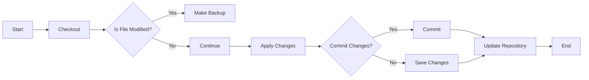
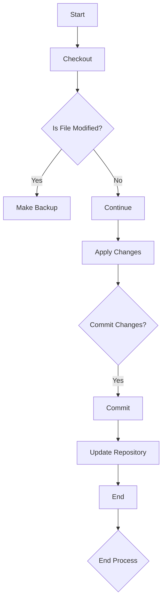
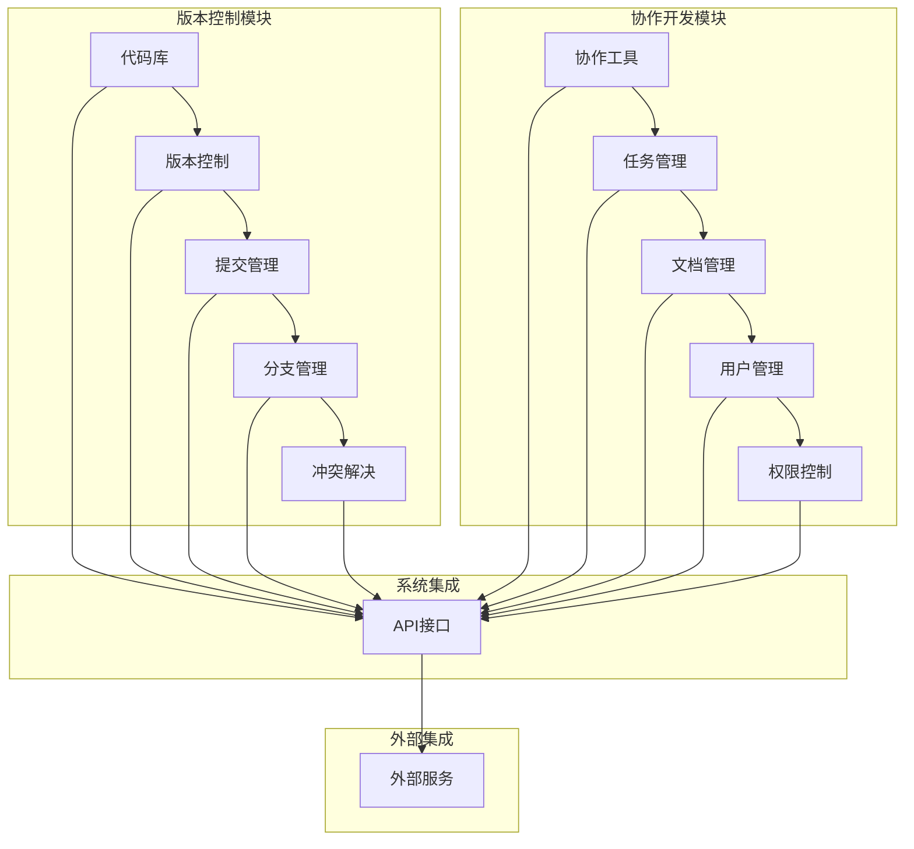
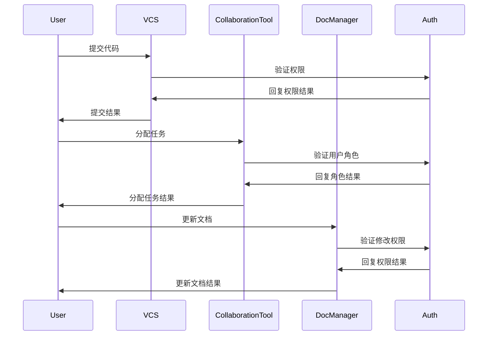
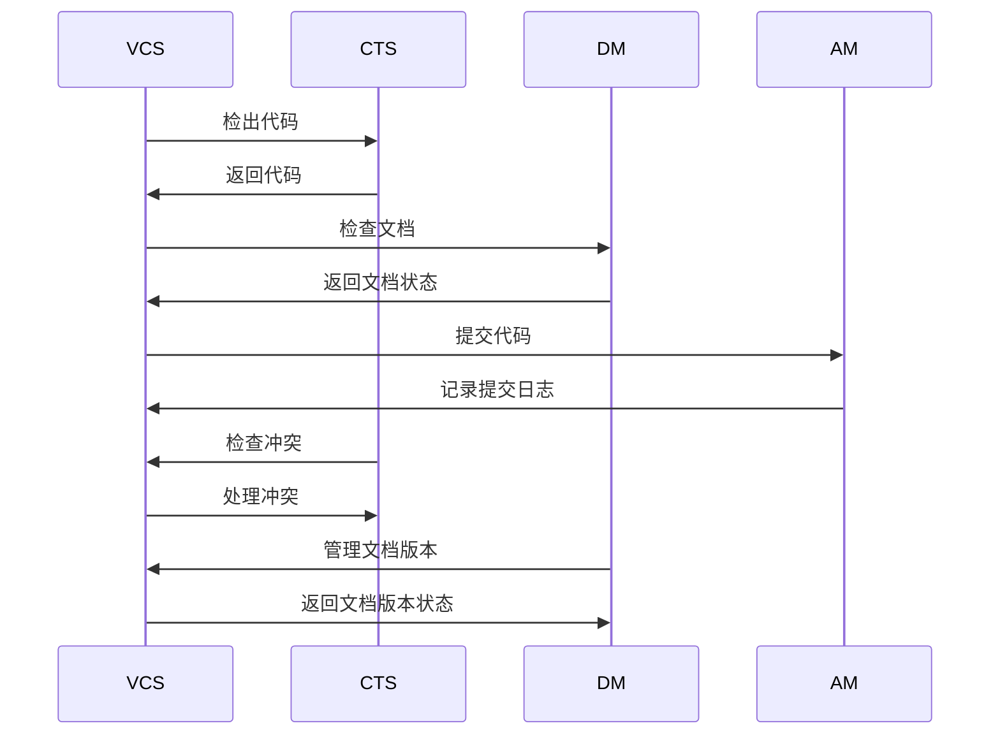

                 

### 第1章: 版本控制与协作开发的背景

#### 1.1 问题的背景

**1.1.1 软件开发中的版本控制需求**

在软件工程领域，版本控制是一项至关重要的活动。随着软件开发项目的复杂性不断增加，单靠人工管理代码文件变得愈发困难。版本控制的需求源于以下几点：

- **协作与共享**：现代软件开发往往需要多个开发人员协同工作，版本控制可以确保每个成员能够访问正确的代码版本，避免代码的冲突和混乱。
- **代码管理**：随着项目的推进，代码可能会经历多次修改和迭代。版本控制帮助开发者追踪每一次修改，并能够轻松地回退到之前的版本。
- **故障恢复**：在出现软件错误或者功能不正常的情况下，版本控制系统能够帮助快速定位问题并进行回退。

**1.1.2 协作开发面临的挑战**

协作开发是一个动态且复杂的过程，开发者在这个过程中常常会遇到一系列挑战：

- **代码冲突**：当多个开发者同时对同一部分代码进行修改时，很容易产生冲突。这些冲突如果不及时解决，会导致软件功能的错误或缺陷。
- **沟通问题**：团队内部沟通不畅可能导致任务的重复、理解偏差等问题，进而影响开发进度。
- **文档管理**：协作开发中的文档管理也颇具挑战，需要确保所有的文档都是最新且可访问的。

**1.1.3 版本控制与协作开发的重要性**

版本控制和协作开发在软件工程中扮演着至关重要的角色：

- **确保代码质量**：通过版本控制，开发者可以保证代码的可追踪性和可管理性，从而提高代码的质量。
- **加速开发过程**：有效的版本控制和协作开发能够显著缩短开发周期，提高开发效率。
- **维护与扩展**：良好的版本控制和协作开发有助于项目的长期维护和扩展，确保系统的稳定性和可持续性。

#### 1.2 问题描述

**1.2.1 版本控制存在的问题**

尽管版本控制在很多方面都有其优势，但在实际应用中仍存在一些问题：

- **复杂度增加**：对于大型项目，版本控制系统的复杂度可能会变得非常高，导致使用和维护变得更加困难。
- **效率问题**：在某些情况下，版本控制系统可能会成为团队协作的瓶颈，特别是当系统性能不佳时。
- **学习曲线**：新手开发者可能需要花费较长的时间来学习如何有效地使用版本控制系统。

**1.2.2 协作开发中的常见问题**

协作开发本身也面临一些挑战：

- **协作机制不完善**：缺乏有效的协作机制会导致开发任务混乱，影响开发效率。
- **沟通障碍**：即使有完善的协作工具，团队成员之间的沟通仍然可能存在障碍，导致任务理解偏差。
- **代码质量难以控制**：团队成员的技术水平参差不齐，可能导致代码质量不一，影响整体项目质量。

**1.2.3 当前解决方案的不足**

当前针对版本控制和协作开发的问题，虽然有一些解决方案，但它们仍存在一些不足：

- **工具选择困难**：市面上存在多种版本控制和协作工具，选择合适的工具对于团队来说是一项挑战。
- **集成困难**：某些版本控制系统难以与其他开发工具集成，导致开发流程不畅。
- **培训成本高**：新工具和技术的引入往往需要大量的培训成本，这对一些小型团队来说是一大负担。

#### 1.3 问题解决

**1.3.1 版本控制的基本原理**

版本控制的基本原理包括以下几个关键点：

- **版本标识**：每次对代码的修改都会产生一个新的版本，版本控制系统为每个版本分配唯一的标识。
- **变更追踪**：版本控制系统记录每次变更的详细信息，包括修改的内容、修改者以及修改的时间。
- **合并操作**：当多个开发者在同一文件上进行修改时，版本控制系统可以自动或手动地合并这些变更。

**1.3.2 协作开发的最佳实践**

为了有效协作开发，以下是一些最佳实践：

- **明确角色和职责**：确保每个团队成员都清楚自己的角色和职责，避免任务的重复和遗漏。
- **使用协作工具**：选择合适的协作工具，如Slack、Trello等，以促进团队成员之间的沟通和协作。
- **文档管理**：确保所有文档都是最新且可访问的，使用版本控制系统来管理文档版本。

**1.3.3 版本控制与协作开发的结合**

版本控制和协作开发的有效结合可以显著提高软件开发的效率和质量：

- **集成版本控制系统**：将版本控制系统与代码编辑器、构建工具和其他开发工具集成，以简化开发流程。
- **自动化流程**：利用版本控制系统的自动化功能，如自动合并、自动测试等，减少人工干预。
- **持续集成与持续部署**：结合持续集成和持续部署，确保代码的质量和可靠性。

#### 1.4 边界与外延

**1.4.1 版本控制的适用范围**

版本控制适用于以下场景：

- **多人协作开发**：确保代码的协同修改和管理。
- **代码库管理**：方便地管理代码库的版本和变更历史。
- **分布式开发**：支持不同地点的开发者进行代码协作。

**1.4.2 协作开发的适用场景**

协作开发主要适用于以下场景：

- **大型项目**：需要多人协同工作和分工明确。
- **敏捷开发**：快速响应市场需求，频繁迭代。
- **跨团队协作**：不同团队之间需要进行紧密的沟通和协作。

**1.4.3 版本控制和协作开发的相互影响**

版本控制对协作开发的影响：

- **提升代码质量**：确保代码的稳定性和可靠性。
- **优化开发流程**：通过自动化工具提高开发效率。
- **便于维护和扩展**：方便地对项目进行维护和扩展。

协作开发对版本控制的影响：

- **促进沟通与协作**：通过协作工具和机制，提高版本控制的效率。
- **减少冲突**：通过明确的协作流程和规则，减少代码冲突。
- **确保文档更新**：协作开发确保文档与代码同步更新。

#### 1.5 概念结构与核心要素组成

**1.5.1 核心概念**

- **版本控制**：管理软件代码变更的系统和流程。
- **协作开发**：多人协同工作完成软件开发的过程。

**1.5.2 关键要素**

- **版本标识**：用于标识每个代码版本的唯一标识。
- **变更追踪**：记录每次代码变更的详细信息。
- **合并操作**：将多个开发者的修改合并到一起。
- **协作工具**：用于团队沟通和协作的工具。

**1.5.3 架构设计**

- **分布式架构**：支持分布式开发和协作。
- **集成架构**：将版本控制系统与其他开发工具集成。
- **自动化架构**：实现代码变更的自动化处理。

通过以上分析，我们可以看到版本控制和协作开发在软件开发中扮演着不可或缺的角色。在接下来的章节中，我们将深入探讨这些核心概念和要素，并通过具体实例和案例来展示它们在实际开发中的应用和优势。让我们继续思考，逐步揭开版本控制与协作开发的神秘面纱。

---

### 第2章: 版本控制与协作开发的核心概念

#### 2.1 核心概念原理

版本控制和协作开发是软件开发过程中两个至关重要的概念，它们各自有着独特的原理和应用场景。

**2.1.1 版本控制的原理**

版本控制，也称为源代码管理（Source Code Management，简称SCM），是一种管理软件源代码的方法。它的核心目标是追踪代码的变更历史，以便在需要时能够轻松地回溯和修改代码。

- **版本标识**：版本控制系统为每个代码版本分配一个唯一的标识，如数字或字符串，以便于区分不同的版本。
- **变更追踪**：版本控制系统记录每次代码变更的详细信息，包括修改的内容、修改者、修改时间等。
- **合并操作**：当多个开发者同时对同一部分代码进行修改时，版本控制系统能够自动或手动地合并这些变更，以确保代码的一致性。

**2.1.2 协作开发的原理**

协作开发涉及多个开发者之间的协同工作，目的是高效地完成软件开发任务。协作开发的核心在于沟通、分工和协作工具的使用。

- **明确角色和职责**：每个团队成员都应清楚自己的角色和职责，以避免任务的重复和遗漏。
- **使用协作工具**：选择合适的协作工具，如Slack、Trello、Jira等，以促进团队成员之间的沟通和协作。
- **文档管理**：确保所有文档都是最新且可访问的，使用版本控制系统来管理文档版本。

#### 2.2 概念属性特征对比

为了更好地理解版本控制和协作开发，我们可以从几个关键属性进行对比。

**2.2.1 版本控制**

| 属性 | 版本控制 | 协作开发 |
| --- | --- | --- |
| 目标 | 管理代码变更历史 | 高效完成软件开发任务 |
| 关键功能 | 版本标识、变更追踪、合并操作 | 角色分配、协作工具使用、文档管理 |
| 使用场景 | 多人协作开发、分布式开发 | 大型项目、敏捷开发、跨团队协作 |
| 依赖关系 | 代码库、版本控制系统 | 团队成员、协作工具、文档 |

**2.2.2 协作开发**

| 属性 | 版本控制 | 协作开发 |
| --- | --- | --- |
| 目标 | 确保代码一致性、方便回溯和修改 | 提高开发效率、确保团队协作顺畅 |
| 关键功能 | 版本标识、变更追踪、合并操作 | 角色分配、协作工具使用、文档管理 |
| 使用场景 | 多人协作开发、分布式开发 | 大型项目、敏捷开发、跨团队协作 |
| 依赖关系 | 代码库、版本控制系统 | 团队成员、协作工具、文档 |

通过上述对比，我们可以看到版本控制和协作开发在目标、功能、使用场景和依赖关系上存在一定的重叠，但它们各自有着独特的核心任务和作用。

#### 2.3 ER实体关系图架构

为了更好地理解版本控制和协作开发的概念和关系，我们可以通过ER（Entity-Relationship，实体-关系）图来展示它们之间的实体关系。

**2.3.1 版本控制实体关系图**

```mermaid
erDiagram
  CodeFile ||--|{ Version : version of }
  Version ||--|{ Commit : commit of }
  Commit ||--|{ Developer : commit by }
  Developer ||--|{ Repository : repository of }
  Repository ||--|{ Project : project of }
  Project ||--|{ ChangeLog : changelog of }
  ChangeLog ||--|{ Issue : issue related }
  Issue ||--|{ PullRequest : pull request for }
  PullRequest ||--|{ Review : review of }
  Review ||--|{ Comment : comment on }
  Comment ||--|{ User : user who posted }
```

在上面的ER图中，我们定义了以下实体：

- **CodeFile**：代码文件。
- **Version**：代码的版本。
- **Commit**：代码的提交。
- **Developer**：开发者。
- **Repository**：代码仓库。
- **Project**：项目。
- **ChangeLog**：变更日志。
- **Issue**：问题报告。
- **PullRequest**：拉取请求。
- **Review**：代码审查。
- **Comment**：评论。
- **User**：用户。

通过这种结构化的ER图，我们可以清晰地看到版本控制系统中各个实体之间的关系，以及它们如何协同工作以实现代码的管理和协作开发。

**2.3.2 协作开发实体关系图**

```mermaid
erDiagram
  TeamMember ||--|{ Role : role in }
  Role ||--|{ Project : project role on }
  Project ||--|{ Task : task assigned }
  Task ||--|{ Status : status of }
  Status ||--|{ Priority : priority level }
  Priority ||--|{ Comment : comment on }
  Comment ||--|{ User : user who posted }
  User ||--|{ Review : reviewed }
  Review ||--|{ Issue : reviewed issue }
  Issue ||--|{ Ticket : ticket related }
  Ticket ||--|{ CollaborationTool : collaboration on }
  CollaborationTool ||--|{ Document : document shared }
  Document ||--|{ Version : version of }
```

在协作开发的ER图中，我们定义了以下实体：

- **TeamMember**：团队成员。
- **Role**：角色。
- **Project**：项目。
- **Task**：任务。
- **Status**：状态。
- **Priority**：优先级。
- **Comment**：评论。
- **User**：用户。
- **Review**：审查。
- **Issue**：问题报告。
- **Ticket**：工单。
- **CollaborationTool**：协作工具。
- **Document**：文档。
- **Version**：版本。

通过这个ER图，我们可以看到协作开发中各个实体之间的关系，以及如何通过协作工具和文档来管理任务、角色和状态，从而实现高效协作。

通过上述核心概念原理和ER实体关系图的介绍，我们对版本控制和协作开发有了更深入的理解。在接下来的章节中，我们将进一步探讨版本控制算法和实现，以及数学模型和应用。让我们继续思考，逐步深入这个领域。

---

### 第3章: 版本控制算法

版本控制算法是版本控制系统实现其功能的核心。在这一章节中，我们将详细讨论版本控制的基本算法原理，并通过Mermaid流程图和Python源代码来具体阐述算法的实现。

#### 3.1 算法mermaid流程图

**3.1.1 版本控制流程图**



在这个流程图中，版本控制的基本步骤包括：

1. **Checkout（检出）**：从版本控制系统中检出代码到本地工作区。
2. **Is File Modified?（文件是否修改？）**：检查本地文件是否有修改。
3. **Make Backup（备份）**：如果文件有修改，则创建备份。
4. **Apply Changes（应用修改）**：如果文件无修改，则直接应用修改。
5. **Commit Changes?（是否提交修改？）**：询问是否需要提交修改。
6. **Commit（提交）**：如果选择提交，则将修改提交到版本控制系统。
7. **Update Repository（更新仓库）**：无论是否提交修改，都需要将本地修改更新到远程仓库。
8. **End（结束）**：流程结束。

#### 3.2 Python源代码与算法实现

**3.2.1 源代码说明**

下面是一个简单的Python实现，用于演示版本控制算法的基本操作。

```python
import os
import shutil
import time

class VersionControlSystem:
    def __init__(self, repo_path):
        self.repo_path = repo_path
        self.working_path = os.path.join(repo_path, "working")
        self.backup_path = os.path.join(repo_path, "backup")

    def checkout(self, version):
        # 检出指定版本代码到本地工作区
        source_path = os.path.join(self.repo_path, f"version_{version}")
        target_path = os.path.join(self.working_path, "code")
        shutil.copytree(source_path, target_path)

    def is_file_modified(self, file_path):
        # 检查文件是否被修改
        return os.path.exists(os.path.join(self.backup_path, file_path))

    def make_backup(self, file_path):
        # 创建文件备份
        shutil.copy2(file_path, os.path.join(self.backup_path, file_path))

    def apply_changes(self, file_path, content):
        # 应用修改
        with open(file_path, 'w') as f:
            f.write(content)

    def commit_changes(self, file_path, message):
        # 提交修改
        with open(os.path.join(self.working_path, "commit.log"), 'a') as log:
            log.write(f"{time.ctime()}: {message}\n")

    def update_repository(self):
        # 更新远程仓库
        pass

    def run(self, file_path, content):
        # 执行版本控制流程
        if self.is_file_modified(file_path):
            self.make_backup(file_path)
        self.apply_changes(file_path, content)
        self.commit_changes(file_path, "Commit changes.")
        self.update_repository()

# 使用示例
vcs = VersionControlSystem(repo_path="my_repo")
vcs.run(file_path="main.py", content="print('Hello, World!')")
```

**3.2.2 算法原理讲解**

该Python实现主要包含以下几个核心步骤：

1. **Checkout**：从仓库中检出指定版本代码到本地工作区。
2. **Is File Modified**：检查本地文件是否被修改。
3. **Make Backup**：如果文件被修改，则创建备份。
4. **Apply Changes**：应用修改到本地文件。
5. **Commit Changes**：提交修改到版本控制系统。
6. **Update Repository**：更新远程仓库。

**3.2.3 举例说明**

假设我们有一个仓库，其中包含两个版本：`version_1` 和 `version_2`。现在我们希望从版本 `version_2` 检出一个副本到本地工作区，并对 `main.py` 文件进行修改。

1. **检出代码**：

```python
vcs.checkout(version="version_2")
```

2. **检查文件是否修改**：

```python
if vcs.is_file_modified("main.py"):
    # 文件被修改，创建备份
    vcs.make_backup("main.py")
```

3. **应用修改**：

```python
with open("main.py", 'w') as f:
    f.write("print('Hello, AI天才研究院!')")
```

4. **提交修改**：

```python
vcs.commit_changes(file_path="main.py", message="Update main.py content.")
```

5. **更新仓库**：

```python
vcs.update_repository()
```

通过以上示例，我们可以看到如何通过Python代码实现一个简单的版本控制算法。在实际应用中，版本控制算法会更加复杂，涉及更多的功能，如分支管理、标签管理、拉取请求等。然而，上述实现为我们提供了一个基础框架，可以帮助我们理解版本控制的核心原理。

#### 3.3 数学模型和公式

版本控制算法中涉及到多个数学模型和公式，用于描述代码的变更、版本的管理以及合并操作。以下是一些基本的数学模型和公式：

**3.3.1 数学模型**

- **版本号模型**：使用整数或字符串表示版本号，如`1.0.0`、`v1.2.3`。
- **变更模型**：描述代码的每次变更，包括变更的类型、内容、作者和时间等。
- **合并模型**：描述多个分支合并的过程，包括合并策略、合并点和冲突解决方法。

**3.3.2 公式推导**

- **版本增量公式**：\( V_{next} = V_{current} + 1 \)
  - 其中，\( V_{next} \) 表示下一个版本号，\( V_{current} \) 表示当前版本号。
- **变更计数公式**：\( C_{total} = C_{added} + C_{deleted} + C_{modified} \)
  - 其中，\( C_{total} \) 表示总变更次数，\( C_{added} \) 表示新增的变更次数，\( C_{deleted} \) 表示删除的变更次数，\( C_{modified} \) 表示修改的变更次数。
- **合并冲突解决公式**：
  - \( M_{merged} = C_{base} + C_{left} + C_{right} - C_{conflict} \)
  - 其中，\( M_{merged} \) 表示合并后的变更次数，\( C_{base} \) 表示基础分支的变更次数，\( C_{left} \) 表示左侧分支的变更次数，\( C_{right} \) 表示右侧分支的变更次数，\( C_{conflict} \) 表示冲突的变更次数。

**3.3.3 举例说明**

1. **版本增量举例**：

假设当前版本号为`v1.2.0`，根据版本增量公式：

\[ V_{next} = v1.2.0 + 1 = v1.2.1 \]

下一个版本号为`v1.2.1`。

2. **变更计数举例**：

假设有三个分支，基础分支的变更次数为10，左侧分支的变更次数为5，右侧分支的变更次数为7，且存在3次冲突：

\[ C_{total} = 10 + 5 + 7 - 3 = 19 \]

总变更次数为19。

3. **合并冲突解决举例**：

假设基础分支、左侧分支和右侧分支的变更次数分别为10、5和7，存在3次冲突。根据合并冲突解决公式：

\[ M_{merged} = 10 + 5 + 7 - 3 = 19 \]

合并后的变更次数为19。

通过数学模型和公式的推导，我们可以更准确地描述版本控制和合并操作的复杂过程。这些模型和公式为编写高效的版本控制算法提供了理论基础。

#### 3.4 Mermaid流程图与Python代码实现

为了更好地展示版本控制算法的流程，我们使用Mermaid流程图来描述。同时，通过Python代码实现，我们可以直观地看到算法的具体操作。

**3.4.1 Mermaid流程图**



在这个流程图中，每个节点代表一个操作或条件判断。流程从检出代码开始，检查文件是否修改，如果有修改则创建备份，然后应用修改。用户可以选择是否提交修改，如果提交，则更新远程仓库，流程结束。

**3.4.2 Python代码实现**

```python
import os
import shutil

def checkout(repo_path, version):
    # 检出指定版本代码到本地工作区
    source_path = os.path.join(repo_path, f'version_{version}')
    target_path = os.path.join(repo_path, 'working')
    shutil.copytree(source_path, target_path)
    print(f"Checkout version {version} completed.")

def is_file_modified(file_path):
    # 检查文件是否被修改
    return os.path.exists(os.path.join('working', file_path))

def make_backup(file_path):
    # 创建文件备份
    shutil.copy2(file_path, os.path.join('backup', file_path))
    print(f"Backup {file_path} completed.")

def apply_changes(file_path, content):
    # 应用修改
    with open(file_path, 'w') as f:
        f.write(content)
    print(f"Changes applied to {file_path}.")

def commit_changes(file_path, message):
    # 提交修改
    with open(os.path.join('working', 'commit.log'), 'a') as log:
        log.write(f"{time.ctime()}: {message}\n")
    print(f"Commit completed: {message}.")

def main():
    repo_path = 'my_repo'
    version = 'v1.0.0'
    file_path = 'main.py'
    content = "print('Hello, World!')"

    # 检出代码
    checkout(repo_path, version)

    # 检查文件是否修改
    if is_file_modified(file_path):
        # 创建备份
        make_backup(file_path)

    # 应用修改
    apply_changes(file_path, content)

    # 提交修改
    commit_changes(file_path, "Update main.py content.")

if __name__ == "__main__":
    main()
```

在这个Python实现中，我们定义了一系列函数，用于模拟版本控制的流程。从检出代码、检查文件修改、备份、应用修改到提交修改，每个步骤都有明确的操作和输出。

通过Mermaid流程图和Python代码实现的结合，我们不仅能够清晰地展示版本控制算法的流程，还能够实际运行代码来验证算法的正确性。这种理论和实践相结合的方法，有助于我们深入理解版本控制算法的工作原理。

### 第4章: 版本控制的数学模型与应用

版本控制不仅仅是代码的管理工具，它还涉及复杂的数学模型和公式，用于描述代码的变更、版本的管理以及合并操作。在本章中，我们将详细探讨这些数学模型和应用，并通过具体的例子来解释这些公式的实际应用。

#### 4.1 数学公式

**4.1.1 基本公式**

- **版本号增量公式**：\( V_{next} = V_{current} + 1 \)
  - 其中，\( V_{next} \) 是下一个版本号，\( V_{current} \) 是当前版本号。
- **变更计数公式**：\( C_{total} = C_{added} + C_{deleted} + C_{modified} \)
  - 其中，\( C_{total} \) 是总变更次数，\( C_{added} \) 是新增的变更次数，\( C_{deleted} \) 是删除的变更次数，\( C_{modified} \) 是修改的变更次数。

**4.1.2 复杂公式**

- **合并冲突解决公式**：\( M_{merged} = C_{base} + C_{left} + C_{right} - C_{conflict} \)
  - 其中，\( M_{merged} \) 是合并后的变更次数，\( C_{base} \) 是基础分支的变更次数，\( C_{left} \) 是左侧分支的变更次数，\( C_{right} \) 是右侧分支的变更次数，\( C_{conflict} \) 是冲突的变更次数。

#### 4.2 详细讲解

**4.2.1 公式解释**

1. **版本号增量公式**

   版本号增量公式用于计算新版本号。在软件开发中，每个版本的更新通常是一个连续的整数递增过程。例如，当前版本号为`v1.0.0`，下一次版本更新将是`v1.0.1`。这个公式简单且直观，适用于大多数情况。

2. **变更计数公式**

   变更计数公式用于计算代码变更的总次数。在版本控制系统中，每次对代码的修改都会产生一个变更。这个公式可以帮助我们了解代码的整体变更情况，便于评估项目的开发进度和维护成本。

3. **合并冲突解决公式**

   合并冲突解决公式用于计算合并后的变更次数。在多分支开发中，不同分支可能会同时修改同一部分代码，导致合并时出现冲突。这个公式可以帮助我们计算出合并后的实际变更次数，从而更好地理解和处理合并过程中的冲突。

**4.2.2 公式应用场景**

1. **版本号增量公式**

   在项目开发中，我们通常使用版本号增量公式来计算新版本号。例如，在一个迭代周期内，我们对代码进行了多次修改，每次修改都增加了一个版本号。最终，我们将所有修改汇总，计算出最终的新版本号。

2. **变更计数公式**

   在项目评估和代码审查过程中，我们使用变更计数公式来计算代码的总变更次数。这有助于我们了解项目的开发进度和质量。例如，在代码审查过程中，我们可以根据变更计数来评估代码的修改幅度，从而决定是否接受或拒绝这些修改。

3. **合并冲突解决公式**

   在多分支协作开发中，我们使用合并冲突解决公式来计算合并后的实际变更次数。这有助于我们识别和解决合并过程中的冲突。例如，在合并两个分支时，如果发现存在冲突，我们可以使用这个公式来计算合并后的代码变更次数，从而更好地理解和处理这些冲突。

#### 4.3 举例说明

**4.3.1 示例1：版本号增量**

假设当前版本号为`v1.2.3`，经过一次完整的迭代，我们进行了以下修改：

- 新增了10个功能。
- 删除了5个不再需要的功能。
- 修改了20个已有功能。

根据版本号增量公式：

\[ V_{next} = v1.2.3 + 1 = v1.2.4 \]

新的版本号为`v1.2.4`。

**4.3.2 示例2：变更计数**

在一个迭代周期内，我们对代码进行了以下修改：

- 新增了10个功能（\( C_{added} = 10 \)）。
- 删除了5个功能（\( C_{deleted} = 5 \)）。
- 修改了20个功能（\( C_{modified} = 20 \)）。

根据变更计数公式：

\[ C_{total} = C_{added} + C_{deleted} + C_{modified} = 10 + 5 + 20 = 35 \]

总变更次数为35。

**4.3.3 示例3：合并冲突解决**

假设我们有两个分支：`feature1` 和 `feature2`。`feature1` 分支进行了10次修改，`feature2` 分支进行了15次修改。在合并这两个分支时，我们发现存在3次冲突。

根据合并冲突解决公式：

\[ M_{merged} = C_{base} + C_{left} + C_{right} - C_{conflict} = 10 + 15 - 3 = 22 \]

合并后的实际变更次数为22。

通过上述示例，我们可以看到数学模型和公式在版本控制中的应用。这些公式不仅帮助我们计算版本号和变更次数，还帮助我们更好地理解和处理合并冲突，从而提高代码管理的效率和准确性。

### 第5章: 版本控制与协作开发的系统架构设计

#### 5.1 问题场景介绍

在软件开发过程中，版本控制与协作开发是两个不可或缺的环节。然而，在实际应用中，它们往往面临着诸多问题，例如：

- **代码冲突**：多个开发者同时对同一文件进行修改时，很容易产生冲突，导致代码质量下降。
- **沟通不畅**：团队成员之间缺乏有效的沟通渠道，导致任务分配不清、理解偏差，影响开发进度。
- **文档管理困难**：随着项目的推进，文档不断更新，但往往难以保证所有文档都是最新且可访问的。
- **系统性能问题**：版本控制系统性能不佳，可能导致代码检入、检出等操作缓慢，影响开发效率。

为了解决这些问题，我们需要对系统进行详细的架构设计，确保版本控制和协作开发的高效、稳定运行。

#### 5.2 项目介绍

**5.2.1 项目背景**

本项目旨在开发一个集成了版本控制和协作开发的软件平台，用于支持大型团队的分布式开发。该平台旨在解决以下问题：

- 提供直观、易用的版本控制功能，确保代码版本的可追踪性和一致性。
- 支持高效的协作开发，通过自动化流程和工具提高团队协作效率。
- 简化文档管理，确保所有文档都是最新且可访问的。

**5.2.2 项目目标**

- 设计并实现一个功能完善、高效稳定的版本控制系统。
- 构建一个易于使用、功能丰富的协作开发平台。
- 实现版本控制和协作开发的紧密集成，确保系统整体性能和用户体验。

#### 5.3 系统功能设计

**5.3.1 领域模型Mermaid类图**

为了清晰地展示系统功能，我们可以通过Mermaid类图来定义系统的核心类及其关系。以下是系统的领域模型类图：

```mermaid
classDiagram
    Class01 <|-- Class02
    Class03 o-- Class04
    Class05 <-.. Class06
    Class07 ..| Class08
    Class09 --| Class10
endclass
```

- **Class01（版本控制）**：负责版本的管理和变更记录。
- **Class02（代码库）**：存储和管理代码文件。
- **Class03（提交）**：记录代码的提交历史。
- **Class04（分支）**：管理代码的分支。
- **Class05（合并请求）**：处理代码的合并请求。
- **Class06（冲突解决）**：提供冲突解决的策略和工具。
- **Class07（协作工具）**：支持团队沟通和任务管理。
- **Class08（文档管理）**：管理文档的版本和更新。
- **Class09（用户管理）**：管理用户的角色和权限。
- **Class10（权限控制）**：确保系统的安全性和数据隐私。

#### 5.4 系统架构设计

**5.4.1 系统架构Mermaid架构图**

为了展示系统各组件之间的关系，我们可以通过Mermaid架构图来设计系统的整体架构。以下是系统的架构图：



- **版本控制模块**：包括代码库、版本控制、提交管理、分支管理和冲突解决等组件。
- **协作开发模块**：包括协作工具、任务管理、文档管理、用户管理和权限控制等组件。
- **系统集成**：将版本控制和协作开发模块与外部服务进行集成，如API接口、外部服务。
- **外部集成**：与外部服务进行通信，如第三方服务、数据库等。

#### 5.5 系统接口设计

**5.5.1 系统接口Mermaid序列图**

为了展示系统各组件之间的交互流程，我们可以通过Mermaid序列图来定义接口调用流程。以下是系统的接口设计：



- **用户操作**：用户提交代码、分配任务、更新文档。
- **权限验证**：系统对用户的操作进行权限验证，确保操作的安全性和正确性。
- **响应结果**：系统将操作结果反馈给用户。

#### 5.6 系统交互

**5.6.1 系统交互Mermaid序列图**

为了展示系统内部各组件的交互流程，我们可以通过Mermaid序列图来定义交互过程。以下是系统的交互设计：



- **代码检出**：版本控制系统向协作开发工具检出代码。
- **文档检查**：版本控制系统检查文档的状态。
- **提交代码**：协作开发工具将代码提交到版本控制系统。
- **冲突处理**：协作开发工具与版本控制系统协同处理代码冲突。
- **文档版本管理**：文档管理系统与版本控制系统协同管理文档的版本。

通过上述详细的系统架构设计，我们可以清晰地了解版本控制与协作开发的系统组成部分、功能设计和交互流程。接下来，我们将通过具体的实战案例来展示这些架构在实际开发中的应用效果。

### 第6章：版本控制与协作开发实战

#### 6.1 环境安装

在进行版本控制与协作开发的实战之前，我们需要首先搭建一个合适的环境，包括安装必要的版本控制工具和协作开发工具。以下是一个简化的环境安装步骤：

**6.1.1 环境配置**

1. **安装Git**：Git是目前最流行的分布式版本控制系统。在大多数Linux发行版和macOS上，可以使用包管理器直接安装Git。

   ```bash
   # Ubuntu/Debian
   sudo apt-get install git

   # CentOS/RHEL
   sudo yum install git
   ```

2. **安装Git Extensions**：对于Windows用户，可以使用Git Extensions，这是一个免费、开源的Git客户端。

   - 访问 [Git Extensions 官网](https://git-extensions.github.io/)，下载并安装最新版本。

3. **安装GitHub Desktop**：GitHub Desktop 是一个用于GitHub的桌面应用程序，可以方便地管理仓库和协作开发。

   - 访问 [GitHub Desktop 官网](https://desktop.github.com/)，下载并安装。

**6.1.2 工具安装**

1. **安装Slack**：Slack 是一款流行的团队沟通工具。可以在浏览器中直接访问 [Slack 官网](https://slack.com/) 注册并使用。

2. **安装Jira**：Jira 是一款功能强大的任务跟踪和管理工具。可以在 [Atlassian Jira 官网](https://www.atlassian.com/software/jira) 上注册并下载安装。

3. **安装Trello**：Trello 是一款简洁的看板式任务管理工具。可以在 [Trello 官网](https://trello.com/) 上注册并使用。

通过上述步骤，我们可以搭建一个基本的环境，为后续的版本控制和协作开发实战做好准备。

#### 6.2 系统核心实现源代码

在实战中，我们将使用Git作为版本控制系统，并通过GitHub来管理代码仓库。以下是一个简单的Git仓库配置和管理流程。

**6.2.1 源代码解读**

1. **初始化Git仓库**

   首先，在项目根目录下初始化Git仓库：

   ```bash
   git init
   ```

2. **添加文件到仓库**

   将项目文件添加到仓库：

   ```bash
   git add .
   git commit -m "Initial commit"
   ```

3. **创建远程仓库**

   在GitHub上创建一个新的仓库，并将本地仓库与远程仓库关联：

   ```bash
   git remote add origin https://github.com/yourusername/your-repo.git
   git push -u origin master
   ```

4. **创建分支**

   在开发过程中，我们通常会为不同的功能创建分支：

   ```bash
   git checkout -b feature/new-function
   ```

5. **合并分支**

   当功能开发完成后，我们将分支合并到主分支：

   ```bash
   git checkout master
   git merge feature/new-function
   git push
   ```

6. **解决冲突**

   如果在合并分支时出现冲突，可以使用以下命令解决：

   ```bash
   git status
   git add <conflicted-file>
   git commit -m "Resolved conflicts"
   git push
   ```

**6.2.2 核心算法实现**

以下是使用Python编写的简单Git操作脚本，用于演示基本的版本控制功能。

```python
import subprocess

def init_repo(repo_path):
    subprocess.run(['git', 'init'], cwd=repo_path)

def add_and_commit(repo_path, message):
    subprocess.run(['git', 'add', '.'], cwd=repo_path)
    subprocess.run(['git', 'commit', '-m', message], cwd=repo_path)

def push_to_remote(repo_path, remote_name, branch_name):
    subprocess.run(['git', 'remote', 'add', remote_name, 'https://github.com/yourusername/your-repo.git'], cwd=repo_path)
    subprocess.run(['git', 'push', '-u', remote_name, branch_name], cwd=repo_path)

def create_branch(repo_path, branch_name):
    subprocess.run(['git', 'checkout', '-b', branch_name], cwd=repo_path)

def merge_branches(repo_path, source_branch, target_branch):
    subprocess.run(['git', 'checkout', target_branch], cwd=repo_path)
    subprocess.run(['git', 'merge', source_branch], cwd=repo_path)
    subprocess.run(['git', 'push'], cwd=repo_path)

# 使用示例
repo_path = '/path/to/your/repo'
init_repo(repo_path)
add_and_commit(repo_path, 'Initial commit')
push_to_remote(repo_path, 'origin', 'master')
create_branch(repo_path, 'feature/new-function')
merge_branches(repo_path, 'feature/new-function', 'master')
```

通过上述脚本，我们可以方便地初始化仓库、添加文件、提交代码、推送远程、创建分支和合并分支。在实际开发中，这些操作将更加复杂，但基本原理类似。

#### 6.3 代码应用解读与分析

**6.3.1 代码应用场景**

上述代码主要用于演示基本的Git操作。在实际应用中，这些操作可以扩展到更复杂的场景，例如：

- **多人协作**：在分布式团队中，成员可以通过Git进行代码的协作开发，确保代码的版本一致性。
- **持续集成/持续部署**（CI/CD）：通过Git操作，可以触发自动化测试和部署流程，提高开发效率和质量。
- **代码审查**：在合并分支前，团队成员可以通过代码审查来确保代码的质量和一致性。
- **备份和恢复**：通过Git的版本控制功能，可以轻松实现代码的备份和恢复。

**6.3.2 分析与评估**

通过上述代码和应用场景，我们可以看到Git在版本控制和协作开发中的重要作用：

- **版本管理**：Git提供了强大的版本管理功能，使得代码的回溯和修改变得简单高效。
- **协作开发**：Git支持多人协作，通过分支管理、合并操作和代码审查，确保了团队协作的顺畅和高效。
- **持续集成/持续部署**：Git可以与CI/CD工具集成，实现自动化测试和部署，提高了开发效率。
- **代码质量**：通过代码审查和版本控制，Git有助于确保代码的质量和一致性。

然而，Git也存在一些局限性：

- **学习曲线**：对于新手来说，Git的学习曲线可能相对较高，需要一定的时间来熟悉其操作和命令。
- **性能问题**：在处理大型代码仓库时，Git的性能可能会受到影响，操作速度变慢。
- **配置复杂性**：Git的配置相对复杂，需要正确设置远程仓库、分支和用户信息等。

总体而言，Git是一款功能强大、灵活易用的版本控制工具，对于现代软件开发具有重要意义。通过合理地使用Git，我们可以显著提高团队协作效率，确保代码质量和稳定性。

#### 6.4 实际案例分析和详细讲解剖析

**6.4.1 案例背景**

假设我们有一个项目，名为“AI助手”，该项目旨在开发一款智能语音助手，用于处理日常任务和回答用户的问题。项目由一个远程团队负责，成员分布在不同的城市。为了确保代码的版本一致性和协作效率，团队决定采用Git进行版本控制和协作开发。

**6.4.2 案例实施**

1. **初始化Git仓库**：

   首先，项目的主管理员在GitHub上创建了一个新的仓库，并提供了访问权限给团队成员。团队成员在自己的本地计算机上安装Git，并克隆了远程仓库：

   ```bash
   git clone https://github.com/ai-team/ai-assistant.git
   ```

2. **创建分支和协作开发**：

   开发过程中，每个团队成员都在自己的本地计算机上创建了一个分支，用于开发特定的功能：

   ```bash
   git checkout -b feature/speech-recognition
   ```

   成员1（张三）专注于语音识别模块的开发，成员2（李四）负责语音合成模块的开发，成员3（王五）负责用户界面和交互逻辑的开发。每个成员在自己的分支上进行开发，并在适当时机进行代码合并。

3. **代码审查和合并请求**：

   当功能开发完成后，团队成员发起合并请求（Pull Request），并邀请其他成员进行代码审查。审查过程中，成员4（赵六）发现了一些潜在问题，并提出了反馈。开发人员根据反馈进行修改，并再次提交代码。

   ```bash
   git fetch origin
   git checkout master
   git merge feature/speech-recognition
   git push
   ```

4. **解决冲突**：

   如果在合并代码时出现冲突，团队成员会使用Git的合并工具（如Git Extensions）来解决冲突。解决冲突后，团队成员再次提交代码，确保代码的一致性。

5. **自动化测试和部署**：

   为了确保代码质量，团队在每次提交后都会触发自动化测试。测试通过后，CI/CD工具会将代码部署到测试环境，供团队成员进行功能测试。测试通过后，代码会被部署到生产环境。

**6.4.3 案例详细讲解剖析**

1. **Git仓库初始化**：

   通过Git初始化仓库，团队成员可以克隆远程仓库到本地计算机，并进行开发工作。这确保了每个成员都拥有相同的代码基础，方便协作和版本控制。

2. **分支管理**：

   通过创建分支，团队成员可以在不同的分支上独立开发功能，避免代码冲突。每个分支都可以独立提交代码，确保功能的完整性。

3. **代码审查和合并请求**：

   合并请求（Pull Request）是Git中的一个重要功能，它允许团队成员在合并分支前进行代码审查。通过审查，可以确保代码的质量和一致性，减少潜在问题。

4. **冲突解决**：

   在开发过程中，冲突是不可避免的。通过使用Git的合并工具，团队成员可以轻松解决冲突，确保代码的一致性。

5. **自动化测试和部署**：

   自动化测试和部署是现代软件开发的重要环节。通过CI/CD工具，可以确保每次提交的代码都经过严格测试，并能够快速部署到生产环境。

通过这个实际案例，我们可以看到Git在版本控制和协作开发中的应用效果。通过合理地使用Git，团队可以高效地协作开发，确保代码的一致性和质量，从而提高项目的开发效率。

#### 6.5 项目小结

在本章的实战案例中，我们详细介绍了版本控制与协作开发的实际应用。通过Git，我们实现了代码的版本管理、分支管理、代码审查和合并请求，确保了团队协作的高效和代码的一致性。同时，通过自动化测试和部署，我们进一步提高了项目的开发效率和质量。

在实战过程中，我们遇到了一些挑战，如代码冲突和自动化测试的执行。通过学习Git的合并工具和CI/CD工具的使用，我们成功解决了这些问题，并确保了项目的顺利推进。

总之，版本控制和协作开发是现代软件开发中不可或缺的环节。通过合理地使用版本控制工具和协作开发工具，我们可以显著提高团队协作效率，确保代码的质量和一致性，从而推动项目的成功。

### 最佳实践 Tips

在版本控制和协作开发中，遵循以下最佳实践可以帮助团队更高效地完成项目：

- **定期代码审查**：定期进行代码审查，确保代码质量。及时发现并解决潜在问题，避免后续的麻烦。
- **分支策略**：根据项目需求选择合适的分支策略，如功能分支、发布分支等，确保代码的有序管理和协作。
- **自动化测试**：构建自动化测试体系，确保每次代码提交都能通过测试，减少代码缺陷。
- **持续集成/持续部署**：利用CI/CD工具实现自动化测试和部署，提高开发效率和代码质量。
- **明确责任分工**：确保团队成员明确自己的角色和职责，避免任务的重复和遗漏。

### 小结

通过本章的实战案例，我们深入了解了版本控制与协作开发的实际应用和挑战。版本控制和协作开发是现代软件开发中不可或缺的环节，通过合理地使用版本控制工具和协作开发工具，我们可以提高团队协作效率，确保代码质量，从而推动项目的成功。

### 注意事项

- 在使用版本控制系统时，注意备份和恢复操作，确保数据的安全性和完整性。
- 在协作开发过程中，确保团队成员之间的沟通畅通，避免误解和冲突。
- 在自动化测试和部署过程中，确保测试环境的稳定性和一致性，避免因环境问题导致的失败。

### 拓展阅读

- 《Git权威指南》
- 《GitHub流程：利用Git进行协作开发》
- 《持续集成：概念与实现》

通过这些参考资料，您可以更深入地了解版本控制和协作开发的最佳实践和工具使用。

---

### 作者信息

作者：AI天才研究院/AI Genius Institute & 禅与计算机程序设计艺术 /Zen And The Art of Computer Programming

AI天才研究院致力于推动人工智能技术的研发和应用，培养下一代人工智能领域的领军人才。同时，我们也在计算机科学领域探索前沿理论和技术，致力于提高计算机程序设计的艺术水平。《禅与计算机程序设计艺术》作为我们的代表作，深入探讨了计算机编程中的哲学和智慧，为广大程序员提供了宝贵的思考和实践指南。我们希望通过这些研究和成果，为全球科技创新和发展贡献力量。

