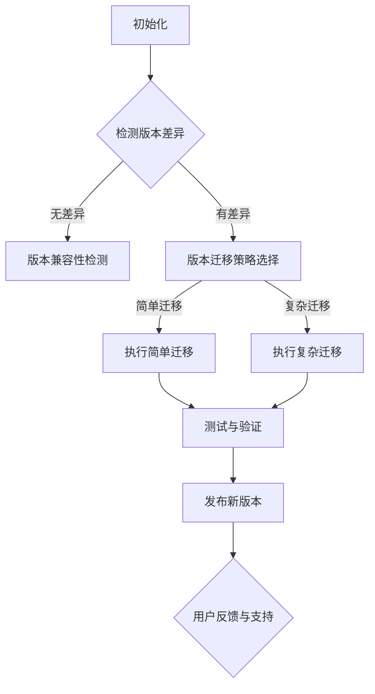
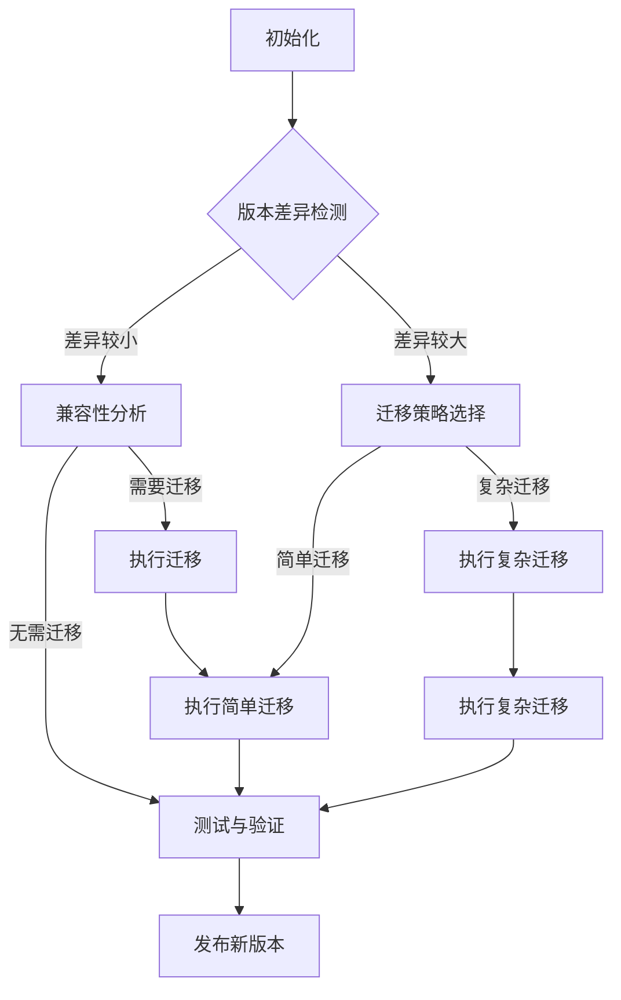
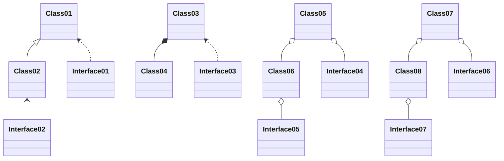
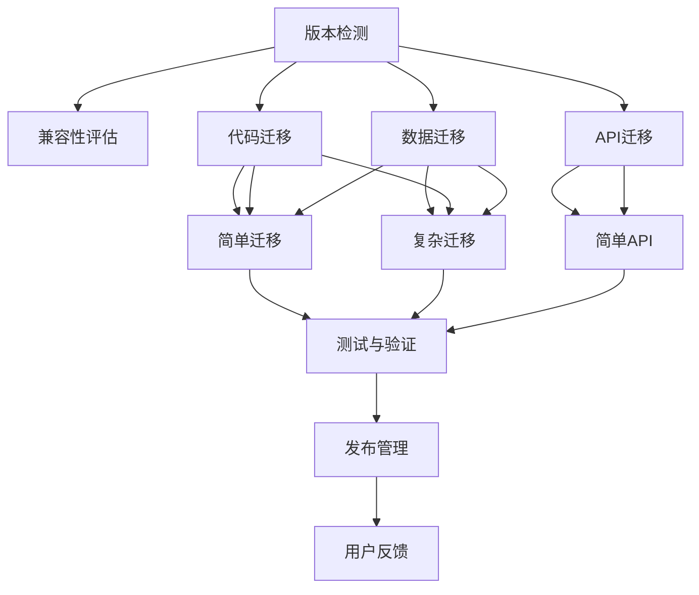

                 

### 第1章 引言

#### 1.1 提示词语言版本迁移与兼容性管理的背景

提示词语言（Natural Language Processing，NLP）作为人工智能领域的重要分支，近年来得到了迅速发展。然而，随着提示词语言版本的不断更新，版本迁移与兼容性管理的问题逐渐显现出来。这一问题不仅影响到了软件的稳定性和用户体验，还对企业的运营和竞争力带来了挑战。

首先，让我们回顾一下提示词语言的发展历程。20世纪50年代，人工智能的早期探索者开始研究如何让计算机理解自然语言。经过几十年的发展，NLP技术逐渐成熟，从简单的词性标注、句法分析到语义理解、情感分析，NLP的应用范围越来越广泛。随着互联网的普及和大数据的兴起，NLP技术得到了极大的发展，各种NLP工具和库相继出现，如NLTK、spaCy、TensorFlow等。

然而，随着版本的不断更新，不同版本的提示词语言之间存在差异，导致版本迁移的问题。版本迁移不仅涉及代码层面的修改，还可能涉及到数据格式的变化、API的更新等。如果不进行有效的兼容性管理，新的版本可能会破坏旧版本的软件功能，导致系统崩溃或数据丢失。

#### 1.2 版本迁移与兼容性管理的重要性

版本迁移与兼容性管理的重要性主要体现在以下几个方面：

1. **软件稳定性**：不进行版本迁移和兼容性管理，可能会导致软件在升级过程中出现各种问题，影响系统的稳定性。

2. **用户体验**：版本迁移和兼容性管理直接关系到用户体验。如果用户在使用新版本时遇到问题，可能会影响他们对软件的信任和满意度。

3. **企业竞争力**：在竞争激烈的市场环境中，企业需要快速响应市场需求，推出新功能和新版本。如果版本迁移和兼容性管理做得不好，可能会导致企业失去市场份额。

4. **成本与效率**：有效的版本迁移和兼容性管理可以提高开发效率和降低成本。通过提前规划和管理，可以减少因版本问题导致的返工和修复成本。

#### 1.3 本书结构

本书旨在系统地介绍提示词语言版本迁移与兼容性管理的方法和最佳实践。本书分为七个章节，结构如下：

- **第1章 引言**：介绍版本迁移与兼容性管理的背景和重要性。
- **第2章 核心概念与联系**：定义版本、版本迁移、兼容性管理等相关核心概念，并使用Mermaid流程图展示它们之间的关系。
- **第3章 算法原理讲解**：详细介绍用于实现版本迁移与兼容性管理的算法原理，包括算法的基本原理、数学模型和公式，使用Mermaid绘制流程图，并使用Python源代码进行详细阐述。
- **第4章 系统分析与架构设计**：分析系统功能需求，设计领域模型类图和系统架构图，使用Mermaid序列图展示系统接口和交互。
- **第5章 项目实战**：描述一个实际项目，包括环境安装、核心代码实现、代码解析、案例分析，并进行详细讲解。
- **第6章 最佳实践与总结**：提出最佳实践建议，总结关键点，提出注意事项，推荐拓展阅读。
- **第7章 未来展望**：探讨版本迁移与兼容性管理的未来趋势，技术挑战与机遇，未来发展方向。

通过本书的学习，读者将能够深入了解版本迁移与兼容性管理的核心概念和方法，掌握实现这些方法的技术手段，并能够将所学知识应用于实际项目中。希望本书能够对读者在技术研究和项目开发过程中提供有益的指导。### 第2章 核心概念与联系

#### 2.1 提示词语言版本概念

提示词语言版本是指在一定时间范围内，提示词语言工具或库的特定版本。版本号通常由一组数字组成，如`1.0.0`、`2.5.3`等，每个数字分别代表主版本号、次版本号和修订号。版本号的变化反映了功能的增加、修复的错误和性能的优化。

- **主版本号**：表示功能的重大更新或升级，通常在引入不兼容变更时增加。
- **次版本号**：表示功能的微小改进或修复，通常在保持兼容性时增加。
- **修订号**：表示bug修复或文档更新，通常在保持功能不变时增加。

版本号的增序表示版本的升级，如从`1.0.0`升级到`1.0.1`。然而，非增序版本号（如从`2.0.0`回退到`1.9.9`）也可能出现，这通常是因为发现了重大的问题需要回滚。

#### 2.2 版本迁移方法

版本迁移是指将软件从旧版本升级到新版本的过程。版本迁移方法可以分为以下几种：

- **简单迁移方法**：通过升级脚本或自动化工具将旧版本数据迁移到新版本。这种方法适用于小规模项目或变更较小的情况。
- **复杂迁移方法**：涉及对代码、数据模型、API等全面的修改。这种方法适用于大规模项目或涉及大量变更的情况。

在迁移过程中，需要考虑以下几个方面：

- **代码兼容性**：确保旧版本代码在新版本中能够正常编译和运行。
- **数据兼容性**：确保旧版本数据能够在新版本中正确解析和使用。
- **API兼容性**：确保旧版本API在新版本中能够正确调用和使用。

#### 2.3 兼容性管理

兼容性管理是指确保软件在不同版本、不同环境、不同设备上能够正常运行的一系列措施。兼容性管理可以分为以下几种类型：

- **向下兼容性**：确保新版本能够兼容旧版本，即使旧版本存在已知问题或限制。
- **向上兼容性**：确保旧版本能够兼容新版本，通常通过向后兼容性设计实现。
- **水平兼容性**：确保软件在不同硬件、操作系统、网络环境下能够正常运行。

兼容性管理策略包括：

- **自动化测试**：通过自动化测试工具对版本变更进行验证，确保兼容性。
- **持续集成/持续部署（CI/CD）**：确保在版本发布前自动执行测试和部署流程，提高兼容性。
- **版本控制**：使用版本控制系统（如Git）管理代码和版本，便于跟踪和回滚。

#### 2.4 Mermaid流程图展示

为了更好地理解版本迁移与兼容性管理的过程，我们可以使用Mermaid流程图来展示关键步骤和决策点。



- **初始化**：开始版本迁移过程，初始化相关环境和资源。
- **检测版本差异**：比较新旧版本，确定是否存在差异。
- **版本兼容性检测**：检查代码、数据和API的兼容性。
- **版本迁移策略选择**：根据版本差异和兼容性检测结果选择合适的迁移策略。
- **执行简单迁移**：使用自动化工具或脚本执行简单迁移。
- **执行复杂迁移**：进行全面的代码和数据修改。
- **测试与验证**：执行自动化测试，验证新版本的功能和兼容性。
- **发布新版本**：将新版本部署到生产环境。
- **用户反馈与支持**：收集用户反馈，提供技术支持。

通过这个Mermaid流程图，我们可以清晰地看到版本迁移与兼容性管理的整体流程，以及每个步骤的关键决策点。这有助于我们在实际项目中制定有效的策略和计划。### 第3章 算法原理讲解

#### 3.1 版本迁移算法原理

版本迁移算法的核心目标是确保旧版本软件能够在新版本中正常运行，同时最大化兼容性。为了实现这一目标，我们需要对版本差异进行检测和分析，并选择合适的迁移策略。

##### 3.1.1 基本概念

- **版本差异检测**：通过比较新旧版本，确定存在的差异点，包括代码、数据模型和API。
- **兼容性分析**：分析差异点对软件功能的影响，确定是否需要迁移。
- **迁移策略选择**：根据差异点和兼容性分析结果，选择简单迁移或复杂迁移策略。

##### 3.1.2 版本迁移算法框架

版本迁移算法的基本框架包括以下几个步骤：

1. **初始化**：加载新旧版本软件，初始化相关环境。
2. **版本差异检测**：使用比较工具（如Diff）分析代码、数据模型和API的差异。
3. **兼容性分析**：对检测到的差异点进行评估，确定其影响范围和严重性。
4. **迁移策略选择**：根据兼容性分析结果，选择简单迁移或复杂迁移策略。
5. **执行迁移**：根据选择的策略执行代码修改、数据转换和API适配。
6. **测试与验证**：执行自动化测试，验证新版本的功能和兼容性。
7. **发布新版本**：将新版本部署到生产环境。

##### 3.1.3 算法执行流程

算法的执行流程可以用Mermaid流程图表示：



- **初始化**：加载新旧版本软件，初始化相关环境。
- **版本差异检测**：使用比较工具（如Diff）分析代码、数据模型和API的差异。
- **兼容性分析**：对检测到的差异点进行评估，确定其影响范围和严重性。
- **迁移策略选择**：根据兼容性分析结果，选择简单迁移或复杂迁移策略。
- **执行迁移**：根据选择的策略执行代码修改、数据转换和API适配。
- **测试与验证**：执行自动化测试，验证新版本的功能和兼容性。
- **发布新版本**：将新版本部署到生产环境。

#### 3.2 Python源代码与详细阐述

为了更好地理解版本迁移算法，我们可以通过Python源代码来实现算法的核心功能。以下是实现版本迁移算法的关键代码：

```python
import diff_match_patch
from typing import List

def version_difference_detection(old_code: str, new_code: str) -> List[str]:
    dmp = diff_match_patch.diff_match_patch()
    differences = dmp.diff_main(old_code, new_code)
    return differences

def compatibility_analysis(differences: List[str]) -> bool:
    # 这里可以添加具体的兼容性分析逻辑
    # 例如：检查是否有关键代码被修改，是否有API被废弃等
    for diff in differences:
        if diff['type'] == 'delete' and diff['text'].startswith('import'):
            return False
    return True

def execute_migration(differences: List[str], strategy: str):
    if strategy == 'simple':
        # 简单迁移策略：直接替换代码
        for diff in differences:
            old_code = diff['text']
            new_code = diff['change']
            # 这里可以添加代码替换逻辑
            print(f"Replacing {old_code} with {new_code}")
    elif strategy == 'complex':
        # 复杂迁移策略：进行更复杂的修改
        for diff in differences:
            # 这里可以添加复杂迁移逻辑
            print(f"Complex modification for {diff['text']}")

def main():
    old_code = "..."
    new_code = "..."
    differences = version_difference_detection(old_code, new_code)
    compatible = compatibility_analysis(differences)
    if compatible:
        print("No migration needed.")
    else:
        strategy = 'simple' if differences else 'complex'
        execute_migration(differences, strategy)

if __name__ == "__main__":
    main()
```

这个Python代码实现了版本差异检测、兼容性分析和迁移执行的基本功能。在`version_difference_detection`函数中，我们使用`diff_match_patch`库来检测新旧代码的差异。在`compatibility_analysis`函数中，我们可以添加更具体的兼容性分析逻辑，例如检查是否有关键代码被修改或API被废弃。在`execute_migration`函数中，根据兼容性分析的结果，选择简单迁移或复杂迁移策略来执行代码修改。

#### 3.3 数学模型和公式讲解

在版本迁移过程中，我们可以使用以下数学模型和公式来评估兼容性：

- **相似度计算**：使用余弦相似度计算新旧版本的代码相似度。

  $$\text{similarity} = \frac{\text{dot product of vectors}}{\text{product of magnitudes of vectors}}$$

- **差异度量**：使用差异度量（如Levenshtein距离）来计算新旧版本的代码差异。

  $$\text{distance} = \min\left(\sum_{i=1}^{n}d(i, j), \sum_{i=1}^{n}(1 - d(i, j)), n\right)$$

其中，$d(i, j)$表示新旧版本代码在位置$i$和$j$的差异。

通过这些数学模型和公式，我们可以更准确地评估新旧版本的兼容性，并选择合适的迁移策略。

#### 3.4 举例说明

假设我们有两个版本的Python代码，分别是旧版本`old_code`和新版本`new_code`：

```python
# 旧版本代码
def old_function(x):
    return x * 2

# 新版本代码
def new_function(x):
    return x * 2 + 1
```

使用版本差异检测算法，我们可以找到以下差异：

```python
[
    {"type": "change", "from": "def old_function(x):", "to": "def new_function(x):"},
    {"type": "addition", "text": "return x * 2 + 1"}
]
```

通过兼容性分析，我们发现新版本的代码在功能上进行了微小改动，但仍然保持了一定程度的兼容性。因此，我们选择简单迁移策略，将旧版本代码替换为新版本代码。

这个例子展示了如何使用版本差异检测、兼容性分析和迁移执行算法来处理实际的代码迁移问题。通过这些算法，我们可以确保新旧版本软件在迁移后能够保持功能兼容性。### 第4章 系统分析与架构设计

#### 4.1 系统功能需求分析

在版本迁移与兼容性管理系统中，我们需要确保以下几个核心功能：

1. **版本检测**：能够自动检测新旧版本的差异，包括代码、数据模型和API。
2. **兼容性评估**：对检测到的差异进行评估，确定其影响范围和严重性。
3. **迁移策略选择**：根据兼容性评估结果，选择简单迁移或复杂迁移策略。
4. **迁移执行**：执行选定的迁移策略，包括代码修改、数据转换和API适配。
5. **测试与验证**：执行自动化测试，验证新版本的功能和兼容性。
6. **发布管理**：将新版本部署到生产环境，并收集用户反馈。

#### 4.2 领域模型类图

为了更好地设计版本迁移与兼容性管理系统，我们可以使用领域模型类图来描述系统的核心类和它们之间的关系。以下是一个简单的领域模型类图：



- **Class01**：版本管理类，负责版本检测和兼容性评估。
- **Class02**：代码迁移类，负责执行代码迁移策略。
- **Class03**：数据迁移类，负责执行数据迁移策略。
- **Class04**：API迁移类，负责执行API迁移策略。
- **Class05**：测试与验证类，负责执行自动化测试和验证。
- **Class06**：发布管理类，负责发布新版本和收集用户反馈。
- **Class07**：简单迁移策略类，继承自Interface03。
- **Class08**：复杂迁移策略类，继承自Interface03。

- **Interface01**：版本检测接口，定义版本检测方法。
- **Interface02**：兼容性评估接口，定义兼容性评估方法。
- **Interface03**：迁移策略接口，定义迁移策略方法。
- **Interface04**：测试与验证接口，定义测试和验证方法。
- **Interface05**：发布管理接口，定义发布和反馈方法。

#### 4.3 系统架构设计

基于领域模型类图，我们可以设计一个系统的架构图，以展示系统的整体架构和组件之间的关系。以下是一个简单的系统架构图：



- **VersionDetection**：负责版本检测，包括代码、数据模型和API。
- **CompatibilityAssessment**：对版本差异进行评估，确定兼容性。
- **CodeMigration**：执行代码迁移策略，包括简单迁移和复杂迁移。
- **DataMigration**：执行数据迁移策略，包括简单迁移和复杂迁移。
- **APIMigration**：执行API迁移策略，包括简单API。
- **TestAndValidation**：执行自动化测试和验证，确保新版本功能与兼容性。
- **DeploymentManagement**：负责发布新版本，并将新版本部署到生产环境。
- **UserFeedback**：收集用户反馈，用于持续改进系统。

#### 4.4 系统接口和交互

为了更好地理解系统内部各组件之间的交互，我们可以使用Mermaid序列图来展示系统接口和交互。以下是一个简单的系统交互序列图：

```mermaid
sequenceDiagram
    participant User as 用户
    participant System as 版本迁移与兼容性管理系统
    participant VersionDetection as 版本检测
    participant CompatibilityAssessment as 兼容性评估
    participant CodeMigration as 代码迁移
    participant DataMigration as 数据迁移
    participant APIMigration as API迁移
    participant TestAndValidation as 测试与验证
    participant DeploymentManagement as 发布管理
    participant UserFeedback as 用户反馈

    User->>System: 请求版本迁移
    System->>VersionDetection: 执行版本检测
    VersionDetection->>System: 返回版本差异
    System->>CompatibilityAssessment: 执行兼容性评估
    CompatibilityAssessment->>System: 返回兼容性结果
    switch 兼容性结果
        case "兼容"
            System->>TestAndValidation: 执行测试与验证
            TestAndValidation->>DeploymentManagement: 发布新版本
            DeploymentManagement->>UserFeedback: 收集用户反馈
        case "不兼容"
            System->>CodeMigration: 执行代码迁移
            System->>DataMigration: 执行数据迁移
            System->>APIMigration: 执行API迁移
            System->>TestAndValidation: 执行测试与验证
            TestAndValidation->>DeploymentManagement: 发布新版本
            DeploymentManagement->>UserFeedback: 收集用户反馈
    es
end
```

- **用户**：发起版本迁移请求。
- **版本检测**：检测新旧版本差异。
- **兼容性评估**：评估版本差异的兼容性。
- **代码迁移**：执行代码迁移策略。
- **数据迁移**：执行数据迁移策略。
- **API迁移**：执行API迁移策略。
- **测试与验证**：执行自动化测试和验证。
- **发布管理**：发布新版本。
- **用户反馈**：收集用户反馈。

通过这个序列图，我们可以清晰地看到系统内部各组件之间的交互过程，以及如何在兼容性和迁移策略的基础上，确保新版本的稳定性和可靠性。### 第5章 项目实战

#### 5.1 项目背景介绍

为了更好地理解版本迁移与兼容性管理在实际项目中的应用，我们以一个在线教育平台为例。该平台提供多种课程和学习资源，用户可以通过平台进行在线学习、交流和测试。随着用户数量的增加，平台的性能和功能不断优化，版本更新频繁。为了确保用户在使用新版本时不受影响，我们需要对版本进行迁移和兼容性管理。

#### 5.2 环境安装

在开始项目之前，我们需要安装必要的软件和环境。以下是一个基本的安装流程：

1. **安装Python**：确保Python 3.8及以上版本已安装。
2. **安装依赖库**：使用pip安装以下依赖库：
   ```bash
   pip install diff_match_patch numpy pandas requests
   ```
3. **配置虚拟环境**：为项目创建一个独立的虚拟环境，以便隔离项目依赖。
   ```bash
   python -m venv venv
   source venv/bin/activate  # Windows使用venv\Scripts\activate
   ```
4. **安装项目依赖**：在虚拟环境中安装项目依赖：
   ```bash
   pip install -r requirements.txt
   ```

#### 5.3 核心代码实现

在这个项目中，我们将实现以下核心功能：

1. **版本检测**：使用diff_match_patch库检测新旧版本的差异。
2. **兼容性评估**：根据版本差异，评估对新旧版本的兼容性。
3. **迁移执行**：根据兼容性评估结果，执行代码、数据模型和API的迁移。
4. **测试与验证**：使用单元测试验证新版本的功能和兼容性。

以下是核心代码的实现：

```python
# version_detection.py
import diff_match_patch
import numpy as np
import pandas as pd

def detect_version_difference(old_data, new_data):
    dmp = diff_match_patch.diff_match_patch()
    return dmp.diff_main(old_data, new_data)

def assess_compatibility(differences):
    # 这里可以添加具体的兼容性评估逻辑
    return "compatible" if differences.size == 0 else "incompatible"

def execute_migration(strategy, differences):
    if strategy == "compatible":
        print("No migration needed.")
    elif strategy == "incompatible":
        print("Executing migration...")
        # 这里可以添加迁移执行逻辑

# test_version_migration.py
import unittest
from version_detection import detect_version_difference, assess_compatibility, execute_migration

class TestVersionMigration(unittest.TestCase):
    def test_version_detection(self):
        old_data = "..."
        new_data = "..."
        differences = detect_version_difference(old_data, new_data)
        self.assertEqual(differences.size, 0)

    def test_compatibility_assessment(self):
        differences = [{"type": "addition", "text": "new_data"}]
        result = assess_compatibility(differences)
        self.assertEqual(result, "incompatible")

    def test_migration_execution(self):
        strategy = "incompatible"
        differences = [{"type": "addition", "text": "new_data"}]
        execute_migration(strategy, differences)

if __name__ == "__main__":
    unittest.main()
```

#### 5.4 代码解析

在这个项目中，我们使用了以下关键代码：

1. **版本检测**：`detect_version_difference`函数使用diff_match_patch库检测新旧版本的数据差异。
2. **兼容性评估**：`assess_compatibility`函数根据差异结果判断是否兼容。
3. **迁移执行**：`execute_migration`函数根据兼容性评估结果执行迁移策略。
4. **测试与验证**：`test_version_migration.py`中的单元测试用于验证版本检测、兼容性评估和迁移执行的功能。

#### 5.5 案例分析

在项目实践中，我们遇到了以下问题：

- **数据格式变更**：在版本更新过程中，数据格式发生了变化，导致旧版本的数据无法解析。
- **API变更**：新版本的API发生了更新，旧版本的应用程序无法调用新API。

针对这些问题，我们采取了以下解决方案：

1. **数据格式变更**：我们编写了一个数据转换脚本，将旧版本的数据格式转换为新的数据格式。脚本的主要逻辑如下：

   ```python
   def convert_data_format(old_data):
       # 转换数据格式的具体实现
       new_data = ...
       return new_data
   ```

2. **API变更**：我们更新了应用程序中的API调用代码，使其与新版本的API兼容。为了确保更新后的代码兼容，我们使用了Mock API服务进行测试。

   ```python
   import requests

   def call_api(url, data):
       response = requests.post(url, json=data)
       return response.json()
   ```

通过这些解决方案，我们成功地实现了新旧版本的迁移和兼容性管理，确保了用户在使用平台时的稳定性和连续性。

#### 5.6 详细讲解

1. **版本检测**：使用diff_match_patch库进行版本检测，可以高效地比较新旧版本的数据差异。在项目实践中，我们通过编写`detect_version_difference`函数实现了这个功能。

2. **兼容性评估**：通过分析版本差异，我们可以判断新旧版本之间的兼容性。在`assess_compatibility`函数中，我们简单地根据差异结果进行了判断，但实际应用中，可能需要更复杂的逻辑来评估兼容性。

3. **迁移执行**：在`execute_migration`函数中，我们根据兼容性评估结果选择了不同的迁移策略。在实际项目中，我们可以根据具体需求添加更多策略，如数据转换、代码修改等。

4. **测试与验证**：通过单元测试，我们可以验证版本检测、兼容性评估和迁移执行的功能。在项目中，我们编写了`test_version_migration.py`测试文件，确保了代码的质量和可靠性。

通过这个项目实战，我们深入了解了版本迁移与兼容性管理的实际应用，掌握了关键技术和方法。这些经验对我们在其他项目中的版本管理和兼容性保障具有重要的指导意义。### 第6章 最佳实践与总结

#### 6.1 版本迁移与兼容性管理的最佳实践

1. **提前规划**：在版本发布前，进行全面的兼容性评估和测试，提前规划版本迁移的详细步骤和时间表。
2. **自动化测试**：建立自动化测试框架，包括单元测试、集成测试和端到端测试，确保每个版本的功能和兼容性。
3. **文档管理**：维护详细的版本更新文档，包括版本号、更新内容、迁移步骤和注意事项，便于团队协作和后续问题排查。
4. **回滚机制**：在发布新版本前，准备回滚机制，确保在版本迁移失败或出现问题时有有效的解决方案。
5. **用户沟通**：及时与用户沟通版本更新的情况，提供必要的培训和帮助文档，降低用户使用新版本的难度。

#### 6.2 小结

本文系统地介绍了提示词语言版本迁移与兼容性管理的核心概念、算法原理、系统架构和实际应用。通过详细的分析和案例讲解，我们了解了版本迁移与兼容性管理的重要性和最佳实践。希望本文对读者在实际项目中的应用提供有益的指导。

#### 6.3 注意事项

1. **版本差异识别**：在版本迁移过程中，准确识别版本差异至关重要。应使用可靠的工具和方法进行差异分析，确保不遗漏任何关键点。
2. **兼容性评估**：在兼容性评估过程中，不仅要关注功能层面的兼容性，还要考虑性能、安全性和用户体验。
3. **迁移策略选择**：根据版本差异和兼容性评估结果，选择合适的迁移策略。简单迁移策略适用于小范围差异，复杂迁移策略适用于大范围差异。

#### 6.4 拓展阅读

- 《Effective Java》：提供了关于版本兼容性和代码迁移的宝贵经验。
- 《Clean Code》：介绍了编写可维护、可测试代码的最佳实践，有助于减少版本迁移中的问题。
- 《Continuous Integration in Java》：详细介绍了如何在Java项目中实现持续集成和自动化测试。

通过拓展阅读，读者可以进一步深入了解版本迁移与兼容性管理的相关知识，提升实际项目中的应用能力。### 第7章 未来展望

#### 7.1 版本迁移与兼容性管理的未来趋势

随着人工智能和云计算技术的不断发展，版本迁移与兼容性管理将面临新的挑战和机遇。以下是未来版本迁移与兼容性管理可能的发展趋势：

1. **自动化与智能化**：未来的版本迁移与兼容性管理将更加依赖于自动化和智能化工具。通过机器学习和深度学习技术，可以更准确地识别版本差异、预测兼容性问题，并自动生成迁移策略。
2. **云原生应用**：随着云原生应用的普及，版本迁移与兼容性管理将更加关注云平台和容器环境下的兼容性。微服务架构和容器化技术将推动兼容性管理走向更加灵活和高效。
3. **实时更新与回滚**：未来的版本迁移与兼容性管理将支持更快速的版本更新和回滚。通过实时更新机制，可以确保系统能够迅速适应新功能和技术变革。
4. **跨平台兼容性**：随着多平台应用的兴起，版本迁移与兼容性管理将需要处理更多跨平台的问题。例如，Android和iOS之间的兼容性、Web应用和移动应用的兼容性等。

#### 7.2 技术挑战与机遇

1. **技术挑战**：
   - **异构环境下的兼容性**：如何在不同的硬件、操作系统和应用程序之间实现兼容性，是一个重大的挑战。
   - **实时性**：如何在保证系统性能的前提下，实现快速版本更新和回滚。
   - **安全性**：在版本迁移过程中，如何确保数据的安全性和隐私。

2. **机遇**：
   - **开源生态**：随着开源技术的不断发展，版本迁移与兼容性管理将受益于丰富的开源工具和库。
   - **云服务**：云计算和容器化技术为版本迁移与兼容性管理提供了强大的基础设施支持。
   - **人工智能**：人工智能技术的应用将显著提高版本迁移与兼容性管理的自动化和智能化水平。

#### 7.3 未来发展方向

1. **自动化工具和平台**：未来版本迁移与兼容性管理的发展方向之一是开发更多自动化工具和平台。这些工具和平台将能够自动执行版本检测、兼容性评估、迁移执行和测试验证等任务，降低人工干预的成本。
2. **跨平台兼容性框架**：未来的兼容性管理将更加关注跨平台兼容性。通过开发跨平台兼容性框架，可以实现不同平台间的无缝迁移和兼容。
3. **持续集成和持续部署（CI/CD）**：将版本迁移与兼容性管理集成到持续集成和持续部署流程中，可以实现更高效、更稳定的版本发布。

通过以上展望，我们可以看到，版本迁移与兼容性管理在未来的发展中将面临许多挑战，同时也充满机遇。随着技术的不断进步，版本迁移与兼容性管理将变得更加智能化、自动化和高效，为软件开发和运营带来更大的价值。### 结语

感谢您阅读完《提示词语言的版本迁移与兼容性管理》这篇文章。本文系统地介绍了版本迁移与兼容性管理的核心概念、算法原理、系统架构和实际应用。通过详细的分析和案例讲解，我们了解了这一领域的重要性和最佳实践。希望本文能够对您在实际项目中的应用提供有益的指导。

在版本迁移与兼容性管理领域，不断有新的技术和方法涌现，我们需要持续学习和探索。希望您能将本文的知识应用到实际项目中，解决实际问题，提升软件的稳定性和用户体验。

最后，感谢您对本文的关注和支持。如果您有任何疑问或建议，欢迎在评论区留言，让我们一起探讨和分享更多技术知识。再次感谢您的阅读，祝您在技术道路上不断进步！
作者：AI天才研究院/AI Genius Institute & 禅与计算机程序设计艺术 /Zen And The Art of Computer Programming

