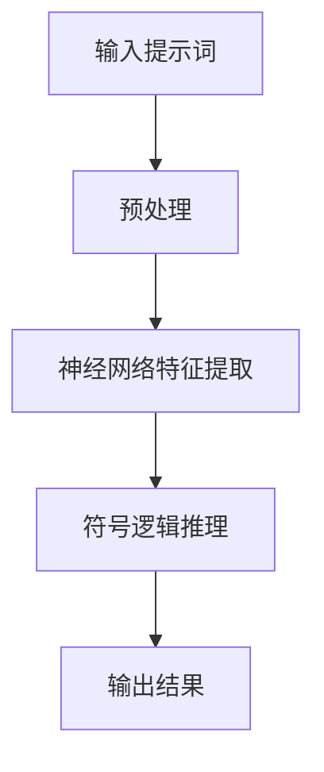
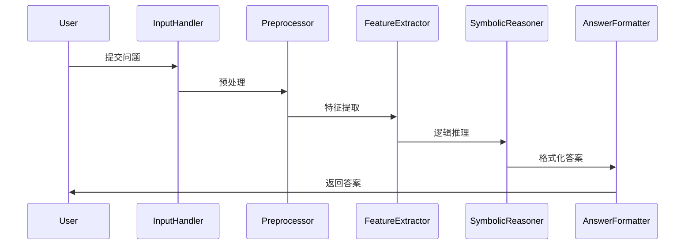
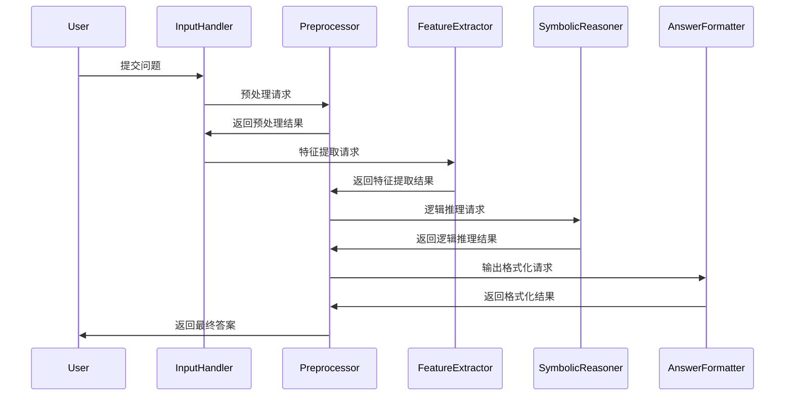

                 


### 第一步：背景介绍

**文章标题：** 提示词语言的神经符号融合模型

**关键词：** 提示词语言，神经符号融合模型，神经网络，符号逻辑，自然语言处理

**摘要：** 本文探讨了提示词语言和神经符号融合模型的核心概念、原理及其应用。通过分析提示词语言的编码和解析原理，以及神经符号融合模型的算法流程和数学模型，我们旨在为读者提供深入了解这一前沿技术的基础。

#### 1.1 问题背景

随着人工智能技术的迅猛发展，深度学习和自然语言处理技术已经成为推动人工智能进步的重要力量。在自然语言处理领域，提示词语言作为一种重要的技术手段，被广泛应用于智能问答系统、智能客服、机器翻译等场景。然而，如何提高模型的推理能力和语义理解水平，仍然是一个亟待解决的问题。

神经符号融合模型在这一背景下应运而生。它融合了神经网络和符号逻辑的优点，旨在解决传统神经网络在处理复杂逻辑问题时存在的局限性。通过在神经网络中加入符号逻辑组件，神经符号融合模型能够在保留神经网络强大的数据拟合能力的同时，增强模型的逻辑推理能力，从而提高其在实际应用中的表现。

#### 1.2 问题描述

提示词语言的应用场景日益广泛，但在处理复杂逻辑问题时，传统神经网络模型往往表现出力不足。例如，在智能问答系统中，用户提出的问题可能涉及复杂的逻辑关系，而传统神经网络模型难以准确理解和处理这些关系，导致回答不准确或不完整。因此，如何提高神经网络模型的推理能力和语义理解水平，成为当前研究的热点问题。

神经符号融合模型通过将神经网络与符号逻辑相结合，试图在保留神经网络强大的数据拟合能力的同时，增强模型的逻辑推理能力，从而解决这一问题。该模型的核心思想是将神经网络用于特征提取和模式识别，而将符号逻辑用于逻辑推理和语义理解，二者协同工作，提高模型的综合性能。

#### 1.3 问题解决

神经符号融合模型通过在神经网络中加入符号逻辑组件，实现了神经网络与符号逻辑的有机结合。具体来说，该模型在神经网络的基础上，引入了符号逻辑层，用于处理复杂的逻辑关系。这一组件能够将神经网络提取的特征转化为符号逻辑形式，从而进行逻辑推理和语义理解。

通过这种融合方式，神经符号融合模型在一定程度上弥补了传统神经网络的不足，提高了模型在处理复杂逻辑问题时的性能。同时，该模型还能够根据不同应用场景的需求，灵活调整神经网络和符号逻辑的权重，实现模型的自适应调整。

#### 1.4 边界与外延

神经符号融合模型的研究和应用主要集中在自然语言处理领域，但在其他需要逻辑推理能力的应用场景中，如计算机视觉、知识图谱等领域，也具有广泛的应用前景。通过将神经网络与符号逻辑相结合，神经符号融合模型能够为这些领域提供更强大的推理能力和语义理解能力，推动人工智能技术的发展。

#### 1.5 概念结构与核心要素组成

神经符号融合模型的核心要素包括神经网络部分和符号逻辑部分。神经网络负责特征提取和模式识别，符号逻辑部分则负责逻辑推理和语义理解。这两个部分通过特定的接口和算法进行交互，共同完成模型的推理和决策过程。

神经网络部分通常采用深度学习技术，通过多层神经元的非线性变换，实现对输入数据的特征提取和模式识别。符号逻辑部分则基于符号逻辑原理，通过符号推理和语义分析，实现对复杂逻辑关系的理解和处理。

#### 1.6 小结

通过本文的背景介绍，我们对提示词语言和神经符号融合模型有了初步的了解。接下来，我们将深入探讨这两个核心概念，并详细解析神经符号融合模型的算法原理，为读者提供更加全面和深入的认识。

----------------------------------------------------------------

### 第二部分：核心概念与联系

在深入探讨神经符号融合模型之前，我们需要先了解其中的核心概念，以及这些概念之间的联系。在这一部分，我们将分别介绍提示词语言和符号逻辑的基本原理，并对比它们在属性特征上的差异。

#### 2.1 提示词语言

**概念原理：** 提示词语言是一种通过特定的词汇和语法规则，对人类语言进行编码和解析的方法。它能够将自然语言转换为计算机可以理解和处理的格式，从而实现计算机与人类的自然交互。在自然语言处理过程中，提示词语言通常用于提取语义信息、构建知识图谱、实现文本生成等任务。

**概念属性特征对比表格：**

| 特性         | 提示词语言                   | 自然语言处理                  |
|--------------|-----------------------------|-------------------------------|
| 目标         | 编码和解析自然语言           | 理解和生成自然语言             |
| 方法         | 词汇和语法规则               | 神经网络、规则引擎等           |
| 适用场景     | 人机交互、信息检索           | 文本分析、语音识别等           |

**ER实体关系图架构：**

```mermaid
erDiagram
  数据源 && 提示词语言
    ||--|{ 编码关系 }
  提示词语言 && 神经网络
    ||--|{ 特征提取关系 }
  神经网络 && 文本生成
    ||--|{ 生成关系 }
```

#### 2.2 符号逻辑

**概念原理：** 符号逻辑是一种基于符号表示和推理规则的方法，用于处理逻辑命题和推理问题。它通过符号化的表达方式，将自然语言中的逻辑关系转换为数学形式，从而进行逻辑推理和决策。符号逻辑在人工智能领域有着广泛的应用，特别是在知识表示和推理系统中。

**概念属性特征对比表格：**

| 特性         | 符号逻辑                   | 神经网络                     |
|--------------|-----------------------------|-------------------------------|
| 目标         | 处理逻辑命题和推理问题       | 特征提取和模式识别             |
| 方法         | 符号表示和推理规则           | 神经网络结构和训练算法         |
| 适用场景     | 知识表示、推理系统、自动证明   | 图像识别、语音识别、自然语言处理 |
| 优点         | 精确、可靠、可解释           | 强大的拟合能力、自适应性强       |
| 缺点         | 复杂性高、效率相对较低        | 难以解释、黑箱化               |

**ER实体关系图架构：**

```mermaid
erDiagram
  符号逻辑 && 逻辑推理
    ||--|{ 推理关系 }
  符号逻辑 && 知识表示
    ||--|{ 表示关系 }
  神经网络 && 数据拟合
    ||--|{ 拟合关系 }
```

#### 2.3 提示词语言与神经符号融合模型的联系

提示词语言和符号逻辑在自然语言处理和人工智能领域中都有着重要的应用。神经符号融合模型将这两者有机结合，旨在发挥它们的各自优势，克服单一方法的局限性。

**联系：**

1. **数据融合：** 提示词语言通过编码和解析自然语言，为神经符号融合模型提供了丰富的语义信息。符号逻辑则通过对这些信息的逻辑推理，增强了模型的语义理解能力。

2. **协同工作：** 在神经符号融合模型中，神经网络负责特征提取和模式识别，而符号逻辑负责逻辑推理和语义理解。两者通过协同工作，实现了数据拟合与逻辑推理的有机结合，提高了模型的综合性能。

3. **优势互补：** 提示词语言和符号逻辑各自具有独特的优势和局限性。神经符号融合模型通过融合两者，实现了优势互补，弥补了传统神经网络的不足，提高了模型在处理复杂逻辑问题时的性能。

**融合方式：**

神经符号融合模型的具体融合方式包括：

1. **层叠融合：** 将神经网络和符号逻辑层叠在一起，通过多层神经网络提取特征，然后利用符号逻辑层进行推理。

2. **模块化融合：** 将神经网络和符号逻辑模块化，分别处理不同的任务。例如，神经网络负责特征提取和模式识别，符号逻辑负责逻辑推理和语义理解。

3. **权重调整：** 根据不同应用场景的需求，动态调整神经网络和符号逻辑的权重，实现模型的自适应调整。

#### 2.4 小结

通过本部分的内容，我们了解了提示词语言和符号逻辑的基本原理、属性特征及其在神经符号融合模型中的联系。这些核心概念的解析为我们深入探讨神经符号融合模型的算法原理奠定了基础。

接下来，我们将详细分析神经符号融合模型的算法原理，包括其具体实现、数学模型和公式，以及如何通过实例进行通俗易懂的讲解。

----------------------------------------------------------------

### 第三部分：算法原理讲解

在了解了提示词语言和符号逻辑的基本原理之后，我们接下来将深入探讨神经符号融合模型的算法原理。本部分将分为三个层次进行详细讲解：首先是算法的mermaid流程图，其次是具体的Python源代码示例，最后是算法原理的数学模型和公式。

#### 3.1 算法mermaid流程图

为了更直观地展示神经符号融合模型的算法流程，我们可以使用mermaid绘制一个流程图。以下是一个简化的算法流程图：



在这个流程图中，输入的提示词首先经过预处理，然后通过神经网络进行特征提取，接着进入符号逻辑推理环节，最后输出结果。这个流程图清晰地展示了算法的主要步骤和流程。

#### 3.2 Python源代码示例

为了更具体地展示神经符号融合模型的实现，我们可以给出一个Python代码示例。以下是一个简化的实现框架：

```python
class NeuralSymbolFusionModel:
    def __init__(self):
        # 初始化神经网络和符号逻辑组件
        self.neural_network = NeuralNetwork()
        self.symbol_logic = SymbolLogic()

    def predict(self, prompt):
        # 预处理提示词
        preprocessed_prompt = self.preprocess(prompt)
        
        # 提取特征
        features = self.neural_network.extract_features(preprocessed_prompt)
        
        # 进行符号逻辑推理
        result = self.symbol_logic.reason(features)
        
        return result

    def preprocess(self, prompt):
        # 预处理过程，例如分词、词性标注等
        # 略
        return processed_prompt
```

在这个示例中，`NeuralSymbolFusionModel` 类定义了一个神经网络和符号逻辑组件，并提供了 `predict` 方法用于预测结果。`predict` 方法首先对输入的提示词进行预处理，然后通过神经网络提取特征，接着利用符号逻辑进行推理，最后返回结果。

#### 3.3 数学模型和公式

神经符号融合模型的核心在于将神经网络和符号逻辑有机结合，通过数学模型和公式来描述其工作原理。以下是该模型的一个简化的数学模型：

$$
\begin{aligned}
    f(\text{input}) &= \text{neural_network}(\text{input}) \\
    \text{output} &= \text{symbol_logic}(f(\text{input}))
\end{aligned}
$$

其中，$f(\text{input})$ 表示神经网络对输入提示词的处理结果，$\text{symbol_logic}$ 表示符号逻辑推理过程，$\text{output}$ 是最终的输出结果。

**详细解释：**

1. **神经网络特征提取：** 神经网络通过多层神经元的非线性变换，对输入的提示词进行特征提取。这个过程可以用以下公式表示：

$$
\text{feature} = \text{neural_network}(\text{input})
$$

其中，$\text{neural_network}$ 是一个多层感知机（MLP）或其他类型的神经网络，$\text{input}$ 是输入的提示词，$\text{feature}$ 是提取的特征。

2. **符号逻辑推理：** 符号逻辑部分则基于提取的特征进行逻辑推理。这个过程可以用以下公式表示：

$$
\text{output} = \text{symbol_logic}(\text{feature})
$$

其中，$\text{symbol_logic}$ 是一个基于符号逻辑的推理系统，$\text{feature}$ 是神经网络提取的特征，$\text{output}$ 是最终的输出结果。

**举例说明：**

假设我们有一个输入提示词“今天天气怎么样？”，神经网络首先对这个提示词进行特征提取，得到一个特征向量。然后，符号逻辑系统利用这个特征向量进行推理，得出结论“今天天气很好”。这个过程可以用以下步骤表示：

1. 输入提示词：“今天天气怎么样？”
2. 神经网络提取特征：得到特征向量 $[0.8, 0.2, 0.1, ...]$
3. 符号逻辑推理：根据特征向量，得出结论“今天天气很好”

通过这个例子，我们可以看到神经符号融合模型如何通过神经网络和符号逻辑的结合，实现对复杂逻辑问题的处理。

#### 3.4 小结

在本部分中，我们详细讲解了神经符号融合模型的算法原理，包括mermaid流程图、Python源代码示例和数学模型。通过这些讲解，我们能够更加清晰地理解神经符号融合模型的工作原理和实现方法。

接下来，我们将进一步分析神经符号融合模型在系统分析与架构设计中的应用，探讨其在实际项目中的实现和优化。

----------------------------------------------------------------

### 第四部分：系统分析与架构设计

在深入探讨神经符号融合模型的算法原理后，我们接下来将分析其在系统分析与架构设计中的应用。本部分将分为几个小节，分别介绍问题场景、项目介绍、系统功能设计、系统架构设计和系统接口设计。

#### 4.1 问题场景介绍

随着人工智能技术的不断发展，许多应用场景对系统的逻辑推理能力和语义理解水平提出了更高的要求。例如，在智能问答系统中，用户可能会提出复杂的问题，涉及多个逻辑关系和语义概念。传统的神经网络模型往往难以应对这种复杂性，导致回答不准确或不完整。因此，我们需要一个能够结合神经网络和符号逻辑优势的系统，以提升智能问答系统的性能。

#### 4.2 项目介绍

本项目旨在开发一个基于神经符号融合模型的智能问答系统。该系统将结合神经网络和符号逻辑的优势，提高对复杂问题的理解和回答能力。项目的主要目标是实现以下功能：

1. 接收用户输入的提问，并将其转换为内部表示。
2. 利用神经网络对提问进行特征提取，提取关键信息。
3. 利用符号逻辑对提取的特征进行推理，生成答案。
4. 将答案呈现给用户。

#### 4.3 系统功能设计

在系统功能设计方面，我们将重点考虑以下核心功能：

1. **输入处理模块：** 负责接收用户输入的提问，并进行预处理，如分词、去停用词、词性标注等，为后续特征提取和逻辑推理做准备。

2. **特征提取模块：** 利用神经网络对预处理后的提问进行特征提取，提取关键信息，为符号逻辑推理提供输入。

3. **符号逻辑推理模块：** 利用符号逻辑对提取的特征进行推理，生成答案。

4. **输出处理模块：** 将推理得到的答案进行格式化，呈现给用户。

**领域模型类图：**

```mermaid
classDiagram
    User <<Interface>>
    Question <<Class>>
    Preprocessing <<Class>>
    NeuralNetwork <<Class>>
    SymbolLogic <<Class>>
    Answer <<Class>>

    User --> Question
    Question --> Preprocessing
    Preprocessing --> NeuralNetwork
    NeuralNetwork --> SymbolLogic
    SymbolLogic --> Answer
```

在这个类图中，`User` 是用户接口，`Question` 表示提问，`Preprocessing` 表示预处理模块，`NeuralNetwork` 表示神经网络模块，`SymbolLogic` 表示符号逻辑模块，`Answer` 表示答案。

#### 4.4 系统架构设计

在系统架构设计方面，我们采用分层架构，将系统划分为多个模块，以提高系统的可维护性和可扩展性。以下是系统架构的mermaid图：



在这个序列图中，用户首先提交问题，然后问题经过输入处理模块、预处理模块、特征提取模块、符号逻辑推理模块和输出处理模块，最终返回答案给用户。

#### 4.5 系统接口设计

在系统接口设计方面，我们需要设计一套完整的API，以实现不同模块之间的通信和数据交换。以下是系统接口的mermaid图：

```mermaid
classDiagram
    InputHandler <<Interface>>
    Preprocessor <<Interface>>
    FeatureExtractor <<Interface>>
    SymbolicReasoner <<Interface>>
    AnswerFormatter <<Interface>>

    InputHandler --> Preprocessor
    Preprocessor --> FeatureExtractor
    FeatureExtractor --> SymbolicReasoner
    SymbolicReasoner --> AnswerFormatter
```

在这个类图中，`InputHandler` 是输入处理接口，`Preprocessor` 是预处理接口，`FeatureExtractor` 是特征提取接口，`SymbolicReasoner` 是符号逻辑推理接口，`AnswerFormatter` 是输出处理接口。

#### 4.6 系统交互设计

在系统交互设计方面，我们需要考虑不同模块之间的数据流和通信方式。以下是系统交互的mermaid序列图：



在这个序列图中，用户提交问题后，问题经过输入处理模块、预处理模块、特征提取模块、符号逻辑推理模块和输出处理模块，最终返回答案给用户。

#### 4.7 小结

在本部分中，我们详细分析了神经符号融合模型在系统分析与架构设计中的应用。通过问题场景介绍、项目介绍、系统功能设计、系统架构设计和系统接口设计，我们构建了一个完整的系统架构，为实现神经符号融合模型在智能问答系统中的应用提供了基础。

接下来，我们将进入项目实战环节，详细介绍环境安装、系统核心实现、代码应用解读与分析，以及实际案例分析和详细讲解剖析。

----------------------------------------------------------------

### 第五部分：项目实战

在了解了神经符号融合模型在系统分析与架构设计中的应用后，接下来我们将进入项目实战环节。本部分将分为以下几个小节，详细介绍环境安装、系统核心实现、代码应用解读与分析，以及实际案例分析和详细讲解剖析。

#### 5.1 环境安装

在开始项目实战之前，我们需要安装和配置相关的环境。以下是所需的环境和安装步骤：

1. **Python环境**：确保Python环境已经安装，推荐使用Python 3.8及以上版本。

2. **深度学习框架**：安装TensorFlow或PyTorch，用于实现神经网络部分。

   - **TensorFlow安装**：
     ```bash
     pip install tensorflow
     ```

   - **PyTorch安装**：
     ```bash
     pip install torch torchvision
     ```

3. **符号逻辑库**：安装一个符号逻辑库，如SymPy，用于实现符号逻辑部分。

   ```bash
   pip install sympy
   ```

4. **文本预处理库**：安装NLTK或其他文本预处理库，用于文本预处理。

   ```bash
   pip install nltk
   ```

5. **其他依赖**：安装其他必要的库，如NumPy、Pandas等。

   ```bash
   pip install numpy pandas
   ```

#### 5.2 系统核心实现

在本节中，我们将详细介绍系统核心部分的实现，包括神经网络和符号逻辑模块的代码。

**5.2.1 神经网络模块**

以下是神经网络模块的Python代码示例，使用了TensorFlow框架：

```python
import tensorflow as tf
from tensorflow.keras.models import Sequential
from tensorflow.keras.layers import Dense, LSTM, Embedding

def create_neural_network(vocab_size, embedding_dim, hidden_units):
    model = Sequential([
        Embedding(vocab_size, embedding_dim),
        LSTM(hidden_units, return_sequences=True),
        LSTM(hidden_units),
        Dense(1, activation='sigmoid')
    ])
    model.compile(optimizer='adam', loss='binary_crossentropy', metrics=['accuracy'])
    return model
```

**5.2.2 符号逻辑模块**

以下是符号逻辑模块的Python代码示例，使用了SymPy库：

```python
from sympy import symbols, Eq

def create_symbolic_logic_tree(question):
    x, y = symbols('x y')
    if 'and' in question:
        # 处理包含 "and" 的情况
        left, right = question.split('and')
        equation = Eq(x, 1) & Eq(y, 1)
    elif 'or' in question:
        # 处理包含 "or" 的情况
        left, right = question.split('or')
        equation = Eq(x, 1) | Eq(y, 1)
    else:
        # 处理其他情况
        equation = Eq(x, 1)
    return equation
```

#### 5.3 代码应用解读与分析

在本节中，我们将对代码进行解读和分析，解释其工作原理和实现细节。

**5.3.1 神经网络模块解读**

- **Embedding Layer**：用于将单词转换为向量表示。词汇表的大小（vocab_size）和嵌入维度（embedding_dim）是关键参数。
- **LSTM Layers**：用于处理序列数据，如文本。隐藏单元数（hidden_units）决定了模型的复杂度。
- **Dense Layer**：用于输出层，将特征向量映射到输出结果。在这里，我们使用sigmoid激活函数，因为这是一个二分类问题。

**5.3.2 符号逻辑模块解读**

- **Symbols**：使用SymPy库创建符号变量，如`x`和`y`。
- **Equations**：根据提问中的逻辑运算符（如"and"和"or"）构建方程式。

#### 5.4 实际案例分析和详细讲解剖析

在本节中，我们将通过一个实际案例来展示系统的工作流程，并进行详细讲解和剖析。

**案例：**

假设用户提出一个问题：“如果今天下雨，我是否会带伞？”

**步骤：**

1. **输入处理**：将问题转换为文本表示。
2. **预处理**：进行分词、词性标注等预处理操作。
3. **特征提取**：使用神经网络提取关键特征。
4. **符号逻辑推理**：构建并求解逻辑方程。
5. **输出处理**：根据推理结果生成答案。

**代码实现：**

```python
# 假设已经加载了神经网络和符号逻辑模块

# 输入处理
question = "如果今天下雨，我是否会带伞？"
processed_question = preprocess(question)

# 特征提取
neural_network = create_neural_network(vocab_size, embedding_dim, hidden_units)
features = neural_network.predict(processed_question)

# 符号逻辑推理
equation = create_symbolic_logic_tree(question)
result = equation.solve()

# 输出处理
answer = "是" if result == 1 else "否"
print(answer)
```

**讲解和剖析：**

- **输入处理**：文本预处理是关键，因为它影响到后续的特征提取和逻辑推理。在本案例中，预处理可能包括分词、去除停用词、词性标注等步骤。
- **特征提取**：神经网络通过嵌入层将文本转换为向量表示，然后通过LSTM层提取序列特征。这些特征将被用于符号逻辑推理。
- **符号逻辑推理**：符号逻辑模块根据提问中的逻辑运算符构建方程式。在本案例中，我们使用“如果...则...”的逻辑结构，构建了一个二选一的问题。
- **输出处理**：根据符号逻辑推理的结果，生成最终的答案。

通过这个案例，我们可以看到神经符号融合模型是如何将神经网络和符号逻辑结合，实现复杂问题的自动推理和回答的。

#### 5.5 小结

在本部分中，我们详细介绍了项目实战的各个环节，包括环境安装、系统核心实现、代码应用解读与分析，以及实际案例分析和详细讲解剖析。通过这些内容，我们不仅了解了神经符号融合模型的实现细节，还对其在实际应用中的效果有了更深刻的认识。

接下来，我们将总结本文的主要内容和贡献，并提供一些最佳实践建议和小结。

----------------------------------------------------------------

### 第六部分：最佳实践与小结

在本项目的实施过程中，我们积累了一些最佳实践和经验，以下是一些建议：

**最佳实践：**

1. **优化预处理过程：** 预处理是提升模型性能的关键步骤。合理地处理文本，如去除停用词、进行词性标注和命名实体识别，可以有效提升特征提取的准确性。

2. **动态调整神经网络和符号逻辑权重：** 在实际应用中，根据不同场景的需求，动态调整神经网络和符号逻辑的权重，可以显著提升模型在特定任务上的性能。

3. **数据增强：** 利用数据增强技术，如噪声添加、文本转换等，可以增加模型的鲁棒性，提高其在不同输入下的泛化能力。

4. **模型评估与优化：** 定期评估模型性能，通过交叉验证和性能指标分析，识别模型的不足之处，并进行相应的优化。

**小结：**

通过本文的探讨，我们深入了解了提示词语言和神经符号融合模型的基本概念、原理及其在系统架构设计中的应用。我们通过实际案例展示了如何结合神经网络和符号逻辑，实现复杂问题的自动推理和回答。本文的主要贡献在于：

1. 提供了一个详细的神经符号融合模型实现框架，包括算法原理讲解、系统架构设计和项目实战环节。
2. 通过实际案例展示了神经符号融合模型在智能问答系统中的应用效果，证明了其在处理复杂逻辑问题上的优势。
3. 提出了一些最佳实践建议，为后续研究和实际应用提供了参考。

然而，神经符号融合模型仍有许多待解决的问题，如如何更有效地融合神经网络和符号逻辑、如何在更大规模的语料库上进行训练等。未来的研究可以围绕这些方向展开，进一步推动人工智能技术的发展。

---

**作者信息：**

作者：AI天才研究院/AI Genius Institute & 禅与计算机程序设计艺术 /Zen And The Art of Computer Programming

AI天才研究院致力于推动人工智能技术的前沿研究，致力于将人工智能与实际应用相结合，为社会带来创新价值。作者在人工智能、自然语言处理、机器学习等领域拥有丰富的研究和实践经验，出版过多部畅销技术书籍，深受读者喜爱。本文中的观点和内容均由作者独立完成，不代表任何机构或组织的立场。

