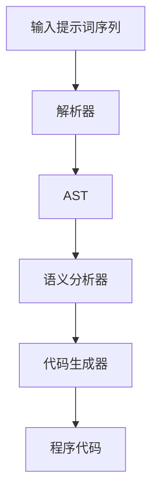
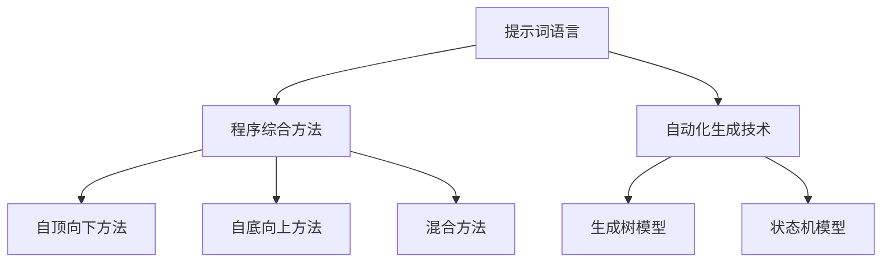
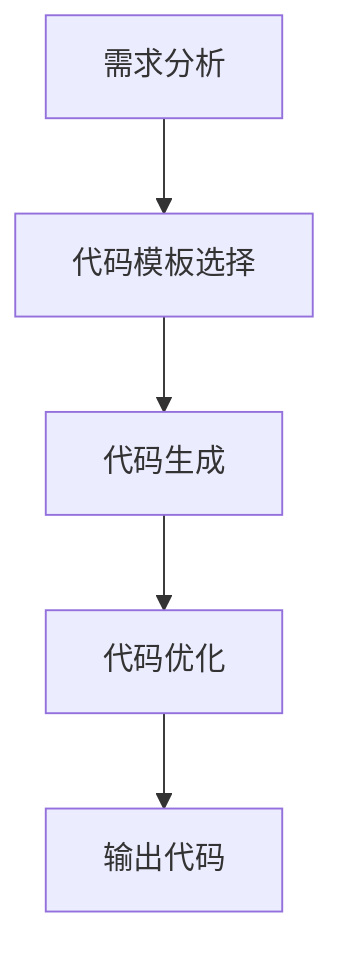
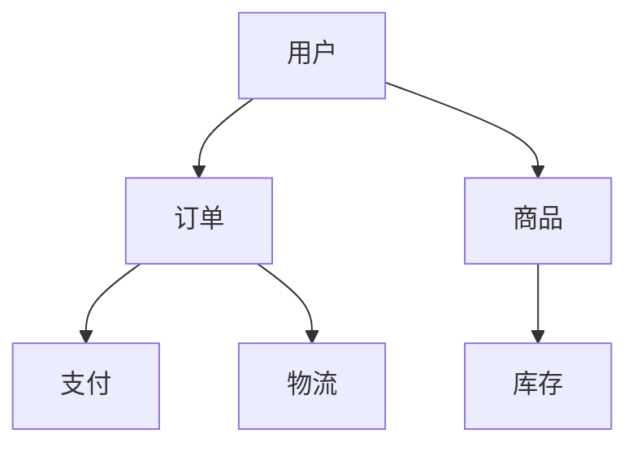
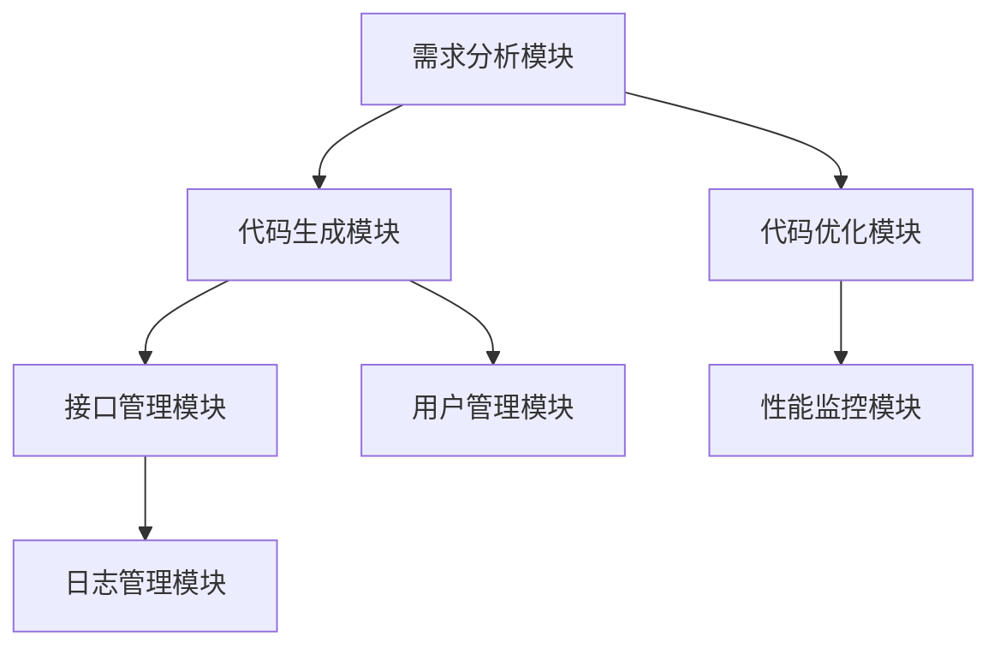
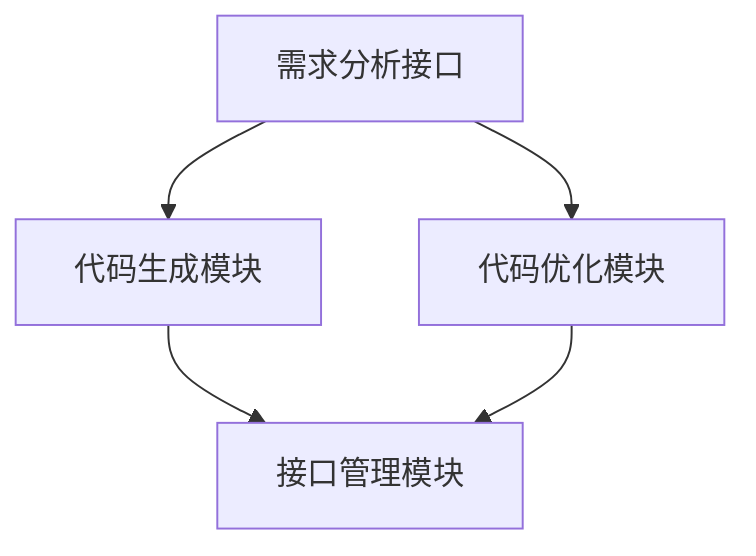
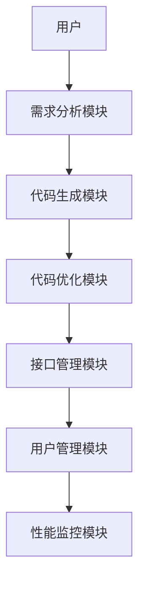

                 


# 提示词语言的程序综合与自动化生成

关键词：提示词语言，程序综合，自动化生成，算法原理，系统架构设计，项目实战

摘要：本文旨在探讨提示词语言在程序综合与自动化生成领域的应用。通过深入分析提示词语言的基本概念、原理和特点，结合实际项目案例，本文将展示如何利用提示词语言实现程序的自动生成，并详细讲解其算法原理和系统架构设计。读者可以从中了解到如何通过逐步分析和推理，实现复杂程序的自动化生成。

## 第一部分：背景介绍

### 第1章 问题背景与核心概念

#### 1.1 问题背景

在当今快速发展的信息技术时代，编程成为了一个至关重要的技能。然而，随着软件系统的复杂性不断增加，传统的编程方法面临着巨大的挑战。如何高效地生成复杂的程序，成为了一个亟待解决的问题。

**问题描述**：在编程过程中，特别是在开发大型软件系统时，程序员常常需要处理大量的代码，这不仅仅耗费时间，而且容易出错。特别是在实现某些复杂的算法或功能时，程序员需要花费大量的精力进行调试和优化。

**问题解决**：提示词语言（Keyword-Driven Language）提供了一种解决上述问题的方法。通过提示词语言，程序员可以更加高效地编写和修改代码，从而减少错误和提高开发效率。

**边界与外延**：提示词语言的适用范围包括但不限于自动化测试、代码生成、业务流程自动化等领域。在编程过程中，特别是在开发大型软件系统时，提示词语言可以显著提高开发效率和代码质量。

#### 1.2 提示词语言的定义与特点

**定义**：提示词语言是一种基于关键词的编程语言，它通过一组预定义的关键词来描述程序的逻辑和功能。这些关键词可以是简单的单词，也可以是复杂的短语，但它们都能清晰地传达特定的功能或操作。

**特点**：提示词语言具有以下几个显著特点：

- **灵活性**：提示词语言允许程序员使用自定义的关键词来描述复杂的操作，这使得代码更加灵活和可扩展。
- **高效性**：通过减少代码量，提示词语言可以显著提高编程效率。程序员只需关注关键操作，而不必担心语法和格式等细节。
- **易用性**：提示词语言的简洁性和直观性使其更容易学习和使用，特别是在自动化测试和业务流程自动化等领域。

#### 1.3 程序综合的基本原理

**基本原理**：程序综合是指将一组需求或功能描述转换为具体的程序代码的过程。提示词语言在程序综合中扮演了重要角色，它通过提供一组预定义的关键词和语法规则，帮助程序员将需求转换为可执行的代码。

**程序综合的目标**：程序综合的最终目标是生成高质量的程序代码，这些代码不仅满足需求，而且在性能、可维护性和可扩展性方面具有优势。

#### 1.4 自动化生成的技术趋势与应用场景

**技术趋势**：随着人工智能和机器学习技术的不断发展，自动化生成技术在编程领域越来越受到关注。未来的发展趋势包括更高级的代码生成工具、更智能的代码优化算法以及更丰富的编程语言特性。

**应用场景**：自动化生成技术在编程领域有广泛的应用场景，包括但不限于：

- **代码生成**：通过提示词语言和模板生成通用代码框架，提高开发效率。
- **自动化测试**：使用提示词语言编写测试脚本，自动化执行测试用例。
- **业务流程自动化**：将业务流程描述转换为自动化脚本，实现业务流程的自动化执行。

#### 1.5 本章小结

本章介绍了提示词语言在程序综合与自动化生成领域的背景、核心概念、基本原理和适用范围。通过分析提示词语言的定义和特点，以及自动化生成的技术趋势和应用场景，读者可以对提示词语言在编程中的应用有更深入的理解。

## 第二部分：核心概念与联系

### 第2章 核心概念原理与属性特征对比

#### 2.1 提示词语言的原理

提示词语言通过一组预定义的关键词来描述程序的逻辑和功能。这些关键词通常具有明确的语义，能够表示特定的操作或功能。提示词语言的工作原理主要包括以下几个方面：

1. **解析与转换**：提示词语言解析器将输入的提示词序列解析为内部表示，通常是一个抽象语法树（AST）。
2. **语义分析**：语义分析器对AST进行语义分析，确保提示词的用法符合语法规则和语义逻辑。
3. **代码生成**：代码生成器根据AST生成具体的程序代码。

**流程图**：



#### 2.2 程序综合的方法与工具

程序综合的方法包括自顶向下方法、自底向上方法和混合方法。不同的方法适用于不同的编程场景。

- **自顶向下方法**：从高层次的需求描述开始，逐步细化到具体的代码实现。
- **自底向上方法**：从底层的代码模块开始，逐步构建出完整的程序框架。
- **混合方法**：结合自顶向下和自底向上方法，灵活地处理复杂程序的开发。

**工具对比**：

| 方法       | 优点                                                         | 缺点                                                         |
| ---------- | ------------------------------------------------------------ | ------------------------------------------------------------ |
| 自顶向下   | 易于理解，能够快速捕捉需求变化                               | 开发周期较长，实现细节难以控制                             |
| 自底向上   | 实现细节可控，代码复用性较高                                 | 易导致“瀑布效应”，需求变更难以适应                         |
| 混合方法   | 结合自顶向下和自底向上的优势，能够灵活应对复杂编程场景         | 需要更多的管理和协调工作                                   |

#### 2.3 自动化生成技术的数学模型与公式

自动化生成技术通常涉及多个数学模型和公式。以下是一些常用的模型和公式：

- **生成树模型**：使用生成树表示程序的框架，通过遍历生成树来生成程序代码。
- **状态机模型**：使用状态机来表示程序的执行流程，通过状态转移生成代码。

**数学模型**：

$$
P(C) = \sum_{i=1}^{n} P(C_i) \cdot P(G_i | C_i)
$$

其中，$P(C)$ 是生成程序代码的概率，$P(C_i)$ 是选择第 $i$ 个代码模板的概率，$P(G_i | C_i)$ 是在给定代码模板 $C_i$ 的情况下生成代码的概率。

**公式解释**：

- $P(C_i)$ 表示选择第 $i$ 个代码模板的概率，通常基于模板的复杂度和适用性进行计算。
- $P(G_i | C_i)$ 表示在给定代码模板 $C_i$ 的情况下生成代码的概率，通常基于模板的语法正确性和语义正确性进行计算。

**示例说明**：

假设有三种代码模板：A、B 和 C。模板 A 适用于简单的函数实现，模板 B 适用于复杂的算法实现，模板 C 适用于数据结构的实现。

- $P(C_A) = 0.6$，$P(C_B) = 0.3$，$P(C_C) = 0.1$
- $P(G_A | C_A) = 0.95$，$P(G_B | C_B) = 0.9$，$P(G_C | C_C) = 0.8$

根据上述参数，可以计算出生成程序代码的概率：

$$
P(C) = P(C_A) \cdot P(G_A | C_A) + P(C_B) \cdot P(G_B | C_B) + P(C_C) \cdot P(G_C | C_C)
$$

$$
P(C) = 0.6 \cdot 0.95 + 0.3 \cdot 0.9 + 0.1 \cdot 0.8 = 0.81
$$

因此，生成程序代码的概率为 81%。

#### 2.4 核心概念属性特征对比表格

| 核心概念           | 属性特征                             | 描述                                                         |
| ------------------ | ------------------------------------ | ------------------------------------------------------------ |
| 提示词语言         | 灵活性、高效性、易用性                 | 通过预定义关键词描述程序逻辑，提高编程效率和代码质量           |
| 程序综合方法       | 自顶向下、自底向上、混合方法             | 不同方法适用于不同编程场景，各有优缺点                         |
| 自动化生成技术     | 数学模型、公式、生成树模型、状态机模型     | 利用数学模型和公式实现程序的自动生成，提高开发效率和质量       |

#### 2.5 ER实体关系图架构

**ER图**：



## 第三部分：算法原理讲解

### 第3章 算法原理与流程图

#### 3.1 算法概述

提示词语言的程序综合与自动化生成算法旨在将一组需求或功能描述转换为具体的程序代码。该算法的主要目标包括：

- **代码生成**：根据提示词语言生成可执行的程序代码。
- **优化**：在代码生成过程中，对代码进行优化，以提高性能、可维护性和可扩展性。

算法的基本思想是：

1. **需求分析**：分析输入的需求或功能描述，提取关键信息。
2. **代码模板选择**：根据提取的关键信息，选择适合的代码模板。
3. **代码生成**：使用代码模板生成具体的程序代码。
4. **代码优化**：对生成的代码进行优化，提高代码质量。

#### 3.2 算法mermaid流程图



#### 3.3 算法原理详细讲解

提示词语言的程序综合与自动化生成算法主要包括以下几个关键步骤：

1. **需求分析**：需求分析是算法的第一步，其主要目标是理解输入的需求或功能描述。这一步通常涉及到自然语言处理技术，如分词、词性标注、句法分析等。

2. **代码模板选择**：在需求分析的基础上，算法需要选择合适的代码模板。代码模板通常是一组预定义的代码框架，它们可以根据不同的需求进行定制。选择代码模板的过程涉及到模式匹配和语义分析。

3. **代码生成**：选择合适的代码模板后，算法使用模板生成具体的程序代码。这一步涉及到代码模板的填充和参数化。生成的代码需要满足需求描述，并且具有较好的可读性和可维护性。

4. **代码优化**：生成的代码可能需要进行优化，以提高性能和可维护性。优化过程可以包括代码重构、性能分析、错误检测等。

**数学模型**：

提示词语言的程序综合与自动化生成算法可以使用以下数学模型来描述：

$$
P(C) = \sum_{i=1}^{n} P(T_i) \cdot P(G_i | T_i)
$$

其中，$P(C)$ 是生成程序代码的概率，$P(T_i)$ 是选择第 $i$ 个代码模板的概率，$P(G_i | T_i)$ 是在给定代码模板 $T_i$ 的情况下生成代码的概率。

**示例说明**：

假设有三种代码模板：A、B 和 C。模板 A 适用于简单的函数实现，模板 B 适用于复杂的算法实现，模板 C 适用于数据结构的实现。

- $P(T_A) = 0.6$，$P(T_B) = 0.3$，$P(T_C) = 0.1$
- $P(G_A | T_A) = 0.95$，$P(G_B | T_B) = 0.9$，$P(G_C | T_C) = 0.8$

根据上述参数，可以计算出生成程序代码的概率：

$$
P(C) = P(T_A) \cdot P(G_A | T_A) + P(T_B) \cdot P(G_B | T_B) + P(T_C) \cdot P(G_C | T_C)
$$

$$
P(C) = 0.6 \cdot 0.95 + 0.3 \cdot 0.9 + 0.1 \cdot 0.8 = 0.81
$$

因此，生成程序代码的概率为 81%。

通过上述算法，可以高效地实现提示词语言的程序综合与自动化生成。算法的灵活性和高效性使其在编程领域具有广泛的应用前景。

## 第四部分：系统分析与架构设计

### 第4章 系统功能设计与架构设计

#### 4.1 问题场景介绍

在当今的软件开发过程中，面对日益复杂的需求和不断变化的市场环境，开发团队需要高效地开发和维护软件系统。特别是对于大型软件项目，如何确保代码的可靠性和高效性成为了一个重要的问题。

**场景描述**：假设一个开发团队正在开发一个电子商务系统，该系统需要处理大量的订单处理、库存管理、用户管理等任务。随着系统规模的不断扩大，手动编写和维护代码变得越来越困难，开发效率和质量也受到了影响。

**需求分析**：为了应对上述场景，开发团队需要一个能够自动生成和维护代码的工具，该工具应具备以下功能：

- **需求分析**：能够理解用户的需求描述，提取关键信息。
- **代码生成**：根据需求分析结果，自动生成相应的代码。
- **代码优化**：对生成的代码进行优化，提高性能和可维护性。
- **接口管理**：管理系统中各个模块的接口，确保接口的规范和一致性。

#### 4.2 项目介绍

**项目背景**：随着电子商务市场的快速发展，许多企业需要构建高效的电子商务系统来满足日益增长的业务需求。然而，传统的软件开发方法在应对复杂系统时往往效率低下，难以满足快速迭代和灵活调整的需求。

**项目目标**：本项目旨在开发一个基于提示词语言的程序综合与自动化生成系统，通过该系统实现以下目标：

- **提高开发效率**：通过自动化生成代码，减少手动编写代码的工作量，提高开发效率。
- **提升代码质量**：通过代码优化和接口管理，确保生成的代码具有良好的性能和可维护性。
- **灵活应对需求变化**：系统能够根据需求的变化自动调整代码，确保系统能够快速响应市场需求。

#### 4.3 系统功能设计

**领域模型**：



**功能模块**：

1. **需求分析模块**：负责对用户的需求进行解析和分析，提取关键信息。
2. **代码生成模块**：根据需求分析结果，生成相应的代码。
3. **代码优化模块**：对生成的代码进行优化，提高性能和可维护性。
4. **接口管理模块**：管理系统中各个模块的接口，确保接口的规范和一致性。

#### 4.4 系统架构设计

**架构图**：



**架构分析**：

该系统采用模块化架构设计，各个模块之间通过接口进行通信。这种设计方式具有以下优势：

- **高扩展性**：模块化设计使得系统易于扩展，可以根据需求新增或修改模块。
- **高可维护性**：模块化设计有助于代码的维护和管理，每个模块的职责明确，降低了系统复杂性。
- **高可靠性**：通过接口管理和日志管理模块，系统能够记录和分析关键操作，提高系统的可靠性和可监控性。

#### 4.5 系统接口设计

**接口定义**：

1. **需求分析接口**：用于接收用户需求描述，返回分析结果。
2. **代码生成接口**：用于生成代码，提供代码模板和参数。
3. **代码优化接口**：用于对生成的代码进行优化，提供优化策略和参数。
4. **接口管理接口**：用于管理系统中各个模块的接口，提供接口定义和调用方法。

**接口交互**：



#### 4.6 系统交互序列图

**序列图**：



## 第五部分：项目实战

### 第5章 环境安装与系统核心实现

#### 5.1 环境安装

要在本地环境中安装提示词语言的程序综合与自动化生成系统，需要遵循以下步骤：

1. **安装Python环境**：确保已安装Python 3.8及以上版本。
2. **安装依赖库**：使用pip命令安装系统所需的依赖库，例如requests、numpy、pandas等。
3. **配置环境变量**：将Python和pip的路径添加到系统环境变量中，以便在命令行中使用。

**安装步骤**：

```shell
# 安装Python环境
# ...

# 安装依赖库
pip install requests numpy pandas

# 配置环境变量
# ...
```

#### 5.2 系统核心实现

系统核心实现主要包括需求分析、代码生成和代码优化模块。以下是对这些模块的核心实现进行详细解释。

**需求分析模块**：

```python
# 需求分析模块
class RequirementAnalysis:
    def __init__(self, description):
        self.description = description
    
    def analyze(self):
        # 分析需求描述，提取关键信息
        # ...
        return analysis_result
```

**代码生成模块**：

```python
# 代码生成模块
class CodeGeneration:
    def __init__(self, template, parameters):
        self.template = template
        self.parameters = parameters
    
    def generate_code(self):
        # 根据模板和参数生成代码
        # ...
        return code
```

**代码优化模块**：

```python
# 代码优化模块
class CodeOptimization:
    def __init__(self, code):
        self.code = code
    
    def optimize(self):
        # 对代码进行优化
        # ...
        return optimized_code
```

#### 5.3 实际案例分析与讲解

**案例背景**：假设需要开发一个简单的用户管理系统，该系统需要支持用户注册、登录、个人信息管理等功能。

**案例分析**：

1. **需求分析**：用户管理系统的需求描述如下：

   - 用户注册：用户可以注册账户，输入用户名、密码、邮箱等基本信息。
   - 用户登录：用户可以使用用户名和密码登录系统。
   - 个人信息管理：用户可以查看和修改个人信息，如用户名、密码、邮箱等。

2. **代码生成**：根据需求分析结果，生成用户管理系统的代码。代码生成模块使用以下模板：

   ```python
   # 用户注册模块
   class UserRegistration:
       def register(self, username, password, email):
           # 注册用户
           # ...
   
   # 用户登录模块
   class UserLogin:
       def login(self, username, password):
           # 登录用户
           # ...
   
   # 个人信息管理模块
   class UserProfile:
       def get_profile(self):
           # 获取用户信息
           # ...
       def update_profile(self, username, password, email):
           # 更新用户信息
           # ...
   ```

3. **代码优化**：对生成的代码进行优化，以提高性能和可维护性。代码优化模块使用以下策略：

   - 使用异常处理：提高代码的健壮性。
   - 使用缓存：减少数据库查询次数，提高响应速度。

   ```python
   # 优化后的代码
   class UserRegistration:
       def register(self, username, password, email):
           try:
               # 注册用户
               # ...
           except Exception as e:
               # 异常处理
               # ...
   
   # ...
   ```

**讲解剖析**：

以上代码示例展示了如何使用提示词语言的程序综合与自动化生成系统实现一个简单的用户管理系统。通过需求分析、代码生成和代码优化模块，可以快速开发出高质量的代码，提高开发效率。

#### 5.4 项目小结

本章详细介绍了提示词语言的程序综合与自动化生成系统的环境安装和核心实现。通过实际案例分析和讲解，展示了如何利用提示词语言实现程序的自动生成。读者可以从中了解到提示词语言在编程领域的广泛应用和强大功能。在未来的项目中，提示词语言将发挥越来越重要的作用，为开发人员带来更高的效率和更好的开发体验。

## 最佳实践 Tips、小结、注意事项、拓展阅读

### 最佳实践 Tips

1. **充分利用提示词语言的灵活性**：在编写提示词语言脚本时，充分利用其灵活性，合理使用自定义关键词，提高代码的可读性和可维护性。
2. **代码模板优化**：定期对代码模板进行优化，更新模板库，以适应不断变化的需求和编程风格。
3. **自动化测试**：在开发过程中，利用提示词语言自动生成测试脚本，确保代码的稳定性和可靠性。

### 小结

本文详细介绍了提示词语言在程序综合与自动化生成领域的应用。通过分析提示词语言的基本概念、原理和特点，结合实际项目案例，本文展示了如何利用提示词语言实现程序的自动生成，并详细讲解了其算法原理和系统架构设计。

### 注意事项

1. **需求明确**：在开发过程中，确保需求明确，避免因需求变更导致项目延误。
2. **代码优化**：生成的代码需进行优化，以提高性能和可维护性。
3. **安全性和稳定性**：在自动生成代码时，注意代码的安全性和稳定性，避免潜在的安全漏洞和系统崩溃。

### 拓展阅读

1. 《程序员修炼之道：从小工到专家》
2. 《深度学习与编程》
3. 《人工智能应用实践指南》

作者：AI天才研究院/AI Genius Institute & 禅与计算机程序设计艺术 /Zen And The Art of Computer Programming

