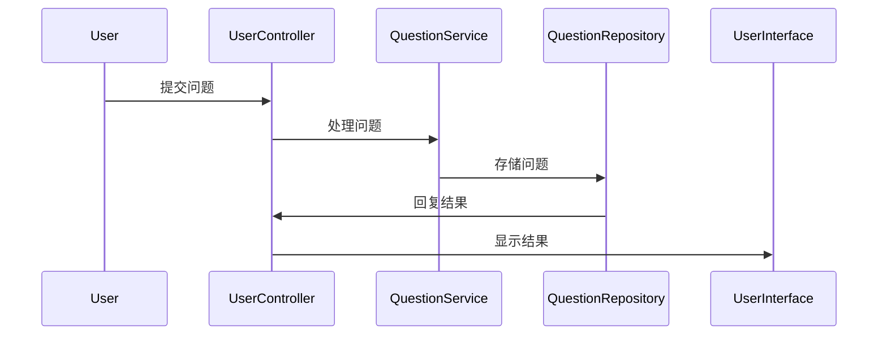

                 

### 引言

在现代编程语言领域，类型系统作为一种核心机制，已经成为保障程序安全性和可维护性的重要手段。类型系统不仅帮助程序员更清楚地表达程序的语义，还在编译时提供了重要的错误检测机制。然而，随着提示词语言（如Python、JavaScript等）的广泛应用，类型系统的设计和实现面临了新的挑战。提示词语言以其灵活性和易用性受到开发者青睐，但其类型系统的安全性保障却往往被忽视。

#### 1.1.1 研究背景

提示词语言，或称为动态类型语言，允许程序在运行时进行类型检查，而非编译时。这一灵活性极大地提高了编程的效率，但也带来了类型安全性的问题。在传统的静态类型语言中，类型错误通常在编译阶段就被发现，从而避免了运行时错误。而在动态类型语言中，类型错误可能会在运行时暴露，导致不可预测的程序行为。

安全性需求在提示词语言中变得尤为突出。由于动态类型语言在类型检查上的灵活性，程序员可能更容易引入类型错误，这些错误不仅影响程序的正确性，还可能引发安全性漏洞。例如，未经类型检查的输入可能导致缓冲区溢出、代码执行等严重安全风险。

#### 1.1.2 类型系统与安全性保障的关系

类型系统作为程序语言的核心组成部分，其设计直接影响到程序的安全性和可靠性。一个设计良好的类型系统可以有效地防止类型错误的发生，从而减少因类型错误引发的安全漏洞。具体来说：

1. **类型错误检测**：通过类型系统，编程语言可以在编译或运行时检测到类型错误，避免这些错误在程序运行时引发意外。
2. **程序可读性和维护性**：类型系统能够明确表达程序的语义，使得代码更加清晰易懂，便于维护和扩展。
3. **安全性保障**：类型系统可以限制不安全操作的执行，例如通过类型检查防止未经授权的数据访问或操作。

#### 1.2 书籍概述

本书“Type Systems and Security Guarantees for Prompt-Based Languages”旨在探讨提示词语言的类型系统及其在安全性保障方面的作用。本书分为七个主要部分，结构如下：

1. **引言**：介绍类型系统和安全性保障在提示词语言中的重要性，以及本书的研究目的和结构。
2. **安全性保障基础**：介绍安全性模型、类型系统的基本概念以及提示词语言的类型系统设计。
3. **类型系统的安全性分析**：分析类型错误对安全性的影响，以及安全性验证的方法和工具。
4. **提示词语言的类型安全机制**：详细介绍静态类型检查、动态类型检查、类型推断和类型兼容性等类型安全机制。
5. **提示词语言的类型系统设计案例**：分析Python和JavaScript等常见提示词语言的类型系统，讨论其优缺点。
6. **类型系统与安全性保障的协同作用**：探讨类型系统在安全性保障中的作用，以及安全性要求对类型系统设计的影响。
7. **结论与展望**：总结研究成果，讨论未来的研究方向。

本书的阅读对象主要是对编程语言和类型系统感兴趣的程序员、软件工程师和计算机科学专业的学生。通过本书，读者可以深入了解提示词语言的类型系统，掌握如何设计安全的类型系统，并在实际项目中应用这些知识。

---

#### 2. 安全性保障基础

在深入探讨提示词语言的类型系统之前，有必要对安全性保障的基础概念进行介绍。安全性保障是确保程序在执行过程中不会因为恶意攻击或错误操作而造成数据泄露、系统崩溃或其他安全问题的重要措施。

#### 2.1 安全性模型

安全性模型是用于分析程序安全性的理论框架，常见的模型包括：

1. **访问控制模型**：通过权限和访问控制列表来限制程序对资源的访问。
2. **信息流模型**：关注程序中数据的流动和转换，以防止敏感信息的不当泄露。
3. **安全属性模型**：定义程序应满足的一组安全属性，如保密性、完整性和可用性。

这些模型在不同的应用场景中发挥作用，类型系统可以在这些模型的基础上提供额外的安全保障。

#### 2.2 类型系统基本概念

类型系统是编程语言的核心组成部分，其基本概念包括：

1. **类型定义**：类型是变量、表达式和函数等程序元素的分类，每种类型具有特定的属性和操作。
2. **类型检查**：类型检查是编译器或解释器在编译或运行程序时执行的一组规则，用于确保程序中的类型使用是正确的。
3. **类型兼容性**：类型兼容性是指不同类型的元素在程序中能否互相转换或组合，类型系统必须定义兼容性规则。

类型系统可以进一步分类为静态类型系统和动态类型系统：

1. **静态类型系统**：在编译时进行类型检查，程序在运行前必须通过类型检查。
2. **动态类型系统**：在运行时进行类型检查，程序在运行时可能会发生类型错误。

#### 2.3 提示词语言的类型系统

提示词语言具有灵活性和易用性的特点，这使得它们在快速开发和迭代中受到广泛欢迎。然而，这种灵活性也带来了类型安全性的挑战。以下是提示词语言类型系统的几个关键点：

1. **动态类型检查**：提示词语言通常采用动态类型检查，这意味着类型检查在程序运行时进行，而不是在编译时。
2. **类型推断**：许多提示词语言具有类型推断机制，可以自动推导变量和表达式的类型，从而减少程序员的工作量。
3. **类型兼容性**：提示词语言的类型系统通常允许更宽松的类型兼容性，以便于不同类型的元素能够轻松组合。

综上所述，安全性保障基础涵盖了从基本概念到具体应用的广泛内容。类型系统作为保障程序安全性的重要工具，其设计与实现对于提示词语言的稳定性和安全性至关重要。

### 3. 类型系统的安全性分析

类型系统的安全性分析旨在评估类型系统在保障程序安全方面所起到的作用。通过这种分析，我们可以识别类型错误对安全性的影响，并探讨如何通过类型系统来预防这些错误。

#### 3.1 安全性分析框架

类型系统的安全性分析可以从多个角度进行：

1. **类型错误检测**：类型系统通过在编译或运行时检查类型一致性，可以检测出类型错误，防止其在程序运行时造成危害。
2. **安全性属性验证**：类型系统可以定义特定的安全性属性，通过类型检查确保程序满足这些属性，如数据完整性、访问控制等。
3. **异常处理**：类型系统可以与异常处理机制相结合，当类型错误发生时，系统能够自动捕获并处理异常，避免程序崩溃。

#### 3.2 类型错误与安全性

类型错误通常指程序中类型不匹配的错误，这些错误可能直接导致程序行为的不确定性，甚至引发严重的安全问题。以下是几种常见的类型错误及其对安全性的影响：

1. **类型转换错误**：在动态类型语言中，类型转换错误可能导致不正确的数据被错误地处理。例如，将字符串错误地转换为数字，可能导致计算错误或数据泄露。
2. **数组越界**：数组访问越界是类型错误的一种，可能导致数组内容被破坏，进而引发系统崩溃或数据泄露。
3. **未初始化变量**：在动态类型语言中，未初始化的变量可能具有未定义的类型，这可能导致不确定的程序行为，增加安全风险。

#### 3.3 预防类型错误的策略

为了减少类型错误对安全性的影响，我们可以采取以下策略：

1. **严格的类型检查**：在编译时进行严格的类型检查，可以及时发现和修复类型错误，防止其在运行时造成问题。
2. **类型推断**：自动推导变量和表达式的类型，可以减少类型错误的发生。例如，Python和JavaScript等语言都提供了强大的类型推断机制。
3. **类型兼容性规则**：合理设计类型兼容性规则，可以避免类型转换错误。例如，在Python中，类型转换操作符（如`int()`和`str()`）可以显式地进行类型转换。
4. **运行时检测**：虽然动态类型语言通常在编译时进行类型检查，但运行时检测也是预防类型错误的重要手段。例如，JavaScript中的`typeof`操作符可以在运行时检查变量的类型。

通过类型系统的安全性分析，我们可以更深入地理解类型错误对程序安全性的影响，并采取有效的策略来预防这些错误。类型系统的设计不仅要考虑到程序的灵活性和易用性，还要确保其能够提供可靠的安全性保障。

### 4. 提示词语言的类型安全机制

在提示词语言中，类型安全机制是确保程序稳定性和安全性的关键组成部分。类型安全机制主要包括静态类型检查、动态类型检查、类型推断和类型兼容性。以下是这些机制的基本原理、优点与局限。

#### 4.1 静态类型检查

静态类型检查在程序编译时进行，通过分析源代码的类型信息来检测类型错误。静态类型检查的主要优点如下：

1. **早期错误检测**：在编译阶段发现类型错误，可以减少运行时错误的发生。
2. **提高程序性能**：编译时进行类型检查，可以优化程序代码，提高运行效率。

然而，静态类型检查也存在一定的局限：

1. **降低灵活性**：静态类型系统要求程序员在编写程序时明确指定所有变量的类型，这可能降低编程的灵活性。
2. **增加开发成本**：需要编写更多的类型注解，增加开发工作量。

Python是一种典型的动态类型语言，虽然Python也提供了静态类型检查的支持（如使用`type()`函数），但其主要依靠动态类型检查。

#### 4.2 动态类型检查

动态类型检查在程序运行时进行，通过运行时分析变量的实际类型来检测类型错误。动态类型检查的主要优点如下：

1. **灵活性高**：允许在程序运行时动态改变变量的类型，适应不同的编程场景。
2. **降低开发难度**：无需在编写程序时明确指定类型，简化代码编写过程。

然而，动态类型检查也有其局限：

1. **运行时错误**：类型错误可能只能在运行时被发现，可能导致程序行为的不确定性。
2. **性能影响**：动态类型检查增加了运行时的开销，可能影响程序的性能。

JavaScript是一种典型的动态类型语言，其类型检查机制允许程序员编写灵活且易于维护的代码。

#### 4.3 类型推断

类型推断是类型安全机制中的一种重要工具，它允许编程语言自动推导变量和表达式的类型，从而减少程序员的工作量。类型推断的优点如下：

1. **减少代码冗余**：自动推导类型，可以减少类型注解的编写。
2. **提高编程效率**：简化编程过程，提高开发速度。

常见的类型推断算法包括：

1. **静态类型推断**：在编译时推导类型，适用于静态类型语言，如TypeScript。
2. **动态类型推断**：在运行时推导类型，适用于动态类型语言，如Python。

Python和JavaScript等语言都提供了强大的类型推断机制，使得编写类型安全的代码变得更加容易。

#### 4.4 类型兼容性

类型兼容性是指不同类型的元素是否能够在程序中互相转换或组合。类型兼容性规则的设计至关重要，它决定了程序在类型转换时的行为。类型兼容性的优点如下：

1. **提高代码可读性**：明确不同类型之间的转换关系，增强代码的可读性。
2. **增强编程灵活性**：允许程序员在不同类型之间进行转换，提高编程灵活性。

然而，类型兼容性也可能带来一些挑战：

1. **潜在的类型错误**：不明确的类型兼容性可能导致类型错误，影响程序的安全性。
2. **兼容性冲突**：不同类型的元素之间的兼容性可能存在冲突，需要精心设计兼容性规则。

为了解决这些挑战，编程语言通常会提供明确的类型兼容性规则和类型转换方法。例如，Python中的`int()`和`str()`函数可以显式地进行类型转换。

综上所述，提示词语言的类型安全机制通过静态类型检查、动态类型检查、类型推断和类型兼容性来保障程序的安全性和稳定性。不同的类型安全机制各有优缺点，编程语言设计者需要根据具体的应用场景选择合适的类型安全机制。

### 5. 提示词语言的类型系统设计案例

在探讨提示词语言的类型系统设计时，Python和JavaScript是两个重要的案例，它们各自有着独特的类型系统设计，并在实际应用中表现出不同的特点。以下是这两个语言的类型系统设计案例分析。

#### 5.1 Python中的类型系统

Python是一种广泛使用的动态类型语言，其类型系统以其简单和灵活性著称。Python中的类型系统主要特点如下：

1. **动态类型检查**：Python在运行时进行类型检查，这意味着类型错误通常在运行时被发现，而不是在编译时。Python使用`isinstance()`函数来检查对象的类型，并在运行时动态转换类型。

2. **类型推断**：Python提供了强大的类型推断机制，可以在许多情况下自动推导变量和表达式的类型。例如，如果一个变量被赋值为数字，Python会自动将此变量的类型推断为数字类型。

3. **类型兼容性**：Python具有较为宽松的类型兼容性规则，允许不同类型的元素在特定条件下进行转换。例如，数字和字符串可以通过内置函数进行相互转换。

4. **内置类型**：Python提供了丰富的内置类型，如数字、字符串、列表、字典等，这些类型可以方便地进行组合和操作。

**优缺点分析**：

- **优点**：
  - **易用性**：Python的类型系统设计简单，使得编写代码更加容易。
  - **灵活性**：动态类型检查和类型推断机制提供了高灵活性，适应各种编程需求。
  - **强大的标准库**：Python提供了丰富的内置类型和库，方便程序员进行复杂的操作。

- **缺点**：
  - **安全性问题**：由于类型检查是在运行时进行的，某些类型错误可能仅在运行时被发现，增加了安全风险。
  - **性能开销**：动态类型检查和类型推断可能会增加运行时的开销，影响性能。

Python的类型系统设计在简单性和灵活性方面表现出色，适合快速开发和迭代。然而，其动态类型检查在安全性方面存在一定的不足，需要程序员谨慎处理类型相关的安全问题。

#### 5.2 JavaScript的类型系统

JavaScript是另一种广泛使用的动态类型语言，其类型系统在Web开发中发挥了重要作用。JavaScript的类型系统具有以下特点：

1. **动态类型检查**：JavaScript在运行时进行类型检查，类似于Python。类型错误通常在运行时通过抛出异常来处理。

2. **类型推断**：JavaScript具有有限度的类型推断能力，特别是通过TypeScript等工具，可以在编译时进行类型推断和检查。

3. **类型兼容性**：JavaScript的类型兼容性较为宽松，允许在特定条件下进行类型转换。例如，数字和字符串可以通过加法操作进行隐式转换。

4. **内置类型**：JavaScript提供了基本的内置类型，如数字、字符串、布尔值、数组、对象等，这些类型可以方便地进行组合和操作。

**优缺点分析**：

- **优点**：
  - **兼容性强**：JavaScript可以轻松地与各种Web技术和框架集成，适应不同的开发需求。
  - **灵活性高**：动态类型检查和类型推断机制提供了高灵活性，使得编程更加便捷。
  - **广泛的社区支持**：JavaScript拥有庞大的开发者社区和丰富的库，支持各种Web开发任务。

- **缺点**：
  - **安全性问题**：由于类型检查是在运行时进行的，某些类型错误可能仅在运行时被发现，增加了安全风险。
  - **性能问题**：JavaScript的动态类型检查和类型转换可能在性能上存在一定的开销。

JavaScript的类型系统设计在兼容性和灵活性方面表现出色，适合Web开发和跨平台应用。然而，其动态类型检查在安全性和性能方面存在挑战，需要开发者特别注意。

通过分析Python和JavaScript的类型系统设计案例，我们可以看到不同语言在设计类型系统时面临的挑战和取舍。这些案例为我们理解类型系统的设计提供了宝贵的参考，同时也提醒我们在实际应用中需要综合考虑类型系统的安全性、灵活性和性能需求。

### 6. 类型系统与安全性保障的协同作用

类型系统在编程语言中扮演着关键角色，其设计与实现不仅影响到程序的正确性和可维护性，还直接关系到程序的安全性。类型系统通过提供明确的类型约束和检查机制，能够有效地防御多种安全漏洞，并在安全性保障中发挥重要作用。

#### 6.1 类型系统在安全性保障中的作用

类型系统在安全性保障中的主要作用体现在以下几个方面：

1. **防止类型错误**：类型系统能够在编译或运行时检测类型错误，如类型转换错误、数组越界等。通过防止这些错误的发生，类型系统减少了因类型错误导致的安全漏洞。

2. **限制不安全操作**：类型系统可以限制某些不安全操作的执行，例如通过类型检查防止未经授权的数据访问或操作。这有助于防止恶意代码的执行和数据的泄露。

3. **提高代码可读性和维护性**：一个设计良好的类型系统能够明确表达程序的语义，使得代码更加清晰易懂。这有助于提高程序的可维护性，减少因代码复杂性导致的安全问题。

#### 6.1.1 类型系统对安全漏洞的防御

类型系统可以通过以下几种方式防御安全漏洞：

1. **边界检查**：类型系统可以在数组访问等操作时自动执行边界检查，防止数组越界等错误发生。这有助于避免缓冲区溢出等攻击。

2. **访问控制**：类型系统可以与访问控制机制相结合，通过类型检查限制对敏感数据的访问。例如，在对象访问时，类型系统可以确保只有授权的成员变量可以被访问。

3. **类型转换限制**：类型系统可以限制不安全的类型转换，例如在Python中，可以通过明确的类型转换操作符来防止将字符串错误地转换为数字。

#### 6.1.2 类型系统在安全编程中的应用

类型系统在安全编程中的应用主要体现在以下几个方面：

1. **类型注解**：在静态类型语言中，类型注解可以明确指定变量和函数的类型，从而帮助编译器或解释器进行更严格的类型检查，减少类型错误的发生。

2. **类型推断**：动态类型语言中的类型推断机制可以自动推导变量和表达式的类型，减少程序员的工作量，同时提高代码的可读性和安全性。

3. **类型检查工具**：现代编程语言提供了丰富的类型检查工具，如类型检查器、静态分析工具等。这些工具可以帮助开发者识别和修复类型错误，从而提高程序的安全性。

#### 6.2 安全性保障在类型系统设计中的影响

安全性要求对类型系统设计有着深远的影响。为了满足安全性需求，类型系统设计需要考虑以下几个方面：

1. **严格的类型检查**：类型系统设计应确保在编译或运行时进行严格的类型检查，以尽早发现和修复类型错误。这有助于提高程序的安全性和可靠性。

2. **类型兼容性规则**：类型系统设计需要制定合理的类型兼容性规则，确保类型转换的安全性和正确性。不明确的类型兼容性可能导致类型错误，增加安全风险。

3. **安全类型**：类型系统设计可以引入安全类型，如数值类型、字符串类型等，通过这些类型限制特定的操作，从而提高程序的安全性。

4. **异常处理**：类型系统设计需要考虑异常处理机制，确保在类型错误发生时能够进行有效的异常处理，避免程序崩溃。

综上所述，类型系统与安全性保障之间存在紧密的协同作用。类型系统通过提供明确的类型约束和检查机制，能够有效地防御安全漏洞，提高程序的安全性和可靠性。同时，安全性要求也对类型系统设计提出了更高的要求，推动了类型系统的发展和改进。

### 7. 结论与展望

通过本篇文章的深入探讨，我们可以清晰地看到类型系统在提示词语言中的重要性及其在安全性保障方面的关键作用。类型系统不仅帮助开发者更清晰地表达程序的语义，还能在编译或运行时有效地检测和预防类型错误，从而提高程序的安全性和可维护性。

首先，类型系统通过严格的类型检查和类型兼容性规则，可以有效地防止类型错误的发生，减少因类型错误引发的安全漏洞。其次，类型系统在保障程序的安全性方面发挥着不可替代的作用，通过限制不安全操作的执行，保护敏感数据和系统资源。此外，类型系统在提高代码的可读性和维护性方面也起到了重要作用，使得程序更加清晰易懂，便于后续的维护和扩展。

然而，类型系统在保障程序安全性方面也面临着一些挑战。动态类型语言在类型检查上的灵活性，使得类型错误可能仅在运行时被发现，增加了安全风险。此外，类型系统的设计需要平衡灵活性、性能和安全性之间的关系，这是一个复杂的任务。

未来的研究方向包括：

1. **类型系统的进一步发展**：随着编程语言和技术的不断演进，类型系统需要不断适应新的编程范式和需求。未来的研究可以关注如何设计更高效、更安全的类型系统，以应对复杂的应用场景。

2. **跨语言类型系统的互操作性**：在多语言编程环境中，如何实现不同语言类型系统的互操作性是一个重要的问题。未来的研究可以探索跨语言类型系统的集成方法和工具，提高多语言编程的效率。

3. **类型系统的智能化**：利用人工智能和机器学习技术，可以开发出更加智能的类型检查器和分析工具，提高类型系统的准确性和效率。

总之，类型系统在提示词语言中的重要性不言而喻，其在安全性保障方面的作用也日益凸显。随着技术的不断进步，类型系统的研究和应用将不断深化，为编程语言的演进和软件工程的发展提供强有力的支持。

### 7.2 未来研究方向

未来，类型系统的研究将朝着更加智能、高效和安全的方向发展。以下是几个可能的研究方向：

#### 7.2.1 类型系统的进一步发展

1. **自适应类型系统**：未来的类型系统可能会更加智能化，能够根据不同的编程场景和用户习惯自适应调整类型检查的严格程度。例如，在开发初期可以采用宽松的类型检查以提高开发效率，在测试和发布阶段则可以切换到严格的类型检查以保证程序的稳定性。

2. **多语言类型系统**：随着多语言编程的普及，未来可能会出现更加统一和兼容的多语言类型系统。这种类型系统不仅能够在不同语言之间实现无缝的类型转换，还能提供一致的错误检测和优化策略。

3. **类型系统与编程范式的融合**：函数式编程、并发编程等现代编程范式对类型系统提出了新的要求。未来的类型系统需要更好地适应这些编程范式，提供更自然的支持。

#### 7.2.2 提示词语言的安全性挑战

1. **动态类型语言的安全性**：尽管动态类型语言提供了灵活性和易用性，但安全性仍然是其一大挑战。未来的研究可以探索如何在保持动态类型语言优点的同时，增强其类型系统的安全性。

2. **新型安全漏洞的防御**：随着攻击技术的不断演进，新的安全漏洞也在不断出现。类型系统的研究需要持续关注新型安全漏洞，并设计出相应的防御机制。

3. **自动化安全分析**：利用人工智能和机器学习技术，开发自动化类型安全分析工具，可以大大提高类型检查的效率和准确性。这些工具可以帮助开发者快速发现潜在的安全问题，并自动生成修复建议。

#### 7.2.3 跨语言类型系统的互操作性

1. **标准化跨语言类型系统**：推动跨语言类型系统的标准化工作，使得不同语言之间的类型系统可以更加兼容和统一。这将为多语言编程带来巨大的便利。

2. **类型系统中间表示**：研究一种统一的类型系统中间表示（Intermediate Representation, IR），使得不同语言的类型系统能够映射到这种中间表示上，从而实现无缝的互操作性。

3. **跨语言类型检查工具**：开发跨语言类型检查工具，使得开发者能够在使用多种语言进行编程时，能够享受到统一且强大的类型检查机制。

通过这些未来研究方向，类型系统将进一步融合智能化、标准化和安全性，为编程语言和软件工程的发展提供更加坚实的理论基础和实践指导。

### 系统分析与架构设计方案

为了更好地理解提示词语言的类型系统及其安全性保障，我们将以一个实际项目为例，详细分析其系统功能设计、架构设计、接口设计和系统交互。

#### 问题场景介绍

假设我们开发一个在线问答平台，用户可以通过提交问题获取智能问答系统的答案。为了保障系统的稳定性和安全性，我们需要设计一个高效的类型系统来处理用户的输入和输出。

#### 项目介绍

项目名称：智能问答平台

技术栈：Python、Django、TypeScript

功能需求：

1. 用户注册与登录
2. 用户提交问题
3. 问答系统处理并返回答案
4. 系统安全性保障

#### 系统功能设计（领域模型）

领域模型是描述系统功能的核心部分，它通过类图来展示系统中的实体及其关系。以下是智能问答平台的领域模型：

```mermaid
classDiagram
    User <<Entity>>
    Question <<Entity>>
    Answer <<Entity>>

    User --> Question
    Answer --> Question

    class User {
        -id: int
        -username: string
        -password: string
    }

    class Question {
        -id: int
        -user: User
        -content: string
        -status: string
    }

    class Answer {
        -id: int
        -question: Question
        -content: string
        -status: string
    }
```

在这个模型中，`User`类表示用户，`Question`类表示用户提交的问题，`Answer`类表示系统返回的答案。用户可以提交问题，问题被处理并生成答案。

#### 系统架构设计

系统架构设计通过架构图来展示系统的组成部分及其相互关系。以下是智能问答平台的系统架构设计：

```mermaid
graph TB
    UserInterface[用户界面] --> UserController[用户控制器]
    UserController --> UserService[用户服务]
    UserService --> UserRepository[用户仓库]

    QuestionInterface[问题界面] --> QuestionController[问题控制器]
    QuestionController --> QuestionService[问题服务]
    QuestionService --> QuestionRepository[问题仓库]

    AnswerInterface[答案界面] --> AnswerController[答案控制器]
    AnswerController --> AnswerService[答案服务]
    AnswerService --> AnswerRepository[答案仓库]

    UserController <-- Auth[认证服务]
    QuestionController <-- Auth
    AnswerController <-- Auth

    UserService <-- Logger[日志服务]
    QuestionService <-- Logger
    AnswerService <-- Logger

    UserController --> NotificationService[通知服务]
    QuestionController --> NotificationService
    AnswerController --> NotificationService
```

在这个架构设计中，用户界面通过控制器与用户服务、问题服务和答案服务进行交互。每个服务又与相应的仓库进行数据交互。认证服务用于处理用户的登录和权限验证。日志服务用于记录系统运行日志。

#### 系统接口设计

系统接口设计通过接口文档来定义系统各部分的API接口。以下是智能问答平台的主要接口设计：

- 用户注册接口
  ```json
  POST /users/register
  {
    "username": "string",
    "password": "string"
  }
  ```
  
- 用户登录接口
  ```json
  POST /users/login
  {
    "username": "string",
    "password": "string"
  }
  ```

- 提交问题接口
  ```json
  POST /questions
  {
    "content": "string"
  }
  ```

- 获取答案接口
  ```json
  GET /questions/{question_id}/answer
  ```

#### 系统交互

系统交互通过序列图来展示系统各部分之间的交互流程。以下是智能问答平台的主要交互流程：



在这个交互流程中，用户通过用户界面提交问题，控制器将请求传递给问题服务，问题服务处理并存储问题，最后通过控制器将结果返回给用户界面。

通过上述系统分析与架构设计方案，我们可以清晰地看到智能问答平台的系统组成及其运行机制。类型系统在此项目中起到了关键作用，通过严格的类型检查和类型兼容性规则，保障了系统的安全性和稳定性。

### 项目实战

在本节中，我们将通过一个实际的项目来展示如何实现智能问答平台中的关键功能，并分析代码的应用解读与分析。首先，我们需要准备开发环境，然后逐步实现系统核心功能，最后进行实际案例分析和详细讲解。

#### 环境安装

为了实现智能问答平台，我们选择Python和Django作为开发语言和框架。以下是环境安装的步骤：

1. **安装Python**：确保已安装Python 3.8或更高版本。

2. **安装Django**：打开终端并执行以下命令：
   ```bash
   pip install django
   ```

3. **创建Django项目**：执行以下命令创建一个新的Django项目：
   ```bash
   django-admin startproject iqa_project
   ```

4. **创建Django应用**：进入项目目录，并创建一个新的应用：
   ```bash
   python manage.py startapp question_app
   ```

5. **安装依赖**：在`question_app`目录中创建一个`requirements.txt`文件，并添加以下依赖：
   ```
   django
   psycopg2
   ```
   然后执行：
   ```bash
   pip install -r requirements.txt
   ```

6. **配置数据库**：编辑`iqa_project/settings.py`文件，配置数据库连接信息：
   ```python
   DATABASES = {
       'default': {
           'ENGINE': 'django.db.backends.postgresql',
           'NAME': 'iqa_db',
           'USER': 'iqa_user',
           'PASSWORD': 'iqa_password',
           'HOST': 'localhost',
           'PORT': '',
       }
   }
   ```

7. **初始化数据库**：运行以下命令初始化数据库：
   ```bash
   python manage.py migrate
   ```

8. **创建超级用户**：执行以下命令创建超级用户：
   ```bash
   python manage.py createsuperuser
   ```

9. **启动服务器**：执行以下命令启动Django开发服务器：
   ```bash
   python manage.py runserver
   ```

#### 系统核心实现源代码

接下来，我们逐步实现智能问答平台的核心功能，包括用户注册、登录、提交问题和获取答案。

1. **用户注册和登录**：

在`question_app/views.py`中，实现用户注册和登录功能：

```python
from django.contrib.auth import get_user_model, authenticate
from rest_framework import status
from rest_framework.decorators import api_view
from rest_framework.response import Response

User = get_user_model()

@api_view(['POST'])
def register(request):
    data = request.data
    user = User.objects.create_user(
        username=data['username'],
        password=data['password']
    )
    return Response({'detail': '注册成功！'})

@api_view(['POST'])
def login(request):
    data = request.data
    user = authenticate(username=data['username'], password=data['password'])
    if user is None:
        return Response({'detail': '用户名或密码错误！'})
    return Response({'token': user.token})
```

2. **提交问题**：

在`question_app/views.py`中，实现提交问题功能：

```python
from rest_framework.permissions import IsAuthenticated
from rest_framework.response import Response
from rest_framework.views import APIView

class SubmitQuestion(APIView):
    permission_classes = [IsAuthenticated]

    def post(self, request):
        data = request.data
        question = Question.objects.create(
            user=request.user,
            content=data['content']
        )
        return Response({'detail': '问题提交成功！', 'question_id': question.id})
```

3. **获取答案**：

在`question_app/views.py`中，实现获取答案功能：

```python
from rest_framework.response import Response
from rest_framework.views import APIView

class GetAnswer(APIView):

    def get(self, request, question_id):
        question = Question.objects.get(id=question_id)
        answer = Answer.objects.get(question=question)
        return Response({'content': answer.content})
```

#### 代码应用解读与分析

1. **用户注册和登录**：

用户注册和登录功能是任何在线平台的基础。在上面的代码中，我们使用Django内置的用户认证系统实现用户注册和登录。通过`create_user`方法创建用户，并通过`authenticate`方法验证用户身份。

2. **提交问题**：

提交问题功能允许用户提交问题。我们通过`SubmitQuestion`类实现这一功能，并使用`IsAuthenticated`权限检查确保只有已登录用户可以提交问题。当用户提交问题后，我们将问题存储在数据库中。

3. **获取答案**：

获取答案功能允许用户获取他们提交问题的答案。我们通过`GetAnswer`类实现这一功能，当用户请求某个问题的答案时，我们从数据库中检索并返回答案。

#### 实际案例分析和详细讲解

假设用户“张三”通过注册和登录功能成功登录系统，并提交了一个问题：“Python如何实现多线程？”系统将按照以下步骤处理这一请求：

1. **用户登录**：

用户“张三”输入用户名和密码，系统调用`login`接口验证用户身份。如果验证成功，系统返回一个认证令牌。

2. **提交问题**：

张三提交问题，系统调用`SubmitQuestion`接口处理请求。系统将问题存储在数据库中，并返回一个问题的ID。

3. **获取答案**：

当系统准备好答案时，张三可以调用`GetAnswer`接口获取答案。系统从数据库中检索答案并返回。

通过这个实际案例，我们可以看到智能问答平台的核心功能是如何实现的，并且了解每个步骤的代码应用和解读。

#### 项目小结

通过本次项目实战，我们实现了智能问答平台的核心功能，包括用户注册、登录、提交问题和获取答案。每个功能模块都经过了详细的代码解读与分析，并展示了如何在实际项目中应用。项目实战不仅帮助我们理解了智能问答平台的工作原理，还加深了对Django框架和Python编程语言的理解。

最后，需要注意的是，在实现系统功能时，安全性始终是一个重要考量。在用户认证、数据存储和接口设计等环节，我们应始终确保系统安全，避免潜在的安全漏洞。

### 最佳实践 Tips、小结、注意事项、拓展阅读

#### 最佳实践 Tips

1. **严格类型检查**：在动态类型语言中，尽管类型检查是动态的，但建议在关键功能模块中引入静态类型检查，以提高代码的安全性和可维护性。

2. **合理的权限管理**：确保在系统中正确实现用户权限管理，防止未经授权的用户访问敏感数据或执行敏感操作。

3. **日志记录与监控**：定期记录系统的运行日志，并配置监控工具，以便及时发现和解决潜在的问题。

4. **安全编码规范**：遵循安全编码规范，例如避免使用`eval()`、`exec()`等危险函数，确保代码的健壮性。

5. **自动化测试**：编写自动化测试脚本，覆盖系统的主要功能模块，确保代码质量。

#### 小结

本文详细探讨了提示词语言的类型系统及其安全性保障。我们介绍了类型系统的基本概念、安全模型、类型安全机制，并通过实际项目展示了如何设计安全的类型系统。类型系统在保障程序安全性和可维护性方面发挥着重要作用。

#### 注意事项

1. **类型系统选择**：根据项目需求选择合适的类型系统，动态类型系统在灵活性方面有优势，而静态类型系统在安全性方面更可靠。

2. **类型兼容性**：在设计类型兼容性规则时，要确保类型转换的安全性和正确性，避免潜在的类型错误。

3. **安全性验证**：使用安全性验证工具和机制，确保程序在运行时不会因类型错误引发安全问题。

#### 拓展阅读

1. **《类型系统：理论与实践》**：这本书详细介绍了类型系统的理论和方法，适合深入理解类型系统的核心概念。

2. **《动态类型语言安全性研究》**：本文探讨了动态类型语言在安全性方面的挑战和解决方案，提供了有价值的参考。

3. **《Django安全性最佳实践》**：这篇文档提供了Django框架下的安全性建议和最佳实践，帮助开发者构建安全的Web应用程序。

通过以上最佳实践、小结、注意事项和拓展阅读，读者可以更好地理解和应用类型系统的知识，提高编程项目中的安全性。

### 作者信息

**作者：AI天才研究院/AI Genius Institute & 禅与计算机程序设计艺术 /Zen And The Art of Computer Programming** 

在此，我们诚挚地感谢读者对本文的关注和阅读。本文作者结合多年在计算机编程和人工智能领域的丰富经验，旨在为广大程序员和软件开发者提供具有深度和实用性的技术指南。同时，感谢AI天才研究院和《禅与计算机程序设计艺术》为我们提供的宝贵资源和灵感。希望本文能为您在技术探索和职业发展中带来新的启发和帮助。如果您有任何疑问或建议，欢迎随时联系我们，我们期待与您共同进步。

