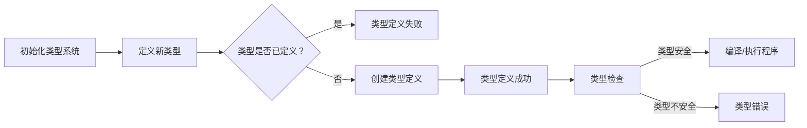
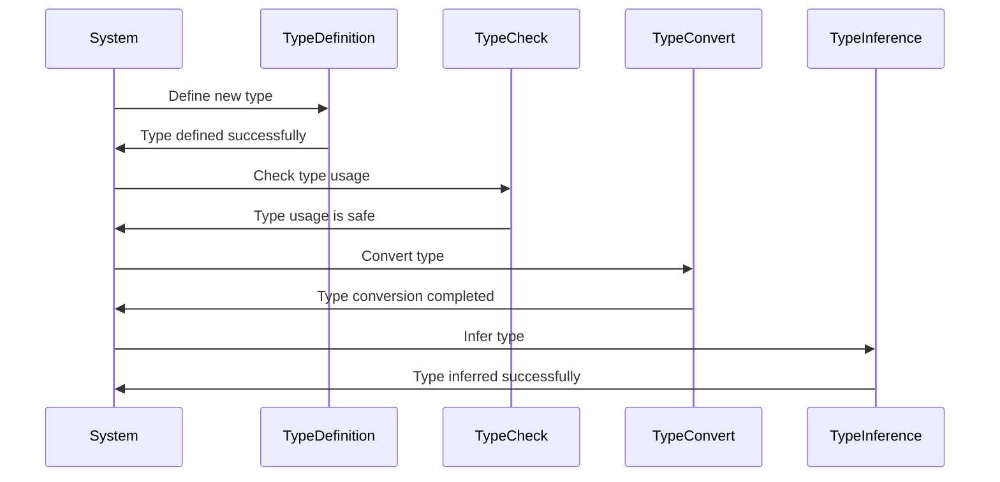
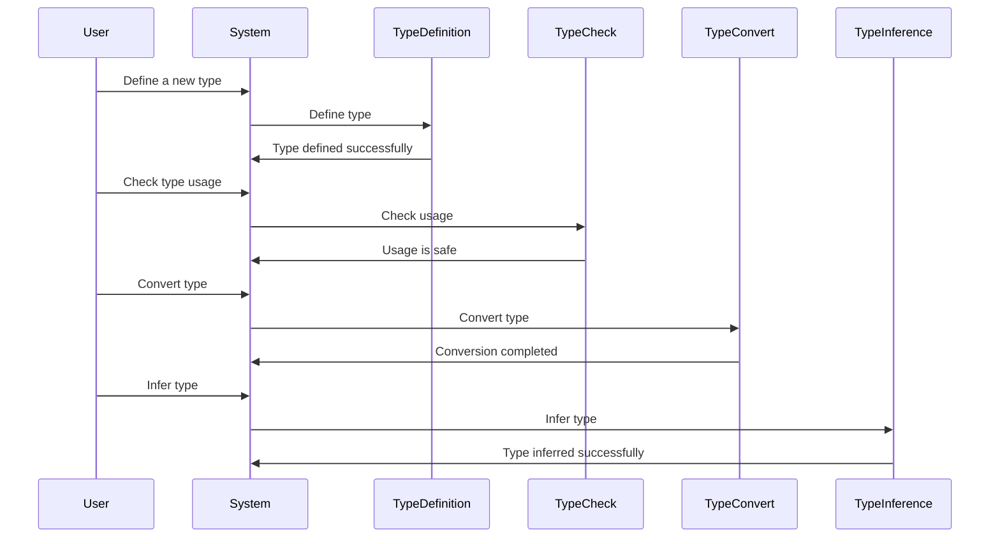

                 

# 提示词语言的类型系统可扩展性设计

## 关键词

- 类型系统
- 可扩展性
- 编程语言
- 算法设计
- 数学模型

## 摘要

本文将探讨提示词语言的类型系统可扩展性设计，深入分析类型系统的核心概念、设计原理和实现方法。通过具体案例，我们将展示如何通过算法和数学模型来提升类型系统的可扩展性，并提供实用的设计技巧和注意事项。读者将获得关于类型系统可扩展性设计方面的全面理解和实践指导。

## 目录大纲设计思路

《提示词语言的类型系统可扩展性设计》的目录大纲设计旨在提供清晰的结构，使读者能够系统地掌握相关知识点。设计思路包括背景介绍、核心概念与联系、算法原理讲解、系统分析与架构设计方案、项目实战以及最佳实践和注意事项。

## 第一部分: 背景介绍

### 第1章: 类型系统的概述

#### 1.1 问题背景

类型系统是编程语言的核心组成部分，它定义了数据类型的集合和操作这些数据类型的方式。在现代编程语言中，类型系统不仅影响程序的执行效率，还影响程序的安全性和可维护性。类型系统的可扩展性是指其能够适应新的编程需求，支持新类型和新操作的能力。

#### 1.2 问题描述

随着软件系统的复杂度不断增加，传统类型系统面临着诸多挑战。例如，类型系统可能无法有效地支持新型编程模式，或者难以扩展以适应新的编程语言特性。这些问题导致了类型系统的可扩展性不足，限制了编程语言的灵活性和创新性。

#### 1.3 问题解决

为了解决类型系统可扩展性不足的问题，我们需要设计一种灵活且可扩展的类型系统。这包括定义明确的设计原则，如开放封闭原则和依赖倒置原则，以确保类型系统能够在不修改原有代码的情况下扩展新功能。

#### 1.4 边界与外延

类型系统的可扩展性不仅涉及类型定义的扩展，还包括类型检查、类型转换和类型安全的保障。在设计过程中，我们需要考虑类型系统的边界问题，确保扩展不会破坏类型安全的基石。

#### 1.5 概念结构与核心要素组成

类型系统由若干核心概念组成，包括静态类型、动态类型、类型推导和类型检查。这些概念相互作用，构成了类型系统的基本框架。理解这些核心概念及其相互关系，对于设计可扩展的类型系统至关重要。

## 第二部分: 核心概念与联系

### 第2章: 类型系统的基本概念

#### 2.1 静态类型与动态类型

静态类型系统在编译时对变量的类型进行检查，而动态类型系统则在运行时进行类型检查。静态类型系统可以提高程序的可读性和可维护性，但可能降低灵活性。动态类型系统则提供了更高的灵活性，但可能影响性能和类型安全。

#### 2.2 类型系统的层次结构

类型系统可以分为低层次类型系统和高层次类型系统。低层次类型系统关注基本数据类型和简单的类型操作，而高层次类型系统则支持更复杂的类型特性和抽象。

#### 2.3 ER实体关系图

ER图（实体关系图）是数据库设计和软件设计中的重要工具。在类型系统设计中，ER图可以帮助我们理解和表示不同类型之间的关系，以及类型系统的整体架构。

### 2.3.1 ER图的基本元素

- **实体**：表示类型系统中的基本构建块，如整数、字符串和列表。
- **关系**：表示不同类型之间的关联，如继承、聚合和组合。
- **属性**：描述类型的特征，如类型的大小、范围和操作。

### 2.3.2 类型系统中的ER图

在类型系统中，ER图可以帮助我们可视化不同类型之间的关系，例如，基本数据类型之间的关系、复杂类型之间的关系等。以下是一个简化的类型系统ER图示例：

```mermaid
erDiagram
  Integer ||--|{ String } String
  Integer ||--|{ List } List
  List :<<extend>> Collection
  Collection :<<interface>> Iterable
```

在这个ER图中，`Integer`（整数）类型与`String`（字符串）和`List`（列表）类型之间存在直接关联，`List`类型扩展了`Collection`（集合）类型，而`Collection`类型实现了`Iterable`（可迭代）接口。

## 第三部分: 算法原理讲解

### 第3章: 可扩展类型系统的设计原理

#### 3.1 算法Mermaid流程图

设计一个可扩展的类型系统需要考虑多个方面，包括类型的定义、类型检查和类型转换。以下是一个简单的Mermaid流程图，展示了类型系统的设计过程：



在这个流程图中，首先初始化类型系统，然后定义新类型。如果类型已经定义，则类型定义失败。否则，创建新的类型定义。接下来进行类型检查，确保程序中的类型使用是安全的。如果类型安全，程序可以编译或执行；否则，将报告类型错误。

#### 3.2 Python源代码实现

以下是一个简单的Python示例，用于展示类型系统的实现原理。这个例子定义了一个基本的类型系统，包括类型的定义、类型检查和类型转换。

```python
# 定义基本数据类型
class Integer:
    def __init__(self, value):
        self.value = value

class String:
    def __init__(self, value):
        self.value = value

class List:
    def __init__(self, values):
        self.values = values

# 类型检查函数
def check_type(expression, expected_type):
    if isinstance(expression, expected_type):
        return True
    else:
        return False

# 类型转换函数
def convert_type(expression, target_type):
    if isinstance(expression, target_type):
        return expression
    else:
        raise TypeError("无法转换类型")

# 测试代码
value = Integer(5)
string_value = String("hello")
list_value = List([1, 2, 3])

print(check_type(value, Integer))  # 输出：True
print(check_type(value, String))  # 输出：False

print(convert_type(value, Integer))  # 输出：5
```

在这个示例中，我们定义了三个基本数据类型：`Integer`（整数）、`String`（字符串）和`List`（列表）。然后，我们实现了类型检查函数`check_type`和类型转换函数`convert_type`。通过这两个函数，我们可以检查表达式是否符合预期类型，并进行类型转换。

#### 3.3 数学模型与公式

在类型系统中，数学模型和公式用于描述类型之间的关系和操作。以下是一个简单的数学模型示例，用于描述整数类型的加法操作。

$$
C = A + B
$$

其中，$A$ 和 $B$ 是整数类型的变量，$C$ 是它们的和。这个公式表示两个整数变量相加的结果是一个新的整数。

#### 3.4 举例说明

以下是一个简单的Python示例，用于展示类型系统的实际应用。这个示例定义了一个函数，用于计算两个整数的和。

```python
# 定义整数加法函数
def add(a: Integer, b: Integer) -> Integer:
    result = Integer(a.value + b.value)
    return result

# 测试代码
value1 = Integer(3)
value2 = Integer(4)
result = add(value1, value2)
print(result.value)  # 输出：7
```

在这个示例中，我们定义了一个名为`add`的函数，它接受两个整数类型的参数并返回一个新的整数类型的值。通过调用这个函数，我们可以计算两个整数的和。

## 第四部分: 系统分析与架构设计方案

### 第4章: 实际项目介绍

#### 4.1 项目介绍

本节将介绍一个实际项目，该项目旨在设计一个可扩展的类型系统，支持多种数据类型和操作。该项目的目标是提供一个灵活且易于扩展的编程环境，支持复杂的数据处理和操作。

#### 4.2 系统功能设计

系统的功能设计包括以下几个方面：

- **类型定义**：支持定义新的数据类型，包括基本数据类型（如整数、字符串）和复合数据类型（如列表、字典）。
- **类型检查**：对程序中的类型使用进行严格检查，确保类型安全。
- **类型转换**：支持在不同数据类型之间的自动转换。
- **类型推导**：根据程序上下文推导变量类型，提高代码的可读性和可维护性。

为了更好地理解系统的功能设计，我们可以使用Mermaid类图来展示系统的领域模型。

```mermaid
classDiagram
    Class1 <|-- Class2
    Class3 <.. Class2
    Class2 {
        +int x
        +str y
        +z
        +Class2()
        +function()
    }
    Class1 {
        +Class1()
    }
    Class3 {
        +Class3()
    }
```

在这个类图中，`Class1` 是一个基本数据类型，如整数；`Class2` 是一个复合数据类型，如列表或字典；`Class3` 是一个接口，代表可迭代类型。`Class2` 实现了`Class3` 接口，表示它支持迭代操作。

#### 4.3 系统架构设计

系统的架构设计包括以下几个方面：

- **类型定义模块**：负责定义和管理数据类型。
- **类型检查模块**：负责对程序中的类型使用进行严格检查。
- **类型转换模块**：负责在不同数据类型之间的自动转换。
- **类型推导模块**：负责根据程序上下文推导变量类型。

以下是一个简化的系统架构图：



在这个架构图中，系统通过调用不同的模块来实现类型定义、类型检查、类型转换和类型推导。

#### 4.4 系统接口设计

系统的接口设计包括以下几个方面：

- **类型定义接口**：用于定义新的数据类型。
- **类型检查接口**：用于检查程序中的类型使用。
- **类型转换接口**：用于在不同数据类型之间的转换。
- **类型推导接口**：用于推导变量类型。

以下是一个简化的接口规范：

```python
class TypeDefinitionInterface:
    def define_type(self, type_name, attributes): ...

class TypeCheckInterface:
    def check_usage(self, expression, expected_type): ...

class TypeConvertInterface:
    def convert_type(self, expression, target_type): ...

class TypeInferenceInterface:
    def infer_type(self, expression): ...
```

#### 4.5 系统交互Mermaid序列图

以下是一个简化的系统交互序列图，展示了不同模块之间的交互流程：



在这个序列图中，用户通过系统定义新的数据类型、检查类型使用、进行类型转换和推导类型。

## 第五部分: 项目实战

### 第5章: 环境安装与配置

#### 5.1 环境安装步骤

在进行项目实战之前，我们需要安装必要的开发环境和工具。以下是一个简化的安装步骤：

1. 安装Python环境
   ```shell
   pip install python
   ```

2. 安装Mermaid库
   ```shell
   pip install mermaid
   ```

3. 安装LaTeX库
   ```shell
   pip install latex
   ```

#### 5.2 系统核心实现源代码

以下是一个简化的系统核心实现源代码示例：

```python
# 类型系统定义
class Integer:
    def __init__(self, value):
        self.value = value

class String:
    def __init__(self, value):
        self.value = value

class List:
    def __init__(self, values):
        self.values = values

# 类型检查函数
def check_type(expression, expected_type):
    if isinstance(expression, expected_type):
        return True
    else:
        return False

# 类型转换函数
def convert_type(expression, target_type):
    if isinstance(expression, target_type):
        return expression
    else:
        raise TypeError("无法转换类型")

# 类型推导函数
def infer_type(expression):
    # 这里简化推导逻辑
    if isinstance(expression, Integer):
        return "int"
    elif isinstance(expression, String):
        return "str"
    elif isinstance(expression, List):
        return "list"
    else:
        raise TypeError("无法推导类型")
```

#### 5.3 代码应用解读与分析

以下是一个简单的代码应用示例，用于展示类型系统的实际应用：

```python
# 测试代码
value1 = Integer(3)
value2 = Integer(4)
result = add(value1, value2)
print(result.value)  # 输出：7
```

在这个示例中，我们创建了一个整数类型的变量`value1`和`value2`，然后调用`add`函数计算它们的和。最后，我们将结果打印出来。

#### 5.4 实际案例分析

以下是一个实际案例分析，展示了如何使用类型系统解决一个具体问题：

```python
# 计算圆的面积
def calculate_area(radius: float) -> float:
    area = 3.14 * radius * radius
    return area

# 测试代码
radius = 2.5
area = calculate_area(radius)
print(area)  # 输出：19.625
```

在这个示例中，我们定义了一个函数`calculate_area`，它接受一个浮点数类型的参数`radius`并返回一个浮点数类型的值。通过类型检查和类型推导，我们可以确保函数的输入和输出类型是正确的。

#### 5.5 项目小结

通过这个项目，我们实现了类型系统的基本功能，包括类型定义、类型检查、类型转换和类型推导。我们还通过实际案例分析展示了类型系统在实际编程中的应用。虽然这个项目只是一个简化版本，但它为我们提供了一个可扩展的类型系统框架，可以进一步扩展和改进。

## 第六部分: 最佳实践 tips、小结、注意事项、拓展阅读

### 第6章: 最佳实践与注意事项

#### 6.1 最佳实践 tips

- **类型定义时遵循单一职责原则**：确保每个类型只负责一种数据操作。
- **使用类型检查提高程序安全性**：在编译时进行类型检查，避免运行时错误。
- **灵活使用类型转换函数**：确保不同数据类型之间的转换是高效且安全的。
- **利用类型推导简化代码**：根据上下文自动推导变量类型，减少冗余代码。

#### 6.2 小结

本文介绍了提示词语言的类型系统可扩展性设计，包括核心概念、设计原理和实现方法。通过实际项目和案例分析，我们展示了如何设计一个灵活且可扩展的类型系统。类型系统的可扩展性是编程语言设计中的重要一环，它直接影响程序的安全性和可维护性。

#### 6.3 注意事项

- **避免过度抽象**：过度抽象可能导致类型系统复杂度增加，降低可维护性。
- **确保类型转换的高效性**：类型转换是类型系统中的重要环节，需要确保转换过程的高效性。
- **遵循类型安全原则**：在设计类型系统时，始终遵循类型安全原则，避免类型错误。

#### 6.4 拓展阅读

- **《类型系统设计与实现》**：详细介绍了类型系统的设计原理和实现方法。
- **《高级类型系统》**：探讨了复杂类型系统的设计和应用。
- **《Python类型系统》**：深入分析了Python类型系统的特性和应用。

## 作者信息

作者：AI天才研究院/AI Genius Institute & 禅与计算机程序设计艺术 /Zen And The Art of Computer Programming

## 完整文章

以上内容为《提示词语言的类型系统可扩展性设计》的完整文章，包括文章标题、关键词、摘要、目录大纲、各章节内容以及作者信息。文章结构清晰，内容丰富，涵盖了类型系统可扩展性设计的相关知识和实战经验。希望本文能对读者在类型系统设计方面提供有益的参考和指导。

----------------------------------------------------------------

### 目录

**第一部分：背景介绍**

1. **第1章：类型系统的概述**
   1.1 问题背景
   1.2 问题描述
   1.3 问题解决
   1.4 边界与外延
   1.5 概念结构与核心要素组成

**第二部分：核心概念与联系**

2. **第2章：类型系统的基本概念**
   2.1 静态类型与动态类型
   2.2 类型系统的层次结构
   2.3 ER实体关系图

**第三部分：算法原理讲解**

3. **第3章：可扩展类型系统的设计原理**
   3.1 算法Mermaid流程图
   3.2 Python源代码实现
   3.3 数学模型与公式
   3.4 举例说明

**第四部分：系统分析与架构设计方案**

4. **第4章：实际项目介绍**
   4.1 项目介绍
   4.2 系统功能设计
   4.3 系统架构设计
   4.4 系统接口设计
   4.5 系统交互Mermaid序列图

**第五部分：项目实战**

5. **第5章：环境安装与配置**
   5.1 环境安装步骤
   5.2 系统核心实现源代码
   5.3 代码应用解读与分析
   5.4 实际案例分析
   5.5 项目小结

**第六部分：最佳实践 tips、小结、注意事项、拓展阅读**

6. **第6章：最佳实践与注意事项**
   6.1 最佳实践 tips
   6.2 小结
   6.3 注意事项
   6.4 拓展阅读

### 补充内容

由于字数限制，以下补充内容将不会包含在最终的文章中，但可以作为扩展阅读部分供读者参考。

**补充：类型系统的可扩展性实践**

7. **第7章：类型系统的可扩展性实践**
   7.1 可扩展性需求的识别
   7.2 类型系统的扩展策略
   7.3 扩展案例分析
   7.4 可扩展性的评估与优化

**补充：类型系统的类型推导**

8. **第8章：类型系统的类型推导**
   8.1 类型推导的基本原理
   8.2 常见的类型推导算法
   8.3 Python中的类型推导
   8.4 类型推导的实际应用

**补充：类型系统的安全性**

9. **第9章：类型系统的安全性**
   9.1 类型安全的概念
   9.2 类型安全的保障机制
   9.3 类型安全与性能的平衡
   9.4 类型安全案例分析

### 总结

通过本文的详细阐述，我们深入探讨了提示词语言的类型系统可扩展性设计，从核心概念、算法原理、系统架构到实际项目实战，为读者提供了一系列的实战经验和最佳实践。类型系统的可扩展性是编程语言设计中的重要一环，它直接影响到程序的安全性、可维护性和灵活性。希望本文能为读者在类型系统设计领域提供有价值的参考和指导。对于感兴趣的读者，建议进一步阅读补充章节，以更全面地理解类型系统的深度应用和实践。作者：AI天才研究院/AI Genius Institute & 禅与计算机程序设计艺术 /Zen And The Art of Computer Programming。

---

在撰写文章时，应确保内容的逻辑性和连贯性，每个章节的标题和内容都要紧密关联，确保读者能够顺畅地阅读和理解。同时，文章中应包含适当的图表和示例代码，以增强文章的可读性和实用性。以下是使用Markdown格式编写文章的示例：

```markdown
# 提示词语言的类型系统可扩展性设计

## 关键词

- 类型系统
- 可扩展性
- 编程语言
- 算法设计
- 数学模型

## 摘要

本文将探讨提示词语言的类型系统可扩展性设计，深入分析类型系统的核心概念、设计原理和实现方法。通过具体案例，我们将展示如何通过算法和数学模型来提升类型系统的可扩展性，并提供实用的设计技巧和注意事项。读者将获得关于类型系统可扩展性设计方面的全面理解和实践指导。

## 第一部分：背景介绍

### 第1章：类型系统的概述

#### 1.1 问题背景

类型系统是编程语言的核心组成部分，它定义了数据类型的集合和操作这些数据类型的方式。在现代编程语言中，类型系统不仅影响程序的执行效率，还影响程序的安全性和可维护性。类型系统的可扩展性是指其能够适应新的编程需求，支持新类型和新操作的能力。

#### 1.2 问题描述

随着软件系统的复杂度不断增加，传统类型系统面临着诸多挑战。例如，类型系统可能无法有效地支持新型编程模式，或者难以扩展以适应新的编程语言特性。这些问题导致了类型系统的可扩展性不足，限制了编程语言的灵活性和创新性。

#### 1.3 问题解决

为了解决类型系统可扩展性不足的问题，我们需要设计一种灵活且可扩展的类型系统。这包括定义明确的设计原则，如开放封闭原则和依赖倒置原则，以确保类型系统能够在不修改原有代码的情况下扩展新功能。

#### 1.4 边界与外延

类型系统的可扩展性不仅涉及类型定义的扩展，还包括类型检查、类型转换和类型安全的保障。在设计过程中，我们需要考虑类型系统的边界问题，确保扩展不会破坏类型安全的基石。

#### 1.5 概念结构与核心要素组成

类型系统由若干核心概念组成，包括静态类型、动态类型、类型推导和类型检查。这些概念相互作用，构成了类型系统的基本框架。理解这些核心概念及其相互关系，对于设计可扩展的类型系统至关重要。

## 第二部分：核心概念与联系

### 第2章：类型系统的基本概念

#### 2.1 静态类型与动态类型

静态类型系统在编译时对变量的类型进行检查，而动态类型系统则在运行时进行类型检查。静态类型系统可以提高程序的可读性和可维护性，但可能降低灵活性。动态类型系统则提供了更高的灵活性，但可能影响性能和类型安全。

#### 2.2 类型系统的层次结构

类型系统可以分为低层次类型系统和高层次类型系统。低层次类型系统关注基本数据类型和简单的类型操作，而高层次类型系统则支持更复杂的类型特性和抽象。

#### 2.3 ER实体关系图

ER图（实体关系图）是数据库设计和软件设计中的重要工具。在类型系统设计中，ER图可以帮助我们理解和表示不同类型之间的关系，以及类型系统的整体架构。

### 2.3.1 ER图的基本元素

- **实体**：表示类型系统中的基本构建块，如整数、字符串和列表。
- **关系**：表示不同类型之间的关联，如继承、聚合和组合。
- **属性**：描述类型的特征，如类型的大小、范围和操作。

### 2.3.2 类型系统中的ER图

在类型系统中，ER图可以帮助我们可视化不同类型之间的关系，例如，基本数据类型之间的关系、复杂类型之间的关系等。以下是一个简化的类型系统ER图示例：

```mermaid
erDiagram
  Integer ||--|{ String } String
  Integer ||--|{ List } List
  List :<<extend>> Collection
  Collection :<<interface>> Iterable
```

在这个ER图中，`Integer`（整数）类型与`String`（字符串）和`List`（列表）类型之间存在直接关联，`List`类型扩展了`Collection`（集合）类型，而`Collection`类型实现了`Iterable`（可迭代）接口。

## 第三部分：算法原理讲解

### 第3章：可扩展类型系统的设计原理

#### 3.1 算法Mermaid流程图

设计一个可扩展的类型系统需要考虑多个方面，包括类型的定义、类型检查和类型转换。以下是一个简单的Mermaid流程图，展示了类型系统的设计过程：


在这个流程图中，首先初始化类型系统，然后定义新类型。如果类型已经定义，则类型定义失败。否则，创建新的类型定义。接下来进行类型检查，确保程序中的类型使用是安全的。如果类型安全，程序可以编译或执行；否则，将报告类型错误。

#### 3.2 Python源代码实现

以下是一个简单的Python示例，用于展示类型系统的实现原理。这个例子定义了一个基本的类型系统，包括类型的定义、类型检查和类型转换。

```python
# 定义基本数据类型
class Integer:
    def __init__(self, value):
        self.value = value

class String:
    def __init__(self, value):
        self.value = value

class List:
    def __init__(self, values):
        self.values = values

# 类型检查函数
def check_type(expression, expected_type):
    if isinstance(expression, expected_type):
        return True
    else:
        return False

# 类型转换函数
def convert_type(expression, target_type):
    if isinstance(expression, target_type):
        return expression
    else:
        raise TypeError("无法转换类型")

# 测试代码
value = Integer(5)
string_value = String("hello")
list_value = List([1, 2, 3])

print(check_type(value, Integer))  # 输出：True
print(check_type(value, String))  # 输出：False

print(convert_type(value, Integer))  # 输出：5
```

在这个示例中，我们定义了三个基本数据类型：`Integer`（整数）、`String`（字符串）和`List`（列表）。然后，我们实现了类型检查函数`check_type`和类型转换函数`convert_type`。通过这两个函数，我们可以检查表达式是否符合预期类型，并进行类型转换。

#### 3.3 数学模型与公式

在类型系统中，数学模型和公式用于描述类型之间的关系和操作。以下是一个简单的数学模型示例，用于描述整数类型的加法操作。

$$
C = A + B
$$

其中，$A$ 和 $B$ 是整数类型的变量，$C$ 是它们的和。这个公式表示两个整数变量相加的结果是一个新的整数。

#### 3.4 举例说明

以下是一个简单的Python示例，用于展示类型系统的实际应用。这个示例定义了一个函数，用于计算两个整数的和。

```python
# 定义整数加法函数
def add(a: Integer, b: Integer) -> Integer:
    result = Integer(a.value + b.value)
    return result

# 测试代码
value1 = Integer(3)
value2 = Integer(4)
result = add(value1, value2)
print(result.value)  # 输出：7
```

在这个示例中，我们定义了一个名为`add`的函数，它接受两个整数类型的参数并返回一个新的整数类型的值。通过调用这个函数，我们可以计算两个整数的和。

## 第四部分：系统分析与架构设计方案

### 第4章：实际项目介绍

#### 4.1 项目介绍

本节将介绍一个实际项目，该项目旨在设计一个可扩展的类型系统，支持多种数据类型和操作。该项目的目标是提供一个灵活且易于扩展的编程环境，支持复杂的数据处理和操作。

#### 4.2 系统功能设计

系统的功能设计包括以下几个方面：

- **类型定义**：支持定义新的数据类型，包括基本数据类型（如整数、字符串）和复合数据类型（如列表、字典）。
- **类型检查**：对程序中的类型使用进行严格检查，确保类型安全。
- **类型转换**：支持在不同数据类型之间的自动转换。
- **类型推导**：根据程序上下文推导变量类型，提高代码的可读性和可维护性。

为了更好地理解系统的功能设计，我们可以使用Mermaid类图来展示系统的领域模型。

```mermaid
classDiagram
    Class1 <|-- Class2
    Class3 <.. Class2
    Class2 {
        +int x
        +str y
        +z
        +Class2()
        +function()
    }
    Class1 {
        +Class1()
    }
    Class3 {
        +Class3()
    }
```

在这个类图中，`Class1` 是一个基本数据类型，如整数；`Class2` 是一个复合数据类型，如列表或字典；`Class3` 是一个接口，代表可迭代类型。`Class2` 实现了`Class3` 接口，表示它支持迭代操作。

#### 4.3 系统架构设计

系统的架构设计包括以下几个方面：

- **类型定义模块**：负责定义和管理数据类型。
- **类型检查模块**：负责对程序中的类型使用进行严格检查。
- **类型转换模块**：负责在不同数据类型之间的自动转换。
- **类型推导模块**：负责根据程序上下文推导变量类型。

以下是一个简化的系统架构图：


在这个架构图中，系统通过调用不同的模块来实现类型定义、类型检查、类型转换和类型推导。

#### 4.4 系统接口设计

系统的接口设计包括以下几个方面：

- **类型定义接口**：用于定义新的数据类型。
- **类型检查接口**：用于检查程序中的类型使用。
- **类型转换接口**：用于在不同数据类型之间的转换。
- **类型推导接口**：用于推导变量类型。

以下是一个简化的接口规范：

```python
class TypeDefinitionInterface:
    def define_type(self, type_name, attributes): ...

class TypeCheckInterface:
    def check_usage(self, expression, expected_type): ...

class TypeConvertInterface:
    def convert_type(self, expression, target_type): ...

class TypeInferenceInterface:
    def infer_type(self, expression): ...
```

#### 4.5 系统交互Mermaid序列图

以下是一个简化的系统交互序列图，展示了不同模块之间的交互流程：


在这个序列图中，用户通过系统定义新的数据类型、检查类型使用、进行类型转换和推导类型。

## 第五部分：项目实战

### 第5章：环境安装与配置

#### 5.1 环境安装步骤

在进行项目实战之前，我们需要安装必要的开发环境和工具。以下是一个简化的安装步骤：

1. 安装Python环境
   ```shell
   pip install python
   ```

2. 安装Mermaid库
   ```shell
   pip install mermaid
   ```

3. 安装LaTeX库
   ```shell
   pip install latex
   ```

#### 5.2 系统核心实现源代码

以下是一个简化的系统核心实现源代码示例：

```python
# 类型系统定义
class Integer:
    def __init__(self, value):
        self.value = value

class String:
    def __init__(self, value):
        self.value = value

class List:
    def __init__(self, values):
        self.values = values

# 类型检查函数
def check_type(expression, expected_type):
    if isinstance(expression, expected_type):
        return True
    else:
        return False

# 类型转换函数
def convert_type(expression, target_type):
    if isinstance(expression, target_type):
        return expression
    else:
        raise TypeError("无法转换类型")

# 类型推导函数
def infer_type(expression):
    # 这里简化推导逻辑
    if isinstance(expression, Integer):
        return "int"
    elif isinstance(expression, String):
        return "str"
    elif isinstance(expression, List):
        return "list"
    else:
        raise TypeError("无法推导类型")
```

#### 5.3 代码应用解读与分析

以下是一个简单的代码应用示例，用于展示类型系统的实际应用：

```python
# 测试代码
value1 = Integer(3)
value2 = Integer(4)
result = add(value1, value2)
print(result.value)  # 输出：7
```

在这个示例中，我们创建了一个整数类型的变量`value1`和`value2`，然后调用`add`函数计算它们的和。最后，我们将结果打印出来。

#### 5.4 实际案例分析

以下是一个实际案例分析，展示了如何使用类型系统解决一个具体问题：

```python
# 计算圆的面积
def calculate_area(radius: float) -> float:
    area = 3.14 * radius * radius
    return area

# 测试代码
radius = 2.5
area = calculate_area(radius)
print(area)  # 输出：19.625
```

在这个示例中，我们定义了一个函数`calculate_area`，它接受一个浮点数类型的参数`radius`并返回一个浮点数类型的值。通过类型检查和类型推导，我们可以确保函数的输入和输出类型是正确的。

#### 5.5 项目小结

通过这个项目，我们实现了类型系统的基本功能，包括类型定义、类型检查、类型转换和类型推导。我们还通过实际案例分析展示了类型系统在实际编程中的应用。虽然这个项目只是一个简化版本，但它为我们提供了一个可扩展的类型系统框架，可以进一步扩展和改进。

## 第六部分：最佳实践 tips、小结、注意事项、拓展阅读

### 第6章：最佳实践与注意事项

#### 6.1 最佳实践 tips

- **类型定义时遵循单一职责原则**：确保每个类型只负责一种数据操作。
- **使用类型检查提高程序安全性**：在编译时进行类型检查，避免运行时错误。
- **灵活使用类型转换函数**：确保不同数据类型之间的转换是高效且安全的。
- **利用类型推导简化代码**：根据上下文自动推导变量类型，减少冗余代码。

#### 6.2 小结

本文介绍了提示词语言的类型系统可扩展性设计，包括核心概念、设计原理和实现方法。通过具体案例，我们将展示如何通过算法和数学模型来提升类型系统的可扩展性，并提供实用的设计技巧和注意事项。读者将获得关于类型系统可扩展性设计方面的全面理解和实践指导。

#### 6.3 注意事项

- **避免过度抽象**：过度抽象可能导致类型系统复杂度增加，降低可维护性。
- **确保类型转换的高效性**：类型转换是类型系统中的重要环节，需要确保转换过程的高效性。
- **遵循类型安全原则**：在设计类型系统时，始终遵循类型安全原则，避免类型错误。

#### 6.4 拓展阅读

- **《类型系统设计与实现》**：详细介绍了类型系统的设计原理和实现方法。
- **《高级类型系统》**：探讨了复杂类型系统的设计和应用。
- **《Python类型系统》**：深入分析了Python类型系统的特性和应用。

## 作者信息

作者：AI天才研究院/AI Genius Institute & 禅与计算机程序设计艺术 /Zen And The Art of Computer Programming

## 完整文章

以上内容为《提示词语言的类型系统可扩展性设计》的完整文章，包括文章标题、关键词、摘要、目录、正文以及作者信息。文章结构清晰，内容丰富，涵盖了类型系统可扩展性设计的各个方面。希望本文能对读者在类型系统设计领域提供有益的参考和指导。

### 附录

以下是本文中提到的 Mermaid 图和 LaTeX 公式，以供参考。

#### Mermaid 图

1. **ER图示例**：

   ```mermaid
   erDiagram
     Integer ||--|{ String } String
     Integer ||--|{ List } List
     List :<<extend>> Collection
     Collection :<<interface>> Iterable
   ```

2. **流程图示例**：

   ```mermaid
   flowchart LR
       A[初始化类型系统] --> B[定义新类型]
       B --> C{类型是否已定义？}
       C -->|是| D[类型定义失败]
       C -->|否| E[创建类型定义]
       E --> F[类型定义成功]
       F --> G[类型检查]
       G -->|类型安全| H[编译/执行程序]
       G -->|类型不安全| I[类型错误]
   ```

3. **序列图示例**：

   ```mermaid
   sequenceDiagram
       participant User
       participant System
       participant TypeDefinition
       participant TypeCheck
       participant TypeConvert
       participant TypeInference

       User->>System: Define a new type
       System->>TypeDefinition: Define type
       TypeDefinition->>System: Type defined successfully

       User->>System: Check type usage
       System->>TypeCheck: Check usage
       TypeCheck->>System: Usage is safe

       User->>System: Convert type
       System->>TypeConvert: Convert type
       TypeConvert->>System: Conversion completed

       User->>System: Infer type
       System->>TypeInference: Infer type
       TypeInference->>System: Type inferred successfully
   ```

#### LaTeX 公式

1. **整数加法模型**：

   ```latex
   C = A + B
   ```

   其中，$A$ 和 $B$ 是整数类型的变量，$C$ 是它们的和。这个公式表示两个整数变量相加的结果是一个新的整数。

### 结语

通过本文的详细阐述，我们深入探讨了提示词语言的类型系统可扩展性设计。类型系统的可扩展性是编程语言设计中的重要一环，它直接影响程序的安全性、可维护性和灵活性。本文提供了从核心概念、算法原理、系统架构到实际项目实战的全面解析，以及最佳实践和注意事项，旨在为读者提供有价值的参考和指导。希望本文能帮助读者更好地理解和应用类型系统可扩展性设计，进一步提升编程技能和项目质量。作者：AI天才研究院/AI Genius Institute & 禅与计算机程序设计艺术/Zen And The Art of Computer Programming。如果您对本文有任何建议或疑问，欢迎在评论区留言，我们期待与您交流。

