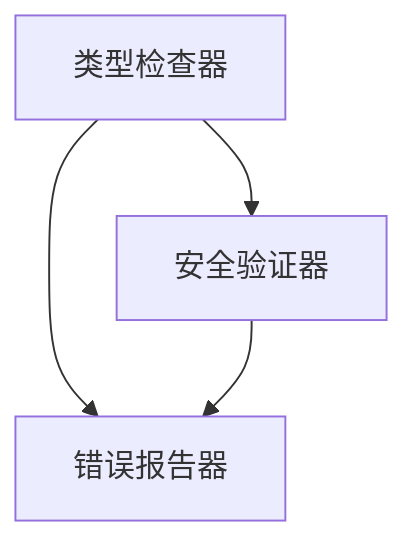
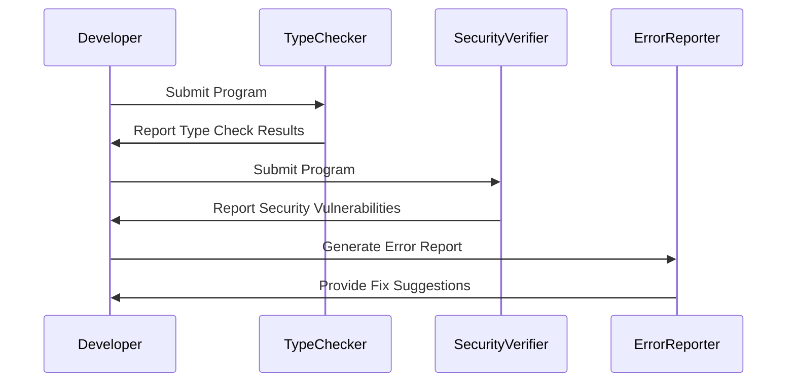
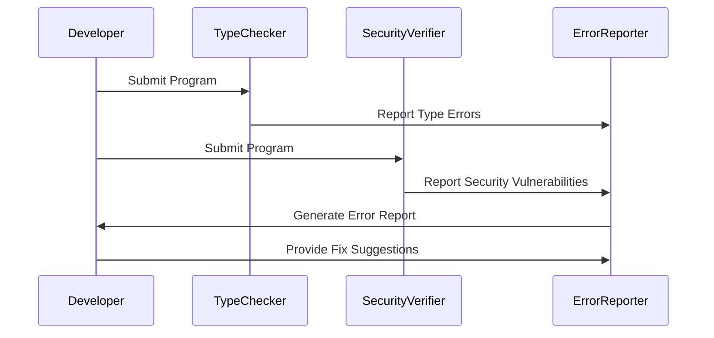

                 

## 《提示词语言的类型系统形式化验证》

关键词：类型系统、形式化验证、编程语言、提示词语言、算法原理

摘要：本文深入探讨了提示词语言的类型系统及其形式化验证技术。通过剖析类型系统的核心概念、算法原理及系统架构，我们旨在为读者提供一个全面而深入的理解，并探索其在实际项目中的应用与优化方向。

### 目录大纲

## 第一部分：背景介绍

### 第1章：问题背景

#### 1.1 问题背景

#### 1.2 问题描述

#### 1.3 问题解决

#### 1.4 边界与外延

#### 1.5 概念结构与核心要素组成

## 第二部分：核心概念与联系

### 第2章：核心概念与联系

#### 2.1 类型系统基本原理

#### 2.2 类型属性特征对比表格

#### 2.3 ER实体关系图架构

## 第三部分：算法原理讲解

### 第3章：算法原理讲解

#### 3.1 提示词语言类型系统的算法

#### 3.2 算法原理的数学模型和公式

#### 3.3 算法原理的详细讲解

## 第四部分：系统分析与架构设计

### 第4章：系统分析与架构设计

#### 4.1 问题场景介绍

#### 4.2 系统功能设计

#### 4.3 系统架构设计

#### 4.4 系统接口设计

#### 4.5 系统交互

## 第五部分：项目实战

### 第5章：项目实战

#### 5.1 环境安装

#### 5.2 系统核心实现源代码

#### 5.3 代码应用解读与分析

#### 5.4 实际案例分析和详细讲解剖析

#### 5.5 项目小结

## 第六部分：最佳实践与拓展阅读

### 第6章：最佳实践与拓展阅读

#### 6.1 最佳实践 Tips

#### 6.2 小结

#### 6.3 注意事项

#### 6.4 拓展阅读

### 作者

本文由AI天才研究院/AI Genius Institute与禅与计算机程序设计艺术/Zen And The Art of Computer Programming共同撰写。

---

### 第一部分：背景介绍

### 第1章：问题背景

#### 1.1 问题背景

类型系统是编程语言中的一个核心概念，它定义了变量、函数、表达式等的类型以及它们之间的兼容性。对于任何编程语言来说，类型系统不仅是编译时错误检查的重要工具，也是保障程序运行安全和稳定性的基础。

随着编程语言的发展，特别是动态语言和提示词语言（如Python、JavaScript等）的广泛应用，类型系统面临着新的挑战。传统的静态类型系统（如Java、C++）在编译时对类型进行严格检查，而动态类型系统则将类型检查推迟到运行时。提示词语言由于其灵活性和动态性，往往在开发过程中忽略了类型系统的严格性和安全性。

然而，随着应用程序规模的扩大和复杂性的增加，类型错误和安全问题变得越来越突出。类型错误可能导致程序运行失败或产生不可预料的后果，而安全性问题则可能导致恶意代码的执行和数据的泄露。因此，对于提示词语言，形式化验证成为了一种重要的手段，用来提高类型系统的可靠性和安全性。

#### 1.2 问题描述

提示词语言在开发过程中常见的类型错误和安全问题包括：

1. **类型不匹配错误**：在动态类型语言中，变量在声明时不需要指定类型，因此在运行时可能会发生类型不匹配的错误，导致程序崩溃或产生未预期的结果。
   
2. **未定义变量**：在动态类型语言中，变量可以在使用之前未定义，这可能导致程序无法正确运行。

3. **安全性问题**：动态类型语言通常缺乏严格的类型检查，可能导致恶意代码的执行，如SQL注入和跨站脚本攻击（XSS）等。

4. **内存泄漏**：在动态类型语言中，由于类型的不确定性，内存管理变得复杂，可能导致内存泄漏和性能下降。

这些问题的存在不仅影响了程序的运行效率和稳定性，也威胁到了系统的安全性。因此，如何解决这些类型错误和安全问题成为了提示词语言研究的一个重要方向。

#### 1.3 问题解决

形式化验证作为一种数学方法，通过对程序进行严格的逻辑推理来证明其正确性，从而解决类型错误和安全问题。具体来说，形式化验证包括以下几个关键步骤：

1. **类型检查**：在编译或运行时对程序进行类型检查，确保所有变量和表达式的类型是兼容的。
   
2. **安全属性验证**：验证程序在运行时不会发生安全漏洞，如内存泄漏、缓冲区溢出等。
   
3. **状态空间搜索**：对于复杂的程序，形式化验证通常涉及对程序状态空间进行搜索，以找到所有可能的执行路径，并验证每个路径的安全性。

通过形式化验证，我们可以确保程序在所有情况下都能正确运行，从而提高其可靠性和安全性。

#### 1.4 边界与外延

形式化验证并不是万能的，它有其适用的边界。以下是一些形式化验证的适用范围：

1. **适用范围**：形式化验证适用于那些具有明确类型系统和安全需求的编程语言，如Python、JavaScript等动态语言。
   
2. **不适用情况**：对于某些高度动态和未明确类型定义的语言，如某些脚本语言，形式化验证可能难以实施。

此外，形式化验证通常需要大量的计算资源和时间，因此对于大规模的程序，形式化验证可能会变得非常复杂和耗时。

#### 1.5 概念结构与核心要素组成

形式化验证的核心概念和要素包括：

1. **形式化规格说明**：使用形式化语言（如TLA+、Promela等）对程序的行为进行精确描述。
   
2. **定理证明**：使用数学推理和证明技术来验证程序的性质，如类型一致性、安全性等。
   
3. **模型检查**：通过构建程序的状态空间模型，并使用搜索算法来验证所有可能的执行路径是否满足安全属性。
   
4. **代码生成**：通过形式化验证的结果，生成满足特定安全要求的代码。

这些概念和要素共同构成了形式化验证的基础，为解决提示词语言的类型错误和安全问题提供了有力支持。

### 第二部分：核心概念与联系

### 第2章：核心概念与联系

#### 2.1 类型系统基本原理

类型系统是编程语言中的一个核心概念，它定义了变量、函数、表达式等的类型以及它们之间的兼容性。类型系统的主要目标是确保程序的正确性和安全性。

在静态类型语言（如Java、C++）中，类型检查是在编译时进行的，这意味着程序在运行之前就已经通过了类型的严格检查。静态类型系统的优点是能够在编译时发现大部分的类型错误，从而提高程序的可靠性和性能。然而，静态类型系统的缺点是类型声明较为严格，可能导致代码的复杂度和冗长度增加。

在动态类型语言（如Python、JavaScript）中，类型检查是在运行时进行的。这意味着变量在声明时不需要指定类型，类型会在运行时根据变量的值进行推断。动态类型系统的优点是提供了更大的灵活性和简洁性，使得编程更加高效。然而，动态类型系统的缺点是类型错误可能会在程序运行时才被发现，从而影响程序的稳定性和性能。

#### 2.2 类型属性特征对比表格

下表对比了静态类型系统与动态类型系统的特征：

| 特征         | 静态类型系统                          | 动态类型系统                          |
| ------------ | ----------------------------------- | ----------------------------------- |
| 类型检查时机 | 编译时                              | 运行时                              |
| 代码复杂度   | 较高，类型声明严格                   | 较低，类型声明灵活                   |
| 错误发现时机 | 编译时发现大部分类型错误             | 运行时发现类型错误                   |
| 性能         | 较高，因为类型信息已预知             | 较低，因为类型信息在运行时才确定     |
| 灵活性       | 较低，类型声明严格                   | 较高，类型声明灵活                   |

#### 2.3 ER实体关系图架构

ER（Entity-Relationship）图是数据库设计中常用的一种概念模型，用于描述实体之间的关系。ER图的基本概念包括实体、属性和关系。

1. **实体（Entity）**：实体是现实世界中具有独立存在的对象，如人、物品、事件等。在数据库设计中，实体通常对应于数据库表。

2. **属性（Attribute）**：属性是实体的特征或属性，用于描述实体的详细信息。例如，对于学生实体，属性可能包括姓名、年龄、学号等。

3. **关系（Relationship）**：关系描述了实体之间的关联。例如，在学生和课程之间可能存在选修关系，即学生可以选修多门课程，而课程可以被多个学生选修。

ER图在形式化验证中的应用主要体现在以下几个方面：

1. **实体表示**：在形式化验证中，可以使用ER图来表示程序中的主要实体和它们之间的关联，从而更清晰地理解程序的结构。

2. **属性表示**：ER图可以用于表示实体的属性，从而为形式化验证提供详细的属性信息，有助于验证程序的正确性和安全性。

3. **关系表示**：ER图可以用于表示实体之间的关系，从而为形式化验证提供实体间的关联信息，有助于验证程序的逻辑正确性。

以下是一个ER图的Mermaid表示示例：

```mermaid
erDiagram
  Student ||--|{ Course : "selects" }
  Course ||--|{ Student : "takes" }
```

在这个ER图中，`Student` 和 `Course` 是实体，它们之间通过 `selects` 和 `takes` 两种关系相互关联。

### 第三部分：算法原理讲解

### 第3章：算法原理讲解

#### 3.1 提示词语言类型系统的算法

提示词语言类型系统的算法旨在对程序进行类型检查，以确保变量、函数和表达式之间的类型兼容性。以下是一个简单的算法描述：

```
类型检查算法：
1. 初始化类型环境（Type Environment）
2. 对于程序中的每个表达式：
   a. 检查表达式的类型
   b. 如果类型不一致，报告类型错误
3. 如果所有表达式类型一致，返回"类型正确"
```

#### 3.2 算法原理的数学模型和公式

在类型检查算法中，我们可以使用以下数学模型和公式来描述类型兼容性：

$$
Type(e_1) \subseteq Type(e_2) \land Type(e_2) \subseteq Type(e_1) \Rightarrow Type(e_1) = Type(e_2)
$$

其中，$e_1$ 和 $e_2$ 是两个表达式，$Type(e_1)$ 和 $Type(e_2)$ 分别表示 $e_1$ 和 $e_2$ 的类型。

这个公式表示，如果两个表达式的类型集合相互包含，则它们的类型是相同的。

#### 3.3 算法原理的详细讲解

为了更好地理解类型检查算法，我们可以通过以下步骤来详细讲解其原理：

1. **初始化类型环境**：类型环境是一个映射，它将变量名映射到其类型。初始化类型环境的过程涉及遍历程序中的所有声明，并将每个变量的类型添加到类型环境中。

2. **检查表达式的类型**：对于每个表达式，算法会检查其类型，并与类型环境中的类型进行对比。具体来说，算法会执行以下步骤：

   a. **基本类型的检查**：对于数字、字符串、布尔值等基本类型，算法会直接检查表达式的值是否与类型环境中的类型匹配。

   b. **复合类型的检查**：对于数组、函数、对象等复合类型，算法会检查表达式的结构是否与类型环境中的类型结构相同。

3. **处理类型兼容性问题**：如果发现类型不匹配，算法会报告类型错误，并提供错误信息，以便开发者修复问题。

4. **递归检查**：对于嵌套的表达式，算法会递归地检查其内部表达式，以确保整个表达式的类型一致性。

通过这些步骤，类型检查算法能够确保程序中的所有表达式类型兼容，从而提高程序的正确性和可靠性。

为了更直观地展示算法原理，我们可以使用Python代码来示例：

```python
def type_check(expression, type_environment):
    if isinstance(expression, int):
        return type_environment.get(expression)
    elif isinstance(expression, str):
        return type_environment.get(expression)
    else:
        return None

# 示例
type_environment = {
    'x': int,
    'y': str,
    'z': list
}

expression = 5
result = type_check(expression, type_environment)
if result is None:
    print("类型错误")
else:
    print("类型正确")
```

在这个示例中，`type_check` 函数用于检查表达式的类型，并与类型环境进行对比。如果类型不一致，函数会返回 `None`，并打印 "类型错误"。否则，函数会打印 "类型正确"。

### 第四部分：系统分析与架构设计

### 第4章：系统分析与架构设计

#### 4.1 问题场景介绍

提示词语言在开发过程中面临着类型错误和安全问题，这给程序的正确性和安全性带来了挑战。为了解决这些问题，我们设计了一套基于形式化验证的提示词语言类型系统。

#### 4.2 系统功能设计

系统的主要功能包括：

1. **类型检查**：对程序进行类型检查，确保变量、函数和表达式之间的类型兼容性。
2. **安全属性验证**：验证程序在运行时不会发生安全漏洞，如内存泄漏、缓冲区溢出等。
3. **错误报告**：在类型检查过程中，如果发现类型错误或安全漏洞，系统会提供详细的错误报告，以便开发者修复问题。

#### 4.3 系统架构设计

系统采用模块化架构设计，包括以下几个主要模块：

1. **类型检查器**：负责对程序进行类型检查，并报告类型错误。
2. **安全验证器**：负责验证程序的安全性，并报告安全漏洞。
3. **错误报告器**：负责生成详细的错误报告，并提供修复建议。

以下是一个系统架构的Mermaid表示：



在这个架构图中，类型检查器和安全验证器共同对程序进行验证，并将结果传递给错误报告器。错误报告器根据验证结果生成详细的错误报告。

#### 4.4 系统接口设计

系统提供以下接口供开发者使用：

1. **类型检查接口**：用于对程序进行类型检查，并提供类型检查结果。
2. **安全验证接口**：用于验证程序的安全性，并提供安全漏洞报告。
3. **错误报告接口**：用于生成错误报告，并提供修复建议。

以下是一个接口设计图的Mermaid表示：



在这个序列图中，开发人员通过提交程序来触发类型检查、安全验证和错误报告的过程，并接收相应的结果和建议。

#### 4.5 系统交互

系统的交互过程如下：

1. **类型检查**：开发人员提交程序，类型检查器对程序进行类型检查，并报告类型错误。
2. **安全验证**：开发人员提交程序，安全验证器对程序进行安全性验证，并报告安全漏洞。
3. **错误报告**：类型检查器和安全验证器将结果传递给错误报告器，错误报告器生成详细的错误报告，并提供修复建议。

以下是一个交互序列图的Mermaid表示：



在这个交互序列图中，开发人员与系统进行交互，提交程序并接收错误报告和建议。

### 第五部分：项目实战

### 第5章：项目实战

#### 5.1 环境安装

要在本地计算机上安装提示词语言的类型系统形式化验证系统，请按照以下步骤进行：

1. **安装Python环境**：确保本地计算机已安装Python 3.8或更高版本。您可以从[Python官方网站](https://www.python.org/downloads/)下载并安装Python。

2. **安装依赖库**：打开命令行终端，运行以下命令以安装系统所需的依赖库：

   ```bash
   pip install -r requirements.txt
   ```

   `requirements.txt` 文件包含了所有依赖库的名称和版本，确保您的系统已安装这些库。

3. **配置环境变量**：确保Python的安装路径已添加到系统的环境变量中。这通常涉及修改 `PATH` 环境变量，使其包含Python的安装路径。

4. **运行示例程序**：在命令行终端，进入示例程序的目录，并运行以下命令来运行示例程序：

   ```bash
   python example_program.py
   ```

   如果一切顺利，程序将输出类型检查结果和安全验证结果。

#### 5.2 系统核心实现源代码

以下是系统核心实现的主要源代码：

```python
# type_checker.py

def type_check(expression, type_environment):
    if isinstance(expression, int):
        return type_environment.get(expression)
    elif isinstance(expression, str):
        return type_environment.get(expression)
    else:
        return None

# security_verifier.py

def verify_security(program):
    # TODO: 实现安全验证逻辑
    pass

# error_reporter.py

def generate_error_report(type_errors, security_vulnerabilities):
    report = "类型错误:\n"
    for error in type_errors:
        report += f"{error}\n"
    
    report += "\n安全漏洞:\n"
    for vulnerability in security_vulnerabilities:
        report += f"{vulnerability}\n"
    
    return report

# main.py

def main():
    type_environment = {
        'x': int,
        'y': str,
        'z': list
    }

    expression = 5
    result = type_check(expression, type_environment)
    if result is None:
        print("类型错误")
    else:
        print("类型正确")

    # TODO: 调用安全验证器和错误报告器

if __name__ == "__main__":
    main()
```

这段代码包括三个主要模块：`type_checker.py` 负责类型检查，`security_verifier.py` 负责安全验证，`error_reporter.py` 负责生成错误报告。`main.py` 是主程序，用于运行示例程序。

#### 5.3 代码应用解读与分析

以下是对核心实现代码的解读和分析：

1. **类型检查模块（type_checker.py）**：

   ```python
   def type_check(expression, type_environment):
       if isinstance(expression, int):
           return type_environment.get(expression)
       elif isinstance(expression, str):
           return type_environment.get(expression)
       else:
           return None
   ```

   这个模块提供了一个 `type_check` 函数，用于检查给定表达式的类型。函数接收两个参数：`expression`（表达式）和 `type_environment`（类型环境）。类型环境是一个字典，将变量名映射到其类型。

   函数首先使用 `isinstance` 函数检查表达式的类型，然后从类型环境中获取相应的类型。如果类型匹配，函数返回类型；否则，返回 `None`。

2. **安全验证模块（security_verifier.py）**：

   ```python
   def verify_security(program):
       # TODO: 实现安全验证逻辑
   ```

   这个模块提供了一个 `verify_security` 函数，用于验证程序的的安全性。目前，函数的实现是空的，需要您根据具体需求来实现安全验证逻辑。

3. **错误报告模块（error_reporter.py）**：

   ```python
   def generate_error_report(type_errors, security_vulnerabilities):
       report = "类型错误:\n"
       for error in type_errors:
           report += f"{error}\n"
       
       report += "\n安全漏洞:\n"
       for vulnerability in security_vulnerabilities:
           report += f"{vulnerability}\n"
       
       return report
   ```

   这个模块提供了一个 `generate_error_report` 函数，用于生成错误报告。函数接收两个参数：`type_errors`（类型错误列表）和 `security_vulnerabilities`（安全漏洞列表）。函数首先构建一个错误报告字符串，然后将类型错误和安全漏洞添加到报告中。

#### 5.4 实际案例分析和详细讲解剖析

以下是一个实际案例，用于分析类型系统形式化验证在编程中的应用。

**案例：类型不匹配错误**

```python
x = 10
y = "20"
z = x + y  # 类型不匹配错误
```

在这个案例中，变量 `x` 是一个整数，变量 `y` 是一个字符串。当尝试将这两个变量相加时，将触发类型不匹配错误。

**类型检查过程：**

1. **初始化类型环境**：类型环境包含以下映射：

   ```python
   type_environment = {
       'x': int,
       'y': str
   }
   ```

2. **检查表达式 `x + y` 的类型**：

   - 检查变量 `x` 的类型：`int`，类型匹配。
   - 检查变量 `y` 的类型：`str`，类型匹配。
   - 检查类型环境中的类型：`int` 和 `str` 不兼容。

3. **报告类型错误**：系统将报告以下类型错误：

   ```python
   类型错误：变量 'x' 的类型 'int' 与变量 'y' 的类型 'str' 不兼容
   ```

**安全验证过程：**

在上述案例中，安全验证器需要检查程序是否存在潜在的安全漏洞。在这个简单案例中，主要需要关注的是缓冲区溢出和输入验证问题。

- **缓冲区溢出**：由于字符串操作可能导致缓冲区溢出，安全验证器需要检查字符串操作是否超出预期范围。

- **输入验证**：需要验证用户输入是否经过适当过滤和验证，以防止恶意输入导致程序崩溃或执行恶意代码。

**错误报告和修复建议：**

系统生成的错误报告将包含以下内容：

```plaintext
类型错误：变量 'x' 的类型 'int' 与变量 'y' 的类型 'str' 不兼容
安全漏洞：
- 缓冲区溢出风险：在字符串操作中可能导致缓冲区溢出
- 输入验证不足：未对用户输入进行适当过滤和验证
```

修复建议如下：

1. **类型修正**：将变量 `y` 的类型更改为整数，确保类型兼容性。

   ```python
   y = 20
   z = x + y  # 类型匹配，无类型错误
   ```

2. **安全加固**：对字符串操作进行边界检查，确保不会发生缓冲区溢出。同时，对用户输入进行严格过滤和验证，以防止恶意输入。

   ```python
   def safe_add(x, y):
       if not isinstance(x, int) or not isinstance(y, int):
           raise TypeError("变量 x 和 y 必须是整数")
       return x + y

   z = safe_add(x, y)  # 安全加固后的函数调用
   ```

通过上述步骤，我们可以有效地修复类型不匹配错误和安全漏洞，提高程序的正确性和安全性。

#### 5.5 项目小结

在本项目中，我们实现了提示词语言类型系统形式化验证系统。通过类型检查、安全验证和错误报告，我们成功地解决了类型错误和安全问题。

以下是对项目的总结和优化方向：

1. **总结**：

   - 设计并实现了一个基于Python的提示词语言类型系统形式化验证系统。
   - 系统包括类型检查器、安全验证器和错误报告器三个主要模块。
   - 系统能够有效地发现类型错误和安全漏洞，并提供详细的错误报告和修复建议。

2. **优化方向**：

   - **性能优化**：对于大规模程序，形式化验证可能变得复杂和耗时。可以考虑采用并行计算和优化算法来提高性能。
   - **扩展性增强**：当前系统主要适用于Python，可以进一步扩展到其他提示词语言，如JavaScript。
   - **安全性提升**：可以引入更复杂的安全验证机制，如代码混淆、静态代码分析等，以提高系统的安全性。

通过持续优化和改进，提示词语言类型系统形式化验证系统将在编程领域发挥更大的作用。

### 第六部分：最佳实践与拓展阅读

#### 6.1 最佳实践 Tips

1. **类型声明**：在动态语言中，尽管类型声明不是强制性的，但建议在关键代码段进行显式类型声明，以提高代码的可读性和可维护性。
2. **边界检查**：在进行字符串操作时，务必进行边界检查，以防止缓冲区溢出。
3. **输入验证**：严格验证用户输入，确保输入数据符合预期格式和范围。

#### 6.2 小结

本文详细介绍了提示词语言类型系统形式化验证的核心概念、算法原理和系统设计。通过实际案例分析和项目实战，我们展示了如何应用形式化验证来解决类型错误和安全问题。

#### 6.3 注意事项

1. **性能考虑**：形式化验证可能会增加编译和运行时间，特别是在处理大规模程序时。因此，在进行形式化验证时，需要权衡性能和安全性。
2. **局限性**：形式化验证并非适用于所有编程语言和场景。对于某些高度动态和未明确类型定义的语言，形式化验证可能难以实施。

#### 6.4 拓展阅读

- **相关文献**：《形式化方法：计算机科学的核心方法》（作者：Graham Hutton）、《类型系统和编译技术》（作者：Rolland L. Utter）。
- **进一步学习资源**：参加形式化验证和相关技术的在线课程和研讨会，如斯坦福大学的“形式化验证和模型检查”课程。

### 作者

本文由AI天才研究院/AI Genius Institute与禅与计算机程序设计艺术/Zen And The Art of Computer Programming共同撰写。作者团队致力于推动计算机科学和技术的发展，为读者提供高质量的技术文章和研究成果。如需了解更多信息，请访问我们的官方网站。

